# Ünite 01 · Escaping monolithic hell — Monolitik çıkmazdan kurtulmak

**Amaç:** Kaynak bölümünü İngilizce–Türkçe karşılaştırarak okumak; monolitik mimari, mikroservisler, ölçekleme ve örüntü dili arasındaki bağlantıları anlamak.

**Kaynak:** Kullanıcının sağladığı *Microservices Patterns*, bölüm 1; `Microservices_Patterns_1_Bolumden_Itibaren.pdf`, PDF sayfaları 1–32. Paragraf sırası ve bölüm numaraları korunmuştur. Kaynak sayfa sonunda bölünen paragraflar birleştirilmiştir. Grafikler kaynak PDF’den 240 dpi çözünürlükte, üzerlerindeki İngilizce yazılar değiştirilmeden alınmıştır. Şekil açıklamaları iki dildedir.

**Okuma notu:** Kaynaktaki “bugün”, şirket örnekleri ve teknoloji karşılaştırmaları kitabın yazıldığı dönemin anlatımıdır. Bunlar güncel bir ürün veya mimari seçimi önerisi olarak güncellenmemiştir. “Editör notu”, “Teknik not” ve son tekrar bölümü kaynak metinden ayrı çalışma ekleridir.

**Dil çalışması:** [Ünite sözlüğü](vocabulary.md) · [Vocabulary PDF](vocabulary.pdf) · [Grammar notları](grammar_notes.md) · [Grammar PDF](grammar_notes.pdf). Uzun dil açıklamaları bu belgelerde tutulmuştur.

## Escaping monolithic hell — Monolitik çıkmazdan kurtulmak

<!-- source-pages: 1 -->

### This chapter covers — Bu bölümün kapsamı

> **English:** The symptoms of monolithic hell and how to escape it by adopting the microservice architecture
>
> **Türkçe:** Monolithic hell (monolitik çıkmaz) belirtileri ve microservice architecture (mikroservis mimarisi) benimsenerek bu çıkmazdan nasıl kurtulunacağı.

> **English:** The essential characteristics of the microservice architecture and its benefits and drawbacks
>
> **Türkçe:** Mikroservis mimarisinin temel özellikleri, yararları ve dezavantajları.

> **English:** How microservices enable the DevOps style of development of large, complex applications
>
> **Türkçe:** Mikroservislerin büyük ve karmaşık uygulamaların DevOps yaklaşımıyla geliştirilmesini nasıl mümkün kıldığı.

> **English:** The microservice architecture pattern language and why you should use it
>
> **Türkçe:** Mikroservis mimarisi pattern language (örüntü dili) ve bu dili neden kullanmanız gerektiği.

> **English:** It was only Monday lunchtime, but Mary, the CTO of Food to Go, Inc. (FTGO), was already feeling frustrated. Her day had started off really well. She had spent the previous week with other software architects and developers at an excellent conference learning about the latest software development techniques, including continuous deployment and the microservice architecture. Mary had also met up with her former computer science classmates from North Carolina A&T State and shared technology leadership war stories. The conference had left her feeling empowered and eager to improve how FTGO develops software.
>
> **Türkçe:** Henüz pazartesi öğle vaktiydi ama Food to Go, Inc. (FTGO) şirketinin CTO’su, yani teknolojiden sorumlu üst yöneticisi Mary, şimdiden hayal kırıklığına uğramıştı. Oysa günü çok iyi başlamıştı. Önceki haftayı diğer yazılım mimarları ve geliştiricilerle birlikte harika bir konferansta geçirmiş; continuous deployment (sürekli dağıtım) ve mikroservis mimarisi dâhil en yeni yazılım geliştirme tekniklerini öğrenmişti. Mary ayrıca North Carolina A&T State’te bilgisayar bilimi okurken birlikte eğitim aldığı eski sınıf arkadaşlarıyla buluşmuş ve teknoloji yöneticiliğinde yaşadıkları zorlu deneyimleri paylaşmıştı. Konferans, kendine güvenini artırmış ve FTGO’nun yazılım geliştirme biçimini iyileştirme isteğini güçlendirmişti.

<!-- source-pages: 2 -->

> **English:** Unfortunately, that feeling had quickly evaporated. She had just spent the first morning back in the office in yet another painful meeting with senior engineering and business people. They had spent two hours discussing why the development team was going to miss another critical release date. Sadly, this kind of meeting had become increasingly common over the past few years. Despite adopting agile, the pace of development was slowing down, making it next to impossible to meet the business’s goals. And, to make matters worse, there didn’t seem to be a simple solution.
>
> **Türkçe:** Ne yazık ki bu duygu çabucak kaybolmuştu. Ofise döndüğü ilk sabahı, üst düzey mühendislik ve iş birimi yöneticileriyle yapılan bir başka sıkıntılı toplantıda geçirmişti. İki saat boyunca geliştirme ekibinin önemli bir sürüm tarihini neden yine kaçıracağını tartışmışlardı. Üzücü olan, bu tür toplantıların son birkaç yılda giderek sıklaşmasıydı. Agile (çevik geliştirme) benimsenmiş olmasına rağmen geliştirme hızı düşüyor, bu da şirketin hedeflerine ulaşmayı neredeyse imkânsız hâle getiriyordu. Üstelik ortada basit bir çözüm de görünmüyordu.

> **English:** The conference had made Mary realize that FTGO was suffering from a case of monolithic hell and that the cure was to adopt the microservice architecture. But the microservice architecture and the associated state-of-the-art software development practices described at the conference felt like an elusive dream. It was unclear to Mary how she could fight today’s fires while simultaneously improving the way software was developed at FTGO.
>
> **Türkçe:** Konferans, Mary’nin FTGO’nun monolitik çıkmaza girdiğini ve çözümün mikroservis mimarisini benimsemek olduğunu fark etmesini sağlamıştı. Ancak konferansta anlatılan mikroservis mimarisi ve onunla bağlantılı en ileri yazılım geliştirme uygulamaları, ulaşılması güç bir hayal gibi geliyordu. Mary, bir yandan günün acil sorunlarıyla uğraşırken diğer yandan FTGO’daki yazılım geliştirme biçimini nasıl iyileştirebileceğini bilmiyordu.

> **English:** Fortunately, as you will learn in this book, there is a way. But first, let’s look at the problems that FTGO is facing and how they got there.
>
> **Türkçe:** Neyse ki bu kitapta öğreneceğiniz gibi bir yol var. Ama önce FTGO’nun karşı karşıya olduğu sorunlara ve bu noktaya nasıl geldiğine bakalım.

## 1.1 The slow march toward monolithic hell — Monolitik çıkmaza doğru yavaş ilerleyiş

> **English:** Since its launch in late 2005, FTGO had grown by leaps and bounds. Today, it’s one of the leading online food delivery companies in the United States. The business even plans to expand overseas, although those plans are in jeopardy because of delays in implementing the necessary features.
>
> **Türkçe:** FTGO, 2005’in sonlarında faaliyete geçmesinden bu yana çok hızlı büyümüştü. Bugün Amerika Birleşik Devletleri’nin önde gelen çevrim içi yemek teslimatı şirketlerinden biridir. Şirket yurt dışına açılmayı bile planlamaktadır; ancak gerekli özelliklerin geliştirilmesindeki gecikmeler bu planları tehlikeye atmaktadır.

> **English:** At its core, the FTGO application is quite simple. Consumers use the FTGO website or mobile application to place food orders at local restaurants. FTGO coordinates a network of couriers who deliver the orders. It’s also responsible for paying couriers and restaurants. Restaurants use the FTGO website to edit their menus and manage orders. The application uses various web services, including Stripe for payments, Twilio for messaging, and Amazon Simple Email Service (SES) for email.
>
> **Türkçe:** Özünde FTGO uygulaması oldukça basittir. Tüketiciler, yerel restoranlardan yemek sipariş etmek için FTGO’nun web sitesini veya mobil uygulamasını kullanır. FTGO, siparişleri teslim eden kurye ağını koordine eder. Kuryelere ve restoranlara ödeme yapmaktan da sorumludur. Restoranlar menülerini düzenlemek ve siparişleri yönetmek için FTGO web sitesini kullanır. Uygulama; ödemeler için Stripe, mesajlaşma için Twilio ve e-posta için Amazon Simple Email Service (SES) dâhil çeşitli web servislerinden yararlanır.

> **English:** Like many other aging enterprise applications, the FTGO application is a monolith, consisting of a single Java Web Application Archive (WAR) file. Over the years, it has become a large, complex application. Despite the best efforts of the FTGO development team, it’s become an example of the Big Ball of Mud pattern (www.laputan.org/mud/). To quote Foote and Yoder, the authors of that pattern, it’s a “haphazardly structured, sprawling, sloppy, duct-tape and bailing wire, spaghetti code jungle.” The pace of software delivery has slowed. To make matters worse, the FTGO application has been written using some increasingly obsolete frameworks. The FTGO application is exhibiting all the symptoms of monolithic hell.
>
> **Türkçe:** Yaşlanan diğer birçok kurumsal uygulama gibi FTGO da tek bir Java Web Application Archive (WAR) dosyasından oluşan bir monolith’tir (monolitik uygulama). Yıllar içinde büyük ve karmaşık bir uygulamaya dönüşmüştür. FTGO geliştirme ekibinin bütün çabasına rağmen Big Ball of Mud (Büyük Çamur Yığını) örüntüsünün bir örneği hâline gelmiştir (www.laputan.org/mud/). Örüntünün yazarları Foote ve Yoder’ın ifadesiyle bu, “gelişigüzel yapılandırılmış, her yana yayılmış, özensiz, bant ve telle bir arada tutulan bir spagetti kod ormanıdır.” Yazılım teslim hızı düşmüştür. Daha da kötüsü, FTGO uygulaması giderek eskiyen bazı framework’ler kullanılarak yazılmıştır. Uygulama, monolitik çıkmazın bütün belirtilerini göstermektedir.

> **English:** The next section describes the architecture of the FTGO application. Then it talks about why the monolithic architecture worked well initially. We’ll get into how the FTGO application has outgrown its architecture and how that has resulted in monolithic hell.
>
> **Türkçe:** Bir sonraki kısım FTGO uygulamasının mimarisini anlatıyor. Ardından monolitik mimarinin başlangıçta neden iyi çalıştığını ele alıyor. FTGO uygulamasının büyüyerek mimarisinin sınırlarını nasıl aştığını ve bunun nasıl monolitik çıkmaza yol açtığını inceleyeceğiz.

<!-- source-pages: 3 -->

### 1.1.1 The architecture of the FTGO application — FTGO uygulamasının mimarisi

> **English:** FTGO is a typical enterprise Java application. Figure 1.1 shows its architecture. The FTGO application has a hexagonal architecture, which is an architectural style described in more detail in chapter 2. In a hexagonal architecture, the core of the application consists of the business logic. Surrounding the business logic are various adapters that implement UIs and integrate with external systems.
>
> **Türkçe:** FTGO, tipik bir kurumsal Java uygulamasıdır. Şekil 1.1 uygulamanın mimarisini gösterir. FTGO, 2. bölümde daha ayrıntılı anlatılan hexagonal architecture (altıgen mimari) stilini kullanır. Altıgen mimaride uygulamanın çekirdeğini business logic (iş mantığı) oluşturur. İş mantığının çevresinde, kullanıcı arayüzlerini gerçekleştiren ve dış sistemlerle bütünleşmeyi sağlayan çeşitli adapter’lar (uyarlayıcılar) bulunur.

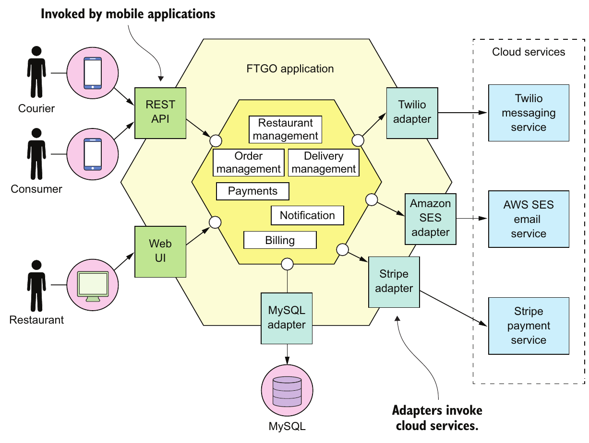

> **English:** Figure 1.1 The FTGO application has a hexagonal architecture. It consists of business logic surrounded by adapters that implement UIs and interface with external systems, such as mobile applications and cloud services for payments, messaging, and email.
>
> **Türkçe:** Şekil 1.1 FTGO uygulaması altıgen mimariye sahiptir. İş mantığı; kullanıcı arayüzlerini gerçekleştiren ve mobil uygulamalar ile ödeme, mesajlaşma ve e-posta için kullanılan bulut servisleri gibi dış sistemlerle iletişim kuran adapter’larla çevrilidir.

> **English:** The business logic consists of modules, each of which is a collection of domain objects. Examples of the modules include Order Management, Delivery Management, Billing, and Payments. There are several adapters that interface with the external systems. Some are inbound adapters, which handle requests by invoking the business logic, including the REST API and Web UI adapters. Others are outbound adapters, which enable the business logic to access the MySQL database and invoke cloud services such as Twilio and Stripe.
>
> **Türkçe:** İş mantığı, her biri bir domain object (iş alanı nesnesi) topluluğu olan modüllerden oluşur. Order Management (sipariş yönetimi), Delivery Management (teslimat yönetimi), Billing (faturalandırma) ve Payments (ödemeler) bu modüllere örnektir. Dış sistemlerle iletişim kuran birkaç adapter vardır. REST API ve Web UI adapter’ları dâhil bazıları, iş mantığını çağırarak gelen istekleri işleyen inbound adapter’lardır (giriş uyarlayıcıları). Diğerleri ise iş mantığının MySQL veritabanına erişmesini ve Twilio ile Stripe gibi bulut servislerini çağırmasını sağlayan outbound adapter’lardır (çıkış uyarlayıcıları).

<!-- source-pages: 3–4 -->

> **English:** Despite having a logically modular architecture, the FTGO application is packaged as a single WAR file. The application is an example of the widely used monolithic style of software architecture, which structures a system as a single executable or deployable component. If the FTGO application were written in the Go language (GoLang), it would be a single executable. A Ruby or NodeJS version of the application would be a single directory hierarchy of source code. The monolithic architecture isn’t inherently bad. The FTGO developers made a good decision when they picked monolithic architecture for their application.
>
> **Türkçe:** Mantıksal olarak modüler bir mimariye sahip olmasına rağmen FTGO uygulaması tek bir WAR dosyası olarak paketlenir. Uygulama, sistemi tek bir çalıştırılabilir veya dağıtılabilir bileşen olarak yapılandıran, yaygın kullanılan monolitik yazılım mimarisi stiline örnektir. FTGO uygulaması Go (GoLang) dilinde yazılsaydı tek bir çalıştırılabilir dosyadan oluşurdu. Ruby veya NodeJS sürümü ise kaynak kodu içeren tek bir dizin ağacı olurdu. Monolitik mimari doğası gereği kötü değildir. FTGO geliştiricileri, uygulamaları için monolitik mimariyi seçerken doğru bir karar vermişti.

### 1.1.2 The benefits of the monolithic architecture — Monolitik mimarinin yararları

> **English:** In the early days of FTGO, when the application was relatively small, the application’s monolithic architecture had lots of benefits:
>
> **Türkçe:** FTGO’nun ilk dönemlerinde, uygulama görece küçükken monolitik mimarisinin pek çok yararı vardı:

> **English:** Simple to develop—IDEs and other developer tools are focused on building a single application.
>
> **Türkçe:** Geliştirmesi basittir—IDE’ler ve diğer geliştirici araçları, tek bir uygulama geliştirmeye odaklanır.

> **English:** Easy to make radical changes to the application—You can change the code and the database schema, build, and deploy.
>
> **Türkçe:** Uygulamada köklü değişiklikler yapmak kolaydır—Kodu ve veritabanı şemasını değiştirip uygulamayı derleyebilir ve dağıtabilirsiniz.

> **English:** Straightforward to test—The developers wrote end-to-end tests that launched the application, invoked the REST API, and tested the UI with Selenium.
>
> **Türkçe:** Test etmesi kolaydır—Geliştiriciler, uygulamayı başlatan, REST API’yi çağıran ve kullanıcı arayüzünü Selenium ile test eden end-to-end test’ler (uçtan uca testler) yazmıştı.

> **English:** Straightforward to deploy—All a developer had to do was copy the WAR file to a server that had Tomcat installed.
>
> **Türkçe:** Dağıtımı kolaydır—Geliştiricinin yapması gereken tek şey, WAR dosyasını Tomcat kurulu bir sunucuya kopyalamaktı.

> **English:** Easy to scale—FTGO ran multiple instances of the application behind a load balancer.
>
> **Türkçe:** Ölçeklemesi kolaydır—FTGO, bir load balancer (yük dengeleyici) arkasında uygulamanın birden fazla instance’ını (çalışan örneğini) çalıştırıyordu.

> **English:** Over time, though, development, testing, deployment, and scaling became much more difficult. Let’s look at why.
>
> **Türkçe:** Ancak zamanla geliştirme, test, dağıtım ve ölçekleme çok daha zor hâle geldi. Nedenine bakalım.

### 1.1.3 Living in monolithic hell — Monolitik çıkmazda yaşamak

> **English:** Unfortunately, as the FTGO developers have discovered, the monolithic architecture has a huge limitation. Successful applications like the FTGO application have a habit of outgrowing the monolithic architecture. Each sprint, the FTGO development team implemented a few more stories, which made the code base larger. Moreover, as the company became more successful, the size of the development team steadily grew. Not only did this increase the growth rate of the code base, it also increased the management overhead.
>
> **Türkçe:** Ne yazık ki FTGO geliştiricilerinin keşfettiği gibi monolitik mimarinin büyük bir sınırlaması vardır. FTGO gibi başarılı uygulamalar, büyüdükçe monolitik mimarinin sınırlarını aşma eğilimindedir. FTGO geliştirme ekibi her sprint’te birkaç user story (kullanıcı hikâyesi) daha gerçekleştiriyor, bu da kod tabanını büyütüyordu. Ayrıca şirket daha başarılı oldukça geliştirme ekibi de düzenli olarak büyüyordu. Bu durum yalnızca kod tabanının büyüme hızını artırmakla kalmıyor, ek yönetim yükünü de artırıyordu.

> **English:** As figure 1.2 shows, the once small, simple FTGO application has grown over the years into a monstrous monolith. Similarly, the small development team has now become multiple Scrum teams, each of which works on a particular functional area. As a result of outgrowing its architecture, FTGO is in monolithic hell. Development is slow and painful. Agile development and deployment is impossible. Let’s look at why this has happened.
>
> **Türkçe:** Şekil 1.2’nin gösterdiği gibi, bir zamanlar küçük ve basit olan FTGO uygulaması yıllar içinde devasa bir monolite dönüşmüştür. Benzer biçimde küçük geliştirme ekibi, her biri belirli bir işlevsel alanda çalışan birden fazla Scrum ekibine dönüşmüştür. Uygulama, mimarisinin sınırlarını aştığı için FTGO monolitik çıkmazdadır. Geliştirme yavaş ve sancılıdır. Çevik geliştirme ve dağıtım imkânsız hâle gelmiştir. Bunun neden yaşandığına bakalım.

#### Complexity intimidates developers — Karmaşıklık geliştiricilerin gözünü korkutur

> **English:** A major problem with the FTGO application is that it’s too complex. It’s too large for any developer to fully understand. As a result, fixing bugs and correctly implementing new features have become difficult and time consuming. Deadlines are missed.
>
> **Türkçe:** FTGO uygulamasının önemli sorunlarından biri aşırı karmaşık olmasıdır. Herhangi bir geliştiricinin tamamını anlayamayacağı kadar büyüktür. Sonuç olarak hataları düzeltmek ve yeni özellikleri doğru biçimde gerçekleştirmek zor ve zaman alıcı hâle gelmiştir. Teslim tarihleri kaçırılmaktadır.

<!-- source-pages: 5 -->

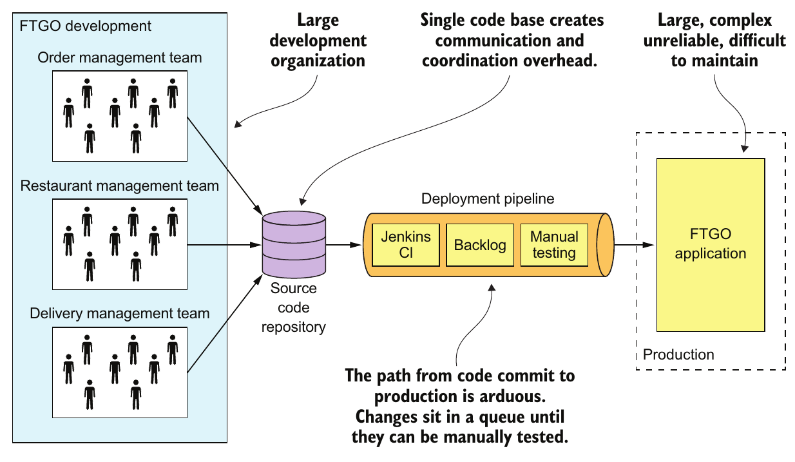

> **English:** Figure 1.2 A case of monolithic hell. The large FTGO developer team commits their changes to a single source code repository. The path from code commit to production is long and arduous and involves manual testing. The FTGO application is large, complex, unreliable, and difficult to maintain.
>
> **Türkçe:** Şekil 1.2 Bir monolitik çıkmaz örneği. Büyük FTGO geliştirici ekibi, değişikliklerini tek bir kaynak kod deposuna commit eder. Kodun commit edilmesinden production’a (üretim ortamına) çıkmasına kadar uzanan yol uzun ve zahmetlidir; elle test adımları içerir. FTGO uygulaması büyük, karmaşık, güvenilirliği düşük ve bakımı zordur.

> **English:** To make matters worse, this overwhelming complexity tends to be a downward spiral. If the code base is difficult to understand, a developer won’t make changes correctly. Each change makes the code base incrementally more complex and harder to understand. The clean, modular architecture shown earlier in figure 1.1 doesn’t reflect reality. FTGO is gradually becoming a monstrous, incomprehensible, big ball of mud.
>
> **Türkçe:** Daha da kötüsü, bu baş edilmesi güç karmaşıklık giderek kötüleşen bir kısır döngüye dönüşme eğilimindedir. Kod tabanını anlamak zorsa geliştirici değişiklikleri doğru yapamaz. Her değişiklik, kod tabanını biraz daha karmaşık ve anlaşılması daha zor hâle getirir. Daha önce Şekil 1.1’de gösterilen temiz ve modüler mimari artık gerçeği yansıtmamaktadır. FTGO yavaş yavaş devasa ve anlaşılmaz bir büyük çamur yığınına dönüşmektedir.

> **English:** Mary remembers recently attending a conference where she met a developer who was writing a tool to analyze the dependencies between the thousands of JARs in their multimillion lines-of-code (LOC) application. At the time, that tool seemed like something FTGO could use. Now she’s not so sure. Mary suspects a better approach is to migrate to an architecture that is better suited to a complex application: microservices.
>
> **Türkçe:** Mary, yakın zamanda katıldığı bir konferansta tanıştığı bir geliştiriciyi hatırlar. Bu geliştirici, milyonlarca lines of code (LOC, kod satırı) içeren uygulamalarındaki binlerce JAR arasındaki bağımlılıkları analiz eden bir araç yazıyordu. O sırada bu araç FTGO’nun da kullanabileceği bir şey gibi görünmüştü. Şimdi bundan pek emin değildir. Mary, karmaşık bir uygulamaya daha uygun bir mimariye, yani mikroservislere geçmenin daha iyi bir yaklaşım olabileceğini düşünmektedir.

#### Development is slow — Geliştirme yavaştır

> **English:** As well as having to fight overwhelming complexity, FTGO developers find day-to-day development tasks slow. The large application overloads and slows down a developer’s IDE. Building the FTGO application takes a long time. Moreover, because it’s so large, the application takes a long time to start up. As a result, the edit-build-run-test loop takes a long time, which badly impacts productivity.
>
> **Türkçe:** FTGO geliştiricileri, baş edilmesi güç karmaşıklıkla mücadele etmenin yanı sıra günlük geliştirme işlerinin de yavaş ilerlediğini görür. Büyük uygulama, geliştiricinin IDE’sini aşırı yükleyerek yavaşlatır. FTGO uygulamasının build işlemi uzun sürer. Üstelik uygulama çok büyük olduğu için başlaması da uzun zaman alır. Sonuç olarak edit-build-run-test (düzenle–derle–çalıştır–test et) döngüsü uzar ve bu durum verimliliği ciddi biçimde düşürür.

#### Path from commit to deployment is long and arduous — Commit’ten dağıtıma giden yol uzun ve zahmetlidir

<!-- source-pages: 5–6 -->

> **English:** Another problem with the FTGO application is that deploying changes into production is a long and painful process. The team typically deploys updates to production once a month, usually late on a Friday or Saturday night. Mary keeps reading that the state-of-the-art for Software-as-a-Service (SaaS) applications is continuous deployment: deploying changes to production many times a day during business hours. Apparently, as of 2011, Amazon.com deployed a change into production every 11.6 seconds without ever impacting the user! For the FTGO developers, updating production more than once a month seems like a distant dream. And adopting continuous deployment seems next to impossible.
>
> **Türkçe:** FTGO uygulamasının bir diğer sorunu, değişiklikleri üretim ortamına dağıtmanın uzun ve sancılı bir süreç olmasıdır. Ekip güncellemeleri genellikle ayda bir kez, çoğunlukla cuma veya cumartesi gecesi geç saatlerde üretime çıkarır. Mary, Software-as-a-Service (SaaS, hizmet olarak yazılım) uygulamalarındaki en ileri yaklaşımın continuous deployment olduğunu sürekli okumaktadır: değişiklikleri mesai saatleri içinde günde birçok kez üretime dağıtmak. Aktarıldığına göre Amazon.com, 2011 itibarıyla kullanıcıyı hiç etkilemeden her 11,6 saniyede bir değişikliği üretime dağıtıyordu! FTGO geliştiricileri için üretim ortamını ayda birden fazla güncellemek uzak bir hayal gibi görünmektedir. Sürekli dağıtımı benimsemek ise neredeyse imkânsızdır.

> **English:** FTGO has partially adopted agile. The engineering team is divided into squads and uses two-week sprints. Unfortunately, the journey from code complete to running in production is long and arduous. One problem with so many developers committing to the same code base is that the build is frequently in an unreleasable state. When the FTGO developers tried to solve this problem by using feature branches, their attempt resulted in lengthy, painful merges. Consequently, once a team completes its sprint, a long period of testing and code stabilization follows.
>
> **Türkçe:** FTGO, çevik geliştirmeyi kısmen benimsemiştir. Mühendislik ekibi squad’lara (küçük ekiplere) ayrılmıştır ve iki haftalık sprint’lerle çalışır. Ne yazık ki kodun tamamlanmasından üretimde çalışmasına kadar uzanan yol uzun ve zahmetlidir. Çok sayıda geliştiricinin aynı kod tabanına commit etmesinin bir sonucu, build’in sık sık yayımlanamayacak durumda olmasıdır. FTGO geliştiricileri bunu feature branch’ler (özellik dalları) kullanarak çözmeye çalıştığında, uzun ve sancılı merge (birleştirme) işlemleri ortaya çıkmıştır. Dolayısıyla ekip sprint’i bitirdiğinde, ardından uzun bir test ve kodu kararlı hâle getirme dönemi gelir.

> **English:** Another reason it takes so long to get changes into production is that testing takes a long time. Because the code base is so complex and the impact of a change isn’t well understood, developers and the Continuous Integration (CI) server must run the entire test suite. Some parts of the system even require manual testing. It also takes a while to diagnose and fix the cause of a test failure. As a result, it takes a couple of days to complete a testing cycle.
>
> **Türkçe:** Değişikliklerin üretime ulaşmasının bu kadar uzun sürmesinin bir başka nedeni, testlerin uzun sürmesidir. Kod tabanı çok karmaşık olduğu ve bir değişikliğin etkisi iyi anlaşılmadığı için geliştiricilerin ve Continuous Integration (CI, sürekli entegrasyon) sunucusunun bütün test suite’i (test takımını) çalıştırması gerekir. Sistemin bazı bölümleri elle test bile gerektirir. Başarısız olan bir testin nedenini teşhis edip düzeltmek de zaman alır. Sonuç olarak bir test döngüsünü tamamlamak birkaç gün sürer.

#### Scaling is difficult — Ölçekleme zordur

> **English:** The FTGO team also has problems scaling its application. That’s because different application modules have conflicting resource requirements. The restaurant data, for example, is stored in a large, in-memory database, which is ideally deployed on servers with lots of memory. In contrast, the image processing module is CPU intensive and best deployed on servers with lots of CPU. Because these modules are part of the same application, FTGO must compromise on the server configuration.
>
> **Türkçe:** FTGO ekibi, uygulamayı ölçeklerken de sorun yaşar. Bunun nedeni, farklı uygulama modüllerinin birbiriyle çelişen kaynak gereksinimlerine sahip olmasıdır. Örneğin restoran verileri, ideal olarak yüksek bellek kapasiteli sunuculara yerleştirilmesi gereken büyük bir in-memory database’de (bellek içi veritabanında) tutulur. Buna karşılık görüntü işleme modülü yoğun CPU kullanır ve yüksek işlemci kapasitesine sahip sunucularda çalıştırılmaya daha uygundur. Bu modüller aynı uygulamanın parçası olduğundan FTGO’nun sunucu yapılandırmasında bir orta yol bulması gerekir.

#### Delivering a reliable monolith is challenging — Güvenilir bir monolit sunmak zordur

> **English:** Another problem with the FTGO application is the lack of reliability. As a result, there are frequent production outages. One reason it’s unreliable is that testing the application thoroughly is difficult, due to its large size. This lack of testability means bugs make their way into production. To make matters worse, the application lacks fault isolation, because all modules are running within the same process. Every so often, a bug in one module—for example, a memory leak—crashes all instances of the application, one by one. The FTGO developers don’t enjoy being paged in the middle of the night because of a production outage. The business people like the loss of revenue and trust even less.
>
> **Türkçe:** FTGO uygulamasının bir başka sorunu güvenilirliğinin düşük olmasıdır. Bu nedenle üretim ortamında sık sık kesintiler yaşanır. Güvenilir olmamasının nedenlerinden biri, boyutu yüzünden uygulamayı kapsamlı biçimde test etmenin zor olmasıdır. Test edilebilirliğin yetersizliği, hataların üretime kadar ulaşmasına yol açar. Üstelik bütün modüller aynı process (işletim sistemi süreci) içinde çalıştığından uygulamada fault isolation (arızaların yalıtılması) yoktur. Zaman zaman bir modüldeki hata, örneğin memory leak (bellek sızıntısı), uygulamanın bütün instance’larını teker teker çökertir. FTGO geliştiricileri, üretim kesintisi yüzünden gecenin ortasında acil çağrı almaktan hoşlanmaz. İş birimi yöneticileri ise gelir ve güven kaybından daha da az hoşlanır.

#### Locked into increasingly obsolete technology stack — Giderek eskiyen teknoloji yığınına bağımlı kalmak

<!-- source-pages: 6–7 -->

> **English:** The final aspect of monolithic hell experienced by the FTGO team is that the architecture forces them to use a technology stack that’s becoming increasingly obsolete. The monolithic architecture makes it difficult to adopt new frameworks and languages. It would be extremely expensive and risky to rewrite the entire monolithic application so that it would use a new and presumably better technology. Consequently, developers are stuck with the technology choices they made at the start of the project. Quite often, they must maintain an application written using an increasingly obsolete technology stack.
>
> **Türkçe:** FTGO ekibinin yaşadığı monolitik çıkmazın son boyutu, mimarinin onları giderek eskiyen bir technology stack (teknoloji yığını) kullanmaya zorlamasıdır. Monolitik mimari, yeni framework ve dilleri benimsemeyi zorlaştırır. Monolitik uygulamanın tamamını, yeni ve muhtemelen daha iyi bir teknolojiyi kullanacak şekilde yeniden yazmak son derece pahalı ve riskli olurdu. Bu yüzden geliştiriciler, projenin başında yaptıkları teknoloji seçimlerine bağlı kalır. Çoğu zaman giderek eskiyen bir teknoloji yığınıyla yazılmış uygulamanın bakımını sürdürmek zorundadırlar.

> **English:** The Spring framework has continued to evolve while being backward compatible, so in theory FTGO might have been able to upgrade. Unfortunately, the FTGO application uses versions of frameworks that are incompatible with newer versions of Spring. The development team has never found the time to upgrade those frameworks. As a result, major parts of the application are written using increasingly out-of-date frameworks. What’s more, the FTGO developers would like to experiment with non-JVM languages such as GoLang and NodeJS. Sadly, that’s not possible with a monolithic application.
>
> **Türkçe:** Spring framework, backward compatibility’yi (geriye dönük uyumluluğu) koruyarak gelişmeye devam etmiştir; dolayısıyla teorik olarak FTGO sürüm yükseltebilirdi. Ne yazık ki FTGO uygulaması, Spring’in yeni sürümleriyle uyumsuz framework sürümleri kullanmaktadır. Geliştirme ekibi, bu framework’leri yükseltmeye bir türlü zaman bulamamıştır. Sonuç olarak uygulamanın önemli bölümleri giderek güncelliğini yitiren framework’lerle yazılmış durumdadır. Ayrıca FTGO geliştiricileri, GoLang ve NodeJS gibi JVM dışında çalışan dil ve teknolojileri denemek istemektedir. Ne yazık ki monolitik uygulamayla bunu yapamamaktadırlar.

> **Editör notu:** Kaynak, NodeJS’yi “non-JVM languages” ifadesi altında anıyor. Node.js bir programlama dili değil, JavaScript çalışma ortamıdır. Çeviride bu ayrımı korumak için “dil ve teknolojiler” denmiştir.

## 1.2 Why this book is relevant to you — Bu kitap sizi neden ilgilendiriyor?

> **English:** It’s likely that you’re a developer, architect, CTO, or VP of engineering. You’re responsible for an application that has outgrown its monolithic architecture. Like Mary at FTGO, you’re struggling with software delivery and want to know how to escape monolith hell. Or perhaps you fear that your organization is on the path to monolithic hell and you want to know how to change direction before it’s too late. If you need to escape or avoid monolithic hell, this is the book for you.
>
> **Türkçe:** Büyük olasılıkla bir geliştirici, mimar, CTO veya mühendislikten sorumlu başkan yardımcısısınız. Büyüyerek monolitik mimarisinin sınırlarını aşmış bir uygulamadan sorumlusunuz. FTGO’daki Mary gibi yazılım tesliminde zorlanıyor ve monolitik çıkmazdan nasıl kurtulacağınızı öğrenmek istiyorsunuz. Belki de kuruluşunuzun bu çıkmaza doğru ilerlemesinden korkuyor ve çok geç olmadan yönünüzü nasıl değiştireceğinizi bilmek istiyorsunuz. Monolitik çıkmazdan kurtulmanız veya ona girmekten kaçınmanız gerekiyorsa bu kitap sizin için.

> **English:** This book spends a lot of time explaining microservice architecture concepts. My goal is for you to find this material accessible, regardless of the technology stack you use. All you need is to be familiar with the basics of enterprise application architecture and design. In particular, you need to know the following:
>
> **Türkçe:** Bu kitap, mikroservis mimarisi kavramlarını açıklamaya geniş yer ayırır. Amacım, kullandığınız teknoloji yığınından bağımsız olarak bu içeriği anlaşılır bulmanızdır. Kurumsal uygulama mimarisi ve tasarımının temellerine aşina olmanız yeterlidir. Özellikle şunları bilmeniz gerekir:

> **English:** Three-tier architecture
>
> **Türkçe:** Three-tier architecture (üç katmanlı mimari).

> **English:** Web application design
>
> **Türkçe:** Web uygulaması tasarımı.

> **English:** How to develop business logic using object-oriented design
>
> **Türkçe:** Nesne yönelimli tasarım kullanarak iş mantığı geliştirme.

> **English:** How to use an RDBMS: SQL and ACID transactions
>
> **Türkçe:** Bir RDBMS (ilişkisel veritabanı yönetim sistemi) kullanma: SQL ve ACID transaction’lar (işlemler).

> **English:** How to use interprocess communication using a message broker and REST APIs
>
> **Türkçe:** Message broker (mesaj aracısı) ve REST API’ler kullanarak interprocess communication (süreçler arası iletişim) kurma.

> **English:** Security, including authentication and authorization
>
> **Türkçe:** Authentication (kimlik doğrulama) ve authorization (yetkilendirme) dâhil güvenlik.

> **English:** The code examples in this book are written using Java and the Spring framework. That means in order to get the most out of the examples, you need to be familiar with the Spring framework too.
>
> **Türkçe:** Bu kitaptaki kod örnekleri Java ve Spring framework kullanılarak yazılmıştır. Bu nedenle örneklerden en iyi şekilde yararlanmak için Spring framework’e de aşina olmanız gerekir.

## 1.3 What you’ll learn in this book — Bu kitapta neler öğreneceksiniz?

> **English:** By the time you finish reading this book you’ll understand the following:
>
> **Türkçe:** Bu kitabı okumayı bitirdiğinizde şunları anlayacaksınız:

> **English:** The essential characteristics of the microservice architecture, its benefits and drawbacks, and when to use it
>
> **Türkçe:** Mikroservis mimarisinin temel özellikleri, yararları ve dezavantajları ile ne zaman kullanılması gerektiği.

> **English:** Distributed data management patterns
>
> **Türkçe:** Distributed data management patterns (dağıtık veri yönetimi örüntüleri).

> **English:** Effective microservice testing strategies
>
> **Türkçe:** Etkili mikroservis test stratejileri.

> **English:** Deployment options for microservices
>
> **Türkçe:** Mikroservisler için dağıtım seçenekleri.

> **English:** Strategies for refactoring a monolithic application into a microservice architecture
>
> **Türkçe:** Monolitik bir uygulamayı refactoring (yeniden düzenleme) yoluyla mikroservis mimarisine dönüştürme stratejileri.

<!-- source-pages: 8 -->

> **English:** You’ll also be able to do the following:
>
> **Türkçe:** Ayrıca şunları yapabileceksiniz:

> **English:** Architect an application using the microservice architecture pattern
>
> **Türkçe:** Mikroservis mimarisi örüntüsünü kullanarak bir uygulamanın mimarisini tasarlamak.

> **English:** Develop the business logic for a service
>
> **Türkçe:** Bir servisin iş mantığını geliştirmek.

> **English:** Use sagas to maintain data consistency across services
>
> **Türkçe:** Servisler arasında veri tutarlılığını korumak için saga’ları kullanmak.

> **English:** Implement queries that span services
>
> **Türkçe:** Birden fazla servisi kapsayan sorguları gerçekleştirmek.

> **English:** Effectively test microservices
>
> **Türkçe:** Mikroservisleri etkili biçimde test etmek.

> **English:** Develop production-ready services that are secure, configurable, and observable
>
> **Türkçe:** Güvenli, yapılandırılabilir ve gözlemlenebilir, üretime hazır servisler geliştirmek.

> **English:** Refactor an existing monolithic application to services
>
> **Türkçe:** Mevcut monolitik bir uygulamayı yeniden düzenleyerek servislere dönüştürmek.

## 1.4 Microservice architecture to the rescue — Mikroservis mimarisi yardıma geliyor

> **English:** Mary has come to the conclusion that FTGO must migrate to the microservice architecture.
>
> **Türkçe:** Mary, FTGO’nun mikroservis mimarisine geçmesi gerektiği sonucuna varmıştır.

> **English:** Interestingly, software architecture has very little to do with functional requirements. You can implement a set of use cases—an application’s functional requirements—with any architecture. In fact, it’s common for successful applications, such as the FTGO application, to be big balls of mud.
>
> **Türkçe:** İlginçtir ki yazılım mimarisinin functional requirements (işlevsel gereksinimler) ile ilişkisi oldukça sınırlıdır. Bir use case (kullanım senaryosu) kümesini, yani uygulamanın işlevsel gereksinimlerini, herhangi bir mimariyle gerçekleştirebilirsiniz. Aslında FTGO gibi başarılı uygulamaların büyük çamur yığınları olması sık görülen bir durumdur.

> **English:** Architecture matters, however, because of how it affects the so-called quality of service requirements, also called nonfunctional requirements, quality attributes, or ilities. As the FTGO application has grown, various quality attributes have suffered, most notably those that impact the velocity of software delivery: maintainability, extensibility, and testability.
>
> **Türkçe:** Buna karşılık mimari önemlidir; çünkü quality of service requirements (hizmet kalitesi gereksinimleri) olarak adlandırılan ve nonfunctional requirements (işlevsel olmayan gereksinimler), quality attributes (kalite nitelikleri) veya “ilities” olarak da bilinen özellikleri etkiler. FTGO uygulaması büyüdükçe çeşitli kalite nitelikleri zayıflamıştır. Özellikle yazılım teslim hızını etkileyen maintainability (bakım yapılabilirlik), extensibility (genişletilebilirlik) ve testability (test edilebilirlik) zarar görmüştür.

> **English:** On the one hand, a disciplined team can slow down the pace of its descent toward monolithic hell. Team members can work hard to maintain the modularity of their application. They can write comprehensive automated tests. On the other hand, they can’t avoid the issues of a large team working on a single monolithic application. Nor can they solve the problem of an increasingly obsolete technology stack. The best a team can do is delay the inevitable. To escape monolithic hell, they must migrate to a new architecture: the Microservice architecture.
>
> **Türkçe:** Bir yandan disiplinli bir ekip, monolitik çıkmaza doğru sürüklenişini yavaşlatabilir. Ekip üyeleri uygulamanın modülerliğini korumak için çok çalışabilir. Kapsamlı otomatik testler yazabilir. Öte yandan büyük bir ekibin tek bir monolitik uygulamada çalışmasından kaynaklanan sorunları önleyemezler. Giderek eskiyen teknoloji yığını sorununu da çözemezler. Ekibin yapabileceği en iyi şey, kaçınılmaz olanı ertelemektir. Monolitik çıkmazdan kurtulmak için yeni bir mimariye, mikroservis mimarisine geçmeleri gerekir.

> **English:** Today, the growing consensus is that if you’re building a large, complex application, you should consider using the microservice architecture. But what are microservices exactly? Unfortunately, the name doesn’t help because it overemphasizes size. There are numerous definitions of the microservice architecture. Some take the name too literally and claim that a service should be tiny—for example, 100 LOC. Others claim that a service should only take two weeks to develop. Adrian Cockcroft, formerly of Netflix, defines a microservice architecture as a service-oriented architecture composed of loosely coupled elements that have bounded contexts. That’s not a bad definition, but it is a little dense. Let’s see if we can do better.
>
> **Türkçe:** Bugün giderek yaygınlaşan görüş, büyük ve karmaşık bir uygulama geliştiriyorsanız mikroservis mimarisini kullanmayı düşünmeniz gerektiğidir. Peki mikroservis tam olarak nedir? Ne yazık ki adı, boyutu gereğinden fazla öne çıkardığı için pek yardımcı olmaz. Mikroservis mimarisinin çok sayıda tanımı vardır. Bazıları adı fazlasıyla kelimesi kelimesine yorumlayıp bir servisin çok küçük, örneğin 100 LOC olması gerektiğini savunur. Başkaları, bir servisin geliştirilmesinin yalnızca iki hafta sürmesi gerektiğini söyler. Daha önce Netflix’te çalışan Adrian Cockcroft, mikroservis mimarisini bounded context’lere (sınırlı bağlamlara) sahip, loosely coupled (gevşek bağlı) öğelerden oluşan servis odaklı bir mimari olarak tanımlar. Kötü bir tanım değildir ama biraz yoğundur. Daha anlaşılır bir tanım yapıp yapamayacağımıza bakalım.

### 1.4.1 Scale cube and microservices — Ölçekleme küpü ve mikroservisler

<!-- source-pages: 8–9 -->

> **English:** My definition of the microservice architecture is inspired by Martin Abbott and Michael Fisher’s excellent book, The Art of Scalability (Addison-Wesley, 2015). This book describes a useful, three-dimensional scalability model: the scale cube, shown in figure 1.3.
>
> **Türkçe:** Mikroservis mimarisi tanımım, Martin Abbott ve Michael Fisher’ın harika kitabı The Art of Scalability’den (Addison-Wesley, 2015) esinlenmiştir. Bu kitap, yararlı bir üç boyutlu ölçeklenebilirlik modelini açıklar: Şekil 1.3’te gösterilen scale cube (ölçekleme küpü).

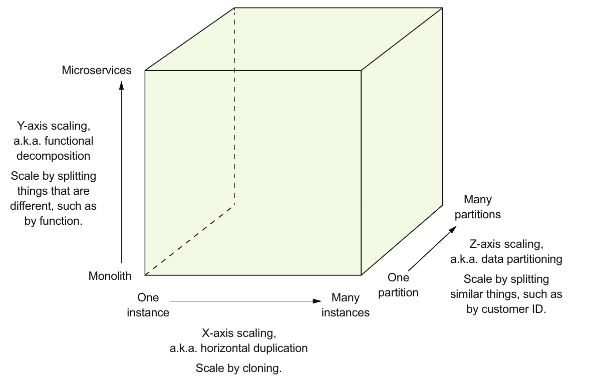

> **English:** Figure 1.3 The scale cube defines three separate ways to scale an application: X-axis scaling load balances requests across multiple, identical instances; Z-axis scaling routes requests based on an attribute of the request; Y-axis functionally decomposes an application into services.
>
> **Türkçe:** Şekil 1.3 Ölçekleme küpü, bir uygulamayı ölçeklemenin üç ayrı yolunu tanımlar: X ekseninde ölçekleme, istek yükünü birbirinin aynısı birden fazla instance arasında dengeler; Z ekseninde ölçekleme, istekleri isteğin bir niteliğine göre yönlendirir; Y ekseninde ölçekleme ise uygulamayı işlevlerine göre servislere ayırır.

> **English:** The model defines three ways to scale an application: X, Y, and Z.
>
> **Türkçe:** Model, bir uygulamayı ölçeklemenin üç yolunu tanımlar: X, Y ve Z.

#### X-axis scaling load balances requests across multiple instances — X ekseninde ölçekleme, istek yükünü instance’lar arasında dengeler

> **English:** X-axis scaling is a common way to scale a monolithic application. Figure 1.4 shows how X-axis scaling works. You run multiple instances of the application behind a load balancer. The load balancer distributes requests among the N identical instances of the application. This is a great way of improving the capacity and availability of an application.
>
> **Türkçe:** X ekseninde ölçekleme, monolitik bir uygulamayı ölçeklemenin yaygın bir yoludur. Şekil 1.4, bunun nasıl çalıştığını gösterir. Bir yük dengeleyicinin arkasında uygulamanın birden fazla instance’ını çalıştırırsınız. Yük dengeleyici, istekleri uygulamanın birbirinin aynısı N instance’ı arasında dağıtır. Bu, uygulamanın kapasitesini ve availability’sini (erişilebilirliğini) artırmanın çok iyi bir yoludur.

#### Z-axis scaling routes requests based on an attribute of the request — Z ekseninde ölçekleme, isteğin niteliğine göre yönlendirir

> **English:** Z-axis scaling also runs multiple instances of the monolith application, but unlike X-axis scaling, each instance is responsible for only a subset of the data. Figure 1.5 shows how Z-axis scaling works. The router in front of the instances uses a request attribute to route it to the appropriate instance. An application might, for example, route requests using userId.
>
> **Türkçe:** Z ekseninde ölçeklemede de monolitik uygulamanın birden fazla instance’ı çalıştırılır; ancak X ekseninden farklı olarak her instance, verinin yalnızca bir alt kümesinden sorumludur. Şekil 1.5, Z ekseninde ölçeklemenin nasıl çalıştığını gösterir. Instance’ların önündeki router (yönlendirici), isteği uygun instance’a göndermek için isteğin bir niteliğini kullanır. Örneğin bir uygulama, istekleri `userId` kullanarak yönlendirebilir.

<!-- source-pages: 9–10 -->

> **English:** In this example, each application instance is responsible for a subset of users. The router uses the userId specified by the request Authorization header to select one of the N identical instances of the application. Z-axis scaling is a great way to scale an application to handle increasing transaction and data volumes.
>
> **Türkçe:** Bu örnekte her uygulama instance’ı, kullanıcıların bir alt kümesinden sorumludur. Yönlendirici, uygulamanın birbirinin aynısı N instance’ından birini seçmek için isteğin `Authorization` başlığında belirtilen `userId` değerini kullanır. Z ekseninde ölçekleme, artan işlem ve veri hacimlerini karşılamak üzere uygulamayı ölçeklemenin çok iyi bir yoludur.

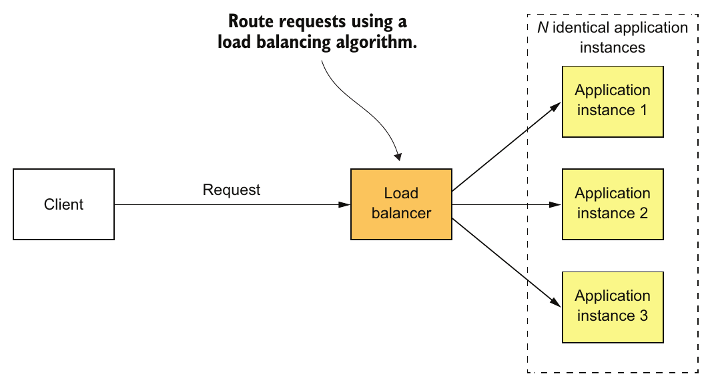

> **English:** Figure 1.4 X-axis scaling runs multiple, identical instances of the monolithic application behind a load balancer.
>
> **Türkçe:** Şekil 1.4 X ekseninde ölçeklemede, bir yük dengeleyicinin arkasında monolitik uygulamanın birbirinin aynısı birden fazla instance’ı çalışır.

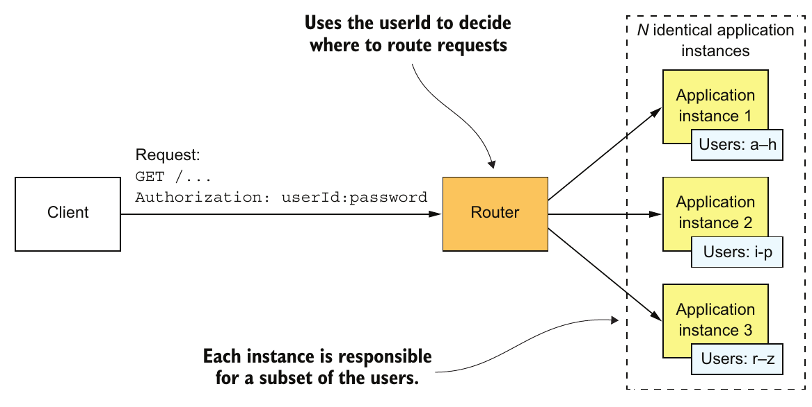

> **English:** Figure 1.5 Z-axis scaling runs multiple identical instances of the monolithic application behind a router, which routes based on a request attribute. Each instance is responsible for a subset of the data.
>
> **Türkçe:** Şekil 1.5 Z ekseninde ölçeklemede, isteğin bir niteliğine göre yönlendirme yapan router’ın arkasında monolitik uygulamanın birbirinin aynısı birden fazla instance’ı çalışır. Her instance, verinin bir alt kümesinden sorumludur.

#### Y-axis scaling functionally decomposes an application into services — Y ekseninde ölçekleme, uygulamayı işlevlerine göre servislere ayırır

> **English:** X- and Z-axis scaling improve the application’s capacity and availability. But neither approach solves the problem of increasing development and application complexity. To solve those, you need to apply Y-axis scaling, or functional decomposition. Figure 1.6 shows how Y-axis scaling works: by splitting a monolithic application into a set of services.
>
> **Türkçe:** X ve Z ekseninde ölçekleme, uygulamanın kapasitesini ve erişilebilirliğini artırır. Ancak iki yaklaşım da geliştirme sürecindeki ve uygulamadaki artan karmaşıklığı çözmez. Bunları çözmek için Y ekseninde ölçekleme, yani functional decomposition (işlevsel ayrıştırma) uygulamanız gerekir. Şekil 1.6, monolitik uygulamayı bir servis kümesine ayırarak Y ekseninde ölçeklemenin nasıl çalıştığını gösterir.

<!-- source-pages: 11 -->

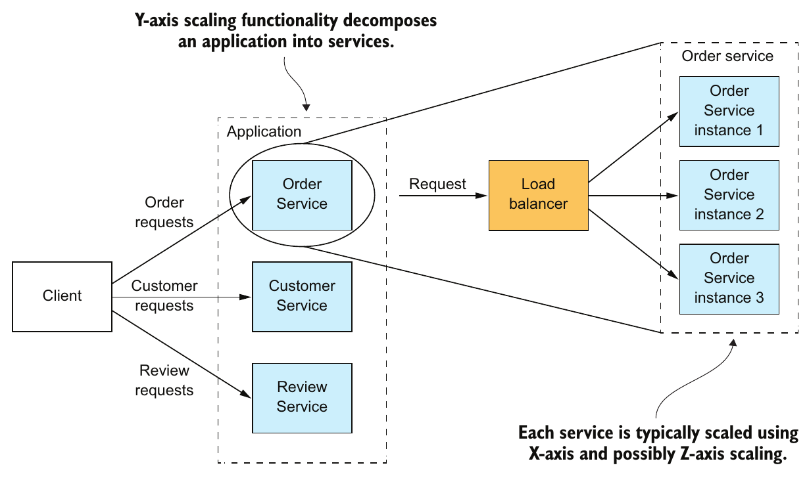

> **English:** Figure 1.6 Y-axis scaling splits the application into a set of services. Each service is responsible for a particular function. A service is scaled using X-axis scaling and, possibly, Z-axis scaling.
>
> **Türkçe:** Şekil 1.6 Y ekseninde ölçekleme, uygulamayı bir servis kümesine ayırır. Her servis belirli bir işlevden sorumludur. Bir servis, X ekseninde ve gerekirse Z ekseninde ölçekleme kullanılarak ölçeklenir.

> **English:** A service is a mini application that implements narrowly focused functionality, such as order management, customer management, and so on. A service is scaled using X-axis scaling, though some services may also use Z-axis scaling. For example, the Order service consists of a set of load-balanced service instances.
>
> **Türkçe:** Servis; sipariş yönetimi, müşteri yönetimi ve benzeri dar bir alana odaklanan işlevleri gerçekleştiren küçük bir uygulamadır. Servis X ekseninde ölçeklemeyle ölçeklenir; bazı servisler Z ekseninde ölçeklemeyi de kullanabilir. Örneğin Order servisi, yük dengeleme uygulanan bir servis instance’ı kümesinden oluşur.

> **English:** The high-level definition of microservice architecture (microservices) is an architectural style that functionally decomposes an application into a set of services. Note that this definition doesn’t say anything about size. Instead, what matters is that each service has a focused, cohesive set of responsibilities. Later in the book I discuss what that means.
>
> **Türkçe:** Üst düzeyde mikroservis mimarisi, bir uygulamayı işlevlerine göre bir servis kümesine ayıran mimari stildir. Bu tanımın boyut hakkında hiçbir şey söylemediğine dikkat edin. Önemli olan, her servisin belirli bir odağa sahip ve birbiriyle anlamlı biçimde ilişkili, cohesive (bütünlüklü) bir sorumluluk kümesine sahip olmasıdır. Bunun ne anlama geldiğini kitabın ilerleyen kısımlarında ele alacağım.

> **English:** Now let’s look at how the microservice architecture is a form of modularity.
>
> **Türkçe:** Şimdi mikroservis mimarisinin nasıl bir modülerlik biçimi olduğuna bakalım.

### 1.4.2 Microservices as a form of modularity — Bir modülerlik biçimi olarak mikroservisler

> **English:** Modularity is essential when developing large, complex applications. A modern application like FTGO is too large to be developed by an individual. It’s also too complex to be understood by a single person. Applications must be decomposed into modules that are developed and understood by different people. In a monolithic application, modules are defined using a combination of programming language constructs (such as Java packages) and build artifacts (such as Java JAR files). However, as the FTGO developers have discovered, this approach tends not to work well in practice. Long-lived, monolithic applications usually degenerate into big balls of mud.
>
> **Türkçe:** Büyük ve karmaşık uygulamalar geliştirilirken modularity (modülerlik) temel bir gerekliliktir. FTGO gibi modern bir uygulama, tek bir kişi tarafından geliştirilemeyecek kadar büyüktür. Ayrıca tek bir kişinin anlayamayacağı kadar karmaşıktır. Uygulamaların, farklı kişilerce geliştirilen ve anlaşılan modüllere ayrılması gerekir. Monolitik uygulamada modüller, programlama dili yapıları (Java package’ları gibi) ile build artifact’larının (Java JAR dosyaları gibi derleme çıktılarının) birleşimiyle tanımlanır. Ancak FTGO geliştiricilerinin gördüğü gibi bu yaklaşım pratikte çoğunlukla iyi işlemez. Uzun ömürlü monolitik uygulamalar genellikle zamanla büyük çamur yığınlarına dönüşür.

<!-- source-pages: 11–12 -->

> **English:** The microservice architecture uses services as the unit of modularity. A service has an API, which is an impermeable boundary that is difficult to violate. You can’t bypass the API and access an internal class as you can with a Java package. As a result, it’s much easier to preserve the modularity of the application over time. There are other benefits of using services as building blocks, including the ability to deploy and scale them independently.
>
> **Türkçe:** Mikroservis mimarisi, modülerliğin birimi olarak servisleri kullanır. Bir servisin, ihlal edilmesi zor ve geçirimsiz bir sınır oluşturan API’si vardır. Java package’larında yapabildiğiniz gibi API’yi atlayıp içerideki bir sınıfa erişemezsiniz. Bu nedenle uygulamanın modülerliğini zaman içinde korumak çok daha kolaydır. Servisleri yapı taşı olarak kullanmanın, onları birbirinden bağımsız dağıtabilmek ve ölçekleyebilmek gibi başka yararları da vardır.

### 1.4.3 Each service has its own database — Her servisin kendi veritabanı vardır

> **English:** A key characteristic of the microservice architecture is that the services are loosely coupled and communicate only via APIs. One way to achieve loose coupling is by each service having its own datastore. In the online store, for example, Order Service has a database that includes the ORDERS table, and Customer Service has its database, which includes the CUSTOMERS table. At development time, developers can change a service’s schema without having to coordinate with developers working on other services. At runtime, the services are isolated from each other—for example, one service will never be blocked because another service holds a database lock.
>
> **Türkçe:** Mikroservis mimarisinin temel özelliklerinden biri, servislerin gevşek bağlı olması ve yalnızca API’ler üzerinden iletişim kurmasıdır. Loose coupling (gevşek bağlılık) sağlamanın yollarından biri, her servisin kendi datastore’una (veri deposuna) sahip olmasıdır. Örneğin çevrim içi mağazada Order Service’in `ORDERS` tablosunu içeren bir veritabanı, Customer Service’in ise `CUSTOMERS` tablosunu içeren kendi veritabanı vardır. Geliştirme sırasında geliştiriciler, diğer servislerde çalışan geliştiricilerle koordinasyon kurmak zorunda kalmadan bir servisin şemasını değiştirebilir. Çalışma zamanında servisler birbirinden yalıtılmıştır; örneğin bir servis, başka bir servis veritabanı kilidi tuttuğu için bloke olmaz.

#### Don’t worry: Loose coupling doesn’t make Larry Ellison richer — Endişelenmeyin: Gevşek bağlılık Larry Ellison’ı daha zengin yapmaz

> **English:** The requirement for each service to have its own database doesn’t mean it has its own database server. You don’t, for example, have to spend 10 times more on Oracle RDBMS licenses. Chapter 2 explores this topic in depth.
>
> **Türkçe:** Her servisin kendi veritabanına sahip olması gerekliliği, her birinin ayrı bir veritabanı sunucusuna sahip olduğu anlamına gelmez. Örneğin Oracle RDBMS lisanslarına on kat fazla para harcamanız gerekmez. 2. bölüm bu konuyu ayrıntılı olarak inceler.

> **English:** Now that we’ve defined the microservice architecture and described some of its essential characteristics, let’s look at how this applies to the FTGO application.
>
> **Türkçe:** Mikroservis mimarisini tanımlayıp temel özelliklerinden bazılarını açıkladığımıza göre şimdi bunun FTGO uygulamasına nasıl uygulandığına bakalım.

### 1.4.4 The FTGO microservice architecture — FTGO’nun mikroservis mimarisi

> **English:** The rest of this book discusses the FTGO application’s microservice architecture in depth. But first let’s quickly look at what it means to apply Y-axis scaling to this application. If we apply Y-axis decomposition to the FTGO application, we get the architecture shown in figure 1.7. The decomposed application consists of numerous frontend and backend services. We would also apply X-axis and, possibly Z-axis scaling, so that at runtime there would be multiple instances of each service.
>
> **Türkçe:** Kitabın geri kalanı, FTGO uygulamasının mikroservis mimarisini ayrıntılı olarak ele alır. Ama önce bu uygulamaya Y ekseninde ölçekleme uygulamanın ne anlama geldiğine kısaca bakalım. FTGO’yu Y ekseninde ayrıştırırsak Şekil 1.7’deki mimariyi elde ederiz. Ayrıştırılmış uygulama, çok sayıda frontend ve backend servisinden oluşur. Çalışma zamanında her servisin birden fazla instance’ı bulunması için X ekseninde ve gerekirse Z ekseninde ölçekleme de uygularız.

> **English:** The frontend services include an API gateway and the Restaurant Web UI. The API gateway, which plays the role of a facade and is described in detail in chapter 8, provides the REST APIs that are used by the consumers’ and couriers’ mobile applications. The Restaurant Web UI implements the web interface that’s used by the restaurants to manage menus and process orders.
>
> **Türkçe:** Frontend servisleri arasında bir API gateway (API ağ geçidi) ve Restaurant Web UI bulunur. Facade (cephe) rolünü üstlenen ve 8. bölümde ayrıntılı anlatılan API gateway, tüketicilerin ve kuryelerin mobil uygulamalarının kullandığı REST API’leri sunar. Restaurant Web UI ise restoranların menüleri yönetmek ve siparişleri işlemek için kullandığı web arayüzünü gerçekleştirir.

> **English:** The FTGO application’s business logic consists of numerous backend services. Each backend service has a REST API and its own private datastore. The backend services include the following:
>
> **Türkçe:** FTGO uygulamasının iş mantığı çok sayıda backend servisinden oluşur. Her backend servisinin bir REST API’si ve yalnızca kendisine ait özel bir veri deposu vardır. Backend servisleri arasında şunlar bulunur:

> **English:** Order Service—Manages orders
>
> **Türkçe:** Order Service—Siparişleri yönetir.

> **English:** Delivery Service—Manages delivery of orders from restaurants to consumers
>
> **Türkçe:** Delivery Service—Siparişlerin restoranlardan tüketicilere teslim edilmesini yönetir.

<!-- source-pages: 13 -->

> **English:** Restaurant Service—Maintains information about restaurants
>
> **Türkçe:** Restaurant Service—Restoranlarla ilgili bilgileri tutar ve güncel tutar.

> **English:** Kitchen Service—Manages the preparation of orders
>
> **Türkçe:** Kitchen Service—Siparişlerin hazırlanmasını yönetir.

> **English:** Accounting Service—Handles billing and payments
>
> **Türkçe:** Accounting Service—Faturalandırma ve ödemeleri işler.

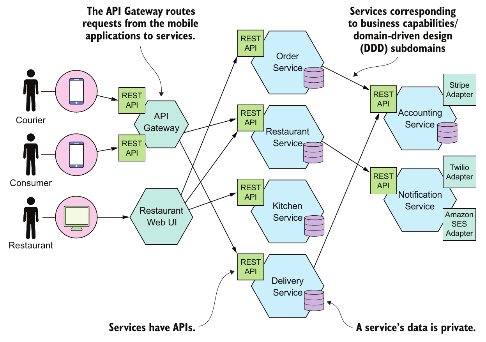

> **English:** Figure 1.7 Some of the services of the microservice architecture-based version of the FTGO application. An API Gateway routes requests from the mobile applications to services. The services collaborate via APIs.
>
> **Türkçe:** Şekil 1.7 FTGO uygulamasının mikroservis mimarisine dayanan sürümündeki servislerden bazıları. API Gateway, mobil uygulamalardan gelen istekleri servislere yönlendirir. Servisler API’ler aracılığıyla birlikte çalışır.

> **English:** Many services correspond to the modules described earlier in this chapter. What’s different is that each service and its API are very clearly defined. Each one can be independently developed, tested, deployed, and scaled. Also, this architecture does a good job of preserving modularity. A developer can’t bypass a service’s API and access its internal components. Chapter 13 describes how to transform an existing monolithic application into microservices.
>
> **Türkçe:** Pek çok servis, bu bölümün başında anlatılan modüllere karşılık gelir. Fark, her servisin ve API’sinin çok açık biçimde tanımlanmış olmasıdır. Her biri bağımsız olarak geliştirilebilir, test edilebilir, dağıtılabilir ve ölçeklenebilir. Ayrıca bu mimari modülerliği korumada başarılıdır. Geliştirici, servisin API’sini atlayıp iç bileşenlerine erişemez. 13. bölüm, mevcut monolitik bir uygulamanın mikroservislere nasıl dönüştürüleceğini anlatır.

### 1.4.5 Comparing the microservice architecture and SOA — Mikroservis mimarisi ile SOA’nın karşılaştırılması

> **English:** Some critics of the microservice architecture claim it’s nothing new—it’s service-oriented architecture (SOA). At a very high level, there are some similarities. SOA and the microservice architecture are architectural styles that structure a system as a set of services. But as table 1.1 shows, once you dig deep, you encounter significant differences.
>
> **Türkçe:** Mikroservis mimarisini eleştiren bazı kişiler, bunun yeni bir şey olmadığını; zaten service-oriented architecture (SOA, servis odaklı mimari) olduğunu ileri sürer. Çok üst düzeyde bakıldığında bazı benzerlikler vardır. SOA ve mikroservis mimarisi, sistemi bir servis kümesi olarak yapılandıran mimari stillerdir. Ancak Tablo 1.1’in gösterdiği gibi ayrıntıya indikçe önemli farklarla karşılaşırsınız.

<!-- source-pages: 14 -->

#### Table 1.1 Comparing SOA with microservices — SOA ile mikroservislerin karşılaştırılması

| English: Aspect | SOA | Microservices |
|---|---|---|
| Inter-service communication | Smart pipes, such as Enterprise Service Bus, using heavyweight protocols, such as SOAP and the other WS* standards. | Dumb pipes, such as a message broker, or direct service-to-service communication, using lightweight protocols such as REST or gRPC |
| Data | Global data model and shared databases | Data model and database per service |
| Typical service | Larger monolithic application | Smaller service |

| Türkçe: Boyut | SOA | Mikroservisler |
|---|---|---|
| Servisler arası iletişim | SOAP ve diğer WS* standartları gibi ağır protokoller kullanan Enterprise Service Bus türü smart pipe’lar (işleme mantığı taşıyan iletişim kanalları). | Message broker gibi dumb pipe’lar (iş mantığı taşımayan iletişim kanalları) veya REST ya da gRPC gibi hafif protokollerle doğrudan servisler arası iletişim. |
| Veri | Ortak veri modeli ve paylaşılan veritabanları. | Her servise ait veri modeli ve veritabanı. |
| Tipik servis | Daha büyük bir monolitik uygulama. | Daha küçük bir servis. |

> **English:** SOA and the microservice architecture usually use different technology stacks. SOA applications typically use heavyweight technologies such as SOAP and other WS* standards. They often use an ESB, a smart pipe that contains business and message-processing logic to integrate the services. Applications built using the microservice architecture tend to use lightweight, open source technologies. The services communicate via dumb pipes, such as message brokers or lightweight protocols like REST or gRPC.
>
> **Türkçe:** SOA ve mikroservis mimarisi genellikle farklı teknoloji yığınları kullanır. SOA uygulamaları çoğunlukla SOAP ve diğer WS* standartları gibi ağır teknolojiler kullanır. Servisleri bütünleştirmek için çoğu kez iş mantığı ve mesaj işleme mantığı içeren bir smart pipe olan ESB’den yararlanırlar. Mikroservis mimarisiyle geliştirilen uygulamalar ise genellikle hafif, açık kaynak teknolojileri kullanır. Servisler, message broker gibi dumb pipe’lar veya REST ve gRPC gibi hafif protokoller üzerinden iletişim kurar.

> **English:** SOA and the microservice architecture also differ in how they treat data. SOA applications typically have a global data model and share databases. In contrast, as mentioned earlier, in the microservice architecture each service has its own database. Moreover, as described in chapter 2, each service is usually considered to have its own domain model.
>
> **Türkçe:** SOA ve mikroservis mimarisi, veriyi ele alış biçimleri açısından da farklıdır. SOA uygulamalarında genellikle ortak bir veri modeli vardır ve veritabanları paylaşılır. Buna karşılık, daha önce belirtildiği gibi mikroservis mimarisinde her servisin kendi veritabanı bulunur. Üstelik 2. bölümde anlatıldığı üzere her servisin genellikle kendine ait bir domain model’e (iş alanı modeline) sahip olduğu kabul edilir.

> **English:** Another key difference between SOA and the microservice architecture is the size of the services. SOA is typically used to integrate large, complex, monolithic applications. Although services in a microservice architecture aren’t always tiny, they’re almost always much smaller. As a result, a SOA application usually consists of a few large services, whereas a microservices-based application typically consists of dozens or hundreds of smaller services.
>
> **Türkçe:** SOA ile mikroservis mimarisi arasındaki bir başka temel fark, servislerin boyutudur. SOA genellikle büyük, karmaşık ve monolitik uygulamaları bütünleştirmek için kullanılır. Mikroservis mimarisindeki servisler her zaman minicik olmasa da neredeyse her zaman çok daha küçüktür. Sonuç olarak SOA uygulaması genellikle birkaç büyük servisten oluşurken mikroservis tabanlı bir uygulama çoğunlukla onlarca veya yüzlerce daha küçük servisten oluşur.

## 1.5 Benefits and drawbacks of the microservice architecture — Mikroservis mimarisinin yararları ve dezavantajları

> **English:** Let’s first consider the benefits and then we’ll look at the drawbacks.
>
> **Türkçe:** Önce yararları ele alalım, sonra dezavantajlara bakalım.

### 1.5.1 Benefits of the microservice architecture — Mikroservis mimarisinin yararları

> **English:** The microservice architecture has the following benefits:
>
> **Türkçe:** Mikroservis mimarisi şu yararları sağlar:

> **English:** It enables the continuous delivery and deployment of large, complex applications.
>
> **Türkçe:** Büyük ve karmaşık uygulamaların continuous delivery (sürekli teslim) ve continuous deployment (sürekli dağıtım) süreçlerini mümkün kılar.

> **English:** Services are small and easily maintained.
>
> **Türkçe:** Servisler küçüktür ve bakımları kolaydır.

> **English:** Services are independently deployable.
>
> **Türkçe:** Servisler birbirinden bağımsız dağıtılabilir.

> **English:** Services are independently scalable.
>
> **Türkçe:** Servisler birbirinden bağımsız ölçeklenebilir.

> **English:** The microservice architecture enables teams to be autonomous.
>
> **Türkçe:** Mikroservis mimarisi, ekiplerin autonomous (özerk) olmasını sağlar.

> **English:** It allows easy experimenting and adoption of new technologies.
>
> **Türkçe:** Yeni teknolojileri kolayca denemeye ve benimsemeye olanak verir.

> **English:** It has better fault isolation.
>
> **Türkçe:** Daha iyi arıza yalıtımı sağlar.

<!-- source-pages: 15 -->

> **English:** Let’s look at each benefit.
>
> **Türkçe:** Her bir yararı inceleyelim.

#### Enables the continuous delivery and deployment of large, complex applications — Büyük ve karmaşık uygulamalarda sürekli teslim ve dağıtımı mümkün kılar

> **English:** The most important benefit of the microservice architecture is that it enables continuous delivery and deployment of large, complex applications. As described later in section 1.7, continuous delivery/deployment is part of DevOps, a set of practices for the rapid, frequent, and reliable delivery of software. High-performing DevOps organizations typically deploy changes into production with very few production issues.
>
> **Türkçe:** Mikroservis mimarisinin en önemli yararı, büyük ve karmaşık uygulamaların sürekli teslimini ve dağıtımını mümkün kılmasıdır. İleride 1.7’de anlatıldığı gibi sürekli teslim/dağıtım, yazılımın hızlı, sık ve güvenilir biçimde teslim edilmesini amaçlayan uygulamalar bütünü DevOps’un bir parçasıdır. Yüksek performanslı DevOps kuruluşları, değişiklikleri genellikle üretim ortamında çok az sorun yaşayarak dağıtır.

> **English:** There are three ways that the microservice architecture enables continuous delivery/deployment:
>
> **Türkçe:** Mikroservis mimarisi sürekli teslim/dağıtımı üç şekilde mümkün kılar:

> **English:** It has the testability required by continuous delivery/deployment—Automated testing is a key practice of continuous delivery/deployment. Because each service in a microservice architecture is relatively small, automated tests are much easier to write and faster to execute. As a result, the application will have fewer bugs.
>
> **Türkçe:** Sürekli teslim/dağıtımın gerektirdiği test edilebilirliği sağlar—Otomatik test, sürekli teslim/dağıtımın temel uygulamalarından biridir. Mikroservis mimarisindeki her servis görece küçük olduğundan otomatik testleri yazmak çok daha kolaydır ve çalıştırmak daha hızlıdır. Sonuç olarak uygulamada daha az hata bulunur.

> **English:** It has the deployability required by continuous delivery/deployment—Each service can be deployed independently of other services. If the developers responsible for a service need to deploy a change that’s local to that service, they don’t need to coordinate with other developers. They can deploy their changes. As a result, it’s much easier to deploy changes frequently into production.
>
> **Türkçe:** Sürekli teslim/dağıtımın gerektirdiği dağıtılabilirliği sağlar—Her servis diğerlerinden bağımsız dağıtılabilir. Bir servisten sorumlu geliştiricilerin yalnızca o servisi etkileyen bir değişikliği dağıtması gerekiyorsa diğer geliştiricilerle koordinasyon kurmaları gerekmez. Kendi değişikliklerini dağıtabilirler. Böylece değişiklikleri sık sık üretime çıkarmak çok daha kolay olur.

> **English:** It enables development teams to be autonomous and loosely coupled—You can structure the engineering organization as a collection of small (for example, two-pizza) teams. Each team is solely responsible for the development and deployment of one or more related services. As figure 1.8 shows, each team can develop, deploy, and scale their services independently of all the other teams. As a result, the development velocity is much higher.
>
> **Türkçe:** Geliştirme ekiplerinin özerk ve gevşek bağlı olmasını sağlar—Mühendislik organizasyonunu küçük ekiplerden, örneğin two-pizza (iki pizzayla doyabilecek büyüklükte) ekiplerden oluşacak biçimde yapılandırabilirsiniz. Her ekip, bir veya daha fazla ilişkili servisin geliştirilmesinden ve dağıtımından tek başına sorumludur. Şekil 1.8’in gösterdiği gibi her ekip, servislerini diğer bütün ekiplerden bağımsız geliştirebilir, dağıtabilir ve ölçekleyebilir. Sonuç olarak geliştirme hızı çok daha yüksek olur.

> **English:** The ability to do continuous delivery and deployment has several business benefits:
>
> **Türkçe:** Sürekli teslim ve dağıtım yapabilmenin iş açısından çeşitli yararları vardır:

> **English:** It reduces the time to market, which enables the business to rapidly react to feedback from customers.
>
> **Türkçe:** Time to market’ı (pazara sunma süresini) kısaltır; bu da şirketin müşteri geri bildirimlerine hızla karşılık vermesini sağlar.

> **English:** It enables the business to provide the kind of reliable service today’s customers have come to expect.
>
> **Türkçe:** Şirketin, günümüz müşterilerinin artık beklediği türden güvenilir hizmet sunmasını sağlar.

> **English:** Employee satisfaction is higher because more time is spent delivering valuable features instead of fighting fires.
>
> **Türkçe:** Acil sorunlarla uğraşmak yerine değerli özellikler sunmaya daha fazla zaman ayrıldığı için çalışan memnuniyeti yükselir.

> **English:** As a result, the microservice architecture has become the table stakes of any business that depends upon software technology.
>
> **Türkçe:** Sonuç olarak mikroservis mimarisi, yazılım teknolojisine bağımlı işletmeler için rekabete katılmanın asgari koşullarından biri hâline gelmiştir.

#### Each service is small and easily maintained — Her servis küçüktür ve bakımı kolaydır

> **English:** Another benefit of the microservice architecture is that each service is relatively small. The code is easier for a developer to understand. The small code base doesn’t slow down the IDE, making developers more productive. And each service typically starts a lot faster than a large monolith does, which also makes developers more productive and speeds up deployments.
>
> **Türkçe:** Mikroservis mimarisinin bir başka yararı, her servisin görece küçük olmasıdır. Kodun geliştirici tarafından anlaşılması daha kolaydır. Küçük kod tabanı IDE’yi yavaşlatmaz; böylece geliştiriciler daha verimli olur. Ayrıca her servis genellikle büyük bir monolite göre çok daha hızlı başlar; bu da geliştirici verimliliğini artırır ve dağıtımları hızlandırır.

<!-- source-pages: 16 -->

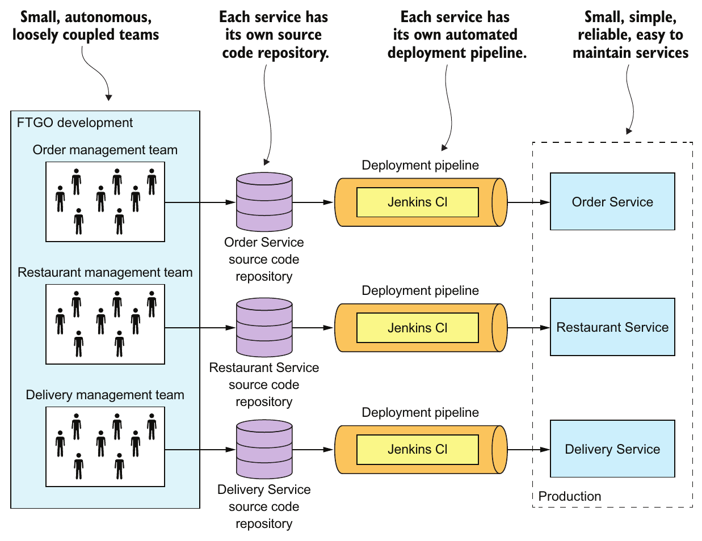

> **English:** Figure 1.8 The microservices-based FTGO application consists of a set of loosely coupled services. Each team develops, tests, and deploys their services independently.
>
> **Türkçe:** Şekil 1.8 Mikroservis tabanlı FTGO uygulaması, gevşek bağlı bir servis kümesinden oluşur. Her ekip kendi servislerini bağımsız olarak geliştirir, test eder ve dağıtır.

#### Services are independently scalable — Servisler bağımsız ölçeklenebilir

> **English:** Each service in a microservice architecture can be scaled independently of other services using X-axis cloning and Z-axis partitioning. Moreover, each service can be deployed on hardware that’s best suited to its resource requirements. This is quite different than when using a monolithic architecture, where components with wildly different resource requirements—for example, CPU-intensive vs. memory-intensive—must be deployed together.
>
> **Türkçe:** Mikroservis mimarisindeki her servis, X ekseninde kopyalama ve Z ekseninde bölümlendirme kullanılarak diğer servislerden bağımsız ölçeklenebilir. Üstelik her servis, kendi kaynak gereksinimlerine en uygun donanıma dağıtılabilir. Bu durum, çok farklı kaynak gereksinimlerine sahip bileşenlerin—örneğin yoğun CPU kullananlarla yoğun bellek kullananların—birlikte dağıtılmak zorunda olduğu monolitik mimariden oldukça farklıdır.

#### Better fault isolation — Daha iyi arıza yalıtımı

> **English:** The microservice architecture has better fault isolation. For example, a memory leak in one service only affects that service. Other services will continue to handle requests normally. In comparison, one misbehaving component of a monolithic architecture will bring down the entire system.
>
> **Türkçe:** Mikroservis mimarisi daha iyi arıza yalıtımı sağlar. Örneğin bir servisteki bellek sızıntısı yalnızca o servisi etkiler. Diğer servisler istekleri normal biçimde işlemeye devam eder. Buna karşılık monolitik mimaride hatalı çalışan tek bir bileşen bütün sistemi çökertebilir.

> **Teknik not:** Ayrı process’ler bellek sızıntısını süreç sınırında yalıtır; yine de arızalı bir servise bağımlı işlemler etkilenebilir. Kaynağın 1.5.2’deki ağ hataları ve 1.6’daki Circuit breaker açıklamaları bu ek riski ele alır.

#### Easily experiment with and adopt new technologies — Yeni teknolojileri kolayca denemek ve benimsemek

<!-- source-pages: 16–17 -->

> **English:** Last but not least, the microservice architecture eliminates any long-term commitment to a technology stack. In principle, when developing a new service, the developers are free to pick whatever language and frameworks are best suited for that service. In many organizations, it makes sense to restrict the choices, but the key point is that you aren’t constrained by past decisions.
>
> **Türkçe:** Son olarak, ama en az diğerleri kadar önemli biçimde, mikroservis mimarisi bir teknoloji yığınına uzun vadeli bağlı kalma zorunluluğunu ortadan kaldırır. İlke olarak geliştiriciler, yeni bir servis geliştirirken o servise en uygun dil ve framework’leri seçmekte özgürdür. Birçok kuruluşta seçenekleri sınırlandırmak mantıklıdır; ancak asıl nokta, geçmişte alınan kararlarla kısıtlanmamanızdır.

> **English:** Moreover, because the services are small, rewriting them using better languages and technologies becomes practical. If the trial of a new technology fails, you can throw away that work without risking the entire project. This is quite different than when using a monolithic architecture, where your initial technology choices severely constrain your ability to use different languages and frameworks in the future.
>
> **Türkçe:** Üstelik servisler küçük olduğu için, bunları daha iyi diller ve teknolojiler kullanarak yeniden yazmak uygulanabilir hale gelir. Yeni bir teknolojiyi deneme girişimi başarısız olursa tüm projeyi riske atmadan bu çalışmayı bir kenara bırakabilirsiniz. Bu durum, başlangıçtaki teknoloji seçimlerinizin ileride farklı dilleri ve framework’leri kullanabilme olanağınızı ciddi ölçüde sınırladığı monolitik mimariden oldukça farklıdır.

### 1.5.2 Drawbacks of the microservice architecture — Mikroservis mimarisinin dezavantajları

> **English:** Certainly, no technology is a silver bullet, and the microservice architecture has a number of significant drawbacks and issues. Indeed most of this book is about how to address these drawbacks and issues. As you read about the challenges, don’t worry. Later in this book I describe ways to address them.
>
> **Türkçe:** Elbette hiçbir teknoloji her derde deva bir çözüm değildir; mikroservis mimarisinin de önemli dezavantajları ve sorunları vardır. Aslında bu kitabın büyük bölümü, bu dezavantaj ve sorunların nasıl ele alınacağıyla ilgilidir. Zorlukları okurken kaygılanmayın. Kitabın ilerleyen bölümlerinde bunları ele almanın yollarını açıklayacağım.

> **English:** Here are the major drawbacks and issues of the microservice architecture:
>
> **Türkçe:** Mikroservis mimarisinin başlıca dezavantajları ve sorunları şunlardır:

> **English:** • Finding the right set of services is challenging.
>
> **Türkçe:** • Doğru servis kümesini bulmak zordur.

> **English:** • Distributed systems are complex, which makes development, testing, and deployment difficult.
>
> **Türkçe:** • Dağıtık sistemler karmaşıktır; bu da geliştirmeyi, test etmeyi ve dağıtımı zorlaştırır.

> **English:** • Deploying features that span multiple services requires careful coordination.
>
> **Türkçe:** • Birden fazla servisi kapsayan özelliklerin dağıtımı dikkatli koordinasyon gerektirir.

> **English:** • Deciding when to adopt the microservice architecture is difficult.
>
> **Türkçe:** • Mikroservis mimarisinin ne zaman benimsenmesi gerektiğine karar vermek zordur.

> **English:** Let’s look at each one in turn.
>
> **Türkçe:** Şimdi bunların her birini sırayla inceleyelim.

#### FINDING THE RIGHT SERVICES IS CHALLENGING — Doğru servisleri bulmak zordur

> **English:** One challenge with using the microservice architecture is that there isn’t a concrete, well-defined algorithm for decomposing a system into services. As with much of software development, it’s something of an art. To make matters worse, if you decompose a system incorrectly, you’ll build a distributed monolith, a system consisting of coupled services that must be deployed together. A distributed monolith has the drawbacks of both the monolithic architecture and the microservice architecture.
>
> **Türkçe:** Mikroservis mimarisini kullanmanın zorluklarından biri, bir sistemi servislere ayırmak için somut ve açıkça tanımlanmış bir algoritmanın bulunmamasıdır. Yazılım geliştirmenin pek çok yönü gibi bu da bir ölçüde ustalık gerektirir. Üstelik sistemi yanlış ayrıştırırsanız, birlikte dağıtılması gereken, birbirine bağımlı servislerden oluşan bir distributed monolith (dağıtık monolit) oluşturursunuz. Dağıtık monolit, hem monolitik mimarinin hem de mikroservis mimarisinin dezavantajlarını taşır.

#### DISTRIBUTED SYSTEMS ARE COMPLEX — Dağıtık sistemler karmaşıktır

> **English:** Another issue with using the microservice architecture is that developers must deal with the additional complexity of creating a distributed system. Services must use an interprocess communication mechanism. This is more complex than a simple method call. Moreover, a service must be designed to handle partial failure and deal with the remote service either being unavailable or exhibiting high latency.
>
> **Türkçe:** Mikroservis mimarisinin bir başka sorunu, geliştiricilerin dağıtık sistem oluşturmanın getirdiği ek karmaşıklıkla uğraşmak zorunda kalmasıdır. Servisler, interprocess communication (süreçler arası iletişim) mekanizması kullanmalıdır. Bu, basit bir metot çağrısından daha karmaşıktır. Ayrıca bir servis, partial failure (kısmi arıza) durumlarını karşılayacak; uzak servisin kullanılamaması veya yüksek gecikmeyle yanıt vermesiyle başa çıkacak biçimde tasarlanmalıdır.

> **English:** Implementing use cases that span multiple services requires the use of unfamiliar techniques. Each service has its own database, which makes it a challenge to implement transactions and queries that span services. As described in chapter 4, a microservices-based application must use what are known as sagas to maintain data consistency across services. Chapter 7 explains that a microservices-based application can’t retrieve data from multiple services using simple queries. Instead, it must implement queries using either API composition or CQRS views.
>
> **Türkçe:** Birden fazla servisi kapsayan kullanım senaryolarını hayata geçirmek, alışık olunmayan teknikleri kullanmayı gerektirir. Her servisin kendi veritabanına sahip olması, servisleri kapsayan transaction’ları (işlemleri) ve sorguları uygulamayı zorlaştırır. Bölüm 4’te açıklandığı gibi, mikroservis tabanlı bir uygulama, servisler arasında veri tutarlılığını korumak için saga adı verilen yapıları kullanmalıdır. Bölüm 7’de, mikroservis tabanlı bir uygulamanın basit sorgularla birden fazla servisten veri alamayacağı açıklanır. Bunun yerine sorguların API composition (API birleştirme) veya CQRS view’ları kullanılarak uygulanması gerekir.

<!-- source-pages: 18 -->

> **English:** IDEs and other development tools are focused on building monolithic applications and don’t provide explicit support for developing distributed applications. Writing automated tests that involve multiple services is challenging. These are all issues that are specific to the microservice architecture. Consequently, your organization’s developers must have sophisticated software development and delivery skills in order to successfully use microservices.
>
> **Türkçe:** IDE’ler ve diğer geliştirme araçları monolitik uygulamalar oluşturmaya odaklanır; dağıtık uygulama geliştirmek için doğrudan destek sağlamaz. Birden fazla servisi içeren otomatik testler yazmak zordur. Bunların hepsi mikroservis mimarisine özgü sorunlardır. Bu nedenle kuruluşunuzdaki geliştiricilerin mikroservisleri başarıyla kullanabilmeleri için ileri düzey yazılım geliştirme ve teslim becerilerine sahip olmaları gerekir.

> **English:** The microservice architecture also introduces significant operational complexity. Many more moving parts—multiple instances of different types of service—must be managed in production. To successfully deploy microservices, you need a high level of automation. You must use technologies such as the following:
>
> **Türkçe:** Mikroservis mimarisi, operasyon açısından da önemli bir karmaşıklık getirir. Üretim ortamında yönetilmesi gereken çok daha fazla bileşen vardır: farklı servis türlerinin birden fazla çalışan örneği. Mikroservisleri başarıyla dağıtmak için yüksek düzeyde otomasyona ihtiyacınız vardır. Aşağıdaki gibi teknolojileri kullanmalısınız:

> **English:** • Automated deployment tooling, like Netflix Spinnaker
>
> **Türkçe:** • Netflix Spinnaker gibi otomatik dağıtım araçları

> **English:** • An off-the-shelf PaaS, like Pivotal Cloud Foundry or Red Hat OpenShift
>
> **Türkçe:** • Pivotal Cloud Foundry veya Red Hat OpenShift gibi hazır bir PaaS (hizmet olarak platform) çözümü

> **English:** • A Docker orchestration platform, like Docker Swarm or Kubernetes
>
> **Türkçe:** • Docker Swarm veya Kubernetes gibi bir Docker orchestration (orkestrasyon) platformu

> **English:** I describe the deployment options in more detail in chapter 12.
>
> **Türkçe:** Dağıtım seçeneklerini bölüm 12’de daha ayrıntılı açıklayacağım.

#### DEPLOYING FEATURES SPANNING MULTIPLE SERVICES NEEDS CAREFUL COORDINATION — Birden fazla servisi kapsayan özelliklerin dağıtımı dikkatli koordinasyon gerektirir

> **English:** Another challenge with using the microservice architecture is that deploying features that span multiple services requires careful coordination between the various development teams. You have to create a rollout plan that orders service deployments based on the dependencies between services. That’s quite different than a monolithic architecture, where you can easily deploy updates to multiple components atomically.
>
> **Türkçe:** Mikroservis mimarisini kullanmanın bir başka zorluğu, birden fazla servisi kapsayan özelliklerin dağıtımının çeşitli geliştirme ekipleri arasında dikkatli koordinasyon gerektirmesidir. Servis dağıtımlarını servisler arasındaki bağımlılıklara göre sıralayan bir rollout plan (devreye alma planı) oluşturmanız gerekir. Bu durum, birden fazla bileşenin güncellemelerini tek bir bütün olarak, atomik biçimde kolayca dağıtabildiğiniz monolitik mimariden oldukça farklıdır.

#### DECIDING WHEN TO ADOPT IS DIFFICULT — Ne zaman benimseneceğine karar vermek zordur

> **English:** Another issue with using the microservice architecture is deciding at what point during the lifecycle of the application you should use this architecture. When developing the first version of an application, you often don’t have the problems that this architecture solves. Moreover, using an elaborate, distributed architecture will slow down development. That can be a major dilemma for startups, where the biggest problem is usually how to rapidly evolve the business model and accompanying application. Using the microservice architecture makes it much more difficult to iterate rapidly. A startup should almost certainly begin with a monolithic application.
>
> **Türkçe:** Mikroservis mimarisinin bir başka sorunu, uygulamanın yaşam döngüsünün hangi aşamasında bu mimariye geçileceğine karar vermektir. Bir uygulamanın ilk sürümünü geliştirirken çoğu zaman bu mimarinin çözdüğü sorunlarla henüz karşılaşmamış olursunuz. Ayrıca ayrıntılı ve karmaşık bir dağıtık mimari kullanmak geliştirmeyi yavaşlatır. Bu durum, en büyük sorunun genellikle iş modelini ve buna eşlik eden uygulamayı hızla geliştirmek olduğu startup’lar için büyük bir ikilem yaratabilir. Mikroservis mimarisini kullanmak, hızlı yinelemelerle ilerlemeyi çok daha zorlaştırır. Bir startup’ın neredeyse kesin olarak monolitik bir uygulamayla başlaması gerekir.

> **English:** Later on, though, when the problem is how to handle complexity, that’s when it makes sense to functionally decompose the application into a set of microservices. You may find refactoring difficult because of tangled dependencies. Chapter 13 goes over strategies for refactoring a monolithic application into microservices.
>
> **Türkçe:** Ancak ilerleyen aşamalarda sorun karmaşıklığı yönetmek haline geldiğinde, uygulamayı işlevlerine göre bir mikroservis kümesine ayırmak mantıklı olur. İç içe geçmiş bağımlılıklar nedeniyle refactoring (yeniden düzenleme) yapmakta zorlanabilirsiniz. Bölüm 13, monolitik bir uygulamayı mikroservislere dönüştürmek için yeniden düzenleme stratejilerini ele alır.

> **English:** As you can see, the microservice architecture offers many benefits, but also has some significant drawbacks. Because of these issues, adopting a microservice architecture should not be undertaken lightly. But for complex applications, such as a consumer-facing web application or SaaS application, it’s usually the right choice. Well-known sites like eBay (www.slideshare.net/RandyShoup/the-ebay-architecture-striking-a-balance-between-site-stability-feature-velocity-performance-and-cost), Amazon.com, Groupon, and Gilt have all evolved from a monolithic architecture to a microservice architecture.
>
> **Türkçe:** Gördüğünüz gibi mikroservis mimarisi birçok yarar sağlar; ancak önemli dezavantajları da vardır. Bu sorunlar nedeniyle mikroservis mimarisini benimsemek hafife alınacak bir karar değildir. Yine de tüketicilere yönelik bir web uygulaması veya SaaS uygulaması gibi karmaşık uygulamalarda genellikle doğru seçimdir. eBay (www.slideshare.net/RandyShoup/the-ebay-architecture-striking-a-balance-between-site-stability-feature-velocity-performance-and-cost), Amazon.com, Groupon ve Gilt gibi tanınmış sitelerin tümü monolitik mimariden mikroservis mimarisine evrilmiştir.

<!-- source-pages: 19 -->

> **English:** You must address numerous design and architectural issues when using the microservice architecture. What’s more, many of these issues have multiple solutions, each with a different set of trade-offs. There is no one single perfect solution. To help guide your decision making, I’ve created the Microservice architecture pattern language. I reference this pattern language throughout the rest of the book as I teach you about the microservice architecture. Let’s look at what a pattern language is and why it’s helpful.
>
> **Türkçe:** Mikroservis mimarisini kullanırken tasarım ve mimariyle ilgili pek çok sorunu ele almalısınız. Üstelik bu sorunların çoğunun, her biri farklı trade-off’lar (ödünleşimler) içeren birden fazla çözümü vardır. Tek bir kusursuz çözüm bulunmaz. Karar vermenize yol göstermek için Microservice architecture pattern language’i (mikroservis mimarisi örüntü dilini) oluşturdum. Kitabın geri kalanında mikroservis mimarisini anlatırken bu örüntü diline başvuracağım. Şimdi örüntü dilinin ne olduğuna ve neden yararlı olduğuna bakalım.

## 1.6 The Microservice architecture pattern language — Mikroservis mimarisi örüntü dili

> **English:** Architecture and design are all about making decisions. You need to decide whether the monolithic or microservice architecture is the best fit for your application. When making these decisions you have lots of trade-offs to consider. If you pick the microservice architecture, you’ll need to address lots of issues.
>
> **Türkçe:** Mimari ve tasarım, karar vermek üzerine kuruludur. Uygulamanız için monolitik mimarinin mi yoksa mikroservis mimarisinin mi daha uygun olduğuna karar vermeniz gerekir. Bu kararları alırken değerlendireceğiniz pek çok ödünleşim vardır. Mikroservis mimarisini seçerseniz birçok sorunu ele almanız gerekecektir.

> **English:** A good way to describe the various architectural and design options and improve decision making is to use a pattern language. Let’s first look at why we need patterns and a pattern language, and then we’ll take a tour of the Microservice architecture pattern language.
>
> **Türkçe:** Çeşitli mimari ve tasarım seçeneklerini açıklamanın ve daha iyi kararlar vermenin iyi bir yolu, bir pattern language (örüntü dili) kullanmaktır. Önce neden örüntülere ve bir örüntü diline ihtiyaç duyduğumuza bakalım; ardından mikroservis mimarisi örüntü dilini tanıyalım.

### 1.6.1 Microservice architecture is not a silver bullet — Mikroservis mimarisi her derde deva değildir

> **English:** Back in 1986, Fred Brooks, author of The Mythical Man-Month (Addison-Wesley Professional, 1995), said that in software engineering, there are no silver bullets. That means there are no techniques or technologies that if adopted would give you a tenfold boost in productivity. Yet decades later, developers are still arguing passionately about their favorite silver bullets, absolutely convinced that their favorite technology will give them a massive boost in productivity.
>
> **Türkçe:** The Mythical Man-Month (Addison-Wesley Professional, 1995) kitabının yazarı Fred Brooks, 1986 yılında yazılım mühendisliğinde silver bullet, yani her derde deva bir çözüm bulunmadığını söylemişti. Bu, benimsendiğinde üretkenliği on kat artıracak bir teknik veya teknoloji olmadığı anlamına gelir. Buna karşın aradan onlarca yıl geçtikten sonra bile geliştiriciler, en sevdikleri teknolojinin üretkenliği olağanüstü ölçüde artıracağına kesin olarak inanarak kendi mucize çözümlerini tutkuyla savunmayı sürdürmektedir.

> **English:** A lot of arguments follow the suck/rock dichotomy (http://nealford.com/memeagora/2009/08/05/suck-rock-dichotomy.html), a term coined by Neal Ford that describes how everything in the software world either sucks or rocks, with no middle ground. These arguments have this structure: if you do X, then a puppy will die, so therefore you must do Y. For example, synchronous versus reactive programming, object-oriented versus functional, Java versus JavaScript, REST versus messaging. Of course, reality is much more nuanced. Every technology has drawbacks and limitations that are often overlooked by its advocates. As a result, the adoption of a technology usually follows the Gartner hype cycle (https://en.wikipedia.org/wiki/Hype_cycle), in which an emerging technology goes through five phases, including the peak of inflated expectations (it rocks), followed by the trough of disillusionment (it sucks), and ending with the plateau of productivity (we now understand the trade-offs and when to use it).
>
> **Türkçe:** Birçok tartışma, Neal Ford’un ortaya attığı suck/rock dichotomy (berbat/harika ikiliği) yaklaşımını izler (http://nealford.com/memeagora/2009/08/05/suck-rock-dichotomy.html). Bu ifade, yazılım dünyasındaki her şeyin ortası olmadan ya berbat ya da harika sayılmasını anlatır. Bu tartışmalar şu yapıyı taşır: “X’i yaparsan bir köpek yavrusu ölür; dolayısıyla Y’yi yapmak zorundasın.” Senkron programlama ile reactive programming (tepkisel programlama), nesne yönelimli yaklaşım ile fonksiyonel yaklaşım, Java ile JavaScript ve REST ile mesajlaşma karşılaştırmaları buna örnektir. Elbette gerçeklik çok daha fazla ayrıntı ve ara ton içerir. Her teknolojinin, savunucuları tarafından sıklıkla göz ardı edilen dezavantajları ve sınırlamaları vardır. Sonuç olarak bir teknolojinin benimsenmesi genellikle Gartner hype cycle’ı (Gartner beklenti döngüsü) izler (https://en.wikipedia.org/wiki/Hype_cycle). Bu döngüde yeni bir teknoloji beş aşamadan geçer: şişirilmiş beklentilerin zirvesi (“harika”), ardından gelen hayal kırıklığı çukuru (“berbat”) ve sonunda ulaşılan üretkenlik platosu (“artık ödünleşimleri ve ne zaman kullanacağımızı anlıyoruz”) bunlar arasındadır.

> **English:** Microservices are not immune to the silver bullet phenomenon. Whether this architecture is appropriate for your application depends on many factors. Consequently, it’s bad advice to advise always using the microservice architecture, but it’s equally bad advice to advise never using it. As with many things, it depends.
>
> **Türkçe:** Mikroservisler de her derde deva çözüm arayışından etkilenir. Bu mimarinin uygulamanıza uygun olup olmadığı pek çok etkene bağlıdır. Bu nedenle her zaman mikroservis mimarisi kullanılmasını önermek kötü bir tavsiyedir; hiçbir zaman kullanılmamasını önermek de aynı ölçüde kötüdür. Birçok konuda olduğu gibi burada da yanıt koşullara bağlıdır.

<!-- source-pages: 19–20 -->

> **English:** The underlying reason for these polarized and hyped arguments about technology is that humans are primarily driven by their emotions. Jonathan Haidt, in his excellent book The Righteous Mind: Why Good People Are Divided by Politics and Religion (Vintage, 2013), uses the metaphor of an elephant and its rider to describe how the human mind works. The elephant represents the emotional part of the human brain. It makes most of the decisions. The rider represents the rational part of the brain. It can sometimes influence the elephant, but it mostly provides justifications for the elephant’s decisions.
>
> **Türkçe:** Teknoloji konusundaki bu kutuplaşmış ve abartılı tartışmaların temelinde, insanları öncelikle duygularının yönlendirmesi yatar. Jonathan Haidt, etkileyici kitabı The Righteous Mind: Why Good People Are Divided by Politics and Religion’da (Vintage, 2013), insan zihninin nasıl çalıştığını anlatmak için fil ve binicisi benzetmesini kullanır. Fil, insan beyninin duygusal bölümünü temsil eder. Kararların çoğunu o verir. Binici ise beynin akılcı bölümünü temsil eder. Zaman zaman fili etkileyebilir; ancak çoğunlukla filin verdiği kararlara gerekçeler üretir.

<!-- source-pages: 20 -->

> **English:** We—the software development community—need to overcome our emotional nature and find a better way of discussing and applying technology. A great way to discuss and describe technology is to use the pattern format, because it’s objective. When describing a technology in the pattern format, you must, for example, describe the drawbacks. Let’s take a look at the pattern format.
>
> **Türkçe:** Bizlerin, yani yazılım geliştirme topluluğunun, duygusal doğamızı aşması ve teknolojiyi tartışmak ve uygulamak için daha iyi bir yol bulması gerekir. Teknolojiyi tartışıp açıklamanın çok iyi bir yolu, nesnel olması nedeniyle örüntü biçimini kullanmaktır. Bir teknolojiyi örüntü biçiminde açıklarken, örneğin dezavantajlarını da belirtmek zorundasınızdır. Şimdi örüntü biçimine bakalım.

### 1.6.2 Patterns and pattern languages — Örüntüler ve örüntü dilleri

> **English:** A pattern is a reusable solution to a problem that occurs in a particular context. It’s an idea that has its origins in real-world architecture and that has proven to be useful in software architecture and design. The concept of a pattern was created by Christopher Alexander, a real-world architect. He also created the concept of a pattern language, a collection of related patterns that solve problems within a particular domain. His book A Pattern Language: Towns, Buildings, Construction (Oxford University Press, 1977) describes a pattern language for architecture that consists of 253 patterns. The patterns range from solutions to high-level problems, such as where to locate a city (“Access to water”), to low-level problems, such as how to design a room (“Light on two sides of every room”). Each of these patterns solves a problem by arranging physical objects that range in scope from cities to windows.
>
> **Türkçe:** Pattern (örüntü), belirli bir bağlamda ortaya çıkan bir soruna yönelik yeniden kullanılabilir bir çözümdür. Kökeni fiziksel yapıların mimarisine dayanır ve yazılım mimarisi ile tasarımında da yararlı olduğu görülmüştür. Örüntü kavramını, yapı mimarı Christopher Alexander geliştirmiştir. Ayrıca belirli bir alandaki sorunları çözen, birbiriyle ilişkili örüntülerden oluşan pattern language (örüntü dili) kavramını da ortaya koymuştur. A Pattern Language: Towns, Buildings, Construction (Oxford University Press, 1977) adlı kitabı, mimari için 253 örüntüden oluşan bir örüntü dilini açıklar. Örüntüler, bir şehrin nereye kurulacağı (“Suya erişim”) gibi üst düzey sorunların çözümlerinden, bir odanın nasıl tasarlanacağı (“Her odanın iki yanından ışık alması”) gibi alt düzey sorunların çözümlerine kadar uzanır. Bu örüntülerin her biri, şehirlerden pencerelere kadar farklı ölçeklerdeki fiziksel nesneleri düzenleyerek bir sorunu çözer.

> **English:** Christopher Alexander’s writings inspired the software community to adopt the concept of patterns and pattern languages. The book Design Patterns: Elements of Reusable Object-Oriented Software (Addison-Wesley Professional, 1994), by Erich Gamma, Richard Helm, Ralph Johnson, and John Vlissides is a collection of object-oriented design patterns. The book popularized patterns among software developers. Since the mid-1990s, software developers have documented numerous software patterns. A software pattern solves a software architecture or design problem by defining a set of collaborating software elements.
>
> **Türkçe:** Christopher Alexander’ın yazıları, yazılım topluluğuna örüntü ve örüntü dili kavramlarını benimseme konusunda ilham vermiştir. Erich Gamma, Richard Helm, Ralph Johnson ve John Vlissides tarafından yazılan Design Patterns: Elements of Reusable Object-Oriented Software (Addison-Wesley Professional, 1994), nesne yönelimli tasarım örüntülerinden oluşan bir derlemedir. Bu kitap, örüntüleri yazılım geliştiriciler arasında yaygınlaştırmıştır. 1990’ların ortalarından bu yana geliştiriciler çok sayıda yazılım örüntüsünü belgelemiştir. Bir yazılım örüntüsü, birlikte çalışan yazılım öğelerinden oluşan bir küme tanımlayarak yazılım mimarisi veya tasarımına ilişkin bir sorunu çözer.

> **English:** Let’s imagine, for example, that you’re building a banking application that must support a variety of overdraft policies. Each policy defines limits on the balance of an account and the fees charged for an overdrawn account. You can solve this problem using the Strategy pattern, which is a well-known pattern from the classic Design Patterns book. The solution defined by the Strategy pattern consists of three parts:
>
> **Türkçe:** Örneğin çeşitli overdraft policies (hesap bakiyesini aşan kullanım politikaları) desteklemesi gereken bir bankacılık uygulaması geliştirdiğinizi düşünelim. Her politika, bir hesabın bakiyesine ilişkin sınırları ve eksi bakiyeye düşmüş bir hesaptan alınacak ücretleri tanımlar. Bu sorunu, klasik Design Patterns kitabının tanınmış örüntülerinden biri olan Strategy pattern (Strateji örüntüsü) ile çözebilirsiniz. Strategy örüntüsünün tanımladığı çözüm üç parçadan oluşur:

> **English:** • A strategy interface called Overdraft that encapsulates the overdraft algorithm
>
> **Türkçe:** • Hesap bakiyesini aşan kullanım algoritmasını kapsülleyen, `Overdraft` adlı bir strategy interface (strateji arayüzü)

> **English:** • One or more concrete strategy classes, one for each particular context
>
> **Türkçe:** • Her belirli bağlam için bir tane olmak üzere bir veya daha fazla somut strateji sınıfı

> **English:** • The Account class that uses the algorithm
>
> **Türkçe:** • Algoritmayı kullanan `Account` sınıfı

> **English:** The Strategy pattern is an object-oriented design pattern, so the elements of the solution are classes. Later in this section, I describe high-level design patterns, where the solution consists of collaborating services.
>
> **Türkçe:** Strategy örüntüsü, nesne yönelimli bir tasarım örüntüsüdür; dolayısıyla çözümün öğeleri sınıflardır. Bu kısmın ilerleyen bölümünde, çözümün birlikte çalışan servislerden oluştuğu üst düzey tasarım örüntülerini açıklayacağım.

<!-- source-pages: 21 -->

> **English:** One reason why patterns are valuable is because a pattern must describe the context within which it applies. The idea that a solution is specific to a particular context and might not work well in other contexts is an improvement over how technology used to typically be discussed. For example, a solution that solves the problem at the scale of Netflix might not be the best approach for an application with fewer users.
>
> **Türkçe:** Örüntülerin değerli olmasının bir nedeni, bir örüntünün hangi bağlamda geçerli olduğunu açıklamak zorunda olmasıdır. Bir çözümün belirli bir bağlama özgü olduğu ve başka bağlamlarda iyi çalışmayabileceği düşüncesi, teknolojinin eskiden yaygın biçimde tartışılma biçimine kıyasla bir ilerlemedir. Örneğin Netflix ölçeğindeki bir sorunu çözen yaklaşım, daha az kullanıcısı olan bir uygulama için en iyi yaklaşım olmayabilir.

> **English:** The value of a pattern, however, goes far beyond requiring you to consider the context of a problem. It forces you to describe other critical yet frequently overlooked aspects of a solution. A commonly used pattern structure includes three especially valuable sections:
>
> **Türkçe:** Ancak bir örüntünün değeri, sorunun bağlamını dikkate almanızı gerektirmesinin çok ötesindedir. Örüntü, çözümün kritik olmasına rağmen sıklıkla gözden kaçırılan diğer yönlerini de açıklamanızı zorunlu kılar. Yaygın kullanılan bir örüntü yapısı, özellikle değerli üç bölüm içerir:

> **English:** • Forces
>
> **Türkçe:** • Forces (tasarımı etkileyen gereksinimler ve kısıtlar)

> **English:** • Resulting context
>
> **Türkçe:** • Resulting context (uygulama sonrasında oluşan bağlam)

> **English:** • Related patterns
>
> **Türkçe:** • Related patterns (ilişkili örüntüler)

> **English:** Let’s look at each of these, starting with forces.
>
> **Türkçe:** Forces ile başlayarak bunların her birini inceleyelim.

#### FORCES: THE ISSUES THAT YOU MUST ADDRESS WHEN SOLVING A PROBLEM — Forces: Bir sorunu çözerken ele almanız gereken konular

> **English:** The forces section of a pattern describes the forces (issues) that you must address when solving a problem in a given context. Forces can conflict, so it might not be possible to solve all of them. Which forces are more important depends on the context. You have to prioritize solving some forces over others. For example, code must be easy to understand and have good performance. Code written in a reactive style has better performance than synchronous code, yet is often more difficult to understand. Explicitly listing the forces is useful because it makes clear which issues need to be solved.
>
> **Türkçe:** Bir örüntünün forces bölümü, belirli bir bağlamdaki sorunu çözerken ele almanız gereken forces’ı, yani gereksinim ve kısıtları açıklar. Bunlar birbiriyle çelişebileceğinden hepsini karşılamak mümkün olmayabilir. Hangilerinin daha önemli olduğu bağlama bağlıdır. Bazılarını diğerlerinden önce çözmeye öncelik vermelisiniz. Örneğin kodun hem kolay anlaşılması hem de iyi performans göstermesi gerekir. Tepkisel tarzda yazılmış kod, senkron koda göre daha iyi performans gösterir; ancak çoğu zaman anlaşılması daha zordur. Forces’ı açıkça listelemek yararlıdır; çünkü hangi konuların çözülmesi gerektiğini netleştirir.

#### RESULTING CONTEXT: THE CONSEQUENCES OF APPLYING A PATTERN — Resulting context: Bir örüntüyü uygulamanın sonuçları

> **English:** The resulting context section of a pattern describes the consequences of applying the pattern. It consists of three parts:
>
> **Türkçe:** Bir örüntünün resulting context bölümü, örüntüyü uygulamanın sonuçlarını açıklar. Üç parçadan oluşur:

> **English:** • Benefits—The benefits of the pattern, including the forces that have been resolved
>
> **Türkçe:** • Benefits (yararlar) — Karşılanan gereksinim ve kısıtlar dahil, örüntünün yararları

> **English:** • Drawbacks—The drawbacks of the pattern, including the unresolved forces
>
> **Türkçe:** • Drawbacks (dezavantajlar) — Karşılanmadan kalan gereksinim ve kısıtlar dahil, örüntünün dezavantajları

> **English:** • Issues—The new problems that have been introduced by applying the pattern
>
> **Türkçe:** • Issues (sorunlar) — Örüntüyü uygulamanın ortaya çıkardığı yeni sorunlar

> **English:** The resulting context provides a more complete and less biased view of the solution, which enables better design decisions.
>
> **Türkçe:** Ortaya çıkan bağlam, çözümün daha eksiksiz ve daha az yanlı bir görünümünü sunar; bu da daha iyi tasarım kararları verilmesini sağlar.

#### RELATED PATTERNS: THE FIVE DIFFERENT TYPES OF RELATIONSHIPS — Related patterns: Beş farklı ilişki türü

> **English:** The related patterns section of a pattern describes the relationship between the pattern and other patterns. There are five types of relationships between patterns:
>
> **Türkçe:** Bir örüntünün related patterns bölümü, o örüntüyle diğer örüntüler arasındaki ilişkiyi açıklar. Örüntüler arasında beş ilişki türü vardır:

> **English:** • Predecessor—A predecessor pattern is a pattern that motivates the need for this pattern. For example, the Microservice architecture pattern is the predecessor to the rest of the patterns in the pattern language, except the monolithic architecture pattern.
>
> **Türkçe:** • Predecessor (öncül) — Bu örüntüye neden ihtiyaç duyulduğunu ortaya çıkaran örüntüdür. Örneğin Microservice architecture örüntüsü, monolitik mimari örüntüsü dışındaki tüm örüntü dili örüntülerinin öncülüdür.

<!-- source-pages: 21–22 -->

> **English:** • Successor—A pattern that solves an issue that has been introduced by this pattern. For example, if you apply the Microservice architecture pattern, you must then apply numerous successor patterns, including service discovery patterns and the Circuit breaker pattern.
>
> **Türkçe:** • Successor (ardıl) — Bu örüntünün ortaya çıkardığı bir sorunu çözen örüntüdür. Örneğin Microservice architecture örüntüsünü uygularsanız, ardından service discovery (servis keşfi) örüntüleri ve Circuit breaker (devre kesici) örüntüsü dahil çok sayıda ardıl örüntüyü de uygulamanız gerekir.

<!-- source-pages: 22 -->

> **English:** • Alternative—A pattern that provides an alternative solution to this pattern. For example, the Monolithic architecture pattern and the Microservice architecture pattern are alternative ways of architecting an application. You pick one or the other.
>
> **Türkçe:** • Alternative (alternatif) — Bu örüntüye alternatif bir çözüm sunan örüntüdür. Örneğin Monolithic architecture ve Microservice architecture örüntüleri, bir uygulamanın mimarisini oluşturmanın alternatif yollarıdır. Birini veya diğerini seçersiniz.

> **English:** • Generalization—A pattern that is a general solution to a problem. For example, in chapter 12 you’ll learn about the different implementations of the Single service per host pattern.
>
> **Türkçe:** • Generalization (genelleştirme) — Bir soruna genel bir çözüm sunan örüntüdür. Örneğin bölüm 12’de Single service per host (her host üzerinde tek servis) örüntüsünün farklı uygulamalarını öğreneceksiniz.

> **English:** • Specialization—A specialized form of a particular pattern. For example, in chapter 12 you’ll learn that the Deploy a service as a container pattern is a specialization of Single service per host.
>
> **Türkçe:** • Specialization (özelleştirme) — Belirli bir örüntünün özelleşmiş biçimidir. Örneğin bölüm 12’de Deploy a service as a container (servisi container olarak dağıt) örüntüsünün Single service per host örüntüsünün özelleşmiş bir biçimi olduğunu öğreneceksiniz.

> **English:** In addition, you can organize patterns that tackle issues in a particular problem area into groups. The explicit description of related patterns provides valuable guidance on how to effectively solve a particular problem. Figure 1.9 shows how the relationships between patterns is visually represented.
>
> **Türkçe:** Ayrıca belirli bir problem alanındaki konuları ele alan örüntüleri gruplar halinde düzenleyebilirsiniz. İlişkili örüntülerin açık biçimde tanımlanması, belirli bir sorunun etkili biçimde nasıl çözüleceğine dair değerli bir rehber sunar. Şekil 1.9, örüntüler arasındaki ilişkilerin görsel olarak nasıl gösterildiğini açıklamaktadır.

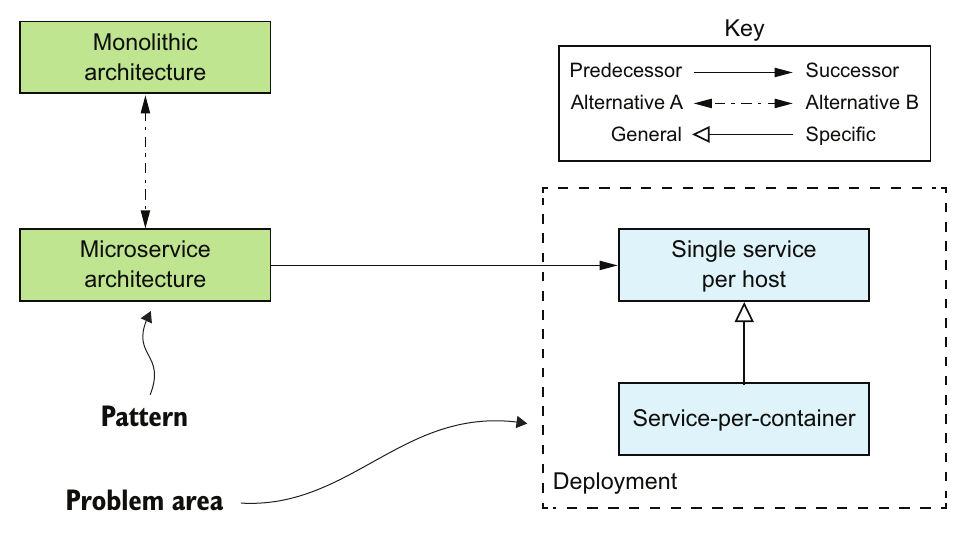

> **English:** Figure 1.9 The visual representation of different types of relationships between the patterns: a successor pattern solves a problem created by applying the predecessor pattern; two or more patterns can be alternative solutions to the same problem; one pattern can be a specialization of another pattern; and patterns that solve problems in the same area can be grouped, or generalized.
>
> **Türkçe:** Şekil 1.9 — Örüntüler arasındaki farklı ilişki türlerinin görsel gösterimi: Bir ardıl örüntü, öncül örüntünün uygulanmasıyla oluşan bir sorunu çözer; iki veya daha fazla örüntü aynı sorunun alternatif çözümleri olabilir; bir örüntü başka bir örüntünün özelleşmiş biçimi olabilir; aynı alandaki sorunları çözen örüntüler gruplandırılabilir veya genelleştirilebilir.

> **English:** The different kinds of relationships between patterns shown in figure 1.9 are represented as follows:
>
> **Türkçe:** Şekil 1.9’da gösterilen farklı örüntü ilişkileri aşağıdaki biçimlerde temsil edilir:

> **English:** • Represents the predecessor-successor relationship
>
> **Türkçe:** • Öncül-ardıl ilişkisini temsil eder.

> **English:** • Patterns that are alternative solutions to the same problem
>
> **Türkçe:** • Aynı sorunun alternatif çözümleri olan örüntüler.

> **English:** • Indicates that one pattern is a specialization of another pattern
>
> **Türkçe:** • Bir örüntünün başka bir örüntünün özelleşmiş biçimi olduğunu belirtir.

> **English:** • Patterns that apply to a particular problem area
>
> **Türkçe:** • Belirli bir problem alanına uygulanan örüntüler.

<!-- source-pages: 23 -->

> **English:** A collection of patterns related through these relationships sometimes form what is known as a pattern language. The patterns in a pattern language work together to solve problems in a particular domain. In particular, I’ve created the Microservice architecture pattern language. It’s a collection of interrelated software architecture and design patterns for microservices. Let’s take a look at this pattern language.
>
> **Türkçe:** Bu ilişkilerle birbirine bağlanan bir örüntü kümesi, bazen pattern language (örüntü dili) adı verilen yapıyı oluşturur. Bir örüntü dilindeki örüntüler, belirli bir alandaki sorunları çözmek için birlikte çalışır. Ben de mikroservis mimarisi örüntü dilini oluşturdum. Bu dil, mikroservislere yönelik, birbiriyle bağlantılı yazılım mimarisi ve tasarım örüntülerinden oluşur. Şimdi bu örüntü diline bakalım.

### 1.6.3 Overview of the Microservice architecture pattern language — Mikroservis mimarisi örüntü diline genel bakış

> **English:** The Microservice architecture pattern language is a collection of patterns that help you architect an application using the microservice architecture. Figure 1.10 shows the high-level structure of the pattern language. The pattern language first helps you decide whether to use the microservice architecture. It describes the monolithic architecture and the microservice architecture, along with their benefits and drawbacks. Then, if the microservice architecture is a good fit for your application, the pattern language helps you use it effectively by solving various architecture and design issues.
>
> **Türkçe:** Mikroservis mimarisi örüntü dili, mikroservis mimarisini kullanarak bir uygulamanın mimarisini tasarlamanıza yardımcı olan örüntülerden oluşur. Şekil 1.10, örüntü dilinin üst düzey yapısını gösterir. Örüntü dili önce mikroservis mimarisini kullanıp kullanmayacağınıza karar vermenize yardımcı olur. Monolitik mimariyi ve mikroservis mimarisini, yararları ve dezavantajlarıyla birlikte açıklar. Ardından mikroservis mimarisi uygulamanız için uygunsa, çeşitli mimari ve tasarım sorunlarını çözerek onu etkili biçimde kullanmanıza yardımcı olur.

<!-- source-pages: 23–24 -->

> **English:** The pattern language consists of several groups of patterns. On the left in figure 1.10 is the application architecture patterns group, the Monolithic architecture pattern and the Microservice architecture pattern. Those are the patterns we’ve been discussing in this chapter. The rest of the pattern language consists of groups of patterns that are solutions to issues that are introduced by using the Microservice architecture pattern.
>
> **Türkçe:** Örüntü dili, birkaç örüntü grubundan oluşur. Şekil 1.10’un solunda uygulama mimarisi örüntüleri grubu, yani Monolithic architecture ve Microservice architecture örüntüleri yer alır. Bunlar, bu bölüm boyunca ele aldığımız örüntülerdir. Örüntü dilinin geri kalanı, Microservice architecture örüntüsünü kullanmanın ortaya çıkardığı sorunları çözen örüntü gruplarından oluşur.

<!-- source-pages: 23 -->

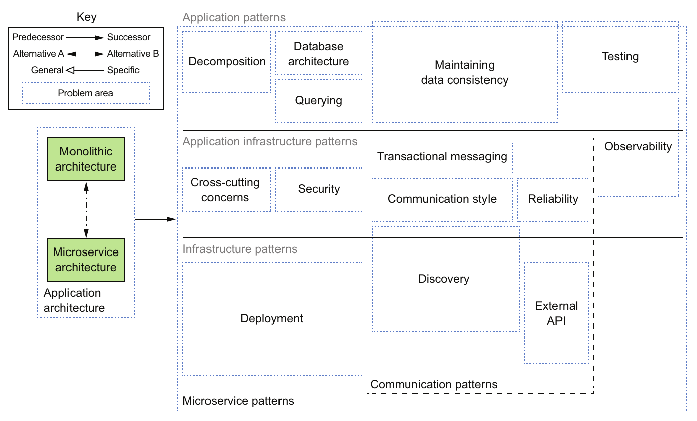

> **English:** Figure 1.10 A high-level view of the Microservice architecture pattern language showing the different problem areas that the patterns solve. On the left are the application architecture patterns: Monolithic architecture and Microservice architecture. All the other groups of patterns solve problems that result from choosing the Microservice architecture pattern.
>
> **Türkçe:** Şekil 1.10 — Mikroservis mimarisi örüntü dilinin, örüntülerin çözdüğü farklı problem alanlarını gösteren üst düzey görünümü. Solda uygulama mimarisi örüntüleri bulunur: Monolithic architecture ve Microservice architecture. Diğer tüm örüntü grupları, Microservice architecture örüntüsünün seçilmesi sonucunda ortaya çıkan sorunları çözer.

<!-- source-pages: 24 -->

> **English:** The patterns are also divided into three layers:
>
> **Türkçe:** Örüntüler ayrıca üç katmana ayrılır:

> **English:** • Infrastructure patterns —These solve problems that are mostly infrastructure issues outside of development.
>
> **Türkçe:** • Infrastructure patterns (altyapı örüntüleri) — Çoğunlukla geliştirme çalışmasının dışında kalan altyapı sorunlarını çözer.

> **English:** • Application infrastructure —These are for infrastructure issues that also impact development.
>
> **Türkçe:** • Application infrastructure (uygulama altyapısı) — Geliştirmeyi de etkileyen altyapı sorunlarını ele alır.

> **English:** • Application patterns—These solve problems faced by developers.
>
> **Türkçe:** • Application patterns (uygulama örüntüleri) — Geliştiricilerin karşılaştığı sorunları çözer.

> **English:** These patterns are grouped together based on the kind of problem they solve. Let’s look at the main groups of patterns.
>
> **Türkçe:** Bu örüntüler, çözdükleri sorunun türüne göre gruplandırılır. Şimdi başlıca örüntü gruplarını inceleyelim.

#### PATTERNS FOR DECOMPOSING AN APPLICATION INTO SERVICES — Bir uygulamayı servislere ayırma örüntüleri

> **English:** Deciding how to decompose a system into a set of services is very much an art, but there are a number of strategies that can help. The two decomposition patterns shown in figure 1.11 are different strategies you can use to define your application’s architecture.
>
> **Türkçe:** Bir sistemin bir servis kümesine nasıl ayrılacağına karar vermek büyük ölçüde ustalık gerektirir; ancak yardımcı olabilecek bazı stratejiler vardır. Şekil 1.11’de gösterilen iki ayrıştırma örüntüsü, uygulamanızın mimarisini tanımlamak için kullanabileceğiniz farklı stratejilerdir.

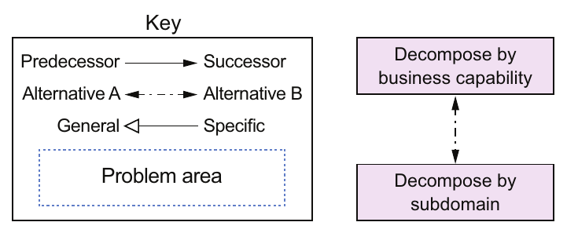

> **English:** Figure 1.11 There are two decomposition patterns: Decompose by business capability, which organizes services around business capabilities, and Decompose by subdomain, which organizes services around domain-driven design (DDD) subdomains.
>
> **Türkçe:** Şekil 1.11 — İki ayrıştırma örüntüsü vardır: Servisleri iş yetenekleri çevresinde düzenleyen Decompose by business capability (iş yeteneğine göre ayrıştırma) ve servisleri domain-driven design (DDD, alan odaklı tasarım) alt alanları çevresinde düzenleyen Decompose by subdomain (alt alana göre ayrıştırma).

> **English:** Chapter 2 describes these patterns in detail.
>
> **Türkçe:** Bölüm 2, bu örüntüleri ayrıntılı olarak açıklar.

#### COMMUNICATION PATTERNS — İletişim örüntüleri

> **English:** An application built using the microservice architecture is a distributed system. Consequently, interprocess communication (IPC) is an important part of the microservice architecture. You must make a variety of architectural and design decisions about how your services communicate with one another and the outside world. Figure 1.12 shows the communication patterns, which are organized into five groups:
>
> **Türkçe:** Mikroservis mimarisiyle oluşturulan bir uygulama, dağıtık bir sistemdir. Bu nedenle interprocess communication (IPC, süreçler arası iletişim), mikroservis mimarisinin önemli bir parçasıdır. Servislerinizin birbirleriyle ve dış dünyayla nasıl iletişim kuracağı konusunda çeşitli mimari ve tasarım kararları vermelisiniz. Şekil 1.12, beş grupta düzenlenmiş iletişim örüntülerini gösterir:

> **English:** • Communication style—What kind of IPC mechanism should you use?
>
> **Türkçe:** • Communication style (iletişim biçimi) — Ne tür bir IPC mekanizması kullanmalısınız?

> **English:** • Discovery—How does a client of a service determine the IP address of a service instance so that, for example, it makes an HTTP request?
>
> **Türkçe:** • Discovery (keşif) — Bir servisin istemcisi, örneğin HTTP isteği gönderebilmek için bir servis örneğinin IP adresini nasıl belirler?

> **English:** • Reliability—How can you ensure that communication between services is reliable even though services can be unavailable?
>
> **Türkçe:** • Reliability (güvenilirlik) — Servisler kullanılamaz duruma gelebilse bile servisler arasındaki iletişimin güvenilir olmasını nasıl sağlarsınız?

> **English:** • Transactional messaging—How should you integrate the sending of messages and publishing of events with database transactions that update business data?
>
> **Türkçe:** • Transactional messaging (işlemsel mesajlaşma) — Mesaj göndermeyi ve olay yayımlamayı, iş verilerini güncelleyen veritabanı transaction’larıyla nasıl bütünleştirmelisiniz?

> **English:** • External API—How do clients of your application communicate with the services?
>
> **Türkçe:** • External API (dış API) — Uygulamanızın istemcileri servislerle nasıl iletişim kurar?

<!-- source-pages: 25 -->

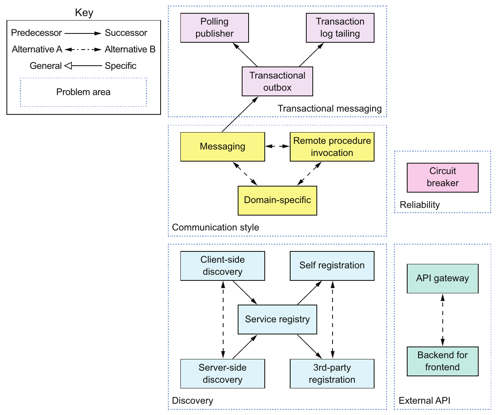

> **English:** Figure 1.12 The five groups of communication patterns
>
> **Türkçe:** Şekil 1.12 — İletişim örüntülerinin beş grubu.

> **English:** Chapter 3 looks at the first four groups of patterns: communication style, discovery, reliability, and transactional messaging. Chapter 8 looks at the external API patterns.
>
> **Türkçe:** Bölüm 3, ilk dört örüntü grubunu ele alır: iletişim biçimi, keşif, güvenilirlik ve işlemsel mesajlaşma. Bölüm 8 ise dış API örüntülerini inceler.

#### DATA CONSISTENCY PATTERNS FOR IMPLEMENTING TRANSACTION MANAGEMENT — Transaction yönetimini uygulamak için veri tutarlılığı örüntüleri

> **English:** As mentioned earlier, in order to ensure loose coupling, each service has its own database. Unfortunately, having a database per service introduces some significant issues. I describe in chapter 4 that the traditional approach of using distributed transactions (2PC) isn’t a viable option for a modern application. Instead, an application needs to maintain data consistency by using the Saga pattern. Figure 1.13 shows data-related patterns.
>
> **Türkçe:** Daha önce belirtildiği gibi, loose coupling (gevşek bağlılık) sağlamak için her servisin kendi veritabanı vardır. Ne yazık ki servis başına bir veritabanı bulunması bazı önemli sorunları beraberinde getirir. Bölüm 4’te, distributed transactions (dağıtık işlemler, 2PC) kullanmaya dayanan geleneksel yaklaşımın modern bir uygulama için uygun bir seçenek olmadığını açıklıyorum. Bunun yerine uygulamanın Saga örüntüsünü kullanarak veri tutarlılığını koruması gerekir. Şekil 1.13, verilerle ilişkili örüntüleri gösterir.

> **English:** Chapters 4, 5, and 6 describe these patterns in more detail.
>
> **Türkçe:** Bölüm 4, 5 ve 6 bu örüntüleri daha ayrıntılı açıklar.

#### PATTERNS FOR QUERYING DATA IN A MICROSERVICE ARCHITECTURE — Mikroservis mimarisinde veri sorgulama örüntüleri

> **English:** The other issue with using a database per service is that some queries need to join data that’s owned by multiple services. A service’s data is only accessible via its API, so you can’t use distributed queries against its database. Figure 1.14 shows a couple of patterns you can use to implement queries.
>
> **Türkçe:** Servis başına bir veritabanı kullanmanın diğer sorunu, bazı sorguların birden fazla servise ait verileri birleştirmeye ihtiyaç duymasıdır. Bir servisin verilerine yalnızca API’si aracılığıyla erişilebilir; dolayısıyla veritabanına yönelik dağıtık sorgular kullanamazsınız. Şekil 1.14, sorguları uygulamak için kullanabileceğiniz iki örüntüyü gösterir.

<!-- source-pages: 26 -->

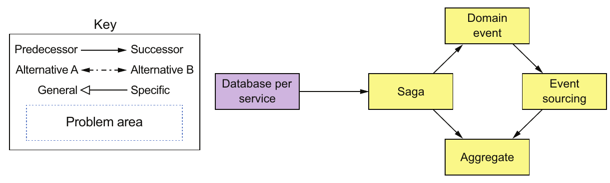

> **English:** Figure 1.13 Because each service has its own database, you must use the Saga pattern to maintain data consistency across services.
>
> **Türkçe:** Şekil 1.13 — Her servisin kendi veritabanı olduğu için, servisler arasında veri tutarlılığını korumak üzere Saga örüntüsünü kullanmalısınız.

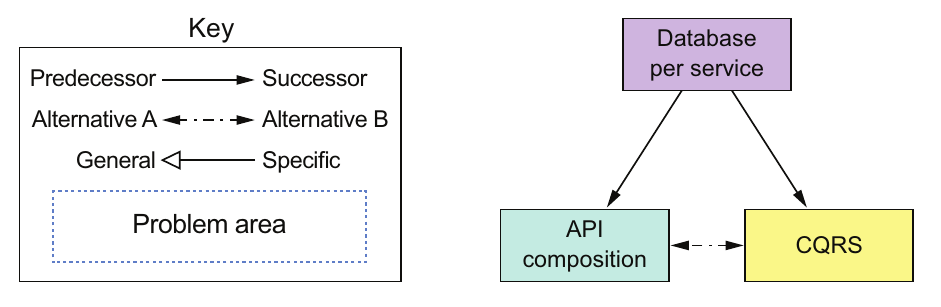

> **English:** Figure 1.14 Because each service has its own database, you must use one of the querying patterns to retrieve data scattered across multiple services.
>
> **Türkçe:** Şekil 1.14 — Her servisin kendi veritabanı olduğu için, birden fazla servise dağılmış verileri almak üzere sorgulama örüntülerinden birini kullanmalısınız.

> **English:** Sometimes you can use the API composition pattern, which invokes the APIs of one or more services and aggregates results. Other times, you must use the Command query responsibility segregation (CQRS) pattern, which maintains one or more easily queried replicas of the data. Chapter 7 looks at the different ways of implementing queries.
>
> **Türkçe:** Bazen bir veya daha fazla servisin API’lerini çağırıp sonuçları bir araya getiren API composition örüntüsünü kullanabilirsiniz. Başka durumlarda ise verilerin kolayca sorgulanabilen bir veya daha fazla kopyasını tutan Command query responsibility segregation (CQRS, komut ve sorgu sorumluluklarının ayrılması) örüntüsünü kullanmanız gerekir. Bölüm 7, sorguları uygulamanın farklı yollarını ele alır.

#### SERVICE DEPLOYMENT PATTERNS — Servis dağıtımı örüntüleri

> **English:** Deploying a monolithic application isn’t always easy, but it is straightforward in the sense that there is a single application to deploy. You have to run multiple instances of the application behind a load balancer.
>
> **Türkçe:** Monolitik bir uygulamayı dağıtmak her zaman kolay değildir; ancak dağıtılacak tek bir uygulama olması bakımından basittir. Uygulamanın birden fazla örneğini bir load balancer’ın (yük dengeleyici) arkasında çalıştırmanız gerekir.

> **English:** In comparison, deploying a microservices-based application is much more complex. There may be tens or hundreds of services that are written in a variety of languages and frameworks. There are many more moving parts that need to be managed. Figure 1.15 shows the deployment patterns.
>
> **Türkçe:** Buna karşılık mikroservis tabanlı bir uygulamayı dağıtmak çok daha karmaşıktır. Farklı diller ve framework’lerle yazılmış onlarca, hatta yüzlerce servis bulunabilir. Yönetilmesi gereken çok daha fazla bileşen vardır. Şekil 1.15, dağıtım örüntülerini gösterir.

> **English:** The traditional, and often manual, way of deploying applications in a language-specific packaging format, for example WAR files, doesn’t scale to support a microservice architecture. You need a highly automated deployment infrastructure. Ideally, you should use a deployment platform that provides the developer with a simple UI (command-line or GUI) for deploying and managing their services. The deployment platform will typically be based on virtual machines (VMs), containers, or serverless technology. Chapter 12 looks at the different deployment options.
>
> **Türkçe:** Uygulamaları WAR dosyaları gibi dile özgü paketleme biçimlerinde dağıtan geleneksel ve çoğu zaman elle yürütülen yöntem, mikroservis mimarisini destekleyecek ölçekte çalışmaz. Yüksek düzeyde otomatikleştirilmiş bir dağıtım altyapısına ihtiyacınız vardır. İdeal olarak, geliştiriciye servislerini dağıtmak ve yönetmek için basit bir kullanıcı arayüzü (komut satırı veya GUI) sağlayan bir dağıtım platformu kullanmalısınız. Bu platform genellikle sanal makinelere (VM), container’lara veya serverless (sunucusuz) teknolojiye dayanır. Bölüm 12, farklı dağıtım seçeneklerini ele alır.

<!-- source-pages: 27 -->

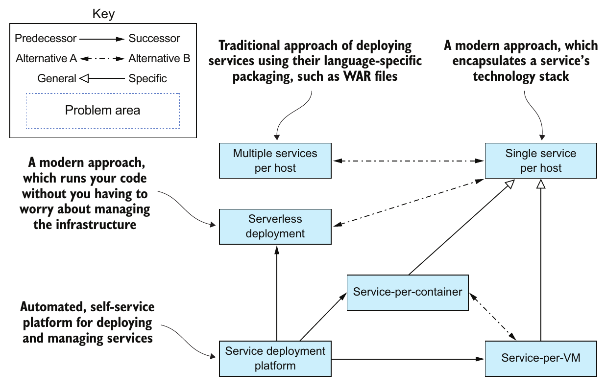

> **English:** Figure 1.15 Several patterns for deploying microservices. The traditional approach is to deploy services in a language-specific packaging format. There are two modern approaches to deploying services. The first deploys services as VM or containers. The second is the serverless approach. You simply upload the service’s code and the serverless platform runs it. You should use a service deployment platform, which is an automated, self-service platform for deploying and managing services.
>
> **Türkçe:** Şekil 1.15 — Mikroservisleri dağıtmak için çeşitli örüntüler. Geleneksel yaklaşım, servisleri dile özgü bir paketleme biçiminde dağıtmaktır. Servis dağıtımına yönelik iki modern yaklaşım vardır. İlki, servisleri VM veya container olarak dağıtır. İkincisi, serverless yaklaşımıdır. Servisin kodunu yüklersiniz; serverless platformu da onu çalıştırır. Servisleri dağıtmak ve yönetmek için otomatik çalışan, geliştiricilerin kendi kendilerine kullanabildiği bir servis dağıtım platformundan yararlanmalısınız.

#### OBSERVABILITY PATTERNS PROVIDE INSIGHT INTO APPLICATION BEHAVIOR — Gözlemlenebilirlik örüntüleri uygulamanın davranışını anlamayı sağlar

> **English:** A key part of operating an application is understanding its runtime behavior and troubleshooting problems such as failed requests and high latency. Though understanding and troubleshooting a monolithic application isn’t always easy, it helps that requests are handled in a simple, straightforward way. Each incoming request is load balanced to a particular application instance, which makes a few calls to the database and returns a response. For example, if you need to understand how a particular request was handled, you look at the log file of the application instance that handled the request.
>
> **Türkçe:** Bir uygulamayı işletmenin temel parçalarından biri, çalışma zamanındaki davranışını anlamak ve başarısız istekler ile yüksek gecikme gibi sorunları gidermektir. Monolitik bir uygulamayı anlamak ve sorunlarını gidermek her zaman kolay olmasa da isteklerin basit ve doğrudan bir biçimde işlenmesi bu işi kolaylaştırır. Gelen her istek, yük dengeleme yoluyla belirli bir uygulama örneğine yönlendirilir; o örnek de veritabanına birkaç çağrı yapıp yanıt döndürür. Örneğin belirli bir isteğin nasıl işlendiğini anlamanız gerekiyorsa, isteği işleyen uygulama örneğinin log dosyasına bakarsınız.

> **English:** In contrast, understanding and diagnosing problems in a microservice architecture is much more complicated. A request can bounce around between multiple services before a response is finally returned to a client. Consequently, there isn’t one log file to examine. Similarly, problems with latency are more difficult to diagnose because there are multiple suspects.
>
> **Türkçe:** Buna karşılık mikroservis mimarisinde sorunları anlamak ve tanılamak çok daha karmaşıktır. İstemciye nihai yanıt dönmeden önce bir istek, birden fazla servis arasında gidip gelebilir. Dolayısıyla incelenecek tek bir log dosyası yoktur. Benzer şekilde, birden fazla olası neden bulunduğu için gecikme sorunlarının kaynağını belirlemek de daha zordur.

> **English:** You can use the following patterns to design observable services:
>
> **Türkçe:** Observable services (davranışı gözlemlenebilen servisler) tasarlamak için aşağıdaki örüntüleri kullanabilirsiniz:

> **English:** • Health check API—Expose an endpoint that returns the health of the service.
>
> **Türkçe:** • Health check API (sağlık denetimi API’si) — Servisin sağlık durumunu döndüren bir endpoint (uç nokta) sunun.

> **English:** • Log aggregation—Log service activity and write logs into a centralized logging server, which provides searching and alerting.
>
> **Türkçe:** • Log aggregation (log birleştirme) — Servis etkinliklerini kaydedin ve logları arama ve uyarı özellikleri sunan merkezi bir log sunucusuna yazın.

<!-- source-pages: 28 -->

> **English:** • Distributed tracing—Assign each external request a unique ID and trace requests as they flow between services.
>
> **Türkçe:** • Distributed tracing (dağıtık iz sürme) — Dışarıdan gelen her isteğe benzersiz bir kimlik verin ve istekleri servisler arasında ilerlerken izleyin.

> **English:** • Exception tracking—Report exceptions to an exception tracking service, which deduplicates exceptions, alerts developers, and tracks the resolution of each exception.
>
> **Türkçe:** • Exception tracking (istisna takibi) — İstisnaları, yinelenen kayıtları birleştiren, geliştiricileri uyaran ve her istisnanın çözüm sürecini takip eden bir istisna izleme servisine bildirin.

> **English:** • Application metrics—Maintain metrics, such as counters and gauges, and expose them to a metrics server.
>
> **Türkçe:** • Application metrics (uygulama metrikleri) — Counter (sayaç) ve gauge (anlık değer göstergesi) gibi metrikleri tutun ve bir metrik sunucusunun erişimine sunun.

> **English:** • Audit logging—Log user actions.
>
> **Türkçe:** • Audit logging (denetim kaydı tutma) — Kullanıcı işlemlerini kaydedin.

> **English:** Chapter 11 describes these patterns in more detail.
>
> **Türkçe:** Bölüm 11, bu örüntüleri daha ayrıntılı açıklar.

#### PATTERNS FOR THE AUTOMATED TESTING OF SERVICES — Servislerin otomatik testine yönelik örüntüler

> **English:** The microservice architecture makes individual services easier to test because they’re much smaller than the monolithic application. At the same time, though, it’s important to test that the different services work together while avoiding using complex, slow, and brittle end-to-end tests that test multiple services together. Here are patterns for simplifying testing by testing services in isolation:
>
> **Türkçe:** Mikroservis mimarisi, servisler monolitik uygulamadan çok daha küçük olduğundan, her bir servisi test etmeyi kolaylaştırır. Bununla birlikte, farklı servislerin birlikte çalıştığını da test etmek önemlidir. Bunu yaparken birden fazla servisi birlikte sınayan karmaşık, yavaş ve değişikliklerden kolayca etkilenen uçtan uca testlerden kaçınmak gerekir. Servisleri birbirinden yalıtarak test etmeyi basitleştiren örüntüler şunlardır:

> **English:** • Consumer-driven contract test—Verify that a service meets the expectations of its clients.
>
> **Türkçe:** • Consumer-driven contract test (tüketici odaklı sözleşme testi) — Bir servisin istemcilerinin beklentilerini karşıladığını doğrulayın.

> **English:** • Consumer-side contract test—Verify that the client of a service can communicate with the service.
>
> **Türkçe:** • Consumer-side contract test (tüketici tarafı sözleşme testi) — Bir servisin istemcisinin o servisle iletişim kurabildiğini doğrulayın.

> **English:** • Service component test—Test a service in isolation.
>
> **Türkçe:** • Service component test (servis bileşen testi) — Bir servisi diğerlerinden yalıtarak test edin.

> **English:** Chapters 9 and 10 describe these testing patterns in more detail.
>
> **Türkçe:** Bölüm 9 ve 10, bu test örüntülerini daha ayrıntılı açıklar.

#### PATTERNS FOR HANDLING CROSS-CUTTING CONCERNS — Birden fazla bileşeni ilgilendiren ortak gereksinimleri ele alma örüntüleri

> **English:** In a microservice architecture, there are numerous concerns that every service must implement, including the observability patterns and discovery patterns. It must also implement the Externalized Configuration pattern, which supplies configuration parameters such as database credentials to a service at runtime. When developing a new service, it would be too time consuming to reimplement these concerns from scratch. A much better approach is to apply the Microservice Chassis pattern and build services on top of a framework that handles these concerns. Chapter 11 describes these patterns in more detail.
>
> **Türkçe:** Mikroservis mimarisinde her servisin uygulaması gereken pek çok ortak gereksinim vardır; gözlemlenebilirlik ve keşif örüntüleri bunlara dahildir. Her servis ayrıca, çalışma zamanında veritabanı kimlik bilgileri gibi yapılandırma parametrelerini servise sağlayan Externalized Configuration (yapılandırmayı uygulama dışından sağlama) örüntüsünü uygulamalıdır. Yeni bir servis geliştirirken bu gereksinimleri her seferinde sıfırdan gerçekleştirmek çok zaman alır. Çok daha iyi bir yaklaşım, Microservice Chassis (mikroservis iskeleti) örüntüsünü uygulamak ve servisleri bu ortak gereksinimleri karşılayan bir framework üzerine kurmaktır. Bölüm 11, bu örüntüleri daha ayrıntılı açıklar.

#### SECURITY PATTERNS — Güvenlik örüntüleri

> **English:** In a microservice architecture, users are typically authenticated by the API gateway. It must then pass information about the user, such as identity and roles, to the services it invokes. A common solution is to apply the Access token pattern. The API gateway passes an access token, such as JWT (JSON Web Token), to the services, which can validate the token and obtain information about the user. Chapter 11 discusses the Access token pattern in more detail.
>
> **Türkçe:** Mikroservis mimarisinde kullanıcıların kimliği genellikle API gateway (API ağ geçidi) tarafından doğrulanır. API gateway, ardından kullanıcının kimliği ve rolleri gibi bilgileri çağırdığı servislere iletmelidir. Yaygın bir çözüm, Access token (erişim belirteci) örüntüsünü uygulamaktır. API gateway, servislere JWT (JSON Web Token) gibi bir erişim belirteci gönderir; servisler bu belirteci doğrulayabilir ve kullanıcı hakkında bilgi edinebilir. Bölüm 11, Access token örüntüsünü daha ayrıntılı ele alır.

<!-- source-pages: 28–29 -->

> **English:** Not surprisingly, the patterns in the Microservice architecture pattern language are focused on solving architecture and design problems. You certainly need the right architecture in order to successfully develop software, but it’s not the only concern. You must also consider process and organization.
>
> **Türkçe:** Beklenebileceği gibi, mikroservis mimarisi örüntü dilindeki örüntüler mimari ve tasarım sorunlarını çözmeye odaklanır. Yazılımı başarıyla geliştirmek için elbette doğru mimariye ihtiyacınız vardır; ancak dikkate alınması gereken tek konu bu değildir. Süreçleri ve organizasyonu da göz önünde bulundurmalısınız.

<!-- source-pages: 29 -->

## 1.7 Beyond microservices: Process and organization — Mikroservislerin ötesi: Süreç ve organizasyon

> **English:** For a large, complex application, the microservice architecture is usually the best choice. But in addition to having the right architecture, successful software development requires you to also have organization, and development and delivery processes. Figure 1.16 shows the relationships between process, organization, and architecture.
>
> **Türkçe:** Büyük ve karmaşık bir uygulama için mikroservis mimarisi genellikle en iyi seçimdir. Ancak yazılım geliştirmede başarılı olmak, doğru mimariye ek olarak bir organizasyon yapısına, geliştirme süreçlerine ve teslim süreçlerine de sahip olmayı gerektirir. Şekil 1.16, süreç, organizasyon ve mimari arasındaki ilişkileri gösterir.

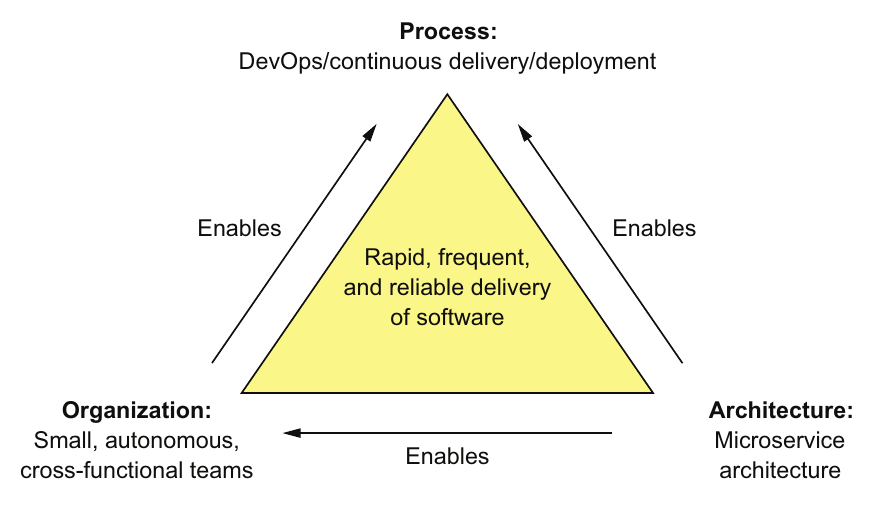

> **English:** Figure 1.16 The rapid, frequent, and reliable delivery of large, complex applications requires a combination of DevOps, which includes continuous delivery/deployment, small, autonomous teams, and the microservice architecture.
>
> **Türkçe:** Şekil 1.16 — Büyük ve karmaşık uygulamaların hızlı, sık ve güvenilir biçimde teslim edilmesi; sürekli teslimi/dağıtımı içeren DevOps yaklaşımını, küçük ve özerk ekipleri ve mikroservis mimarisini birlikte kullanmayı gerektirir.

> **English:** I’ve already described the microservice architecture. Let’s look at organization and process.
>
> **Türkçe:** Mikroservis mimarisini zaten açıkladım. Şimdi organizasyona ve süreçlere bakalım.

### 1.7.1 Software development and delivery organization — Yazılım geliştirme ve teslim organizasyonu

> **English:** Success inevitably means that the engineering team will grow. On the one hand, that’s a good thing because more developers can get more done. The trouble with large teams is, as Fred Brooks wrote in The Mythical Man-Month, the communication overhead of a team of size N is O(N²). If the team gets too large, it will become inefficient, due to the communication overhead. Imagine, for example, trying to do a daily standup with 20 people.
>
> **Türkçe:** Başarı, kaçınılmaz olarak mühendislik ekibinin büyümesi demektir. Bir açıdan bu iyi bir şeydir; çünkü daha fazla geliştirici daha çok iş yapabilir. Büyük ekiplerin sorunu ise Fred Brooks’un The Mythical Man-Month’ta yazdığı gibi, N kişilik bir ekibin iletişim yükünün O(N²) olmasıdır. Ekip çok büyürse iletişim yükü nedeniyle verimsiz hale gelir. Örneğin 20 kişiyle daily standup (günlük kısa ekip toplantısı) yapmaya çalıştığınızı düşünün.

> **English:** The solution is to refactor a large single team into a team of teams. Each team is small, consisting of no more than 8–12 people. It has a clearly defined business-oriented mission: developing and possibly operating one or more services that implement a feature or a business capability. The team is cross-functional and can develop, test, and deploy its services without having to frequently communicate or coordinate with other teams.
>
> **Türkçe:** Çözüm, tek bir büyük ekibi ekiplerden oluşan bir yapıya dönüştürmektir. Her ekip küçüktür; büyüklüğü 8–12 kişiyi aşmaz. Açıkça tanımlanmış, iş odaklı bir görevi vardır: Bir özelliği veya iş yeteneğini gerçekleştiren bir veya daha fazla servisi geliştirmek ve gerektiğinde işletmek. Ekip cross-functional (farklı uzmanlıkları bir araya getiren) yapıdadır; diğer ekiplerle sık sık iletişim kurmak veya koordinasyon sağlamak zorunda kalmadan servislerini geliştirebilir, test edebilir ve dağıtabilir.

<!-- source-pages: 30 -->

#### The reverse Conway maneuver — Ters Conway manevrası

> **English:** In order to effectively deliver software when using the microservice architecture, you need to take into account Conway’s law (https://en.wikipedia.org/wiki/Conway%27s_law), which states the following:
>
> **Türkçe:** Mikroservis mimarisini kullanırken yazılımı etkili biçimde teslim edebilmek için Conway’s law’u (Conway yasası) dikkate almalısınız (https://en.wikipedia.org/wiki/Conway%27s_law). Bu yasa şunu söyler:

> **English:** Organizations which design systems … are constrained to produce designs which are copies of the communication structures of these organizations. Melvin Conway
>
> **Türkçe:** “Sistem tasarlayan kuruluşlar … bu kuruluşların iletişim yapılarının kopyası olan tasarımlar üretmekle sınırlıdır.” — Melvin Conway

> **English:** In other words, your application’s architecture mirrors the structure of the organization that developed it. It’s important, therefore, to apply Conway’s law in reverse (www.thoughtworks.com/radar/techniques/inverse-conway-maneuver) and design your organization so that its structure mirrors your microservice architecture. By doing so, you ensure that your development teams are as loosely coupled as the services.
>
> **Türkçe:** Başka bir deyişle, uygulamanızın mimarisi onu geliştiren kuruluşun yapısını yansıtır. Bu nedenle Conway yasasını ters yönde uygulamak (www.thoughtworks.com/radar/techniques/inverse-conway-maneuver) ve organizasyonunuzu, yapısı mikroservis mimarinizi yansıtacak biçimde tasarlamak önemlidir. Böylece geliştirme ekiplerinizin de servisler kadar gevşek bağlı olmasını sağlarsınız.

> **English:** The velocity of the team of teams is significantly higher than that of a single large team. As described earlier in section 1.5.1, the microservice architecture plays a key role in enabling the teams to be autonomous. Each team can develop, deploy, and scale their services without coordinating with other teams. Moreover, it’s very clear who to contact when a service isn’t meeting its SLA.
>
> **Türkçe:** Ekiplerden oluşan bu yapının ilerleme hızı, tek bir büyük ekibinkinden belirgin biçimde yüksektir. Daha önce 1.5.1’de açıklandığı gibi, mikroservis mimarisi ekiplerin özerk olmasını sağlamada kilit rol oynar. Her ekip, diğer ekiplerle koordinasyon kurmadan kendi servislerini geliştirebilir, dağıtabilir ve ölçekleyebilir. Üstelik bir servis SLA’sını (hizmet düzeyi anlaşmasını) karşılamadığında kiminle iletişim kurulacağı da son derece açıktır.

> **English:** What’s more, the development organization is much more scalable. You grow the organization by adding teams. If a single team becomes too large, you split it and its associated service or services. Because the teams are loosely coupled, you avoid the communication overhead of a large team. As a result, you can add people without impacting productivity.
>
> **Türkçe:** Dahası, geliştirme organizasyonu çok daha kolay ölçeklenebilir. Organizasyonu yeni ekipler ekleyerek büyütürsünüz. Bir ekip çok büyürse o ekibi ve ilişkili servis ya da servislerini bölersiniz. Ekipler gevşek bağlı olduğu için büyük bir ekibin iletişim yükünden kaçınırsınız. Sonuç olarak üretkenliği olumsuz etkilemeden yeni kişiler ekleyebilirsiniz.

### 1.7.2 Software development and delivery process — Yazılım geliştirme ve teslim süreci

> **English:** Using the microservice architecture with a waterfall development process is like driving a horse-drawn Ferrari—you squander most of the benefit of using microservices. If you want to develop an application with the microservice architecture, it’s essential that you adopt agile development and deployment practices such as Scrum or Kanban. Better yet, you should practice continuous delivery/deployment, which is a part of DevOps.
>
> **Türkçe:** Mikroservis mimarisini waterfall (şelale) geliştirme süreciyle kullanmak, atların çektiği bir Ferrari’yi sürmeye benzer: Mikroservislerin sunduğu yararın büyük bölümünü boşa harcarsınız. Mikroservis mimarisiyle bir uygulama geliştirmek istiyorsanız, Scrum veya Kanban gibi çevik geliştirme ve dağıtım uygulamalarını benimsemeniz şarttır. Daha da iyisi, DevOps’un bir parçası olan continuous delivery/deployment (sürekli teslim/dağıtım) yaklaşımını uygulamalısınız.

> **English:** Jez Humble (https://continuousdelivery.com/) defines continuous delivery as follows:
>
> **Türkçe:** Jez Humble (https://continuousdelivery.com/), continuous delivery’yi şöyle tanımlar:

> **English:** Continuous Delivery is the ability to get changes of all types—including new features, configuration changes, bug fixes and experiments—into production, or into the hands of users, safely and quickly in a sustainable way.
>
> **Türkçe:** “Sürekli Teslim; yeni özellikler, yapılandırma değişiklikleri, hata düzeltmeleri ve deneyler dahil her tür değişikliği güvenli, hızlı ve sürdürülebilir biçimde üretim ortamına veya kullanıcıların eline ulaştırabilme yeteneğidir.”

<!-- source-pages: 30–31 -->

> **English:** A key characteristic of continuous delivery is that software is always releasable. It relies on a high level of automation, including automated testing. Continuous deployment takes continuous delivery one step further in the practice of automatically deploying releasable code into production. High-performing organizations that practice continuous deployment deploy multiple times per day into production, have far fewer production outages, and recover quickly from any that do occur (https://puppet.com/resources/whitepaper/state-of-devops-report). As described earlier in section 1.5.1, the microservice architecture directly supports continuous delivery/deployment.
>
> **Türkçe:** Sürekli teslimin temel özelliklerinden biri, yazılımın her zaman yayımlanabilir durumda olmasıdır. Bu yaklaşım, otomatik testler dahil yüksek düzeyde otomasyona dayanır. Continuous deployment (sürekli dağıtım), yayımlanmaya hazır kodu otomatik olarak üretim ortamına dağıtarak sürekli teslimi bir adım ileri taşır. Sürekli dağıtım uygulayan yüksek performanslı kuruluşlar, üretim ortamına günde birden fazla kez dağıtım yapar; çok daha az üretim kesintisi yaşar ve yaşanan kesintilerden hızla toparlanır (https://puppet.com/resources/whitepaper/state-of-devops-report). Daha önce 1.5.1’de açıklandığı gibi, mikroservis mimarisi sürekli teslimi/dağıtımı doğrudan destekler.

<!-- source-pages: 31 -->

#### Move fast without breaking things — Bir şeyleri bozmadan hızlı ilerleyin

> **English:** The goal of continuous delivery/deployment (and, more generally, DevOps) is to rapidly yet reliably deliver software. Four useful metrics for assessing software development are as follows:
>
> **Türkçe:** Sürekli teslimin/dağıtımın ve daha genel olarak DevOps’un amacı, yazılımı hızlı ve aynı zamanda güvenilir biçimde teslim etmektir. Yazılım geliştirmeyi değerlendirmek için yararlı dört metrik şunlardır:

> **English:** • Deployment frequency—How often software is deployed into production
>
> **Türkçe:** • Deployment frequency (dağıtım sıklığı) — Yazılımın üretim ortamına ne sıklıkla dağıtıldığı

> **English:** • Lead time—Time from a developer checking in a change to that change being deployed
>
> **Türkçe:** • Lead time (değişikliğin teslim süresi) — Bir geliştiricinin değişikliği sürüm kontrolüne kaydetmesinden o değişikliğin dağıtılmasına kadar geçen süre

> **English:** • Mean time to recover—Time to recover from a production problem
>
> **Türkçe:** • Mean time to recover (ortalama toparlanma süresi) — Üretim ortamındaki bir sorundan toparlanmak için gereken süre

> **English:** • Change failure rate—Percentage of changes that result in a production problem
>
> **Türkçe:** • Change failure rate (değişiklik başarısızlık oranı) — Üretim ortamında soruna yol açan değişikliklerin yüzdesi

> **English:** In a traditional organization, the deployment frequency is low, and the lead time is high. Stressed-out developers and operations people typically stay up late into the night fixing last-minute issues during the maintenance window. In contrast, a DevOps organization releases software frequently, often multiple times per day, with far fewer production issues. Amazon, for example, deployed changes into production every 11.6 seconds in 2014 (www.youtube.com/watch?v=dxk8b9rSKOo), and Netflix had a lead time of 16 minutes for one software component (https://medium.com/netflix-techblog/how-we-build-code-at-netflix-c5d9bd727f15).
>
> **Türkçe:** Geleneksel bir kuruluşta dağıtım sıklığı düşük, değişikliğin teslim süresi ise yüksektir. Stres altındaki geliştiriciler ve operasyon çalışanları, bakım aralığında son dakika sorunlarını çözmek için genellikle gece geç saatlere kadar çalışır. Buna karşılık bir DevOps kuruluşu, üretim ortamında çok daha az sorun yaşayarak yazılımı sık sık, çoğu zaman günde birden fazla kez yayımlar. Örneğin Amazon, 2014 yılında üretim ortamına her 11,6 saniyede bir değişiklik dağıtıyordu (www.youtube.com/watch?v=dxk8b9rSKOo); Netflix’te ise bir yazılım bileşeni için değişikliğin teslim süresi 16 dakikaydı (https://medium.com/netflix-techblog/how-we-build-code-at-netflix-c5d9bd727f15).

### 1.7.3 The human side of adopting microservices — Mikroservisleri benimsemenin insani yönü

> **English:** Adopting the microservice architecture changes your architecture, your organization, and your development processes. Ultimately, though, it changes the working environment of people, who are, as mentioned earlier, emotional creatures. If ignored, their emotions can make the adoption of microservices a bumpy ride. Mary and the other FTGO leaders will struggle to change how FTGO develops software.
>
> **Türkçe:** Mikroservis mimarisini benimsemek; mimarinizi, organizasyonunuzu ve geliştirme süreçlerinizi değiştirir. Ancak sonuçta bu değişim, daha önce belirtildiği gibi duygusal varlıklar olan insanların çalışma ortamını değiştirir. İnsanların duyguları göz ardı edilirse, mikroservisleri benimseme süreci sancılı hale gelebilir. Mary ve FTGO’nun diğer liderleri, FTGO’nun yazılım geliştirme biçimini değiştirmekte zorlanacaktır.

> **English:** The best-selling book Managing Transitions (Da Capo Lifelong Books, 2017, https://wmbridges.com/books) by William and Susan Bridges introduces the concept of a transition, which refers to the process of how people respond emotionally to a change. It describes a three-stage Transition Model:
>
> **Türkçe:** William ve Susan Bridges’in çok satan kitabı Managing Transitions (Da Capo Lifelong Books, 2017, https://wmbridges.com/books), insanların bir değişime duygusal olarak nasıl karşılık verdiği süreci anlatan transition (geçiş) kavramını tanıtır. Kitap üç aşamalı bir Transition Model (Geçiş Modeli) açıklar:

> **English:** 1. Ending, Losing, and Letting Go—The period of emotional upheaval and resistance when people are presented with a change that forces them out of their comfort zone. They often mourn the loss of the old way of doing things. For example, when people reorganize into cross-functional teams, they miss their former teammates. Similarly, a data modeling group that owns the global data model will be threatened by the idea of each service having its own data model.
>
> **Türkçe:** 1. Ending, Losing, and Letting Go (sona erme, kaybetme ve geride bırakma) — İnsanları konfor alanlarının dışına çıkmaya zorlayan bir değişiklikle karşılaştıklarında yaşadıkları duygusal çalkantı ve direnç dönemi. İnsanlar çoğu zaman işleri eski yapış biçimlerini kaybetmenin yasını tutar. Örneğin insanlar farklı uzmanlıkları bir araya getiren ekipler halinde yeniden örgütlendiğinde, eski ekip arkadaşlarını özler. Benzer şekilde, kuruluş genelindeki veri modelinden sorumlu bir veri modelleme grubu, her servisin kendi veri modeline sahip olması fikrini tehdit olarak algılar.

<!-- source-pages: 32 -->

> **English:** 2. The Neutral Zone—The intermediate stage between the old and new ways of doing things, where people are often confused. They are often struggling to learn the new way of doing things.
>
> **Türkçe:** 2. The Neutral Zone (tarafsız bölge) — İşleri yapmanın eski ve yeni biçimleri arasındaki, insanların çoğu zaman kafa karışıklığı yaşadığı ara aşama. İnsanlar genellikle yeni çalışma biçimini öğrenmekte zorlanır.

> **English:** 3. The New Beginning—The final stage where people have enthusiastically embraced the new way of doing things and are starting to experience the benefits.
>
> **Türkçe:** 3. The New Beginning (yeni başlangıç) — İnsanların yeni çalışma biçimini hevesle benimsediği ve yararlarını görmeye başladığı son aşama.

> **English:** The book describes how best to manage each stage of the transition and increase the likelihood of successfully implementing the change. FTGO is certainly suffering from monolithic hell and needs to migrate to a microservice architecture. It must also change its organization and development processes. In order for FTGO to successfully accomplish this, however, it must take into account the transition model and consider people’s emotions.
>
> **Türkçe:** Kitap, geçişin her aşamasının en iyi nasıl yönetileceğini ve değişikliği başarıyla uygulama olasılığının nasıl artırılacağını açıklar. FTGO kesinlikle monolitik çıkmazın sıkıntılarını yaşamaktadır ve mikroservis mimarisine geçmesi gerekmektedir. Organizasyonunu ve geliştirme süreçlerini de değiştirmelidir. Ancak FTGO’nun bunu başarıyla gerçekleştirebilmesi için geçiş modelini dikkate alması ve insanların duygularını göz önünde bulundurması gerekir.

> **English:** In the next chapter, you’ll learn about the goal of software architecture and how to decompose an application into services.
>
> **Türkçe:** Bir sonraki bölümde yazılım mimarisinin amacını ve bir uygulamanın servislere nasıl ayrılacağını öğreneceksiniz.

## Summary — Özet

> **English:** • The Monolithic architecture pattern structures the application as a single deployable unit.
>
> **Türkçe:** • Monolithic architecture (monolitik mimari) örüntüsü, uygulamayı tek bir dağıtılabilir birim olarak yapılandırır.

> **English:** • The Microservice architecture pattern decomposes a system into a set of independently deployable services, each with its own database.
>
> **Türkçe:** • Microservice architecture (mikroservis mimarisi) örüntüsü, bir sistemi her biri kendi veritabanına sahip ve bağımsız olarak dağıtılabilen servisler kümesine ayırır.

> **English:** • The monolithic architecture is a good choice for simple applications, but microservice architecture is usually a better choice for large, complex applications.
>
> **Türkçe:** • Monolitik mimari basit uygulamalar için iyi bir seçimdir; ancak mikroservis mimarisi büyük ve karmaşık uygulamalar için genellikle daha iyi bir seçimdir.

> **English:** • The microservice architecture accelerates the velocity of software development by enabling small, autonomous teams to work in parallel.
>
> **Türkçe:** • Mikroservis mimarisi, küçük ve özerk ekiplerin paralel çalışmasını sağlayarak yazılım geliştirme hızını artırır.

> **English:** • The microservice architecture isn’t a silver bullet—there are significant drawbacks, including complexity.
>
> **Türkçe:** • Mikroservis mimarisi her derde deva değildir; karmaşıklık dahil önemli dezavantajları vardır.

> **English:** • The Microservice architecture pattern language is a collection of patterns that help you architect an application using the microservice architecture. It helps you decide whether to use the microservice architecture, and if you pick the microservice architecture, the pattern language helps you apply it effectively.
>
> **Türkçe:** • Mikroservis mimarisi örüntü dili, mikroservis mimarisini kullanarak bir uygulamanın mimarisini oluşturmanıza yardımcı olan örüntülerden oluşur. Mikroservis mimarisini kullanıp kullanmayacağınıza karar vermenize yardımcı olur; bu mimariyi seçerseniz onu etkili biçimde uygulamanıza da yol gösterir.

> **English:** • You need more than just the microservice architecture to accelerate software delivery. Successful software development also requires DevOps and small, autonomous teams.
>
> **Türkçe:** • Yazılım teslimini hızlandırmak için yalnızca mikroservis mimarisi yeterli değildir. Başarılı yazılım geliştirme, DevOps’u ve küçük, özerk ekipleri de gerektirir.

> **English:** • Don’t forget about the human side of adopting microservices. You need to consider employees’ emotions in order to successfully transition to a microservice architecture.
>
> **Türkçe:** • Mikroservisleri benimsemenin insani yönünü unutmayın. Mikroservis mimarisine başarıyla geçebilmek için çalışanların duygularını dikkate almanız gerekir.

## Kısa tekrar — Özgün çalışma eki

Bu bölüm kaynak çevirisinin parçası değildir; okuma sonrasında kavramları hatırlamak için hazırlanmıştır.

| Kavram | Hatırlanacak ayrım |
|---|---|
| Monolit | Modülleri olabilir; paketleme ve dağıtım birimi genellikle bütündür. |
| X ekseni | Aynı uygulamanın kopyalarını yük dengeleyici arkasında çalıştırır. |
| Y ekseni | İşlevlere göre servis ayrıştırması yapar. |
| Z ekseni | Veri veya kullanıcı alt kümelerine göre bölümlendirir. |
| Mikroservis | Temel ölçüt satır sayısı değil, odaklı sorumluluk ve bağımsız değiştirilebilirliktir. |
| Servise ait veri | Sahiplik ve erişim sınırını tanımlar; her servis için fiziksel sunucu zorunluluğu anlamına gelmez. |
| Pattern | Belirli bağlamdaki tekrar eden soruna çözüm sunar; beraberinde maliyet ve yeni sorunlar getirebilir. |
| DevOps | Mimariyle birlikte organizasyon ve teslim sürecini de ele alır. |

> **Memory tip:** X = kopyala; Y = işlevlere ayır; Z = veriyi böl. Aynı sistemde bu üç yaklaşım birlikte kullanılabilir.

### Kendini kontrol et

Aşağıdakiler kaynak kitabın soruları değil, özgün çalışma sorularıdır.

1. Tek WAR içindeki düzenli Java package’ları neden tek başına bağımsız servis dağıtımı sağlamaz?
2. Her servisin kendi veritabanı olması, neden mutlaka ayrı veritabanı sunucusu gerektirmez?
3. Saga ile API composition farklı hangi sorunları ele alır?
4. Bir mikroserviste bellek sızıntısı olduğunda, neden diğer process’lerin belleği doğrudan bozulmaz; buna rağmen neden bazı kullanıcı işlemleri etkilenebilir?

### Kısa cevaplar

1. Package sınırı kodu düzenler; WAR tek dağıtım birimi olarak kaldığında yeni sürüm uygulamanın bütünüyle dağıtılır.
2. Temel gereksinim, verinin sahibi olan servisin erişim sınırıdır. Mantıksal olarak ayrılan veriler ortak fiziksel altyapıda bulunabilir.
3. Saga, servisler arasındaki çok adımlı güncellemelerde tutarlılık yönetimini; API composition, birden fazla servisten veri okuyup sorgu sonucu birleştirmeyi ele alır.
4. Ayrı process’ler bellek alanlarını ayırır. Ancak bağımlı bir servis yanıt veremezse onu çağıran işlem ağ hatası veya zaman aşımıyla karşılaşabilir; dayanıklılık ayrıca tasarlanır.

**Sonraki okuma:** Kaynağın 2. bölümü, *Decomposition strategies* (Ayrıştırma stratejileri), PDF sayfaları 33–64.
