# Ünite 02 · Decomposition strategies — Ayrıştırma stratejileri

**Amaç:** Ayrıştırma stratejileri konusunu İngilizce–Türkçe karşılaştırmalı çalışmak; teknik açıklamaları özgün şekiller, tablolar ve kod örnekleriyle birlikte okumak.

**Kaynak:** Kullanıcının sağladığı *Microservices Patterns*, bölüm 2; `Microservices_Patterns_1_Bolumden_Itibaren.pdf`, kaynak PDF sayfaları **33–64**. Başlık ve metin sırası korunmuş, sayfa sonlarında bölünen paragraflar birleştirilmiştir. Şekiller, üzerlerindeki yazılar korunarak kaynak PDF'den alınmıştır.

**Okuma notu:** Teknoloji ve şirket örnekleri kitabın yazıldığı dönemin anlatımıdır. Kodlar kaynakta verilen bağlama bağlı örneklerdir; bağımsız Java 17 programları olarak sunulmaz. İngilizce kaynak ve Türkçe çeviri ardışık bloklardadır. Çeviri hazırlığında yerel bir çeviri modeli kullanılmış; teknik terimler ve metin aktarımı ayrıca kontrol edilmiştir.

**Dil çalışması:** [Ünite sözlüğü](vocabulary.md) · [Vocabulary PDF](vocabulary.pdf) · [Grammar notları](grammar_notes.md) · [Grammar PDF](grammar_notes.pdf). Kelime anlamları ve cümle yapılarının ayrıntıları bu iki eşlikçi kaynaktadır.

<!-- source-pages: 33 -->

<!-- source-record: u02_0000 -->

## This chapter covers — Bu bölümün kapsamı

<!-- source-record: u02_0001 -->

> **English:** • Understanding software architecture and why it’s important
>
> **Türkçe:** Yazılım mimarisini ve neden önemli olduğunu anlamak.

<!-- source-record: u02_0002 -->

> **English:** • Decomposing an application into services by applying the decomposition patterns Decompose by business capability and Decompose by subdomain
>
> **Türkçe:** Decompose by business capability (iş yetkinliğine göre ayrıştırma) ve Decompose by subdomain (alt alana göre ayrıştırma) örüntülerini uygulayarak bir uygulamayı servislere ayırmak.

<!-- source-record: u02_0003 -->

> **English:** • Using the bounded context concept from domain-driven design (DDD) to untangle data and make decomposition easier
>
> **Türkçe:** Domain-driven design (DDD; alan odaklı tasarım) yaklaşımındaki bounded context (sınırlı bağlam) kavramını kullanarak verideki iç içe geçmiş ilişkileri çözmek ve ayrıştırmayı kolaylaştırmak.

<!-- source-record: u02_0004 -->

> **English:** Sometimes you have to be careful what you wish for. After an intense lobbying effort, Mary had finally convinced the business that migrating to a microservice architecture was the right thing to do. Feeling a mixture of excitement and some trepidation, Mary had a morning-long meeting with her architects to discuss where to begin. During the discussion, it became apparent that some aspects of the Microservice architecture pattern language, such as deployment and service discovery, were new and unfamiliar, yet straightforward. The key challenge, which is the essence of the microservice architecture, is the functional decomposition of the application into services. The first and most important aspect of the architecture is, therefore, the definition of the services. As they stood around the whiteboard, the FTGO team wondered exactly how to do that!
>
> **Türkçe:** Bazen ne dilediğinize dikkat etmeniz gerekir. Mary, yoğun bir ikna çabasının ardından, mikroservis mimarisine geçmenin doğru karar olduğuna iş birimini sonunda inandırmıştı. Heyecanla biraz kaygıyı bir arada hisseden Mary, nereden başlayacaklarını görüşmek için mimarlarıyla bütün sabah süren bir toplantı yaptı. Görüşme sırasında, mikroservis mimarisi örüntü dilinin deployment (dağıtım) ve service discovery (servis keşfi) gibi bazı yönlerinin yeni ve yabancı olmakla birlikte anlaşılır olduğu ortaya çıktı. Temel zorluk, mikroservis mimarisinin özünü oluşturan, uygulamayı işlevlerine göre servislere ayırmaktır. Bu nedenle mimarinin ilk ve en önemli yönü servislerin tanımlanmasıdır. Beyaz tahtanın etrafında duran FTGO ekibi, bunu tam olarak nasıl yapacaklarını düşünüyordu!

<!-- source-pages: 34 -->

<!-- source-record: u02_0005 -->

> **English:** In this chapter, you’ll learn how to define a microservice architecture for an application. I describe strategies for decomposing an application into services. You’ll learn that services are organized around business concerns rather than technical concerns. I also show how to use ideas from domain-driven design (DDD) to eliminate god classes, which are classes that are used throughout an application and cause tangled dependencies that prevent decomposition.
>
> **Türkçe:** Bu bölümde, bir uygulama için mikroservis mimarisini nasıl tanımlayacağınızı öğreneceksiniz. Uygulamayı servislere ayırma stratejilerini açıklayacağım. Servislerin teknik kaygılar çevresinde değil, işle ilgili sorumluluklar çevresinde düzenlendiğini öğreneceksiniz. Ayrıca uygulamanın her yerinde kullanılan ve ayrıştırmayı engelleyen iç içe geçmiş bağımlılıklara yol açan god class’ları (aşırı sorumluluk yüklenmiş merkezî sınıfları) ortadan kaldırmak için alan odaklı tasarımın fikirlerinden nasıl yararlanılacağını göstereceğim.

<!-- source-record: u02_0006 -->

> **English:** I begin this chapter by defining the microservice architecture in terms of software architecture concepts. After that, I describe a process for defining a microservice architecture for an application starting from its requirements. I discuss strategies for decomposing an application into a collection of services, obstacles to it, and how to overcome them. Let’s start by examining the concept of software architecture.
>
> **Türkçe:** Bu bölüme, mikroservis mimarisini yazılım mimarisi kavramlarıyla tanımlayarak başlayacağım. Ardından bir uygulamanın gereksinimlerinden başlayarak mikroservis mimarisini belirlemek için kullanılabilecek bir süreç açıklayacağım. Uygulamayı bir servisler topluluğuna ayırma stratejilerini, bunun önündeki engelleri ve bu engellerin nasıl aşılacağını ele alacağım. Yazılım mimarisi kavramını inceleyerek başlayalım.

<!-- source-record: u02_0007 -->

## 2.1 What is the microservice architecture exactly? — Mikroservis mimarisi tam olarak nedir?

<!-- source-record: u02_0008 -->

> **English:** Chapter 1 describes how the key idea of the microservice architecture is functional decomposition. Instead of developing one large application, you structure the application as a set of services. On one hand, describing the microservice architecture as a kind of functional decomposition is useful. But on the other hand, it leaves several questions unanswered, including how does the microservice architecture relate to the broader concepts of software architecture? What’s a service? And how important is the size of a service?
>
> **Türkçe:** Bölüm 1, mikroservis mimarisinin temel fikrinin functional decomposition (işlevsel ayrıştırma) olduğunu açıklar. Büyük bir uygulama geliştirmek yerine uygulamayı bir servisler kümesi olarak yapılandırırsınız. Mikroservis mimarisini bir işlevsel ayrıştırma türü olarak anlatmak bir yandan yararlıdır. Öte yandan bu tanım; mikroservis mimarisinin daha geniş yazılım mimarisi kavramlarıyla nasıl ilişkili olduğu, servisin ne olduğu ve bir servisin boyutunun ne kadar önemli olduğu gibi birçok soruyu yanıtsız bırakır.

<!-- source-record: u02_0009 -->

> **English:** In order to answer those questions, we need to take a step back and look at what is meant by software architecture. The architecture of a software application is its high-level structure, which consists of constituent parts and the dependencies between those parts. As you’ll see in this section, an application’s architecture is multidimensional, so there are multiple ways to describe it. The reason architecture is important is because it determines the application’s software quality attributes or -ilities. Traditionally, the goal of architecture has been scalability, reliability, and security. But today it’s important that the architecture also enables the rapid and safe delivery of software. You’ll learn that the microservice architecture is an architecture style that gives an application high maintainability, testability, and deployability.
>
> **Türkçe:** Bu soruları yanıtlamak için bir adım geri çekilip yazılım mimarisi ile ne kastedildiğine bakmamız gerekir. Bir yazılım uygulamasının mimarisi, onu oluşturan parçalardan ve bu parçalar arasındaki bağımlılıklardan meydana gelen üst düzey yapısıdır. Bu kısımda göreceğiniz gibi uygulama mimarisi çok boyutludur; bu yüzden onu anlatmanın birden fazla yolu vardır. Mimarinin önemli olmasının nedeni, uygulamanın software quality attributes (yazılım kalite nitelikleri), başka bir deyişle “-ilities” özelliklerini belirlemesidir. Geleneksel olarak mimarinin amacı ölçeklenebilirlik, güvenilirlik ve güvenlik olmuştur. Ancak günümüzde mimarinin, yazılımın hızlı ve güvenli biçimde teslim edilmesini de sağlaması önemlidir. Mikroservis mimarisinin, uygulamaya yüksek bakım yapılabilirlik, test edilebilirlik ve dağıtılabilirlik kazandıran bir mimari stil olduğunu öğreneceksiniz.

<!-- source-record: u02_0010 -->

> **English:** I begin this section by describing the concept of software architecture and why it’s important. Next, I discuss the idea of an architectural style. Then I define the microservice architecture as a particular architectural style. Let’s start by looking at the concept of software architecture.
>
> **Türkçe:** Bu kısma, yazılım mimarisi kavramını ve neden önemli olduğunu anlatarak başlayacağım. Daha sonra architectural style (mimari stil) fikrini ele alacağım. Ardından mikroservis mimarisini belirli bir mimari stil olarak tanımlayacağım. Yazılım mimarisi kavramına bakarak başlayalım.

<!-- source-record: u02_0011 -->

### 2.1.1 What is software architecture and why does it matter? — Yazılım mimarisi nedir ve neden önemlidir?

<!-- source-record: u02_0012 -->

> **English:** Architecture is clearly important. There are at least two conferences dedicated to the topic: O’Reilly Software Architecture Conference (https://conferences.oreilly.com/software-architecture) and the SATURN conference (https://resources.sei.cmu.edu/news-events/events/saturn/). Many developers have the goal of becoming an architect. But what is architecture and why does it matter?
>
> **Türkçe:** Mimarinin önemli olduğu açıktır. En az iki konferans bu konuya ayrılmıştır: O’Reilly Software Architecture Conference (https://conferences.oreilly.com/software-architecture) ve SATURN konferansı (https://resources.sei.cmu.edu/news-events/events/saturn/). Birçok geliştirici mimar olmayı hedefler. Peki mimari nedir ve neden önemlidir?

<!-- source-pages: 35 -->

<!-- source-record: u02_0013 -->

> **English:** To answer that question, I first define what is meant by the term software architecture. After that, I discuss how an application’s architecture is multidimensional and is best described using a collection of views or blueprints. I then describe that software architecture matters because of its impact on the application’s software quality attributes.
>
> **Türkçe:** Bu soruyu yanıtlamak için önce yazılım mimarisi terimiyle ne kastedildiğini tanımlayacağım. Ardından bir uygulamanın mimarisinin nasıl çok boyutlu olduğunu ve en iyi bir görünümler ya da planlar topluluğuyla anlatıldığını ele alacağım. Sonra yazılım mimarisinin, uygulamanın yazılım kalite niteliklerine etkisi nedeniyle neden önemli olduğunu açıklayacağım.

<!-- source-record: u02_0014 -->

#### A DEFINITION OF SOFTWARE ARCHITECTURE — Yazılım mimarisinin tanımı

<!-- source-record: u02_0015 -->

> **English:** There are numerous definitions of software architecture. For example, see https://en.wikiquote.org/wiki/Software_architecture to read some of them. My favorite definition comes from Len Bass and colleagues at the Software Engineering Institute (www.sei.cmu.edu), who played a key role in establishing software architecture as a discipline. They define software architecture as follows:
>
> **Türkçe:** Yazılım mimarisinin pek çok tanımı vardır. Bunlardan bazılarını okumak için örneğin https://en.wikiquote.org/wiki/Software_architecture adresine bakabilirsiniz. Benim en sevdiğim tanım, yazılım mimarisinin bir disiplin olarak yerleşmesinde önemli rol oynayan Software Engineering Institute’tan (www.sei.cmu.edu) Len Bass ve çalışma arkadaşlarına aittir. Yazılım mimarisini şöyle tanımlarlar:

<!-- source-record: u02_0016 -->

> **English:** The software architecture of a computing system is the set of structures needed to reason about the system, which comprise software elements, relations among them, and properties of both. Documenting Software Architectures by Bass et al.
>
> **Türkçe:** Bir bilişim sisteminin yazılım mimarisi; sistem üzerinde akıl yürütmek için gereken, yazılım öğelerini, bunlar arasındaki ilişkileri ve her ikisinin özelliklerini içeren yapılar bütünüdür. — Bass ve çalışma arkadaşları, Documenting Software Architectures.

<!-- source-record: u02_0017 -->

> **English:** That’s obviously a quite abstract definition. But its essence is that an application’s architecture is its decomposition into parts (the elements) and the relationships (the relations) between those parts. Decomposition is important for a couple of reasons:
>
> **Türkçe:** Bu, elbette oldukça soyut bir tanımdır. Ancak özü şudur: Bir uygulamanın mimarisi, uygulamanın parçalara (öğelere) ayrılması ve bu parçalar arasındaki bağlantılardır (ilişkilerdir). Ayrıştırma birkaç nedenle önemlidir:

<!-- source-record: u02_0018 -->

> **English:** • It facilitates the division of labor and knowledge. It enables multiple people (or multiple teams) with possibly specialized knowledge to work productively together on an application.
>
> **Türkçe:** İş ve bilgi paylaşımını kolaylaştırır. Muhtemelen uzmanlaşmış bilgiye sahip birden fazla kişinin ya da ekibin, bir uygulama üzerinde birlikte verimli çalışmasını sağlar.

<!-- source-record: u02_0019 -->

> **English:** • It defines how the software elements interact.
>
> **Türkçe:** Yazılım öğelerinin nasıl etkileşeceğini tanımlar.

<!-- source-record: u02_0020 -->

> **English:** It’s the decomposition into parts and the relationships between those parts that determine the application’s -ilities.
>
> **Türkçe:** Uygulamanın “-ilities” kalite özelliklerini belirleyen, parçalara ayrılma biçimi ve bu parçalar arasındaki ilişkilerdir.

<!-- source-record: u02_0021 -->

#### THE 4+1 VIEW MODEL OF SOFTWARE ARCHITECTURE — Yazılım mimarisinin 4+1 görünüm modeli

<!-- source-record: u02_0022 -->

> **English:** More concretely, an application’s architecture can be viewed from multiple perspectives, in the same way that a building’s architecture can be viewed from structural, plumbing, electrical, and other perspectives. Phillip Krutchen wrote a classic paper describing the 4+1 view model of software architecture, “Architectural Blueprints— The ‘4+1’ View Model of Software Architecture” (www.cs.ubc.ca/~gregor/teaching/ papers/4+1view-architecture.pdf). The 4+1 model, shown in Figure 2.1, defines four different views of a software architecture. Each describes a particular aspect of the architecture and consists of a particular set of software elements and relationships between them.
>
> **Türkçe:** Daha somut ifade edersek, bir binanın mimarisine taşıyıcı sistem, su tesisatı, elektrik tesisatı ve diğer açılardan bakılabildiği gibi, bir uygulamanın mimarisi de birden fazla bakış açısından görülebilir. Phillip Krutchen, yazılım mimarisinin 4+1 görünüm modelini anlatan klasik bir makale yazmıştır: “Architectural Blueprints—The ‘4+1’ View Model of Software Architecture” (www.cs.ubc.ca/~gregor/teaching/papers/4+1view-architecture.pdf). Şekil 2.1’de gösterilen 4+1 modeli, bir yazılım mimarisinin dört farklı görünümünü tanımlar. Her görünüm, mimarinin belirli bir yönünü açıklar; belirli bir yazılım öğeleri kümesinden ve bunlar arasındaki ilişkilerden oluşur.

<!-- source-record: u02_0023 -->

> **English:** The purpose of each view is as follows:
>
> **Türkçe:** Her görünümün amacı şöyledir:

<!-- source-record: u02_0024 -->

> **English:** • Logical view—The software elements that are created by developers. In object-oriented languages, these elements are classes and packages. The relations between them are the relationships between classes and packages, including inheritance, associations, and depends-on.
>
> **Türkçe:** Logical view (mantıksal görünüm)—Geliştiricilerin oluşturduğu yazılım öğeleri. Nesne yönelimli dillerde bu öğeler sınıflar ve paketlerdir. Aralarındaki ilişkiler; kalıtım, ilişkilendirmeler ve bağımlılıklar dâhil sınıflar ile paketler arasındaki ilişkilerdir.

<!-- source-record: u02_0025 -->

> **English:** • Implementation view—The output of the build system. This view consists of modules, which represent packaged code, and components, which are executable or deployable units consisting of one or more modules. In Java, a module is a JAR file, and a component is typically a WAR file or an executable JAR file. The relations between them include dependency relationships between modules and composition relationships between components and modules.
>
> **Türkçe:** • Gerçekleştirim görünümü — Build sisteminin çıktısıdır. Bu görünüm, paketlenmiş kodu temsil eden modüllerden ve bir veya daha fazla modülden oluşan çalıştırılabilir ya da dağıtılabilir birimler olan bileşenlerden oluşur. Java’da modül bir JAR dosyasıdır; bileşen ise genellikle bir WAR dosyası veya çalıştırılabilir JAR dosyasıdır. Aralarındaki ilişkiler, modüller arasındaki bağımlılıkları ve bileşenlerle modüller arasındaki bileşim ilişkilerini içerir.

<!-- source-pages: 36 -->

<!-- source-record: u02_0026 -->

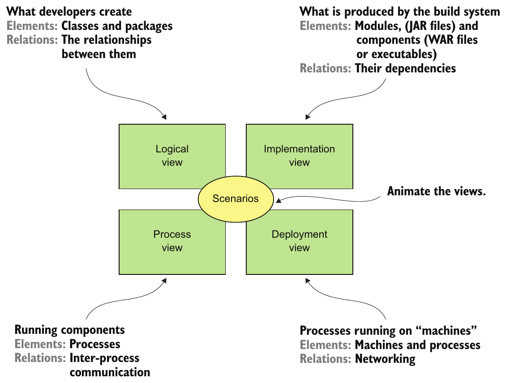

> **English:** Figure 2.1 The 4+1 view model describes an application’s architecture using four views, along with scenarios that show how the elements within each view collaborate to handle requests.
>
> **Türkçe:** Şekil 2.1 4+1 görünüm modeli, bir uygulamanın mimarisini dört görünümle ve her görünüm içindeki öğelerin istekleri karşılamak için nasıl işbirliği yaptığını gösteren senaryolarla açıklar.

<!-- source-record: u02_0027 -->

> **English:** • Process view—The components at runtime. Each element is a process, and the relations between processes represent interprocess communication.
>
> **Türkçe:** Process view (süreç görünümü)—Çalışma zamanındaki bileşenlerdir. Her öğe bir süreçtir; süreçler arasındaki ilişkiler ise süreçler arası iletişimi temsil eder.

<!-- source-record: u02_0028 -->

> **English:** • Deployment—How the processes are mapped to machines. The elements in this view consist of (physical or virtual) machines and the processes. The relations between machines represent networking. This view also describes the relationship between processes and machines.
>
> **Türkçe:** Deployment (dağıtım)—Süreçlerin makinelere nasıl eşlendiğidir. Bu görünümdeki öğeler, fiziksel veya sanal makinelerden ve süreçlerden oluşur. Makineler arasındaki ilişkiler ağ bağlantılarını temsil eder. Görünüm, süreçlerle makineler arasındaki ilişkiyi de açıklar.

<!-- source-record: u02_0029 -->

> **English:** In addition to these four views, there are the scenarios—the +1 in the 4+1 model— that animate views. Each scenario describes how the various architectural components within a particular view collaborate in order to handle a request. A scenario in the logical view, for example, shows how the classes collaborate. Similarly, a scenario in the process view shows how the processes collaborate.
>
> **Türkçe:** Bu dört görünüme ek olarak, görünümleri canlandıran senaryolar vardır; bunlar 4+1 modelindeki +1’dir. Her senaryo, belirli bir görünümdeki çeşitli mimari bileşenlerin bir isteği karşılamak için nasıl işbirliği yaptığını açıklar. Örneğin mantıksal görünümdeki bir senaryo, sınıfların nasıl işbirliği yaptığını gösterir. Benzer biçimde süreç görünümündeki bir senaryo, süreçlerin nasıl işbirliği yaptığını gösterir.

<!-- source-record: u02_0030 -->

> **English:** The 4+1 view model is an excellent way to describe an application’s architecture. Each view describes an important aspect of the architecture, and the scenarios illustrate how the elements of a view collaborate. Let’s now look at why architecture is important.
>
> **Türkçe:** 4+1 görünüm modeli, uygulamanın mimarisini açıklamanın çok iyi bir yoludur. Her görünüm mimarinin önemli bir yönünü açıklar; senaryolar ise bir görünümün öğelerinin nasıl işbirliği yaptığını gösterir. Şimdi mimarinin neden önemli olduğuna bakalım.

<!-- source-pages: 37 -->

<!-- source-record: u02_0031 -->

#### WHY ARCHITECTURE MATTERS — Mimari neden önemlidir?

<!-- source-record: u02_0032 -->

> **English:** An application has two categories of requirements. The first category includes the functional requirements, which define what the application must do. They’re usually in the form of use cases or user stories. Architecture has very little to do with the functional requirements. You can implement functional requirements with almost any architecture, even a big ball of mud.
>
> **Türkçe:** Bir uygulamanın gereksinimleri iki kategoriye ayrılır. İlk kategori, uygulamanın ne yapması gerektiğini tanımlayan functional requirements (işlevsel gereksinimler) içerir. Bunlar genellikle use case (kullanım durumu) veya user story (kullanıcı hikâyesi) biçimindedir. Mimarinin işlevsel gereksinimlerle ilişkisi çok sınırlıdır. İşlevsel gereksinimleri, bir big ball of mud (büyük çamur yığını) bile dâhil, hemen her mimariyle gerçekleştirebilirsiniz.

<!-- source-record: u02_0033 -->

> **English:** Architecture is important because it enables an application to satisfy the second category of requirements: its quality of service requirements. These are also known as quality attributes and are the so-called -ilities. The quality of service requirements define the runtime qualities such as scalability and reliability. They also define development time qualities including maintainability, testability, and deployability. The architecture you choose for your application determines how well it meets these quality requirements.
>
> **Türkçe:** Mimari önemlidir; çünkü uygulamanın ikinci gereksinim kategorisini, quality of service requirements (hizmet kalitesi gereksinimlerini) karşılayabilmesini sağlar. Bunlara quality attributes (kalite nitelikleri) de denir ve söz konusu “-ilities” bunlardır. Hizmet kalitesi gereksinimleri, ölçeklenebilirlik ve güvenilirlik gibi çalışma zamanı niteliklerini tanımlar. Ayrıca bakım yapılabilirlik, test edilebilirlik ve dağıtılabilirlik gibi geliştirme zamanı niteliklerini de tanımlar. Uygulamanız için seçtiğiniz mimari, bu kalite gereksinimlerini ne ölçüde karşılayacağını belirler.

<!-- source-record: u02_0034 -->

### 2.1.2 Overview of architectural styles — Mimari stillere genel bakış

<!-- source-record: u02_0035 -->

> **English:** In the physical world, a building’s architecture often follows a particular style, such as Victorian, American Craftsman, or Art Deco. Each style is a package of design decisions that constrains a building’s features and building materials. The concept of architectural style also applies to software. David Garlan and Mary Shaw (An Introduction to Software Architecture, January 1994, https://www.cs.cmu.edu/afs/cs/project/able/ftp/intro_softarch/intro_softarch.pdf), pioneers in the discipline of software architecture, define an architectural style as follows:
>
> **Türkçe:** Fiziksel dünyada bir binanın mimarisi genellikle Viktorya, American Craftsman veya Art Deco gibi belirli bir stile uyar. Her stil, binanın özelliklerini ve yapı malzemelerini sınırlandıran bir tasarım kararları paketidir. Mimari stil kavramı yazılım için de geçerlidir. Yazılım mimarisi disiplininin öncülerinden David Garlan ve Mary Shaw, *An Introduction to Software Architecture* (Ocak 1994, https://www.cs.cmu.edu/afs/cs/project/able/ftp/intro_softarch/intro_softarch.pdf) çalışmasında mimari stili şöyle tanımlar:

<!-- source-record: u02_0036 -->

> **English:** An architectural style, then, defines a family of such systems in terms of a pattern of structural organization. More specifically, an architectural style determines the vocabulary of components and connectors that can be used in instances of that style, together with a set of constraints on how they can be combined.
>
> **Türkçe:** Bir mimari stil, böyle sistemlerden oluşan bir aileyi yapısal düzen örüntüsü açısından tanımlar. Daha açık bir ifadeyle, bir mimari stil, o stilin örneklerinde kullanılabilecek bileşenlerin ve bağlayıcıların söz varlığını; bunların nasıl birleştirilebileceğine ilişkin bir kısıtlar kümesiyle birlikte belirler.

<!-- source-record: u02_0037 -->

> **English:** A particular architectural style provides a limited palette of elements (components) and relations (connectors) from which you can define a view of your application’s architecture. An application typically uses a combination of architectural styles. For example, later in this section I describe how the monolithic architecture is an architectural style that structures the implementation view as a single (executable/deployable) component. The microservice architecture structures an application as a set of loosely coupled services.
>
> **Türkçe:** Belirli bir mimari stil, uygulamanızın mimarisine ait bir görünümü tanımlamak için kullanabileceğiniz sınırlı sayıda öğe (bileşen) ve ilişki (bağlayıcı) sunar. Bir uygulama genellikle birden fazla mimari stili bir arada kullanır. Örneğin bu kısmın ilerleyen bölümünde, monolitik mimarinin gerçekleştirim görünümünü tek bir çalıştırılabilir/dağıtılabilir bileşen olarak yapılandıran bir mimari stil olduğunu anlatacağım. Mikroservis mimarisi ise uygulamayı loosely coupled services (gevşek bağlı servisler) kümesi olarak yapılandırır.

<!-- source-record: u02_0038 -->

#### THE LAYERED ARCHITECTURAL STYLE — Katmanlı mimari stili

<!-- source-record: u02_0039 -->

> **English:** The classic example of an architectural style is the layered architecture. A layered architecture organizes software elements into layers. Each layer has a well-defined set of responsibilities. A layered architecture also constrains the dependencies between the layers. A layer can only depend on either the layer immediately below it (if strict layering) or any of the layers below it.
>
> **Türkçe:** Mimari stilin klasik örneği, katmanlı mimaridir. Katmanlı mimari, yazılım öğelerini katmanlara ayırır. Her katmanın açıkça belirlenmiş sorumlulukları vardır. Katmanlar arasındaki bağımlılıklar da sınırlandırılır. Bir katman, katı katmanlama uygulanıyorsa yalnızca hemen altındaki katmana; aksi durumda altındaki katmanlardan herhangi birine bağımlı olabilir.

<!-- source-pages: 38 -->

<!-- source-record: u02_0040 -->

> **English:** You can apply the layered architecture to any of the four views discussed earlier. The popular three-tier architecture is the layered architecture applied to the logical view. It organizes the application’s classes into the following tiers or layers:
>
> **Türkçe:** Katmanlı mimariyi, daha önce ele alınan dört görünümden herhangi birine uygulayabilirsiniz. Yaygın three-tier architecture (üç katmanlı mimari), mantıksal görünüme uygulanmış katmanlı mimaridir. Uygulamanın sınıflarını şu katmanlar hâlinde düzenler:

<!-- source-record: u02_0041 -->

> **English:** • Presentation layer—Contains code that implements the user interface or external APIs
>
> **Türkçe:** Presentation layer (sunum katmanı)—Kullanıcı arayüzünü veya dış API’leri gerçekleştiren kodu içerir.

<!-- source-record: u02_0042 -->

> **English:** • Business logic layer—Contains the business logic
>
> **Türkçe:** Business logic layer (iş mantığı katmanı)—İş mantığını içerir.

<!-- source-record: u02_0043 -->

> **English:** • Persistence layer—Implements the logic of interacting with the database
>
> **Türkçe:** Persistence layer (kalıcılık katmanı)—Veritabanıyla etkileşim mantığını gerçekleştirir.

<!-- source-record: u02_0044 -->

> **English:** The layered architecture is a great example of an architectural style, but it does have some significant drawbacks:
>
> **Türkçe:** Katmanlı mimari, mimari stile çok iyi bir örnektir; ancak önemli dezavantajları vardır:

<!-- source-record: u02_0045 -->

> **English:** • Single presentation layer—It doesn’t represent the fact that an application is likely to be invoked by more than just a single system.
>
> **Türkçe:** Tek sunum katmanı—Bir uygulamanın yalnızca tek bir sistem tarafından çağrılmasının ötesinde bir kullanımının olabileceğini yansıtmaz.

<!-- source-record: u02_0046 -->

> **English:** • Single persistence layer—It doesn’t represent the fact that an application is likely to interact with more than just a single database.
>
> **Türkçe:** Tek kalıcılık katmanı—Bir uygulamanın yalnızca tek bir veritabanından daha fazlasıyla etkileşebileceğini yansıtmaz.

<!-- source-record: u02_0047 -->

> **English:** • Defines the business logic layer as depending on the persistence layer—In theory, this dependency prevents you from testing the business logic without the database.
>
> **Türkçe:** İş mantığı katmanını kalıcılık katmanına bağımlı tanımlar—Teoride bu bağımlılık, iş mantığını veritabanı olmadan test etmenizi engeller.

<!-- source-record: u02_0048 -->

> **English:** Also, the layered architecture misrepresents the dependencies in a well-designed application. The business logic typically defines an interface or a repository of interfaces that define data access methods. The persistence tier defines DAO classes that implement the repository interfaces. In other words, the dependencies are the reverse of what’s depicted by a layered architecture.
>
> **Türkçe:** Ayrıca katmanlı mimari, iyi tasarlanmış bir uygulamadaki bağımlılıkları yanlış gösterir. İş mantığı tipik olarak veri erişim metotlarını tanımlayan bir arayüz ya da repository arayüzleri tanımlar. Kalıcılık katmanı ise repository arayüzlerini gerçekleştiren DAO sınıflarını tanımlar. Başka bir deyişle, bağımlılıklar katmanlı mimarinin gösterdiğinin tersidir.

<!-- source-record: u02_0049 -->

> **English:** Let’s look at an alternative architecture that overcomes these drawbacks: the hexagonal architecture.
>
> **Türkçe:** Bu dezavantajları aşan alternatif bir mimariye, hexagonal architecture’a (altıgen mimariye) bakalım.

<!-- source-record: u02_0050 -->

#### ABOUT THE HEXAGONAL ARCHITECTURE STYLE — Altıgen mimari stili hakkında

<!-- source-record: u02_0051 -->

> **English:** Hexagonal architecture is an alternative to the layered architectural style. As figure 2.2 shows, the hexagonal architecture style organizes the logical view in a way that places the business logic at the center. Instead of the presentation layer, the application has one or more inbound adapters that handle requests from the outside by invoking the business logic. Similarly, instead of a data persistence tier, the application has one or more outbound adapters that are invoked by the business logic and invoke external applications. A key characteristic and benefit of this architecture is that the business logic doesn’t depend on the adapters. Instead, they depend upon it.
>
> **Türkçe:** Altıgen mimari, katmanlı mimari stilinin alternatifidir. Şekil 2.2’de gösterildiği gibi, mantıksal görünümü iş mantığı merkezde olacak biçimde düzenler. Sunum katmanı yerine uygulamanın, iş mantığını çağırarak dışarıdan gelen istekleri karşılayan bir veya daha fazla inbound adapter’ı (giriş uyarlayıcısı) vardır. Benzer şekilde, veri kalıcılığı katmanı yerine uygulamada iş mantığının çağırdığı ve dış uygulamaları çağıran bir veya daha fazla outbound adapter (çıkış uyarlayıcısı) bulunur. Bu mimarinin temel özelliği ve yararı, iş mantığının adapter’lara bağımlı olmamasıdır. Bunun yerine adapter’lar iş mantığına bağımlıdır.

<!-- source-record: u02_0052 -->

> **English:** The business logic has one or more ports. A port defines a set of operations and is how the business logic interacts with what’s outside of it. In Java, for example, a port is often a Java interface. There are two kinds of ports: inbound and outbound ports. An inbound port is an API exposed by the business logic, which enables it to be invoked by external applications. An example of an inbound port is a service interface, which defines a service’s public methods. An outbound port is how the business logic invokes external systems. An example of an output port is a repository interface, which defines a collection of data access operations.
>
> **Türkçe:** İş mantığının bir veya daha fazla port’u vardır. Port, bir işlem kümesi tanımlar ve iş mantığının dış dünyayla etkileşim kurmasını sağlar. Örneğin Java’da bir port çoğunlukla bir interface’tir. İki port türü vardır: inbound ve outbound. Inbound port, dış uygulamaların iş mantığını çağırmasını sağlayan, iş mantığının sunduğu API’dir. Örneğin servisin public metotlarını tanımlayan servis arayüzü bir inbound port’tur. Outbound port ise iş mantığının dış sistemleri çağırma yoludur. Bir veri erişim işlemleri kümesini tanımlayan repository arayüzü, outbound port örneğidir.

<!-- source-pages: 39 -->

<!-- source-record: u02_0053 -->

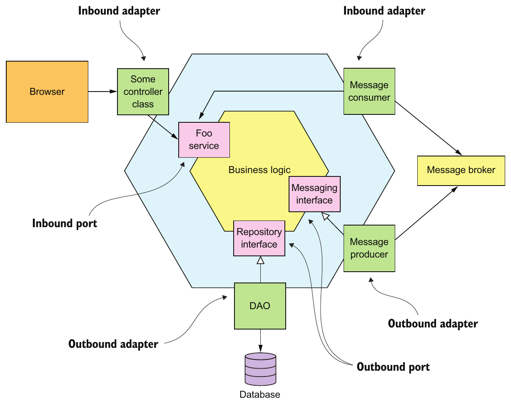

> **English:** Figure 2.2 An example of a hexagonal architecture, which consists of the business logic and one or more adapters that communicate with external systems. The business logic has one or more ports. Inbound adapters, which handle requests from external systems, invoke an inbound port. An outbound adapter implements an outbound port, and invokes an external system.
>
> **Türkçe:** Şekil 2.2 İş mantığından ve dış sistemlerle iletişim kuran bir veya daha fazla adapter’dan oluşan altıgen mimari örneği. İş mantığının bir veya daha fazla port’u vardır. Dış sistemlerden gelen istekleri karşılayan inbound adapter’lar bir inbound port’u çağırır. Outbound adapter ise bir outbound port’u gerçekleştirir ve dış sistemi çağırır.

<!-- source-record: u02_0054 -->

> **English:** Surrounding the business logic are adapters. As with ports, there are two types of adapters: inbound and outbound. An inbound adapter handles requests from the outside world by invoking an inbound port. An example of an inbound adapter is a Spring MVC Controller that implements either a set of REST endpoints or a set of web pages. Another example is a message broker client that subscribes to messages. Multiple inbound adapters can invoke the same inbound port.
>
> **Türkçe:** İş mantığını adapter’lar çevreler. Port’lar gibi adapter’ların da inbound ve outbound olmak üzere iki türü vardır. Inbound adapter, bir inbound port’u çağırarak dış dünyadan gelen istekleri karşılar. REST erişim noktaları veya web sayfaları sunan Spring MVC Controller buna örnektir. Mesajlara abone olan mesaj aracısı istemcisi de başka bir örnektir. Birden fazla inbound adapter, aynı inbound port’u çağırabilir.

<!-- source-record: u02_0055 -->

> **English:** An outbound adapter implements an outbound port and handles requests from the business logic by invoking an external application or service. An example of an outbound adapter is a data access object (DAO) class that implements operations for accessing a database. Another example would be a proxy class that invokes a remote service. Outbound adapters can also publish events.
>
> **Türkçe:** Outbound adapter, bir outbound port’u gerçekleştirir ve bir dış uygulama ya da servisi çağırarak iş mantığından gelen istekleri karşılar. Veritabanına erişim işlemlerini gerçekleştiren bir data access object (DAO; veri erişim nesnesi) sınıfı, outbound adapter örneğidir. Uzak bir servisi çağıran proxy sınıfı da başka bir örnektir. Outbound adapter’lar olay da yayımlayabilir.

<!-- source-record: u02_0056 -->

> **English:** An important benefit of the hexagonal architectural style is that it decouples the business logic from the presentation and data access logic in the adapters. The business logic doesn’t depend on either the presentation logic or the data access logic. Because of this decoupling, it’s much easier to test the business logic in isolation. Another benefit is that it more accurately reflects the architecture of a modern application. The business logic can be invoked via multiple adapters, each of which implements a particular API or UI. The business logic can also invoke multiple adapters, each one of which invokes a different external system. Hexagonal architecture is a great way to describe the architecture of each service in a microservice architecture.
>
> **Türkçe:** Altıgen mimari stilinin önemli bir yararı, iş mantığını adapter’ların içindeki sunum ve veri erişim mantığından ayırmasıdır. İş mantığı ne sunum mantığına ne de veri erişim mantığına bağımlıdır. Bu ayrışma sayesinde iş mantığını yalıtılmış biçimde test etmek çok daha kolaydır. Başka bir yararı da modern bir uygulamanın mimarisini daha doğru yansıtmasıdır. İş mantığı, her biri belirli bir API veya kullanıcı arayüzü gerçekleştiren birden fazla adapter aracılığıyla çağrılabilir. İş mantığı ayrıca her biri farklı bir dış sistemi çağıran birden fazla adapter’ı çağırabilir. Altıgen mimari, mikroservis mimarisindeki her servisin mimarisini anlatmanın çok iyi bir yoludur.

<!-- source-pages: 40 -->

<!-- source-record: u02_0057 -->

> **English:** The layered and hexagonal architectures are both examples of architectural styles. Each defines the building blocks of an architecture and imposes constraints on the relationships between them. The hexagonal architecture and the layered architecture, in the form of a three-tier architecture, organize the logical view. Let’s now define the microservice architecture as an architectural style that organizes the implementation view.
>
> **Türkçe:** Katmanlı mimari ve altıgen mimari, mimari stillerin iki örneğidir. Her biri mimarinin yapı taşlarını tanımlar ve aralarındaki ilişkileri kısıtlar. Altıgen mimari ile üç katmanlı mimari biçimindeki katmanlı mimari, mantıksal görünümü düzenler. Şimdi mikroservis mimarisini, gerçekleştirim görünümünü düzenleyen bir mimari stil olarak tanımlayalım.

<!-- source-record: u02_0058 -->

### 2.1.3 The microservice architecture is an architectural style — Mikroservis mimarisi bir mimari stildir

<!-- source-record: u02_0059 -->

> **English:** I’ve discussed the 4+1 view model and architectural styles, so I can now define monolithic and microservice architecture. They’re both architectural styles. Monolithic architecture is an architectural style that structures the implementation view as a single component: a single executable or WAR file. This definition says nothing about the other views. A monolithic application can, for example, have a logical view that’s organized along the lines of a hexagonal architecture.
>
> **Türkçe:** 4+1 görünüm modelini ve mimari stilleri ele aldım; artık monolitik mimariyi ve mikroservis mimarisini tanımlayabilirim. Her ikisi de mimari stildir. Monolitik mimari, gerçekleştirim görünümünü tek bir bileşen olarak, yani tek bir çalıştırılabilir dosya veya WAR dosyası olarak yapılandırır. Bu tanım diğer görünümler hakkında bir şey söylemez. Örneğin monolitik bir uygulamanın, altıgen mimariye göre düzenlenmiş bir mantıksal görünümü olabilir.

<!-- source-record: u02_0060 -->

### Pattern: Monolithic architecture — Şekil: Monolit mimarisi

<!-- source-record: u02_0061 -->

> **English:** Structure the application as a single executable/deployable component. See http://microservices.io/patterns/monolithic.html.
>
> **Türkçe:** Uygulamayı tek bir çalıştırılabilir/dağıtılabilir bileşen olarak yapılandırın. Bkz. http://microservices.io/patterns/monolithic.html.

<!-- source-record: u02_0062 -->

> **English:** The microservice architecture is also an architectural style. It structures the implementation view as a set of multiple components: executables or WAR files. The components are services, and the connectors are the communication protocols that enable those services to collaborate. Each service has its own logical view architecture, which is typically a hexagonal architecture. Figure 2.3 shows a possible microservice architecture for the FTGO application. The services in this architecture correspond to business capabilities, such as Order management and Restaurant management.
>
> **Türkçe:** Mikroservis mimarisi de bir mimari stildir. Gerçekleştirim görünümünü, çalıştırılabilir dosyalar veya WAR dosyaları gibi birden fazla bileşenden oluşan bir küme olarak yapılandırır. Bileşenler servislerdir; bağlayıcılar ise bu servislerin işbirliği yapmasını sağlayan iletişim protokolleridir. Her servisin, genellikle altıgen mimari olan kendi mantıksal görünüm mimarisi vardır. Şekil 2.3, FTGO uygulaması için olası bir mikroservis mimarisini gösterir. Bu mimarideki servisler, sipariş yönetimi ve restoran yönetimi gibi iş yetkinliklerine karşılık gelir.

<!-- source-record: u02_0063 -->

### Pattern: Microservice architecture — Örüntü: Mikroservis mimarisi

<!-- source-record: u02_0064 -->

> **English:** Structure the application as a collection of loosely coupled, independently deployable services. See http://microservices.io/patterns/microservices.html.
>
> **Türkçe:** Uygulamayı, gevşek bağlı ve bağımsız dağıtılabilir servislerden oluşan bir topluluk olarak yapılandırın. Bkz. http://microservices.io/patterns/microservices.html.

<!-- source-record: u02_0065 -->

> **English:** Later in this chapter, I describe what is meant by business capability. The connectors between services are implemented using interprocess communication mechanisms such as REST APIs and asynchronous messaging. Chapter 3 discusses interprocess communication in more detail.
>
> **Türkçe:** Bu bölümün ilerleyen kısmında iş yetkinliğinin ne anlama geldiğini açıklıyorum. Servisler arasındaki bağlantılar, REST API’leri ve asenkron mesajlaşma gibi süreçler arası iletişim mekanizmalarıyla gerçekleştirilir. 3. bölüm, süreçler arası iletişimi daha ayrıntılı ele alır.

<!-- source-pages: 41 -->

<!-- source-record: u02_0066 -->

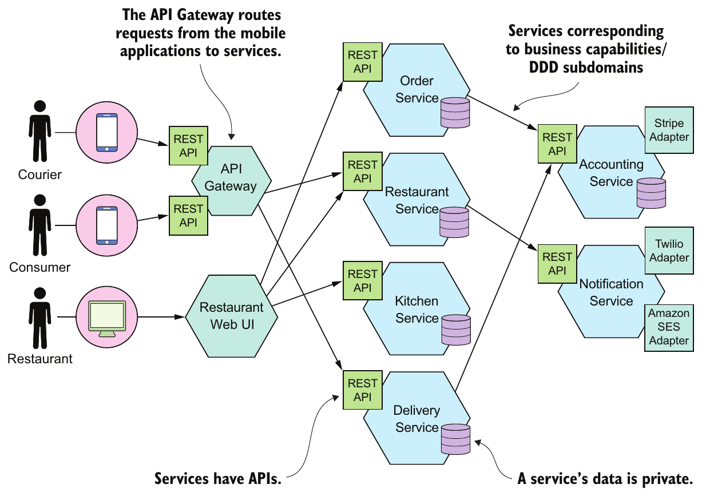

> **English:** Figure 2.3 A possible microservice architecture for the FTGO application. It consists of numerous services.
>
> **Türkçe:** Şekil 2.3 FTGO uygulaması için çok sayıda servisten oluşan olası mikroservis mimarisi.

<!-- source-record: u02_0067 -->

> **English:** A key constraint imposed by the microservice architecture is that the services are loosely coupled. Consequently, there are restrictions on how the services collaborate. In order to explain those restrictions, I’ll attempt to define the term service, describe what it means to be loosely coupled, and tell you why this matters.
>
> **Türkçe:** Mikroservis mimarisinin getirdiği temel kısıtlardan biri, servislerin gevşek bağlı olmasıdır. Bunun sonucunda servislerin nasıl işbirliği yapabileceğine ilişkin sınırlamalar vardır. Bu sınırlamaları açıklamak için önce servis terimini tanımlayacak, gevşek bağlı olmanın anlamını ve neden önemli olduğunu anlatacağım.

<!-- source-record: u02_0068 -->

#### WHAT IS A SERVICE? — Servis nedir?

<!-- source-record: u02_0069 -->

> **English:** A service is a standalone, independently deployable software component that implements some useful functionality. Figure 2.4 shows the external view of a service, which in this example is the Order Service. A service has an API that provides its clients access to its functionality. There are two types of operations: commands and queries. The API consists of commands, queries, and events. A command, such as createOrder(), performs actions and updates data. A query, such as findOrderById(), retrieves data. A service also publishes events, such as OrderCreated, which are consumed by its clients.
>
> **Türkçe:** Servis, yararlı bir işlevi gerçekleştiren, kendi başına çalışan ve bağımsız dağıtılabilen yazılım bileşenidir. Şekil 2.4, bu örnekte Order Service olan bir servisin dışarıdan görünümünü gösterir. Servisin, istemcilerin işlevlerine erişmesini sağlayan bir API’si vardır. İki işlem türü bulunur: command’lar ve query’ler. API; command, query ve olaylardan oluşur. createOrder() gibi bir command, eylemler gerçekleştirir ve veriyi günceller. findOrderById() gibi bir query veriyi okur. Servis ayrıca istemcilerin tükettiği OrderCreated gibi olaylar yayımlar.

<!-- source-record: u02_0070 -->

> **English:** A service’s API encapsulates its internal implementation. Unlike in a monolith, a developer can’t write code that bypasses its API. As a result, the microservice architecture enforces the application’s modularity.
>
> **Türkçe:** Bir servisin API’si, servisin iç gerçekleştirim ayrıntılarını kapsüller. Monolitik bir uygulamanın aksine, geliştirici bu API’yi atlayan kod yazamaz. Böylece mikroservis mimarisi uygulamanın modülerliğini zorunlu kılar.

<!-- source-record: u02_0071 -->

> **English:** Each service in a microservice architecture has its own architecture and, potentially, technology stack. But a typical service has a hexagonal architecture. Its API is implemented by adapters that interact with the service’s business logic. The operations adapter invokes the business logic, and the events adapter publishes events emitted by the business logic.
>
> **Türkçe:** Mikroservis mimarisindeki her servisin kendi mimarisi ve muhtemelen kendi teknoloji yığını vardır. Bununla birlikte, tipik bir servis altıgen mimariye sahiptir. API’si, servisin iş mantığıyla etkileşen adapter’lar tarafından gerçekleştirilir. İşlem adapter’ı iş mantığını çağırır; olay adapter’ı ise iş mantığının ürettiği olayları yayımlar.

<!-- source-pages: 42 -->

<!-- source-record: u02_0072 -->

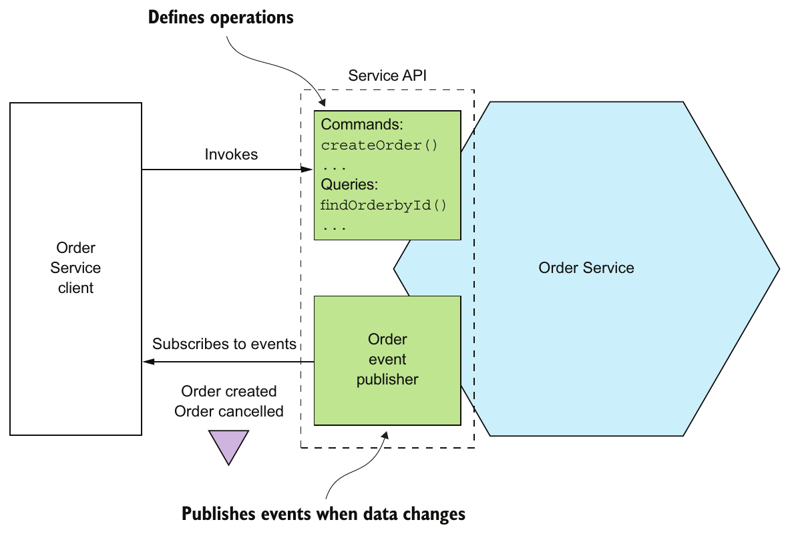

> **English:** Figure 2.4 A service has an API that encapsulates the implementation. The API defines operations, which are invoked by clients. There are two types of operations: commands update data, and queries retrieve data. When its data changes, a service publishes events that clients can subscribe to.
>
> **Türkçe:** Şekil 2.4 Bir servisin gerçekleştirim ayrıntılarını kapsülleyen bir API’si vardır. API, istemcilerin çağırdığı işlemleri tanımlar. İki işlem türü bulunur: command’lar veriyi günceller, query’ler veriyi okur. Verisi değiştiğinde servis, istemcilerin abone olabileceği olaylar yayımlar.

<!-- source-record: u02_0073 -->

> **English:** Later in chapter 12, when I discuss deployment technologies, you’ll see that the implementation view of a service can take many forms. The component might be a standalone process, a web application or OSGI bundle running in a container, or a serverless cloud function. An essential requirement, however, is that a service has an API and is independently deployable.
>
> **Türkçe:** 12. bölümde dağıtım teknolojilerini ele alırken, bir servisin gerçekleştirim görünümünün birçok biçim alabileceğini göreceksiniz. Bileşen; bağımsız bir süreç, bir container içinde çalışan web uygulaması veya OSGI bundle ya da serverless bir bulut fonksiyonu olabilir. Ancak temel gereksinim, servisin bir API’ye sahip olması ve bağımsız dağıtılabilmesidir.

<!-- source-record: u02_0074 -->

#### WHAT IS LOOSE COUPLING? — Loose coupling (gevşek bağlılık) nedir?

<!-- source-record: u02_0075 -->

> **English:** An important characteristic of the microservice architecture is that the services are loosely coupled (https://en.wikipedia.org/wiki/Loose_coupling). All interaction with a service happens via its API, which encapsulates its implementation details. This enables the implementation of the service to change without impacting its clients. Loosely coupled services are key to improving an application’s development time attributes, including its maintainability and testability. They are much easier to understand, change, and test.
>
> **Türkçe:** Mikroservis mimarisinin önemli bir özelliği, servislerin gevşek bağlı olmasıdır (https://en.wikipedia.org/wiki/Loose_coupling). Servisle bütün etkileşim, gerçekleştirim ayrıntılarını kapsülleyen API’si üzerinden gerçekleşir. Bu sayede servisin iç gerçekleştirim biçimi, istemcileri etkilemeden değişebilir. Gevşek bağlı servisler; bakım yapılabilirlik ve test edilebilirlik dâhil, uygulamanın geliştirme aşamasındaki niteliklerini iyileştirmenin anahtarıdır. Bu servisleri anlamak, değiştirmek ve test etmek çok daha kolaydır.

<!-- source-record: u02_0076 -->

> **English:** The requirement for services to be loosely coupled and to collaborate only via APIs prohibits services from communicating via a database. You must treat a service’s persistent data like the fields of a class and keep them private. Keeping the data private enables a developer to change their service’s database schema without having to spend time coordinating with developers working on other services. Not sharing database tables also improves runtime isolation. It ensures, for example, that one service can’t hold database locks that block another service. Later on, though, you’ll learn that one downside of not sharing databases is that maintaining data consistency and querying across services are more complex.
>
> **Türkçe:** Servislerin gevşek bağlı olması ve yalnızca API’ler üzerinden işbirliği yapması gereksinimi, veritabanı üzerinden iletişim kurmalarını yasaklar. Bir servisin kalıcı verisini, bir sınıfın alanları gibi ele alıp dışarıya kapalı tutmalısınız. Veriyi dışarıya kapalı tutmak, geliştiricinin başka servislerde çalışan geliştiricilerle koordinasyon için zaman harcamadan kendi servisinin veritabanı şemasını değiştirmesini sağlar. Veritabanı tablolarını paylaşmamak, çalışma zamanı yalıtımını da iyileştirir. Örneğin bir servisin, başka bir servisi engelleyen veritabanı kilitleri tutmasını önler. Bununla birlikte, ileride göreceğiniz üzere veritabanlarını paylaşmamanın bir dezavantajı, servisler arasında veri tutarlılığını korumanın ve sorgulama yapmanın daha karmaşık hale gelmesidir.

<!-- source-pages: 43 -->

<!-- source-record: u02_0077 -->

#### THE ROLE OF SHARED LIBRARIES — Paylaşılan kütüphanelerin rolü

<!-- source-record: u02_0078 -->

> **English:** Developers often package functionality in a library (module) so that it can be reused by multiple applications without duplicating code. After all, where would we be today without Maven or npm repositories? You might be tempted to also use shared libraries in microservice architecture. On the surface, it looks like a good way to reduce code duplication in your services. But you need to ensure that you don’t accidentally introduce coupling between your services.
>
> **Türkçe:** Geliştiriciler bir işlevi çoğu zaman kütüphane (modül) halinde paketler; böylece birden fazla uygulama, kodu çoğaltmadan bu işlevi yeniden kullanabilir. Sonuçta Maven veya npm depoları olmasaydı bugün nerede olurduk? Mikroservis mimarisinde de paylaşılan kütüphaneleri kullanmak cazip gelebilir. İlk bakışta bu, servislerdeki kod tekrarını azaltmanın iyi bir yolu gibi görünür. Ancak servisler arasında istemeden bağlılık oluşturmamaya dikkat etmelisiniz.

<!-- source-record: u02_0079 -->

> **English:** Imagine, for example, that multiple services need to update the Order business object. One approach is to package that functionality as a library that’s used by multiple services. On one hand, using a library eliminates code duplication. On the other hand, consider what happens when the requirements change in a way that affects the Order business object. You would need to simultaneously rebuild and redeploy those services. A much better approach would be to implement functionality that’s likely to change, such as Order management, as a service.
>
> **Türkçe:** Örneğin birden fazla servisin Order iş nesnesini güncellemesi gerektiğini düşünün. Bir yaklaşım, bu işlevi birden fazla servisin kullandığı bir kütüphane olarak paketlemektir. Bir yandan kütüphane kullanmak kod tekrarını ortadan kaldırır. Diğer yandan gereksinimler Order iş nesnesini etkileyecek biçimde değiştiğinde ne olacağını düşünün: bu servisleri aynı anda yeniden build edip dağıtmanız gerekir. Order yönetimi gibi değişme olasılığı yüksek işlevleri bir servis olarak gerçekleştirmek çok daha iyi bir yaklaşım olur.

<!-- source-record: u02_0080 -->

> **English:** You should strive to use libraries for functionality that’s unlikely to change. For example, in a typical application it makes no sense for every service to implement a generic Money class. Instead, you should create a library that’s used by the services.
>
> **Türkçe:** Kütüphaneleri, değişme olasılığı düşük işlevler için kullanmaya çalışmalısınız. Örneğin tipik bir uygulamada her servisin genel amaçlı bir Money sınıfını ayrı ayrı gerçekleştirmesi anlamlı değildir. Bunun yerine servislerin kullandığı bir kütüphane oluşturmalısınız.

<!-- source-record: u02_0081 -->

#### THE SIZE OF A SERVICE IS MOSTLY UNIMPORTANT — Bir servisin boyutu çoğunlukla önemsizdir

<!-- source-record: u02_0082 -->

> **English:** One problem with the term microservice is that the first thing you hear is micro. This suggests that a service should be very small. This is also true of other size-based terms such as miniservice or nanoservice. In reality, size isn’t a useful metric.
>
> **Türkçe:** Microservice teriminin sorunlarından biri, ilk duyduğunuz kısmın micro olmasıdır. Bu, servisin çok küçük olması gerektiği izlenimini verir. Miniservice veya nanoservice gibi boyuta dayanan diğer terimlerde de aynı durum geçerlidir. Gerçekte boyut, yararlı bir ölçüt değildir.

<!-- source-record: u02_0083 -->

> **English:** A much better goal is to define a well-designed service to be a service capable of being developed by a small team with minimal lead time and with minimal collaboration with other teams. In theory, a team might only be responsible for a single service, so that service is by no means micro. Conversely, if a service requires a large team or takes a long time to test, it probably makes sense to split the team and the service. Or if you constantly need to change a service because of changes to other services or if it’s triggering changes in other services, that’s a sign that it’s not loosely coupled. You might even have built a distributed monolith.
>
> **Türkçe:** Çok daha iyi bir hedef, iyi tasarlanmış servisi; küçük bir ekibin, değişikliği kullanıma sunma süresini ve diğer ekiplerle gereken işbirliğini en aza indirerek geliştirebildiği servis olarak tanımlamaktır. Teoride bir ekip yalnızca tek bir servisten sorumlu olabilir; dolayısıyla bu servis hiç de mikro olmayabilir. Buna karşılık bir servis büyük bir ekip gerektiriyorsa veya test edilmesi uzun sürüyorsa, muhtemelen hem ekibi hem de servisi bölmek anlamlıdır. Ya da diğer servislerdeki değişiklikler yüzünden bir servisi sürekli değiştirmeniz gerekiyorsa veya bu servis diğerlerinde değişiklikleri tetikliyorsa, bu onun gevşek bağlı olmadığını gösterir. Hatta dağıtık bir monolit oluşturmuş olabilirsiniz.

<!-- source-record: u02_0084 -->

> **English:** The microservice architecture structures an application as a set of small, loosely coupled services. As a result, it improves the development time attributes—maintainability, testability, deployability, and so on—and enables an organization to develop better software faster. It also improves an application’s scalability, although that’s not the main goal. To develop a microservice architecture for your application, you need to identify the services and determine how they collaborate. Let’s look at how to do that.
>
> **Türkçe:** Mikroservis mimarisi, uygulamayı küçük ve gevşek bağlı servislerden oluşacak biçimde yapılandırır. Bunun sonucunda bakım yapılabilirlik, test edilebilirlik, dağıtılabilirlik gibi geliştirme aşaması nitelikleri iyileşir ve organizasyon daha iyi yazılımı daha hızlı geliştirebilir. Temel hedef bu olmasa da uygulamanın ölçeklenebilirliği de iyileşir. Uygulamanız için mikroservis mimarisi geliştirmek üzere servisleri belirlemeniz ve nasıl işbirliği yapacaklarını saptamanız gerekir. Bunun nasıl yapılacağına bakalım.

<!-- source-pages: 44 -->

<!-- source-record: u02_0085 -->

## 2.2 Defining an application’s microservice architecture — Bir uygulamanın mikroservis mimarisini tanımlamak

<!-- source-record: u02_0086 -->

> **English:** How should we define a microservice architecture? As with any software development effort, the starting points are the written requirements, hopefully domain experts, and perhaps an existing application. Like much of software development, defining an architecture is more art than science. This section describes a simple, three-step process, shown in figure 2.5, for defining an application’s architecture. It’s important to remember, though, that it’s not a process you can follow mechanically. It’s likely to be iterative and involve a lot of creativity.
>
> **Türkçe:** Bir mikroservis mimarisini nasıl tanımlamalıyız? Her yazılım geliştirme çalışmasında olduğu gibi başlangıç noktaları; yazılı gereksinimler, umarız ulaşılabilen alan uzmanları ve belki mevcut bir uygulamadır. Yazılım geliştirmenin birçok yönü gibi mimari tanımlamak da bilimden çok sanat niteliğindedir. Bu kısım, uygulamanın mimarisini tanımlamak için Şekil 2.5’te gösterilen basit, üç adımlı bir süreç açıklar. Ancak bu sürecin mekanik biçimde izlenebilecek bir reçete olmadığını hatırlamak gerekir. Sürecin yinelemeli olması ve önemli ölçüde yaratıcılık içermesi beklenir.

<!-- source-record: u02_0087 -->

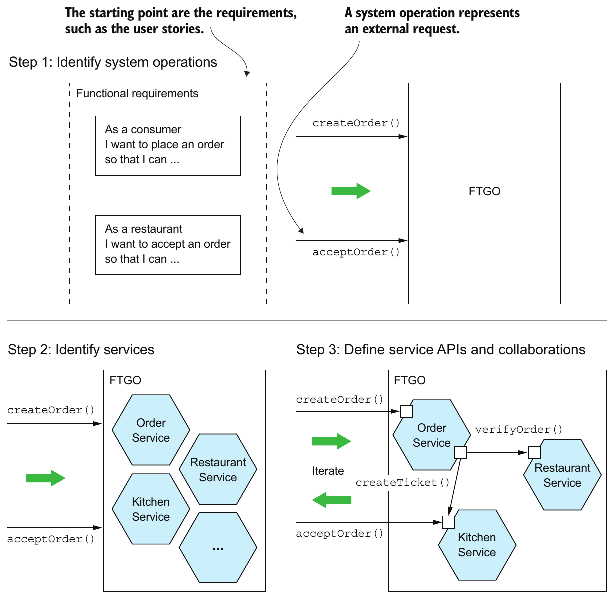

> **English:** Figure 2.5 A three-step process for defining an application’s microservice architecture
>
> **Türkçe:** Şekil 2.5 Bir uygulamanın mikroservis mimarisini tanımlamak için üç adımlı süreç.

<!-- source-record: u02_0088 -->

> **English:** An application exists to handle requests, so the first step in defining its architecture is to distill the application’s requirements into the key requests. But instead of describing the requests in terms of specific IPC technologies such as REST or messaging, I use the more abstract notion of system operation. A system operation is an abstraction of a request that the application must handle. It’s either a command, which updates data, or a query, which retrieves data. The behavior of each command is defined in terms of an abstract domain model, which is also derived from the requirements. The system operations become the architectural scenarios that illustrate how the services collaborate.
>
> **Türkçe:** Bir uygulama istekleri karşılamak için vardır. Bu nedenle mimarisini tanımlamanın ilk adımı, uygulamanın gereksinimlerinden temel istekleri çıkarmaktır. Ancak istekleri REST veya mesajlaşma gibi belirli IPC teknolojileriyle anlatmak yerine, daha soyut bir kavram olan system operation’ı (sistem işlemi) kullanıyorum. Sistem işlemi, uygulamanın karşılaması gereken bir isteğin soyutlamasıdır. Ya veriyi güncelleyen bir command ya da veriyi okuyan bir query olur. Her command’ın davranışı, yine gereksinimlerden çıkarılan soyut bir alan modeli üzerinden tanımlanır. Sistem işlemleri, servislerin nasıl işbirliği yaptığını gösteren mimari senaryolara dönüşür.

<!-- source-pages: 45 -->

<!-- source-record: u02_0089 -->

> **English:** The second step in the process is to determine the decomposition into services. There are several strategies to choose from. One strategy, which has its origins in the discipline of business architecture, is to define services corresponding to business capabilities. Another strategy is to organize services around domain-driven design subdomains. The end result is services that are organized around business concepts rather than technical concepts.
>
> **Türkçe:** Sürecin ikinci adımı, uygulamanın servislere nasıl ayrılacağını belirlemektir. Seçilebilecek çeşitli stratejiler vardır. Kökeni iş mimarisi disiplinine dayanan bir strateji, iş yetkinliklerine karşılık gelen servisler tanımlamaktır. Başka bir strateji, servisleri domain-driven design (alan odaklı tasarım) alt alanları etrafında düzenlemektir. Sonuç, teknik kavramlardan ziyade iş kavramları etrafında düzenlenmiş servislerdir.

<!-- source-record: u02_0090 -->

> **English:** The third step in defining the application’s architecture is to determine each service’s API. To do that, you assign each system operation identified in the first step to a service. A service might implement an operation entirely by itself. Alternatively, it might need to collaborate with other services. In that case, you determine how the services collaborate, which typically requires services to support additional operations. You’ll also need to decide which of the IPC mechanisms I describe in chapter 3 to implement each service’s API.
>
> **Türkçe:** Uygulamanın mimarisini tanımlamadaki üçüncü adım, her servisin API’sini belirlemektir. Bunun için ilk adımda belirlenen her sistem işlemini bir servise atarsınız. Servis, işlemi tamamen kendi başına gerçekleştirebilir veya diğer servislerle işbirliği yapmak zorunda olabilir. İkinci durumda servislerin nasıl işbirliği yapacağını belirlersiniz; bu genellikle servislerin ek işlemler sunmasını gerektirir. Her servisin API’sini gerçekleştirmek için 3. bölümde anlattığım IPC mekanizmalarından hangisini kullanacağınıza da karar vermeniz gerekir.

<!-- source-record: u02_0091 -->

> **English:** There are several obstacles to decomposition. The first is network latency. You might discover that a particular decomposition would be impractical due to too many round-trips between services. Another obstacle to decomposition is that synchronous communication between services reduces availability. You might need to use the concept of self-contained services, described in chapter 3. The third obstacle is the requirement to maintain data consistency across services. You’ll typically need to use sagas, discussed in chapter 4. The fourth and final obstacle to decomposition is so-called god classes, which are used throughout an application. Fortunately, you can use concepts from domain-driven design to eliminate god classes.
>
> **Türkçe:** Ayrıştırmanın önünde çeşitli engeller vardır. İlki ağ gecikmesidir. Servisler arasında çok fazla gidiş-dönüş gerektirdiği için belirli bir ayrıştırmanın uygulanabilir olmadığını görebilirsiniz. İkinci engel, servisler arasındaki senkron iletişimin kullanılabilirliği azaltmasıdır. 3. bölümde açıklanan, kendi kendine yeterli servisler kavramını kullanmanız gerekebilir. Üçüncü engel, servisler arasında veri tutarlılığını koruma gereksinimidir. Genellikle 4. bölümde ele alınan saga’ları kullanmanız gerekir. Dördüncü ve son engel, uygulamanın her yerinde kullanılan god class’lardır. Neyse ki domain-driven design kavramlarıyla bu aşırı sorumluluk yüklenmiş merkezî sınıfları ortadan kaldırabilirsiniz.

<!-- source-record: u02_0092 -->

> **English:** This section first describes how to identify an application’s operations. After that, we’ll look at strategies and guidelines for decomposing an application into services, and at obstacles to decomposition and how to address them. Finally, I’ll describe how to define each service’s API.
>
> **Türkçe:** Bu kısım önce uygulamanın işlemlerinin nasıl belirleneceğini açıklar. Ardından uygulamayı servislere ayırma stratejilerine ve ilkelerine, ayrıştırmanın önündeki engellere ve bunların nasıl ele alınacağına bakacağız. Son olarak her servisin API’sinin nasıl tanımlanacağını anlatacağım.

<!-- source-record: u02_0093 -->

### 2.2.1 Identifying the system operations — Sistem işlemlerini belirlemek

<!-- source-record: u02_0094 -->

> **English:** The first step in defining an application’s architecture is to define the system operations. The starting point is the application’s requirements, including user stories and their associated user scenarios (note that these are different from the architectural scenarios). The system operations are identified and defined using the two-step process shown in figure 2.6. This process is inspired by the object-oriented design process covered in Craig Larman’s book Applying UML and Patterns (Prentice Hall, 2004) (see www.craiglarman.com/wiki/index.php?title=Book_Applying_UML_and_Patterns for details). The first step creates the high-level domain model consisting of the key classes that provide a vocabulary with which to describe the system operations. The second step identifies the system operations and describes each one’s behavior in terms of the domain model.
>
> **Türkçe:** Bir uygulamanın mimarisini tanımlamanın ilk adımı, sistem işlemlerini tanımlamaktır. Başlangıç noktası, kullanıcı hikâyelerini ve bunlarla ilişkili kullanıcı senaryolarını içeren uygulama gereksinimleridir; bunların mimari senaryolardan farklı olduğuna dikkat edin. Sistem işlemleri, Şekil 2.6’da gösterilen iki adımlı süreçle belirlenip tanımlanır. Bu süreç, Craig Larman’ın Applying UML and Patterns (Prentice Hall, 2004) kitabındaki nesne yönelimli tasarım sürecinden esinlenmiştir (ayrıntılar için www.craiglarman.com/wiki/index.php?title=Book_Applying_UML_and_Patterns). İlk adım, sistem işlemlerini anlatmak için gereken kavramları sağlayan temel sınıflardan oluşan üst düzey alan modelini oluşturur. İkinci adım, sistem işlemlerini belirler ve her birinin davranışını alan modeli üzerinden açıklar.

<!-- source-pages: 46 -->

<!-- source-record: u02_0095 -->

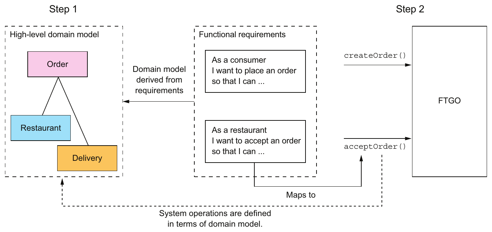

> **English:** Figure 2.6 System operations are derived from the application’s requirements using a two-step process. The first step is to create a high-level domain model. The second step is to define the system operations, which are defined in terms of the domain model.
>
> **Türkçe:** Şekil 2.6 Sistem işlemleri, iki adımlı bir süreçle uygulama gereksinimlerinden çıkarılır. İlk adım üst düzey alan modelini oluşturmaktır. İkinci adım, davranışları alan modeli üzerinden açıklanan sistem işlemlerini tanımlamaktır.

<!-- source-record: u02_0096 -->

> **English:** The domain model is derived primarily from the nouns of the user stories, and the system operations are derived mostly from the verbs. You could also define the domain model using a technique called Event Storming, which I talk about in chapter 5. The behavior of each system operation is described in terms of its effect on one or more domain objects and the relationships between them. A system operation can create, update, or delete domain objects, as well as create or destroy relationships between them.
>
> **Türkçe:** Alan modeli öncelikle kullanıcı hikâyelerindeki isimlerden, sistem işlemleri ise çoğunlukla fiillerden çıkarılır. Alan modelini, 5. bölümde anlatacağım Event Storming adlı teknikle de tanımlayabilirsiniz. Her sistem işleminin davranışı, bir veya daha fazla alan nesnesi ve bunların ilişkileri üzerindeki etkisiyle açıklanır. Sistem işlemi alan nesnelerini oluşturabilir, güncelleyebilir veya silebilir; bunlar arasındaki ilişkileri de oluşturabilir veya kaldırabilir.

<!-- source-record: u02_0097 -->

> **English:** Let’s look at how to define a high-level domain model. After that I’ll define the system operations in terms of the domain model.
>
> **Türkçe:** Üst düzey alan modelinin nasıl tanımlanacağına bakalım. Ardından sistem işlemlerini alan modeli üzerinden tanımlayacağım.

<!-- source-record: u02_0098 -->

#### CREATING A HIGH-LEVEL DOMAIN MODEL — Üst düzey bir alan modeli oluşturmak

<!-- source-record: u02_0099 -->

> **English:** The first step in the process of defining the system operations is to sketch a high-level domain model for the application. Note that this domain model is much simpler than what will ultimately be implemented. The application won’t even have a single domain model because, as you’ll soon learn, each service has its own domain model. Despite being a drastic simplification, a high-level domain model is useful at this stage because it defines the vocabulary for describing the behavior of the system operations.
>
> **Türkçe:** Sistem işlemlerini tanımlama sürecinin ilk adımı, uygulamanın üst düzey alan modelini kabaca çizmektir. Bu alan modelinin sonunda gerçekleştirilecek modelden çok daha basit olduğuna dikkat edin. Uygulamada tek bir alan modeli bile bulunmayacaktır; çünkü yakında göreceğiniz gibi her servisin kendi alan modeli vardır. Büyük bir sadeleştirme olsa da üst düzey alan modeli bu aşamada yararlıdır: sistem işlemlerinin davranışlarını açıklamak için gerekli ortak kavramları tanımlar.

<!-- source-record: u02_0100 -->

> **English:** A domain model is created using standard techniques such as analyzing the nouns in the stories and scenarios and talking to the domain experts. Consider, for example, the Place Order story. We can expand that story into numerous user scenarios including this one:
>
> **Türkçe:** Alan modeli; hikâyelerdeki ve senaryolardaki isimleri incelemek, alan uzmanlarıyla konuşmak gibi standart tekniklerle oluşturulur. Örneğin Place Order kullanıcı hikâyesini ele alalım. Bu hikâyeyi, aşağıdaki dâhil birçok kullanıcı senaryosuna genişletebiliriz:

<!-- source-pages: 47 -->

<!-- source-record: u02_0101 -->

```gherkin
Given a consumer
  And a restaurant
  And a delivery address/time that can be served by that restaurant
  And an order total that meets the restaurant's order minimum
When the consumer places an order for the restaurant
Then consumer's credit card is authorized
  And an order is created in the PENDING_ACCEPTANCE state
  And the order is associated with the consumer
  And the order is associated with the restaurant
```

<!-- source-record: u02_0102 -->

> **English:** The nouns in this user scenario hint at the existence of various classes, including Consumer, Order, Restaurant, and CreditCard.
>
> **Türkçe:** Bu kullanıcı senaryosundaki isimler; Consumer, Order, Restaurant ve CreditCard dâhil çeşitli sınıfların varlığına işaret eder.

<!-- source-record: u02_0103 -->

> **English:** Similarly, the Accept Order story can be expanded into a scenario such as this one:
>
> **Türkçe:** Benzer biçimde Accept Order hikâyesi, aşağıdaki gibi bir senaryoya genişletilebilir:

<!-- source-record: u02_0104 -->

```gherkin
Given an order that is in the PENDING_ACCEPTANCE state
  and a courier that is available to deliver the order
When a restaurant accepts an order with a promise to prepare by a particular
     time
Then the state of the order is changed to ACCEPTED
  And the order's promiseByTime is updated to the promised time
  And the courier is assigned to deliver the order
```

<!-- source-record: u02_0105 -->

> **English:** This scenario suggests the existence of Courier and Delivery classes. The end result after a few iterations of analysis will be a domain model that consists, unsurprisingly, of those classes and others, such as MenuItem and Address. Figure 2.7 is a class diagram that shows the key classes.
>
> **Türkçe:** Bu senaryo, Courier ve Delivery sınıflarının varlığını düşündürür. Birkaç analiz yinelemesinden sonra; bu sınıflarla birlikte MenuItem ve Address gibi diğer sınıflardan oluşan bir alan modeli ortaya çıkar. Şekil 2.7, temel sınıfları gösteren sınıf diyagramıdır.

<!-- source-record: u02_0106 -->

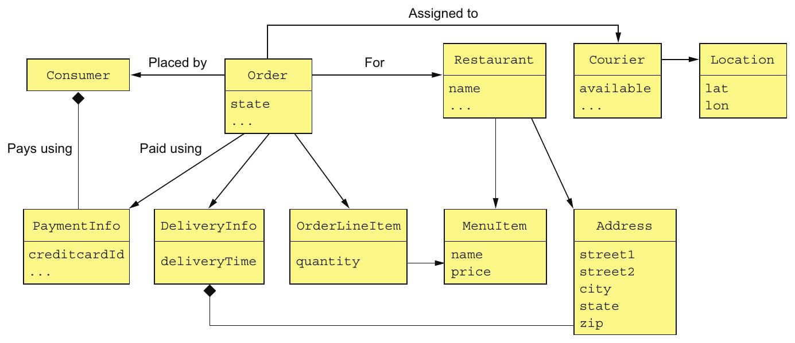

> **English:** Figure 2.7 The key classes in the FTGO domain model
>
> **Türkçe:** Şekil 2.7 FTGO alan modelindeki temel sınıflar.

<!-- source-pages: 48 -->

<!-- source-record: u02_0107 -->

> **English:** The responsibilities of each class are as follows:
>
> **Türkçe:** Her sınıfın sorumlulukları şöyledir:

<!-- source-record: u02_0108 -->

> **English:** • Consumer—A consumer who places orders.
>
> **Türkçe:** • Consumer — Sipariş veren tüketici.

<!-- source-record: u02_0109 -->

> **English:** • Order—An order placed by a consumer. It describes the order and tracks its status.
>
> **Türkçe:** • Order — Bir tüketicinin verdiği sipariş. Siparişi tanımlar ve durumunu izler.

<!-- source-record: u02_0110 -->

> **English:** • OrderLineItem—A line item of an Order.
>
> **Türkçe:** • OrderLineItem — Bir Order içindeki sipariş kalemi.

<!-- source-record: u02_0111 -->

> **English:** • DeliveryInfo—The time and place to deliver an order.
>
> **Türkçe:** • DeliveryInfo — Siparişin teslim edileceği zaman ve yer.

<!-- source-record: u02_0112 -->

> **English:** • Restaurant—A restaurant that prepares orders for delivery to consumers.
>
> **Türkçe:** • Restaurant — Tüketicilere teslim edilmek üzere siparişleri hazırlayan restoran.

<!-- source-record: u02_0113 -->

> **English:** • MenuItem—An item on the restaurant’s menu.
>
> **Türkçe:** • MenuItem - Restoranın menüsündeki bir öğe.

<!-- source-record: u02_0114 -->

> **English:** • Courier—A courier who delivers orders to consumers. It tracks the availability of the courier and their current location.
>
> **Türkçe:** • Courier — Siparişleri tüketicilere teslim eden kurye. Kuryenin müsaitliğini ve güncel konumunu izler.

<!-- source-record: u02_0115 -->

> **English:** • Address—The address of a Consumer or a Restaurant.
>
> **Türkçe:** • Address — Bir Consumer veya Restaurant nesnesinin adresi.

<!-- source-record: u02_0116 -->

> **English:** • Location—The latitude and longitude of a Courier.
>
> **Türkçe:** • Location — Bir Courier nesnesinin enlem ve boylamı.

<!-- source-record: u02_0117 -->

> **English:** A class diagram such as the one in figure 2.7 illustrates one aspect of an application’s architecture. But it isn’t much more than a pretty picture without the scenarios to animate it. The next step is to define the system operations, which correspond to architectural scenarios.
>
> **Türkçe:** Şekil 2.7’deki gibi bir sınıf diyagramı, uygulama mimarisinin bir yönünü gösterir. Ancak onu harekete geçiren senaryolar olmadan güzel bir resimden pek öteye gidemez. Sonraki adım, mimari senaryolara karşılık gelen sistem işlemlerini tanımlamaktır.

<!-- source-record: u02_0118 -->

#### DEFINING SYSTEM OPERATIONS — Sistem işlemlerini tanımlamak

<!-- source-record: u02_0119 -->

> **English:** Once you’ve defined a high-level domain model, the next step is to identify the requests that the application must handle. The details of the UI are beyond the scope of this book, but you can imagine that in each user scenario, the UI will make requests to the backend business logic to retrieve and update data. FTGO is primarily a web application, which means that most requests are HTTP-based, but it’s possible that some clients might use messaging. Instead of committing to a specific protocol, therefore, it makes sense to use the more abstract notion of a system operation to represent requests.
>
> **Türkçe:** Üst düzey alan modelini tanımladıktan sonra sıradaki adım, uygulamanın karşılaması gereken istekleri belirlemektir. Kullanıcı arayüzünün ayrıntıları bu kitabın kapsamı dışındadır; ancak her kullanıcı senaryosunda arayüzün, veriyi okumak ve güncellemek için backend iş mantığına istek göndereceğini düşünebilirsiniz. FTGO öncelikle bir web uygulamasıdır; dolayısıyla isteklerin çoğu HTTP tabanlıdır. Bununla birlikte bazı istemciler mesajlaşma kullanabilir. Bu nedenle belirli bir protokole bağlanmak yerine, istekleri daha soyut olan sistem işlemi kavramıyla temsil etmek anlamlıdır.

<!-- source-record: u02_0120 -->

> **English:** There are two types of system operations:
>
> **Türkçe:** İki tür sistem işlemi vardır:

<!-- source-record: u02_0121 -->

> **English:** • Commands—System operations that create, update, and delete data
>
> **Türkçe:** • Commands — Veriyi oluşturan, güncelleyen ve silen sistem işlemleri.

<!-- source-record: u02_0122 -->

> **English:** • Queries—System operations that read (query) data
>
> **Türkçe:** • Queries — Veriyi okuyan, yani sorgulayan sistem işlemleri.

<!-- source-record: u02_0123 -->

> **English:** Ultimately, these system operations will correspond to REST, RPC, or messaging endpoints, but for now thinking of them abstractly is useful. Let’s first identify some commands.
>
> **Türkçe:** Sonunda bu sistem işlemleri REST, RPC veya mesajlaşma erişim noktalarına karşılık gelecektir; ancak şimdilik onları soyut biçimde düşünmek yararlıdır. Önce bazı command’ları belirleyelim.

<!-- source-record: u02_0124 -->

> **English:** A good starting point for identifying system commands is to analyze the verbs in the user stories and scenarios. Consider, for example, the Place Order story. It clearly suggests that the system must provide a Create Order operation. Many other stories individually map directly to system commands. Table 2.1 lists some of the key system commands.
>
> **Türkçe:** Sistem command’larını belirlemek için iyi bir başlangıç, kullanıcı hikâyeleri ve senaryolarındaki fiilleri incelemektir. Örneğin Place Order hikâyesini düşünün. Bu hikâye, sistemin bir Create Order işlemi sunması gerektiğini açıkça gösterir. Diğer birçok hikâye de tek başına doğrudan bir sistem command’ına karşılık gelir. Tablo 2.1, temel sistem command’larının bazılarını listeler.

<!-- source-record: u02_0125 -->

> **English:** Table 2.1 Key system commands for the FTGO application
>
> **Türkçe:** Tablo 2.1 FTGO uygulaması için ana sistem komutları

| **EN:** Actor<br/>**TR:** Oyuncu | **EN:** Story<br/>**TR:** Hikaye | **EN:** Command<br/>**TR:** Komutanlık | **EN:** Description<br/>**TR:** Açıklama |
| --- | --- | --- | --- |
| **EN:** Consumer<br/>**TR:** Consumer | **EN:** Create Order<br/>**TR:** Order oluştur | **EN:** createOrder()<br/>**TR:** createOrder() | **EN:** Creates an order<br/>**TR:** Bir düzen oluşturur. |
| **EN:** Restaurant<br/>**TR:** Restaurant | **EN:** Accept Order<br/>**TR:** Order'i kabul et | **EN:** acceptOrder()<br/>**TR:** acceptOrder() | **EN:** Indicates that the restaurant has accepted the order and is committed to preparing it by the indicated time<br/>**TR:** Restoranın siparişi kabul ettiğini ve belirtilen zamana kadar hazırlamaya kararlı olduğunu belirtir. |

<!-- source-pages: 49 -->

<!-- source-record: u02_0126 -->

> **English:** Table 2.1 Key system commands for the FTGO application (continued)
>
> **Türkçe:** Tablo 2.1 FTGO uygulaması için ana sistem komutları (gelişmiş)

| **EN:** Actor<br/>**TR:** Oyuncu | **EN:** Story<br/>**TR:** Hikaye | **EN:** Command<br/>**TR:** Komutanlık | **EN:** Description<br/>**TR:** Açıklama |
| --- | --- | --- | --- |
| **EN:** Restaurant<br/>**TR:** Restaurant | **EN:** Order Ready for Pickup<br/>**TR:** Order Çıkarım için hazır | **EN:** noteOrderReadyForPickup()<br/>**TR:** noteOrderReadyForPickup() | **EN:** Indicates that the order is ready for pickup<br/>**TR:** Sipariş alınmaya hazır olduğunu gösterir . |
| **EN:** Courier<br/>**TR:** Courier | **EN:** Update Location<br/>**TR:** Location güncelleme | **EN:** noteUpdatedLocation()<br/>**TR:** noteUpdatedLocation() | **EN:** Updates the current location of the courier<br/>**TR:** Kurye'nin mevcut konumunu güncelleyebilir |
| **EN:** Courier<br/>**TR:** Courier | **EN:** Delivery picked up<br/>**TR:** Delivery alındı | **EN:** noteDeliveryPickedUp()<br/>**TR:** noteDeliveryPickedUp() | **EN:** Indicates that the courier has picked up the order<br/>**TR:** Kürenin siparişi aldığını gösterir. |
| **EN:** Courier<br/>**TR:** Courier | **EN:** Delivery delivered<br/>**TR:** Delivery teslim edildi | **EN:** noteDeliveryDelivered()<br/>**TR:** noteDeliveryDelivered() | **EN:** Indicates that the courier has delivered the order<br/>**TR:** Kurye'nin siparişi teslim ettiğini gösterir. |

<!-- source-record: u02_0127 -->

> **English:** A command has a specification that defines its parameters, return value, and behavior in terms of the domain model classes. The behavior specification consists of preconditions that must be true when the operation is invoked, and post-conditions that are true after the operation is invoked. Here, for example, is the specification of the createOrder() system operation:
>
> **Türkçe:** Bir command’ın; parametrelerini, dönüş değerini ve alan modeli sınıfları cinsinden davranışını tanımlayan bir belirtimi vardır. Davranış belirtimi, işlem çağrıldığında sağlanması gereken precondition’lardan (ön koşullar) ve işlem çağrıldıktan sonra doğru olan post-condition’lardan (son koşullar) oluşur. Örneğin createOrder() sistem işleminin belirtimi şöyledir:

<!-- source-record: u02_0128 -->

|  |  |
| --- | --- |
| **EN:** Operation<br/>**TR:** İşlem | **EN:** createOrder (consumer id, payment method, delivery address, delivery time, restaurant id, order line items)<br/>**TR:** createOrder (tüketici kimliği, ödeme yöntemi, teslimat adresi, teslimat zamanı, restoran kimliği, sipariş çizgisi ürünleri) |
| **EN:** Returns<br/>**TR:** Geri dönüşler | **EN:** orderId, …<br/>**TR:** orderId, ... |
| **EN:** Preconditions<br/>**TR:** Ön koşullar | **EN:** • The consumer exists and can place orders. • The line items correspond to the restaurant’s menu items. • The delivery address and time can be serviced by the restaurant.<br/>**TR:** - Kullanıcı var ve sipariş verebilir. - Satır ürünleri restoranın menü ürünlerine karşılık gelir. |
| **EN:** Post-conditions<br/>**TR:** Sonraki koşullar | **EN:** • The consumer’s credit card was authorized for the order total. • An order was created in the PENDING_ACCEPTANCE state.<br/>**TR:** - Bir sipariş PENDING_ACCEPTANCE devletinde oluşturuldu. |

<!-- source-record: u02_0129 -->

> **English:** The preconditions mirror the givens in the Place Order user scenario described earlier. The post-conditions mirror the thens from the scenario. When a system operation is invoked it will verify the preconditions and perform the actions required to make the post-conditions true.
>
> **Türkçe:** Ön koşullar, daha önce açıklanan Place Order kullanıcı senaryosundaki Given ifadelerini yansıtır. Son koşullar ise senaryodaki Then ifadelerini yansıtır. Bir sistem işlemi çağrıldığında ön koşulları doğrular ve son koşulların sağlanması için gereken eylemleri gerçekleştirir.

<!-- source-record: u02_0130 -->

> **English:** Here’s the specification of the acceptOrder() system operation:
>
> **Türkçe:** acceptOrder() sistem işleminin belirtimi şöyledir:

<!-- source-record: u02_0131 -->

|  |  |
| --- | --- |
| **EN:** Operation<br/>**TR:** İşlem | **EN:** acceptOrder(restaurantId, orderId, readyByTime)<br/>**TR:** acceptOrder(restaurantId, orderId, readyByTime) |
| **EN:** Returns<br/>**TR:** Geri dönüşler | **EN:** —<br/>**TR:** - Evet . |
| **EN:** Preconditions<br/>**TR:** Ön koşullar | **EN:** • The order.status is PENDING_ACCEPTANCE. • A courier is available to deliver the order.<br/>**TR:** - Sipariş.Statuus PENDING_ACCEPTANCE. - Sipariş teslim etmek için bir kurye var. |
| **EN:** Post-conditions<br/>**TR:** Sonraki koşullar | **EN:** • The order.status was changed to ACCEPTED. • The order.readyByTime was changed to the readyByTime. • The courier was assigned to deliver the order.<br/>**TR:** - Sipariş.Status değişti ACCEPTED. - Sipariş.readyByTime değiştirildi readyByTime. - Kurye sipariş teslimat görevlendirildi. |

<!-- source-pages: 50 -->

<!-- source-record: u02_0132 -->

> **English:** Its pre- and post-conditions mirror the user scenario from earlier.
>
> **Türkçe:** Bu işlemin ön ve son koşulları, önceki kullanıcı senaryosunu yansıtır.

<!-- source-record: u02_0133 -->

> **English:** Most of the architecturally relevant system operations are commands. Sometimes, though, queries, which retrieve data, are also important.
>
> **Türkçe:** Mimari açısından önemli sistem işlemlerinin çoğu command’dır. Ancak bazen veriyi okuyan query’ler de önemlidir.

<!-- source-record: u02_0134 -->

> **English:** Besides implementing commands, an application must also implement queries. The queries provide the UI with the information a user needs to make decisions. At this stage, we don’t have a particular UI design for FTGO application in mind, but consider, for example, the flow when a consumer places an order:
>
> **Türkçe:** Bir uygulama command’ların yanında query’leri de gerçekleştirmelidir. Query’ler, kullanıcının karar vermek için ihtiyaç duyduğu bilgiyi arayüze sağlar. Bu aşamada FTGO için belirli bir arayüz tasarımı düşünmüyoruz; ancak örneğin bir tüketici sipariş verirken gerçekleşen akışı ele alalım:

<!-- source-record: u02_0135 -->

> **English:** 1 User enters delivery address and time.
>
> **Türkçe:** 1 Kullanıcı teslimat adresini ve saatini girer.

<!-- source-record: u02_0136 -->

> **English:** 2 System displays available restaurants.
>
> **Türkçe:** 2 Sistem mevcut restoranları gösterir.

<!-- source-record: u02_0137 -->

> **English:** 3 User selects restaurant.
>
> **Türkçe:** 3 Kullanıcı restoran seçer.

<!-- source-record: u02_0138 -->

> **English:** 4 System displays menu.
>
> **Türkçe:** 4 Sistem menüyü gösterir.

<!-- source-record: u02_0139 -->

> **English:** 5 User selects item and checks out.
>
> **Türkçe:** 5 Kullanıcı bir ürün seçer ve siparişi tamamlama aşamasına geçer.

<!-- source-record: u02_0140 -->

> **English:** 6 System creates order.
>
> **Türkçe:** 6 Sistem siparişi oluşturur.

<!-- source-record: u02_0141 -->

> **English:** This user scenario suggests the following queries:
>
> **Türkçe:** Bu kullanıcı senaryosu aşağıdaki sorguları ortaya çıkarır:

<!-- source-record: u02_0142 -->

> **English:** • findAvailableRestaurants(deliveryAddress, deliveryTime)—Retrieves the restaurants that can deliver to the specified delivery address at the specified time
>
> **Türkçe:** • findAvailableRestaurants(deliveryAddress, deliveryTime) - Belirtilen teslimat adresine belirtilen zamanda teslim edebilecek restoranları alır

<!-- source-record: u02_0143 -->

> **English:** • findRestaurantMenu(id)—Retrieves information about a restaurant including the menu items
>
> **Türkçe:** • findRestaurantMenu(id) - Menü öğeleri de dahil olmak üzere bir restoran hakkında bilgi alır

<!-- source-record: u02_0144 -->

> **English:** Of the two queries, findAvailableRestaurants() is probably the most architecturally significant. It’s a complex query involving geosearch. The geosearch component of the query consists of finding all points—restaurants—that are near a location—the delivery address. It also filters out those restaurants that are closed when the order needs to be prepared and picked up. Moreover, performance is critical, because this query is executed whenever a consumer wants to place an order.
>
> **Türkçe:** Bu iki query arasında mimari açıdan en önemlisi muhtemelen findAvailableRestaurants() işlemidir. Coğrafi arama (geosearch) içeren karmaşık bir sorgudur. Sorgunun coğrafi arama kısmı, bir konuma, yani teslimat adresine yakın olan bütün noktaları, yani restoranları bulur. Ayrıca siparişin hazırlanıp teslim alınacağı saatte kapalı olan restoranları eler. Üstelik bu sorgu, bir tüketici her sipariş vermek istediğinde çalıştırıldığı için performans kritiktir.

<!-- source-record: u02_0145 -->

> **English:** The high-level domain model and the system operations capture what the application does. They help drive the definition of the application’s architecture. The behavior of each system operation is described in terms of the domain model. Each important system operation represents an architecturally significant scenario that’s part of the description of the architecture.
>
> **Türkçe:** Üst düzey alan modeli ve sistem işlemleri, uygulamanın ne yaptığını ortaya koyar. Uygulamanın mimarisinin tanımlanmasına yön verirler. Her sistem işleminin davranışı alan modeli üzerinden açıklanır. Her önemli sistem işlemi, mimarinin açıklamasının bir parçası olan, mimari açıdan anlamlı bir senaryoyu temsil eder.

<!-- source-record: u02_0146 -->

> **English:** Once the system operations have been defined, the next step is to identify the application’s services. As mentioned earlier, there isn’t a mechanical process to follow. There are, however, various decomposition strategies that you can use. Each one attacks the problem from a different perspective and uses its own terminology. But with all strategies, the end result is the same: an architecture consisting of services that are primarily organized around business rather than technical concepts.
>
> **Türkçe:** Sistem işlemleri tanımlandıktan sonra sıradaki adım, uygulamanın servislerini belirlemektir. Daha önce belirtildiği gibi mekanik biçimde izlenebilecek bir süreç yoktur. Bununla birlikte kullanabileceğiniz çeşitli ayrıştırma stratejileri vardır. Her biri sorunu farklı bir açıdan ele alır ve kendi terminolojisini kullanır. Ancak bütün stratejilerin sonucu aynıdır: öncelikle teknik kavramlar değil, iş kavramları etrafında düzenlenen servislerden oluşan bir mimari.

<!-- source-record: u02_0147 -->

> **English:** Let’s look at the first strategy, which defines services corresponding to business capabilities.
>
> **Türkçe:** İş yetkinliklerine karşılık gelen servisleri tanımlayan ilk stratejiye bakalım.

<!-- source-pages: 51 -->

<!-- source-record: u02_0148 -->

### 2.2.2 Defining services by applying the Decompose by business capability pattern — Decompose by business capability örüntüsünü uygulayarak servisleri tanımlamak

<!-- source-record: u02_0149 -->

> **English:** One strategy for creating a microservice architecture is to decompose by business capability. A concept from business architecture modeling, a business capability is something that a business does in order to generate value. The set of capabilities for a given business depends on the kind of business. For example, the capabilities of an insurance company typically include Underwriting, Claims management, Billing, Compliance, and so on. The capabilities of an online store include Order management, Inventory management, Shipping, and so on.
>
> **Türkçe:** Mikroservis mimarisi oluşturma stratejilerinden biri, iş yetkinliğine göre ayrıştırmadır. İş mimarisi modellemesinden gelen business capability (iş yetkinliği), bir işletmenin değer üretmek için yaptığı iştir. Bir işletmenin yetkinlikleri, işletmenin türüne bağlıdır. Örneğin bir sigorta şirketinin yetkinlikleri genellikle risk değerlendirme ve poliçelendirme (Underwriting), hasar talebi yönetimi, faturalama ve mevzuata uyumu içerir. Bir çevrimiçi mağazanın yetkinlikleri arasında sipariş yönetimi, stok yönetimi ve gönderim bulunur.

<!-- source-record: u02_0150 -->

### Pattern: Decompose by business capability — Şekil: İşletme kapasitesine göre parçalanma

<!-- source-record: u02_0151 -->

> **English:** Define services corresponding to business capabilities. See http://microservices.io/patterns/decomposition/decompose-by-business-capability.html.
>
> **Türkçe:** İş yetkinliklerine karşılık gelen servisler tanımlayın. Bkz. http://microservices.io/patterns/decomposition/decompose-by-business-capability.html.

<!-- source-record: u02_0152 -->

#### BUSINESS CAPABILITIES DEFINE WHAT AN ORGANIZATION DOES — İş yetkinlikleri, bir kuruluşun ne yaptığını tanımlar

<!-- source-record: u02_0153 -->

> **English:** An organization’s business capabilities capture what an organization’s business is. They’re generally stable, as opposed to how an organization conducts its business, which changes over time, sometimes dramatically. That’s especially true today, with the rapidly growing use of technology to automate many business processes. For example, it wasn’t that long ago that you deposited checks at your bank by handing them to a teller. It then became possible to deposit checks using an ATM. Today you can conveniently deposit most checks using your smartphone. As you can see, the Deposit check business capability has remained stable, but the manner in which it’s done has drastically changed.
>
> **Türkçe:** Bir organizasyonun iş yetkinlikleri, organizasyonun yaptığı işin ne olduğunu ifade eder. Bunlar genellikle kararlıdır; buna karşılık organizasyonun işi nasıl yaptığı zaman içinde, bazen köklü biçimde değişir. Birçok iş sürecini otomatikleştirmek için teknoloji kullanımının hızla arttığı günümüzde bu durum özellikle belirgindir. Örneğin yakın zamana kadar bankaya çek yatırmak için çeki gişe görevlisine verirdiniz. Daha sonra ATM kullanarak çek yatırmak mümkün oldu. Bugün çoğu çeki akıllı telefonunuzla kolayca yatırabilirsiniz. Görüldüğü gibi çek yatırma iş yetkinliği aynı kalmış, ancak gerçekleştirilme biçimi büyük ölçüde değişmiştir.

<!-- source-record: u02_0154 -->

#### IDENTIFYING BUSINESS CAPABILITIES — İş yetkinliklerini belirlemek

<!-- source-record: u02_0155 -->

> **English:** An organization’s business capabilities are identified by analyzing the organization’s purpose, structure, and business processes. Each business capability can be thought of as a service, except it’s business-oriented rather than technical. Its specification consists of various components, including inputs, outputs, and service-level agreements. For example, the input to an Insurance underwriting capability is the consumer’s application, and the outputs include approval and price.
>
> **Türkçe:** Bir organizasyonun iş yetkinlikleri; amacı, yapısı ve iş süreçleri incelenerek belirlenir. Her iş yetkinliği, teknik değil iş odaklı olması dışında bir servis gibi düşünülebilir. Belirtimi; girdiler, çıktılar ve hizmet düzeyi anlaşmaları dâhil çeşitli bileşenlerden oluşur. Örneğin sigorta risk değerlendirme yetkinliğinin girdisi tüketicinin başvurusudur; çıktıları ise onay ve fiyatı içerir.

<!-- source-record: u02_0156 -->

> **English:** A business capability is often focused on a particular business object. For example, the Claim business object is the focus of the Claim management capability. A capability can often be decomposed into sub-capabilities. For example, the Claim management capability has several sub-capabilities, including Claim information management, Claim review, and Claim payment management.
>
> **Türkçe:** Bir iş yetkinliği çoğunlukla belirli bir iş nesnesine odaklanır. Örneğin Claim iş nesnesi, hasar talebi yönetimi yetkinliğinin odak noktasıdır. Bir yetkinlik çoğu zaman alt yetkinliklere ayrılabilir. Örneğin hasar talebi yönetimi; talep bilgisi yönetimi, talep incelemesi ve talep ödemesi yönetimi gibi alt yetkinlikleri içerir.

<!-- source-record: u02_0157 -->

> **English:** It is not difficult to imagine that the business capabilities for FTGO include the following:
>
> **Türkçe:** FTGO’nun iş yetkinlikleri arasında aşağıdakilerin bulunduğunu düşünmek zor değildir:

<!-- source-record: u02_0158 -->

> **English:** • Supplier management – Courier management—Managing courier information – Restaurant information management—Managing restaurant menus and other information, including location and open hours
>
> **Türkçe:** • Tedarikçi yönetimi — Kurye yönetimi: kurye bilgilerini yönetme. Restoran bilgisi yönetimi: restoran menülerini ve konum ile çalışma saatleri dâhil diğer bilgileri yönetme.

<!-- source-pages: 52 -->

<!-- source-record: u02_0159 -->

> **English:** • Consumer management—Managing information about consumers
>
> **Türkçe:** • Tüketici yönetimi — Tüketiciler hakkındaki bilgileri yönetme.

<!-- source-record: u02_0160 -->

> **English:** • Order taking and fulfillment – Order management—Enabling consumers to create and manage orders – Restaurant order management—Managing the preparation of orders at a restaurant – Logistics – Courier availability management—Managing the real-time availability of couriers to delivery orders – Delivery management—Delivering orders to consumers
>
> **Türkçe:** • Sipariş alma ve karşılama — Sipariş yönetimi: tüketicilerin sipariş oluşturmasını ve yönetmesini sağlama. Restoran sipariş yönetimi: restoranda siparişlerin hazırlanmasını yönetme. Lojistik: kurye müsaitliği yönetimi ile sipariş teslimi için kuryelerin gerçek zamanlı müsaitliğini yönetme; teslimat yönetimi ile siparişleri tüketicilere ulaştırma.

<!-- source-record: u02_0161 -->

> **English:** • Accounting – Consumer accounting—Managing billing of consumers – Restaurant accounting—Managing payments to restaurants – Courier accounting—Managing payments to couriers
>
> **Türkçe:** • Muhasebe — Tüketici muhasebesi: tüketicilere fatura kesilmesini yönetme. Restoran muhasebesi: restoranlara yapılan ödemeleri yönetme. Kurye muhasebesi: kuryelere yapılan ödemeleri yönetme.

<!-- source-record: u02_0162 -->

> **English:** • …
>
> **Türkçe:** • ...

<!-- source-record: u02_0163 -->

> **English:** The top-level capabilities include Supplier management, Consumer management, Order taking and fulfillment, and Accounting. There will likely be many other top-level capabilities, including marketing-related capabilities. Most top-level capabilities are decomposed into sub-capabilities. For example, Order taking and fulfillment is decomposed into five sub-capabilities.
>
> **Türkçe:** Üst düzey yetkinlikler arasında tedarikçi yönetimi, tüketici yönetimi, sipariş alma ve karşılama ile muhasebe vardır. Pazarlamayla ilgili yetkinlikler dâhil başka birçok üst düzey yetkinlik de bulunacaktır. Üst düzey yetkinliklerin çoğu alt yetkinliklere ayrılır. Örneğin sipariş alma ve karşılama, beş alt yetkinliğe ayrılır.

<!-- source-record: u02_0164 -->

> **English:** An interesting aspect of this capability hierarchy is that there are three restaurant-related capabilities: Restaurant information management, Restaurant order management, and Restaurant accounting. That’s because they represent three very different aspects of restaurant operations.
>
> **Türkçe:** Bu yetkinlik hiyerarşisinin ilginç bir yönü, restoranlarla ilişkili üç ayrı yetkinliğin bulunmasıdır: restoran bilgisi yönetimi, restoran sipariş yönetimi ve restoran muhasebesi. Çünkü bunlar restoran faaliyetlerinin birbirinden çok farklı üç yönünü temsil eder.

<!-- source-record: u02_0165 -->

> **English:** Next we’ll look at how to use business capabilities to define services.
>
> **Türkçe:** Şimdi iş yetkinliklerinin servisleri tanımlamak için nasıl kullanılacağına bakacağız.

<!-- source-record: u02_0166 -->

#### FROM BUSINESS CAPABILITIES TO SERVICES — İş yetkinliklerinden servislere geçiş

<!-- source-record: u02_0167 -->

> **English:** Once you’ve identified the business capabilities, you then define a service for each capability or group of related capabilities. Figure 2.8 shows the mapping from capabilities to services for the FTGO application. Some top-level capabilities, such as the Accounting capability, are mapped to services. In other cases, sub-capabilities are mapped to services.
>
> **Türkçe:** İş yetkinliklerini belirledikten sonra her yetkinlik veya ilişkili yetkinlikler grubu için bir servis tanımlarsınız. Şekil 2.8, FTGO uygulamasında yetkinliklerin servislerle eşleştirilmesini gösterir. Muhasebe gibi bazı üst düzey yetkinlikler doğrudan servislerle eşleştirilir. Diğer durumlarda ise alt yetkinlikler servislerle eşleştirilir.

<!-- source-record: u02_0168 -->

> **English:** The decision of which level of the capability hierarchy to map to services is somewhat subjective. My justification for this particular mapping is as follows:
>
> **Türkçe:** Yetkinlik hiyerarşisinin hangi düzeyinin servislerle eşleştirileceği kararı bir ölçüde özneldir. Buradaki eşleştirme için gerekçelerim şöyledir:

<!-- source-record: u02_0169 -->

> **English:** • I mapped the sub-capabilities of Supplier management to two services, because Restaurants and Couriers are very different types of suppliers.
>
> **Türkçe:** • Tedarikçi yönetiminin alt yetkinliklerini iki servisle eşleştirdim; çünkü restoranlar ve kuryeler çok farklı tedarikçi türleridir.

<!-- source-record: u02_0170 -->

> **English:** • I mapped the Order taking and fulfillment capability to three services that are each responsible for different phases of the process. I combined the Courier availability management and Delivery management capabilities and mapped them to a single service because they’re deeply intertwined.
>
> **Türkçe:** • Sipariş alma ve karşılama yetkinliğini, her biri sürecin farklı aşamasından sorumlu üç servisle eşleştirdim. Birbirleriyle sıkı biçimde iç içe oldukları için kurye müsaitliği yönetimi ile teslimat yönetimini birleştirip tek bir servisle eşleştirdim.

<!-- source-record: u02_0171 -->

> **English:** • I mapped the Accounting capability to its own service, because the different types of accounting seem similar.
>
> **Türkçe:** • Muhasebenin farklı türleri birbirine benzer göründüğü için muhasebe yetkinliğini ayrı bir servisle eşleştirdim.

<!-- source-pages: 53 -->

<!-- source-record: u02_0172 -->

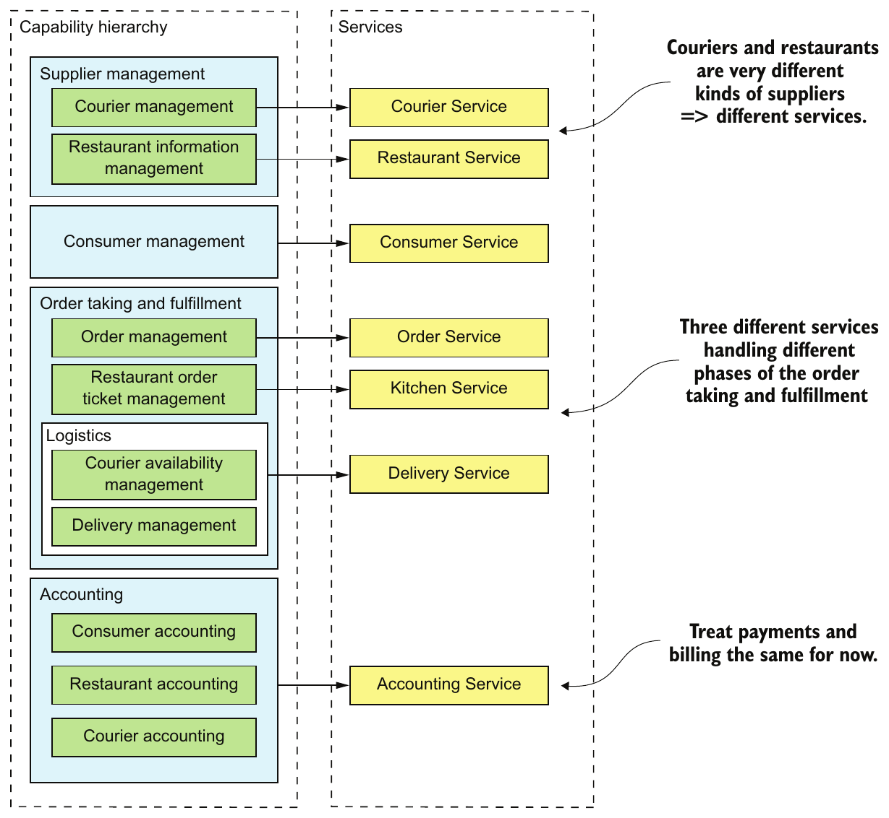

> **English:** Figure 2.8 Mapping FTGO business capabilities to services. Capabilities at various levels of the capability hierarchy are mapped to services.
>
> **Türkçe:** Şekil 2.8 FTGO iş yetkinliklerinin servislerle eşleştirilmesi. Yetkinlik hiyerarşisinin çeşitli düzeylerindeki yetkinlikler, servislerle eşleştirilir.

<!-- source-record: u02_0173 -->

> **English:** Later on, it may make sense to separate payments (of Restaurants and Couriers) and billing (of Consumers).
>
> **Türkçe:** İleride, restoranlara ve kuryelere yapılan ödemeleri, tüketicilerin faturalandırılmasından ayırmak anlamlı olabilir.

<!-- source-record: u02_0174 -->

> **English:** A key benefit of organizing services around capabilities is that because they’re stable, the resulting architecture will also be relatively stable. The individual components of the architecture may evolve as the how aspect of the business changes, but the architecture remains unchanged.
>
> **Türkçe:** Servisleri iş yetkinlikleri etrafında düzenlemenin temel yararı, yetkinliklerin kararlı olması sayesinde ortaya çıkan mimarinin de görece kararlı olmasıdır. İşin nasıl yapıldığı değiştikçe mimarinin tek tek bileşenleri gelişebilir; ancak mimari aynı kalır.

<!-- source-record: u02_0175 -->

> **English:** Having said that, it’s important to remember that the services shown in figure 2.8 are merely the first attempt at defining the architecture. They may evolve over time as we learn more about the application domain. In particular, an important step in the architecture definition process is investigating how the services collaborate in each of the key architectural services. You might, for example, discover that a particular decomposition is inefficient due to excessive interprocess communication and that you must combine services. Conversely, a service might grow in complexity to the point where it becomes worthwhile to split it into multiple services. What’s more, in section 2.2.5, I describe several obstacles to decomposition that might cause you to revisit your decision.
>
> **Türkçe:** Bununla birlikte, Şekil 2.8’deki servislerin mimariyi tanımlamaya yönelik yalnızca ilk deneme olduğunu hatırlamak gerekir. Uygulamanın iş alanını daha iyi öğrendikçe bu servisler değişebilir. Mimari tanımlama sürecinin önemli bir adımı, servislerin temel mimari servislerin her birinde nasıl işbirliği yaptığını incelemektir. Örneğin belirli bir ayrıştırmanın aşırı süreçler arası iletişim nedeniyle verimsiz olduğunu ve servisleri birleştirmeniz gerektiğini görebilirsiniz. Tersine, bir servis onu birden fazla servise bölmenin yararlı olacağı kadar karmaşık hale gelebilir. Ayrıca 2.2.5’te, kararınızı yeniden değerlendirmenize yol açabilecek çeşitli ayrıştırma engellerini anlatıyorum.

<!-- source-pages: 54 -->

<!-- source-record: u02_0176 -->

> **English:** Let’s take a look at another way to decompose an application that is based on domain-driven design.
>
> **Türkçe:** Alan odaklı tasarıma dayanan başka bir uygulama ayrıştırma yöntemine bakalım.

<!-- source-record: u02_0177 -->

### 2.2.3 Defining services by applying the Decompose by sub-domain pattern — Decompose by sub-domain örüntüsünü uygulayarak servisleri tanımlamak

<!-- source-record: u02_0178 -->

> **English:** DDD, as described in the excellent book Domain-driven design by Eric Evans (Addison-Wesley Professional, 2003), is an approach for building complex software applications that is centered on the development of an object-oriented domain model. A domain model captures knowledge about a domain in a form that can be used to solve problems within that domain. It defines the vocabulary used by the team, what DDD calls the Ubiquitous Language. The domain model is closely mirrored in the design and implementation of the application. DDD has two concepts that are incredibly useful when applying the microservice architecture: subdomains and bounded contexts.
>
> **Türkçe:** Eric Evans’ın Domain-driven design (Addison-Wesley Professional, 2003) kitabında açıklanan DDD, nesne yönelimli bir alan modelinin geliştirilmesini merkeze alan, karmaşık yazılım uygulamaları oluşturma yaklaşımıdır. Alan modeli, bir alana ilişkin bilgiyi o alandaki sorunları çözmek için kullanılabilecek biçimde ifade eder. Ekibin kullandığı ve DDD’nin Ubiquitous Language (ortak dil) adını verdiği kavramları tanımlar. Alan modeli, uygulamanın tasarımına ve gerçekleştirimine yakından yansır. DDD’nin mikroservis mimarisinde son derece yararlı iki kavramı vardır: subdomain’ler ve bounded context’ler.

<!-- source-record: u02_0179 -->

### Pattern: Decompose by subdomain — Örüntü: Alt alanlar tarafından parçalan

<!-- source-record: u02_0180 -->

> **English:** Define services corresponding to DDD subdomains. See http://microservices.io/patterns/decomposition/decompose-by-subdomain.html.
>
> **Türkçe:** DDD subdomain’lerine karşılık gelen servisler tanımlayın. Bkz. http://microservices.io/patterns/decomposition/decompose-by-subdomain.html.

<!-- source-record: u02_0181 -->

> **English:** DDD is quite different than the traditional approach to enterprise modeling, which creates a single model for the entire enterprise. In such a model there would be, for example, a single definition of each business entity, such as customer, order, and so on. The problem with this kind of modeling is that getting different parts of an organization to agree on a single model is a monumental task. Also, it means that from the perspective of a given part of the organization, the model is overly complex for their needs. Moreover, the domain model can be confusing because different parts of the organization might use either the same term for different concepts or different terms for the same concept. DDD avoids these problems by defining multiple domain models, each with an explicit scope.
>
> **Türkçe:** DDD, bütün işletme için tek bir model oluşturan geleneksel kurumsal modelleme yaklaşımından oldukça farklıdır. Böyle bir modelde müşteri, sipariş ve benzeri her iş entity’sinin tek bir tanımı olurdu. Bu modellemenin sorunu, organizasyonun farklı kısımlarını tek bir model üzerinde uzlaştırmanın çok büyük bir iş olmasıdır. Ayrıca organizasyonun belirli bir kısmının bakış açısından model, ihtiyaçlarına göre gereğinden fazla karmaşık olur. Farklı kısımlar aynı terimi farklı kavramlar için veya farklı terimleri aynı kavram için kullanabildiğinden, alan modeli kafa karıştırıcı da olabilir. DDD, her birinin kapsamı açıkça belirlenmiş birden fazla alan modeli tanımlayarak bu sorunları önler.

<!-- source-record: u02_0182 -->

> **English:** DDD defines a separate domain model for each subdomain. A subdomain is a part of the domain, DDD’s term for the application’s problem space. Subdomains are identified using the same approach as identifying business capabilities: analyze the business and identify the different areas of expertise. The end result is very likely to be subdomains that are similar to the business capabilities. The examples of subdomains in FTGO include Order taking, Order management, Kitchen management, Delivery, and Financials. As you can see, these subdomains are very similar to the business capabilities described earlier.
>
> **Türkçe:** DDD, her subdomain için ayrı bir alan modeli tanımlar. Subdomain, DDD’nin uygulamanın problem uzayı için kullandığı domain kavramının bir parçasıdır. Alt alanlar, iş yetkinlikleriyle aynı yaklaşımla belirlenir: işletme incelenir ve farklı uzmanlık alanları saptanır. Sonuç büyük olasılıkla iş yetkinliklerine benzeyen alt alanlar olur. FTGO’daki örnekler; sipariş alma, sipariş yönetimi, mutfak yönetimi, teslimat ve finans işleridir. Görüldüğü gibi bunlar, daha önce açıklanan iş yetkinliklerine çok benzer.

<!-- source-pages: 55 -->

<!-- source-record: u02_0183 -->

> **English:** DDD calls the scope of a domain model a bounded context. A bounded context includes the code artifacts that implement the model. When using the microservice architecture, each bounded context is a service or possibly a set of services. We can create a microservice architecture by applying DDD and defining a service for each subdomain. Figure 2.9 shows how the subdomains map to services, each with its own domain model.
>
> **Türkçe:** DDD, bir alan modelinin kapsamını bounded context (sınırlı bağlam) olarak adlandırır. Bounded context, modeli gerçekleştiren kod öğelerini içerir. Mikroservis mimarisinde her bounded context, bir servis veya bazen bir servis kümesidir. DDD’yi uygulayıp her subdomain için bir servis tanımlayarak mikroservis mimarisi oluşturabiliriz. Şekil 2.9, alt alanların her biri kendi alan modeline sahip servislere nasıl karşılık geldiğini gösterir.

<!-- source-record: u02_0184 -->

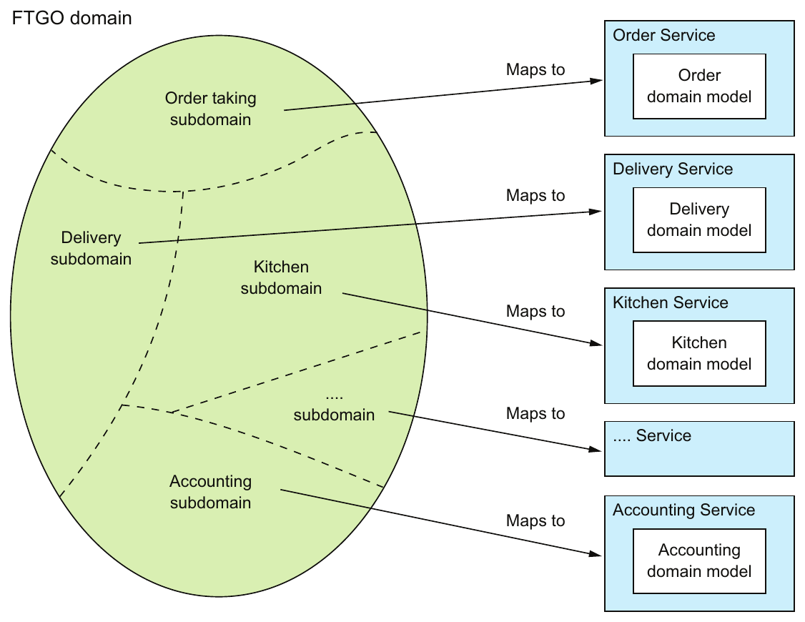

> **English:** Figure 2.9 From subdomains to services: each subdomain of the FTGO application domain is mapped to a service, which has its own domain model.
>
> **Türkçe:** Şekil 2.9 Alt alanlardan servislere: FTGO uygulama alanındaki her subdomain, kendi alan modeline sahip bir servisle eşleştirilir.

<!-- source-record: u02_0185 -->

> **English:** DDD and the microservice architecture are in almost perfect alignment. The DDD concept of subdomains and bounded contexts maps nicely to services within a microservice architecture. Also, the microservice architecture’s concept of autonomous teams owning services is completely aligned with the DDD’s concept of each domain model being owned and developed by a single team. Even better, as I describe later in this section, the concept of a subdomain with its own domain model is a great way to eliminate god classes and thereby make decomposition easier.
>
> **Türkçe:** DDD ile mikroservis mimarisi neredeyse bütünüyle uyumludur. DDD’nin subdomain ve bounded context kavramları, mikroservis mimarisindeki servislere çok uygun biçimde karşılık gelir. Mikroservis mimarisinde özerk ekiplerin servislerin sorumluluğunu üstlenmesi de her alan modelinin tek bir ekip tarafından sahiplenilip geliştirilmesi şeklindeki DDD kavramıyla tamamen uyumludur. Üstelik bu kısmın devamında açıklayacağım gibi, kendi alan modeline sahip alt alan kavramı, god class’ları ortadan kaldırıp ayrıştırmayı kolaylaştırmanın çok iyi bir yoludur.

<!-- source-record: u02_0186 -->

> **English:** Decompose by subdomain and Decompose by business capability are the two main patterns for defining an application’s microservice architecture. There are, however, some useful guidelines for decomposition that have their roots in object-oriented design. Let’s take a look at them.
>
> **Türkçe:** Decompose by subdomain ve Decompose by business capability, uygulamanın mikroservis mimarisini tanımlamak için kullanılan iki temel örüntüdür. Bunun yanında kökeni nesne yönelimli tasarıma dayanan yararlı ayrıştırma ilkeleri de vardır. Bunlara bakalım.

<!-- source-pages: 56 -->

<!-- source-record: u02_0187 -->

### 2.2.4 Decomposition guidelines — Ayrıştırma ilkeleri

<!-- source-record: u02_0188 -->

> **English:** So far in this chapter, we’ve looked at the main ways to define a microservice architecture. We can also adapt and use a couple of principles from object-oriented design when applying the microservice architecture pattern. These principles were created by Robert C. Martin and described in his classic book Designing Object Oriented C++ Applications Using The Booch Method (Prentice Hall, 1995). The first principle is the Single Responsibility Principle (SRP), for defining the responsibilities of a class. The second principle is the Common Closure Principle (CCP), for organizing classes into packages. Let’s take a look at these principles and see how they can be applied to the microservice architecture.
>
> **Türkçe:** Bu bölümde şimdiye kadar mikroservis mimarisini tanımlamanın temel yollarını inceledik. Mikroservis mimarisi örüntüsünü uygularken nesne yönelimli tasarımın birkaç ilkesini de uyarlayıp kullanabiliriz. Robert C. Martin bu ilkeleri oluşturmuş ve Designing Object Oriented C++ Applications Using The Booch Method (Prentice Hall, 1995) kitabında açıklamıştır. İlk ilke, sınıfın sorumluluklarını tanımlayan Single Responsibility Principle’dır (SRP, Tek Sorumluluk İlkesi). İkincisi, sınıfları paketlerde düzenlemeye yönelik Common Closure Principle’dır (CCP, Ortak Kapanma İlkesi). Bu ilkeleri ve mikroservis mimarisine nasıl uygulanabileceklerini inceleyelim.

<!-- source-record: u02_0189 -->

#### SINGLE RESPONSIBILITY PRINCIPLE — Single Responsibility Principle (tek sorumluluk ilkesi)

<!-- source-record: u02_0190 -->

> **English:** One of the main goals of software architecture and design is determining the responsibilities of each software element. The Single Responsibility Principle is as follows:
>
> **Türkçe:** Yazılım mimarisi ve tasarımının temel hedeflerinden biri, her yazılım öğesinin sorumluluklarını belirlemektir. Tek Sorumluluk İlkesi şöyledir:

<!-- source-record: u02_0191 -->

> **English:** A class should have only one reason to change. Robert C. Martin
>
> **Türkçe:** Bir sınıfın değişmek için yalnızca tek bir nedeni olmalıdır. — Robert C. Martin

<!-- source-record: u02_0192 -->

> **English:** Each responsibility that a class has is a potential reason for that class to change. If a class has multiple responsibilities that change independently, the class won’t be stable. By following the SRP, you define classes that each have a single responsibility and hence a single reason for change.
>
> **Türkçe:** Bir sınıfın her sorumluluğu, o sınıfın değişmesi için olası bir nedendir. Sınıfın birbirinden bağımsız değişen birden fazla sorumluluğu varsa sınıf kararlı olmayacaktır. SRP’yi izleyerek her biri tek bir sorumluluğa ve dolayısıyla tek bir değişim nedenine sahip sınıflar tanımlarsınız.

<!-- source-record: u02_0193 -->

> **English:** We can apply SRP when defining a microservice architecture and create small, cohesive services that each have a single responsibility. This will reduce the size of the services and increase their stability. The new FTGO architecture is an example of SRP in action. Each aspect of getting food to a consumer—order taking, order preparation, and delivery—is the responsibility of a separate service.
>
> **Türkçe:** Mikroservis mimarisini tanımlarken SRP’yi uygulayıp her biri tek bir sorumluluğa sahip küçük ve kendi içinde uyumlu servisler oluşturabiliriz. Böylece servislerin boyutu küçülür, kararlılığı artar. Yeni FTGO mimarisi, SRP’nin uygulamadaki bir örneğidir. Yemeğin tüketiciye ulaştırılmasının her yönü — siparişin alınması, hazırlanması ve teslimi — ayrı bir servisin sorumluluğundadır.

<!-- source-record: u02_0194 -->

#### COMMON CLOSURE PRINCIPLE — Common Closure Principle (ortak kapanım ilkesi)

<!-- source-record: u02_0195 -->

> **English:** The other useful principle is the Common Closure Principle:
>
> **Türkçe:** Diğer yararlı ilke, Ortak Kapanma İlkesi’dir:

<!-- source-record: u02_0196 -->

> **English:** The classes in a package should be closed together against the same kinds of changes. A change that affects a package affects all the classes in that package. Robert C. Martin
>
> **Türkçe:** Bir paketteki sınıflar, aynı tür değişikliklere karşı birlikte kapalı olmalıdır. Bir paketi etkileyen değişiklik, o paketteki bütün sınıfları etkiler. — Robert C. Martin

<!-- source-record: u02_0197 -->

> **English:** The idea is that if two classes change in lockstep because of the same underlying reason, then they belong in the same package. Perhaps, for example, those classes implement a different aspect of a particular business rule. The goal is that when that business rule changes, developers only need to change code in a small number of packages (ideally only one). Adhering to the CCP significantly improves the maintainability of an application.
>
> **Türkçe:** Buradaki düşünce, aynı temel nedenle birlikte değişen iki sınıfın aynı pakette bulunması gerektiğidir. Örneğin bu sınıflar belirli bir iş kuralının farklı yönlerini gerçekleştirebilir. Amaç, bu iş kuralı değiştiğinde geliştiricilerin yalnızca az sayıda pakette, ideal olarak tek pakette, kod değiştirmesidir. CCP’ye uymak, uygulamanın bakım yapılabilirliğini önemli ölçüde iyileştirir.

<!-- source-record: u02_0198 -->

> **English:** We can apply CCP when creating a microservice architecture and package components that change for the same reason into the same service. Doing this will minimize the number of services that need to be changed and deployed when some requirement changes. Ideally, a change will only affect a single team and a single service. CCP is the antidote to the distributed monolith anti-pattern.
>
> **Türkçe:** Mikroservis mimarisi oluştururken CCP’yi uygulayıp aynı nedenle değişen bileşenleri aynı servis içinde paketleyebiliriz. Bu, bir gereksinim değiştiğinde değiştirilip dağıtılması gereken servis sayısını en aza indirir. İdeal olarak değişiklik yalnızca bir ekibi ve bir servisi etkiler. CCP, dağıtık monolit anti-pattern’inin panzehiridir.

<!-- source-pages: 57 -->

<!-- source-record: u02_0199 -->

> **English:** SRP and CCP are 2 of the 11 principles developed by Bob Martin. They’re particularly useful when developing a microservice architecture. The remaining nine principles are used when designing classes and packages. For more information about SRP, CCP, and the other OOD principles, see the article “The Principles of Object Oriented Design” on Bob Martin’s website (http://butunclebob.com/ArticleS.UncleBob.PrinciplesOfOod).
>
> **Türkçe:** SRP ve CCP, Bob Martin’in geliştirdiği 11 ilkeden ikisidir. Mikroservis mimarisi geliştirirken özellikle yararlıdırlar. Kalan dokuz ilke, sınıflar ve paketler tasarlanırken kullanılır. SRP, CCP ve diğer OOD ilkeleri hakkında daha fazla bilgi için Bob Martin’in sitesindeki “The Principles of Object Oriented Design” yazısına bakın: http://butunclebob.com/ArticleS.UncleBob.PrinciplesOfOod.

<!-- source-record: u02_0200 -->

> **English:** Decomposition by business capability and by subdomain along with SRP and CCP are good techniques for decomposing an application into services. In order to apply them and successfully develop a microservice architecture, you must solve some transaction management and interprocess communication issues.
>
> **Türkçe:** İş yetkinliğine ve alt alana göre ayrıştırma, SRP ve CCP ile birlikte, uygulamayı servislere ayırmak için iyi tekniklerdir. Bunları uygulayıp başarılı bir mikroservis mimarisi geliştirebilmek için bazı transaction yönetimi ve süreçler arası iletişim sorunlarını çözmeniz gerekir.

<!-- source-record: u02_0201 -->

### 2.2.5 Obstacles to decomposing an application into services — Bir uygulamayı servislere ayırmanın önündeki engeller

<!-- source-record: u02_0202 -->

> **English:** On the surface, the strategy of creating a microservice architecture by defining services corresponding to business capabilities or subdomains looks straightforward. You may, however, encounter several obstacles:
>
> **Türkçe:** İlk bakışta, iş yetkinliklerine veya alt alanlara karşılık gelen servisleri tanımlayarak mikroservis mimarisi oluşturmak kolay görünür. Bununla birlikte çeşitli engellerle karşılaşabilirsiniz:

<!-- source-record: u02_0203 -->

> **English:** • Network latency
>
> **Türkçe:** • Ağ gecikmesi

<!-- source-record: u02_0204 -->

> **English:** • Reduced availability due to synchronous communication
>
> **Türkçe:** • Senkron iletişim nedeniyle kullanılabilirliğin azalması.

<!-- source-record: u02_0205 -->

> **English:** • Maintaining data consistency across services
>
> **Türkçe:** • Servisler arasında veri tutarlılığını koruma.

<!-- source-record: u02_0206 -->

> **English:** • Obtaining a consistent view of the data
>
> **Türkçe:** • Verilerin tutarlı bir görünümünü elde etme.

<!-- source-record: u02_0207 -->

> **English:** • God classes preventing decomposition
>
> **Türkçe:** • God class’ların ayrıştırmayı engellemesi.

<!-- source-record: u02_0208 -->

> **English:** Let’s take a look at each obstacle, starting with network latency.
>
> **Türkçe:** Ağ gecikmesinden başlayarak her engeli inceleyelim.

<!-- source-record: u02_0209 -->

#### NETWORK LATENCY — Ağ gecikmesi

<!-- source-record: u02_0210 -->

> **English:** Network latency is an ever-present concern in a distributed system. You might discover that a particular decomposition into services results in a large number of round-trips between two services. Sometimes, you can reduce the latency to an acceptable amount by implementing a batch API for fetching multiple objects in a single round trip. But in other situations, the solution is to combine services, replacing expensive IPC with language-level method or function calls.
>
> **Türkçe:** Ağ gecikmesi, dağıtık sistemlerde her zaman dikkate alınması gereken bir konudur. Belirli bir ayrıştırmanın iki servis arasında çok sayıda ağ gidiş-dönüşüne yol açtığını görebilirsiniz. Bazen tek gidiş-dönüşte birden fazla nesneyi getiren bir batch API gerçekleştirerek gecikmeyi kabul edilebilir düzeye indirebilirsiniz. Diğer durumlarda ise çözüm servisleri birleştirerek maliyetli IPC’nin yerine programlama dili düzeyindeki metot veya fonksiyon çağrılarını koymaktır.

<!-- source-record: u02_0211 -->

#### SYNCHRONOUS INTERPROCESS COMMUNICATION REDUCES AVAILABILITY — Senkron süreçler arası iletişim kullanılabilirliği azaltır

<!-- source-record: u02_0212 -->

> **English:** Another problem is how to implement interservice communication in a way that doesn’t reduce availability. For example, the most straightforward way to implement the createOrder() operation is for the Order Service to synchronously invoke the other services using REST. The drawback of using a protocol like REST is that it reduces the availability of the Order Service. It won’t be able to create an order if any of those other services are unavailable. Sometimes this is a worthwhile trade-off, but in chapter 3 you’ll learn that using asynchronous messaging, which eliminates tight coupling and improves availability, is often a better choice.
>
> **Türkçe:** Başka bir sorun, servisler arası iletişimi kullanılabilirliği azaltmadan gerçekleştirmektir. Örneğin createOrder() işlemini gerçekleştirmenin en doğrudan yolu, Order Service’in REST kullanarak diğer servisleri senkron çağırmasıdır. REST gibi bir protokolün dezavantajı, Order Service’in kullanılabilirliğini azaltmasıdır. Diğer servislerden biri bile kullanılamıyorsa sipariş oluşturulamaz. Bazen bu kabul edilebilir bir ödünleşimdir; ancak 3. bölümde, sıkı bağlılığı kaldırıp kullanılabilirliği iyileştiren asenkron mesajlaşmanın çoğu zaman daha iyi bir seçenek olduğunu göreceksiniz.

<!-- source-pages: 58 -->

<!-- source-record: u02_0213 -->

#### MAINTAINING DATA CONSISTENCY ACROSS SERVICES — Servisler arasında veri tutarlılığını korumak

<!-- source-record: u02_0214 -->

> **English:** Another challenge is maintaining data consistency across services. Some system operations need to update data in multiple services. For example, when a restaurant accepts an order, updates must occur in both the Kitchen Service and the Delivery Service. The Kitchen Service changes the status of the Ticket. The Delivery Service schedules delivery of the order. Both of these updates must be done atomically.
>
> **Türkçe:** Diğer bir zorluk, servisler arasında veri tutarlılığını korumaktır. Bazı sistem işlemleri birden fazla servisteki veriyi güncellemelidir. Örneğin restoran bir siparişi kabul ettiğinde hem Kitchen Service hem de Delivery Service içinde güncelleme yapılmalıdır. Kitchen Service, Ticket durumunu değiştirir. Delivery Service ise siparişin teslimini planlar. Bu iki güncelleme atomik biçimde gerçekleştirilmelidir.

<!-- source-record: u02_0215 -->

> **English:** The traditional solution is to use a two-phase, commit-based, distributed transaction management mechanism. But as you’ll see in chapter 4, this is not a good choice for modern applications, and you must use a very different approach to transaction management, a saga. A saga is a sequence of local transactions that are coordinated using messaging. Sagas are more complex than traditional ACID transactions but they work well in many situations. One limitation of sagas is that they are eventually consistent. If you need to update some data atomically, then it must reside within a single service, which can be an obstacle to decomposition.
>
> **Türkçe:** Geleneksel çözüm, iki aşamalı commit kullanan dağıtık transaction yönetim mekanizmasıdır. Ancak 4. bölümde göreceğiniz gibi bu, modern uygulamalar için iyi bir seçenek değildir; transaction yönetimine çok farklı bir yaklaşım olan saga kullanılmalıdır. Saga, mesajlaşma aracılığıyla koordine edilen yerel transaction’lar dizisidir. Saga’lar geleneksel ACID transaction’larından daha karmaşıktır; yine de birçok durumda iyi çalışırlar. Saga’ların bir sınırlaması, nihai tutarlılık sağlamalarıdır. Bazı verileri atomik olarak güncellemeniz gerekiyorsa bu veriler tek bir servis içinde bulunmalıdır; bu da ayrıştırmaya engel olabilir.

<!-- source-record: u02_0216 -->

#### OBTAINING A CONSISTENT VIEW OF THE DATA — Verilerin tutarlı bir görünümünü elde etmek

<!-- source-record: u02_0217 -->

> **English:** Another obstacle to decomposition is the inability to obtain a truly consistent view of data across multiple databases. In a monolithic application, the properties of ACID transactions guarantee that a query will return a consistent view of the database. In contrast, in a microservice architecture, even though each service’s database is consistent, you can’t obtain a globally consistent view of the data. If you need a consistent view of some data, then it must reside in a single service, which can prevent decomposition. Fortunately, in practice this is rarely a problem.
>
> **Türkçe:** Ayrıştırmanın önündeki başka bir engel, birden fazla veritabanındaki verilerin gerçekten tutarlı bir görünümünün elde edilememesidir. Monolitik uygulamada ACID transaction özellikleri, bir query’nin veritabanının tutarlı bir görünümünü döndürmesini garanti eder. Mikroservis mimarisinde ise her servisin veritabanı kendi içinde tutarlı olsa bile verilerin tümünü kapsayan tutarlı bir görünüm elde edemezsiniz. Bazı verilerin tutarlı görünümüne ihtiyaç varsa bu veriler tek bir serviste bulunmalıdır; bu durum ayrıştırmayı engelleyebilir. Neyse ki uygulamada bu sorunla nadiren karşılaşılır.

<!-- source-record: u02_0218 -->

#### GOD CLASSES PREVENT DECOMPOSITION — God class'lar ayrıştırmayı engeller

<!-- source-record: u02_0219 -->

> **English:** Another obstacle to decomposition is the existence of so-called god classes. God classes are the bloated classes that are used throughout an application (http://wiki.c2.com/?GodClass). A god class typically implements business logic for many different aspects of the application. It normally has a large number of fields mapped to a database table with many columns. Most applications have at least one of these classes, each representing a concept that’s central to the domain: accounts in banking, orders in e-commerce, policies in insurance, and so on. Because a god class bundles together state and behavior for many different aspects of an application, it’s an insurmountable obstacle to splitting any business logic that uses it into services.
>
> **Türkçe:** Ayrıştırmanın bir başka engeli, god class olarak adlandırılan sınıflardır. Bunlar uygulamanın her yerinde kullanılan, aşırı büyümüş sınıflardır (http://wiki.c2.com/?GodClass). Bir god class tipik olarak uygulamanın birçok farklı yönünün iş mantığını gerçekleştirir. Genellikle çok sayıda sütunu bulunan bir veritabanı tablosuna eşlenen çok sayıda alan içerir. Çoğu uygulamada bu sınıflardan en az biri bulunur; her biri iş alanının merkezindeki bir kavramı temsil eder: bankacılıkta hesaplar, e-ticarette siparişler, sigortacılıkta poliçeler gibi. God class, uygulamanın birçok farklı yönüne ait durumu ve davranışı bir araya getirdiği için, onu kullanan iş mantığını servislere bölmenin önünde aşılması çok zor bir engeldir.

<!-- source-record: u02_0220 -->

> **English:** The Order class is a great example of a god class in the FTGO application. That’s not surprising—after all, the purpose of FTGO is to deliver food orders to customers. Most parts of the system involve orders. If the FTGO application had a single domain model, the Order class would be a very large class. It would have state and behavior corresponding to many different parts of the application. Figure 2.10 shows the structure of this class that would be created using traditional modeling techniques.
>
> **Türkçe:** Order sınıfı, FTGO uygulamasındaki god class için iyi bir örnektir. Bu şaşırtıcı değildir; sonuçta FTGO’nun amacı yemek siparişlerini müşterilere ulaştırmaktır. Sistemin büyük kısmı siparişlerle ilgilidir. FTGO tek bir alan modeline sahip olsaydı, Order çok büyük bir sınıf olurdu. Uygulamanın birçok farklı kısmına karşılık gelen durumu ve davranışı içerirdi. Şekil 2.10, geleneksel modelleme teknikleriyle oluşturulacak bu sınıfın yapısını gösterir.

<!-- source-record: u02_0221 -->

> **English:** As you can see, the Order class has fields and methods corresponding to order processing, restaurant order management, delivery, and payments. This class also has a complex state model, due to the fact that one model has to describe state transitions from disparate parts of the application. In its current form, this class makes it extremely difficult to split code into services.
>
> **Türkçe:** Görüldüğü gibi Order sınıfı; sipariş işleme, restoran sipariş yönetimi, teslimat ve ödemeye karşılık gelen alanlar ve metotlar içerir. Tek bir model, uygulamanın birbirinden farklı kısımlarındaki durum geçişlerini açıklamak zorunda olduğu için bu sınıfın durum modeli de karmaşıktır. Mevcut haliyle bu sınıf, kodu servislere bölmeyi son derece güçleştirir.

<!-- source-pages: 59 -->

<!-- source-record: u02_0222 -->

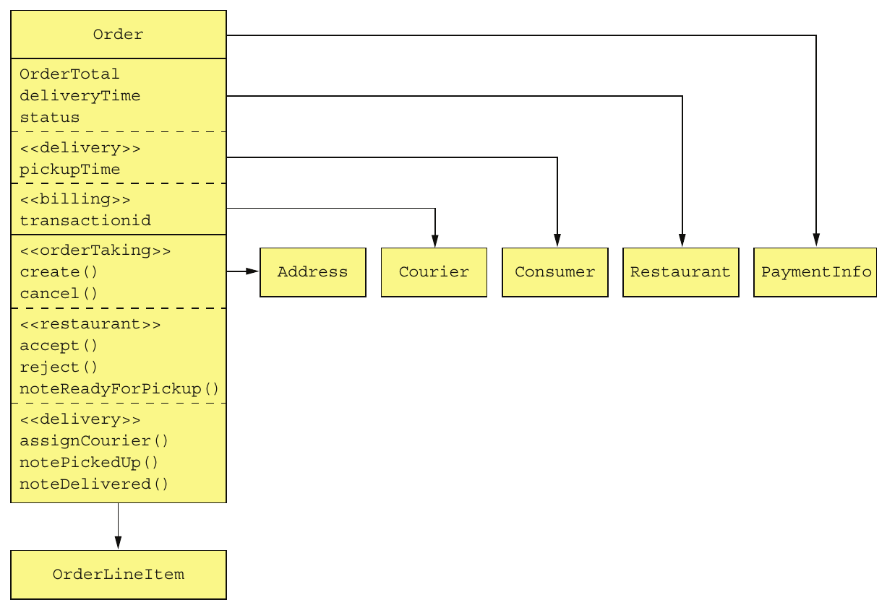

> **English:** Figure 2.10 The Order god class is bloated with numerous responsibilities.
>
> **Türkçe:** Şekil 2.10 Order god class’ı, üstlendiği çok sayıda sorumluluk nedeniyle aşırı büyümüştür.

<!-- source-record: u02_0223 -->

> **English:** One solution is to package the Order class into a library and create a central Order database. All services that process orders use this library and access the database. The trouble with this approach is that it violates one of the key principles of the microservice architecture and results in undesirable, tight coupling. For example, any change to the Order schema requires the teams to update their code in lockstep.
>
> **Türkçe:** Bir çözüm, Order sınıfını bir kütüphane olarak paketleyip merkezî bir Order veritabanı oluşturmaktır. Sipariş işleyen bütün servisler bu kütüphaneyi kullanır ve veritabanına erişir. Bu yaklaşımın sorunu, mikroservis mimarisinin temel ilkelerinden birini ihlal edip istenmeyen sıkı bağlılık oluşturmasıdır. Örneğin Order şemasındaki herhangi bir değişiklik, ekiplerin kodlarını birlikte ve eşzamanlı güncellemesini gerektirir.

<!-- source-record: u02_0224 -->

> **English:** Another solution is to encapsulate the Order database in an Order Service, which is invoked by the other services to retrieve and update orders. The problem with that design is that the Order Service would be a data service with an anemic domain model containing little or no business logic. Neither of these options is appealing, but fortunately, DDD provides a solution.
>
> **Türkçe:** Diğer bir çözüm, Order veritabanını bir Order Service içinde kapsüllemektir; diğer servisler siparişleri okumak ve güncellemek için bu servisi çağırır. Bu tasarımın sorunu, Order Service’in çok az iş mantığı içeren veya hiç içermeyen anemic domain model’e sahip bir veri servisine dönüşmesidir. Bu iki seçenek de çekici değildir; neyse ki DDD bir çözüm sunar.

<!-- source-record: u02_0225 -->

> **English:** A much better approach is to apply DDD and treat each service as a separate sub-domain with its own domain model. This means that each of the services in the FTGO application that has anything to do with orders has its own domain model with its version of the Order class. A great example of the benefit of multiple domain models is the Delivery Service. Its view of an Order, shown in figure 2.11, is extremely simple: pickup address, pickup time, delivery address, and delivery time. Moreover, rather than call it an Order, the Delivery Service uses the more appropriate name of Delivery.
>
> **Türkçe:** Çok daha iyi bir yaklaşım, DDD uygulayıp her servisi kendi alan modeline sahip ayrı bir subdomain olarak ele almaktır. Böylece FTGO’da siparişlerle ilgili her servisin, Order sınıfının kendi sürümünü içeren ayrı bir alan modeli olur. Birden fazla alan modelinin yararını gösteren iyi bir örnek Delivery Service’tir. Şekil 2.11’de gösterilen sipariş görünümü son derece basittir: teslim alma adresi, teslim alma zamanı, teslimat adresi ve teslimat zamanı. Üstelik Delivery Service bunu Order diye adlandırmak yerine daha uygun olan Delivery adını kullanır.

<!-- source-pages: 60 -->

<!-- source-record: u02_0226 -->

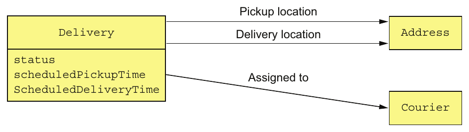

> **English:** Figure 2.11 The Delivery Service domain model
>
> **Türkçe:** Şekil 2.11 Delivery Service alan modeli.

<!-- source-record: u02_0227 -->

> **English:** The Delivery Service isn’t interested in any of the other attributes of an order.
>
> **Türkçe:** Delivery Service, siparişin diğer özellikleriyle ilgilenmez.

<!-- source-record: u02_0228 -->

> **English:** The Kitchen Service also has a much simpler view of an order. Its version of an Order is called a Ticket. As figure 2.12 shows, a Ticket simply consists of a status, the requestedDeliveryTime, a prepareByTime, and a list of line items that tell the restaurant what to prepare. It’s unconcerned with the consumer, payment, delivery, and so on.
>
> **Türkçe:** Kitchen Service de siparişin çok daha basit bir görünümüne sahiptir. Bu serviste Order’ın karşılığı Ticket adını alır. Şekil 2.12’de görüldüğü gibi Ticket; durum, requestedDeliveryTime, prepareByTime ve restorana ne hazırlayacağını bildiren sipariş kalemleri listesinden oluşur. Tüketici, ödeme, teslimat ve benzeri konularla ilgilenmez.

<!-- source-record: u02_0229 -->

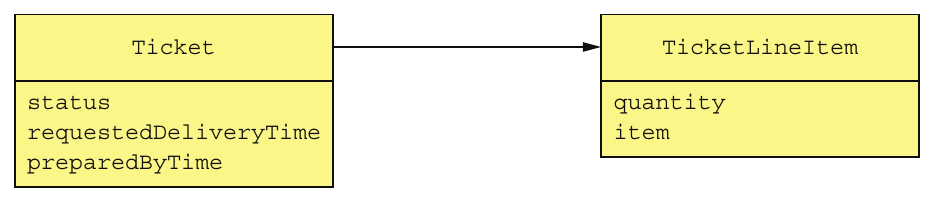

> **English:** Figure 2.12 The Kitchen Service domain model
>
> **Türkçe:** Şekil 2.12 Kitchen Service alan modeli.

<!-- source-record: u02_0230 -->

> **English:** The Order service has the most complex view of an order, shown in figure 2.13. Even though it has quite a few fields and methods, it’s still much simpler than the original version.
>
> **Türkçe:** Order Service, Şekil 2.13’te gösterilen en karmaşık sipariş görünümüne sahiptir. Çok sayıda alanı ve metodu bulunsa da özgün sürümden yine çok daha basittir.

<!-- source-record: u02_0231 -->

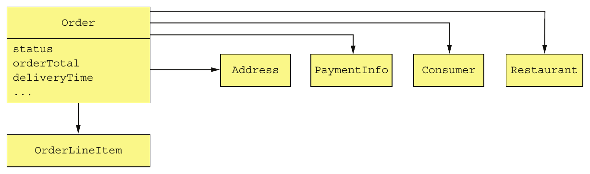

> **English:** Figure 2.13 The Order Service domain model
>
> **Türkçe:** Şekil 2.13 Order Service alan modeli.

<!-- source-record: u02_0232 -->

> **English:** The Order class in each domain model represents different aspects of the same Order business entity. The FTGO application must maintain consistency between these different objects in different services. For example, once the Order Service has authorized the consumer’s credit card, it must trigger the creation of the Ticket in the Kitchen Service. Similarly, if the restaurant rejects the order via the Kitchen Service, it must be cancelled in the Order Service, and the customer credited in the billing service. In chapter 4, you’ll learn how to maintain consistency between services, using the previously mentioned event-driven mechanism sagas.
>
> **Türkçe:** Her alan modelindeki Order sınıfı, aynı Order iş entity’sinin farklı yönlerini temsil eder. FTGO, farklı servislerdeki bu farklı nesneler arasında tutarlılığı korumalıdır. Örneğin Order Service, tüketicinin kredi kartından provizyon aldıktan sonra Kitchen Service içinde Ticket oluşturulmasını tetiklemelidir. Benzer biçimde restoran Kitchen Service üzerinden siparişi reddederse sipariş Order Service içinde iptal edilmeli, faturalama servisinde de müşterinin hesabına iade işlenmelidir. 4. bölümde, daha önce anılan olay güdümlü saga mekanizmasıyla servisler arasında tutarlılığın nasıl korunacağını öğreneceksiniz.

<!-- source-pages: 61 -->

<!-- source-record: u02_0233 -->

> **English:** As well as creating technical challenges, having multiple domain models also impacts the implementation of the user experience. An application must translate between the user experience, which is its own domain model, and the domain models of each of the services. In the FTGO application, for example, the Order status displayed to a consumer is derived from Order information stored in multiple services. This translation is often handled by the API gateway, discussed in chapter 8. Despite these challenges, it’s essential that you identify and eliminate god classes when defining a microservice architecture.
>
> **Türkçe:** Birden fazla alan modeli, teknik zorluklar yaratmanın yanında kullanıcı deneyiminin gerçekleştirilmesini de etkiler. Uygulama, kendisi de ayrı bir alan modeli olan kullanıcı deneyimi ile servislerin alan modelleri arasında dönüşüm yapmalıdır. Örneğin FTGO’da tüketiciye gösterilen Order durumu, birden fazla serviste saklanan Order bilgilerinden türetilir. Bu dönüşümü genellikle 8. bölümde anlatılan API gateway üstlenir. Bu zorluklara rağmen mikroservis mimarisini tanımlarken god class’ları belirleyip ortadan kaldırmak esastır.

<!-- source-record: u02_0234 -->

> **English:** We’ll now look at how to define the service APIs.
>
> **Türkçe:** Şimdi servis API’lerinin nasıl tanımlanacağına bakalım.

<!-- source-record: u02_0235 -->

### 2.2.6 Defining service APIs — Servis API'lerini tanımlamak

<!-- source-record: u02_0236 -->

> **English:** So far, we have a list of system operations and a list of potential services. The next step is to define each service’s API: its operations and events. A service API operation exists for one of two reasons: some operations correspond to system operations. They are invoked by external clients and perhaps by other services. The other operations exist to support collaboration between services. These operations are only invoked by other services.
>
> **Türkçe:** Şu ana kadar bir sistem işlemleri listesi ve olası servisler listesi oluşturduk. Sıradaki adım, her servisin API’sini, yani işlemlerini ve olaylarını tanımlamaktır. Bir servis API işlemi iki nedenden biriyle bulunur: bazı işlemler sistem işlemlerine karşılık gelir ve dış istemciler, bazen de başka servisler tarafından çağrılır. Diğer işlemler, servisler arası işbirliğini destekler ve yalnızca başka servisler tarafından çağrılır.

<!-- source-record: u02_0237 -->

> **English:** A service publishes events primarily to enable it to collaborate with other services. Chapter 4 describes how events can be used to implement sagas, which maintain data consistency across services. And chapter 7 discusses how events can be used to update CQRS views, which support efficient querying. An application can also use events to notify external clients. For example, it could use WebSockets to deliver events to a browser.
>
> **Türkçe:** Bir servis, öncelikle diğer servislerle işbirliği yapabilmek için olaylar yayımlar. 4. bölüm, servisler arasında veri tutarlılığını koruyan saga’ların olaylarla nasıl gerçekleştirildiğini açıklar. 7. bölüm ise verimli sorgulamayı destekleyen CQRS görünümlerinin olaylarla nasıl güncellendiğini ele alır. Uygulama, dış istemcileri bilgilendirmek için de olay kullanabilir. Örneğin olayları tarayıcıya ulaştırmak için WebSockets kullanılabilir.

<!-- source-record: u02_0238 -->

> **English:** The starting point for defining the service APIs is to map each system operation to a service. After that, we decide whether a service needs to collaborate with others to implement a system operation. If collaboration is required, we then determine what APIs those other services must provide in order to support the collaboration. Let’s begin by looking at how to assign system operations to services.
>
> **Türkçe:** Servis API’lerini tanımlamanın başlangıç noktası, her sistem işlemini bir servisle eşleştirmektir. Ardından servisin bu işlemi gerçekleştirmek için diğerleriyle işbirliği yapması gerekip gerekmediğine karar veririz. İşbirliği gerekiyorsa, diğer servislerin bunu desteklemek için hangi API’leri sunacağını belirleriz. Önce sistem işlemlerinin servislere nasıl atanacağına bakalım.

<!-- source-record: u02_0239 -->

#### ASSIGNING SYSTEM OPERATIONS TO SERVICES — Sistem işlemlerini servislere atamak

<!-- source-record: u02_0240 -->

> **English:** The first step is to decide which service is the initial entry point for a request. Many system operations neatly map to a service, but sometimes the mapping is less obvious. Consider, for example, the noteUpdatedLocation() operation, which updates the courier location. On one hand, because it’s related to couriers, this operation should be assigned to the Courier service. On the other hand, it’s the Delivery Service that needs the courier location. In this case, assigning an operation to a service that needs the information provided by the operation is a better choice. In other situations, it might make sense to assign an operation to the service that has the information necessary to handle it.
>
> **Türkçe:** İlk adım, bir isteğin ilk giriş noktası olacak servise karar vermektir. Birçok sistem işlemi bir servisle kolayca eşleşir; ancak bazen eşleşme o kadar açık değildir. Örneğin kurye konumunu güncelleyen noteUpdatedLocation() işlemini düşünün. Bir yandan kuryelerle ilişkili olduğu için Courier Service’e atanmalıdır. Diğer yandan kurye konumuna ihtiyaç duyan servis Delivery Service’tir. Bu durumda işlemi, sağladığı bilgiye ihtiyaç duyan servise atamak daha iyi bir tercihtir. Başka durumlarda ise işlemi, onu gerçekleştirmek için gereken bilgiye sahip servise atamak anlamlı olabilir.

<!-- source-pages: 62 -->

<!-- source-record: u02_0241 -->

> **English:** Table 2.2 shows which services in the FTGO application are responsible for which operations.
>
> **Türkçe:** Tablo 2.2, FTGO’daki hangi servislerin hangi işlemlerden sorumlu olduğunu gösterir.

<!-- source-record: u02_0242 -->

> **English:** Table 2.2 Mapping system operations to services in the FTGO application
>
> **Türkçe:** Tablo 2.2 FTGO uygulamasında servislere sistem operasyonlarını eşleme

| **EN:** Service<br/>**TR:** servis | **EN:** Operations<br/>**TR:** İşlemler |
| --- | --- |
| **EN:** Consumer Service<br/>**TR:** Consumer Service | **EN:** createConsumer()<br/>**TR:** createConsumer() |
| **EN:** Order Service<br/>**TR:** Order Service | **EN:** createOrder()<br/>**TR:** createOrder() |
| **EN:** Restaurant Service<br/>**TR:** Restaurant Service | **EN:** findAvailableRestaurants()<br/>**TR:** findAvailableRestaurants() |
| **EN:** Kitchen Service<br/>**TR:** Kitchen Service | **EN:** • acceptOrder() • noteOrderReadyForPickup()<br/>**TR:** - acceptOrder() - noteOrderReadyForPickup() |
| **EN:** Delivery Service<br/>**TR:** Delivery Service | **EN:** • noteUpdatedLocation() • noteDeliveryPickedUp() • noteDeliveryDelivered()<br/>**TR:** - noteUpdatedLocation() - noteDeliveryPickedUp() - noteDeliveryDelivered() |

<!-- source-record: u02_0243 -->

> **English:** After having assigned operations to services, the next step is to decide how the services collaborate in order to handle each system operation.
>
> **Türkçe:** İşlemler servislere atandıktan sonra sıradaki adım, her sistem işlemini karşılamak için servislerin nasıl işbirliği yapacağına karar vermektir.

<!-- source-record: u02_0244 -->

#### DETERMINING THE APIS REQUIRED TO SUPPORT COLLABORATION BETWEEN SERVICES — Servisler arasındaki işbirliğini desteklemek için gereken API'leri belirlemek

<!-- source-record: u02_0245 -->

> **English:** Some system operations are handled entirely by a single service. For example, in the FTGO application, the Consumer Service handles the createConsumer() operation entirely by itself. But other system operations span multiple services. The data needed to handle one of these requests might, for instance, be scattered around multiple services. For example, in order to implement the createOrder() operation, the Order Service must invoke the following services in order to verify its preconditions and make the post-conditions become true:
>
> **Türkçe:** Bazı sistem işlemleri tamamen tek bir servis tarafından gerçekleştirilir. Örneğin FTGO’da Consumer Service, createConsumer() işlemini tamamen kendi başına karşılar. Diğer sistem işlemleri ise birden fazla servise yayılır. Bu istekleri karşılamak için gereken veri, birden fazla servise dağılmış olabilir. Örneğin createOrder() işlemini gerçekleştiren Order Service, ön koşulları doğrulamak ve son koşulları sağlamak için aşağıdaki servisleri çağırmalıdır:

<!-- source-record: u02_0246 -->

> **English:** • Consumer Service—Verify that the consumer can place an order and obtain their payment information.
>
> **Türkçe:** • Consumer Service — Tüketicinin sipariş verebildiğini doğrulamak ve ödeme bilgilerini almak.

<!-- source-record: u02_0247 -->

> **English:** • Restaurant Service—Validate the order line items, verify that the delivery address/time is within the restaurant’s service area, verify order minimum is met, and obtain prices for the order line items.
>
> **Türkçe:** • Restaurant Service — Sipariş kalemlerini doğrulamak, teslimat adresi ve saatinin restoranın hizmet alanına uygunluğunu denetlemek, asgari sipariş koşulunun karşılandığını doğrulamak ve sipariş kalemlerinin fiyatlarını almak.

<!-- source-record: u02_0248 -->

> **English:** • Kitchen Service—Create the Ticket.
>
> **Türkçe:** • Kitchen Service — Ticket oluşturmak.

<!-- source-record: u02_0249 -->

> **English:** • Accounting Service—Authorize the consumer’s credit card.
>
> **Türkçe:** • Accounting Service — Tüketicinin kredi kartından provizyon almak.

<!-- source-record: u02_0250 -->

> **English:** Similarly, in order to implement the acceptOrder() system operation, the Kitchen Service must invoke the Delivery Service to schedule a courier to deliver the order. Table 2.3 shows the services, their revised APIs, and their collaborators. In order to fully define the service APIs, you need to analyze each system operation and determine what collaboration is required.
>
> **Türkçe:** Benzer şekilde acceptOrder() sistem işlemini gerçekleştirmek için Kitchen Service, siparişi teslim edecek kuryeyi planlamak üzere Delivery Service’i çağırmalıdır. Tablo 2.3; servisleri, güncellenmiş API’lerini ve işbirliği yaptıkları servisleri gösterir. Servis API’lerini bütünüyle tanımlamak için her sistem işlemini inceleyip gerekli işbirliğini belirlemelisiniz.

<!-- source-pages: 63 -->

<!-- source-record: u02_0251 -->

> **English:** Table 2.3 The services, their revised APIs, and their collaborators
>
> **Türkçe:** Tablo 2.3 servisler, gözden geçirilmiş API'leri ve işbirlikçileri

| **EN:** Service<br/>**TR:** servis | **EN:** Operations<br/>**TR:** İşlemler | **EN:** Collaborators<br/>**TR:** İşbirliği yapanlar |
| --- | --- | --- |
| **EN:** Consumer Service<br/>**TR:** Consumer Service | **EN:** verifyConsumerDetails()<br/>**TR:** verifyConsumerDetails() | **EN:** —<br/>**TR:** - Evet . |
| **EN:** Order Service<br/>**TR:** Order Service | **EN:** createOrder()<br/>**TR:** createOrder() | **EN:** • Consumer Service verifyConsumerDetails() • Restaurant Service verifyOrderDetails() • Kitchen Service createTicket() • Accounting Service authorizeCard()<br/>**TR:** - Consumer Service verifyConsumerDetails() - Restaurant Service verifyOrderDetails() - Kitchen Service createTicket() - Accounting Service authorizeCard() |
| **EN:** Restaurant Service<br/>**TR:** Restaurant Service | **EN:** • findAvailableRestaurants() • verifyOrderDetails()<br/>**TR:** - findAvailableRestaurants() - verifyOrderDetails() | **EN:** —<br/>**TR:** - Evet . |
| **EN:** Kitchen Service<br/>**TR:** Kitchen Service | **EN:** • createTicket() • acceptOrder() • noteOrderReadyForPickup()<br/>**TR:** - createTicket() - acceptOrder() - noteOrderReadyForPickup() | **EN:** • Delivery Service scheduleDelivery()<br/>**TR:** - Delivery Service scheduleDelivery() |
| **EN:** Delivery Service<br/>**TR:** Delivery Service | **EN:** • scheduleDelivery() • noteUpdatedLocation() • noteDeliveryPickedUp() • noteDeliveryDelivered()<br/>**TR:** - scheduleDelivery() - noteUpdatedLocation() - noteDeliveryPickedUp() - noteDeliveryDelivered() | **EN:** —<br/>**TR:** - Evet . |
| **EN:** Accounting Service<br/>**TR:** Accounting Service | **EN:** • authorizeCard()<br/>**TR:** - authorizeCard() | **EN:** —<br/>**TR:** - Evet . |

<!-- source-record: u02_0252 -->

> **English:** So far, we’ve identified the services and the operations that each service implements. But it’s important to remember that the architecture we’ve sketched out is very abstract. We’ve not selected any specific IPC technology. Moreover, even though the term operation suggests some kind of synchronous request/response-based IPC mechanism, you’ll see that asynchronous messaging plays a significant role. Throughout this book I describe architecture and design concepts that influence how these services collaborate.
>
> **Türkçe:** Şu ana kadar servisleri ve her birinin gerçekleştirdiği işlemleri belirledik. Ancak taslağını çıkardığımız mimarinin hâlâ çok soyut olduğunu hatırlamak gerekir. Belirli bir IPC teknolojisi seçmedik. Üstelik operation terimi senkron istek/yanıt temelli bir IPC mekanizmasını düşündürse de asenkron mesajlaşmanın önemli rol oynadığını göreceksiniz. Bu kitap boyunca servislerin işbirliği biçimini etkileyen mimari ve tasarım kavramlarını anlatıyorum.

<!-- source-record: u02_0253 -->

> **English:** Chapter 3 describes specific IPC technologies, including synchronous communication mechanisms such as REST, and asynchronous messaging using a message broker. I discuss how synchronous communication can impact availability and introduce the concept of a self-contained service, which doesn’t invoke other services synchronously. One way to implement a self-contained service is to use the CQRS pattern, covered in chapter 7. The Order Service could, for example, maintain a replica of the data owned by the Restaurant Service in order to eliminate the need for it to synchronously invoke the Restaurant Service to validate an order. It keeps the replica up-to-date by subscribing to events published by the Restaurant Service whenever it updates its data.
>
> **Türkçe:** 3. bölüm; REST gibi senkron iletişim mekanizmaları ve mesaj aracısı üzerinden asenkron mesajlaşma dâhil belirli IPC teknolojilerini açıklar. Senkron iletişimin kullanılabilirliği nasıl etkilediğini ele alıp başka servisleri senkron biçimde çağırmayan, kendi kendine yeterli servis kavramını tanıtıyorum. Böyle bir servisi gerçekleştirmenin yollarından biri, 7. bölümdeki CQRS örüntüsüdür. Örneğin Order Service, siparişi doğrulamak için Restaurant Service’i senkron çağırma gereksinimini ortadan kaldırmak üzere Restaurant Service’in sahip olduğu verinin bir kopyasını tutabilir. Restaurant Service her veri güncellemesinde olay yayımlar; Order Service bu olaylara abone olarak kopyayı güncel tutar.

<!-- source-record: u02_0254 -->

> **English:** Chapter 4 introduces the saga concept and how it uses asynchronous messaging for coordinating the services that participate in the saga. As well as reliably updating data scattered across multiple services, a saga is also a way to implement a self-contained service. For example, I describe how the createOrder() operation is implemented using a saga, which invokes services such as the Consumer Service, Kitchen Service, and Accounting Service using asynchronous messaging.
>
> **Türkçe:** 4. bölüm saga kavramını ve saga’ya katılan servislerin koordinasyonunda asenkron mesajlaşmayı nasıl kullandığını tanıtır. Saga, birden fazla servise dağılmış verileri güvenilir biçimde güncellemenin yanında, kendi kendine yeterli servis gerçekleştirmenin de bir yoludur. Örneğin createOrder() işleminin; Consumer Service, Kitchen Service ve Accounting Service gibi servisleri asenkron mesajlaşmayla çağıran bir saga kullanılarak nasıl gerçekleştirildiğini anlatıyorum.

<!-- source-pages: 64 -->

<!-- source-record: u02_0255 -->

> **English:** Chapter 8 describes the concept of an API gateway, which exposes an API to external clients. An API gateway might implement a query operation using the API composition pattern, described in chapter 7, rather than simply route it to the service. Logic in the API gateway gathers the data needed by the query by calling multiple services and combining the results. In this situation, the system operation is assigned to the API gateway rather than a service. The services need to implement the query operations needed by the API gateway.
>
> **Türkçe:** 8. bölüm, dış istemcilere API sunan API gateway kavramını açıklar. API gateway bir query’yi yalnızca servise yönlendirmek yerine, 7. bölümdeki API composition örüntüsüyle gerçekleştirebilir. Gateway içindeki mantık, birden fazla servisi çağırıp sonuçları birleştirerek sorgunun ihtiyaç duyduğu veriyi toplar. Bu durumda sistem işlemi bir servise değil, API gateway’e atanır. Servisler ise API gateway’in ihtiyaç duyduğu sorgu işlemlerini gerçekleştirmelidir.

<!-- source-record: u02_0256 -->

## Summary — Bölüm özeti

<!-- source-record: u02_0257 -->

> **English:** • Architecture determines your application’s -ilities, including maintainability, testability, and deployability, which directly impact development velocity.
>
> **Türkçe:** • Mimari; bakım yapılabilirlik, test edilebilirlik ve dağıtılabilirlik dâhil uygulamanın kalite niteliklerini belirler. Bu nitelikler geliştirme hızını doğrudan etkiler.

<!-- source-record: u02_0258 -->

> **English:** • The microservice architecture is an architecture style that gives an application high maintainability, testability, and deployability.
>
> **Türkçe:** • Mikroservis mimarisi; uygulamaya yüksek bakım yapılabilirlik, test edilebilirlik ve dağıtılabilirlik kazandıran bir mimari stildir.

<!-- source-record: u02_0259 -->

> **English:** • Services in a microservice architecture are organized around business concerns— business capabilities or subdomains—rather than technical concerns.
>
> **Türkçe:** • Mikroservis mimarisindeki servisler, teknik konular yerine iş yetkinlikleri veya alt alanlar gibi iş odaklı konular etrafında düzenlenir.

<!-- source-record: u02_0260 -->

> **English:** • There are two patterns for decomposition: – Decompose by business capability, which has its origins in business architecture – Decompose by subdomain, based on concepts from domain-driven design
>
> **Türkçe:** • İki ayrıştırma örüntüsü vardır: kökeni iş mimarisine dayanan Decompose by business capability ve alan odaklı tasarım kavramlarına dayanan Decompose by subdomain.

<!-- source-record: u02_0261 -->

> **English:** • You can eliminate god classes, which cause tangled dependencies that prevent decomposition, by applying DDD and defining a separate domain model for each service.
>
> **Türkçe:** • DDD uygulayıp her servis için ayrı alan modeli tanımlayarak, ayrıştırmayı engelleyen karmaşık bağımlılıklara yol açan god class’ları ortadan kaldırabilirsiniz.
