# Ünite 03 · Interprocess communication in a microservice architecture — Mikroservis mimarisinde süreçler arası iletişim

**Amaç:** Süreçler arası iletişimi; etkileşim biçimleri, API tasarımı, REST, gRPC, servis keşfi ve asenkron mesajlaşma üzerinden İngilizce–Türkçe karşılaştırmalı çalışmak.

**Kaynak:** Kullanıcının sağladığı *Microservices Patterns*, bölüm 3; `Microservices_Patterns_1_Bolumden_Itibaren.pdf`, PDF sayfaları 65–109. Kaynak başlıkları, paragrafları, maddeleri, tabloları ve kod örnekleri sırasıyla işlenir. Sayfa sonunda bölünen paragraflar birleştirilir. Özgün grafiklerdeki İngilizce etiketler korunur; şekil açıklamaları iki dildedir.

**Okuma notu:** “Bugün” ifadeleri, teknoloji sürümleri ve ürün karşılaştırmaları kitabın yazıldığı dönemin anlatımıdır. Kaynak içindeki örnekler ve kodlar korunmuştur; bunların güncel sürümlerle doğrulandığı iddia edilmez. OCR ve satır bölünmesi hataları giderilmiştir.

**Dil çalışması:** [Ünite sözlüğü](vocabulary.md) · [Grammar notları](grammar_notes.md).

## Interprocess communication in a microservice architecture — Mikroservis mimarisinde süreçler arası iletişim

### This chapter covers — Bu bölümün kapsamı

> **English:** Applying the communication patterns: Remote procedure invocation, Circuit breaker, Client-side discovery, Self registration, Server-side discovery, Third party registration, Asynchronous messaging, Transactional outbox, Transaction log tailing, Polling publisher
>
> **Türkçe:** İletişim örüntülerini uygulamak: Remote procedure invocation (uzak yordam çağrısı), Circuit breaker (devre kesici), Client-side discovery (istemci tarafında keşif), Self registration (kendi kendine kayıt), Server-side discovery (sunucu tarafında keşif), Third party registration (üçüncü taraf kaydı), Asynchronous messaging (asenkron mesajlaşma), Transactional outbox, Transaction log tailing ve Polling publisher.

> **English:** The importance of interprocess communication in a microservice architecture
>
> **Türkçe:** Mikroservis mimarisinde süreçler arası iletişimin önemi.

> **English:** Defining and evolving APIs
>
> **Türkçe:** API’leri tanımlamak ve zaman içinde geliştirmek.

> **English:** The various interprocess communication options and their trade-offs
>
> **Türkçe:** Çeşitli süreçler arası iletişim seçenekleri ve bunların gerektirdiği ödünleşimler.

> **English:** The benefits of services that communicate using asynchronous messaging
>
> **Türkçe:** Asenkron mesajlaşma kullanarak iletişim kuran servislerin yararları.

> **English:** Reliably sending messages as part of a database transaction
>
> **Türkçe:** Bir veritabanı transaction’ının parçası olarak mesajları güvenilir biçimde göndermek.

> **English:** Mary and her team, like most other developers, had some experience with interprocess communication (IPC) mechanisms. The FTGO application has a REST API that’s used by mobile applications and browser-side JavaScript. It also uses various cloud services, such as the Twilio messaging service and the Stripe payment service. But within a monolithic application like FTGO, modules invoke one another via language-level method or function calls. FTGO developers generally don’t need to think about IPC unless they’re working on the REST API or the modules that integrate with cloud services.
>
> **Türkçe:** Çoğu geliştirici gibi Mary ve ekibinin de interprocess communication (IPC, süreçler arası iletişim) mekanizmaları konusunda bir miktar deneyimi vardı. FTGO uygulamasında mobil uygulamaların ve tarayıcı tarafındaki JavaScript’in kullandığı bir REST API bulunur. Uygulama ayrıca Twilio mesajlaşma servisi ve Stripe ödeme servisi gibi çeşitli bulut servislerini kullanır. Ancak FTGO gibi monolitik bir uygulamanın içinde modüller, dil düzeyindeki metot veya fonksiyon çağrılarıyla birbirini çağırır. FTGO geliştiricilerinin, REST API veya bulut servisleriyle bütünleşen modüller üzerinde çalışmadıkları sürece genellikle IPC’yi düşünmeleri gerekmez.

> **English:** In contrast, as you saw in chapter 2, the microservice architecture structures an application as a set of services. Those services must often collaborate in order to handle a request. Because service instances are typically processes running on multiple machines, they must interact using IPC. It plays a much more important role in a microservice architecture than it does in a monolithic application. Consequently, as they migrate their application to microservices, Mary and the rest of the FTGO developers will need to spend a lot more time thinking about IPC.
>
> **Türkçe:** Buna karşılık, 2. bölümde gördüğünüz gibi mikroservis mimarisi bir uygulamayı servisler bütünü olarak yapılandırır. Bu servislerin bir isteği karşılamak için çoğu zaman işbirliği yapması gerekir. Servis instance’ları (çalışan örnekleri) genellikle birden fazla makinede çalışan süreçler olduğundan IPC kullanarak etkileşim kurmalıdır. IPC, mikroservis mimarisinde monolitik uygulamaya kıyasla çok daha önemli bir rol oynar. Bu nedenle Mary ve diğer FTGO geliştiricileri, uygulamalarını mikroservislere taşırken IPC üzerine düşünmeye çok daha fazla zaman ayırmak zorunda kalacaktır.

> **English:** There’s no shortage of IPC mechanisms to choose from. Today, the fashionable choice is REST (with JSON). It’s important, though, to remember that there are no silver bullets. You must carefully consider the options. This chapter explores various IPC options, including REST and messaging, and discusses the trade-offs.
>
> **Türkçe:** Aralarından seçilebilecek IPC mekanizmalarının sayısı az değildir. Bugün gözde seçenek REST’tir; veri biçimi olarak JSON kullanılır. Ancak her sorunu çözen sihirli bir çözüm bulunmadığını hatırlamak önemlidir. Seçenekleri dikkatle değerlendirmelisiniz. Bu bölüm, REST ve mesajlaşma dâhil çeşitli IPC seçeneklerini inceler ve bunların ödünleşimlerini tartışır.

> **English:** The choice of IPC mechanism is an important architectural decision. It can impact application availability. What’s more, as I explain in this chapter and the next, IPC even intersects with transaction management. I favor an architecture consisting of loosely coupled services that communicate with one another using asynchronous messaging. Synchronous protocols such as REST are used mostly to communicate with other applications.
>
> **Türkçe:** IPC mekanizmasının seçimi önemli bir mimari karardır. Uygulamanın availability (kullanılabilirlik) düzeyini etkileyebilir. Üstelik bu bölümde ve sonraki bölümde açıklayacağım gibi IPC, transaction yönetimiyle bile kesişir. Ben, birbirleriyle asenkron mesajlaşma kullanarak iletişim kuran gevşek bağlı servislerden oluşan bir mimariyi tercih ederim. REST gibi senkron protokoller çoğunlukla diğer uygulamalarla iletişim kurmak için kullanılır.

> **English:** I begin this chapter with an overview of interprocess communication in microservice architecture. Next, I describe remote procedure invocation-based IPC, of which REST is the most popular example. I cover important topics including service discovery and how to handle partial failure. After that, I describe asynchronous messaging-based IPC. I also talk about scaling consumers while preserving message ordering, correctly handling duplicate messages, and transactional messaging. Finally, I go through the concept of self-contained services that handle synchronous requests without communicating with other services in order to improve availability.
>
> **Türkçe:** Bu bölüme mikroservis mimarisindeki süreçler arası iletişime genel bir bakışla başlıyorum. Ardından, en yaygın örneği REST olan uzak yordam çağrısına dayalı IPC’yi anlatıyorum. Servis keşfi ve partial failure’ın (kısmi arıza) nasıl ele alınacağı gibi önemli konuları kapsıyorum. Sonra asenkron mesajlaşmaya dayalı IPC’yi açıklıyorum. Ayrıca mesaj sırasını koruyarak tüketicileri ölçeklemeyi, yinelenen mesajları doğru işlemeyi ve transactional messaging’i ele alıyorum. Son olarak, kullanılabilirliği artırmak için başka servislerle iletişim kurmadan senkron istekleri karşılayan self-contained services (kendi kendine yeterli servisler) kavramını inceliyorum.

## 3.1 Overview of interprocess communication in a microservice architecture — Mikroservis mimarisinde süreçler arası iletişime genel bakış

> **English:** There are lots of different IPC technologies to choose from. Services can use synchronous request/response-based communication mechanisms, such as HTTP-based REST or gRPC. Alternatively, they can use asynchronous, message-based communication mechanisms such as AMQP or STOMP. There are also a variety of different message formats. Services can use human-readable, text-based formats such as JSON or XML. Alternatively, they could use a more efficient binary format such as Avro or Protocol Buffers.
>
> **Türkçe:** Seçilebilecek birçok farklı IPC teknolojisi vardır. Servisler, HTTP tabanlı REST veya gRPC gibi senkron request/response (istek/yanıt) iletişim mekanizmaları kullanabilir. Alternatif olarak AMQP veya STOMP gibi asenkron, mesaj tabanlı iletişim mekanizmalarını seçebilir. Çeşitli mesaj biçimleri de vardır. Servisler JSON veya XML gibi insan tarafından okunabilen, metin tabanlı biçimler kullanabilir. Bunun yerine Avro veya Protocol Buffers gibi daha verimli bir binary (ikili) biçim de kullanabilirler.

> **English:** Before getting into the details of specific technologies, I want to bring up several design issues you should consider. I start this section with a discussion of interaction styles, which are a technology-independent way of describing how clients and services interact. Next I discuss the importance of precisely defining APIs in a microservice architecture, including the concept of API-first design. After that, I discuss the important topic of API evolution. Finally, I discuss different options for message formats and how they can determine ease of API evolution. Let’s begin by looking at interaction styles.
>
> **Türkçe:** Belirli teknolojilerin ayrıntılarına geçmeden önce değerlendirmeniz gereken birkaç tasarım konusuna değinmek istiyorum. Bu kısma, istemcilerin ve servislerin nasıl etkileştiğini teknolojiden bağımsız biçimde anlatan interaction styles (etkileşim biçimleri) tartışmasıyla başlıyorum. Ardından API-first design (önce API tasarımı) kavramı dâhil, mikroservis mimarisinde API’leri kesin olarak tanımlamanın önemini tartışıyorum. Daha sonra API’lerin zaman içinde değişmesi konusunu ele alıyorum. Son olarak farklı mesaj biçimi seçeneklerini ve bunların API’yi değiştirme kolaylığını nasıl belirleyebileceğini anlatıyorum. Etkileşim biçimlerine bakarak başlayalım.

### 3.1.1 Interaction styles — Etkileşim biçimleri

> **English:** It’s useful to first think about the style of interaction between a service and its clients before selecting an IPC mechanism for a service’s API. Thinking first about the interaction style will help you focus on the requirements and avoid getting mired in the details of a particular IPC technology. Also, as described in section 3.4, the choice of interaction style impacts the availability of your application. Furthermore, as you’ll see in chapters 9 and 10, it helps you select the appropriate integration testing strategy.
>
> **Türkçe:** Bir servisin API’si için IPC mekanizması seçmeden önce servis ile istemcileri arasındaki etkileşim biçimini düşünmek yararlıdır. Önce etkileşim biçimine odaklanmak, gereksinimlere yoğunlaşmanıza ve belirli bir IPC teknolojisinin ayrıntılarına takılıp kalmamanıza yardımcı olur. Ayrıca 3.4. kısımda açıklandığı gibi etkileşim biçimi seçimi, uygulamanızın kullanılabilirliğini etkiler. Dahası, 9. ve 10. bölümlerde göreceğiniz üzere uygun integration testing (entegrasyon testi) stratejisini seçmenize yardımcı olur.

> **English:** There are a variety of client-service interaction styles. As table 3.1 shows, they can be categorized in two dimensions. The first dimension is whether the interaction is one-to-one or one-to-many:
>
> **Türkçe:** Çeşitli istemci-servis etkileşim biçimleri vardır. Tablo 3.1’de gösterildiği gibi bunlar iki boyutta sınıflandırılabilir. İlk boyut, etkileşimin one-to-one (bire bir) veya one-to-many (bire çok) olmasıdır:

> **English:** One-to-one—Each client request is processed by exactly one service.
>
> **Türkçe:** One-to-one — Her istemci isteği tam olarak bir servis tarafından işlenir.

> **English:** One-to-many—Each request is processed by multiple services.
>
> **Türkçe:** One-to-many — Her istek birden fazla servis tarafından işlenir.

> **English:** The second dimension is whether the interaction is synchronous or asynchronous:
>
> **Türkçe:** İkinci boyut, etkileşimin senkron veya asenkron olmasıdır:

> **English:** Synchronous—The client expects a timely response from the service and might even block while it waits.
>
> **Türkçe:** Synchronous (senkron) — İstemci, servisten zamanında bir yanıt bekler; hatta beklerken bloklanabilir.

> **English:** Asynchronous—The client doesn’t block, and the response, if any, isn’t necessarily sent immediately.
>
> **Türkçe:** Asynchronous (asenkron) — İstemci bloklanmaz ve varsa yanıtın hemen gönderilmesi zorunlu değildir.

> **English:** Table 3.1 The various interaction styles can be characterized in two dimensions: one-to-one vs one-to-many and synchronous vs asynchronous.
>
> **Türkçe:** Tablo 3.1 Çeşitli etkileşim biçimleri iki boyutta tanımlanabilir: bire bir / bire çok ve senkron / asenkron.

| Etkileşim / Interaction | one-to-one / bire bir | one-to-many / bire çok |
| --- | --- | --- |
| Synchronous / Senkron | Request/response / İstek-yanıt | — |
| Asynchronous / Asenkron | Asynchronous request/response / Asenkron istek-yanıt; One-way notifications / Tek yönlü bildirimler | Publish/subscribe / Yayınla-abone ol; Publish/async responses / Yayınla-asenkron yanıtlar |

> **English:** The following are the different types of one-to-one interactions:
>
> **Türkçe:** Bire bir etkileşimin farklı türleri şunlardır:

> **English:** Request/response—A service client makes a request to a service and waits for a response. The client expects the response to arrive in a timely fashion. It might even block while waiting. This is an interaction style that generally results in services being tightly coupled.
>
> **Türkçe:** Request/response — Servisin istemcisi servise bir istek gönderir ve yanıt bekler. İstemci, yanıtın zamanında gelmesini bekler; bekleme sırasında bloklanabilir bile. Bu etkileşim biçimi genellikle servislerin sıkı bağlı olmasına yol açar.

> **English:** Asynchronous request/response—A service client sends a request to a service, which replies asynchronously. The client doesn’t block while waiting, because the service might not send the response for a long time.
>
> **Türkçe:** Asynchronous request/response — Servisin istemcisi servise bir istek gönderir; servis asenkron yanıt verir. Servis yanıtı uzun süre göndermeyebileceği için istemci beklerken bloklanmaz.

> **English:** One-way notifications—A service client sends a request to a service, but no reply is expected or sent.
>
> **Türkçe:** One-way notifications — Servisin istemcisi servise bir istek gönderir; ancak herhangi bir yanıt beklenmez veya gönderilmez.

> **English:** It’s important to remember that the synchronous request/response interaction style is mostly orthogonal to IPC technologies. A service can, for example, interact with another service using request/response style interaction with either REST or messaging. Even if two services are communicating using a message broker, the client service might be blocked waiting for a response. It doesn’t necessarily mean they’re loosely coupled. That’s something I revisit later in this chapter when discussing the impact of inter-service communication on availability.
>
> **Türkçe:** Senkron request/response etkileşim biçiminin, IPC teknolojilerinden büyük ölçüde bağımsız bir boyut olduğunu hatırlamak önemlidir. Örneğin bir servis, başka bir servisle REST veya mesajlaşma kullanarak request/response biçiminde etkileşebilir. İki servis bir message broker (mesaj aracısı) kullanarak iletişim kuruyor olsa bile istemci servis yanıt beklerken bloklanabilir. Bu, servislerin mutlaka gevşek bağlı olduğu anlamına gelmez. Bölümün ilerleyen kısmında servisler arası iletişimin kullanılabilirlik üzerindeki etkisini tartışırken bu konuya döneceğim.

> **English:** The following are the different types of one-to-many interactions:
>
> **Türkçe:** Bire çok etkileşimin farklı türleri şunlardır:

> **English:** Publish/subscribe—A client publishes a notification message, which is consumed by zero or more interested services.
>
> **Türkçe:** Publish/subscribe — İstemci bir bildirim mesajı yayınlar; mesaj, onunla ilgilenen sıfır veya daha fazla servis tarafından tüketilir.

> **English:** Publish/async responses—A client publishes a request message and then waits for a certain amount of time for responses from interested services.
>
> **Türkçe:** Publish/async responses — İstemci bir istek mesajı yayınlar, ardından ilgilenen servislerin yanıtları için belirli bir süre bekler.

> **English:** Each service will typically use a combination of these interaction styles. Many of the services in the FTGO application have both synchronous and asynchronous APIs for operations, and many also publish events.
>
> **Türkçe:** Her servis genellikle bu etkileşim biçimlerinin bir birleşimini kullanır. FTGO uygulamasındaki servislerin çoğunda işlemler için hem senkron hem asenkron API’ler bulunur; bunların birçoğu ayrıca event (olay) yayınlar.

> **English:** Let’s look at how to define a service’s API.
>
> **Türkçe:** Bir servisin API’sinin nasıl tanımlanacağına bakalım.

### 3.1.2 Defining APIs in a microservice architecture — Mikroservis mimarisinde API’leri tanımlamak

> **English:** APIs or interfaces are central to software development. An application is comprised of modules. Each module has an interface that defines the set of operations that module’s clients can invoke. A well-designed interface exposes useful functionality while hiding the implementation. It enables the implementation to change without impacting clients.
>
> **Türkçe:** API’ler veya arayüzler, yazılım geliştirmenin merkezinde yer alır. Uygulama modüllerden oluşur. Her modülün, istemcilerinin çağırabileceği işlemler kümesini tanımlayan bir arayüzü vardır. İyi tasarlanmış bir arayüz, gerçekleştirim ayrıntılarını gizlerken yararlı işlevleri dışarıya sunar. Böylece gerçekleştirim, istemciler etkilenmeden değişebilir.

> **English:** In a monolithic application, an interface is typically specified using a programming language construct such as a Java interface. A Java interface specifies a set of methods that a client can invoke. The implementation class is hidden from the client. Moreover, because Java is a statically typed language, if the interface changes to be incompatible with the client, the application won’t compile.
>
> **Türkçe:** Monolitik bir uygulamada arayüz genellikle Java interface gibi bir programlama dili yapısıyla belirtilir. Java interface, istemcinin çağırabileceği metotlar kümesini belirtir. Gerçekleştirim sınıfı istemciden gizlenir. Ayrıca Java statically typed (statik tür denetimli) bir dil olduğundan arayüz istemciyle uyumsuz olacak biçimde değişirse uygulama derlenmez.

> **English:** APIs and interfaces are equally important in a microservice architecture. A service’s API is a contract between the service and its clients. As described in chapter 2, a service’s API consists of operations, which clients can invoke, and events, which are published by the service. An operation has a name, parameters, and a return type. An event has a type and a set of fields and is, as described in section 3.3, published to a message channel.
>
> **Türkçe:** API’ler ve arayüzler mikroservis mimarisinde de aynı derecede önemlidir. Bir servisin API’si, servis ile istemcileri arasındaki bir contract’tır (sözleşmedir). İkinci bölümde açıklandığı gibi API, istemcilerin çağırabileceği işlemlerden ve servisin yayınladığı olaylardan oluşur. Bir işlemin adı, parametreleri ve dönüş türü vardır. Bir olayın türü ve alanlar kümesi vardır; olay, 3.3. kısımda açıklandığı gibi bir message channel’a (mesaj kanalına) yayınlanır.

> **English:** The challenge is that a service API isn’t defined using a simple programming language construct. By definition, a service and its clients aren’t compiled together. If a new version of a service is deployed with an incompatible API, there’s no compilation error. Instead, there will be runtime failures.
>
> **Türkçe:** Güçlük, servis API’sinin basit bir programlama dili yapısıyla tanımlanmamasıdır. Tanım gereği servis ve istemcileri birlikte derlenmez. Bir servisin yeni sürümü uyumsuz bir API ile dağıtılırsa derleme hatası oluşmaz. Bunun yerine çalışma zamanında hatalar meydana gelir.

> **English:** Regardless of which IPC mechanism you choose, it’s important to precisely define a service’s API using some kind of interface definition language (IDL). Moreover, there are good arguments for using an API-first approach to defining services (see www.programmableweb.com/news/how-to-design-great-apis-api-first-design-and-raml/how-to/ 2015/07/10 for more). First you write the interface definition. Then you review the interface definition with the client developers. Only after iterating on the API definition do you then implement the service. Doing this up-front design increases your chances of building a service that meets the needs of its clients.
>
> **Türkçe:** Hangi IPC mekanizmasını seçerseniz seçin, servisin API’sini bir tür interface definition language (IDL, arayüz tanımlama dili) kullanarak kesin biçimde tanımlamanız önemlidir. Üstelik servis tanımlarken API-first yaklaşımını kullanmayı destekleyen güçlü gerekçeler vardır; ayrıntılar için www.programmableweb.com/news/how-to-design-great-apis-api-first-design-and-raml/how-to/2015/07/10 adresine bakabilirsiniz. Önce arayüz tanımını yazarsınız. Sonra bu tanımı istemci geliştiricileriyle gözden geçirirsiniz. Servisi ancak API tanımı üzerinde yinelemeler yaptıktan sonra gerçekleştirirsiniz. Bu ön tasarım, istemcilerin ihtiyaçlarını karşılayan bir servis oluşturma olasılığını artırır.

#### API-first design is essential — API-first tasarımı vazgeçilmezdir

> **English:** Even in small projects, I’ve seen problems occur because components don’t agree on an API. For example, on one project the backend Java developer and the AngularJS frontend developer both said they had completed development. The application, however, didn’t work. The REST and WebSocket API used by the frontend application to communicate with the backend was poorly defined. As a result, the two applications couldn’t communicate!
>
> **Türkçe:** Küçük projelerde bile bileşenlerin API üzerinde anlaşamaması nedeniyle sorunlar yaşandığını gördüm. Örneğin bir projede backend Java geliştiricisi ile AngularJS frontend geliştiricisi, geliştirmeyi tamamladıklarını söyledi. Buna rağmen uygulama çalışmıyordu. Frontend uygulamasının backend ile iletişim kurmak için kullandığı REST ve WebSocket API yeterince iyi tanımlanmamıştı. Sonuç olarak iki uygulama iletişim kuramıyordu!

> **English:** The nature of the API definition depends on which IPC mechanism you’re using. For example, if you’re using messaging, the API consists of the message channels, the message types, and the message formats. If you’re using HTTP, the API consists of the URLs, the HTTP verbs, and the request and response formats. Later in this chapter, I explain how to define APIs.
>
> **Türkçe:** API tanımının niteliği, kullandığınız IPC mekanizmasına bağlıdır. Örneğin mesajlaşma kullanıyorsanız API; mesaj kanallarından, mesaj türlerinden ve mesaj biçimlerinden oluşur. HTTP kullanıyorsanız URL’lerden, HTTP fiillerinden, istek ve yanıt biçimlerinden oluşur. Bölümün ilerleyen kısmında API’lerin nasıl tanımlanacağını açıklayacağım.

> **English:** A service’s API is rarely set in stone. It will likely evolve over time. Let’s take a look at how to do that and consider the issues you’ll face.
>
> **Türkçe:** Bir servisin API’si nadiren değişmez biçimde sabitlenir. Büyük olasılıkla zaman içinde değişecektir. Bunun nasıl yapılacağına bakalım ve karşılaşacağınız sorunları değerlendirelim.

### 3.1.3 Evolving APIs — API’leri zaman içinde geliştirmek

> **English:** APIs invariably change over time as new features are added, existing features are changed, and (perhaps) old features are removed. In a monolithic application, it’s relatively straightforward to change an API and update all the callers. If you’re using a statically typed language, the compiler helps by giving a list of compilation errors. The only challenge may be the scope of the change. It might take a long time to change a widely used API.
>
> **Türkçe:** Yeni özellikler eklendikçe, mevcut özellikler değiştirildikçe ve belki eski özellikler kaldırıldıkça API’ler de kaçınılmaz olarak değişir. Monolitik uygulamada bir API’yi değiştirmek ve bütün çağıranları güncellemek görece kolaydır. Statik tür denetimli bir dil kullanıyorsanız derleyici, derleme hatalarını listeleyerek size yardımcı olur. Tek güçlük değişikliğin kapsamı olabilir. Yaygın kullanılan bir API’yi değiştirmek uzun sürebilir.

> **English:** In a microservices-based application, changing a service’s API is a lot more difficult. A service’s clients are other services, which are often developed by other teams. The clients may even be other applications outside of the organization. You usually can’t force all clients to upgrade in lockstep with the service. Also, because modern applications are usually never down for maintenance, you’ll typically perform a rolling upgrade of your service, so both old and new versions of a service will be running simultaneously.
>
> **Türkçe:** Mikroservis tabanlı uygulamada bir servisin API’sini değiştirmek çok daha güçtür. Servisin istemcileri, çoğu zaman başka ekiplerin geliştirdiği diğer servislerdir. İstemciler, organizasyon dışındaki başka uygulamalar bile olabilir. Genellikle bütün istemcileri servisle aynı anda ve eşgüdümlü olarak yükseltmeye zorlayamazsınız. Ayrıca modern uygulamalar genellikle bakım için kapatılmadığından servisinize çoğunlukla rolling upgrade (kademeli sürüm yükseltme) uygularsınız; dolayısıyla servisin eski ve yeni sürümleri aynı anda çalışır.

> **English:** It’s important to have a strategy for dealing with these challenges. How you handle a change to an API depends on the nature of the change.
>
> **Türkçe:** Bu güçlükleri ele almak için bir stratejinizin olması önemlidir. API değişikliğini nasıl yöneteceğiniz, değişikliğin niteliğine bağlıdır.

#### USE SEMANTIC VERSIONING — Semantic versioning kullanın

> **English:** The Semantic Versioning specification (http://semver.org) is a useful guide to versioning APIs. It’s a set of rules that specify how version numbers are used and incremented. Semantic versioning was originally intended to be used for versioning of software packages, but you can use it for versioning APIs in a distributed system.
>
> **Türkçe:** Semantic Versioning belirtimi (http://semver.org), API’leri sürümlendirmek için yararlı bir kılavuzdur. Sürüm numaralarının nasıl kullanılacağını ve artırılacağını belirleyen kurallardan oluşur. Semantic versioning başlangıçta yazılım paketlerinin sürümlendirilmesi için tasarlanmıştır; ancak dağıtık bir sistemdeki API’leri sürümlendirmek için de kullanılabilir.

> **English:** The Semantic Versioning specification (SemVer) requires a version number to consist of three parts: MAJOR.MINOR.PATCH. You must increment each part of a version number as follows:
>
> **Türkçe:** Semantic Versioning belirtimi (Semver), sürüm numarasının üç bölümden oluşmasını gerektirir: MAJOR.MINOR.PATCH. Sürüm numarasının her bölümü şu durumlarda artırılmalıdır:

> **English:** MAJOR—When you make an incompatible change to the API
>
> **Türkçe:** MAJOR — API’de geriye dönük uyumsuz bir değişiklik yaptığınızda.

> **English:** MINOR—When you make backward-compatible enhancements to the API
>
> **Türkçe:** MINOR — API’ye geriye dönük uyumlu geliştirmeler eklediğinizde.

> **English:** PATCH—When you make a backward-compatible bug fix
>
> **Türkçe:** PATCH — Geriye dönük uyumlu bir hata düzeltmesi yaptığınızda.

> **English:** There are a couple of places you can use the version number in an API. If you’re implementing a REST API, you can, as mentioned below, use the major version as the first element of the URL path. Alternatively, if you’re implementing a service that uses messaging, you can include the version number in the messages that it publishes. The goal is to properly version APIs and to evolve them in a controlled fashion. Let’s look at how to handle minor and major changes.
>
> **Türkçe:** API’de sürüm numarasını kullanabileceğiniz birkaç yer vardır. REST API gerçekleştiriyorsanız aşağıda belirtildiği gibi major sürümü URL yolunun ilk öğesi olarak kullanabilirsiniz. Alternatif olarak mesajlaşma kullanan bir servis gerçekleştiriyorsanız sürüm numarasını servisin yayınladığı mesajlara ekleyebilirsiniz. Amaç, API’leri doğru sürümlendirmek ve kontrollü biçimde geliştirmektir. Minor ve major değişikliklerin nasıl ele alınacağına bakalım.

#### MAKING MINOR, BACKWARD-COMPATIBLE CHANGES — Küçük ve geriye dönük uyumlu değişiklikler yapmak

> **English:** Ideally, you should strive to only make backward-compatible changes. Backward-compatible changes are additive changes to an API:
>
> **Türkçe:** İdeal olarak yalnızca geriye dönük uyumlu değişiklikler yapmaya çalışmalısınız. Geriye dönük uyumlu değişiklikler, API’ye ekleme yapan değişikliklerdir:

> **English:** Adding optional attributes to request
>
> **Türkçe:** İsteğe isteğe bağlı alanlar eklemek.

> **English:** Adding attributes to a response
>
> **Türkçe:** Yanıta alanlar eklemek.

> **English:** Adding new operations
>
> **Türkçe:** Yeni işlemler eklemek.

> **English:** If you only ever make these kinds of changes, older clients will work with newer services, provided that they observe the Robustness principle (https://en.wikipedia.org/wiki/ Robustness_principle), which states: “Be conservative in what you do, be liberal in what you accept from others.” Services should provide default values for missing request attributes. Similarly, clients should ignore any extra response attributes. In order for this to be painless, clients and services must use a request and response format that supports the Robustness principle. Later in this section, I describe how text-based formats such as JSON and XML generally make it easier to evolve APIs.
>
> **Türkçe:** Yalnızca bu tür değişiklikler yaparsanız eski istemciler, Robustness principle’a (sağlamlık ilkesine; https://en.wikipedia.org/wiki/Robustness_principle) uydukları sürece yeni servislerle çalışır. Bu ilke şöyle der: “Yaptıklarınızda ihtiyatlı, başkalarından kabul ettiklerinizde esnek olun.” Servisler, eksik istek alanları için varsayılan değerler sağlamalıdır. Benzer biçimde istemciler, yanıttaki fazla alanları yok saymalıdır. Bunun sorunsuz gerçekleşebilmesi için istemciler ve servisler, sağlamlık ilkesini destekleyen istek ve yanıt biçimleri kullanmalıdır. Bu kısmın ilerleyen bölümünde JSON ve XML gibi metin tabanlı biçimlerin API’leri değiştirmeyi genellikle nasıl kolaylaştırdığını açıklayacağım.

#### MAKING MAJOR, BREAKING CHANGES — Büyük ve uyumluluğu bozan değişiklikler yapmak

> **English:** Sometimes you must make major, incompatible changes to an API. Because you can’t force clients to upgrade immediately, a service must simultaneously support old and new versions of an API for some period of time. If you’re using an HTTP-based IPC mechanism, such as REST, one approach is to embed the major version number in the URL. For example, version 1 paths are prefixed with '/v1/…', and version 2 paths with '/v2/…'.
>
> **Türkçe:** Bazen API’de büyük ve geriye dönük uyumsuz değişiklikler yapmanız gerekir. İstemcileri hemen yükseltmeye zorlayamadığınız için servis, API’nin eski ve yeni sürümlerini belirli bir süre aynı anda desteklemelidir. REST gibi HTTP tabanlı bir IPC mekanizması kullanıyorsanız seçeneklerden biri major sürüm numarasını URL’ye yerleştirmektir. Örneğin sürüm 1 yolları /v1/… önekiyle, sürüm 2 yolları ise /v2/… önekiyle başlar.

> **English:** Another option is to use HTTP’s content negotiation mechanism and include the version number in the MIME type. For example, a client would request version 1.x of an Order using a request like this:
>
> **Türkçe:** Başka bir seçenek, HTTP’nin content negotiation (içerik uzlaşması) mekanizmasını kullanmak ve sürüm numarasını MIME türüne eklemektir. Örneğin istemci, aşağıdaki gibi bir istekle Order’ın 1.x sürümünü ister:

```text
GET /orders/xyz HTTP/1.1
Accept: application/vnd.example.resource+json; version=1
...
```

> **English:** This request tells the Order Service that the client expects a version 1.x response.
>
> **Türkçe:** Bu istek, Order Service’e istemcinin 1.x sürümünde bir yanıt beklediğini bildirir.

> **English:** In order to support multiple versions of an API, the service’s adapters that implement the APIs will contain logic that translates between the old and new versions. Also, as described in chapter 8, the API gateway will almost certainly use versioned APIs. It may even have to support numerous older versions of an API.
>
> **Türkçe:** API’nin birden fazla sürümünü desteklemek için API’leri gerçekleştiren servis adapter’ları, eski ve yeni sürümler arasında dönüşüm yapan mantığı içerir. Ayrıca 8. bölümde açıklandığı gibi API gateway de neredeyse kesin olarak sürümlendirilmiş API’ler kullanacaktır. Hatta API’nin çok sayıda eski sürümünü desteklemek zorunda kalabilir.

> **English:** Now we’ll look at the issue of message formats, the choice of which can impact how easy evolving an API will be.
>
> **Türkçe:** Şimdi, seçimi API’nin zaman içinde ne kadar kolay değiştirilebileceğini etkileyen mesaj biçimleri konusuna bakacağız.

### 3.1.4 Message formats — Mesaj biçimleri

> **English:** The essence of IPC is the exchange of messages. Messages usually contain data, and so an important design decision is the format of that data. The choice of message format can impact the efficiency of IPC, the usability of the API, and its evolvability. If you’re using a messaging system or protocols such as HTTP, you get to pick your message format. Some IPC mechanisms—such as gRPC, which you’ll learn about shortly—might dictate the message format. In either case, it’s essential to use a cross-language message format. Even if you’re writing your microservices in a single language today, it’s likely that you’ll use other languages in the future. You shouldn’t, for example, use Java serialization.
>
> **Türkçe:** IPC’nin özü, mesaj alışverişidir. Mesajlar genellikle veri içerdiğinden bu verinin biçimi önemli bir tasarım kararıdır. Mesaj biçimi seçimi; IPC’nin verimliliğini, API’nin kullanılabilirliğini ve değişime açıklığını etkileyebilir. Bir mesajlaşma sistemi veya HTTP gibi protokoller kullanıyorsanız mesaj biçimini siz seçersiniz. Birazdan öğreneceğiniz gRPC gibi bazı IPC mekanizmaları ise biçimi zorunlu kılabilir. Her iki durumda da diller arasında kullanılabilen bir mesaj biçimi seçmek önemlidir. Mikroservislerinizi bugün tek bir dilde yazsanız bile ileride başka diller kullanmanız olasıdır. Örneğin Java serialization kullanmamalısınız.

> **English:** There are two main categories of message formats: text and binary. Let’s look at each one.
>
> **Türkçe:** Mesaj biçimlerinin iki ana kategorisi vardır: metin ve binary. Her birine bakalım.

#### TEXT-BASED MESSAGE FORMATS — Metin tabanlı mesaj biçimleri

> **English:** The first category is text-based formats such as JSON and XML. An advantage of these formats is that not only are they human readable, they’re self describing. A JSON message is a collection of named properties. Similarly, an XML message is effectively a collection of named elements and values. This format enables a consumer of a message to pick out the values of interest and ignore the rest. Consequently, many changes to the message schema can easily be backward-compatible.
>
> **Türkçe:** İlk kategori JSON ve XML gibi metin tabanlı biçimlerdir. Bu biçimlerin bir avantajı, yalnızca insan tarafından okunabilir değil, aynı zamanda self-describing (kendisini tanımlayan) olmalarıdır. JSON mesajı, adlandırılmış özellikler kümesidir. Benzer biçimde XML mesajı da özünde adlandırılmış öğeler ve değerler kümesidir. Bu biçim, mesaj tüketicisinin ilgilendiği değerleri seçip geri kalanını yok saymasını sağlar. Dolayısıyla mesaj şemasındaki birçok değişiklik kolayca geriye dönük uyumlu olabilir.

> **English:** The structure of XML documents is specified by an XML schema (www.w3.org/ XML/Schema). Over time, the developer community has come to realize that JSON also needs a similar mechanism. One popular option is to use the JSON Schema standard (http://json-schema.org). A JSON schema defines the names and types of a message’s properties and whether they’re optional or required. As well as being useful documentation, a JSON schema can be used by an application to validate incoming messages.
>
> **Türkçe:** XML belgelerinin yapısı bir XML schema ile belirtilir (www.w3.org/XML/Schema). Zaman içinde geliştirici topluluğu, JSON’ın da benzer bir mekanizmaya ihtiyaç duyduğunu fark etmiştir. Yaygın seçeneklerden biri JSON Schema standardıdır (http://json-schema.org). JSON schema, mesajın özelliklerinin adlarını, türlerini ve isteğe bağlı mı yoksa zorunlu mu olduklarını tanımlar. Yararlı bir dokümantasyon olmanın yanında, gelen mesajları doğrulamak için uygulama tarafından da kullanılabilir.

> **English:** A downside of using a text-based message format is that the messages tend to be verbose, especially XML. Every message has the overhead of containing the names of the attributes in addition to their values. Another drawback is the overhead of parsing text, especially when messages are large. Consequently, if efficiency and performance are important, you may want to consider using a binary format.
>
> **Türkçe:** Metin tabanlı mesaj biçimi kullanmanın olumsuz yönü, mesajların özellikle XML’de uzun ve ayrıntılı olma eğilimidir. Her mesaj, değerlerin yanında alan adlarını da taşımanın ek yükünü içerir. Başka bir dezavantaj, özellikle mesajlar büyükken metni parse etmenin (ayrıştırmanın) ek yüküdür. Bu nedenle verimlilik ve performans önemliyse binary biçim kullanmayı değerlendirebilirsiniz.

#### BINARY MESSAGE FORMATS — Binary mesaj biçimleri

> **English:** There are several different binary formats to choose from. Popular formats include Protocol Buffers (https://developers.google.com/protocol-buffers/docs/overview) and Avro (https://avro.apache.org). Both formats provide a typed IDL for defining the structure of your messages. A compiler then generates the code that serializes and deserializes the messages. You’re forced to take an API-first approach to service design! Moreover, if you write your client in a statically typed language, the compiler checks that it uses the API correctly.
>
> **Türkçe:** Seçilebilecek çeşitli binary biçimler vardır. Yaygın biçimler arasında Protocol Buffers (https://developers.google.com/protocol-buffers/docs/overview) ve Avro (https://avro.apache.org) bulunur. Her iki biçim de mesajlarınızın yapısını tanımlamak için tür bilgisi içeren bir IDL sağlar. Ardından bir derleyici, mesajları serialize ve deserialize eden kodu üretir. Servis tasarımında API-first yaklaşımı benimsemek zorunda kalırsınız! Dahası, istemcinizi statik tür denetimli bir dilde yazarsanız derleyici API’yi doğru kullandığını denetler.

> **English:** One difference between these two binary formats is that Protocol Buffers uses tagged fields, whereas an Avro consumer needs to know the schema in order to interpret messages. As a result, handling API evolution is easier with Protocol Buffers than with Avro. This blog post (http://martin.kleppmann.com/2012/12/05/schema-evolution-in-avro-protocol-buffers-thrift.html) is an excellent comparison of Thrift, Protocol Buffers, and Avro.
>
> **Türkçe:** Bu iki binary biçim arasındaki farklardan biri, Protocol Buffers’ın etiketlenmiş alanlar kullanması; Avro tüketicisinin ise mesajları yorumlamak için şemayı bilmek zorunda olmasıdır. Sonuç olarak API değişimini yönetmek, Protocol Buffers ile Avro’ya kıyasla daha kolaydır. Bu blog yazısı, Thrift, Protocol Buffers ve Avro’yu çok iyi karşılaştırır: http://martin.kleppmann.com/2012/12/05/schema-evolution-in-avro-protocol-buffers-thrift.html.

> **English:** Now that we’ve looked at message formats, let’s look at specific IPC mechanisms that transport the messages, starting with the Remote procedure invocation (RPI) pattern.
>
> **Türkçe:** Mesaj biçimlerini incelediğimize göre, mesajları taşıyan belirli IPC mekanizmalarına Remote procedure invocation (RPI) örüntüsüyle başlayarak bakalım.

## 3.2 Communicating using the synchronous Remote procedure invocation pattern — Senkron Remote procedure invocation örüntüsüyle iletişim

> **English:** When using a remote procedure invocation-based IPC mechanism, a client sends a request to a service, and the service processes the request and sends back a response. Some clients may block waiting for a response, and others might have a reactive, non-blocking architecture. But unlike when using messaging, the client assumes that the response will arrive in a timely fashion.
>
> **Türkçe:** Uzak yordam çağrısına dayalı IPC mekanizmasında istemci servise istek gönderir; servis isteği işler ve yanıtı geri gönderir. Bazı istemciler yanıt beklerken bloklanabilir; bazıları ise reactive, non-blocking (reaktif, bloklamayan) mimariye sahip olabilir. Ancak mesajlaşmadan farklı olarak istemci, yanıtın zamanında geleceğini varsayar.

> **English:** Figure 3.1 shows how RPI works. The business logic in the client invokes a proxy interface, implemented by an RPI proxy adapter class. The RPI proxy makes a request to the service. The request is handled by an RPI server adapter class, which invokes the service’s business logic via an interface. It then sends back a reply to the RPI proxy, which returns the result to the client’s business logic.
>
> **Türkçe:** Şekil 3.1, RPI’nin nasıl çalıştığını gösterir. İstemcideki iş mantığı, bir RPI proxy adapter sınıfının gerçekleştirdiği proxy arayüzünü çağırır. RPI proxy, servise istek gönderir. İsteği, bir arayüz üzerinden servisin iş mantığını çağıran RPI server adapter sınıfı karşılar. Ardından RPI proxy’ye yanıt gönderir; proxy de sonucu istemcinin iş mantığına döndürür.

#### Pattern: Remote procedure invocation — Örüntü: Uzak yordam çağrısı

> **English:** A client invokes a service using a synchronous, remote procedure invocation-based protocol, such as REST (http://microservices.io/patterns/communication-style/ messaging.html).
>
> **Türkçe:** İstemci, REST gibi senkron ve uzak yordam çağrısına dayalı bir protokol kullanarak servisi çağırır (http://microservices.io/patterns/communication-style/messaging.html).

> **English:** The proxy interface usually encapsulates the underlying communication protocol. There are numerous protocols to choose from. In this section, I describe REST and gRPC. I cover how to improve the availability of your services by properly handling partial failure and explain why a microservices-based application that uses RPI must use a service discovery mechanism.
>
> **Türkçe:** Proxy arayüzü genellikle alttaki iletişim protokolünü kapsüller. Seçilebilecek çok sayıda protokol vardır. Bu kısımda REST ve gRPC’yi anlatıyorum. Kısmi arızaları doğru ele alarak servislerin kullanılabilirliğini nasıl iyileştirebileceğinizi ve RPI kullanan mikroservis tabanlı bir uygulamanın neden servis keşfi mekanizması kullanması gerektiğini açıklıyorum.

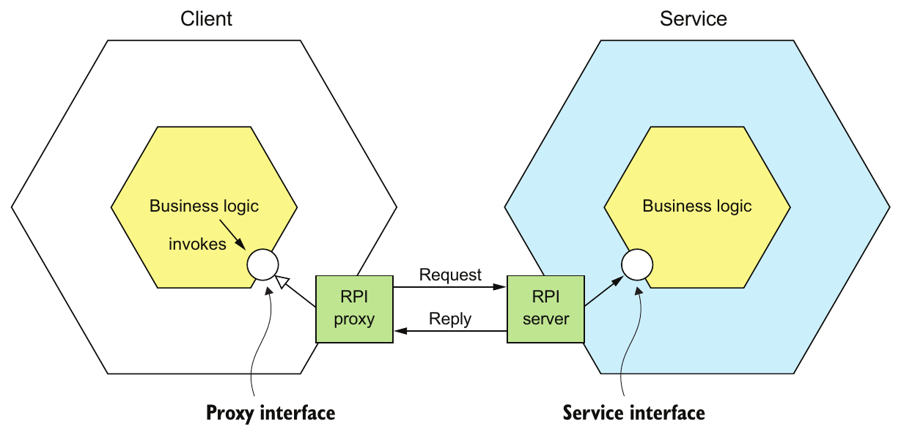

> **English:** Figure 3.1 The client’s business logic invokes an interface that is implemented by an RPI proxy adapter class. The RPI proxy class makes a request to the service. The RPI server adapter class handles the request by invoking the service’s business logic.
>
> **Türkçe:** Şekil 3.1 İstemcinin iş mantığı, bir RPI proxy adapter sınıfının gerçekleştirdiği arayüzü çağırır. RPI proxy sınıfı, servise istek gönderir. RPI server adapter sınıfı, servisin iş mantığını çağırarak isteği işler.

> **English:** Let’s first take a look at REST.
>
> **Türkçe:** Önce REST’e bakalım.

### 3.2.1 Using REST — REST kullanmak

> **English:** Today, it’s fashionable to develop APIs in the RESTful style (https://en.wikipedia.org/wiki/Representational_state_transfer). REST is an IPC mechanism that (almost always) uses HTTP. Roy Fielding, the creator of REST, defines REST as follows:
>
> **Türkçe:** Bugün API’leri RESTful biçimde geliştirmek yaygındır (https://en.wikipedia.org/wiki/Representational_state_transfer). REST, neredeyse her zaman HTTP kullanan bir IPC mekanizmasıdır. REST’in yaratıcısı Roy Fielding, REST’i şöyle tanımlar:

> **English:** REST provides a set of architectural constraints that, when applied as a whole, emphasizes scalability of component interactions, generality of interfaces, independent deployment of components, and intermediary components to reduce interaction latency, enforce security, and encapsulate legacy systems. www.ics.uci.edu/~fielding/pubs/dissertation/top.htm
>
> **Türkçe:** REST, bir bütün olarak uygulandığında bileşen etkileşimlerinin ölçeklenebilirliğini, arayüzlerin genelliğini, bileşenlerin bağımsız dağıtımını ve etkileşim gecikmesini azaltmak, güvenliği uygulamak ve eski sistemleri kapsüllemek için aracı bileşenlerin kullanılmasını öne çıkaran bir mimari kısıtlar kümesi sağlar. Kaynak: www.ics.uci.edu/~fielding/pubs/dissertation/top.htm.

> **English:** A key concept in REST is a resource, which typically represents a single business object, such as a Customer or Product, or a collection of business objects. REST uses the HTTP verbs for manipulating resources, which are referenced using a URL. For example, a GET request returns the representation of a resource, which is often in the form of an XML document or JSON object, although other formats such as binary can be used. A POST request creates a new resource, and a PUT request updates a resource. The Order Service, for example, has a POST /orders endpoint for creating an Order and a GET /orders/{orderId} endpoint for retrieving an Order.
>
> **Türkçe:** REST’te temel kavramlardan biri resource’tur (kaynak); bu, genellikle Customer veya Product gibi tek bir iş nesnesini ya da iş nesneleri koleksiyonunu temsil eder. REST, URL ile belirtilen kaynaklar üzerinde işlem yapmak için HTTP fiillerini kullanır. Örneğin GET isteği, kaynağın gösterimini döndürür; bu gösterim genellikle XML belgesi veya JSON nesnesi biçimindedir, ancak binary gibi başka biçimler de kullanılabilir. POST isteği yeni kaynak oluşturur, PUT isteği bir kaynağı günceller. Örneğin Order Service’te Order oluşturmak için POST /orders, Order almak için GET /orders/{orderId} endpoint’i bulunur.

> **English:** Many developers claim their HTTP-based APIs are RESTful. But as Roy Fielding describes in a blog post, not all of them actually are (http://roy.gbiv.com/untangled/ 2008/rest-apis-must-be-hypertext-driven). To understand why, let’s take a look at the REST maturity model.
>
> **Türkçe:** Birçok geliştirici, HTTP tabanlı API’sinin RESTful olduğunu söyler. Ancak Roy Fielding’in bir blog yazısında açıkladığı gibi bunların hepsi gerçekten RESTful değildir (http://roy.gbiv.com/untangled/2008/rest-apis-must-be-hypertext-driven). Nedenini anlamak için REST maturity model’a (REST olgunluk modeline) bakalım.

#### THE REST MATURITY MODEL — REST olgunluk modeli

> **English:** Leonard Richardson (no relation to your author) defines a very useful maturity model for REST (http://martinfowler.com/articles/richardsonMaturityModel.html) that consists of the following levels:
>
> **Türkçe:** Leonard Richardson — kitabın yazarıyla akrabalığı yoktur — REST için çok yararlı bir olgunluk modeli tanımlar (http://martinfowler.com/articles/richardsonMaturityModel.html). Model şu düzeylerden oluşur:

> **English:** Level 0—Clients of a level 0 service invoke the service by making HTTP POST requests to its sole URL endpoint. Each request specifies the action to perform, the target of the action (for example, the business object), and any parameters.
>
> **Türkçe:** Level 0 — Düzey 0 servisin istemcileri, servisin tek URL endpoint’ine HTTP POST istekleri göndererek servisi çağırır. Her istek, yapılacak eylemi, eylemin hedefini — örneğin iş nesnesini — ve parametreleri belirtir.

> **English:** Level 1—A level 1 service supports the idea of resources. To perform an action on a resource, a client makes a POST request that specifies the action to perform and any parameters.
>
> **Türkçe:** Level 1 — Düzey 1 servis, kaynak kavramını destekler. İstemci, bir kaynak üzerinde eylem gerçekleştirmek için eylemi ve parametrelerini belirten bir POST isteği gönderir.

> **English:** Level 2—A level 2 service uses HTTP verbs to perform actions: GET to retrieve, POST to create, and PUT to update. The request query parameters and body, if any, specify the actions' parameters. This enables services to use web infrastructure such as caching for GET requests.
>
> **Türkçe:** Level 2 — Düzey 2 servis, eylemler için HTTP fiillerini kullanır: almak için GET, oluşturmak için POST, güncellemek için PUT. İsteğin sorgu parametreleri ve varsa gövdesi, eylemin parametrelerini belirtir. Böylece servisler, GET isteklerinin önbelleğe alınması gibi web altyapısı olanaklarından yararlanabilir.

> **English:** Level 3—The design of a level 3 service is based on the terribly named HATEOAS (Hypertext As The Engine Of Application State) principle. The basic idea is that the representation of a resource returned by a GET request contains links for performing actions on that resource. For example, a client can cancel an order using a link in the representation returned by the GET request that retrieved the order. The benefits of HATEOAS include no longer having to hard-wire URLs into client code (www.infoq.com/news/2009/04/ hateoas-restful-api-advantages).
>
> **Türkçe:** Level 3 — Düzey 3 servis, adı oldukça kötü seçilmiş HATEOAS (Hypertext As The Engine Of Application State) ilkesine dayanır. Temel fikir, GET isteğinin döndürdüğü kaynak gösteriminin bu kaynak üzerinde eylem gerçekleştirecek bağlantıları içermesidir. Örneğin istemci, siparişi alan GET isteğinin döndürdüğü gösterimdeki bağlantıyı kullanarak siparişi iptal edebilir. HATEOAS’ın yararları arasında URL’leri istemci koduna sabit olarak yazmak zorunda kalmamak bulunur (www.infoq.com/news/2009/04/hateoas-restful-api-advantages).

> **English:** I encourage you to review the REST APIs at your organization to see which level they correspond to.
>
> **Türkçe:** Organizasyonunuzdaki REST API’lerini gözden geçirip hangi düzeye karşılık geldiklerini belirlemenizi öneririm.

#### SPECIFYING REST APIs — REST API’lerini tanımlamak

> **English:** As mentioned earlier in section 3.1, you must define your APIs using an interface definition language (IDL). Unlike older communication protocols like CORBA and SOAP, REST did not originally have an IDL. Fortunately, the developer community has rediscovered the value of an IDL for RESTful APIs. The most popular REST IDL is the Open API Specification (www.openapis.org), which evolved from the Swagger open source project. The Swagger project is a set of tools for developing and documenting REST APIs. It includes tools that generate client stubs and server skeletons from an interface definition.
>
> **Türkçe:** Daha önce 3.1. kısımda belirtildiği gibi API’lerinizi bir interface definition language (IDL) ile tanımlamalısınız. CORBA ve SOAP gibi eski iletişim protokollerinden farklı olarak REST’in başlangıçta bir IDL’si yoktu. Neyse ki geliştirici topluluğu, RESTful API’ler için IDL’nin değerini yeniden keşfetti. En yaygın REST IDL’si, Swagger açık kaynak projesinden gelişen Open API Specification’dır (www.openapis.org). Swagger projesi, REST API’lerini geliştirmek ve belgelemek için araçlar kümesidir. Bir arayüz tanımından istemci stub’ları ve sunucu skeleton’ları üreten araçları içerir.

#### THE CHALLENGE OF FETCHING MULTIPLE RESOURCES IN A SINGLE REQUEST — Bir istekte birden fazla kaynak almanın güçlüğü

> **English:** REST resources are usually oriented around business objects, such as Consumer and Order. Consequently, a common problem when designing a REST API is how to enable the client to retrieve multiple related objects in a single request. For example, imagine that a REST client wanted to retrieve an Order and the Order 's Consumer. A pure REST API would require the client to make at least two requests, one for the Order and another for its Consumer. A more complex scenario would require even more round-trips and suffer from excessive latency.
>
> **Türkçe:** REST kaynakları genellikle Consumer ve Order gibi iş nesneleri etrafında düzenlenir. Bu nedenle REST API tasarımında yaygın bir sorun, istemcinin birbiriyle ilişkili birden fazla nesneyi tek istekte nasıl alabileceğidir. Örneğin bir REST istemcisinin Order’ı ve Order’ın Consumer’ını almak istediğini düşünün. Saf bir REST API, istemcinin en az iki istek yapmasını gerektirir: biri Order, diğeri onun Consumer’ı için. Daha karmaşık bir senaryo daha fazla gidiş-dönüş gerektirir ve aşırı gecikmeye neden olur.

> **English:** One solution to this problem is for an API to allow the client to retrieve related resources when it gets a resource. For example, a client could retrieve an Order and its Consumer using GET /orders/order-id-1345?expand=consumer. The query parameter specifies the related resources to return with the Order. This approach works well in many scenarios but it’s often insufficient for more complex scenarios. It’s also potentially time consuming to implement. This has led to the increasing popularity of alternative API technologies such as GraphQL (http://graphql.org) and Netflix Falcor (http://netflix.github.io/falcor/), which are designed to support efficient data fetching.
>
> **Türkçe:** Bu sorunun bir çözümü, API’nin bir kaynak alınırken istemcinin ilgili kaynakları da almasına izin vermesidir. Örneğin istemci, GET /orders/order-id-1345?expand=consumer ile Order’ı ve onun Consumer’ını birlikte alabilir. Sorgu parametresi, Order ile birlikte döndürülecek ilişkili kaynakları belirtir. Bu yaklaşım birçok durumda iyi çalışsa da daha karmaşık durumlarda yetersiz kalabilir. Gerçekleştirilmesi de zaman alabilir. Bu durum, verimli veri almayı desteklemek için tasarlanan GraphQL (http://graphql.org) ve Netflix Falcor (http://netflix.github.io/falcor/) gibi alternatif API teknolojilerinin yaygınlaşmasına yol açmıştır.

#### THE CHALLENGE OF MAPPING OPERATIONS TO HTTP VERBS — İşlemleri HTTP fiilleriyle eşleştirmenin güçlüğü

> **English:** Another common REST API design problem is how to map the operations you want to perform on a business object to an HTTP verb. A REST API should use PUT for updates, but there may be multiple ways to update an order, including cancelling it, revising the order, and so on. Also, an update might not be idempotent, which is a requirement for using PUT. One solution is to define a sub-resource for updating a particular aspect of a resource. The Order Service, for example, has a POST /orders/ {orderId}/cancel endpoint for cancelling orders, and a POST /orders/{orderId}/ revise endpoint for revising orders. Another solution is to specify a verb as a URL query parameter. Sadly, neither solution is particularly RESTful.
>
> **Türkçe:** REST API tasarımında yaygın başka bir sorun, bir iş nesnesi üzerinde yapmak istediğiniz işlemleri HTTP fiilleriyle nasıl eşleştireceğinizdir. REST API, güncellemeler için PUT kullanmalıdır; ancak siparişi iptal etmek, değiştirmek ve benzeri işlemler, siparişi güncellemenin farklı yollarıdır. Ayrıca güncelleme, PUT kullanımının gerektirdiği idempotent (yinelendiğinde aynı etkiyi veren) özelliğine sahip olmayabilir. Çözümlerden biri, kaynağın belirli bir yönünü güncellemek için bir alt kaynak tanımlamaktır. Örneğin Order Service’te sipariş iptali için POST /orders/{orderId}/cancel, sipariş değişikliği için POST /orders/{orderId}/revise endpoint’i bulunur. Başka bir çözüm, URL sorgu parametresinde bir fiil belirtmektir. Ne yazık ki iki çözüm de tam anlamıyla RESTful değildir.

> **English:** This problem with mapping operations to HTTP verbs has led to the growing popularity of alternatives to REST, such as gRPC, discussed shortly in section 3.2.2. But first let’s look at the benefits and drawbacks of REST.
>
> **Türkçe:** İşlemleri HTTP fiilleriyle eşleştirmedeki bu sorun, birazdan 3.2.2. kısımda tartışılacak gRPC gibi REST alternatiflerinin giderek yaygınlaşmasına yol açmıştır. Ancak önce REST’in yararlarına ve dezavantajlarına bakalım.

#### BENEFITS AND DRAWBACKS OF REST — REST’in yararları ve dezavantajları

> **English:** There are numerous benefits to using REST:
>
> **Türkçe:** REST kullanmanın birçok yararı vardır:

> **English:** It’s simple and familiar.
>
> **Türkçe:** Basittir ve tanıdıktır.

> **English:** You can test an HTTP API from within a browser using, for example, the Postman plugin, or from the command line using curl (assuming JSON or some other text format is used).
>
> **Türkçe:** HTTP API’yi, örneğin Postman eklentisiyle tarayıcı içinden veya curl kullanarak komut satırından test edebilirsiniz; bunun için JSON ya da başka bir metin biçiminin kullanıldığı varsayılır.

> **English:** It directly supports request/response style communication.
>
> **Türkçe:** Request/response biçimindeki iletişimi doğrudan destekler.

> **English:** HTTP is, of course, firewall friendly.
>
> **Türkçe:** HTTP, elbette firewall (güvenlik duvarı) açısından uyumlu bir protokoldür.

> **English:** It doesn’t require an intermediate broker, which simplifies the system’s architecture.
>
> **Türkçe:** Arada bir broker gerektirmez; bu, sistem mimarisini basitleştirir.

> **English:** There are some drawbacks to using REST:
>
> **Türkçe:** REST kullanmanın bazı dezavantajları vardır:

> **English:** It only supports the request/response style of communication.
>
> **Türkçe:** Yalnızca request/response iletişim biçimini destekler.

> **English:** Reduced availability. Because the client and service communicate directly without an intermediary to buffer messages, they must both be running for the duration of the exchange.
>
> **Türkçe:** Kullanılabilirlik azalır. İstemci ile servis, mesajları tamponlayan bir aracı olmadan doğrudan iletişim kurduğundan alışveriş boyunca ikisinin de çalışıyor olması gerekir.

> **English:** Clients must know the locations (URLs) of the service instances(s). As described in section 3.2.4, this is a nontrivial problem in a modern application. Clients must use what is known as a service discovery mechanism to locate service instances.
>
> **Türkçe:** İstemciler, servis instance’larının konumlarını, yani URL’lerini bilmelidir. 3.2.4. kısımda açıklandığı gibi bu, modern uygulamalarda önemsiz bir sorun değildir. İstemciler, servis instance’larını bulmak için servis keşfi adı verilen bir mekanizma kullanmalıdır.

> **English:** Fetching multiple resources in a single request is challenging.
>
> **Türkçe:** Tek bir istekte birden fazla kaynak almak güçtür.

> **English:** It’s sometimes difficult to map multiple update operations to HTTP verbs.
>
> **Türkçe:** Birden fazla güncelleme işlemini HTTP fiilleriyle eşleştirmek bazen güçtür.

> **English:** Despite these drawbacks, REST seems to be the de facto standard for APIs, though there are a couple of interesting alternatives. GraphQL, for example, implements flexible, efficient data fetching. Chapter 8 discusses GraphQL and covers the API gateway pattern.
>
> **Türkçe:** Bu dezavantajlara rağmen REST, API’ler için fiilî standart gibi görünmektedir; ancak birkaç ilginç alternatif vardır. Örneğin GraphQL, esnek ve verimli veri almayı gerçekleştirir. Sekizinci bölüm GraphQL’i ve API gateway örüntüsünü ele alır.

> **English:** gRPC is another alternative to REST. Let’s take a look at how it works.
>
> **Türkçe:** gRPC, REST’in başka bir alternatifidir. Nasıl çalıştığına bakalım.

### 3.2.2 Using gRPC — gRPC kullanmak

> **English:** As mentioned in the preceding section, one challenge with using REST is that because HTTP only provides a limited number of verbs, it’s not always straightforward to design a REST API that supports multiple update operations. An IPC technology that avoids this issue is gRPC (www.grpc.io), a framework for writing cross-language clients and servers (see https://en.wikipedia.org/wiki/Remote_procedure_call for more). gRPC is a binary message-based protocol, and this means—as mentioned earlier in the discussion of binary message formats—you’re forced to take an API-first approach to service design. You define your gRPC APIs using a Protocol Buffers-based IDL, which is Google’s language-neutral mechanism for serializing structured data. You use the Protocol Buffer compiler to generate client-side stubs and server-side skeletons. The compiler can generate code for a variety of languages, including Java, C#, NodeJS, and GoLang. Clients and servers exchange binary messages in the Protocol Buffers format using HTTP/2.
>
> **Türkçe:** Önceki kısımda belirtildiği gibi REST kullanmanın güçlüklerinden biri, HTTP’nin sınırlı sayıda fiil sağlaması nedeniyle birden fazla güncelleme işlemini destekleyen REST API tasarımının her zaman kolay olmamasıdır. Bu sorunu aşan IPC teknolojilerinden biri, farklı dillerde istemciler ve sunucular yazmak için kullanılan gRPC framework’üdür (www.grpc.io; ek bilgi: https://en.wikipedia.org/wiki/Remote_procedure_call). gRPC, binary mesaj tabanlı bir protokoldür; bu da binary mesaj biçimlerini tartışırken belirtildiği gibi servis tasarımında API-first yaklaşımı kullanmanızı zorunlu kılar. gRPC API’leri, Google’ın yapılandırılmış veriyi serialize etmek için geliştirdiği dilden bağımsız mekanizma olan Protocol Buffers’a dayalı bir IDL ile tanımlanır. İstemci stub’larını ve sunucu skeleton’larını üretmek için Protocol Buffer derleyicisi kullanılır. Derleyici Java, C#, NodeJS ve GoLang dâhil çeşitli diller için kod üretebilir. İstemciler ve sunucular, HTTP/2 kullanarak Protocol Buffers biçiminde binary mesajlar alışverişi yapar.

> **English:** A gRPC API consists of one or more services and request/response message definitions. A service definition is analogous to a Java interface and is a collection of strongly typed methods. As well as supporting simple request/response RPC, gRPC supports streaming RPC. A server can reply with a stream of messages to the client. Alternatively, a client can send a stream of messages to the server.
>
> **Türkçe:** Bir gRPC API, bir veya daha fazla servis ile istek/yanıt mesajı tanımlarından oluşur. Servis tanımı, Java interface’e benzer ve güçlü tür bilgisi taşıyan metotlar koleksiyonudur. Basit request/response RPC’ye ek olarak gRPC, streaming RPC’yi destekler. Sunucu, istemciye bir mesaj akışıyla yanıt verebilir. Alternatif olarak istemci, sunucuya bir mesaj akışı gönderebilir.

> **English:** gRPC uses Protocol Buffers as the message format. Protocol Buffers is, as mentioned earlier, an efficient, compact, binary format. It’s a tagged format. Each field of a Protocol Buffers message is numbered and has a type code. A message recipient can extract the fields that it needs and skip over the fields that it doesn’t recognize. As a result, gRPC enables APIs to evolve while remaining backward-compatible.
>
> **Türkçe:** gRPC, mesaj biçimi olarak Protocol Buffers kullanır. Daha önce belirtildiği gibi Protocol Buffers verimli, küçük boyutlu bir binary biçimdir. Etiketlenmiş bir biçimdir: Protocol Buffers mesajının her alanı numaralandırılır ve bir tür koduna sahiptir. Mesajın alıcısı, ihtiyaç duyduğu alanları çıkarabilir ve tanımadığı alanları atlayabilir. Böylece gRPC, API’lerin geriye dönük uyumluluğu koruyarak değişmesini sağlar.

> **English:** Listing 3.1 shows an excerpt of the gRPC API for the Order Service. It defines several methods, including createOrder(). This method takes a CreateOrderRequest as a parameter and returns a CreateOrderReply.
>
> **Türkçe:** Listing 3.1, Order Service’in gRPC API’sinden bir parçayı gösterir. createOrder() dâhil birkaç metot tanımlar. Bu metot, parametre olarak CreateOrderRequest alır ve CreateOrderReply döndürür.

> **English:** Listing 3.1 An excerpt of the gRPC API for the Order Service
>
> **Türkçe:** Listing 3.1 Order Service’in gRPC API’sinden bir parça.

```text
service OrderService {
  rpc createOrder(CreateOrderRequest) returns (CreateOrderReply) {}
  rpc cancelOrder(CancelOrderRequest) returns (CancelOrderReply) {}
  rpc reviseOrder(ReviseOrderRequest) returns (ReviseOrderReply) {}
  ...
}

message CreateOrderRequest {
  int64 restaurantId = 1;
  int64 consumerId = 2;
  repeated LineItem lineItems = 3;
  ...
}

message LineItem {
  string menuItemId = 1;
  int32 quantity = 2;
}

message CreateOrderReply {
  int64 orderId = 1;
}
...
```

> **English:** CreateOrderRequest and CreateOrderReply are typed messages. For example, CreateOrderRequest message has a restaurantId field of type int64. The field’s tag value is 1.
>
> **Türkçe:** CreateOrderRequest ve CreateOrderReply, tür bilgisi taşıyan mesajlardır. Örneğin CreateOrderRequest mesajının int64 türünde restaurantId alanı vardır. Bu alanın etiket değeri 1’dir.

> **English:** gRPC has several benefits:
>
> **Türkçe:** gRPC’nin çeşitli yararları vardır:

> **English:** It’s straightforward to design an API that has a rich set of update operations.
>
> **Türkçe:** Zengin bir güncelleme işlemleri kümesi sunan API tasarlamak kolaydır.

> **English:** It has an efficient, compact IPC mechanism, especially when exchanging large messages.
>
> **Türkçe:** Özellikle büyük mesaj alışverişinde verimli ve küçük boyutlu bir IPC mekanizmasına sahiptir.

> **English:** Bidirectional streaming enables both RPI and messaging styles of communication.
>
> **Türkçe:** Çift yönlü streaming, hem RPI hem mesajlaşma iletişim biçimlerini mümkün kılar.

> **English:** It enables interoperability between clients and services written in a wide range of languages.
>
> **Türkçe:** Çok çeşitli dillerde yazılmış istemciler ve servisler arasında birlikte çalışabilirlik sağlar.

> **English:** gRPC also has several drawbacks:
>
> **Türkçe:** gRPC’nin çeşitli dezavantajları da vardır:

> **English:** It takes more work for JavaScript clients to consume gRPC-based API than REST/JSON-based APIs.
>
> **Türkçe:** JavaScript istemcilerinin gRPC tabanlı API’leri kullanması, REST/JSON tabanlı API’lere kıyasla daha fazla çalışma gerektirir.

> **English:** Older firewalls might not support HTTP/2.
>
> **Türkçe:** Eski güvenlik duvarları HTTP/2’yi desteklemeyebilir.

> **English:** gRPC is a compelling alternative to REST, but like REST, it’s a synchronous communication mechanism, so it also suffers from the problem of partial failure. Let’s take a look at what that is and how to handle it.
>
> **Türkçe:** gRPC, REST’e karşı güçlü bir alternatiftir; ancak REST gibi senkron bir iletişim mekanizması olduğundan kısmi arıza sorununu da yaşar. Bunun ne olduğuna ve nasıl ele alınacağına bakalım.

### 3.2.3 Handling partial failure using the Circuit breaker pattern — Circuit breaker örüntüsüyle kısmi arızaları ele almak

> **English:** In a distributed system, whenever a service makes a synchronous request to another service, there is an ever-present risk of partial failure. Because the client and the service are separate processes, a service may not be able to respond in a timely way to a client’s request. The service could be down because of a failure or for maintenance. Or the service might be overloaded and responding extremely slowly to requests. Because the client is blocked waiting for a response, the danger is that the failure could cascade to the client’s clients and so on and cause an outage.
>
> **Türkçe:** Dağıtık bir sistemde bir servis başka bir servise senkron istek gönderdiğinde kısmi arıza riski daima vardır. İstemci ve servis ayrı süreçler olduğundan servis, istemcinin isteğine zamanında yanıt veremeyebilir. Servis, arıza veya bakım nedeniyle kapalı olabilir. Aşırı yük altında olabilir ve isteklere son derece yavaş yanıt verebilir. İstemci yanıt beklerken bloklandığı için tehlike, arızanın istemcinin istemcilerine ve daha ilerisine zincirleme yayılıp hizmet kesintisi oluşturmasıdır.

#### Pattern: Circuit breaker — Örüntü: Devre kesici

> **English:** An RPI proxy that immediately rejects invocations for a timeout period after the number of consecutive failures exceeds a specified threshold. See http://microservices.io/patterns/reliability/circuit-breaker.html.
>
> **Türkçe:** Art arda gelen başarısızlıkların sayısı belirli eşiği aştıktan sonra bir timeout süresi boyunca çağrıları hemen reddeden RPI proxy. Bkz. http://microservices.io/patterns/reliability/circuit-breaker.html.

> **English:** Consider, for example, the scenario shown in figure 3.2, where the Order Service is unresponsive. A mobile client makes a REST request to an API gateway, which, as discussed in chapter 8, is the entry point into the application for API clients. The API gateway proxies the request to the unresponsive Order Service.
>
> **Türkçe:** Örneğin Şekil 3.2’deki, Order Service’in yanıt vermediği senaryoyu düşünün. Mobil istemci, 8. bölümde tartışıldığı gibi API istemcilerinin uygulamaya giriş noktası olan API gateway’ye REST isteği gönderir. API gateway, isteği yanıt vermeyen Order Service’e iletir.

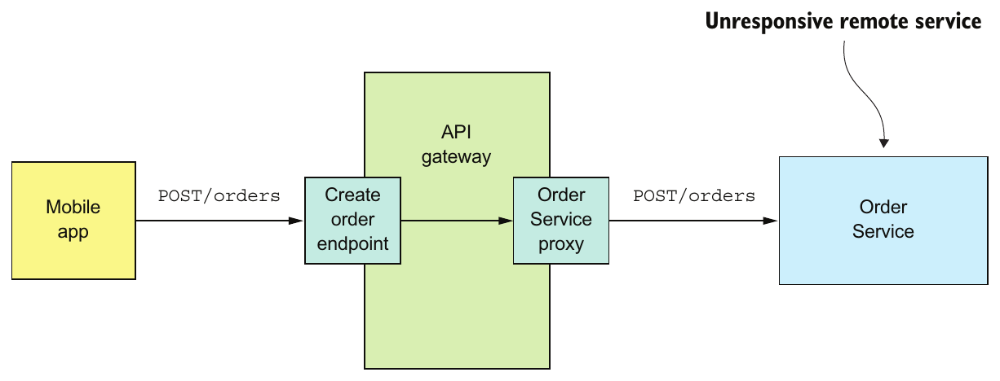

> **English:** Figure 3.2 An API gateway must protect itself from unresponsive services, such as the Order Service.
>
> **Türkçe:** Şekil 3.2 API gateway, Order Service gibi yanıt vermeyen servislere karşı kendisini korumalıdır.

> **English:** A naive implementation of the OrderServiceProxy would block indefinitely, waiting for a response. Not only would that result in a poor user experience, but in many applications it would consume a precious resource, such as a thread. Eventually the API gateway would run out of resources and become unable to handle requests. The entire API would be unavailable.
>
> **Türkçe:** OrderServiceProxy’nin basitçe yazılmış bir gerçekleştirimi, yanıt bekleyerek süresiz bloklanır. Bu yalnızca kötü bir kullanıcı deneyimine yol açmakla kalmaz; birçok uygulamada thread gibi değerli bir kaynağı da tüketir. Sonunda API gateway’nin kaynakları tükenir ve istekleri karşılayamaz hâle gelir. API’nin tamamı kullanılamaz olur.

> **English:** It’s essential that you design your services to prevent partial failures from cascading throughout the application. There are two parts to the solution:
>
> **Türkçe:** Servislerinizi, kısmi arızaların uygulama boyunca zincirleme yayılmasını önleyecek biçimde tasarlamanız gerekir. Çözümün iki parçası vardır:

> **English:** You must design RPI proxies, such as OrderServiceProxy, to handle unresponsive remote services.
>
> **Türkçe:** OrderServiceProxy gibi RPI proxy’lerini, yanıt vermeyen uzak servislerle başa çıkacak şekilde tasarlamalısınız.

> **English:** You need to decide how to recover from a failed remote service.
>
> **Türkçe:** Arızalanan uzak servis karşısında nasıl toparlanacağınıza karar vermelisiniz.

> **English:** First we’ll look at how to write robust RPI proxies.
>
> **Türkçe:** Önce sağlam RPI proxy’lerinin nasıl yazılacağına bakalım.

#### DEVELOPING ROBUST RPI PROXIES — Sağlam RPI proxy’leri geliştirmek

> **English:** Whenever one service synchronously invokes another service, it should protect itself using the approach described by Netflix (http://techblog.netflix.com/2012/02/fault-tolerance-in-high-volume.html). This approach consists of a combination of the following mechanisms:
>
> **Türkçe:** Bir servis başka bir servisi senkron olarak çağırdığında Netflix’in açıkladığı yaklaşımı kullanarak kendisini korumalıdır (http://techblog.netflix.com/2012/02/fault-tolerance-in-high-volume.html). Bu yaklaşım, aşağıdaki mekanizmaların birleşiminden oluşur:

> **English:** Network timeouts—Never block indefinitely and always use timeouts when waiting for a response. Using timeouts ensures that resources are never tied up indefinitely.
>
> **Türkçe:** Network timeouts — Asla süresiz bloklanmayın ve yanıt beklerken her zaman timeout kullanın. Timeout, kaynakların süresiz meşgul tutulmamasını sağlar.

> **English:** Limiting the number of outstanding requests from a client to a service—Impose an upper bound on the number of outstanding requests that a client can make to a particular service. If the limit has been reached, it’s probably pointless to make additional requests, and those attempts should fail immediately.
>
> **Türkçe:** İstemciden servise gönderilen ve henüz tamamlanmamış isteklerin sayısını sınırlamak — İstemcinin belirli bir servise gönderebileceği tamamlanmamış istek sayısına üst sınır koyun. Sınıra ulaşılmışsa yeni istekler göndermek büyük olasılıkla anlamsızdır; bu denemeler hemen başarısız olmalıdır.

> **English:** Circuit breaker pattern—Track the number of successful and failed requests, and if the error rate exceeds some threshold, trip the circuit breaker so that further attempts fail immediately. A large number of requests failing suggests that the service is unavailable and that sending more requests is pointless. After a timeout period, the client should try again, and, if successful, close the circuit breaker.
>
> **Türkçe:** Circuit breaker pattern — Başarılı ve başarısız isteklerin sayısını izleyin. Hata oranı belirli eşiği aşarsa devre kesiciyi açarak sonraki denemelerin hemen başarısız olmasını sağlayın. Çok sayıda isteğin başarısız olması, servisin kullanılamadığını ve daha fazla istek göndermenin anlamsız olduğunu gösterir. Timeout süresinden sonra istemci tekrar denemeli; başarılı olursa devre kesiciyi kapatmalıdır.

> **English:** Netflix Hystrix (https://github.com/Netflix/Hystrix) is an open source library that implements these and other patterns. If you’re using the JVM, you should definitely consider using Hystrix when implementing RPI proxies. And if you’re running in a non-JVM environment, you should use an equivalent library. For example, the Polly library is popular in the.NET community (https://github.com/App-vNext/Polly).
>
> **Türkçe:** Netflix Hystrix (https://github.com/Netflix/Hystrix), bu ve başka örüntüleri gerçekleştiren açık kaynak bir kütüphanedir. JVM kullanıyorsanız RPI proxy’lerini gerçekleştirirken Hystrix’i mutlaka değerlendirmelisiniz. JVM dışındaki bir ortamda çalışıyorsanız eşdeğer bir kütüphane kullanmalısınız. Örneğin Polly kütüphanesi .NET topluluğunda yaygındır (https://github.com/App-vNext/Polly).

#### RECOVERING FROM AN UNAVAILABLE SERVICE — Kullanılamayan bir servis karşısında toparlanmak

> **English:** Using a library such as Hystrix is only part of the solution. You must also decide on a case-by-case basis how your services should recover from an unresponsive remote service. One option is for a service to simply return an error to its client. For example, this approach makes sense for the scenario shown in figure 3.2, where the request to create an Order fails. The only option is for the API gateway to return an error to the mobile client.
>
> **Türkçe:** Hystrix gibi bir kütüphane kullanmak çözümün yalnızca bir parçasıdır. Servislerinizin yanıt vermeyen uzak servis karşısında nasıl toparlanacağına da durum bazında karar vermelisiniz. Bir seçenek, servisin istemcisine doğrudan hata döndürmesidir. Örneğin Order oluşturma isteğinin başarısız olduğu Şekil 3.2 senaryosunda bu yaklaşım anlamlıdır. Tek seçenek, API gateway’nin mobil istemciye hata döndürmesidir.

> **English:** In other scenarios, returning a fallback value, such as either a default value or a cached response, may make sense. For example, chapter 7 describes how the API gate-way could implement the findOrder() query operation by using the API composition pattern. As figure 3.3 shows, its implementation of the GET /orders/{orderId} endpoint invokes several services, including the Order Service, Kitchen Service, and Delivery Service, and combines the results.
>
> **Türkçe:** Diğer senaryolarda varsayılan değer veya önbelleğe alınmış yanıt gibi bir fallback değeri döndürmek anlamlı olabilir. Örneğin 7. bölüm, API gateway’nin findOrder() sorgu işlemini API composition örüntüsüyle nasıl gerçekleştirebileceğini anlatır. Şekil 3.3’te gösterildiği gibi GET /orders/{orderId} endpoint’inin gerçekleştirimi, Order Service, Kitchen Service ve Delivery Service dâhil birkaç servisi çağırır ve sonuçları birleştirir.

> **English:** It’s likely that each service’s data isn’t equally important to the client. The data from the Order Service is essential. If this service is unavailable, the API gateway should return either a cached version of its data or an error. The data from the other services is less critical. A client can, for example, display useful information to the user even if the delivery status was unavailable. If the Delivery Service is unavailable, the API gateway should return either a cached version of its data or omit it from the response.
>
> **Türkçe:** Her servisin verisi istemci için aynı derecede önemli olmayabilir. Order Service’in verisi zorunludur. Bu servis kullanılamıyorsa API gateway, verinin önbellekteki sürümünü veya bir hata döndürmelidir. Diğer servislerden gelen veriler daha az kritiktir. Örneğin teslimat durumu alınamasa bile istemci kullanıcıya yararlı bilgiler gösterebilir. Delivery Service kullanılamıyorsa API gateway, verinin önbellekteki sürümünü döndürmeli veya bu veriyi yanıttan çıkarmalıdır.

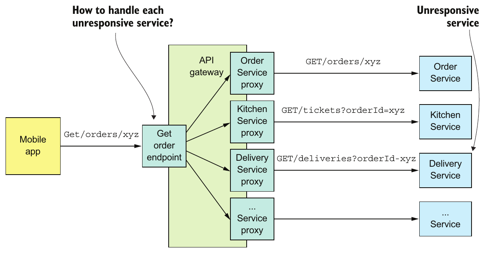

> **English:** Figure 3.3 The API gateway implements the GET /orders/{orderId} endpoint using API composition. It calls several services, aggregates their responses, and sends a response to the mobile app. The code that implements the endpoint must have a strategy for handling the failure of each service that it calls.
>
> **Türkçe:** Şekil 3.3 API gateway, GET /orders/{orderId} endpoint’ini API composition ile gerçekleştirir. Birkaç servisi çağırır, yanıtlarını birleştirir ve mobil uygulamaya yanıt gönderir. Endpoint’i gerçekleştiren kod, çağırdığı her servisin başarısızlığını ele almak için bir stratejiye sahip olmalıdır.

> **English:** It’s essential that you design your services to handle partial failure, but that’s not the only problem you need to solve when using RPI. Another problem is that in order for one service to invoke another service using RPI, it needs to know the network location of a service instance. On the surface this sounds simple, but in practice it’s a challenging problem. You must use a service discovery mechanism. Let’s look at how that works.
>
> **Türkçe:** Servislerinizi kısmi arızaları ele alacak biçimde tasarlamanız şarttır; ancak RPI kullanırken çözmeniz gereken tek sorun bu değildir. Bir servisin başka bir servisi RPI ile çağırabilmesi için servis instance’ının ağ konumunu bilmesi de gerekir. İlk bakışta basit görünse de uygulamada güç bir sorundur. Bir servis keşfi mekanizması kullanmalısınız. Bunun nasıl çalıştığına bakalım.

### 3.2.4 Using service discovery — Servis keşfini kullanmak

> **English:** Say you’re writing some code that invokes a service that has a REST API. In order to make a request, your code needs to know the network location (IP address and port) of a service instance. In a traditional application running on physical hardware, the network locations of service instances are usually static. For example, your code could read the network locations from a configuration file that’s occasionally updated. But in a modern, cloud-based microservices application, it’s usually not that simple. As is shown in figure 3.4, a modern application is much more dynamic.
>
> **Türkçe:** REST API’si olan bir servisi çağıran kod yazdığınızı varsayın. Kodunuzun istek göndermek için servis instance’ının ağ konumunu — IP adresini ve portunu — bilmesi gerekir. Fiziksel donanımda çalışan geleneksel uygulamada servis instance’larının ağ konumları genellikle sabittir. Örneğin kodunuz, zaman zaman güncellenen bir yapılandırma dosyasından ağ konumlarını okuyabilir. Ancak modern ve bulut tabanlı mikroservis uygulamasında durum genellikle bu kadar basit değildir. Şekil 3.4’te gösterildiği gibi modern uygulama çok daha dinamiktir.

> **English:** Service instances have dynamically assigned network locations. Moreover, the set of service instances changes dynamically because of autoscaling, failures, and upgrades. Consequently, your client code must use a service discovery.
>
> **Türkçe:** Servis instance’larının ağ konumları dinamik olarak atanır. Ayrıca otomatik ölçekleme, arızalar ve yükseltmeler nedeniyle servis instance’ları kümesi de dinamik değişir. Bu nedenle istemci kodunuz servis keşfi kullanmalıdır.

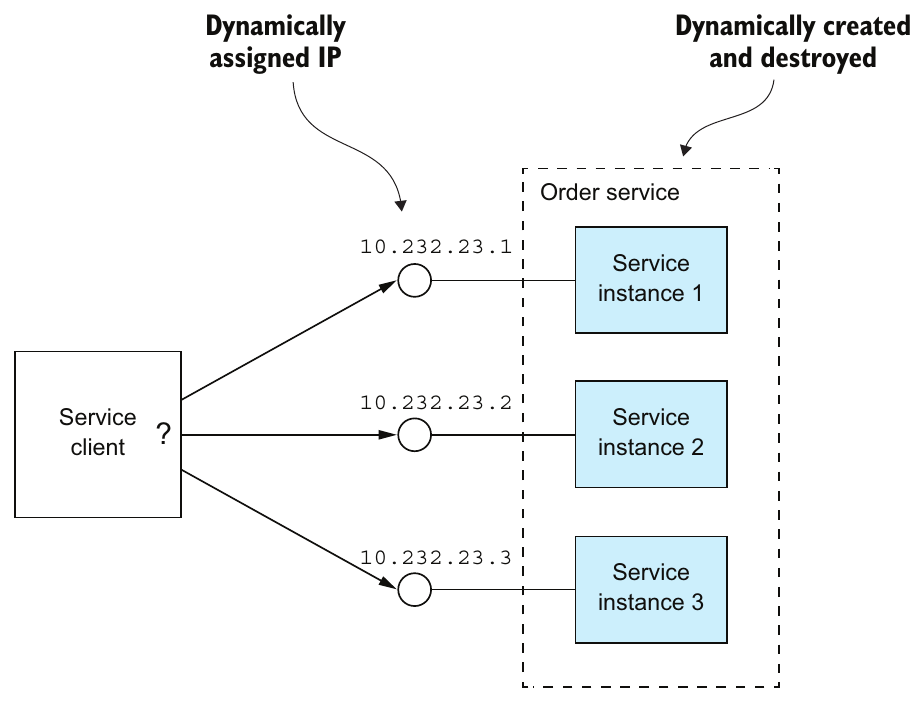

> **English:** Figure 3.4 Service instances have dynamically assigned IP addresses.
>
> **Türkçe:** Şekil 3.4 Servis instance’larına IP adresleri dinamik olarak atanır.

#### OVERVIEW OF SERVICE DISCOVERY — Servis keşfine genel bakış

> **English:** As you’ve just seen, you can’t statically configure a client with the IP addresses of the services. Instead, an application must use a dynamic service discovery mechanism. Service discovery is conceptually quite simple: its key component is a service registry, which is a database of the network locations of an application’s service instances.
>
> **Türkçe:** Az önce gördüğünüz gibi istemciye servislerin IP adreslerini sabit yapılandırma olarak veremezsiniz. Bunun yerine uygulama, dinamik servis keşfi mekanizması kullanmalıdır. Servis keşfi kavramsal olarak oldukça basittir: temel bileşeni, uygulamanın servis instance’larının ağ konumlarını saklayan bir veritabanı olan service registry’dir (servis kayıt deposu).

> **English:** The service discovery mechanism updates the service registry when service instances start and stop. When a client invokes a service, the service discovery mechanism queries the service registry to obtain a list of available service instances and routes the request to one of them.
>
> **Türkçe:** Servis keşfi mekanizması, servis instance’ları başlayıp durdukça service registry’yi günceller. İstemci bir servisi çağırdığında keşif mekanizması, kullanılabilir instance’ların listesini almak için service registry’yi sorgular ve isteği bunlardan birine yönlendirir.

> **English:** There are two main ways to implement service discovery:
>
> **Türkçe:** Servis keşfini gerçekleştirmenin iki temel yolu vardır:

> **English:** The services and their clients interact directly with the service registry.
>
> **Türkçe:** Servisler ve istemcileri, service registry ile doğrudan etkileşir.

> **English:** The deployment infrastructure handles service discovery. (I talk more about that in chapter 12.)
>
> **Türkçe:** Dağıtım altyapısı servis keşfini üstlenir. Bunu 12. bölümde daha ayrıntılı ele alıyorum.

> **English:** Let’s look at each option.
>
> **Türkçe:** Her seçeneğe bakalım.

#### APPLYING THE APPLICATION-LEVEL SERVICE DISCOVERY PATTERNS — Uygulama düzeyinde servis keşfi örüntülerini uygulamak

> **English:** One way to implement service discovery is for the application’s services and their clients to interact with the service registry. Figure 3.5 shows how this works. A service instance registers its network location with the service registry. A service client invokes a service by first querying the service registry to obtain a list of service instances. It then sends a request to one of those instances.
>
> **Türkçe:** Servis keşfini gerçekleştirmenin bir yolu, uygulamadaki servislerin ve istemcilerinin service registry ile etkileşmesidir. Şekil 3.5 bunun nasıl çalıştığını gösterir. Servis instance’ı, ağ konumunu service registry’ye kaydeder. Servisin istemcisi, önce service registry’yi sorgulayarak instance listesini alır; ardından bunlardan birine istek göndererek servisi çağırır.

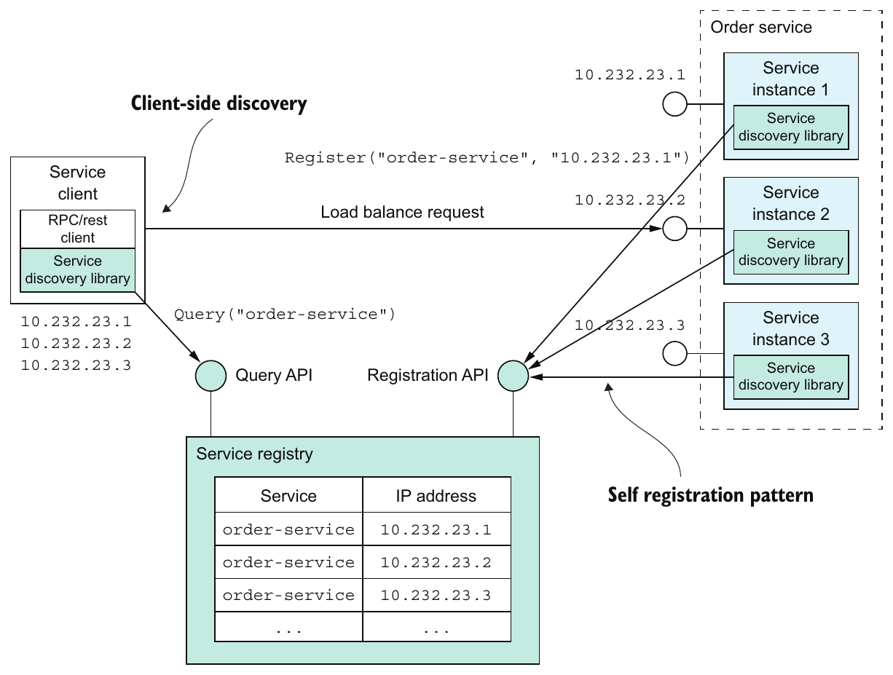

> **English:** Figure 3.5 The service registry keeps track of the service instances. Clients query the service registry to find network locations of available service instances.
>
> **Türkçe:** Şekil 3.5 Service registry, servis instance’larını takip eder. İstemciler, kullanılabilir servis instance’larının ağ konumlarını bulmak için service registry’yi sorgular.

> **English:** This approach to service discovery is a combination of two patterns. The first pattern is the Self registration pattern. A service instance invokes the service registry’s registration API to register its network location. It may also supply a health check URL, described in more detail in chapter 11. The health check URL is an API endpoint that the service registry invokes periodically to verify that the service instance is healthy and available to handle requests. A service registry may require a service instance to periodically invoke a “heartbeat” API in order to prevent its registration from expiring.
>
> **Türkçe:** Bu servis keşfi yaklaşımı iki örüntünün birleşimidir. İlki Self registration örüntüsüdür. Servis instance’ı, ağ konumunu kaydetmek için service registry’nin kayıt API’sini çağırır. On birinci bölümde ayrıntılı açıklanan bir health check URL’si de sağlayabilir. Bu URL, service registry’nin instance’ın sağlıklı ve istek karşılamaya hazır olduğunu doğrulamak için düzenli aralıklarla çağırdığı bir API endpoint’idir. Service registry, kaydın süresinin dolmasını önlemek için instance’ın belirli aralıklarla bir “heartbeat” API’si çağırmasını isteyebilir.

#### Pattern: Self registration — Örüntü: Kendi kendine kayıt

> **English:** A service instance registers itself with the service registry. See http://microservices.io/patterns/self-registration.html.
>
> **Türkçe:** Servis instance’ı kendisini service registry’ye kaydeder. Bkz. http://microservices.io/patterns/self-registration.html.

> **English:** The second pattern is the Client-side discovery pattern. When a service client wants to invoke a service, it queries the service registry to obtain a list of the service’s instances. To improve performance, a client might cache the service instances. The service client then uses a load-balancing algorithm, such as a round-robin or random, to select a service instance. It then makes a request to a selected service instance.
>
> **Türkçe:** İkinci örüntü Client-side discovery’dir. Servisin istemcisi bir servisi çağırmak istediğinde instance listesini almak için service registry’yi sorgular. Performansı artırmak için instance bilgilerini önbelleğe alabilir. Ardından round-robin veya rastgele seçim gibi bir yük dengeleme algoritmasıyla instance seçer ve seçilen instance’a istek gönderir.

#### Pattern: Client-side discovery — Örüntü: İstemci tarafında keşif

> **English:** A service client retrieves the list of available service instances from the service registry and load balances across them. See http://microservices.io/patterns/client-side-discovery.html.
>
> **Türkçe:** Servisin istemcisi, kullanılabilir instance listesini service registry’den alır ve istekleri bunlar arasında yük dengelemesi yaparak dağıtır. Bkz. http://microservices.io/patterns/client-side-discovery.html.

> **English:** Application-level service discovery has been popularized by Netflix and Pivotal. Netflix developed and open sourced several components: Eureka, a highly available service registry, the Eureka Java client, and Ribbon, a sophisticated HTTP client that supports the Eureka client. Pivotal developed Spring Cloud, a Spring-based framework that makes it remarkably easy to use the Netflix components. Spring Cloud-based services automatically register with Eureka, and Spring Cloud-based clients automatically use Eureka for service discovery.
>
> **Türkçe:** Uygulama düzeyindeki servis keşfinin yaygınlaşmasında Netflix ve Pivotal etkili olmuştur. Netflix; yüksek kullanılabilirlik sağlayan service registry Eureka’yı, Eureka Java istemcisini ve Eureka istemcisini destekleyen gelişmiş HTTP istemcisi Ribbon’ı geliştirip açık kaynak olarak yayınlamıştır. Pivotal ise Netflix bileşenlerinin kullanımını son derece kolaylaştıran Spring tabanlı Spring Cloud framework’ünü geliştirmiştir. Spring Cloud tabanlı servisler Eureka’ya otomatik kaydolur; Spring Cloud tabanlı istemciler servis keşfi için Eureka’yı otomatik kullanır.

> **English:** One benefit of application-level service discovery is that it handles the scenario when services are deployed on multiple deployment platforms. Imagine, for example, you’ve deployed only some of services on Kubernetes, discussed in chapter 12, and the rest is running in a legacy environment. Application-level service discovery using Eureka, for example, works across both environments, whereas Kubernetes-based service discovery only works within Kubernetes.
>
> **Türkçe:** Uygulama düzeyindeki servis keşfinin bir yararı, servislerin birden fazla dağıtım platformuna yerleştirildiği durumu ele almasıdır. Örneğin servislerin yalnızca bir bölümünü 12. bölümde ele alınan Kubernetes’e dağıttığınızı, kalanının eski bir ortamda çalıştığını düşünün. Örneğin Eureka ile yapılan uygulama düzeyinde servis keşfi iki ortamda da çalışırken Kubernetes tabanlı servis keşfi yalnızca Kubernetes içinde çalışır.

> **English:** One drawback of application-level service discovery is that you need a service discovery library for every language—and possibly framework—that you use. Spring Cloud only helps Spring developers. If you’re using some other Java framework or a non-JVM language such as NodeJS or GoLang, you must find some other service discovery framework. Another drawback of application-level service discovery is that you’re responsible for setting up and managing the service registry, which is a distraction. As a result, it’s usually better to use a service discovery mechanism that’s provided by the deployment infrastructure.
>
> **Türkçe:** Uygulama düzeyindeki servis keşfinin bir dezavantajı, kullandığınız her dil ve muhtemelen her framework için bir keşif kütüphanesi gerektirmesidir. Spring Cloud yalnızca Spring geliştiricilerine yardımcı olur. Başka bir Java framework’ü veya NodeJS ya da GoLang gibi JVM dışı bir dil kullanıyorsanız başka bir servis keşfi framework’ü bulmalısınız. Bir diğer dezavantaj, service registry’yi kurup yönetmekten sizin sorumlu olmanızdır; bu, asıl işten uzaklaştırır. Bu nedenle genellikle dağıtım altyapısının sağladığı servis keşfi mekanizmasını kullanmak daha iyidir.

#### APPLYING THE PLATFORM-PROVIDED SERVICE DISCOVERY PATTERNS — Platformun sağladığı servis keşfi örüntülerini uygulamak

> **English:** Later in chapter 12 you’ll learn that many modern deployment platforms such as Docker and Kubernetes have a built-in service registry and service discovery mechanism. The deployment platform gives each service a DNS name, a virtual IP (VIP) address, and a DNS name that resolves to the VIP address. A service client makes a request to the DNS name/VIP, and the deployment platform automatically routes the request to one of the available service instances. As a result, service registration, service discovery, and request routing are entirely handled by the deployment platform. Figure 3.6 shows how this works.
>
> **Türkçe:** On ikinci bölümde Docker ve Kubernetes gibi birçok modern dağıtım platformunun yerleşik service registry ve servis keşfi mekanizmasına sahip olduğunu öğreneceksiniz. Dağıtım platformu her servise bir DNS adı, virtual IP (VIP, sanal IP) adresi ve VIP adresine çözümlenen bir DNS adı verir. İstemci, DNS adına veya VIP’ye istek gönderir; platform isteği kullanılabilir instance’lardan birine otomatik yönlendirir. Böylece servis kaydı, keşfi ve istek yönlendirmesi tamamen dağıtım platformunca yapılır. Şekil 3.6 bunun nasıl çalıştığını gösterir.

> **English:** The deployment platform includes a service registry that tracks the IP addresses of the deployed services. In this example, a client accesses the Order Service using the DNS name order-service, which resolves to the virtual IP address 10.1.3.4. The deployment platform automatically load balances requests across the three instances of the Order Service.
>
> **Türkçe:** Dağıtım platformu, dağıtılmış servislerin IP adreslerini takip eden bir service registry içerir. Bu örnekte istemci, 10.1.3.4 sanal IP adresine çözümlenen order-service DNS adını kullanarak Order Service’e erişir. Dağıtım platformu, istekleri Order Service’in üç instance’ı arasında otomatik dengeler.

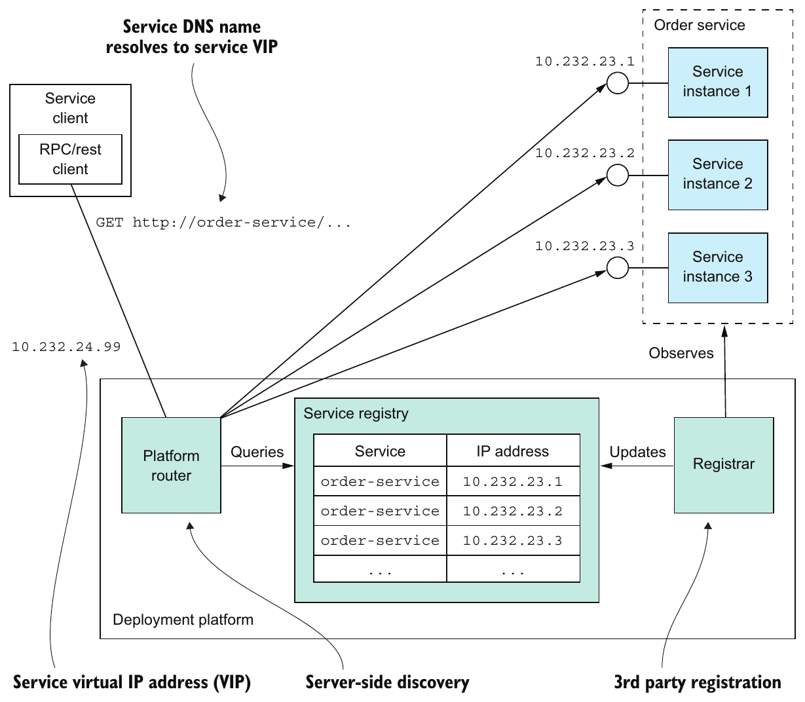

> **English:** Figure 3.6 The platform is responsible for service registration, discovery, and request routing. Service instances are registered with the service registry by the registrar. Each service has a network location, a DNS name/virtual IP address. A client makes a request to the service’s network location. The router queries the service registry and load balances requests across the available service instances.
>
> **Türkçe:** Şekil 3.6 Platform; servis kaydı, keşfi ve istek yönlendirmesinden sorumludur. Servis instance’ları registrar tarafından service registry’ye kaydedilir. Her servisin bir ağ konumu, yani DNS adı/sanal IP adresi vardır. İstemci, servisin ağ konumuna istek gönderir. Router, service registry’yi sorgular ve istekleri kullanılabilir instance’lar arasında dengeler.

> **English:** This approach is a combination of two patterns:
>
> **Türkçe:** Bu yaklaşım iki örüntünün birleşimidir:

> **English:** 3rd party registration pattern—Instead of a service registering itself with the service registry, a third party called the registrar, which is typically part of the deployment platform, handles the registration.
>
> **Türkçe:** 3rd party registration pattern — Servis kendisini service registry’ye kaydetmek yerine, genellikle dağıtım platformunun parçası olan registrar adlı üçüncü taraf kayıt işlemini yürütür.

> **English:** Server-side discovery pattern—Instead of a client querying the service registry, it makes a request to a DNS name, which resolves to a request router that queries the service registry and load balances requests.
>
> **Türkçe:** Server-side discovery pattern — İstemci service registry’yi sorgulamak yerine bir DNS adına istek gönderir. Bu ad, service registry’yi sorgulayıp istekleri dengeleyen request router’a çözümlenir.

#### Pattern: 3rd party registration — Örüntü: Üçüncü taraf kaydı

> **English:** Service instances are automatically registered with the service registry by a third party. See http://microservices.io/patterns/3rd-party-registration.html.
>
> **Türkçe:** Servis instance’ları, üçüncü tarafça service registry’ye otomatik kaydedilir. Bkz. http://microservices.io/patterns/3rd-party-registration.html.

#### Pattern: Server-side discovery — Örüntü: Sunucu tarafında keşif

> **English:** A client makes a request to a router, which is responsible for service discovery. See http://microservices.io/patterns/server-side-discovery.html.
>
> **Türkçe:** İstemci, servis keşfinden sorumlu router’a istek gönderir. Bkz. http://microservices.io/patterns/server-side-discovery.html.

> **English:** The key benefit of platform-provided service discovery is that all aspects of service discovery are entirely handled by the deployment platform. Neither the services nor the clients contain any service discovery code. Consequently, the service discovery mechanism is readily available to all services and clients regardless of which language or framework they’re written in.
>
> **Türkçe:** Platformun sağladığı servis keşfinin temel yararı, keşfin bütün yönlerinin tamamen dağıtım platformunca ele alınmasıdır. Ne servisler ne de istemciler servis keşfi kodu içerir. Dolayısıyla mekanizma, hangi dilde veya framework ile yazılmış olurlarsa olsunlar bütün servislerin ve istemcilerin kullanımına hazırdır.

> **English:** One drawback of platform-provided service discovery is that it only supports the discovery of services that have been deployed using the platform. For example, as mentioned earlier when describing application-level discovery, Kubernetes-based discovery only works for services running on Kubernetes. Despite this limitation, I recommend using platform-provided service discovery whenever possible.
>
> **Türkçe:** Platformun sağladığı servis keşfinin bir dezavantajı, yalnızca o platform kullanılarak dağıtılmış servislerin keşfini desteklemesidir. Örneğin uygulama düzeyinde keşif anlatılırken belirtildiği gibi Kubernetes tabanlı keşif yalnızca Kubernetes üzerinde çalışan servisler için geçerlidir. Bu sınırlamaya rağmen mümkün olduğunda platformun sağladığı servis keşfini kullanmanızı öneririm.

> **English:** Now that we’ve looked at synchronous IPC using REST or gRPC, let’s take a look at the alternative: asynchronous, message-based communication.
>
> **Türkçe:** REST veya gRPC ile senkron IPC’yi incelediğimize göre alternatifi olan asenkron, mesaj tabanlı iletişime bakalım.

## 3.3 Communicating using the Asynchronous messaging pattern — Asynchronous messaging örüntüsüyle iletişim

> **English:** When using messaging, services communicate by asynchronously exchanging messages. A messaging-based application typically uses a message broker, which acts as an intermediary between the services, although another option is to use a brokerless architecture, where the services communicate directly with each other. A service client makes a request to a service by sending it a message. If the service instance is expected to reply, it will do so by sending a separate message back to the client. Because the communication is asynchronous, the client doesn’t block waiting for a reply. Instead, the client is written assuming that the reply won’t be received immediately.
>
> **Türkçe:** Mesajlaşmada servisler, asenkron mesaj alışverişi yaparak iletişim kurar. Mesajlaşma tabanlı uygulama genellikle servisler arasında aracılık eden bir message broker kullanır. Bir başka seçenek, servislerin doğrudan iletişim kurduğu brokerless (aracısız) mimaridir. Servisin istemcisi, bir mesaj göndererek servise istek yapar. Servis instance’ından yanıt bekleniyorsa istemciye ayrı bir mesaj göndererek yanıt verir. İletişim asenkron olduğundan istemci yanıt beklerken bloklanmaz. Bunun yerine, yanıtın hemen gelmeyeceği varsayımıyla yazılır.

#### Pattern: Messaging — Örüntü: Mesajlaşma

> **English:** A client invokes a service using asynchronous messaging. See http://microservices.io/patterns/communication-style/messaging.html.
>
> **Türkçe:** İstemci, asenkron mesajlaşma kullanarak servisi çağırır. Bkz. http://microservices.io/patterns/communication-style/messaging.html.

> **English:** I start this section with an overview of messaging. I show how to describe a messaging architecture independently of messaging technology. Next I compare and contrast brokerless and broker-based architectures and describe the criteria for selecting a message broker. I then discuss several important topics, including scaling consumers while preserving message ordering, detecting and discarding duplicate messages, and sending and receiving messages as part of a database transaction. Let’s begin by looking at how messaging works.
>
> **Türkçe:** Bu kısma mesajlaşmaya genel bakışla başlıyorum. Mesajlaşma mimarisinin belirli bir teknolojiden bağımsız nasıl açıklanacağını gösteriyorum. Ardından aracısız ve broker tabanlı mimarileri karşılaştırıyor ve message broker seçme ölçütlerini anlatıyorum. Daha sonra mesaj sırasını koruyarak tüketicileri ölçeklemek, yinelenen mesajları tespit edip atmak ve veritabanı transaction’ının parçası olarak mesaj gönderip almak gibi önemli konuları ele alıyorum. Mesajlaşmanın nasıl çalıştığına bakarak başlayalım.

### 3.3.1 Overview of messaging — Mesajlaşmaya genel bakış

> **English:** A useful model of messaging is defined in the book Enterprise Integration Patterns (Addison-Wesley Professional, 2003) by Gregor Hohpe and Bobby Woolf. In this model, messages are exchanged over message channels. A sender (an application or service) writes a message to a channel, and a receiver (an application or service) reads messages from a channel. Let’s look at messages and then look at channels.
>
> **Türkçe:** Gregor Hohpe ve Bobby Woolf’un Enterprise Integration Patterns (Addison-Wesley Professional, 2003) kitabında yararlı bir mesajlaşma modeli tanımlanır. Bu modelde mesajlar, message channel’lar üzerinden alışveriş edilir. Gönderici — uygulama veya servis — kanala mesaj yazar; alıcı — uygulama veya servis — kanaldan mesaj okur. Önce mesajlara, sonra kanallara bakalım.

#### ABOUT MESSAGES — Mesajlar hakkında

> **English:** A message consists of a header and a message body (www.enterpriseintegrationpatterns.com/Message.html). The header is a collection of name-value pairs, metadata that describes the data being sent. In addition to name-value pairs provided by the message’s sender, the message header contains name-value pairs, such as a unique message id generated by either the sender or the messaging infrastructure, and an optional return address, which specifies the message channel that a reply should be written to. The message body is the data being sent, in either text or binary format.
>
> **Türkçe:** Mesaj, header (başlık) ve message body’den (mesaj gövdesi) oluşur (www.enterpriseintegrationpatterns.com/Message.html). Header, gönderilen veriyi tanımlayan metadata niteliğinde ad-değer çiftleri koleksiyonudur. Gönderenin sağladığı çiftlerin yanında, gönderen veya mesajlaşma altyapısınca üretilen benzersiz message id gibi çiftleri ve yanıtın hangi kanala yazılacağını belirten isteğe bağlı return address’i içerir. Mesaj gövdesi ise metin veya binary biçimde gönderilen veridir.

> **English:** There are several different kinds of messages:
>
> **Türkçe:** Çeşitli mesaj türleri vardır:

> **English:** Document—A generic message that contains only data. The receiver decides how to interpret it. The reply to a command is an example of a document message.
>
> **Türkçe:** Document — Yalnızca veri içeren genel mesajdır. Nasıl yorumlanacağına alıcı karar verir. Bir komuta verilen yanıt, document mesajına örnektir.

> **English:** Command—A message that’s the equivalent of an RPC request. It specifies the operation to invoke and its parameters.
>
> **Türkçe:** Command — RPC isteğine denk olan mesajdır. Çağrılacak işlemi ve parametrelerini belirtir.

> **English:** Event—A message indicating that something notable has occurred in the sender. An event is often a domain event, which represents a state change of a domain object such as an Order, or a Customer.
>
> **Türkçe:** Event — Gönderende dikkate değer bir şeyin gerçekleştiğini belirten mesajdır. Event çoğu zaman Order veya Customer gibi bir domain object’in durum değişimini temsil eden domain event’tir.

> **English:** The approach to the microservice architecture described in this book uses commands and events extensively.
>
> **Türkçe:** Bu kitapta açıklanan mikroservis mimarisi yaklaşımı, command ve event mesajlarını yoğun biçimde kullanır.

> **English:** Let’s now look at channels, the mechanism by which services communicate.
>
> **Türkçe:** Şimdi servislerin iletişim kurmasını sağlayan kanallara bakalım.

#### ABOUT MESSAGE CHANNELS — Mesaj kanalları hakkında

> **English:** As figure 3.7 shows, messages are exchanged over channels (www.enterpriseintegrationpatterns.com/MessageChannel.html). The business logic in the sender invokes a sending port interface, which encapsulates the underlying communication mechanism. The sending port is implemented by a message sender adapter class, which sends a message to a receiver via a message channel. A message channel is an abstraction of the messaging infrastructure. A message handler adapter class in the receiver is invoked to handle the message. It invokes a receiving port interface implemented by the consumer’s business logic. Any number of senders can send messages to a channel. Similarly, any number of receivers can receive messages from a channel.
>
> **Türkçe:** Şekil 3.7’de gösterildiği gibi mesajlar, kanallar üzerinden alışveriş edilir (www.enterpriseintegrationpatterns.com/MessageChannel.html). Göndericideki iş mantığı, alttaki iletişim mekanizmasını kapsülleyen sending port arayüzünü çağırır. Bu port, bir mesaj kanalı üzerinden alıcıya mesaj gönderen message sender adapter sınıfı tarafından gerçekleştirilir. Mesaj kanalı, mesajlaşma altyapısının soyutlamasıdır. Mesajı işlemek için alıcıdaki message handler adapter sınıfı çağrılır. Bu sınıf, tüketicinin iş mantığının gerçekleştirdiği receiving port arayüzünü çağırır. Bir kanala istenen sayıda gönderici mesaj gönderebilir. Benzer biçimde bir kanaldan istenen sayıda alıcı mesaj alabilir.

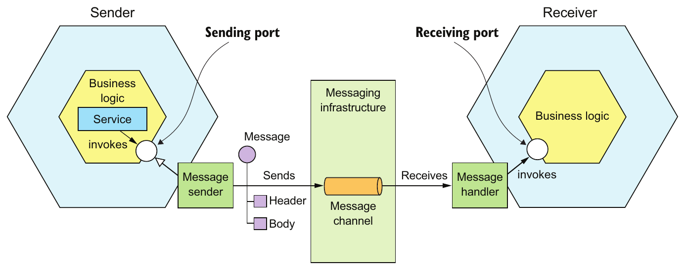

> **English:** Figure 3.7 The business logic in the sender invokes a sending port interface, which is implemented by a message sender adapter. The message sender sends a message to a receiver via a message channel. The message channel is an abstraction of messaging infrastructure. A message handler adapter in the receiver is invoked to handle the message. It invokes the receiving port interface implemented by the receiver’s business logic.
>
> **Türkçe:** Şekil 3.7 Göndericinin iş mantığı, message sender adapter tarafından gerçekleştirilen sending port arayüzünü çağırır. Message sender, mesaj kanalı üzerinden alıcıya mesaj gönderir. Mesaj kanalı, mesajlaşma altyapısının soyutlamasıdır. Mesajı işlemek için alıcıdaki message handler adapter çağrılır. Adapter, alıcının iş mantığının gerçekleştirdiği receiving port arayüzünü çağırır.

> **English:** There are two kinds of channels: point-to-point (www.enterpriseintegrationpatterns.com/PointToPointChannel.html) and publish-subscribe (www.enterpriseintegrationpatterns.com/PublishSubscribeChannel.html):
>
> **Türkçe:** İki kanal türü vardır: point-to-point (noktadan noktaya; www.enterpriseintegrationpatterns.com/PointToPointChannel.html) ve publish-subscribe (yayınla-abone ol; www.enterpriseintegrationpatterns.com/PublishSubscribeChannel.html):

> **English:** A point-to-point channel delivers a message to exactly one of the consumers that is reading from the channel. Services use point-to-point channels for the one-to-one interaction styles described earlier. For example, a command message is often sent over a point-to-point channel.
>
> **Türkçe:** Point-to-point kanal, mesajı kanaldan okuyan tüketicilerden tam olarak birine iletir. Servisler, daha önce anlatılan bire bir etkileşimler için bu kanalları kullanır. Örneğin command mesajı çoğu zaman point-to-point kanaldan gönderilir.

> **English:** A publish-subscribe channel delivers each message to all of the attached consumers. Services use publish-subscribe channels for the one-to-many interaction styles described earlier. For example, an event message is usually sent over a publish-subscribe channel.
>
> **Türkçe:** Publish-subscribe kanal, her mesajı bağlı bütün tüketicilere iletir. Servisler, daha önce anlatılan bire çok etkileşimler için bu kanalları kullanır. Örneğin event mesajı genellikle publish-subscribe kanal üzerinden gönderilir.

### 3.3.2 Implementing the interaction styles using messaging — Etkileşim biçimlerini mesajlaşmayla gerçekleştirmek

> **English:** One of the valuable features of messaging is that it’s flexible enough to support all the interaction styles described in section 3.1.1. Some interaction styles are directly implemented by messaging. Others must be implemented on top of messaging.
>
> **Türkçe:** Mesajlaşmanın değerli özelliklerinden biri, 3.1.1. kısımda anlatılan bütün etkileşim biçimlerini destekleyecek kadar esnek olmasıdır. Bazı biçimler doğrudan mesajlaşmayla gerçekleştirilir. Diğerleri, mesajlaşmanın üzerine ek mantık kurularak gerçekleştirilmelidir.

> **English:** Let’s look at how to implement each interaction style, starting with request/response and asynchronous request/response.
>
> **Türkçe:** Request/response ve asenkron request/response ile başlayarak her etkileşim biçiminin nasıl gerçekleştirileceğine bakalım.

#### IMPLEMENTING REQUEST/RESPONSE AND ASYNCHRONOUS REQUEST/RESPONSE — Request/response ve asenkron request/response gerçekleştirmek

> **English:** When a client and service interact using either request/response or asynchronous request/response, the client sends a request and the service sends back a reply. The difference between the two interaction styles is that with request/response the client expects the service to respond immediately, whereas with asynchronous request/response there is no such expectation. Messaging is inherently asynchronous, so only provides asynchronous request/response. But a client could block until a reply is received.
>
> **Türkçe:** İstemci ve servis, request/response veya asenkron request/response kullandığında istemci istek gönderir, servis yanıt döndürür. Aralarındaki fark, request/response biçiminde istemcinin servisten hemen yanıt beklemesi, asenkron biçimde ise böyle bir beklentinin bulunmamasıdır. Mesajlaşma özünde asenkrondur; dolayısıyla yalnızca asenkron request/response sağlar. Ancak istemci, yanıt gelene kadar bloklanabilir.

> **English:** The client and service implement the asynchronous request/response style interaction by exchanging a pair of messages. As figure 3.8 shows, the client sends a command message, which specifies the operation to perform, and parameters, to a point-to-point messaging channel owned by a service. The service processes the requests and sends a reply message, which contains the outcome, to a point-to-point channel owned by the client.
>
> **Türkçe:** İstemci ve servis, iki mesaj alışverişiyle asenkron request/response etkileşimini gerçekleştirir. Şekil 3.8’de gösterildiği gibi istemci, yapılacak işlemi ve parametrelerini belirten command mesajını servise ait point-to-point kanala gönderir. Servis istekleri işler ve sonucu içeren reply mesajını istemciye ait point-to-point kanala gönderir.

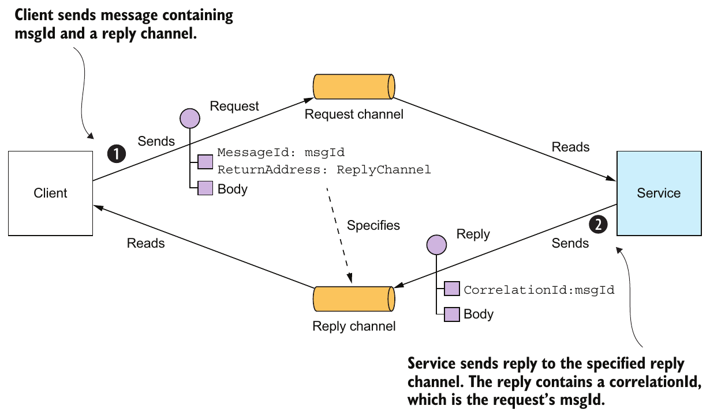

> **English:** Figure 3.8 Implementing asynchronous request/response by including a reply channel and message identifier in the request message. The receiver processes the message and sends the reply to the specified reply channel.
>
> **Türkçe:** Şekil 3.8 İstek mesajına yanıt kanalı ve mesaj kimliği eklenerek asenkron request/response gerçekleştirilir. Alıcı, mesajı işler ve yanıtı belirtilen yanıt kanalına gönderir.

> **English:** The client must tell the service where to send a reply message and must match reply messages to requests. Fortunately, solving these two problems isn’t that difficult. The client sends a command message that has a reply channel header. The server writes the reply message, which contains a correlation id that has the same value as message identifier, to the reply channel. The client uses the correlation id to match the reply message with the request.
>
> **Türkçe:** İstemci, servise yanıt mesajını nereye göndereceğini bildirmeli ve yanıtları isteklerle eşleştirmelidir. Neyse ki bu iki sorunu çözmek zor değildir. İstemci, reply channel header’ı içeren command mesajı gönderir. Sunucu, message identifier ile aynı değere sahip correlation id içeren reply mesajını yanıt kanalına yazar. İstemci, correlation id kullanarak yanıtı istekle eşleştirir.

> **English:** Because the client and service communicate using messaging, the interaction is inherently asynchronous. In theory, a messaging client could block until it receives a reply, but in practice the client will process replies asynchronously. What’s more, replies are typically processed by any one of the client’s instances.
>
> **Türkçe:** İstemci ve servis mesajlaşmayla iletişim kurduğu için etkileşim özünde asenkrondur. Teorik olarak mesajlaşma istemcisi yanıt alana kadar bloklanabilir; ancak uygulamada yanıtları asenkron işler. Üstelik yanıtlar genellikle istemcinin instance’larından herhangi biri tarafından işlenir.

#### IMPLEMENTING ONE-WAY NOTIFICATIONS — Tek yönlü bildirimleri gerçekleştirmek

> **English:** Implementing one-way notifications is straightforward using asynchronous messaging. The client sends a message, typically a command message, to a point-to-point channel owned by the service. The service subscribes to the channel and processes the message. It doesn’t send back a reply.
>
> **Türkçe:** Asenkron mesajlaşmayla tek yönlü bildirimleri gerçekleştirmek kolaydır. İstemci, genellikle command türünde bir mesajı servise ait point-to-point kanala gönderir. Servis kanala abone olur ve mesajı işler. Geriye yanıt göndermez.

#### IMPLEMENTING PUBLISH/SUBSCRIBE — Publish/subscribe gerçekleştirmek

> **English:** Messaging has built-in support for the publish/subscribe style of interaction. A client publishes a message to a publish-subscribe channel that is read by multiple consumers. As described in chapters 4 and 5, services use publish/subscribe to publish domain events, which represent changes to domain objects. The service that publishes the domain events owns a publish-subscribe channel, whose name is derived from the domain class. For example, the Order Service publishes Order events to an Order channel, and the Delivery Service publishes Delivery events to a Delivery channel. A service that’s interested in a particular domain object’s events only has to subscribe to the appropriate channel.
>
> **Türkçe:** Mesajlaşmanın publish/subscribe etkileşimi için yerleşik desteği vardır. İstemci, birden fazla tüketicinin okuduğu publish-subscribe kanala mesaj yayınlar. Dördüncü ve beşinci bölümlerde açıklandığı gibi servisler, domain object değişikliklerini temsil eden domain event’leri yayınlamak için publish/subscribe kullanır. Olayları yayınlayan servis, adı domain sınıfından türetilen bir publish-subscribe kanalına sahiptir. Örneğin Order Service, Order olaylarını Order kanalına; Delivery Service, Delivery olaylarını Delivery kanalına yayınlar. Belirli bir domain object’in olaylarıyla ilgilenen servisin yalnızca uygun kanala abone olması gerekir.

#### IMPLEMENTING PUBLISH/ASYNC RESPONSES — Publish/async responses gerçekleştirmek

> **English:** The publish/async responses interaction style is a higher-level style of interaction that’s implemented by combining elements of publish/subscribe and request/response. A client publishes a message that specifies a reply channel header to a publish-subscribe channel. A consumer writes a reply message containing a correlation id to the reply channel. The client gathers the responses by using the correlation id to match the reply messages with the request.
>
> **Türkçe:** Publish/async responses, publish/subscribe ve request/response öğelerini birleştirerek gerçekleştirilen daha üst düzey bir etkileşim biçimidir. İstemci, reply channel header’ı belirten bir mesajı publish-subscribe kanala yayınlar. Tüketici, correlation id içeren yanıt mesajını yanıt kanalına yazar. İstemci, correlation id ile yanıt mesajlarını istekle eşleştirerek yanıtları toplar.

> **English:** Each service in your application that has an asynchronous API will use one or more of these implementation techniques. A service that has an asynchronous API for invoking operations will have a message channel for requests. Similarly, a service that publishes events will publish them to an event message channel.
>
> **Türkçe:** Uygulamanızda asenkron API’si olan her servis, bu gerçekleştirme tekniklerinden birini veya birkaçını kullanır. İşlemleri çağırmak için asenkron API sunan servisin istekler için bir mesaj kanalı bulunur. Benzer biçimde event yayınlayan servis, bunları event mesaj kanalına yayınlar.

> **English:** As described in section 3.1.2, it’s important to write an API specification for a service. Let’s look at how to do that for an asynchronous API.
>
> **Türkçe:** 3.1.2. kısımda açıklandığı gibi servis için API belirtimi yazmak önemlidir. Bunun asenkron API için nasıl yapılacağına bakalım.

### 3.3.3 Creating an API specification for a messaging-based service API — Mesajlaşma tabanlı servis API’sinin belirtimini oluşturmak

> **English:** The specification for a service’s asynchronous API must, as figure 3.9 shows, specify the names of the message channels, the message types that are exchanged over each channel, and their formats. You must also describe the format of the messages using a standard such as JSON, XML, or Protobuf. But unlike with REST and Open API, there isn’t a widely adopted standard for documenting the channels and the message types. Instead, you need to write an informal document.
>
> **Türkçe:** Şekil 3.9’da gösterildiği gibi servisin asenkron API belirtimi; mesaj kanallarının adlarını, her kanalda alışveriş edilen mesaj türlerini ve bunların biçimlerini belirtmelidir. Mesaj biçimlerini JSON, XML veya Protobuf gibi bir standartla da açıklamalısınız. Ancak REST ve Open API’den farklı olarak kanalları ve mesaj türlerini belgelemek için yaygın benimsenmiş bir standart yoktur. Bunun yerine resmî bir standarda bağlı olmayan bir belge yazmanız gerekir.

> **English:** A service’s asynchronous API consists of operations, invoked by clients, and events, published by the services. They’re documented in different ways. Let’s take a look at each one, starting with operations.
>
> **Türkçe:** Servisin asenkron API’si, istemcilerin çağırdığı işlemlerden ve servislerin yayınladığı olaylardan oluşur. Bunlar farklı biçimlerde belgelenir. İşlemlerle başlayarak her birine bakalım.

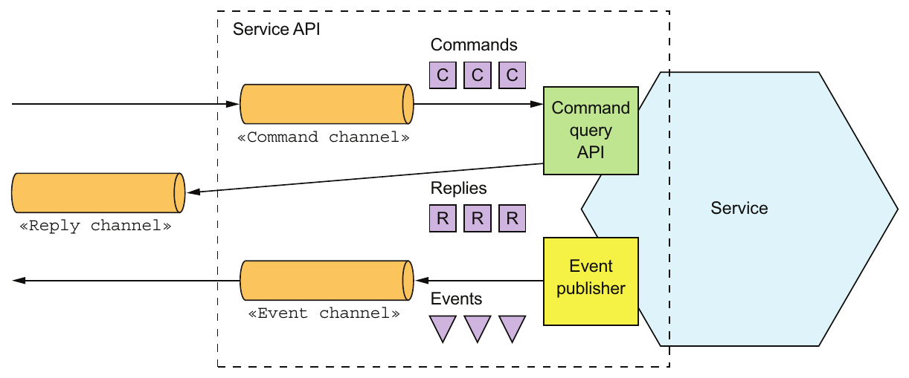

> **English:** Figure 3.9 A service’s asynchronous API consists of message channels and command, reply, and event message types.
>
> **Türkçe:** Şekil 3.9 Servisin asenkron API’si, mesaj kanallarından ve command, reply, event mesaj türlerinden oluşur.

#### DOCUMENTING ASYNCHRONOUS OPERATIONS — Asenkron işlemleri belgelemek

> **English:** A service’s operations can be invoked using one of two different interaction styles:
>
> **Türkçe:** Servisin işlemleri, iki farklı etkileşim biçiminden biriyle çağrılabilir:

> **English:** Request/async response-style API—This consists of the service’s command message channel, the types and formats of the command message types that the service accepts, and the types and formats of the reply messages sent by the service.
>
> **Türkçe:** Request/async response biçimindeki API — Servisin command mesaj kanalından, kabul ettiği command mesajlarının tür ve biçimlerinden ve gönderdiği reply mesajlarının tür ve biçimlerinden oluşur.

> **English:** One-way notification-style API—This consists of the service’s command message channel and the types and format of the command message types that the service accepts.
>
> **Türkçe:** One-way notification biçimindeki API — Servisin command mesaj kanalından ve kabul ettiği command mesajlarının tür ve biçimlerinden oluşur.

> **English:** A service may use the same request channel for both asynchronous request/response and one-way notification.
>
> **Türkçe:** Servis, asenkron request/response ve tek yönlü bildirim için aynı istek kanalını kullanabilir.

#### DOCUMENTING PUBLISHED EVENTS — Yayınlanan olayları belgelemek

> **English:** A service can also publish events using a publish/subscribe interaction style. The specification of this style of API consists of the event channel and the types and formats of the event messages that are published by the service to the channel.
>
> **Türkçe:** Servis ayrıca publish/subscribe etkileşimiyle olay yayınlayabilir. Bu API biçiminin belirtimi, event kanalından ve servisin bu kanala yayınladığı event mesajlarının tür ve biçimlerinden oluşur.

> **English:** The messages and channels model of messaging is a great abstraction and a good way to design a service’s asynchronous API. But in order to implement a service you need to choose a messaging technology and determine how to implement your design using its capabilities. Let’s take a look at what’s involved.
>
> **Türkçe:** Mesajlaşmanın mesajlar ve kanallar modeli, çok iyi bir soyutlama ve servisin asenkron API’sini tasarlamak için iyi bir yöntemdir. Ancak servisi gerçekleştirmek için bir mesajlaşma teknolojisi seçmeli ve tasarımı onun yetenekleriyle nasıl gerçekleştireceğinizi belirlemelisiniz. Bunun neleri içerdiğine bakalım.

### 3.3.4 Using a message broker — Message broker kullanmak

> **English:** A messaging-based application typically uses a message broker, an infrastructure service through which the service communicates. But a broker-based architecture isn’t the only messaging architecture. You can also use a brokerless-based messaging architecture, in which the services communicate with one another directly. The two approaches, shown in figure 3.10, have different trade-offs, but usually a broker-based architecture is a better approach.
>
> **Türkçe:** Mesajlaşma tabanlı uygulama genellikle servisin üzerinden iletişim kurduğu altyapı servisi olan message broker kullanır. Ancak broker tabanlı mimari tek mesajlaşma mimarisi değildir. Servislerin birbirleriyle doğrudan iletişim kurduğu aracısız mesajlaşma mimarisi de kullanılabilir. Şekil 3.10’da gösterilen iki yaklaşımın farklı ödünleşimleri vardır; ancak genellikle broker tabanlı mimari daha iyi yaklaşımdır.

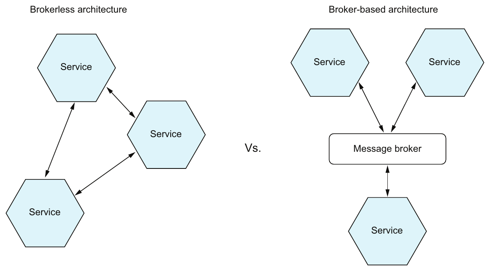

> **English:** Figure 3.10 The services in brokerless architecture communicate directly, whereas the services in a broker-based architecture communicate via a message broker.
>
> **Türkçe:** Şekil 3.10 Aracısız mimaride servisler doğrudan iletişim kurarken broker tabanlı mimaride bir message broker üzerinden iletişim kurar.

> **English:** This book focuses on broker-based architecture, but it’s worthwhile to take a quick look at the brokerless architecture, because there may be scenarios where you find it useful.
>
> **Türkçe:** Bu kitap broker tabanlı mimariye odaklanır; ancak yararlı olabilecek durumlar bulunabileceğinden aracısız mimariye de kısaca bakmak değerlidir.

#### BROKERLESS MESSAGING — Aracısız mesajlaşma

> **English:** In a brokerless architecture, services can exchange messages directly. ZeroMQ (http:// zeromq.org) is a popular brokerless messaging technology. It’s both a specification and a set of libraries for different languages. It supports a variety of transports, including TCP, UNIX-style domain sockets, and multicast.
>
> **Türkçe:** Aracısız mimaride servisler doğrudan mesaj alışverişi yapabilir. ZeroMQ (http://zeromq.org), yaygın bir aracısız mesajlaşma teknolojisidir. Hem bir belirtim hem de farklı diller için kütüphaneler kümesidir. TCP, UNIX tarzı domain socket’ler ve multicast dâhil çeşitli taşıma mekanizmalarını destekler.

> **English:** The brokerless architecture has some benefits:
>
> **Türkçe:** Aracısız mimarinin bazı yararları vardır:

> **English:** Allows lighter network traffic and better latency, because messages go directly from the sender to the receiver, instead of having to go from the sender to the message broker and from there to the receiver
>
> **Türkçe:** Mesajların önce göndericiden message broker’a, oradan alıcıya gitmesi yerine doğrudan göndericiden alıcıya ulaşması sayesinde ağ trafiği azalır ve gecikme iyileşir.

> **English:** Eliminates the possibility of the message broker being a performance bottleneck or a single point of failure
>
> **Türkçe:** Message broker’ın performans darboğazı veya single point of failure (tek hata noktası) olma olasılığını ortadan kaldırır.

> **English:** Features less operational complexity, because there is no message broker to set up and maintain
>
> **Türkçe:** Kurulacak ve bakımı yapılacak message broker olmadığından işletim karmaşıklığı daha düşüktür.

> **English:** As appealing as these benefits may seem, brokerless messaging has significant drawbacks:
>
> **Türkçe:** Bu yararlar ne kadar çekici görünse de aracısız mesajlaşmanın önemli dezavantajları vardır:

> **English:** Services need to know about each other’s locations and must therefore use one of the discovery mechanisms described earlier in section 3.2.4.
>
> **Türkçe:** Servisler birbirlerinin konumlarını bilmelidir; bu nedenle 3.2.4. kısımda anlatılan keşif mekanizmalarından birini kullanmaları gerekir.

> **English:** It offers reduced availability, because both the sender and receiver of a message must be available while the message is being exchanged.
>
> **Türkçe:** Mesaj alışverişi sırasında hem gönderen hem alıcı kullanılabilir olmak zorunda olduğundan kullanılabilirlik daha düşüktür.

> **English:** Implementing mechanisms, such as guaranteed delivery, is more challenging.
>
> **Türkçe:** Garantili teslim gibi mekanizmaları gerçekleştirmek daha güçtür.

> **English:** In fact, some of these drawbacks, such as reduced availability and the need for service discovery, are the same as when using synchronous request/response.
>
> **Türkçe:** Aslında kullanılabilirliğin azalması ve servis keşfi gereksinimi gibi bu dezavantajların bazıları, senkron request/response kullanımındakilerle aynıdır.

> **English:** Because of these limitations, most enterprise applications use a message broker-based architecture. Let’s look at how that works.
>
> **Türkçe:** Bu sınırlamalar nedeniyle kurumsal uygulamaların çoğu message broker tabanlı mimari kullanır. Bunun nasıl çalıştığına bakalım.

#### OVERVIEW OF BROKER-BASED MESSAGING — Broker tabanlı mesajlaşmaya genel bakış

> **English:** A message broker is an intermediary through which all messages flow. A sender writes the message to the message broker, and the message broker delivers it to the receiver. An important benefit of using a message broker is that the sender doesn’t need to know the network location of the consumer. Another benefit is that a message broker buffers messages until the consumer is able to process them.
>
> **Türkçe:** Message broker, bütün mesajların içinden geçtiği bir aracıdır. Gönderen, mesajı message broker’a yazar; broker mesajı alıcıya teslim eder. Message broker kullanmanın önemli yararı, gönderenin tüketicinin ağ konumunu bilmek zorunda olmamasıdır. Başka bir yararı, tüketici mesajları işleyebilecek hâle gelene kadar mesajları tamponlamasıdır.

> **English:** There are many message brokers to choose from. Examples of popular open source message brokers include the following:
>
> **Türkçe:** Aralarından seçilebilecek birçok message broker vardır. Yaygın açık kaynak broker örnekleri şunlardır:

> **English:** ActiveMQ (http://activemq.apache.org)
>
> **Türkçe:** ActiveMQ (http://activemq.apache.org).

> **English:** RabbitMQ (https://www.rabbitmq.com)
>
> **Türkçe:** RabbitMQ (https://www.rabbitmq.com).

> **English:** Apache Kafka (http://kafka.apache.org)
>
> **Türkçe:** Apache Kafka (http://kafka.apache.org).

> **English:** There are also cloud-based messaging services, such as AWS Kinesis (https://aws.amazon.com/kinesis/) and AWS SQS (https://aws.amazon.com/sqs/).
>
> **Türkçe:** AWS Kinesis (https://aws.amazon.com/kinesis/) ve AWS SQS (https://aws.amazon.com/sqs/) gibi bulut tabanlı mesajlaşma servisleri de vardır.

> **English:** When selecting a message broker, you have various factors to consider, including the following:
>
> **Türkçe:** Message broker seçerken aşağıdakiler dâhil çeşitli etkenleri değerlendirmelisiniz:

> **English:** Supported programming languages—You probably should pick one that supports a variety of programming languages.
>
> **Türkçe:** Desteklenen programlama dilleri — Büyük olasılıkla çeşitli programlama dillerini destekleyen bir broker seçmelisiniz.

> **English:** Supported messaging standards—Does the message broker support any standards, such as AMQP and STOMP, or is it proprietary?
>
> **Türkçe:** Desteklenen mesajlaşma standartları — Broker AMQP ve STOMP gibi standartları destekliyor mu, yoksa kendine özgü bir protokol mü kullanıyor?

> **English:** Messaging ordering—Does the message broker preserve ordering of messages?
>
> **Türkçe:** Mesaj sıralaması — Broker, mesajların sırasını koruyor mu?

> **English:** Delivery guarantees—What kind of delivery guarantees does the broker make?
>
> **Türkçe:** Teslim garantileri — Broker hangi teslim garantilerini veriyor?

> **English:** Persistence—Are messages persisted to disk and able to survive broker crashes?
>
> **Türkçe:** Persistence (kalıcılık) — Mesajlar diske yazılıyor mu ve broker çökmelerinden sonra korunabiliyor mu?

> **English:** Durability—If a consumer reconnects to the message broker, will it receive the messages that were sent while it was disconnected?
>
> **Türkçe:** Durability (dayanıklılık) — Tüketici broker’a yeniden bağlandığında bağlantısının kesik olduğu sırada gönderilmiş mesajları alabilecek mi?

> **English:** Scalability—How scalable is the message broker?
>
> **Türkçe:** Ölçeklenebilirlik — Broker ne kadar ölçeklenebilir?

> **English:** Latency—What is the end-to-end latency?
>
> **Türkçe:** Gecikme — Uçtan uca gecikme ne kadar?

> **English:** Competing consumers—Does the message broker support competing consumers?
>
> **Türkçe:** Competing consumers (yarışan tüketiciler) — Broker, aynı kanaldaki işleri paylaşan tüketicileri destekliyor mu?

> **English:** Each broker makes different trade-offs. For example, a very low-latency broker might not preserve ordering, make no guarantees to deliver messages, and only store messages in memory. A messaging broker that guarantees delivery and reliably stores messages on disk will probably have higher latency. Which kind of message broker is the best fit depends on your application’s requirements. It’s even possible that different parts of your application will have different messaging requirements.
>
> **Türkçe:** Her broker farklı ödünleşimler yapar. Örneğin gecikmesi çok düşük bir broker mesaj sırasını korumayabilir, teslim garantisi vermeyebilir ve mesajları yalnızca bellekte tutabilir. Teslim garantisi veren ve mesajları diskte güvenilir biçimde saklayan broker’ın gecikmesi ise büyük olasılıkla daha yüksek olur. En uygun broker türü, uygulamanızın gereksinimlerine bağlıdır. Hatta uygulamanın farklı bölümleri farklı mesajlaşma gereksinimlerine sahip olabilir.

> **English:** It’s likely, though, that messaging ordering and scalability are essential. Let’s now look at how to implement message channels using a message broker.
>
> **Türkçe:** Bununla birlikte mesaj sırası ve ölçeklenebilirlik muhtemelen vazgeçilmezdir. Şimdi message broker kullanarak mesaj kanallarının nasıl gerçekleştirileceğine bakalım.

#### IMPLEMENTING MESSAGE CHANNELS USING A MESSAGE BROKER — Message broker ile mesaj kanallarını gerçekleştirmek

> **English:** Each message broker implements the message channel concept in a different way. As table 3.2 shows, JMS message brokers such as ActiveMQ have queues and topics. AMQP-based message brokers such as RabbitMQ have exchanges and queues. Apache Kafka has topics, AWS Kinesis has streams, and AWS SQS has queues. What’s more, some message brokers offer more flexible messaging than the message and channels abstraction described in this chapter.
>
> **Türkçe:** Her message broker, mesaj kanalı kavramını farklı gerçekleştirir. Tablo 3.2’de gösterildiği gibi ActiveMQ gibi JMS broker’ları queue ve topic içerir. RabbitMQ gibi AMQP tabanlı broker’larda exchange ve queue bulunur. Apache Kafka’da topic, AWS Kinesis’te stream, AWS SQS’te queue vardır. Üstelik bazı broker’lar, bu bölümde anlatılan mesajlar ve kanallar soyutlamasından daha esnek mesajlaşma olanakları sunar.

> **English:** Table 3.2 Each message broker implements the message channel concept in a different way.
>
> **Türkçe:** Tablo 3.2 Her message broker, mesaj kanalı kavramını farklı biçimde gerçekleştirir.

| Message broker | Point-to-point channel / Noktadan noktaya kanal | Publish-subscribe channel / Yayınla-abone ol kanalı |
| --- | --- | --- |
| JMS | Queue / Kuyruk | Topic / Konu |
| Apache Kafka | Topic | Topic |
| AMQP-based brokers, such as RabbitMQ / RabbitMQ gibi AMQP tabanlı broker’lar | Exchange + Queue | Fanout exchange and a queue per consumer / Fanout exchange ve her tüketici için bir kuyruk |
| AWS Kinesis | Stream / Akış | Stream / Akış |
| AWS SQS | Queue / Kuyruk | — |

> **English:** Almost all the message brokers described here support both point-to-point and publish-subscribe channels. The one exception is AWS SQS, which only supports point-to-point channels.
>
> **Türkçe:** Burada anlatılan message broker’ların neredeyse tamamı hem point-to-point hem publish-subscribe kanallarını destekler. Tek istisna, yalnızca point-to-point kanallarını destekleyen AWS SQS’tir.

> **English:** Now let’s look at the benefits and drawbacks of broker-based messaging.
>
> **Türkçe:** Şimdi broker tabanlı mesajlaşmanın yararlarına ve dezavantajlarına bakalım.

#### BENEFITS AND DRAWBACKS OF BROKER-BASED MESSAGING — Broker tabanlı mesajlaşmanın yararları ve dezavantajları

> **English:** There are many advantages to using broker-based messaging:
>
> **Türkçe:** Broker tabanlı mesajlaşmanın birçok avantajı vardır:

> **English:** Loose coupling—A client makes a request by simply sending a message to the appropriate channel. The client is completely unaware of the service instances. It doesn’t need to use a discovery mechanism to determine the location of a service instance.
>
> **Türkçe:** Loose coupling (gevşek bağlılık) — İstemci, uygun kanala mesaj göndererek istek yapar. Servis instance’larından tamamen habersizdir. Instance konumunu belirlemek için keşif mekanizması kullanması gerekmez.

> **English:** Message buffering—The message broker buffers messages until they can be processed. With a synchronous request/response protocol such as HTTP, both the client and service must be available for the duration of the exchange. With messaging, though, messages will queue up until they can be processed by the consumer. This means, for example, that an online store can accept orders from customers even when the order-fulfillment system is slow or unavailable. The messages will simply queue up until they can be processed.
>
> **Türkçe:** Message buffering (mesaj tamponlama) — Broker, mesajları işlenebilecekleri zamana kadar tamponlar. HTTP gibi senkron request/response protokolünde alışveriş süresince hem istemci hem servis kullanılabilir olmalıdır. Mesajlaşmada ise mesajlar, tüketici tarafından işlenebilene kadar kuyrukta birikir. Örneğin çevrim içi mağaza, sipariş karşılama sistemi yavaş veya kullanılamaz olsa bile müşteri siparişlerini kabul edebilir. Mesajlar, işlenebilene kadar kuyrukta bekler.

> **English:** Flexible communication—Messaging supports all the interaction styles described earlier.
>
> **Türkçe:** Flexible communication (esnek iletişim) — Mesajlaşma, daha önce anlatılan bütün etkileşim biçimlerini destekler.

> **English:** Explicit interprocess communication—RPC-based mechanism attempts to make invoking a remote service look the same as calling a local service. But due to the laws of physics and the possibility of partial failure, they’re in fact quite different. Messaging makes these differences very explicit, so developers aren’t lulled into a false sense of security.
>
> **Türkçe:** Explicit interprocess communication (açıkça görülen süreçler arası iletişim) — RPC tabanlı mekanizma, uzak servis çağrısını yerel servis çağrısıyla aynıymış gibi göstermeye çalışır. Ancak fizik yasaları ve kısmi arıza olasılığı nedeniyle ikisi gerçekte oldukça farklıdır. Mesajlaşma bu farkları açıkça ortaya koyar; geliştiricilerin yersiz bir güven duygusuna kapılmasını engeller.

> **English:** There are some downsides to using messaging:
>
> **Türkçe:** Mesajlaşmanın bazı olumsuz yönleri vardır:

> **English:** Potential performance bottleneck—There is a risk that the message broker could be a performance bottleneck. Fortunately, many modern message brokers are designed to be highly scalable.
>
> **Türkçe:** Olası performans darboğazı — Message broker’ın performans darboğazı oluşturma riski vardır. Neyse ki birçok modern broker yüksek ölçeklenebilirlik için tasarlanmıştır.

> **English:** Potential single point of failure—It’s essential that the message broker is highly available—otherwise, system reliability will be impacted. Fortunately, most modern brokers have been designed to be highly available.
>
> **Türkçe:** Olası tek hata noktası — Broker’ın yüksek kullanılabilirliğe sahip olması gerekir; aksi hâlde sistemin güvenilirliği etkilenir. Neyse ki modern broker’ların çoğu yüksek kullanılabilirlik için tasarlanmıştır.

> **English:** Additional operational complexity—The messaging system is yet another system component that must be installed, configured, and operated.
>
> **Türkçe:** Ek işletim karmaşıklığı — Mesajlaşma sistemi, kurulması, yapılandırılması ve işletilmesi gereken bir sistem bileşeni daha demektir.

> **English:** Let’s look at some design issues you might face.
>
> **Türkçe:** Karşılaşabileceğiniz bazı tasarım konularına bakalım.

### 3.3.5 Competing receivers and message ordering — Yarışan alıcılar ve mesaj sırası

> **English:** One challenge is how to scale out message receivers while preserving message ordering. It’s a common requirement to have multiple instances of a service in order to process messages concurrently. Moreover, even a single service instance will probably use threads to concurrently process multiple messages. Using multiple threads and service instances to concurrently process messages increases the throughput of the application. But the challenge with processing messages concurrently is ensuring that each message is processed once and in order.
>
> **Türkçe:** Güçlüklerden biri, mesaj sırasını korurken mesaj alıcılarını yatay ölçeklemektir. Mesajları eşzamanlı işlemek için bir servisin birden fazla instance’ına sahip olmak yaygın bir gereksinimdir. Üstelik tek instance bile birden fazla mesajı eşzamanlı işlemek için muhtemelen thread’ler kullanır. Birden fazla thread ve instance kullanmak uygulamanın throughput’unu (birim zamanda işlediği iş miktarını) artırır. Ancak eşzamanlı mesaj işlemenin güçlüğü, her mesajın bir kez ve doğru sırada işlendiğinden emin olmaktır.

> **English:** For example, imagine that there are three instances of a service reading from the same point-to-point channel and that a sender publishes Order Created, Order Updated, and Order Cancelled event messages sequentially. A simplistic messaging implementation could concurrently deliver each message to a different receiver. Because of delays due to network issues or garbage collections, messages might be processed out of order, which would result in strange behavior. In theory, a service instance might process the Order Cancelled message before another service processes the Order Created message!
>
> **Türkçe:** Örneğin aynı point-to-point kanaldan okuyan üç servis instance’ı bulunduğunu ve göndericinin sırayla Order Created, Order Updated ve Order Cancelled olaylarını yayınladığını düşünün. Basit bir mesajlaşma gerçekleştirimi, her mesajı eşzamanlı olarak farklı alıcıya teslim edebilir. Ağ sorunları veya garbage collection nedeniyle oluşan gecikmeler yüzünden mesajlar sıra dışı işlenebilir ve tuhaf davranışlar ortaya çıkabilir. Teorik olarak bir instance, başka bir servis Order Created mesajını işlemeden önce Order Cancelled mesajını işleyebilir!

> **English:** A common solution, used by modern message brokers like Apache Kafka and AWS Kinesis, is to use sharded (partitioned) channels. Figure 3.11 shows how this works. There are three parts to the solution:
>
> **Türkçe:** Apache Kafka ve AWS Kinesis gibi modern broker’ların kullandığı yaygın çözüm, sharded (partitioned), yani parçalara bölünmüş kanallardır. Şekil 3.11 bunun nasıl çalıştığını gösterir. Çözüm üç parçadan oluşur:

> **English:** 1 A sharded channel consists of two or more shards, each of which behaves like a channel.
>
> **Türkçe:** 1. Parçalanmış kanal, her biri bir kanal gibi davranan iki veya daha fazla shard’dan oluşur.

> **English:** 2 The sender specifies a shard key in the message’s header, which is typically an arbitrary string or sequence of bytes. The message broker uses a shard key to assign the message to a particular shard/partition. It might, for example, select the shard by computing the hash of the shard key modulo the number of shards.
>
> **Türkçe:** 2. Gönderen, mesaj header’ında genellikle herhangi bir string veya byte dizisi olan shard key’i belirtir. Broker, bu anahtarla mesajı belirli shard’a/partition’a atar. Örneğin anahtarın hash değerinin shard sayısına göre modunu hesaplayarak shard seçebilir.

> **English:** 3 The messaging broker groups together multiple instances of a receiver and treats them as the same logical receiver. Apache Kafka, for example, uses the term consumer group. The message broker assigns each shard to a single receiver. It reassigns shards when receivers start up and shut down.
>
> **Türkçe:** 3. Broker, alıcının birden fazla instance’ını gruplar ve aynı mantıksal alıcı olarak değerlendirir. Örneğin Apache Kafka, consumer group terimini kullanır. Broker, her shard’ı tek alıcıya atar. Alıcılar başlatılıp kapatıldığında shard atamalarını yeniden yapar.

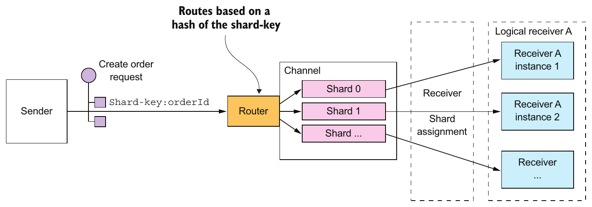

> **English:** Figure 3.11 Scaling consumers while preserving message ordering by using a sharded (partitioned) message channel. The sender includes the shard key in the message. The message broker writes the message to a shard determined by the shard key. The message broker assigns each partition to an instance of the replicated receiver.
>
> **Türkçe:** Şekil 3.11 Parçalanmış mesaj kanalı kullanılarak mesaj sırası korunurken tüketiciler ölçeklenir. Gönderen mesajda shard key’i belirtir. Broker, mesajı anahtarın belirlediği shard’a yazar. Her partition’ı, çoğaltılmış alıcının bir instance’ına atar.

> **English:** In this example, each Order event message has the orderId as its shard key. Each event for a particular order is published to the same shard, which is read by a single consumer instance. As a result, these messages are guaranteed to be processed in order.
>
> **Türkçe:** Bu örnekte her Order event mesajı, shard key olarak orderId kullanır. Belirli siparişin bütün olayları, tek tüketici instance’ının okuduğu aynı shard’a yayınlanır. Böylece bu mesajların sırayla işlenmesi garanti edilir.

### 3.3.6 Handling duplicate messages — Yinelenen mesajları ele almak

> **English:** Another challenge you must tackle when using messaging is dealing with duplicate messages. A message broker should ideally deliver each message only once, but guaranteeing exactly-once messaging is usually too costly. Instead, most message brokers promise to deliver a message at least once.
>
> **Türkçe:** Mesajlaşma kullanırken ele almanız gereken başka bir güçlük, yinelenen mesajlardır. İdeal olarak broker her mesajı yalnızca bir kez teslim etmelidir; ancak exactly-once messaging garantisi genellikle çok maliyetlidir. Bunun yerine broker’ların çoğu, mesajı en az bir kez teslim etmeyi taahhüt eder.

> **English:** When the system is working normally, a message broker that guarantees at-least-once delivery will deliver each message only once. But a failure of a client, network, or message broker can result in a message being delivered multiple times. Say a client crashes after processing a message and updating its database—but before acknowledging the message. The message broker will deliver the unacknowledged message again, either to that client when it restarts or to another replica of the client.
>
> **Türkçe:** Sistem normal çalışırken at-least-once delivery garantisi veren broker her mesajı yalnızca bir kez teslim eder. Ancak istemci, ağ veya broker arızası mesajın birden fazla kez teslimine neden olabilir. İstemcinin mesajı işleyip veritabanını güncelledikten sonra, ancak mesaja acknowledge (alındı/işlendi onayı) vermeden önce çöktüğünü varsayın. Broker, onaylanmamış mesajı istemci yeniden başladığında ona veya istemcinin başka bir replikasına yeniden teslim eder.

> **English:** Ideally, you should use a message broker that preserves ordering when redelivering messages. Imagine that the client processes an Order Created event followed by an Order Cancelled event for the same Order, and that somehow the Order Created event wasn’t acknowledged. The message broker should redeliver both the Order Created and Order Cancelled events. If it only redelivers the Order Created, the client may undo the cancelling of the Order.
>
> **Türkçe:** İdeal olarak mesajları yeniden teslim ederken sıralamayı koruyan bir broker kullanmalısınız. İstemcinin bir Order için önce Order Created, sonra Order Cancelled olayını işlediğini ve Order Created olayının bir şekilde onaylanmadığını düşünün. Broker hem Order Created hem Order Cancelled olayını yeniden teslim etmelidir. Yalnızca Order Created’ı yeniden teslim ederse istemci, Order’ın iptalini geri alabilir.

> **English:** There are a couple of different ways to handle duplicate messages:
>
> **Türkçe:** Yinelenen mesajları ele almanın birkaç yolu vardır:

> **English:** Write idempotent message handlers.
>
> **Türkçe:** Idempotent mesaj işleyicileri yazmak.

> **English:** Track messages and discard duplicates.
>
> **Türkçe:** Mesajları takip edip yinelenenleri atmak.

> **English:** Let’s look at each option.
>
> **Türkçe:** Her seçeneğe bakalım.

#### WRITING IDEMPOTENT MESSAGE HANDLERS — Idempotent mesaj işleyicileri yazmak

> **English:** If the application logic that processes messages is idempotent, then duplicate messages are harmless. Application logic is idempotent if calling it multiple times with the same input values has no additional effect. For instance, cancelling an already-cancelled order is an idempotent operation. So is creating an order with a client-supplied ID. An idempotent message handler can be safely executed multiple times, provided that the message broker preserves ordering when redelivering messages.
>
> **Türkçe:** Mesajları işleyen uygulama mantığı idempotent ise yinelenen mesajlar zararsızdır. Aynı girdi değerleriyle birden fazla çağırmanın ek etkisi yoksa uygulama mantığı idempotent’tir. Örneğin zaten iptal edilmiş siparişi iptal etmek idempotent bir işlemdir. İstemcinin sağladığı kimlikle sipariş oluşturmak da böyledir. Broker yeniden teslimde sıralamayı koruduğu sürece idempotent mesaj işleyicisi güvenle birden fazla çalıştırılabilir.

> **English:** Unfortunately, application logic is often not idempotent. Or you may be using a message broker that doesn’t preserve ordering when redelivering messages. Duplicate or out-of-order messages can cause bugs. In this situation, you must write message handlers that track messages and discard duplicate messages.
>
> **Türkçe:** Ne yazık ki uygulama mantığı çoğu zaman idempotent değildir. Ya da yeniden teslim sırasında sırayı korumayan bir broker kullanıyor olabilirsiniz. Yinelenen veya sıra dışı mesajlar hataya yol açabilir. Bu durumda mesajları takip eden ve yinelenenleri atan işleyiciler yazmalısınız.

#### TRACKING MESSAGES AND DISCARDING DUPLICATES — Mesajları takip etmek ve yinelenenleri atmak

> **English:** Consider, for example, a message handler that authorizes a consumer credit card. It must authorize the card exactly once for each order. This example of application logic has a different effect each time it’s invoked. If duplicate messages caused the message handler to execute this logic multiple times, the application would behave incorrectly. The message handler that executes this kind of application logic must become idempotent by detecting and discarding duplicate messages.
>
> **Türkçe:** Örneğin tüketicinin kredi kartına provizyon koyan mesaj işleyicisini düşünün. Her sipariş için kartı tam olarak bir kez yetkilendirmelidir. Bu uygulama mantığı, her çağrılışında farklı bir etki yaratır. Yinelenen mesajlar nedeniyle işleyici bu mantığı birden fazla çalıştırırsa uygulama yanlış davranır. Bu tür mantığı yürüten işleyici, yinelenen mesajları tespit edip atarak idempotent hâle gelmelidir.

> **English:** A simple solution is for a message consumer to track the messages that it has processed using the message id and discard any duplicates. It could, for example, store the message id of each message that it consumed in a database table. Figure 3.12 shows how to do this using a dedicated table.
>
> **Türkçe:** Basit çözüm, tüketicinin işlediği mesajları message id ile takip etmesi ve yinelenenleri atmasıdır. Örneğin tükettiği her mesajın kimliğini bir veritabanı tablosunda saklayabilir. Şekil 3.12, ayrı bir tablo kullanarak bunun nasıl yapılacağını gösterir.

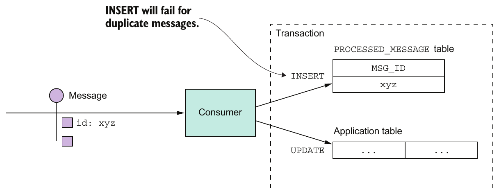

> **English:** Figure 3.12 A consumer detects and discards duplicate messages by recording the IDs of processed messages in a database table. If a message has been processed before, the INSERT into the PROCESSED_MESSAGES table will fail.
>
> **Türkçe:** Şekil 3.12 Tüketici, işlenen mesajların kimliklerini veritabanı tablosuna kaydederek yinelenenleri tespit edip atar. Mesaj daha önce işlenmişse PROCESSED_MESSAGES tablosuna yapılan INSERT başarısız olur.

> **English:** When a consumer handles a message, it records the message id in the database table as part of the transaction that creates and updates business entities. In this example, the consumer inserts a row containing the message id into a PROCESSED_MESSAGES table. If a message is a duplicate, the INSERT will fail and the consumer can discard the message.
>
> **Türkçe:** Tüketici mesajı işlerken, iş varlıklarını oluşturan ve güncelleyen transaction’ın parçası olarak mesaj kimliğini tabloya kaydeder. Bu örnekte tüketici, message id içeren satırı PROCESSED_MESSAGES tablosuna ekler. Mesaj yineleniyorsa INSERT başarısız olur ve tüketici mesajı atabilir.

> **English:** Another option is for a message handler to record message id s in an application table instead of a dedicated table. This approach is particularly useful when using a NoSQL database that has a limited transaction model, so it doesn’t support updating two tables as part of a database transaction. Chapter 7 shows an example of this approach.
>
> **Türkçe:** Başka bir seçenek, mesaj işleyicisinin kimlikleri ayrı tablo yerine uygulama tablosunda tutmasıdır. Bu yaklaşım, sınırlı transaction modeline sahip olduğu için aynı transaction içinde iki tablo güncellemeyi desteklemeyen NoSQL veritabanında özellikle yararlıdır. Yedinci bölüm bu yaklaşımın örneğini gösterir.

### 3.3.7 Transactional messaging — Transaction bütünlüğünü koruyan mesajlaşma

> **English:** A service often needs to publish messages as part of a transaction that updates the database. For instance, throughout this book you see examples of services that publish domain events whenever they create or update business entities. Both the database update and the sending of the message must happen within a transaction. Otherwise, a service might update the database and then crash, for example, before sending the message. If the service doesn’t perform these two operations atomically, a failure could leave the system in an inconsistent state.
>
> **Türkçe:** Servis çoğu zaman veritabanını güncelleyen transaction’ın parçası olarak mesaj yayınlamalıdır. Örneğin kitap boyunca, iş varlıklarını oluşturduğunda veya güncellediğinde domain event yayınlayan servisler görürsünüz. Hem veritabanı güncellemesi hem mesaj gönderimi bir transaction içinde gerçekleşmelidir. Aksi hâlde servis veritabanını güncelleyip mesajı göndermeden önce çökebilir. Bu iki işlem atomik yapılmazsa arıza sistemi tutarsız durumda bırakabilir.

> **English:** The traditional solution is to use a distributed transaction that spans the database and the message broker. But as you’ll learn in chapter 4, distributed transactions aren’t a good choice for modern applications. Moreover, many modern brokers such as Apache Kafka don’t support distributed transactions.
>
> **Türkçe:** Geleneksel çözüm, veritabanı ile message broker’ı kapsayan distributed transaction (dağıtık transaction) kullanmaktır. Ancak 4. bölümde öğreneceğiniz gibi dağıtık transaction’lar modern uygulamalar için iyi seçim değildir. Üstelik Apache Kafka gibi birçok modern broker dağıtık transaction’ları desteklemez.

> **English:** As a result, an application must use a different mechanism to reliably publish messages. Let’s look at how that works.
>
> **Türkçe:** Sonuç olarak uygulama, mesajları güvenilir biçimde yayınlamak için farklı bir mekanizma kullanmalıdır. Bunun nasıl çalıştığına bakalım.

#### USING A DATABASE TABLE AS A MESSAGE QUEUE — Veritabanı tablosunu mesaj kuyruğu olarak kullanmak

> **English:** Let’s imagine that your application is using a relational database. A straightforward way to reliably publish messages is to apply the Transactional outbox pattern. This pattern uses a database table as a temporary message queue. As figure 3.13 shows, a service that sends messages has an OUTBOX database table. As part of the database transaction that creates, updates, and deletes business objects, the service sends messages by inserting them into the OUTBOX table. Atomicity is guaranteed because this is a local ACID transaction.
>
> **Türkçe:** Uygulamanızın ilişkisel veritabanı kullandığını düşünelim. Mesajları güvenilir yayınlamanın basit yolu, Transactional outbox örüntüsünü uygulamaktır. Bu örüntü, veritabanı tablosunu geçici mesaj kuyruğu olarak kullanır. Şekil 3.13’te gösterildiği gibi mesaj gönderen servisin OUTBOX tablosu vardır. Servis, iş nesnelerini oluşturan, güncelleyen ve silen veritabanı transaction’ının parçası olarak mesajları OUTBOX tablosuna ekleyerek gönderir. Yerel ACID transaction olduğundan atomicity (atomiklik) garanti edilir.

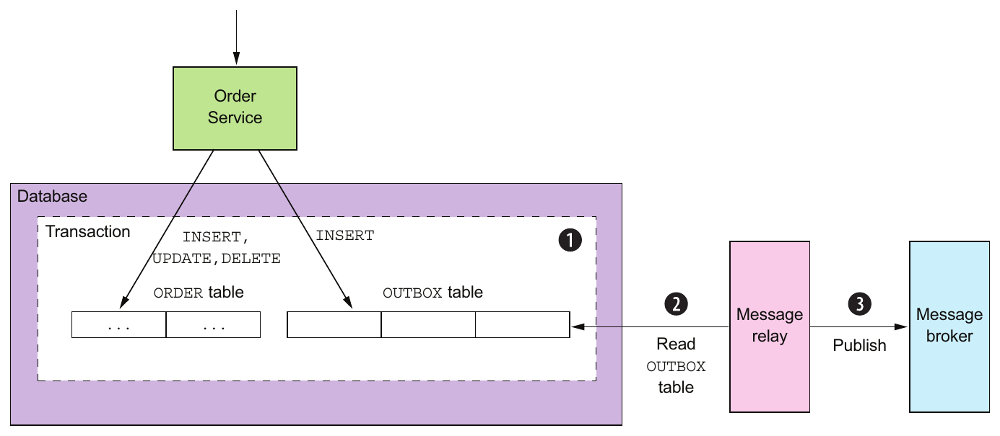

> **English:** Figure 3.13 A service reliably publishes a message by inserting it into an OUTBOX table as part of the transaction that updates the database. The Message Relay reads the OUTBOX table and publishes the messages to a message broker.
>
> **Türkçe:** Şekil 3.13 Servis, veritabanını güncelleyen transaction’ın parçası olarak mesajı OUTBOX tablosuna ekleyerek güvenilir biçimde yayınlar. Message Relay, OUTBOX tablosunu okur ve mesajları broker’a yayınlar.

> **English:** The OUTBOX table acts as a temporary message queue. The MessageRelay is a component that reads the OUTBOX table and publishes the messages to a message broker.
>
> **Türkçe:** OUTBOX tablosu geçici mesaj kuyruğu görevi görür. MessageRelay, OUTBOX tablosunu okuyup mesajları broker’a yayınlayan bileşendir.

#### Pattern: Transactional outbox — Örüntü: Transactional outbox

> **English:** Publish an event or message as part of a database transaction by saving it in an OUTBOX in the database. See http://microservices.io/patterns/data/transactional-outbox.html.
>
> **Türkçe:** Olayı veya mesajı veritabanındaki OUTBOX’a kaydederek veritabanı transaction’ının parçası olarak yayınlayın. Bkz. http://microservices.io/patterns/data/transactional-outbox.html.

> **English:** You can use a similar approach with some NoSQL databases. Each business entity stored as a record in the database has an attribute that is a list of messages that need to be published. When a service updates an entity in the database, it appends a message to that list. This is atomic because it’s done with a single database operation. The challenge, though, is efficiently finding those business entities that have events and publishing them.
>
> **Türkçe:** Bazı NoSQL veritabanlarında benzer yaklaşım kullanılabilir. Veritabanında kayıt olarak saklanan her iş varlığının, yayınlanması gereken mesajları listeleyen bir alanı vardır. Servis, varlığı güncellerken bu listeye mesaj ekler. Tek veritabanı işlemiyle yapıldığı için atomiktir. Ancak güçlük, olay içeren varlıkları verimli bulup olayları yayınlamaktır.

> **English:** There are a couple of different ways to move messages from the database to the message broker. We’ll look at each one.
>
> **Türkçe:** Mesajları veritabanından broker’a taşımanın birkaç farklı yolu vardır. Her birini inceleyeceğiz.

#### PUBLISHING EVENTS BY USING THE POLLING PUBLISHER PATTERN — Polling publisher örüntüsüyle olay yayınlamak

> **English:** If the application uses a relational database, a very simple way to publish the messages inserted into the OUTBOX table is for the MessageRelay to poll the table for unpublished messages. It periodically queries the table:
>
> **Türkçe:** Uygulama ilişkisel veritabanı kullanıyorsa OUTBOX’a eklenen mesajları yayınlamanın çok basit yolu, MessageRelay’in yayınlanmamış mesajlar için tabloyu düzenli sorgulamasıdır. Belli aralıklarla şu sorguyu çalıştırır:

```text
SELECT * FROM OUTBOX ORDERED BY ... ASC
```

> **Editör notu:** Kaynak örnekte `ORDERED BY` yazmaktadır; SQL sıralama ifadesi `ORDER BY` olmalıdır. Üç nokta, bu örneğin tamamlanması gereken bir şablon olduğunu gösterir.

> **English:** Next, the MessageRelay publishes those messages to the message broker, sending one to its destination message channel. Finally, it deletes those messages from the OUTBOX table:
>
> **Türkçe:** Ardından MessageRelay, mesajları broker’a yayınlar; her birini hedef mesaj kanalına gönderir. Son olarak mesajları OUTBOX tablosundan siler:

```text
BEGIN
 DELETE FROM OUTBOX WHERE ID in (....)
COMMIT
```

#### Pattern: Polling publisher — Örüntü: Düzenli sorgulayarak yayınlayan bileşen

> **English:** Publish messages by polling the outbox in the database. See http://microservices.io/patterns/data/polling-publisher.html.
>
> **Türkçe:** Veritabanındaki outbox’ı düzenli sorgulayarak mesajları yayınlayın. Bkz. http://microservices.io/patterns/data/polling-publisher.html.

> **English:** Polling the database is a simple approach that works reasonably well at low scale. The downside is that frequently polling the database can be expensive. Also, whether you can use this approach with a NoSQL database depends on its querying capabilities. That’s because rather than querying an OUTBOX table, the application must query the business entities, and that may or may not be possible to do efficiently. Because of these drawbacks and limitations, it’s often better—and in some cases, necessary—to use the more sophisticated and performant approach of tailing the database transaction log.
>
> **Türkçe:** Veritabanını düzenli sorgulamak, küçük ölçekte makul derecede iyi çalışan basit bir yaklaşımdır. Dezavantajı, sık sorgulamanın maliyetli olabilmesidir. Ayrıca NoSQL veritabanıyla kullanılıp kullanılamayacağı, veritabanının sorgulama yeteneklerine bağlıdır. Çünkü uygulama, OUTBOX yerine iş varlıklarını sorgulamalıdır; bunu verimli yapmak mümkün de olabilir, olmayabilir de. Bu dezavantajlar ve sınırlamalar nedeniyle veritabanı transaction log’unu takip eden daha gelişmiş ve performanslı yaklaşım çoğu zaman daha iyidir; bazı durumlarda ise gereklidir.

#### PUBLISHING EVENTS BY APPLYING THE TRANSACTION LOG TAILING PATTERN — Transaction log tailing örüntüsüyle olay yayınlamak

> **English:** A sophisticated solution is for MessageRelay to tail the database transaction log (also called the commit log). Every committed update made by an application is represented as an entry in the database’s transaction log. A transaction log miner can read the transaction log and publish each change as a message to the message broker. Figure 3.14 shows how this approach works.
>
> **Türkçe:** Gelişmiş çözüm, MessageRelay’in veritabanı transaction log’unu — commit log da denir — takip etmesidir. Uygulamanın yaptığı ve commit edilen her güncelleme, transaction log’da bir kayıtla temsil edilir. Transaction log miner, log’u okuyup her değişikliği broker’a mesaj olarak yayınlayabilir. Şekil 3.14 bunun nasıl çalıştığını gösterir.

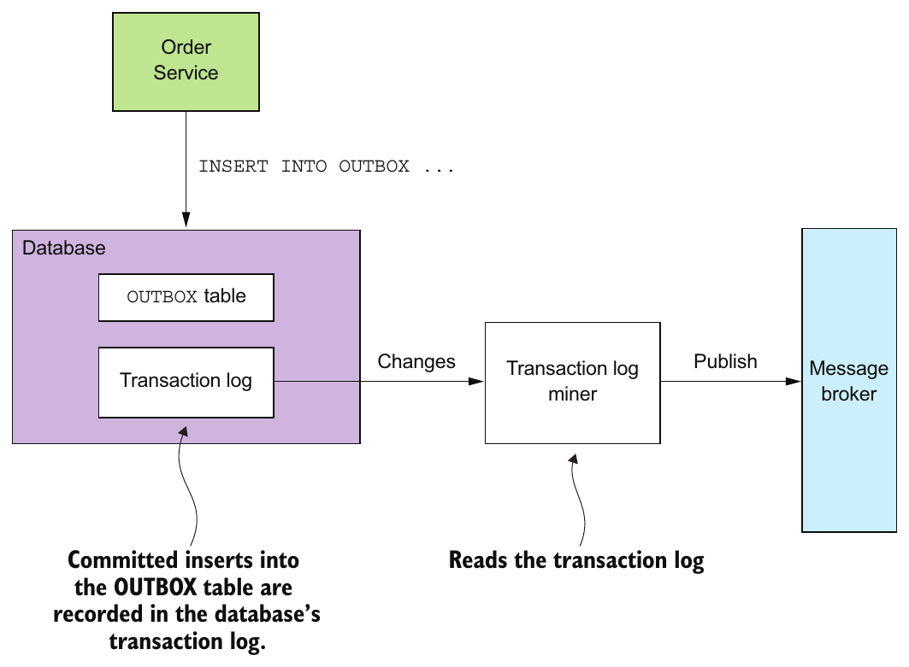

> **English:** Figure 3.14 A service publishes messages inserted into the OUTBOX table by mining the database’s transaction log.
>
> **Türkçe:** Şekil 3.14 Servis, veritabanının transaction log’unu inceleyerek OUTBOX tablosuna eklenmiş mesajları yayınlar.

> **English:** The Transaction Log Miner reads the transaction log entries. It converts each relevant log entry corresponding to an inserted message into a message and publishes that message to the message broker. This approach can be used to publish messages written to an OUTBOX table in an RDBMS or messages appended to records in a NoSQL database.
>
> **Türkçe:** Transaction Log Miner, transaction log kayıtlarını okur. Eklenen mesajı temsil eden her ilgili kaydı mesaja dönüştürür ve broker’a yayınlar. Bu yaklaşım, RDBMS’de OUTBOX’a yazılan mesajları veya NoSQL veritabanındaki kayıtlara eklenen mesajları yayınlamak için kullanılabilir.

#### Pattern: Transaction log tailing — Örüntü: Transaction log’unu takip etmek

> **English:** Publish changes made to the database by tailing the transaction log. See http://microservices.io/patterns/data/transaction-log-tailing.html.
>
> **Türkçe:** Transaction log’unu takip ederek veritabanında yapılan değişiklikleri yayınlayın. Bkz. http://microservices.io/patterns/data/transaction-log-tailing.html.

> **English:** There are a few examples of this approach in use:
>
> **Türkçe:** Bu yaklaşımın kullanıldığı bazı örnekler şunlardır:

> **English:** Debezium (http://debezium.io)—An open source project that publishes database changes to the Apache Kafka message broker.
>
> **Türkçe:** Debezium (http://debezium.io) — Veritabanı değişikliklerini Apache Kafka broker’ına yayınlayan açık kaynak proje.

> **English:** LinkedIn Databus (https://github.com/linkedin/databus)—An open source project that mines the Oracle transaction log and publishes the changes as events. LinkedIn uses Databus to synchronize various derived data stores with the system of record.
>
> **Türkçe:** LinkedIn Databus (https://github.com/linkedin/databus) — Oracle transaction log’unu inceleyip değişiklikleri event olarak yayınlayan açık kaynak proje. LinkedIn, çeşitli türetilmiş veri depolarını ana kayıt sistemiyle eşzamanlamak için Databus kullanır.

> **English:** DynamoDB streams (http://docs.aws.amazon.com/amazondynamodb/latest/ developerguide/Streams.html)—DynamoDB streams contain the time-ordered sequence of changes (creates, updates, and deletes) made to the items in a DynamoDB table in the last 24 hours. An application can read those changes from the stream and, for example, publish them as events.
>
> **Türkçe:** DynamoDB streams (http://docs.aws.amazon.com/amazondynamodb/latest/developerguide/Streams.html) — Bir DynamoDB tablosunun öğelerinde son 24 saatte yapılan oluşturma, güncelleme ve silme değişikliklerinin zamana göre sıralı dizisini içerir. Uygulama bu değişiklikleri stream’den okuyup örneğin event olarak yayınlayabilir.

> **English:** Eventuate Tram (https://github.com/eventuate-tram/eventuate-tram-core)—Your author’s very own open source transaction messaging library that uses MySQL binlog protocol, Postgres WAL, or polling to read changes made to an OUTBOX table and publish them to Apache Kafka.
>
> **Türkçe:** Eventuate Tram (https://github.com/eventuate-tram/eventuate-tram-core) — Kitabın yazarının geliştirdiği açık kaynak transactional messaging kütüphanesi. OUTBOX tablosundaki değişiklikleri okumak ve Apache Kafka’ya yayınlamak için MySQL binlog protokolünü, Postgres WAL’ı veya polling’i kullanır.

> **English:** Although this approach is obscure, it works remarkably well. The challenge is that implementing it requires some development effort. You could, for example, write low-level code that calls database-specific APIs. Alternatively, you could use an open source framework such as Debezium that publishes changes made by an application to MySQL, Postgres, or MongoDB to Apache Kafka. The drawback of using Debezium is that its focus is capturing changes at the database level and that APIs for sending and receiving messages are outside of its scope. That’s why I created the Eventuate Tram framework, which provides the messaging APIs as well as transaction tailing and polling.
>
> **Türkçe:** Bu yaklaşım az bilinse de oldukça iyi çalışır. Güçlük, gerçekleştirmek için geliştirme emeği gerektirmesidir. Örneğin veritabanına özgü API’leri çağıran düşük düzeyli kod yazabilirsiniz. Alternatif olarak uygulamanın MySQL, Postgres veya MongoDB’de yaptığı değişiklikleri Apache Kafka’ya yayınlayan Debezium gibi açık kaynak bir framework kullanabilirsiniz. Debezium’un dezavantajı, veritabanı düzeyindeki değişiklikleri yakalamaya odaklanması ve mesaj gönderme/alma API’lerinin kapsamı dışında olmasıdır. Bu nedenle mesajlaşma API’lerinin yanında transaction log takibi ve polling de sunan Eventuate Tram framework’ünü oluşturdum.

### 3.3.8 Libraries and frameworks for messaging — Mesajlaşma kütüphaneleri ve framework’leri

> **English:** A service needs to use a library to send and receive messages. One approach is to use the message broker’s client library, although there are several problems with using such a library directly:
>
> **Türkçe:** Servis, mesaj göndermek ve almak için kütüphane kullanmalıdır. Seçeneklerden biri broker’ın istemci kütüphanesidir; ancak bunu doğrudan kullanmanın bazı sorunları vardır:

> **English:** The client library couples business logic that publishes messages to the message broker APIs.
>
> **Türkçe:** İstemci kütüphanesi, mesaj yayınlayan iş mantığını broker API’lerine bağlar.

> **English:** A message broker’s client library is typically low level and requires many lines of code to send or receive a message. As a developer, you don’t want to repeatedly write boilerplate code. Also, as the author of this book I don’t want the example code cluttered with low-level boilerplate.
>
> **Türkçe:** Broker’ın istemci kütüphanesi genellikle düşük düzeylidir; mesaj göndermek veya almak için çok sayıda kod satırı gerektirir. Geliştirici olarak tekrar tekrar boilerplate (kalıp) kod yazmak istemezsiniz. Ben de kitabın yazarı olarak örneklerin düşük düzeyli kalıp kodla dolmasını istemiyorum.

> **English:** The client library usually provides only the basic mechanism to send and receive messages and doesn’t support the higher-level interaction styles.
>
> **Türkçe:** İstemci kütüphanesi genellikle yalnızca temel mesaj gönderme ve alma mekanizmasını sağlar; daha üst düzey etkileşim biçimlerini desteklemez.

> **English:** A better approach is to use a higher-level library or framework that hides the low-level details and directly supports the higher-level interaction styles. For simplicity, the examples in this book use my Eventuate Tram framework. It has a simple, easy-to-understand API that hides the complexity of using the message broker. Besides an API for sending and receiving messages, Eventuate Tram also supports higher-level interaction styles such as asynchronous request/response and domain event publishing.
>
> **Türkçe:** Daha iyi yaklaşım, düşük düzeyli ayrıntıları gizleyen ve üst düzey etkileşim biçimlerini doğrudan destekleyen bir kütüphane veya framework kullanmaktır. Basitlik için bu kitaptaki örnekler benim Eventuate Tram framework’ümü kullanır. Broker kullanımının karmaşıklığını gizleyen basit ve anlaşılır bir API’ye sahiptir. Mesaj gönderme ve alma API’sinin yanında asenkron request/response ve domain event yayınlama gibi üst düzey etkileşimleri de destekler.

#### What!? Why the Eventuate frameworks? — Ne!? Neden Eventuate framework’leri?

> **English:** The code samples in this book use the open source Eventuate frameworks I’ve developed for transactional messaging, event sourcing, and sagas. I chose to use my frameworks because, unlike with, say, dependency injection and the Spring framework, there are no widely adopted frameworks for many of the features the microservice architecture requires. Without the Eventuate Tram framework, many examples would have to use the low-level messaging APIs directly, making them much more complicated and obscuring important concepts. Or they would use a framework that isn’t widely adopted, which would also provoke criticism.
>
> **Türkçe:** Bu kitaptaki kod örnekleri; transactional messaging, event sourcing ve saga için geliştirdiğim açık kaynak Eventuate framework’lerini kullanır. Kendi framework’lerimi seçtim; çünkü örneğin dependency injection ve Spring’in aksine, mikroservis mimarisinin gerektirdiği birçok özellik için yaygın benimsenmiş framework yoktur. Eventuate Tram olmadan birçok örnek düşük düzeyli mesajlaşma API’lerini doğrudan kullanmak zorunda kalacak, çok daha karmaşıklaşacak ve önemli kavramları gölgeleyecekti. Ya da yaygın benimsenmemiş başka bir framework kullanacak, bu da eleştiriye neden olacaktı.

> **English:** Instead, the examples use the Eventuate Tram frameworks, which have a simple, easy-to-understand API that hides the implementation details. You can use these frameworks in your applications. Alternatively, you can study the Eventuate Tram frameworks and reimplement the concepts yourself.
>
> **Türkçe:** Bunun yerine örnekler, gerçekleştirim ayrıntılarını gizleyen basit ve anlaşılır API’ye sahip Eventuate Tram framework’lerini kullanır. Bunları kendi uygulamalarınızda kullanabilirsiniz. Alternatif olarak framework’leri inceleyip kavramları kendiniz yeniden gerçekleştirebilirsiniz.

> **English:** Eventuate Tram also implements two important mechanisms:
>
> **Türkçe:** Eventuate Tram iki önemli mekanizmayı da gerçekleştirir:

> **English:** Transactional messaging—It publishes messages as part of a database transaction.
>
> **Türkçe:** Transactional messaging — Mesajları veritabanı transaction’ının parçası olarak yayınlar.

> **English:** Duplicate message detection—The Eventuate Tram message consumer detects and discards duplicate messages, which is essential for ensuring that a consumer processes messages exactly once, as discussed in section 3.3.6.
>
> **Türkçe:** Yinelenen mesaj tespiti — Eventuate Tram tüketicisi yinelenen mesajları tespit edip atar. 3.3.6. kısımda tartışıldığı gibi bu, tüketicinin mesajları tam olarak bir kez işlemesini sağlamak için önemlidir.

> **English:** Let’s take a look at the Eventuate Tram APIs.
>
> **Türkçe:** Eventuate Tram API’lerine bakalım.

#### BASIC MESSAGING — Temel mesajlaşma

> **English:** The basic messaging API consists of two Java interfaces: MessageProducer and MessageConsumer. A producer service uses the MessageProducer interface to publish messages to message channels. Here’s an example of using this interface:
>
> **Türkçe:** Temel mesajlaşma API’si iki Java interface’ten oluşur: MessageProducer ve MessageConsumer. Üretici servis, kanallara mesaj yayınlamak için MessageProducer arayüzünü kullanır. Kullanım örneği şöyledir:

```java
MessageProducer messageProducer = ...;
String channel = ...;
String payload = ...;
messageProducer.send(destination, MessageBuilder.withPayload(payload).build())
```

> **Editör notu:** Bu bölümdeki `...` içeren Java parçaları, API kullanımını gösteren tamamlanmamış kaynak örnekleridir; tek başına derlenebilir programlar değildir. İlk parçada `channel` bildirilirken çağrıda `destination` kullanılması ve sondaki noktalı virgülün eksikliği kaynakta da bulunmaktadır.

> **English:** A consumer service uses the MessageConsumer interface to subscribe to messages:
>
> **Türkçe:** Tüketici servis, mesajlara abone olmak için MessageConsumer arayüzünü kullanır:

```java
MessageConsumer messageConsumer;
messageConsumer.subscribe(subscriberId, Collections.singleton(destination),
     message -> { ... })
```

> **English:** MessageProducer and MessageConsumer are the foundation of the higher-level APIs for asynchronous request/response and domain event publishing.
>
> **Türkçe:** MessageProducer ve MessageConsumer, asenkron request/response ve domain event yayınlama için üst düzey API’lerin temelidir.

> **English:** Let’s talk about how to publish and subscribe to events.
>
> **Türkçe:** Olayların nasıl yayınlanacağına ve olaylara nasıl abone olunacağına bakalım.

#### DOMAIN EVENT PUBLISHING — Domain event yayınlamak

> **English:** Eventuate Tram has APIs for publishing and consuming domain events. Chapter 5 explains that domain events are events that are emitted by an aggregate (business object) when it’s created, updated, or deleted. A service publishes a domain event using the DomainEventPublisher interface. Here is an example:
>
> **Türkçe:** Eventuate Tram, domain event yayınlamak ve tüketmek için API’lere sahiptir. Beşinci bölümde domain event’lerin, bir aggregate (iş nesnesi) oluşturulduğunda, güncellendiğinde veya silindiğinde yayınladığı olaylar olduğu açıklanır. Servis, DomainEventPublisher arayüzüyle domain event yayınlar. Örnek şöyledir:

```java
DomainEventPublisher domainEventPublisher;

String accountId = ...;

DomainEvent domainEvent = new AccountDebited(...);

domainEventPublisher.publish("Account", accountId, Collections.singletonList(
     domainEvent));
```

> **English:** A service consumes domain events using the DomainEventDispatcher. An example follows:
>
> **Türkçe:** Servis, DomainEventDispatcher kullanarak domain event tüketir. Örnek aşağıdadır:

```java
DomainEventHandlers domainEventHandlers = DomainEventHandlersBuilder
            .forAggregateType("Order")
            .onEvent(AccountDebited.class, domainEvent -> { ... })
            .build();

new DomainEventDispatcher("eventDispatcherId",
            domainEventHandlers,
            messageConsumer);
```

> **English:** Events aren’t the only high-level messaging pattern supported by Eventuate Tram. It also supports command/reply-based messaging.
>
> **Türkçe:** Event’ler, Eventuate Tram’in desteklediği tek üst düzey mesajlaşma örüntüsü değildir. Command/reply tabanlı mesajlaşmayı da destekler.

#### COMMAND/REPLY-BASED MESSAGING — Command/reply tabanlı mesajlaşma

> **English:** A client can send a command message to a service using the CommandProducer interface. For example
>
> **Türkçe:** İstemci, CommandProducer arayüzünü kullanarak servise command mesajı gönderebilir. Örneğin:

```java
CommandProducer commandProducer = ...;

Map<String, String> extraMessageHeaders = Collections.emptyMap();

String commandId = commandProducer.send("CustomerCommandChannel",
        new DoSomethingCommand(),
        "ReplyToChannel",
        extraMessageHeaders);
```

> **English:** A service consumes command messages using the CommandDispatcher class. CommandDispatcher uses the MessageConsumer interface to subscribe to specified events. It dispatches each command message to the appropriate handler method. Here’s an example:
>
> **Türkçe:** Servis, CommandDispatcher sınıfını kullanarak command mesajlarını tüketir. CommandDispatcher, belirtilen olaylara abone olmak için MessageConsumer arayüzünü kullanır. Her command mesajını uygun handler metoduna yönlendirir. Örnek şöyledir:

```java
CommandHandlers commandHandlers = CommandHandlersBuilder
            .fromChannel(commandChannel)
            .onMessage(DoSomethingCommand.class, (command) ->
                { ... ; return withSuccess(); })
            .build();

CommandDispatcher dispatcher = new CommandDispatcher("subscribeId",
     commandHandlers, messageConsumer, messageProducer);
```

> **English:** Throughout this book, you’ll see code examples that use these APIs for sending and receiving messages.
>
> **Türkçe:** Kitap boyunca mesaj göndermek ve almak için bu API’leri kullanan kod örnekleri göreceksiniz.

> **English:** As you’ve seen, the Eventuate Tram framework implements transactional messaging for Java applications. It provides a low-level API for sending and receiving messages transactionally. It also provides the higher-level APIs for publishing and consuming domain events and for sending and processing commands.
>
> **Türkçe:** Gördüğünüz gibi Eventuate Tram framework’ü, Java uygulamaları için transactional messaging gerçekleştirir. Mesajları transaction bütünlüğüyle gönderip almak için düşük düzeyli API sağlar. Ayrıca domain event yayınlamak ve tüketmek, command göndermek ve işlemek için üst düzey API’ler sunar.

> **English:** Let’s now look at a service design approach that uses asynchronous messaging to improve availability.
>
> **Türkçe:** Şimdi kullanılabilirliği artırmak için asenkron mesajlaşma kullanan bir servis tasarımı yaklaşımına bakalım.

## 3.4 Using asynchronous messaging to improve availability — Asenkron mesajlaşmayla kullanılabilirliği artırmak

> **English:** As you’ve seen, a variety of IPC mechanisms have different trade-offs. One particular trade-off is how your choice of IPC mechanism impacts availability. In this section, you’ll learn that synchronous communication with other services as part of request handling reduces application availability. As a result, you should design your services to use asynchronous messaging whenever possible.
>
> **Türkçe:** Gördüğünüz gibi çeşitli IPC mekanizmalarının farklı ödünleşimleri vardır. Bunlardan biri, IPC mekanizması seçiminin kullanılabilirliğe etkisidir. Bu kısımda, istek işlenirken diğer servislerle senkron iletişim kurmanın uygulama kullanılabilirliğini azalttığını öğreneceksiniz. Bu nedenle servislerinizi mümkün olduğunda asenkron mesajlaşma kullanacak şekilde tasarlamalısınız.

> **English:** Let’s first look at the problem with synchronous communication and how it impacts availability.
>
> **Türkçe:** Önce senkron iletişimin sorununa ve kullanılabilirliği nasıl etkilediğine bakalım.

### 3.4.1 Synchronous communication reduces availability — Senkron iletişim kullanılabilirliği azaltır

> **English:** REST is an extremely popular IPC mechanism. You may be tempted to use it for inter-service communication. The problem with REST, though, is that it’s a synchronous protocol: an HTTP client must wait for the service to send a response. Whenever services communicate using a synchronous protocol, the availability of the application is reduced.
>
> **Türkçe:** REST son derece yaygın bir IPC mekanizmasıdır. Servisler arası iletişimde kullanmak isteyebilirsiniz. Ancak REST’in sorunu, senkron bir protokol olmasıdır: HTTP istemcisi, servisin yanıt göndermesini beklemelidir. Servisler senkron protokolle iletişim kurduğunda uygulamanın kullanılabilirliği azalır.

> **English:** To see why, consider the scenario shown in figure 3.15. The Order Service has a REST API for creating an Order. It invokes the Consumer Service and the Restaurant Service to validate the Order. Both of those services also have REST APIs.
>
> **Türkçe:** Nedenini görmek için Şekil 3.15’teki senaryoyu düşünün. Order Service, Order oluşturmak için REST API sunar. Order’ı doğrulamak için Consumer Service ve Restaurant Service’i çağırır. Bu iki servisin de REST API’si vardır.

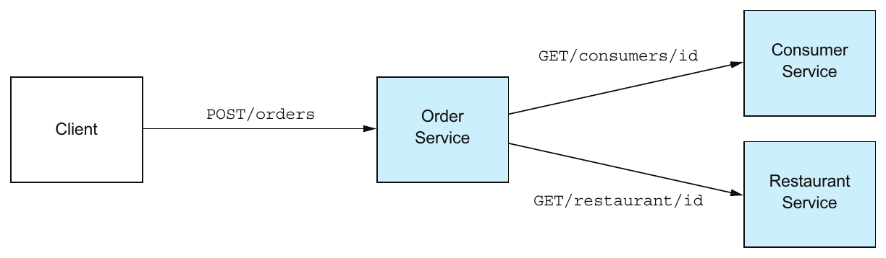

> **English:** Figure 3.15 The Order Service invokes other services using REST. It’s straightforward, but it requires all the services to be simultaneously available, which reduces the availability of the API.
>
> **Türkçe:** Şekil 3.15 Order Service, diğer servisleri REST kullanarak çağırır. Bu basittir; ancak bütün servislerin aynı anda kullanılabilir olmasını gerektirdiğinden API’nin kullanılabilirliğini azaltır.

> **English:** The sequence of steps for creating an order is as follows:
>
> **Türkçe:** Sipariş oluşturmanın adımları şöyledir:

> **English:** 1 Client makes an HTTP POST /orders request to the Order Service.
>
> **Türkçe:** 1. İstemci, Order Service’e HTTP POST /orders isteği gönderir.

> **English:** 2 Order Service retrieves consumer information by making an HTTP GET /consumers/id request to the Consumer Service.
>
> **Türkçe:** 2. Order Service, Consumer Service’e HTTP GET /consumers/id isteği göndererek tüketici bilgisini alır.

> **English:** 3 Order Service retrieves restaurant information by making an HTTP GET /restaurant/id request to the Restaurant Service.
>
> **Türkçe:** 3. Order Service, Restaurant Service’e HTTP GET /restaurant/id isteği göndererek restoran bilgisini alır.

> **English:** 4 Order Taking validates the request using the consumer and restaurant information.
>
> **Türkçe:** 4. Order Taking, tüketici ve restoran bilgileriyle isteği doğrular.

> **English:** 5 Order Taking creates an Order.
>
> **Türkçe:** 5. Order Taking bir Order oluşturur.

> **English:** 6 Order Taking sends an HTTP response to the client.
>
> **Türkçe:** 6. Order Taking, istemciye HTTP yanıtı gönderir.

> **English:** Because these services use HTTP, they must all be simultaneously available in order for the FTGO application to process the CreateOrder request. The FTGO application couldn’t create orders if any one of these three services is down. Mathematically speaking, the availability of a system operation is the product of the availability of the services that are invoked by that operation. If the Order Service and the two services that it invokes are 99.5% available, the overall availability is 99.5%³ ≈ 98.5%, which is significantly less. Each additional service that participates in handling a request further reduces availability.
>
> **Türkçe:** Bu servisler HTTP kullandığı için FTGO’nun CreateOrder isteğini işleyebilmesi, hepsinin aynı anda kullanılabilir olmasını gerektirir. Bu üç servisten biri kapalıysa uygulama sipariş oluşturamaz. Matematiksel olarak sistem işleminin kullanılabilirliği, çağırdığı servislerin kullanılabilirliklerinin çarpımıdır. Order Service ve çağırdığı iki servis %99,5 kullanılabilirliğe sahipse toplam kullanılabilirlik %99,5’in üçüncü kuvveti, yani yaklaşık %98,5 olur; bu belirgin biçimde daha düşüktür. İstek işlemeye katılan her ek servis, kullanılabilirliği daha da azaltır.

> **Teknik not:** Bu çarpım, bütün çağrıların başarılı olmasını gerektiren ve servislerin kullanılabilirliklerini bağımsız kabul eden basitleştirilmiş modeldir. `0.995³ = 0.985074875`, yaklaşık `%98,5` eder. Ortak arıza nedenleri, gerçek sistemde bağımsızlık varsayımını bozabilir.

> **English:** This problem isn’t specific to REST-based communication. Availability is reduced whenever a service can only respond to its client after receiving a response from another service. This problem exists even if services communicate using request/response style interaction over asynchronous messaging. For example, the availability of the Order Service would be reduced if it sent a message to the Consumer Service via a message broker and then waited for a response.
>
> **Türkçe:** Bu sorun yalnızca REST tabanlı iletişime özgü değildir. Servis, başka servisten yanıt almadan istemcisine yanıt veremiyorsa kullanılabilirlik azalır. Sorun, servisler asenkron mesajlaşma üzerinden request/response etkileşimi kullandığında da vardır. Örneğin Order Service, broker aracılığıyla Consumer Service’e mesaj gönderip sonra yanıt beklerse kullanılabilirliği azalır.

> **English:** If you want to maximize availability, you must minimize the amount of synchronous communication. Let’s look at how to do that.
>
> **Türkçe:** Kullanılabilirliği en yükseğe çıkarmak istiyorsanız senkron iletişimi en aza indirmelisiniz. Bunun nasıl yapılacağına bakalım.

### 3.4.2 Eliminating synchronous interaction — Senkron etkileşimi ortadan kaldırmak

> **English:** There are a few different ways to reduce the amount of synchronous communication with other services while handling synchronous requests. One solution is to avoid the problem entirely by defining services that only have asynchronous APIs. That’s not always possible, though. For example, public APIs are commonly RESTful. Services are therefore sometimes required to have synchronous APIs.
>
> **Türkçe:** Senkron istekleri işlerken diğer servislerle yapılan senkron iletişimi azaltmanın birkaç yolu vardır. Bir çözüm, yalnızca asenkron API sunan servisler tanımlayarak sorundan tamamen kaçınmaktır. Ancak bu her zaman mümkün değildir. Örneğin public API’ler yaygın olarak RESTful’dur. Bu nedenle servislerin bazen senkron API sunması gerekir.

> **English:** Fortunately, there are ways to handle synchronous requests without making synchronous requests. Let’s talk about the options.
>
> **Türkçe:** Neyse ki senkron istek göndermeden senkron istekleri işlemenin yolları vardır. Seçenekleri konuşalım.

#### USE ASYNCHRONOUS INTERACTION STYLES — Asenkron etkileşim biçimlerini kullanın

> **English:** Ideally, all interactions should be done using the asynchronous interaction styles described earlier in this chapter. For example, say a client of the FTGO application used an asynchronous request/asynchronous response style of interaction to create orders. A client creates an order by sending a request message to the Order Service. This service then asynchronously exchanges messages with other services and eventually sends a reply message to the client. Figure 3.16 shows the design.
>
> **Türkçe:** İdeal olarak bütün etkileşimler, bu bölümde daha önce anlatılan asenkron biçimlerle yapılmalıdır. Örneğin FTGO istemcisinin sipariş oluşturmak için asenkron istek/asenkron yanıt etkileşimi kullandığını varsayın. İstemci, Order Service’e istek mesajı göndererek sipariş oluşturur. Servis daha sonra diğer servislerle asenkron mesaj alışverişi yapar ve sonunda istemciye yanıt mesajı gönderir. Şekil 3.16 tasarımı gösterir.

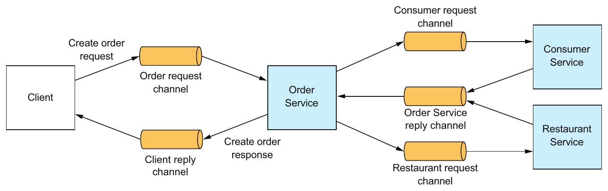

> **English:** Figure 3.16 The FTGO application has higher availability if its services communicate using asynchronous messaging instead of synchronous calls.
>
> **Türkçe:** Şekil 3.16 Servisler senkron çağrılar yerine asenkron mesajlaşmayla iletişim kurarsa FTGO uygulamasının kullanılabilirliği daha yüksek olur.

> **English:** The client and the services communicate asynchronously by sending messages via messaging channels. No participant in this interaction is ever blocked waiting for a response.
>
> **Türkçe:** İstemci ve servisler, mesaj kanallarından mesaj göndererek asenkron iletişim kurar. Bu etkileşimin hiçbir katılımcısı yanıt beklerken bloklanmaz.

> **English:** Such an architecture would be extremely resilient, because the message broker buffers messages until they can be consumed. The problem, however, is that services often have an external API that uses a synchronous protocol such as REST, so it must respond to requests immediately.
>
> **Türkçe:** Broker, mesajları tüketilebilene kadar tamponladığı için böyle bir mimari arızalara son derece dayanıklı olur. Ancak sorun, servislerin çoğu zaman REST gibi senkron protokol kullanan dış API’ye sahip olması ve dolayısıyla isteklere hemen yanıt vermek zorunda olmasıdır.

> **English:** If a service has a synchronous API, one way to improve availability is to replicate data. Let’s see how that works.
>
> **Türkçe:** Servisin senkron API’si varsa kullanılabilirliği artırmanın bir yolu veriyi çoğaltmaktır. Bunun nasıl çalıştığını görelim.

#### REPLICATE DATA — Veriyi çoğaltın

> **English:** One way to minimize synchronous requests during request processing is to replicate data. A service maintains a replica of the data that it needs when processing requests. It keeps the replica up-to-date by subscribing to events published by the services that own the data. For example, Order Service could maintain a replica of data owned by Consumer Service and Restaurant Service. This would enable Order Service to handle a request to create an order without having to interact with those services. Figure 3.17 shows the design.
>
> **Türkçe:** İstek işlerken senkron çağrıları en aza indirmenin bir yolu veriyi çoğaltmaktır. Servis, istekleri işlerken ihtiyaç duyduğu verinin replikasını tutar. Verinin sahibi olan servislerin yayınladığı olaylara abone olarak replikayı güncel tutar. Örneğin Order Service, Consumer Service ve Restaurant Service’e ait verilerin replikasını tutabilir. Böylece bu servislerle etkileşmek zorunda kalmadan sipariş oluşturma isteğini karşılayabilir. Şekil 3.17 tasarımı gösterir.

> **English:** Consumer Service and Restaurant Service publish events whenever their data changes. Order Service subscribes to those events and updates its replica.
>
> **Türkçe:** Consumer Service ve Restaurant Service, verileri değiştiğinde olay yayınlar. Order Service bu olaylara abone olur ve replikasını günceller.

> **English:** In some situations, replicating data is a useful approach. For example, chapter 5 describes how Order Service replicates data from Restaurant Service so that it can validate and price menu items. One drawback of replication is that it can sometimes require the replication of large amounts of data, which is inefficient. For example, it may not be practical for Order Service to maintain a replica of the data owned by Consumer Service, due to the large number of consumers. Another drawback of replication is that it doesn’t solve the problem of how a service updates data owned by other services.
>
> **Türkçe:** Bazı durumlarda veri çoğaltmak yararlı yaklaşımdır. Örneğin 5. bölüm, Order Service’in menü öğelerini doğrulayıp fiyatlandırabilmek için Restaurant Service verisini nasıl çoğalttığını anlatır. Çoğaltmanın dezavantajlarından biri, bazen büyük miktarda veriyi kopyalamayı gerektirmesi ve bunun verimsiz olmasıdır. Örneğin tüketici sayısının yüksekliği nedeniyle Order Service’in Consumer Service verisinin replikasını tutması pratik olmayabilir. Başka bir dezavantaj, çoğaltmanın bir servisin diğer servislere ait veriyi nasıl güncelleyeceği sorununu çözmemesidir.

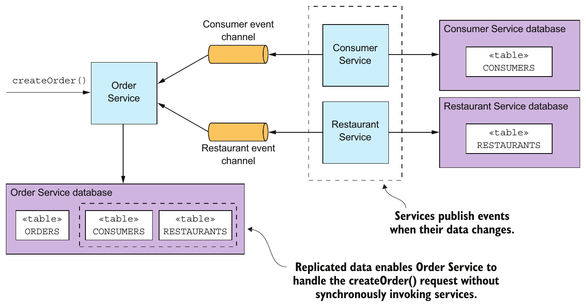

> **English:** Figure 3.17 Order Service is self-contained because it has replicas of the consumer and restaurant data.
>
> **Türkçe:** Şekil 3.17 Order Service, tüketici ve restoran verilerinin replikalarına sahip olduğundan kendi kendine yeterlidir.

> **English:** One way to solve that problem is for a service to delay interacting with other services until after it responds to its client. We’ll next look at how that works.
>
> **Türkçe:** Bu sorunu çözmenin bir yolu, servisin diğer servislerle etkileşimini istemcisine yanıt verdikten sonraya ertelemesidir. Sırada bunun nasıl çalıştığı var.

#### FINISH PROCESSING AFTER RETURNING A RESPONSE — Yanıtı döndürdükten sonra işlemeyi tamamlayın

> **English:** Another way to eliminate synchronous communication during request processing is for a service to handle a request as follows:
>
> **Türkçe:** İstek işlerken senkron iletişimi ortadan kaldırmanın başka yolu, servisin isteği şöyle ele almasıdır:

> **English:** 1 Validate the request using only the data available locally.
>
> **Türkçe:** 1. İsteği yalnızca yerelde bulunan verilerle doğrulayın.

> **English:** 2 Update its database, including inserting messages into the OUTBOX table.
>
> **Türkçe:** 2. OUTBOX tablosuna mesaj eklemek dâhil veritabanını güncelleyin.

> **English:** 3 Return a response to its client.
>
> **Türkçe:** 3. İstemciye yanıt döndürün.

> **English:** While handling a request, the service doesn’t synchronously interact with any other services. Instead, it asynchronously sends messages to other services. This approach ensures that the services are loosely coupled. As you’ll learn in the next chapter, this is often implemented using a saga.
>
> **Türkçe:** Servis, isteği işlerken başka servislerle senkron etkileşmez. Bunun yerine onlara asenkron mesaj gönderir. Bu yaklaşım servislerin gevşek bağlı olmasını sağlar. Sonraki bölümde öğreneceğiniz gibi bu çoğu zaman saga kullanılarak gerçekleştirilir.

> **English:** For example, if Order Service uses this approach, it creates an order in a PENDING state and then validates the order asynchronously by exchanging messages with other services. Figure 3.18 shows what happens when the createOrder() operation is invoked. The sequence of events is as follows:
>
> **Türkçe:** Örneğin Order Service bu yaklaşımı kullanıyorsa PENDING durumunda sipariş oluşturur, ardından diğer servislerle mesaj alışverişi yaparak siparişi asenkron doğrular. Şekil 3.18, createOrder() çağrıldığında olanları gösterir. Olayların sırası şöyledir:

> **English:** 1 Order Service creates an Order in a PENDING state.
>
> **Türkçe:** 1. Order Service, PENDING durumunda bir Order oluşturur.

> **English:** 2 Order Service returns a response to its client containing the order ID.
>
> **Türkçe:** 2. Order Service, sipariş kimliğini içeren yanıtı istemcisine döndürür.

> **English:** 3 Order Service sends a ValidateConsumerInfo message to Consumer Service.
>
> **Türkçe:** 3. Order Service, Consumer Service’e ValidateConsumerInfo mesajı gönderir.

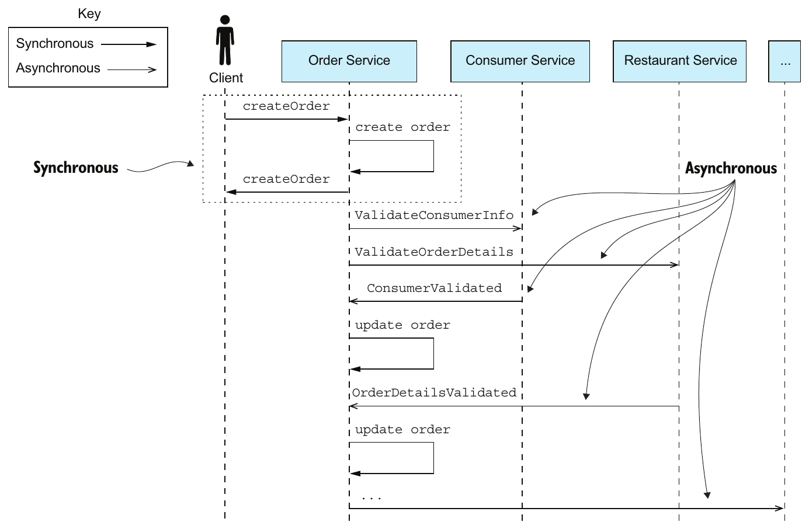

> **English:** Figure 3.18 Order Service creates an order without invoking any other service. It then asynchronously validates the newly created Order by exchanging messages with other services, including Consumer Service and Restaurant Service.
>
> **Türkçe:** Şekil 3.18 Order Service, başka hiçbir servisi çağırmadan sipariş oluşturur. Ardından Consumer Service ve Restaurant Service dâhil diğer servislerle mesaj alışverişi yaparak yeni Order’ı asenkron doğrular.

> **English:** 4 Order Service sends a ValidateOrderDetails message to Restaurant Service.
>
> **Türkçe:** 4. Order Service, Restaurant Service’e ValidateOrderDetails mesajı gönderir.

> **English:** 5 Consumer Service receives a ValidateConsumerInfo message, verifies the consumer can place an order, and sends a ConsumerValidated message to Order Service.
>
> **Türkçe:** 5. Consumer Service, ValidateConsumerInfo mesajını alır, tüketicinin sipariş verebildiğini doğrular ve Order Service’e ConsumerValidated mesajı gönderir.

> **English:** 6 Restaurant Service receives a ValidateOrderDetails message, verifies the menu items are valid and that the restaurant can deliver to the order’s delivery address, and sends an OrderDetailsValidated message to Order Service.
>
> **Türkçe:** 6. Restaurant Service, ValidateOrderDetails mesajını alır; menü öğelerinin geçerli olduğunu ve restoranın siparişin teslimat adresine hizmet verebildiğini doğrular. Ardından Order Service’e OrderDetailsValidated mesajı gönderir.

> **English:** 7 Order Service receives ConsumerValidated and OrderDetailsValidated and changes the state of the order to VALIDATED.
>
> **Türkçe:** 7. Order Service, ConsumerValidated ve OrderDetailsValidated mesajlarını alır ve siparişin durumunu VALIDATED olarak değiştirir.

> **English:** 8 …
>
> **Türkçe:** 8. …

> **English:** Order Service can receive the ConsumerValidated and OrderDetailsValidated messages in either order. It keeps track of which message it receives first by changing the state of the order. If it receives the ConsumerValidated first, it changes the state of the order to CONSUMER_VALIDATED, whereas if it receives the OrderDetailsValidated message first, it changes its state to ORDER_DETAILS_VALIDATED. Order Service changes the state of the Order to VALIDATED when it receives the other message.
>
> **Türkçe:** Order Service, ConsumerValidated ve OrderDetailsValidated mesajlarını herhangi bir sırada alabilir. Siparişin durumunu değiştirerek hangi mesajı önce aldığını takip eder. Önce ConsumerValidated gelirse durumu CONSUMER_VALIDATED yapar; önce OrderDetailsValidated gelirse ORDER_DETAILS_VALIDATED yapar. Diğer mesaj geldiğinde Order durumunu VALIDATED olarak değiştirir.

> **English:** After the Order has been validated, Order Service completes the rest of the order-creation process, discussed in the next chapter. What’s nice about this approach is that even if Consumer Service is down, for example, Order Service still creates orders and responds to its clients. Eventually, Consumer Service will come back up and process any queued messages, and orders will be validated.
>
> **Türkçe:** Order doğrulandıktan sonra Order Service, sonraki bölümde anlatılan sipariş oluşturma sürecinin kalanını tamamlar. Bu yaklaşımın güzel yanı, örneğin Consumer Service kapalı olsa bile Order Service’in sipariş oluşturmaya ve istemcilerine yanıt vermeye devam etmesidir. Sonunda Consumer Service yeniden çalışmaya başlayıp kuyruktaki mesajları işler ve siparişler doğrulanır.

> **English:** A drawback of a service responding before fully processing a request is that it makes the client more complex. For example, Order Service makes minimal guarantees about the state of a newly created order when it returns a response. It creates the order and returns immediately before validating the order and authorizing the consumer’s credit card. Consequently, in order for the client to know whether the order was successfully created, either it must periodically poll or Order Service must send it a notification message. As complex as it sounds, in many situations this is the preferred approach—especially because it also addresses the distributed transaction management issues I discuss in the next chapter. In chapters 4 and 5, for example, I describe how Order Service uses this approach.
>
> **Türkçe:** Servisin isteği tamamen işlemeden yanıt vermesinin dezavantajı, istemciyi daha karmaşık hâle getirmesidir. Örneğin Order Service, yanıt döndürürken yeni siparişin durumu hakkında sınırlı güvence verir. Siparişi doğrulamadan ve tüketicinin kredi kartına provizyon koymadan önce siparişi oluşturup hemen döner. Bu nedenle siparişin başarıyla oluşturulup oluşturulmadığını öğrenmek isteyen istemci ya düzenli sorgu yapmalı ya da Order Service’ten bildirim mesajı almalıdır. Karmaşık görünse de birçok durumda tercih edilen yaklaşım budur; özellikle sonraki bölümde tartışacağım dağıtık transaction yönetimi sorunlarını da ele aldığı için. Örneğin 4. ve 5. bölümlerde Order Service’in bu yaklaşımı nasıl kullandığını anlatıyorum.

## Summary — Özet

> **English:** The microservice architecture is a distributed architecture, so interprocess communication plays a key role.
>
> **Türkçe:** Mikroservis mimarisi dağıtık bir mimaridir; bu nedenle süreçler arası iletişim temel rol oynar.

> **English:** It’s essential to carefully manage the evolution of a service’s API. Backward-compatible changes are the easiest to make because they don’t impact clients. If you make a breaking change to a service’s API, it will typically need to support both the old and new versions until its clients have been upgraded.
>
> **Türkçe:** Servis API’sinin zaman içindeki değişimini dikkatle yönetmek gerekir. İstemcileri etkilemediği için geriye dönük uyumlu değişiklikleri yapmak en kolaydır. API’de uyumluluğu bozan değişiklik yaparsanız servis, istemciler yükseltilene kadar genellikle eski ve yeni sürümleri birlikte desteklemelidir.

> **English:** There are numerous IPC technologies, each with different trade-offs. One key design decision is to choose either a synchronous remote procedure invocation pattern or the asynchronous Messaging pattern. Synchronous remote procedure invocation-based protocols, such as REST, are the easiest to use. But services should ideally communicate using asynchronous messaging in order to increase availability.
>
> **Türkçe:** Her biri farklı ödünleşimler içeren çok sayıda IPC teknolojisi vardır. Temel tasarım kararlarından biri, senkron Remote procedure invocation ile asenkron Messaging örüntüsü arasında seçim yapmaktır. REST gibi senkron uzak yordam çağrısı protokolleri en kolay kullanılanlardır. Ancak kullanılabilirliği artırmak için servisler ideal olarak asenkron mesajlaşmayla iletişim kurmalıdır.

> **English:** In order to prevent failures from cascading through a system, a service client that uses a synchronous protocol must be designed to handle partial failures, which are when the invoked service is either down or exhibiting high latency. In particular, it must use timeouts when making requests, limit the number of outstanding requests, and use the Circuit breaker pattern to avoid making calls to a failing service.
>
> **Türkçe:** Arızaların sistem boyunca zincirleme yayılmasını önlemek için senkron protokol kullanan servis istemcisi, çağrılan servisin kapalı veya yüksek gecikmeli olduğu kısmi arızaları ele alacak biçimde tasarlanmalıdır. Özellikle isteklerde timeout kullanmalı, tamamlanmamış istek sayısını sınırlamalı ve arızalı servisi çağırmamak için Circuit breaker örüntüsünü kullanmalıdır.

> **English:** An architecture that uses synchronous protocols must include a service discovery mechanism in order for clients to determine the network location of a service instance. The simplest approach is to use the service discovery mechanism implemented by the deployment platform: the Server-side discovery and 3rd party registration patterns. But an alternative approach is to implement service discovery at the application level: the Client-side discovery and Self registration patterns. It’s more work, but it does handle the scenario where services are running on multiple deployment platforms.
>
> **Türkçe:** Senkron protokol kullanan mimari, istemcilerin servis instance’larının ağ konumunu belirleyebilmesi için servis keşfi mekanizması içermelidir. En basit yaklaşım, dağıtım platformunun gerçekleştirdiği Server-side discovery ve 3rd party registration örüntülerini kullanmaktır. Alternatif olarak Client-side discovery ve Self registration ile uygulama düzeyinde keşif gerçekleştirilebilir. Bu daha fazla çalışma gerektirir; ancak servislerin birden fazla dağıtım platformunda çalıştığı durumu ele alır.

> **English:** A good way to design a messaging-based architecture is to use the messages and channels model, which abstracts the details of the underlying messaging system. You can then map that design to a specific messaging infrastructure, which is typically message broker–based.
>
> **Türkçe:** Mesajlaşma tabanlı mimari tasarlamanın iyi yolu, alttaki mesajlaşma sisteminin ayrıntılarını soyutlayan mesajlar ve kanallar modelini kullanmaktır. Daha sonra tasarımı, genellikle message broker tabanlı belirli bir mesajlaşma altyapısına eşleyebilirsiniz.

> **English:** One key challenge when using messaging is atomically updating the database and publishing a message. A good solution is to use the Transactional outbox pattern and first write the message to the database as part of the database transaction. A separate process then retrieves the message from the database using either the Polling publisher pattern or the Transaction log tailing pattern and publishes it to the message broker.
>
> **Türkçe:** Mesajlaşmada temel güçlüklerden biri, veritabanını güncellemek ve mesajı yayınlamayı atomik gerçekleştirmektir. İyi çözüm, Transactional outbox örüntüsüyle mesajı önce veritabanı transaction’ının parçası olarak veritabanına yazmaktır. Ayrı süreç daha sonra Polling publisher veya Transaction log tailing örüntüsüyle mesajı veritabanından alır ve broker’a yayınlar.
