# Ünite 04 · Managing transactions with sagas — Transaction işlemlerini saga ile yönetme

**Amaç:** Transaction işlemlerini saga ile yönetme konusunu İngilizce–Türkçe karşılaştırmalı çalışmak; teknik açıklamaları özgün şekiller, tablolar ve kod örnekleriyle birlikte okumak.

**Kaynak:** Kullanıcının sağladığı *Microservices Patterns*, bölüm 4; `Microservices_Patterns_1_Bolumden_Itibaren.pdf`, kaynak PDF sayfaları **110–145**. Başlık ve metin sırası korunmuş, sayfa sonlarında bölünen paragraflar birleştirilmiştir. Şekiller, üzerlerindeki yazılar korunarak kaynak PDF'den alınmıştır.

**Okuma notu:** Teknoloji ve şirket örnekleri kitabın yazıldığı dönemin anlatımıdır. Kodlar kaynakta verilen bağlama bağlı örneklerdir; bağımsız Java 17 programları olarak sunulmaz. İngilizce kaynak ve Türkçe çeviri ardışık bloklardadır. Çeviri hazırlığında yerel bir çeviri modeli kullanılmış; teknik terimler ve metin aktarımı ayrıca kontrol edilmiştir.

**Dil çalışması:** [Ünite sözlüğü](vocabulary.md) · [Vocabulary PDF](vocabulary.pdf) · [Grammar notları](grammar_notes.md) · [Grammar PDF](grammar_notes.pdf). Kelime anlamları ve cümle yapılarının ayrıntıları bu iki eşlikçi kaynaktadır.

<!-- source-pages: 110 -->

<!-- source-record: u04_0000 -->

## This chapter covers — Bu bölümün kapsamı

<!-- source-record: u04_0001 -->

> **English:** • Why distributed transactions aren’t a good fit for modern applications
>
> **Türkçe:** • Dağıtık transaction işlemlerinin modern uygulamalara neden uygun olmadığı

<!-- source-record: u04_0002 -->

> **English:** • Using the Saga pattern to maintain data consistency in a microservice architecture
>
> **Türkçe:** • Mikroservis mimarisinde veri tutarlılığını korumak için Saga örüntüsünü kullanma

<!-- source-record: u04_0003 -->

> **English:** • Coordinating sagas using choreography and orchestration
>
> **Türkçe:** • Saga işlemlerini koreografi ve orkestrasyon ile koordine etme

<!-- source-record: u04_0004 -->

> **English:** • Using countermeasures to deal with the lack of isolation
>
> **Türkçe:** • Yalıtım eksikliğini gidermek için karşı önlemler kullanma

<!-- source-record: u04_0005 -->

> **English:** When Mary started investigating the microservice architecture, one of her biggest concerns was how to implement transactions that span multiple services. Transactions are an essential ingredient of every enterprise application. Without transactions it would be impossible to maintain data consistency.
>
> **Türkçe:** Mary mikroservis mimarisini araştırmaya başladığında en büyük kaygılarından biri, birden fazla servisi kapsayan transaction işlemlerinin nasıl uygulanacağıydı. Transaction işlemleri, her kurumsal uygulamanın temel bileşenidir. Bunlar olmadan veri tutarlılığını korumak mümkün olmazdı.

<!-- source-record: u04_0006 -->

> **English:** ACID (Atomicity, Consistency, Isolation, Durability) transactions greatly simplify the job of the developer by providing the illusion that each transaction has exclusive access to the data. In a microservice architecture, transactions that are within a single service can still use ACID transactions. The challenge, however, lies in implementing transactions for operations that update data owned by multiple services. For example, as described in chapter 2, the createOrder() operation spans numerous services, including Order Service, Kitchen Service, and Accounting Service. Operations such as these need a transaction management mechanism that works across services.
>
> **Türkçe:** ACID (Atomicity, Consistency, Isolation, Durability; atomiklik, tutarlılık, yalıtım ve kalıcılık) transaction işlemleri, her transaction veriye tek başına erişiyormuş gibi bir görünüm sağlayarak geliştiricinin işini büyük ölçüde kolaylaştırır. Mikroservis mimarisinde tek bir servis içinde kalan işlemler hâlâ ACID transaction kullanabilir. Asıl zorluk, birden fazla servisin sahip olduğu verileri güncelleyen operasyonlar için transaction uygulamaktır. Örneğin 2. bölümde açıklandığı gibi createOrder() operasyonu, Order Service, Kitchen Service ve Accounting Service dahil çok sayıda servisi kapsar. Bu tür operasyonlar, servisler arasında çalışan bir transaction yönetim mekanizması gerektirir.

<!-- source-pages: 111 -->

<!-- source-record: u04_0007 -->

> **English:** Mary discovered that, as mentioned in chapter 2, the traditional approach to distributed transaction management isn’t a good choice for modern applications. Instead of an ACID transactions, an operation that spans services must use what’s known as a saga, a message-driven sequence of local transactions, to maintain data consistency. One challenge with sagas is that they are ACD (Atomicity, Consistency, Durability). They lack the isolation feature of traditional ACID transactions. As a result, an application must use what are known as countermeasures, design techniques that prevent or reduce the impact of concurrency anomalies caused by the lack of isolation.
>
> **Türkçe:** Mary, 2. bölümde belirtildiği gibi, dağıtık transaction yönetimine yönelik geleneksel yaklaşımın modern uygulamalar için iyi bir seçim olmadığını gördü. Servisler arasında yürütülen bir operasyon, veri tutarlılığını korumak için ACID transaction yerine saga adı verilen, mesajlarla ilerleyen bir yerel transaction dizisi kullanmalıdır. Saga işlemlerindeki zorluklardan biri, bunların ACD (Atomicity, Consistency, Durability; atomiklik, tutarlılık, kalıcılık) özelliklerini taşımasıdır. Geleneksel ACID transaction işlemlerinin yalıtım özelliğine sahip değildirler. Bu nedenle uygulama, yalıtım eksikliğinin yol açtığı eşzamanlılık anomalilerini önleyen veya etkilerini azaltan karşı önlemler adı verilen tasarım tekniklerini kullanmalıdır.

<!-- source-record: u04_0008 -->

> **English:** In many ways, the biggest obstacle that Mary and the FTGO developers will face when adopting microservices is moving from a single database with ACID transactions to a multi-database architecture with ACD sagas. They’re used to the simplicity of the ACID transaction model. But in reality, even monolithic applications such as the FTGO application typically don’t use textbook ACID transactions. For example, many applications use a lower transaction isolation level in order to improve performance. Also, many important business processes, such as transferring money between accounts at different banks, are eventually consistent. Not even Starbucks uses two-phase commit (www.enterpriseintegrationpatterns.com/ramblings/18_starbucks.html).
>
> **Türkçe:** Mary ve FTGO geliştiricilerinin mikroservisleri benimserken karşılaşacağı en büyük engel, pek çok açıdan, ACID transaction kullanan tek bir veritabanından ACD saga işlemleri kullanan çok veritabanlı bir mimariye geçmektir. ACID transaction modelinin sadeliğine alışmışlardır. Oysa FTGO gibi monolitik uygulamalar bile genellikle ders kitaplarında anlatıldığı biçimiyle tam ACID transaction kullanmaz. Örneğin birçok uygulama performansı artırmak için daha düşük bir transaction yalıtım düzeyi kullanır. Ayrıca farklı bankalardaki hesaplar arasında para aktarmak gibi birçok önemli iş süreci nihai tutarlılık gösterir. Starbucks bile two-phase commit kullanmaz (www.enterpriseintegrationpatterns.com/ramblings/18_starbucks.html).

<!-- source-record: u04_0009 -->

> **English:** I begin this chapter by looking at the challenges of transaction management in the microservice architecture and explain why the traditional approach to distributed transaction management isn’t an option. Next I explain how to maintain data consistency using sagas. After that I look at the two different ways of coordinating sagas: choreography, where participants exchange events without a centralized point of control, and orchestration, where a centralized controller tells the saga participants what operation to perform. I discuss how to use countermeasures to prevent or reduce the impact of concurrency anomalies caused by the lack of isolation between sagas. Finally, I describe the implementation of an example saga.
>
> **Türkçe:** Bu bölüme mikroservis mimarisinde transaction yönetiminin zorluklarını inceleyerek ve dağıtık transaction yönetimine yönelik geleneksel yaklaşımın neden bir seçenek olmadığını açıklayarak başlıyorum. Ardından saga işlemleriyle veri tutarlılığının nasıl korunduğunu anlatıyorum. Daha sonra saga işlemlerini koordine etmenin iki yolunu ele alıyorum: katılımcıların merkezi bir kontrol noktası olmadan olay alışverişinde bulunduğu koreografi ve merkezi bir denetleyicinin saga katılımcılarına hangi operasyonu yürüteceklerini söylediği orkestrasyon. Saga işlemleri arasında yalıtım bulunmamasından kaynaklanan eşzamanlılık anomalilerini önlemek veya etkilerini azaltmak için karşı önlemlerin nasıl kullanılacağını tartışıyorum. Son olarak örnek bir saga uygulamasını açıklıyorum.

<!-- source-record: u04_0010 -->

> **English:** Let’s start by taking a look at the challenge of managing transactions in a microservice architecture.
>
> **Türkçe:** Mikroservis mimarisinde işlemleri yönetmenin zorluklarına bir göz atalım.

<!-- source-record: u04_0011 -->

## 4.1 Transaction management in a microservice architecture — Mikroservis mimarisinde transaction (işlem) yönetimi

<!-- source-record: u04_0012 -->

> **English:** Almost every request handled by an enterprise application is executed within a database transaction. Enterprise application developers use frameworks and libraries that simplify transaction management. Some frameworks and libraries provide a programmatic API for explicitly beginning, committing, and rolling back transactions. Other frameworks, such as the Spring framework, provide a declarative mechanism. Spring provides an @Transactional annotation that arranges for method invocations to be automatically executed within a transaction. As a result, it’s straightforward to write transactional business logic.
>
> **Türkçe:** Kurumsal bir uygulamanın işlediği neredeyse her istek, bir veritabanı transaction işlemi içinde yürütülür. Kurumsal uygulama geliştiricileri, transaction yönetimini kolaylaştıran framework ve kütüphaneler kullanır. Bazıları transaction işlemlerini açıkça başlatmak, commit etmek ve geri almak için programatik bir API sunar. Spring gibi diğer framework’ler bildirimsel bir mekanizma sağlar. Spring, metot çağrılarının otomatik olarak bir transaction içinde yürütülmesini sağlayan @Transactional annotation’ını sunar. Böylece transaction kullanan iş mantığını yazmak kolaylaşır.

<!-- source-pages: 112 -->

<!-- source-record: u04_0013 -->

> **English:** Or, to be more precise, transaction management is straightforward in a monolithic application that accesses a single database. Transaction management is more challenging in a complex monolithic application that uses multiple databases and message brokers. And in a microservice architecture, transactions span multiple services, each of which has its own database. In this situation, the application must use a more elaborate mechanism to manage transactions. As you’ll learn, the traditional approach of using distributed transactions isn’t a viable option for modern applications. Instead, a microservices-based application must use sagas.
>
> **Türkçe:** Daha doğrusu, tek bir veritabanına erişen monolitik bir uygulamada transaction yönetimi kolaydır. Birden fazla veritabanı ve mesaj aracısı kullanan karmaşık bir monolitik uygulamada ise daha zordur. Mikroservis mimarisinde transaction işlemleri, her biri kendi veritabanına sahip birden fazla servisi kapsar. Böyle bir durumda uygulama, transaction yönetimi için daha gelişmiş bir mekanizma kullanmalıdır. Göreceğiniz gibi, dağıtık transaction kullanan geleneksel yaklaşım modern uygulamalar için uygulanabilir bir seçenek değildir. Bunun yerine mikroservis tabanlı uygulamalar saga kullanmalıdır.

<!-- source-record: u04_0014 -->

> **English:** Before I explain sagas, let’s first look at why transaction management is challenging in a microservice architecture.
>
> **Türkçe:** Saga işlemlerini açıklamadan önce, mikroservis mimarisinde transaction yönetiminin neden zor olduğunu inceleyelim.

<!-- source-record: u04_0015 -->

### 4.1.1 The need for distributed transactions in a microservice architecture — Mikroservis mimarisinde dağıtık işlemlere duyulan ihtiyaç

<!-- source-record: u04_0016 -->

> **English:** Imagine that you’re the FTGO developer responsible for implementing the createOrder() system operation. As described in chapter 2, this operation must verify that the consumer can place an order, verify the order details, authorize the consumer’s credit card, and create an Order in the database. It’s relatively straightforward to implement this operation in the monolithic FTGO application. All the data required to validate the order is readily accessible. What’s more, you can use an ACID transaction to ensure data consistency. You might use Spring’s @Transactional annotation on the createOrder() service method.
>
> **Türkçe:** FTGO uygulamasında createOrder() sistem operasyonunu gerçekleştirmekten sorumlu geliştirici olduğunuzu düşünün. 2. bölümde açıklandığı gibi bu operasyon; müşterinin sipariş verebildiğini ve sipariş ayrıntılarını doğrulamalı, müşterinin kredi kartından provizyon almalı ve veritabanında bir Order oluşturmalıdır. Monolitik FTGO uygulamasında bu operasyonu gerçekleştirmek görece kolaydır. Siparişi doğrulamak için gereken bütün verilere doğrudan erişilebilir. Ayrıca veri tutarlılığını sağlamak için ACID transaction kullanabilirsiniz. createOrder() servis metoduna Spring’in @Transactional annotation’ını ekleyebilirsiniz.

<!-- source-record: u04_0017 -->

> **English:** In contrast, implementing the same operation in a microservice architecture is much more complicated. As figure 4.1 shows, the needed data is scattered around multiple services. The createOrder() operation accesses data in numerous services. It reads data from Consumer Service and updates data in Order Service, Kitchen Service, and Accounting Service.
>
> **Türkçe:** Buna karşılık, aynı operasyonu mikroservis mimarisinde gerçekleştirmek çok daha karmaşıktır. Şekil 4.1’de görüldüğü gibi gereken veriler birden fazla servise dağılmıştır. createOrder() operasyonu çok sayıda servisteki verilere erişir. Consumer Service’den veri okur; Order Service, Kitchen Service ve Accounting Service’deki verileri günceller.

<!-- source-record: u04_0018 -->

> **English:** Because each service has its own database, you need to use a mechanism to maintain data consistency across those databases.
>
> **Türkçe:** Her servisin kendi veritabanı olduğu için, bu veritabanlarında veri tutarlılığını korumak için bir mekanizma kullanmanız gerekir.

<!-- source-record: u04_0019 -->

### 4.1.2 The trouble with distributed transactions — Dağıtık işlemlerin sorunu

<!-- source-record: u04_0020 -->

> **English:** The traditional approach to maintaining data consistency across multiple services, databases, or message brokers is to use distributed transactions. The de facto standard for distributed transaction management is the X/Open Distributed Transaction Processing (DTP) Model (X/Open XA—see https://en.wikipedia.org/wiki/X/Open_XA). XA uses two-phase commit (2PC) to ensure that all participants in a transaction either commit or rollback. An XA-compliant technology stack consists of XA-compliant databases and message brokers, database drivers, and messaging APIs, and an interprocess communication mechanism that propagates the XA global transaction ID. Most SQL databases are XA compliant, as are some message brokers. Java EE applications can, for example, use JTA to perform distributed transactions.
>
> **Türkçe:** Birden fazla servis, veritabanı veya mesaj aracısı arasında veri tutarlılığını korumaya yönelik geleneksel yaklaşım, dağıtık transaction kullanmaktır. Dağıtık transaction yönetiminin fiilî standardı X/Open Distributed Transaction Processing (DTP) Model’dir (X/Open XA; bkz. https://en.wikipedia.org/wiki/X/Open_XA). XA, bir transaction içindeki bütün katılımcıların ya commit ya da rollback yapmasını sağlamak için two-phase commit (2PC) kullanır. XA uyumlu bir teknoloji yığını; XA uyumlu veritabanları ve mesaj aracıları, veritabanı sürücüleri, mesajlaşma API’leri ve XA küresel transaction kimliğini aktaran bir süreçler arası iletişim mekanizmasından oluşur. Çoğu SQL veritabanı ve bazı mesaj aracıları XA uyumludur. Örneğin Java EE uygulamaları dağıtık transaction yürütmek için JTA kullanabilir.

<!-- source-pages: 113 -->

<!-- source-record: u04_0021 -->

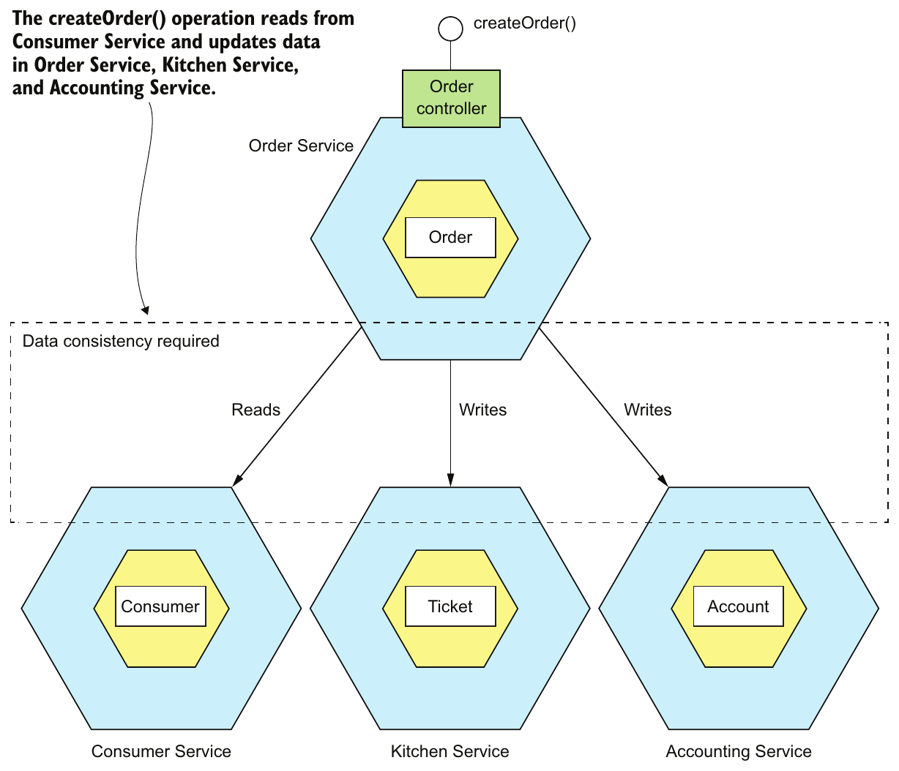

> **English:** Figure 4.1 The createOrder() operation updates data in several services. It must use a mechanism to maintain data consistency across those services.
>
> **Türkçe:** Şekil 4.1 createOrder() operasyonu birden fazla servisteki verileri günceller. Bu servisler arasında veri tutarlılığını koruyan bir mekanizma kullanmalıdır.

<!-- source-record: u04_0022 -->

> **English:** As simple as this sounds, there are a variety of problems with distributed transactions. One problem is that many modern technologies, including NoSQL databases such as MongoDB and Cassandra, don’t support them. Also, distributed transactions aren’t supported by modern message brokers such as RabbitMQ and Apache Kafka. As a result, if you insist on using distributed transactions, you can’t use many modern technologies.
>
> **Türkçe:** Kulağa basit gelse de dağıtık transaction işlemleri çeşitli sorunlar taşır. Bunlardan biri, MongoDB ve Cassandra gibi NoSQL veritabanları dahil birçok modern teknolojinin bunları desteklememesidir. RabbitMQ ve Apache Kafka gibi modern mesaj aracıları da dağıtık transaction desteklemez. Dolayısıyla dağıtık transaction kullanmakta ısrar ederseniz birçok modern teknolojiden yararlanamazsınız.

<!-- source-record: u04_0023 -->

> **English:** Another problem with distributed transactions is that they are a form of synchronous IPC, which reduces availability. In order for a distributed transaction to commit, all the participating services must be available. As described in chapter 3, the availability is the product of the availability of all of the participants in the transaction. If a distributed transaction involves two services that are 99.5% available, then the overall availability is 99%, which is significantly less. Each additional service involved in a distributed transaction further reduces availability. There is even Eric Brewer’s CAP theorem, which states that a system can only have two of the following three properties: consistency, availability, and partition tolerance (https://en.wikipedia.org/wiki/CAP _theorem). Today, architects prefer to have a system that’s available rather than one that’s consistent.
>
> **Türkçe:** Dağıtık transaction işlemlerinin başka bir sorunu, kullanılabilirliği azaltan eşzamanlı bir IPC biçimi olmalarıdır. Dağıtık bir transaction işleminin commit edilebilmesi için bütün katılımcı servisler erişilebilir olmalıdır. 3. bölümde açıklandığı gibi kullanılabilirlik, transaction içindeki bütün katılımcıların kullanılabilirlik oranlarının çarpımıdır. Dağıtık bir transaction, her biri %99,5 kullanılabilirliğe sahip iki servis içeriyorsa toplam kullanılabilirlik %99 olur; bu belirgin bir azalmadır. Eklenen her servis kullanılabilirliği daha da düşürür. Eric Brewer’ın CAP teoremi de bir sistemin tutarlılık, kullanılabilirlik ve ağ bölünmesine dayanıklılık özelliklerinin üçünü birden sağlayamayacağını belirtir (https://en.wikipedia.org/wiki/CAP_theorem). Günümüzde mimarlar, tutarlılık yerine kullanılabilirliği önceleyen bir sistemi tercih eder.

<!-- source-pages: 114 -->

<!-- source-record: u04_0024 -->

> **English:** On the surface, distributed transactions are appealing. From a developer’s perspective, they have the same programming model as local transactions. But because of the problems mentioned so far, distributed transactions aren’t a viable technology for modern applications. Chapter 3 described how to send messages as part of a database transaction without using distributed transactions. To solve the more complex problem of maintaining data consistency in a microservice architecture, an application must use a different mechanism that builds on the concept of loosely coupled, asynchronous services. This is where sagas come in.
>
> **Türkçe:** Dağıtık transaction işlemleri ilk bakışta çekicidir. Geliştirici açısından yerel transaction işlemleriyle aynı programlama modelini sunarlar. Ancak şimdiye kadar ele alınan sorunlar nedeniyle modern uygulamalar için uygulanabilir bir teknoloji değildirler. 3. bölümde dağıtık transaction kullanmadan, veritabanı transaction işleminin bir parçası olarak mesaj göndermeyi gördük. Mikroservis mimarisinde veri tutarlılığını korumak gibi daha karmaşık bir sorunu çözmek için uygulama, gevşek bağlı ve eşzamansız servisler kavramına dayanan farklı bir mekanizma kullanmalıdır. Saga işlemleri burada devreye girer.

<!-- source-record: u04_0025 -->

### 4.1.3 Using the Saga pattern to maintain data consistency — Veri tutarlılığını korumak için Saga örüntüsünü kullanmak

<!-- source-record: u04_0026 -->

> **English:** Sagas are mechanisms to maintain data consistency in a microservice architecture without having to use distributed transactions. You define a saga for each system command that needs to update data in multiple services. A saga is a sequence of local transactions. Each local transaction updates data within a single service using the familiar ACID transaction frameworks and libraries mentioned earlier.
>
> **Türkçe:** Saga, dağıtık transaction kullanmadan mikroservis mimarisinde veri tutarlılığını koruyan bir mekanizmadır. Birden fazla servisteki verileri güncellemesi gereken her sistem komutu için bir saga tanımlarsınız. Saga, yerel transaction işlemlerinden oluşan bir dizidir. Her yerel transaction, daha önce söz edilen tanıdık ACID transaction framework ve kütüphanelerini kullanarak tek bir servis içindeki verileri günceller.

<!-- source-record: u04_0027 -->

### Pattern: Saga — Şekil: Saga

<!-- source-record: u04_0028 -->

> **English:** Maintain data consistency across services using a sequence of local transactions that are coordinated using asynchronous messaging. See http://microservices.io/patterns/data/saga.html.
>
> **Türkçe:** Eşzamansız mesajlaşma ile koordine edilen bir yerel transaction dizisi kullanarak servisler arasında veri tutarlılığını koruyun. Bkz. http://microservices.io/patterns/data/saga.html.

<!-- source-record: u04_0029 -->

> **English:** The system operation initiates the first step of the saga. The completion of a local transaction triggers the execution of the next local transaction. Later, in section 4.2, you’ll see how coordination of the steps is implemented using asynchronous messaging. An important benefit of asynchronous messaging is that it ensures that all the steps of a saga are executed, even if one or more of the saga’s participants is temporarily unavailable.
>
> **Türkçe:** Sistem operasyonu, saga işleminin ilk adımını başlatır. Bir yerel transaction işleminin tamamlanması, sonraki yerel transaction işleminin yürütülmesini tetikler. Daha sonra 4.2 bölümünde, adımların eşzamansız mesajlaşma ile nasıl koordine edildiğini göreceksiniz. Eşzamansız mesajlaşmanın önemli bir yararı, saga katılımcılarından biri veya birkaçı geçici olarak erişilemez olsa bile saga işleminin bütün adımlarının yürütülmesini sağlamasıdır.

<!-- source-record: u04_0030 -->

> **English:** Sagas differ from ACID transactions in a couple of important ways. As I describe in detail in section 4.3, they lack the isolation property of ACID transactions. Also, because each local transaction commits its changes, a saga must be rolled back using compensating transactions. I talk more about compensating transactions later in this section. Let’s take a look at an example saga.
>
> **Türkçe:** Saga işlemleri ACID transaction işlemlerinden birkaç önemli yönden ayrılır. 4.3 bölümünde ayrıntılı olarak açıklayacağım gibi, ACID transaction işlemlerinin yalıtım özelliğine sahip değildirler. Ayrıca her yerel transaction kendi değişikliklerini commit ettiği için, saga işlemini geri almak üzere telafi işlemleri kullanılmalıdır. Bu bölümün ilerleyen kısmında telafi işlemlerini daha ayrıntılı ele alacağım. Şimdi örnek bir saga inceleyelim.

<!-- source-record: u04_0031 -->

#### AN EXAMPLE SAGA: THE CREATE ORDER SAGA — Örnek bir saga: Create Order Saga

<!-- source-record: u04_0032 -->

> **English:** The example saga used throughout this chapter is the Create Order Saga, which is shown in figure 4.2. The Order Service implements the createOrder() operation using this saga. The saga’s first local transaction is initiated by the external request to create an order. The other five local transactions are each triggered by completion of the previous one.
>
> **Türkçe:** Bu bölüm boyunca kullanılan örnek, Şekil 4.2’de gösterilen Create Order Saga’dır. Order Service, createOrder() operasyonunu bu saga ile gerçekleştirir. Saga işleminin ilk yerel transaction adımını, dışarıdan gelen sipariş oluşturma isteği başlatır. Diğer beş yerel transaction adımının her biri, öncekinin tamamlanmasıyla tetiklenir.

<!-- source-pages: 115 -->

<!-- source-record: u04_0033 -->

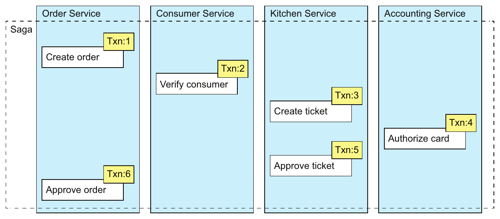

> **English:** Figure 4.2 Creating an Order using a saga. The createOrder() operation is implemented by a saga that consists of local transactions in several services.
>
> **Türkçe:** Şekil 4.2 Saga kullanarak bir Order oluşturma. createOrder() operasyonu, çeşitli servislerdeki yerel transaction işlemlerinden oluşan bir saga ile gerçekleştirilir.

<!-- source-record: u04_0034 -->

> **English:** This saga consists of the following local transactions:
>
> **Türkçe:** Bu saga aşağıdaki yerel transaction işlemlerinden oluşur:

<!-- source-record: u04_0035 -->

> **English:** 1 Order Service—Create an Order in an APPROVAL_PENDING state.
>
> **Türkçe:** 1 Order Service — APPROVAL_PENDING durumunda bir Order oluşturur.

<!-- source-record: u04_0036 -->

> **English:** 2 Consumer Service—Verify that the consumer can place an order.
>
> **Türkçe:** 2 Consumer Service — Müşterinin sipariş verebildiğini doğrular.

<!-- source-record: u04_0037 -->

> **English:** 3 Kitchen Service—Validate order details and create a Ticket in the CREATE_PENDING.
>
> **Türkçe:** 3 Kitchen Service — Sipariş ayrıntılarını doğrular ve CREATE_PENDING durumunda bir Ticket oluşturur.

<!-- source-record: u04_0038 -->

> **English:** 4 Accounting Service—Authorize consumer’s credit card.
>
> **Türkçe:** 4 Accounting Service — Müşterinin kredi kartından provizyon alır.

<!-- source-record: u04_0039 -->

> **English:** 5 Kitchen Service—Change the state of the Ticket to AWAITING_ACCEPTANCE.
>
> **Türkçe:** 5 Kitchen Service — Ticket durumunu AWAITING_ACCEPTANCE olarak değiştirir.

<!-- source-record: u04_0040 -->

> **English:** 6 Order Service—Change the state of the Order to APPROVED.
>
> **Türkçe:** 6 Order Service — Order durumunu APPROVED olarak değiştirir.

<!-- source-record: u04_0041 -->

> **English:** Later, in section 4.2, I describe how the services that participate in a saga communicate using asynchronous messaging. A service publishes a message when a local transaction completes. This message then triggers the next step in the saga. Not only does using messaging ensure the saga participants are loosely coupled, it also guarantees that a saga completes. That’s because if the recipient of a message is temporarily unavailable, the message broker buffers the message until it can be delivered.
>
> **Türkçe:** Daha sonra 4.2 bölümünde, saga katılımcısı servislerin eşzamansız mesajlaşma ile nasıl iletişim kurduğunu açıklayacağım. Bir yerel transaction tamamlandığında servis bir mesaj yayımlar. Bu mesaj, saga işleminin sonraki adımını tetikler. Mesajlaşma, saga katılımcılarının gevşek bağlı olmasını sağlamakla kalmaz; saga işleminin tamamlanmasını da güvence altına alır. Çünkü mesaj alıcısı geçici olarak erişilemiyorsa mesaj aracısı, mesajı teslim edilebilene kadar saklar.

<!-- source-record: u04_0042 -->

> **English:** On the surface, sagas seem straightforward, but there are a few challenges to using them. One challenge is the lack of isolation between sagas. Section 4.3 describes how to handle this problem. Another challenge is rolling back changes when an error occurs. Let’s take a look at how to do that.
>
> **Türkçe:** Saga işlemleri ilk bakışta basit görünse de kullanımlarında bazı zorluklar vardır. Bunlardan biri, saga işlemleri arasında yalıtım bulunmamasıdır. 4.3 bölümünde bu sorunla nasıl başa çıkılacağı açıklanır. Başka bir zorluk da hata oluştuğunda değişiklikleri geri almaktır. Bunun nasıl yapıldığını inceleyelim.

<!-- source-record: u04_0043 -->

#### SAGAS USE COMPENSATING TRANSACTIONS TO ROLL BACK CHANGES — Saga'lar değişiklikleri geri almak için telafi işlemleri kullanır

<!-- source-record: u04_0044 -->

> **English:** A great feature of traditional ACID transactions is that the business logic can easily roll back a transaction if it detects the violation of a business rule. It executes a ROLLBACK statement, and the database undoes all the changes made so far. Unfortunately, sagas can’t be automatically rolled back, because each step commits its changes to the local database. This means, for example, that if the authorization of the credit card fails in the fourth step of the Create Order Saga, the FTGO application must explicitly undo the changes made by the first three steps. You must write what are known as compensating transactions.
>
> **Türkçe:** Geleneksel ACID transaction işlemlerinin önemli bir özelliği, iş mantığının bir iş kuralı ihlali saptadığında transaction işlemini kolayca geri alabilmesidir. Bir ROLLBACK ifadesi yürütür ve veritabanı o ana kadar yapılan bütün değişiklikleri geri alır. Ne yazık ki saga işlemleri otomatik olarak geri alınamaz; çünkü her adım, değişikliklerini yerel veritabanına commit eder. Örneğin Create Order Saga’nın dördüncü adımında kredi kartından provizyon alınamazsa FTGO uygulaması, ilk üç adımın yaptığı değişiklikleri açıkça geri almalıdır. Bunun için compensating transactions adı verilen telafi işlemlerini yazmanız gerekir.

<!-- source-pages: 116 -->

<!-- source-record: u04_0045 -->

> **English:** Suppose that the (n + 1)th transaction of a saga fails. The effects of the previous n transactions must be undone. Conceptually, each of those steps, T_i, has a corresponding compensating transaction, C_i, which undoes the effects of the T_i. To undo the effects of those first n steps, the saga must execute each C_i in reverse order. The sequence of steps is T_1 … T_n, C_n … C_1, as shown in figure 4.3. In this example, T_(n+1) fails, which requires steps T_1 … T_n to be undone.
>
> **Türkçe:** Bir saga işleminin (n + 1). transaction adımının başarısız olduğunu varsayalım. Önceki n transaction işleminin etkileri geri alınmalıdır. Kavramsal olarak, T_i adımlarının her birine karşılık gelen ve o adımın etkilerini geri alan bir C_i telafi işlemi vardır. İlk n adımın etkilerini geri almak için saga, C_i işlemlerini ters sırada yürütmelidir. Şekil 4.3’te gösterildiği gibi adımların sırası T_1 … T_n, C_n … C_1 olur. Bu örnekte T_(n+1) başarısız olduğu için T_1 … T_n adımlarının geri alınması gerekir.

<!-- source-record: u04_0046 -->

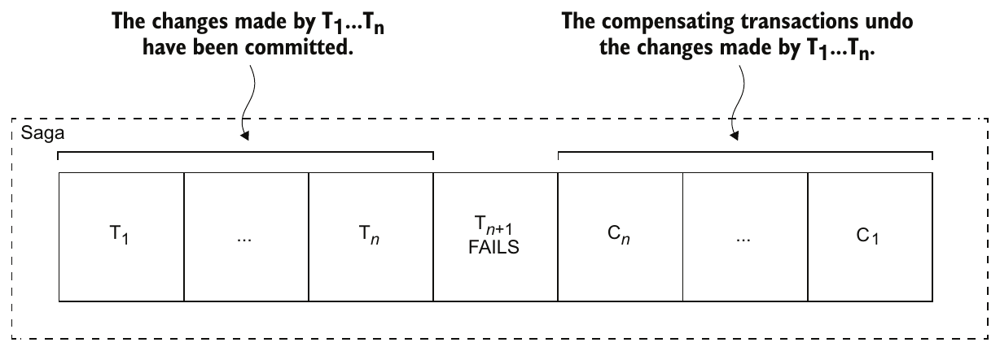

> **English:** Figure 4.3 When a step of a saga fails because of a business rule violation, the saga must explicitly undo the updates made by previous steps by executing compensating transactions.
>
> **Türkçe:** Şekil 4.3 Bir saga adımı, iş kuralı ihlali nedeniyle başarısız olduğunda saga, telafi işlemlerini yürüterek önceki adımların yaptığı güncellemeleri açıkça geri almalıdır.

<!-- source-record: u04_0047 -->

> **English:** The saga executes the compensation transactions in reverse order of the forward transactions: C_n … C_1. The mechanics of sequencing the C_i transactions aren’t any different than sequencing the T_i transactions. The completion of C_i must trigger the execution of C_(i−1).
>
> **Türkçe:** Saga, telafi işlemlerini ileri yöndeki transaction işlemlerinin ters sırasında yürütür: C_n … C_1. C_i işlemlerini sıraya koyma mekanizması, T_i işlemlerini sıraya koymaktan farklı değildir. C_i işleminin tamamlanması, C_(i−1) işleminin yürütülmesini tetiklemelidir.

<!-- source-record: u04_0048 -->

> **English:** Consider, for example, the Create Order Saga. This saga can fail for a variety of reasons:
>
> **Türkçe:** Örneğin Create Order Saga’yı ele alalım. Bu saga çeşitli nedenlerle başarısız olabilir:

<!-- source-record: u04_0049 -->

> **English:** • The consumer information is invalid or the consumer isn’t allowed to create orders.
>
> **Türkçe:** • Müşteri bilgileri geçersizdir veya müşterinin sipariş oluşturmasına izin verilmemektedir.

<!-- source-record: u04_0050 -->

> **English:** • The restaurant information is invalid or the restaurant is unable to accept orders.
>
> **Türkçe:** • Restoran bilgileri geçersizdir veya restoran sipariş kabul edememektedir.

<!-- source-record: u04_0051 -->

> **English:** • The authorization of the consumer’s credit card fails.
>
> **Türkçe:** • Müşterinin kredi kartından provizyon alınamaz.

<!-- source-record: u04_0052 -->

> **English:** If a local transaction fails, the saga’s coordination mechanism must execute compensating transactions that reject the Order and possibly the Ticket. Table 4.1 shows the compensating transactions for each step of the Create Order Saga. It’s important to note that not all steps need compensating transactions. Read-only steps, such as verifyConsumerDetails(), don’t need compensating transactions. Nor do steps such as authorizeCreditCard() that are followed by steps that always succeed.
>
> **Türkçe:** Bir yerel transaction başarısız olursa saga koordinasyon mekanizması, Order ve gerekirse Ticket nesnesini reddeden telafi işlemlerini yürütmelidir. Tablo 4.1, Create Order Saga’nın her adımına karşılık gelen telafi işlemlerini gösterir. Her adımın telafi işlemi gerektirmediğine dikkat edin. verifyConsumerDetails() gibi yalnızca okuma yapan adımlar telafi işlemi gerektirmez. Ardından her zaman başarılı olan adımların geldiği authorizeCreditCard() gibi adımlar da telafi işlemi gerektirmez.

<!-- source-record: u04_0053 -->

> **English:** Section 4.3 discusses how the first three steps of the Create Order Saga are termed compensatable transactions because they’re followed by steps that can fail, how the fourth step is termed the saga’s pivot transaction because it’s followed by steps that never fail, and how the last two steps are termed retriable transactions because they always succeed.
>
> **Türkçe:** 4.3 bölümünde Create Order Saga’nın ilk üç adımının, ardından başarısız olabilecek adımlar geldiği için compensatable transactions (telafi edilebilir işlemler) olarak adlandırıldığı açıklanır. Dördüncü adım, ardından hiçbir zaman başarısız olmayan adımlar geldiğinden saga işleminin pivot transaction (dönüm noktası işlemi) adımıdır. Son iki adım ise her zaman başarıya ulaştığı için retriable transactions (yeniden denenebilir işlemler) olarak adlandırılır.

<!-- source-pages: 117 -->

<!-- source-record: u04_0054 -->

> **English:** Table 4.1 The compensating transactions for the Create Order Saga
>
> **Türkçe:** Tablo 4.1 Create Order Saga için telafi işlemleri

| **EN:** Step<br/>**TR:** Adım | **EN:** Service<br/>**TR:** servis | **EN:** Transaction<br/>**TR:** İşlem | **EN:** Compensating transaction<br/>**TR:** telafi işlemi |
| --- | --- | --- | --- |
| **EN:** 1<br/>**TR:** 1 | **EN:** Order Service<br/>**TR:** Order Service | **EN:** createOrder()<br/>**TR:** createOrder() | **EN:** rejectOrder()<br/>**TR:** rejectOrder() |
| **EN:** 2<br/>**TR:** 2 | **EN:** Consumer Service<br/>**TR:** Consumer Service | **EN:** verifyConsumerDetails()<br/>**TR:** verifyConsumerDetails() | **EN:** —<br/>**TR:** - Evet . |
| **EN:** 3<br/>**TR:** 3 | **EN:** Kitchen Service<br/>**TR:** Kitchen Service | **EN:** createTicket()<br/>**TR:** createTicket() | **EN:** rejectTicket()<br/>**TR:** rejectTicket() |
| **EN:** 4<br/>**TR:** 4 | **EN:** Accounting Service<br/>**TR:** Accounting Service | **EN:** authorizeCreditCard()<br/>**TR:** authorizeCreditCard() | **EN:** —<br/>**TR:** - Evet . |
| **EN:** 5<br/>**TR:** 5 | **EN:** Kitchen Service<br/>**TR:** Kitchen Service | **EN:** approveTicket()<br/>**TR:** approveTicket() | **EN:** —<br/>**TR:** - Evet . |
| **EN:** 6<br/>**TR:** 6 | **EN:** Order Service<br/>**TR:** Order Service | **EN:** approveOrder()<br/>**TR:** approveOrder() | **EN:** —<br/>**TR:** - Evet . |

<!-- source-record: u04_0055 -->

> **English:** To see how compensating transactions are used, imagine a scenario where the authorization of the consumer’s credit card fails. In this scenario, the saga executes the following local transactions:
>
> **Türkçe:** Telafi işlemlerinin nasıl kullanıldığını görmek için müşterinin kredi kartından provizyon alınamadığı bir senaryo düşünün. Bu senaryoda saga aşağıdaki yerel transaction işlemlerini yürütür:

<!-- source-record: u04_0056 -->

> **English:** 1 Order Service—Create an Order in an APPROVAL_PENDING state.
>
> **Türkçe:** 1 Order Service — APPROVAL_PENDING durumunda bir Order oluşturur.

<!-- source-record: u04_0057 -->

> **English:** 2 Consumer Service—Verify that the consumer can place an order.
>
> **Türkçe:** 2 Consumer Service — Müşterinin sipariş verebildiğini doğrular.

<!-- source-record: u04_0058 -->

> **English:** 3 Kitchen Service—Validate order details and create a Ticket in the CREATE_PENDING state.
>
> **Türkçe:** 3 Kitchen Service — Sipariş ayrıntılarını doğrular ve CREATE_PENDING durumunda bir Ticket oluşturur.

<!-- source-record: u04_0059 -->

> **English:** 4 Accounting Service—Authorize consumer’s credit card, which fails.
>
> **Türkçe:** 4 Accounting Service — Müşterinin kredi kartından provizyon almaya çalışır; bu işlem başarısız olur.

<!-- source-record: u04_0060 -->

> **English:** 5 Kitchen Service—Change the state of the Ticket to CREATE_REJECTED.
>
> **Türkçe:** 5 Kitchen Service — Ticket durumunu CREATE_REJECTED olarak değiştirir.

<!-- source-record: u04_0061 -->

> **English:** 6 Order Service—Change the state of the Order to REJECTED.
>
> **Türkçe:** 6 Order Service — Order durumunu REJECTED olarak değiştirir.

<!-- source-record: u04_0062 -->

> **English:** The fifth and sixth steps are compensating transactions that undo the updates made by Kitchen Service and Order Service, respectively. A saga’s coordination logic is responsible for sequencing the execution of forward and compensating transactions. Let’s look at how that works.
>
> **Türkçe:** Beşinci ve altıncı adımlar, sırasıyla Kitchen Service ve Order Service tarafından yapılan güncellemeleri geri alan telafi işlemleridir. Saga koordinasyon mantığı, ileri yöndeki işlemlerin ve telafi işlemlerinin yürütülme sırasını düzenlemekten sorumludur. Bunun nasıl çalıştığını inceleyelim.

<!-- source-record: u04_0063 -->

## 4.2 Coordinating sagas — Saga'ları koordine etmek

<!-- source-record: u04_0064 -->

> **English:** A saga’s implementation consists of logic that coordinates the steps of the saga. When a saga is initiated by system command, the coordination logic must select and tell the first saga participant to execute a local transaction. Once that transaction completes, the saga’s sequencing coordination selects and invokes the next saga participant. This process continues until the saga has executed all the steps. If any local transaction fails, the saga must execute the compensating transactions in reverse order. There are a couple of different ways to structure a saga’s coordination logic:
>
> **Türkçe:** Bir saga uygulaması, saga adımlarını koordine eden mantığı içerir. Saga bir sistem komutuyla başlatıldığında koordinasyon mantığı, ilk saga katılımcısını seçmeli ve ona bir yerel transaction yürütmesini söylemelidir. Bu transaction tamamlandığında saga koordinasyon mekanizması, sıradaki katılımcıyı seçip çağırır. Süreç, saga bütün adımlarını yürütene kadar devam eder. Herhangi bir yerel transaction başarısız olursa saga, telafi işlemlerini ters sırada yürütmelidir. Saga koordinasyon mantığını yapılandırmanın iki yolu vardır:

<!-- source-record: u04_0065 -->

> **English:** • Choreography—Distribute the decision making and sequencing among the saga participants. They primarily communicate by exchanging events.
>
> **Türkçe:** • Choreography (koreografi) — Karar verme ve sıralama sorumluluğu saga katılımcıları arasında dağıtılır. Katılımcılar, ağırlıklı olarak olay alışverişiyle iletişim kurar.

<!-- source-pages: 118 -->

<!-- source-record: u04_0066 -->

> **English:** • Orchestration—Centralize a saga’s coordination logic in a saga orchestrator class. A saga orchestrator sends command messages to saga participants telling them which operations to perform.
>
> **Türkçe:** • Orchestration (orkestrasyon) — Saga koordinasyon mantığı bir saga orchestrator sınıfında merkezileştirilir. Orchestrator, saga katılımcılarına hangi operasyonları yürüteceklerini bildiren komut mesajları gönderir.

<!-- source-record: u04_0067 -->

> **English:** Let’s look at each option, starting with choreography.
>
> **Türkçe:** Koreografi ile başlayarak bu seçenekleri inceleyelim.

<!-- source-record: u04_0068 -->

### 4.2.1 Choreography-based sagas — Koreografiye dayalı saga'lar

<!-- source-record: u04_0069 -->

> **English:** One way you can implement a saga is by using choreography. When using choreography, there’s no central coordinator telling the saga participants what to do. Instead, the saga participants subscribe to each other’s events and respond accordingly. To show how choreography-based sagas work, I’ll first describe an example. After that, I’ll discuss a couple of design issues that you must address. Then I’ll discuss the benefits and drawbacks of using choreography.
>
> **Türkçe:** Saga uygulamanın yollarından biri koreografi kullanmaktır. Koreografide, saga katılımcılarına ne yapacaklarını söyleyen merkezi bir koordinatör bulunmaz. Katılımcılar birbirlerinin olaylarına abone olur ve buna göre tepki verir. Koreografi tabanlı saga işlemlerinin nasıl çalıştığını göstermek için önce bir örnek açıklayacağım. Ardından ele almanız gereken birkaç tasarım sorununu, son olarak da koreografinin yararlarını ve dezavantajlarını tartışacağım.

<!-- source-record: u04_0070 -->

#### IMPLEMENTING THE CREATE ORDER SAGA USING CHOREOGRAPHY — Create Order Saga'yı koreografi kullanarak gerçekleştirmek

<!-- source-record: u04_0071 -->

> **English:** Figure 4.4 shows the design of the choreography-based version of the Create Order Saga. The participants communicate by exchanging events. Each participant, starting with the Order Service, updates its database and publishes an event that triggers the next participant.
>
> **Türkçe:** Şekil 4.4, Create Order Saga’nın koreografi tabanlı sürümünün tasarımını gösterir. Katılımcılar olay alışverişiyle iletişim kurar. Order Service’den başlayarak her katılımcı kendi veritabanını günceller ve sonraki katılımcıyı tetikleyen bir olay yayımlar.

<!-- source-record: u04_0072 -->

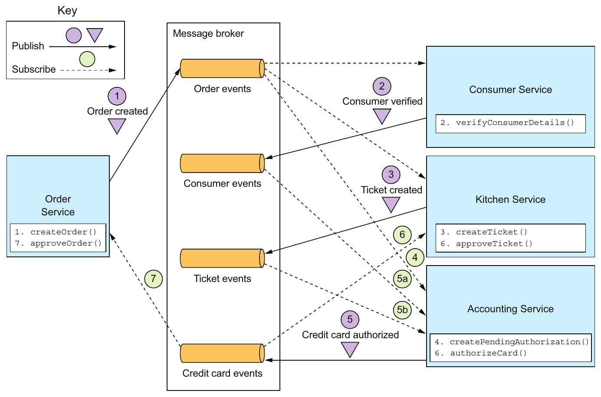

> **English:** Figure 4.4 Implementing the Create Order Saga using choreography. The saga participants communicate by exchanging events.
>
> **Türkçe:** Şekil 4.4 Create Order Saga’nın koreografi kullanılarak uygulanması. Saga katılımcıları olay alışverişiyle iletişim kurar.

<!-- source-pages: 119 -->

<!-- source-record: u04_0073 -->

> **English:** The happy path through this saga is as follows:
>
> **Türkçe:** Bu saga işleminin her şeyin beklendiği gibi ilerlediği başarılı akışı şöyledir:

<!-- source-record: u04_0074 -->

> **English:** 1 Order Service creates an Order in the APPROVAL_PENDING state and publishes an OrderCreated event.
>
> **Türkçe:** 1 Order Service, APPROVAL_PENDING durumunda bir Order oluşturur ve bir OrderCreated olayı yayımlar.

<!-- source-record: u04_0075 -->

> **English:** 2 Consumer Service consumes the OrderCreated event, verifies that the consumer can place the order, and publishes a ConsumerVerified event.
>
> **Türkçe:** 2 Consumer Service, OrderCreated olayını tüketir, müşterinin sipariş verebildiğini doğrular ve bir ConsumerVerified olayı yayımlar.

<!-- source-record: u04_0076 -->

> **English:** 3 Kitchen Service consumes the OrderCreated event, validates the Order, creates a Ticket in a CREATE_PENDING state, and publishes the TicketCreated event.
>
> **Türkçe:** 3 Kitchen Service, OrderCreated olayını tüketir, Order nesnesini doğrular, CREATE_PENDING durumunda bir Ticket oluşturur ve TicketCreated olayını yayımlar.

<!-- source-record: u04_0077 -->

> **English:** 4 Accounting Service consumes the OrderCreated event and creates a CreditCardAuthorization in a PENDING state.
>
> **Türkçe:** 4 Accounting Service, OrderCreated olayını tüketir ve PENDING durumunda bir CreditCardAuthorization oluşturur.

<!-- source-record: u04_0078 -->

> **English:** 5 Accounting Service consumes the TicketCreated and ConsumerVerified events, charges the consumer’s credit card, and publishes the CreditCardAuthorized event.
>
> **Türkçe:** 5 Accounting Service, TicketCreated ve ConsumerVerified olaylarını tüketir, müşterinin kredi kartından ödeme alır ve CreditCardAuthorized olayını yayımlar.

<!-- source-record: u04_0079 -->

> **English:** 6 Kitchen Service consumes the CreditCardAuthorized event and changes the state of the Ticket to AWAITING_ACCEPTANCE.
>
> **Türkçe:** 6 Kitchen Service, CreditCardAuthorized olayını tüketir ve Ticket durumunu AWAITING_ACCEPTANCE olarak değiştirir.

<!-- source-record: u04_0080 -->

> **English:** 7 Order Service receives the CreditCardAuthorized events, changes the state of the Order to APPROVED, and publishes an OrderApproved event.
>
> **Türkçe:** 7 Order Service, CreditCardAuthorized olaylarını alır, Order durumunu APPROVED olarak değiştirir ve bir OrderApproved olayı yayımlar.

<!-- source-record: u04_0081 -->

> **English:** The Create Order Saga must also handle the scenario where a saga participant rejects the Order and publishes some kind of failure event. For example, the authorization of the consumer’s credit card might fail. The saga must execute the compensating transactions to undo what’s already been done. Figure 4.5 shows the flow of events when the AccountingService can’t authorize the consumer’s credit card.
>
> **Türkçe:** Create Order Saga, bir katılımcının Order nesnesini reddedip bir başarısızlık olayı yayımladığı senaryoyu da ele almalıdır. Örneğin müşterinin kredi kartından provizyon alınamayabilir. Saga, tamamlanmış işlerin etkisini geri almak için telafi işlemlerini yürütmelidir. Şekil 4.5, AccountingService müşterinin kredi kartından provizyon alamadığında gerçekleşen olay akışını gösterir.

<!-- source-record: u04_0082 -->

> **English:** The sequence of events is as follows:
>
> **Türkçe:** Olayların sırası şöyle:

<!-- source-record: u04_0083 -->

> **English:** 1 Order Service creates an Order in the APPROVAL_PENDING state and publishes an OrderCreated event.
>
> **Türkçe:** 1 Order Service, APPROVAL_PENDING durumunda bir Order oluşturur ve bir OrderCreated olayı yayımlar.

<!-- source-record: u04_0084 -->

> **English:** 2 Consumer Service consumes the OrderCreated event, verifies that the consumer can place the order, and publishes a ConsumerVerified event.
>
> **Türkçe:** 2 Consumer Service, OrderCreated olayını tüketir, müşterinin sipariş verebildiğini doğrular ve bir ConsumerVerified olayı yayımlar.

<!-- source-record: u04_0085 -->

> **English:** 3 Kitchen Service consumes the OrderCreated event, validates the Order, creates a Ticket in a CREATE_PENDING state, and publishes the TicketCreated event.
>
> **Türkçe:** 3 Kitchen Service, OrderCreated olayını tüketir, Order nesnesini doğrular, CREATE_PENDING durumunda bir Ticket oluşturur ve TicketCreated olayını yayımlar.

<!-- source-record: u04_0086 -->

> **English:** 4 Accounting Service consumes the OrderCreated event and creates a CreditCardAuthorization in a PENDING state.
>
> **Türkçe:** 4 Accounting Service, OrderCreated olayını tüketir ve PENDING durumunda bir CreditCardAuthorization oluşturur.

<!-- source-record: u04_0087 -->

> **English:** 5 Accounting Service consumes the TicketCreated and ConsumerVerified events, charges the consumer’s credit card, and publishes a Credit Card Authorization Failed event.
>
> **Türkçe:** 5 Accounting Service, TicketCreated ve ConsumerVerified olaylarını tüketir, müşterinin kredi kartından ödeme almaya çalışır ve Credit Card Authorization Failed olayını yayımlar.

<!-- source-record: u04_0088 -->

> **English:** 6 Kitchen Service consumes the Credit Card Authorization Failed event and changes the state of the Ticket to REJECTED.
>
> **Türkçe:** 6 Kitchen Service, Credit Card Authorization Failed olayını tüketir ve Ticket durumunu REJECTED olarak değiştirir.

<!-- source-record: u04_0089 -->

> **English:** 7 Order Service consumes the Credit Card Authorization Failed event and changes the state of the Order to REJECTED.
>
> **Türkçe:** 7 Order Service, Credit Card Authorization Failed olayını tüketir ve Order durumunu REJECTED olarak değiştirir.

<!-- source-record: u04_0090 -->

> **English:** As you can see, the participants of choreography-based sagas interact using publish/ subscribe. Let’s take a closer look at some issues you’ll need to consider when implementing publish/subscribe-based communication for your sagas.
>
> **Türkçe:** Görüldüğü gibi, koreografi tabanlı saga katılımcıları publish/subscribe (yayımlama/abone olma) mekanizmasıyla etkileşir. Saga işlemleri için bu iletişim biçimini uygularken göz önünde bulundurmanız gereken bazı konuları daha yakından inceleyelim.

<!-- source-pages: 120 -->

<!-- source-record: u04_0091 -->

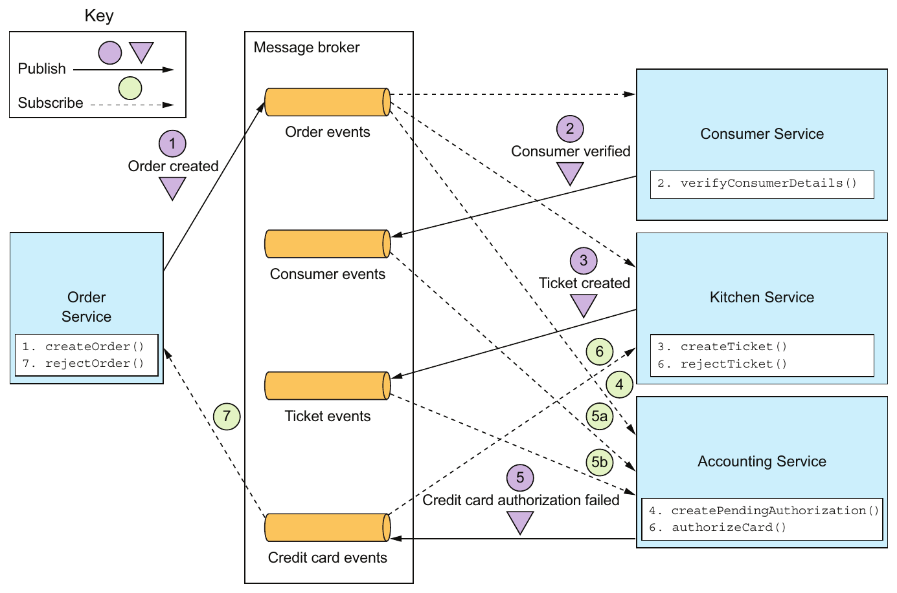

> **English:** Figure 4.5 The sequence of events in the Create Order Saga when the authorization of the consumer’s credit card fails. Accounting Service publishes the Credit Card Authorization Failed event, which causes Kitchen Service to reject the Ticket, and Order Service to reject the Order.
>
> **Türkçe:** Şekil 4.5 Müşterinin kredi kartından provizyon alınamadığında Create Order Saga içindeki olayların sırası. Accounting Service, Credit Card Authorization Failed olayını yayımlar; bunun sonucunda Kitchen Service, Ticket nesnesini ve Order Service, Order nesnesini reddeder.

<!-- source-record: u04_0092 -->

#### RELIABLE EVENT-BASED COMMUNICATION — Olay tabanlı güvenilir iletişim

<!-- source-record: u04_0093 -->

> **English:** There are a couple of interservice communication-related issues that you must consider when implementing choreography-based sagas. The first issue is ensuring that a saga participant updates its database and publishes an event as part of a database transaction. Each step of a choreography-based saga updates the database and publishes an event. For example, in the Create Order Saga, Kitchen Service receives a Consumer Verified event, creates a Ticket, and publishes a Ticket Created event. It’s essential that the database update and the publishing of the event happen atomically. Consequently, to communicate reliably, the saga participants must use transactional messaging, described in chapter 3.
>
> **Türkçe:** Koreografi tabanlı saga uygularken servisler arası iletişimle ilgili iki konuyu ele almalısınız. İlki, saga katılımcısının veritabanını güncellemesiyle olay yayımlamasının aynı veritabanı transaction işleminin parçası olmasını sağlamaktır. Koreografi tabanlı bir saga işleminin her adımı veritabanını günceller ve bir olay yayımlar. Örneğin Create Order Saga’da Kitchen Service bir Consumer Verified olayı alır, bir Ticket oluşturur ve bir Ticket Created olayı yayımlar. Veritabanı güncellemesiyle olayın yayımlanması atomik olarak gerçekleşmelidir. Bu nedenle saga katılımcıları, güvenilir iletişim için 3. bölümde açıklanan transactional messaging mekanizmasını kullanmalıdır.

<!-- source-record: u04_0094 -->

> **English:** The second issue you need to consider is ensuring that a saga participant must be able to map each event that it receives to its own data. For example, when Order Service receives a Credit Card Authorized event, it must be able to look up the corresponding Order. The solution is for a saga participant to publish events containing a correlation id, which is data that enables other participants to perform the mapping.
>
> **Türkçe:** İkinci konu, saga katılımcısının aldığı her olayı kendi verileriyle eşleştirebilmesidir. Örneğin Order Service, Credit Card Authorized olayını aldığında ilgili Order nesnesini bulabilmelidir. Çözüm, katılımcının yayımladığı olaylara, diğer katılımcıların bu eşleştirmeyi yapmasını sağlayan correlation ID (ilişkilendirme kimliği) eklemesidir.

<!-- source-pages: 121 -->

<!-- source-record: u04_0095 -->

> **English:** For example, the participants of the Create Order Saga can use the orderId as a correlation ID that’s passed from one participant to the next. Accounting Service publishes a Credit Card Authorized event containing the orderId from the TicketCreated event. When Order Service receives a Credit Card Authorized event, it uses the orderId to retrieve the corresponding Order. Similarly, Kitchen Service uses the orderId from that event to retrieve the corresponding Ticket.
>
> **Türkçe:** Örneğin Create Order Saga katılımcıları, bir katılımcıdan diğerine aktarılan ilişkilendirme kimliği olarak orderId kullanabilir. Accounting Service, TicketCreated olayından aldığı orderId değerini içeren bir Credit Card Authorized olayı yayımlar. Order Service bu olayı aldığında ilgili Order nesnesini bulmak için orderId kullanır. Benzer şekilde Kitchen Service, ilgili Ticket nesnesini bulmak için aynı olaydaki orderId değerini kullanır.

<!-- source-record: u04_0096 -->

#### BENEFITS AND DRAWBACKS OF CHOREOGRAPHY-BASED SAGAS — Koreografiye dayalı saga'ların yararları ve dezavantajları

<!-- source-record: u04_0097 -->

> **English:** Choreography-based sagas have several benefits:
>
> **Türkçe:** Koreografi tabanlı saga işlemlerinin çeşitli yararları vardır:

<!-- source-record: u04_0098 -->

> **English:** • Simplicity—Services publish events when they create, update, or delete business objects.
>
> **Türkçe:** • Sadelik — Servisler iş nesnelerini oluştururken, güncellerken veya silerken olay yayımlar.

<!-- source-record: u04_0099 -->

> **English:** • Loose coupling —The participants subscribe to events and don’t have direct knowledge of each other.
>
> **Türkçe:** • Gevşek bağlılık — Katılımcılar olaylara abone olur; birbirlerini doğrudan tanımaz.

<!-- source-record: u04_0100 -->

> **English:** And there are some drawbacks:
>
> **Türkçe:** Ve bazı dezavantajları da var:

<!-- source-record: u04_0101 -->

> **English:** • More difficult to understand—Unlike with orchestration, there isn’t a single place in the code that defines the saga. Instead, choreography distributes the implementation of the saga among the services. Consequently, it’s sometimes difficult for a developer to understand how a given saga works.
>
> **Türkçe:** • Anlaşılması daha zordur — Orkestrasyondan farklı olarak kodda saga işlemini tanımlayan tek bir yer bulunmaz. Koreografi, saga uygulamasını servisler arasında dağıtır. Bu nedenle geliştiricinin belirli bir saga işleminin nasıl çalıştığını anlaması bazen zordur.

<!-- source-record: u04_0102 -->

> **English:** • Cyclic dependencies between the services—The saga participants subscribe to each other’s events, which often creates cyclic dependencies. For example, if you carefully examine figure 4.4, you’ll see that there are cyclic dependencies, such as Order Service → Accounting Service → Order Service. Although this isn’t necessarily a problem, cyclic dependencies are considered a design smell.
>
> **Türkçe:** • Servisler arasında döngüsel bağımlılıklar — Saga katılımcıları birbirlerinin olaylarına abone olur; bu da sıklıkla döngüsel bağımlılıklar oluşturur. Örneğin Şekil 4.4’ü dikkatlice incelerseniz Order Service → Accounting Service → Order Service gibi döngüler görürsünüz. Bunlar her durumda sorun olmasa da tasarımda olası bir soruna işaret eden belirtiler sayılır.

<!-- source-record: u04_0103 -->

> **English:** • Risk of tight coupling—Each saga participant needs to subscribe to all events that affect them. For example, Accounting Service must subscribe to all events that cause the consumer’s credit card to be charged or refunded. As a result, there’s a risk that it would need to be updated in lockstep with the order lifecycle implemented by Order Service.
>
> **Türkçe:** • Sıkı bağlılık riski — Her saga katılımcısı, kendisini etkileyen bütün olaylara abone olmalıdır. Örneğin Accounting Service, müşterinin kredi kartından ödeme alınmasına veya karta iade yapılmasına neden olan bütün olaylara abone olmalıdır. Bu nedenle Order Service’in uyguladığı sipariş yaşam döngüsüyle eş zamanlı olarak değiştirilmesi gerekebilir.

<!-- source-record: u04_0104 -->

> **English:** Choreography can work well for simple sagas, but because of these drawbacks it’s often better for more complex sagas to use orchestration. Let’s look at how orchestration works.
>
> **Türkçe:** Koreografi basit saga işlemlerinde iyi çalışabilir. Ancak bu dezavantajlardan dolayı daha karmaşık saga işlemlerinde genellikle orkestrasyon kullanmak daha uygundur. Şimdi orkestrasyonun nasıl çalıştığını inceleyelim.

<!-- source-record: u04_0105 -->

### 4.2.2 Orchestration-based sagas — Orkestrasyona dayalı saga'lar

<!-- source-record: u04_0106 -->

> **English:** Orchestration is another way to implement sagas. When using orchestration, you define an orchestrator class whose sole responsibility is to tell the saga participants what to do. The saga orchestrator communicates with the participants using command/ async reply-style interaction. To execute a saga step, it sends a command message to a participant telling it what operation to perform. After the saga participant has performed the operation, it sends a reply message to the orchestrator. The orchestrator then processes the message and determines which saga step to perform next.
>
> **Türkçe:** Orkestrasyon, saga uygulamanın başka bir yoludur. Bu yaklaşımda tek sorumluluğu saga katılımcılarına ne yapacaklarını söylemek olan bir orchestrator sınıfı tanımlarsınız. Saga orchestrator, katılımcılarla komut/eşzamansız yanıt biçiminde iletişim kurar. Bir saga adımını yürütmek için katılımcıya, hangi operasyonu yapacağını belirten bir komut mesajı gönderir. Katılımcı operasyonu tamamladıktan sonra orchestrator’a bir yanıt mesajı gönderir. Orchestrator bu mesajı işler ve sıradaki saga adımını belirler.

<!-- source-pages: 122 -->

<!-- source-record: u04_0107 -->

> **English:** To show how orchestration-based sagas work, I’ll first describe an example. Then I’ll describe how to model orchestration-based sagas as state machines. I’ll discuss how to make use of transactional messaging to ensure reliable communication between the saga orchestrator and the saga participants. I’ll then describe the benefits and drawbacks of using orchestration-based sagas.
>
> **Türkçe:** Orkestrasyon tabanlı saga işlemlerinin nasıl çalıştığını göstermek için önce bir örnek açıklayacağım. Ardından bu saga işlemlerinin durum makineleri olarak nasıl modellendiğini anlatacağım. Saga orchestrator ile katılımcılar arasında güvenilir iletişim sağlamak için transactional messaging kullanımını ele alacağım. Son olarak orkestrasyon tabanlı saga işlemlerinin yararlarını ve dezavantajlarını açıklayacağım.

<!-- source-record: u04_0108 -->

#### IMPLEMENTING THE CREATE ORDER SAGA USING ORCHESTRATION — Create Order Saga'yı orkestrasyon kullanarak gerçekleştirmek

<!-- source-record: u04_0109 -->

> **English:** Figure 4.6 shows the design of the orchestration-based version of the Create Order Saga. The saga is orchestrated by the CreateOrderSaga class, which invokes the saga participants using asynchronous request/response. This class keeps track of the process and sends command messages to saga participants, such as Kitchen Service and Consumer Service. The CreateOrderSaga class reads reply messages from its reply channel and then determines the next step, if any, in the saga.
>
> **Türkçe:** Şekil 4.6, Create Order Saga’nın orkestrasyon tabanlı sürümünü gösterir. Saga, katılımcıları eşzamansız istek/yanıt ile çağıran CreateOrderSaga sınıfı tarafından koordine edilir. Bu sınıf süreci izler; Kitchen Service ve Consumer Service gibi saga katılımcılarına komut mesajları gönderir. CreateOrderSaga, kendi yanıt kanalından gelen mesajları okur ve varsa sonraki saga adımını belirler.

<!-- source-record: u04_0110 -->

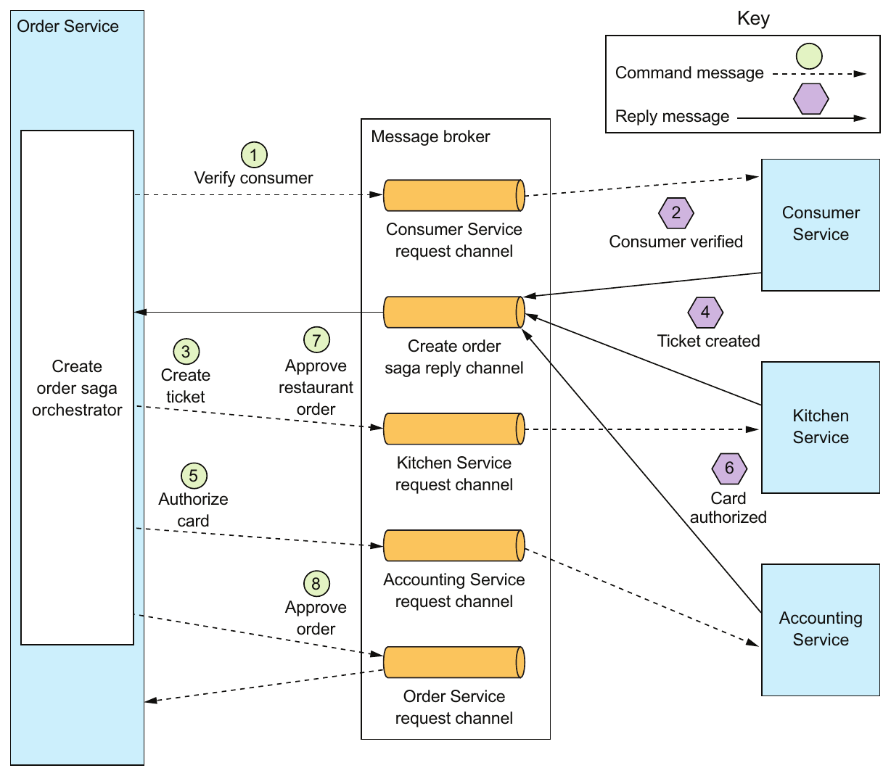

> **English:** Figure 4.6 Implementing the Create Order Saga using orchestration. Order Service implements a saga orchestrator, which invokes the saga participants using asynchronous request/ response.
>
> **Türkçe:** Şekil 4.6 Create Order Saga’nın orkestrasyon ile uygulanması. Order Service, saga katılımcılarını eşzamansız istek/yanıt ile çağıran bir saga orchestrator içerir.

<!-- source-pages: 123 -->

<!-- source-record: u04_0111 -->

> **English:** Order Service first creates an Order and a Create Order Saga orchestrator. After that, the flow for the happy path is as follows:
>
> **Türkçe:** Order Service önce bir Order ve bir Create Order Saga orchestrator oluşturur. Ardından başarılı senaryodaki akış şöyle ilerler:

<!-- source-record: u04_0112 -->

> **English:** 1 The saga orchestrator sends a Verify Consumer command to Consumer Service.
>
> **Türkçe:** 1 Saga orchestrator, Consumer Service’e bir Verify Consumer komutu gönderir.

<!-- source-record: u04_0113 -->

> **English:** 2 Consumer Service replies with a Consumer Verified message.
>
> **Türkçe:** 2 Consumer Service, bir Consumer Verified mesajıyla yanıt verir.

<!-- source-record: u04_0114 -->

> **English:** 3 The saga orchestrator sends a Create Ticket command to Kitchen Service.
>
> **Türkçe:** 3 Saga orchestrator, Kitchen Service’e bir Create Ticket komutu gönderir.

<!-- source-record: u04_0115 -->

> **English:** 4 Kitchen Service replies with a Ticket Created message.
>
> **Türkçe:** 4 Kitchen Service, bir Ticket Created mesajıyla yanıt verir.

<!-- source-record: u04_0116 -->

> **English:** 5 The saga orchestrator sends an Authorize Card message to Accounting Service.
>
> **Türkçe:** 5 Saga orchestrator, Accounting Service’e bir Authorize Card mesajı gönderir.

<!-- source-record: u04_0117 -->

> **English:** 6 Accounting Service replies with a Card Authorized message.
>
> **Türkçe:** 6 Accounting Service, bir Card Authorized mesajıyla yanıt verir.

<!-- source-record: u04_0118 -->

> **English:** 7 The saga orchestrator sends an Approve Ticket command to Kitchen Service.
>
> **Türkçe:** 7 Saga orchestrator, Kitchen Service’e bir Approve Ticket komutu gönderir.

<!-- source-record: u04_0119 -->

> **English:** 8 The saga orchestrator sends an Approve Order command to Order Service.
>
> **Türkçe:** 8 Saga orchestrator, Order Service’e bir Approve Order komutu gönderir.

<!-- source-record: u04_0120 -->

> **English:** Note that in final step, the saga orchestrator sends a command message to Order Service, even though it’s a component of Order Service. In principle, the Create Order Saga could approve the Order by updating it directly. But in order to be consistent, the saga treats Order Service as just another participant.
>
> **Türkçe:** Son adımda saga orchestrator, Order Service’in kendi bileşeni olmasına rağmen Order Service’e bir komut mesajı gönderir. İlke olarak Create Order Saga, Order nesnesini doğrudan güncelleyerek onaylayabilir. Ancak tutarlı bir yaklaşım izlemek için saga, Order Service’i de diğer katılımcılar gibi ele alır.

<!-- source-record: u04_0121 -->

> **English:** Diagrams such as figure 4.6 each depict one scenario for a saga, but a saga is likely to have numerous scenarios. For example, the Create Order Saga has four scenarios. In addition to the happy path, the saga can fail due to a failure in either Consumer Service, Kitchen Service, or Accounting Service. It’s useful, therefore, to model a saga as a state machine, because it describes all possible scenarios.
>
> **Türkçe:** Şekil 4.6 gibi diyagramların her biri bir saga senaryosunu gösterir; ancak saga işleminin çok sayıda senaryosu olabilir. Örneğin Create Order Saga’nın dört senaryosu vardır. Başarılı akışın yanında, Consumer Service, Kitchen Service veya Accounting Service içindeki bir hata nedeniyle saga başarısız olabilir. Bütün olası senaryoları tanımladığı için saga işlemini durum makinesi olarak modellemek yararlıdır.

<!-- source-record: u04_0122 -->

#### MODELING SAGA ORCHESTRATORS AS STATE MACHINES — Saga orkestratörlerini durum makineleri olarak modellemek

<!-- source-record: u04_0123 -->

> **English:** A good way to model a saga orchestrator is as a state machine. A state machine consists of a set of states and a set of transitions between states that are triggered by events. Each transition can have an action, which for a saga is the invocation of a saga participant. The transitions between states are triggered by the completion of a local transaction performed by a saga participant. The current state and the specific outcome of the local transaction determine the state transition and what action, if any, to perform. There are also effective testing strategies for state machines. As a result, using a state machine model makes designing, implementing, and testing sagas easier.
>
> **Türkçe:** Saga orchestrator için uygun bir model, durum makinesidir. Durum makinesi, bir durum kümesinden ve olaylarla tetiklenen durum geçişlerinden oluşur. Her geçişe bir eylem bağlanabilir; saga bağlamında bu eylem, bir saga katılımcısının çağrılmasıdır. Durum geçişlerini, katılımcının yürüttüğü yerel transaction işleminin tamamlanması tetikler. Mevcut durum ve yerel transaction sonucunun ne olduğu, hangi geçişin yapılacağını ve varsa hangi eylemin yürütüleceğini belirler. Durum makineleri için etkili test stratejileri de vardır. Bu nedenle durum makinesi modeli kullanmak, saga tasarımını, uygulamasını ve testini kolaylaştırır.

<!-- source-record: u04_0124 -->

> **English:** Figure 4.7 shows the state machine model for the Create Order Saga. This state machine consists of numerous states, including the following:
>
> **Türkçe:** Şekil 4.7, Create Order Saga için durum makinesi modelini gösterir. Bu model, aşağıdakiler dahil çok sayıda durum içerir:

<!-- source-record: u04_0125 -->

> **English:** • Verifying Consumer—The initial state. When in this state, the saga is waiting for the Consumer Service to verify that the consumer can place the order.
>
> **Türkçe:** • Verifying Consumer — Başlangıç durumudur. Saga bu durumdayken, Consumer Service’in müşterinin sipariş verebildiğini doğrulamasını bekler.

<!-- source-record: u04_0126 -->

> **English:** • Creating Ticket—The saga is waiting for a reply to the Create Ticket command.
>
> **Türkçe:** • Creating Ticket — Saga, Create Ticket komutuna yanıt bekler.

<!-- source-record: u04_0127 -->

> **English:** • Authorizing Card—Waiting for Accounting Service to authorize the consumer’s credit card.
>
> **Türkçe:** • Authorizing Card — Accounting Service’in müşterinin kredi kartından provizyon alması beklenir.

<!-- source-record: u04_0128 -->

> **English:** • Order Approved—A final state indicating that the saga completed successfully.
>
> **Türkçe:** • Order Approved — Saga işleminin başarıyla tamamlandığını gösteren son durumdur.

<!-- source-record: u04_0129 -->

> **English:** • Order Rejected—A final state indicating that the Order was rejected by one of the participants.
>
> **Türkçe:** • Order Rejected — Order nesnesinin katılımcılardan biri tarafından reddedildiğini gösteren son durumdur.

<!-- source-pages: 124 -->

<!-- source-record: u04_0130 -->

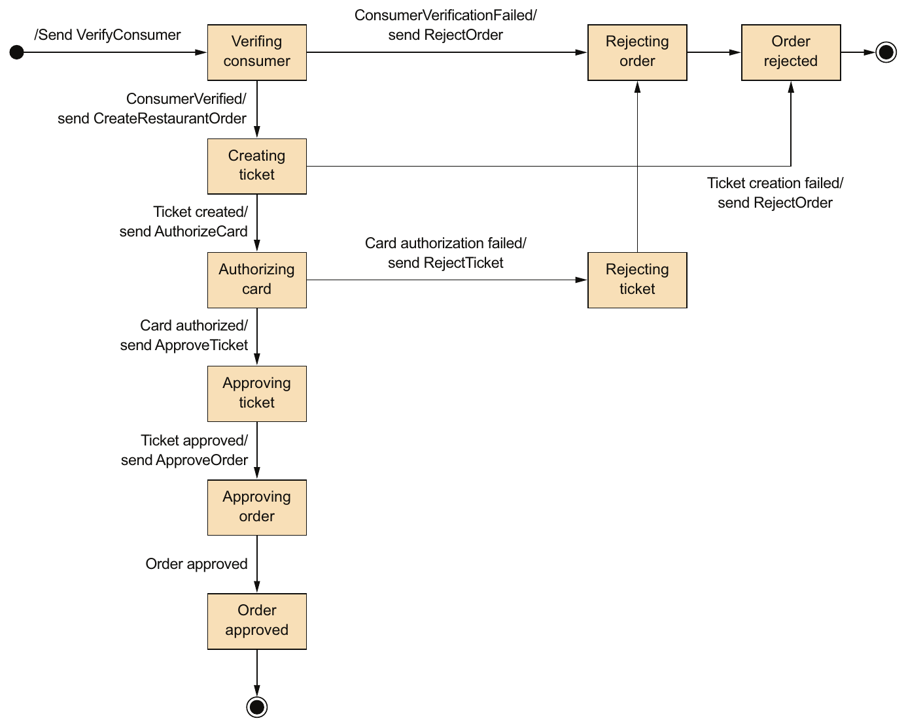

> **English:** Figure 4.7 The state machine model for the Create Order Saga
>
> **Türkçe:** Şekil 4.7 Create Order Saga için durum makinesi modeli

<!-- source-record: u04_0131 -->

> **English:** The state machine also defines numerous state transitions. For example, the state machine transitions from the Creating Ticket state to either the Authorizing Card or the Rejected Order state. It transitions to the Authorizing Card state when it receives a successful reply to the Create Ticket command. Alternatively, if Kitchen Service couldn’t create the Ticket, the state machine transitions to the Rejected Order state.
>
> **Türkçe:** Durum makinesi çok sayıda durum geçişi de tanımlar. Örneğin Creating Ticket durumundan Authorizing Card veya Rejected Order durumuna geçer. Create Ticket komutuna başarılı bir yanıt aldığında Authorizing Card durumuna geçer. Kitchen Service, Ticket nesnesini oluşturamadıysa Rejected Order durumuna geçer.

<!-- source-record: u04_0132 -->

> **English:** The state machine’s initial action is to send the VerifyConsumer command to Consumer Service. The response from Consumer Service triggers the next state transition. If the consumer was successfully verified, the saga creates the Ticket and transitions to the Creating Ticket state. But if the consumer verification failed, the saga rejects the Order and transitions to the Rejecting Order state. The state machine undergoes numerous other state transitions, driven by the responses from saga participants, until it reaches a final state of either Order Approved or Order Rejected.
>
> **Türkçe:** Durum makinesinin ilk eylemi, Consumer Service’e VerifyConsumer komutunu göndermektir. Consumer Service’in yanıtı bir sonraki durum geçişini tetikler. Müşteri başarıyla doğrulanırsa saga, Ticket oluşturur ve Creating Ticket durumuna geçer. Müşteri doğrulaması başarısız olursa Order nesnesini reddeder ve Rejecting Order durumuna geçer. Durum makinesi, saga katılımcılarının yanıtlarıyla yönlendirilen başka geçişlerden de geçerek sonunda Order Approved veya Order Rejected son durumuna ulaşır.

<!-- source-pages: 125 -->

<!-- source-record: u04_0133 -->

#### SAGA ORCHESTRATION AND TRANSACTIONAL MESSAGING — Saga orkestrasyonu ve işlemsel mesajlaşma

<!-- source-record: u04_0134 -->

> **English:** Each step of an orchestration-based saga consists of a service updating a database and publishing a message. For example, Order Service persists an Order and a Create Order Saga orchestrator and sends a message to the first saga participant. A saga participant, such as Kitchen Service, handles a command message by updating its database and sending a reply message. Order Service processes the participant’s reply message by updating the state of the saga orchestrator and sending a command message to the next saga participant. As described in chapter 3, a service must use transactional messaging in order to atomically update the database and publish messages. Later on in section 4.4, I’ll describe the implementation of the Create Order Saga orchestrator in more detail, including how it uses transaction messaging.
>
> **Türkçe:** Orkestrasyon tabanlı saga işleminin her adımında bir servis, veritabanını günceller ve mesaj yayımlar. Örneğin Order Service, bir Order ile bir Create Order Saga orchestrator nesnesini kalıcı olarak kaydeder ve ilk saga katılımcısına mesaj gönderir. Kitchen Service gibi bir katılımcı, komut mesajını işlerken veritabanını günceller ve yanıt mesajı gönderir. Order Service, katılımcının yanıtını işlemek için saga orchestrator durumunu günceller ve sonraki katılımcıya komut mesajı gönderir. 3. bölümde açıklandığı gibi servis, veritabanını atomik olarak güncellemek ve mesaj yayımlamak için transactional messaging kullanmalıdır. 4.4 bölümünde Create Order Saga orchestrator uygulamasını ve transactional messaging kullanımını ayrıntılı açıklayacağım.

<!-- source-record: u04_0135 -->

> **English:** Let’s take a look at the benefits and drawbacks of using saga orchestration.
>
> **Türkçe:** Saga orkestrasyonunun yararlarına ve dezavantajlarına bakalım.

<!-- source-record: u04_0136 -->

#### BENEFITS AND DRAWBACKS OF ORCHESTRATION-BASED SAGAS — Orkestrasyona dayalı saga'ların yararları ve dezavantajları

<!-- source-record: u04_0137 -->

> **English:** Orchestration-based sagas have several benefits:
>
> **Türkçe:** Orkestrasyon tabanlı saga işlemlerinin çeşitli yararları vardır:

<!-- source-record: u04_0138 -->

> **English:** • Simpler dependencies—One benefit of orchestration is that it doesn’t introduce cyclic dependencies. The saga orchestrator invokes the saga participants, but the participants don’t invoke the orchestrator. As a result, the orchestrator depends on the participants but not vice versa, and so there are no cyclic dependencies.
>
> **Türkçe:** • Daha basit bağımlılıklar — Orkestrasyon, döngüsel bağımlılıklar oluşturmaz. Saga orchestrator, katılımcıları çağırır; katılımcılar ise orchestrator’ı çağırmaz. Böylece orchestrator katılımcılara bağımlıdır, ancak tersi geçerli değildir; dolayısıyla bağımlılık döngüsü oluşmaz.

<!-- source-record: u04_0139 -->

> **English:** • Less coupling—Each service implements an API that is invoked by the orchestrator, so it does not need to know about the events published by the saga participants.
>
> **Türkçe:** • Daha az bağlılık — Her servis, orchestrator tarafından çağrılan bir API uygular. Bu yüzden saga katılımcılarının yayımladığı olayları bilmesi gerekmez.

<!-- source-record: u04_0140 -->

> **English:** • Improves separation of concerns and simplifies the business logic—The saga coordination logic is localized in the saga orchestrator. The domain objects are simpler and have no knowledge of the sagas that they participate in. For example, when using orchestration, the Order class has no knowledge of any of the sagas, so it has a simpler state machine model. During the execution of the Create Order Saga, it transitions directly from the APPROVAL_PENDING state to the APPROVED state. The Order class doesn’t have any intermediate states corresponding to the steps of the saga. As a result, the business is much simpler.
>
> **Türkçe:** • Sorumlulukların ayrılmasını güçlendirir ve iş mantığını sadeleştirir — Saga koordinasyon mantığı, saga orchestrator içinde toplanır. Domain nesneleri daha basittir ve katıldıkları saga işlemlerini bilmez. Örneğin orkestrasyon kullanıldığında Order sınıfı, saga işlemlerinden haberdar olmadığı için daha basit bir durum makinesi modeline sahiptir. Create Order Saga yürütülürken Order, doğrudan APPROVAL_PENDING durumundan APPROVED durumuna geçer. Order sınıfında saga adımlarına karşılık gelen ara durumlar bulunmaz. Bunun sonucunda iş mantığı çok daha basit olur.

<!-- source-record: u04_0141 -->

> **English:** Orchestration also has a drawback: the risk of centralizing too much business logic in the orchestrator. This results in a design where the smart orchestrator tells the dumb services what operations to do. Fortunately, you can avoid this problem by designing orchestrators that are solely responsible for sequencing and don’t contain any other business logic.
>
> **Türkçe:** Orkestrasyonun bir dezavantajı da orchestrator içinde çok fazla iş mantığı toplama riskidir. Böyle bir tasarımda kararları veren akıllı orchestrator, karar yeteneği olmayan servislere ne yapacaklarını söyler. Orchestrator’ları yalnızca sıralamadan sorumlu olacak ve başka iş mantığı içermeyecek biçimde tasarlayarak bu sorunu önleyebilirsiniz.

<!-- source-record: u04_0142 -->

> **English:** I recommend using orchestration for all but the simplest sagas. Implementing the coordination logic for your sagas is just one of the design problems you need to solve. Another, which is perhaps the biggest challenge that you’ll face when using sagas, is handling the lack of isolation. Let’s take a look at that problem and how to solve it.
>
> **Türkçe:** En basit saga işlemleri dışındaki bütün saga işlemlerinde orkestrasyon kullanmanızı öneririm. Koordinasyon mantığını uygulamak, çözmeniz gereken tasarım sorunlarından yalnızca biridir. Bir diğeri ve belki de saga kullanırken karşılaşacağınız en büyük zorluk, yalıtım eksikliğiyle başa çıkmaktır. Bu sorunu ve çözümünü inceleyelim.

<!-- source-pages: 126 -->

<!-- source-record: u04_0143 -->

## 4.3 Handling the lack of isolation — Isolation (yalıtım) eksikliğini ele almak

<!-- source-record: u04_0144 -->

> **English:** The I in ACID stands for isolation. The isolation property of ACID transactions ensures that the outcome of executing multiple transactions concurrently is the same as if they were executed in some serial order. The database provides the illusion that each ACID transaction has exclusive access to the data. Isolation makes it a lot easier to write business logic that executes concurrently.
>
> **Türkçe:** ACID içindeki I, isolation (yalıtım) anlamına gelir. ACID transaction işlemlerinin yalıtım özelliği, birden fazla transaction eşzamanlı yürütüldüğünde elde edilen sonucun, bunların belirli bir sırayla tek tek yürütülmesiyle aynı olmasını sağlar. Veritabanı, her ACID transaction veriye tek başına erişiyormuş gibi bir görünüm sunar. Yalıtım, eşzamanlı yürütülen iş mantığını yazmayı büyük ölçüde kolaylaştırır.

<!-- source-record: u04_0145 -->

> **English:** The challenge with using sagas is that they lack the isolation property of ACID transactions. That’s because the updates made by each of a saga’s local transactions are immediately visible to other sagas once that transaction commits. This behavior can cause two problems. First, other sagas can change the data accessed by the saga while it’s executing. And other sagas can read its data before the saga has completed its updates, and consequently can be exposed to inconsistent data. You can, in fact, consider a saga to be ACD:
>
> **Türkçe:** Saga kullanmanın zorluğu, ACID transaction işlemlerinin yalıtım özelliğine sahip olmamasıdır. Çünkü saga içindeki her yerel transaction işleminin güncellemeleri, o transaction commit edildiği anda diğer saga işlemlerine görünür olur. Bu davranış iki soruna yol açabilir. Diğer saga işlemleri, yürütülmekte olan saga işleminin eriştiği verileri değiştirebilir. Ayrıca saga güncellemelerini tamamlamadan onun verilerini okuyabilir ve böylece tutarsız verilere erişebilirler. Aslında saga işlemini ACD olarak düşünebilirsiniz:

<!-- source-record: u04_0146 -->

> **English:** • Atomicity—The saga implementation ensures that all transactions are executed or all changes are undone.
>
> **Türkçe:** • Atomicity (atomiklik) — Saga uygulaması, bütün transaction işlemlerinin yürütülmesini veya bütün değişikliklerin geri alınmasını sağlar.

<!-- source-record: u04_0147 -->

> **English:** • Consistency—Referential integrity within a service is handled by local databases. Referential integrity across services is handled by the services.
>
> **Türkçe:** • Consistency (tutarlılık) — Servis içindeki referans bütünlüğünü yerel veritabanları; servisler arasındaki referans bütünlüğünü ise servisler yönetir.

<!-- source-record: u04_0148 -->

> **English:** • Durability—Handled by local databases.
>
> **Türkçe:** • Durability (kalıcılık) — Yerel veritabanları tarafından sağlanır.

<!-- source-record: u04_0149 -->

> **English:** This lack of isolation potentially causes what the database literature calls anomalies. An anomaly is when a transaction reads or writes data in a way that it wouldn’t if transactions were executed one at time. When an anomaly occurs, the outcome of executing sagas concurrently is different than if they were executed serially.
>
> **Türkçe:** Yalıtım eksikliği, veritabanı literatüründe anomali adı verilen durumlara yol açabilir. Bir transaction işleminin, işlemler tek tek yürütülseydi gerçekleşmeyecek biçimde veri okuması veya yazması anomali oluşturur. Anomali meydana geldiğinde saga işlemlerini eşzamanlı yürütmenin sonucu, bunları sırayla yürütmenin sonucundan farklı olur.

<!-- source-record: u04_0150 -->

> **English:** On the surface, the lack of isolation sounds unworkable. But in practice, it’s common for developers to accept reduced isolation in return for higher performance. An RDBMS lets you specify the isolation level for each transaction (https://dev.mysql.com/doc/refman/5.7/en/innodb-transaction-isolation-levels.html). The default isolation level is usually an isolation level that’s weaker than full isolation, also known as serializable transactions. Real-world database transactions are often different from textbook definitions of ACID transactions.
>
> **Türkçe:** Yalıtım eksikliği ilk bakışta uygulanamaz bir durum gibi görünebilir. Oysa geliştiricilerin daha yüksek performans karşılığında daha düşük yalıtımı kabul etmesi yaygındır. RDBMS, her transaction için yalıtım düzeyini belirlemenizi sağlar (https://dev.mysql.com/doc/refman/5.7/en/innodb-transaction-isolation-levels.html). Varsayılan düzey genellikle serializable transaction olarak da bilinen tam yalıtımdan daha zayıftır. Gerçek uygulamalardaki veritabanı transaction işlemleri, ders kitaplarındaki ACID tanımlarından sıklıkla farklıdır.

<!-- source-record: u04_0151 -->

> **English:** The next section discusses a set of saga design strategies that deal with the lack of isolation. These strategies are known as countermeasures. Some countermeasures implement isolation at the application level. Other countermeasures reduce the business risk of the lack of isolation. By using countermeasures, you can write saga-based business logic that works correctly.
>
> **Türkçe:** Sonraki bölüm, yalıtım eksikliğiyle başa çıkan saga tasarım stratejilerini ele alır. Bunlara countermeasures (karşı önlemler) denir. Bazıları uygulama düzeyinde yalıtım sağlar; diğerleri yalıtım eksikliğinin iş açısından taşıdığı riski azaltır. Karşı önlemlerle doğru çalışan saga tabanlı iş mantığı yazabilirsiniz.

<!-- source-record: u04_0152 -->

> **English:** I’ll begin the section by describing the anomalies that are caused by the lack of isolation. After that, I’ll talk about countermeasures that either eliminate those anomalies or reduce their business risk.
>
> **Türkçe:** Önce yalıtım eksikliğinin yol açtığı anomalileri açıklayacağım. Ardından bu anomalileri ortadan kaldıran veya iş açısından taşıdıkları riski azaltan karşı önlemleri ele alacağım.

<!-- source-pages: 127 -->

<!-- source-record: u04_0153 -->

### 4.3.1 Overview of anomalies — Anomalilere genel bakış

<!-- source-record: u04_0154 -->

> **English:** The lack of isolation can cause the following three anomalies:
>
> **Türkçe:** Yalıtım eksikliği şu üç anomaliye yol açabilir:

<!-- source-record: u04_0155 -->

> **English:** • Lost updates—One saga overwrites without reading changes made by another saga.
>
> **Türkçe:** • Lost updates (kaybolan güncellemeler) — Bir saga, başka bir saga işleminin yaptığı değişiklikleri okumadan bunların üzerine yazar.

<!-- source-record: u04_0156 -->

> **English:** • Dirty reads—A transaction or a saga reads the updates made by a saga that has not yet completed those updates.
>
> **Türkçe:** • Dirty reads (kirli okumalar) — Bir transaction veya saga, henüz güncellemelerini tamamlamamış başka bir saga işleminin yaptığı güncellemeleri okur.

<!-- source-record: u04_0157 -->

> **English:** • Fuzzy/nonrepeatable reads—Two different steps of a saga read the same data and get different results because another saga has made updates.
>
> **Türkçe:** • Fuzzy/nonrepeatable reads (tekrarlanamayan okumalar) — Bir saga işleminin iki farklı adımı aynı veriyi okur; arada başka bir saga veriyi güncellediği için farklı sonuçlar alır.

<!-- source-record: u04_0158 -->

> **English:** All three anomalies can occur, but the first two are the most common and the most challenging. Let’s take a look at those two types of anomaly, starting with lost updates.
>
> **Türkçe:** Tüm üç anomali ortaya çıkabilir, ama ilk ikisi en yaygın ve en zor olanıdır. Bu iki tür anomaliye bir göz atalım. Kayıp güncellemelerden başlayalım.

<!-- source-record: u04_0159 -->

#### LOST UPDATES — Lost updates (kaybolan güncellemeler)

<!-- source-record: u04_0160 -->

> **English:** A lost update anomaly occurs when one saga overwrites an update made by another saga. Consider, for example, the following scenario:
>
> **Türkçe:** Kaybolan güncelleme anomalisi, bir saga işleminin başka bir saga işleminin yaptığı güncellemenin üzerine yazmasıyla oluşur. Örneğin şu senaryoyu ele alalım:

<!-- source-record: u04_0161 -->

> **English:** 1 The first step of the Create Order Saga creates an Order.
>
> **Türkçe:** 1 Create Order Saga’nın ilk adımı bir Order oluşturur.

<!-- source-record: u04_0162 -->

> **English:** 2 While that saga is executing, the Cancel Order Saga cancels the Order.
>
> **Türkçe:** 2 Bu saga yürütülürken Cancel Order Saga, Order nesnesini iptal eder.

<!-- source-record: u04_0163 -->

> **English:** 3 The final step of the Create Order Saga approves the Order.
>
> **Türkçe:** 3 Create Order Saga’nın son adımı Order nesnesini onaylar.

<!-- source-record: u04_0164 -->

> **English:** In this scenario, the Create Order Saga ignores the update made by the Cancel Order Saga and overwrites it. As a result, the FTGO application will ship an order that the customer had cancelled. Later in this section, I’ll show how to prevent lost updates.
>
> **Türkçe:** Bu senaryoda Create Order Saga, Cancel Order Saga’nın yaptığı güncellemeyi dikkate almaz ve üzerine yazar. Bunun sonucunda FTGO uygulaması, müşterinin iptal ettiği siparişi gönderir. Bu bölümün ilerleyen kısmında kaybolan güncellemelerin nasıl önlendiğini göstereceğim.

<!-- source-record: u04_0165 -->

#### DIRTY READS — Dirty reads (kirli okumalar)

<!-- source-record: u04_0166 -->

> **English:** A dirty read occurs when one saga reads data that’s in the middle of being updated by another saga. Consider, for example, a version of the FTGO application store where consumers have a credit limit. In this application, a saga that cancels an order consists of the following transactions:
>
> **Türkçe:** Kirli okuma, bir saga işleminin başka bir saga tarafından henüz güncellenmekte olan veriyi okumasıyla oluşur. Örneğin müşterilerin kredi limitine sahip olduğu bir FTGO sürümü düşünün. Bu uygulamada sipariş iptal eden saga şu transaction işlemlerinden oluşur:

<!-- source-record: u04_0167 -->

> **English:** • Consumer Service—Increase the available credit.
>
> **Türkçe:** • Consumer Service — Kullanılabilir kredi miktarını artırır.

<!-- source-record: u04_0168 -->

> **English:** • Order Service—Change the state of the Order to cancelled.
>
> **Türkçe:** • Order Service — Order durumunu iptal edilmiş olarak değiştirir.

<!-- source-record: u04_0169 -->

> **English:** • Delivery Service—Cancel the delivery.
>
> **Türkçe:** • Delivery Service — Teslimatı iptal eder.

<!-- source-record: u04_0170 -->

> **English:** Let’s imagine a scenario that interleaves the execution of the Cancel Order and Create Order Sagas, and the Cancel Order Saga is rolled back because it’s too late to cancel the delivery. It’s possible that the sequence of transactions that invoke the Consumer Service is as follows:
>
> **Türkçe:** Cancel Order Saga ile Create Order Saga adımlarının iç içe yürütüldüğü bir senaryo düşünelim. Teslimatı iptal etmek için artık çok geç olduğundan Cancel Order Saga geri alınsın. Consumer Service’i çağıran transaction işlemleri şu sırayla yürütülebilir:

<!-- source-record: u04_0171 -->

> **English:** 1 Cancel Order Saga—Increase the available credit.
>
> **Türkçe:** 1 Cancel Order Saga — Kullanılabilir krediyi artırır.

<!-- source-record: u04_0172 -->

> **English:** 2 Create Order Saga—Reduce the available credit.
>
> **Türkçe:** 2 Create Order Saga — Kullanılabilir krediyi azaltır.

<!-- source-record: u04_0173 -->

> **English:** 3 Cancel Order Saga—A compensating transaction that reduces the available credit.
>
> **Türkçe:** 3 Cancel Order Saga — Bir telafi işlemiyle kullanılabilir krediyi azaltır.

<!-- source-record: u04_0174 -->

> **English:** In this scenario, the Create Order Saga does a dirty read of the available credit that enables the consumer to place an order that exceeds their credit limit. It’s likely that this is an unacceptable risk to the business.
>
> **Türkçe:** Bu senaryoda Create Order Saga, kullanılabilir kredi miktarını kirli okur; böylece müşterinin kredi limitini aşan bir sipariş vermesine izin verir. Bu durum, işletme açısından büyük olasılıkla kabul edilemez bir risktir.

<!-- source-record: u04_0175 -->

> **English:** Let’s look at how to prevent this and other kinds of anomalies from impacting an application.
>
> **Türkçe:** Bu ve diğer anomalilerin bir uygulamayı etkilemesini nasıl engelleyebileceğimizi görelim.

<!-- source-pages: 128 -->

<!-- source-record: u04_0176 -->

### 4.3.2 Countermeasures for handling the lack of isolation — Yalıtım eksikliğini ele almak için karşı önlemler

<!-- source-record: u04_0177 -->

> **English:** The saga transaction model is ACD, and its lack of isolation can result in anomalies that cause applications to misbehave. It’s the responsibility of the developer to write sagas in a way that either prevents the anomalies or minimizes their impact on the business. This may sound like a daunting task, but you’ve already seen an example of a strategy that prevents anomalies. An Order’s use of *_PENDING states, such as APPROVAL_PENDING, is an example of one such strategy. Sagas that update Orders, such as the Create Order Saga, begin by setting the state of an Order to *_PENDING. The *_PENDING state tells other transactions that the Order is being updated by a saga and to act accordingly.
>
> **Türkçe:** Saga transaction modeli ACD’dir; yalıtım eksikliği, uygulamanın yanlış davranmasına yol açan anomaliler oluşturabilir. Saga işlemlerini bu anomalileri önleyecek veya iş üzerindeki etkilerini azaltacak şekilde yazmak geliştiricinin sorumluluğudur. Bu zor görünebilir, ancak anomalileri önleyen bir stratejinin örneğini zaten gördünüz: Order nesnesinde APPROVAL_PENDING gibi *_PENDING durumlarının kullanılması. Create Order Saga gibi Order nesnelerini güncelleyen saga işlemleri, önce Order durumunu *_PENDING yapar. Bu durum, diğer transaction işlemlerine Order nesnesinin bir saga tarafından güncellenmekte olduğunu ve buna göre davranmaları gerektiğini bildirir.

<!-- source-record: u04_0178 -->

> **English:** An Order’s use of *_PENDING states is an example of what the 1998 paper “Semantic ACID properties in multidatabases using remote procedure calls and update propagations” by Lars Frank and Torben U. Zahle calls a semantic lock countermeasure (https://dl.acm.org/citation.cfm?id=284472.284478). The paper describes how to deal with the lack of transaction isolation in multi-database architectures that don’t use distributed transactions. Many of its ideas are useful when designing sagas. It describes a set of countermeasures for handling anomalies caused by lack of isolation that either prevent one or more anomalies or minimize their impact on the business. The countermeasures described by this paper are as follows:
>
> **Türkçe:** Order nesnesinde *_PENDING durumlarının kullanılması, Lars Frank ve Torben U. Zahle’nin 1998 tarihli “Semantic ACID properties in multidatabases using remote procedure calls and update propagations” makalesinde semantic lock (anlamsal kilit) karşı önlemi olarak adlandırılan yaklaşımın bir örneğidir (https://dl.acm.org/citation.cfm?id=284472.284478). Makale, dağıtık transaction kullanmayan çok veritabanlı mimarilerde transaction yalıtımı eksikliğiyle nasıl başa çıkılacağını açıklar. Buradaki birçok fikir saga tasarımında da yararlıdır. Makale, yalıtım eksikliğinin yol açtığı bir veya daha fazla anomaliyi önleyen ya da bunların iş üzerindeki etkilerini azaltan şu karşı önlemleri tanımlar:

<!-- source-record: u04_0179 -->

> **English:** • Semantic lock—An application-level lock.
>
> **Türkçe:** • Semantic lock (anlamsal kilit) — Uygulama düzeyinde bir kilit kullanır.

<!-- source-record: u04_0180 -->

> **English:** • Commutative updates—Design update operations to be executable in any order.
>
> **Türkçe:** • Commutative updates (değişme özelliği taşıyan güncellemeler) — Güncelleme operasyonları herhangi bir sırayla yürütülebilecek şekilde tasarlanır.

<!-- source-record: u04_0181 -->

> **English:** • Pessimistic view—Reorder the steps of a saga to minimize business risk.
>
> **Türkçe:** • Pessimistic view (kötümser yaklaşım) — İş riskini azaltmak için saga adımlarının sırası değiştirilir.

<!-- source-record: u04_0182 -->

> **English:** • Reread value—Prevent dirty writes by rereading data to verify that it’s unchanged before overwriting it.
>
> **Türkçe:** • Reread value (değeri yeniden okuma) — Üzerine yazmadan önce verinin değişmediğini yeniden okuyarak doğrular ve kirli yazmaları önler.

<!-- source-record: u04_0183 -->

> **English:** • Version file—Record the updates to a record so that they can be reordered.
>
> **Türkçe:** • Version file (sürüm dosyası) — Bir kayda yapılan güncellemeleri, sıraları sonradan düzenlenebilecek şekilde kaydeder.

<!-- source-record: u04_0184 -->

> **English:** • By value—Use each request’s business risk to dynamically select the concurrency mechanism.
>
> **Türkçe:** • By value (değere göre) — Eşzamanlılık mekanizmasını, her isteğin iş açısından taşıdığı riske göre dinamik olarak seçer.

<!-- source-record: u04_0185 -->

> **English:** Later in this section, I describe each of these countermeasures, but first I want to introduce some terminology for describing the structure of a saga that’s useful when discussing countermeasures.
>
> **Türkçe:** Bu bölümün ilerleyen kısmında karşı önlemleri tek tek açıklayacağım. Önce, bunları tartışırken yararlı olacak saga yapısı terimlerini tanıtmak istiyorum.

<!-- source-record: u04_0186 -->

#### THE STRUCTURE OF A SAGA — Bir saga'nın yapısı

<!-- source-record: u04_0187 -->

> **English:** The countermeasures paper mentioned in the last section defines a useful model for the structure of a saga. In this model, shown in figure 4.8, a saga consists of three types of transactions:
>
> **Türkçe:** Önceki bölümde söz edilen karşı önlemler makalesi, saga yapısı için yararlı bir model tanımlar. Şekil 4.8’de gösterilen bu modelde saga, üç tür transaction işleminden oluşur:

<!-- source-record: u04_0188 -->

> **English:** • Compensatable transactions—Transactions that can potentially be rolled back using a compensating transaction.
>
> **Türkçe:** • Compensatable transactions (telafi edilebilir işlemler) — Gerekirse bir telafi işlemiyle geri alınabilen transaction işlemleridir.

<!-- source-record: u04_0189 -->

> **English:** • Pivot transaction—The go/no-go point in a saga. If the pivot transaction commits, the saga will run until completion. A pivot transaction can be a transaction that’s neither compensatable nor retriable. Alternatively, it can be the last compensatable transaction or the first retriable transaction.
>
> **Türkçe:** • Pivot transaction (dönüm noktası işlemi) — Saga içindeki devam etme veya vazgeçme kararının verildiği noktadır. Pivot transaction commit edilirse saga tamamlanana kadar ilerler. Pivot, ne telafi edilebilir ne de yeniden denenebilir bir transaction olabilir. Alternatif olarak son telafi edilebilir işlem veya ilk yeniden denenebilir işlem olabilir.

<!-- source-pages: 129 -->

<!-- source-record: u04_0190 -->

> **English:** • Retriable transactions—Transactions that follow the pivot transaction and are guaranteed to succeed.
>
> **Türkçe:** • Retriable transactions (yeniden denenebilir işlemler) — Pivot transaction sonrasında gelen ve başarılı olması güvence altına alınan işlemlerdir.

<!-- source-record: u04_0191 -->

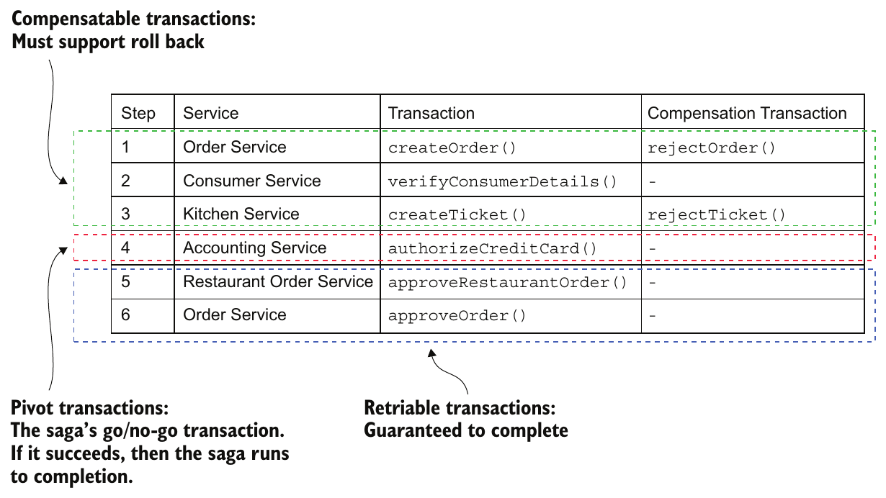

> **English:** Figure 4.8 A saga consists of three different types of transactions: compensatable transactions, which can be rolled back, so have a compensating transaction, a pivot transaction, which is the saga’s go/no-go point, and retriable transactions, which are transactions that don’t need to be rolled back and are guaranteed to complete.
>
> **Türkçe:** Şekil 4.8 Saga üç tür transaction işleminden oluşur: geri alınabildikleri için bir telafi işlemine sahip olan compensatable işlemler; devam etme veya vazgeçme noktasını oluşturan pivot transaction; geri alınması gerekmeyen ve tamamlanması güvence altında olan retriable işlemler.

<!-- source-record: u04_0192 -->

> **English:** In the Create Order Saga, the createOrder(), verifyConsumerDetails(), and createTicket() steps are compensatable transactions. The createOrder() and createTicket() transactions have compensating transactions that undo their updates. The verifyConsumerDetails() transaction is read-only, so doesn’t need a compensating transaction. The authorizeCreditCard() transaction is this saga’s pivot transaction. If the consumer’s credit card can be authorized, this saga is guaranteed to complete. The approveTicket() and approveOrder() steps are retriable transactions that follow the pivot transaction.
>
> **Türkçe:** Create Order Saga içindeki createOrder(), verifyConsumerDetails() ve createTicket() adımları telafi edilebilir işlemlerdir. createOrder() ve createTicket() güncellemelerini geri alan telafi işlemlerine sahiptir. verifyConsumerDetails() yalnızca okuma yaptığı için telafi işlemi gerektirmez. authorizeCreditCard(), bu saga işleminin pivot transaction adımıdır. Müşterinin kredi kartından provizyon alınabilirse saga işleminin tamamlanması güvence altındadır. Pivot işleminden sonra gelen approveTicket() ve approveOrder() adımları yeniden denenebilir işlemlerdir.

<!-- source-record: u04_0193 -->

> **English:** The distinction between compensatable transactions and retriable transactions is especially important. As you’ll see, each type of transaction plays a different role in the countermeasures. Chapter 13 states that when migrating to microservices, the monolith must sometimes participate in sagas and that it’s significantly simpler if the monolith only ever needs to execute retriable transactions.
>
> **Türkçe:** Telafi edilebilir işlemlerle yeniden denenebilir işlemler arasındaki ayrım özellikle önemlidir. Göreceğiniz gibi, karşı önlemlerde her işlem türünün farklı bir rolü vardır. 13. bölümde mikroservislere geçerken monolitin bazen saga işlemlerine katılması gerektiği ve monolit yalnızca yeniden denenebilir işlemler yürütüyorsa bunun çok daha kolay olduğu açıklanır.

<!-- source-record: u04_0194 -->

> **English:** Let’s now look at each countermeasure, starting with the semantic lock countermeasure.
>
> **Türkçe:** Anlamsal kilit ile başlayarak karşı önlemleri inceleyelim.

<!-- source-record: u04_0195 -->

#### COUNTERMEASURE: SEMANTIC LOCK — Karşı önlem: Semantic lock (anlamsal kilit)

<!-- source-record: u04_0196 -->

> **English:** When using the semantic lock countermeasure, a saga’s compensatable transaction sets a flag in any record that it creates or updates. The flag indicates that the record isn’t committed and could potentially change. The flag can either be a lock that prevents other transactions from accessing the record or a warning that indicates that other transactions should treat that record with suspicion. It’s cleared by either a retriable transaction—saga is completing successfully—or by a compensating transaction: the saga is rolling back.
>
> **Türkçe:** Anlamsal kilit kullanıldığında saga içindeki telafi edilebilir transaction, oluşturduğu veya güncellediği kayıtlara bir işaret koyar. Bu işaret, kaydın saga açısından henüz kesinleşmediğini ve değişebileceğini bildirir. Diğer transaction işlemlerinin kayda erişmesini engelleyen bir kilit veya kayda temkinli yaklaşmaları gerektiğini belirten bir uyarı olabilir. Saga başarıyla tamamlanırken yeniden denenebilir bir işlem, geri alınırken ise bir telafi işlemi bu işareti temizler.

<!-- source-pages: 130 -->

<!-- source-record: u04_0197 -->

> **English:** The Order.state field is a great example of a semantic lock. The *_PENDING states, such as APPROVAL_PENDING and REVISION_PENDING, implement a semantic lock. They tell other sagas that access an Order that a saga is in the process of updating the Order. For instance, the first step of the Create Order Saga, which is a compensatable transaction, creates an Order in an APPROVAL_PENDING state. The final step of the Create Order Saga, which is a retriable transaction, changes the field to APPROVED. A compensating transaction changes the field to REJECTED.
>
> **Türkçe:** Order.state alanı anlamsal kilide iyi bir örnektir. APPROVAL_PENDING ve REVISION_PENDING gibi *_PENDING durumları, Order nesnesine erişen diğer saga işlemlerine nesnenin güncellenmekte olduğunu bildirerek anlamsal kilit oluşturur. Örneğin Create Order Saga’nın telafi edilebilir ilk adımı, APPROVAL_PENDING durumunda bir Order oluşturur. Yeniden denenebilir son adımı, alanı APPROVED olarak değiştirir. Telafi işlemi ise alanı REJECTED yapar.

<!-- source-record: u04_0198 -->

> **English:** Managing the lock is only half the problem. You also need to decide on a case-bycase basis how a saga should deal with a record that has been locked. Consider, for example, the cancelOrder() system command. A client might invoke this operation to cancel an Order that’s in the APPROVAL_PENDING state.
>
> **Türkçe:** Kilidi yönetmek sorunun yalnızca yarısıdır. Bir saga işleminin kilitlenmiş kayıtla karşılaştığında ne yapacağını her durum için ayrıca belirlemelisiniz. Örneğin istemci, APPROVAL_PENDING durumundaki bir Order nesnesini iptal etmek için cancelOrder() sistem komutunu çağırabilir.

<!-- source-record: u04_0199 -->

> **English:** There are a few different ways to handle this scenario. One option is for the cancelOrder() system command to fail and tell the client to try again later. The main benefit of this approach is that it’s simple to implement. The drawback, however, is that it makes the client more complex because it has to implement retry logic.
>
> **Türkçe:** Bu senaryoyu ele almanın birkaç farklı yolu var. Bir seçenek, cancelOrder() sistem komutunun başarısız olması ve istemciye daha sonra tekrar denemesini söylemektir. Bu yaklaşımın en büyük avantajı uygulanması kolay olmasıdır. Bununla birlikte, dezavantajı, istemciyi daha karmaşık hale getirmesidir çünkü yeniden deneme mantığını uygulamalıdır.

<!-- source-record: u04_0200 -->

> **English:** Another option is for cancelOrder() to block until the lock is released. A benefit of using semantic locks is that they essentially recreate the isolation provided by ACID transactions. Sagas that update the same record are serialized, which significantly reduces the programming effort. Another benefit is that they remove the burden of retries from the client. The drawback is that the application must manage locks. It must also implement a deadlock detection algorithm that performs a rollback of a saga to break a deadlock and re-execute it.
>
> **Türkçe:** Başka bir seçenek, cancelOrder() çağrısının kilit serbest bırakılana kadar beklemesidir. Anlamsal kilitler, ACID transaction işlemlerinin sağladığı yalıtımı büyük ölçüde yeniden oluşturur. Aynı kaydı güncelleyen saga işlemleri sırayla yürütülür; bu da programlama çabasını belirgin biçimde azaltır. Ayrıca yeniden deneme yükünü istemciden kaldırır. Dezavantajı, uygulamanın kilitleri yönetmek zorunda olmasıdır. Bunun yanında, deadlock durumunu saptayan, kilitlenmeyi çözmek için bir saga işlemini geri alan ve yeniden yürüten bir algoritma uygulanmalıdır.

<!-- source-record: u04_0201 -->

#### COUNTERMEASURE: COMMUTATIVE UPDATES — Karşı önlem: Commutative updates (değişme özelliğine sahip güncellemeler)

<!-- source-record: u04_0202 -->

> **English:** One straightforward countermeasure is to design the update operations to be commutative. Operations are commutative if they can be executed in any order. An Account’s debit() and credit() operations are commutative (if you ignore overdraft checks). This countermeasure is useful because it eliminates lost updates.
>
> **Türkçe:** Basit bir karşı önlem, güncelleme operasyonlarını commutative (değişme özelliği taşıyan) biçimde tasarlamaktır. Operasyonlar herhangi bir sırayla yürütülebiliyorsa bu özelliğe sahiptir. Hesap aşım kontrollerini göz ardı edersek Account nesnesinin debit() ve credit() operasyonları bu özelliği taşır. Bu karşı önlem, kaybolan güncellemeleri ortadan kaldırdığı için yararlıdır.

<!-- source-record: u04_0203 -->

> **English:** Consider, for example, a scenario where a saga needs to be rolled back after a compensatable transaction has debited (or credited) an account. The compensating transaction can simply credit (or debit) the account to undo the update. There’s no possibility of overwriting updates made by other sagas.
>
> **Türkçe:** Örneğin telafi edilebilir bir transaction hesaptan para çıkardıktan veya hesaba para ekledikten sonra saga işleminin geri alınması gereksin. Telafi işlemi, güncellemeyi geri almak için hesaba aynı miktarı ekleyebilir veya hesaptan çıkarabilir. Başka saga işlemlerinin güncellemelerinin üzerine yazılması söz konusu olmaz.

<!-- source-record: u04_0204 -->

#### COUNTERMEASURE: PESSIMISTIC VIEW — Karşı önlem: Pessimistic view (kötümser görünüm)

<!-- source-record: u04_0205 -->

> **English:** Another way to deal with the lack of isolation is the pessimistic view countermeasure. It reorders the steps of a saga to minimize business risk due to a dirty read. Consider, for example, the scenario earlier used to describe the dirty read anomaly. In that scenario, the Create Order Saga performed a dirty read of the available credit and created an order that exceeded the consumer credit limit. To reduce the risk of that happening, this countermeasure would reorder the Cancel Order Saga:
>
> **Türkçe:** Yalıtım eksikliğiyle başa çıkmanın başka bir yolu, pessimistic view karşı önlemidir. Kirli okumanın iş riskini azaltmak için saga adımlarının sırasını değiştirir. Daha önceki kirli okuma örneğinde Create Order Saga, kullanılabilir krediyi kirli okuyarak müşterinin kredi limitini aşan bir sipariş oluşturmuştu. Bu riski azaltmak için Cancel Order Saga adımları şöyle yeniden sıralanır:

<!-- source-pages: 131 -->

<!-- source-record: u04_0206 -->

> **English:** 1 Order Service—Change the state of the Order to cancelled.
>
> **Türkçe:** 1 Order Service — Order durumunu iptal edilmiş olarak değiştirir.

<!-- source-record: u04_0207 -->

> **English:** 2 Delivery Service—Cancel the delivery.
>
> **Türkçe:** 2 Delivery Service — Teslimatı iptal eder.

<!-- source-record: u04_0208 -->

> **English:** 3 Customer Service—Increase the available credit.
>
> **Türkçe:** 3 Customer Service — Kullanılabilir krediyi artırır.

<!-- source-record: u04_0209 -->

> **English:** In this reordered version of the saga, the available credit is increased in a retriable transaction, which eliminates the possibility of a dirty read.
>
> **Türkçe:** Saga işleminin yeniden sıralanmış bu sürümünde kullanılabilir kredi, yeniden denenebilir bir transaction içinde artırılır. Böylece kirli okuma olasılığı ortadan kalkar.

<!-- source-record: u04_0210 -->

#### COUNTERMEASURE: REREAD VALUE — Karşı önlem: Reread value (değeri yeniden okuma)

<!-- source-record: u04_0211 -->

> **English:** The reread value countermeasure prevents lost updates. A saga that uses this countermeasure rereads a record before updating it, verifies that it’s unchanged, and then updates the record. If the record has changed, the saga aborts and possibly restarts. This countermeasure is a form of the Optimistic Offline Lock pattern (https://martinfowler.com/eaaCatalog/optimisticOfflineLock.html).
>
> **Türkçe:** Reread value karşı önlemi, kaybolan güncellemeleri önler. Bu yaklaşımı kullanan saga, kaydı güncellemeden önce yeniden okur, değişmediğini doğrular ve ardından günceller. Kayıt değişmişse saga sonlandırılır ve gerekirse yeniden başlatılır. Bu karşı önlem, Optimistic Offline Lock örüntüsünün bir biçimidir (https://martinfowler.com/eaaCatalog/optimisticOfflineLock.html).

<!-- source-record: u04_0212 -->

> **English:** The Create Order Saga could use this countermeasure to handle the scenario where the Order is cancelled while it’s in the process of being approved. The transaction that approves the Order verifies that the Order is unchanged since it was created earlier in the saga. If it’s unchanged, the transaction approves the Order. But if the Order has been cancelled, the transaction aborts the saga, which causes its compensating transactions to be executed.
>
> **Türkçe:** Create Order Saga, onaylanma aşamasındaki bir Order nesnesinin iptal edilmesini ele almak için bu karşı önlemi kullanabilir. Order nesnesini onaylayan transaction, nesnenin saga içinde oluşturulduğundan beri değişmediğini doğrular. Değişmemişse onaylar. İptal edilmişse saga işlemini sonlandırır; bunun sonucunda telafi işlemleri yürütülür.

<!-- source-record: u04_0213 -->

#### COUNTERMEASURE: VERSION FILE — Karşı önlem: Version file (sürüm dosyası)

<!-- source-record: u04_0214 -->

> **English:** The version file countermeasure is so named because it records the operations that are performed on a record so that it can reorder them. It’s a way to turn noncommutative operations into commutative operations. To see how this countermeasure works, consider a scenario where the Create Order Saga executes concurrently with a Cancel Order Saga. Unless the sagas use the semantic lock countermeasure, it’s possible that the Cancel Order Saga cancels the authorization of the consumer’s credit card before the Create Order Saga authorizes the card.
>
> **Türkçe:** Version file karşı önlemi, bir kayda uygulanan operasyonları sonradan yeniden sıralayabilmek için kaydettiğinden bu adı alır. Değişme özelliği taşımayan operasyonları, bu özelliği taşıyan operasyonlara dönüştürmenin bir yoludur. Create Order Saga ile Cancel Order Saga’nın eşzamanlı yürütüldüğünü düşünün. Anlamsal kilit kullanılmıyorsa Cancel Order Saga, Create Order Saga kredi kartından provizyon almadan önce bu provizyonu iptal etmeye çalışabilir.

<!-- source-record: u04_0215 -->

> **English:** One way for the Accounting Service to handle these out-of-order requests is for it to record the operations as they arrive and then execute them in the correct order. In this scenario, it would first record the Cancel Authorization request. Then, when the Accounting Service receives the subsequent Authorize Card request, it would notice that it had already received the Cancel Authorization request and skip authorizing the credit card.
>
> **Türkçe:** Accounting Service, sırası bozulmuş bu istekleri ele almak için operasyonları geldikçe kaydedip doğru sırayla yürütebilir. Bu senaryoda önce Cancel Authorization isteğini kaydeder. Daha sonra Authorize Card isteğini aldığında, Cancel Authorization isteğinin daha önce geldiğini fark eder ve kredi kartından provizyon alma adımını atlar.

<!-- source-record: u04_0216 -->

#### COUNTERMEASURE: BY VALUE — Karşı önlem: By value (değere göre karar verme)

<!-- source-record: u04_0217 -->

> **English:** The final countermeasure is the by value countermeasure. It’s a strategy for selecting concurrency mechanisms based on business risk. An application that uses this countermeasure uses the properties of each request to decide between using sagas and distributed transactions. It executes low-risk requests using sagas, perhaps applying the countermeasures described in the preceding section. But it executes high-risk requests involving, for example, large amounts of money, using distributed transactions. This strategy enables an application to dynamically make trade-offs about business risk, availability, and scalability.
>
> **Türkçe:** Son karşı önlem by value yaklaşımıdır. Eşzamanlılık mekanizmasını iş riskine göre seçer. Uygulama, saga ile dağıtık transaction arasında karar verirken her isteğin özelliklerini kullanır. Düşük riskli istekleri, gerekirse önceki bölümdeki karşı önlemleri de uygulayarak saga ile yürütür. Örneğin büyük miktarda para içeren yüksek riskli isteklerde ise dağıtık transaction kullanır. Böylece iş riski, kullanılabilirlik ve ölçeklenebilirlik arasındaki dengeyi dinamik olarak kurabilir.

<!-- source-pages: 132 -->

<!-- source-record: u04_0218 -->

> **English:** It’s likely that you’ll need to use one or more of these countermeasures when implementing sagas in your application. Let’s look at the detailed design and implementation of the Create Order Saga, which uses the semantic lock countermeasure.
>
> **Türkçe:** Uygulamanızda saga geliştirirken bu karşı önlemlerden birini veya birkaçını kullanmanız gerekebilir. Şimdi anlamsal kilit karşı önlemini kullanan Create Order Saga’nın ayrıntılı tasarımına ve uygulamasına bakalım.

<!-- source-record: u04_0219 -->

## 4.4 The design of the Order Service and the Create Order Saga — Order Service ve Create Order Saga'nın tasarımı

<!-- source-record: u04_0220 -->

> **English:** Now that we’ve looked at various saga design and implementation issues, let’s see an example. Figure 4.9 shows the design of Order Service. The service’s business logic consists of traditional business logic classes, such as Order Service and the Order entity. There are also saga orchestrator classes, including the CreateOrderSaga class, which orchestrates Create Order Saga. Also, because Order Service participates in its own sagas, it has an OrderCommandHandlers adapter class that handles command messages by invoking OrderService.
>
> **Türkçe:** Saga tasarım ve uygulama konularını incelediğimize göre bir örneğe geçelim. Şekil 4.9, Order Service’in tasarımını gösterir. Servisin iş mantığı, Order Service ve Order entity gibi geleneksel iş mantığı sınıflarından oluşur. Ayrıca Create Order Saga’yı koordine eden CreateOrderSaga dahil saga orchestrator sınıfları bulunur. Order Service kendi saga işlemlerine de katıldığı için, OrderService’i çağırarak komut mesajlarını işleyen bir OrderCommandHandlers adapter sınıfına sahiptir.

<!-- source-record: u04_0221 -->

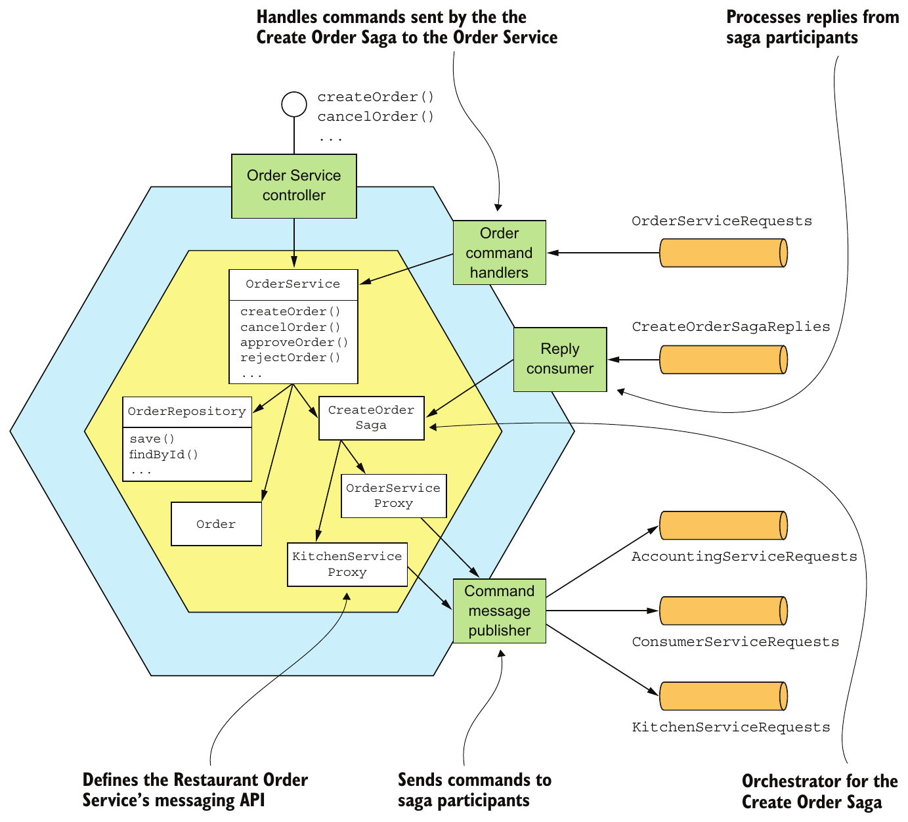

> **English:** Figure 4.9 The design of the Order Service and its sagas
>
> **Türkçe:** Şekil 4.9 Order Service’in ve saga işlemlerinin tasarımı

<!-- source-pages: 133 -->

<!-- source-record: u04_0222 -->

> **English:** Some parts of Order Service should look familiar. As in a traditional application, the core of the business logic is implemented by the OrderService, Order, and OrderRepository classes. In this chapter, I’ll briefly describe these classes. I describe them in more detail in chapter 5.
>
> **Türkçe:** Order Service’in bazı kısımları tanıdık gelecektir. Geleneksel bir uygulamadaki gibi iş mantığının çekirdeğini OrderService, Order ve OrderRepository sınıfları uygular. Bu bölümde bu sınıfları kısaca anlatacağım; 5. bölümde daha ayrıntılı açıklayacağım.

<!-- source-record: u04_0223 -->

> **English:** What’s less familiar about Order Service are the saga-related classes. This service is both a saga orchestrator and a saga participant. Order Service has several saga orchestrators, such as CreateOrderSaga. The saga orchestrators send command messages to a saga participant using a saga participant proxy class, such as KitchenServiceProxy and OrderServiceProxy. A saga participant proxy defines a saga participant’s messaging API. Order Service also has an OrderCommandHandlers class, which handles the command messages sent by sagas to Order Service.
>
> **Türkçe:** Order Service’in daha az tanıdık kısmı saga ile ilgili sınıflardır. Bu servis hem saga orchestrator hem de saga katılımcısıdır. CreateOrderSaga gibi birkaç orchestrator içerir. Bunlar, KitchenServiceProxy ve OrderServiceProxy gibi saga katılımcısı proxy sınıflarını kullanarak katılımcılara komut mesajı gönderir. Katılımcı proxy’si, katılımcının mesajlaşma API’sini tanımlar. Order Service ayrıca saga işlemlerinin kendisine gönderdiği komut mesajlarını işleyen OrderCommandHandlers sınıfını içerir.

<!-- source-record: u04_0224 -->

> **English:** Let’s look in more detail at the design, starting with the OrderService class.
>
> **Türkçe:** OrderService sınıfından başlayarak tasarımına daha ayrıntılı bir bakalım.

<!-- source-record: u04_0225 -->

### 4.4.1 The OrderService class — OrderService sınıfı

<!-- source-record: u04_0226 -->

> **English:** The OrderService class is a domain service called by the service’s API layer. It’s responsible for creating and managing orders. Figure 4.10 shows OrderService and some of its collaborators. OrderService creates and updates Orders, invokes the OrderRepository to persist Orders, and creates sagas, such as the CreateOrderSaga, using the SagaManager. The SagaManager class is one of the classes provided by the Eventuate Tram Saga framework, which is a framework for writing saga orchestrators and participants, and is discussed a little later in this section.
>
> **Türkçe:** OrderService, servisin API katmanının çağırdığı bir domain service sınıfıdır. Siparişleri oluşturmaktan ve yönetmekten sorumludur. Şekil 4.10, OrderService’i ve işbirliği yaptığı bazı bileşenleri gösterir. OrderService, Order nesnelerini oluşturur ve günceller; bunları kalıcı olarak kaydetmek için OrderRepository’yi çağırır ve SagaManager kullanarak CreateOrderSaga gibi saga işlemlerini oluşturur. SagaManager, saga orchestrator ve katılımcıları geliştirmek için kullanılan Eventuate Tram Saga framework’ünün sağladığı sınıflardan biridir; bu bölümün ilerleyen kısmında ele alınacaktır.

<!-- source-record: u04_0227 -->

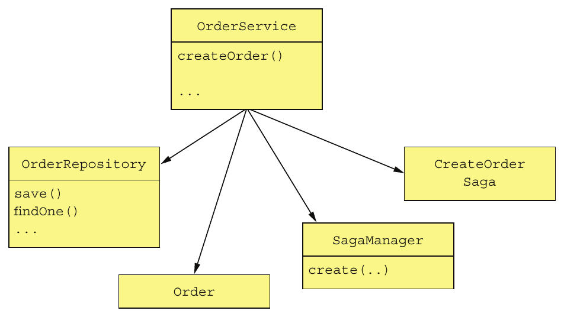

> **English:** Figure 4.10 OrderService creates and updates Orders, invokes the OrderRepository to persist Orders, and creates sagas, including the CreateOrderSaga.
>
> **Türkçe:** Şekil 4.10 OrderService, Order nesnelerini oluşturur ve günceller; bunları kalıcı kaydetmek için OrderRepository’yi çağırır ve CreateOrderSaga dahil saga işlemlerini oluşturur.

<!-- source-pages: 134 -->

<!-- source-record: u04_0228 -->

> **English:** I’ll discuss this class in more detail in chapter 5. For now, let’s focus on the createOrder() method. The following listing shows OrderService’s createOrder() method. This method first creates an Order and then creates an CreateOrderSaga to validate the order.
>
> **Türkçe:** Bu sınıfı 5. bölümde daha ayrıntılı ele alacağım. Şimdilik createOrder() metoduna odaklanalım. Aşağıdaki kod, OrderService’in createOrder() metodunu gösterir. Metot önce bir Order, ardından siparişi doğrulamak için bir CreateOrderSaga oluşturur.

<!-- source-record: u04_0229 -->

#### Listing 4.1 The OrderService class and its createOrder() method — Liste 4.1 OrderService sınıfı ve createOrder() yöntemi

<!-- source-record: u04_0230 -->

```java
@Transactional
 public class OrderService {

  @Autowired
  private SagaManager<CreateOrderSagaState> createOrderSagaManager;

  @Autowired
  private OrderRepository orderRepository;

  @Autowired
  private DomainEventPublisher eventPublisher;

  public Order createOrder(OrderDetails orderDetails) {
    ...
    ResultWithEvents<Order> orderAndEvents = Order.createOrder(...);
     Order order = orderAndEvents.result;
    orderRepository.save(order);

    eventPublisher.publish(Order.class,
                            Long.toString(order.getId()),
                           orderAndEvents.events);

    CreateOrderSagaState data =
        new CreateOrderSagaState(order.getId(), orderDetails);
     createOrderSagaManager.create(data, Order.class, order.getId());

    return order;
  }

  ...
}
```

<!-- source-record: u04_0231 -->

**Kod açıklaması:**

> **English:** Ensure that service methods are transactional.
>
> **Türkçe:** Servis metotlarının transaction içinde çalışmasını sağlar.

<!-- source-record: u04_0232 -->

**Kod açıklaması:**

> **English:** Create the Order.
>
> **Türkçe:** Order nesnesini oluşturur.

<!-- source-record: u04_0233 -->

**Kod açıklaması:**

> **English:** Persist the Order in the database.
>
> **Türkçe:** Order nesnesini veritabanına kalıcı olarak kaydeder.

<!-- source-record: u04_0234 -->

**Kod açıklaması:**

> **English:** Publish domain events.
>
> **Türkçe:** Domain event’leri yayımlar.

<!-- source-record: u04_0235 -->

**Kod açıklaması:**

> **English:** Create a CreateOrderSaga.
>
> **Türkçe:** Bir CreateOrderSaga oluşturur.

<!-- source-record: u04_0236 -->

> **English:** The createOrder() method creates an Order by calling the factory method Order.createOrder(). It then persists the Order using the OrderRepository, which is a JPA-based repository. It creates the CreateOrderSaga by calling SagaManager.create(), passing a CreateOrderSagaState containing the ID of the newly saved Order and the OrderDetails. The SagaManager instantiates the saga orchestrator, which causes it to send a command message to the first saga participant, and persists the saga orchestrator in the database.
>
> **Türkçe:** createOrder() metodu, Order.createOrder() factory metodunu çağırarak bir Order oluşturur. Ardından JPA tabanlı bir repository olan OrderRepository ile Order nesnesini kalıcı olarak kaydeder. Yeni kaydedilen Order kimliğini ve OrderDetails verisini içeren bir CreateOrderSagaState nesnesini SagaManager.create() çağrısına geçirerek CreateOrderSaga oluşturur. SagaManager, saga orchestrator nesnesini oluşturur; bu, ilk katılımcıya komut mesajı gönderilmesini tetikler. Ardından orchestrator nesnesini veritabanına kalıcı olarak kaydeder.

<!-- source-record: u04_0237 -->

> **English:** Let’s look at the CreateOrderSaga and its associated classes.
>
> **Türkçe:** CreateOrderSaga ve ilgili sınıflara bir bakalım.

<!-- source-pages: 135 -->

<!-- source-record: u04_0238 -->

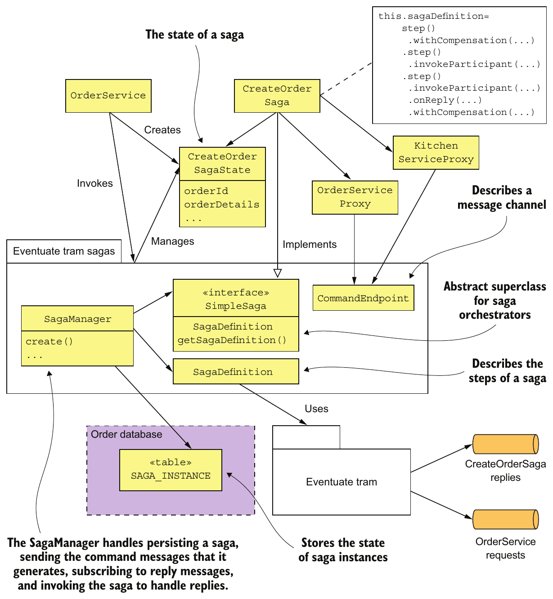

> **English:** Figure 4.11 The OrderService's sagas, such as Create Order Saga, are implemented using the Eventuate Tram Saga framework.
>
> **Türkçe:** Şekil 4.11 OrderService’in Create Order Saga gibi saga işlemleri, Eventuate Tram Saga framework’ü kullanılarak uygulanır.

<!-- source-record: u04_0239 -->

### 4.4.2 The implementation of the Create Order Saga — Create Order Saga'nın gerçekleştirilmesi

<!-- source-record: u04_0240 -->

> **English:** Figure 4.11 shows the classes that implement the Create Order Saga. The responsibilities of each class are as follows:
>
> **Türkçe:** Şekil 4.11, Create Order Saga’yı uygulayan sınıfları gösterir. Sınıfların sorumlulukları şöyledir:

<!-- source-record: u04_0241 -->

> **English:** • CreateOrderSaga—A singleton class that defines the saga’s state machine. It invokes the CreateOrderSagaState to create command messages and sends them to participants using message channels specified by the saga participant proxy classes, such as KitchenServiceProxy.
>
> **Türkçe:** • CreateOrderSaga — Saga durum makinesini tanımlayan singleton sınıftır. Komut mesajlarını oluşturmak için CreateOrderSagaState’i çağırır; bunları KitchenServiceProxy gibi katılımcı proxy sınıflarının belirttiği mesaj kanallarından katılımcılara gönderir.

<!-- source-pages: 136 -->

<!-- source-record: u04_0242 -->

> **English:** • CreateOrderSagaState—A saga’s persistent state, which creates command messages.
>
> **Türkçe:** • CreateOrderSagaState — Komut mesajları oluşturan, saga işleminin kalıcı durumunu temsil eden sınıftır.

<!-- source-record: u04_0243 -->

> **English:** • Saga participant proxy classes, such as KitchenServiceProxy—Each proxy class defines a saga participant’s messaging API, which consists of the command channel, the command message types, and the reply types.
>
> **Türkçe:** • KitchenServiceProxy gibi saga katılımcısı proxy sınıfları — Her proxy sınıfı, katılımcının komut kanalı, komut mesajı türleri ve yanıt türlerinden oluşan mesajlaşma API’sini tanımlar.

<!-- source-record: u04_0244 -->

> **English:** These classes are written using the Eventuate Tram Saga framework.
>
> **Türkçe:** Bu sınıflar Eventuate Tram Saga çerçevesini kullanarak yazılır.

<!-- source-record: u04_0245 -->

> **English:** The Eventuate Tram Saga framework provides a domain-specific language (DSL) for defining a saga’s state machine. It executes the saga’s state machine and exchanges messages with saga participants using the Eventuate Tram framework. The framework also persists the saga’s state in the database.
>
> **Türkçe:** Eventuate Tram Saga framework’ü, saga durum makinesini tanımlamak için alana özgü bir dil (DSL) sağlar. Durum makinesini yürütür ve Eventuate Tram kullanarak saga katılımcılarıyla mesaj alışverişi yapar. Saga durumunu da veritabanına kalıcı olarak kaydeder.

<!-- source-record: u04_0246 -->

> **English:** Let’s take a closer look at the implementation of Create Order Saga, starting with the CreateOrderSaga class.
>
> **Türkçe:** CreateOrderSaga sınıfından başlayarak Create Order Saga uygulamasını daha yakından inceleyelim.

<!-- source-record: u04_0247 -->

#### THE CREATEORDERSAGA ORCHESTRATOR — CreateOrderSaga orkestratörü

<!-- source-record: u04_0248 -->

> **English:** The CreateOrderSaga class implements the state machine shown earlier in figure 4.7. This class implements SimpleSaga, a base interface for sagas. The heart of the CreateOrderSaga class is the saga definition shown in the following listing. It uses the DSL provided by the Eventuate Tram Saga framework to define the steps of the Create Order Saga.
>
> **Türkçe:** CreateOrderSaga sınıfı, daha önce Şekil 4.7’de gösterilen durum makinesini uygular. Saga işlemleri için temel arayüz olan SimpleSaga’yı implement eder. Sınıfın temelini, aşağıdaki kodda gösterilen saga tanımı oluşturur. Create Order Saga adımlarını tanımlamak için Eventuate Tram Saga framework’ünün sağladığı DSL’i kullanır.

<!-- source-record: u04_0249 -->

#### Listing 4.2 The definition of the CreateOrderSaga — Listesi 4.2 CreateOrderSaga'nin tanımlanması

<!-- source-record: u04_0250 -->

```java
public class CreateOrderSaga implements SimpleSaga<CreateOrderSagaState> {

  private SagaDefinition<CreateOrderSagaState> sagaDefinition;

  public CreateOrderSaga(OrderServiceProxy orderService,
                         ConsumerServiceProxy consumerService,
                         KitchenServiceProxy kitchenService,
                         AccountingServiceProxy accountingService) {
    this.sagaDefinition =
             step()
              .withCompensation(orderService.reject,
                                CreateOrderSagaState::makeRejectOrderCommand)
            .step()
              .invokeParticipant(consumerService.validateOrder,
                      CreateOrderSagaState::makeValidateOrderByConsumerCommand)
            .step()
              .invokeParticipant(kitchenService.create,
                      CreateOrderSagaState::makeCreateTicketCommand)
              .onReply(CreateTicketReply.class,
                      CreateOrderSagaState::handleCreateTicketReply)
              .withCompensation(kitchenService.cancel,
                  CreateOrderSagaState::makeCancelCreateTicketCommand)
            .step()
              .invokeParticipant(accountingService.authorize,
                      CreateOrderSagaState::makeAuthorizeCommand)
            .step()
              .invokeParticipant(kitchenService.confirmCreate,
                  CreateOrderSagaState::makeConfirmCreateTicketCommand)
            .step()
              .invokeParticipant(orderService.approve,
                                 CreateOrderSagaState::makeApproveOrderCommand)
            .build();
  }

 @Override
 public SagaDefinition<CreateOrderSagaState> getSagaDefinition() {
  return sagaDefinition;
 }
```

<!-- source-pages: 137 -->

<!-- source-record: u04_0251 -->

> **English:** The CreateOrderSaga’s constructor creates the saga definition and stores it in the sagaDefinition field. The getSagaDefinition() method returns the saga definition.
>
> **Türkçe:** CreateOrderSaga constructor’ı saga tanımını oluşturur ve sagaDefinition alanında saklar. getSagaDefinition() metodu bu tanımı döndürür.

<!-- source-record: u04_0252 -->

> **English:** To see how CreateOrderSaga works, let’s look at the definition of the third step of the saga, shown in the following listing. This step of the saga invokes the Kitchen Service to create a Ticket. Its compensating transaction cancels that Ticket. The step(), invokeParticipant(), onReply(), and withCompensation() methods are part of the DSL provided by Eventuate Tram Saga.
>
> **Türkçe:** CreateOrderSaga’nın nasıl çalıştığını görmek için aşağıdaki kodda gösterilen üçüncü adımı inceleyelim. Bu adım, Ticket oluşturmak için Kitchen Service’i çağırır. Telafi işlemi bu Ticket nesnesini iptal eder. step(), invokeParticipant(), onReply() ve withCompensation() metotları, Eventuate Tram Saga’nın sağladığı DSL’in parçalarıdır.

<!-- source-record: u04_0253 -->

#### Listing 4.3 The definition of the third step of the saga — Listesi 4.3 saga'nin üçüncü aşamasının tanımlanması

<!-- source-record: u04_0254 -->

**Kod açıklaması:**

> **English:** Call handleCreateTicketReply() when a successful reply is received.
>
> **Türkçe:** Başarılı bir yanıt alındığında handleCreateTicketReply() çağrılır.

<!-- source-record: u04_0255 -->

```java
public class CreateOrderSaga ...

public CreateOrderSaga(..., KitchenServiceProxy kitchenService,
            ...) {
    ...
    .step()
      .invokeParticipant(kitchenService.create,
                 CreateOrderSagaState::makeCreateTicketCommand)
      .onReply(CreateTicketReply.class,
                CreateOrderSagaState::handleCreateTicketReply)
       .withCompensation(kitchenService.cancel,
               CreateOrderSagaState::makeCancelCreateTicketCommand)

    ...
  ;
```

<!-- source-record: u04_0256 -->

**Kod açıklaması:**

> **English:** Define the forward transaction.
>
> **Türkçe:** İleri yöndeki transaction işlemini tanımlar.

<!-- source-record: u04_0257 -->

**Kod açıklaması:**

> **English:** Define the compensating transaction.
>
> **Türkçe:** Telafi işlemini tanımlar.

<!-- source-record: u04_0258 -->

> **English:** The call to invokeParticipant() defines the forward transaction. It creates the CreateTicket command message by calling CreateOrderSagaState.makeCreateTicketCommand() and sends it to the channel specified by kitchenService.create. The call to onReply() specifies that CreateOrderSagaState.handleCreateTicketReply() should be called when a successful reply is received from Kitchen Service. This method stores the returned ticketId in the CreateOrderSagaState. The call to withCompensation() defines the compensating transaction. It creates a RejectTicketCommand command message by calling CreateOrderSagaState.makeCancelCreateTicket() and sends it to the channel specified by kitchenService.create.
>
> **Türkçe:** invokeParticipant() çağrısı ileri yöndeki transaction işlemini tanımlar. CreateOrderSagaState.makeCreateTicketCommand() çağrısıyla CreateTicket komut mesajını oluşturur ve kitchenService.create tarafından belirtilen kanala gönderir. onReply() çağrısı, Kitchen Service’den başarılı yanıt geldiğinde CreateOrderSagaState.handleCreateTicketReply() metodunun çağrılacağını belirtir. Bu metot, dönen ticketId değerini CreateOrderSagaState içinde saklar. withCompensation() çağrısı telafi işlemini tanımlar. CreateOrderSagaState.makeCancelCreateTicket() çağrısıyla bir RejectTicketCommand komut mesajı oluşturur ve kitchenService.create tarafından belirtilen kanala gönderir.

<!-- source-record: u04_0259 -->

> **English:** The other steps of the saga are defined in a similar fashion. The CreateOrderSagaState creates each message, which is sent by the saga to the messaging endpoint defined by a KitchenServiceProxy. Let’s take a look at each of those classes, starting with CreateOrderSagaState.
>
> **Türkçe:** Diğer saga adımları da benzer biçimde tanımlanır. CreateOrderSagaState her mesajı oluşturur; saga, bu mesajı KitchenServiceProxy tarafından tanımlanan mesajlaşma erişim noktasına gönderir. CreateOrderSagaState ile başlayarak bu sınıfları inceleyelim.

<!-- source-pages: 138 -->

<!-- source-record: u04_0260 -->

#### THE CREATEORDERSAGASTATE CLASS — CreateOrderSagaState sınıfı

<!-- source-record: u04_0261 -->

> **English:** The CreateOrderSagaState class, shown in the following listing, represents the state of a saga instance. An instance of this class is created by OrderService and is persisted in the database by the Eventuate Tram Saga framework. Its primary responsibility is to create the messages that are sent to saga participants.
>
> **Türkçe:** Aşağıdaki kodda gösterilen CreateOrderSagaState sınıfı, bir saga örneğinin durumunu temsil eder. Bu sınıfın nesnesini OrderService oluşturur; Eventuate Tram Saga framework’ü nesneyi veritabanına kalıcı olarak kaydeder. Temel sorumluluğu, saga katılımcılarına gönderilecek mesajları oluşturmaktır.

<!-- source-record: u04_0262 -->

#### Listing 4.4 CreateOrderSagaState stores the state of a saga instance — Liste 4.4 CreateOrderSagaState bir saga örneğinin durumunu kaydeder

<!-- source-record: u04_0263 -->

```java
public class CreateOrderSagaState {

  private Long orderId;

  private OrderDetails orderDetails;
  private long ticketId;

  public Long getOrderId() {
    return orderId;
  }

  private CreateOrderSagaState() {
  }

  public CreateOrderSagaState(Long orderId, OrderDetails orderDetails) {
     this.orderId = orderId;
    this.orderDetails = orderDetails;
  }

  CreateTicket makeCreateTicketCommand() {
     return new CreateTicket(getOrderDetails().getRestaurantId(),
                   getOrderId(), makeTicketDetails(getOrderDetails()));
  }

  void handleCreateTicketReply(CreateTicketReply reply) {
     logger.debug("getTicketId {}", reply.getTicketId());
    setTicketId(reply.getTicketId());
  }

  CancelCreateTicket makeCancelCreateTicketCommand() {
     return new CancelCreateTicket(getOrderId());
  }

  ...
```

<!-- source-record: u04_0264 -->

**Kod açıklaması:**

> **English:** Invoked by the OrderService to instantiate a CreateOrderSagaState
>
> **Türkçe:** OrderService, bir CreateOrderSagaState nesnesi oluşturmak için çağırır.

<!-- source-record: u04_0265 -->

**Kod açıklaması:**

> **English:** Creates a CreateTicket command message
>
> **Türkçe:** Bir CreateTicket komut mesajı oluşturur.

<!-- source-record: u04_0266 -->

**Kod açıklaması:**

> **English:** Saves the ID of the newly created Ticket
>
> **Türkçe:** Yeni oluşturulan Ticket nesnesinin kimliğini kaydeder.

<!-- source-record: u04_0267 -->

**Kod açıklaması:**

> **English:** Creates CancelCreateTicket command message
>
> **Türkçe:** CancelCreateTicket komut mesajını oluşturur.

<!-- source-record: u04_0268 -->

> **English:** The CreateOrderSaga invokes the CreateOrderSagaState to create the command messages. It sends those command messages to the endpoints defined by the SagaParticipantProxy classes. Let’s take a look at one of those classes: KitchenServiceProxy.
>
> **Türkçe:** CreateOrderSaga, komut mesajlarını oluşturmak için CreateOrderSagaState’i çağırır. Bu mesajları SagaParticipantProxy sınıflarının tanımladığı erişim noktalarına gönderir. Bu sınıflardan KitchenServiceProxy’yi inceleyelim.

<!-- source-pages: 139 -->

<!-- source-record: u04_0269 -->

#### THE KITCHENSERVICEPROXY CLASS — KitchenServiceProxy sınıfı

<!-- source-record: u04_0270 -->

> **English:** The KitchenServiceProxy class, shown in listing 4.5, defines the command message endpoints for Kitchen Service. There are three endpoints:
>
> **Türkçe:** Kod 4.5’te gösterilen KitchenServiceProxy sınıfı, Kitchen Service’in komut mesajı erişim noktalarını tanımlar. Üç erişim noktası vardır:

<!-- source-record: u04_0271 -->

> **English:** • create—Creates a Ticket
>
> **Türkçe:** • create — Bir Ticket oluşturur.

<!-- source-record: u04_0272 -->

> **English:** • confirmCreate—Confirms the creation
>
> **Türkçe:** • confirmCreate — Oluşturma işlemini onaylar.

<!-- source-record: u04_0273 -->

> **English:** • cancel—Cancels a Ticket
>
> **Türkçe:** • cancel — Bir Ticket nesnesini iptal eder.

<!-- source-record: u04_0274 -->

> **English:** Each CommandEndpoint specifies the command type, the command message’s destination channel, and the expected reply types.
>
> **Türkçe:** Her CommandEndpoint komut türünü, komut mesajının hedef kanalı ve beklenen cevap türlerini belirtir.

<!-- source-record: u04_0275 -->

#### Listing 4.5 KitchenServiceProxy defines the command message endpoints for Kitchen Service — Listesi 4.5 KitchenServiceProxy, Kitchen Service için komut mesajı son noktalarını tanımlar

<!-- source-record: u04_0276 -->

```java
public class KitchenServiceProxy {

  public final CommandEndpoint<CreateTicket> create =
        CommandEndpointBuilder
          .forCommand(CreateTicket.class)
          .withChannel(
               KitchenServiceChannels.kitchenServiceChannel)
          .withReply(CreateTicketReply.class)
          .build();

  public final CommandEndpoint<ConfirmCreateTicket> confirmCreate =
         CommandEndpointBuilder
          .forCommand(ConfirmCreateTicket.class)
          .withChannel(
                KitchenServiceChannels.kitchenServiceChannel)
          .withReply(Success.class)
          .build();

  public final CommandEndpoint<CancelCreateTicket> cancel =
        CommandEndpointBuilder
          .forCommand(CancelCreateTicket.class)
          .withChannel(
                 KitchenServiceChannels.kitchenServiceChannel)
          .withReply(Success.class)
          .build();

}
```

<!-- source-record: u04_0277 -->

> **English:** Proxy classes, such as KitchenServiceProxy, aren’t strictly necessary. A saga could simply send command messages directly to participants. But proxy classes have two important benefits. First, a proxy class defines static typed endpoints, which reduces the chance of a saga sending the wrong message to a service. Second, a proxy class is a well-defined API for invoking a service that makes the code easier to understand and test. For example, chapter 10 describes how to write tests for KitchenServiceProxy that verify that Order Service correctly invokes Kitchen Service. Without KitchenServiceProxy, it would be impossible to write such a narrowly scoped test.
>
> **Türkçe:** KitchenServiceProxy gibi proxy sınıfları zorunlu değildir; saga, komut mesajlarını doğrudan katılımcılara gönderebilir. Ancak iki önemli yarar sağlarlar. İlk olarak proxy sınıfı, türleri derleme sırasında belirli olan erişim noktaları tanımlar; bu da saga işleminin bir servise yanlış mesaj gönderme olasılığını azaltır. İkinci olarak servisi çağırmak için açıkça tanımlanmış bir API sunar ve kodun anlaşılmasını, test edilmesini kolaylaştırır. Örneğin 10. bölümde, Order Service’in Kitchen Service’i doğru çağırdığını doğrulayan KitchenServiceProxy testleri anlatılır. KitchenServiceProxy olmadan bu kadar dar kapsamlı bir test yazılamazdı.

<!-- source-pages: 140 -->

<!-- source-record: u04_0278 -->

#### THE EVENTUATE TRAM SAGA FRAMEWORK — Eventuate Tram Saga framework'ü

<!-- source-record: u04_0279 -->

> **English:** The Eventuate Tram Saga, shown in figure 4.12, is a framework for writing both saga orchestrators and saga participants. It uses transactional messaging capabilities of Eventuate Tram, discussed in chapter 3.
>
> **Türkçe:** Şekil 4.12’deki Eventuate Tram Saga, hem saga orchestrator hem de saga katılımcısı geliştirmeye yönelik bir framework’tür. Eventuate Tram’ın 3. bölümde açıklanan transactional messaging yeteneklerini kullanır.

<!-- source-record: u04_0280 -->

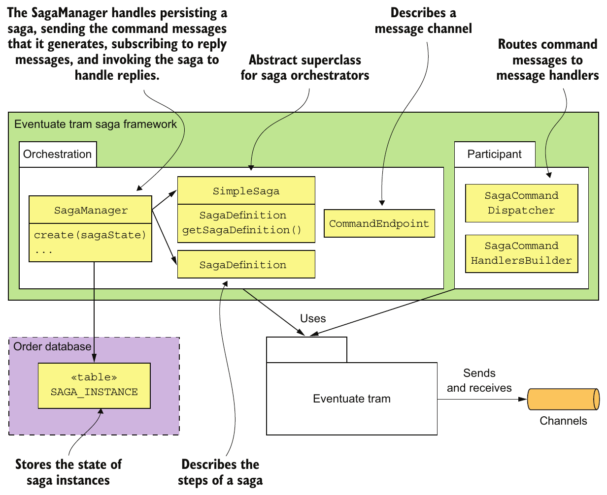

> **English:** Figure 4.12 Eventuate Tram Saga is a framework for writing both saga orchestrators and saga participants.
>
> **Türkçe:** Şekil 4.12 Eventuate Tram Saga, hem saga orchestrator hem de saga katılımcısı geliştirmek için kullanılan bir framework’tür.

<!-- source-record: u04_0281 -->

> **English:** The saga orchestration package is the most complex part of the framework. It provides SimpleSaga, a base interface for sagas, and a SagaManager class, which creates and manages saga instances. The SagaManager handles persisting a saga, sending the command messages that it generates, subscribing to reply messages, and invoking the saga to handle replies. Figure 4.13 shows the sequence of events when OrderService creates a saga. The sequence of events is as follows:
>
> **Türkçe:** Saga orkestrasyon paketi, framework’ün en karmaşık kısmıdır. Saga işlemlerinin temel arayüzü SimpleSaga’yı ve saga örneklerini oluşturup yöneten SagaManager sınıfını sağlar. SagaManager; saga durumunu kalıcı kaydetme, saga tarafından oluşturulan komut mesajlarını gönderme, yanıt mesajlarına abone olma ve yanıtları işlemesi için saga işlemini çağırma görevlerini üstlenir. Şekil 4.13, OrderService bir saga oluşturduğunda gerçekleşen olayları gösterir. Olayların sırası şöyledir:

<!-- source-record: u04_0282 -->

> **English:** 1 OrderService creates the CreateOrderSagaState.
>
> **Türkçe:** 1 OrderService, CreateOrderSagaState nesnesini oluşturur.

<!-- source-record: u04_0283 -->

> **English:** 2 It creates an instance of a saga by invoking the SagaManager.
>
> **Türkçe:** 2 SagaManager’ı çağırarak bir saga örneği oluşturur.

<!-- source-record: u04_0284 -->

> **English:** 3 The SagaManager executes the first step of the saga definition.
>
> **Türkçe:** 3 SagaManager, saga tanımının ilk adımını yürütür.

<!-- source-record: u04_0285 -->

> **English:** 4 The CreateOrderSagaState is invoked to generate a command message.
>
> **Türkçe:** 4 Komut mesajı üretmek için CreateOrderSagaState çağrılır.

<!-- source-pages: 141 -->

<!-- source-record: u04_0286 -->

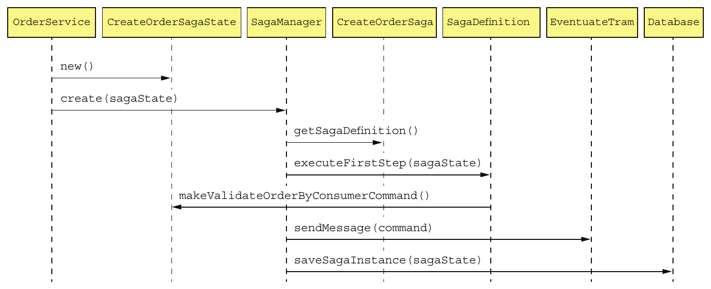

> **English:** Figure 4.13 The sequence of events when OrderService creates an instance of Create Order Saga
>
> **Türkçe:** Şekil 4.13 OrderService bir Create Order Saga örneği oluşturduğunda gerçekleşen olayların sırası

<!-- source-record: u04_0287 -->

> **English:** 5 The SagaManager sends the command message to the saga participant (the Consumer Service).
>
> **Türkçe:** 5 SagaManager, komut mesajını saga katılımcısına (Consumer Service) gönderir.

<!-- source-record: u04_0288 -->

> **English:** 6 The SagaManager saves the saga instance in the database.
>
> **Türkçe:** 6 SagaManager, saga örneğini veritabanına kaydeder.

<!-- source-record: u04_0289 -->

> **English:** Figure 4.14 shows the sequence of events when SagaManager receives a reply from Consumer Service.
>
> **Türkçe:** Şekil 4.14, SagaManager Consumer Service’den yanıt aldığında gerçekleşen olayların sırasını gösterir.

<!-- source-record: u04_0290 -->

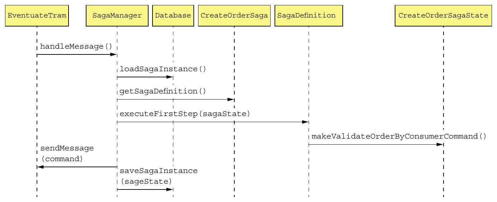

> **English:** Figure 4.14 The sequence of events when the SagaManager receives a reply message from a saga participant
>
> **Türkçe:** Şekil 4.14 SagaManager bir saga katılımcısından yanıt mesajı aldığında gerçekleşen olayların sırası

<!-- source-record: u04_0291 -->

> **English:** The sequence of events is as follows:
>
> **Türkçe:** Olayların sırası şöyle:

<!-- source-record: u04_0292 -->

> **English:** 1 Eventuate Tram invokes SagaManager with the reply from Consumer Service.
>
> **Türkçe:** 1 Eventuate Tram, Consumer Service’den gelen yanıtı SagaManager’a ileterek onu çağırır.

<!-- source-record: u04_0293 -->

> **English:** 2 SagaManager retrieves the saga instance from the database.
>
> **Türkçe:** 2 SagaManager, saga örneğini veritabanından alır.

<!-- source-record: u04_0294 -->

> **English:** 3 SagaManager executes the next step of the saga definition.
>
> **Türkçe:** 3 SagaManager, saga tanımının sonraki adımını yürütür.

<!-- source-pages: 142 -->

<!-- source-record: u04_0295 -->

> **English:** 4 CreateOrderSagaState is invoked to generate a command message.
>
> **Türkçe:** 4 Komut mesajı üretmek için CreateOrderSagaState çağrılır.

<!-- source-record: u04_0296 -->

> **English:** 5 SagaManager sends the command message to the specified saga participant (Kitchen Service).
>
> **Türkçe:** 5 SagaManager, komut mesajını belirtilen saga katılımcısına (Kitchen Service) gönderir.

<!-- source-record: u04_0297 -->

> **English:** 6 SagaManager saves the update saga instance in the database.
>
> **Türkçe:** 6 SagaManager, güncellenmiş saga örneğini veritabanına kaydeder.

<!-- source-record: u04_0298 -->

> **English:** If a saga participant fails, SagaManager executes the compensating transactions in reverse order.
>
> **Türkçe:** Bir saga katılımcısı başarısız olursa SagaManager, telafi işlemlerini ters sırayla yürütür.

<!-- source-record: u04_0299 -->

> **English:** The other part of the Eventuate Tram Saga framework is the saga participant package. It provides the SagaCommandHandlersBuilder and SagaCommandDispatcher classes for writing saga participants. These classes route command messages to handler methods, which invoke the saga participants’ business logic and generate reply messages. Let’s take a look at how these classes are used by Order Service.
>
> **Türkçe:** Eventuate Tram Saga framework’ünün diğer bölümü saga katılımcısı paketidir. Katılımcıları geliştirmek için SagaCommandHandlersBuilder ve SagaCommandDispatcher sınıflarını sağlar. Bu sınıflar, komut mesajlarını katılımcıların iş mantığını çağırıp yanıt mesajı üreten handler metotlarına yönlendirir. Order Service’in bu sınıfları nasıl kullandığını inceleyelim.

<!-- source-record: u04_0300 -->

### 4.4.3 The OrderCommandHandlers class — OrderCommandHandlers sınıfı

<!-- source-record: u04_0301 -->

> **English:** Order Service participates in its own sagas. For example, CreateOrderSaga invokes Order Service to either approve or reject an Order. The OrderCommandHandlers class, shown in figure 4.15, defines the handler methods for the command messages sent by these sagas.
>
> **Türkçe:** Order Service kendi saga işlemlerine katılır. Örneğin CreateOrderSaga, Order nesnesini onaylamak veya reddetmek için Order Service’i çağırır. Şekil 4.15’teki OrderCommandHandlers sınıfı, bu saga işlemlerinin gönderdiği komut mesajlarını işleyen handler metotlarını tanımlar.

<!-- source-record: u04_0302 -->

> **English:** Each handler method invokes OrderService to update an Order and makes a reply message. The SagaCommandDispatcher class routes the command messages to the appropriate handler method and sends the reply.
>
> **Türkçe:** Her handler metodu, Order nesnesini güncellemek için OrderService’i çağırır ve bir yanıt mesajı oluşturur. SagaCommandDispatcher, komut mesajını uygun handler metoduna yönlendirir ve yanıtı gönderir.

<!-- source-record: u04_0303 -->

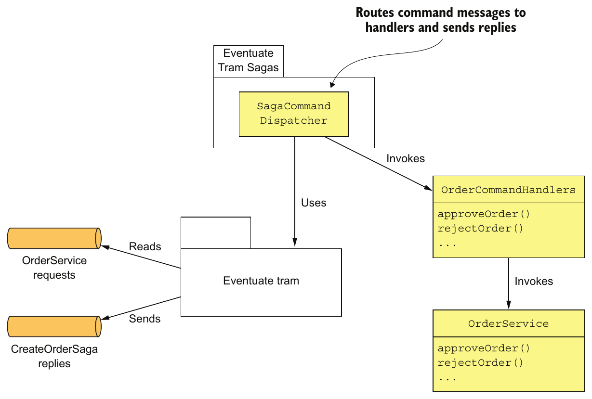

> **English:** Figure 4.15 OrderCommandHandlers implements command handlers for the commands that are sent by the various Order Service sagas.
>
> **Türkçe:** Şekil 4.15 OrderCommandHandlers, Order Service’in çeşitli saga işlemlerinin gönderdiği komutlar için handler metotları uygular.

<!-- source-pages: 143 -->

<!-- source-record: u04_0304 -->

> **English:** The following listing shows the OrderCommandHandlers class. Its commandHandlers() method maps command message types to handler methods. Each handler method takes a command message as a parameter, invokes OrderService, and returns a reply message.
>
> **Türkçe:** Aşağıdaki kod, OrderCommandHandlers sınıfını gösterir. commandHandlers() metodu, komut mesajı türlerini handler metotlarıyla eşleştirir. Her handler metodu parametre olarak bir komut mesajı alır, OrderService’i çağırır ve bir yanıt mesajı döndürür.

<!-- source-record: u04_0305 -->

#### Listing 4.6 The command handlers for Order Service — Listesi 4.6 Order Service için komut yöneticileri

<!-- source-record: u04_0306 -->

```java
public class OrderCommandHandlers {

  @Autowired
  private OrderService orderService;

  public CommandHandlers commandHandlers() {
     return SagaCommandHandlersBuilder
          .fromChannel("orderService")
          .onMessage(ApproveOrderCommand.class, this::approveOrder)
          .onMessage(RejectOrderCommand.class, this::rejectOrder)
          ...
          .build();

  }

  public Message approveOrder(CommandMessage<ApproveOrderCommand> cm) {
    long orderId = cm.getCommand().getOrderId();
    orderService.approveOrder(orderId);
     return withSuccess();
   }

  public Message rejectOrder(CommandMessage<RejectOrderCommand> cm) {
    long orderId = cm.getCommand().getOrderId();
    orderService.rejectOrder(orderId);
     return withSuccess();
  }
```

<!-- source-record: u04_0307 -->

**Kod açıklaması:**

> **English:** Route each command message to the appropriate handler method.
>
> **Türkçe:** Her komut mesajını uygun handler metoduna yönlendirir.

<!-- source-record: u04_0308 -->

**Kod açıklaması:**

> **English:** Change the state of the Order to authorized.
>
> **Türkçe:** Order durumunu yetkilendirilmiş olarak değiştirir.

<!-- source-record: u04_0309 -->

**Kod açıklaması:**

> **English:** Return a generic success message.
>
> **Türkçe:** Genel bir başarı mesajı döndürür.

<!-- source-record: u04_0310 -->

**Kod açıklaması:**

> **English:** Change the state of the Order to rejected.
>
> **Türkçe:** Order durumunu reddedilmiş olarak değiştirir.

<!-- source-record: u04_0311 -->

> **English:** The approveOrder() and rejectOrder() methods update the specified Order by invoking OrderService. The other services that participate in sagas have similar command handler classes that update their domain objects.
>
> **Türkçe:** approveOrder() ve rejectOrder() metotları, OrderService’i çağırarak belirtilen Order nesnesini günceller. Saga işlemlerine katılan diğer servislerde de domain nesnelerini güncelleyen benzer komut handler sınıfları bulunur.

<!-- source-record: u04_0312 -->

### 4.4.4 The OrderServiceConfiguration class — OrderServiceConfiguration sınıfı

<!-- source-record: u04_0313 -->

> **English:** The Order Service uses the Spring framework. The following listing is an excerpt of the OrderServiceConfiguration class, which is an @Configuration class that instantiates and wires together the Spring @Beans.
>
> **Türkçe:** Order Service, Spring framework’ünü kullanır. Aşağıdaki kod, Spring @Bean nesnelerini oluşturup birbirine bağlayan bir @Configuration sınıfı olan OrderServiceConfiguration sınıfından alınmıştır.

<!-- source-record: u04_0314 -->

#### Listing 4.7 The OrderServiceConfiguration is a Spring @Configuration class that defines the Spring @Beans for the Order Service. — Listesi 4.7 OrderServiceConfiguration, Order Service için Spring @Beans'i tanımlayan bir Spring @Configuration sınıfıdır.

<!-- source-record: u04_0315 -->

```java
@Configuration
public class OrderServiceConfiguration {
 @Bean
 public OrderService orderService(RestaurantRepository restaurantRepository,
                                  ...
                                  SagaManager<CreateOrderSagaState>
                                          createOrderSagaManager,
                                  ...) {
  return new OrderService(restaurantRepository,
                          ...
                          createOrderSagaManager
                          ...);
 }

 @Bean
 public SagaManager<CreateOrderSagaState> createOrderSagaManager(CreateOrderS
     aga saga) {
  return new SagaManagerImpl<>(saga);
 }

 @Bean
 public CreateOrderSaga createOrderSaga(OrderServiceProxy orderService,
                                        ConsumerServiceProxy consumerService,
                                        ...) {
  return new CreateOrderSaga(orderService, consumerService, ...);
 }

 @Bean
 public OrderCommandHandlers orderCommandHandlers() {
  return new OrderCommandHandlers();
 }

 @Bean
 public SagaCommandDispatcher  orderCommandHandlersDispatcher(OrderCommandHan
     dlers orderCommandHandlers) {
  return new SagaCommandDispatcher("orderService", orderCommandHandlers.comma
     ndHandlers());
 }

 @Bean
 public KitchenServiceProxy kitchenServiceProxy() {
   return new KitchenServiceProxy();
 }

 @Bean
 public OrderServiceProxy orderServiceProxy() {
   return new OrderServiceProxy();
 }

 ...

}
```

<!-- source-pages: 144,145 -->

<!-- source-record: u04_0316 -->

> **English:** This class defines several Spring @Beans including orderService, createOrderSagaManager, createOrderSaga, orderCommandHandlers, and orderCommandHandlersDispatcher. It also defines Spring @Beans for the various proxy classes, including kitchenServiceProxy and orderServiceProxy. CreateOrderSaga is only one of Order Service’s many sagas. Many of its other system operations also use sagas. For example, the cancelOrder() operation uses a Cancel Order Saga, and the reviseOrder() operation uses a Revise Order Saga. As a result, even though many services have an external API that uses a synchronous protocol, such as REST or gRPC, a large amount of interservice communication will use asynchronous messaging.
>
> **Türkçe:** Bu sınıf; orderService, createOrderSagaManager, createOrderSaga, orderCommandHandlers ve orderCommandHandlersDispatcher dahil çeşitli Spring @Bean nesnelerini tanımlar. kitchenServiceProxy ve orderServiceProxy gibi proxy sınıfları için de Spring @Bean nesneleri tanımlar. CreateOrderSaga, Order Service’in çok sayıdaki saga işleminden yalnızca biridir. Diğer sistem operasyonlarının birçoğu da saga kullanır. Örneğin cancelOrder(), Cancel Order Saga’yı; reviseOrder() ise Revise Order Saga’yı kullanır. Dolayısıyla birçok servis dışarıya REST veya gRPC gibi eşzamanlı protokoller kullanan bir API sunsa da servisler arası iletişimin büyük bir bölümü eşzamansız mesajlaşmayla gerçekleşir.

<!-- source-pages: 145 -->

<!-- source-record: u04_0317 -->

> **English:** As you can see, transaction management and some aspects of business logic design are quite different in a microservice architecture. Fortunately, saga orchestrators are usually quite simple state machines, and you can use a saga framework to simplify your code. Nevertheless, transaction management is certainly more complicated than in a monolithic architecture. But that’s usually a small price to pay for the tremendous benefits of microservices.
>
> **Türkçe:** Görüldüğü gibi, mikroservis mimarisinde transaction yönetimi ve iş mantığı tasarımının bazı yönleri oldukça farklıdır. Neyse ki saga orchestrator bileşenleri genellikle basit durum makineleridir ve saga framework’ü kullanarak kodunuzu sadeleştirebilirsiniz. Yine de transaction yönetimi monolitik mimariye göre daha karmaşıktır. Bu, mikroservislerin büyük yararları karşılığında genellikle küçük bir bedeldir.

<!-- source-record: u04_0318 -->

## Summary — Bölüm özeti

<!-- source-record: u04_0319 -->

> **English:** • Some system operations need to update data scattered across multiple services. Traditional, XA/2PC-based distributed transactions aren’t a good fit for modern applications. A better approach is to use the Saga pattern. A saga is sequence of local transactions that are coordinated using messaging. Each local transaction updates data in a single service. Because each local transaction commits its changes, if a saga must roll back due to the violation of a business rule, it must execute compensating transactions to explicitly undo changes.
>
> **Türkçe:** • Bazı sistem operasyonları, birden fazla servise dağılmış verileri güncellemek zorundadır. Geleneksel XA/2PC tabanlı dağıtık transaction işlemleri modern uygulamalar için uygun değildir. Daha iyi bir yaklaşım Saga örüntüsüdür. Saga, mesajlaşma ile koordine edilen yerel transaction işlemlerinden oluşur. Her yerel transaction, tek bir servisteki verileri günceller ve değişikliklerini commit eder. Bu nedenle bir iş kuralı ihlali yüzünden saga geri alınacaksa, değişiklikleri açıkça geri alan telafi işlemleri yürütülmelidir.

<!-- source-record: u04_0320 -->

> **English:** • You can use either choreography or orchestration to coordinate the steps of a saga. In a choreography-based saga, a local transaction publishes events that trigger other participants to execute local transactions. In an orchestration-based saga, a centralized saga orchestrator sends command messages to participants telling them to execute local transactions. You can simplify development and testing by modeling saga orchestrators as state machines. Simple sagas can use choreography, but orchestration is usually a better approach for complex sagas.
>
> **Türkçe:** • Saga adımlarını koordine etmek için koreografi veya orkestrasyon kullanılabilir. Koreografi tabanlı saga işleminde yerel transaction, diğer katılımcıların yerel transaction yürütmesini tetikleyen olaylar yayımlar. Orkestrasyon tabanlı saga işleminde ise merkezi bir saga orchestrator, katılımcılara yerel transaction yürütmelerini bildiren komut mesajları gönderir. Orchestrator bileşenlerini durum makinesi olarak modellemek geliştirmeyi ve testi kolaylaştırır. Basit saga işlemleri koreografi kullanabilir; karmaşık saga işlemlerinde genellikle orkestrasyon daha uygundur.

<!-- source-record: u04_0321 -->

> **English:** • Designing saga-based business logic can be challenging because, unlike ACID transactions, sagas aren’t isolated from one another. You must often use countermeasures, which are design strategies that prevent concurrency anomalies caused by the ACD transaction model. An application may even need to use locking in order to simplify the business logic, even though that risks deadlocks.
>
> **Türkçe:** • Saga işlemleri, ACID transaction işlemlerinden farklı olarak birbirinden yalıtılmadığından saga tabanlı iş mantığını tasarlamak zor olabilir. ACD transaction modelinin yol açtığı eşzamanlılık anomalilerini önleyen karşı önlem stratejilerini sıklıkla kullanmanız gerekir. Uygulama, deadlock riski taşısa bile iş mantığını basitleştirmek için kilitleme kullanmak zorunda kalabilir.
