# Ünite 05 · Designing business logic in a microservice architecture — Microservice mimarisinde iş mantığını tasarlama

**Amaç:** Microservice mimarisinde iş mantığını tasarlama konusunu İngilizce–Türkçe karşılaştırmalı çalışmak; teknik açıklamaları özgün şekiller, tablolar ve kod örnekleriyle birlikte okumak.

**Kaynak:** Kullanıcının sağladığı *Microservices Patterns*, bölüm 5; `Microservices_Patterns_1_Bolumden_Itibaren.pdf`, kaynak PDF sayfaları **146–182**. Başlık ve metin sırası korunmuş, sayfa sonlarında bölünen paragraflar birleştirilmiştir. Şekiller, üzerlerindeki yazılar korunarak kaynak PDF'den alınmıştır.

**Okuma notu:** Teknoloji ve şirket örnekleri kitabın yazıldığı dönemin anlatımıdır. Kodlar kaynakta verilen bağlama bağlı örneklerdir; bağımsız Java 17 programları olarak sunulmaz. İngilizce kaynak ve Türkçe çeviri ardışık bloklardadır. Çeviri hazırlığında yerel bir çeviri modeli kullanılmış; teknik terimler ve metin aktarımı ayrıca kontrol edilmiştir.

**Dil çalışması:** [Ünite sözlüğü](vocabulary.md) · [Vocabulary PDF](vocabulary.pdf) · [Grammar notları](grammar_notes.md) · [Grammar PDF](grammar_notes.pdf). Kelime anlamları ve cümle yapılarının ayrıntıları bu iki eşlikçi kaynaktadır.

<!-- source-pages: 146 -->

<!-- source-record: u05_0000 -->

## This chapter covers — Bu bölümün kapsamı

<!-- source-record: u05_0001 -->

> **English:** • Applying the business logic organization patterns: Transaction script pattern and Domain model pattern
>
> **Türkçe:** • İş mantığını düzenlemek için Transaction script ve Domain model örüntülerini uygulama

<!-- source-record: u05_0002 -->

> **English:** • Designing business logic with the Domain-driven design (DDD) aggregate pattern
>
> **Türkçe:** • Domain-driven design (DDD, alan odaklı tasarım) Aggregate örüntüsüyle iş mantığı tasarlama

<!-- source-record: u05_0003 -->

> **English:** • Applying the Domain event pattern in a microservice architecture
>
> **Türkçe:** • Mikroservis mimarisinde Domain event örüntüsünü uygulama

<!-- source-record: u05_0004 -->

> **English:** The heart of an enterprise application is the business logic, which implements the business rules. Developing complex business logic is always challenging. The FTGO application’s business logic implements some quite complex business logic, especially for order management and delivery management. Mary had encouraged her team to apply object-oriented design principles, because in her experience this was the best way to implement complex business logic. Some of the business logic used the procedural Transaction script pattern. But the majority of the FTGO application’s business logic is implemented in an object-oriented domain model that’s mapped to the database using JPA.
>
> **Türkçe:** Kurumsal bir uygulamanın merkezinde, iş kurallarını uygulayan iş mantığı bulunur. Karmaşık iş mantığı geliştirmek her zaman zordur. FTGO uygulaması, özellikle sipariş ve teslimat yönetiminde oldukça karmaşık iş mantığı içerir. Mary, deneyimine göre bunun en iyi yolu olduğu için ekibini nesne yönelimli tasarım ilkelerini uygulamaya teşvik etmişti. İş mantığının bir bölümü prosedürel Transaction script örüntüsünü kullanıyordu. Ancak büyük bölümü, JPA ile veritabanına eşlenen nesne yönelimli bir domain model içinde uygulanmıştı.

<!-- source-record: u05_0005 -->

> **English:** Developing complex business logic is even more challenging in a microservice architecture where the business logic is spread over multiple services. You need to address two key challenges. First, a typical domain model is a tangled web of interconnected classes. Although this isn’t a problem in a monolithic application, in a microservice architecture, where classes are scattered around different services, you need to eliminate object references that would otherwise span service boundaries. The second challenge is designing business logic that works within the transaction management constraints of a microservice architecture. Your business logic can use ACID transactions within services, but as described in chapter 4, it must use the Saga pattern to maintain data consistency across services.
>
> **Türkçe:** İş mantığının birden fazla servise dağıldığı mikroservis mimarisinde karmaşık iş mantığı geliştirmek daha da zordur. İki temel sorunu çözmelisiniz. Birincisi, tipik bir domain model birbirine bağlı sınıflardan oluşan karmaşık bir ağdır. Monolitik uygulamada bu sorun oluşturmasa da sınıfların farklı servislerde bulunduğu mikroservis mimarisinde, servis sınırlarını aşacak nesne referanslarını ortadan kaldırmanız gerekir. İkincisi, mikroservis mimarisinin transaction yönetimi kısıtları içinde çalışan iş mantığı tasarlamaktır. İş mantığı servis içinde ACID transaction kullanabilir; ancak 4. bölümde açıklandığı gibi servisler arasında veri tutarlılığını korumak için Saga örüntüsünü kullanmalıdır.

<!-- source-pages: 147 -->

<!-- source-record: u05_0006 -->

> **English:** Fortunately, we can address these issues by using the Aggregate pattern from DDD. The Aggregate pattern structures a service’s business logic as a collection of aggregates. An aggregate is a cluster of objects that can be treated as a unit. There are two reasons why aggregates are useful when developing business logic in a microservice architecture:
>
> **Türkçe:** Bu sorunları DDD içindeki Aggregate örüntüsüyle ele alabiliriz. Bu örüntü, servisin iş mantığını aggregate nesnelerinden oluşan bir koleksiyon olarak düzenler. Aggregate, tek bir bütün olarak ele alınabilen nesne kümesidir. Mikroservis mimarisinde iş mantığı geliştirirken aggregate kullanımının yararlı olmasının iki nedeni vardır:

<!-- source-record: u05_0007 -->

> **English:** • Aggregates avoid any possibility of object references spanning service boundaries, because an inter-aggregate reference is a primary key value rather than an object reference.
>
> **Türkçe:** • Aggregate birimleri arasındaki referanslar nesne referansı yerine birincil anahtar değeri kullandığından, nesne referanslarının servis sınırlarını aşması engellenir.

<!-- source-record: u05_0008 -->

> **English:** • Because a transaction can only create or update a single aggregate, aggregates fit the constraints of the microservices transaction model.
>
> **Türkçe:** • Bir transaction yalnızca tek bir aggregate oluşturabildiği veya güncelleyebildiği için aggregate yaklaşımı, mikroservis transaction modelinin kısıtlarına uyar.

<!-- source-record: u05_0009 -->

> **English:** As a result, an ACID transaction is guaranteed to be within a single service.
>
> **Türkçe:** Böylece ACID transaction işleminin tek bir servis içinde kalması güvence altına alınır.

<!-- source-record: u05_0010 -->

> **English:** I begin this chapter by describing the different ways of organizing business logic: the Transaction script pattern and the Domain model pattern. Next I introduce the concept of a DDD aggregate and explain why it’s a good building block for a service’s business logic. After that, I describe the Domain event pattern events and explain why it’s useful for a service to publish events. I end this chapter with a couple of examples of business logic from Kitchen Service and Order Service.
>
> **Türkçe:** Bu bölüme iş mantığını düzenlemenin iki yolunu, Transaction script ve Domain model örüntülerini açıklayarak başlıyorum. Ardından DDD aggregate kavramını tanıtıyor ve servisin iş mantığı için neden uygun bir yapı taşı olduğunu açıklıyorum. Sonra Domain event örüntüsünü ve servisin olay yayımlamasının yararlarını ele alıyorum. Bölümü Kitchen Service ve Order Service iş mantığından örneklerle tamamlıyorum.

<!-- source-record: u05_0011 -->

> **English:** Let’s now look at business logic organization patterns.
>
> **Türkçe:** Şimdi iş mantığını düzenleyen örüntüleri inceleyelim.

<!-- source-record: u05_0012 -->

## 5.1 Business logic organization patterns — İş mantığını düzenleme örüntüleri

<!-- source-record: u05_0013 -->

> **English:** Figure 5.1 shows the architecture of a typical service. As described in chapter 2, the business logic is the core of a hexagonal architecture. Surrounding the business logic are the inbound and outbound adapters. An inbound adapter handles requests from clients and invokes the business logic. An outbound adapter, which is invoked by the business logic, invokes other services and applications.
>
> **Türkçe:** Şekil 5.1 tipik bir servisin mimarisini gösterir. 2. bölümde açıklandığı gibi iş mantığı, hexagonal architecture (altıgen mimari) yapısının çekirdeğidir. Etrafında inbound ve outbound adapter bileşenleri bulunur. Inbound adapter, istemci isteklerini işler ve iş mantığını çağırır. İş mantığının çağırdığı outbound adapter ise diğer servis ve uygulamaları çağırır.

<!-- source-record: u05_0014 -->

> **English:** This service consists of the business logic and the following adapters:
>
> **Türkçe:** Bu servis iş mantığı ve aşağıdaki adaptörlerden oluşur:

<!-- source-record: u05_0015 -->

> **English:** • REST API adapter—An inbound adapter that implements a REST API which invokes the business logic
>
> **Türkçe:** • REST API adaptörü - İş mantığını çağıran bir REST API uygulayan inbound adapter (giriş uyarlayıcısı)

<!-- source-record: u05_0016 -->

> **English:** • OrderCommandHandlers—An inbound adapter that consumes command messages from a message channel and invokes the business logic
>
> **Türkçe:** • OrderCommandHandlers - Bir mesaj kanalından komut mesajlarını tüketen ve iş mantığını çağıran bir inbound adapter (giriş uyarlayıcısı)

<!-- source-record: u05_0017 -->

> **English:** • Database Adapter—An outbound adapter that’s invoked by the business logic to access the database
>
> **Türkçe:** • Veri tabanı adaptörü - Veri tabanına erişmek için iş mantığı tarafından çağrılan outbound adapter (çıkış uyarlayıcısı)

<!-- source-record: u05_0018 -->

> **English:** • Domain Event Publishing Adapter—An outbound adapter that publishes events to a message broker
>
> **Türkçe:** • Domain Event Publishing Adapter — Olayları mesaj aracısına yayımlayan bir outbound adapter’dır.

> **English:** The business logic is typically the most complex part of the service. When developing business logic, you should consciously organize your business logic in the way that’s most appropriate for your application. After all, I’m sure you’ve experienced the frustration of having to maintain someone else’s badly structured code.
>
> **Türkçe:** İş mantığı genellikle servisin en karmaşık bölümüdür. İş mantığını geliştirirken uygulamanıza en uygun biçimde bilinçli olarak düzenlemelisiniz. Başkasının kötü yapılandırılmış kodunun bakımını yapmak zorunda kalmanın ne kadar yorucu olduğunu muhtemelen deneyimlemişsinizdir.

> **English:** Most enterprise applications are written in an object-oriented language such as Java, so they consist of classes and methods. But using an object-oriented language doesn’t guarantee that the business logic has an object-oriented design. The key decision you must make when developing business logic is whether to use an object-oriented approach or a procedural approach.
>
> **Türkçe:** Kurumsal uygulamaların çoğu Java gibi nesne yönelimli bir dilde yazılır ve sınıflarla metotlardan oluşur. Ancak nesne yönelimli bir dil kullanmak, iş mantığının nesne yönelimli tasarlandığını garanti etmez. Temel karar, nesne yönelimli mi yoksa prosedürel mi bir yaklaşım kullanılacağıdır.

> **English:** There are two main patterns for organizing business logic: the procedural Transaction script pattern, and the object-oriented Domain model pattern.
>
> **Türkçe:** İş mantığını düzenlemek için iki ana örüntü vardır: prosedürel Transaction script ve nesne yönelimli Domain model.

<!-- source-pages: 148 -->

<!-- source-record: u05_0019 -->

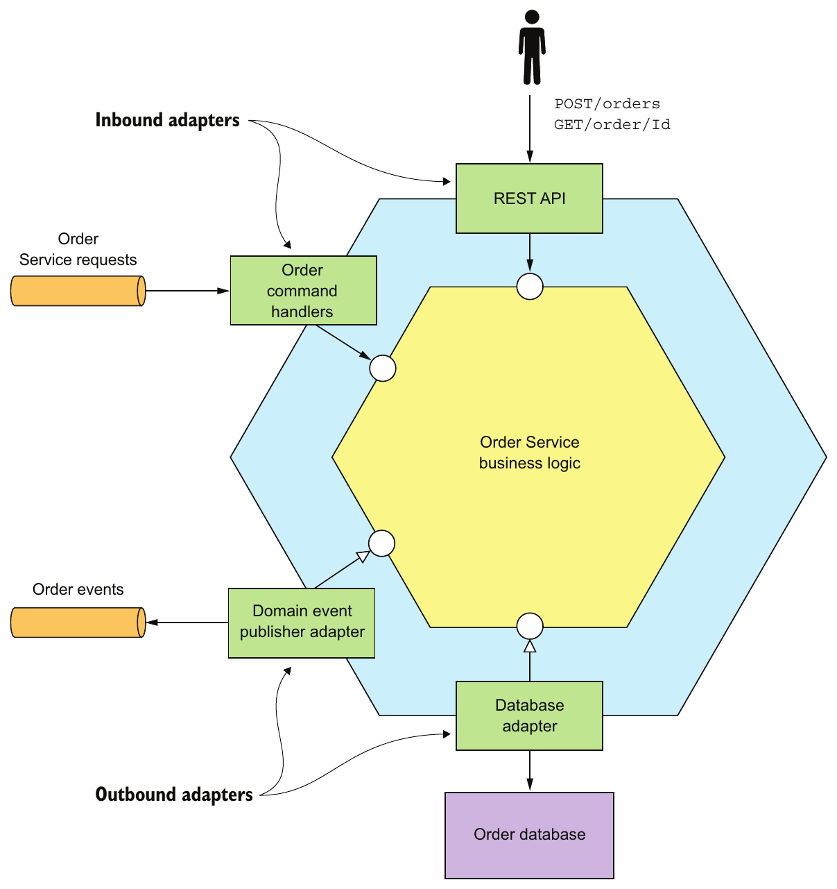

> **English:** Figure 5.1 The Order Service has a hexagonal architecture. It consists of the business logic and one or more adapters that interface with external applications and other services.
>
> **Türkçe:** Şekil 5.1 Order Service, altıgen mimariye sahiptir. İş mantığından ve dış uygulamalarla diğer servislere bağlanan bir veya daha fazla adapter bileşeninden oluşur.

<!-- source-pages: 149 -->

<!-- source-record: u05_0020 -->

### 5.1.1 Designing business logic using the Transaction script pattern — Transaction script örüntüsüyle iş mantığı tasarlamak

<!-- source-record: u05_0021 -->

> **English:** Although I’m a strong advocate of the object-oriented approach, there are some situations where it is overkill, such as when you are developing simple business logic. In such a situation, a better approach is to write procedural code and use what the book Patterns of Enterprise Application Architecture by Martin Fowler (Addison-Wesley Professional, 2002) calls the Transaction script pattern. Rather than doing any object-oriented design, you write a method called a transaction script to handle each request from the presentation tier. As figure 5.2 shows, an important characteristic of this approach is that the classes that implement behavior are separate from those that store state.
>
> **Türkçe:** Nesne yönelimli yaklaşımı güçlü biçimde savunsam da basit iş mantığı geliştirirken olduğu gibi gereğinden fazla karmaşıklık yarattığı durumlar vardır. Böyle durumlarda prosedürel kod yazmak ve Martin Fowler’ın Patterns of Enterprise Application Architecture kitabında (Addison-Wesley Professional, 2002) Transaction script adı verilen örüntüyü kullanmak daha uygundur. Nesne yönelimli tasarım yapmak yerine, sunum katmanından gelen her isteği işleyen transaction script adlı bir metot yazarsınız. Şekil 5.2’de görüldüğü gibi bu yaklaşımın önemli özelliği, davranışı uygulayan sınıflarla durumu saklayan sınıfların ayrı olmasıdır.

<!-- source-record: u05_0022 -->

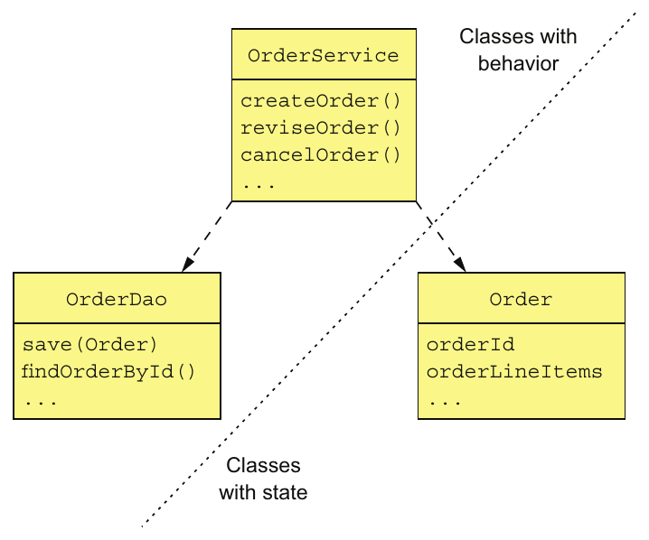

> **English:** Figure 5.2 Organizing business logic as transaction scripts. In a typical transaction script–based design, one set of classes implements behavior and another set stores state. The transaction scripts are organized into classes that typically have no state. The scripts use data classes, which typically have no behavior.
>
> **Türkçe:** Şekil 5.2 İş mantığını transaction script biçiminde düzenleme. Tipik bir tasarımda bir grup sınıf davranışı uygular, diğer grup durumu saklar. Transaction script metotları genellikle durum taşımayan sınıflarda toplanır ve çoğunlukla davranış içermeyen veri sınıflarını kullanır.

<!-- source-record: u05_0023 -->

> **English:** When using the Transaction script pattern, the scripts are usually located in service classes, which in this example is the OrderService class. A service class has one method for each request/system operation. The method implements the business logic for that request. It accesses the database using data access objects (DAOs), such as the OrderDao. The data objects, which in this example is the Order class, are pure data with little or no behavior.
>
> **Türkçe:** Transaction script örüntüsünde script metotları genellikle servis sınıflarında bulunur; bu örnekte bu sınıf OrderService’tir. Servis sınıfı, her istek veya sistem operasyonu için bir metot içerir. Metot, ilgili isteğin iş mantığını uygular ve OrderDao gibi veri erişim nesneleri (DAO) aracılığıyla veritabanına erişir. Bu örnekte Order sınıfıyla temsil edilen veri nesneleri çok az davranış içerir veya hiç içermez; yalnızca veri taşır.

<!-- source-record: u05_0024 -->

### Pattern: Transaction script — örüntü: İşlem senaryosu

<!-- source-record: u05_0025 -->

> **English:** Organize the business logic as a collection of procedural transaction scripts, one for each type of request.
>
> **Türkçe:** İş mantığını, her istek türü için bir tane olacak biçimde prosedürel transaction script metotlarından oluşan bir koleksiyon olarak düzenleyin.

<!-- source-record: u05_0026 -->

> **English:** This style of design is highly procedural and relies on few of the capabilities of object-oriented programming (OOP) languages. This what you would create if you were writing the application in C or another non-OOP language. Nevertheless, you shouldn’t be ashamed to use a procedural design when it’s appropriate. This approach works well for simple business logic. The drawback is that this tends not to be a good way to implement complex business logic.
>
> **Türkçe:** Bu tasarım biçimi büyük ölçüde prosedüreldir ve nesne yönelimli programlama (OOP) dillerinin yeteneklerinden az yararlanır. Uygulamayı C veya başka bir nesne yönelimli olmayan dilde yazsaydınız benzer bir yapı oluştururdunuz. Yine de uygun olduğunda prosedürel tasarım kullanmaktan çekinmemelisiniz. Basit iş mantığında iyi çalışır. Dezavantajı, karmaşık iş mantığını uygulamak için genellikle uygun olmamasıdır.

<!-- source-pages: 150 -->

<!-- source-record: u05_0027 -->

### 5.1.2 Designing business logic using the Domain model pattern — Domain model örüntüsüyle iş mantığı tasarlamak

<!-- source-record: u05_0028 -->

> **English:** The simplicity of the procedural approach can be quite seductive. You can write code without having to carefully consider how to organize the classes. The problem is that if your business logic becomes complex, you can end up with code that’s a nightmare to maintain. In fact, in the same way that a monolithic application has a habit of continually growing, transaction scripts have the same problem. Consequently, unless you’re writing an extremely simple application, you should resist the temptation to write procedural code and instead apply the Domain model pattern and develop an object-oriented design.
>
> **Türkçe:** Prosedürel yaklaşımın sadeliği oldukça çekici olabilir. Sınıfları nasıl düzenleyeceğinizi dikkatle düşünmeden kod yazabilirsiniz. Ancak iş mantığı karmaşıklaşırsa bakımı kâbusa dönüşen bir kod ortaya çıkabilir. Monolitik uygulamaların sürekli büyümesi gibi transaction script metotları da büyür. Bu nedenle son derece basit bir uygulama yazmıyorsanız prosedürel kod yazmanın cazibesine direnip Domain model örüntüsünü uygulayarak nesne yönelimli bir tasarım geliştirmelisiniz.

<!-- source-record: u05_0029 -->

### Pattern: Domain model — Şekil: Alan modeli

<!-- source-record: u05_0030 -->

> **English:** Organize the business logic as an object model consisting of classes that have state and behavior.
>
> **Türkçe:** İş mantığını, durum ve davranışları olan sınıflardan oluşan bir nesne modeli olarak organize edin.

<!-- source-record: u05_0031 -->

> **English:** In an object-oriented design, the business logic consists of an object model, a network of relatively small classes. These classes typically correspond directly to concepts from the problem domain. In such a design some classes have only either state or behavior, but many contain both, which is the hallmark of a well-designed class. Figure 5.3 shows an example of the Domain model pattern.
>
> **Türkçe:** Nesne yönelimli tasarımda iş mantığı, görece küçük sınıflardan oluşan bir nesne modelidir. Bu sınıflar genellikle problem alanındaki kavramlara doğrudan karşılık gelir. Bazıları yalnızca durum veya yalnızca davranış içerse de çoğu, iyi tasarlanmış bir sınıfın özelliği olan durum ve davranışı birlikte taşır. Şekil 5.3, Domain model örüntüsünün bir örneğini gösterir.

<!-- source-record: u05_0032 -->

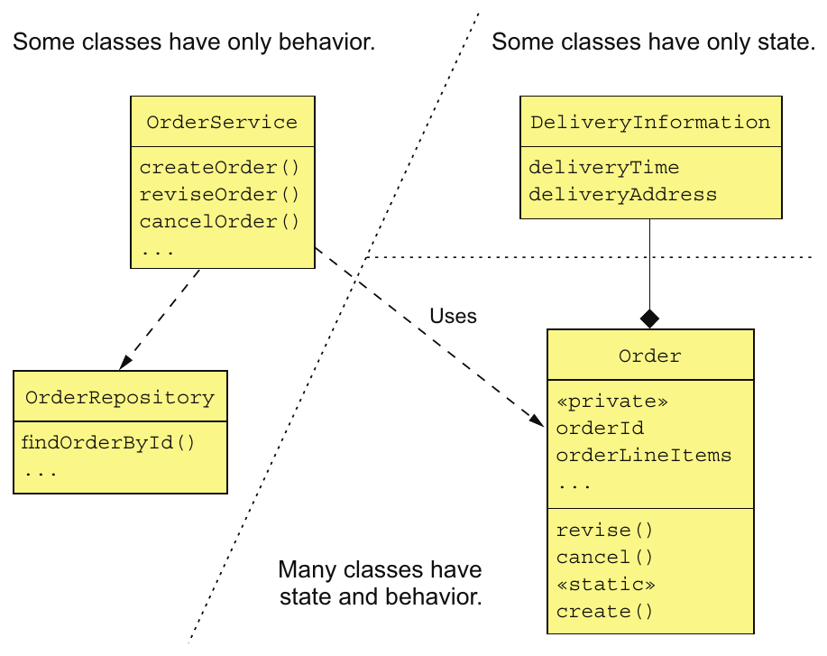

> **English:** Figure 5.3 Organizing business logic as a domain model. The majority of the business logic consists of classes that have state and behavior.
>
> **Türkçe:** Şekil 5.3 İş mantığını domain model olarak düzenleme. İş mantığının büyük bölümü, hem durum hem davranış içeren sınıflardan oluşur.

<!-- source-pages: 151 -->

<!-- source-record: u05_0033 -->

> **English:** As with the Transaction script pattern, an OrderService class has a method for each request/system operation. But when using the Domain model pattern, the service methods are usually simple. That’s because a service method almost always delegates to persistent domain objects, which contain the bulk of the business logic. A service method might, for example, load a domain object from the database and invoke one of its methods. In this example, the Order class has both state and behavior. Moreover, its state is private and can only be accessed indirectly via its methods.
>
> **Türkçe:** Transaction script örüntüsünde olduğu gibi OrderService sınıfı, her istek veya sistem operasyonu için bir metot içerir. Ancak Domain model örüntüsünde servis metotları genellikle basittir; çünkü işi, iş mantığının büyük bölümünü içeren kalıcı domain nesnelerine devrederler. Örneğin bir servis metodu, veritabanından domain nesnesini yükleyip onun bir metodunu çağırabilir. Bu örnekte Order sınıfı hem durum hem davranış taşır. Durumu private olarak saklanır ve yalnızca metotları üzerinden dolaylı olarak erişilebilir.

<!-- source-record: u05_0034 -->

> **English:** Using an object-oriented design has a number of benefits. First, the design is easy to understand and maintain. Instead of consisting of one big class that does everything, it consists of a number of small classes that each have a small number of responsibilities. In addition, classes such as Account, BankingTransaction, and OverdraftPolicy closely mirror the real world, which makes their role in the design easier to understand. Second, our object-oriented design is easier to test: each class can and should be tested independently. Finally, an object-oriented design is easier to extend because it can use well-known design patterns, such as the Strategy pattern and the Template method pattern, that define ways of extending a component without modifying the code.
>
> **Türkçe:** Nesne yönelimli tasarımın çeşitli yararları vardır. İlk olarak anlaşılması ve bakımı kolaydır. Her şeyi yapan büyük bir sınıf yerine, her biri az sayıda sorumluluk taşıyan küçük sınıflardan oluşur. Account, BankingTransaction ve OverdraftPolicy gibi sınıflar gerçek dünyayı yakından yansıttığı için tasarımdaki rolleri daha kolay anlaşılır. İkincisi, her sınıf bağımsız olarak test edilebildiğinden ve edilmesi gerektiğinden test etmek daha kolaydır. Son olarak Strategy ve Template method gibi, mevcut kodu değiştirmeden bileşenleri genişletme yolları sunan tasarım örüntülerinden yararlanabildiği için genişletmek daha kolaydır.

<!-- source-record: u05_0035 -->

> **English:** The Domain model pattern works well, but there are a number of problems with this approach, especially in a microservice architecture. To address those problems, you need to use a refinement of OOD known as DDD.
>
> **Türkçe:** Domain model örüntüsü iyi çalışsa da özellikle mikroservis mimarisinde bazı sorunlar taşır. Bunları çözmek için nesne yönelimli tasarımın (OOD) DDD adı verilen daha ayrıntılı yaklaşımını kullanmanız gerekir.

<!-- source-record: u05_0036 -->

### 5.1.3 About Domain-driven design — Domain-driven design (alan odaklı tasarım) hakkında

<!-- source-record: u05_0037 -->

> **English:** DDD, which is described in the book Domain-Driven Design by Eric Evans (Addison-Wesley Professional, 2003), is a refinement of OOD and is an approach for developing complex business logic. I introduced DDD in chapter 2 when discussing the usefulness of DDD subdomains when decomposing an application into services. When using DDD, each service has its own domain model, which avoids the problems of a single, application-wide domain model. Subdomains and the associated concept of Bounded Context are two of the strategic DDD patterns.
>
> **Türkçe:** Eric Evans’ın Domain-Driven Design kitabında (Addison-Wesley Professional, 2003) açıklanan DDD, nesne yönelimli tasarımı geliştiren ve karmaşık iş mantığı oluşturmaya odaklanan bir yaklaşımdır. 2. bölümde uygulamayı servislere ayırırken DDD alt alanlarının yararını tartışırken DDD’yi tanıtmıştım. DDD kullanıldığında her servisin kendi domain modeli bulunur; böylece uygulamanın tamamını kapsayan tek bir modelin sorunları önlenir. Subdomain ve bununla ilişkili Bounded Context kavramı, stratejik DDD örüntülerinden ikisidir.

<!-- source-record: u05_0038 -->

> **English:** DDD also has some tactical patterns that are building blocks for domain models. Each pattern is a role that a class plays in a domain model and defines the characteristics of the class. The building blocks that have been widely adopted by developers include the following:
>
> **Türkçe:** DDD, domain modellerinin yapı taşları olan taktik örüntüler de içerir. Her örüntü, bir sınıfın modelde üstlendiği rolü ve sınıfın özelliklerini tanımlar. Geliştiricilerin yaygın olarak benimsediği yapı taşları şunlardır:

<!-- source-record: u05_0039 -->

> **English:** • Entity—An object that has a persistent identity. Two entities whose attributes have the same values are still different objects. In a Java EE application, classes that are persisted using JPA @Entity are usually DDD entities.
>
> **Türkçe:** • Entity — Kalıcı bir kimliği olan nesnedir. İki entity nesnesinin alanları aynı değerleri taşısa bile bunlar farklı nesnelerdir. Java EE uygulamalarında JPA @Entity kullanılarak kalıcı saklanan sınıflar genellikle DDD entity nesneleridir.

<!-- source-record: u05_0040 -->

> **English:** • Value object—An object that is a collection of values. Two value objects whose attributes have the same values can be used interchangeably. An example of a value object is a Money class, which consists of a currency and an amount.
>
> **Türkçe:** • Value object — Değerler topluluğu olan nesnedir. Alanları aynı değerleri taşıyan iki value object birbirinin yerine kullanılabilir. Para birimi ve tutardan oluşan Money sınıfı bir örnektir.

<!-- source-record: u05_0041 -->

> **English:** • Factory—An object or method that implements object creation logic that’s too complex to be done directly by a constructor. It can also hide the concrete classes that are instantiated. A factory might be implemented as a static method of a class.
>
> **Türkçe:** • Factory — Doğrudan constructor içinde uygulanamayacak kadar karmaşık nesne oluşturma mantığını içeren nesne veya metottur. Oluşturulan somut sınıfları da gizleyebilir. Bir sınıfın static metodu olarak uygulanabilir.

<!-- source-pages: 152 -->

<!-- source-record: u05_0042 -->

> **English:** • Repository—An object that provides access to persistent entities and encapsulates the mechanism for accessing the database.
>
> **Türkçe:** • Repository — Kalıcı entity nesnelerine erişim sağlayan ve veritabanına erişim mekanizmasını kapsülleyen nesnedir.

<!-- source-record: u05_0043 -->

> **English:** • Service—An object that implements business logic that doesn’t belong in an entity or a value object.
>
> **Türkçe:** • Service — Bir entity veya value object içine ait olmayan iş mantığını uygulayan nesnedir.

<!-- source-record: u05_0044 -->

> **English:** These building blocks are used by many developers. Some are supported by frameworks such as JPA and the Spring framework. There is one more building block that has been generally ignored (myself included!) except by DDD purists: aggregates. As it turns out, aggregates are an extremely useful concept when developing microservices. Let’s first look at some subtle problems with classic OOD that are solved by using aggregates.
>
> **Türkçe:** Bu yapı taşlarını birçok geliştirici kullanır. Bazıları JPA ve Spring gibi framework’ler tarafından desteklenir. Ancak DDD ilkelerini sıkı biçimde uygulayanlar dışında, benim de aralarında olduğum geliştiricilerin genellikle göz ardı ettiği başka bir yapı taşı vardır: aggregate. Oysa aggregate kavramı, mikroservis geliştirirken son derece yararlıdır. Önce aggregate kullanımının klasik nesne yönelimli tasarımdaki hangi ince sorunları çözdüğüne bakalım.

<!-- source-record: u05_0045 -->

## 5.2 Designing a domain model using the DDD aggregate pattern — DDD aggregate örüntüsüyle bir alan modeli tasarlamak

<!-- source-record: u05_0046 -->

> **English:** In traditional object-oriented design, a domain model is a collection of classes and relationships between classes. The classes are usually organized into packages. For example, figure 5.4 shows part of a domain model for the FTGO application. It’s a typical domain model consisting of a web of interconnected classes.
>
> **Türkçe:** Geleneksel nesne yönelimli tasarımda domain model, sınıflardan ve sınıflar arasındaki ilişkilerden oluşur. Sınıflar genellikle paketler içinde düzenlenir. Örneğin Şekil 5.4, FTGO uygulamasının domain modelinden bir bölüm gösterir. Bu, birbirine bağlı sınıflardan oluşan tipik bir domain modeldir.

<!-- source-record: u05_0047 -->

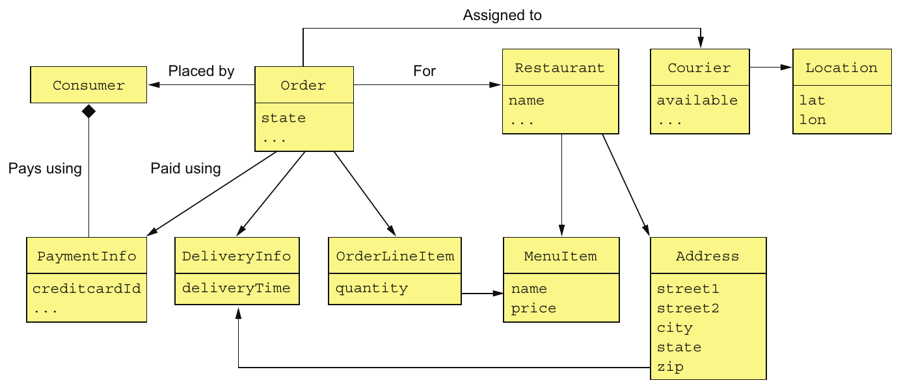

> **English:** Figure 5.4 A traditional domain model is a web of interconnected classes. It doesn’t explicitly specify the boundaries of business objects, such as Consumer and Order.
>
> **Türkçe:** Şekil 5.4 Geleneksel domain model, birbirine bağlı sınıflardan oluşan bir ağdır. Consumer ve Order gibi iş nesnelerinin sınırlarını açıkça belirtmez.

<!-- source-record: u05_0048 -->

> **English:** This example has several classes corresponding to business objects: Consumer, Order, Restaurant, and Courier. But interestingly, the explicit boundaries of each business object are missing from this kind of traditional domain model. It doesn’t specify, for example, which classes are part of the Order business object. This lack of boundaries can sometimes cause problems, especially in microservice architecture.
>
> **Türkçe:** Bu örnekte Consumer, Order, Restaurant ve Courier gibi iş nesnelerine karşılık gelen sınıflar vardır. Ancak geleneksel domain modellerinde her iş nesnesinin açık sınırları eksiktir. Örneğin hangi sınıfların Order iş nesnesinin parçası olduğu belirtilmez. Sınırların belirsizliği, özellikle mikroservis mimarisinde sorunlara yol açabilir.

<!-- source-pages: 153 -->

<!-- source-record: u05_0049 -->

> **English:** I begin this section with an example problem caused by the lack of explicit boundaries. Next I describe the concept of an aggregate and how it has explicit boundaries. After that, I describe the rules that aggregates must obey and how they make aggregates a good fit for the microservice architecture. I then describe how to carefully choose the boundaries of your aggregates and why it matters. Finally, I discuss how to design business logic using aggregates. Let’s first take a look at the problems caused by fuzzy boundaries.
>
> **Türkçe:** Bu bölüme açık sınırların bulunmamasından kaynaklanan bir sorun örneğiyle başlıyorum. Ardından aggregate kavramını ve açık sınırlarını açıklıyorum. Sonra aggregate birimlerinin uyması gereken kuralları ve bunların mikroservis mimarisine neden uygun olduğunu ele alıyorum. Aggregate sınırlarının nasıl dikkatle seçileceğini ve bunun önemini açıklayacağım. Son olarak aggregate kullanarak iş mantığı tasarlamayı tartışacağım. Önce belirsiz sınırların yol açtığı sorunları inceleyelim.

<!-- source-record: u05_0050 -->

### 5.2.1 The problem with fuzzy boundaries — Belirsiz sınırların yarattığı sorun

<!-- source-record: u05_0051 -->

> **English:** Imagine, for example, that you want to perform an operation, such as a load or delete, on an Order business object. What exactly does that mean? What is the scope an operation? You would certainly load or delete the Order object. But in reality there’s more to an Order than simply the Order object. There are also the order line items, the payment information, and so on. Figure 5.4 leaves the boundaries of a domain object to the developer’s intuition.
>
> **Türkçe:** Order iş nesnesi üzerinde yükleme veya silme gibi bir operasyon gerçekleştirmek istediğinizi düşünün. Bu tam olarak ne anlama gelir; operasyonun kapsamı nedir? Order nesnesini yükler veya silersiniz. Ancak sipariş, yalnızca Order nesnesinden ibaret değildir; sipariş kalemleri, ödeme bilgileri ve başka parçalar da vardır. Şekil 5.4, domain nesnesinin sınırlarını geliştiricinin sezgisine bırakır.

<!-- source-record: u05_0052 -->

> **English:** Besides a conceptual fuzziness, the lack of explicit boundaries causes problems when updating a business object. A typical business object has invariants, business rules that must be enforced at all times. An Order has a minimum order amount, for example. The FTGO application must ensure that any attempt to update an order doesn’t violate an invariant such as the minimum order amount. The challenge is that in order to enforce invariants, you must design your business logic carefully.
>
> **Türkçe:** Açık sınırların bulunmaması, kavramsal belirsizliğin yanında iş nesnesi güncellenirken de sorun yaratır. Tipik bir iş nesnesi, her zaman korunması gereken invariant adı verilen değişmez iş kurallarına sahiptir. Örneğin Order için asgari sipariş tutarı vardır. FTGO uygulaması, hiçbir güncellemenin bu tür bir değişmez kuralı ihlal etmemesini sağlamalıdır. Bu kuralları korumak için iş mantığını dikkatle tasarlamanız gerekir.

<!-- source-record: u05_0053 -->

> **English:** For example, let’s look at how to ensure the order minimum is met when multiple consumers work together to create an order. Two consumers—Sam and Mary—are working together on an order and simultaneously decide that the order exceeds their budget. Sam reduces the quantity of samosas, and Mary reduces the quantity of naan bread. From the application’s perspective, both consumers retrieve the order and its line items from the database. Both consumers then update a line item to reduce the cost of the order. From each consumer’s perspective the order minimum is preserved. Here’s the sequence of database transactions.
>
> **Türkçe:** Örneğin birden fazla müşteri birlikte sipariş oluştururken asgari sipariş tutarının nasıl korunacağına bakalım. Sam ve Mary aynı sipariş üzerinde çalışır ve aynı anda siparişin bütçelerini aştığına karar verir. Sam samosa miktarını, Mary naan ekmeği miktarını azaltır. Uygulama açısından her iki müşteri de siparişi ve sipariş kalemlerini veritabanından alır. İkisi de toplam tutarı düşürmek için bir sipariş kalemini günceller. Her müşterinin kendi gördüğü verilere göre asgari tutar korunur. Veritabanı transaction işlemlerinin sırası şöyledir.

<!-- source-record: u05_0054 -->

```text
Consumer - Mary                         Consumer - Sam

BEGIN TXN                               BEGIN TXN

   SELECT ORDER_TOTAL FROM ORDER           SELECT ORDER_TOTAL FROM ORDER
     WHERE ORDER ID = X                      WHERE ORDER ID = X

   SELECT * FROM ORDER_LINE_ITEM           SELECT * FROM ORDER_LINE_ITEM
      WHERE ORDER_ID = X                      WHERE ORDER_ID = X
   ...                                     ...
END TXN                                 END TXN

Verify minimum is met
BEGIN TXN

   UPDATE ORDER_LINE_ITEM
     SET VERSION=..., QUANTITY=...
   WHERE VERSION = <loaded version>
    AND ID = ...

END TXN

                                        Verify minimum is met

                                        BEGIN TXN

                                           UPDATE ORDER_LINE_ITEM
                                             SET VERSION=..., QUANTITY=...
                                           WHERE VERSION = <loaded version>
                                            AND ID = ...

                                        END TXN
```

<!-- source-pages: 154 -->

<!-- source-record: u05_0055 -->

> **English:** Each consumer changes a line item using a sequence of two transactions. The first transaction loads the order and its line items. The UI verifies that the order minimum is satisfied before executing the second transaction. The second transaction updates the line item quantity using an optimistic offline locking check that verifies that the order line is unchanged since it was loaded by the first transaction.
>
> **Türkçe:** Her müşteri, bir sipariş kalemini iki transaction işlemiyle değiştirir. İlki siparişi ve kalemlerini yükler. Kullanıcı arayüzü, ikinci transaction yürütülmeden önce asgari sipariş tutarının korunduğunu doğrular. İkinci transaction, sipariş kaleminin ilk transaction tarafından yüklendiğinden beri değişmediğini optimistic offline locking kontrolüyle doğrulayıp miktarı günceller.

<!-- source-record: u05_0056 -->

> **English:** In this scenario, Sam reduces the order total by $X and Mary reduces it by $Y. As a result, the Order is no longer valid, even though the application verified that the order still satisfied the order minimum after each consumer’s update. As you can see, directly updating part of a business object can result in the violation of the business rules. DDD aggregates are intended to solve this problem.
>
> **Türkçe:** Bu senaryoda Sam sipariş toplamını X dolar, Mary ise Y dolar azaltır. Uygulama her müşterinin güncellemesinden sonra asgari sipariş tutarını ayrı ayrı doğrulamış olsa da sonuçta Order artık geçerli değildir. Görüldüğü gibi iş nesnesinin bir parçasını doğrudan güncellemek, iş kurallarının ihlaline yol açabilir. DDD aggregate yaklaşımı bu sorunu çözmek için tasarlanmıştır.

<!-- source-record: u05_0057 -->

### 5.2.2 Aggregates have explicit boundaries — Aggregate'lerin sınırları açıktır

<!-- source-record: u05_0058 -->

> **English:** An aggregate is a cluster of domain objects within a boundary that can be treated as a unit. It consists of a root entity and possibly one or more other entities and value objects. Many business objects are modeled as aggregates. For example, in chapter 2 we created a rough domain model by analyzing the nouns used in the requirements and by domain experts. Many of these nouns, such as Order, Consumer, and Restaurant, are aggregates.
>
> **Türkçe:** Aggregate, belirli bir sınır içindeki domain nesnelerinden oluşan ve tek bir bütün olarak ele alınabilen kümedir. Bir kök entity ve gerekirse başka entity veya value object nesnelerinden oluşur. Birçok iş nesnesi aggregate olarak modellenir. Örneğin 2. bölümde gereksinimlerde ve alan uzmanlarının kullandığı dilde geçen isimleri inceleyerek kaba bir domain model oluşturduk. Order, Consumer ve Restaurant gibi bu kavramların çoğu aggregate birimleridir.

<!-- source-record: u05_0059 -->

### Pattern: Aggregate — Şekil: Aggregate

<!-- source-record: u05_0060 -->

> **English:** Organize a domain model as a collection of aggregates, each of which is a graph of objects that can be treated as a unit.
>
> **Türkçe:** Domain modeli, her biri tek bir bütün olarak ele alınabilen nesne grafiği olan aggregate birimlerinden oluşan bir koleksiyon biçiminde düzenleyin.

<!-- source-record: u05_0061 -->

> **English:** Figure 5.5 shows the Order aggregate and its boundary. An Order aggregate consists of an Order entity, one or more OrderLineItem value objects, and other value objects such as a delivery Address and PaymentInformation.
>
> **Türkçe:** Şekil 5.5, Order aggregate birimini ve sınırını gösterir. Bu bütün, bir Order entity, bir veya daha fazla OrderLineItem value object ve teslimat Address ile PaymentInformation gibi başka value object nesnelerinden oluşur.

<!-- source-pages: 155 -->

<!-- source-record: u05_0062 -->

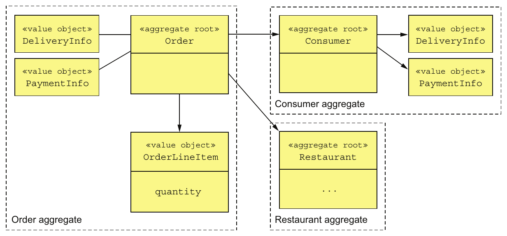

> **English:** Figure 5.5 Structuring a domain model as a set of aggregates makes the boundaries explicit.
>
> **Türkçe:** Şekil 5.5 Domain modeli aggregate birimleri halinde yapılandırmak, sınırları açık hale getirir.

<!-- source-record: u05_0063 -->

> **English:** Aggregates decompose a domain model into chunks, which are individually easier to understand. They also clarify the scope of operations such as load, update, and delete. These operations act on the entire aggregate rather than on parts of it. An aggregate is often loaded in its entirety from the database, thereby avoiding any complications of lazy loading. Deleting an aggregate removes all of its objects from a database.
>
> **Türkçe:** Aggregate birimleri, domain modeli ayrı ayrı anlaşılması daha kolay parçalara böler. Yükleme, güncelleme ve silme operasyonlarının kapsamını da netleştirir. Bu operasyonlar, aggregate parçalarına değil bütününe uygulanır. Aggregate genellikle veritabanından bütünüyle yüklenir; böylece lazy loading karmaşıklıkları önlenir. Aggregate silindiğinde içindeki bütün nesneler veritabanından kaldırılır.

<!-- source-record: u05_0064 -->

#### AGGREGATES ARE CONSISTENCY BOUNDARIES — Aggregate'ler tutarlılık sınırlarıdır

<!-- source-record: u05_0065 -->

> **English:** Updating an entire aggregate rather than its parts solves the consistency issues, such as the example described earlier. Update operations are invoked on the aggregate root, which enforces invariants. Also, concurrency is handled by locking the aggregate root using, for example, a version number or a database-level lock. For example, instead of updating line items’ quantities directly, a client must invoke a method on the root of the Order aggregate, which enforces invariants such as the minimum order amount. Note, though, that this approach doesn’t require the entire aggregate to be updated in the database. An application might, for example, only update the rows corresponding to the Order object and the updated OrderLineItem.
>
> **Türkçe:** Parçaları ayrı ayrı güncellemek yerine aggregate bütününü güncellemek, önceki örnekteki gibi tutarlılık sorunlarını çözer. Güncelleme operasyonları, değişmez kuralları koruyan aggregate root üzerinden çağrılır. Eşzamanlılık da sürüm numarası veya veritabanı kilidi gibi yöntemlerle kök nesne kilitlenerek yönetilir. Örneğin istemci, sipariş kalemlerinin miktarlarını doğrudan değiştirmek yerine Order aggregate kökünde asgari sipariş tutarı gibi kuralları koruyan bir metot çağırmalıdır. Bunun veritabanındaki bütün aggregate verisinin yeniden yazılmasını gerektirmediğine dikkat edin. Uygulama yalnızca Order nesnesine ve değişen OrderLineItem nesnesine karşılık gelen satırları güncelleyebilir.

<!-- source-record: u05_0066 -->

#### IDENTIFYING AGGREGATES IS KEY — Aggregate'leri belirlemek temel adımdır

<!-- source-record: u05_0067 -->

> **English:** In DDD, a key part of designing a domain model is identifying aggregates, their boundaries, and their roots. The details of the aggregates’ internal structure is secondary. The benefit of aggregates, however, goes far beyond modularizing a domain model. That’s because aggregates must obey certain rules.
>
> **Türkçe:** DDD’de domain model tasarımının temel parçalarından biri, aggregate birimlerini, sınırlarını ve köklerini belirlemektir. İç yapı ayrıntıları ikinci plandadır. Ancak aggregate kullanımının yararı, domain modeli modüllere ayırmanın ötesindedir; çünkü aggregate birimleri belirli kurallara uymalıdır.

<!-- source-record: u05_0068 -->

### 5.2.3 Aggregate rules — Aggregate kuralları

<!-- source-record: u05_0069 -->

> **English:** DDD requires aggregates to obey a set of rules. These rules ensure that an aggregate is a self-contained unit that can enforce its invariants. Let’s look at each of the rules.
>
> **Türkçe:** DDD, aggregate birimlerinin belirli kurallara uymasını gerektirir. Bu kurallar, aggregate biriminin kendi değişmez iş kurallarını koruyabilen bağımsız bir bütün olmasını sağlar. Kuralları tek tek inceleyelim.

<!-- source-pages: 156 -->

<!-- source-record: u05_0070 -->

#### RULE #1: REFERENCE ONLY THE AGGREGATE ROOT — Kural 1: Yalnızca aggregate root'a referans verin

<!-- source-record: u05_0071 -->

> **English:** The previous example illustrated the perils of updating OrderLineItems directly. The goal of the first aggregate rule is to eliminate this problem. It requires that the root entity be the only part of an aggregate that can be referenced by classes outside of the aggregate. A client can only update an aggregate by invoking a method on the aggregate root.
>
> **Türkçe:** Önceki örnek, OrderLineItem nesnelerini doğrudan güncellemenin tehlikesini gösterdi. İlk aggregate kuralı bunu önlemeyi amaçlar: aggregate dışındaki sınıflar yalnızca kök entity nesnesine referans verebilir. İstemci, aggregate birimini sadece kök nesnenin bir metodunu çağırarak güncelleyebilir.

<!-- source-record: u05_0072 -->

> **English:** A service, for example, uses a repository to load an aggregate from the database and obtain a reference to the aggregate root. It updates an aggregate by invoking a method on the aggregate root. This rule ensures that the aggregate can enforce its invariant.
>
> **Türkçe:** Örneğin servis, repository aracılığıyla aggregate birimini veritabanından yükler ve kök nesnesine referans alır. Güncellemeyi kök nesnenin bir metodunu çağırarak yapar. Böylece aggregate kendi değişmez iş kuralını koruyabilir.

<!-- source-record: u05_0073 -->

#### RULE #2: INTER-AGGREGATE REFERENCES MUST USE PRIMARY KEYS — Kural 2: Aggregate'ler arası referanslar primary key kullanmalıdır

<!-- source-record: u05_0074 -->

> **English:** Another rule is that aggregates reference each other by identity (for example, primary key) instead of object references. For example, as figure 5.6 shows, an Order references its Consumer using a consumerId rather than a reference to the Consumer object. Similarly, an Order references a Restaurant using a restaurantId.
>
> **Türkçe:** Başka bir kural, aggregate birimlerinin birbirine nesne referansı yerine kimlikle, örneğin birincil anahtarla referans vermesidir. Şekil 5.6’da Order, Consumer nesnesine doğrudan referans yerine consumerId kullanır. Benzer şekilde Restaurant için restaurantId kullanır.

<!-- source-record: u05_0075 -->

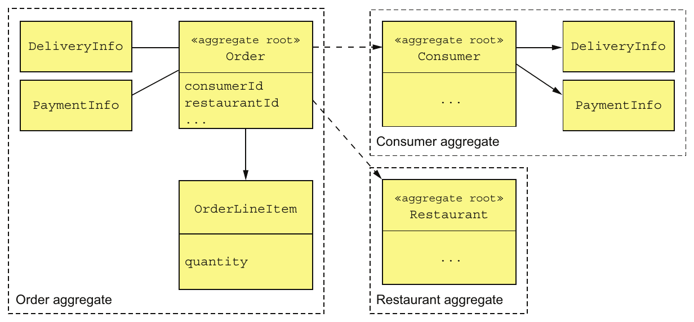

> **English:** Figure 5.6 References between aggregates are by primary key rather than by object reference. The Order aggregate has the IDs of the Consumer and Restaurant aggregates. Within an aggregate, objects have references to one another.
>
> **Türkçe:** Şekil 5.6 Aggregate birimleri arasındaki referanslar nesne referansı yerine birincil anahtarla kurulur. Order aggregate, Consumer ve Restaurant aggregate birimlerinin kimliklerini taşır. Aynı aggregate içindeki nesneler ise birbirine nesne referansıyla bağlanır.

<!-- source-record: u05_0076 -->

> **English:** This approach is quite different from traditional object modeling, which considers foreign keys in the domain model to be a design smell. It has a number of benefits. The use of identity rather than object references means that the aggregates are loosely coupled. It ensures that the aggregate boundaries between aggregates are well defined and avoids accidentally updating a different aggregate. Also, if an aggregate is part of another service, there isn’t a problem of object references that span services.
>
> **Türkçe:** Bu yaklaşım, domain model içindeki yabancı anahtarları olası bir tasarım sorunu sayan geleneksel nesne modellemesinden oldukça farklıdır. Çeşitli yararları vardır. Nesne referansı yerine kimlik kullanmak, aggregate birimlerini gevşek bağlı hale getirir. Aralarındaki sınırları netleştirir ve yanlışlıkla başka bir aggregate biriminin güncellenmesini önler. Aggregate başka bir serviste olsa bile servis sınırlarını aşan nesne referansı sorunu oluşmaz.

<!-- source-record: u05_0077 -->

> **English:** This approach also simplifies persistence since the aggregate is the unit of storage. It makes it easier to store aggregates in a NoSQL database such as MongoDB. It also eliminates the need for transparent lazy loading and its associated problems. Scaling the database by sharding aggregates is relatively straightforward.
>
> **Türkçe:** Aggregate, saklama birimi olduğu için bu yaklaşım kalıcı saklamayı da kolaylaştırır. MongoDB gibi NoSQL veritabanlarına aggregate kaydetmek daha kolay olur. Saydam lazy loading ihtiyacını ve ilgili sorunları ortadan kaldırır. Aggregate birimlerini shard’lara dağıtarak veritabanını ölçeklemek de görece kolaydır.

<!-- source-pages: 157 -->

<!-- source-record: u05_0078 -->

#### RULE #3: ONE TRANSACTION CREATES OR UPDATES ONE AGGREGATE — Kural 3: Bir transaction, tek bir aggregate oluşturur veya günceller

<!-- source-record: u05_0079 -->

> **English:** Another rule that aggregates must obey is that a transaction can only create or update a single aggregate. When I first read about it many years ago, this rule made no sense! At the time, I was developing traditional monolithic applications that used an RDBMS, so transactions could update multiple aggregates. Today, this constraint is perfect for the microservice architecture. It ensures that a transaction is contained within a service. This constraint also matches the limited transaction model of most NoSQL databases.
>
> **Türkçe:** Bir diğer kural, bir transaction işleminin yalnızca tek bir aggregate oluşturabilmesi veya güncelleyebilmesidir. Yıllar önce ilk okuduğumda bu kural bana anlamsız gelmişti. O sırada RDBMS kullanan geleneksel monolitik uygulamalar geliştiriyordum ve transaction işlemleri birden fazla aggregate güncelleyebiliyordu. Bugün bu kısıt mikroservis mimarisine çok uygundur: transaction işleminin tek bir servis içinde kalmasını sağlar. Çoğu NoSQL veritabanının sınırlı transaction modeliyle de uyumludur.

<!-- source-record: u05_0080 -->

> **English:** This rule makes it more complicated to implement operations that need to create or update multiple aggregates. But this is exactly the problem that sagas (described in chapter 4) are designed to solve. Each step of the saga creates or updates exactly one aggregate. Figure 5.7 shows how this works.
>
> **Türkçe:** Bu kural, birden fazla aggregate oluşturması veya güncellemesi gereken operasyonları karmaşıklaştırır. Ancak 4. bölümdeki saga yaklaşımı tam olarak bu sorunu çözmek için tasarlanmıştır. Saga işleminin her adımı, tam bir aggregate oluşturur veya günceller. Şekil 5.7 bunun nasıl çalıştığını gösterir.

<!-- source-record: u05_0081 -->

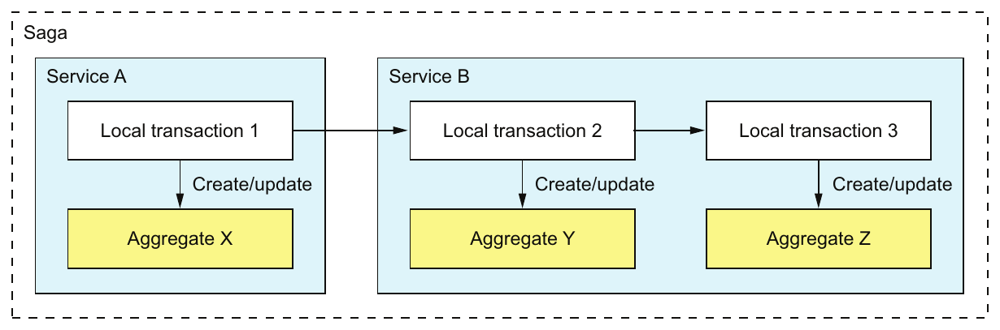

> **English:** Figure 5.7 A transaction can only create or update a single aggregate, so an application uses a saga to update multiple aggregates. Each step of the saga creates or updates one aggregate.
>
> **Türkçe:** Şekil 5.7 Bir transaction yalnızca tek bir aggregate oluşturabildiği veya güncelleyebildiği için uygulama, birden fazla aggregate güncellemek üzere saga kullanır. Her saga adımı bir aggregate oluşturur veya günceller.

<!-- source-record: u05_0082 -->

> **English:** In this example, the saga consists of three transactions. The first transaction updates aggregate X in service A. The other two transactions are both in service B. One transaction updates aggregate X, and the other updates aggregate Y.
>
> **Türkçe:** Bu örnekte saga üç transaction işleminden oluşur. İlki A servisindeki X aggregate birimini günceller. Diğer ikisi B servisindedir; biri X, diğeri Y aggregate birimini günceller.

<!-- source-record: u05_0083 -->

> **English:** An alternative approach to maintaining consistency across multiple aggregates within a single service is to cheat and update multiple aggregates within a transaction. For example, service B could update aggregates Y and Z in a single transaction. This is only possible when using a database, such as an RDBMS, that supports a rich transaction model. If you’re using a NoSQL database that only has simple transactions, there’s no other option except to use sagas.
>
> **Türkçe:** Tek bir servis içindeki birden fazla aggregate arasında tutarlılığı korumanın alternatif yolu, kuralı esnetip aynı transaction içinde birden fazla aggregate güncellemektir. Örneğin B servisi Y ve Z aggregate birimlerini tek transaction içinde güncelleyebilir. Bu, yalnızca RDBMS gibi kapsamlı transaction modeli sunan bir veritabanıyla mümkündür. Yalnızca basit transaction işlemleri sağlayan NoSQL veritabanında saga kullanmak dışında seçenek yoktur.

<!-- source-record: u05_0084 -->

> **English:** Or is there? It turns out that aggregate boundaries are not set in stone. When developing a domain model, you get to choose where the boundaries lie. But like a 20th century colonial power drawing national boundaries, you need to be careful.
>
> **Türkçe:** Acaba başka seçenek gerçekten yok mu? Aggregate sınırları değişmez değildir. Domain modeli geliştirirken sınırların nerede olacağını siz belirlersiniz. Ancak ulusal sınırları çizen 20. yüzyıl sömürge güçleri gibi, bunu dikkatle yapmanız gerekir.

<!-- source-pages: 158 -->

<!-- source-record: u05_0085 -->

### 5.2.4 Aggregate granularity — Aggregate granularity (aggregate kapsamının büyüklüğü)

<!-- source-record: u05_0086 -->

> **English:** When developing a domain model, a key decision you must make is how large to make each aggregate. On one hand, aggregates should ideally be small. Because updates to each aggregate are serialized, more fine-grained aggregates will increase the number of simultaneous requests that the application can handle, improving scalability. It will also improve the user experience because it reduces the chance of two users attempting conflicting updates of the same aggregate. On the other hand, because an aggregate is the scope of transaction, you may need to define a larger aggregate in order to make a particular update atomic.
>
> **Türkçe:** Domain modeli geliştirirken temel kararlardan biri, her aggregate biriminin ne kadar büyük olacağıdır. İdeal olarak küçük olmalıdır. Aynı aggregate üzerindeki güncellemeler sıraya konduğu için daha küçük birimler, uygulamanın aynı anda işleyebileceği istek sayısını ve ölçeklenebilirliğini artırır. İki kullanıcının aynı aggregate üzerinde çakışan güncellemeler yapma olasılığını düşürerek kullanıcı deneyimini de iyileştirir. Öte yandan aggregate, transaction sınırı olduğu için belirli bir güncellemeyi atomik yapmak üzere daha büyük bir aggregate tanımlamanız gerekebilir.

<!-- source-record: u05_0087 -->

> **English:** For example, earlier I mentioned how in the FTGO application’s domain model Order and Consumer are separate aggregates. An alternative design is to make Order part of the Consumer aggregate. Figure 5.8 shows this alternative design.
>
> **Türkçe:** Örneğin FTGO domain modelinde Order ve Consumer birimlerinin ayrı aggregate olduğunu belirtmiştim. Alternatif tasarım, Order nesnesini Consumer aggregate içine almaktır. Şekil 5.8 bunu gösterir.

<!-- source-record: u05_0088 -->

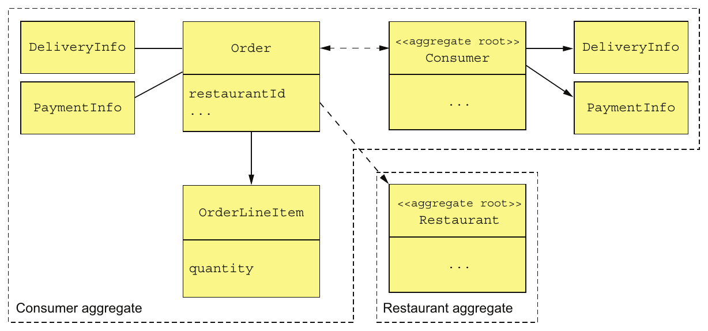

> **English:** Figure 5.8 An alternative design defines a Customer aggregate that contains the Customer and Order classes. This design enables an application to atomically update a Consumer and one or more of its Orders.
>
> **Türkçe:** Şekil 5.8 Alternatif tasarım, Customer ve Order sınıflarını içeren bir Customer aggregate tanımlar. Böylece uygulama bir Consumer nesnesini ve ona ait bir veya daha fazla Order nesnesini atomik olarak güncelleyebilir.

<!-- source-record: u05_0089 -->

> **English:** A benefit of this larger Consumer aggregate is that the application can atomically update a Consumer and one or more of its Orders. A drawback of this approach is that it reduces scalability. Transactions that update different orders for the same customer would be serialized. Similarly, two users would conflict if they attempted to edit different orders for the same customer.
>
> **Türkçe:** Daha büyük Consumer aggregate biriminin yararı, Consumer ile ona ait bir veya daha fazla Order nesnesinin atomik güncellenebilmesidir. Dezavantajı ölçeklenebilirliğin azalmasıdır. Aynı müşterinin farklı siparişlerini güncelleyen transaction işlemleri sırayla yürütülür. Benzer şekilde iki kullanıcı, aynı müşterinin farklı siparişlerini düzenlemeye çalışsa bile çakışır.

<!-- source-record: u05_0090 -->

> **English:** Another drawback of this approach in a microservice architecture is that it is an obstacle to decomposition. The business logic for Orders and Consumers, for example, must be collocated in the same service, which makes the service larger. Because of these issues, making aggregates as fine-grained as possible is best.
>
> **Türkçe:** Mikroservis mimarisindeki başka bir dezavantaj, ayrıştırmayı zorlaştırmasıdır. Örneğin Order ve Consumer iş mantığı aynı serviste bulunmak zorunda kalır; bu da servisi büyütür. Bu nedenle aggregate birimlerini mümkün olduğunca küçük ve dar kapsamlı tutmak en uygunudur.

<!-- source-pages: 159 -->

<!-- source-record: u05_0091 -->

### 5.2.5 Designing business logic with aggregates — Aggregate'lerle iş mantığı tasarlamak

<!-- source-record: u05_0092 -->

> **English:** In a typical (micro)service, the bulk of the business logic consists of aggregates. The rest of the business logic resides in the domain services and the sagas. The sagas orchestrate sequences of local transactions in order to enforce data consistency. The services are the entry points into the business logic and are invoked by inbound adapters. A service uses a repository to retrieve aggregates from the database or save aggregates to the database. Each repository is implemented by an outbound adapter that accesses the database. Figure 5.9 shows the aggregate-based design of the business logic for the Order Service.
>
> **Türkçe:** Tipik bir mikroserviste iş mantığının büyük bölümü aggregate birimlerinden oluşur. Geri kalanı domain service sınıflarında ve saga işlemlerinde bulunur. Saga, veri tutarlılığını korumak için yerel transaction dizilerini koordine eder. Domain service sınıfları, iş mantığına giriş noktalarıdır ve inbound adapter bileşenleri tarafından çağrılır. Servis, aggregate birimlerini veritabanından almak veya kaydetmek için repository kullanır. Her repository, veritabanına erişen bir outbound adapter tarafından uygulanır. Şekil 5.9, Order Service iş mantığının aggregate tabanlı tasarımını gösterir.

<!-- source-record: u05_0093 -->

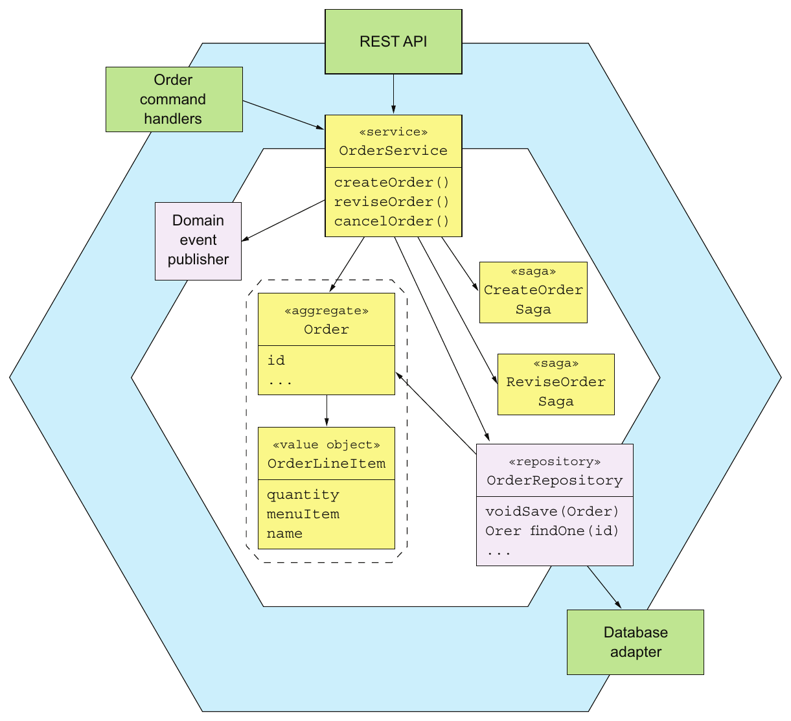

> **English:** Figure 5.9 An aggregate-based design for the Order Service business logic
>
> **Türkçe:** Şekil 5.9 Order Service iş mantığı için aggregate tabanlı tasarım

<!-- source-record: u05_0094 -->

> **English:** The business logic consists of the Order aggregate, the OrderService service class, the OrderRepository, and one or more sagas. The OrderService invokes the OrderRepository to save and load Orders. For simple requests that are local to the service, the service updates an Order aggregate. If an update request spans multiple services, the OrderService will also create a saga, as described in chapter 4.
>
> **Türkçe:** İş mantığı; Order aggregate, OrderService servis sınıfı, OrderRepository ve bir veya daha fazla saga işleminden oluşur. OrderService, Order nesnelerini yüklemek ve kaydetmek için OrderRepository’yi çağırır. Servis içinde kalan basit isteklerde Order aggregate birimini günceller. Güncelleme isteği birden fazla servisi kapsıyorsa 4. bölümde açıklandığı gibi bir saga da oluşturur.

<!-- source-pages: 160 -->

<!-- source-record: u05_0095 -->

> **English:** We’ll take a look at the code—but first, let’s examine a concept that’s closely related to aggregates: domain events.
>
> **Türkçe:** Kodu inceleyeceğiz; ancak önce aggregate kavramıyla yakından ilişkili domain event kavramını ele alalım.

<!-- source-record: u05_0096 -->

## 5.3 Publishing domain events — Domain event (alan olayı) yayımlamak

<!-- source-record: u05_0097 -->

> **English:** Merriam-Webster (https://www.merriam-webster.com/dictionary/event) lists several definitions of the word event, including these:
>
> **Türkçe:** Merriam-Webster (https://www.merriam-webster.com/dictionary/event) olay kelimesinin çeşitli tanımlarını listeler, bunlardan bazıları:

<!-- source-record: u05_0098 -->

> **English:** 1 Something that happens
>
> **Türkçe:** 1 Gerçekleşen bir şey

<!-- source-record: u05_0099 -->

> **English:** 2 A noteworthy happening
>
> **Türkçe:** 2 Dikkat edilmeye değer bir olay

<!-- source-record: u05_0100 -->

> **English:** 3 A social occasion or activity
>
> **Türkçe:** 3 Sosyal bir buluşma veya etkinlik

<!-- source-record: u05_0101 -->

> **English:** 4 An adverse or damaging medical occurrence, a heart attack or other cardiac event
>
> **Türkçe:** 4 Kalp krizi veya başka bir kardiyak olay gibi olumsuz ya da zarar verici tıbbi durum

<!-- source-record: u05_0102 -->

> **English:** In the context of DDD, a domain event is something that has happened to an aggregate. It’s represented by a class in the domain model. An event usually represents a state change. Consider, for example, an Order aggregate in the FTGO application. Its state-changing events include Order Created, Order Cancelled, Order Shipped, and so forth. An Order aggregate might, if there are interested consumers, publish one of the events each time it undergoes a state transition.
>
> **Türkçe:** DDD bağlamında domain event (alan olayı), bir aggregate üzerinde gerçekleşmiş bir olaydır ve domain modelde bir sınıfla temsil edilir. Genellikle durum değişikliğini ifade eder. Örneğin FTGO uygulamasındaki Order aggregate için Order Created, Order Cancelled ve Order Shipped gibi olaylar vardır. Bu olaylarla ilgilenen tüketiciler bulunuyorsa Order aggregate, her durum geçişinde ilgili olayı yayımlayabilir.

<!-- source-record: u05_0103 -->

### Pattern: Domain event — örüntü: Alan olayı

<!-- source-record: u05_0104 -->

> **English:** An aggregate publishes a domain event when it’s created or undergoes some other significant change.
>
> **Türkçe:** Aggregate oluşturulduğunda veya başka önemli bir değişiklik geçirdiğinde bir domain event yayımlar.

<!-- source-record: u05_0105 -->

### 5.3.1 Why publish change events? — Değişiklik olayları neden yayımlanır?

<!-- source-record: u05_0106 -->

> **English:** Domain events are useful because other parties—users, other applications, or other components within the same application—are often interested in knowing about an aggregate’s state changes. Here are some example scenarios:
>
> **Türkçe:** Domain event yararlıdır; çünkü kullanıcılar, başka uygulamalar veya aynı uygulamanın başka bileşenleri, aggregate durumundaki değişiklikleri öğrenmek isteyebilir. Örnek senaryolar şunlardır:

<!-- source-record: u05_0107 -->

> **English:** • Maintaining data consistency across services using choreography-based sagas, described in chapter 4.
>
> **Türkçe:** • 4. bölümde açıklanan koreografi tabanlı saga işlemleriyle servisler arasında veri tutarlılığını korumak.

<!-- source-record: u05_0108 -->

> **English:** • Notifying a service that maintains a replica that the source data has changed. This approach is known as Command Query Responsibility Segregation (CQRS), and it’s described in chapter 7.
>
> **Türkçe:** • Veri kopyası tutan bir servise kaynak verinin değiştiğini bildirmek. Command Query Responsibility Segregation (CQRS) olarak bilinen bu yaklaşım 7. bölümde açıklanır.

<!-- source-record: u05_0109 -->

> **English:** • Notifying a different application via a registered webhook or via a message broker in order to trigger the next step in a business process.
>
> **Türkçe:** • İş sürecinin sonraki adımını tetiklemek için kayıtlı bir webhook veya mesaj aracısı üzerinden başka bir uygulamaya bildirim göndermek.

<!-- source-record: u05_0110 -->

> **English:** • Notifying a different component of the same application in order, for example, to send a WebSocket message to a user’s browser or update a text database such as ElasticSearch.
>
> **Türkçe:** • Örneğin kullanıcının tarayıcısına WebSocket mesajı göndermek veya ElasticSearch gibi bir metin veritabanını güncellemek üzere aynı uygulamanın başka bir bileşenine bildirim göndermek.

<!-- source-record: u05_0111 -->

> **English:** • Sending notifications—text messages or emails—to users informing them that their order has shipped, their Rx prescription is ready for pick up, or their flight is delayed.
>
> **Türkçe:** • Kullanıcılara siparişlerinin gönderildiğini, reçetelerinin teslim alınmaya hazır olduğunu veya uçuşlarının geciktiğini bildiren kısa mesaj ya da e-posta göndermek.

<!-- source-pages: 161 -->

<!-- source-record: u05_0112 -->

> **English:** • Monitoring domain events to verify that the application is behaving correctly.
>
> **Türkçe:** • Uygulamanın doğru şekilde davrandığını kontrol etmek için alan olaylarını izlemek.

<!-- source-record: u05_0113 -->

> **English:** • Analyzing events to model user behavior.
>
> **Türkçe:** • Kullanıcı davranışını modellemek için olayları analiz etmek.

<!-- source-record: u05_0114 -->

> **English:** The trigger for the notification in all these scenarios is the state change of an aggregate in an application’s database.
>
> **Türkçe:** Bu senaryoların tümünde bildirimi tetikleyen şey, uygulamanın veritabanındaki bir aggregate durumunun değişmesidir.

<!-- source-record: u05_0115 -->

### 5.3.2 What is a domain event? — Domain event nedir?

<!-- source-record: u05_0116 -->

> **English:** A domain event is a class with a name formed using a past-participle verb. It has properties that meaningfully convey the event. Each property is either a primitive value or a value object. For example, an OrderCreated event class has an orderId property.
>
> **Türkçe:** Domain event, adı past participle, yani fiilin üçüncü biçimi kullanılarak oluşturulan bir sınıftır. Olayı anlamlı biçimde aktaran alanları bulunur. Her alan, ilkel bir değer veya value object taşır. Örneğin OrderCreated olay sınıfı bir orderId alanına sahiptir.

<!-- source-record: u05_0117 -->

> **English:** A domain event typically also has metadata, such as the event ID, and a timestamp. It might also have the identity of the user who made the change, because that’s useful for auditing. The metadata can be part of the event object, perhaps defined in a superclass. Alternatively, the event metadata can be in an envelope object that wraps the event object. The ID of the aggregate that emitted the event might also be part of the envelope rather than an explicit event property.
>
> **Türkçe:** Domain event genellikle olay kimliği ve zaman damgası gibi metadata da taşır. Denetim açısından yararlı olduğu için değişikliği yapan kullanıcının kimliğini de içerebilir. Metadata, belki üst sınıfta tanımlanarak olay nesnesinin parçası olabilir. Alternatif olarak olayı saran bir envelope nesnesinde tutulabilir. Olayı yayımlayan aggregate kimliği de ayrı bir olay alanı yerine envelope içinde bulunabilir.

<!-- source-record: u05_0118 -->

> **English:** The OrderCreated event is an example of a domain event. It doesn’t have any fields, because the Order’s ID is part of the event envelope. The following listing shows the OrderCreated event class and the DomainEventEnvelope class.
>
> **Türkçe:** OrderCreated, domain event örneğidir. Order kimliği olayın envelope nesnesinde bulunduğu için kendi alanı yoktur. Aşağıdaki kod, OrderCreated ve DomainEventEnvelope sınıflarını gösterir.

<!-- source-record: u05_0119 -->

#### Listing 5.1 The OrderCreated event and the DomainEventEnvelope class — Listesi 5.1 OrderCreated olayı ve DomainEventEnvelope sınıfı

<!-- source-record: u05_0120 -->

```java
interface DomainEvent {}

interface OrderDomainEvent extends DomainEvent {}

class OrderCreated implements OrderDomainEvent {}

class DomainEventEnvelope<T extends DomainEvent> {
  private String aggregateType;
  private Object aggregateId;
  private T event;
  ...
}
```

<!-- source-record: u05_0121 -->

**Kod açıklaması:**

> **English:** The event’s metadata
>
> **Türkçe:** Olaya ait metadata

<!-- source-record: u05_0122 -->

> **English:** The DomainEvent interface is a marker interface that identifies a class as a domain event. OrderDomainEvent is a marker interface for events, such as OrderCreated, which are published by the Order aggregate. The DomainEventEnvelope is a class that contains event metadata and the event object. It’s a generic class that’s parameterized by the domain event type.
>
> **Türkçe:** DomainEvent, bir sınıfın domain event olduğunu belirten marker interface’tir. OrderDomainEvent ise Order aggregate tarafından yayımlanan OrderCreated gibi olaylar için marker interface’tir. DomainEventEnvelope, olay nesnesini ve metadata bilgisini içerir. Domain event türüyle parametreleştirilmiş generic bir sınıftır.

<!-- source-record: u05_0123 -->

### 5.3.3 Event enrichment — Event enrichment (olay zenginleştirme)

<!-- source-record: u05_0124 -->

> **English:** Let’s imagine, for example, that you’re writing an event consumer that processes Order events. The OrderCreated event class shown previously captures the essence of what has happened. But your event consumer may need the order details when processing an OrderCreated event. One option is for it to retrieve that information from the Order-Service. The drawback of an event consumer querying the service for the aggregate is that it incurs the overhead of a service request.
>
> **Türkçe:** Order olaylarını işleyen bir tüketici yazdığınızı düşünün. Önceki OrderCreated sınıfı gerçekleşen olayın özünü ifade eder; ancak tüketici, olayı işlerken sipariş ayrıntılarına ihtiyaç duyabilir. Bir seçenek bu bilgileri Order Service’den almaktır. Dezavantajı, aggregate verisini sorgulamak için servise ek bir istek gönderme maliyetidir.

<!-- source-pages: 162 -->

<!-- source-record: u05_0125 -->

> **English:** An alternative approach known as event enrichment is for events to contain information that consumers need. It simplifies event consumers because they no longer need to request that data from the service that published the event. In the OrderCreated event, the Order aggregate can enrich the event by including the order details. The following listing shows the enriched event.
>
> **Türkçe:** Event enrichment (olay zenginleştirme) adlı alternatif yaklaşımda olay, tüketicilerin ihtiyaç duyduğu bilgileri içerir. Böylece tüketicilerin bu verileri olayı yayımlayan servisten ayrıca istemesi gerekmez. Order aggregate, OrderCreated olayını sipariş ayrıntılarını ekleyerek zenginleştirebilir. Aşağıdaki kod zenginleştirilmiş olayı gösterir.

<!-- source-record: u05_0126 -->

#### Listing 5.2 The enriched OrderCreated event — Listesi 5.2 Zenginleştirilmiş OrderCreated olayı

<!-- source-record: u05_0127 -->

```java
class OrderCreated implements OrderEvent {
  private List<OrderLineItem> lineItems;
  private DeliveryInformation deliveryInformation;
  private PaymentInformation paymentInformation;
  private long restaurantId;
  private String restaurantName;
  ...
}
```

<!-- source-record: u05_0128 -->

**Kod açıklaması:**

> **English:** Data that its consumers typically need
>
> **Türkçe:** Tüketicilerin genellikle ihtiyaç duyduğu veriler

<!-- source-record: u05_0129 -->

> **English:** Because this version of the OrderCreated event contains the order details, an event consumer, such as the Order History Service (discussed in chapter 7) no longer needs to fetch that data when processing an OrderCreated event.
>
> **Türkçe:** OrderCreated olayının bu sürümü sipariş ayrıntılarını içerdiği için, 7. bölümde ele alınan Order History Service gibi bir tüketicinin olayı işlerken bu verileri ayrıca alması gerekmez.

<!-- source-record: u05_0130 -->

> **English:** Although event enrichment simplifies consumers, the drawback is that it risks making the event classes less stable. An event class potentially needs to change whenever the requirements of its consumers change. This can reduce maintainability because this kind of change can impact multiple parts of the application. Satisfying every consumer can also be a futile effort. Fortunately, in many situations it’s fairly obvious which properties to include in an event.
>
> **Türkçe:** Olay zenginleştirme tüketicileri basitleştirir; ancak olay sınıflarının daha sık değişmesi riskini taşır. Tüketici gereksinimleri değiştikçe olay sınıfını da değiştirmek gerekebilir. Bu değişiklikler uygulamanın birden fazla bölümünü etkileyerek bakım kolaylığını azaltabilir. Her tüketicinin ihtiyacını karşılamaya çalışmak sonuçsuz bir çaba da olabilir. Neyse ki birçok durumda olaya hangi alanların ekleneceği yeterince açıktır.

<!-- source-record: u05_0131 -->

> **English:** Now that we’ve covered the basics of domain events, let’s look at how to discover them.
>
> **Türkçe:** Artık alan olaylarının temellerini ele aldık, onları nasıl keşfedebileceğimize bakalım.

<!-- source-record: u05_0132 -->

### 5.3.4 Identifying domain events — Domain event'leri belirlemek

<!-- source-record: u05_0133 -->

> **English:** There are a few different strategies for identifying domain events. Often the requirements will describe scenarios where notifications are required. The requirements might include language such as “When X happens do Y.” For example, one requirement in the FTGO application is “When an Order is placed send the consumer an email.” A requirement for a notification suggests the existence of a domain event.
>
> **Türkçe:** Domain event belirlemek için çeşitli stratejiler vardır. Gereksinimler, bildirim gönderilmesi gereken senaryoları sıklıkla açıklar. “X gerçekleştiğinde Y yap” gibi ifadeler içerebilir. Örneğin FTGO gereksinimlerinden biri, “Sipariş verildiğinde müşteriye e-posta gönder” şeklindedir. Bildirim gereksinimi, bir domain event bulunduğuna işaret eder.

<!-- source-record: u05_0134 -->

> **English:** Another approach, which is increasing in popularity, is to use event storming. Event storming is an event-centric workshop format for understanding a complex domain. It involves gathering domain experts in a room, lots of sticky notes, and a very large surface—a whiteboard or paper roll—to stick the notes on. The result of event storming is an event-centric domain model consisting of aggregates and events.
>
> **Türkçe:** Giderek yaygınlaşan başka bir yaklaşım event storming’dir. Karmaşık bir alanı anlamaya yönelik, olay merkezli bir atölye biçimidir. Alan uzmanlarını bir odada toplar; çok sayıda yapışkan not ile bunları yerleştirecek beyaz tahta veya kâğıt rulosu gibi geniş bir yüzey kullanır. Sonuç, aggregate birimlerinden ve olaylardan oluşan olay merkezli bir domain modeldir.

<!-- source-pages: 163 -->

<!-- source-record: u05_0135 -->

> **English:** Event storming consist of three main steps:
>
> **Türkçe:** Event storming üç ana adımdan oluşur:

<!-- source-record: u05_0136 -->

> **English:** 1 Brainstorm events—Ask the domain experts to brainstorm the domain events. Domain events are represented by orange sticky notes that are laid out in a rough timeline on the modeling surface.
>
> **Türkçe:** 1 Olaylar üzerine beyin fırtınası yapın — Alan uzmanlarından domain event’leri belirlemelerini isteyin. Olaylar, modelleme yüzeyinde kabaca zaman sırasına yerleştirilen turuncu yapışkan notlarla temsil edilir.

<!-- source-record: u05_0137 -->

> **English:** 2 Identify event triggers—Ask the domain experts to identify the trigger of each event, which is one of the following: – User actions, represented as a command using a blue sticky note – External system, represented by a purple sticky note – Another domain event – Passing of time
>
> **Türkçe:** 2 Olay tetikleyicilerini belirleyin — Alan uzmanlarından her olayın tetikleyicisini belirlemelerini isteyin. Tetikleyici şunlardan biridir: mavi yapışkan notla komut olarak gösterilen kullanıcı eylemi; mor notla gösterilen dış sistem; başka bir domain event; zamanın geçmesi.

<!-- source-record: u05_0138 -->

> **English:** 3 Identify aggregates—Ask the domain experts to identify the aggregate that consumes each command and emits the corresponding event. Aggregates are represented by yellow sticky notes.
>
> **Türkçe:** 3 Aggregate birimlerini belirleyin — Alan uzmanlarından her komutu tüketen ve karşılık gelen olayı üreten aggregate birimini belirlemelerini isteyin. Aggregate birimleri sarı yapışkan notlarla gösterilir.

<!-- source-record: u05_0139 -->

> **English:** Figure 5.10 shows the result of an event-storming workshop. In just a couple of hours, the participants identified numerous domain events, commands, and aggregates. It was a good first step in the process of creating a domain model.
>
> **Türkçe:** Şekil 5.10, bir event storming atölyesinin sonucunu gösterir. Katılımcılar yalnızca birkaç saatte çok sayıda domain event, komut ve aggregate belirledi. Bu, domain model oluşturma sürecinde iyi bir ilk adımdı.

<!-- source-record: u05_0140 -->

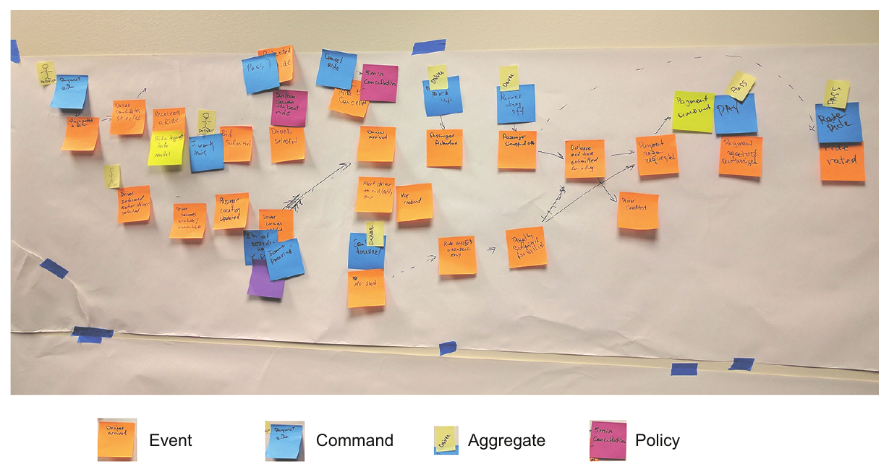

> **English:** Figure 5.10 The result of an event-storming workshop that lasted a couple of hours. The sticky notes are events, which are laid out along a timeline; commands, which represent user actions; and aggregates, which emit events in response to a command.
>
> **Türkçe:** Şekil 5.10 Birkaç saat süren event storming atölyesinin sonucu. Yapışkan notlar; zaman çizgisine dizilen olayları, kullanıcı eylemlerini temsil eden komutları ve komutlara karşılık olay üreten aggregate birimlerini gösterir.

<!-- source-record: u05_0141 -->

> **English:** Event storming is a useful technique for quickly creating a domain model.
>
> **Türkçe:** Event storming, hızlı biçimde domain model oluşturmak için yararlı bir tekniktir.

<!-- source-record: u05_0142 -->

> **English:** Now that we’ve covered the basics of domain events, let’s look at the mechanics of generating and publishing them.
>
> **Türkçe:** Artık alan olaylarının temellerini ele aldık. Şimdi bunları oluşturmanın ve yayınlamanın mekaniğine bakalım.

<!-- source-pages: 164 -->

<!-- source-record: u05_0143 -->

### 5.3.5 Generating and publishing domain events — Domain event'leri oluşturmak ve yayımlamak

<!-- source-record: u05_0144 -->

> **English:** Communicating using domain events is a form of asynchronous messaging, discussed in chapter 3. But before the business logic can publish them to a message broker, it must first create them. Let’s look at how to do that.
>
> **Türkçe:** Domain event ile iletişim, 3. bölümde açıklanan eşzamansız mesajlaşmanın bir biçimidir. Ancak iş mantığı, olayları mesaj aracısına yayımlamadan önce oluşturmalıdır. Bunun nasıl yapılacağına bakalım.

<!-- source-record: u05_0145 -->

#### GENERATING DOMAIN EVENTS — Domain event'leri oluşturmak

<!-- source-record: u05_0146 -->

> **English:** Conceptually, domain events are published by aggregates. An aggregate knows when its state changes and hence what event to publish. An aggregate could invoke a messaging API directly. The drawback of this approach is that because aggregates can’t use dependency injection, the messaging API would need to be passed around as a method argument. That would intertwine infrastructure concerns and business logic, which is extremely undesirable.
>
> **Türkçe:** Kavramsal olarak domain event’leri aggregate birimleri yayımlar. Aggregate, durumunun ne zaman değiştiğini ve dolayısıyla hangi olayı yayımlayacağını bilir. Mesajlaşma API’sini doğrudan çağırabilir. Ancak aggregate dependency injection kullanamadığından API nesnesinin metot argümanı olarak taşınması gerekir. Bu da altyapı sorumluluklarını iş mantığıyla iç içe geçirir; istenmeyen bir durumdur.

<!-- source-record: u05_0147 -->

> **English:** A better approach is to split responsibility between the aggregate and the service (or equivalent class) that invokes it. Services can use dependency injection to obtain a reference to the messaging API, easily publishing events. The aggregate generates the events whenever its state changes and returns them to the service. There are a couple of different ways an aggregate can return events back to the service. One option is for the return value of an aggregate method to include a list of events. For example, the following listing shows how a Ticket aggregate’s accept() method can return a TicketAcceptedEvent to its caller.
>
> **Türkçe:** Daha iyi bir yaklaşım, sorumluluğu aggregate ile onu çağıran servis veya eşdeğer sınıf arasında paylaşmaktır. Servis, dependency injection ile mesajlaşma API’sine referans alıp olayları kolayca yayımlayabilir. Aggregate, durumu değiştiğinde olayları üretir ve servise döndürür. Bunun birkaç yolu vardır. Bir seçenek, aggregate metodunun dönüş değerine olay listesini dahil etmektir. Örneğin aşağıdaki kod, Ticket aggregate içindeki accept() metodunun çağırana TicketAcceptedEvent döndürmesini gösterir.

<!-- source-record: u05_0148 -->

#### Listing 5.3 The Ticket aggregate’s accept() method — Listesi 5.3 Ticket aggregate'nin accept() yöntemi

<!-- source-record: u05_0149 -->

```java
public class Ticket {

   public List<DomainEvent> accept(ZonedDateTime readyBy) {
    ...
    this.acceptTime = ZonedDateTime.now();
    this.readyBy = readyBy;
    return singletonList(new TicketAcceptedEvent(readyBy));
   }
}
```

<!-- source-record: u05_0150 -->

**Kod açıklaması:**

> **English:** Updates the Ticket
>
> **Türkçe:** Ticket nesnesini günceller.

<!-- source-record: u05_0151 -->

**Kod açıklaması:**

> **English:** Returns an event
>
> **Türkçe:** Bir olay döndürür.

<!-- source-record: u05_0152 -->

> **English:** The service invokes the aggregate root’s method, and then publishes the events. For example, the following listing shows how KitchenService invokes Ticket.accept() and publishes the events.
>
> **Türkçe:** Servis, aggregate kökünün metodunu çağırır ve dönen olayları yayımlar. Aşağıdaki kod, KitchenService’in Ticket.accept() çağrısını ve olayları yayımlamasını gösterir.

<!-- source-record: u05_0153 -->

#### Listing 5.4 KitchenService calls Ticket.accept() — Listesi 5.4 KitchenService Ticket.accept() arıyor

<!-- source-record: u05_0154 -->

```java
public class KitchenService {

  @Autowired
  private TicketRepository ticketRepository;

  @Autowired
  private DomainEventPublisher domainEventPublisher;
  public void accept(long ticketId, ZonedDateTime readyBy) {
    Ticket ticket =
          ticketRepository.findById(ticketId)
            .orElseThrow(() ->
                      new TicketNotFoundException(ticketId));
    List<DomainEvent> events = ticket.accept(readyBy);
    domainEventPublisher.publish(Ticket.class, orderId, events);
  }
```

<!-- source-pages: 165 -->

<!-- source-record: u05_0155 -->

**Kod açıklaması:**

> **English:** Publishes domain events
>
> **Türkçe:** Domain event’leri yayımlar.

<!-- source-record: u05_0156 -->

> **English:** The accept() method first invokes the TicketRepository to load the Ticket from the database. It then updates the Ticket by calling accept(). KitchenService then publishes events returned by Ticket by calling DomainEventPublisher.publish(), described shortly.
>
> **Türkçe:** accept() metodu önce TicketRepository’yi çağırarak Ticket nesnesini veritabanından yükler. Ardından Ticket.accept() çağrısıyla nesneyi günceller. KitchenService, Ticket tarafından döndürülen olayları birazdan açıklanacak DomainEventPublisher.publish() metodunu çağırarak yayımlar.

<!-- source-record: u05_0157 -->

> **English:** This approach is quite simple. Methods that would otherwise have a void return type now return List<Event>. The only potential drawback is that the return type of non-void methods is now more complex. They must return an object containing the original return value and List<Event>. You’ll see an example of such a method soon.
>
> **Türkçe:** Bu yaklaşım oldukça basittir. Normalde void dönecek metotlar artık List<Event> döndürür. Tek olası dezavantaj, zaten void olmayan metotların dönüş türünün karmaşıklaşmasıdır. Bu metotlar, önceki dönüş değeriyle List<Event> listesini birlikte içeren bir nesne döndürmelidir. Yakında böyle bir örnek göreceksiniz.

<!-- source-record: u05_0158 -->

> **English:** Another option is for the aggregate root to accumulate events in a field. The service then retrieves the events and publishes them. For example, the following listing shows a variant of the Ticket class that works this way.
>
> **Türkçe:** Başka bir seçenek, aggregate kökünün olayları bir alanda biriktirmesidir. Servis daha sonra bu olayları alıp yayımlar. Aşağıdaki kod, Ticket sınıfının böyle çalışan bir sürümünü gösterir.

<!-- source-record: u05_0159 -->

#### Listing 5.5 The Ticket extends a superclass, which records domain events — Listesi 5.5 Ticket, alan olaylarını kaydeden bir süper sınıfı genişletiyor

<!-- source-record: u05_0160 -->

```java
public class Ticket extends AbstractAggregateRoot {

  public void accept(ZonedDateTime readyBy) {
    ...
    this.acceptTime = ZonedDateTime.now();
    this.readyBy = readyBy;
    registerDomainEvent(new TicketAcceptedEvent(readyBy));
  }

}
```

<!-- source-record: u05_0161 -->

> **English:** Ticket extends AbstractAggregateRoot, which defines a registerDomainEvent() method that records the event. A service would call AbstractAggregateRoot.getDomainEvents() to retrieve those events.
>
> **Türkçe:** Ticket, olayları kaydeden registerDomainEvent() metodunu tanımlayan AbstractAggregateRoot sınıfını genişletir. Servis, olayları almak için AbstractAggregateRoot.getDomainEvents() metodunu çağırır.

<!-- source-record: u05_0162 -->

> **English:** My preference is for the first option: the method returning events to the service. But accumulating events in the aggregate root is also a viable option. In fact, the Spring Data Ingalls release train (https://spring.io/blog/2017/01/30/what-s-new-inspring-data-release-ingalls) implements a mechanism that automatically publishes events to the Spring ApplicationContext. The main drawback is that to reduce code duplication, aggregate roots should extend a superclass such as AbstractAggregateRoot, which might conflict with a requirement to extend some other superclass. Another issue is that although it’s easy for the aggregate root’s methods to call registerDomainEvent(), methods in other classes in the aggregate would find it challenging. They would mostly likely need to somehow pass the events to the aggregate root.
>
> **Türkçe:** Ben ilk seçeneği, yani metodun olayları servise döndürmesini tercih ediyorum. Ancak olayları aggregate kökünde biriktirmek de uygulanabilir. Nitekim Spring Data Ingalls sürüm grubu, olayları Spring ApplicationContext’e otomatik yayımlayan bir mekanizma sağlar (https://spring.io/blog/2017/01/30/what-s-new-in-spring-data-release-ingalls). Temel dezavantaj, kod tekrarını azaltmak için aggregate köklerinin AbstractAggregateRoot gibi bir üst sınıfı genişletmesinin gerekmesidir; bu, başka bir üst sınıfı genişletme gereksinimiyle çakışabilir. Ayrıca kök nesnenin metotları registerDomainEvent() metodunu kolayca çağırabilse de aggregate içindeki diğer sınıfların metotları bunu yapmakta zorlanır. Büyük olasılıkla olayları bir şekilde kök nesneye iletmeleri gerekir.

<!-- source-pages: 166 -->

<!-- source-record: u05_0163 -->

#### HOW TO RELIABLY PUBLISH DOMAIN EVENTS? — Domain event'ler nasıl güvenilir biçimde yayımlanır?

<!-- source-record: u05_0164 -->

> **English:** Chapter 3 talks about how to reliably send messages as part of a local database transaction. Domain events are no different. A service must use transactional messaging to publish events to ensure that they’re published as part of the transaction that updates the aggregate in the database. The Eventuate Tram framework, described in chapter 3, implements such a mechanism. It insert events into an OUTBOX table as part of the ACID transaction that updates the database. After the transaction commits, the events that were inserted into the OUTBOX table are then published to the message broker.
>
> **Türkçe:** 3. bölümde yerel veritabanı transaction işleminin parçası olarak güvenilir mesaj göndermeyi ele aldık. Domain event için de aynı durum geçerlidir. Olayların aggregate verisini güncelleyen transaction işleminin parçası olarak yayımlanması için servis transactional messaging kullanmalıdır. Eventuate Tram bu mekanizmayı sağlar. Veritabanını güncelleyen ACID transaction içinde olayları OUTBOX tablosuna ekler. Transaction commit edildikten sonra OUTBOX tablosundaki olaylar mesaj aracısına yayımlanır.

<!-- source-record: u05_0165 -->

> **English:** The Tram framework provides a DomainEventPublisher interface, shown in the following listing. It defines several overloaded publish() methods that take the aggregate type and ID as parameters, along with a list of domain events.
>
> **Türkçe:** Tram framework’ü, aşağıdaki kodda gösterilen DomainEventPublisher arayüzünü sağlar. Aggregate türünü ve kimliğini, domain event listesiyle birlikte parametre olarak alan çeşitli overload edilmiş publish() metotlarını tanımlar.

<!-- source-record: u05_0166 -->

#### Listing 5.6 The Eventuate Tram framework’s DomainEventPublisher interface — Listesi 5.6 Eventuate Tram çerçevesinin DomainEventPublisher arayüzü

<!-- source-record: u05_0167 -->

```java
public interface DomainEventPublisher {
 void publish(String aggregateType, Object aggregateId,
     List<DomainEvent> domainEvents);
```

<!-- source-record: u05_0168 -->

> **English:** It uses the Eventuate Tram framework’s MessageProducer interface to publish those events transactionally.
>
> **Türkçe:** Bu olayları işlemsel olarak yayınlamak için Eventuate Tram çerçevesinin MessageProducer arayüzünü kullanır.

<!-- source-record: u05_0169 -->

> **English:** A service could call the DomainEventPublisher publisher directly. But one drawback of doing so is that it doesn’t ensure that a service only publishes valid events. KitchenService, for example, should only publish events that implement TicketDomainEvent, which is the marker interface for the Ticket aggregate’s events. A better option is for services to implement a subclass of AbstractAggregateDomainEventPublisher, which is shown in listing 5.7. AbstractAggregateDomainEventPublisher is an abstract class that provides a type-safe interface for publishing domain events. It’s a generic class that has two type parameters, A, the aggregate type, and E, the marker interface type for the domain events. A service publishes events by calling the publish() method, which has two parameters: an aggregate of type A and a list of events of type E.
>
> **Türkçe:** Servis, DomainEventPublisher’ı doğrudan çağırabilir. Ancak bu, servisin yalnızca geçerli olay türlerini yayımlamasını garanti etmez. Örneğin KitchenService, Ticket aggregate olaylarının marker interface’i olan TicketDomainEvent’i uygulayan olayları yayımlamalıdır. Daha iyi bir seçenek, Kod 5.7’deki AbstractAggregateDomainEventPublisher sınıfının alt sınıfını oluşturmaktır. Bu abstract sınıf, domain event yayımlamak için tür güvenli bir arayüz sağlar. İki tür parametresi vardır: A aggregate türünü, E ise olayların marker interface türünü gösterir. Servis, A türünde aggregate ve E türünde olay listesi alan publish() metoduyla olayları yayımlar.

<!-- source-record: u05_0170 -->

#### Listing 5.7 The abstract superclass of type-safe domain event publishers — Listesi 5.7 Tip güvenli alan olayı yayıncılarının soyut süper sınıfı

<!-- source-record: u05_0171 -->

```java
public abstract class AbstractAggregateDomainEventPublisher<A, E extends Doma
     inEvent> {
  private Function<A, Object> idSupplier;
  private DomainEventPublisher eventPublisher;
  private Class<A> aggregateType;

  protected AbstractAggregateDomainEventPublisher(
     DomainEventPublisher eventPublisher,
     Class<A> aggregateType,
     Function<A, Object> idSupplier) {
    this.eventPublisher = eventPublisher;
    this.aggregateType = aggregateType;
    this.idSupplier = idSupplier;
  }

  public void publish(A aggregate, List<E> events) {
    eventPublisher.publish(aggregateType, idSupplier.apply(aggregate),
     (List<DomainEvent>) events);
  }

}
```

<!-- source-pages: 167 -->

<!-- source-record: u05_0172 -->

> **English:** The publish() method retrieves the aggregate’s ID and invokes DomainEventPublisher.publish(). The following listing shows the TicketDomainEventPublisher, which publishes domain events for the Ticket aggregate.
>
> **Türkçe:** publish() metodu aggregate kimliğini alır ve DomainEventPublisher.publish() metodunu çağırır. Aşağıdaki kod, Ticket aggregate olaylarını yayımlayan TicketDomainEventPublisher sınıfını gösterir.

<!-- source-record: u05_0173 -->

#### Listing 5.8 A type-safe interface for publishing Ticket aggregates' domain events — Listesi 5.8 Ticket aggregate’ler alan olaylerini yayınlamak için tip güvenli bir arayüz

<!-- source-record: u05_0174 -->

```java
public class TicketDomainEventPublisher extends
     AbstractAggregateDomainEventPublisher<Ticket, TicketDomainEvent> {

  public TicketDomainEventPublisher(DomainEventPublisher eventPublisher) {
    super(eventPublisher, Ticket.class, Ticket::getId);
  }

}
```

<!-- source-record: u05_0175 -->

> **English:** This class only publishes events that are a subclass of TicketDomainEvent.
>
> **Türkçe:** Bu sınıf yalnızca TicketDomainEvent türüne uygun olayları yayımlar.

<!-- source-record: u05_0176 -->

> **English:** Now that we’ve looked at how to publish domain events, let’s see how to consume them.
>
> **Türkçe:** Şimdi domen olaylarını nasıl yayınlayacağımızı inceledik, onları nasıl tüketileceğini görelim.

<!-- source-record: u05_0177 -->

### 5.3.6 Consuming domain events — Domain event'leri tüketmek

<!-- source-record: u05_0178 -->

> **English:** Domain events are ultimately published as messages to a message broker, such as Apache Kafka. A consumer could use the broker’s client API directly. But it’s more convenient to use a higher-level API such as the Eventuate Tram framework’s DomainEventDispatcher, described in chapter 3. A DomainEventDispatcher dispatches domain events to the appropriate handle method. Listing 5.9 shows an example event handler class. KitchenServiceEventConsumer subscribes to events published by Restaurant Service whenever a restaurant’s menu is updated. It’s responsible for keeping Kitchen Service’s replica of the data up-to-date.
>
> **Türkçe:** Domain event’ler sonunda Apache Kafka gibi bir mesaj aracısına mesaj olarak yayımlanır. Tüketici, aracının istemci API’sini doğrudan kullanabilir. Ancak 3. bölümdeki Eventuate Tram DomainEventDispatcher gibi daha üst düzey bir API daha kullanışlıdır. DomainEventDispatcher, olayları uygun handler metoduna yönlendirir. Kod 5.9 örnek bir event handler sınıfı gösterir. KitchenServiceEventConsumer, restoran menüsü güncellendiğinde Restaurant Service’in yayımladığı olaylara abone olur ve Kitchen Service içindeki veri kopyasını güncel tutar.

<!-- source-record: u05_0179 -->

#### Listing 5.9 Dispatching events to event handler methods — Listesi 5.9 Olayları olay yöneticisi yöntemlerine göndermek

<!-- source-record: u05_0180 -->

```java
public class KitchenServiceEventConsumer {
  @Autowired
  private RestaurantService restaurantService;

  public DomainEventHandlers domainEventHandlers() {
     return DomainEventHandlersBuilder
      .forAggregateType("net.chrisrichardson.ftgo.restaurantservice.Restaurant")
      .onEvent(RestaurantMenuRevised.class, this::reviseMenu)
      .build();
  }

  public void reviseMenu(DomainEventEnvelope<RestaurantMenuRevised> de) {
    long id = Long.parseLong(de.getAggregateId());
    RestaurantMenu revisedMenu = de.getEvent().getRevisedMenu();
    restaurantService.reviseMenu(id, revisedMenu);
  }

}
```

<!-- source-record: u05_0181 -->

**Kod açıklaması:**

> **English:** Maps events to event handlers
>
> **Türkçe:** Olayları event handler metotlarıyla eşleştirir.

<!-- source-pages: 168 -->

<!-- source-record: u05_0182 -->

**Kod açıklaması:**

> **English:** An event handler for the RestaurantMenuRevised event
>
> **Türkçe:** RestaurantMenuRevised olayının handler metodu

<!-- source-record: u05_0183 -->

> **English:** The reviseMenu() method handles RestaurantMenuRevised events. It calls restaurant-Service.reviseMenu(), which updates the restaurant’s menu. That method returns a list of domain events, which are published by the event handler.
>
> **Türkçe:** reviseMenu() metodu, RestaurantMenuRevised olaylarını işler. Restoran menüsünü güncelleyen restaurantService.reviseMenu() metodunu çağırır. Bu metot bir domain event listesi döndürür; event handler bu olayları yayımlar.

<!-- source-record: u05_0184 -->

> **English:** Now that we’ve looked at aggregates and domain events, it’s time to consider some example business logic that’s implemented using aggregates.
>
> **Türkçe:** Aggregate ve domain event kavramlarını incelediğimize göre, aggregate ile uygulanan iş mantığı örneklerine geçebiliriz.

<!-- source-record: u05_0185 -->

## 5.4 Kitchen Service business logic — Kitchen Service iş mantığı

<!-- source-record: u05_0186 -->

> **English:** The first example is Kitchen Service, which enables a restaurant to manage their orders. The two main aggregates in this service are the Restaurant and Ticket aggregates. The Restaurant aggregate knows the restaurant’s menu and opening hours and can validate orders. A Ticket represents an order that a restaurant must prepare for pickup by a courier. Figure 5.11 shows these aggregates and other key parts of the service’s business logic, as well as the service’s adapters.
>
> **Türkçe:** İlk örnek, restoranın siparişlerini yönetmesini sağlayan Kitchen Service’tir. Temel iki aggregate birimi Restaurant ve Ticket’tır. Restaurant, menüyü ve çalışma saatlerini bilir ve siparişleri doğrulayabilir. Ticket ise restoranın kuryenin teslim alması için hazırlayacağı siparişi temsil eder. Şekil 5.11, bu aggregate birimlerini, servisin diğer temel iş mantığı bileşenlerini ve adapter bileşenlerini gösterir.

<!-- source-record: u05_0187 -->

> **English:** In addition to the aggregates, the other main parts of Kitchen Service’s business logic are KitchenService, TicketRepository, and RestaurantRepository. KitchenService is the business logic’s entry. It defines methods for creating and updating the Restaurant and Ticket aggregates. TicketRepository and RestaurantRepository define methods for persisting Tickets and Restaurants respectively.
>
> **Türkçe:** Kitchen Service iş mantığının aggregate dışındaki temel bileşenleri KitchenService, TicketRepository ve RestaurantRepository’dir. KitchenService, iş mantığına giriş noktasıdır; Restaurant ve Ticket aggregate birimlerini oluşturup güncelleyen metotlar tanımlar. TicketRepository ve RestaurantRepository ise sırasıyla Ticket ve Restaurant nesnelerini kalıcı saklayan metotları tanımlar.

<!-- source-record: u05_0188 -->

> **English:** The Kitchen Service service has three inbound adapters:
>
> **Türkçe:** Kitchen Service’in üç inbound adapter bileşeni vardır:

<!-- source-record: u05_0189 -->

> **English:** • REST API—The REST API invoked by the user interface used by workers at the restaurant. It invokes KitchenService to create and update Tickets.
>
> **Türkçe:** • REST API — Restoran çalışanlarının kullandığı kullanıcı arayüzü tarafından çağrılır. Ticket nesnelerini oluşturmak ve güncellemek için KitchenService’i çağırır.

<!-- source-record: u05_0190 -->

> **English:** • KitchenServiceCommandHandler—The asynchronous request/response-based API that’s invoked by sagas. It invokes KitchenService to create and update Tickets.
>
> **Türkçe:** • KitchenServiceCommandHandler — Saga işlemlerinin çağırdığı eşzamansız istek/yanıt API’sidir. Ticket nesnelerini oluşturmak ve güncellemek için KitchenService’i çağırır.

<!-- source-record: u05_0191 -->

> **English:** • KitchenServiceEventConsumer—Subscribes to events published by Restaurant Service. It invokes KitchenService to create and update Restaurants.
>
> **Türkçe:** • KitchenServiceEventConsumer — Restaurant Service’in yayımladığı olaylara abone olur. Restaurant nesnelerini oluşturmak ve güncellemek için KitchenService’i çağırır.

<!-- source-record: u05_0192 -->

> **English:** The service also has two outbound adapters:
>
> **Türkçe:** Servisin iki outbound adapter bileşeni de vardır:

<!-- source-record: u05_0193 -->

> **English:** • DB adapter—Implements the TicketRepository and the RestaurantRepository interfaces and accesses the database.
>
> **Türkçe:** • DB adaptörü - TicketRepository ve RestaurantRepository arayüzlerini uyguluyor ve veritabanına erişiyor.

<!-- source-record: u05_0194 -->

> **English:** • DomainEventPublishingAdapter—Implements the DomainEventPublisher interface and publishes Ticket domain events.
>
> **Türkçe:** • DomainEventPublishingAdapter — DomainEventPublisher arayüzünü uygular ve Ticket domain event’lerini yayımlar.

<!-- source-pages: 169 -->

<!-- source-record: u05_0195 -->

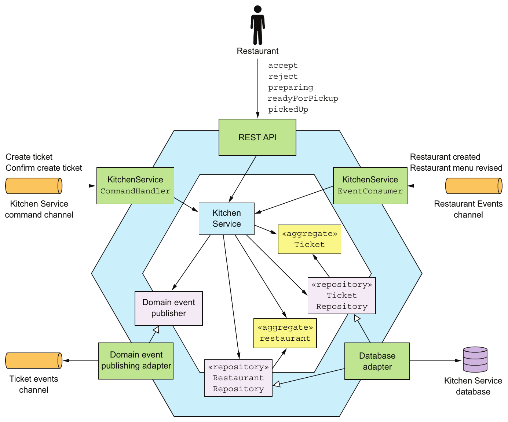

> **English:** Figure 5.11 The design of Kitchen Service
>
> **Türkçe:** Şekil 5.11 Kitchen Service’in tasarımı

<!-- source-record: u05_0196 -->

> **English:** Let’s take a closer look at the design of KitchenService, starting with the Ticket aggregate.
>
> **Türkçe:** KitchenService'in tasarımına daha yakından bakalım, Ticket aggregate ile başlayalım.

<!-- source-record: u05_0197 -->

### 5.4.1 The Ticket aggregate — Ticket aggregate'i

<!-- source-record: u05_0198 -->

> **English:** Ticket is one of the aggregates of Kitchen Service. As described in chapter 2, when talking about the concept of a Bounded Context, this aggregate represents the restaurant kitchen’s view of an order. It doesn’t contain information about the consumer, such as their identity, the delivery information, or payment details. It’s focused on enabling a restaurant’s kitchen to prepare the Order for pickup. Moreover, KitchenService doesn’t generate a unique ID for this aggregate. Instead, it uses the ID supplied by OrderService.
>
> **Türkçe:** Ticket, Kitchen Service’in aggregate birimlerinden biridir. 2. bölümde Bounded Context kavramını tartışırken açıklandığı gibi, restoran mutfağının siparişe bakışını temsil eder. Müşterinin kimliği, teslimat veya ödeme ayrıntıları gibi bilgiler içermez. Restoran mutfağının siparişi teslim alınmaya hazırlamasına odaklanır. Ayrıca KitchenService bu aggregate için yeni ve benzersiz bir kimlik üretmez; OrderService’in sağladığı kimliği kullanır.

<!-- source-record: u05_0199 -->

> **English:** Let’s first look at the structure of this class and then we’ll examine its methods.
>
> **Türkçe:** Önce bu sınıfın yapısına bakalım ve sonra yöntemlerini inceleyelim.

<!-- source-pages: 170 -->

<!-- source-record: u05_0200 -->

#### STRUCTURE OF THE TICKET CLASS — Ticket sınıfının yapısı

<!-- source-record: u05_0201 -->

> **English:** The following listing shows an excerpt of the code for this class. The Ticket class is similar to a traditional domain class. The main difference is that references to other aggregates are by primary key.
>
> **Türkçe:** Aşağıdaki kod bu sınıftan bir bölüm gösterir. Ticket, geleneksel bir domain sınıfına benzer. Temel fark, diğer aggregate birimlerine birincil anahtarla referans vermesidir.

<!-- source-record: u05_0202 -->

#### Listing 5.10 Part of the Ticket class, which is a JPA entity — Listede 5.10 JPA entity olan Ticket sınıfının bir parçası

<!-- source-record: u05_0203 -->

```java
@Entity(table="tickets")
public class Ticket {

  @Id
  private Long id;
  private TicketState state;
  private Long restaurantId;

  @ElementCollection
  @CollectionTable(name="ticket_line_items")
  private List<TicketLineItem> lineItems;

  private ZonedDateTime readyBy;
  private ZonedDateTime acceptTime;
  private ZonedDateTime preparingTime;
  private ZonedDateTime pickedUpTime;
  private ZonedDateTime readyForPickupTime;
  ...
```

<!-- source-record: u05_0204 -->

> **English:** This class is persisted with JPA and is mapped to the TICKETS table. The restaurantId field is a Long rather than an object reference to a Restaurant. The readyBy field stores the estimate of when the order will be ready for pickup. The Ticket class has several fields that track the history of the order, including acceptTime, preparingTime, and pickupTime. Let’s look at this class’s methods.
>
> **Türkçe:** Bu sınıf JPA ile kalıcı saklanır ve TICKETS tablosuna eşlenir. restaurantId alanı, Restaurant nesnesine referans yerine Long değeridir. readyBy alanı, siparişin teslim alınmaya hazır olacağı tahmini zamanı saklar. Ticket, acceptTime, preparingTime ve pickupTime gibi siparişin geçmişini izleyen alanlar içerir. Şimdi metotlarını inceleyelim.

<!-- source-record: u05_0205 -->

#### BEHAVIOR OF THE TICKET AGGREGATE — Ticket aggregate'inin davranışı

<!-- source-record: u05_0206 -->

> **English:** The Ticket aggregate defines several methods. As you saw earlier, it has a static create() method, which is a factory method that creates a Ticket. There are also some methods that are invoked when the restaurant updates the state of the order:
>
> **Türkçe:** Ticket aggregate çeşitli metotlar tanımlar. Daha önce gördüğünüz gibi Ticket oluşturan static create() factory metodu vardır. Restoran siparişin durumunu güncellediğinde çağrılan şu metotları da içerir:

<!-- source-record: u05_0207 -->

> **English:** • accept()—The restaurant has accepted the order.
>
> **Türkçe:** • accept() - Restoran siparişi kabul etti.

<!-- source-record: u05_0208 -->

> **English:** • preparing()—The restaurant has started preparing the order, which means the order can no longer be changed or cancelled.
>
> **Türkçe:** • preparing() — Restoran siparişi hazırlamaya başlamıştır; bu noktadan sonra sipariş değiştirilemez veya iptal edilemez.

<!-- source-record: u05_0209 -->

> **English:** • readyForPickup()—The order can now be picked up.
>
> **Türkçe:** • readyForPickup() - Sipariş şimdi alınabilir.

<!-- source-record: u05_0210 -->

> **English:** The following listing shows some of its methods.
>
> **Türkçe:** Aşağıdaki liste bazı yöntemlerini gösterir.

<!-- source-pages: 171 -->

<!-- source-record: u05_0211 -->

#### Listing 5.11 Some of the Ticket's methods — Listesi 5.11 Ticket'ın bazı yöntemleri

<!-- source-record: u05_0212 -->

```java
public class Ticket {

public static ResultWithAggregateEvents<Ticket, TicketDomainEvent>
     create(Long id, TicketDetails details) {
  return new ResultWithAggregateEvents<>(new Ticket(id, details), new
     TicketCreatedEvent(id, details));
}

public List<TicketPreparationStartedEvent> preparing() {
  switch (state) {
    case ACCEPTED:
      this.state = TicketState.PREPARING;
      this.preparingTime = ZonedDateTime.now();
      return singletonList(new TicketPreparationStartedEvent());
    default:
      throw new UnsupportedStateTransitionException(state);
  }
}

public List<TicketDomainEvent> cancel() {
    switch (state) {
      case CREATED:
      case ACCEPTED:
        this.state = TicketState.CANCELLED;
        return singletonList(new TicketCancelled());
      case READY_FOR_PICKUP:
        throw new TicketCannotBeCancelledException();

      default:
        throw new UnsupportedStateTransitionException(state);

    }
  }
```

<!-- source-record: u05_0213 -->

> **English:** The create() method creates a Ticket. The preparing() method is called when the restaurant starts preparing the order. It changes the state of the order to PREPARING, records the time, and publishes an event. The cancel() method is called when a user attempts to cancel an order. If the cancellation is allowed, this method changes the state of the order and returns an event. Otherwise, it throws an exception. These methods are invoked in response to REST API requests as well as events and command messages. Let’s look at the classes that invoke the aggregate’s method.
>
> **Türkçe:** create() metodu bir Ticket oluşturur. Restoran siparişi hazırlamaya başladığında preparing() çağrılır; sipariş durumunu PREPARING yapar, zamanı kaydeder ve olay yayımlar. Kullanıcı siparişi iptal etmeye çalıştığında cancel() çağrılır. İptale izin veriliyorsa durum değiştirilir ve bir olay döndürülür; aksi durumda exception fırlatılır. Bu metotlar REST API isteklerinin yanında olaylar ve komut mesajları üzerine de çağrılır. Aggregate metotlarını çağıran sınıfları inceleyelim.

<!-- source-record: u05_0214 -->

#### THE KITCHENSERVICE DOMAIN SERVICE — KitchenService domain service'i

<!-- source-record: u05_0215 -->

> **English:** KitchenService is invoked by the service’s inbound adapters. It defines various methods for changing the state of an order, including accept(), reject(), preparing(), and others. Each method loads the specifies aggregate, calls the corresponding method on the aggregate root, and publishes any domain events. The following listing shows its accept() method.
>
> **Türkçe:** KitchenService, servisin inbound adapter bileşenleri tarafından çağrılır. Sipariş durumunu değiştiren accept(), reject(), preparing() ve başka metotlar tanımlar. Her metot ilgili aggregate birimini yükler, kök nesnede uygun metodu çağırır ve üretilen domain event’leri yayımlar. Aşağıdaki kod accept() metodunu gösterir.

<!-- source-pages: 172 -->

<!-- source-record: u05_0216 -->

#### Listing 5.12 The service’s accept() method updates Ticket — Listesi 5.12 Servisin accept() yöntemi Ticket güncelleştirir

<!-- source-record: u05_0217 -->

```java
public class KitchenService {

  @Autowired
  private TicketRepository ticketRepository;

  @Autowired
  private TicketDomainEventPublisher domainEventPublisher;

  public void accept(long ticketId, ZonedDateTime readyBy) {
    Ticket ticket =
          ticketRepository.findById(ticketId)
            .orElseThrow(() ->
                      new TicketNotFoundException(ticketId));
    List<TicketDomainEvent> events = ticket.accept(readyBy);
    domainEventPublisher.publish(ticket, events);
  }

}
```

<!-- source-record: u05_0218 -->

**Kod açıklaması:**

> **English:** Publish domain events
>
> **Türkçe:** Domain event’leri yayımlar.

<!-- source-record: u05_0219 -->

> **English:** The accept() method is invoked when the restaurant accepts a new order. It has two parameters:
>
> **Türkçe:** Restoran yeni bir siparişi kabul ettiğinde accept() metodu çağrılır. İki parametresi vardır:

<!-- source-record: u05_0220 -->

> **English:** • orderId—ID of the order to accept
>
> **Türkçe:** • orderId — Kabul edilecek siparişin kimliği

<!-- source-record: u05_0221 -->

> **English:** • readyBy—Estimated time when the order will be ready for pickup
>
> **Türkçe:** • readyBy — Siparişin teslim alınmaya hazır olacağı tahmini zaman

<!-- source-record: u05_0222 -->

> **English:** This method retrieves the Ticket aggregate and calls its accept() method. It publishes any generated events.
>
> **Türkçe:** Bu metot Ticket aggregate birimini alır, accept() metodunu çağırır ve üretilen olayları yayımlar.

<!-- source-record: u05_0223 -->

> **English:** Now let’s look at the class that handles asynchronous commands.
>
> **Türkçe:** Şimdi asenkron komutları işleyen sınıfa bakalım.

<!-- source-record: u05_0224 -->

#### THE KITCHENSERVICECOMMANDHANDLER CLASS — KitchenServiceCommandHandler sınıfı

<!-- source-record: u05_0225 -->

> **English:** The KitchenServiceCommandHandler class is an adapter that’s responsible for handling command messages sent by the various sagas implemented by Order Service. This class defines a handler method for each command, which invokes KitchenService to create or update a Ticket. The following listing shows an excerpt of this class.
>
> **Türkçe:** KitchenServiceCommandHandler, Order Service’in uyguladığı çeşitli saga işlemlerinden gelen komut mesajlarını işleyen adapter sınıfıdır. Her komut için bir handler metodu tanımlar; bu metot, Ticket oluşturmak veya güncellemek için KitchenService’i çağırır. Aşağıdaki kod sınıftan bir bölüm gösterir.

<!-- source-record: u05_0226 -->

#### Listing 5.13 Handling command messages sent by sagas — Listesi 5.13 saga’lar tarafından gönderilen komut mesajlarını işlemek

<!-- source-record: u05_0227 -->

```java
public class KitchenServiceCommandHandler {

  @Autowired
  private KitchenService kitchenService;

  public CommandHandlers commandHandlers() {
   return CommandHandlersBuilder
          .fromChannel("orderService")
          .onMessage(CreateTicket.class, this::createTicket)
          .onMessage(ConfirmCreateTicket.class,
                  this::confirmCreateTicket)
          .onMessage(CancelCreateTicket.class,
                  this::cancelCreateTicket)
          .build();
 }

 private Message createTicket(CommandMessage<CreateTicket>
                                               cm) {
  CreateTicket command = cm.getCommand();
  long restaurantId = command.getRestaurantId();
  Long ticketId = command.getOrderId();
  TicketDetails ticketDetails =
      command.getTicketDetails();

  try {
    Ticket ticket =
       kitchenService.createTicket(restaurantId,
                                   ticketId, ticketDetails);
    CreateTicketReply reply =
                new CreateTicketReply(ticket.getId());
    return withSuccess(reply);
   } catch (RestaurantDetailsVerificationException e) {
    return withFailure();
   }
 }

 private Message confirmCreateTicket
         (CommandMessage<ConfirmCreateTicket> cm) {
      Long ticketId = cm.getCommand().getTicketId();
     kitchenService.confirmCreateTicket(ticketId);
     return withSuccess();
 }

   ...
```

<!-- source-record: u05_0228 -->

**Kod açıklaması:**

> **English:** Maps command messages to message handlers
>
> **Türkçe:** Komut mesajlarını message handler metotlarıyla eşleştirir.

<!-- source-pages: 173 -->

<!-- source-record: u05_0229 -->

**Kod açıklaması:**

> **English:** Invokes KitchenService to create the Ticket
>
> **Türkçe:** Ticket oluşturmak için KitchenService’i çağırır.

<!-- source-record: u05_0230 -->

**Kod açıklaması:**

> **English:** Sends back a successful reply
>
> **Türkçe:** Başarı yanıtı gönderir.

<!-- source-record: u05_0231 -->

**Kod açıklaması:**

> **English:** Sends back a failure reply
>
> **Türkçe:** Başarısızlık yanıtı gönderir.

<!-- source-record: u05_0232 -->

**Kod açıklaması:**

> **English:** Confirms the order
>
> **Türkçe:** Siparişi onaylar.

<!-- source-record: u05_0233 -->

> **English:** All the command handler methods invoke KitchenService and reply with either a success or a failure reply.
>
> **Türkçe:** Bütün komut handler metotları KitchenService’i çağırır ve başarı veya başarısızlık yanıtı döndürür.

<!-- source-record: u05_0234 -->

> **English:** Now that you’ve seen the business logic for a relatively simple service, we’ll look at a more complex example: Order Service.
>
> **Türkçe:** Şimdi nispeten basit bir servis için iş mantığını gördükten sonra, daha karmaşık bir örneğe bakacağız: Order Service.

<!-- source-record: u05_0235 -->

## 5.5 Order Service business logic — Order Service iş mantığı

<!-- source-record: u05_0236 -->

> **English:** As mentioned in earlier chapters, Order Service provides an API for creating, updating, and canceling orders. This API is primarily invoked by the consumer. Figure 5.12 shows the high-level design of the service. The Order aggregate is the central aggregate of Order Service. But there’s also a Restaurant aggregate, which is a partial replica of data owned by Restaurant Service. It enables Order Service to validate and price an Order’s line items.
>
> **Türkçe:** Önceki bölümlerde belirtildiği gibi Order Service, sipariş oluşturma, güncelleme ve iptal için API sağlar. Bu API’yi ağırlıklı olarak müşteri kullanır. Şekil 5.12 servisin genel tasarımını gösterir. Merkezi aggregate birimi Order’dır. Ayrıca Restaurant Service’in verilerinin kısmi kopyası olan bir Restaurant aggregate bulunur. Bu, Order Service’in sipariş kalemlerini doğrulamasını ve fiyatlandırmasını sağlar.

<!-- source-record: u05_0237 -->

> **English:** In addition to the Order and Restaurant aggregates, the business logic consists of OrderService, OrderRepository, RestaurantRepository, and various sagas such as the CreateOrderSaga described in chapter 4. OrderService is the primary entry point into the business logic and defines methods for creating and updated Orders and Restaurants. OrderRepository defines methods for persisting Orders, and RestaurantRepository has methods for persisting Restaurants. Order Service has several inbound adapters:
>
> **Türkçe:** İş mantığı, Order ve Restaurant aggregate birimlerinin yanında OrderService, OrderRepository, RestaurantRepository ve 4. bölümdeki CreateOrderSaga gibi çeşitli saga işlemlerinden oluşur. OrderService, iş mantığının ana giriş noktasıdır; Order ve Restaurant nesnelerini oluşturup güncelleyen metotlar tanımlar. OrderRepository, Order nesnelerini; RestaurantRepository ise Restaurant nesnelerini kalıcı saklayan metotlar sunar. Order Service’in şu inbound adapter bileşenleri vardır:

<!-- source-pages: 174 -->

<!-- source-record: u05_0238 -->

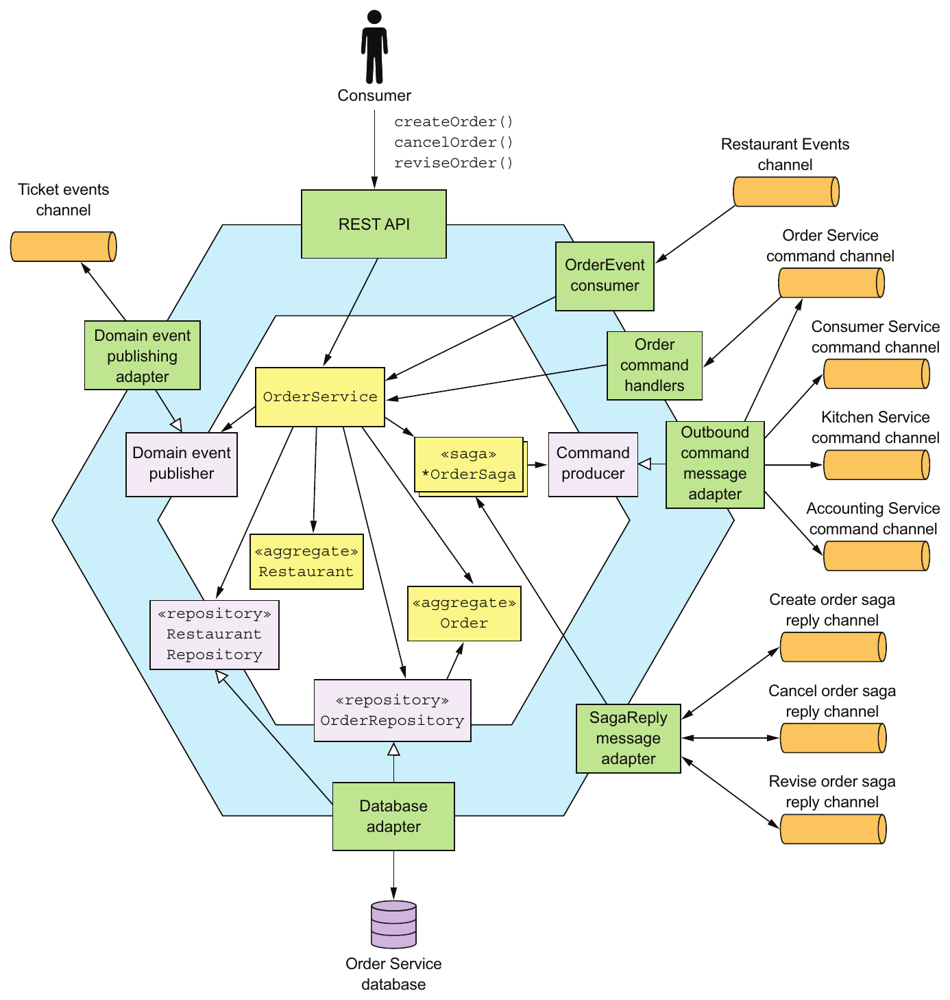

> **English:** Figure 5.12 The design of the Order Service. It has a REST API for managing orders. It exchanges messages and events with other services via several message channels.
>
> **Türkçe:** Şekil 5.12 Order Service’in tasarımı. Sipariş yönetimi için REST API sunar; çeşitli mesaj kanalları üzerinden diğer servislerle mesaj ve olay alışverişi yapar.

<!-- source-record: u05_0239 -->

> **English:** • REST API—The REST API invoked by the user interface used by consumers. It invokes OrderService to create and update Orders.
>
> **Türkçe:** • REST API — Müşterilerin kullanıcı arayüzü tarafından çağrılır. Order nesnelerini oluşturmak ve güncellemek için OrderService’i çağırır.

<!-- source-pages: 175 -->

<!-- source-record: u05_0240 -->

> **English:** • OrderEventConsumer—Subscribes to events published by Restaurant Service. It invokes OrderService to create and update its replica of Restaurants.
>
> **Türkçe:** • OrderEventConsumer — Restaurant Service’in yayımladığı olaylara abone olur. Restaurant veri kopyasını oluşturmak ve güncellemek için OrderService’i çağırır.

<!-- source-record: u05_0241 -->

> **English:** • OrderCommandHandlers—The asynchronous request/response-based API that’s invoked by sagas. It invokes OrderService to update Orders.
>
> **Türkçe:** • OrderCommandHandlers — Saga işlemlerinin çağırdığı eşzamansız istek/yanıt API’sidir. Order nesnelerini güncellemek için OrderService’i çağırır.

<!-- source-record: u05_0242 -->

> **English:** • SagaReplyAdapter—Subscribes to the saga reply channels and invokes the sagas.
>
> **Türkçe:** • SagaReplyAdapter — Saga yanıt kanallarına abone olur ve saga işlemlerini çağırır.

<!-- source-record: u05_0243 -->

> **English:** The service also has some outbound adapters:
>
> **Türkçe:** Servisin bazı outbound adapter bileşenleri de vardır:

<!-- source-record: u05_0244 -->

> **English:** • DB adapter—Implements the OrderRepository interface and accesses the Order Service database
>
> **Türkçe:** • DB adaptörü - OrderRepository arayüzünü uyguluyor ve Order Service veritabanına erişiyor

<!-- source-record: u05_0245 -->

> **English:** • DomainEventPublishingAdapter—Implements the DomainEventPublisher interface and publishes Order domain events
>
> **Türkçe:** • DomainEventPublishingAdapter — DomainEventPublisher arayüzünü uygular ve Order domain event’lerini yayımlar.

<!-- source-record: u05_0246 -->

> **English:** • OutboundCommandMessageAdapter—Implements the CommandPublisher interface and sends command messages to saga participants
>
> **Türkçe:** • OutboundCommandMessageAdapter - CommandPublisher arayüzünü uyguluyor ve saga katılımcılarına komut mesajları gönderir

<!-- source-record: u05_0247 -->

> **English:** Let’s first take a closer look at the Order aggregate and then examine OrderService.
>
> **Türkçe:** Önce Order aggregate'ye daha yakından bakalım ve sonra OrderService'yi inceleyelim.

<!-- source-record: u05_0248 -->

### 5.5.1 The Order Aggregate — Order aggregate'i

<!-- source-record: u05_0249 -->

> **English:** The Order aggregate represents an order placed by a consumer. We’ll first look at the structure of the Order aggregate and then check out its methods.
>
> **Türkçe:** Order aggregate, bir tüketici tarafından yapılan bir siparişi temsil eder. Önce Order aggregate'nin yapısına bakacağız ve sonra yöntemlerine bakacağız.

<!-- source-record: u05_0250 -->

#### THE STRUCTURE OF THE ORDER AGGREGATE — Order aggregate'inin yapısı

<!-- source-record: u05_0251 -->

> **English:** Figure 5.13 shows the structure of the Order aggregate. The Order class is the root of the Order aggregate. The Order aggregate also consists of value objects such as OrderLineItem, DeliveryInfo, and PaymentInfo.
>
> **Türkçe:** Şekil 5.13, Order aggregate yapısını gösterir. Order sınıfı, aggregate köküdür. Bütün ayrıca OrderLineItem, DeliveryInfo ve PaymentInfo gibi value object nesnelerini içerir.

<!-- source-record: u05_0252 -->

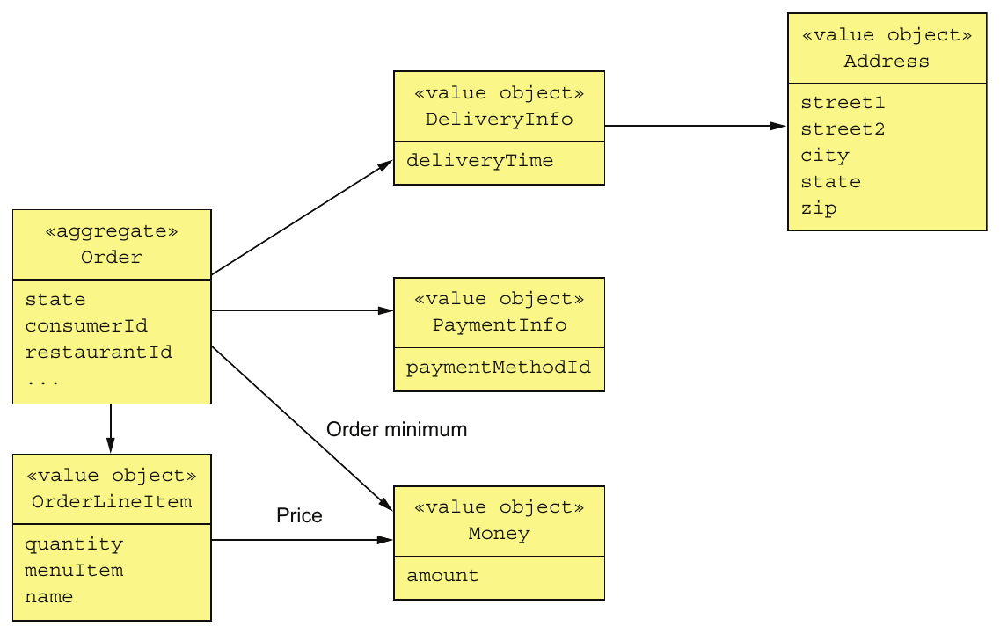

> **English:** Figure 5.13 The design of the Order aggregate, which consists of the Order aggregate root and various value objects.
>
> **Türkçe:** Şekil 5.13 Order aggregate tasarımı: Order kök nesnesi ve çeşitli value object nesnelerinden oluşur.

<!-- source-pages: 176 -->

<!-- source-record: u05_0253 -->

> **English:** The Order class has a collection of OrderLineItems. Because the Order’s Consumer and Restaurant are other aggregates, it references them by primary key value. The Order class has a DeliveryInfo class, which stores the delivery address and the desired delivery time, and a PaymentInfo, which stores the payment info. The following listing shows the code.
>
> **Türkçe:** Order sınıfı bir OrderLineItem koleksiyonu içerir. Consumer ve Restaurant başka aggregate birimleri olduğu için bunlara birincil anahtar değeriyle referans verir. Teslimat adresi ve istenen teslimat zamanını saklayan DeliveryInfo ile ödeme bilgilerini saklayan PaymentInfo nesnelerini de içerir. Aşağıdaki kod bunu gösterir.

<!-- source-record: u05_0254 -->

#### Listing 5.14 The Order class and its fields — Listesi 5.14 Order sınıfı ve alanları

<!-- source-record: u05_0255 -->

```java
@Entity
@Table(name="orders")
@Access(AccessType.FIELD)
public class Order {

  @Id
  @GeneratedValue
  private Long id;

  @Version
  private Long version;

  private OrderState state;
  private Long consumerId;
  private Long restaurantId;

  @Embedded
  private OrderLineItems orderLineItems;

  @Embedded
  private DeliveryInformation deliveryInformation;

  @Embedded
  private PaymentInformation paymentInformation;

  @Embedded
  private Money orderMinimum;
```

<!-- source-record: u05_0256 -->

> **English:** This class is persisted with JPA and is mapped to the ORDERS table. The id field is the primary key. The version field is used for optimistic locking. The state of an Order is represented by the OrderState enumeration. The DeliveryInformation and PaymentInformation fields are mapped using the @Embedded annotation and are stored as columns of the ORDERS table. The orderLineItems field is an embedded object that contains the order line items. The Order aggregate consists of more than just fields. It also implements business logic, which can be described by a state machine. Let’s take a look at the state machine.
>
> **Türkçe:** Bu sınıf JPA ile kalıcı saklanır ve ORDERS tablosuna eşlenir. id alanı birincil anahtar, version alanı optimistic locking içindir. Order durumu OrderState enum türüyle temsil edilir. DeliveryInformation ve PaymentInformation alanları @Embedded annotation ile eşlenir ve ORDERS tablosunun sütunlarında saklanır. orderLineItems, sipariş kalemlerini içeren gömülü nesnedir. Order aggregate yalnızca alanlardan oluşmaz; durum makinesiyle açıklanabilen iş mantığı da uygular. Bu durum makinesini inceleyelim.

<!-- source-record: u05_0257 -->

#### THE ORDER AGGREGATE STATE MACHINE — Order aggregate'inin durum makinesi

<!-- source-record: u05_0258 -->

> **English:** In order to create or update an order, Order Service must collaborate with other services using sagas. Either OrderService or the first step of the saga invokes an Order method that verifies that the operation can be performed and changes the state of the Order to a pending state. A pending state, as explained in chapter 4, is an example of a semantic lock countermeasure, which helps ensure that sagas are isolated from one another. Eventually, once the saga has invoked the participating services, it then updates the Order to reflect the outcome. For example, as described in chapter 4, the Create Order Saga has multiple participant services, including Consumer Service, Accounting Service, and Kitchen Service. OrderService first creates an Order in an APPROVAL_PENDING state, and then later changes its state to either APPROVED or REJECTED. The behavior of an Order can be modeled as the state machine shown in figure 5.14.
>
> **Türkçe:** Order Service, sipariş oluşturmak veya güncellemek için saga kullanarak diğer servislerle işbirliği yapmalıdır. OrderService veya saga işleminin ilk adımı, operasyonun yapılabilirliğini doğrulayan ve Order nesnesini bekleme durumuna geçiren bir metot çağırır. 4. bölümdeki gibi bekleme durumu, saga işlemlerinin birbirinden yalıtılmasına yardımcı olan anlamsal kilit karşı önlemidir. Saga katılımcı servisleri çağırdıktan sonra sonucu yansıtmak üzere Order nesnesini günceller. Örneğin Create Order Saga; Consumer Service, Accounting Service ve Kitchen Service gibi katılımcılar içerir. OrderService önce APPROVAL_PENDING durumunda Order oluşturur, daha sonra durumunu APPROVED veya REJECTED yapar. Order davranışı, Şekil 5.14’teki durum makinesiyle modellenebilir.

<!-- source-pages: 177 -->

<!-- source-record: u05_0259 -->

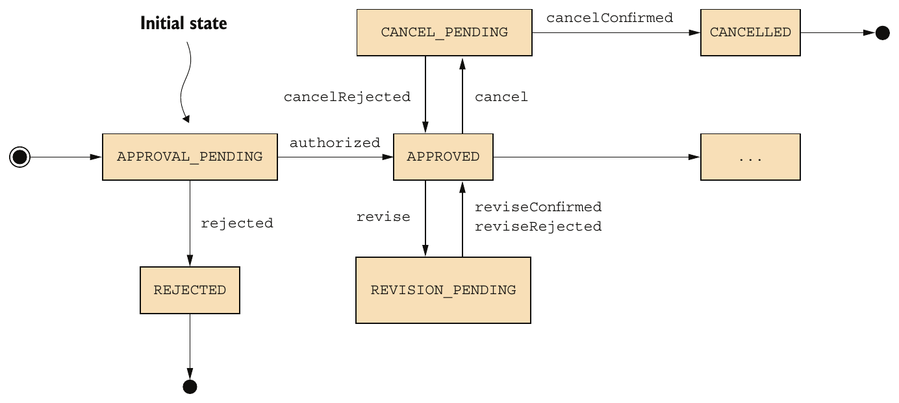

> **English:** Figure 5.14 Part of the state machine model of the Order aggregate
>
> **Türkçe:** Şekil 5.14 Order aggregate durum makinesi modelinin bir bölümü

<!-- source-record: u05_0260 -->

> **English:** Similarly, other Order Service operations such as revise() and cancel() first change the Order to a pending state and use a saga to verify that the operation can be performed. Then, once the saga has verified that the operation can be performed, it changes the Order transitions to some other state that reflects the successful outcome of the operation. If the verification of the operation fails, the Order reverts to the previous state. For example, the cancel() operation first transitions the Order to the CANCEL_PENDING state. If the order can be cancelled, the Cancel Order Saga changes the state of the Order to the CANCELLED state. Otherwise, if a cancel() operation is rejected because, for example, it’s too late to cancel the order, then the Order transitions back to the APPROVED state.
>
> **Türkçe:** Benzer şekilde revise() ve cancel() gibi diğer Order Service operasyonları da önce Order nesnesini bekleme durumuna alır ve operasyonun yapılabilirliğini doğrulamak için saga kullanır. Doğrulama başarılı olursa saga, Order nesnesini başarılı sonucu yansıtan duruma geçirir. Başarısız olursa Order önceki durumuna döner. Örneğin cancel() önce CANCEL_PENDING durumuna geçirir. Sipariş iptal edilebiliyorsa Cancel Order Saga durumu CANCELLED yapar. İptal için çok geç olması gibi bir nedenle operasyon reddedilirse Order yeniden APPROVED durumuna döner.

<!-- source-record: u05_0261 -->

> **English:** Let’s now look at the how the Order aggregate implements this state machine.
>
> **Türkçe:** Şimdi Order aggregate'nin bu durum makinesini nasıl uyguladığına bakalım.

<!-- source-record: u05_0262 -->

#### THE ORDER AGGREGATE’S METHODS — Order aggregate'inin metotları

<!-- source-record: u05_0263 -->

> **English:** The Order class has several groups of methods, each of which corresponds to a saga. In each group, one method is invoked at the start of the saga, and the other methods are invoked at the end. I’ll first discuss the business logic that creates an Order. After that we’ll look at how an Order is updated. The following listing shows the Order’s methods that are invoked during the process of creating an Order.
>
> **Türkçe:** Order sınıfında her biri bir saga işlemine karşılık gelen metot grupları vardır. Her gruptan bir metot saga başında, diğerleri sonunda çağrılır. Önce Order oluşturan iş mantığını, ardından güncelleme işlemlerini inceleyeceğiz. Aşağıdaki kod, Order oluşturma sürecinde çağrılan metotları gösterir.

<!-- source-pages: 178 -->

<!-- source-record: u05_0264 -->

#### Listing 5.15 The methods that are invoked during order creation — Listesi 5.15 Düzen oluşturma sırasında kullanılan yöntemler

<!-- source-record: u05_0265 -->

```java
public class Order { ...

  public static ResultWithDomainEvents<Order, OrderDomainEvent>
   createOrder(long consumerId, Restaurant restaurant,
                                        List<OrderLineItem> orderLineItems) {
    Order order = new Order(consumerId, restaurant.getId(), orderLineItems);
    List<OrderDomainEvent> events = singletonList(new OrderCreatedEvent(
            new OrderDetails(consumerId, restaurant.getId(), orderLineItems,
                    order.getOrderTotal()),
            restaurant.getName()));
    return new ResultWithDomainEvents<>(order, events);
  }

  public Order(OrderDetails orderDetails) {
    this.orderLineItems = new OrderLineItems(orderDetails.getLineItems());
    this.orderMinimum = orderDetails.getOrderMinimum();
    this.state = APPROVAL_PENDING;
  }
  ...

  public List<DomainEvent> noteApproved() {
    switch (state) {
      case APPROVAL_PENDING:
        this.state = APPROVED;
        return singletonList(new OrderAuthorized());
      ...
      default:
        throw new UnsupportedStateTransitionException(state);
    }
  }

  public List<DomainEvent> noteRejected() {
    switch (state) {
      case APPROVAL_PENDING:
        this.state = REJECTED;
        return singletonList(new OrderRejected());
        ...
      default:
        throw new UnsupportedStateTransitionException(state);
    }

  }
```

<!-- source-record: u05_0266 -->

> **English:** The createOrder() method is a static factory method that creates an Order and publishes an OrderCreatedEvent. The OrderCreatedEvent is enriched with the details of the Order, including the line items, the total amount, the restaurant ID, and the restaurant name. Chapter 7 discusses how Order History Service uses Order events, including OrderCreatedEvent, to maintain an easily queried replica of Orders.
>
> **Türkçe:** createOrder(), Order oluşturan ve OrderCreatedEvent yayımlayan static factory metodudur. Olay; sipariş kalemleri, toplam tutar, restoran kimliği ve adı dahil sipariş ayrıntılarıyla zenginleştirilmiştir. 7. bölümde Order History Service’in, kolay sorgulanabilen bir Order kopyası tutmak için OrderCreatedEvent dahil Order olaylarını nasıl kullandığı açıklanır.

<!-- source-pages: 179 -->

<!-- source-record: u05_0267 -->

> **English:** The initial state of the Order is APPROVAL_PENDING. When the CreateOrderSaga completes, it will invoke either noteApproved() or noteRejected(). The noteApproved() method is invoked when the consumer’s credit card has been successfully authorized. The noteRejected() method is called when one of the services rejects the order or authorization fails. As you can see, the state of the Order aggregate determines the behavior of most of its methods. Like the Ticket aggregate, it also emits events.
>
> **Türkçe:** Order nesnesinin başlangıç durumu APPROVAL_PENDING’dir. CreateOrderSaga tamamlandığında noteApproved() veya noteRejected() çağrılır. Kredi kartından başarıyla provizyon alınmışsa noteApproved(); servislerden biri siparişi reddetmişse veya provizyon başarısızsa noteRejected() çağrılır. Order aggregate durumu, metotlarının çoğunun davranışını belirler. Ticket aggregate gibi olay da üretir.

<!-- source-record: u05_0268 -->

> **English:** In addition to createOrder(), the Order class defines several update methods. For example, the Revise Order Saga revises an order by first invoking the revise() method and then, once it’s verified that the revision can be made, it invokes the confirmRevised() method. The following listing shows these methods.
>
> **Türkçe:** Order sınıfı, createOrder() dışında çeşitli güncelleme metotları tanımlar. Örneğin Revise Order Saga, siparişi değiştirmek için önce revise() metodunu çağırır; değişikliğin yapılabileceğini doğruladıktan sonra confirmRevised() metodunu çağırır. Aşağıdaki kod bu metotları gösterir.

<!-- source-record: u05_0269 -->

#### Listing 5.16 The Order method for revising an Order — Listesi 5.16 Bir Order'i gözden geçirme Order yöntemi

<!-- source-record: u05_0270 -->

```java
class Order ...

  public List<OrderDomainEvent> revise(OrderRevision orderRevision) {
    switch (state) {

      case APPROVED:
        LineItemQuantityChange change =
                orderLineItems.lineItemQuantityChange(orderRevision);
        if (change.newOrderTotal.isGreaterThanOrEqual(orderMinimum)) {
          throw new OrderMinimumNotMetException();
        }
        this.state = REVISION_PENDING;
        return singletonList(new OrderRevisionProposed(orderRevision,
                          change.currentOrderTotal, change.newOrderTotal));

      default:
        throw new UnsupportedStateTransitionException(state);
    }
  }

  public List<OrderDomainEvent> confirmRevision(OrderRevision orderRevision) {
    switch (state) {
      case REVISION_PENDING:
        LineItemQuantityChange licd =
          orderLineItems.lineItemQuantityChange(orderRevision);

        orderRevision
              .getDeliveryInformation()
              .ifPresent(newDi -> this.deliveryInformation = newDi);

        if (!orderRevision.getRevisedLineItemQuantities().isEmpty()) {
          orderLineItems.updateLineItems(orderRevision);
        }

        this.state = APPROVED;
        return singletonList(new OrderRevised(orderRevision,
                          licd.currentOrderTotal, licd.newOrderTotal));
      default:
        throw new UnsupportedStateTransitionException(state);
    }
  }

}
```

<!-- source-pages: 180 -->

<!-- source-record: u05_0271 -->

> **English:** The revise() method is called to initiate the revision of an order. Among other things, it verifies that the revised order won’t violate the order minimum and changes the state of the order to REVISION_PENDING. Once Revise Order Saga has successfully updated Kitchen Service and Accounting Service, it then calls confirmRevision() to complete the revision.
>
> **Türkçe:** revise() metodu sipariş değişikliğini başlatır. Diğer işlerinin yanında, değiştirilmiş siparişin asgari sipariş tutarını ihlal etmediğini doğrular ve durumu REVISION_PENDING yapar. Revise Order Saga, Kitchen Service ve Accounting Service’i başarıyla güncelledikten sonra değişikliği tamamlamak için confirmRevision() metodunu çağırır.

<!-- source-record: u05_0272 -->

> **English:** These methods are invoked by OrderService. Let’s take a look at that class.
>
> **Türkçe:** Bu metotları OrderService çağırır. Şimdi bu sınıfı inceleyelim.

<!-- source-record: u05_0273 -->

### 5.5.2 The OrderService class — OrderService sınıfı

<!-- source-record: u05_0274 -->

> **English:** The OrderService class defines methods for creating and updating Orders. It’s the main entry point into the business logic and is invoked by various inbound adapters, such as the REST API. Most of its methods create a saga to orchestrate the creation and updating of Order aggregates. As a result, this service is more complicated than the KitchenService class discussed earlier. The following listing shows an excerpt of this class. OrderService is injected with various dependencies, including OrderRepository, OrderDomainEventPublisher, and several saga managers. It defines several methods, including createOrder() and reviseOrder().
>
> **Türkçe:** OrderService, Order nesnelerini oluşturup güncelleyen metotlar tanımlar. İş mantığının ana giriş noktasıdır ve REST API gibi çeşitli inbound adapter bileşenleri tarafından çağrılır. Metotlarının çoğu, Order aggregate birimlerinin oluşturulmasını ve güncellenmesini koordine etmek için saga oluşturur. Bu nedenle daha önceki KitchenService sınıfından karmaşıktır. Aşağıdaki kod sınıftan bir bölüm gösterir. OrderRepository, OrderDomainEventPublisher ve çeşitli saga yöneticileri gibi bağımlılıklar OrderService’e enjekte edilir. Sınıf, createOrder() ve reviseOrder() dahil çeşitli metotlar tanımlar.

<!-- source-record: u05_0275 -->

#### Listing 5.17 The OrderService class has methods for creating and managing orders — Listesi 5.17 OrderService sınıfı siparişlerin oluşturulması ve yönetilmesi için yöntemlere sahiptir

<!-- source-record: u05_0276 -->

```java
@Transactional
public class OrderService {

  @Autowired
  private OrderRepository orderRepository;

  @Autowired
  private SagaManager<CreateOrderSagaState, CreateOrderSagaState>
    createOrderSagaManager;

  @Autowired
  private SagaManager<ReviseOrderSagaState, ReviseOrderSagaData>
    reviseOrderSagaManagement;

  @Autowired
  private OrderDomainEventPublisher orderAggregateEventPublisher;

  public Order createOrder(OrderDetails orderDetails) {

    Restaurant restaurant = restaurantRepository.findById(restaurantId)
            .orElseThrow(() -
     > new RestaurantNotFoundException(restaurantId));
    List<OrderLineItem> orderLineItems =
       makeOrderLineItems(lineItems, restaurant);

    ResultWithDomainEvents<Order, OrderDomainEvent> orderAndEvents =
            Order.createOrder(consumerId, restaurant, orderLineItems);

    Order order = orderAndEvents.result;

    orderRepository.save(order);

    orderAggregateEventPublisher.publish(order, orderAndEvents.events);

    OrderDetails orderDetails =
      new OrderDetails(consumerId, restaurantId, orderLineItems,
                        order.getOrderTotal());
    CreateOrderSagaState data = new CreateOrderSagaState(order.getId(),
            orderDetails);

    createOrderSagaManager.create(data, Order.class, order.getId());

    return order;
  }

  public Order reviseOrder(Long orderId, Long expectedVersion,
                                OrderRevision orderRevision)  {
    public Order reviseOrder(long orderId, OrderRevision orderRevision) {
      Order order = orderRepository.findById(orderId)
               .orElseThrow(() -> new OrderNotFoundException(orderId));
      ReviseOrderSagaData sagaData =
        new ReviseOrderSagaData(order.getConsumerId(), orderId,
              null, orderRevision);
      reviseOrderSagaManager.create(sagaData);
       return order;
    }
  }
```

<!-- source-pages: 181 -->

<!-- source-record: u05_0277 -->

**Kod açıklaması:**

> **English:** Creates the Order aggregate
>
> **Türkçe:** Order aggregate birimini oluşturur.

<!-- source-record: u05_0278 -->

**Kod açıklaması:**

> **English:** Publishes domain events
>
> **Türkçe:** Domain event’leri yayımlar.

<!-- source-record: u05_0279 -->

**Kod açıklaması:**

> **English:** Persists the Order in the database
>
> **Türkçe:** Order nesnesini veritabanına kalıcı olarak kaydeder.

<!-- source-record: u05_0280 -->

**Kod açıklaması:**

> **English:** Creates the Create Order Saga
>
> **Türkçe:** Create Order Saga oluşturur.

<!-- source-record: u05_0281 -->

**Kod açıklaması:**

> **English:** Retrieves the Order
>
> **Türkçe:** Order nesnesini alır.

<!-- source-record: u05_0282 -->

**Kod açıklaması:**

> **English:** Creates the Revise Order Saga
>
> **Türkçe:** Revise Order Saga oluşturur.

<!-- source-record: u05_0283 -->

> **English:** The createOrder() method first creates and persists an Order aggregate. It then publishes the domain events emitted by the aggregate. Finally, it creates a CreateOrderSaga. The reviseOrder() retrieves the Order and then creates a ReviseOrderSaga.
>
> **Türkçe:** createOrder() önce bir Order aggregate oluşturur ve kalıcı olarak kaydeder. Ardından aggregate tarafından üretilen domain event’leri yayımlar. Son olarak CreateOrderSaga oluşturur. reviseOrder() ise Order nesnesini alır ve ReviseOrderSaga oluşturur.

<!-- source-record: u05_0284 -->

> **English:** In many ways, the business logic for a microservices-based application is not that different from that of a monolithic application. It’s comprised of classes such as services, JPA-backed entities, and repositories. There are some differences, though. A domain model is organized as a set of DDD aggregates that impose various design constraints. Unlike in a traditional object model, references between classes in different aggregates are in terms of primary key value rather than object references. Also, a transaction can only create or update a single aggregate. It’s also useful for aggregates to publish domain events when their state changes.
>
> **Türkçe:** Mikroservis tabanlı uygulamanın iş mantığı birçok açıdan monolitik uygulamadan çok farklı değildir. Servis sınıfları, JPA ile kalıcı saklanan entity nesneleri ve repository sınıflarından oluşur. Ancak farklar da vardır. Domain model, belirli tasarım kısıtları getiren DDD aggregate birimleri halinde düzenlenir. Geleneksel nesne modelinden farklı olarak, ayrı aggregate birimlerindeki sınıflar arasında nesne referansı yerine birincil anahtar değeri kullanılır. Bir transaction yalnızca tek bir aggregate oluşturabilir veya güncelleyebilir. Aggregate durumunun değiştiğinde domain event yayımlaması da yararlıdır.

<!-- source-record: u05_0285 -->

> **English:** Another major difference is that services often use sagas to maintain data consistency across multiple services. For example, Kitchen Service merely participates in sagas, it doesn’t initiate them. In contrast, Order Service relies heavily on sagas when creating and updating orders. That’s because Orders must be transactionally consistent with data owned by other services. As a result, most OrderService methods create a saga rather than update an Order directly.
>
> **Türkçe:** Başka bir önemli fark, servislerin birden fazla servis arasında veri tutarlılığını korumak için sıklıkla saga kullanmasıdır. Örneğin Kitchen Service saga işlemlerine katılır, ancak başlatmaz. Order Service ise sipariş oluşturma ve güncellemede yoğun biçimde saga kullanır. Çünkü Order verisinin diğer servislerin verileriyle transaction açısından tutarlı olması gerekir. Bu nedenle çoğu OrderService metodu, Order nesnesini doğrudan güncellemek yerine saga oluşturur.

<!-- source-pages: 182 -->

<!-- source-record: u05_0286 -->

> **English:** This chapter has covered how to implement business logic using a traditional approach to persistence. That has involved integrating messaging and event publishing with database transaction management. The event publishing code is intertwined with the business logic. The next chapter looks at event sourcing, an event-centric approach to writing business logic where event generation is integral to the business logic rather than being bolted on.
>
> **Türkçe:** Bu bölüm, kalıcı saklamaya geleneksel yaklaşımı kullanarak iş mantığının nasıl uygulandığını ele aldı. Bunun için mesajlaşma ve olay yayımlama, veritabanı transaction yönetimiyle bütünleştirildi. Olay yayımlama kodu iş mantığıyla iç içedir. Sonraki bölüm, olay üretmenin sonradan eklenmek yerine iş mantığının ayrılmaz parçası olduğu, olay merkezli event sourcing yaklaşımını ele alır.

<!-- source-record: u05_0287 -->

## Summary — Bölüm özeti

<!-- source-record: u05_0288 -->

> **English:** • The procedural Transaction script pattern is often a good way to implement simple business logic. But when implementing complex business logic you should consider using the object-oriented Domain model pattern.
>
> **Türkçe:** • Prosedürel Transaction script örüntüsü, basit iş mantığını uygulamak için çoğunlukla uygundur. Karmaşık iş mantığında ise nesne yönelimli Domain model örüntüsünü düşünmelisiniz.

<!-- source-record: u05_0289 -->

> **English:** • A good way to organize a service’s business logic is as a collection of DDD aggregates. DDD aggregates are useful because they modularize the domain model, eliminate the possibility of object reference between services, and ensure that each ACID transaction is within a service.
>
> **Türkçe:** • Servisin iş mantığını düzenlemenin iyi bir yolu, DDD aggregate birimleri kullanmaktır. Bunlar domain modeli modüllere ayırır, servisler arasında nesne referansı oluşmasını engeller ve her ACID transaction işleminin tek bir servis içinde kalmasını sağlar.

<!-- source-record: u05_0290 -->

> **English:** • An aggregate should publish domain events when it’s created or updated. Domain events have a wide variety of uses. Chapter 4 discusses how they can implement choreography-based sagas. And, in chapter 7, I talk about how to use domain events to update replicated data. Domain event subscribers can also notify users and other applications, and publish WebSocket messages to a user’s browser.
>
> **Türkçe:** • Aggregate oluşturulduğunda veya güncellendiğinde domain event yayımlamalıdır. Bu olayların birçok kullanım alanı vardır. 4. bölümde koreografi tabanlı saga uygulaması; 7. bölümde veri kopyalarını güncelleme ele alınır. Olay aboneleri kullanıcılara ve diğer uygulamalara bildirim gönderebilir, kullanıcının tarayıcısına WebSocket mesajı yayımlayabilir.
