# Ünite 06 · Developing business logic with event sourcing — Event sourcing ile iş mantığı geliştirme

**Amaç:** Event sourcing ile iş mantığı geliştirme konusunu İngilizce–Türkçe karşılaştırmalı çalışmak; teknik açıklamaları özgün şekiller, tablolar ve kod örnekleriyle birlikte okumak.

**Kaynak:** Kullanıcının sağladığı *Microservices Patterns*, bölüm 6; `Microservices_Patterns_1_Bolumden_Itibaren.pdf`, kaynak PDF sayfaları **183–219**. Başlık ve metin sırası korunmuş, sayfa sonlarında bölünen paragraflar birleştirilmiştir. Şekiller, üzerlerindeki yazılar korunarak kaynak PDF'den alınmıştır.

**Okuma notu:** Teknoloji ve şirket örnekleri kitabın yazıldığı dönemin anlatımıdır. Kodlar kaynakta verilen bağlama bağlı örneklerdir; bağımsız Java 17 programları olarak sunulmaz. İngilizce kaynak ve Türkçe çeviri ardışık bloklardadır. Çeviri hazırlığında yerel bir çeviri modeli kullanılmış; teknik terimler ve metin aktarımı ayrıca kontrol edilmiştir.

**Dil çalışması:** [Ünite sözlüğü](vocabulary.md) · [Vocabulary PDF](vocabulary.pdf) · [Grammar notları](grammar_notes.md) · [Grammar PDF](grammar_notes.pdf). Kelime anlamları ve cümle yapılarının ayrıntıları bu iki eşlikçi kaynaktadır.

<!-- source-pages: 183 -->

<!-- source-record: u06_0000 -->

## This chapter covers — Bu bölümün kapsamı

<!-- source-record: u06_0001 -->

> **English:** • Using the Event sourcing pattern to develop business logic
>
> **Türkçe:** • İş mantığını geliştirmek için Event sourcing örüntüsünü kullanma.

<!-- source-record: u06_0002 -->

> **English:** • Implementing an event store
>
> **Türkçe:** • Bir event store (olay deposu) gerçekleştirme.

<!-- source-record: u06_0003 -->

> **English:** • Integrating sagas and event sourcing-based business logic
>
> **Türkçe:** • Saga’ları event sourcing tabanlı iş mantığıyla bütünleştirme.

<!-- source-record: u06_0004 -->

> **English:** • Implementing saga orchestrators using event sourcing
>
> **Türkçe:** • Saga orchestrator’larının event sourcing ile uygulanması

<!-- source-record: u06_0005 -->

> **English:** Mary liked the idea, described in chapter 5, of structuring business logic as a collection of DDD aggregates that publish domain events. She could imagine the use of those events being extremely useful in a microservice architecture. Mary planned to use events to implement choreography-based sagas, which maintain data consistency across services and are described in chapter 4. She also expected to use CQRS views, replicas that support efficient querying that are described in chapter 7.
>
> **Türkçe:** Mary, 5. bölümde açıklanan, iş mantığını domain event yayımlayan DDD aggregate’lerinden oluşturma fikrini beğenmişti. Bu olayların mikroservis mimarisinde çok yararlı olabileceğini düşünüyordu. Olayları, 4. bölümde anlatılan ve servisler arasında veri tutarlılığı sağlayan koreografi tabanlı saga’ları gerçekleştirmek için kullanmayı planlıyordu. Ayrıca 7. bölümde açıklanan, verimli sorgulamayı destekleyen veri kopyaları olan CQRS görünümlerini kullanmayı da bekliyordu.

<!-- source-record: u06_0006 -->

> **English:** She was, however, worried that the event publishing logic might be error prone. On one hand, the event publishing logic is reasonably straightforward. Each of an aggregate’s methods that initializes or changes the state of the aggregate returns a list of events. The domain service then publishes those events. But on the other hand, the event publishing logic is bolted on to the business logic. The business logic continues to work even when the developer forgets to publish an event. Mary was concerned that this way of publishing events might be a source of bugs.
>
> **Türkçe:** Ancak olay yayımlama mantığının hataya açık olmasından endişeliydi. Bir yandan bu mantık oldukça basitti: aggregate’ın durumunu başlatan veya değiştiren her metot bir olay listesi döndürür, ardından domain service bu olayları yayımlar. Diğer yandan olay yayımlama mantığı, iş mantığına sonradan eklenmiştir. Geliştirici bir olayı yayımlamayı unutsa bile iş mantığı çalışmaya devam eder. Mary, olayları bu biçimde yayımlamanın hatalara kaynak olabileceğinden endişeleniyordu.

<!-- source-pages: 184 -->

<!-- source-record: u06_0007 -->

> **English:** Many years ago, Mary had learned about event sourcing, an event-centric way of writing business logic and persisting domain objects. At the time she was intrigued by its numerous benefits, including how it preserves the complete history of the changes to an aggregate, but it remained a curiosity. Given the importance of domain events in microservice architecture, she now wonders whether it would be worthwhile to explore using event sourcing in the FTGO application. After all, event sourcing eliminates a source of programming errors by guaranteeing that an event will be published whenever an aggregate is created or updated.
>
> **Türkçe:** Mary yıllar önce, iş mantığı yazmanın ve alan nesnelerini kalıcı saklamanın olay merkezli bir yolu olan event sourcing’i öğrenmişti. O dönemde aggregate üzerindeki değişikliklerin bütün geçmişini koruması dâhil birçok yararı ilgisini çekmişti; ancak yaklaşım yalnızca merak ettiği bir konu olarak kalmıştı. Domain event’lerin mikroservis mimarisindeki önemini düşününce, şimdi FTGO’da event sourcing kullanımını araştırmaya değer olup olmadığını merak ediyordu. Sonuçta event sourcing, bir aggregate oluşturulduğunda veya güncellendiğinde olay yayımlanmasını garanti ederek programlama hatalarının bir kaynağını ortadan kaldırır.

<!-- source-record: u06_0008 -->

> **English:** I begin this chapter by describing how event sourcing works and how you can use it to write business logic. I describe how event sourcing persists each aggregate as a sequence of events in what is known as an event store. I discuss the benefits and drawbacks of event sourcing and cover how to implement an event store. I describe a simple framework for writing event sourcing-based business logic. After that, I discuss how event sourcing is a good foundation for implementing sagas. Let’s start by looking at how to develop business logic with event sourcing.
>
> **Türkçe:** Bu bölüme event sourcing’in nasıl çalıştığını ve iş mantığı yazmak için nasıl kullanılabileceğini açıklayarak başlıyorum. Her aggregate’ı, event store adı verilen depoda bir olay dizisi olarak nasıl kalıcılaştırdığını anlatıyorum. Yaklaşımın yararlarını, dezavantajlarını ve olay deposunun nasıl gerçekleştirileceğini ele alıyorum. Event sourcing tabanlı iş mantığı yazmak için basit bir framework açıklıyorum. Ardından bunun saga’lar için neden iyi bir temel olduğunu tartışıyorum. Önce event sourcing ile iş mantığının nasıl geliştirileceğine bakalım.

<!-- source-record: u06_0009 -->

## 6.1 Developing business logic using event sourcing — Event sourcing kullanarak iş mantığı geliştirmek

<!-- source-record: u06_0010 -->

> **English:** Event sourcing is a different way of structuring the business logic and persisting aggregates. It persists an aggregate as a sequence of events. Each event represents a state change of the aggregate. An application recreates the current state of an aggregate by replaying the events.
>
> **Türkçe:** Event sourcing, iş mantığını yapılandırmanın ve aggregate’ları kalıcı saklamanın farklı bir yoludur. Aggregate’ı bir olay dizisi olarak saklar. Her olay, aggregate’ın bir durum değişikliğini temsil eder. Uygulama, olayları yeniden yürüterek aggregate’ın güncel durumunu oluşturur.

<!-- source-record: u06_0011 -->

### Pattern: Event sourcing — Şekil: event sourcing (olay kaynaklı durum yönetimi)

<!-- source-record: u06_0012 -->

> **English:** Persist an aggregate as a sequence of domain events that represent state changes. See http://microservices.io/patterns/data/event-sourcing.html.
>
> **Türkçe:** Aggregate’ı, durum değişikliklerini temsil eden domain event’ler dizisi olarak kalıcı saklayın. Bkz. http://microservices.io/patterns/data/event-sourcing.html.

<!-- source-record: u06_0013 -->

> **English:** Event sourcing has several important benefits. For example, it preserves the history of aggregates, which is valuable for auditing and regulatory purposes. And it reliably publishes domain events, which is particularly useful in a microservice architecture. Event sourcing also has drawbacks. It involves a learning curve, because it’s a different way to write your business logic. Also, querying the event store is often difficult, which requires you to use the CQRS pattern, described in chapter 7.
>
> **Türkçe:** Event sourcing’in önemli yararları vardır. Örneğin aggregate geçmişini korur; bu, denetim ve mevzuat gereksinimleri açısından değerlidir. Ayrıca mikroservis mimarisinde özellikle yararlı olan domain event’leri güvenilir biçimde yayımlar. Dezavantajları da vardır. İş mantığını yazmanın farklı bir yolu olduğu için öğrenme süreci gerektirir. Olay deposunu sorgulamak da çoğu zaman güçtür; bu yüzden 7. bölümde anlatılan CQRS örüntüsünü kullanmanız gerekir.

<!-- source-record: u06_0014 -->

> **English:** I begin this section by describing the limitations of traditional persistence. I then describe event sourcing in detail and talk about how it overcomes those limitations. After that, I show how to implement the Order aggregate using event sourcing. Finally, I describe the benefits and drawbacks of event sourcing.
>
> **Türkçe:** Bu kısımda önce geleneksel kalıcı saklama yaklaşımının sınırlamalarını açıklıyorum. Sonra event sourcing’i ayrıntılarıyla ve bu sınırlamaları nasıl aştığıyla ele alıyorum. Ardından Order aggregate’ının event sourcing ile gerçekleştirilmesini gösteriyorum. Son olarak yaklaşımın yararlarını ve dezavantajlarını anlatıyorum.

<!-- source-record: u06_0015 -->

> **English:** Let’s first look at the limitations of the traditional approach to persistence.
>
> **Türkçe:** Önce kalıcı saklamaya yönelik geleneksel yaklaşımın sınırlamalarına bakalım.

<!-- source-pages: 185 -->

<!-- source-record: u06_0016 -->

### 6.1.1 The trouble with traditional persistence — Geleneksel kalıcılık yaklaşımının sorunları

<!-- source-record: u06_0017 -->

> **English:** The traditional approach to persistence maps classes to database tables, fields of those classes to table columns, and instances of those classes to rows in those tables. For example, figure 6.1 shows how the Order aggregate, described in chapter 5, is mapped to the ORDER table. Its OrderLineItems are mapped to the ORDER_LINE_ITEM table.
>
> **Türkçe:** Geleneksel kalıcı saklama yaklaşımı; sınıfları veritabanı tablolarıyla, sınıfların alanlarını tablo sütunlarıyla ve sınıf örneklerini tablolardaki satırlarla eşler. Örneğin Şekil 6.1, 5. bölümdeki Order aggregate’ının ORDER tablosuyla eşlenmesini gösterir. OrderLineItems nesneleri ise ORDER_LINE_ITEM tablosuyla eşlenir.

<!-- source-record: u06_0018 -->

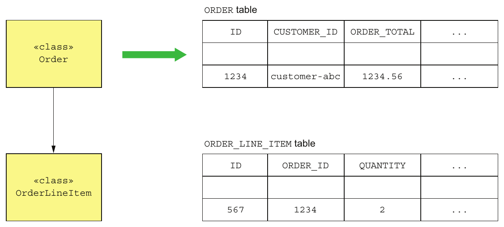

> **English:** Figure 6.1 The traditional approach to persistence maps classes to tables and objects to rows in those tables.
>
> **Türkçe:** Şekil 6.1 Kalıcı saklamaya yönelik geleneksel yaklaşım, sınıfları tablolara ve nesneleri bu tablolardaki satırlara eşler.

<!-- source-record: u06_0019 -->

> **English:** The application persists an order instance as rows in the ORDER and ORDER_LINE_ITEM tables. It might do that using an ORM framework such as JPA or a lower-level framework such as MyBATIS.
>
> **Türkçe:** Uygulama, sipariş örneğini ORDER ve ORDER_LINE_ITEM tablolarındaki satırlar olarak kalıcı saklar. Bunun için JPA gibi bir ORM framework’ü veya MyBATIS gibi daha düşük düzeyli bir framework kullanabilir.

<!-- source-record: u06_0020 -->

> **English:** This approach clearly works well because most enterprise applications store data this way. But it has several drawbacks and limitations:
>
> **Türkçe:** Bu yaklaşım açıkça iyi çalışır çünkü çoğu işletme uygulaması verileri bu şekilde depolar. Ama birkaç dezavantajı ve sınırlaması var:

<!-- source-record: u06_0021 -->

> **English:** • Object-Relational impedance mismatch.
>
> **Türkçe:** • Nesne-ilişkisel empedans uyumsuzluğu (Object-Relational impedance mismatch).

<!-- source-record: u06_0022 -->

> **English:** • Lack of aggregate history.
>
> **Türkçe:** • Aggregate geçmişinin bulunmaması.

<!-- source-record: u06_0023 -->

> **English:** • Implementing audit logging is tedious and error prone.
>
> **Türkçe:** • Denetim günlüğü tutmanın zahmetli ve hataya açık olması.

<!-- source-record: u06_0024 -->

> **English:** • Event publishing is bolted on to the business logic.
>
> **Türkçe:** • Olay yayımlamanın iş mantığına sonradan eklenmesi.

<!-- source-record: u06_0025 -->

> **English:** Let’s look at each of these problems, starting with the Object-Relational impedance mismatch problem.
>
> **Türkçe:** Nesne-ilişkisel empedans uyumsuzluğundan başlayarak bu sorunları inceleyelim.

<!-- source-record: u06_0026 -->

#### OBJECT-RELATIONAL IMPEDANCE MISMATCH — Object-relational impedance mismatch (nesne-ilişkisel model uyumsuzluğu)

<!-- source-record: u06_0027 -->

> **English:** One age-old problem is the so-called Object-Relational impedance mismatch problem. There’s a fundamental conceptual mismatch between the tabular relational schema and the graph structure of a rich domain model with its complex relationships. Some aspects of this problem are reflected in polarized debates over the suitability of Object/Relational mapping (ORM) frameworks. For example, Ted Neward has said that “Object-Relational mapping is the Vietnam of Computer Science” (http://blogs.tedneward.com/post/the-vietnam-of-computer-science/). To be fair, I’ve used Hibernate successfully to develop applications where the database schema has been derived from the object model. But the problems are deeper than the limitations of any particular ORM framework.
>
> **Türkçe:** Uzun zamandır var olan sorunlardan biri, Object-Relational impedance mismatch olarak adlandırılan nesne-ilişkisel uyumsuzluktur. Tablolardan oluşan ilişkisel şema ile karmaşık ilişkileri bulunan zengin alan modelinin graf yapısı arasında temel bir kavramsal uyuşmazlık vardır. Bu sorunun bazı yönleri, Object/Relational mapping (ORM) framework’lerinin uygunluğu hakkındaki kutuplaşmış tartışmalara yansır. Örneğin Ted Neward, “Nesne-ilişkisel eşleme, bilgisayar biliminin Vietnam’ıdır” demiştir (http://blogs.tedneward.com/post/the-vietnam-of-computer-science/). Hakkını teslim etmek gerekirse, veritabanı şemasının nesne modelinden türetildiği uygulamaları geliştirirken Hibernate’i başarıyla kullandım. Ancak sorun, herhangi bir ORM framework’ünün sınırlamalarından daha derindir.

<!-- source-pages: 186 -->

<!-- source-record: u06_0028 -->

#### LACK OF AGGREGATE HISTORY — Aggregate geçmişinin bulunmaması

<!-- source-record: u06_0029 -->

> **English:** Another limitation of traditional persistence is that it only stores the current state of an aggregate. Once an aggregate has been updated, its previous state is lost. If an application must preserve the history of an aggregate, perhaps for regulatory purposes, then developers must implement this mechanism themselves. It is time consuming to implement an aggregate history mechanism and involves duplicating code that must be synchronized with the business logic.
>
> **Türkçe:** Geleneksel kalıcı saklamanın bir başka sınırlaması, yalnızca aggregate’ın güncel durumunu saklamasıdır. Aggregate güncellendiğinde önceki durumu kaybolur. Uygulama, örneğin mevzuat gerekçesiyle aggregate geçmişini korumalıysa geliştiriciler bu mekanizmayı kendileri gerçekleştirmelidir. Bu mekanizmayı yazmak zaman alır ve iş mantığıyla eşzamanlı tutulması gereken yinelenen kod içerir.

<!-- source-record: u06_0030 -->

#### IMPLEMENTING AUDIT LOGGING IS TEDIOUS AND ERROR PRONE — Audit logging gerçekleştirmek zahmetlidir ve hataya açıktır

<!-- source-record: u06_0031 -->

> **English:** Another issue is audit logging. Many applications must maintain an audit log that tracks which users have changed an aggregate. Some applications require auditing for security or regulatory purposes. In other applications, the history of user actions is an important feature. For example, issue trackers and task-management applications such as Asana and JIRA display the history of changes to tasks and issues. The challenge of implementing auditing is that besides being a time-consuming chore, the auditing logging code and the business logic can diverge, resulting in bugs.
>
> **Türkçe:** Bir başka konu denetim günlüğüdür. Birçok uygulama, aggregate’ı hangi kullanıcıların değiştirdiğini izleyen audit log tutmalıdır. Bazılarında güvenlik veya mevzuat nedeniyle denetim gerekir. Diğerlerinde kullanıcı eylemlerinin geçmişi başlı başına önemli bir özelliktir. Örneğin Asana ve JIRA gibi sorun izleme ve görev yönetimi uygulamaları, görev ve sorunların değişiklik geçmişini gösterir. Denetim mekanizmasının zorluğu, zaman almasının yanında günlük kodunun iş mantığından sapabilmesi ve bunun hatalara yol açmasıdır.

<!-- source-record: u06_0032 -->

#### EVENT PUBLISHING IS BOLTED ON TO THE BUSINESS LOGIC — Olay yayımlama, iş mantığına sonradan eklenir

<!-- source-record: u06_0033 -->

> **English:** Another limitation of traditional persistence is that it usually doesn’t support publishing domain events. Domain events, discussed in chapter 5, are events that are published by an aggregate when its state changes. They’re a useful mechanism for synchronizing data and sending notifications in microservice architecture. Some ORM frameworks, such as Hibernate, can invoke application-provided callbacks when data objects change. But there’s no support for automatically publishing messages as part of the transaction that updates the data. Consequently, as with history and auditing, developers must bolt on event-generation logic, which risks not being synchronized with the business logic. Fortunately, there’s a solution to these issues: event sourcing.
>
> **Türkçe:** Geleneksel kalıcılık yaklaşımının bir başka sınırlaması, genellikle domain event yayımlamayı desteklememesidir. Bölüm 5'te ele alınan domain event'ler, bir aggregate'in durumu değiştiğinde yayımladığı olaylardır. Mikroservis mimarisinde verileri eşitlemek ve bildirim göndermek için yararlı bir mekanizmadır. Hibernate gibi bazı ORM framework'leri, veri nesneleri değiştiğinde uygulamanın sağladığı callback'leri çağırabilir. Ancak veriyi güncelleyen transaction'ın bir parçası olarak otomatik mesaj yayımlama desteği yoktur. Bu nedenle geçmiş kayıtları ve denetim kayıtlarında olduğu gibi, geliştiricilerin olay üretme mantığını ayrıca eklemesi gerekir; bu mantığın iş mantığıyla eşzamanlı gelişmemesi riski doğar. Neyse ki bu sorunların bir çözümü vardır: event sourcing.

<!-- source-record: u06_0034 -->

### 6.1.2 Overview of event sourcing — Event sourcing'e genel bakış

<!-- source-record: u06_0035 -->

> **English:** Event sourcing is an event-centric technique for implementing business logic and persisting aggregates. An aggregate is stored in the database as a series of events. Each event represents a state change of the aggregate. An aggregate’s business logic is structured around the requirement to produce and consume these events. Let’s see how that works.
>
> **Türkçe:** Event sourcing, iş mantığını gerçekleştirmek ve aggregate’ları kalıcı saklamak için kullanılan olay merkezli bir tekniktir. Aggregate, veritabanında bir olay dizisi olarak saklanır. Her olay bir durum değişikliğini temsil eder. Aggregate’ın iş mantığı, bu olayları üretme ve tüketme gereksinimi etrafında yapılandırılır. Nasıl çalıştığına bakalım.

<!-- source-record: u06_0036 -->

#### EVENT SOURCING PERSISTS AGGREGATES USING EVENTS — Event sourcing, aggregate'leri olaylar aracılığıyla kalıcılaştırır

<!-- source-record: u06_0037 -->

> **English:** Earlier, in section 6.1.1, I discussed how traditional persistence maps aggregates to tables, their fields to columns, and their instances to rows. Event sourcing is a very different approach to persisting aggregates that builds on the concept of domain events. It persists each aggregate as a sequence of events in the database, known as an event store.
>
> **Türkçe:** 6.1.1’de geleneksel yaklaşımın aggregate’ları tablolarla, alanlarını sütunlarla ve örneklerini satırlarla eşlediğini açıklamıştım. Event sourcing, domain event kavramına dayanan çok farklı bir kalıcı saklama yaklaşımıdır. Her aggregate’ı, event store adı verilen veritabanında bir olay dizisi olarak saklar.

<!-- source-pages: 187 -->

<!-- source-record: u06_0038 -->

> **English:** Consider, for example, the Order aggregate. As figure 6.2 shows, rather than store each Order as a row in an ORDER table, event sourcing persists each Order aggregate as one or more rows in an EVENTS table. Each row is a domain event, such as Order Created, Order Approved, Order Shipped, and so on.
>
> **Türkçe:** Örneğin Order aggregate’ını düşünün. Şekil 6.2’de görüldüğü gibi event sourcing, her Order’ı ORDER tablosunda bir satır olarak saklamak yerine, her Order aggregate’ını EVENTS tablosundaki bir veya daha fazla satır olarak saklar. Her satır; Order Created, Order Approved veya Order Shipped gibi bir domain event’tir.

<!-- source-record: u06_0039 -->

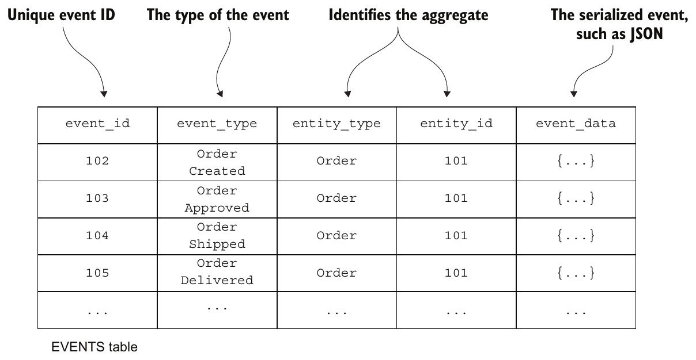

> **English:** Figure 6.2 Event sourcing persists each aggregate as a sequence of events. A RDBMS-based application can, for example, store the events in an EVENTS table.
>
> **Türkçe:** Şekil 6.2 Event sourcing, her aggregate’i bir olay dizisi olarak kalıcı biçimde saklar. Örneğin RDBMS tabanlı bir uygulama olayları bir EVENTS tablosunda saklayabilir.

<!-- source-record: u06_0040 -->

> **English:** When an application creates or updates an aggregate, it inserts the events emitted by the aggregate into the EVENTS table. An application loads an aggregate from the event store by retrieving its events and replaying them. Specifically, loading an aggregate consists of the following three steps:
>
> **Türkçe:** Uygulama bir aggregate oluşturduğunda veya güncellediğinde, aggregate’ın ürettiği olayları EVENTS tablosuna ekler. Aggregate’ı olay deposundan yüklemek için olaylarını getirir ve yeniden yürütür. Aggregate yükleme işlemi şu üç adımdan oluşur:

<!-- source-record: u06_0041 -->

> **English:** 1 Load the events for the aggregate.
>
> **Türkçe:** 1 Aggregate’ın olaylarını yükleyin.

<!-- source-record: u06_0042 -->

> **English:** 2 Create an aggregate instance by using its default constructor.
>
> **Türkçe:** 2 Varsayılan constructor’ını kullanarak aggregate örneğini oluşturun.

<!-- source-record: u06_0043 -->

> **English:** 3 Iterate through the events, calling apply().
>
> **Türkçe:** 3 Olaylar üzerinde sırayla ilerleyip apply() metodunu çağırın.

<!-- source-record: u06_0044 -->

> **English:** For example, the Eventuate Client framework, covered later in section 6.2.2, uses code similar to the following to reconstruct an aggregate:
>
> **Türkçe:** Örneğin 6.2.2’de anlatılan Eventuate Client framework’ü, aggregate’ı yeniden oluşturmak için aşağıdakine benzer kod kullanır:

<!-- source-record: u06_0045 -->

```java
Class aggregateClass = ...;
Aggregate aggregate = aggregateClass.newInstance();
for (Event event : events) {
  aggregate = aggregate.applyEvent(event);
}
// use aggregate...
```

<!-- source-record: u06_0046 -->

> **English:** It creates an instance of the class and iterates through the events, calling the aggregate’s applyEvent() method. If you’re familiar with functional programming, you may recognize this as a fold or reduce operation.
>
> **Türkçe:** Kod, sınıfın bir örneğini oluşturur ve olaylar üzerinde sırayla ilerlerken aggregate’ın applyEvent() metodunu çağırır. Fonksiyonel programlamaya aşinaysanız bunun fold veya reduce işlemi olduğunu fark edebilirsiniz.

<!-- source-pages: 188 -->

<!-- source-record: u06_0047 -->

> **English:** It may be strange and unfamiliar to reconstruct the in-memory state of an aggregate by loading the events and replaying events. But in some ways, it’s not all that different from how an ORM framework such as JPA or Hibernate loads an entity. An ORM framework loads an object by executing one or more SELECT statements to retrieve the current persisted state, instantiating objects using their default constructors. It uses reflection to initialize those objects. What’s different about event sourcing is that the reconstruction of the in-memory state is accomplished using events.
>
> **Türkçe:** Olayları yükleyip yeniden uygulayarak bir aggregate'in bellekteki durumunu yeniden oluşturmak garip ve alışılmadık gelebilir. Ancak bazı yönlerden bu, JPA veya Hibernate gibi bir ORM framework'ünün entity yüklemesinden çok da farklı değildir. ORM framework'ü, kalıcı olarak saklanan güncel durumu almak için bir veya daha fazla SELECT ifadesi yürütür ve nesneleri default constructor'larıyla oluşturur. Bu nesnelerin alanlarını başlatmak için reflection kullanır. Event sourcing'in farkı, bellekteki durumun yeniden oluşturulmasının olaylar kullanılarak yapılmasıdır.

<!-- source-record: u06_0048 -->

> **English:** Let’s now look at the requirements event sourcing places on domain events.
>
> **Türkçe:** Şimdi event sourcing’in domain event’lere getirdiği gereksinimlere bakalım.

<!-- source-record: u06_0049 -->

#### EVENTS REPRESENT STATE CHANGES — Olaylar durum değişikliklerini temsil eder

<!-- source-record: u06_0050 -->

> **English:** Chapter 5 defines domain events as a mechanism for notifying subscribers of changes to aggregates. Events can either contain minimal data, such as just the aggregate ID, or can be enriched to contain data that’s useful to a typical consumer. For example, the Order Service can publish an OrderCreated event when an order is created. An OrderCreated event may only contain the orderId. Alternatively, the event could contain the complete order so consumers of that event don’t have to fetch the data from the Order Service. Whether events are published and what those events contain are driven by the needs of the consumers. With event sourcing, though, it’s primarily the aggregate that determines the events and their structure.
>
> **Türkçe:** Bölüm 5 alan olaylarını, aggregate’ler'da değişiklikler hakkında aboneleri bilgilendirmek için bir mekanizma olarak tanımlar. Olaylar sadece aggregate ID gibi az miktarda veri içerebilir veya tipik bir tüketici için yararlı olan verileri içerebilir. Örneğin, Order Service bir sipariş oluşturulduğunda bir OrderCreated olayını yayınlayabilir. OrderCreated olayı sadece orderId'i içerebilir. Alternatif olarak, olay tam siparişi içerebilir böylece olayın tüketicilerinin Order Service'den verileri almak zorunda kalmazlar. O olayların yayınlanıp yayınlanmaması ve bu olayların içeriği tüketicilerin ihtiyaçlarına bağlıdır. event sourcing (olay kaynaklı durum yönetimi) ile, öncelikle aggregate olayları ve yapısını belirler.

<!-- source-record: u06_0051 -->

> **English:** Events aren’t optional when using event sourcing. Every state change of an aggregate, including its creation, is represented by a domain event. Whenever the aggregate’s state changes, it must emit an event. For example, an Order aggregate must emit an OrderCreated event when it’s created, and an Order* event whenever it is updated. This is a much more stringent requirement than before, when an aggregate only emitted events that were of interest to consumers.
>
> **Türkçe:** Event sourcing kullanılırken olay üretmek isteğe bağlı değildir. Aggregate'in oluşturulması dâhil her durum değişikliği bir domain event ile temsil edilir. Aggregate'in durumu her değiştiğinde bir olay üretmesi gerekir. Örneğin Order aggregate'i, oluşturulduğunda OrderCreated olayı; her güncellendiğinde de bir Order* olayı üretmelidir. Bu gereklilik, aggregate'in yalnızca tüketicilerin ilgisini çeken olayları ürettiği önceki yaklaşıma göre çok daha katıdır.

<!-- source-record: u06_0052 -->

> **English:** What’s more, an event must contain the data that the aggregate needs to perform the state transition. The state of an aggregate consists of the values of the fields of the objects that comprise the aggregate. A state change might be as simple as changing the value of the field of an object, such as Order.state. Alternatively, a state change can involve adding or removing objects, such as revising an Order’s line items.
>
> **Türkçe:** Ayrıca olay, aggregate’ın durum geçişini gerçekleştirmek için ihtiyaç duyduğu veriyi içermelidir. Aggregate’ın durumu, onu oluşturan nesnelerin alan değerlerinden oluşur. Durum değişikliği, Order.state gibi bir nesne alanının değerini değiştirmek kadar basit olabilir. Ya da Order’ın sipariş kalemlerini değiştirmekte olduğu gibi nesne eklemeyi veya çıkarmayı içerebilir.

<!-- source-record: u06_0053 -->

> **English:** Suppose, as figure 6.3 shows, that the current state of the aggregate is S and the new state is S'. An event E that represents the state change must contain the data such that when an Order is in state S, calling order.apply(E) will update the Order to state S'. In the next section you’ll see that apply() is a method that performs the state change represented by an event.
>
> **Türkçe:** Şekil 6.3’teki gibi aggregate’ın güncel durumunun S, yeni durumunun S' olduğunu varsayalım. Durum değişikliğini temsil eden E olayı, Order S durumundayken order.apply(E) çağrısının Order’ı S' durumuna geçirmesini sağlayacak veriyi içermelidir. Sonraki kısımda apply() metodunun, olayın temsil ettiği durum değişikliğini gerçekleştirdiğini göreceksiniz.

<!-- source-record: u06_0054 -->

> **English:** Some events, such as the Order Shipped event, contain little or no data and just represent the state transition. The apply() method handles an Order Shipped event by changing the Order’s status field to SHIPPED. Other events, however, contain a lot of data. An OrderCreated event, for example, must contain all the data needed by the apply() method to initialize an Order, including its line items, payment information, delivery information, and so on. Because events are used to persist an aggregate, you no longer have the option of using a minimal OrderCreated event that contains the orderId.
>
> **Türkçe:** Order Shipped gibi bazı olaylar çok az veri içerir veya hiç veri içermez; yalnızca durum geçişini temsil eder. apply() metodu, Order’ın status alanını SHIPPED yaparak Order Shipped olayını işler. Diğer olaylar ise çok miktarda veri içerir. Örneğin OrderCreated, apply() metodunun Order’ı başlatmak için ihtiyaç duyduğu sipariş kalemleri, ödeme bilgisi, teslimat bilgisi ve diğer bütün verileri içermelidir. Olaylar aggregate’ı kalıcı saklamak için kullanıldığından, yalnızca orderId içeren asgari bir OrderCreated olayı kullanma seçeneği artık yoktur.

<!-- source-pages: 189 -->

<!-- source-record: u06_0055 -->

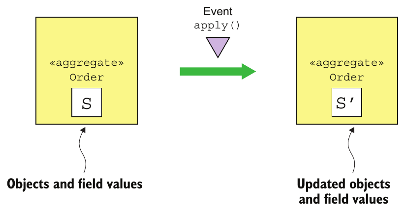

> **English:** Figure 6.3 Applying event E when the Order is in state S must change the Order state to S'. The event must contain the data necessary to perform the state change.
>
> **Türkçe:** Şekil 6.3 Order, S durumundayken E olayının uygulanması, Order’ın durumunu S' olarak değiştirmelidir. Olay, bu durum değişikliğini gerçekleştirmek için gereken verileri içermelidir.

<!-- source-record: u06_0056 -->

#### AGGREGATE METHODS ARE ALL ABOUT EVENTS — Aggregate metotları olaylar etrafında şekillenir

<!-- source-record: u06_0057 -->

> **English:** The business logic handles a request to update an aggregate by calling a command method on the aggregate root. In a traditional application, a command method typically validates its arguments and then updates one or more of the aggregate’s fields. Command methods in an event sourcing-based application work because they must generate events. As figure 6.4 shows, the outcome of invoking an aggregate’s command method is a sequence of events that represent the state changes that must be made. These events are persisted in the database and applied to the aggregate to update its state.
>
> **Türkçe:** İş mantığı, aggregate’ı güncelleme isteğini aggregate root üzerinde bir command metodu çağırarak karşılar. Geleneksel uygulamada command metodu genellikle argümanlarını doğrular ve aggregate’ın bir veya daha fazla alanını günceller. Event sourcing tabanlı uygulamadaki command metotları ise olay üretmek zorundadır. Şekil 6.4’te görüldüğü gibi command metodunu çağırmanın sonucu, yapılması gereken durum değişikliklerini temsil eden bir olay dizisidir. Bu olaylar veritabanında kalıcı saklanır ve durumunu güncellemek için aggregate’a uygulanır.

<!-- source-record: u06_0058 -->

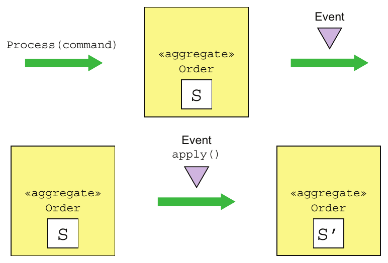

> **English:** Figure 6.4 Processing a command generates events without changing the state of the aggregate. An aggregate is updated by applying an event.
>
> **Türkçe:** Şekil 6.4 Bir komutun işlenmesi, aggregate’in durumunu değiştirmeden olaylar üretir. Aggregate, bir olay uygulanarak güncellenir.

<!-- source-record: u06_0059 -->

> **English:** The requirement to generate events and apply them requires a restructuring—albeit mechanical—of the business logic. Event sourcing refactors a command method into two or more methods. The first method takes a command object parameter, which represents the request, and determines what state changes need to be performed. It validates its arguments, and without changing the state of the aggregate, returns a list of events representing the state changes. This method typically throws an exception if the command cannot be performed.
>
> **Türkçe:** Olayları oluşturma ve uygulama gerekliliği, mekanik nitelikte olsa da iş mantığının yeniden yapılandırılmasını gerektirir. Event sourcing, bir komut metodunu iki ya da daha fazla metoda ayıracak biçimde yeniden düzenler. İlk metot, isteği temsil eden bir komut nesnesini parametre olarak alır ve hangi durum değişikliklerinin yapılması gerektiğini belirler. Argümanlarını doğrular ve aggregate'in durumunu değiştirmeden, durum değişikliklerini temsil eden bir olay listesi döndürür. Komut yerine getirilemiyorsa bu metot genellikle bir exception fırlatır.

<!-- source-pages: 190 -->

<!-- source-record: u06_0060 -->

> **English:** The other methods each take a particular event type as a parameter and update the aggregate. There’s one of these methods for each event. It’s important to note that these methods can’t fail, because an event represents a state change that has happened. Each method updates the aggregate based on the event.
>
> **Türkçe:** Diğer metotların her biri, belirli bir olay türünü parametre olarak alır ve aggregate'i günceller. Her olay için bu metotlardan bir tane vardır. Bu metotların başarısız olamayacağına dikkat etmek önemlidir; çünkü olay, zaten gerçekleşmiş bir durum değişikliğini temsil eder. Her metot, olaya göre aggregate'i günceller.

<!-- source-record: u06_0061 -->

> **English:** The Eventuate Client framework, an event-sourcing framework described in more detail in section 6.2.2, names these methods process() and apply(). A process() method takes a command object, which contains the arguments of the update request, as a parameter and returns a list of events. An apply() method takes an event as a parameter and returns void. An aggregate will define multiple overloaded versions of these methods: one process() method for each command class and one apply() method for each event type emitted by the aggregate. Figure 6.5 shows an example.
>
> **Türkçe:** 6.2.2’de ayrıntılı anlatılan Eventuate Client event sourcing framework’ü, bu metotlara process() ve apply() adlarını verir. process(), güncelleme isteğinin argümanlarını içeren bir command nesnesini parametre olarak alır ve olay listesi döndürür. apply() ise olay parametresi alır ve dönüş tipi void’dur. Aggregate bu metotların birden fazla overload’unu tanımlar: her command sınıfı için bir process(), ürettiği her olay türü için bir apply() metodu. Şekil 6.5 bir örneğini gösterir.

<!-- source-record: u06_0062 -->

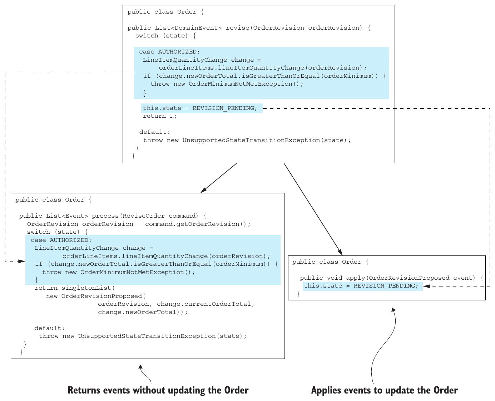

> **English:** Figure 6.5 Event sourcing splits a method that updates an aggregate into a process() method, which takes a command and returns events, and one or more apply() methods, which take an event and update the aggregate.
>
> **Türkçe:** Şekil 6.5 Event sourcing, aggregate’i güncelleyen bir metodu; komut alıp olaylar döndüren bir process() metoduna ve olay alıp aggregate’i güncelleyen bir veya daha fazla apply() metoduna ayırır.

<!-- source-pages: 191 -->

<!-- source-record: u06_0063 -->

> **English:** In this example, the reviseOrder() method is replaced by a process() method and an apply() method. The process() method takes a ReviseOrder command as a parameter. This command class is defined by applying Introduce Parameter Object refactoring (https://refactoring.com/catalog/introduceParameterObject.html) to the reviseOrder() method. The process() method either returns an OrderRevisionProposed event, or throws an exception if it’s too late to revise the Order or if the proposed revision doesn’t meet the order minimum. The apply() method for the OrderRevisionProposed event changes the state of the Order to REVISION_PENDING.
>
> **Türkçe:** Bu örnekte reviseOrder() yerine bir process() ve bir apply() metodu kullanılır. process(), ReviseOrder command’ını parametre olarak alır. Bu command sınıfı, reviseOrder() metoduna Introduce Parameter Object refactoring uygulanarak tanımlanır (https://refactoring.com/catalog/introduceParameterObject.html). process() ya OrderRevisionProposed olayı döndürür ya da Order’ı değiştirmek için çok geç kalınmışsa veya önerilen değişiklik asgari sipariş tutarını karşılamıyorsa exception fırlatır. OrderRevisionProposed olayına ait apply() metodu, Order durumunu REVISION_PENDING yapar.

<!-- source-record: u06_0064 -->

> **English:** An aggregate is created using the following steps:
>
> **Türkçe:** aggregate aşağıdaki adımları kullanarak oluşturulur:

<!-- source-record: u06_0065 -->

> **English:** 1 Instantiate aggregate root using its default constructor.
>
> **Türkçe:** 1 Varsayılan constructor’ını kullanarak aggregate root örneğini oluşturun.

<!-- source-record: u06_0066 -->

> **English:** 2 Invoke process() to generate the new events.
>
> **Türkçe:** 2 Yeni olayları üretmek için process() metodunu çağırın.

<!-- source-record: u06_0067 -->

> **English:** 3 Update the aggregate by iterating through the new events, calling its apply().
>
> **Türkçe:** 3 Yeni olaylar üzerinde sırayla ilerleyip apply() metodunu çağırarak aggregate’ı güncelleyin.

<!-- source-record: u06_0068 -->

> **English:** 4 Save the new events in the event store.
>
> **Türkçe:** 4 Yeni olayları event store’a kaydedin.

<!-- source-record: u06_0069 -->

> **English:** An aggregate is updated using the following steps:
>
> **Türkçe:** Bir aggregate aşağıdaki adımları kullanarak güncellenir:

<!-- source-record: u06_0070 -->

> **English:** 1 Load aggregate’s events from the event store.
>
> **Türkçe:** 1 Aggregate’ın olaylarını event store’dan yükleyin.

<!-- source-record: u06_0071 -->

> **English:** 2 Instantiate the aggregate root using its default constructor.
>
> **Türkçe:** 2 Varsayılan constructor’ını kullanarak aggregate root örneğini oluşturun.

<!-- source-record: u06_0072 -->

> **English:** 3 Iterate through the loaded events, calling apply() on the aggregate root.
>
> **Türkçe:** 3 Yüklenen olaylar üzerinde sırayla ilerleyip aggregate root’un apply() metodunu çağırın.

<!-- source-record: u06_0073 -->

> **English:** 4 Invoke its process() method to generate new events.
>
> **Türkçe:** 4 Yeni olayları üretmek için process() metodunu çağırın.

<!-- source-record: u06_0074 -->

> **English:** 5 Update the aggregate by iterating through the new events, calling apply().
>
> **Türkçe:** 5 Yeni olaylar üzerinde sırayla ilerleyip apply() metodunu çağırarak aggregate’ı güncelleyin.

<!-- source-record: u06_0075 -->

> **English:** 6 Save the new events in the event store.
>
> **Türkçe:** 6 Yeni olayları event store’a kaydedin.

<!-- source-record: u06_0076 -->

> **English:** To see this in action, let’s now look at the event sourcing version of the Order aggregate.
>
> **Türkçe:** Bunu uygulamada görmek için Order aggregate’ının event sourcing sürümüne bakalım.

<!-- source-record: u06_0077 -->

#### EVENT SOURCING-BASED ORDER AGGREGATE — Event sourcing kullanan Order aggregate'i

<!-- source-record: u06_0078 -->

> **English:** Listing 6.1 shows the Order aggregate’s fields and the methods responsible for creating it. The event sourcing version of the Order aggregate has some similarities to the JPA-based version shown in chapter 5. Its fields are almost identical, and it emits similar events. What’s different is that its business logic is implemented in terms of processing commands that emit events and applying those events, which updates its state. Each method that creates or updates the JPA-based aggregate, such as createOrder() and reviseOrder(), is replaced in the event sourcing version by process() and apply() methods.
>
> **Türkçe:** Listing 6.1, Order aggregate’ının alanlarını ve onu oluşturmaktan sorumlu metotları gösterir. Event sourcing sürümü, 5. bölümdeki JPA tabanlı sürümle bazı benzerlikler taşır. Alanları neredeyse aynıdır ve benzer olaylar üretir. Farkı, iş mantığının olay üreten command’ların işlenmesi ve durumu güncelleyen bu olayların uygulanması biçiminde gerçekleştirilmesidir. JPA tabanlı aggregate’ı oluşturan veya güncelleyen createOrder() ve reviseOrder() gibi her metot, event sourcing sürümünde process() ve apply() metotlarıyla değiştirilir.

<!-- source-record: u06_0079 -->

#### Listing 6.1 The Order aggregate’s fields and its methods that initialize an instance — Listesi 6.1 Order aggregate'nin alanları ve bir örneği başlangıç yapan yöntemleri

<!-- source-record: u06_0080 -->

```java
public class Order {

  private OrderState state;
  private Long consumerId;
  private Long restaurantId;
  private OrderLineItems orderLineItems;
  private DeliveryInformation deliveryInformation;
  private PaymentInformation paymentInformation;
  private Money orderMinimum;
  public Order() {
  }

  public List<Event> process(CreateOrderCommand command) {
     ... validate command ...
    return events(new OrderCreatedEvent(command.getOrderDetails()));
  }

  public void apply(OrderCreatedEvent event) {
    OrderDetails orderDetails = event.getOrderDetails();
    this.orderLineItems = new OrderLineItems(orderDetails.getLineItems());
    this.orderMinimum = orderDetails.getOrderMinimum();
    this.state = APPROVAL_PENDING;
  }
```

<!-- source-pages: 192 -->

<!-- source-record: u06_0081 -->

**Kod açıklaması:**

> **English:** Validates the command and returns an OrderCreatedEvent
>
> **Türkçe:** Command’ı doğrular ve bir OrderCreatedEvent döndürür.

<!-- source-record: u06_0082 -->

**Kod açıklaması:**

> **English:** Apply the OrderCreatedEvent by initializing the fields of the Order.
>
> **Türkçe:** Order’ın alanlarına ilk değerlerini atayarak OrderCreatedEvent olayını uygula.

<!-- source-record: u06_0083 -->

> **English:** This class’s fields are similar to those of the JPA-based Order. The only difference is that the aggregate’s id isn’t stored in the aggregate. The Order’s methods are quite different. The createOrder() factory method has been replaced by process() and apply() methods. The process() method takes a CreateOrder command and emits an OrderCreated event. The apply() method takes the OrderCreated and initializes the fields of the Order.
>
> **Türkçe:** Bu sınıfın alanları, JPA tabanlı Order’ın alanlarına benzer. Tek fark, aggregate kimliğinin aggregate’ın içinde saklanmamasıdır. Order’ın metotları ise oldukça farklıdır. createOrder() factory metodu yerine process() ve apply() kullanılır. process(), CreateOrder command’ını alır ve OrderCreated olayı üretir. apply(), OrderCreated olayını alarak Order’ın alanlarına başlangıç değerlerini atar.

<!-- source-record: u06_0084 -->

> **English:** We’ll now look at the slightly more complex business logic for revising an order. Previously this business logic consisted of three methods: reviseOrder(), confirmRevision(), and rejectRevision(). The event sourcing version replaces these three methods with three process() methods and some apply() methods. The following listing shows the event sourcing version of reviseOrder() and confirmRevision().
>
> **Türkçe:** Şimdi siparişi değiştirmeye yönelik, biraz daha karmaşık iş mantığına bakalım. Önceden bu mantık reviseOrder(), confirmRevision() ve rejectRevision() olmak üzere üç metottan oluşuyordu. Event sourcing sürümü bunların yerine üç process() metodu ve bazı apply() metotları koyar. Aşağıdaki listing, reviseOrder() ve confirmRevision() işlemlerinin event sourcing sürümünü gösterir.

<!-- source-record: u06_0085 -->

#### Listing 6.2 The process() and apply() methods that revise an Order aggregate — Listesi 6.2 process() ve apply() yöntemleri bir Order aggregate'yi gözden geçirir

<!-- source-record: u06_0086 -->

```java
public class Order {

public List<Event> process(ReviseOrder command) {
  OrderRevision orderRevision = command.getOrderRevision();
  switch (state) {
    case APPROVED:
      LineItemQuantityChange change =
              orderLineItems.lineItemQuantityChange(orderRevision);
      if (change.newOrderTotal.isGreaterThanOrEqual(orderMinimum)) {
        throw new OrderMinimumNotMetException();
      }
      return singletonList(new OrderRevisionProposed(orderRevision,
                            change.currentOrderTotal, change.newOrderTotal));

    default:
      throw new UnsupportedStateTransitionException(state);
  }
}

public void apply(OrderRevisionProposed event) {
   this.state = REVISION_PENDING;
}
public List<Event> process(ConfirmReviseOrder command) {
  OrderRevision orderRevision = command.getOrderRevision();
  switch (state) {
    case REVISION_PENDING:
      LineItemQuantityChange licd =
            orderLineItems.lineItemQuantityChange(orderRevision);
      return singletonList(new OrderRevised(orderRevision,
              licd.currentOrderTotal, licd.newOrderTotal));
    default:
      throw new UnsupportedStateTransitionException(state);
  }
}

public void apply(OrderRevised event) {
  OrderRevision orderRevision = event.getOrderRevision();
  if (!orderRevision.getRevisedLineItemQuantities().isEmpty()) {
    orderLineItems.updateLineItems(orderRevision);
  }
  this.state = APPROVED;
}
```

<!-- source-record: u06_0087 -->

**Kod açıklaması:**

> **English:** Verify that the Order can be revised and that the revised order meets the order minimum.
>
> **Türkçe:** Order’ın değiştirilebilir olduğunu ve değiştirilmiş siparişin asgari sipariş tutarını karşıladığını doğrula.

<!-- source-record: u06_0088 -->

**Kod açıklaması:**

> **English:** Change the state of the Order to REVISION_PENDING.
>
> **Türkçe:** Order’ın durumunu REVISION_PENDING yap.

<!-- source-pages: 193 -->

<!-- source-record: u06_0089 -->

**Kod açıklaması:**

> **English:** Verify that the revision can be confirmed and return an OrderRevised event.
>
> **Türkçe:** Değişikliğin onaylanabilir olduğunu doğrula ve bir OrderRevised olayı döndür.

<!-- source-record: u06_0090 -->

**Kod açıklaması:**

> **English:** Revise the Order.
>
> **Türkçe:** Order’ı değiştir.

<!-- source-record: u06_0091 -->

> **English:** As you can see, each method has been replaced by a process() method and one or more apply() methods. The reviseOrder() method has been replaced by process (ReviseOrder) and apply(OrderRevisionProposed). Similarly, confirmRevision() has been replaced by process(ConfirmReviseOrder) and apply(OrderRevised).
>
> **Türkçe:** Görüldüğü gibi her metot, bir process() metodu ve bir veya daha fazla apply() metoduyla değiştirilmiştir. reviseOrder() yerine process(ReviseOrder) ve apply(OrderRevisionProposed) kullanılır. Benzer biçimde confirmRevision() yerine process(ConfirmReviseOrder) ve apply(OrderRevised) kullanılır.

<!-- source-record: u06_0092 -->

### 6.1.3 Handling concurrent updates using optimistic locking — Eşzamanlı güncellemeleri optimistic locking ile ele almak

<!-- source-record: u06_0093 -->

> **English:** It’s not uncommon for two or more requests to simultaneously update the same aggregate. An application that uses traditional persistence often uses optimistic locking to prevent one transaction from overwriting another’s changes. Optimistic locking typically uses a version column to detect whether an aggregate has changed since it was read. The application maps the aggregate root to a table that has a VERSION column, which is incremented whenever the aggregate is updated. The application updates the aggregate using an UPDATE statement like this:
>
> **Türkçe:** İki veya daha fazla isteğin aynı aggregate’ı eşzamanlı güncellemesi olağandır. Geleneksel kalıcı saklama kullanan uygulamalar, bir transaction’ın diğerinin değişikliklerini ezmesini önlemek için genellikle optimistic locking kullanır. Bu yöntem çoğunlukla aggregate’ın okunduktan sonra değişip değişmediğini saptayan bir sürüm sütununa dayanır. Uygulama, aggregate root’u her güncellemede artırılan VERSION sütununa sahip bir tabloyla eşler. Aggregate’ı aşağıdakine benzer bir UPDATE ifadesiyle günceller:

<!-- source-record: u06_0094 -->

```sql
UPDATE AGGREGATE_ROOT_TABLE
SET VERSION = VERSION + 1 ...
WHERE VERSION = <original version>
```

<!-- source-record: u06_0095 -->

> **English:** This UPDATE statement will only succeed if the version is unchanged from when the application read the aggregate. If two transactions read the same aggregate, the first one that updates the aggregate will succeed. The second one will fail because the version number has changed, so it won’t accidentally overwrite the first transaction’s changes.
>
> **Türkçe:** Bu UPDATE ifadesi yalnızca sürüm, uygulamanın aggregate’ı okuduğu andaki değerle aynıysa başarılı olur. İki transaction aynı aggregate’ı okursa, onu ilk güncelleyen başarılı olur. İkincisi sürüm numarası değiştiği için başarısız olur; böylece ilk transaction’ın değişikliklerini yanlışlıkla ezmez.

<!-- source-record: u06_0096 -->

> **English:** An event store can also use optimistic locking to handle concurrent updates. Each aggregate instance has a version that’s read along with the events. When the application inserts events, the event store verifies that the version is unchanged. A simple approach is to use the number of events as the version number. Alternatively, as you’ll see below in section 6.2, an event store could maintain an explicit version number.
>
> **Türkçe:** Event store da eşzamanlı güncellemeleri yönetmek için optimistic locking kullanabilir. Her aggregate örneğinin, olaylarıyla birlikte okunan bir sürümü vardır. Uygulama olayları eklerken event store sürümün değişmediğini doğrular. Basit bir yaklaşım, olay sayısını sürüm numarası olarak kullanmaktır. Alternatif olarak 6.2’de göreceğiniz gibi event store, ayrı bir sürüm numarası tutabilir.

<!-- source-pages: 194 -->

<!-- source-record: u06_0097 -->

### 6.1.4 Event sourcing and publishing events — Event sourcing ve olay yayımlama

<!-- source-record: u06_0098 -->

> **English:** Strictly speaking, event sourcing persists aggregates as events and reconstructs the current state of an aggregate from those events. You can also use event sourcing as a reliable event publishing mechanism. Saving an event in the event store is an inherently atomic operation. We need to implement a mechanism to deliver all persisted events to interested consumers.
>
> **Türkçe:** Kesin anlamıyla event sourcing, aggregate’ları olaylar halinde kalıcı saklar ve güncel durumlarını bu olaylardan yeniden oluşturur. Event sourcing’i güvenilir bir olay yayımlama mekanizması olarak da kullanabilirsiniz. Olayı event store’a kaydetmek, doğası gereği atomik bir işlemdir. Kalıcı saklanan bütün olayları, bunlarla ilgilenen tüketicilere iletecek bir mekanizma gerçekleştirmemiz gerekir.

<!-- source-record: u06_0099 -->

> **English:** Chapter 3 describes a couple of different mechanisms—polling and transaction log tailing—for publishing messages that are inserted into the database as part of a transaction. An event sourcing-based application can publish events using one of these mechanisms. The main difference is that it permanently stores events in an EVENTS table rather than temporarily saving events in an OUTBOX table and then deleting them. Let’s take a look at each approach, starting with polling.
>
> **Türkçe:** 3. bölüm, transaction’ın bir parçası olarak veritabanına eklenen mesajları yayımlamak için polling ve transaction log tailing adlı iki mekanizma açıklar. Event sourcing tabanlı uygulama da bunlardan biriyle olay yayımlayabilir. Temel fark, olayları OUTBOX tablosunda geçici saklayıp sonra silmek yerine EVENTS tablosunda kalıcı saklamasıdır. Polling’den başlayarak iki yaklaşıma bakalım.

<!-- source-record: u06_0100 -->

#### USING POLLING TO PUBLISH EVENTS — Olay yayımlamak için polling kullanmak

<!-- source-record: u06_0101 -->

> **English:** If events are stored in the EVENTS table shown in figure 6.6, an event publisher can poll the table for new events by executing a SELECT statement and publish the events to a message broker. The challenge is determining which events are new. For example, imagine that eventIds are monotonically increasing. The superficially appealing approach is for the event publisher to record the last eventId that it has processed. It would then retrieve new events using a query like this: SELECT * FROM EVENTS where event_id >? ORDER BY event_id ASC.
>
> **Türkçe:** Olaylar Şekil 6.6’daki EVENTS tablosunda saklanıyorsa, olay yayımlayıcısı SELECT çalıştırarak tabloda yeni olayları arayabilir ve bunları mesaj aracısına yayımlayabilir. Zorluk, hangi olayların yeni olduğunu belirlemektir. Örneğin eventId değerlerinin sürekli arttığını varsayalım. İlk bakışta cazip görünen yaklaşım, yayımlayıcının işlediği son eventId değerini kaydetmesidir. Ardından yeni olayları şu sorguyla getirir: SELECT * FROM EVENTS where event_id >? ORDER BY event_id ASC.

<!-- source-record: u06_0102 -->

> **English:** The problem with this approach is that transactions can commit in an order that’s different from the order in which they generate events. As a result, the event publisher can accidentally skip over an event. Figure 6.6 shows such as a scenario.
>
> **Türkçe:** Bu yaklaşımın sorunu, transaction’ların commit sırasının olayları üretme sırasından farklı olabilmesidir. Bu nedenle olay yayımlayıcısı yanlışlıkla bir olayı atlayabilir. Şekil 6.6 böyle bir senaryoyu gösterir.

<!-- source-record: u06_0103 -->

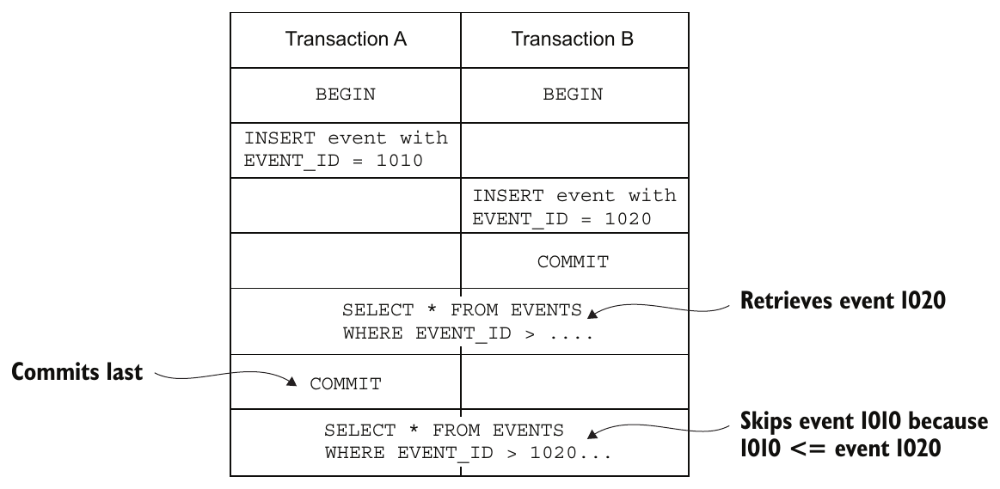

> **English:** Figure 6.6 A scenario where an event is skipped because its transaction A commits after transaction B. Polling sees eventId=1020 and then later skips eventId=1010.
>
> **Türkçe:** Şekil 6.6 A transaction’ı, B transaction’ından sonra commit edildiği için bir olayın atlandığı senaryo. Düzenli sorgulama, önce eventId=1020 olayını görür; daha sonra eventId=1010 olayını atlar.

<!-- source-pages: 195 -->

<!-- source-record: u06_0104 -->

> **English:** In this scenario, Transaction A inserts an event with an EVENT_ID of 1010. Next, transaction B inserts an event with an EVENT_ID of 1020 and then commits. If the event publisher were now to query the EVENTS table, it would find event 1020. Later on, after transaction A committed and event 1010 became visible, the event publisher would ignore it.
>
> **Türkçe:** Bu senaryoda A transaction’ı, EVENT_ID değeri 1010 olan bir olay ekler. Ardından B transaction’ı EVENT_ID değeri 1020 olan olayı ekler ve commit eder. Olay yayımlayıcısı şimdi EVENTS tablosunu sorgulasa 1020 numaralı olayı bulur. Daha sonra A commit edip 1010 numaralı olay görünür hale geldiğinde ise yayımlayıcı onu göz ardı eder.

<!-- source-record: u06_0105 -->

> **English:** One solution to this problem is to add an extra column to the EVENTS table that tracks whether an event has been published. The event publisher would then use the following process:
>
> **Türkçe:** Bir çözüm, olayın yayımlanıp yayımlanmadığını izleyen ek bir sütunu EVENTS tablosuna eklemektir. Olay yayımlayıcısı şu süreci izler:

<!-- source-record: u06_0106 -->

> **English:** 1 Find unpublished events by executing this SELECT statement: SELECT * FROM EVENTS where PUBLISHED = 0 ORDER BY event_id ASC.
>
> **Türkçe:** 1 Şu SELECT ifadesiyle yayımlanmamış olayları bulun: SELECT * FROM EVENTS where PUBLISHED = 0 ORDER BY event_id ASC.

<!-- source-record: u06_0107 -->

> **English:** 2 Publish events to the message broker.
>
> **Türkçe:** 2 Olayları mesaj aracısına yayımlayın.

<!-- source-record: u06_0108 -->

> **English:** 3 Mark the events as having been published: UPDATE EVENTS SET PUBLISHED = 1 WHERE EVENT_ID in.
>
> **Türkçe:** 3 Olayları yayımlandı olarak işaretleyin: UPDATE EVENTS SET PUBLISHED = 1 WHERE EVENT_ID in.

<!-- source-record: u06_0109 -->

> **English:** This approach prevents the event publisher from skipping events.
>
> **Türkçe:** Bu yaklaşım, olay yayımlayıcısının olay atlamasını önler.

<!-- source-record: u06_0110 -->

#### USING TRANSACTION LOG TAILING TO RELIABLY PUBLISH EVENTS — Olayları güvenilir yayımlamak için transaction log tailing kullanmak

<!-- source-record: u06_0111 -->

> **English:** More sophisticated event stores use transaction log tailing, which, as chapter 3 describes, guarantees that events will be published and is also more performant and scalable. For example, Eventuate Local, an open source event store, uses this approach. It reads events inserted into an EVENTS table from the database transaction log and publishes them to the message broker. Section 6.2 discusses how Eventuate Local works in more detail.
>
> **Türkçe:** Daha gelişmiş olay depoları transaction log tailing kullanır. 3. bölümde açıklandığı gibi bu yaklaşım olayların yayımlanmasını garanti eder; ayrıca daha yüksek performans ve ölçeklenebilirlik sağlar. Örneğin açık kaynaklı event store olan Eventuate Local bu yöntemi kullanır. EVENTS tablosuna eklenen olayları veritabanının transaction günlüğünden okuyup mesaj aracısına yayımlar. 6.2, Eventuate Local’ın çalışmasını daha ayrıntılı açıklar.

<!-- source-record: u06_0112 -->

### 6.1.5 Using snapshots to improve performance — Performansı artırmak için snapshot kullanmak

<!-- source-record: u06_0113 -->

> **English:** An Order aggregate has relatively few state transitions, so it only has a small number of events. It’s efficient to query the event store for those events and reconstruct an Order aggregate. Long-lived aggregates, though, can have a large number of events. For example, an Account aggregate potentially has a large number of events. Over time, it would become increasingly inefficient to load and fold those events.
>
> **Türkçe:** Order aggregate’ının durum geçişleri görece az olduğundan olay sayısı da düşüktür. Bu olayları depodan sorgulayıp Order’ı yeniden oluşturmak verimlidir. Ancak uzun ömürlü aggregate’larda çok sayıda olay olabilir. Örneğin Account aggregate’ı çok sayıda olaya sahip olabilir. Zamanla bütün bu olayları yükleyip fold işlemiyle uygulamak giderek verimsizleşir.

<!-- source-record: u06_0114 -->

> **English:** A common solution is to periodically persist a snapshot of the aggregate’s state. Figure 6.7 shows an example of using a snapshot. The application restores the state of an aggregate by loading the most recent snapshot and only those events that have occurred since the snapshot was created.
>
> **Türkçe:** Yaygın çözüm, aggregate’ın durumunun snapshot’ını düzenli aralıklarla kalıcı saklamaktır. Şekil 6.7 bir örnek gösterir. Uygulama, en güncel snapshot’ı ve yalnızca bu snapshot oluşturulduktan sonraki olayları yükleyerek aggregate durumunu geri oluşturur.

<!-- source-record: u06_0115 -->

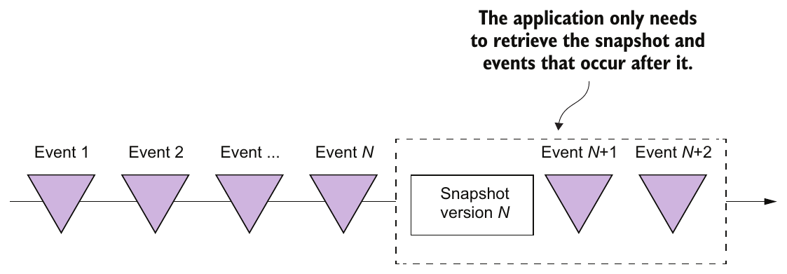

> **English:** Figure 6.7 Using a snapshot improves performance by eliminating the need to load all events. An application only needs to load the snapshot and the events that occur after it.
>
> **Türkçe:** Şekil 6.7 Snapshot (anlık durum görüntüsü) kullanımı, bütün olayları yükleme gereğini ortadan kaldırarak performansı artırır. Uygulamanın yalnızca snapshot’ı ve ondan sonra gerçekleşen olayları yüklemesi gerekir.

<!-- source-pages: 196 -->

<!-- source-record: u06_0116 -->

> **English:** In this example, the snapshot version is N. The application only needs to load the snapshot and the two events that follow it in order to restore the state of the aggregate. The previous N events are not loaded from the event store.
>
> **Türkçe:** Bu örnekte snapshot sürümü N’dir. Aggregate durumunu geri oluşturmak için yalnızca snapshot ve onu izleyen iki olay yüklenir. Önceki N olay event store’dan yüklenmez.

<!-- source-record: u06_0117 -->

> **English:** When restoring the state of an aggregate from a snapshot, an application first creates an aggregate instance from the snapshot and then iterates through the events, applying them. For example, the Eventuate Client framework, described in section 6.2.2, uses code similar to the following to reconstruct an aggregate:
>
> **Türkçe:** Uygulama, aggregate durumunu snapshot’tan geri oluştururken önce snapshot’tan bir aggregate örneği yaratır; ardından olayları sırayla uygular. Örneğin 6.2.2’deki Eventuate Client framework’ü aşağıdakine benzer kod kullanır:

<!-- source-record: u06_0118 -->

```java
Class aggregateClass = ...;
Snapshot snapshot = ...;
Aggregate aggregate = recreateFromSnapshot(aggregateClass, snapshot);
for (Event event : events) {
  aggregate = aggregate.applyEvent(event);
}
// use aggregate...
```

<!-- source-record: u06_0119 -->

> **English:** When using snapshots, the aggregate instance is recreated from the snapshot instead of being created using its default constructor. If an aggregate has a simple, easily serializable structure, the snapshot can be, for example, its JSON serialization. More complex aggregates can be snapshotted using the Memento pattern (https://en.wikipedia.org/wiki/Memento_pattern).
>
> **Türkçe:** Snapshot kullanıldığında aggregate örneği, varsayılan constructor ile yaratılmak yerine snapshot’tan yeniden oluşturulur. Aggregate basit ve kolay serileştirilebilir bir yapıya sahipse snapshot, örneğin onun JSON gösterimi olabilir. Daha karmaşık aggregate’ların snapshot’ı Memento örüntüsüyle alınabilir (https://en.wikipedia.org/wiki/Memento_pattern).

<!-- source-record: u06_0120 -->

> **English:** The Customer aggregate in the online store example has a very simple structure: the customer’s information, their credit limit, and their credit reservations. A snapshot of a Customer is the JSON serialization of its state. Figure 6.8 shows how to recreate a Customer from a snapshot corresponding to the state of a Customer as of event #103. The Customer Service needs to load the snapshot and the events that have occurred after event #103.
>
> **Türkçe:** Çevrimiçi mağaza örneğindeki Customer aggregate’ının yapısı çok basittir: müşteri bilgileri, kredi limiti ve kredi rezervasyonları. Customer snapshot’ı, durumunun JSON olarak serileştirilmiş halidir. Şekil 6.8, Customer’ın 103 numaralı olay itibarıyla durumunu temsil eden snapshot’tan nasıl yeniden oluşturulacağını gösterir. Customer Service, snapshot’ı ve 103 numaralı olaydan sonra gerçekleşen olayları yüklemelidir.

<!-- source-record: u06_0121 -->

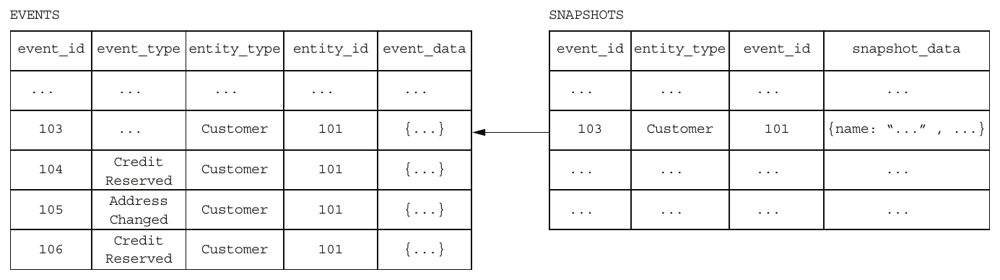

> **English:** Figure 6.8 The Customer Service recreates the Customer by deserializing the snapshot’s JSON and then loading and applying events #104 through #106.
>
> **Türkçe:** Şekil 6.8 Customer Service, snapshot’ın JSON verisini deserialize ettikten sonra 104–106 numaralı olayları yükleyip uygulayarak Customer nesnesini yeniden oluşturur.

<!-- source-record: u06_0122 -->

> **English:** The Customer Service recreates the Customer by deserializing the snapshot’s JSON and then loading and applying events #104 through #106.
>
> **Türkçe:** Customer Service, snapshot’ın JSON verisini deserialize ederek Customer’ı yeniden oluşturur; ardından 104 ile 106 numaralı olayları yükleyip uygular.

<!-- source-pages: 197 -->

<!-- source-record: u06_0123 -->

### 6.1.6 Idempotent message processing — Idempotent message processing (aynı mesajın tekrar işlenmesinde sonucu değiştirmeyen işleme)

<!-- source-record: u06_0124 -->

> **English:** Services often consume messages from other applications or other services. A service might, for example, consume domain events published by aggregates or command messages sent by a saga orchestrator. As described in chapter 3, an important issue when developing a message consumer is ensuring that it’s idempotent, because a message broker might deliver the same message multiple times.
>
> **Türkçe:** Servisler çoğunlukla diğer uygulama veya servislerden mesaj tüketir. Örneğin aggregate’ların yayımladığı domain event’leri veya saga orchestrator’ın gönderdiği command mesajlarını tüketebilirler. 3. bölümde anlatıldığı gibi mesaj tüketicisi geliştirirken önemli bir konu onun idempotent olmasıdır; çünkü mesaj aracısı aynı mesajı birden fazla kez teslim edebilir.

<!-- source-record: u06_0125 -->

> **English:** A message consumer is idempotent if it can safely be invoked with the same message multiple times. The Eventuate Tram framework, for example, implements idempotent message handling by detecting and discarding duplicate messages. It records the ids of processed messages in a PROCESSED_MESSAGES table as part of the local ACID transaction used by the business logic to create or update aggregates. If the ID of a message is in the PROCESSED_MESSAGES table, it’s a duplicate and can be discarded. Event sourcing-based business logic must implement an equivalent mechanism. How this is done depends on whether the event store uses an RDBMS or a NoSQL database.
>
> **Türkçe:** Mesaj tüketicisi aynı mesajla birden fazla kez güvenle çağrılabiliyorsa idempotent’tir. Örneğin Eventuate Tram, yinelenen mesajları saptayıp atarak idempotent mesaj işleme sağlar. İşlenen mesajların kimliklerini, iş mantığının aggregate oluşturmak veya güncellemek için kullandığı yerel ACID transaction’ın içinde PROCESSED_MESSAGES tablosuna kaydeder. Mesaj kimliği bu tabloda varsa mesaj yinelenmiştir ve atılabilir. Event sourcing tabanlı iş mantığı eşdeğer bir mekanizma gerçekleştirmelidir. Bunun nasıl yapılacağı, event store’un RDBMS mi yoksa NoSQL veritabanı mı kullandığına bağlıdır.

<!-- source-record: u06_0126 -->

#### IDEMPOTENT MESSAGE PROCESSING WITH AN RDBMS-BASED EVENT STORE — RDBMS tabanlı event store ile idempotent mesaj işleme

<!-- source-record: u06_0127 -->

> **English:** If an application uses an RDBMS-based event store, it can use an identical approach to detect and discard duplicates messages. It inserts the message ID into the PROCESSED_MESSAGES table as part of the transaction that inserts events into the EVENTS table.
>
> **Türkçe:** RDBMS tabanlı olay deposu kullanan uygulama, yinelenen mesajları saptayıp atmak için aynı yaklaşımı kullanabilir. Mesaj kimliğini, olayları EVENTS tablosuna ekleyen transaction’ın içinde PROCESSED_MESSAGES tablosuna ekler.

<!-- source-record: u06_0128 -->

#### IDEMPOTENT MESSAGE PROCESSING WHEN USING A NOSQL-BASED EVENT STORE — NoSQL tabanlı event store kullanırken idempotent mesaj işleme

<!-- source-record: u06_0129 -->

> **English:** A NoSQL-based event store, which has a limited transaction model, must use a different mechanism to implement idempotent message handling. A message consumer must somehow atomically persist events and record the message ID. Fortunately, there’s a simple solution. A message consumer stores the message’s ID in the events that are generated while processing it. It detects duplicates by verifying that none of an aggregate’s events contains the message ID.
>
> **Türkçe:** Sınırlı transaction modeline sahip NoSQL tabanlı event store, idempotent mesaj işleme için farklı mekanizma kullanmalıdır. Mesaj tüketicisi olayları kalıcı saklamayı ve mesaj kimliğini kaydetmeyi atomik biçimde yapmalıdır. Basit çözüm şudur: tüketici, mesajı işlerken ürettiği olayların içine mesaj kimliğini yazar. Aggregate’ın hiçbir olayının bu mesaj kimliğini içermediğini denetleyerek yinelenen mesajı saptar.

<!-- source-record: u06_0130 -->

> **English:** One challenge with using this approach is that processing a message might not generate any events. The lack of events means there’s no record of a message having been processed. A subsequent redelivery and reprocessing of the same message might result in incorrect behavior. For example, consider the following scenario:
>
> **Türkçe:** Bu yaklaşımın bir zorluğu, bir mesajın işlenmesinin hiç olay üretmeyebilmesidir. Olay bulunmaması, mesajın işlendiğine dair kayıt bulunmaması anlamına gelir. Aynı mesajın daha sonra yeniden teslim edilip işlenmesi yanlış davranışa yol açabilir. Örneğin şu senaryoyu düşünün:

<!-- source-record: u06_0131 -->

> **English:** 1 Message A is processed but doesn’t update an aggregate.
>
> **Türkçe:** 1 A mesajı işlenir; ancak aggregate güncellenmez.

<!-- source-record: u06_0132 -->

> **English:** 2 Message B is processed, and the message consumer updates the aggregate.
>
> **Türkçe:** 2 B mesajı işlenir ve tüketici aggregate’ı günceller.

<!-- source-record: u06_0133 -->

> **English:** 3 Message A is redelivered, and because there’s no record of it having been processed, the message consumer updates the aggregate.
>
> **Türkçe:** 3 A mesajı yeniden teslim edilir. İşlendiğine ilişkin kayıt olmadığı için tüketici aggregate’ı günceller.

<!-- source-record: u06_0134 -->

> **English:** 4 Message B is processed again….
>
> **Türkçe:** 4 B mesajı yeniden işlenir…

<!-- source-record: u06_0135 -->

> **English:** In this scenario, the redelivery of events results in a different and possibly erroneous outcome.
>
> **Türkçe:** Bu senaryoda olayların yeniden teslimi, farklı ve muhtemelen hatalı bir sonuç doğurur.

<!-- source-record: u06_0136 -->

> **English:** One way to avoid this problem is to always publish an event. If an aggregate doesn’t emit an event, an application saves a pseudo event solely to record the message ID. Event consumers must ignore these pseudo events.
>
> **Türkçe:** Bu sorunu önlemenin bir yolu, her zaman bir olay yayımlamaktır. Aggregate olay üretmezse uygulama, yalnızca mesaj kimliğini kaydetmek için pseudo event saklar. Olay tüketicileri bu yapay olayları göz ardı etmelidir.

<!-- source-pages: 198 -->

<!-- source-record: u06_0137 -->

### 6.1.7 Evolving domain events — Domain event'leri zaman içinde geliştirmek

<!-- source-record: u06_0138 -->

> **English:** Event sourcing, at least conceptually, stores events forever—which is a double-edged sword. On one hand, it provides the application with an audit log of changes that’s guaranteed to be accurate. It also enables an application to reconstruct the historical state of an aggregate. On the other hand, it creates a challenge, because the structure of events often changes over time.
>
> **Türkçe:** Event sourcing, en azından kavramsal olarak, olayları sonsuza kadar saklar; bunun hem yararı hem de maliyeti vardır. Bir yandan doğruluğu garanti edilen bir değişiklik denetim günlüğü sağlar. Ayrıca aggregate’ın geçmiş durumunu yeniden oluşturmayı mümkün kılar. Diğer yandan olayların yapısı zaman içinde değiştiğinden zorluk yaratır.

<!-- source-record: u06_0139 -->

> **English:** An application must potentially deal with multiple versions of events. For example, a service that loads an Order aggregate could potentially need to fold multiple versions of events. Similarly, an event subscriber might potentially see multiple versions.
>
> **Türkçe:** Uygulama, olayların birden fazla sürümünü işlemek zorunda kalabilir. Örneğin Order aggregate’ını yükleyen servis, farklı olay sürümlerini fold işlemiyle birleştirmek zorunda olabilir. Benzer biçimde olay aboneleri de birden fazla sürümle karşılaşabilir.

<!-- source-record: u06_0140 -->

> **English:** Let’s first look at the different ways that events can change, and then I’ll describe a commonly used approach for handling changes.
>
> **Türkçe:** Önce olayların değişebileceği farklı yollara bakalım, sonra değişimlerle başa çıkmak için yaygın olarak kullanılan bir yaklaşımı tarif edeceğim.

<!-- source-record: u06_0141 -->

#### EVENT SCHEMA EVOLUTION — Olay şemasının evrimi

<!-- source-record: u06_0142 -->

> **English:** Conceptually, an event sourcing application has a schema that’s organized into three levels:
>
> **Türkçe:** Kavramsal olarak event sourcing uygulamasının şeması üç düzeyde düzenlenir:

<!-- source-record: u06_0143 -->

> **English:** • Consists of one or more aggregates
>
> **Türkçe:** • Bir veya daha fazla aggregate’tan oluşur.

<!-- source-record: u06_0144 -->

> **English:** • Defines the events that each aggregate emits
>
> **Türkçe:** • Her aggregate’ın ürettiği olayları tanımlar.

<!-- source-record: u06_0145 -->

> **English:** • Defines the structure of the events
>
> **Türkçe:** • Olayların yapısını tanımlar.

<!-- source-record: u06_0146 -->

> **English:** Table 6.1 shows the different types of changes that can occur at each level.
>
> **Türkçe:** Tablo 6.1, her düzeyde gerçekleşebilecek değişiklik türlerini gösterir.

<!-- source-record: u06_0147 -->

> **English:** Table 6.1 The different ways that an application’s events can evolve
>
> **Türkçe:** Tablo 6.1 Bir uygulamanın olaylarının zaman içinde değişebileceği farklı yollar

| **EN:** Level<br/>**TR:** Düzey | **EN:** Change<br/>**TR:** Değişiklik | **EN:** Backward compatible<br/>**TR:** Geriye uyumlu |
| --- | --- | --- |
| **EN:** Schema<br/>**TR:** Şema | **EN:** Define a new aggregate type<br/>**TR:** Yeni bir aggregate türü tanımlama | **EN:** Yes<br/>**TR:** Evet |
| **EN:** Remove aggregate<br/>**TR:** Aggregate kaldırma | **EN:** Remove an existing aggregate<br/>**TR:** Var olan bir aggregate’ı kaldırma | **EN:** No<br/>**TR:** Hayır |
| **EN:** Rename aggregate<br/>**TR:** Aggregate’ı yeniden adlandırma | **EN:** Change the name of an aggregate type<br/>**TR:** Aggregate türünün adını değiştirme | **EN:** No<br/>**TR:** Hayır |
| **EN:** Aggregate<br/>**TR:** Aggregate (küme kökü etrafındaki nesne grubu) | **EN:** Add a new event type<br/>**TR:** Yeni bir olay türü ekleme | **EN:** Yes<br/>**TR:** Evet |
| **EN:** Remove event<br/>**TR:** Olay kaldırma | **EN:** Remove an event type<br/>**TR:** Bir olay türünü kaldırma | **EN:** No<br/>**TR:** Hayır |
| **EN:** Rename event<br/>**TR:** Olayı yeniden adlandırma | **EN:** Change the name of an event type<br/>**TR:** Olay türünün adını değiştirme | **EN:** No<br/>**TR:** Hayır |
| **EN:** Event<br/>**TR:** Olay | **EN:** Add a new field<br/>**TR:** Yeni bir alan ekleme | **EN:** Yes<br/>**TR:** Evet |
| **EN:** Delete field<br/>**TR:** Alan silme | **EN:** Delete a field<br/>**TR:** Bir alanı silme | **EN:** No<br/>**TR:** Hayır |
| **EN:** Rename field<br/>**TR:** Alanı yeniden adlandırma | **EN:** Rename a field<br/>**TR:** Bir alanı yeniden adlandırma | **EN:** No<br/>**TR:** Hayır |
| **EN:** Change type of field<br/>**TR:** Alanın türünü değiştirme | **EN:** Change the type of a field<br/>**TR:** Bir alanın türünü değiştirme | **EN:** No<br/>**TR:** Hayır |

<!-- source-record: u06_0148 -->

> **English:** These changes occur naturally as a service’s domain model evolves over time—for example, when a service’s requirements change or as its developers gain deeper insight into a domain and improve the domain model. At the schema level, developers add, remove, and rename aggregate classes. At the aggregate level, the types of events emitted by a particular aggregate can change. Developers can change the structure of an event type by adding, removing, and changing the name or type of a field.
>
> **Türkçe:** Servisin alan modeli zaman içinde geliştikçe bu değişiklikler doğal olarak ortaya çıkar. Örneğin gereksinimler değişir veya geliştiriciler iş alanını daha iyi anlayıp modeli iyileştirir. Şema düzeyinde aggregate sınıfları eklenir, kaldırılır veya yeniden adlandırılır. Aggregate düzeyinde, belirli aggregate’ın ürettiği olay türleri değişebilir. Olay türü düzeyinde ise alan ekleyip kaldırarak, alanın adını veya türünü değiştirerek olay yapısı değiştirilebilir.

<!-- source-pages: 199 -->

<!-- source-record: u06_0149 -->

> **English:** Fortunately, many of these types of changes are backward-compatible changes. For example, adding a field to an event is unlikely to impact consumers. A consumer ignores unknown fields. Other changes, though, aren’t backward compatible. For example, changing the name of an event or the name of a field requires consumers of that event type to be changed.
>
> **Türkçe:** Neyse ki bu değişikliklerin birçoğu geriye dönük uyumludur. Örneğin olaya alan eklemek tüketicileri genellikle etkilemez; tüketici tanımadığı alanları göz ardı eder. Diğer bazı değişiklikler ise geriye dönük uyumlu değildir. Örneğin olayın veya alanın adını değiştirmek, o olay türünü tüketen bileşenlerin değiştirilmesini gerektirir.

<!-- source-record: u06_0150 -->

#### MANAGING SCHEMA CHANGES THROUGH UPCASTING — Upcasting ile şema değişikliklerini yönetmek

<!-- source-record: u06_0151 -->

> **English:** In the SQL database world, changes to a database schema are commonly handled using schema migrations. Each schema change is represented by a migration, a SQL script that changes the schema and migrates the data to a new schema. The schema migrations are stored in a version control system and applied to a database using a tool such as Flyway.
>
> **Türkçe:** SQL veritabanlarında şema değişiklikleri genellikle schema migration’larla yönetilir. Her değişiklik, şemayı değiştiren ve veriyi yeni şemaya taşıyan bir SQL script’i olan migration ile temsil edilir. Migration’lar sürüm kontrolünde saklanır ve Flyway gibi bir araçla veritabanına uygulanır.

<!-- source-record: u06_0152 -->

> **English:** An event sourcing application can use a similar approach to handle non-backward-compatible changes. But instead of migrating events to the new schema version in situ, event sourcing frameworks transform events when they’re loaded from the event store. A component commonly called an upcaster updates individual events from an old version to a newer version. As a result, the application code only ever deals with the current event schema.
>
> **Türkçe:** Event sourcing uygulaması, geriye dönük uyumsuz değişiklikleri yönetmek için benzer bir yaklaşım kullanabilir. Ancak olayları depolandıkları yerde yeni şemaya taşımak yerine, framework olayları event store’dan yüklerken dönüştürür. Genellikle upcaster denilen bileşen, her olayı eski sürümden yeni sürüme günceller. Böylece uygulama kodu daima yalnızca güncel olay şemasıyla çalışır.

<!-- source-record: u06_0153 -->

> **English:** Now that we’ve looked at how event sourcing works, let’s consider its benefits and drawbacks.
>
> **Türkçe:** Event sourcing’in nasıl çalıştığını gördüğümüze göre yararlarını ve dezavantajlarını inceleyelim.

<!-- source-record: u06_0154 -->

### 6.1.8 Benefits of event sourcing — Event sourcing'in yararları

<!-- source-record: u06_0155 -->

> **English:** Event sourcing has both benefits and drawbacks. The benefits include the following:
>
> **Türkçe:** Event sourcing’in hem yararları hem de dezavantajları vardır. Yararları şunlardır:

<!-- source-record: u06_0156 -->

> **English:** • Reliably publishes domain events
>
> **Türkçe:** • Domain event’leri güvenilir biçimde yayımlar.

<!-- source-record: u06_0157 -->

> **English:** • Preserves the history of aggregates
>
> **Türkçe:** • Aggregate’ların geçmişini korur.

<!-- source-record: u06_0158 -->

> **English:** • Mostly avoids the O/R impedance mismatch problem
>
> **Türkçe:** • Nesne-ilişkisel (O/R) empedans uyumsuzluğu sorununu büyük ölçüde önler.

<!-- source-record: u06_0159 -->

> **English:** • Provides developers with a time machine
>
> **Türkçe:** • Geliştiricilere zaman makinesi sağlar

<!-- source-record: u06_0160 -->

> **English:** Let’s examine each benefit in more detail.
>
> **Türkçe:** Her faydasını daha ayrıntılı bir şekilde inceleyelim.

<!-- source-record: u06_0161 -->

#### RELIABLY PUBLISHES DOMAIN EVENTS — Domain event'leri güvenilir biçimde yayımlar

<!-- source-record: u06_0162 -->

> **English:** A major benefit of event sourcing is that it reliably publishes events whenever the state of an aggregate changes. That’s a good foundation for an event-driven microservice architecture. Also, because each event can store the identity of the user who made the change, event sourcing provides an audit log that’s guaranteed to be accurate. The stream of events can be used for a variety of other purposes, including notifying users, application integration, analytics, and monitoring.
>
> **Türkçe:** Event sourcing’in başlıca yararı, aggregate durumu her değiştiğinde olayları güvenilir biçimde yayımlamasıdır. Bu, olay güdümlü mikroservis mimarisi için iyi bir temeldir. Her olay değişikliği yapan kullanıcının kimliğini de saklayabildiğinden, doğruluğu garanti edilen bir denetim günlüğü sağlar. Olay akışı; kullanıcı bildirimi, uygulama entegrasyonu, analiz ve izleme gibi başka birçok amaçla da kullanılabilir.

<!-- source-record: u06_0163 -->

#### PRESERVES THE HISTORY OF AGGREGATES — Aggregate'lerin geçmişini korur

<!-- source-record: u06_0164 -->

> **English:** Another benefit of event sourcing is that it stores the entire history of each aggregate. You can easily implement temporal queries that retrieve the past state of an aggregate. To determine the state of an aggregate at a given point in time, you fold the events that occurred up until that point. It’s straightforward, for example, to calculate the available credit of a customer at some point in the past.
>
> **Türkçe:** Bir başka yararı, her aggregate’ın bütün geçmişini saklamasıdır. Geçmiş durumunu getiren zamansal sorguları kolayca gerçekleştirebilirsiniz. Belirli bir andaki durumu bulmak için o ana kadar oluşan olayları fold işlemiyle sırayla uygularsınız. Örneğin müşterinin geçmişte belirli bir andaki kullanılabilir kredisini hesaplamak kolaydır.

<!-- source-pages: 200 -->

<!-- source-record: u06_0165 -->

#### MOSTLY AVOIDS THE O/R IMPEDANCE MISMATCH PROBLEM — Nesne-ilişkisel model uyumsuzluğu sorununu büyük ölçüde önler

<!-- source-record: u06_0166 -->

> **English:** Event sourcing persists events rather than aggregating them. Events typically have a simple, easily serializable structure. As mentioned earlier, a service can snapshot a complex aggregate by serializing a memento of its state, which adds a level of indirection between an aggregate and its serialized representation.
>
> **Türkçe:** Event sourcing, olayları bir araya toplamak yerine kalıcı saklar. Olaylar genellikle basit ve kolay serileştirilebilir yapıdadır. Daha önce belirtildiği gibi servis, karmaşık aggregate’ın durumunu temsil eden bir memento’yu serileştirerek snapshot alabilir. Bu, aggregate ile serileştirilmiş gösterimi arasına bir dolaylılık düzeyi ekler.

> **Editör notu — kaynak ifadesi:** İlk cümlede “rather than aggregating them” yazılıdır. Bölümün teknik vurgusu, karmaşık aggregate nesne grafı yerine genellikle daha basit olayların saklanması ve gerektiğinde Memento ile snapshot alınmasıdır.

<!-- source-record: u06_0167 -->

#### PROVIDES DEVELOPERS WITH A TIME MACHINE — Geliştiricilere bir zaman makinesi sağlar

<!-- source-record: u06_0168 -->

> **English:** Event sourcing stores a history of everything that’s happened in the lifetime of an application. Imagine that the FTGO developers need to implement a new requirement to customers who added an item to their shopping cart and then removed it. A traditional application wouldn’t preserve this information, so could only market to customers who add and remove items after the feature is implemented. In contrast, an event sourcing-based application can immediately market to customers who have done this in the past. It’s as if event sourcing provides developers with a time machine for traveling to the past and implementing unanticipated requirements.
>
> **Türkçe:** Event sourcing, uygulamanın yaşamı boyunca gerçekleşen her şeyin geçmişini saklar. FTGO geliştiricilerinin, alışveriş sepetine bir ürün ekleyip sonra çıkaran müşterilere yönelik yeni bir pazarlama gereksinimini gerçekleştirmesi gerektiğini düşünün. Geleneksel bir uygulama bu bilgiyi saklamaz; bu nedenle yalnızca özellik eklendikten sonra ürün ekleyip çıkaran müşterilere pazarlama yapılabilir. Buna karşılık event sourcing kullanan bir uygulama, bunu geçmişte yapmış müşterilere hemen pazarlama yapabilir. Sanki event sourcing, geçmişe gidip daha önce öngörülmemiş gereksinimleri gerçekleştirmeleri için geliştiricilere bir zaman makinesi sağlamaktadır.

> **Editör notu — kaynakta eksik ifade:** Kaynakta “implement a new requirement to customers” ifadesinin fiili eksiktir. İzleyen iki cümledeki “market to customers” açıklamasına dayanarak Türkçede müşterilere yönelik pazarlama gereksinimi anlamı kullanılmıştır.

<!-- source-record: u06_0169 -->

### 6.1.9 Drawbacks of event sourcing — Event sourcing'in dezavantajları

<!-- source-record: u06_0170 -->

> **English:** Event sourcing isn’t a silver bullet. It has the following drawbacks:
>
> **Türkçe:** Event sourcing her derde deva bir çözüm değildir. Şu dezavantajlara sahiptir:

<!-- source-record: u06_0171 -->

> **English:** • It has a different programming model that has a learning curve.
>
> **Türkçe:** • Öğrenme süreci gerektiren farklı bir programlama modeline sahiptir.

<!-- source-record: u06_0172 -->

> **English:** • It has the complexity of a messaging-based application.
>
> **Türkçe:** • Mesajlaşma tabanlı uygulamanın karmaşıklığını taşır.

<!-- source-record: u06_0173 -->

> **English:** • Evolving events can be tricky.
>
> **Türkçe:** • Olay yapılarının zaman içinde değiştirilmesi güç olabilir.

<!-- source-record: u06_0174 -->

> **English:** • Deleting data is tricky.
>
> **Türkçe:** • Veri silmek güçtür.

<!-- source-record: u06_0175 -->

> **English:** • Querying the event store is challenging.
>
> **Türkçe:** • Event store’u sorgulamak zordur.

<!-- source-record: u06_0176 -->

> **English:** Let’s look at each drawback.
>
> **Türkçe:** Her bir dezavantajı inceleyelim.

<!-- source-record: u06_0177 -->

#### DIFFERENT PROGRAMMING MODEL THAT HAS A LEARNING CURVE — Öğrenme gerektiren farklı bir programlama modeli

<!-- source-record: u06_0178 -->

> **English:** It’s a different and unfamiliar programming model, and that means a learning curve. In order for an existing application to use event sourcing, you must rewrite its business logic. Fortunately, that’s a fairly mechanical transformation that you can do when you migrate your application to microservices.
>
> **Türkçe:** Bu, farklı ve alışılmadık bir programlama modelidir; dolayısıyla öğrenme süreci gerektirir. Mevcut uygulamanın event sourcing kullanması için iş mantığını yeniden yazmalısınız. Neyse ki uygulamayı mikroservislere taşırken yapabileceğiniz, oldukça mekanik bir dönüşümdür.

<!-- source-record: u06_0179 -->

#### COMPLEXITY OF A MESSAGING-BASED APPLICATION — Mesajlaşmaya dayalı uygulamanın karmaşıklığı

<!-- source-record: u06_0180 -->

> **English:** Another drawback of event sourcing is that message brokers usually guarantee at-leastonce delivery. Event handlers that aren’t idempotent must detect and discard duplicate events. The event sourcing framework can help by assigning each event a monotonically increasing ID. An event handler can then detect duplicate events by tracking the highest-seen event ID. This even happens automatically when event handlers update aggregates.
>
> **Türkçe:** Event sourcing'in bir başka dezavantajı, message broker'ların genellikle at-least-once delivery (en az bir kez teslimat) garantisi vermesidir. Idempotent olmayan olay işleyicileri, yinelenen olayları saptayıp atmalıdır. Event sourcing framework'ü, her olaya monoton artan bir ID atayarak yardımcı olabilir. Böylece olay işleyicisi, o ana kadar gördüğü en büyük olay ID'sini izleyerek yinelenen olayları saptayabilir. Olay işleyicileri aggregate'leri güncellediğinde bu işlem otomatik olarak bile gerçekleşir.

<!-- source-pages: 201 -->

<!-- source-record: u06_0181 -->

#### EVOLVING EVENTS CAN BE TRICKY — Olayları zaman içinde değiştirmek zor olabilir

<!-- source-record: u06_0182 -->

> **English:** With event sourcing, the schema of events (and snapshots!) will evolve over time. Because events are stored forever, aggregates potentially need to fold events corresponding to multiple schema versions. There’s a real risk that aggregates may become bloated with code to deal with all the different versions. As mentioned in section 6.1.7, a good solution to this problem is to upgrade events to the latest version when they’re loaded from the event store. This approach separates the code that upgrades events from the aggregate, which simplifies the aggregates because they only need to apply the latest version of the events.
>
> **Türkçe:** Event sourcing’de olayların ve snapshot’ların şeması zamanla değişir. Olaylar kalıcı saklandığından aggregate’lar birden fazla şema sürümüne ait olayları fold işlemiyle uygulamak zorunda kalabilir. Farklı sürümleri işleyen kodun aggregate’ları şişirmesi gerçek bir risktir. 6.1.7’de belirtildiği gibi iyi bir çözüm, olayları depodan yüklerken en yeni sürüme yükseltmektir. Böylece yükseltme kodu aggregate’tan ayrılır; aggregate yalnızca en güncel olay sürümünü uyguladığı için basitleşir.

<!-- source-record: u06_0183 -->

#### DELETING DATA IS TRICKY — Veri silmek zordur

<!-- source-record: u06_0184 -->

> **English:** Because one of the goals of event sourcing is to preserve the history of aggregates, it intentionally stores data forever. The traditional way to delete data when using event sourcing is to do a soft delete. An application deletes an aggregate by setting a deleted flag. The aggregate will typically emit a Deleted event, which notifies any interested consumers. Any code that accesses that aggregate can check the flag and act accordingly.
>
> **Türkçe:** Event sourcing’in hedeflerinden biri aggregate geçmişini korumak olduğundan, veriyi bilerek süresiz saklar. Bu yaklaşımda geleneksel silme yöntemi soft delete’tir. Uygulama, silindi işaretini ayarlayarak aggregate’ı mantıksal olarak siler. Aggregate genellikle ilgili tüketicileri bilgilendiren bir Deleted olayı üretir. Aggregate’a erişen kod bu işareti kontrol edip ona göre davranabilir.

<!-- source-record: u06_0185 -->

> **English:** Using a soft delete works well for many kinds of data. One challenge, however, is complying with the General Data Protection Regulation (GDPR), a European data protection and privacy regulation that grants individuals the right to erasure (https://gdpr-info.eu/art-17-gdpr/). An application must have the ability to forget a user’s personal information, such as their email address. The issue with an event sourcing-based application is that the email address might either be stored in an AccountCreated event or used as the primary key of an aggregate. The application somehow must forget about the user without deleting the events.
>
> **Türkçe:** Soft delete (mantıksal silme), birçok veri türü için iyi çalışır. Ancak zorluklardan biri, kişilere silinme hakkı tanıyan Avrupa veri koruma ve gizlilik düzenlemesi General Data Protection Regulation'a (GDPR; Genel Veri Koruma Tüzüğü) uymaktır (https://gdpr-info.eu/art-17-gdpr/). Bir uygulama, kullanıcının e-posta adresi gibi kişisel bilgilerini unutabilmelidir. Event sourcing kullanan uygulamadaki sorun, e-posta adresinin bir AccountCreated olayı içinde saklanabilmesi ya da aggregate'in primary key'i olarak kullanılabilmesidir. Uygulama, olayları silmeden kullanıcıyı bir şekilde unutmalıdır.

<!-- source-record: u06_0186 -->

> **English:** Encryption is one mechanism you can use to solve this problem. Each user has an encryption key, which is stored in a separate database table. The application uses that encryption key to encrypt any events containing the user’s personal information before storing them in an event store. When a user requests to be erased, the application deletes the encryption key record from the database table. The user’s personal information is effectively deleted, because the events can no longer be decrypted.
>
> **Türkçe:** Bu sorunu çözmek için kullanılabilecek mekanizmalardan biri şifrelemedir. Her kullanıcının, ayrı bir veritabanı tablosunda tutulan şifreleme anahtarı vardır. Uygulama, kullanıcının kişisel bilgilerini içeren olayları event store’a kaydetmeden önce bu anahtarla şifreler. Kullanıcı silinmek istediğinde, uygulama tablodaki şifreleme anahtarı kaydını siler. Olayların şifresi artık çözülemediği için kişisel bilgiler fiilen silinmiş olur.

<!-- source-record: u06_0187 -->

> **English:** Encrypting events solves most problems with erasing a user’s personal information. But if some aspect of a user’s personal information, such as email address, is used as an aggregate ID, throwing away the encryption key may not be sufficient. For example, section 6.2 describes an event store that has an entities table whose primary key is the aggregate ID. One solution to this problem is to use the technique of pseudonymization, replacing the email address with a UUID token and using that as the aggregate ID. The application stores the association between the UUID token and the email address in a database table. When a user requests to be erased, the application deletes the row for their email address from that table. This prevents the application from mapping the UUID back to the email address.
>
> **Türkçe:** Olayların şifrelenmesi, kullanıcının kişisel bilgilerini silmeyle ilgili sorunların çoğunu çözer. Ancak e-posta adresi gibi bir kişisel bilgi aggregate ID olarak kullanılıyorsa şifreleme anahtarını silmek yeterli olmayabilir. Örneğin Kısım 6.2, primary key'i aggregate ID olan entities tablosuna sahip bir event store anlatır. Bir çözüm, pseudonymization (takma adlandırma) tekniğini kullanmaktır: E-posta adresi bir UUID token ile değiştirilir ve aggregate ID olarak bu token kullanılır. Uygulama, UUID token ile e-posta adresi arasındaki ilişkiyi bir veritabanı tablosunda saklar. Kullanıcı silinmeyi istediğinde uygulama, bu tablodan kullanıcının e-posta adresine ait satırı siler. Böylece uygulama UUID'yi yeniden e-posta adresine eşleyemez.

<!-- source-pages: 202 -->

<!-- source-record: u06_0188 -->

#### QUERYING THE EVENT STORE IS CHALLENGING — Event store üzerinde sorgulama yapmak zordur

<!-- source-record: u06_0189 -->

> **English:** Imagine you need to find customers who have exhausted their credit limit. Because there isn’t a column containing the credit, you can’t write SELECT * FROM CUSTOMER WHERE CREDIT_LIMIT = 0. Instead, you must use a more complex and potentially inefficient query that has a nested SELECT to compute the credit limit by folding events that set the initial credit and adjusting it. To make matters worse, a NoSQL-based event store will typically only support primary key-based lookup. Consequently, you must implement queries using the CQRS approach described in chapter 7.
>
> **Türkçe:** Kredi limitini tüketmiş müşterileri bulmanız gerektiğini düşünün. Kullanılabilir krediyi içeren bir sütun olmadığından SELECT * FROM CUSTOMER WHERE CREDIT_LIMIT = 0 yazamazsınız. Bunun yerine, başlangıç kredisini belirleyen ve sonrasında değiştiren olayları birikimli olarak işleyip kredi limitini hesaplamak için iç içe SELECT kullanan, daha karmaşık ve verimsiz olabilecek bir sorgu gerekir. Üstelik NoSQL tabanlı bir event store tipik olarak yalnızca primary key ile aramayı destekler. Dolayısıyla sorguları, 7. bölümde açıklanan CQRS yaklaşımıyla gerçekleştirmelisiniz.

<!-- source-record: u06_0190 -->

## 6.2 Implementing an event store — Event store gerçekleştirmek

<!-- source-record: u06_0191 -->

> **English:** An application that uses event sourcing stores its events in an event store. An event store is a hybrid of a database and a message broker. It behaves as a database because it has an API for inserting and retrieving an aggregate’s events by primary key. And it behaves as a message broker because it has an API for subscribing to events.
>
> **Türkçe:** Event sourcing kullanan uygulama, olaylarını event store’da saklar. Event store, veritabanı ile mesaj aracısının birleşimidir. Aggregate olaylarını primary key ile ekleyip getiren API’si sayesinde veritabanı gibi davranır. Olaylara abone olma API’si sayesinde de mesaj aracısı gibi davranır.

<!-- source-record: u06_0192 -->

> **English:** There are a few different ways to implement an event store. One option is to implement your own event store and event sourcing framework. You can, for example, persist events in an RDBMS. A simple, albeit low-performance, way to publish events is for subscribers to poll the EVENTS table for events. But, as noted in section 6.1.4, one challenge is ensuring that a subscriber processes all events in order.
>
> **Türkçe:** Event store’u gerçekleştirmenin farklı yolları vardır. Bir seçenek, kendi olay deponuzu ve event sourcing framework’ünüzü yazmaktır. Örneğin olayları RDBMS’de kalıcı saklayabilirsiniz. Olay yayımlamanın basit ama düşük performanslı yolu, abonelerin EVENTS tablosunu polling ile taramasıdır. Ancak 6.1.4’te belirtildiği gibi bütün olayların sırayla işlenmesini sağlamak zordur.

<!-- source-record: u06_0193 -->

> **English:** Another option is to use a special-purpose event store, which typically provides a rich set of features and better performance and scalability. There are several of these to chose from:
>
> **Türkçe:** Diğer seçenek, genellikle daha zengin özellikler, daha yüksek performans ve ölçeklenebilirlik sunan özel amaçlı bir event store kullanmaktır. Seçilebilecek örnekler şunlardır:

<!-- source-record: u06_0194 -->

> **English:** • Event Store—A.NET-based open source event store developed by Greg Young, an event sourcing pioneer (https://eventstore.org).
>
> **Türkçe:** • Event Store — Event sourcing öncülerinden Greg Young’ın geliştirdiği .NET tabanlı açık kaynaklı olay deposu (https://eventstore.org).

<!-- source-record: u06_0195 -->

> **English:** • Lagom—A microservices framework developed by Lightbend, the company formerly known as Typesafe (www.lightbend.com/lagom-framework).
>
> **Türkçe:** • Lagom — Eski adı Typesafe olan Lightbend şirketinin geliştirdiği mikroservis framework’ü (www.lightbend.com/lagom-framework).

<!-- source-record: u06_0196 -->

> **English:** • Axon—An open source Java framework for developing event-driven applications that use event sourcing and CQRS (www.axonframework.org).
>
> **Türkçe:** • Axon — Event sourcing ve CQRS kullanan olay güdümlü uygulamalar geliştirmek için açık kaynaklı Java framework’ü (www.axonframework.org).

<!-- source-record: u06_0197 -->

> **English:** • Eventuate—Developed by my startup, Eventuate (http://eventuate.io). There are two versions of Eventuate: Eventuate SaaS, a cloud service, and Eventuate Local, an Apache Kafka/RDBMS-based open source project.
>
> **Türkçe:** • Eventuate — Yazarın girişimi Eventuate tarafından geliştirilmiştir (http://eventuate.io). İki sürümü vardır: bulut hizmeti Eventuate SaaS ve Apache Kafka/RDBMS tabanlı açık kaynak projesi Eventuate Local.

<!-- source-record: u06_0198 -->

> **English:** Although these frameworks differ in the details, the core concepts remain the same. Because Eventuate is the framework I’m most familiar with, that’s the one I cover here. It has a straightforward, easy-to-understand architecture that illustrates event sourcing concepts. You can use it in your applications, reimplement the concepts yourself, or apply what you learn here to build applications with one of the other event sourcing frameworks.
>
> **Türkçe:** Bu framework’ler ayrıntılarda farklılaşsa da temel kavramları aynıdır. En iyi bildiğim framework olduğu için burada Eventuate’i ele alıyorum. Event sourcing kavramlarını gösteren, basit ve kolay anlaşılır bir mimarisi vardır. Onu uygulamalarınızda kullanabilir, kavramları kendiniz gerçekleştirebilir veya burada öğrendiklerinizi diğer framework’lerden biriyle uygulama geliştirirken kullanabilirsiniz.

<!-- source-record: u06_0199 -->

> **English:** I begin the following sections by describing how the Eventuate Local event store works. Then I describe the Eventuate Client framework for Java, an easy-to-use framework for writing event sourcing-based business logic that uses the Eventuate Local event store.
>
> **Türkçe:** İzleyen kısımlarda önce Eventuate Local olay deposunun çalışmasını açıklıyorum. Ardından, bu depoyu kullanan event sourcing tabanlı iş mantığını yazmayı kolaylaştıran Java için Eventuate Client framework’ünü anlatıyorum.

<!-- source-pages: 203 -->

<!-- source-record: u06_0200 -->

### 6.2.1 How the Eventuate Local event store works — Eventuate Local event store nasıl çalışır?

<!-- source-record: u06_0201 -->

> **English:** Eventuate Local is an open source event store. Figure 6.9 shows the architecture. Events are stored in a database, such as MySQL. Applications insert and retrieve aggregate events by primary key. Applications consume events from a message broker, such as Apache Kafka. A transaction log tailing mechanism propagates events from the database to the message broker.
>
> **Türkçe:** Eventuate Local açık kaynaklı bir event store’dur. Şekil 6.9 mimarisini gösterir. Olaylar MySQL gibi bir veritabanında saklanır. Uygulamalar aggregate olaylarını primary key üzerinden ekler ve getirir. Olayları Apache Kafka gibi bir mesaj aracısından tüketirler. Transaction log tailing mekanizması, olayları veritabanından mesaj aracısına aktarır.

<!-- source-record: u06_0202 -->

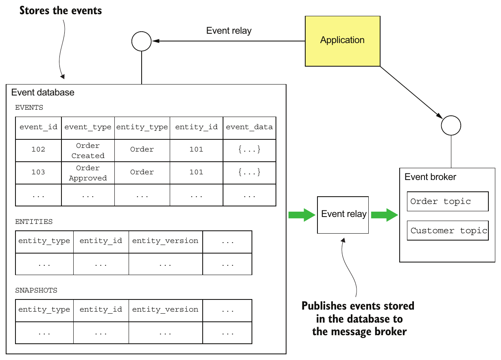

> **English:** Figure 6.9 The architecture of Eventuate Local. It consists of an event database (such as MySQL) that stores the events, an event broker (like Apache Kafka) that delivers events to subscribers, and an event relay that publishes events stored in the event database to the event broker.
>
> **Türkçe:** Şekil 6.9 Eventuate Local’ın mimarisi. Olayları saklayan bir olay veritabanından (MySQL gibi), olayları abonelere ileten bir olay broker’ından (Apache Kafka gibi) ve veritabanında saklanan olayları broker’a yayımlayan bir olay aktarım bileşeninden oluşur.

<!-- source-record: u06_0203 -->

> **English:** Let’s look at the different Eventuate Local components, starting with the database schema.
>
> **Türkçe:** Veritabanı şemasından başlayarak Eventuate Local bileşenlerini inceleyelim.

<!-- source-record: u06_0204 -->

#### THE SCHEMA OF EVENTUATE LOCAL’S EVENT DATABASE — Eventuate Local'ın olay veritabanı şeması

<!-- source-record: u06_0205 -->

> **English:** The event database consists of three tables:
>
> **Türkçe:** Olay veritabanı üç tablodan oluşur:

<!-- source-record: u06_0206 -->

> **English:** • events—Stores the events
>
> **Türkçe:** • events — Olayları saklar.

<!-- source-record: u06_0207 -->

> **English:** • entities—One row per entity
>
> **Türkçe:** • entities — Her entity için bir satır içerir.

<!-- source-record: u06_0208 -->

> **English:** • snapshots—Stores snapshots
>
> **Türkçe:** • snapshots — Snapshot’ları saklar.

<!-- source-record: u06_0209 -->

> **English:** The central table is the events table. The structure of this table is very similar to the table shown in figure 6.2. Here’s its definition:
>
> **Türkçe:** Merkezdeki tablo events tablosudur. Yapısı Şekil 6.2’deki tabloya çok benzer. Tanımı şöyledir:

<!-- source-pages: 204 -->

<!-- source-record: u06_0210 -->

```sql
create table events (
  event_id varchar(1000) PRIMARY KEY,
  event_type varchar(1000),
  event_data varchar(1000) NOT NULL,
  entity_type VARCHAR(1000) NOT NULL,
  entity_id VARCHAR(1000) NOT NULL,
  triggering_event VARCHAR(1000)
);
```

<!-- source-record: u06_0211 -->

> **English:** The triggering_event column is used to detect duplicate events/messages. It stores the ID of the message/event whose processing generated this event.
>
> **Türkçe:** triggering_event sütunu, yinelenen olayları veya mesajları saptamak için kullanılır. İşlenmesi sonucunda bu olayı üreten mesajın ya da olayın kimliğini saklar.

<!-- source-record: u06_0212 -->

> **English:** The entities table stores the current version of each entity. It’s used to implement optimistic locking. Here’s the definition of this table:
>
> **Türkçe:** entities tablosu her entity’nin güncel sürümünü saklar. Optimistic locking için kullanılır. Tablo tanımı şöyledir:

<!-- source-record: u06_0213 -->

```sql
create table entities (
  entity_type VARCHAR(1000),
  entity_id VARCHAR(1000),
  entity_version VARCHAR(1000) NOT NULL,
  PRIMARY KEY(entity_type, entity_id)
);
```

<!-- source-record: u06_0214 -->

> **English:** When an entity is created, a row is inserted into this table. Each time an entity is updated, the entity_version column is updated.
>
> **Türkçe:** Entity oluşturulduğunda tabloya bir satır eklenir. Entity her güncellendiğinde entity_version sütunu güncellenir.

<!-- source-record: u06_0215 -->

> **English:** The snapshots table stores the snapshots of each entity. Here’s the definition of this table:
>
> **Türkçe:** snapshots tablosu, her entity’nin snapshot’larını saklar. Tablo tanımı şöyledir:

<!-- source-record: u06_0216 -->

```sql
create table snapshots (
  entity_type VARCHAR(1000),
  entity_id VARCHAR(1000),
  entity_version VARCHAR(1000),
  snapshot_type VARCHAR(1000) NOT NULL,
  snapshot_json VARCHAR(1000) NOT NULL,
  triggering_events VARCHAR(1000),
  PRIMARY KEY(entity_type, entity_id, entity_version)
)
```

<!-- source-record: u06_0217 -->

> **English:** The entity_type and entity_id columns specify the snapshot’s entity. The snapshot _json column is the serialized representation of the snapshot, and the snapshot_type is its type. The entity_version specifies the version of the entity that this is a snapshot of.
>
> **Türkçe:** entity_type ve entity_id sütunları, snapshot’ın ait olduğu entity’yi belirtir. snapshot_json sütunu snapshot’ın serileştirilmiş gösterimidir; snapshot_type ise türüdür. entity_version, snapshot’ın hangi entity sürümüne ait olduğunu belirtir.

<!-- source-record: u06_0218 -->

> **English:** The three operations supported by this schema are find(), create(), and update(). The find() operation queries the snapshots table to retrieve the latest snapshot, if any. If a snapshot exists, the find() operation queries the events table to find all events whose event_id is greater than the snapshot’s entity_version. Otherwise, find() retrieves all events for the specified entity. The find() operation also queries the entity table to retrieve the entity’s current version.
>
> **Türkçe:** Bu şemanın desteklediği üç işlem find(), create() ve update() metodudur. find(), varsa en yeni snapshot’ı almak için snapshots tablosunu sorgular. Snapshot varsa, event_id değeri snapshot’ın entity_version değerinden büyük bütün olayları bulmak için events tablosunu sorgular. Yoksa belirtilen entity’nin bütün olaylarını getirir. Ayrıca entity’nin güncel sürümünü almak için entity tablosunu sorgular.

<!-- source-record: u06_0219 -->

> **English:** The create() operation inserts a row into the entity table and inserts the events into the events table. The update() operation inserts events into the events table. It also performs an optimistic locking check by updating the entity version in the entities table using this UPDATE statement:
>
> **Türkçe:** create(), entity tablosuna bir satır ve events tablosuna olayları ekler. update(), events tablosuna olay ekler. Ayrıca şu UPDATE ifadesiyle entities tablosundaki sürümü güncelleyerek optimistic locking kontrolü yapar:

<!-- source-pages: 205 -->

<!-- source-record: u06_0220 -->

```sql
UPDATE entities SET entity_version = ?
WHERE entity_type = ? and entity_id = ? and entity_version = ?
```

<!-- source-record: u06_0221 -->

> **English:** This statement verifies that the version is unchanged since it was retrieved by the find() operation. It also updates the entity_version to the new version. The update() operation performs these updates within a transaction in order to ensure atomicity.
>
> **Türkçe:** Bu ifade, sürümün find() ile getirildiğinden beri değişmediğini doğrular. entity_version değerini de yeni sürüme günceller. update(), atomikliği sağlamak için bu güncellemeleri tek transaction içinde gerçekleştirir.

<!-- source-record: u06_0222 -->

> **English:** Now that we’ve looked at how Eventuate Local stores an aggregate’s events and snapshots, let’s see how a client subscribes to events using Eventuate Local’s event broker.
>
> **Türkçe:** Eventuate Local’ın aggregate olaylarını ve snapshot’larını nasıl sakladığını gördük. Şimdi istemcinin Eventuate Local olay aracısı üzerinden olaylara nasıl abone olduğuna bakalım.

<!-- source-record: u06_0223 -->

#### CONSUMING EVENTS BY SUBSCRIBING TO EVENTUATE LOCAL’S EVENT BROKER — Eventuate Local'ın event broker'ına abone olarak olayları tüketmek

<!-- source-record: u06_0224 -->

> **English:** Services consume events by subscribing to the event broker, which is implemented using Apache Kafka. The event broker has a topic for each aggregate type. As described in chapter 3, a topic is a partitioned message channel. This enables consumers to scale horizontally while preserving message ordering. The aggregate ID is used as the partition key, which preserves the ordering of events published by a given aggregate. To consume an aggregate’s events, a service subscribes to the aggregate’s topic.
>
> **Türkçe:** Servisler, Apache Kafka ile gerçekleştirilen olay aracısına abone olarak olay tüketir. Her aggregate türü için bir topic bulunur. 3. bölümde açıklandığı gibi topic, partition’lara ayrılmış bir mesaj kanalıdır. Bu, mesaj sırasını korurken tüketicilerin yatay ölçeklenmesini sağlar. Aggregate kimliğinin partition key olarak kullanılması, aynı aggregate’ın yayımladığı olayların sırasını korur. Servis, aggregate olaylarını tüketmek için onun topic’ine abone olur.

<!-- source-record: u06_0225 -->

> **English:** Let’s now look at the event relay—the glue between the event database and the event broker.
>
> **Türkçe:** Şimdi olay veritabanı ile olay aracısını birbirine bağlayan event relay’e bakalım.

<!-- source-record: u06_0226 -->

#### THE EVENTUATE LOCAL EVENT RELAY PROPAGATES EVENTS FROM THE DATABASE TO THE MESSAGE BROKER — Eventuate Local event relay, olayları veritabanından message broker'a aktarır

<!-- source-record: u06_0227 -->

> **English:** The event relay propagates events inserted into the event database to the event broker. It uses transaction log tailing whenever possible and polling for other databases. For example, the MySQL version of the event relay uses the MySQL master/slave replication protocol. The event relay connects to the MySQL server as if it were a slave and reads the MySQL binlog, a record of updates made to the database. Inserts into the EVENTS table, which correspond to events, are published to the appropriate Apache Kafka topic. The event relay ignores any other kinds of changes.
>
> **Türkçe:** Event relay, veritabanına eklenen olayları olay aracısına aktarır. Desteklenen yerlerde transaction log tailing, diğer veritabanlarında polling kullanır. Örneğin MySQL sürümü master/slave replikasyon protokolünü kullanır. Relay, MySQL sunucusuna bir replica gibi bağlanıp veritabanı güncellemelerini kaydeden binlog’u okur. Olaylara karşılık gelen EVENTS tablosu eklemelerini uygun Apache Kafka topic’ine yayımlar. Diğer değişiklikleri göz ardı eder.

<!-- source-record: u06_0228 -->

> **English:** The event relay is deployed as a standalone process. In order to restart correctly, it periodically saves the current position in the binlog—filename and offset—in a special Apache Kafka topic. On startup, it first retrieves the last recorded position from the topic. The event relay then starts reading the MySQL binlog from that position.
>
> **Türkçe:** Event relay bağımsız bir süreç olarak dağıtılır. Yeniden başlatıldığında doğru yerden devam edebilmek için binlog’daki güncel konumunu, yani dosya adı ve offset bilgisini, düzenli aralıklarla özel bir Apache Kafka topic’ine kaydeder. Başlarken önce kaydedilmiş son konumu alır; ardından MySQL binlog’unu o konumdan okumaya devam eder.

<!-- source-record: u06_0229 -->

> **English:** The event database, message broker, and event relay comprise the event store. Let’s now look at the framework a Java application uses to access the event store.
>
> **Türkçe:** Olay veritabanı, mesaj aracısı ve event relay birlikte event store’u oluşturur. Şimdi Java uygulamasının event store’a erişmek için kullandığı framework’e bakalım.

<!-- source-record: u06_0230 -->

### 6.2.2 The Eventuate client framework for Java — Java için Eventuate istemci framework'ü

<!-- source-record: u06_0231 -->

> **English:** The Eventuate client framework enables developers to write event sourcing-based applications that use the Eventuate Local event store. The framework, shown in figure 6.10, provides the foundation for developing event sourcing-based aggregates, services, and event handlers.
>
> **Türkçe:** Eventuate Client framework’ü, Eventuate Local event store’unu kullanan event sourcing tabanlı uygulamalar yazmayı sağlar. Şekil 6.10’daki framework, event sourcing tabanlı aggregate, servis ve event handler geliştirmek için temel sunar.

<!-- source-pages: 206 -->

<!-- source-record: u06_0232 -->

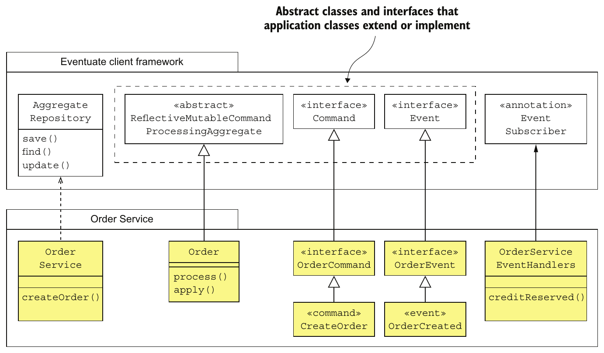

> **English:** Figure 6.10 The main classes and interfaces provided by the Eventuate client framework for Java
>
> **Türkçe:** Şekil 6.10 Java için Eventuate istemci framework’ünün sağladığı temel sınıflar ve arayüzler.

<!-- source-record: u06_0233 -->

> **English:** The framework provides base classes for aggregates, commands, and events. There’s also an AggregateRepository class that provides CRUD functionality. And the framework has an API for subscribing to events.
>
> **Türkçe:** Framework; aggregate, command ve olaylar için temel sınıflar sağlar. CRUD işlevlerini sunan AggregateRepository sınıfı da vardır. Ayrıca olaylara abone olmak için API içerir.

<!-- source-record: u06_0234 -->

> **English:** Let’s briefly look at each of the types shown in figure 6.10.
>
> **Türkçe:** Şekil 6.10’daki türlere kısaca bakalım.

<!-- source-record: u06_0235 -->

#### DEFINING AGGREGATES WITH THE REFLECTIVEMUTABLECOMMANDPROCESSINGAGGREGATE CLASS — ReflectiveMutableCommandProcessingAggregate sınıfıyla aggregate tanımlamak

<!-- source-record: u06_0236 -->

> **English:** ReflectiveMutableCommandProcessingAggregate is the base class for aggregates. It’s a generic class that has two type parameters: the first is the concrete aggregate class, and the second is the superclass of the aggregate’s command classes. As its rather long name suggests, it uses reflection to dispatch command and events to the appropriate method. Commands are dispatched to a process() method, and events to an apply() method.
>
> **Türkçe:** ReflectiveMutableCommandProcessingAggregate, aggregate’ların temel sınıfıdır. İki tür parametresi alan generic bir sınıftır: ilki somut aggregate sınıfı, ikincisi aggregate’ın command sınıflarının üst türüdür. Uzun adının da işaret ettiği gibi, command ve olayları uygun metoda yönlendirmek için reflection kullanır. Command’lar process() metoduna, olaylar apply() metoduna gönderilir.

<!-- source-record: u06_0237 -->

> **English:** The Order class you saw earlier extends ReflectiveMutableCommandProcessingAggregate. The following listing shows the Order class.
>
> **Türkçe:** Daha önce gördüğünüz Order sınıfı, ReflectiveMutableCommandProcessingAggregate sınıfını genişletir. Aşağıdaki listing Order sınıfını gösterir.

<!-- source-record: u06_0238 -->

#### Listing 6.3 The Eventuate version of the Order class — Listesi 6.3 Order sınıfının Sonraki sürümü

<!-- source-record: u06_0239 -->

```java
public class Order extends ReflectiveMutableCommandProcessingAggregate<Order,
      OrderCommand> {

  public List<Event> process(CreateOrderCommand command) { ... }

  public void apply(OrderCreatedEvent event) { ... }
  ...
}
```

<!-- source-pages: 207 -->

<!-- source-record: u06_0240 -->

> **English:** The two type parameters passed to ReflectiveMutableCommandProcessingAggregate are Order and OrderCommand, which is the base interface for Order’s commands.
>
> **Türkçe:** ReflectiveMutableCommandProcessingAggregate sınıfına verilen iki tür parametresi Order ve OrderCommand’dır. OrderCommand, Order command’larının temel arayüzüdür.

<!-- source-record: u06_0241 -->

#### DEFINING AGGREGATE COMMANDS — Aggregate komutlarını tanımlamak

<!-- source-record: u06_0242 -->

> **English:** An aggregate’s command classes must extend an aggregate-specific base interface, which itself must extend the Command interface. For example, the Order aggregate’s commands extend OrderCommand:
>
> **Türkçe:** Aggregate’ın command sınıfları, aggregate’a özel bir temel arayüzü uygulamalıdır; bu temel arayüz de Command arayüzünü genişletmelidir. Örneğin Order aggregate’ının command’ları OrderCommand türüne bağlıdır:

<!-- source-record: u06_0243 -->

```java
public interface OrderCommand extends Command {
}

public class CreateOrderCommand implements OrderCommand { ... }
```

<!-- source-record: u06_0244 -->

> **English:** The OrderCommand interface extends Command, and the CreateOrderCommand command class extends OrderCommand.
>
> **Türkçe:** OrderCommand arayüzü Command’ı genişletir; CreateOrderCommand command sınıfı ise OrderCommand arayüzünü uygular.

> **Java terim notu:** Kaynak “extends” sözcüğünü üst türe bağlı olma anlamında kullanır. Java kodunda bir sınıf arayüzü **implements** ile uygular; arayüz başka bir arayüzü **extends** ile genişletir.

<!-- source-record: u06_0245 -->

#### DEFINING DOMAIN EVENTS — Domain event'leri tanımlamak

<!-- source-record: u06_0246 -->

> **English:** An aggregate’s event classes must extend the Event interface, which is a marker interface with no methods. It’s also useful to define a common base interface, which extends Event for all of an aggregate’s event classes. For example, here’s the definition of the OrderCreated event:
>
> **Türkçe:** Aggregate’ın olay sınıfları, metot içermeyen bir marker interface olan Event arayüzünü uygulamalıdır. Bütün olay sınıfları için Event’i genişleten ortak bir temel arayüz tanımlamak da yararlıdır. Örneğin OrderCreated olayının tanımı şöyledir:

<!-- source-record: u06_0247 -->

```java
interface OrderEvent extends Event {

}

public class OrderCreated extends OrderEvent { ... }
```

<!-- source-record: u06_0248 -->

> **English:** The OrderCreated event class extends OrderEvent, which is the base interface for the Order aggregate’s event classes. The OrderEvent interface extends Event.
>
> **Türkçe:** OrderCreated olay sınıfı, Order aggregate’ının olay sınıfları için temel arayüz olan OrderEvent’i uygular. OrderEvent arayüzü ise Event’i genişletir.

<!-- source-record: u06_0249 -->

#### CREATING, FINDING, AND UPDATING AGGREGATES WITH THE AGGREGATEREPOSITORY CLASS — AggregateRepository sınıfıyla aggregate oluşturmak, bulmak ve güncellemek

<!-- source-record: u06_0250 -->

> **English:** The framework provides several ways to create, find, and update aggregates. The simplest approach, which I describe here, is to use an AggregateRepository. AggregateRepository is a generic class that’s parameterized by the aggregate class and the aggregate’s base command class. It provides three overloaded methods:
>
> **Türkçe:** Framework, aggregate oluşturmanın, bulmanın ve güncellemenin çeşitli yollarını sunar. Burada anlattığım en basit yaklaşım AggregateRepository kullanmaktır. Bu generic sınıf, aggregate sınıfı ve aggregate’ın temel command sınıfıyla parametrelenir. Overload’ları olan üç metot sağlar:

<!-- source-record: u06_0251 -->

> **English:** • save()—Creates an aggregate
>
> **Türkçe:** • save() — Aggregate oluşturur.

<!-- source-record: u06_0252 -->

> **English:** • find()—Finds an aggregate
>
> **Türkçe:** • find() — Aggregate’ı bulur.

<!-- source-record: u06_0253 -->

> **English:** • update()—Updates an aggregate
>
> **Türkçe:** • update() — Aggregate’ı günceller.

<!-- source-record: u06_0254 -->

> **English:** The save () and update() methods are particularly convenient because they encapsulate the boilerplate code required for creating and updating aggregates. For instance, save() takes a command object as a parameter and performs the following steps:
>
> **Türkçe:** save() ve update(), aggregate oluşturmak ve güncellemek için gerekli tekrarlanan standart kodu kapsülledikleri için özellikle kullanışlıdır. Örneğin save(), command nesnesini parametre olarak alıp şu adımları gerçekleştirir:

<!-- source-record: u06_0255 -->

> **English:** 1 Instantiates the aggregate using its default constructor
>
> **Türkçe:** 1 Varsayılan constructor ile aggregate örneğini oluşturur.

<!-- source-record: u06_0256 -->

> **English:** 2 Invokes process() to process the command
>
> **Türkçe:** 2 Command’ı işlemek için process() metodunu çağırır.

<!-- source-pages: 208 -->

<!-- source-record: u06_0257 -->

> **English:** 3 Applies the generated events by calling apply()
>
> **Türkçe:** 3 apply() metodunu çağırarak üretilen olayları uygular.

<!-- source-record: u06_0258 -->

> **English:** 4 Saves the generated events in the event store
>
> **Türkçe:** 4 Üretilen olayları event store’a kaydeder.

<!-- source-record: u06_0259 -->

> **English:** The update() method is similar. It has two parameters, an aggregate ID and a command, and performs the following steps:
>
> **Türkçe:** update() benzer biçimde çalışır. Aggregate kimliği ve command olmak üzere iki parametre alır ve şu adımları gerçekleştirir:

<!-- source-record: u06_0260 -->

> **English:** 1 Retrieves the aggregate from the event store
>
> **Türkçe:** 1 Aggregate’ı event store’dan getirir.

<!-- source-record: u06_0261 -->

> **English:** 2 Invokes process() to process the command
>
> **Türkçe:** 2 Command’ı işlemek için process() metodunu çağırır.

<!-- source-record: u06_0262 -->

> **English:** 3 Applies the generated events by calling apply()
>
> **Türkçe:** 3 apply() metodunu çağırarak üretilen olayları uygular.

<!-- source-record: u06_0263 -->

> **English:** 4 Saves the generated events in the event store
>
> **Türkçe:** 4 Üretilen olayları event store’a kaydeder.

<!-- source-record: u06_0264 -->

> **English:** The AggregateRepository class is primarily used by services, which create and update aggregates in response to external requests. For example, the following listing shows how OrderService uses an AggregateRepository to create an Order.
>
> **Türkçe:** AggregateRepository sınıfını çoğunlukla, dış isteklere yanıt olarak aggregate oluşturan ve güncelleyen servisler kullanır. Örneğin aşağıdaki listing, OrderService’in Order oluşturmak için AggregateRepository kullanımını gösterir.

<!-- source-record: u06_0265 -->

#### Listing 6.4 OrderService uses an AggregateRepository — Listesi 6.4 OrderService bir AggregateRepository kullanıyor

<!-- source-record: u06_0266 -->

```java
public class OrderService {
  private AggregateRepository<Order, OrderCommand> orderRepository;

  public OrderService(AggregateRepository<Order, OrderCommand> orderRepository)
  {
    this.orderRepository = orderRepository;
  }

  public EntityWithIdAndVersion<Order> createOrder(OrderDetails orderDetails) {
    return orderRepository.save(new CreateOrder(orderDetails));
  }
}
```

<!-- source-record: u06_0267 -->

> **English:** OrderService is injected with an AggregateRepository for Orders. Its create() method invokes AggregateRepository.save() with a CreateOrder command.
>
> **Türkçe:** OrderService’e, Order nesneleri için bir AggregateRepository enjekte edilir. create() metodu, bir CreateOrder command’ı vererek AggregateRepository.save() metodunu çağırır.

<!-- source-record: u06_0268 -->

#### SUBSCRIBING TO DOMAIN EVENTS — Domain event'lere abone olmak

<!-- source-record: u06_0269 -->

> **English:** The Eventuate Client framework also provides an API for writing event handlers. Listing 6.5 shows an event handler for CreditReserved events. The @EventSubscriber annotation specifies the ID of the durable subscription. Events that are published when the subscriber isn’t running will be delivered when it starts up. The @EventHandlerMethod annotation identifies the creditReserved() method as an event handler.
>
> **Türkçe:** Eventuate Client framework’ü, event handler yazmak için de API sunar. Listing 6.5, CreditReserved olaylarının işleyicisini gösterir. @EventSubscriber annotation’ı, kalıcı aboneliğin kimliğini belirtir. Abone çalışmıyorken yayımlanan olaylar, abone başlatıldığında teslim edilir. @EventHandlerMethod annotation’ı ise creditReserved() metodunun event handler olduğunu belirtir.

<!-- source-record: u06_0270 -->

#### Listing 6.5 An event handler for OrderCreatedEvent — Listesi 6.5 OrderCreatedEvent için bir olay yöneticisi

<!-- source-record: u06_0271 -->

```java
@EventSubscriber(id="orderServiceEventHandlers")
public class OrderServiceEventHandlers {

  @EventHandlerMethod
  public void creditReserved(EventHandlerContext<CreditReserved> ctx) {
    CreditReserved event = ctx.getEvent();
    ...
  }
```

<!-- source-pages: 209 -->

<!-- source-record: u06_0272 -->

> **English:** An event handler has a parameter of type EventHandlerContext, which contains the event and its metadata.
>
> **Türkçe:** Event handler, olayı ve metadata’sını içeren EventHandlerContext türünde parametre alır.

<!-- source-record: u06_0273 -->

> **English:** Now that we’ve looked at how to write event sourcing-based business logic using the Eventuate client framework, let’s look at how to use event sourcing-based business logic with sagas.
>
> **Türkçe:** Eventuate Client ile event sourcing tabanlı iş mantığı yazmayı gördük. Şimdi bu iş mantığının saga’larla birlikte nasıl kullanılacağına bakalım.

<!-- source-record: u06_0274 -->

## 6.3 Using sagas and event sourcing together — Saga'ları ve event sourcing'i birlikte kullanmak

<!-- source-record: u06_0275 -->

> **English:** Imagine you’ve implemented one or more services using event sourcing. You’ve probably written services similar to the one shown in listing 6.4. But if you’ve read chapter 4, you know that services often need to initiate and participate in sagas, sequences of local transactions used to maintain data consistency across services. For example, Order Service uses a saga to validate an Order. Kitchen Service, Consumer Service, and Accounting Service participate in that saga. Consequently, you must integrate sagas and event sourcing-based business logic.
>
> **Türkçe:** Event sourcing kullanarak bir veya daha fazla servis gerçekleştirdiğinizi düşünün. Muhtemelen Listing 6.4’tekine benzer servisler yazmışsınızdır. Ancak 4. bölümü okuduysanız servislerin çoğu zaman, servisler arasında veri tutarlılığını sağlayan yerel transaction dizileri olan saga’ları başlatması veya bunlara katılması gerektiğini bilirsiniz. Örneğin Order Service, Order’ı doğrulamak için saga kullanır. Kitchen Service, Consumer Service ve Accounting Service bu saga’ya katılır. Bu yüzden saga’larla event sourcing tabanlı iş mantığını bütünleştirmelisiniz.

<!-- source-record: u06_0276 -->

> **English:** Event sourcing makes it easy to use choreography-based sagas. The participants exchange the domain events emitted by their aggregates. Each participant’s aggregates handle events by processing commands and emitting new events. You need to write the aggregates and the event handler classes, which update the aggregates.
>
> **Türkçe:** Event sourcing, koreografi tabanlı saga kullanımını kolaylaştırır. Katılımcılar aggregate’larının ürettiği domain event’leri birbirlerine iletir. Her katılımcının aggregate’ları, command işleyip yeni olaylar üreterek olaylara karşılık verir. Aggregate’ları ve onları güncelleyen event handler sınıflarını yazmanız gerekir.

<!-- source-record: u06_0277 -->

> **English:** But integrating event sourcing-based business logic with orchestration-based sagas can be more challenging. That’s because the event store’s concept of a transaction might be quite limited. When using some event stores, an application can only create or update a single aggregate and publish the resulting event(s). But each step of a saga consists of several actions that must be performed atomically:
>
> **Türkçe:** Event sourcing tabanlı iş mantığını orkestrasyon tabanlı saga’larla bütünleştirmek daha zor olabilir. Çünkü event store’un transaction olanakları sınırlı olabilir. Bazı depolarda uygulama yalnızca tek aggregate oluşturabilir veya güncelleyebilir ve sonucunda oluşan olayları yayımlayabilir. Oysa saga’nın her adımı, atomik olarak gerçekleştirilmesi gereken birkaç eylemden oluşur:

<!-- source-record: u06_0278 -->

> **English:** • Saga creation—A service that initiates a saga must atomically create or update an aggregate and create the saga orchestrator. For example, Order Service’s createOrder() method must create an Order aggregate and a CreateOrderSaga.
>
> **Türkçe:** • Saga oluşturma — Saga’yı başlatan servis, aggregate’ı oluşturma veya güncelleme ile saga orchestrator oluşturmayı atomik yapmalıdır. Örneğin Order Service’in createOrder() metodu, Order aggregate’ı ile CreateOrderSaga’yı birlikte oluşturmalıdır.

<!-- source-record: u06_0279 -->

> **English:** • Saga orchestration—A saga orchestrator must atomically consume replies, update its state, and send command messages.
>
> **Türkçe:** • Saga orkestrasyonu — Orchestrator; yanıtı tüketmeyi, kendi durumunu güncellemeyi ve command mesajlarını göndermeyi atomik yapmalıdır.

<!-- source-record: u06_0280 -->

> **English:** • Saga participants—Saga participants, such as Kitchen Service and Order Service, must atomically consume messages, detect and discard duplicates, create or update aggregates, and send reply messages.
>
> **Türkçe:** • Saga katılımcıları — Kitchen Service ve Order Service gibi katılımcılar; mesajları tüketme, yinelenenleri saptayıp atma, aggregate oluşturma veya güncelleme ve yanıt mesajı gönderme eylemlerini atomik yapmalıdır.

<!-- source-record: u06_0281 -->

> **English:** Because of this mismatch between these requirements and the transactional capabilities of an event store, integrating orchestration-based sagas and event sourcing potentially creates some interesting challenges.
>
> **Türkçe:** Bu gereksinimlerle event store’un transaction yetenekleri arasındaki uyumsuzluk, orkestrasyon tabanlı saga’ları event sourcing ile bütünleştirirken bazı güçlükler doğurabilir.

<!-- source-record: u06_0282 -->

> **English:** A key factor in determining the ease of integrating event sourcing and orchestration-based sagas is whether the event store uses an RDBMS or a NoSQL database. The Eventuate Tram saga framework described in chapter 4 and the underlying Tram messaging framework described in chapter 3 rely on flexible ACID transactions provided by the RDBMS. The saga orchestrator and the saga participants use ACID transactions to atomically update their databases and exchange messages. If the application uses an RDBMS-based event store, such as Eventuate Local, then it can cheat and invoke the Eventuate Tram saga framework and update the event store within an ACID transaction. But if the event store uses a NoSQL database, which can’t participate in the same transaction as the Eventuate Tram saga framework, it will have to take a different approach.
>
> **Türkçe:** Event sourcing ile orkestrasyona dayalı saga'ları bütünleştirmenin ne kadar kolay olacağını belirleyen temel etkenlerden biri, event store'un RDBMS mi yoksa NoSQL veritabanı mı kullandığıdır. Bölüm 4'te anlatılan Eventuate Tram saga framework'ü ile onun altında çalışan ve 3. bölümde anlatılan Tram mesajlaşma framework'ü, RDBMS'in sağladığı esnek ACID işlemlerine dayanır. Saga orkestratörü ile katılımcıları, veritabanlarını atomik olarak güncellemek ve mesaj alışverişi yapmak için ACID işlemleri kullanır. Uygulama Eventuate Local gibi RDBMS tabanlı bir event store kullanıyorsa bu olanaktan yararlanarak Eventuate Tram saga framework'ünü çağırabilir ve event store'u aynı ACID işlemi içinde güncelleyebilir. Ancak event store, Eventuate Tram saga framework'ü ile aynı transaction'a katılamayan bir NoSQL veritabanı kullanıyorsa farklı bir yaklaşım gerekir.

<!-- source-pages: 210 -->

<!-- source-record: u06_0283 -->

> **English:** Let’s take a closer look at some of the different scenarios and issues you’ll need to address:
>
> **Türkçe:** Şimdi ele almanız gereken farklı senaryolara ve sorunlara daha yakından bakalım:

<!-- source-record: u06_0284 -->

> **English:** • Implementing choreography-based sagas
>
> **Türkçe:** • Koreografi tabanlı saga’ların uygulanması

<!-- source-record: u06_0285 -->

> **English:** • Creating an orchestration-based saga
>
> **Türkçe:** • Orkestrasyon tabanlı bir saga oluşturulması

<!-- source-record: u06_0286 -->

> **English:** • Implementing an event sourcing-based saga participant
>
> **Türkçe:** • Event sourcing tabanlı bir saga katılımcısının uygulanması

<!-- source-record: u06_0287 -->

> **English:** • Implementing saga orchestrators using event sourcing
>
> **Türkçe:** • Saga orchestrator’larının event sourcing ile uygulanması

<!-- source-record: u06_0288 -->

> **English:** We’ll begin by looking at how to implement choreography-based sagas using event sourcing.
>
> **Türkçe:** Önce event sourcing kullanarak koreografi tabanlı saga’ların nasıl uygulanacağına bakalım.

<!-- source-record: u06_0289 -->

### 6.3.1 Implementing choreography-based sagas using event sourcing — Event sourcing ile koreografiye dayalı saga'ları gerçekleştirmek

<!-- source-record: u06_0290 -->

> **English:** The event-driven nature of event sourcing makes it quite straightforward to implement choreography-based sagas. When an aggregate is updated, it emits an event. An event handler for a different aggregate can consume that event and update its aggregate. The event sourcing framework automatically makes each event handler idempotent.
>
> **Türkçe:** Event sourcing’in olay güdümlü yapısı, koreografi tabanlı saga’ların uygulanmasını oldukça kolaylaştırır. Bir aggregate güncellendiğinde olay üretir. Başka bir aggregate’ın event handler’ı bu olayı tüketip kendi aggregate’ını güncelleyebilir. Event sourcing framework’ü her event handler’ı otomatik olarak idempotent hale getirir.

<!-- source-record: u06_0291 -->

> **English:** For example, chapter 4 discusses how to implement Create Order Saga using choreography. ConsumerService, KitchenService, and AccountingService subscribe to the OrderService’s events and vice versa. Each service has an event handler similar to the one shown in listing 6.5. The event handler updates the corresponding aggregate, which emits another event.
>
> **Türkçe:** Örneğin 4. bölüm, Create Order Saga'nın koreografiyle nasıl gerçekleştirildiğini ele alır. ConsumerService, KitchenService ve AccountingService, OrderService'in olaylarına abone olur; OrderService de onların olaylarına abonedir. Her servisin Kod Listesi 6.5'tekine benzer bir olay işleyicisi vardır. Olay işleyicisi ilgili aggregate'i günceller; aggregate de başka bir olay üretir.

<!-- source-record: u06_0292 -->

> **English:** Event sourcing and choreography-based sagas work very well together. Event sourcing provides the mechanisms that sagas need, including messaging-based IPC, message de-duplication, and atomic updating of state and message sending. Despite its simplicity, choreography-based sagas have several drawbacks. I talk about some drawbacks in chapter 4, but there’s a drawback that’s specific to event sourcing.
>
> **Türkçe:** Event sourcing ile koreografi tabanlı saga’lar birlikte çok iyi çalışır. Event sourcing, saga’ların ihtiyaç duyduğu mesajlaşmaya dayalı IPC, yinelenen mesajları ayıklama ve durum güncellemesiyle mesaj göndermeyi atomik gerçekleştirme mekanizmalarını sağlar. Basitliğine rağmen koreografi tabanlı saga’ların bazı sakıncaları vardır. Bölüm 4’te bunların bazılarını ele aldım; ancak event sourcing’e özgü bir sakınca da bulunur.

<!-- source-record: u06_0293 -->

> **English:** The problem with using events for saga choreography is that events now have a dual purpose. Event sourcing uses events to represent state changes, but using events for saga choreography requires an aggregate to emit an event even if there is no state change. For example, if updating an aggregate would violate a business rule, then the aggregate must emit an event to report the error. An even worse problem is when a saga participant can’t create an aggregate. There’s no aggregate that can emit an error event.
>
> **Türkçe:** Saga koreografisinde olay kullanmanın sorunu, olayların artık iki ayrı amaca hizmet etmesidir. Event sourcing olayları durum değişikliklerini temsil etmek için kullanır; saga koreografisi ise durum değişikliği olmasa bile aggregate’ın olay üretmesini gerektirir. Örneğin bir aggregate’ı güncellemek bir iş kuralını ihlal edecekse aggregate, hatayı bildiren bir olay üretmelidir. Daha büyük sorun, bir saga katılımcısının aggregate oluşturamamasıdır. Bu durumda hata olayı üretebilecek bir aggregate yoktur.

<!-- source-record: u06_0294 -->

> **English:** Because of these kinds of issues, it’s best to implement more complex sagas using orchestration. The following sections explain how to integrate orchestration-based sagas and event sourcing. As you’ll see, it involves solving some interesting problems.
>
> **Türkçe:** Bu tür sorunlar nedeniyle daha karmaşık saga’ları orkestrasyonla uygulamak daha uygundur. Sonraki kısımlar, orkestrasyon tabanlı saga’larla event sourcing’in nasıl bütünleştirileceğini açıklar. Göreceğiniz gibi bunun için bazı ilginç sorunları çözmek gerekir.

<!-- source-record: u06_0295 -->

> **English:** Let’s first look at how a service method such as OrderService.createOrder() creates a saga orchestrator.
>
> **Türkçe:** Önce OrderService.createOrder() gibi bir servis metodunun saga orchestrator’ı nasıl oluşturduğuna bakalım.

<!-- source-pages: 211 -->

<!-- source-record: u06_0296 -->

### 6.3.2 Creating an orchestration-based saga — Orkestrasyona dayalı bir saga oluşturmak

<!-- source-record: u06_0297 -->

> **English:** Saga orchestrators are created by some service methods. Other service methods, such as OrderService.createOrder(), do two things: create or update an aggregate and create a saga orchestrator. The service must perform both actions in a way that guarantees that if it does the first action, then the second action will be done eventually. How the service ensures that both of these actions are performed depends on the kind of event store it uses.
>
> **Türkçe:** Bazı servis metotları saga orchestrator oluşturur. OrderService.createOrder() gibi başka servis metotları ise iki iş yapar: bir aggregate oluşturur veya günceller ve bir saga orchestrator oluşturur. Servis, ilk eylemi gerçekleştirirse ikinci eylemin de sonunda mutlaka gerçekleştirileceğini garanti etmelidir. Bu iki eylemin yapılmasını nasıl güvence altına aldığı, kullandığı event store’un türüne bağlıdır.

<!-- source-record: u06_0298 -->

#### CREATING A SAGA ORCHESTRATOR WHEN USING AN RDBMS-BASED EVENT STORE — RDBMS tabanlı event store kullanırken saga orkestratörü oluşturmak

<!-- source-record: u06_0299 -->

> **English:** If a service uses an RDBMS-based event store, it can update the event store and create a saga orchestrator within the same ACID transaction. For example, imagine that the OrderService uses Eventuate Local and the Eventuate Tram saga framework. Its createOrder() method would look like this:
>
> **Türkçe:** Servis RDBMS tabanlı bir event store kullanıyorsa event store’u güncelleyip saga orchestrator’ı aynı ACID transaction içinde oluşturabilir. Örneğin OrderService’in Eventuate Local ve Eventuate Tram saga framework’ünü kullandığını düşünün. createOrder() metodu şöyle olurdu:

<!-- source-record: u06_0300 -->

```java
class OrderService

  @Autowired
  private SagaManager<CreateOrderSagaState> createOrderSagaManager;

  @Transactional
   public EntityWithIdAndVersion<Order> createOrder(OrderDetails orderDetails) {
    EntityWithIdAndVersion<Order> order =
        orderRepository.save(new CreateOrder(orderDetails));

    CreateOrderSagaState data =
        new CreateOrderSagaState(order.getId(), orderDetails);

    createOrderSagaManager.create(data, Order.class, order.getId());

    return order;
  }
...
```

<!-- source-record: u06_0301 -->

**Kod açıklaması:**

> **English:** Ensure the createOrder() executes within a database transaction.
>
> **Türkçe:** createOrder() metodunun bir veritabanı transaction’ı içinde çalışmasını sağla.

<!-- source-record: u06_0302 -->

**Kod açıklaması:**

> **English:** Create the Order aggregate.
>
> **Türkçe:** Order aggregate’ını oluştur.

<!-- source-record: u06_0303 -->

**Kod açıklaması:**

> **English:** Create the CreateOrderSaga.
>
> **Türkçe:** CreateOrderSaga’yı oluştur.

<!-- source-record: u06_0304 -->

> **English:** It’s a combination of the OrderService in listing 6.4 and the OrderService described in chapter 4. Because Eventuate Local uses an RDBMS, it can participate in the same ACID transaction as the Eventuate Tram saga framework. But if a service uses a NoSQL-based event store, creating a saga orchestrator isn’t as straightforward.
>
> **Türkçe:** Bu, Liste 6.4’teki OrderService ile bölüm 4’te açıklanan OrderService’in birleşimidir. Eventuate Local bir RDBMS kullandığından Eventuate Tram saga framework’ü ile aynı ACID transaction’a katılabilir. Ancak servis NoSQL tabanlı bir event store kullanıyorsa saga orchestrator oluşturmak bu kadar kolay değildir.

<!-- source-record: u06_0305 -->

#### CREATING A SAGA ORCHESTRATOR WHEN USING A NOSQL-BASED EVENT STORE — NoSQL tabanlı event store kullanırken saga orkestratörü oluşturmak

<!-- source-record: u06_0306 -->

> **English:** A service that uses a NoSQL-based event store will most likely be unable to atomically update the event store and create a saga orchestrator. The saga orchestration framework might use an entirely different database. Even if it uses the same NoSQL database, the application won’t be able to create or update two different objects atomically because of the NoSQL database’s limited transaction model. Instead, a service must have an event handler that creates the saga orchestrator in response to a domain event emitted by the aggregate.
>
> **Türkçe:** NoSQL tabanlı bir event store kullanan servis, büyük olasılıkla event store'u güncelleme ve saga orkestratörü oluşturma işlemlerini atomik biçimde birlikte gerçekleştiremez. Saga orkestrasyon framework'ü tamamen farklı bir veritabanı kullanıyor olabilir. Aynı NoSQL veritabanını kullansa bile, veritabanının sınırlı transaction modeli nedeniyle uygulama iki farklı nesneyi atomik biçimde oluşturamaz veya güncelleyemez. Bunun yerine serviste, aggregate'in ürettiği bir domain event'e yanıt olarak saga orkestratörünü oluşturan bir olay işleyicisi bulunmalıdır.

<!-- source-record: u06_0307 -->

> **English:** For example, figure 6.11 shows how Order Service creates a CreateOrderSaga using an event handler for the OrderCreated event. Order Service first creates an Order aggregate and persists it in the event store. The event store publishes the OrderCreated event, which is consumed by the event handler. The event handler invokes the Eventuate Tram saga framework to create a CreateOrderSaga.
>
> **Türkçe:** Örneğin şekil 6.11, Order Service’in OrderCreated olayı için tanımlanan bir event handler aracılığıyla CreateOrderSaga oluşturmasını gösterir. Order Service önce bir Order aggregate’ı oluşturur ve event store’a kaydeder. Event store, event handler’ın tükettiği OrderCreated olayını yayımlar. Event handler da CreateOrderSaga oluşturmak için Eventuate Tram saga framework’ünü çağırır.

<!-- source-pages: 212 -->

<!-- source-record: u06_0308 -->

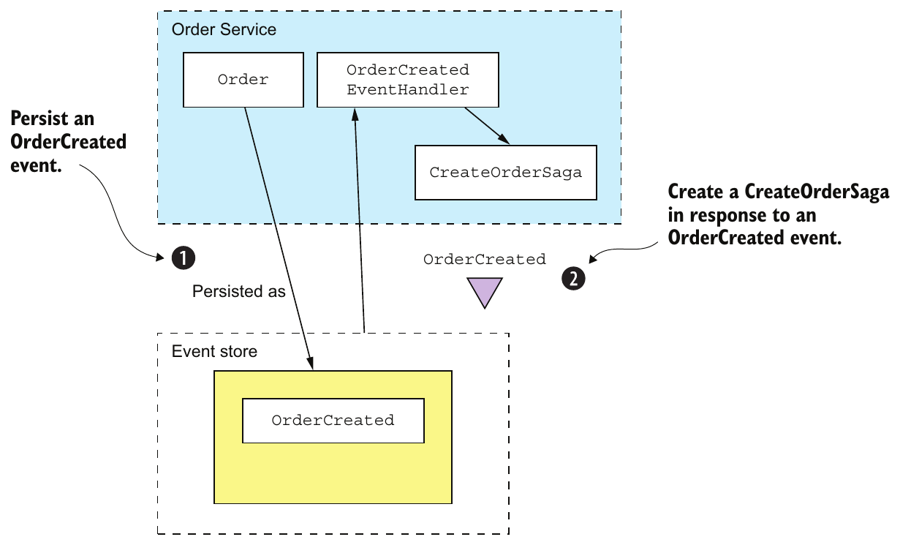

> **English:** Figure 6.11 Using an event handler to reliably create a saga after a service creates an event sourcing-based aggregate
>
> **Türkçe:** Şekil 6.11 Bir servis event sourcing tabanlı aggregate oluşturduktan sonra, olay işleyicisi kullanılarak güvenilir biçimde saga oluşturulması.

<!-- source-record: u06_0309 -->

> **English:** One issue to keep in mind when writing an event handler that creates a saga orchestrator is that it must handle duplicate events. At-least-once message delivery means that the event handler that creates the saga might be invoked multiple times. It’s important to ensure that only one saga instance is created.
>
> **Türkçe:** Saga orchestrator oluşturan bir event handler yazarken yinelenen olayları ele alması gerektiği unutulmamalıdır. At-least-once mesaj teslimi, saga’yı oluşturan event handler’ın birden fazla kez çağrılabileceği anlamına gelir. Yalnızca bir saga örneği oluşturulmasını sağlamak önemlidir.

<!-- source-record: u06_0310 -->

> **English:** A straightforward approach is to derive the ID of the saga from a unique attribute of the event. There are a couple of different options. One is to use the ID of the aggregate that emits the event as the ID of the saga. This works well for sagas that are created in response to aggregate creation events.
>
> **Türkçe:** Basit bir yaklaşım, saga kimliğini olayın benzersiz bir niteliğinden türetmektir. Birkaç seçenek vardır. Bunlardan biri, olayı üreten aggregate’ın kimliğini saga kimliği olarak kullanmaktır. Bu seçenek, aggregate oluşturma olayına yanıt olarak oluşturulan saga’lar için uygundur.

<!-- source-record: u06_0311 -->

> **English:** Another option is to use the event ID as the saga ID. Because event IDs are unique, this will guarantee that the saga ID is unique. If an event is a duplicate, the event handler’s attempt to create the saga will fail because the ID already exists. This option is useful when multiple instances of the same saga can exist for a given aggregate instance.
>
> **Türkçe:** Başka bir seçenek, olay kimliğini saga kimliği olarak kullanmaktır. Olay kimlikleri benzersiz olduğundan saga kimliği de benzersiz olur. Olay yinelenmişse bu kimlik zaten var olduğu için event handler’ın saga oluşturma girişimi başarısız olur. Bu seçenek, belirli bir aggregate örneği için aynı saga türünden birden çok örneğin bulunabileceği durumlarda yararlıdır.

<!-- source-record: u06_0312 -->

> **English:** A service that uses an RDBMS-based event store can also use the same event-driven approach to create sagas. A benefit of this approach is that it promotes loose coupling because services such as OrderService no longer explicitly instantiate sagas.
>
> **Türkçe:** RDBMS tabanlı event store kullanan bir servis de saga oluşturmak için aynı olay güdümlü yaklaşımı kullanabilir. Bu yaklaşım, OrderService gibi servislerin artık saga’ları doğrudan örneklememesi sayesinde gevşek bağlılığı destekler.

<!-- source-record: u06_0313 -->

> **English:** Now that we’ve looked at how to reliably create a saga orchestrator, let’s see how event sourcing-based services can participate in orchestration-based sagas.
>
> **Türkçe:** Saga orchestrator’ın güvenilir biçimde nasıl oluşturulacağını gördük. Şimdi event sourcing tabanlı servislerin orkestrasyon tabanlı saga’lara nasıl katılabileceğine bakalım.

<!-- source-pages: 213 -->

<!-- source-record: u06_0314 -->

### 6.3.3 Implementing an event sourcing-based saga participant — Event sourcing kullanan bir saga katılımcısı gerçekleştirmek

<!-- source-record: u06_0315 -->

> **English:** Imagine that you used event sourcing to implement a service that needs to participate in an orchestration-based saga. Not surprisingly, if your service uses an RDBMS-based event store such as Eventuate Local, you can easily ensure that it atomically processes saga command messages and sends replies. It can update the event store as part of the ACID transaction initiated by the Eventuate Tram framework. But you must use an entirely different approach if your service uses an event store that can’t participate in the same transaction as the Eventuate Tram framework.
>
> **Türkçe:** Orkestrasyona dayalı bir saga'ya katılması gereken bir servisi event sourcing ile gerçekleştirdiğinizi düşünün. Bekleneceği gibi servisiniz Eventuate Local gibi RDBMS tabanlı bir event store kullanıyorsa, saga komut mesajlarını atomik olarak işleyip yanıtları göndermesini kolayca sağlayabilirsiniz. Eventuate Tram framework'ünün başlattığı ACID işleminin parçası olarak event store'u güncelleyebilir. Ancak servisiniz Eventuate Tram framework'ü ile aynı transaction'a katılamayan bir event store kullanıyorsa tamamen farklı bir yaklaşım kullanmalısınız.

<!-- source-record: u06_0316 -->

> **English:** You must address a couple of different issues:
>
> **Türkçe:** Birkaç farklı sorunu ele almanız gerekir:

<!-- source-record: u06_0317 -->

> **English:** • Idempotent command message handling
>
> **Türkçe:** • Command mesajlarını idempotent biçimde işleme

<!-- source-record: u06_0318 -->

> **English:** • Atomically sending a reply message
>
> **Türkçe:** • Yanıt mesajını atomik biçimde gönderme

<!-- source-record: u06_0319 -->

> **English:** Let’s first look at how to implement idempotent command message handlers.
>
> **Türkçe:** Önce idempotent command mesajı işleyicilerinin nasıl uygulanacağına bakalım.

<!-- source-record: u06_0320 -->

#### IDEMPOTENT COMMAND MESSAGE HANDLING — Komut mesajlarını idempotent biçimde işlemek

<!-- source-record: u06_0321 -->

> **English:** The first problem to solve is how an event sourcing-based saga participant can detect and discard duplicate messages in order to implement idempotent command message handling. Fortunately, this is an easy problem to address using the idempotent message handling mechanism described earlier. A saga participant records the message ID in the events that are generated when processing the message. Before updating an aggregate, the saga participant verifies that it hasn’t processed the message before by looking for the message ID in the events.
>
> **Türkçe:** Çözülecek ilk sorun, event sourcing kullanan bir saga katılımcısının idempotent komut mesajı işleme davranışını gerçekleştirmek için yinelenen mesajları nasıl saptayıp atacağıdır. Neyse ki daha önce anlatılan idempotent mesaj işleme mekanizmasıyla bu sorun kolayca çözülebilir. Saga katılımcısı, mesaj işlenirken üretilen olaylara mesaj ID'sini kaydeder. Aggregate'i güncellemeden önce olayların içindeki mesaj ID'sine bakarak bu mesajı daha önce işlemediğini doğrular.

<!-- source-record: u06_0322 -->

#### ATOMICALLY SENDING REPLY MESSAGES — Yanıt mesajlarını atomik biçimde göndermek

<!-- source-record: u06_0323 -->

> **English:** The second problem to solve is how an event sourcing-based saga participant can atomically send replies. In principle, a saga orchestrator could subscribe to the events emitted by an aggregate, but there are two problems with this approach. The first is that a saga command might not actually change the state of an aggregate. In this scenario, the aggregate won’t emit an event, so no reply will be sent to the saga orchestrator. The second problem is that this approach requires the saga orchestrator to treat saga participants that use event sourcing differently from those that don’t. That’s because in order to receive domain events, the saga orchestrator must subscribe to the aggregate’s event channel in addition to its own reply channel.
>
> **Türkçe:** Çözülecek ikinci sorun, event sourcing kullanan bir saga katılımcısının yanıtları nasıl atomik olarak gönderebileceğidir. İlke olarak saga orkestratörü, aggregate'in ürettiği olaylara abone olabilir; ancak bu yaklaşımın iki sorunu vardır. İlki, saga komutunun aggregate'in durumunu gerçekten değiştirmeyebilmesidir. Bu senaryoda aggregate bir olay üretmez; dolayısıyla saga orkestratörüne yanıt gönderilmez. İkinci sorun, bu yaklaşımın saga orkestratörünü event sourcing kullanan katılımcılarla kullanmayanları farklı ele almaya zorlamasıdır. Bunun nedeni, domain event'leri alabilmek için orkestratörün kendi yanıt kanalına ek olarak aggregate'in olay kanalına da abone olmak zorunda olmasıdır.

<!-- source-record: u06_0324 -->

> **English:** A better approach is for the saga participant to continue to send a reply message to the saga orchestrator’s reply channel. But rather than send the reply message directly, a saga participant uses a two-step process:
>
> **Türkçe:** Daha iyi yaklaşım, saga katılımcısının saga orchestrator’ın yanıt kanalına yanıt mesajı göndermeye devam etmesidir. Ancak katılımcı mesajı doğrudan göndermek yerine iki aşamalı bir süreç kullanır:

<!-- source-record: u06_0325 -->

> **English:** 1 When a saga command handler creates or updates an aggregate, it arranges for a SagaReplyRequested pseudo event to be saved in the event store along with the real events emitted by the aggregate.
>
> **Türkçe:** 1 Bir saga command handler, aggregate oluşturduğunda veya güncellediğinde aggregate’ın ürettiği gerçek olaylarla birlikte SagaReplyRequested adlı bir sözde olayın (pseudo event) event store’a kaydedilmesini sağlar.

<!-- source-record: u06_0326 -->

> **English:** 2 An event handler for the SagaReplyRequested pseudo event uses the data contained in the event to construct the reply message, which it then writes to the saga orchestrator’s reply channel.
>
> **Türkçe:** 2 SagaReplyRequested sözde olayını işleyen event handler, olayın içerdiği verilerle yanıt mesajını oluşturur ve ardından bu mesajı saga orchestrator’ın yanıt kanalına yazar.

<!-- source-record: u06_0327 -->

> **English:** Let’s look at an example to see how this works.
>
> **Türkçe:** Bunun nasıl çalıştığını bir örnekle inceleyelim.

<!-- source-pages: 214 -->

<!-- source-record: u06_0328 -->

#### EXAMPLE EVENT SOURCING-BASED SAGA PARTICIPANT — Event sourcing kullanan örnek bir saga katılımcısı

<!-- source-record: u06_0329 -->

> **English:** This example looks at Accounting Service, one of the participants of Create Order Saga. Figure 6.12 shows how Accounting Service handles the Authorize Command sent by the saga. Accounting Service is implemented using the Eventuate Saga framework. The Eventuate Saga framework is an open source framework for writing sagas that use event sourcing. It’s built on the Eventuate Client framework.
>
> **Türkçe:** Bu örnekte Create Order Saga’nın katılımcılarından Accounting Service ele alınır. Şekil 6.12, Accounting Service’in saga tarafından gönderilen Authorize Command’ı nasıl işlediğini gösterir. Accounting Service, Eventuate Saga framework’ü ile uygulanmıştır. Eventuate Saga, event sourcing kullanan saga’lar yazmak için geliştirilmiş açık kaynaklı bir framework’tür. Eventuate Client framework’ü üzerine kuruludur.

<!-- source-record: u06_0330 -->

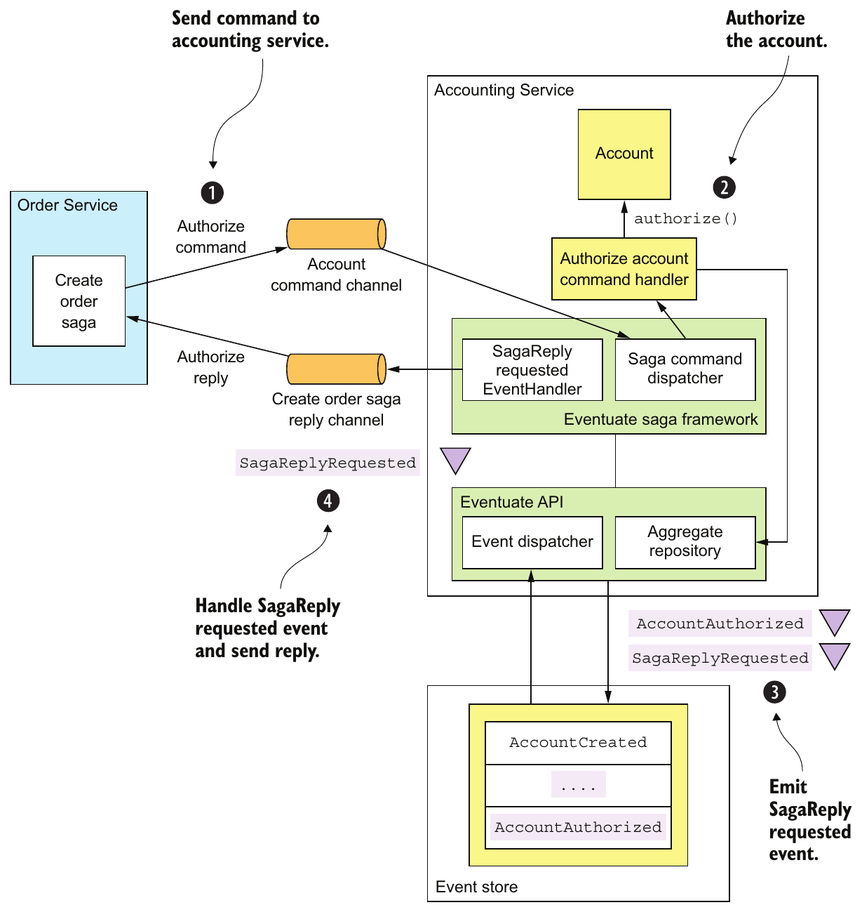

> **English:** Figure 6.12 How the event sourcing-based Accounting Service participates in Create Order Saga
>
> **Türkçe:** Şekil 6.12 Event sourcing tabanlı Accounting Service’in Create Order Saga’ya nasıl katıldığı.

<!-- source-record: u06_0331 -->

> **English:** This figure shows how Create Order Saga and AccountingService interact. The sequence of events is as follows:
>
> **Türkçe:** Bu şekil, Create Order Saga ile AccountingService'in nasıl etkileştiğini gösterir. Olay sırası şöyledir:

<!-- source-pages: 215 -->

<!-- source-record: u06_0332 -->

> **English:** 1 Create Order Saga sends an AuthorizeAccount command to AccountingService via a messaging channel. The Eventuate Saga framework’s SagaCommandDispatcher invokes AccountingServiceCommandHandler to handle the command message.
>
> **Türkçe:** 1 Create Order Saga, AuthorizeAccount komutunu bir mesajlaşma kanalı üzerinden AccountingService'e gönderir. Eventuate Saga framework'ünün SagaCommandDispatcher bileşeni, komut mesajını ele almak için AccountingServiceCommandHandler'ı çağırır.

<!-- source-record: u06_0333 -->

> **English:** 2 AccountingServiceCommandHandler sends the command to the specified Account aggregate.
>
> **Türkçe:** 2 AccountingServiceCommandHandler, command’ı belirtilen Account aggregate’ına gönderir.

<!-- source-record: u06_0334 -->

> **English:** 3 The aggregate emits two events, AccountAuthorized and SagaReplyRequestedEvent.
>
> **Türkçe:** 3 Aggregate iki olay üretir: AccountAuthorized ve SagaReplyRequestedEvent.

<!-- source-record: u06_0335 -->

> **English:** 4 SagaReplyRequestedEventHandler handles SagaReplyRequestedEvent by sending a reply message to CreateOrderSaga.
>
> **Türkçe:** 4 SagaReplyRequestedEventHandler, CreateOrderSaga’ya yanıt mesajı göndererek SagaReplyRequestedEvent olayını işler.

<!-- source-record: u06_0336 -->

> **English:** The AccountingServiceCommandHandler shown in the following listing handles the AuthorizeAccount command message by calling AggregateRepository.update() to update the Account aggregate.
>
> **Türkçe:** Aşağıdaki listede gösterilen AccountingServiceCommandHandler, Account aggregate’ını güncellemek üzere AggregateRepository.update() metodunu çağırarak AuthorizeAccount command mesajını işler.

<!-- source-record: u06_0337 -->

#### Listing 6.6 Handles command messages sent by sagas — Listesi 6.6 saga’lar tarafından gönderilen komut mesajlarını ele al

<!-- source-record: u06_0338 -->

```java
public class AccountingServiceCommandHandler {

  @Autowired
  private AggregateRepository<Account, AccountCommand> accountRepository;

  public void authorize(CommandMessage<AuthorizeCommand> cm) {
    AuthorizeCommand command = cm.getCommand();
    accountRepository.update(command.getOrderId(),
            command,
            replyingTo(cm)
                .catching(AccountDisabledException.class,
                          () -> withFailure(new AccountDisabledReply()))
                .build());
  }

  ...
```

<!-- source-record: u06_0339 -->

> **English:** The authorize() method invokes an AggregateRepository to update the Account aggregate. The third argument to update(), which is the UpdateOptions, is computed by this expression:
>
> **Türkçe:** authorize() metodu, Account aggregate’ını güncellemek için AggregateRepository’yi çağırır. update() metoduna verilen üçüncü argüman olan UpdateOptions şu ifadeyle hesaplanır:

<!-- source-record: u06_0340 -->

```java
replyingTo(cm)
    .catching(AccountDisabledException.class,
              () -> withFailure(new AccountDisabledReply()))
    .build()
```

<!-- source-record: u06_0341 -->

> **English:** These UpdateOptions configure the update() method to do the following:
>
> **Türkçe:** Bu UpdateOptions, update() metodunu şunları yapacak şekilde yapılandırır:

<!-- source-record: u06_0342 -->

> **English:** 1 Use the message id as an idempotency key to ensure that the message is processed exactly once. As mentioned earlier, the Eventuate framework stores the idempotency key in all generated events, enabling it to detect and ignore duplicate attempts to update an aggregate.
>
> **Türkçe:** 1 Mesajın tam olarak bir kez işlenmesini sağlamak için mesaj kimliğini idempotency key olarak kullan. Daha önce belirtildiği gibi Eventuate framework’ü, aggregate’ı güncellemeye yönelik yinelenen girişimleri saptayıp yok sayabilmek için üretilen tüm olaylara idempotency key’i kaydeder.

<!-- source-pages: 216 -->

<!-- source-record: u06_0343 -->

> **English:** 2 Add a SagaReplyRequestedEvent pseudo event to the list of events saved in the event store. When SagaReplyRequestedEventHandler receives the SagaReplyRequestedEvent pseudo event, it sends a reply to the CreateOrderSaga’s reply channel.
>
> **Türkçe:** 2 Event store’a kaydedilen olaylar listesine SagaReplyRequestedEvent sözde olayını ekle. SagaReplyRequestedEventHandler bu sözde olayı aldığında CreateOrderSaga’nın yanıt kanalına bir yanıt gönderir.

<!-- source-record: u06_0344 -->

> **English:** 3 Send an AccountDisabledReply instead of the default error reply when the aggregate throws an AccountDisabledException.
>
> **Türkçe:** 3 Aggregate, AccountDisabledException fırlattığında varsayılan hata yanıtı yerine AccountDisabledReply gönder.

<!-- source-record: u06_0345 -->

> **English:** Now that we’ve looked at how to implement saga participants using event sourcing, let’s find out how to implement saga orchestrators.
>
> **Türkçe:** Event sourcing kullanarak saga katılımcılarının nasıl uygulanacağını gördük. Şimdi saga orchestrator’larının nasıl uygulanacağını inceleyelim.

<!-- source-record: u06_0346 -->

### 6.3.4 Implementing saga orchestrators using event sourcing — Saga orkestratörlerini event sourcing ile gerçekleştirmek

<!-- source-record: u06_0347 -->

> **English:** So far in this section, I’ve described how event sourcing-based services can initiate and participate in sagas. You can also use event sourcing to implement saga orchestrators. This will enable you to develop applications that are entirely based on an event store.
>
> **Türkçe:** Bu kısımda şimdiye kadar event sourcing tabanlı servislerin saga’ları nasıl başlatabileceğini ve saga’lara nasıl katılabileceğini açıkladım. Saga orchestrator’larını uygulamak için de event sourcing kullanabilirsiniz. Böylece tamamen event store’a dayanan uygulamalar geliştirebilirsiniz.

<!-- source-record: u06_0348 -->

> **English:** There are three key design problems you must solve when implementing a saga orchestrator:
>
> **Türkçe:** Saga orchestrator uygularken çözmeniz gereken üç temel tasarım sorunu vardır:

<!-- source-record: u06_0349 -->

> **English:** 1 How can you persist a saga orchestrator?
>
> **Türkçe:** 1 Saga orchestrator’ı nasıl kalıcı olarak saklayabilirsiniz?

<!-- source-record: u06_0350 -->

> **English:** 2 How can you atomically change the state of the orchestrator and send command messages?
>
> **Türkçe:** 2 Orchestrator’ın durumunu değiştirip command mesajlarını atomik olarak nasıl gönderebilirsiniz?

<!-- source-record: u06_0351 -->

> **English:** 3 How can you ensure that a saga orchestrator processes reply messages exactly once?
>
> **Türkçe:** 3 Saga orchestrator’ın yanıt mesajlarını tam olarak bir kez işlemesini nasıl sağlayabilirsiniz?

<!-- source-record: u06_0352 -->

> **English:** Chapter 4 discusses how to implement an RDBMS-based saga orchestrator. Let’s look at how to solve these problems when using event sourcing.
>
> **Türkçe:** Bölüm 4, RDBMS tabanlı saga orchestrator uygulamasını ele alır. Şimdi event sourcing kullanırken bu sorunların nasıl çözülebileceğine bakalım.

<!-- source-record: u06_0353 -->

#### PERSISTING A SAGA ORCHESTRATOR USING EVENT SOURCING — Saga orkestratörünü event sourcing ile kalıcılaştırmak

<!-- source-record: u06_0354 -->

> **English:** A saga orchestrator has a very simple lifecycle. First, it’s created. Then it’s updated in response to replies from saga participants. We can, therefore, persist a saga using the following events:
>
> **Türkçe:** Saga orchestrator’ın yaşam döngüsü çok basittir. Önce oluşturulur. Ardından saga katılımcılarından gelen yanıtlara göre güncellenir. Dolayısıyla saga’yı şu olaylarla kalıcı olarak saklayabiliriz:

<!-- source-record: u06_0355 -->

> **English:** • SagaOrchestratorCreated—The saga orchestrator has been created.
>
> **Türkçe:** • SagaOrchestratorCreated — Saga orchestrator oluşturuldu.

<!-- source-record: u06_0356 -->

> **English:** • SagaOrchestratorUpdated—The saga orchestrator has been updated.
>
> **Türkçe:** • SagaOrchestratorUpdated — Saga orchestrator güncellendi.

<!-- source-record: u06_0357 -->

> **English:** A saga orchestrator emits a SagaOrchestratorCreated event when it’s created and a SagaOrchestratorUpdated event when it has been updated. These events contain the data necessary to re-create the state of the saga orchestrator. For example, the events for CreateOrderSaga, described in chapter 4, would contain a serialized (for example, JSON) CreateOrderSagaState.
>
> **Türkçe:** Saga orchestrator oluşturulduğunda SagaOrchestratorCreated, güncellendiğinde ise SagaOrchestratorUpdated olayı üretir. Bu olaylar, saga orchestrator’ın durumunu yeniden oluşturmak için gereken verileri içerir. Örneğin bölüm 4’te açıklanan CreateOrderSaga’nın olayları, serileştirilmiş (örneğin JSON biçiminde) bir CreateOrderSagaState içerir.

<!-- source-record: u06_0358 -->

#### SENDING COMMAND MESSAGES RELIABLY — Komut mesajlarını güvenilir biçimde göndermek

<!-- source-record: u06_0359 -->

> **English:** Another key design issue is how to atomically update the state of the saga and send a command. As described in chapter 4, the Eventuate Tram-based saga implementation does this by updating the orchestrator and inserting the command message into a message table as part of the same transaction. An application that uses an RDBMS-based event store, such as Eventuate Local, can use the same approach. An application that uses a NoSQL-based event store, such as Eventuate SaaS, can use an analogous approach, despite having a very limited transaction model.
>
> **Türkçe:** Bir diğer temel tasarım sorunu, saga’nın durumunu güncelleyip command’ı atomik olarak göndermektir. Bölüm 4’te açıklandığı gibi Eventuate Tram tabanlı saga uygulaması, orchestrator’ı güncellemeyi ve command mesajını bir mesaj tablosuna eklemeyi aynı transaction içinde yapar. Eventuate Local gibi RDBMS tabanlı bir event store kullanan uygulama da aynı yaklaşımı kullanabilir. Eventuate SaaS gibi NoSQL tabanlı bir event store kullanan uygulama, transaction modeli çok sınırlı olsa bile benzer bir yaklaşım kullanabilir.

<!-- source-pages: 217 -->

<!-- source-record: u06_0360 -->

> **English:** The trick is to persist a SagaCommandEvent, which represents a command to send. An event handler then subscribes to SagaCommandEvents and sends each command message to the appropriate channel. Figure 6.13 shows how this works.
>
> **Türkçe:** Çözüm, gönderilecek command’ı temsil eden bir SagaCommandEvent’i kalıcı olarak kaydetmektir. Ardından bir event handler, SagaCommandEvent olaylarına abone olur ve her command mesajını uygun kanala gönderir. Şekil 6.13 bunun nasıl çalıştığını gösterir.

<!-- source-record: u06_0361 -->

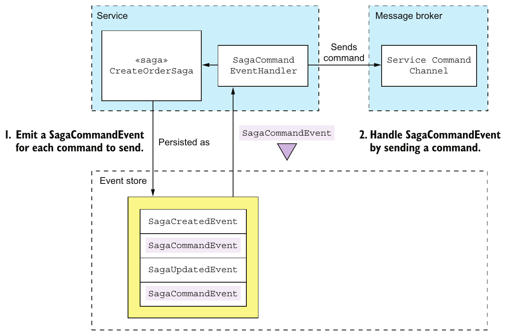

> **English:** Figure 6.13 How an event sourcing-based saga orchestrator sends commands to saga participants
>
> **Türkçe:** Şekil 6.13 Event sourcing tabanlı bir saga orchestrator’ının saga katılımcılarına nasıl komut gönderdiği.

<!-- source-record: u06_0362 -->

> **English:** The saga orchestrator uses a two-step process to send commands:
>
> **Türkçe:** Saga orchestrator, command göndermek için iki aşamalı bir süreç kullanır:

<!-- source-record: u06_0363 -->

> **English:** 1 A saga orchestrator emits a SagaCommandEvent for each command that it wants to send. SagaCommandEvent contains all the data needed to send the command, such as the destination channel and the command object. These events are persisted in the event store.
>
> **Türkçe:** 1 Saga orchestrator, göndermek istediği her command için bir SagaCommandEvent üretir. SagaCommandEvent, hedef kanal ve command nesnesi gibi command’ı göndermek için gereken tüm verileri içerir. Bu olaylar event store’a kaydedilir.

<!-- source-record: u06_0364 -->

> **English:** 2 An event handler processes these SagaCommandEvents and sends command messages to the destination message channel.
>
> **Türkçe:** 2 Bir event handler, bu SagaCommandEvent olaylarını işler ve command mesajlarını hedef mesaj kanalına gönderir.

<!-- source-record: u06_0365 -->

> **English:** This two-step approach guarantees that the command will be sent at least once.
>
> **Türkçe:** Bu iki aşamalı yaklaşım, command’ın en az bir kez gönderilmesini garanti eder.

<!-- source-record: u06_0366 -->

> **English:** Because the event store provides at-least-once delivery, an event handler might be invoked multiple times with the same event. That will cause the event handler for SagaCommandEvents to send duplicate command messages. Fortunately, though, a saga participant can easily detect and discard duplicate commands using the following mechanism. The ID of SagaCommandEvent, which is guaranteed to be unique, is used as the ID of the command message. As a result, the duplicate messages will have the same ID. A saga participant that receives a duplicate command message will discard it using the mechanism described earlier.
>
> **Türkçe:** Event store, at-least-once teslim sağladığından bir event handler aynı olayla birden çok kez çağrılabilir. Bu da SagaCommandEvent işleyicisinin yinelenen command mesajları göndermesine yol açar. Ancak saga katılımcısı bunları şu mekanizmayla kolayca saptayıp atabilir: Benzersizliği garanti edilen SagaCommandEvent kimliği, command mesajının kimliği olarak kullanılır. Böylece yinelenen mesajlar aynı kimliği taşır. Yinelenen command mesajı alan saga katılımcısı, daha önce açıklanan mekanizmayla bunu atar.

<!-- source-pages: 218 -->

<!-- source-record: u06_0367 -->

#### PROCESSING REPLIES EXACTLY ONCE — Yanıtları tam olarak bir kez işlemek

<!-- source-record: u06_0368 -->

> **English:** A saga orchestrator also needs to detect and discard duplicate reply messages, which it can do using the mechanism described earlier. The orchestrator stores the reply message’s ID in the events that it emits when processing the reply. It can then easily determine whether a message is a duplicate.
>
> **Türkçe:** Saga orchestrator’ın da yinelenen yanıt mesajlarını saptayıp atması gerekir; bunu daha önce açıklanan mekanizmayla yapabilir. Orchestrator, yanıtı işlerken ürettiği olaylara yanıt mesajının kimliğini kaydeder. Böylece bir mesajın yinelenip yinelenmediğini kolayca belirleyebilir.

<!-- source-record: u06_0369 -->

> **English:** As you can see, event sourcing is a good foundation for implementing sagas. This is in addition to the other benefits of event sourcing, including the inherently reliable generation of events whenever data changes, reliable audit logging, and the ability to do temporal queries. Event sourcing isn’t a silver bullet, though. It involves a significant learning curve. Evolving the event schema isn’t always straightforward. But despite these drawbacks, event sourcing has a major role to play in a microservice architecture. In the next chapter, we’ll switch gears and look at how to tackle a different distributed data management challenge in a microservice architecture: queries. I’ll describe how to implement queries that retrieve data scattered across multiple services.
>
> **Türkçe:** Gördüğünüz gibi event sourcing, saga'ları gerçekleştirmek için iyi bir temel sağlar. Bu özellik; veri değiştiğinde olayların doğası gereği güvenilir biçimde üretilmesi, güvenilir audit logging ve zamana göre sorgulama yapabilme gibi diğer yararlarına eklenir. Yine de event sourcing her derde deva değildir. Önemli bir öğrenme süreci gerektirir. Olay şemasını zaman içinde değiştirmek her zaman kolay değildir. Bu dezavantajlara rağmen event sourcing'in mikroservis mimarisinde önemli bir rolü vardır. Sonraki bölümde odağımızı değiştirip mikroservis mimarisinde başka bir dağıtık veri yönetimi sorununu, sorguları ele alacağız. Birden fazla servise dağılmış verileri getiren sorguların nasıl gerçekleştirileceğini açıklayacağım.

<!-- source-record: u06_0370 -->

## Summary — Bölüm özeti

<!-- source-record: u06_0371 -->

> **English:** • Event sourcing persists an aggregate as a sequence of events. Each event represents either the creation of the aggregate or a state change. An application recreates the state of an aggregate by replaying events. Event sourcing preserves the history of a domain object, provides an accurate audit log, and reliably publishes domain events.
>
> **Türkçe:** • Event sourcing, aggregate’ı olay dizisi olarak saklar. Her olay aggregate’ın oluşturulmasını veya bir durum değişikliğini temsil eder. Uygulama, olayları yeniden oynatarak aggregate’ın durumunu yeniden oluşturur. Event sourcing, domain nesnesinin geçmişini korur, doğru bir denetim kaydı sağlar ve domain event’leri güvenilir biçimde yayımlar.

<!-- source-record: u06_0372 -->

> **English:** • Snapshots improve performance by reducing the number of events that must be replayed.
>
> **Türkçe:** • Snapshot’lar, yeniden oynatılması gereken olay sayısını azaltarak performansı artırır.

<!-- source-record: u06_0373 -->

> **English:** • Events are stored in an event store, a hybrid of a database and a message broker. When a service saves an event in an event store, it delivers the event to subscribers.
>
> **Türkçe:** • Olaylar, veritabanı ile message broker’ın birleşimi olan event store’da saklanır. Servis event store’a bir olay kaydettiğinde event store bu olayı abonelere iletir.

<!-- source-record: u06_0374 -->

> **English:** • Eventuate Local is an open source event store based on MySQL and Apache Kafka. Developers use the Eventuate client framework to write aggregates and event handlers.
>
> **Türkçe:** • Eventuate Local, MySQL ve Apache Kafka tabanlı açık kaynaklı bir event store’dur. Geliştiriciler aggregate ve event handler yazmak için Eventuate client framework’ünü kullanır.

<!-- source-record: u06_0375 -->

> **English:** • One challenge with using event sourcing is handling the evolution of events. An application potentially must handle multiple event versions when replaying events. A good solution is to use upcasting, which upgrades events to the latest version when they’re loaded from the event store.
>
> **Türkçe:** • Event sourcing kullanmanın güçlüklerinden biri, olayların zamanla değişmesini yönetmektir. Uygulama olayları yeniden oynatırken birden çok olay sürümünü ele almak zorunda kalabilir. İyi bir çözüm, olaylar event store’dan yüklenirken onları en yeni sürüme dönüştüren upcasting yöntemidir.

<!-- source-record: u06_0376 -->

> **English:** • Deleting data in an event sourcing application is tricky. An application must use techniques such as encryption and pseudonymization in order to comply with regulations like the European Union’s GDPR that requires an application to erase an individual’s data.
>
> **Türkçe:** • Event sourcing kullanan bir uygulamada veri silmek zordur. Uygulama, kişiye ait verilerin silinmesini gerektiren Avrupa Birliği GDPR’si gibi düzenlemelere uyabilmek için şifreleme ve pseudonymization (takma adlandırma) gibi tekniklerden yararlanmalıdır.

<!-- source-pages: 219 -->

<!-- source-record: u06_0377 -->

> **English:** • Event sourcing is a simple way to implement choreography-based sagas. Services have event handlers that listen to the events published by event sourcing-based aggregates.
>
> **Türkçe:** • Event sourcing, koreografi tabanlı saga’ları uygulamak için basit bir yoldur. Servislerde, event sourcing tabanlı aggregate’ların yayımladığı olayları dinleyen event handler’lar bulunur.

<!-- source-record: u06_0378 -->

> **English:** • Event sourcing is a good way to implement saga orchestrators. As a result, you can write applications that exclusively use an event store.
>
> **Türkçe:** • Event sourcing, saga orchestrator’larını uygulamak için iyi bir yöntemdir. Böylece yalnızca event store kullanan uygulamalar yazabilirsiniz.
