# Ünite 07 · Implementing queries in a microservice architecture — Microservice mimarisinde sorguları uygulama

**Amaç:** Microservice mimarisinde sorguları uygulama konusunu İngilizce–Türkçe karşılaştırmalı çalışmak; teknik açıklamaları özgün şekiller, tablolar ve kod örnekleriyle birlikte okumak.

**Kaynak:** Kullanıcının sağladığı *Microservices Patterns*, bölüm 7; `Microservices_Patterns_1_Bolumden_Itibaren.pdf`, kaynak PDF sayfaları **220–252**. Başlık ve metin sırası korunmuş, sayfa sonlarında bölünen paragraflar birleştirilmiştir. Şekiller, üzerlerindeki yazılar korunarak kaynak PDF'den alınmıştır.

**Okuma notu:** Teknoloji ve şirket örnekleri kitabın yazıldığı dönemin anlatımıdır. Kodlar kaynakta verilen bağlama bağlı örneklerdir; bağımsız Java 17 programları olarak sunulmaz. İngilizce kaynak ve Türkçe çeviri ardışık bloklardadır. Çeviri hazırlığında yerel bir çeviri modeli kullanılmış; teknik terimler ve metin aktarımı ayrıca kontrol edilmiştir.

**Dil çalışması:** [Ünite sözlüğü](vocabulary.md) · [Vocabulary PDF](vocabulary.pdf) · [Grammar notları](grammar_notes.md) · [Grammar PDF](grammar_notes.pdf). Kelime anlamları ve cümle yapılarının ayrıntıları bu iki eşlikçi kaynaktadır.

<!-- source-pages: 220 -->

<!-- source-record: u07_0000 -->

## This chapter covers — Bu bölümün kapsamı

<!-- source-record: u07_0001 -->

> **English:** • The challenges of querying data in a microservice architecture
>
> **Türkçe:** • Mikroservis mimarisinde veri sorgulama zorlukları

<!-- source-record: u07_0002 -->

> **English:** • When and how to implement queries using the API composition pattern
>
> **Türkçe:** • API composition örüntüsünü kullanarak sorguların ne zaman ve nasıl gerçekleştirileceği

<!-- source-record: u07_0003 -->

> **English:** • When and how to implement queries using the Command query responsibility segregation (CQRS) pattern
>
> **Türkçe:** • Command query responsibility segregation (CQRS; komut ve sorgu sorumluluklarının ayrılması) örüntüsüyle sorguların ne zaman ve nasıl gerçekleştirileceği

<!-- source-record: u07_0004 -->

> **English:** Mary and her team were just starting to get comfortable with the idea of using sagas to maintain data consistency. Then they discovered that transaction management wasn’t the only distributed data-related challenge they had to worry about when migrating the FTGO application to microservices. They also had to figure out how to implement queries.
>
> **Türkçe:** Mary ve ekibi, veri tutarlılığını korumak için saga kullanma fikrine henüz alışmaya başlamıştı. Ardından, FTGO uygulamasını mikroservislere taşırken ilgilenmeleri gereken dağıtık veri sorunlarının transaction yönetimiyle sınırlı olmadığını fark ettiler. Sorguları nasıl gerçekleştireceklerini de çözmeleri gerekiyordu.

<!-- source-record: u07_0005 -->

> **English:** In order to support the UI, the FTGO application implements a variety of query operations. Implementing these queries in the existing monolithic application is relatively straightforward, because it has a single database. For the most part, all the FTGO developers needed to do was write SQL SELECT statements and define the necessary indexes. As Mary discovered, writing queries in a microservice architecture is challenging. Queries often need to retrieve data that’s scattered among the databases owned by multiple services. You can’t, however, use a traditional distributed query mechanism, because even if it were technically possible, it violates encapsulation.
>
> **Türkçe:** FTGO uygulaması, kullanıcı arayüzünü desteklemek için çeşitli sorgu işlemleri sunar. Tek veritabanına sahip mevcut monolitik uygulamada bu sorguları gerçekleştirmek nispeten kolaydır. FTGO geliştiricilerinin yapması gereken, çoğunlukla SQL SELECT ifadelerini yazmak ve gerekli indeksleri tanımlamaktı. Mary’nin fark ettiği gibi, mikroservis mimarisinde sorgu yazmak zordur. Sorguların çoğu zaman birden fazla servise ait veritabanlarına dağılmış verileri getirmesi gerekir. Ancak geleneksel bir dağıtık sorgu mekanizması kullanamazsınız; çünkü teknik açıdan mümkün olsa bile kapsüllemeyi ihlal eder.

<!-- source-pages: 221 -->

<!-- source-record: u07_0006 -->

> **English:** Consider, for example, the query operations for the FTGO application described in chapter 2. Some queries retrieve data that’s owned by just one service. The findConsumerProfile() query, for example, returns data from Consumer Service. But other FTGO query operations, such as findOrder() and findOrderHistory(), return data owned by multiple services. Implementing these query operations is not as straightforward.
>
> **Türkçe:** Örneğin 2. bölümde açıklanan FTGO sorgu işlemlerini düşünün. Bazı sorgular yalnızca tek bir servise ait verileri getirir. Örneğin findConsumerProfile(), Consumer Service’ten veri döndürür. Ancak findOrder() ve findOrderHistory() gibi diğer FTGO sorguları, birden fazla servise ait verileri döndürür. Bu sorgu işlemlerini gerçekleştirmek aynı ölçüde kolay değildir.

<!-- source-record: u07_0007 -->

> **English:** There are two different patterns for implementing query operations in a microservice architecture:
>
> **Türkçe:** Mikroservis mimarisinde sorgu işlemlerini gerçekleştirmek için iki farklı örüntü vardır:

<!-- source-record: u07_0008 -->

> **English:** • The API composition pattern—This is the simplest approach and should be used whenever possible. It works by making clients of the services that own the data responsible for invoking the services and combining the results.
>
> **Türkçe:** • API composition örüntüsü — En basit yaklaşımdır ve mümkün olduğunda kullanılmalıdır. Verinin sahibi olan servislerin istemcilerini, bu servisleri çağırmaktan ve sonuçları birleştirmekten sorumlu tutar.

<!-- source-record: u07_0009 -->

> **English:** • The Command query responsibility segregation (CQRS) pattern—This is more powerful than the API composition pattern, but it’s also more complex. It maintains one or more view databases whose sole purpose is to support queries.
>
> **Türkçe:** • Command query responsibility segregation (CQRS) örüntüsü — API composition’dan daha güçlü, fakat daha karmaşıktır. Tek amacı sorguları desteklemek olan bir veya daha fazla görünüm veritabanını güncel tutar.

<!-- source-record: u07_0010 -->

> **English:** After discussing these two patterns, I will talk about how to design CQRS views, followed by the implementation of an example view. Let’s start by taking a look at the API composition pattern.
>
> **Türkçe:** Bu iki örüntüyü ele aldıktan sonra CQRS görünümlerinin nasıl tasarlanacağını ve ardından örnek bir görünümün gerçekleştirimini anlatacağım. Önce API composition örüntüsüne bakalım.

<!-- source-record: u07_0011 -->

## 7.1 Querying using the API composition pattern — API composition örüntüsüyle sorgulama

<!-- source-record: u07_0012 -->

> **English:** The FTGO application implements numerous query operations. Some queries, as mentioned earlier, retrieve data from a single service. Implementing these queries is usually straightforward—although later in this chapter, when I cover the CQRS pattern, you’ll see examples of single service queries that are challenging to implement.
>
> **Türkçe:** FTGO uygulaması çok sayıda sorgu işlemi sunar. Daha önce belirtildiği gibi bazı sorgular tek bir servisten veri getirir. Bu sorguları gerçekleştirmek genellikle kolaydır; ancak bu bölümün ilerleyen kısmında CQRS örüntüsünü ele alırken, tek bir servisi ilgilendirdiği hâlde gerçekleştirmesi zor olan sorgu örneklerini göreceksiniz.

<!-- source-record: u07_0013 -->

> **English:** There are also queries that retrieve data from multiple services. In this section, I describe the findOrder() query operation, which is an example of a query that retrieves data from multiple services. I explain the challenges that often crop up when implementing this type of query in a microservice architecture. I then describe the API composition pattern and show how you can use it to implement queries such as findOrder().
>
> **Türkçe:** Birden fazla servisten veri getiren sorgular da vardır. Bu kısımda, böyle bir sorgunun örneği olan findOrder() işlemini açıklıyorum. Mikroservis mimarisinde bu tür sorguları gerçekleştirirken sıkça karşılaşılan güçlükleri anlatıyorum. Ardından API composition örüntüsünü açıklayıp findOrder() gibi sorgularda nasıl kullanabileceğinizi gösteriyorum.

<!-- source-record: u07_0014 -->

### 7.1.1 The findOrder() query operation — findOrder() sorgu işlemi

<!-- source-record: u07_0015 -->

> **English:** The findOrder() operation retrieves an order by its primary key. It takes an orderId as a parameter and returns an OrderDetails object, which contains information about the order. As shown in figure 7.1, this operation is called by a frontend module, such as a mobile device or a web application, that implements the Order Status view.
>
> **Türkçe:** findOrder() işlemi, bir siparişi birincil anahtarıyla getirir. Parametre olarak orderId alır ve sipariş bilgilerini içeren bir OrderDetails nesnesi döndürür. Şekil 7.1’de gösterildiği gibi bu işlemi, Order Status görünümünü sunan mobil cihaz veya web uygulaması gibi bir frontend modülü çağırır.

<!-- source-record: u07_0016 -->

> **English:** The information displayed by the Order Status view includes basic information about the order, including its status, payment status, status of the order from the restaurant’s perspective, and delivery status, including its location and estimated delivery time if in transit.
>
> **Türkçe:** Order Status görünümünün gösterdiği bilgiler; siparişin durumu gibi temel sipariş bilgilerini, ödeme durumunu, restoran açısından siparişin durumunu ve teslimat durumunu içerir. Sipariş yoldaysa teslimat bilgilerine mevcut konumu ve tahmini teslimat zamanı da dâhildir.

<!-- source-pages: 222 -->

<!-- source-record: u07_0017 -->

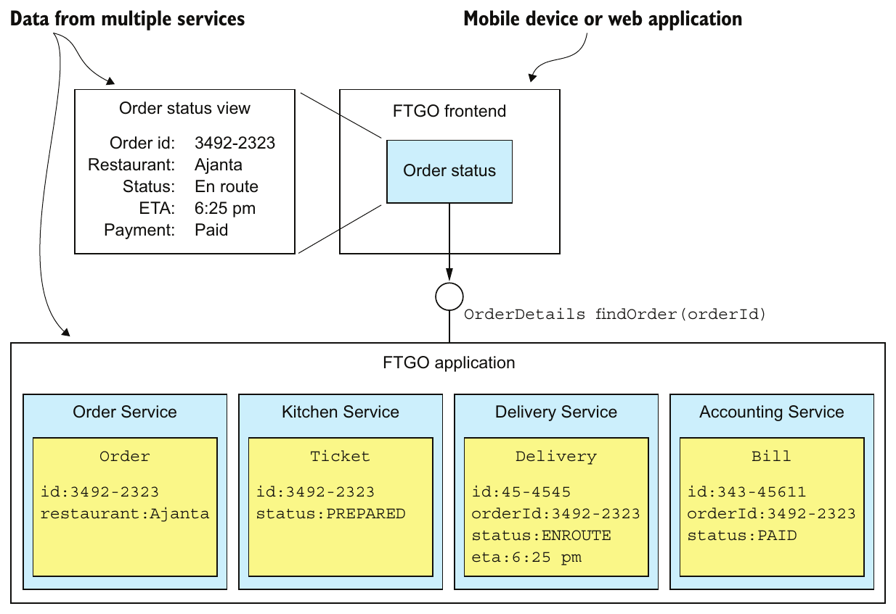

> **English:** Figure 7.1 The findOrder() operation is invoked by a FTGO frontend module and returns the details of an Order.
>
> **Türkçe:** Şekil 7.1 findOrder() işlemi, FTGO’nun bir frontend modülü tarafından çağrılır ve bir Order’ın ayrıntılarını döndürür.

<!-- source-record: u07_0018 -->

> **English:** Because its data resides in a single database, the monolithic FTGO application can easily retrieve the order details by executing a single SELECT statement that joins the various tables. In contrast, in the microservices-based version of the FTGO application, the data is scattered around the following services:
>
> **Türkçe:** Verileri tek bir veritabanında bulunduğundan monolitik FTGO uygulaması, çeşitli tabloları birleştiren tek bir SELECT ifadesi çalıştırarak sipariş ayrıntılarını kolayca getirebilir. FTGO’nun mikroservis tabanlı sürümünde ise veriler şu servislere dağılmıştır:

<!-- source-record: u07_0019 -->

> **English:** • Order Service—Basic order information, including the details and status
>
> **Türkçe:** - Order Service - Ayrıntıları ve durumu dahil olmak üzere temel sipariş bilgileri

<!-- source-record: u07_0020 -->

> **English:** • Kitchen Service—Status of the order from the restaurant’s perspective and the estimated time it will be ready for pickup
>
> **Türkçe:** • Kitchen Service — Restoran açısından siparişin durumu ve teslim alınmaya hazır olacağı tahmini zaman

<!-- source-record: u07_0021 -->

> **English:** • Delivery Service—The order’s delivery status, estimated delivery information, and its current location
>
> **Türkçe:** - Delivery Service - Sipariş teslimat durumu, tahmin edilen teslimat bilgileri ve mevcut konum

<!-- source-record: u07_0022 -->

> **English:** • Accounting Service—The order’s payment status
>
> **Türkçe:** - Accounting Service - Siparişin ödeme durumu

<!-- source-record: u07_0023 -->

> **English:** Any client that needs the order details must ask all of these services.
>
> **Türkçe:** Sipariş ayrıntılarına ihtiyaç duyan her istemci, bu servislerin tamamından bilgi istemelidir.

<!-- source-record: u07_0024 -->

### 7.1.2 Overview of the API composition pattern — API composition örüntüsüne genel bakış

<!-- source-record: u07_0025 -->

> **English:** One way to implement query operations, such as findOrder(), that retrieve data owned by multiple services is to use the API composition pattern. This pattern implements a query operation by invoking the services that own the data and combining the results. Figure 7.2 shows the structure of this pattern. It has two types of participants:
>
> **Türkçe:** findOrder() gibi birden fazla servise ait verileri getiren sorguları gerçekleştirmenin bir yolu API composition örüntüsüdür. Bu örüntü, verilerin sahibi olan servisleri çağırıp sonuçları birleştirerek sorgu işlemini gerçekleştirir. Şekil 7.2, örüntünün yapısını gösterir. İki tür katılımcısı vardır:

<!-- source-pages: 223 -->

<!-- source-record: u07_0026 -->

> **English:** • An API composer—This implements the query operation by querying the provider services.
>
> **Türkçe:** • API composer — Sağlayıcı servisleri sorgulayarak sorgu işlemini gerçekleştirir.

<!-- source-record: u07_0027 -->

> **English:** • A provider service—This is a service that owns some of the data that the query returns.
>
> **Türkçe:** • Sağlayıcı servis — Sorgunun döndürdüğü verilerin bir bölümüne sahip olan servistir.

<!-- source-record: u07_0028 -->

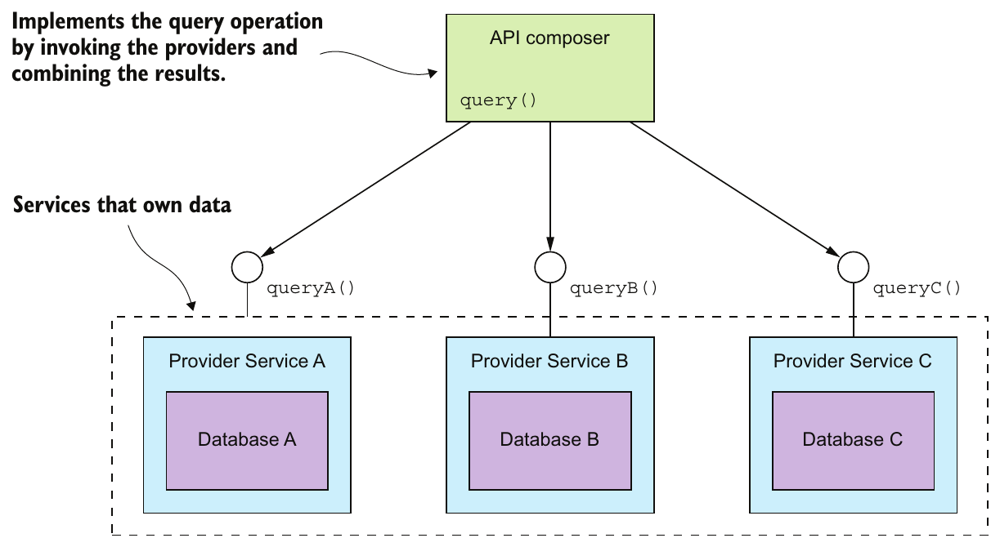

> **English:** Figure 7.2 The API composition pattern consists of an API composer and two or more provider services. The API composer implements a query by querying the providers and combining the results.
>
> **Türkçe:** Şekil 7.2 API composition örüntüsü, bir API composer ile iki veya daha fazla sağlayıcı servisten oluşur. API composer, sağlayıcıları sorgulayıp sonuçları birleştirerek sorguyu gerçekleştirir.

<!-- source-record: u07_0029 -->

> **English:** Figure 7.2 shows three provider services. The API composer implements the query by retrieving data from the provider services and combining the results. An API composer might be a client, such as a web application, that needs the data to render a web page. Alternatively, it might be a service, such as an API gateway and its Backends for frontends variant described in chapter 8, which exposes the query operation as an API endpoint.
>
> **Türkçe:** Şekil 7.2’de üç sağlayıcı servis bulunur. API composer, bu servislerden veri alıp sonuçları birleştirerek sorguyu gerçekleştirir. API composer, web sayfasını oluşturmak için verilere ihtiyaç duyan bir web uygulaması gibi bir istemci olabilir. Alternatif olarak sorgu işlemini bir API endpoint’i olarak sunan bir servis de olabilir; 8. bölümde anlatılan API gateway ve onun Backends for frontends çeşidi buna örnektir.

<!-- source-record: u07_0030 -->

### Pattern: API composition — Örüntü: API composition (API bileşimi)

<!-- source-record: u07_0031 -->

> **English:** Implement a query that retrieves data from several services by querying each service via its API and combining the results. See http://microservices.io/patterns/data/apicomposition.html.
>
> **Türkçe:** Her bir servisin API'si üzerinden sorgulama yaparak ve sonuçları birleştirerek birkaç servisten verileri alan bir sorgulama uygulayın. http://microservices.io/patterns/data/apicomposition.html'a bakın.

<!-- source-record: u07_0032 -->

> **English:** Whether you can use this pattern to implement a particular query operation depends on several factors, including how the data is partitioned, the capabilities of the APIs exposed by the services that own the data, and the capabilities of the databases used by the services. For instance, even if the Provider services have APIs for retrieving the required data, the aggregator might need to perform an inefficient, in-memory join of large datasets. Later on, you’ll see examples of query operations that can’t be implemented using this pattern. Fortunately, though, there are many scenarios where this pattern is applicable. To see it in action, we’ll look at an example.
>
> **Türkçe:** Bu örüntüyü belirli bir sorgu işlemi için kullanıp kullanamayacağınız çeşitli etkenlere bağlıdır: verilerin nasıl bölümlendiği, verinin sahibi olan servislerin sunduğu API’lerin yetenekleri ve servislerin kullandığı veritabanlarının yetenekleri. Örneğin sağlayıcı servislerin gerekli verileri getiren API’leri olsa bile birleştirme bileşeninin, büyük veri kümeleri üzerinde verimsiz bir bellek içi join yapması gerekebilir. İleride bu örüntüyle gerçekleştirilemeyen sorgu örneklerini göreceksiniz. Neyse ki örüntünün uygulanabildiği çok sayıda senaryo vardır. Nasıl çalıştığını görmek için bir örneğe bakalım.

<!-- source-pages: 224 -->

<!-- source-record: u07_0033 -->

### 7.1.3 Implementing the findOrder() query operation using the API composition pattern — findOrder() sorgu işlemini API composition örüntüsüyle gerçekleştirmek

<!-- source-record: u07_0034 -->

> **English:** The findOrder() query operation corresponds to a simple primary key-based equijoin query. It’s reasonable to expect that each of the Provider services has an API endpoint for retrieving the required data by orderId. Consequently, the findOrder() query operation is an excellent candidate to be implemented by the API composition pattern. The API composer invokes the four services and combines the results together. Figure 7.3 shows the design of the Find Order Composer.
>
> **Türkçe:** findOrder() işlemi, birincil anahtara dayalı basit bir equijoin (eşitlik koşullu birleştirme) sorgusuna karşılık gelir. Her sağlayıcı servisin, gerekli verileri orderId ile getiren bir API endpoint’i sunmasını beklemek makuldür. Dolayısıyla findOrder(), API composition örüntüsüyle gerçekleştirmek için çok uygun bir adaydır. API composer, dört servisi çağırıp sonuçları birleştirir. Şekil 7.3, Find Order Composer’ın tasarımını gösterir.

<!-- source-record: u07_0035 -->

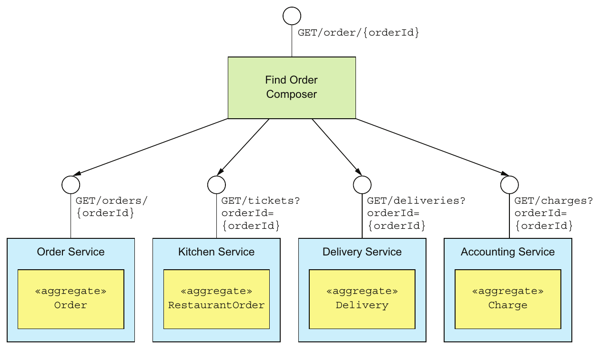

> **English:** Figure 7.3 Implementing findOrder() using the API composition pattern
>
> **Türkçe:** Şekil 7.3 findOrder() işleminin API composition örüntüsüyle gerçekleştirilmesi.

<!-- source-record: u07_0036 -->

> **English:** In this example, the API composer is a service that exposes the query as a REST endpoint. The Provider services also implement REST APIs. But the concept is the same if the services used some other interprocess communication protocol, such as gRPC, instead of HTTP. The Find Order Composer implements a REST endpoint GET /order/{orderId}. It invokes the four services and joins the responses using the orderId. Each Provider service implements a REST endpoint that returns a response corresponding to a single aggregate. The OrderService retrieves its version of an Order by primary key and the other services use the orderId as a foreign key to retrieve their aggregates.
>
> **Türkçe:** Bu örnekte API composer, sorguyu REST endpoint’i olarak sunan bir servistir. Sağlayıcı servisler de REST API’leri sunar. Ancak HTTP yerine gRPC gibi başka bir süreçler arası iletişim protokolü kullanılsa da kavram aynıdır. Find Order Composer, GET /order/{orderId} REST endpoint’ini gerçekleştirir. Dört servisi çağırır ve yanıtları orderId üzerinden birleştirir. Her sağlayıcı servis, tek bir aggregate’e karşılık gelen yanıt döndüren bir REST endpoint’i sunar. OrderService, Order’ın kendisinde bulunan sürümünü birincil anahtarla getirir; diğer servisler ise kendi aggregate’lerini getirmek için orderId’yi yabancı anahtar olarak kullanır.

<!-- source-record: u07_0037 -->

> **English:** As you can see, the API composition pattern is quite simple. Let’s look at a couple of design issues you must address when applying this pattern.
>
> **Türkçe:** Gördüğünüz gibi API composition örüntüsü oldukça basittir. Bu örüntüyü uygularken ele almanız gereken birkaç tasarım konusuna bakalım.

<!-- source-pages: 225 -->

<!-- source-record: u07_0038 -->

### 7.1.4 API composition design issues — API composition tasarımında ele alınacak konular

<!-- source-record: u07_0039 -->

> **English:** When using this pattern, you have to address a couple of design issues:
>
> **Türkçe:** Bu örüntüyü kullanırken birkaç tasarım konusunu ele almalısınız:

<!-- source-record: u07_0040 -->

> **English:** • Deciding which component in your architecture is the query operation’s API composer
>
> **Türkçe:** • Mimarinizde hangi bileşenin sorgu işlemi için API composer olacağına karar vermek

<!-- source-record: u07_0041 -->

> **English:** • How to write efficient aggregation logic
>
> **Türkçe:** • Verimli bir sonuç birleştirme mantığının nasıl yazılacağı

<!-- source-record: u07_0042 -->

> **English:** Let’s look at each issue.
>
> **Türkçe:** Her konuyu ayrı ayrı inceleyelim.

<!-- source-record: u07_0043 -->

#### WHO PLAYS THE ROLE OF THE API COMPOSER? — API composer rolünü kim üstlenir?

<!-- source-record: u07_0044 -->

> **English:** One decision that you must make is who plays the role of the query operation’s API composer. You have three options. The first option, shown in figure 7.4, is for a client of the services to be the API composer.
>
> **Türkçe:** Vermeniz gereken kararlardan biri, sorgu işleminde API composer rolünü kimin üstleneceğidir. Üç seçeneğiniz vardır. Şekil 7.4’te gösterilen ilk seçenekte, servislerin bir istemcisi API composer olur.

<!-- source-record: u07_0045 -->

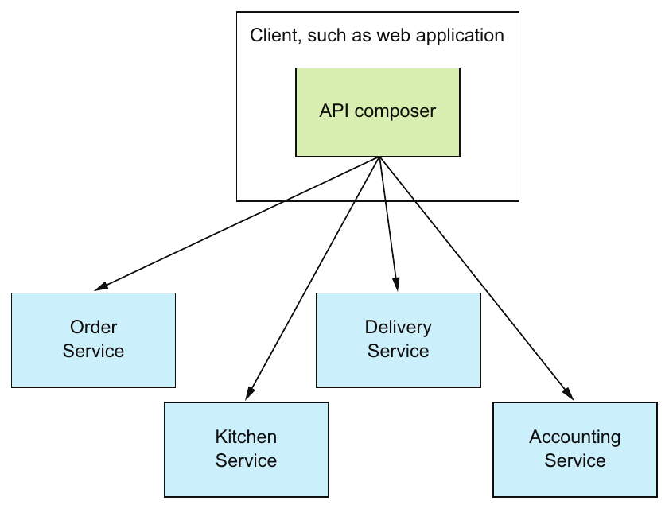

> **English:** Figure 7.4 Implementing API composition in a client. The client queries the provider services to retrieve the data.
>
> **Türkçe:** Şekil 7.4 API composition’ın istemcide gerçekleştirilmesi. İstemci, verileri almak için sağlayıcı servisleri sorgular.

<!-- source-record: u07_0046 -->

> **English:** A frontend client such as a web application, that implements the Order Status view and is running on the same LAN, could efficiently retrieve the order details using this pattern. But as you’ll learn in chapter 8, this option is probably not practical for clients that are outside of the firewall and access services via a slower network.
>
> **Türkçe:** Order Status görünümünü sunan ve aynı LAN’da çalışan bir web uygulaması gibi bir frontend istemcisi, bu örüntüyle sipariş ayrıntılarını verimli biçimde getirebilir. Ancak 8. bölümde göreceğiniz gibi, güvenlik duvarının dışında bulunan ve servislere daha yavaş bir ağ üzerinden erişen istemciler için bu seçenek muhtemelen pratik değildir.

<!-- source-record: u07_0047 -->

> **English:** The second option, shown in figure 7.5, is for an API gateway, which implements the application’s external API, to play the role of an API composer for a query operation.
>
> **Türkçe:** Şekil 7.5’teki ikinci seçenek, uygulamanın dış API’sini sağlayan API gateway’in sorgu işlemi için API composer rolünü üstlenmesidir.

<!-- source-record: u07_0048 -->

> **English:** This option makes sense if the query operation is part of the application’s external API. Instead of routing a request to another service, the API gateway implements the API composition logic. This approach enables a client, such as a mobile device, that’s running outside of the firewall to efficiently retrieve data from numerous services with a single API call. I discuss the API gateway in chapter 8.
>
> **Türkçe:** Sorgu işlemi uygulamanın dış API’sinin parçasıysa bu seçenek anlamlıdır. API gateway, isteği başka servise yönlendirmek yerine API composition mantığını kendisi gerçekleştirir. Böylece güvenlik duvarının dışında çalışan mobil cihaz gibi bir istemci, tek API çağrısıyla çok sayıda servisten verimli biçimde veri alabilir. API gateway’i 8. bölümde ele alıyorum.

<!-- source-record: u07_0049 -->

> **English:** The third option, shown in figure 7.6, is to implement an API composer as a standalone service.
>
> **Türkçe:** Şekil 7.6’daki üçüncü seçenek, API composer’ı bağımsız bir servis olarak gerçekleştirmektir.

<!-- source-pages: 226 -->

<!-- source-record: u07_0050 -->

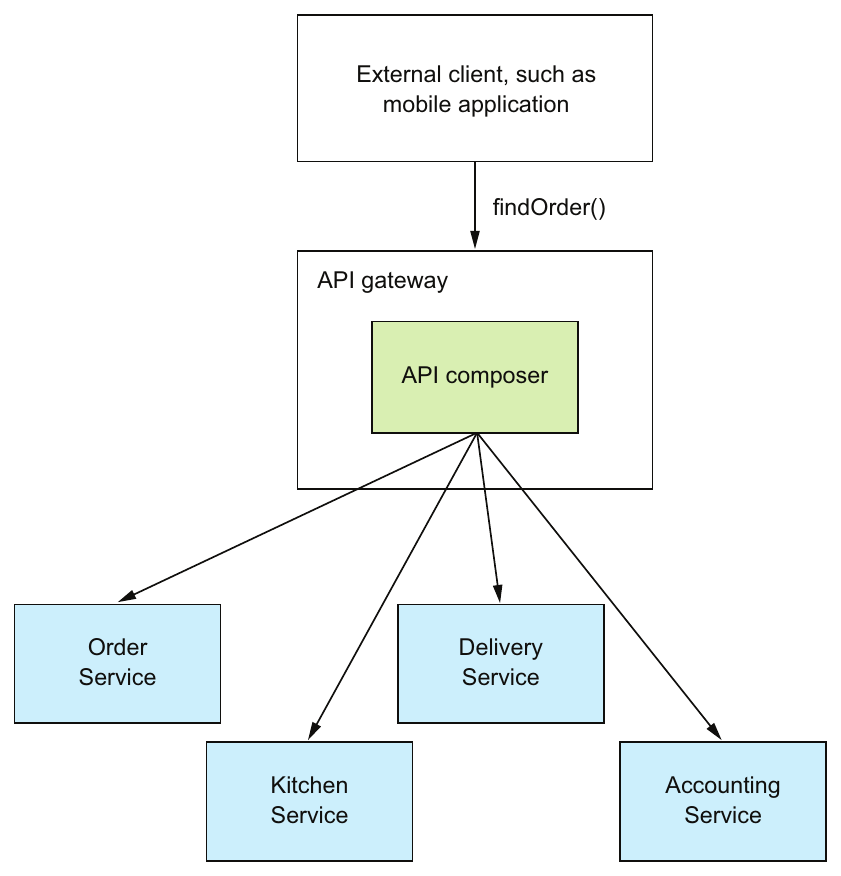

> **English:** Figure 7.5 Implementing API composition in the API gateway. The API queries the provider services to retrieve the data, combines the results, and returns a response to the client.
>
> **Türkçe:** Şekil 7.5 API composition’ın API gateway’de gerçekleştirilmesi. API, verileri almak için sağlayıcı servisleri sorgular, sonuçları birleştirir ve istemciye yanıt döndürür.

<!-- source-record: u07_0051 -->

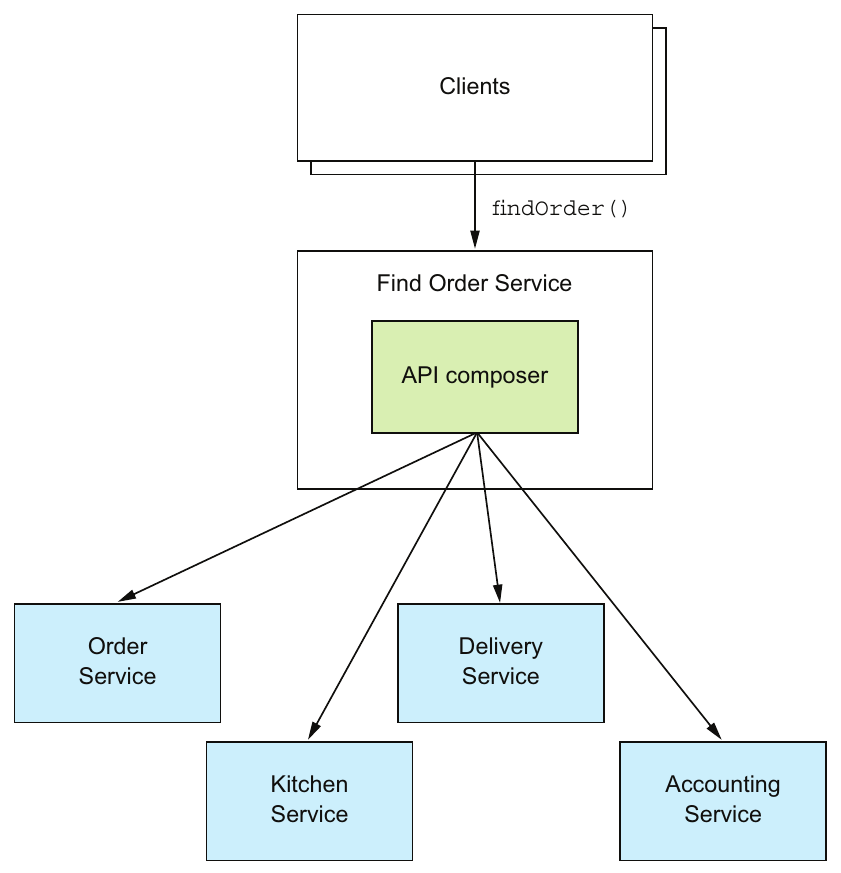

> **English:** Figure 7.6 Implement a query operation used by multiple clients and services as a standalone service.
>
> **Türkçe:** Şekil 7.6 Birden fazla istemcinin ve servisin kullandığı sorgu işlemini, bağımsız bir servis olarak gerçekleştirin.

<!-- source-pages: 227 -->

<!-- source-record: u07_0052 -->

> **English:** You should use this option for a query operation that’s used internally by multiple services. This operation can also be used for externally accessible query operations whose aggregation logic is too complex to be part of an API gateway.
>
> **Türkçe:** Bu seçeneği, uygulama içinde birden fazla servisin kullandığı sorgu işlemleri için kullanmalısınız. Birleştirme mantığı API gateway’in parçası olamayacak kadar karmaşık olan, dışarıdan erişilebilir sorgu işlemleri için de kullanılabilir.

<!-- source-record: u07_0053 -->

#### API COMPOSERS SHOULD USE A REACTIVE PROGRAMMING MODEL — API composer'lar reactive programming modeli kullanmalıdır

<!-- source-record: u07_0054 -->

> **English:** When developing a distributed system, minimizing latency is an ever-present concern. Whenever possible, an API composer should call provider services in parallel in order to minimize the response time for a query operation. The Find Order Aggregator should, for example, invoke the four services concurrently because there are no dependencies between the calls. Sometimes, though, an API composer needs the result of one Provider service in order to invoke another service. In this case, it will need to invoke some—but hopefully not all—of the provider services sequentially.
>
> **Türkçe:** Dağıtık sistem geliştirirken gecikmeyi en aza indirmek sürekli dikkate alınması gereken bir konudur. API composer, sorgunun yanıt süresini azaltmak için mümkün olduğunda sağlayıcı servisleri paralel çağırmalıdır. Örneğin Find Order Aggregator, çağrılar arasında bağımlılık bulunmadığından dört servisi eşzamanlı çağırmalıdır. Ancak bazen API composer, başka bir servisi çağırabilmek için bir sağlayıcı servisin sonucuna ihtiyaç duyar. Bu durumda sağlayıcı servislerin bir bölümünü — umarız tamamını değil — sırayla çağırması gerekir.

<!-- source-record: u07_0055 -->

> **English:** The logic to efficiently execute a mixture of sequential and parallel service invocations can be complex. In order for an API composer to be maintainable as well as performant and scalable, it should use a reactive design based on Java CompletableFuture’s, RxJava observables, or some other equivalent abstraction. I discuss this topic further in chapter 8 when I cover the API gateway pattern.
>
> **Türkçe:** Sıralı ve paralel servis çağrılarının karışımını verimli biçimde yürütme mantığı karmaşık olabilir. API composer’ın hem bakımı kolay hem performanslı ve ölçeklenebilir olması için Java CompletableFuture’larına, RxJava observable’larına veya eşdeğer bir soyutlamaya dayalı reaktif tasarım kullanması gerekir. Bu konuyu 8. bölümde API gateway örüntüsünü ele alırken ayrıntılandırıyorum.

<!-- source-record: u07_0056 -->

### 7.1.5 The benefits and drawbacks of the API composition pattern — API composition örüntüsünün yararları ve dezavantajları

<!-- source-record: u07_0057 -->

> **English:** This pattern is a simple and intuitive way to implement query operations in a microservice architecture. But it has some drawbacks:
>
> **Türkçe:** Bu örüntü, mikroservis mimarisinde sorgu işlemlerini gerçekleştirmenin basit ve anlaşılır bir yoludur. Ancak bazı dezavantajları vardır:

<!-- source-record: u07_0058 -->

> **English:** • Increased overhead
>
> **Türkçe:** • Artan ek kaynak maliyeti

<!-- source-record: u07_0059 -->

> **English:** • Risk of reduced availability
>
> **Türkçe:** • Kullanılabilirliğin azalması riski

<!-- source-record: u07_0060 -->

> **English:** • Lack of transactional data consistency
>
> **Türkçe:** • Transaction düzeyinde veri tutarlılığının bulunmaması

<!-- source-record: u07_0061 -->

> **English:** Let’s take a look at them.
>
> **Türkçe:** Hadi bir bakalım.

<!-- source-record: u07_0062 -->

#### INCREASED OVERHEAD — Artan ek işlem yükü

<!-- source-record: u07_0063 -->

> **English:** One drawback of this pattern is the overhead of invoking multiple services and querying multiple databases. In a monolithic application, a client can retrieve data with a single request, which will often execute a single database query. In comparison, using the API composition pattern involves multiple requests and database queries. As a result, more computing and network resources are required, increasing the cost of running the application.
>
> **Türkçe:** Örüntünün bir dezavantajı, birden fazla servisi çağırmanın ve birden fazla veritabanını sorgulamanın ek maliyetidir. Monolitik uygulamada istemci, çoğunlukla tek veritabanı sorgusu çalıştıran tek bir istekle verileri getirebilir. API composition ise birden fazla istek ve veritabanı sorgusu gerektirir. Dolayısıyla daha fazla hesaplama ve ağ kaynağı kullanılır; bu da uygulamayı çalıştırma maliyetini artırır.

<!-- source-record: u07_0064 -->

#### RISK OF REDUCED AVAILABILITY — Kullanılabilirliğin azalması riski

<!-- source-record: u07_0065 -->

> **English:** Another drawback of this pattern is reduced availability. As described in chapter 3, the availability of an operation declines with the number of services that are involved. Because the implementation of a query operation involves at least three services—the API composer and at least two provider services—its availability will be significantly less than that of a single service. For example, if the availability of an individual service is 99.5%, then the availability of the findOrder() endpoint, which invokes four provider services, is (99.5%)^(4+1) = 97.5%!
>
> **Türkçe:** Örüntünün diğer dezavantajı, kullanılabilirliği azaltmasıdır. Üçüncü bölümde açıklandığı gibi, bir işleme katılan servislerin sayısı arttıkça işlemin kullanılabilirliği düşer. Sorgu işlemi en az üç servisi — API composer ve en az iki sağlayıcı servis — içerdiğinden kullanılabilirliği tek bir servisin kullanılabilirliğinden belirgin ölçüde düşük olur. Örneğin tek servisin kullanılabilirliği %99,5 ise dört sağlayıcı servisi çağıran findOrder() endpoint’inin kullanılabilirliği (%99,5)^(4+1) = %97,5 olur!

<!-- source-record: u07_0066 -->

> **English:** There are couple of strategies you can use to improve availability. The first strategy is for the API composer to return previously cached data when a Provider service is unavailable. An API composer sometimes caches the data returned by a Provider service in order to improve performance. It can also use this cache to improve availability. If a provider is unavailable, the API composer can return data from the cache, though it may be potentially stale.
>
> **Türkçe:** Kullanılabilirliği artırmak için birkaç strateji uygulayabilirsiniz. İlki, sağlayıcı servis kullanılamadığında API composer’ın önceden önbelleğe alınmış verileri döndürmesidir. API composer, performansı artırmak için bazen sağlayıcının döndürdüğü verileri önbelleğe alır. Bu önbelleği kullanılabilirliği artırmak için de kullanabilir. Sağlayıcı kullanılamıyorsa API composer, güncelliğini yitirmiş olma ihtimaline rağmen önbellekteki verileri döndürebilir.

<!-- source-pages: 228 -->

<!-- source-record: u07_0067 -->

> **English:** Another strategy for improving availability is for the API composer to return incomplete data. For example, imagine that Kitchen Service is temporarily unavailable. The API Composer for the findOrder() query operation could omit that service’s data from the response, because the UI can still display useful information. You’ll see more details on API design, caching, and reliability in chapter 8.
>
> **Türkçe:** Kullanılabilirliği artırmanın başka bir yolu, API composer’ın eksik veri döndürmesidir. Örneğin Kitchen Service’in geçici olarak kullanılamadığını düşünün. findOrder() işleminin API composer’ı, bu servisin verilerini yanıta eklemeyebilir; çünkü kullanıcı arayüzü yine de yararlı bilgiler gösterebilir. API tasarımı, önbelleğe alma ve güvenilirlik ayrıntılarını 8. bölümde göreceksiniz.

<!-- source-record: u07_0068 -->

#### LACK OF TRANSACTIONAL DATA CONSISTENCY — İşlemsel veri tutarlılığının bulunmaması

<!-- source-record: u07_0069 -->

> **English:** Another drawback of the API composition pattern is the lack of data consistency. A monolithic application typically executes a query operation using a single database transaction. ACID transactions—subject to the fine print about isolation levels—ensure that an application has a consistent view of the data, even if it executes multiple database queries. In contrast, the API composition pattern executes multiple database queries against multiple databases. There’s a risk, therefore, that a query operation will return inconsistent data.
>
> **Türkçe:** API composition’ın diğer dezavantajı, veri tutarlılığının bulunmamasıdır. Monolitik uygulama, sorgu işlemini genellikle tek bir veritabanı transaction’ı içinde gerçekleştirir. ACID transaction’ları — yalıtım düzeylerine ilişkin ayrıntılı koşullar çerçevesinde — birden fazla veritabanı sorgusu çalıştırsa bile uygulamanın verileri tutarlı biçimde görmesini sağlar. API composition ise birden fazla veritabanında birden fazla sorgu çalıştırır. Bu nedenle sorgunun tutarsız veri döndürme riski vardır.

<!-- source-record: u07_0070 -->

> **English:** For example, an Order retrieved from Order Service might be in the CANCELLED state, whereas the corresponding Ticket retrieved from Kitchen Service might not yet have been cancelled. The API composer must resolve this discrepancy, which increases the code complexity. To make matters worse, an API composer might not always be able to detect inconsistent data, and will return it to the client.
>
> **Türkçe:** Örneğin Order Service’ten getirilen Order, CANCELLED durumundayken Kitchen Service’ten getirilen karşılık gelen Ticket henüz iptal edilmemiş olabilir. API composer bu uyumsuzluğu çözmelidir; bu da kodun karmaşıklığını artırır. Üstelik API composer tutarsız veriyi her zaman tespit edemeyebilir ve bu veriyi istemciye döndürebilir.

<!-- source-record: u07_0071 -->

> **English:** Despite these drawbacks, the API composition pattern is extremely useful. You can use it to implement many query operations. But there are some query operations that can’t be efficiently implemented using this pattern. A query operation might, for example, require the API composer to perform an in-memory join of large datasets.
>
> **Türkçe:** Bu dezavantajlarına rağmen API composition son derece yararlıdır. Birçok sorgu işlemini gerçekleştirmek için kullanılabilir. Ancak bu örüntüyle verimli biçimde gerçekleştirilemeyen sorgular da vardır. Örneğin bir sorgu, API composer’ın büyük veri kümelerini bellekte birleştirmesini gerektirebilir.

<!-- source-record: u07_0072 -->

> **English:** It’s usually better to implement these types of query operations using the CQRS pattern. Let’s take a look at how this pattern works.
>
> **Türkçe:** Bu tür sorguları genellikle CQRS örüntüsüyle gerçekleştirmek daha uygundur. Örüntünün nasıl çalıştığına bakalım.

<!-- source-record: u07_0073 -->

## 7.2 Using the CQRS pattern — CQRS örüntüsünü kullanmak

<!-- source-record: u07_0074 -->

> **English:** Many enterprise applications use an RDBMS as the transactional system of record and a text search database, such as Elasticsearch or Solr, for text search queries. Some applications keep the databases synchronized by writing to both simultaneously. Others periodically copy data from the RDBMS to the text search engine. Applications with this architecture leverage the strengths of multiple databases: the transactional properties of the RDBMS and the querying capabilities of the text database.
>
> **Türkçe:** Birçok kurumsal uygulama, transaction’ların yürütüldüğü asıl kayıt sistemi olarak RDBMS; metin arama sorguları içinse Elasticsearch veya Solr gibi bir metin arama veritabanı kullanır. Bazı uygulamalar iki veritabanına aynı anda yazarak eşzamanlılıklarını korur. Diğerleri, verileri RDBMS’den metin arama motoruna düzenli aralıklarla kopyalar. Bu mimarideki uygulamalar, birden fazla veritabanının güçlü yanlarından yararlanır: RDBMS’nin transaction özellikleri ve metin veritabanının sorgulama yetenekleri.

<!-- source-record: u07_0075 -->

### Pattern: Command query responsibility segregation — Örüntü: Komut ve sorgu sorumluluklarının ayrılması (CQRS)

<!-- source-record: u07_0076 -->

> **English:** Implement a query that needs data from several services by using events to maintain a read-only view that replicates data from the services. See http://microservices.io/patterns/data/cqrs.html. CQRS is a generalization of this kind of architecture. It maintains one or more view databases—not just text search databases—that implement one or more of the application’s queries. To understand why this is useful, we’ll look at some queries that can’t be efficiently implemented using the API composition pattern. I’ll explain how CQRS works and then talk about the benefits and drawbacks of CQRS. Let’s take a look at when you need to use CQRS.
>
> **Türkçe:** Birden fazla servisin verilerine ihtiyaç duyan sorguyu gerçekleştirmek için, servislerdeki verileri çoğaltan salt okunur bir görünümü olaylarla güncel tutun. Bkz. http://microservices.io/patterns/data/cqrs.html. CQRS, bu tür mimarinin genelleştirilmiş hâlidir. Uygulamanın bir veya daha fazla sorgusunu gerçekleştiren, yalnızca metin aramayla sınırlı olmayan bir veya daha fazla görünüm veritabanını güncel tutar. Bunun yararını anlamak için API composition ile verimli biçimde gerçekleştirilemeyen bazı sorgulara bakacağız. CQRS’nin nasıl çalıştığını, ardından avantaj ve dezavantajlarını açıklayacağım. Önce CQRS’yi ne zaman kullanmanız gerektiğine bakalım.

<!-- source-pages: 229 -->

<!-- source-record: u07_0077 -->

### 7.2.1 Motivations for using CQRS — CQRS kullanma gerekçeleri

<!-- source-record: u07_0078 -->

> **English:** The API composition pattern is a good way to implement many queries that must retrieve data from multiple services. Unfortunately, it’s only a partial solution to the problem of querying in a microservice architecture. That’s because there are multiple service queries the API composition pattern can’t implement efficiently.
>
> **Türkçe:** API composition, birden fazla servisten veri getirmesi gereken birçok sorgu için iyi bir çözümdür. Ne yazık ki mikroservis mimarisindeki sorgulama sorununu yalnızca kısmen çözer. Çünkü birden fazla servisi kapsayan bazı sorguları verimli biçimde gerçekleştiremez.

<!-- source-record: u07_0079 -->

> **English:** What’s more, there are also single service queries that are challenging to implement. Perhaps the service’s database doesn’t efficiently support the query. Alternatively, it sometimes makes sense for a service to implement a query that retrieves data owned by a different service. Let’s take a look at these problems, starting with a multiservice query that can’t be efficiently implemented using API composition.
>
> **Türkçe:** Üstelik tek bir servisi ilgilendirdiği hâlde gerçekleştirilmesi zor sorgular da vardır. Servisin veritabanı sorguyu verimli biçimde desteklemiyor olabilir. Bazen de bir servisin, başka servise ait verileri getiren sorguyu gerçekleştirmesi anlamlıdır. Bu sorunları, API composition ile verimli biçimde gerçekleştirilemeyen çok servisli bir sorgudan başlayarak inceleyelim.

<!-- source-record: u07_0080 -->

#### IMPLEMENTING THE FINDORDERHISTORY() QUERY OPERATION — findOrderHistory() sorgu işlemini gerçekleştirmek

<!-- source-record: u07_0081 -->

> **English:** The findOrderHistory() operation retrieves a consumer’s order history. It has several parameters:
>
> **Türkçe:** findOrderHistory() işlevi bir tüketicinin sipariş geçmişini geri alır. Birkaç parametre vardır:

<!-- source-record: u07_0082 -->

> **English:** • consumerId—Identifies the consumer
>
> **Türkçe:** • consumerId — Tüketiciyi tanımlar

<!-- source-record: u07_0083 -->

> **English:** • pagination—Page of results to return
>
> **Türkçe:** • pagination — Döndürülecek sonuç sayfası

<!-- source-record: u07_0084 -->

> **English:** • filter—Filter criteria, including the max age of the orders to return, an optional order status, and optional keywords that match the restaurant name and menu items
>
> **Türkçe:** • filter — Döndürülecek siparişlerin en fazla ne kadar eski olabileceğini, isteğe bağlı sipariş durumunu ve restoran adı ile menü öğeleriyle eşleşen isteğe bağlı anahtar sözcükleri içeren filtre ölçütleri

<!-- source-record: u07_0085 -->

> **English:** This query operation returns an OrderHistory object that contains a summary of the matching orders sorted by increasing age. It’s called by the module that implements the Order History view. This view displays a summary of each order, which includes the order number, order status, order total, and estimated delivery time.
>
> **Türkçe:** Bu sorgu, eşleşen siparişlerin özetini yaşları artacak biçimde sıralanmış olarak içeren bir OrderHistory nesnesi döndürür. Order History görünümünü gerçekleştiren modül tarafından çağrılır. Görünüm; sipariş numarası, sipariş durumu, sipariş toplamı ve tahmini teslimat zamanı dâhil her siparişin özetini gösterir.

<!-- source-record: u07_0086 -->

> **English:** On the surface, this operation is similar to the findOrder() query operation. The only difference is that it returns multiple orders instead of just one. It may appear that the API composer only has to execute the same query against each Provider service and combine the results. Unfortunately, it’s not that simple.
>
> **Türkçe:** İlk bakışta bu işlem findOrder() sorgusuna benzer. Tek farkı, bir sipariş yerine birden fazla sipariş döndürmesidir. API composer’ın her sağlayıcı serviste aynı sorguyu çalıştırıp sonuçları birleştirmesi yeterliymiş gibi görünebilir. Ne yazık ki bu kadar basit değildir.

<!-- source-record: u07_0087 -->

> **English:** That’s because not all services store the attributes that are used for filtering or sorting. For example, one of the findOrderHistory() operation’s filter criteria is a keyword that matches against a menu item. Only two of the services, Order Service and Kitchen Service, store an Order’s menu items. Neither Delivery Service nor Accounting Service stores the menu items, so can’t filter their data using this keyword. Similarly, neither Kitchen Service nor Delivery Service can sort by the orderCreationDate attribute.
>
> **Türkçe:** Çünkü filtrelemede veya sıralamada kullanılan nitelikler bütün servislerde saklanmaz. Örneğin findOrderHistory() işleminin filtre ölçütlerinden biri, menü öğesiyle eşleşen bir anahtar sözcüktür. Siparişin menü öğelerini yalnızca Order Service ve Kitchen Service saklar. Delivery Service de Accounting Service de menü öğelerini saklamaz; dolayısıyla bu anahtar sözcükle verilerini filtreleyemezler. Benzer şekilde ne Kitchen Service ne de Delivery Service, orderCreationDate niteliğine göre sıralama yapabilir.

<!-- source-pages: 230 -->

<!-- source-record: u07_0088 -->

> **English:** There are two ways an API composer could solve this problem. One solution is for the API composer to do an in-memory join, as shown in figure 7.7. It retrieves all orders for the consumer from Delivery Service and Accounting Service and performs a join with the orders retrieved from Order Service and Kitchen Service.
>
> **Türkçe:** API composer bu sorunu iki yolla çözebilir. Birincisi, Şekil 7.7’deki gibi bellek içinde join yapmaktır. Delivery Service ve Accounting Service’ten tüketicinin bütün siparişlerini alır; bunları Order Service ve Kitchen Service’ten getirilen siparişlerle birleştirir.

<!-- source-record: u07_0089 -->

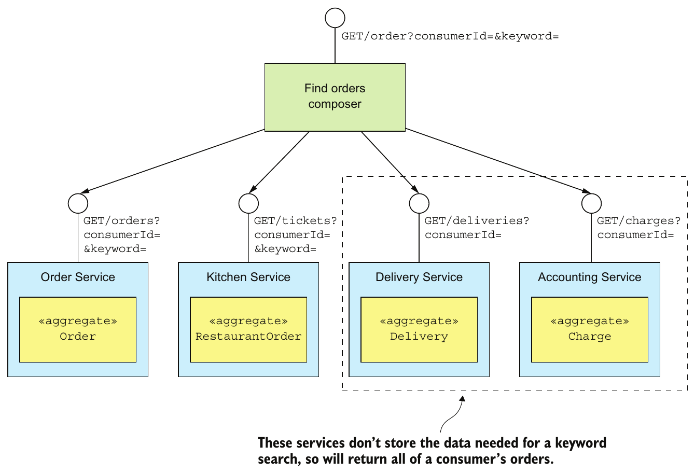

> **English:** Figure 7.7 API composition can’t efficiently retrieve a consumer’s orders, because some providers, such as Delivery Service, don’t store the attributes used for filtering.
>
> **Türkçe:** Şekil 7.7 API composition, bir tüketicinin siparişlerini verimli biçimde getiremez; çünkü Delivery Service gibi bazı sağlayıcılar, filtrelemede kullanılan nitelikleri saklamaz.

<!-- source-record: u07_0090 -->

> **English:** The drawback of this approach is that it potentially requires the API composer to retrieve and join large datasets, which is inefficient.
>
> **Türkçe:** Bu yaklaşımın dezavantajı, API composer’ın büyük veri kümelerini getirip birleştirmesini gerektirebilmesidir; bu işlem verimsizdir.

<!-- source-record: u07_0091 -->

> **English:** The other solution is for the API composer to retrieve matching orders from Order Service and Kitchen Service and then request orders from the other services by ID. But this is only practical if those services have a bulk fetch API. Requesting orders individually will likely be inefficient because of excessive network traffic.
>
> **Türkçe:** Diğer çözüm, API composer’ın Order Service ve Kitchen Service’ten eşleşen siparişleri getirmesi, ardından diğer servislerden kimlikleriyle siparişleri istemesidir. Ancak bu yaklaşım, yalnızca diğer servislerde toplu veri getirme API’si varsa pratiktir. Siparişleri tek tek istemek, fazla ağ trafiği nedeniyle büyük olasılıkla verimsiz olur.

<!-- source-record: u07_0092 -->

> **English:** Queries such as findOrderHistory() require the API composer to duplicate the functionality of an RDBMS’s query execution engine. On one hand, this potentially moves work from the less scalable database to the more scalable application. On the other hand, it’s less efficient. Also, developers should be writing business functionality, not a query execution engine.
>
> **Türkçe:** findOrderHistory() gibi sorgular, API composer’ın bir RDBMS sorgu yürütme motorunun işlevlerini yeniden gerçekleştirmesini gerektirir. Bir yandan bu yaklaşım, işi daha az ölçeklenebilir veritabanından daha fazla ölçeklenebilir uygulamaya taşıyabilir. Diğer yandan daha verimsizdir. Ayrıca geliştiricilerin sorgu yürütme motoru yerine iş işlevlerini yazmaları gerekir.

<!-- source-record: u07_0093 -->

> **English:** Next I show you how to apply the CQRS pattern and use a separate datastore, which is designed to efficiently implement the findOrderHistory() query operation. But first, let’s look at an example of a query operation that’s challenging to implement, despite being local to a single service.
>
> **Türkçe:** Birazdan CQRS örüntüsünü nasıl uygulayacağınızı ve findOrderHistory() sorgusunu verimli biçimde gerçekleştirmek üzere tasarlanmış ayrı bir veri deposunu nasıl kullanacağınızı göstereceğim. Ancak önce, tek servisin içinde kalmasına rağmen gerçekleştirilmesi zor olan bir sorguya bakalım.

<!-- source-pages: 231 -->

<!-- source-record: u07_0094 -->

#### A CHALLENGING SINGLE SERVICE QUERY: FINDAVAILABLERESTAURANTS() — Tek servisli zorlu bir sorgu: findAvailableRestaurants()

<!-- source-record: u07_0095 -->

> **English:** As you’ve just seen, implementing queries that retrieve data from multiple services can be challenging. But even queries that are local to a single service can be difficult to implement. There are a couple of reasons why this might be the case. One is because, as discussed shortly, sometimes it’s not appropriate for the service that owns the data to implement the query. The other reason is that sometimes a service’s database (or data model) doesn’t efficiently support the query.
>
> **Türkçe:** Gördüğünüz gibi birden fazla servisten veri getiren sorguları gerçekleştirmek zor olabilir. Ancak tek servisle sınırlı sorgular bile zor olabilir. Bunun birkaç nedeni vardır. Birazdan açıklanacağı gibi, bazen verinin sahibi olan servisin sorguyu gerçekleştirmesi uygun değildir. Diğer neden ise servisin veritabanının veya veri modelinin sorguyu verimli biçimde desteklememesidir.

<!-- source-record: u07_0096 -->

> **English:** Consider, for example, the findAvailableRestaurants() query operation. This query finds the restaurants that are available to deliver to a given address at a given time. The heart of this query is a geospatial (location-based) search for restaurants that are within a certain distance of the delivery address. It’s a critical part of the order process and is invoked by the UI module that displays the available restaurants.
>
> **Türkçe:** Örneğin findAvailableRestaurants() sorgusunu düşünün. Bu sorgu, belirli bir adrese belirli bir zamanda teslimat yapabilecek restoranları bulur. Sorgunun merkezinde, teslimat adresine belirli bir uzaklık içinde bulunan restoranları arayan geospatial (konum tabanlı) arama vardır. Sipariş sürecinin kritik bir parçasıdır ve uygun restoranları gösteren kullanıcı arayüzü modülü tarafından çağrılır.

<!-- source-record: u07_0097 -->

> **English:** The key challenge when implementing this query operation is performing an efficient geospatial query. How you implement the findAvailableRestaurants() query depends on the capabilities of the database that stores the restaurants. For example, it’s straightforward to implement the findAvailableRestaurants() query using either MongoDB or the Postgres and MySQL geospatial extensions. These databases support geospatial datatypes, indexes, and queries. When using one of these databases, Restaurant Service persists a Restaurant as a database record that has a location attribute. It finds the available restaurants using a geospatial query that’s optimized by a geospatial index on the location attribute.
>
> **Türkçe:** Bu sorguyu gerçekleştirmenin temel güçlüğü, verimli bir geospatial sorgu çalıştırmaktır. findAvailableRestaurants() işleminin nasıl gerçekleştirileceği, restoranları saklayan veritabanının yeteneklerine bağlıdır. Örneğin MongoDB ya da Postgres ve MySQL’in geospatial eklentileriyle bu sorguyu gerçekleştirmek kolaydır. Bu veritabanları konumsal veri türlerini, indeksleri ve sorguları destekler. Bunlardan biri kullanıldığında Restaurant Service, Restaurant’ı location niteliği bulunan bir veritabanı kaydı olarak saklar. Uygun restoranları, location niteliğindeki konumsal indeksle optimize edilen bir geospatial sorguyla bulur.

<!-- source-record: u07_0098 -->

> **English:** If the FTGO application stores restaurants in some other kind of database, implementing the findAvailableRestaurant() query is more challenging. It must maintain a replica of the restaurant data in a form that’s designed to support the geospatial query. The application could, for example, use the Geospatial Indexing Library for DynamoDB (https://github.com/awslabs/dynamodb-geo) that uses a table as a geospatial index. Alternatively, the application could store a replica of the restaurant data in an entirely different type of database, a situation very similar to using a text search database for text queries.
>
> **Türkçe:** FTGO, restoranları başka tür bir veritabanında saklıyorsa findAvailableRestaurant() sorgusunu gerçekleştirmek daha zordur. Restoran verilerinin, konumsal sorguyu desteklemek üzere tasarlanmış biçimde bir kopyasını güncel tutmalıdır. Örneğin uygulama, tabloyu konumsal indeks olarak kullanan Geospatial Indexing Library for DynamoDB kütüphanesini (https://github.com/awslabs/dynamodb-geo) kullanabilir. Alternatif olarak restoran verilerinin kopyasını tamamen farklı türde bir veritabanında saklayabilir; bu, metin sorguları için metin arama veritabanı kullanmaya çok benzer.

<!-- source-record: u07_0099 -->

> **English:** The challenge with using replicas is keeping them up-to-date whenever the original data changes. As you’ll learn below, CQRS solves the problem of synchronizing replicas.
>
> **Türkçe:** Replika kullanmanın güçlüğü, özgün veriler değiştiğinde replikaları güncel tutmaktır. Aşağıda göreceğiniz gibi CQRS, replikaları eşzamanlama sorununu çözer.

<!-- source-record: u07_0100 -->

#### THE NEED TO SEPARATE CONCERNS — Sorumlulukları ayırma ihtiyacı

<!-- source-record: u07_0101 -->

> **English:** Another reason why single service queries are challenging to implement is that sometimes the service that owns the data shouldn’t be the one that implements the query. The findAvailableRestaurants() query operation retrieves data that is owned by Restaurant Service. This service enables restaurant owners to manage their restaurant’s profile and menu items. It stores various attributes of a restaurant, including its name, address, cuisines, menu, and opening hours. Given that this service owns the data, it makes sense, at least on the surface, for it to implement this query operation. But data ownership isn’t the only factor to consider.
>
> **Türkçe:** Tek servisli sorguların zor olmasının bir başka nedeni, bazen sorguyu gerçekleştiren servisin verinin sahibi olan servis olmaması gerektiğidir. findAvailableRestaurants(), Restaurant Service’e ait verileri getirir. Bu servis, restoran sahiplerinin restoran profillerini ve menü öğelerini yönetmesini sağlar. Restoranın adı, adresi, mutfak türleri, menüsü ve açılış saatleri gibi çeşitli nitelikleri saklar. Verilere sahip olduğundan sorguyu da bu servisin gerçekleştirmesi, en azından ilk bakışta, anlamlıdır. Ancak dikkate alınacak tek etken veri sahipliği değildir.

<!-- source-pages: 232 -->

<!-- source-record: u07_0102 -->

> **English:** You must also take into account the need to separate concerns and avoid overloading services with too many responsibilities. For example, the primary responsibility of the team that develops Restaurant Service is enabling restaurant managers to maintain their restaurants. That’s quite different from implementing a high-volume, critical query. What’s more, if they were responsible for the findAvailableRestaurants() query operation, the team would constantly live in fear of deploying a change that prevented consumers from placing orders.
>
> **Türkçe:** Sorumlulukları ayırma ve servislere fazla sorumluluk yüklememe gereğini de dikkate almalısınız. Örneğin Restaurant Service’i geliştiren ekibin temel sorumluluğu, restoran yöneticilerinin restoran bilgilerini yönetebilmesini sağlamaktır. Bu, yüksek istek hacmine sahip kritik bir sorguyu gerçekleştirmekten oldukça farklıdır. Üstelik ekip findAvailableRestaurants() işleminden sorumlu olsaydı, tüketicilerin sipariş vermesini engelleyen bir değişikliği dağıtma korkusuyla sürekli yaşardı.

<!-- source-record: u07_0103 -->

> **English:** It makes sense for Restaurant Service to merely provide the restaurant data to another service that implements the findAvailableRestaurants() query operation and is most likely owned by the Order Service team. As with the findOrderHistory() query operation, and when needing to maintain geospatial index, there’s a requirement to maintain an eventually consistent replica of some data in order to implement a query. Let’s look at how to accomplish that using CQRS.
>
> **Türkçe:** Restaurant Service’in, restoran verilerini yalnızca findAvailableRestaurants() işlemini gerçekleştiren ve büyük olasılıkla Order Service ekibinin sahibi olduğu başka bir servise sağlaması anlamlıdır. findOrderHistory() işleminde ve konumsal indeks tutma ihtiyacında olduğu gibi, sorguyu gerçekleştirmek için bazı verilerin sonunda tutarlı bir replikasını güncel tutmak gerekir. Bunun CQRS ile nasıl yapılacağına bakalım.

<!-- source-record: u07_0104 -->

### 7.2.2 Overview of CQRS — CQRS'ye genel bakış

<!-- source-record: u07_0105 -->

> **English:** The examples described in section 7.2.1 highlighted three problems that are commonly encountered when implementing queries in a microservice architecture:
>
> **Türkçe:** Bölüm 7.2.1'de açıklanan örnekler, mikroservis mimarisinde sorguları uygulamakta yaygın olarak karşılaştığımız üç sorunu vurguladı:

<!-- source-record: u07_0106 -->

> **English:** • Using the API composition pattern to retrieve data scattered across multiple services results in expensive, inefficient in-memory joins.
>
> **Türkçe:** • Birden fazla servise dağılmış verileri API composition ile getirmek, maliyetli ve verimsiz bellek içi join işlemlerine yol açar.

<!-- source-record: u07_0107 -->

> **English:** • The service that owns the data stores the data in a form or in a database that doesn’t efficiently support the required query.
>
> **Türkçe:** • Verinin sahibi olan servis, verileri gerekli sorguyu verimli biçimde desteklemeyen bir biçimde veya veritabanında saklar.

<!-- source-record: u07_0108 -->

> **English:** • The need to separate concerns means that the service that owns the data isn’t the service that should implement the query operation.
>
> **Türkçe:** • Sorumlulukları ayırma gereği, verinin sahibi olan servis ile sorguyu gerçekleştirmesi gereken servisin farklı olmasını gerektirir.

<!-- source-record: u07_0109 -->

> **English:** The solution to all three of these problems is to use the CQRS pattern.
>
> **Türkçe:** Bu üç sorunun çözümü CQRS modelini kullanmaktır.

<!-- source-record: u07_0110 -->

#### CQRS SEPARATES COMMANDS FROM QUERIES — CQRS, komutları sorgulardan ayırır

<!-- source-record: u07_0111 -->

> **English:** Command Query Responsibility Segregation, as the name suggests, is all about segregation, or the separation of concerns. As figure 7.8 shows, it splits a persistent data model and the modules that use it into two parts: the command side and the query side. The command side modules and data model implement create, update, and delete operations (abbreviated CUD—for example, HTTP POSTs, PUTs, and DELETEs). The query-side modules and data model implement queries (such as HTTP GETs). The query side keeps its data model synchronized with the command-side data model by subscribing to the events published by the command side.
>
> **Türkçe:** Command Query Responsibility Segregation, adından da anlaşılacağı gibi sorumlulukların ayrılmasıyla ilgilidir. Şekil 7.8’de gösterildiği üzere kalıcı veri modelini ve onu kullanan modülleri ikiye ayırır: komut tarafı ve sorgu tarafı. Komut tarafındaki modüller ve veri modeli; oluşturma, güncelleme ve silme işlemlerini gerçekleştirir (kısaca CUD; örneğin HTTP POST, PUT ve DELETE). Sorgu tarafındaki modüller ve veri modeli ise sorguları gerçekleştirir (HTTP GET gibi). Sorgu tarafı, komut tarafının yayımladığı olaylara abone olarak kendi veri modelini komut tarafındaki veri modeliyle eşzamanlı tutar.

<!-- source-record: u07_0112 -->

> **English:** Both the non-CQRS and CQRS versions of the service have an API consisting of various CRUD operations. In a non-CQRS-based service, those operations are typically implemented by a domain model that’s mapped to a database. For performance, a few queries might bypass the domain model and access the database directly. A single persistent data model supports both commands and queries.
>
> **Türkçe:** Servisin CQRS kullanan ve kullanmayan sürümlerinin ikisinde de çeşitli CRUD işlemlerinden oluşan bir API vardır. CQRS kullanılmadığında bu işlemleri genellikle veritabanına eşlenen bir domain model gerçekleştirir. Performans için bazı sorgular domain modelini atlayıp veritabanına doğrudan erişebilir. Tek kalıcı veri modeli hem komutları hem sorguları destekler.

<!-- source-pages: 233 -->

<!-- source-record: u07_0113 -->

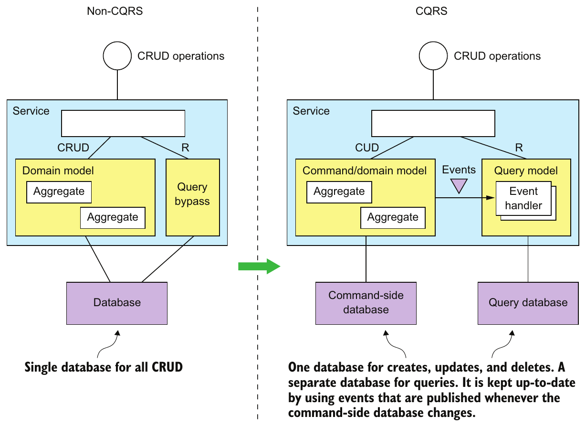

> **English:** Figure 7.8 On the left is the non-CQRS version of the service, and on the right is the CQRS version. CQRS restructures a service into command-side and query-side modules, which have separate databases.
>
> **Türkçe:** Şekil 7.8 Solda servisin CQRS kullanmayan sürümü, sağda ise CQRS kullanan sürümü bulunur. CQRS, servisi ayrı veritabanlarına sahip komut tarafı ve sorgu tarafı modülleri olarak yeniden yapılandırır.

<!-- source-record: u07_0114 -->

> **English:** In a CQRS-based service, the command-side domain model handles CRUD operations and is mapped to its own database. It may also handle simple queries, such as nonjoin, primary key-based queries. The command side publishes domain events whenever its data changes. These events might be published using a framework such as Eventuate Tram or using event sourcing.
>
> **Türkçe:** CQRS tabanlı serviste komut tarafındaki domain model, CRUD işlemlerini ele alır ve kendi veritabanına eşlenir. Join içermeyen, birincil anahtara dayalı sorgular gibi basit sorguları da ele alabilir. Komut tarafı, verileri değiştiğinde domain event’ler yayımlar. Bu olaylar Eventuate Tram gibi bir framework veya event sourcing kullanılarak yayımlanabilir.

<!-- source-record: u07_0115 -->

> **English:** A separate query model handles the nontrivial queries. It’s much simpler than the command side because it’s not responsible for implementing the business rules. The query side uses whatever kind of database makes sense for the queries that it must support. The query side has event handlers that subscribe to domain events and update the database or databases. There may even be multiple query models, one for each type of query.
>
> **Türkçe:** Basit olmayan sorguları ayrı bir sorgu modeli ele alır. İş kurallarını gerçekleştirmekten sorumlu olmadığından komut tarafından çok daha basittir. Sorgu tarafı, desteklemesi gereken sorgular için uygun olan veritabanı türünü kullanır. Domain event’lere abone olan ve veritabanını veya veritabanlarını güncelleyen olay işleyicileri içerir. Hatta her sorgu türü için ayrı olmak üzere birden fazla sorgu modeli bulunabilir.

<!-- source-record: u07_0116 -->

#### CQRS AND QUERY-ONLY SERVICES — CQRS ve yalnızca sorgulama yapan servisler

<!-- source-record: u07_0117 -->

> **English:** Not only can CQRS be applied within a service, but you can also use this pattern to define query services. A query service has an API consisting of only query operations—no command operations. It implements the query operations by querying a database that it keeps up-to-date by subscribing to events published by one or more other services. A query-side service is a good way to implement a view that’s built by subscribing to events published by multiple services. This kind of view doesn’t belong to any particular service, so it makes sense to implement it as a standalone service. A good example of such a service is Order History Service, which is a query service that implements the findOrderHistory() query operation. As figure 7.9 shows, this service subscribes to events published by several services, including Order Service, Delivery Service, and so on.
>
> **Türkçe:** CQRS yalnızca servis içinde uygulanmaz; sorgu servislerini tanımlamak için de kullanılabilir. Sorgu servisinin API’si yalnızca sorgu işlemlerinden oluşur; komut işlemi içermez. Bir veya daha fazla başka servisin yayımladığı olaylara abone olarak güncel tuttuğu veritabanını sorgular. Birden fazla servisin olaylarına abone olunarak oluşturulan bir görünüm için sorgu tarafı servisi iyi bir çözümdür. Bu görünüm belirli bir servise ait olmadığından bağımsız servis olarak gerçekleştirilmesi anlamlıdır. findOrderHistory() işlemini gerçekleştiren Order History Service buna iyi bir örnektir. Şekil 7.9’da gösterildiği gibi Order Service ve Delivery Service dâhil çeşitli servislerin yayımladığı olaylara abone olur.

<!-- source-pages: 234 -->

<!-- source-record: u07_0118 -->

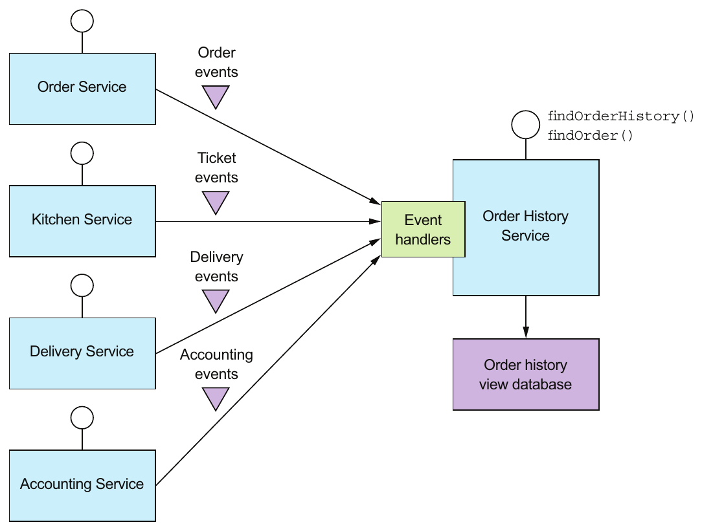

> **English:** Figure 7.9 The design of Order History Service, which is a query-side service. It implements the findOrderHistory() query operation by querying a database, which it maintains by subscribing to events published by multiple other services.
>
> **Türkçe:** Şekil 7.9 Sorgu tarafındaki bir servis olan Order History Service’in tasarımı. findOrderHistory() sorgu işlemini, başka servislerin yayımladığı olaylara abone olarak güncel tuttuğu veritabanını sorgulayarak gerçekleştirir.

<!-- source-record: u07_0119 -->

> **English:** Order History Service has event handlers that subscribe to events published by several services and update the Order History View Database. I describe the implementation of this service in more detail in section 7.4.
>
> **Türkçe:** Order History Service, çeşitli servislerin yayımladığı olaylara abone olan ve Order History View Database’i güncelleyen olay işleyicileri içerir. Bu servisin gerçekleştirimini 7.4. kısımda daha ayrıntılı anlatıyorum.

<!-- source-record: u07_0120 -->

> **English:** A query service is also a good way to implement a view that replicates data owned by a single service yet because of the need to separate concerns isn’t part of that service. For example, the FTGO developers can define an Available Restaurants Service, which implements the findAvailableRestaurants() query operation described earlier. It subscribes to events published by Restaurant Service and updates a database designed for efficient geospatial queries.
>
> **Türkçe:** Sorgu servisi; tek servise ait verileri çoğaltan, ancak sorumlulukları ayırma gereği nedeniyle o servisin parçası olmayan bir görünüm için de iyi bir çözümdür. Örneğin FTGO geliştiricileri, daha önce anlatılan findAvailableRestaurants() işlemini gerçekleştiren Available Restaurants Service’i tanımlayabilir. Bu servis, Restaurant Service’in yayımladığı olaylara abone olur ve verimli konumsal sorgular için tasarlanmış veritabanını günceller.

<!-- source-record: u07_0121 -->

> **English:** In many ways, CQRS is an event-based generalization of the popular approach of using RDBMS as the system of record and a text search engine, such as Elasticsearch, to handle text queries. What’s different is that CQRS uses a broader range of database types—not just a text search engine. Also, CQRS query-side views are updated in near real time by subscribing to events.
>
> **Türkçe:** CQRS birçok açıdan, RDBMS’yi asıl kayıt sistemi olarak ve Elasticsearch gibi bir metin arama motorunu metin sorguları için kullanan yaygın yaklaşımın olay tabanlı genelleştirilmiş hâlidir. Farkı, yalnızca metin arama motoruyla sınırlı kalmayıp daha geniş veritabanı türleri kullanmasıdır. Ayrıca CQRS’nin sorgu tarafı görünümleri, olaylara abone olunarak gerçek zamana yakın biçimde güncellenir.

<!-- source-pages: 235 -->

<!-- source-record: u07_0122 -->

> **English:** Let’s now look at the benefits and drawbacks of CQRS.
>
> **Türkçe:** Şimdi CQRS'in avantajlarına ve dezavantajlarına bakalım.

<!-- source-record: u07_0123 -->

### 7.2.3 The benefits of CQRS — CQRS'nin yararları

<!-- source-record: u07_0124 -->

> **English:** CQRS has both benefits and drawbacks. The benefits are as follows:
>
> **Türkçe:** CQRS'nin hem avantajları hem de dezavantajları vardır. Faydaları şunlardır:

<!-- source-record: u07_0125 -->

> **English:** • Enables the efficient implementation of queries in a microservice architecture
>
> **Türkçe:** - Mikroservis mimarisinde sorguların verimli bir şekilde uygulanmasını sağlar

<!-- source-record: u07_0126 -->

> **English:** • Enables the efficient implementation of diverse queries
>
> **Türkçe:** • Farklı türde sorguların verimli biçimde gerçekleştirilmesini sağlar

<!-- source-record: u07_0127 -->

> **English:** • Makes querying possible in an event sourcing-based application
>
> **Türkçe:** - event sourcing (olay kaynaklı durum yönetimi) tabanlı bir uygulamada sorgulamayı mümkün kılar

<!-- source-record: u07_0128 -->

> **English:** • Improves separation of concerns
>
> **Türkçe:** • Sorumlulukların daha iyi ayrılmasını sağlar

<!-- source-record: u07_0129 -->

#### ENABLES THE EFFICIENT IMPLEMENTATION OF QUERIES IN A MICROSERVICE ARCHITECTURE — Mikroservis mimarisinde sorguların verimli gerçekleştirilmesini sağlar

<!-- source-record: u07_0130 -->

> **English:** One benefit of the CQRS pattern is that it efficiently implements queries that retrieve data owned by multiple services. As described earlier, using the API composition pattern to implement queries sometimes results in expensive, inefficient in-memory joins of large datasets. For those queries, it’s more efficient to use an easily queried CQRS view that pre-joins the data from two or more services.
>
> **Türkçe:** CQRS’nin bir yararı, birden fazla servise ait verileri getiren sorguları verimli biçimde gerçekleştirmesidir. Daha önce açıklandığı gibi API composition bazen büyük veri kümeleri üzerinde maliyetli, verimsiz bellek içi join işlemleri gerektirir. Böyle sorgular için iki veya daha fazla servisin verilerini önceden birleştiren, kolay sorgulanabilir bir CQRS görünümü kullanmak daha verimlidir.

<!-- source-record: u07_0131 -->

#### ENABLES THE EFFICIENT IMPLEMENTATION OF DIVERSE QUERIES — Farklı türdeki sorguların verimli gerçekleştirilmesini sağlar

<!-- source-record: u07_0132 -->

> **English:** Another benefit of CQRS is that it enables an application or service to efficiently implement a diverse set of queries. Attempting to support all queries using a single persistent data model is often challenging and in some cases impossible. Some NoSQL databases have very limited querying capabilities. Even when a database has extensions to support a particular kind of query, using a specialized database is often more efficient. The CQRS pattern avoids the limitations of a single datastore by defining one or more views, each of which efficiently implements specific queries.
>
> **Türkçe:** CQRS’nin başka bir yararı, uygulama veya servisin farklı türde sorguları verimli biçimde gerçekleştirmesini sağlamasıdır. Bütün sorguları tek kalıcı veri modeliyle desteklemek çoğunlukla zor, bazen imkânsızdır. Bazı NoSQL veritabanlarının sorgulama yetenekleri çok sınırlıdır. Veritabanı belirli sorgu türünü destekleyen eklentilere sahip olsa bile özelleşmiş bir veritabanı kullanmak çoğu zaman daha verimlidir. CQRS, her biri belirli sorguları verimli biçimde gerçekleştiren bir veya daha fazla görünüm tanımlayarak tek veri deposunun sınırlamalarını aşar.

<!-- source-record: u07_0133 -->

#### ENABLES QUERYING IN AN EVENT SOURCING-BASED APPLICATION — Event sourcing kullanan uygulamada sorgulamayı mümkün kılar

<!-- source-record: u07_0134 -->

> **English:** CQRS also overcomes a major limitation of event sourcing. An event store only supports primary key-based queries. The CQRS pattern addresses this limitation by defining one or more views of the aggregates, which are kept up-to-date, by subscribing to the streams of events that are published by the event sourcing-based aggregates. As a result, an event sourcing-based application invariably uses CQRS.
>
> **Türkçe:** CQRS, event sourcing’in önemli bir sınırlamasını da aşar. Event store yalnızca birincil anahtara dayalı sorguları destekler. CQRS, event sourcing tabanlı aggregate’lerin yayımladığı olay akışlarına abone olarak güncel tutulan bir veya daha fazla aggregate görünümü tanımlar. Böylece bu sınırlamayı giderir. Sonuç olarak event sourcing tabanlı uygulama, her zaman CQRS kullanır.

<!-- source-record: u07_0135 -->

#### IMPROVES SEPARATION OF CONCERNS — Sorumlulukların ayrılmasını iyileştirir

<!-- source-record: u07_0136 -->

> **English:** Another benefit of CQRS is that it separates concerns. A domain model and its corresponding persistent data model don’t handle both commands and queries. The CQRS pattern defines separate code modules and database schemas for the command and query sides of a service. By separating concerns, the command side and query side are likely to be simpler and easier to maintain.
>
> **Türkçe:** CQRS’nin diğer yararı, sorumlulukları ayırmasıdır. Domain model ile ona karşılık gelen kalıcı veri modeli, hem komutları hem sorguları birlikte ele almaz. CQRS, servisin komut ve sorgu tarafları için ayrı kod modülleri ve veritabanı şemaları tanımlar. Sorumluluklar ayrıldığında her iki tarafın da daha basit ve bakımının daha kolay olması beklenir.

<!-- source-record: u07_0137 -->

> **English:** Moreover, CQRS enables the service that implements a query to be different than the service that owns the data. For example, earlier I described how even though Restaurant Service owns the data that’s queried by the findAvailableRestaurants query operation, it makes sense for another service to implement such a critical, high-volume query. A CQRS query service maintains a view by subscribing to the events published by the service or services that own the data.
>
> **Türkçe:** Ayrıca CQRS, sorguyu gerçekleştiren servisin verinin sahibi olan servisten farklı olmasını sağlar. Örneğin Restaurant Service, findAvailableRestaurants işleminin sorguladığı verilere sahip olsa da bu kadar kritik ve yüksek hacimli sorguyu başka servisin gerçekleştirmesinin anlamlı olduğunu daha önce açıklamıştım. CQRS sorgu servisi, verinin sahibi olan servislerin yayımladığı olaylara abone olarak bir görünümü güncel tutar.

<!-- source-pages: 236 -->

<!-- source-record: u07_0138 -->

### 7.2.4 The drawbacks of CQRS — CQRS'nin dezavantajları

<!-- source-record: u07_0139 -->

> **English:** Even though CQRS has several benefits, it also has significant drawbacks:
>
> **Türkçe:** CQRS'in birkaç avantajı olmasına rağmen önemli dezavantajları da vardır:

<!-- source-record: u07_0140 -->

> **English:** • More complex architecture
>
> **Türkçe:** • Daha karmaşık mimari

<!-- source-record: u07_0141 -->

> **English:** • Dealing with the replication lag
>
> **Türkçe:** - Replikasyon gecikmesi ile uğraşmak

<!-- source-record: u07_0142 -->

> **English:** Let’s look at these drawbacks, starting with the increased complexity.
>
> **Türkçe:** Artan karmaşıklıktan başlayarak bu dezavantajlara bakalım.

<!-- source-record: u07_0143 -->

#### MORE COMPLEX ARCHITECTURE — Daha karmaşık mimari

<!-- source-record: u07_0144 -->

> **English:** One drawback of CQRS is that it adds complexity. Developers must write the query-side services that update and query the views. There is also the extra operational complexity of managing and operating the extra datastores. What’s more, an application might use different types of databases, which adds further complexity for both developers and operations.
>
> **Türkçe:** CQRS’nin bir dezavantajı, karmaşıklığı artırmasıdır. Geliştiriciler, görünümleri güncelleyen ve sorgulayan sorgu tarafı servislerini yazmalıdır. Ek veri depolarının yönetilmesi ve işletilmesi de ek operasyonel karmaşıklık yaratır. Üstelik uygulama farklı veritabanı türleri kullanabilir; bu da hem geliştiriciler hem operasyon ekipleri için karmaşıklığı daha da artırır.

<!-- source-record: u07_0145 -->

#### DEALING WITH THE REPLICATION LAG — Replication lag (çoğaltma gecikmesi) ile başa çıkmak

<!-- source-record: u07_0146 -->

> **English:** Another drawback of CQRS is dealing with the “lag” between the command-side and the query-side views. As you might expect, there’s delay between when the command side publishes an event and when that event is processed by the query side and the view updated. A client application that updates an aggregate and then immediately queries a view may see the previous version of the aggregate. It must often be written in a way that avoids exposing these potential inconsistencies to the user.
>
> **Türkçe:** CQRS’nin bir başka dezavantajı, komut tarafı ile sorgu tarafı görünümleri arasındaki gecikmeyi ele alma gereğidir. Bekleneceği gibi, komut tarafının olayı yayımlamasıyla sorgu tarafının olayı işleyip görünümü güncellemesi arasında gecikme vardır. Aggregate’i güncelledikten hemen sonra görünümü sorgulayan istemci uygulaması, aggregate’in önceki sürümünü görebilir. Çoğunlukla bu olası tutarsızlıkları kullanıcıya göstermeyecek biçimde yazılmalıdır.

<!-- source-record: u07_0147 -->

> **English:** One solution is for the command-side and query-side APIs to supply the client with version information that enables it to tell that the query side is out-of-date. A client can poll the query-side view until it’s up-to-date. Shortly I’ll discuss how the service APIs can enable a client to do this.
>
> **Türkçe:** Bir çözüm, komut ve sorgu tarafı API’lerinin istemciye, sorgu tarafının güncelliğini yitirdiğini anlayabileceği sürüm bilgileri sağlamasıdır. İstemci, görünüm güncel hâle gelene kadar sorgu tarafını düzenli aralıklarla sorgulayabilir. Servis API’lerinin bunu nasıl mümkün kılacağını birazdan açıklayacağım.

<!-- source-record: u07_0148 -->

> **English:** A UI application such as a native mobile application or single page JavaScript application can handle replication lag by updating its local model once the command is successful without issuing a query. It can, for example, update its model using data returned by the command. Hopefully, when a user action triggers a query, the view will be up-to-date. One drawback of this approach is that the UI code may need to duplicate server-side code in order to update its model.
>
> **Türkçe:** Native mobil uygulama veya tek sayfalı JavaScript uygulaması gibi bir kullanıcı arayüzü uygulaması, komut başarılı olduktan sonra sorgu göndermeden yerel modelini güncelleyerek çoğaltma gecikmesini ele alabilir. Örneğin komutun döndürdüğü verilerle modelini güncelleyebilir. Kullanıcı eylemi bir sorguyu tetiklediğinde görünümün güncellenmiş olması umulur. Bu yaklaşımın dezavantajı, arayüz kodunun modelini güncellemek için sunucu tarafındaki kodu yeniden gerçekleştirmesi gerekebilmesidir.

<!-- source-record: u07_0149 -->

> **English:** As you can see, CQRS has both benefits and drawbacks. As mentioned earlier, you should use the API composition whenever possible and use CQRS only when you must.
>
> **Türkçe:** Gördüğünüz gibi, CQRS hem avantajları hem de dezavantajları vardır. Daha önce belirtildiği gibi, mümkün olduğunca API kompozisyonunu kullanmalısınız ve CQRS'i yalnızca gerektiğinde kullanmalısınız.

<!-- source-record: u07_0150 -->

> **English:** Now that you’ve seen the benefits and drawbacks of CQRS, let’s now look at how to design CQRS views.
>
> **Türkçe:** Şimdi CQRS'in avantajlarını ve dezavantajlarını gördükten sonra, şimdi CQRS görünümlerini nasıl tasarlayacağımıza bakalım.

<!-- source-record: u07_0151 -->

## 7.3 Designing CQRS views — CQRS görünümlerini tasarlamak

<!-- source-record: u07_0152 -->

> **English:** A CQRS view module has an API consisting of one more query operations. It implements these query operations by querying a database that it maintains by subscribing to events published by one or more services. As figure 7.10 shows, a view module consists of a view database and three submodules.
>
> **Türkçe:** CQRS görünüm modülü, bir veya daha fazla sorgu işleminden oluşan API’ye sahiptir. Bir veya daha fazla servisin yayımladığı olaylara abone olarak güncel tuttuğu veritabanını sorgulayarak bu işlemleri gerçekleştirir. Şekil 7.10’da gösterildiği gibi görünüm modülü, bir görünüm veritabanı ile üç alt modülden oluşur.

<!-- source-pages: 237 -->

<!-- source-record: u07_0153 -->

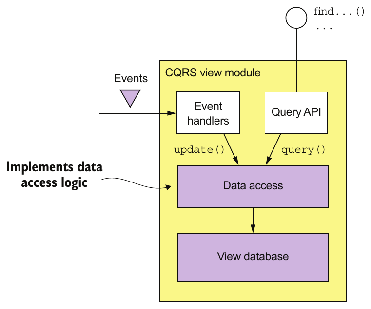

> **English:** Figure 7.10 The design of a CQRS view module. Event handlers update the view database, which is queried by the Query API module.
>
> **Türkçe:** Şekil 7.10 Bir CQRS görünüm modülünün tasarımı. Olay işleyicileri, Query API modülünün sorguladığı görünüm veritabanını günceller.

<!-- source-record: u07_0154 -->

> **English:** The data access module implements the database access logic. The event handlers and query API modules use the data access module to update and query the database. The event handlers module subscribes to events and updates the database. The query API module implements the query API.
>
> **Türkçe:** Veri erişim modülü, veritabanına erişim mantığını gerçekleştirir. Olay işleyicileri ve sorgu API’si modülleri, veritabanını güncellemek ve sorgulamak için veri erişim modülünü kullanır. Olay işleyicileri modülü, olaylara abone olup veritabanını günceller. Sorgu API’si modülü ise sorgu API’sini gerçekleştirir.

<!-- source-record: u07_0155 -->

> **English:** You must make some important design decisions when developing a view module:
>
> **Türkçe:** Görünüm modülü geliştirirken bazı önemli tasarım kararları almanız gerekir:

<!-- source-record: u07_0156 -->

> **English:** • You must choose a database and design the schema.
>
> **Türkçe:** - Veritabanı seçip şemayı tasarlamalısın.

<!-- source-record: u07_0157 -->

> **English:** • When designing the data access module, you must address various issues, including ensuring that updates are idempotent and handling concurrent updates.
>
> **Türkçe:** • Veri erişim modülünü tasarlarken güncellemelerin idempotent olmasını sağlamak ve eşzamanlı güncellemeleri ele almak dâhil çeşitli konuları çözmelisiniz.

<!-- source-record: u07_0158 -->

> **English:** • When implementing a new view in an existing application or changing the schema of an existing application, you must implement a mechanism to efficiently build or rebuild the view.
>
> **Türkçe:** - Mevcut bir uygulamada yeni bir görünüm uygulandığında veya mevcut bir uygulamanın şeması değiştirildiğinde, görünümün verimli bir şekilde oluşturulması veya yeniden oluşturulması için bir mekanizma uygulamanız gerekir.

<!-- source-record: u07_0159 -->

> **English:** • You must decide how to enable a client of the view to cope with the replication lag, described earlier.
>
> **Türkçe:** • Görünümün istemcisinin, daha önce açıklanan çoğaltma gecikmesiyle nasıl başa çıkabileceğine karar vermelisiniz.

<!-- source-record: u07_0160 -->

> **English:** Let’s look at each of these issues.
>
> **Türkçe:** Bu sorunların her birine bakalım.

<!-- source-record: u07_0161 -->

### 7.3.1 Choosing a view datastore — Görünüm için veri deposu seçmek

<!-- source-record: u07_0162 -->

> **English:** A key design decision is the choice of database and the design of the schema. The primary purpose of the database and the data model is to efficiently implement the view module’s query operations. It’s the characteristics of those queries that are the primary consideration when selecting a database. But the database must also efficiently implement the update operations performed by the event handlers.
>
> **Türkçe:** Veritabanı seçimi ve şema tasarımı, temel tasarım kararlarındandır. Veritabanı ile veri modelinin asıl amacı, görünüm modülünün sorgularını verimli biçimde gerçekleştirmektir. Veritabanı seçiminde öncelikle bu sorguların özellikleri dikkate alınır. Ancak veritabanı, olay işleyicilerinin yaptığı güncellemeleri de verimli biçimde gerçekleştirmelidir.

<!-- source-record: u07_0163 -->

#### SQL VS. NOSQL DATABASES — SQL ve NoSQL veritabanlarının karşılaştırılması

<!-- source-record: u07_0164 -->

> **English:** Not that long ago, there was one type of database to rule them all: the SQL-based RDBMS. As the Web grew in popularity, though, various companies discovered that an RDBMS couldn’t satisfy their web scale requirements. That led to the creation of the so-called NoSQL databases. A NoSQL database typically has a limited form of transactions and less general querying capabilities. For certain use cases, these databases have certain advantages over SQL databases, including a more flexible data model and better performance and scalability.
>
> **Türkçe:** Çok da uzun zaman önce değil, bütün alanlara hükmeden tek veritabanı türü vardı: SQL tabanlı RDBMS. Ancak Web yaygınlaştıkça çeşitli şirketler, RDBMS’nin web ölçeğindeki gereksinimlerini karşılayamadığını gördü. Bu durum, NoSQL denen veritabanlarının ortaya çıkmasına yol açtı. NoSQL veritabanlarının transaction desteği genellikle sınırlıdır ve sorgulama yetenekleri daha az geneldir. Belirli kullanım senaryolarında SQL veritabanlarına kıyasla daha esnek veri modeli, daha iyi performans ve ölçeklenebilirlik gibi avantajları bulunur.

<!-- source-pages: 238 -->

<!-- source-record: u07_0165 -->

> **English:** A NoSQL database is often a good choice for a CQRS view, which can leverage its strengths and ignore its weaknesses. A CQRS view benefits from the richer data model, and performance of a NoSQL database. It’s unaffected by the limitations of a NoSQL database, because it only uses simple transactions and executes a fixed set of queries.
>
> **Türkçe:** CQRS görünümü, NoSQL veritabanının güçlü yönlerinden yararlanıp zayıf yönlerinden etkilenmeyebildiği için NoSQL çoğunlukla iyi bir seçimdir. Görünüm, NoSQL’in daha zengin veri modelinden ve performansından yararlanır. Yalnızca basit transaction’lar ve belirli bir sorgu kümesi kullandığından NoSQL veritabanının sınırlamalarından etkilenmez.

<!-- source-record: u07_0166 -->

> **English:** Having said that, sometimes it makes sense to implement a CQRS view using a SQL database. A modern RDBMS running on modern hardware has excellent performance. Developers, database administrators, and IT operations are, in general, much more familiar with SQL databases than they are with NoSQL databases. As mentioned earlier, SQL databases often have extensions for non-relational features, such as geospatial datatypes and queries. Also, a CQRS view might need to use a SQL database in order to support a reporting engine.
>
> **Türkçe:** Bununla birlikte bazen CQRS görünümünü SQL veritabanıyla gerçekleştirmek anlamlıdır. Modern donanım üzerinde çalışan modern bir RDBMS çok iyi performans gösterir. Geliştiriciler, veritabanı yöneticileri ve BT operasyon ekipleri genel olarak SQL veritabanlarına NoSQL’den çok daha aşinadır. Daha önce belirtildiği gibi SQL veritabanları, konumsal veri türleri ve sorgular gibi ilişkisel olmayan özellikler için çoğunlukla eklentiler sunar. Ayrıca CQRS görünümünün bir raporlama motorunu desteklemek için SQL veritabanı kullanması gerekebilir.

<!-- source-record: u07_0167 -->

> **English:** As you can see in table 7.1, there are lots of different options to choose from. And to make the choice even more complicated, the differences between the different types of database are starting to blur. For example, MySQL, which is an RDBMS, has excellent support for JSON, which is one of the strengths of MongoDB, a JSON-style document-oriented database.
>
> **Türkçe:** Tablo 7.1’de görüldüğü gibi birçok seçenek vardır. Üstelik farklı veritabanı türleri arasındaki sınırların belirsizleşmesi seçimi daha da zorlaştırır. Örneğin bir RDBMS olan MySQL, JSON biçimli belgelerle çalışan MongoDB’nin güçlü yanlarından biri olan JSON için çok iyi destek sağlar.

<!-- source-record: u07_0168 -->

> **English:** Table 7.1 Query-side view stores
>
> **Türkçe:** Tablo 7.1 Sorgu tarafı görüntüleme depoları

| **EN:** If you need<br/>**TR:** İhtiyacın olursa | **EN:** Use<br/>**TR:** Kullanım | **EN:** Example<br/>**TR:** Örnek |
| --- | --- | --- |
| **EN:** PK-based lookup of JSON objects<br/>**TR:** JSON nesneleri için PK tabanlı arama | **EN:** A document store such as MongoDB or DynamoDB, or a key value store such as Redis<br/>**TR:** MongoDB veya DynamoDB gibi bir belge deposu veya Redis gibi bir anahtar değer deposu | **EN:** Implement order history by maintaining a MongoDB document containing the per-customer.<br/>**TR:** Müşteriye göre bir MongoDB belgesini tutarak sipariş geçmişini uygulayın. |
| **EN:** Query-based lookup of JSON objects<br/>**TR:** JSON nesnelerinin sorgu tabanlı arama | **EN:** A document store such as MongoDB or DynamoDB<br/>**TR:** MongoDB veya DynamoDB gibi bir belge depolaması | **EN:** Implement customer view using MongoDB or DynamoDB.<br/>**TR:** MongoDB veya DynamoDB kullanarak müşteri görünümünü uygulayın. |
| **EN:** Text queries<br/>**TR:** Metin sorguları | **EN:** A text search engine such as Elasticsearch<br/>**TR:** Elasticsearch gibi bir metin arama motoru | **EN:** Implement text search for orders by maintaining a per-order Elasticsearch document.<br/>**TR:** Siparişler için metin aramasını, sipariş başına Elasticsearch belgesini tutarak uygulayın. |
| **EN:** Graph queries<br/>**TR:** Grafik sorguları | **EN:** A graph database such as Neo4j<br/>**TR:** Neo4j gibi bir grafik veritabanı | **EN:** Implement fraud detection by maintaining a graph of customers, orders, and other data.<br/>**TR:** Müşterilerin, siparişlerin ve diğer verilerin bir grafiği ile dolandırıcılık tespitini uygulayın. |
| **EN:** Traditional SQL reporting/BI<br/>**TR:** Geleneksel SQL raporlama/BI | **EN:** An RDBMS<br/>**TR:** Bir RDBMS | **EN:** Standard business reports and analytics.<br/>**TR:** Standart iş raporları ve analizleri. |

<!-- source-record: u07_0169 -->

> **English:** Now that I’ve discussed the different kinds of databases you can use to implement a CQRS view, let’s look at the problem of how to efficiently update a view.
>
> **Türkçe:** Şimdi CQRS görünümünü uygulamak için kullanabileceğiniz farklı tür veritabanlarını tartıştıktan sonra, bir görünümü nasıl verimli bir şekilde güncelleyeceğimize bakalım.

<!-- source-record: u07_0170 -->

#### SUPPORTING UPDATE OPERATIONS — Güncelleme işlemlerini desteklemek

<!-- source-record: u07_0171 -->

> **English:** Besides efficiently implementing queries, the view data model must also efficiently implement the update operations executed by the event handlers. Usually, an event handler will update or delete a record in the view database using its primary key. For example, soon I’ll describe the design of a CQRS view for the findOrderHistory() query. It stores each Order as a database record using the orderId as the primary key. When this view receives an event from Order Service, it can straightforwardly update the corresponding record.
>
> **Türkçe:** Görünümün veri modeli, sorguların yanı sıra olay işleyicilerinin yaptığı güncellemeleri de verimli biçimde desteklemelidir. Olay işleyicisi genellikle görünüm veritabanındaki kaydı birincil anahtarıyla günceller veya siler. Örneğin birazdan findOrderHistory() için bir CQRS görünümü tasarlayacağız. Bu görünüm, her Order’ı orderId birincil anahtarını kullanarak veritabanı kaydı olarak saklar. Order Service’ten olay aldığında ilgili kaydı kolayca güncelleyebilir.

<!-- source-pages: 239 -->

<!-- source-record: u07_0172 -->

> **English:** Sometimes, though, it will need to update or delete a record using the equivalent of a foreign key. Consider, for instance, the event handlers for Delivery* events. If there is a one-to-one correspondence between a Delivery and an Order, then Delivery.id might be the same as Order.id. If it is, then Delivery* event handlers can easily update the order’s database record.
>
> **Türkçe:** Ancak bazen kaydı güncellemek veya silmek için yabancı anahtara karşılık gelen bir değer kullanması gerekir. Örneğin Delivery* olaylarının işleyicilerini düşünün. Delivery ile Order arasında bire bir eşleşme varsa Delivery.id, Order.id ile aynı olabilir. Bu durumda Delivery* olay işleyicileri, siparişin veritabanı kaydını kolayca güncelleyebilir.

<!-- source-record: u07_0173 -->

> **English:** But suppose a Delivery has its own primary key or there is a one-to-many relationship between an Order and a Delivery. Some Delivery* events, such as the DeliveryCreated event, will contain the orderId. But other events, such as a DeliveryPickedUp event, might not. In this scenario, an event handler for DeliveryPickedUp will need to update the order’s record using the deliveryId as the equivalent of a foreign key.
>
> **Türkçe:** Ancak Delivery’nin kendi birincil anahtarı olduğunu veya Order ile Delivery arasında bire çok ilişki bulunduğunu varsayın. DeliveryCreated gibi bazı Delivery* olayları orderId içerir. DeliveryPickedUp gibi diğer olaylar ise içermeyebilir. Böyle bir durumda DeliveryPickedUp işleyicisi, sipariş kaydını deliveryId’yi yabancı anahtar gibi kullanarak güncellemelidir.

<!-- source-record: u07_0174 -->

> **English:** Some types of database efficiently support foreign-key-based update operations. For example, if you’re using an RDBMS or MongoDB, you create an index on the necessary columns. However, non-primary key-based updates are not straightforward when using other NOSQL databases. The application will need to maintain some kind of database-specific mapping from a foreign key to a primary key in order to determine which record to update. For example, an application that uses DynamoDB, which only supports primary key-based updates and deletes, must first query a DynamoDB secondary index (discussed shortly) to determine the primary keys of the items to update or delete.
>
> **Türkçe:** Bazı veritabanı türleri, yabancı anahtara dayalı güncellemeleri verimli biçimde destekler. Örneğin RDBMS veya MongoDB kullanıyorsanız gerekli sütunlarda indeks oluşturursunuz. Ancak diğer NoSQL veritabanlarında birincil anahtara dayanmayan güncellemeler kolay değildir. Uygulama, hangi kaydı güncelleyeceğini belirlemek için yabancı anahtardan birincil anahtara veritabanına özgü bir eşleme tutmalıdır. Örneğin yalnızca birincil anahtarla güncelleme ve silmeyi destekleyen DynamoDB’yi kullanan uygulama, güncellenecek veya silinecek öğelerin birincil anahtarlarını belirlemek için önce birazdan açıklanacak bir DynamoDB ikincil indeksini sorgulamalıdır.

<!-- source-record: u07_0175 -->

### 7.3.2 Data access module design — Veri erişim modülü tasarımı

<!-- source-record: u07_0176 -->

> **English:** The event handlers and the query API module don’t access the datastore directly. Instead they use the data access module, which consists of a data access object (DAO) and its helper classes. The DAO has several responsibilities. It implements the update operations invoked by the event handlers and the query operations invoked by the query module. The DAO maps between the data types used by the higher-level code and the database API. It also must handle concurrent updates and ensure that updates are idempotent.
>
> **Türkçe:** Olay işleyicileri ile sorgu API’si modülü, veri deposuna doğrudan erişmez. Veri erişim nesnesi (DAO) ve yardımcı sınıflarından oluşan veri erişim modülünü kullanırlar. DAO’nun birkaç sorumluluğu vardır. Olay işleyicilerinin çağırdığı güncelleme işlemleriyle sorgu modülünün çağırdığı sorgu işlemlerini gerçekleştirir. Üst düzey kodun ve veritabanı API’sinin kullandığı veri türleri arasında dönüşüm yapar. Ayrıca eşzamanlı güncellemeleri ele almalı ve güncellemelerin idempotent olmasını sağlamalıdır.

<!-- source-record: u07_0177 -->

> **English:** Let’s look at these issues, starting with how to handle concurrent updates.
>
> **Türkçe:** Bu sorunlara bakalım, aynı anda güncellemeleri nasıl ele alacağımızdan başlayalım.

<!-- source-record: u07_0178 -->

#### HANDLING CONCURRENCY — Concurrency (eşzamanlılık) yönetimi

<!-- source-record: u07_0179 -->

> **English:** Sometimes a DAO must handle the possibility of multiple concurrent updates to the same database record. If a view subscribes to events published by a single aggregate type, there won’t be any concurrency issues. That’s because events published by a particular aggregate instance are processed sequentially. As a result, a record corresponding to an aggregate instance won’t be updated concurrently. But if a view subscribes to events published by multiple aggregate types, then it’s possible that multiple events handlers update the same record simultaneously.
>
> **Türkçe:** Bazen DAO, aynı veritabanı kaydının eşzamanlı olarak birden fazla kez güncellenmesi ihtimalini ele almalıdır. Görünüm tek aggregate türünün olaylarına aboneyse eşzamanlılık sorunu olmaz. Çünkü belirli bir aggregate instance’ının yayımladığı olaylar sırayla işlenir. Dolayısıyla o instance’a karşılık gelen kayıt eşzamanlı güncellenmez. Ancak görünüm birden fazla aggregate türünün olaylarına aboneyse birden fazla olay işleyicisi aynı kaydı aynı anda güncelleyebilir.

<!-- source-pages: 240 -->

<!-- source-record: u07_0180 -->

> **English:** For example, an event handler for an Order* event might be invoked at the same time as an event handler for a Delivery* event for the same order. Both event handlers then simultaneously invoke the DAO to update the database record for that Order. A DAO must be written in a way that ensures that this situation is handled correctly. It must not allow one update to overwrite another. If a DAO implements updates by reading a record and then writing the updated record, it must use either pessimistic or optimistic locking. In the next section you’ll see an example of a DAO that handles concurrent updates by updating database records without reading them first.
>
> **Türkçe:** Örneğin aynı siparişin Order* ve Delivery* olaylarının işleyicileri aynı anda çağrılabilir. İkisi de o Order’ın veritabanı kaydını güncellemek için DAO’yu eşzamanlı çağırır. DAO, bu durumu doğru ele alacak biçimde yazılmalıdır. Bir güncellemenin diğerinin üzerine yazmasına izin vermemelidir. DAO, önce kaydı okuyup sonra güncellenmiş kaydı yazarak çalışıyorsa kötümser veya iyimser kilitleme kullanmalıdır. Sonraki kısımda, veritabanı kayıtlarını önceden okumadan güncelleyerek eşzamanlı güncellemeleri ele alan bir DAO örneği göreceksiniz.

<!-- source-record: u07_0181 -->

#### IDEMPOTENT EVENT HANDLERS — Idempotent event handler'lar

<!-- source-record: u07_0182 -->

> **English:** As mentioned in chapter 3, an event handler may be invoked with the same event more than once. This is generally not a problem if a query-side event handler is idempotent. An event handler is idempotent if handling duplicate events results in the correct outcome. In the worst case, the view datastore will temporarily be out-of-date. For example, an event handler that maintains the Order History view might be invoked with the (admittedly improbable) sequence of events shown in figure 7.11: DeliveryPickedUp, DeliveryDelivered, DeliveryPickedUp, and DeliveryDelivered. After delivering the DeliveryPickedUp and DeliveryDelivered events the first time, the message broker, perhaps because of a network error, starts delivering the events from an earlier point in time, and so redelivers DeliveryPickedUp and DeliveryDelivered.
>
> **Türkçe:** Üçüncü bölümde belirtildiği gibi olay işleyicisi aynı olayla birden fazla kez çağrılabilir. Sorgu tarafındaki olay işleyicisi idempotent ise bu genellikle sorun değildir. Yinelenen olayların işlenmesi doğru sonuç üretiyorsa işleyici idempotent’tir. En kötü durumda görünümün veri deposu geçici olarak güncelliğini yitirir. Örneğin Order History görünümünü güncel tutan işleyici, Şekil 7.11’deki düşük olasılıklı olay dizisiyle çağrılabilir: DeliveryPickedUp, DeliveryDelivered, DeliveryPickedUp ve DeliveryDelivered. Broker ilk iki olayı teslim ettikten sonra, örneğin ağ hatası nedeniyle, olayları daha eski bir noktadan teslim etmeye başlar; böylece DeliveryPickedUp ve DeliveryDelivered yeniden teslim edilir.

<!-- source-record: u07_0183 -->

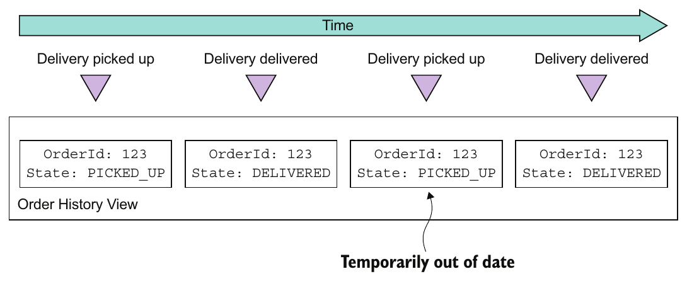

> **English:** Figure 7.11 The DeliveryPickedUp and DeliveryDelivered events are delivered twice, which causes the order state in view to be temporarily out-of-date.
>
> **Türkçe:** Şekil 7.11 DeliveryPickedUp ve DeliveryDelivered olayları iki kez teslim edilir; bu da görünümdeki sipariş durumunun geçici olarak güncelliğini yitirmesine neden olur.

<!-- source-record: u07_0184 -->

> **English:** After the event handler processes the second DeliveryPickedUp event, the Order History view temporarily contains the out-of-date state of the Order until the DeliveryDelivered is processed. If this behavior is undesirable, then the event handler should detect and discard duplicate events, like a non-idempotent event handler.
>
> **Türkçe:** İşleyici ikinci DeliveryPickedUp olayını işledikten sonra, DeliveryDelivered işlenene kadar Order History görünümü geçici olarak Order’ın eski durumunu içerir. Bu davranış istenmiyorsa işleyici, idempotent olmayan bir işleyici gibi yinelenen olayları tespit edip atmalıdır.

<!-- source-record: u07_0185 -->

> **English:** An event handler isn’t idempotent if duplicate events result in an incorrect outcome. For example, an event handler that increments the balance of a bank account isn’t idempotent. A non-idempotent event handler must, as explained in chapter 3, detect and discard duplicate events by recording the IDs of events that it has processed in the view datastore.
>
> **Türkçe:** Yinelenen olaylar yanlış sonuç üretiyorsa olay işleyicisi idempotent değildir. Örneğin banka hesabının bakiyesini artıran işleyici idempotent değildir. Böyle bir işleyici, 3. bölümde açıklandığı gibi işlediği olayların kimliklerini görünüm veri deposuna kaydederek yinelenen olayları tespit edip atmalıdır.

<!-- source-pages: 241 -->

<!-- source-record: u07_0186 -->

> **English:** In order to be reliable, the event handler must record the event ID and update the datastore atomically. How to do this depends on the type of database. If the view database store is a SQL database, the event handler could insert processed events into a PROCESSED_EVENTS table as part of the transaction that updates the view. But if the view datastore is a NoSQL database that has a limited transaction model, the event handler must save the event in the datastore “record” (for example, a MongoDB document or DynamoDB table item) that it updates.
>
> **Türkçe:** Güvenilirlik için olay işleyicisi, olay kimliğini kaydetme ve veri deposunu güncelleme işlemlerini atomik olarak gerçekleştirmelidir. Bunun yöntemi veritabanı türüne bağlıdır. Görünüm SQL veritabanındaysa işleyici, görünümü güncelleyen transaction içinde işlenmiş olayları PROCESSED_EVENTS tablosuna ekleyebilir. Ancak veri deposu sınırlı transaction modeline sahip NoSQL veritabanıysa olayı, güncellediği veri deposu kaydına — örneğin MongoDB belgesine veya DynamoDB tablo öğesine — kaydetmelidir.

<!-- source-record: u07_0187 -->

> **English:** It’s important to note that the event handler doesn’t need to record the ID of every event. If, as is the case with Eventuate, events have a monotonically increasing ID, then each record only needs to store the max(eventId) that’s received from a given aggregate instance. Furthermore, if the record corresponds to a single aggregate instance, then the event handler only needs to record max(eventId). Only records that represent joins of events from multiple aggregates must contain a map from [aggregate type, aggregate id] to max(eventId).
>
> **Türkçe:** Olay işleyicisinin her olayın kimliğini kaydetmek zorunda olmadığına dikkat edin. Eventuate’te olduğu gibi olay kimlikleri monoton artıyorsa her kaydın, belirli aggregate instance’ından alınan yalnızca max(eventId) değerini saklaması yeterlidir. Üstelik kayıt tek aggregate instance’ına karşılık geliyorsa işleyicinin yalnızca max(eventId) kaydetmesi gerekir. Yalnızca birden fazla aggregate’in olaylarının birleştirilmesini temsil eden kayıtlar, [aggregate type, aggregate id] değerinden max(eventId) değerine bir eşleme içermelidir.

<!-- source-record: u07_0188 -->

> **English:** For example, you’ll soon see that the DynamoDB implementation of the Order History view contains items that have attributes for tracking events that look like this:
>
> **Türkçe:** Örneğin birazdan Order History görünümünün DynamoDB gerçekleştirimindeki öğelerin, olayları izlemek için şuna benzeyen nitelikler içerdiğini göreceksiniz:

<!-- source-record: u07_0189 -->

```json
{...
      "Order3949384394-039434903" : "0000015e0c6fc18f-0242ac1100e50002",
      "Delivery3949384394-039434903" : "0000015e0c6fc264-0242ac1100e50002",
   }
```

<!-- source-record: u07_0190 -->

> **English:** This view is a join of events published by various services. The name of each of these event-tracking attributes is «aggregateType»«aggregateId», and the value is the eventId. Later on, I describe how this works in more detail.
>
> **Türkçe:** Bu görünüm, çeşitli servislerin yayımladığı olayların birleştirilmesidir. Olay izleme niteliklerinin her birinin adı «aggregateType»«aggregateId», değeri ise eventId’dir. Bunun nasıl çalıştığını ileride ayrıntılı açıklıyorum.

<!-- source-record: u07_0191 -->

#### ENABLING A CLIENT APPLICATION TO USE AN EVENTUALLY CONSISTENT VIEW — İstemci uygulamanın nihai tutarlılığa sahip bir görünüm kullanmasını sağlamak

<!-- source-record: u07_0192 -->

> **English:** As I said earlier, one issue with using CQRS is that a client that updates the command side and then immediately executes a query might not see its own update. The view is eventually consistent because of the unavoidable latency of the messaging infrastructure.
>
> **Türkçe:** Daha önce belirtildiği gibi CQRS kullanırken, komut tarafını güncelleyip hemen sorgu çalıştıran istemci kendi güncellemesini göremeyebilir. Mesajlaşma altyapısının kaçınılmaz gecikmesi nedeniyle görünüm sonunda tutarlıdır.

<!-- source-record: u07_0193 -->

> **English:** The command and query module APIs can enable the client to detect an inconsistency using the following approach. A command-side operation returns a token containing the ID of the published event to the client. The client then passes the token to a query operation, which returns an error if the view hasn’t been updated by that event. A view module can implement this mechanism using the duplicate eventdetection mechanism.
>
> **Türkçe:** Komut ve sorgu modüllerinin API’leri, şu yaklaşımla istemcinin tutarsızlığı tespit etmesini sağlayabilir. Komut tarafındaki işlem, yayımlanan olayın kimliğini içeren bir token döndürür. İstemci bu token’ı sorgu işlemine iletir; görünüm henüz o olayla güncellenmemişse sorgu hata döndürür. Görünüm modülü, bu mekanizmayı yinelenen olay tespit mekanizmasıyla gerçekleştirebilir.

<!-- source-record: u07_0194 -->

### 7.3.3 Adding and updating CQRS views — CQRS görünümleri eklemek ve güncellemek

<!-- source-record: u07_0195 -->

> **English:** CQRS views will be added and updated throughout the lifetime of an application. Sometimes you need to add a new view to support a new query. At other times you might need to re-create a view because the schema has changed or you need to fix a bug in code that updates the view.
>
> **Türkçe:** Uygulamanın yaşamı boyunca CQRS görünümleri eklenir ve güncellenir. Bazen yeni sorguyu desteklemek için yeni görünüm gerekir. Bazen şema değiştiğinden veya görünümü güncelleyen koddaki bir hatayı düzeltmek gerektiğinden görünümü yeniden oluşturmanız gerekir.

<!-- source-record: u07_0196 -->

> **English:** Adding and updating views is conceptually quite simple. To create a new view, you develop the query-side module, set up the datastore, and deploy the service. The query side module’s event handlers process all the events, and eventually the view will be up-to-date. Similarly, updating an existing view is also conceptually simple: you change the event handlers and rebuild the view from scratch. The problem, however, is that this approach is unlikely to work in practice. Let’s look at the issues.
>
> **Türkçe:** Görünüm eklemek ve güncellemek kavramsal olarak basittir. Yeni görünüm için sorgu tarafı modülünü geliştirir, veri deposunu kurar ve servisi dağıtırsınız. Modülün olay işleyicileri bütün olayları işler; görünüm sonunda güncellenir. Mevcut görünümü güncellemek de kavramsal olarak basittir: olay işleyicilerini değiştirip görünümü sıfırdan yeniden oluşturursunuz. Ancak bu yaklaşımın uygulamada işe yaraması pek olası değildir. Sorunlara bakalım.

<!-- source-pages: 242 -->

<!-- source-record: u07_0197 -->

#### BUILD CQRS VIEWS USING ARCHIVED EVENTS — Arşivlenmiş olaylarla CQRS görünümleri oluşturmak

<!-- source-record: u07_0198 -->

> **English:** One problem is that message brokers can’t store messages indefinitely. Traditional message brokers such as RabbitMQ delete a message once it’s been processed by a consumer. Even more modern brokers such as Apache Kafka, that retain messages for a configurable retention period, aren’t intended to store events indefinitely. As a result, a view can’t be built by only reading all the needed events from the message broker. Instead, an application must also read older events that have been archived in, for example, AWS S3. You can do this by using a scalable big data technology such as Apache Spark.
>
> **Türkçe:** Bir sorun, mesaj broker’larının mesajları süresiz saklayamamasıdır. RabbitMQ gibi geleneksel broker’lar, tüketici işledikten sonra mesajı siler. Yapılandırılabilir saklama süresi boyunca mesajları tutan Apache Kafka gibi daha modern broker’lar da olayları süresiz saklamak için tasarlanmamıştır. Dolayısıyla görünüm, gerekli bütün olayları yalnızca broker’dan okuyarak oluşturulamaz. Uygulama, örneğin AWS S3’te arşivlenmiş eski olayları da okumalıdır. Bunun için Apache Spark gibi ölçeklenebilir bir büyük veri teknolojisi kullanabilirsiniz.

<!-- source-record: u07_0199 -->

#### BUILD CQRS VIEWS INCREMENTALLY — CQRS görünümlerini artımlı biçimde oluşturmak

<!-- source-record: u07_0200 -->

> **English:** Another problem with view creation is that the time and resources required to process all events keep growing over time. Eventually, view creation will become too slow and expensive. The solution is to use a two-step incremental algorithm. The first step periodically computes a snapshot of each aggregate instance based on its previous snapshot and events that have occurred since that snapshot was created. The second step creates a view using the snapshots and any subsequent events.
>
> **Türkçe:** Görünüm oluşturmanın başka bir sorunu, bütün olayları işlemek için gereken zaman ve kaynakların sürekli artmasıdır. Sonunda görünüm oluşturma çok yavaş ve maliyetli hâle gelir. Çözüm, iki adımlı artımlı algoritmadır. İlk adım, her aggregate instance’ının önceki snapshot’ını ve o snapshot oluşturulduğundan beri gerçekleşen olayları kullanarak düzenli aralıklarla yeni snapshot hesaplar. İkinci adım, snapshot’ları ve sonraki olayları kullanarak görünümü oluşturur.

<!-- source-record: u07_0201 -->

## 7.4 Implementing a CQRS view with AWS DynamoDB — AWS DynamoDB ile CQRS görünümü gerçekleştirmek

<!-- source-record: u07_0202 -->

> **English:** Now that we’ve looked at the various design issues you must address when using CQRS, let’s consider an example. This section describes how to implement a CQRS view for the findOrderHistory() operation using DynamoDB. AWS DynamoDB is a scalable, NoSQL database that’s available as a service on the Amazon cloud. The DynamoDB data model consists of tables that contain items that, like JSON objects, are collections of hierarchical name-value pairs. AWS DynamoDB is a fully managed database, and you can scale the throughput capacity of a table up and down dynamically.
>
> **Türkçe:** CQRS’nin tasarım konularını incelediğimize göre bir örneğe bakalım. Bu kısım, DynamoDB ile findOrderHistory() için CQRS görünümü gerçekleştirmeyi açıklar. AWS DynamoDB, Amazon bulutunda servis olarak sunulan ölçeklenebilir bir NoSQL veritabanıdır. Veri modeli, JSON nesneleri gibi hiyerarşik ad-değer çiftlerinden oluşan öğeler içeren tablolardan oluşur. AWS DynamoDB tamamen yönetilen bir veritabanıdır; tablonun birim zamanda işleyebileceği işlem kapasitesini dinamik olarak artırıp azaltabilirsiniz.

<!-- source-record: u07_0203 -->

> **English:** The CQRS view for the findOrderHistory() consumes events from multiple services, so it’s implemented as a standalone Order View Service. The service has an API that implements two operations: findOrderHistory() and findOrder(). Even though findOrder() can be implemented using API composition, this view provides this operation for free. Figure 7.12 shows the design of the service. Order History Service is structured as a set of modules, each of which implements a particular responsibility in order to simplify development and testing. The responsibility of each module is as follows:
>
> **Türkçe:** findOrderHistory() görünümü, birden fazla servisin olaylarını tükettiğinden bağımsız Order View Service olarak gerçekleştirilir. Servisin API’si iki işlem sunar: findOrderHistory() ve findOrder(). findOrder() API composition ile gerçekleştirilebilse de bu görünüm işlemi ek çaba gerektirmeden sağlar. Şekil 7.12, servisin tasarımını gösterir. Geliştirme ve testi kolaylaştırmak için Order History Service, her biri belirli bir sorumluluğu yerine getiren modüllere ayrılmıştır. Modüllerin sorumlulukları şöyledir:

<!-- source-record: u07_0204 -->

> **English:** • OrderHistoryEventHandlers—Subscribes to events published by the various services and invokes the OrderHistoryDAO
>
> **Türkçe:** • OrderHistoryEventHandlers — Çeşitli servislerin yayımladığı olaylara abone olur ve OrderHistoryDAO’yu çağırır

<!-- source-record: u07_0205 -->

> **English:** • OrderHistoryQuery APImodule—Implements the REST endpoints described earlier
>
> **Türkçe:** • OrderHistoryQuery API modülü — Daha önce açıklanan REST endpoint’lerini gerçekleştirir

<!-- source-pages: 243 -->

<!-- source-record: u07_0206 -->

> **English:** • OrderHistoryDataAccess—Contains the OrderHistoryDAO, which defines the methods that update and query the ftgo-order-history DynamoDB table and its helper classes
>
> **Türkçe:** • OrderHistoryDataAccess — ftgo-order-history DynamoDB tablosunu güncelleyen ve sorgulayan metotları tanımlayan OrderHistoryDAO’yu ve onun yardımcı sınıflarını içerir

<!-- source-record: u07_0207 -->

> **English:** • ftgo-order-history DynamoDB table—The table that stores the orders
>
> **Türkçe:** - ftgo-order-history DynamoDB tablosu - Siparişleri kaydeden tablo

<!-- source-record: u07_0208 -->

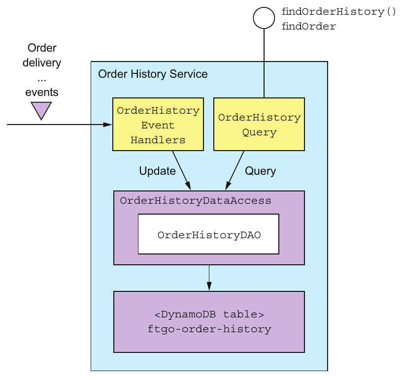

> **English:** Figure 7.12 The design of OrderHistoryService. OrderHistory- EventHandlers updates the database in response to events. The OrderHistoryQuery module implements the query operations by query- ing the database. These two modules use the OrderHistory- DataAccess module to access the database.
>
> **Türkçe:** Şekil 7.12 OrderHistoryService’in tasarımı. OrderHistoryEventHandlers, olaylara yanıt olarak veritabanını günceller. OrderHistoryQuery modülü, veritabanını sorgulayarak sorgu işlemlerini gerçekleştirir. Bu iki modül, veritabanına erişmek için OrderHistoryDataAccess modülünü kullanır.

<!-- source-record: u07_0209 -->

> **English:** Let’s look at the design of the event handlers, the DAO, and the DynamoDB table in more detail.
>
> **Türkçe:** Olay işleyicilerinin, DAO’nun ve DynamoDB tablosunun tasarımını daha ayrıntılı inceleyelim.

<!-- source-record: u07_0210 -->

### 7.4.1 The OrderHistoryEventHandlers module — OrderHistoryEventHandlers modülü

<!-- source-record: u07_0211 -->

> **English:** This module consists of the event handlers that consume events and update the DynamoDB table. As the following listing shows, the event handlers are simple methods. Each method is a one-liner that invokes an OrderHistoryDao method with arguments that are derived from the event.
>
> **Türkçe:** Bu modül, olayları tüketip DynamoDB tablosunu güncelleyen olay işleyicilerinden oluşur. Aşağıdaki listing’de görüldüğü gibi işleyiciler basit metotlardır. Her biri, olaydan türetilen argümanlarla bir OrderHistoryDao metodunu çağıran tek satırdan oluşur.

<!-- source-pages: 244 -->

<!-- source-record: u07_0212 -->

#### Listing 7.1 Event handlers that call the OrderHistoryDao — Listesi 7.1 OrderHistoryDao'ı arayan olay yöneticileri

<!-- source-record: u07_0213 -->

```java
public class OrderHistoryEventHandlers {

  private OrderHistoryDao orderHistoryDao;

  public OrderHistoryEventHandlers(OrderHistoryDao orderHistoryDao) {
    this.orderHistoryDao = orderHistoryDao;
  }

  public void handleOrderCreated(DomainEventEnvelope<OrderCreated> dee) {
    orderHistoryDao.addOrder(makeOrder(dee.getAggregateId(), dee.getEvent()),
                              makeSourceEvent(dee));
  }

  private Order makeOrder(String orderId, OrderCreatedEvent event) {
    ...
  }

  public void handleDeliveryPickedUp(DomainEventEnvelope<DeliveryPickedUp>
                                             dee) {
   orderHistoryDao.notePickedUp(dee.getEvent().getOrderId(),
           makeSourceEvent(dee));
  }

  ...
```

<!-- source-record: u07_0214 -->

> **English:** Each event handler has a single parameter of type DomainEventEnvelope, which contains the event and some metadata describing the event. For example, the handleOrderCreated() method is invoked to handle an OrderCreated event. It calls orderHistoryDao.addOrder() to create an Order in the database. Similarly, the handleDeliveryPickedUp() method is invoked to handle a DeliveryPickedUp event. It calls orderHistoryDao.notePickedUp() to update the status of the Order in the database.
>
> **Türkçe:** Her olay işleyicisi, olayı ve onu açıklayan metadata’yı içeren DomainEventEnvelope türünde tek parametre alır. Örneğin handleOrderCreated(), OrderCreated olayını işlemek için çağrılır. Veritabanında Order oluşturmak için orderHistoryDao.addOrder() metodunu çağırır. Benzer biçimde handleDeliveryPickedUp(), DeliveryPickedUp olayını işlemek için çağrılır ve veritabanındaki Order’ın durumunu güncellemek için orderHistoryDao.notePickedUp() metodunu çağırır.

<!-- source-record: u07_0215 -->

> **English:** Both methods call the helper method makeSourceEvent(), which constructs a SourceEvent containing the type and ID of the aggregate that emitted the event and the event ID. In the next section you’ll see that OrderHistoryDao uses SourceEvent to ensure that update operations are idempotent.
>
> **Türkçe:** İki metot da makeSourceEvent() yardımcı metodunu çağırır. Bu metot, olayı yayımlayan aggregate’in türünü ve kimliğini, ayrıca olay kimliğini içeren bir SourceEvent oluşturur. Sonraki kısımda OrderHistoryDao’nun güncellemelerin idempotent olmasını sağlamak için SourceEvent kullandığını göreceksiniz.

<!-- source-record: u07_0216 -->

> **English:** Let’s now look at the design of the DynamoDB table and after that examine OrderHistoryDao.
>
> **Türkçe:** Şimdi DynamoDB tablosunun tasarımına bakalım ve sonra OrderHistoryDao'yi inceleyelim.

<!-- source-record: u07_0217 -->

### 7.4.2 Data modeling and query design with DynamoDB — DynamoDB ile veri modelleme ve sorgu tasarımı

<!-- source-record: u07_0218 -->

> **English:** Like many NoSQL databases, DynamoDB has data access operations that are much less powerful than those that are provided by an RDBMS. Consequently, you must carefully design how the data is stored. In particular, the queries often dictate the design of the schema. We need to address several design issues:
>
> **Türkçe:** Birçok NoSQL veritabanı gibi DynamoDB’nin veri erişim işlemleri de RDBMS’nin sunduklarından çok daha sınırlıdır. Bu nedenle verilerin saklanma biçimini dikkatle tasarlamalısınız. Özellikle sorgular, çoğu zaman şema tasarımını belirler. Birkaç tasarım konusunu ele almalıyız:

<!-- source-record: u07_0219 -->

> **English:** • Designing the ftgo-order-history table
>
> **Türkçe:** • ftgo-order-history tablosunun tasarlanması

<!-- source-record: u07_0220 -->

> **English:** • Defining an index for the findOrderHistory query
>
> **Türkçe:** • findOrderHistory sorgusu için indeks tanımlanması

<!-- source-pages: 245 -->

<!-- source-record: u07_0221 -->

> **English:** • Implementing the findOrderHistory query
>
> **Türkçe:** • findOrderHistory sorgusunun gerçekleştirilmesi

<!-- source-record: u07_0222 -->

> **English:** • Paginating the query results
>
> **Türkçe:** • Sorgu sonuçlarının sayfalanması

<!-- source-record: u07_0223 -->

> **English:** • Updating orders
>
> **Türkçe:** - Siparişleri güncelleme

<!-- source-record: u07_0224 -->

> **English:** • Detecting duplicate events
>
> **Türkçe:** • Yinelenen olayların tespit edilmesi

<!-- source-record: u07_0225 -->

> **English:** We’ll look at each one in turn.
>
> **Türkçe:** Her birine sırayla bakacağız.

<!-- source-record: u07_0226 -->

#### DESIGNING THE FTGO-ORDER-HISTORY TABLE — ftgo-order-history tablosunu tasarlamak

<!-- source-record: u07_0227 -->

> **English:** The DynamoDB storage model consists of tables, which contain items, and indexes, which provide alternative ways to access a table’s items (discussed shortly). An item is a collection of named attributes. An attribute value is either a scalar value such as a string, a multivalued collection of strings, or a collection of named attributes. Although an item is the equivalent to a row in an RDBMS, it’s a lot more flexible and can store an entire aggregate.
>
> **Türkçe:** DynamoDB depolama modeli, öğeler içeren tablolardan ve tablo öğelerine erişmenin alternatif yollarını sunan indekslerden oluşur; indeksleri birazdan açıklayacağız. Öğe, adlandırılmış nitelikler topluluğudur. Nitelik değeri, string gibi skaler bir değer, birden fazla string içeren koleksiyon veya adlandırılmış nitelikler koleksiyonu olabilir. Öğe, RDBMS’deki satıra karşılık gelse de çok daha esnektir ve bir aggregate’in tamamını saklayabilir.

<!-- source-record: u07_0228 -->

> **English:** This flexibility enables the OrderHistoryDataAccess module to store each Order as a single item in a DynamoDB table called ftgo-order-history. Each field of the Order class is mapped to an item attribute, as shown in figure 7.13. Simple fields such as orderCreationTime and status are mapped to single-value item attributes. The lineItems field is mapped to an attribute that is a list of maps, one map per time line. It can be considered to be a JSON array of objects.
>
> **Türkçe:** Bu esneklik, OrderHistoryDataAccess modülünün her Order’ı ftgo-order-history adlı DynamoDB tablosunda tek öğe olarak saklamasını sağlar. Şekil 7.13’te gösterildiği gibi Order sınıfının her alanı, öğenin bir niteliğine eşlenir. orderCreationTime ve status gibi basit alanlar, tek değerli niteliklere eşlenir. lineItems alanı, her sipariş kalemi için bir map içeren map listesi türündeki niteliğe eşlenir. Bu yapı, nesnelerden oluşan bir JSON dizisi gibi düşünülebilir.

> **Editör notu — kaynak sözcük sırası:** “One map per time line” ifadesi, aynı paragraftaki lineItems alanı ve Şekil 7.13 bağlamında **her sipariş kalemi için bir map** anlamında çevrilmiştir.

<!-- source-record: u07_0229 -->

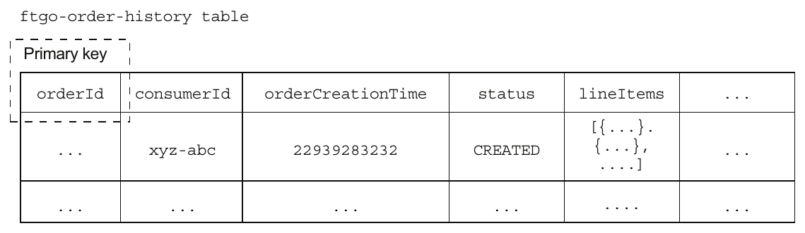

> **English:** Figure 7.13 Preliminary structure of the DynamoDB OrderHistory table
>
> **Türkçe:** Şekil 7.13 DynamoDB OrderHistory tablosunun başlangıç yapısı.

<!-- source-record: u07_0230 -->

> **English:** An important part of the definition of a table is its primary key. A DynamoDB application inserts, updates, and retrieves a table’s items by primary key. It would seem to make sense for the primary key to be orderId. This enables Order History Service to insert, update, and retrieve an order by orderId. But before finalizing this decision, let’s first explore how a table’s primary key impacts the kinds of data access operations it supports.
>
> **Türkçe:** Tablo tanımının önemli bir bölümü birincil anahtarıdır. DynamoDB uygulaması, tablo öğelerini birincil anahtarla ekler, günceller ve getirir. Birincil anahtarın orderId olması anlamlı görünür. Böylece Order History Service, siparişi orderId ile ekleyebilir, güncelleyebilir ve getirebilir. Ancak kararı kesinleştirmeden önce birincil anahtarın, tablonun desteklediği veri erişim işlemlerini nasıl etkilediğine bakalım.

<!-- source-record: u07_0231 -->

#### DEFINING AN INDEX FOR THE FINDORDERHISTORY QUERY — findOrderHistory sorgusu için indeks tanımlamak

<!-- source-record: u07_0232 -->

> **English:** This table definition supports primary key-based reads and writes of Orders. But it doesn’t support a query such as findOrderHistory() that returns multiple matching orders sorted by increasing age. That’s because, as you will see later in this section, this query uses the DynamoDB query() operation, which requires a table to have a composite primary key consisting of two scalar attributes. The first attribute is a partition key. The partition key is so called because DynamoDB’s Z-axis scaling (described in chapter 1) uses it to select an item’s storage partition. The second attribute is the sort key. A query() operation returns those items that have the specified partition key, have a sort key in the specified range, and match the optional filter expression. It returns items in the order specified by the sort key.
>
> **Türkçe:** Bu tablo tanımı, Order kayıtlarının birincil anahtarla okunmasını ve yazılmasını destekler. Ancak eşleşen birden fazla siparişi yaşları artacak biçimde sıralayan findOrderHistory() gibi sorguları desteklemez. Çünkü bu kısımda ileride göreceğiniz gibi sorgu, tablonun iki skaler nitelikten oluşan bileşik birincil anahtara sahip olmasını gerektiren DynamoDB query() işlemini kullanır. İlk nitelik partition key’dir. Bu adın nedeni, 1. bölümde açıklanan Z ekseni ölçeklemesinin, öğenin saklanacağı bölümü seçmek için bu anahtarı kullanmasıdır. İkinci nitelik sort key’dir. query(), belirtilen partition key’e sahip, sort key’i belirtilen aralıkta olan ve isteğe bağlı filtre ifadesiyle eşleşen öğeleri döndürür. Öğeler sort key’in belirlediği sırayla döndürülür.

<!-- source-pages: 246 -->

<!-- source-record: u07_0233 -->

> **English:** The findOrderHistory() query operation returns a consumer’s orders sorted by increasing age. It therefore requires a primary key that has the consumerId as the partition key and the orderCreationDate as the sort key. But it doesn’t make sense for (consumerId, orderCreationDate) to be the primary key of the ftgo-order-history table, because it’s not unique.
>
> **Türkçe:** findOrderHistory(), tüketicinin siparişlerini yaşları artacak biçimde sıralayarak döndürür. Bu nedenle partition key’i consumerId, sort key’i orderCreationDate olan bir birincil anahtar gerektirir. Ancak (consumerId, orderCreationDate) benzersiz olmadığından ftgo-order-history tablosunun birincil anahtarı olması anlamlı değildir.

<!-- source-record: u07_0234 -->

> **English:** The solution is for findOrderHistory() to query what DynamoDB calls a secondary index on the ftgo-order-history table. This index has (consumerId, orderCreationDate) as its non-unique key. Like an RDBMS index, a DynamoDB index is automatically updated whenever its table is updated. But unlike a typical RDBMS index, a DynamoDB index can have non-key attributes. Non-key attributes improve performance because they’re returned by the query, so the application doesn’t have to fetch them from the table. Also, as you’ll soon see, they can be used for filtering. Figure 7.14 shows the structure of the table and this index.
>
> **Türkçe:** Çözüm, findOrderHistory() işleminin ftgo-order-history tablosu üzerindeki DynamoDB secondary index’ini (ikincil indeks) sorgulamasıdır. İndeksin benzersiz olmayan anahtarı (consumerId, orderCreationDate) çiftidir. RDBMS indeksinde olduğu gibi DynamoDB indeksi de tablo güncellendiğinde otomatik güncellenir. Ancak tipik RDBMS indeksinden farklı olarak anahtar olmayan nitelikler içerebilir. Sorgu bu nitelikleri de döndürdüğünden uygulamanın onları tablodan ayrıca getirmesi gerekmez; böylece performans artar. Birazdan göreceğiniz gibi filtreleme için de kullanılabilirler. Şekil 7.14, tablo ve indeksin yapısını gösterir.

<!-- source-record: u07_0235 -->

> **English:** The index is part of the definition of the ftgo-order-history table and is called ftgo-order-history-by-consumer-id-and-creation-time. The index’s attributes include the primary key attributes, consumerId and orderCreationTime, and non-key attributes, including orderId and status.
>
> **Türkçe:** İndeks, ftgo-order-history tablosunun tanımının parçasıdır ve ftgo-order-history-by-consumer-id-and-creation-time adını taşır. Nitelikleri arasında birincil anahtar nitelikleri consumerId ve orderCreationTime ile orderId ve status dâhil anahtar olmayan nitelikler bulunur.

<!-- source-record: u07_0236 -->

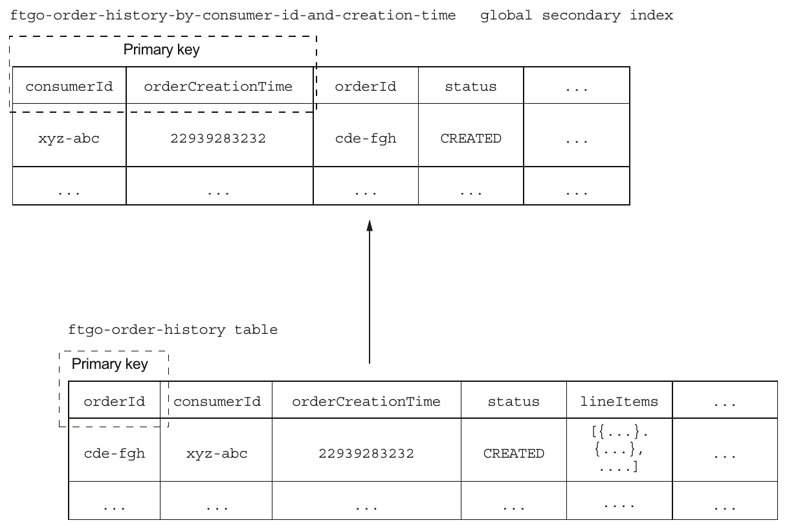

> **English:** Figure 7.14 The design of the OrderHistory table and index
>
> **Türkçe:** Şekil 7.14 OrderHistory tablosunun ve indeksinin tasarımı.

<!-- source-pages: 247 -->

<!-- source-record: u07_0237 -->

> **English:** The ftgo-order-history-by-consumer-id-and-creation-time index enables the OrderHistoryDaoDynamoDb to efficiently retrieve a consumer’s orders sorted by increasing age.
>
> **Türkçe:** ftgo-order-history-by-consumer-id-and-creation-time indeksi, OrderHistoryDaoDynamoDb'un, yaş artışına göre düzenlenen bir tüketicinin siparişlerini verimli bir şekilde geri almasını sağlar.

<!-- source-record: u07_0238 -->

> **English:** Let’s now look at how to retrieve only those orders that match the filter criteria.
>
> **Türkçe:** Şimdi yalnızca filtre ölçütleriyle eşleşen siparişlerin nasıl getirileceğine bakalım.

<!-- source-record: u07_0239 -->

#### IMPLEMENTING THE FINDORDERHISTORY QUERY — findOrderHistory sorgusunu gerçekleştirmek

<!-- source-record: u07_0240 -->

> **English:** The findOrderHistory() query operation has a filter parameter that specifies the search criteria. One filter criterion is the maximum age of the orders to return. This is easy to implement because the DynamoDB Query operation’s key condition expression supports a range restriction on the sort key. The other filter criteria correspond to non-key attributes and can be implemented using a filter expression, which is a Boolean expression. A DynamoDB Query operation returns only those items that satisfy the filter expression. For example, to find Orders that are CANCELLED, the OrderHistoryDaoDynamoDb uses a query expression orderStatus =:orderStatus, where:orderStatus is a placeholder parameter.
>
> **Türkçe:** findOrderHistory() işleminin arama ölçütlerini belirleyen bir filter parametresi vardır. Ölçütlerden biri, döndürülecek siparişlerin en fazla ne kadar eski olabileceğidir. DynamoDB Query işleminin anahtar koşul ifadesi, sort key üzerinde aralık kısıtlamasını desteklediğinden bunu gerçekleştirmek kolaydır. Diğer ölçütler anahtar olmayan niteliklere karşılık gelir ve Boolean türünde bir filtre ifadesiyle gerçekleştirilebilir. DynamoDB Query yalnızca bu ifadeyi sağlayan öğeleri döndürür. Örneğin OrderHistoryDaoDynamoDb, CANCELLED durumundaki siparişleri bulmak için orderStatus = :orderStatus ifadesini kullanır; :orderStatus bir yer tutucu parametredir.

<!-- source-record: u07_0241 -->

> **English:** The keyword filter criteria is more challenging to implement. It selects orders whose restaurant name or menu items match one of the specified keywords. The OrderHistoryDaoDynamoDb enables the keyword search by tokenizing the restaurant name and menu items and storing the set of keywords in a set-valued attribute called keywords. It finds the orders that match the keywords by using a filter expression that uses the contains() function, for example contains(keywords,:keyword1) OR contains(keywords,:keyword2), where:keyword1 and:keyword2 are placeholders for the specified keywords.
>
> **Türkçe:** Anahtar sözcük filtresini gerçekleştirmek daha zordur. Bu filtre, restoran adı veya menü öğeleri belirtilen anahtar sözcüklerden biriyle eşleşen siparişleri seçer. OrderHistoryDaoDynamoDb, restoran adını ve menü öğelerini sözcüklere ayırıp elde edilen kümeyi keywords adlı küme değerli nitelikte saklayarak anahtar sözcük aramasını sağlar. Eşleşen siparişleri, contains() kullanan bir filtre ifadesiyle bulur; örneğin contains(keywords, :keyword1) OR contains(keywords, :keyword2). Burada :keyword1 ve :keyword2, belirtilen anahtar sözcüklerin yer tutucularıdır.

<!-- source-record: u07_0242 -->

#### PAGINATING THE QUERY RESULTS — Sorgu sonuçlarını sayfalara bölmek

<!-- source-record: u07_0243 -->

> **English:** Some consumers will have a large number of orders. It makes sense, therefore, for the findOrderHistory() query operation to use pagination. The DynamoDB Query operation has an operation pageSize parameter, which specifies the maximum number of items to return. If there are more items, the result of the query has a non-null LastEvaluatedKey attribute. A DAO can retrieve the next page of items by invoking the query with the exclusiveStartKey parameter set to LastEvaluatedKey.
>
> **Türkçe:** Bazı tüketicilerin çok sayıda siparişi bulunur. Bu nedenle findOrderHistory() işleminde sayfalama kullanmak anlamlıdır. DynamoDB Query işleminin pageSize parametresi, döndürülecek en fazla öğe sayısını belirler. Daha fazla öğe varsa sorgu sonucunun LastEvaluatedKey niteliği null değildir. DAO, exclusiveStartKey parametresini LastEvaluatedKey olarak ayarlayıp sorguyu çağırarak sonraki öğe sayfasını getirebilir.

<!-- source-record: u07_0244 -->

> **English:** As you can see, DynamoDB doesn’t support position-based pagination. Consequently, Order History Service returns an opaque pagination token to its client. The client uses this pagination token to request the next page of results.
>
> **Türkçe:** Görüldüğü gibi DynamoDB, konuma dayalı sayfalamayı desteklemez. Bu nedenle Order History Service, istemciye iç yapısını yorumlaması gerekmeyen bir sayfalama token’ı döndürür. İstemci, sonraki sonuç sayfasını istemek için bu token’ı kullanır.

<!-- source-record: u07_0245 -->

> **English:** Now that I’ve described how to query DynamoDB for orders, let’s look at how to insert and update them.
>
> **Türkçe:** DynamoDB’de sipariş sorgulamayı açıkladığımıza göre, siparişlerin nasıl ekleneceğine ve güncelleneceğine bakalım.

<!-- source-record: u07_0246 -->

#### UPDATING ORDERS — Siparişleri güncellemek

<!-- source-record: u07_0247 -->

> **English:** DynamoDB supports two operations for adding and updating items: PutItem() and UpdateItem(). The PutItem() operation creates or replaces an entire item by its primary key. In theory, OrderHistoryDaoDynamoDb could use this operation to insert and update orders. One challenge, however, with using PutItem() is ensuring that simultaneous updates to the same item are handled correctly.
>
> **Türkçe:** DynamoDB, öğe eklemek ve güncellemek için iki işlem sunar: PutItem() ve UpdateItem(). PutItem(), birincil anahtarı kullanarak öğenin tamamını oluşturur veya değiştirir. Kuramsal olarak OrderHistoryDaoDynamoDb, siparişleri eklemek ve güncellemek için bunu kullanabilir. Ancak PutItem() kullanımının bir güçlüğü, aynı öğeye yapılan eşzamanlı güncellemelerin doğru ele alınmasını sağlamaktır.

<!-- source-pages: 248 -->

<!-- source-record: u07_0248 -->

> **English:** Consider, for example, the scenario where two event handlers simultaneously attempt to update the same item. Each event handler calls OrderHistoryDaoDynamoDb to load the item from DynamoDB, change it in memory, and update it in DynamoDB using PutItem(). One event handler could potentially overwrite the change made by the other event handler. OrderHistoryDaoDynamoDb can prevent lost updates by using DynamoDB’s optimistic locking mechanism. But an even simpler and more efficient approach is to use the UpdateItem() operation.
>
> **Türkçe:** Örneğin iki olay işleyicisinin aynı öğeyi aynı anda güncellemeye çalıştığını düşünün. Her işleyici; öğeyi DynamoDB’den yüklemek, bellekte değiştirmek ve PutItem() ile DynamoDB’de güncellemek için OrderHistoryDaoDynamoDb’yi çağırır. Bir işleyici, diğerinin yaptığı değişikliğin üzerine yazabilir. OrderHistoryDaoDynamoDb, DynamoDB’nin iyimser kilitleme mekanizmasıyla güncelleme kaybını önleyebilir. Ancak daha basit ve verimli yaklaşım, UpdateItem() kullanmaktır.

<!-- source-record: u07_0249 -->

> **English:** The UpdateItem() operation updates individual attributes of the item, creating the item if necessary. Since different event handlers update different attributes of the Order item, using UpdateItem makes sense. This operation is also more efficient because there’s no need to first retrieve the order from the table.
>
> **Türkçe:** UpdateItem(), öğenin tek tek niteliklerini günceller ve gerekirse öğeyi oluşturur. Farklı işleyiciler Order öğesinin farklı niteliklerini güncellediğinden UpdateItem kullanmak anlamlıdır. Siparişi önceden tablodan getirmek gerekmediği için bu işlem daha verimlidir.

<!-- source-record: u07_0250 -->

> **English:** One challenge with updating the database in response to events is, as mentioned earlier, detecting and discarding duplicate events. Let’s look at how to do that when using DynamoDB.
>
> **Türkçe:** Daha önce belirtildiği gibi olaylara yanıt olarak veritabanını güncellemenin güçlüklerinden biri, yinelenen olayları tespit edip atmaktır. DynamoDB’de bunun nasıl yapılacağına bakalım.

<!-- source-record: u07_0251 -->

#### DETECTING DUPLICATE EVENTS — Yinelenen olayları saptamak

<!-- source-record: u07_0252 -->

> **English:** All of Order History Service’s event handlers are idempotent. Each one sets one or more attributes of the Order item. Order History Service could, therefore, simply ignore the issue of duplicate events. The downside of ignoring the issue, though, is that Order item will sometimes be temporarily out-of-date. That’s because an event handler that receives a duplicate event will set an Order item’s attributes to previous values. The Order item won’t have the correct values until later events are redelivered.
>
> **Türkçe:** Order History Service’in bütün olay işleyicileri idempotent’tir. Her biri Order öğesinin bir veya daha fazla niteliğine değer atar. Bu nedenle servis, yinelenen olay sorununu doğrudan göz ardı edebilir. Ancak bunun dezavantajı, Order öğesinin bazen geçici olarak güncelliğini yitirmesidir. Yinelenen olayı alan işleyici, Order’ın niteliklerini önceki değerlere döndürür. Sonraki olaylar yeniden teslim edilene kadar Order doğru değerlere sahip olmaz.

<!-- source-record: u07_0253 -->

> **English:** As described earlier, one way to prevent data from becoming out-of-date is to detect and discard duplicate events. OrderHistoryDaoDynamoDb can detect duplicate events by recording in each item the events that have caused it to be updated. It can then use the UpdateItem() operation’s conditional update mechanism to only update an item if an event isn’t a duplicate.
>
> **Türkçe:** Daha önce açıklandığı gibi verinin eski duruma dönmesini önlemenin bir yolu, yinelenen olayları tespit edip atmaktır. OrderHistoryDaoDynamoDb, her öğede onu güncelleyen olayları kaydederek tekrarları tespit edebilir. Ardından UpdateItem() işleminin koşullu güncelleme mekanizmasıyla yalnızca olay yinelenmiyorsa öğeyi güncelleyebilir.

<!-- source-record: u07_0254 -->

> **English:** A conditional update is only performed if a condition expression is true. A condition expression tests whether an attribute exists or has a particular value. The OrderHistoryDaoDynamoDb DAO can track events received from each aggregate instance using an attribute called «aggregateType»«aggregateId» whose value is the highest received event ID. An event is a duplicate if the attribute exists and its value is less than or equal to the event ID. The OrderHistoryDaoDynamoDb DAO uses this condition expression:
>
> **Türkçe:** Koşullu güncelleme, yalnızca koşul ifadesi doğruysa yapılır. Koşul ifadesi, niteliğin var olup olmadığını veya belirli bir değere sahip olup olmadığını sınar. OrderHistoryDaoDynamoDb, her aggregate instance’ından alınan olayları, değeri alınmış en yüksek olay kimliği olan «aggregateType»«aggregateId» adlı nitelikle izleyebilir. Nitelik mevcutsa ve değeri olay kimliğinden küçük veya ona eşitse olay yinelenmiştir. OrderHistoryDaoDynamoDb şu koşul ifadesini kullanır:

> **Editör notu — karşılaştırma yönü:** Kaynağın yinelenen olay tanımı, hemen altındaki koşulla çelişir. Kod güncellemeyi yalnızca kayıt yoksa veya **saklanan son ID < gelen eventId** ise kabul eder. Dolayısıyla kayıt varsa **gelen eventId ≤ saklanan son ID** durumundaki olay yinelenmiş/eski kabul edilir. İngilizce cümle ve çevirisi kaynakta söylendiği biçimde bırakılmıştır; uygulamada alttaki kodun karşılaştırma yönünü esas alın.

<!-- source-record: u07_0255 -->

```text
attribute_not_exists(«aggregateType»«aggregateId»)
     OR «aggregateType»«aggregateId» < :eventId
```

<!-- source-record: u07_0256 -->

> **English:** The condition expression only allows the update if the attribute doesn’t exist or the eventId is greater than the last processed event ID.
>
> **Türkçe:** Koşul ifadesi, yalnızca nitelik yoksa veya eventId en son işlenmiş olayın kimliğinden büyükse güncellemeye izin verir.

<!-- source-pages: 249 -->

<!-- source-record: u07_0257 -->

> **English:** For example, suppose an event handler receives a DeliveryPickup event whose ID is 123323-343434 from a Delivery aggregate whose ID is 3949384394-039434903. The name of the tracking attribute is Delivery3949384394-039434903. The event handler should consider the event to be a duplicate if the value of this attribute is greater than or equal to 123323-343434. The query() operation invoked by the event handler updates the Order item using this condition expression:
>
> **Türkçe:** Örneğin işleyicinin, kimliği 3949384394-039434903 olan Delivery aggregate’inden, kimliği 123323-343434 olan DeliveryPickup olayını aldığını varsayın. İzleme niteliğinin adı Delivery3949384394-039434903 olur. Niteliğin değeri 123323-343434’e eşit veya ondan büyükse işleyici, olayı yinelenmiş saymalıdır. İşleyicinin çağırdığı query() işlemi, Order öğesini şu koşul ifadesiyle günceller:

<!-- source-record: u07_0258 -->

```text
attribute_not_exists(Delivery3949384394-039434903)
     OR Delivery3949384394-039434903 < :eventId
```

<!-- source-record: u07_0259 -->

> **English:** Now that I’ve described the DynamoDB data model and query design, let’s take a look at OrderHistoryDaoDynamoDb, which defines the methods that update and query the ftgo-order-history table.
>
> **Türkçe:** DynamoDB veri modelini ve sorgu tasarımını açıkladığımıza göre ftgo-order-history tablosunu güncelleyen ve sorgulayan metotları tanımlayan OrderHistoryDaoDynamoDb’ye bakalım.

<!-- source-record: u07_0260 -->

### 7.4.3 The OrderHistoryDaoDynamoDb class — OrderHistoryDaoDynamoDb sınıfı

<!-- source-record: u07_0261 -->

> **English:** The OrderHistoryDaoDynamoDb class implements methods that read and write items in the ftgo-order-history table. Its update methods are invoked by OrderHistoryEventHandlers, and its query methods are invoked by OrderHistoryQuery API. Let’s take a look at some example methods, starting with the addOrder() method.
>
> **Türkçe:** OrderHistoryDaoDynamoDb sınıfı, ftgo-order-history tablosundaki öğeleri okuyan ve yazan metotları gerçekleştirir. Güncelleme metotlarını OrderHistoryEventHandlers, sorgu metotlarını OrderHistoryQuery API’si çağırır. addOrder() ile başlayarak örnek metotlara bakalım.

<!-- source-record: u07_0262 -->

#### THE ADDORDER() METHOD — addOrder() metodu

<!-- source-record: u07_0263 -->

> **English:** The addOrder() method, which is shown in listing 7.2, adds an order to the ftgo-order-history table. It has two parameters: order and sourceEvent. The order parameter is the Order to add, which is obtained from the OrderCreated event. The sourceEvent parameter contains the eventId and the type and ID of the aggregate that emitted the event. It’s used to implement the conditional update.
>
> **Türkçe:** Listing 7.2’deki addOrder(), ftgo-order-history tablosuna sipariş ekler. İki parametresi vardır: order ve sourceEvent. order, OrderCreated olayından elde edilen ve eklenecek olan Order’dır. sourceEvent ise eventId ile olayı yayımlayan aggregate’in türünü ve kimliğini içerir. Koşullu güncellemeyi gerçekleştirmek için kullanılır.

<!-- source-record: u07_0264 -->

#### Listing 7.2 The addOrder() method adds or updates an Order — Listesi 7.2 addOrder() yöntemi bir Order ekler veya güncellenir

<!-- source-record: u07_0265 -->

```java
public class OrderHistoryDaoDynamoDb ...

@Override
public boolean addOrder(Order order, Optional<SourceEvent> eventSource) {
 UpdateItemSpec spec = new UpdateItemSpec()
         .withPrimaryKey("orderId", order.getOrderId())
         .withUpdateExpression("SET orderStatus = :orderStatus, " +
                  "creationDate = :cd, consumerId = :consumerId, lineItems =" +
                 " :lineItems, keywords = :keywords, restaurantName = " +
                 ":restaurantName")
         .withValueMap(new Maps()
                  .add(":orderStatus", order.getStatus().toString())
                 .add(":cd", order.getCreationDate().getMillis())
                 .add(":consumerId", order.getConsumerId())
                 .add(":lineItems", mapLineItems(order.getLineItems()))
                 .add(":keywords", mapKeywords(order))
                 .add(":restaurantName", order.getRestaurantName())
                 .map())
         .withReturnValues(ReturnValue.NONE);
 return idempotentUpdate(spec, eventSource);
}
```

<!-- source-record: u07_0266 -->

**Kod açıklaması:**

> **English:** The primary key of the Order item to update
>
> **Türkçe:** Güncellenecek Order öğesinin birincil anahtarı

<!-- source-record: u07_0267 -->

**Kod açıklaması:**

> **English:** The update expression that updates the attributes
>
> **Türkçe:** Özellikleri güncelleyen güncelleme ifadesi

<!-- source-record: u07_0268 -->

**Kod açıklaması:**

> **English:** The values of the placeholders in the update expression
>
> **Türkçe:** Güncelleme ifadesindeki yer tutucuların değerleri

<!-- source-pages: 250 -->

<!-- source-record: u07_0269 -->

> **English:** The addOrder() method creates an UpdateSpec, which is part of the AWS SDK and describes the update operation. After creating the UpdateSpec, it calls idempotentUpdate(), a helper method that performs the update after adding a condition expression that guards against duplicate updates.
>
> **Türkçe:** addOrder(), AWS SDK’nin parçası olan ve güncelleme işlemini tanımlayan bir UpdateSpec oluşturur. Ardından yinelenen güncellemeleri engelleyen koşul ifadesini ekleyip güncellemeyi gerçekleştiren idempotentUpdate() yardımcı metodunu çağırır.

<!-- source-record: u07_0270 -->

#### THE NOTEPICKEDUP() METHOD — notePickedUp() metodu

<!-- source-record: u07_0271 -->

> **English:** The notePickedUp() method, shown in listing 7.3, is called by the event handler for the DeliveryPickedUp event. It changes the deliveryStatus of the Order item to PICKED_UP.
>
> **Türkçe:** Listing 7.3’teki notePickedUp(), DeliveryPickedUp olayının işleyicisi tarafından çağrılır. Order öğesinin deliveryStatus değerini PICKED_UP olarak değiştirir.

<!-- source-record: u07_0272 -->

#### Listing 7.3 The notePickedUp() method changes the order status to PICKED_UP — Liste 7.3 notePickedUp() yöntemi sipariş durumunu PICKED_UP'ye değiştirir

<!-- source-record: u07_0273 -->

```java
public class OrderHistoryDaoDynamoDb ...

@Override
public void notePickedUp(String orderId, Optional<SourceEvent> eventSource) {
 UpdateItemSpec spec = new UpdateItemSpec()
         .withPrimaryKey("orderId", orderId)
         .withUpdateExpression("SET #deliveryStatus = :deliveryStatus")
         .withNameMap(Collections.singletonMap("#deliveryStatus",
                 DELIVERY_STATUS_FIELD))
         .withValueMap(Collections.singletonMap(":deliveryStatus",
                 DeliveryStatus.PICKED_UP.toString()))
         .withReturnValues(ReturnValue.NONE);
 idempotentUpdate(spec, eventSource);
}
```

<!-- source-record: u07_0274 -->

> **English:** This method is similar to addOrder(). It creates an UpdateItemSpec and invokes idempotentUpdate(). Let’s look at the idempotentUpdate() method.
>
> **Türkçe:** Bu yöntem addOrder()'ye benzer. UpdateItemSpec oluşturur ve idempotentUpdate()'yi çağırır. idempotentUpdate() yöntemine bakalım.

<!-- source-record: u07_0275 -->

#### THE IDEMPOTENTUPDATE() METHOD — idempotentUpdate() metodu

<!-- source-record: u07_0276 -->

> **English:** The following listing shows the idempotentUpdate() method, which updates the item after possibly adding a condition expression to the UpdateItemSpec that guards against duplicate updates.
>
> **Türkçe:** Aşağıdaki listing, yinelenen güncellemelere karşı koruyan bir koşul ifadesini gerektiğinde UpdateItemSpec’e ekledikten sonra öğeyi güncelleyen idempotentUpdate() metodunu gösterir.

<!-- source-record: u07_0277 -->

#### Listing 7.4 The idempotentUpdate() method ignores duplicate events — Listesi 7.4 idempotentUpdate() yöntemi çift olayları görmezden gelir

<!-- source-record: u07_0278 -->

```java
public class OrderHistoryDaoDynamoDb ...

private boolean idempotentUpdate(UpdateItemSpec spec, Optional<SourceEvent>
        eventSource) {
 try {
  table.updateItem(eventSource.map(es -> es.addDuplicateDetection(spec))
          .orElse(spec));
  return true;
 } catch (ConditionalCheckFailedException e) {
  // Do nothing
  return false;
 }
}
```

<!-- source-pages: 251 -->

<!-- source-record: u07_0279 -->

> **English:** If the sourceEvent is supplied, idempotentUpdate() invokes SourceEvent.addDuplicateDetection() to add to UpdateItemSpec the condition expression that was described earlier. The idempotentUpdate() method catches and ignores the ConditionalCheckFailedException, which is thrown by updateItem() if the event was a duplicate.
>
> **Türkçe:** sourceEvent sağlanmışsa idempotentUpdate(), daha önce açıklanan koşul ifadesini UpdateItemSpec’e eklemek için SourceEvent.addDuplicateDetection() metodunu çağırır. Olay yinelenmişse updateItem() tarafından fırlatılan ConditionalCheckFailedException’ı yakalar ve görmezden gelir.

<!-- source-record: u07_0280 -->

> **English:** Now that we’ve seen the code that updates the table, let’s look at the query method.
>
> **Türkçe:** Tabloyu güncelleyen kodu gördükten sonra, sorgu yöntemine bakalım.

<!-- source-record: u07_0281 -->

#### THE FINDORDERHISTORY() METHOD — findOrderHistory() metodu

<!-- source-record: u07_0282 -->

> **English:** The findOrderHistory() method, shown in listing 7.5, retrieves the consumer’s orders by querying the ftgo-order-history table using the ftgo-order-history-by-consumerid-and-creation-time secondary index. It has two parameters: consumerId specifies the consumer, and filter specifies the search criteria. This method creates QuerySpec—which, like UpdateSpec, is part of the AWS SDK—from its parameters, queries the index, and transforms the returned items into an OrderHistory object.
>
> **Türkçe:** Listing 7.5’teki findOrderHistory(), ftgo-order-history tablosunu ftgo-order-history-by-consumerid-and-creation-time ikincil indeksi üzerinden sorgulayarak tüketicinin siparişlerini getirir. İki parametresi vardır: consumerId tüketiciyi, filter ise arama ölçütlerini belirtir. Metot, parametrelerinden UpdateSpec gibi AWS SDK’nin parçası olan bir QuerySpec oluşturur, indeksi sorgular ve dönen öğeleri OrderHistory nesnesine dönüştürür.

<!-- source-record: u07_0283 -->

#### Listing 7.5 The findOrderHistory() method retrieves a consumer’s matching orders — Listesi 7.5 findOrderHistory() yöntemi bir tüketicinin eşleşen siparişlerini geri alır

<!-- source-record: u07_0284 -->

```java
public class OrderHistoryDaoDynamoDb ...

@Override
public OrderHistory findOrderHistory(String consumerId, OrderHistoryFilter
        filter) {

 QuerySpec spec = new QuerySpec()
         .withScanIndexForward(false)
          .withHashKey("consumerId", consumerId)
         .withRangeKeyCondition(new RangeKeyCondition("creationDate")
                                  .gt(filter.getSince().getMillis()));

 filter.getStartKeyToken().ifPresent(token ->
       spec.withExclusiveStartKey(toStartingPrimaryKey(token)));

 Map<String, Object> valuesMap = new HashMap<>();

 String filterExpression = Expressions.and(
          keywordFilterExpression(valuesMap, filter.getKeywords()),
         statusFilterExpression(valuesMap, filter.getStatus()));

 if (!valuesMap.isEmpty())
  spec.withValueMap(valuesMap);

 if (StringUtils.isNotBlank(filterExpression)) {
  spec.withFilterExpression(filterExpression);
 }

 filter.getPageSize().ifPresent(spec::withMaxResultSize);

 ItemCollection<QueryOutcome> result = index.query(spec);

 return new OrderHistory(
         StreamSupport.stream(result.spliterator(), false)
            .map(this::toOrder)
             .collect(toList()),
         Optional.ofNullable(result
               .getLastLowLevelResult()
               .getQueryResult().getLastEvaluatedKey())
            .map(this::toStartKeyToken));
}
```

<!-- source-record: u07_0285 -->

**Kod açıklaması:**

> **English:** Specifies that query must return the orders in order of increasing age
>
> **Türkçe:** Sorgunun siparişleri yaşları artacak biçimde sıralayarak döndürmesi gerektiğini belirtir

<!-- source-record: u07_0286 -->

**Kod açıklaması:**

> **English:** The maximum age of the orders to return
>
> **Türkçe:** Döndürülecek siparişlerin en fazla ne kadar eski olabileceği

<!-- source-record: u07_0287 -->

**Kod açıklaması:**

> **English:** Construct a filter expression and placeholder value map from the OrderHistoryFilter.
>
> **Türkçe:** OrderHistoryFilter'den bir filtre ifadesi ve yer tutucu değer haritasını oluşturun.

<!-- source-record: u07_0288 -->

**Kod açıklaması:**

> **English:** Limit the number of results if the caller has specified a page size.
>
> **Türkçe:** Arayan bir sayfa boyutunu belirttiyse sonuç sayısını sınırlayın.

<!-- source-pages: 252 -->

<!-- source-record: u07_0289 -->

**Kod açıklaması:**

> **English:** Create an Order from an item returned by the query.
>
> **Türkçe:** Sorgu tarafından gönderilen bir öğeden Order oluşturun.

<!-- source-record: u07_0290 -->

> **English:** After building a QuerySpec, this method then executes a query and builds an Order-History, which contains the list of Orders, from the returned items.
>
> **Türkçe:** QuerySpec’i oluşturduktan sonra metot, sorguyu çalıştırır ve dönen öğelerden Order listesini içeren bir OrderHistory oluşturur.

<!-- source-record: u07_0291 -->

> **English:** The findOrderHistory() method implements pagination by serializing the value returned by getLastEvaluatedKey() into a JSON token. If a client specifies a start token in OrderHistoryFilter, then findOrderHistory() serializes it and invokes withExclusiveStartKey() to set the start key.
>
> **Türkçe:** findOrderHistory(), getLastEvaluatedKey() metodunun döndürdüğü değeri JSON token’ına serialize ederek sayfalamayı gerçekleştirir. İstemci OrderHistoryFilter içinde başlangıç token’ı belirtirse findOrderHistory() bunu serialize eder ve başlangıç anahtarını ayarlamak için withExclusiveStartKey() metodunu çağırır.

> **Editör notu — serialize / deserialize:** Kaynak ikinci cümlede de “serializes” der. Ancak başlangıç token’ı JSON’dan anahtar nesnesine geri çevrilir; bu adım **deserialize** işlemidir. İlk cümledeki sonuç anahtarını JSON token’a çevirme ise **serialize** işlemidir.

<!-- source-record: u07_0292 -->

> **English:** As you can see, you must address numerous issues when implementing a CQRS view, including picking a database, designing the data model that efficiently implements updates and queries, handling concurrent updates, and dealing with duplicate events. The only complex part of the code is the DAO, because it must properly handle concurrency and ensure that updates are idempotent.
>
> **Türkçe:** Gördüğünüz gibi CQRS görünümü oluştururken veritabanı seçimi, güncellemeleri ve sorguları verimli destekleyen veri modelinin tasarımı, eşzamanlı güncellemeler ve yinelenen olaylar gibi birçok konuyu ele almalısınız. Kodun tek karmaşık bölümü DAO’dur; çünkü eşzamanlılığı doğru ele almalı ve güncellemelerin idempotent olmasını sağlamalıdır.

<!-- source-record: u07_0293 -->

## Summary — Bölüm özeti

<!-- source-record: u07_0294 -->

> **English:** • Implementing queries that retrieve data from multiple services is challenging because each service’s data is private.
>
> **Türkçe:** - Çoklu servislerden verileri alan sorguları uygulamak zor çünkü her servisin verileri özeldir.

<!-- source-record: u07_0295 -->

> **English:** • There are two ways to implement these kinds of query: the API composition pattern and the Command query responsibility segregation (CQRS) pattern.
>
> **Türkçe:** • Bu sorguları gerçekleştirmenin iki yolu vardır: API composition örüntüsü ve Command query responsibility segregation (CQRS) örüntüsü.

<!-- source-record: u07_0296 -->

> **English:** • The API composition pattern, which gathers data from multiple services, is the simplest way to implement queries and should be used whenever possible.
>
> **Türkçe:** • Birden fazla servisten veri toplayan API composition örüntüsü, sorguları gerçekleştirmenin en basit yoludur ve mümkün olduğunda kullanılmalıdır.

<!-- source-record: u07_0297 -->

> **English:** • A limitation of the API composition pattern is that some complex queries require inefficient in-memory joins of large datasets.
>
> **Türkçe:** • API composition’ın bir sınırlaması, bazı karmaşık sorguların büyük veri kümeleri üzerinde verimsiz bellek içi join işlemleri gerektirmesidir.

<!-- source-record: u07_0298 -->

> **English:** • The CQRS pattern, which implements queries using view databases, is more powerful but more complex to implement.
>
> **Türkçe:** • Görünüm veritabanlarıyla sorguları gerçekleştiren CQRS örüntüsü daha güçlüdür, ancak gerçekleştirilmesi daha karmaşıktır.

<!-- source-record: u07_0299 -->

> **English:** • A CQRS view module must handle concurrent updates as well as detect and discard duplicate events.
>
> **Türkçe:** • CQRS görünüm modülü, eşzamanlı güncellemeleri ele almalı; ayrıca yinelenen olayları tespit edip atmalıdır.

<!-- source-record: u07_0300 -->

> **English:** • CQRS improves separation of concerns by enabling a service to implement a query that returns data owned by a different service.
>
> **Türkçe:** • CQRS, bir servisin başka servise ait verileri döndüren sorguyu gerçekleştirmesine olanak tanıyarak sorumlulukların daha iyi ayrılmasını sağlar.

<!-- source-record: u07_0301 -->

> **English:** • Clients must handle the eventual consistency of CQRS views.
>
> **Türkçe:** • İstemciler, CQRS görünümlerinin eventual consistency (sonunda tutarlılık) özelliğini ele almalıdır.
