# Ünite 08 · External API patterns — Dış API örüntüleri

**Amaç:** Dış API örüntüleri konusunu İngilizce–Türkçe karşılaştırmalı çalışmak; teknik açıklamaları özgün şekiller, tablolar ve kod örnekleriyle birlikte okumak.

**Kaynak:** Kullanıcının sağladığı *Microservices Patterns*, bölüm 8; `Microservices_Patterns_1_Bolumden_Itibaren.pdf`, kaynak PDF sayfaları **253–291**. Başlık ve metin sırası korunmuş, sayfa sonlarında bölünen paragraflar birleştirilmiştir. Şekiller, üzerlerindeki yazılar korunarak kaynak PDF'den alınmıştır.

**Okuma notu:** Teknoloji ve şirket örnekleri kitabın yazıldığı dönemin anlatımıdır. Kodlar kaynakta verilen bağlama bağlı örneklerdir; bağımsız Java 17 programları olarak sunulmaz. İngilizce kaynak ve Türkçe çeviri ardışık bloklardadır. Çeviri hazırlığında yerel bir çeviri modeli kullanılmış; teknik terimler ve metin aktarımı ayrıca kontrol edilmiştir.

**Dil çalışması:** [Ünite sözlüğü](vocabulary.md) · [Vocabulary PDF](vocabulary.pdf) · [Grammar notları](grammar_notes.md) · [Grammar PDF](grammar_notes.pdf). Kelime anlamları ve cümle yapılarının ayrıntıları bu iki eşlikçi kaynaktadır.

<!-- source-pages: 253 -->

<!-- source-record: u08_0000 -->

## This chapter covers — Bu bölümün kapsamı

<!-- source-record: u08_0001 -->

> **English:** • The challenge of designing APIs that support a diverse set of clients
>
> **Türkçe:** - Çeşitli istemcileri destekleyen API'leri tasarlama zorluğu

<!-- source-record: u08_0002 -->

> **English:** • Applying API gateway and Backends for frontends patterns
>
> **Türkçe:** • API gateway ve Backends for frontends örüntülerinin uygulanması

<!-- source-record: u08_0003 -->

> **English:** • Designing and implementing an API gateway
>
> **Türkçe:** - Bir API geçitinin tasarlanması ve uygulanması

<!-- source-record: u08_0004 -->

> **English:** • Using reactive programming to simplify API composition
>
> **Türkçe:** • API composition’ı basitleştirmek için reaktif programlama kullanılması

<!-- source-record: u08_0005 -->

> **English:** • Implementing an API gateway using GraphQL
>
> **Türkçe:** - GraphQL kullanarak bir API geçitinin uygulanması

<!-- source-record: u08_0006 -->

> **English:** The FTGO application, like many other applications, has a REST API. Its clients include the FTGO mobile applications, JavaScript running in the browser, and applications developed by partners. In such a monolithic architecture, the API that’s exposed to clients is the monolith’s API. But when once the FTGO team starts deploying microservices, there’s no longer one API, because each service has its own API. Mary and her team must decide what kind of API the FTGO application should now expose to its clients. For example, should clients be aware of the existence of services and make requests to them directly?
>
> **Türkçe:** Diğer birçok uygulama gibi FTGO’nun da REST API’si vardır. İstemcileri arasında FTGO mobil uygulamaları, tarayıcıda çalışan JavaScript ve iş ortaklarının geliştirdiği uygulamalar bulunur. Böyle monolitik bir mimaride istemcilere sunulan API, monolitin API’sidir. Ancak FTGO ekibi mikroservisleri dağıtmaya başladığında artık tek API bulunmaz; her servisin kendi API’si vardır. Mary ve ekibi, FTGO’nun istemcilerine artık nasıl bir API sunacağına karar vermelidir. Örneğin istemciler servislerin varlığını bilmeli ve doğrudan onlara istek göndermeli midir?

<!-- source-pages: 254 -->

<!-- source-record: u08_0007 -->

> **English:** The task of designing an application’s external API is made even more challenging by the diversity of its clients. Different clients typically require different data. A desktop browser-based UI usually displays far more information than a mobile application. Also, different clients access the services over different kinds of networks. The clients within the firewall use a high-performance LAN, and the clients outside of the firewall use the internet or mobile network, which will have lower performance. Consequently, as you’ll learn, it often doesn’t make sense to have a single, one-size-fits-all API.
>
> **Türkçe:** İstemci çeşitliliği, uygulamanın dış API’sini tasarlamayı daha da zorlaştırır. Farklı istemciler genellikle farklı verilere ihtiyaç duyar. Masaüstü tarayıcısı arayüzü, mobil uygulamadan çok daha fazla bilgi gösterir. Ayrıca istemciler servislere farklı ağlar üzerinden erişir. Güvenlik duvarının içindekiler yüksek performanslı LAN kullanırken dışındakiler daha düşük performanslı internet veya mobil ağ kullanır. Bu nedenle göreceğiniz gibi, herkese uyan tek bir API çoğu zaman anlamlı değildir.

<!-- source-record: u08_0008 -->

> **English:** This chapter begins by describing various external API design issues. I then describe the external API patterns. I cover the API gateway pattern and then the Backends for frontends pattern. After that, I discuss how to design and implement an API gateway. I review the various options that are available, which include off-the-shelf API gateway products and frameworks for developing your own. I describe the design and implementation of an API gateway that’s built using the Spring Cloud Gateway framework. I also describe how to build an API gateway using GraphQL, a framework that provides graph-based query language.
>
> **Türkçe:** Bu bölüm, dış API tasarımındaki çeşitli konularla başlar. Ardından dış API örüntülerini, önce API gateway’i sonra Backends for frontends’i açıklıyorum. Daha sonra API gateway’in tasarımını ve gerçekleştirimini ele alıyorum. Hazır API gateway ürünleri ve kendi gateway’inizi geliştirebileceğiniz framework’ler dâhil seçenekleri inceliyorum. Spring Cloud Gateway ile geliştirilen bir API gateway’in tasarımını ve gerçekleştirimini anlatıyorum. Graf tabanlı sorgu dili sunan GraphQL ile API gateway oluşturmayı da açıklıyorum.

<!-- source-record: u08_0009 -->

## 8.1 External API design issues — Dış API tasarımında ele alınacak konular

<!-- source-record: u08_0010 -->

> **English:** In order to explore the various API-related issues, let’s consider the FTGO application. As figure 8.1 shows, this application’s services are consumed by a variety of clients. Four kinds of clients consume the services’ APIs:
>
> **Türkçe:** Çeşitli API ile ilgili sorunları keşfetmek için, FTGO uygulamasını inceleyelim. Şekil 8.1'de gösterildiği gibi, bu uygulamanın servisleri çeşitli istemciler tarafından tüketilir. Dört tür istemciler servislerin API'lerini tüketir:

<!-- source-record: u08_0011 -->

> **English:** • Web applications, such as Consumer web application, which implements the browser-based UI for consumers, Restaurant web application, which implements the browser-based UI for restaurants, and Admin web application, which implements the internal administrator UI
>
> **Türkçe:** - Kullanıcılar için tarayıcı tabanlı UI'yi uygulayan Consumer web uygulaması, restoranlar için tarayıcı tabanlı UI'yi uygulayan Restaurant web uygulaması ve iç yöneticinin UI'sini uygulayan Admin web uygulaması gibi web uygulamaları

<!-- source-record: u08_0012 -->

> **English:** • JavaScript applications running in the browser
>
> **Türkçe:** - JavaScript uygulamaları tarayıcıda çalışır

<!-- source-record: u08_0013 -->

> **English:** • Mobile applications, one for consumers and the other for couriers
>
> **Türkçe:** • Biri tüketicilere, diğeri kuryelere yönelik mobil uygulamalar

<!-- source-record: u08_0014 -->

> **English:** • Applications written by third-party developers
>
> **Türkçe:** - Üçüncü taraf geliştiricileri tarafından yazılmış uygulamalar

<!-- source-record: u08_0015 -->

> **English:** The web applications run inside the firewall, so they access the services over a highbandwidth, low-latency LAN. The other clients run outside the firewall, so they access the services over the lower-bandwidth, higher-latency internet or mobile network.
>
> **Türkçe:** Web uygulamaları güvenlik duvarının içinde çalışır, böylece yüksek bant genişliği, düşük gecikme LAN üzerinden servislere erişirler. Diğer istemciler güvenlik duvarının dışında çalışırlar, böylece servislere daha düşük bant genişliği, daha yüksek gecikme internet veya mobil ağ üzerinden erişirler.

<!-- source-record: u08_0016 -->

> **English:** One approach to API design is for clients to invoke the services directly. On the surface, this sounds quite straightforward—after all, that’s how clients invoke the API of a monolithic application. But this approach is rarely used in a microservice architecture because of the following drawbacks:
>
> **Türkçe:** API tasarımı için bir yaklaşım, istemcilerin doğrudan servisleri kullanmalarıdır. Yüzeyde, bu oldukça basit görünüyor - sonuçta, istemciler monolit bir uygulamanın API'sini bu şekilde çağırabilir. Ancak bu yaklaşım, aşağıdaki dezavantajlar nedeniyle mikroservis mimarisinde nadiren kullanılır:

<!-- source-record: u08_0017 -->

> **English:** • The fine-grained service APIs require clients to make multiple requests to retrieve the data they need, which is inefficient and can result in a poor user experience.
>
> **Türkçe:** • Dar kapsamlı işlemler sunan servis API’leri, istemcilerin gereken verileri almak için birden fazla istek göndermesini gerektirir. Bu verimsizdir ve kötü kullanıcı deneyimine yol açabilir.

<!-- source-record: u08_0018 -->

> **English:** • The lack of encapsulation caused by clients knowing about each service and its API makes it difficult to change the architecture and the APIs.
>
> **Türkçe:** - istemcilerin her servis ve API'si hakkında bilgi sahibi olması nedeniyle kapsülasyon eksikliği, mimari ve API'leri değiştirmeyi zorlaştırır.

<!-- source-record: u08_0019 -->

> **English:** • Services might use IPC mechanisms that aren’t convenient or practical for clients to use, especially those clients outside the firewall.
>
> **Türkçe:** - servisler, istemcilerin kullanması için uygun veya pratik olmayan IPC mekanizmaları kullanabilir. Özellikle güvenlik duvarının dışındaki istemciler.

<!-- source-pages: 255 -->

<!-- source-record: u08_0020 -->

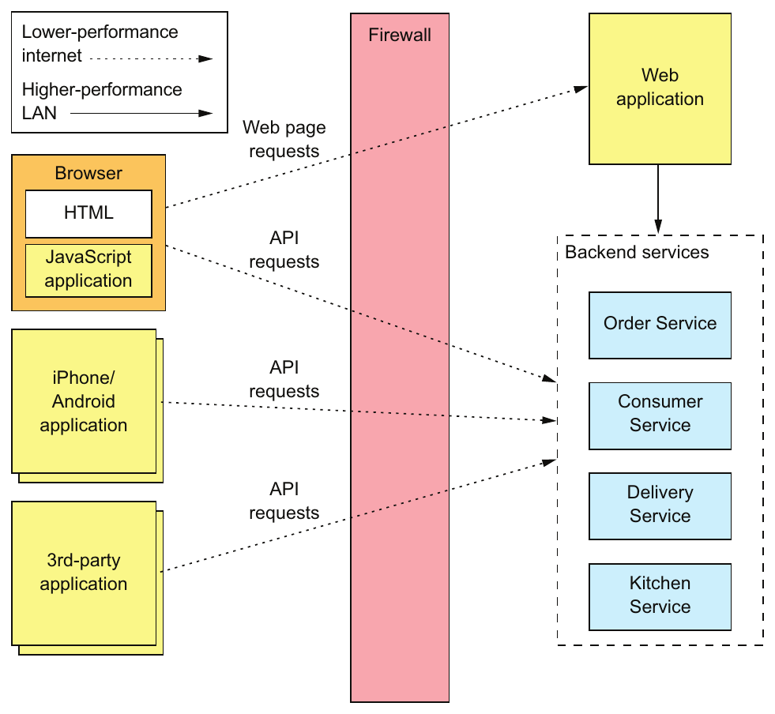

> **English:** Figure 8.1 The FTGO application’s services and their clients. There are several different types of clients. Some are inside the firewall, and others are outside. Those outside the firewall access the services over the lower-performance internet/mobile network. Those clients inside the firewall use a higher- performance LAN.
>
> **Türkçe:** Şekil 8.1 FTGO uygulamasının servisleri ve istemcileri. Farklı türlerde istemciler vardır. Bazıları güvenlik duvarının içinde, bazıları dışındadır. Dışarıdaki istemciler servislere daha düşük performanslı internet/mobil ağ üzerinden erişir. Güvenlik duvarının içindeki istemciler ise daha yüksek performanslı yerel ağı (LAN) kullanır.

<!-- source-record: u08_0021 -->

> **English:** To learn more about these drawbacks, let’s take a look at how the FTGO mobile application for consumers retrieves data from the services.
>
> **Türkçe:** Bu dezavantajlar hakkında daha fazla bilgi almak için, FTGO mobil uygulamasının tüketiciler için servislerden verileri nasıl geri aldığına bir göz atalım.

<!-- source-record: u08_0022 -->

### 8.1.1 API design issues for the FTGO mobile client — FTGO mobil istemcisi için API tasarımında ele alınacak konular

<!-- source-record: u08_0023 -->

> **English:** Consumers use the FTGO mobile client to place and manage their orders. Imagine you’re developing the mobile client’s View Order view, which displays an order. As described in chapter 7, the information displayed by this view includes basic order information, including its status, payment status, status of the order from the restaurant’s perspective, and delivery status, including its location and estimated delivery time if in transit.
>
> **Türkçe:** Tüketiciler, sipariş vermek ve siparişlerini yönetmek için FTGO mobil istemcisini kullanır. Mobil istemcinin sipariş gösteren View Order görünümünü geliştirdiğinizi düşünün. Yedinci bölümde açıklandığı gibi görünüm; siparişin durumu gibi temel bilgileri, ödeme durumunu, restoran açısından sipariş durumunu ve teslimat durumunu gösterir. Sipariş yoldaysa konumu ve tahmini teslimat zamanı da gösterilir.

<!-- source-record: u08_0024 -->

> **English:** The monolithic version of the FTGO application has an API endpoint that returns the order details. The mobile client retrieves the information it needs by making a single request. In contrast, in the microservices version of the FTGO application, the order details are, as described previously, scattered across several services, including the following:
>
> **Türkçe:** FTGO uygulamasının monolit versiyonunda sipariş ayrıntılarını iade eden bir API uç noktası vardır. Mobil istemci, tek bir talebi yaparak ihtiyaç duyduğu bilgileri alır. Öte yandan, FTGO uygulamasının mikroservis versiyonunda, sipariş detayları daha önce açıklandığı gibi, aşağıdakileri içeren çeşitli servisler arasında yayılmıştır:

<!-- source-pages: 256 -->

<!-- source-record: u08_0025 -->

> **English:** • Order Service—Basic order information, including the details and status
>
> **Türkçe:** - Order Service - Ayrıntıları ve durumu dahil olmak üzere temel sipariş bilgileri

<!-- source-record: u08_0026 -->

> **English:** • Kitchen Service—The status of the order from the restaurant’s perspective and the estimated time it will be ready for pickup
>
> **Türkçe:** • Kitchen Service — Restoran açısından siparişin durumu ve teslim alınmaya hazır olacağı tahmini zaman

<!-- source-record: u08_0027 -->

> **English:** • Delivery Service—The order’s delivery status, its estimated delivery time, and its current location
>
> **Türkçe:** - Delivery Service - Sipariş teslimat durumu, tahmin edilen teslimat süresi ve mevcut konumu

<!-- source-record: u08_0028 -->

> **English:** • Accounting Service—The order’s payment status
>
> **Türkçe:** - Accounting Service - Siparişin ödeme durumu

<!-- source-record: u08_0029 -->

> **English:** If the mobile client invokes the services directly, then it must, as figure 8.2 shows, make multiple calls to retrieve this data.
>
> **Türkçe:** Mobil istemci servisleri doğrudan çağırırsa Şekil 8.2’de gösterildiği gibi bu verileri almak için birden fazla çağrı yapmalıdır.

<!-- source-record: u08_0030 -->

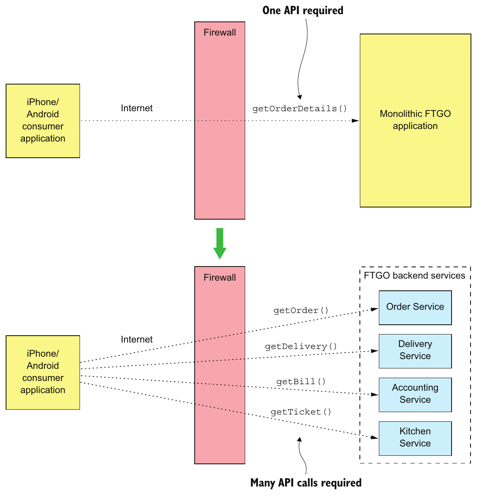

> **English:** Figure 8.2 A client can retrieve the order details from the monolithic FTGO application with a single request. But the client must make multiple requests to retrieve the same information in a microservice architecture.
>
> **Türkçe:** Şekil 8.2 İstemci, monolitik FTGO uygulamasından sipariş ayrıntılarını tek istekle alabilir. Ancak mikroservis mimarisinde aynı bilgileri almak için birden fazla istek göndermelidir.

<!-- source-pages: 257 -->

<!-- source-record: u08_0031 -->

> **English:** In this design, the mobile application is playing the role of API composer. It invokes multiple services and combines the results. Although this approach seems reasonable, it has several serious problems.
>
> **Türkçe:** Bu tasarımda mobil uygulama API composer rolündedir. Birden fazla servisi çağırıp sonuçları birleştirir. Makul görünse de bu yaklaşımın ciddi sorunları vardır.

<!-- source-record: u08_0032 -->

#### POOR USER EXPERIENCE DUE TO THE CLIENT MAKING MULTIPLE REQUESTS — İstemcinin birden fazla istek göndermesi nedeniyle kötü kullanıcı deneyimi

<!-- source-record: u08_0033 -->

> **English:** The first problem is that the mobile application must sometimes make multiple requests to retrieve the data it wants to display to the user. The chatty interaction between the application and the services can make the application seem unresponsive, especially when it uses the internet or a mobile network. The internet has much lower bandwidth and higher latency than a LAN, and mobile networks are even worse. The latency of a mobile network (and internet) is typically 100x greater than a LAN.
>
> **Türkçe:** İlk sorun, mobil uygulamanın kullanıcıya göstereceği verileri almak için bazen birden fazla istek göndermek zorunda olmasıdır. Uygulama ile servisler arasındaki çok sayıda çağrı gerektiren etkileşim, özellikle internet veya mobil ağda uygulamanın tepkisiz görünmesine neden olabilir. İnternetin bant genişliği LAN’dan çok daha düşük, gecikmesi daha yüksektir; mobil ağların durumu ise daha da kötüdür. Mobil ağın ve internetin gecikmesi genellikle LAN’ın 100 katıdır.

<!-- source-record: u08_0034 -->

> **English:** The higher latency might not be a problem when retrieving the order details, because the mobile application minimizes the delay by executing the requests concurrently. The overall response time is no greater than that of a single request. But in other scenarios, a client may need to execute requests sequentially, which will result in a poor user experience.
>
> **Türkçe:** Daha yüksek gecikme, sipariş ayrıntılarını alırken bir sorun olmayabilir, çünkü mobil uygulama istekleri eşzamanlı olarak gerçekleştirerek gecikmeyi en aza indirir. Toplam yanıt süresi tek bir talebinkinden fazla değildir. Ancak diğer senaryolarda, bir istemci istekleri sırayla gerçekleştirmek zorunda kalabilir, bu da kötü bir kullanıcı deneyimine yol açacaktır.

<!-- source-record: u08_0035 -->

> **English:** What’s more, poor user experience due to network latency is not the only issue with a chatty API. It requires the mobile developer to write potentially complex API composition code. This work is a distraction from their primary task of creating a great user experience. Also, because each network request consumes power, a chatty API drains the mobile device’s battery faster.
>
> **Türkçe:** Üstelik çok sayıda çağrı gerektiren API’nin tek sorunu, ağ gecikmesinden doğan kötü kullanıcı deneyimi değildir. Mobil geliştiricinin karmaşık olabilecek API composition kodu yazmasını da gerektirir. Bu iş, iyi kullanıcı deneyimi oluşturma yönündeki temel görevinden zaman alır. Ayrıca her ağ isteği enerji tükettiğinden böyle bir API, mobil cihazın pilini daha hızlı tüketir.

<!-- source-record: u08_0036 -->

#### LACK OF ENCAPSULATION REQUIRES FRONTEND DEVELOPERS TO CHANGE THEIR CODE IN LOCKSTEP WITH THE BACKEND — Kapsülleme eksikliği, frontend geliştiricilerinin kodlarını backend ile eşzamanlı değiştirmesini gerektirir

<!-- source-record: u08_0037 -->

> **English:** Another drawback of a mobile application directly accessing the services is the lack of encapsulation. As an application evolves, the developers of a service sometimes change an API in a way that breaks existing clients. They might even change how the system is decomposed into services. Developers may add new services and split or merge existing services. But if knowledge about the services is baked into a mobile application, it can be difficult to change the services’ APIs.
>
> **Türkçe:** Mobil uygulamanın servislere doğrudan erişmesinin diğer dezavantajı, kapsüllemenin bulunmamasıdır. Uygulama geliştikçe servis geliştiricileri bazen API’yi mevcut istemcilerle uyumluluğu bozacak biçimde değiştirir. Sistemin servislere ayrılma biçimini bile değiştirebilir; yeni servisler ekleyebilir, mevcut servisleri bölebilir veya birleştirebilirler. Ancak servis bilgileri mobil uygulamaya gömülmüşse servis API’lerini değiştirmek zorlaşır.

<!-- source-record: u08_0038 -->

> **English:** Unlike when updating a server-side application, it takes hours or perhaps even days to roll out a new version of a mobile application. Apple or Google must approve the upgrade and make it available for download. Users might not download the upgrade immediately—if ever. And you may not want to force reluctant users to upgrade. The strategy of exposing service APIs to mobile creates a significant obstacle to evolving those APIs.
>
> **Türkçe:** Sunucu tarafındaki uygulamayı güncellemekten farklı olarak mobil uygulamanın yeni sürümünü dağıtmak saatler, hatta günler sürebilir. Apple veya Google güncellemeyi onaylayıp indirilebilir hâle getirmelidir. Kullanıcılar güncellemeyi hemen indirmeyebilir; hatta hiç indirmeyebilir. İsteksiz kullanıcıları güncellemeye zorlamak da istemeyebilirsiniz. Servis API’lerini mobil istemcilere doğrudan açmak, bu API’leri geliştirmeye önemli bir engel oluşturur.

<!-- source-record: u08_0039 -->

#### SERVICES MIGHT USE CLIENT-UNFRIENDLY IPC MECHANISMS — Servisler, istemciler için uygun olmayan IPC mekanizmaları kullanabilir

<!-- source-record: u08_0040 -->

> **English:** Another challenge with a mobile application directly calling services is that some services could use protocols that aren’t easily consumed by a client. Client applications that run outside the firewall typically use protocols such as HTTP and WebSockets. But as described in chapter 3, service developers have many protocols to choose from—not just HTTP. Some of an application’s services might use gRPC, whereas others could use the AMQP messaging protocol. These kinds of protocols work well internally, but might not be easily consumed by a mobile client. Some aren’t even firewall friendly.
>
> **Türkçe:** Mobil uygulamanın servisleri doğrudan çağırmasının başka bir güçlüğü, bazı servislerin istemcinin kolay kullanamayacağı protokollere sahip olabilmesidir. Güvenlik duvarının dışında çalışan istemciler genellikle HTTP ve WebSockets kullanır. Ancak 3. bölümde anlatıldığı gibi servis geliştiricilerinin seçenekleri HTTP ile sınırlı değildir. Bazı servisler gRPC, diğerleri AMQP mesajlaşma protokolü kullanabilir. Bu protokoller sistem içinde iyi çalışsa da mobil istemci tarafından kolay kullanılamayabilir. Bazıları güvenlik duvarlarıyla bile uyumlu değildir.

<!-- source-pages: 258 -->

<!-- source-record: u08_0041 -->

### 8.1.2 API design issues for other kinds of clients — Diğer istemci türleri için API tasarımında ele alınacak konular

<!-- source-record: u08_0042 -->

> **English:** I picked the mobile client because it’s a great way to demonstrate the drawbacks of clients accessing services directly. But the problems created by exposing services to clients aren’t specific to just mobile clients. Other kinds of clients, especially those outside the firewall, also encounter these problems. As described earlier, the FTGO application’s services are consumed by web applications, browser-based JavaScript applications, and third-party applications. Let’s take a look at the API design issues with these clients.
>
> **Türkçe:** Mobil istemciyi seçtim çünkü bu, doğrudan servislere erişen istemcilerin dezavantajlarını göstermenin harika bir yolu. Ama istemcilere servisleri açığa çıkarmanın yarattığı sorunlar sadece mobil istemciler için özel değildir. Diğer tür istemciler, özellikle güvenlik duvarının dışında olanlar da bu sorunlarla karşılaşıyor. Daha önce açıklandığı gibi, FTGO uygulamasının servisleri web uygulamaları, tarayıcı tabanlı JavaScript uygulamaları ve üçüncü taraf uygulamaları tarafından tüketilir. Bu istemcilerle API tasarım sorunlarına bir göz atalım.

<!-- source-record: u08_0043 -->

#### API DESIGN ISSUES FOR WEB APPLICATIONS — Web uygulamaları için API tasarımında ele alınacak konular

<!-- source-record: u08_0044 -->

> **English:** Traditional server-side web applications, which handle HTTP requests from browsers and return HTML pages, run within the firewall and access the services over a LAN. Network bandwidth and latency aren’t obstacles to implementing API composition in a web application. Also, web applications can use non-web-friendly protocols to access the services. The teams that develop web applications are part of the same organization and often work in close collaboration with the teams writing the backend services, so a web application can easily be updated whenever the backend services are changed. Consequently, it’s feasible for a web application to access the backend services directly.
>
> **Türkçe:** Tarayıcılardan HTTP isteklerini işleyen ve HTML sayfalarını geri veren geleneksel sunucu taraflı web uygulamaları, güvenlik duvarı içinde çalışır ve servislere bir LAN üzerinden erişir. Ağ bant genişliği ve gecikme bir web uygulamasında API kompozisyonunun uygulanmasında engeller değildir. Ayrıca, web uygulamaları servislere erişmek için web dostu olmayan protokoller kullanabilir. Web uygulamalarını geliştiren ekipler aynı organizasyonun bir parçasıdır ve genellikle arka uç servisleri yazar ekiplerle yakın bir işbirliği içinde çalışır, bu nedenle web uygulamalarının arka uç servisleri değiştirildiğinde kolayca güncellenmesi mümkündür. Sonuç olarak, bir web uygulaması için arka uç servislerine doğrudan erişmek mümkün.

<!-- source-record: u08_0045 -->

#### API DESIGN ISSUES FOR BROWSER-BASED JAVASCRIPT APPLICATIONS — Tarayıcıda çalışan JavaScript uygulamaları için API tasarımında ele alınacak konular

<!-- source-record: u08_0046 -->

> **English:** Modern browser applications use some amount of JavaScript. Even if the HTML is primarily generated by a server-side web application, it’s common for JavaScript running in the browser to invoke services. For example, all of the FTGO application web applications—Consumer, Restaurant, and Admin—contain JavaScript that invokes the backend services. The Consumer web application, for instance, dynamically refreshes the Order Details page using JavaScript that invokes the service APIs.
>
> **Türkçe:** Modern tarayıcı uygulamaları belirli ölçüde JavaScript kullanır. HTML esas olarak sunucu tarafındaki web uygulamasında üretilse bile tarayıcıda çalışan JavaScript’in servisleri çağırması yaygındır. Örneğin FTGO’nun Consumer, Restaurant ve Admin web uygulamalarının hepsi backend servislerini çağıran JavaScript içerir. Consumer web uygulaması, Order Details sayfasını servis API’lerini çağıran JavaScript ile dinamik olarak yeniler.

<!-- source-record: u08_0047 -->

> **English:** On one hand, browser-based JavaScript applications are easy to update when service APIs change. On the other hand, JavaScript applications that access the services over the internet have the same problems with network latency as mobile applications. To make matters worse, browser-based UIs, especially those for the desktop, are usually more sophisticated and need to compose more services than mobile applications. It’s likely that the Consumer and Restaurant applications, which access services over the internet, won’t be able to compose service APIs efficiently.
>
> **Türkçe:** Bir yandan servis API’leri değiştiğinde tarayıcı tabanlı JavaScript uygulamalarını güncellemek kolaydır. Diğer yandan servislere internet üzerinden erişen bu uygulamalar, mobil uygulamalarla aynı ağ gecikmesi sorunlarını yaşar. Üstelik özellikle masaüstü tarayıcı arayüzleri genellikle daha kapsamlıdır ve mobil uygulamalardan daha fazla servisin sonuçlarını birleştirmeleri gerekir. Servislere internetten erişen Consumer ve Restaurant uygulamalarının, servis API’lerini verimli biçimde birleştirememesi olasıdır.

<!-- source-record: u08_0048 -->

#### DESIGNING APIS FOR THIRD-PARTY APPLICATIONS — Üçüncü taraf uygulamalar için API tasarlamak

<!-- source-record: u08_0049 -->

> **English:** FTGO, like many other organizations, exposes an API to third-party developers. The developers can use the FTGO API to write applications that place and manage orders. These third-party applications access the APIs over the internet, so API composition is likely to be inefficient. But the inefficiency of API composition is a relatively minor problem compared to the much larger challenge of designing an API that’s used by third-party applications. That’s because third-party developers need an API that’s stable.
>
> **Türkçe:** Birçok kuruluş gibi FTGO da üçüncü taraf geliştiricilere API sunar. Geliştiriciler bununla sipariş veren ve siparişleri yöneten uygulamalar yazabilir. Bu uygulamalar API’lere internetten eriştiğinden API composition muhtemelen verimsiz olur. Ancak bu verimsizlik, üçüncü taraf uygulamaların kullanacağı API’yi tasarlamanın çok daha büyük güçlüğü yanında küçük kalır. Çünkü üçüncü taraf geliştiricilerin kararlı bir API’ye ihtiyacı vardır.

<!-- source-pages: 259 -->

<!-- source-record: u08_0050 -->

> **English:** Very few organizations can force third-party developers to upgrade to a new API. Organizations that have an unstable API risk losing developers to a competitor. Consequently, you must carefully manage the evolution of an API that’s used by third-party developers. You typically have to maintain older versions for a long time—possibly forever.
>
> **Türkçe:** Çok az kuruluş, üçüncü taraf geliştiricileri yeni API’ye geçmeye zorlayabilir. Sık ve uyumsuz değişen API’ye sahip kuruluşlar, geliştiricileri rakiplerine kaybetme riski taşır. Bu nedenle üçüncü taraf geliştiricilerin kullandığı API’nin değişimini dikkatle yönetmelisiniz. Genellikle eski sürümleri uzun süre, belki de süresiz desteklemeniz gerekir.

<!-- source-record: u08_0051 -->

> **English:** This requirement is a huge burden for an organization. It’s impractical to make the developers of the backend services responsible for maintaining long-term backward compatibility. Rather than expose services directly to third-party developers, organizations should have a separate public API that’s developed by a separate team. As you’ll learn later, the public API is implemented by an architectural component known as an API gateway. Let’s look at how an API gateway works.
>
> **Türkçe:** Bu gereksinim kuruluş için büyük bir yüktür. Backend servislerinin geliştiricilerini uzun vadeli geriye dönük uyumluluktan sorumlu tutmak pratik değildir. Kuruluşlar servisleri doğrudan üçüncü taraf geliştiricilere açmak yerine, ayrı ekibin geliştirdiği ayrı bir public API sunmalıdır. İleride göreceğiniz gibi public API’yi, API gateway denen mimari bileşen gerçekleştirir. Nasıl çalıştığına bakalım.

<!-- source-record: u08_0052 -->

## 8.2 The API gateway pattern — API gateway örüntüsü

<!-- source-record: u08_0053 -->

> **English:** As you’ve just seen, there are numerous drawbacks with services accessing services directly. It’s often not practical for a client to perform API composition over the internet. The lack of encapsulation makes it difficult for developers to change service decomposition and APIs. Services sometimes use communication protocols that aren’t suitable outside the firewall. Consequently, a much better approach is to use an API gateway.
>
> **Türkçe:** Gördüğünüz gibi, doğrudan servislere erişmek için birçok dezavantaj vardır. Bir istemci için genellikle internet üzerinden API kompozisyonunu gerçekleştirmek pratik değildir. Kapsülasyon eksikliği geliştiricilerin servis parçalanmasını ve API'yi değiştirmesini zorlaştırır. servisler bazen güvenlik duvarının dışında uygun olmayan iletişim protokollerini kullanır. Sonuç olarak, çok daha iyi bir yaklaşım bir API geçidi kullanmaktır.

<!-- source-record: u08_0054 -->

### Pattern: API gateway — Örüntü: API gateway (API geçidi)

<!-- source-record: u08_0055 -->

> **English:** Implement a service that’s the entry point into the microservices-based application from external API clients. See http://microservices.io/patterns/apigateway.html.
>
> **Türkçe:** Dış API istemcilerinden mikroservislere dayalı uygulamaya giriş noktası olan bir servisi uygulayın. http://microservices.io/patterns/apigateway.html'a bakın.

<!-- source-record: u08_0056 -->

> **English:** An API gateway is a service that’s the entry point into the application from the outside world. It’s responsible for request routing, API composition, and other functions, such as authentication. This section covers the API gateway pattern. I discuss its benefits and drawbacks and describe various design issues you must address when developing an API gateway.
>
> **Türkçe:** API gateway, dış dünyadan uygulamaya giriş noktası olan bir servistir. İstek yönlendirme, API composition ve kimlik doğrulama gibi diğer işlevlerden sorumludur. Bu kısım API gateway örüntüsünü ele alır. Avantajlarını, dezavantajlarını ve bir API gateway geliştirirken çözmeniz gereken çeşitli tasarım konularını açıklıyorum.

<!-- source-record: u08_0057 -->

### 8.2.1 Overview of the API gateway pattern — API gateway örüntüsüne genel bakış

<!-- source-record: u08_0058 -->

> **English:** Section 8.1.1 described the drawbacks of clients, such as the FTGO mobile application, making multiple requests in order to display information to the user. A much better approach is for a client to make a single request to an API gateway, a service that serves as the single entry point for API requests into an application from outside the firewall. It’s similar to the Facade pattern from object-oriented design. Like a facade, an API gateway encapsulates the application’s internal architecture and provides an API to its clients. It may also have other responsibilities, such as authentication, monitoring, and rate limiting. Figure 8.3 shows the relationship between the clients, the API gateway, and the services.
>
> **Türkçe:** 8.1.1. kısımda FTGO mobil uygulaması gibi istemcilerin, kullanıcıya bilgi göstermek için birden fazla istek göndermesinin dezavantajları anlatıldı. Daha iyi yaklaşım, istemcinin güvenlik duvarının dışından uygulamaya gelen API isteklerinin tek giriş noktası olan API gateway’e tek istek göndermesidir. Bu, nesne yönelimli tasarımdaki Facade örüntüsüne benzer. API gateway de uygulamanın iç mimarisini kapsüller ve istemcilerine API sunar. Kimlik doğrulama, izleme ve istek hızı sınırlama gibi sorumlulukları da olabilir. Şekil 8.3; istemciler, API gateway ve servisler arasındaki ilişkiyi gösterir.

<!-- source-pages: 260 -->

<!-- source-record: u08_0059 -->

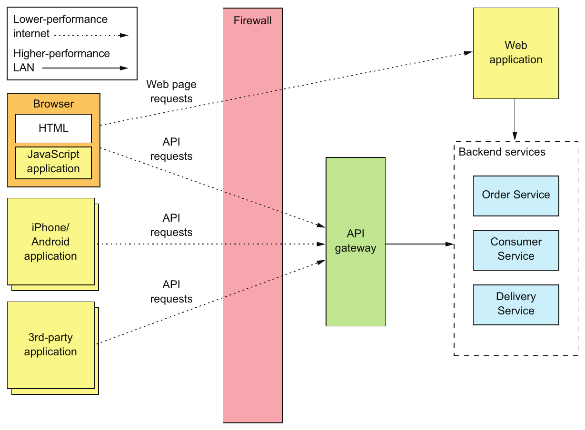

> **English:** Figure 8.3 The API gateway is the single entry point into the application for API calls from outside the firewall.
>
> **Türkçe:** Şekil 8.3 API gateway, güvenlik duvarının dışından gelen API çağrıları için uygulamanın tek giriş noktasıdır.

<!-- source-record: u08_0060 -->

> **English:** The API gateway is responsible for request routing, API composition, and protocol translation. All API requests from external clients first go to the API gateway, which routes some requests to the appropriate service. The API gateway handles other requests using the API composition pattern and by invoking multiple services and aggregating the results. It may also translate between client-friendly protocols such as HTTP and WebSockets and client-unfriendly protocols used by the services.
>
> **Türkçe:** API gateway; istek yönlendirme, API composition ve protokol dönüşümünden sorumludur. Dış istemcilerin bütün API istekleri önce gateway’e gelir. Gateway bazı istekleri uygun servise yönlendirir. Diğerlerini API composition kullanarak, birden fazla servisi çağırıp sonuçları birleştirerek işler. Ayrıca HTTP ve WebSockets gibi istemcilerin kolay kullandığı protokollerle servislerin kullandığı, istemciler için uygun olmayan protokoller arasında dönüşüm yapabilir.

<!-- source-record: u08_0061 -->

#### REQUEST ROUTING — İstek yönlendirme

<!-- source-record: u08_0062 -->

> **English:** One of the key functions of an API gateway is request routing. An API gateway implements some API operations by routing requests to the corresponding service. When it receives a request, the API gateway consults a routing map that specifies which service to route the request to. A routing map might, for example, map an HTTP method and path to the HTTP URL of a service. This function is identical to the reverse proxying features provided by web servers such as NGINX.
>
> **Türkçe:** API gateway’in temel işlevlerinden biri istek yönlendirmedir. Bazı API işlemlerini, istekleri ilgili servise yönlendirerek gerçekleştirir. İstek aldığında, isteğin hangi servise gönderileceğini belirten yönlendirme eşlemesine bakar. Örneğin bu eşleme, HTTP metodunu ve yolunu servisin HTTP URL’sine eşleyebilir. Bu işlev, NGINX gibi web sunucularının sunduğu reverse proxy özellikleriyle aynıdır.

<!-- source-pages: 261 -->

<!-- source-record: u08_0063 -->

#### API COMPOSITION — API composition (API birleştirme)

<!-- source-record: u08_0064 -->

> **English:** An API gateway typically does more than simply reverse proxying. It might also implement some API operations using API composition. The FTGO API gateway, for example, implements the Get Order Details API operation using API composition. As figure 8.4 shows, the mobile application makes one request to the API gateway, which fetches the order details from multiple services.
>
> **Türkçe:** Bir API geçidi genellikle sadece ters proxy yapmaktan daha fazlasını yapar. Ayrıca API kompozisyonunu kullanarak bazı API işlemlerini uygulayabilir. Örneğin FTGO API geçidi, API kompozisyonunu kullanarak Get Order Details API işlevi uyguluyor. Şekil 8.4'te gösterildiği gibi, mobil uygulama, sipariş ayrıntılarını birden fazla servisten alan API geçitine tek bir talep yapar.

<!-- source-record: u08_0065 -->

> **English:** The FTGO API gateway provides a coarse-grained API that enables mobile clients to retrieve the data they need with a single request. For example, the mobile client makes a single getOrderDetails() request to the API gateway.
>
> **Türkçe:** FTGO API gateway, mobil istemcilerin gereken verileri tek istekle almasını sağlayan, geniş kapsamlı işlemler sunan bir API sağlar. Örneğin mobil istemci, gateway’e tek bir getOrderDetails() isteği gönderir.

<!-- source-record: u08_0066 -->

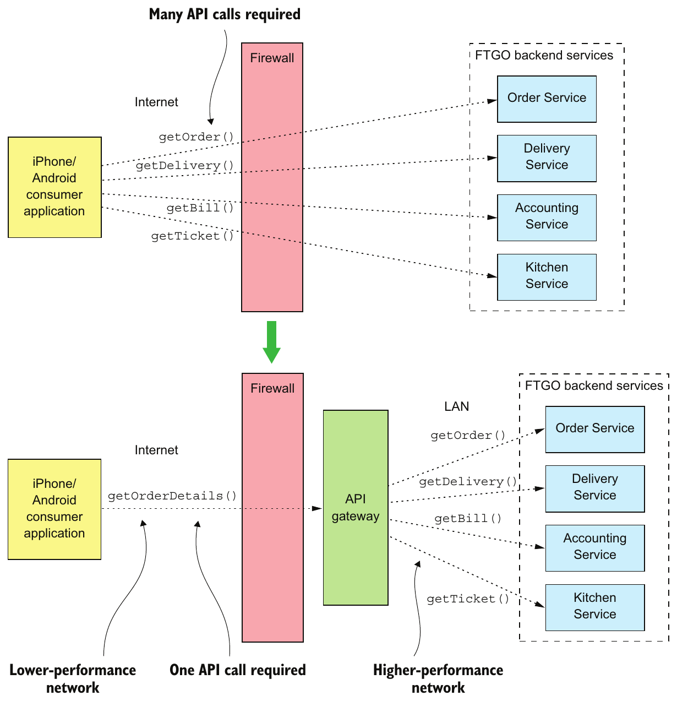

> **English:** Figure 8.4 An API gateway often does API composition, which enables a client such as a mobile device to efficiently retrieve data using a single API request.
>
> **Türkçe:** Şekil 8.4 API gateway çoğunlukla API composition gerçekleştirir; böylece mobil cihaz gibi bir istemci, tek API isteğiyle verileri verimli biçimde alabilir.

<!-- source-pages: 262 -->

<!-- source-record: u08_0067 -->

#### PROTOCOL TRANSLATION — Protokol dönüştürme

<!-- source-record: u08_0068 -->

> **English:** An API gateway might also perform protocol translation. It might provide a RESTful API to external clients, even though the application services use a mixture of protocols internally, including REST and gRPC. When needed, the implementation of some API operations translates between the RESTful external API and the internal gRPC-based APIs.
>
> **Türkçe:** Bir API geçidi de protokol çevirisini yapabilir. Uygulama servisleri REST ve gRPC dahil olmak üzere iç protokollerin bir karışımını kullanmasına rağmen, harici istemcilere RESTful API sağlayabilir. Gerektiğinde, bazı API işlemlerinin uygulanması RESTful dış API ile iç gRPC tabanlı API'ler arasında çevrilir.

<!-- source-record: u08_0069 -->

#### THE API GATEWAY PROVIDES EACH CLIENT WITH CLIENT-SPECIFIC API — API gateway, her istemciye o istemciye özgü bir API sağlar

<!-- source-record: u08_0070 -->

> **English:** An API gateway could provide a single one-size-fits-all (OSFA) API. The problem with a single API is that different clients often have different requirements. For instance, a third-party application might require the Get Order Details API operation to return the complete Order details, whereas a mobile client only needs a subset of the data. One way to solve this problem is to give clients the option of specifying in a request which fields and related objects the server should return. This approach is adequate for a public API that must serve a broad range of third-party applications, but it often doesn’t give clients the control they need.
>
> **Türkçe:** API gateway, herkese uyan tek bir API (one-size-fits-all; OSFA) sunabilir. Ancak farklı istemcilerin çoğunlukla farklı gereksinimleri vardır. Örneğin üçüncü taraf uygulama, Get Order Details işleminin bütün Order ayrıntılarını döndürmesini isterken mobil istemci yalnızca verilerin bir alt kümesine ihtiyaç duyabilir. Bir çözüm, istemcinin istekte sunucunun döndüreceği alanları ve ilişkili nesneleri belirtmesini sağlamaktır. Bu yaklaşım, geniş bir üçüncü taraf uygulama yelpazesine hizmet veren public API için yeterli olsa da istemcilere çoğu zaman gereken kontrolü vermez.

<!-- source-record: u08_0071 -->

> **English:** A better approach is for the API gateway to provide each client with its own API. For example, the FTGO API gateway can provide the FTGO mobile client with an API that’s specifically designed to meet its requirements. It may even have different APIs for the Android and iPhone mobile applications. The API gateway will also implement a public API for third-party developers to use. Later on, I’ll describe the Backends for frontends pattern that takes this concept of an API-per-client even further by defining a separate API gateway for each client.
>
> **Türkçe:** Daha iyi yaklaşım, API gateway’in her istemciye kendi API’sini sunmasıdır. Örneğin FTGO gateway’i, mobil istemciye gereksinimleri için özel tasarlanmış API sağlayabilir. Android ve iPhone uygulamalarının API’leri bile farklı olabilir. Gateway, üçüncü taraf geliştiriciler için public API de sunar. İleride, her istemci için ayrı gateway tanımlayarak istemci başına API fikrini daha ileri taşıyan Backends for frontends örüntüsünü anlatacağım.

<!-- source-record: u08_0072 -->

#### IMPLEMENTING EDGE FUNCTIONS — Edge functions (sınır işlevleri) gerçekleştirmek

<!-- source-record: u08_0073 -->

> **English:** Although an API gateway’s primary responsibilities are API routing and composition, it may also implement what are known as edge functions. An edge function is, as the name suggests, a request-processing function implemented at the edge of an application. Examples of edge functions that an application might implement include the following:
>
> **Türkçe:** Bir API geçitinin ana sorumlulukları API yönlendirme ve kompozisyon olmasına rağmen, aynı zamanda kenar fonksiyonları olarak bilinenleri de uygulayabilir. Bir kenar fonksiyonu, adından da anlaşıldığı gibi, bir uygulamanın kenarında uygulanan bir talep işleme fonksiyonu. Bir uygulamanın uygulayabileceği kenar fonksiyonlarının örnekleri şunları içerir:

<!-- source-record: u08_0074 -->

> **English:** • Authentication—Verifying the identity of the client making the request.
>
> **Türkçe:** • Authentication (kimlik doğrulama) — İsteği gönderen istemcinin kimliğini doğrulamak.

<!-- source-record: u08_0075 -->

> **English:** • Authorization—Verifying that the client is authorized to perform that particular operation.
>
> **Türkçe:** • Authorization (yetkilendirme) — İstemcinin belirtilen işlemi yapmaya yetkili olduğunu doğrulamak.

<!-- source-record: u08_0076 -->

> **English:** • Rate limiting—Limiting how many requests per second from either a specific client and/or from all clients.
>
> **Türkçe:** • Rate limiting — Belirli bir istemciden ve/veya bütün istemcilerden gelen saniyelik istek sayısını sınırlamak.

<!-- source-record: u08_0077 -->

> **English:** • Caching—Cache responses to reduce the number of requests made to the services.
>
> **Türkçe:** • Caching (önbelleğe alma) — Servislere gönderilen istek sayısını azaltmak için yanıtları önbelleğe almak.

<!-- source-record: u08_0078 -->

> **English:** • Metrics collection—Collect metrics on API usage for billing analytics purposes.
>
> **Türkçe:** • Metrics collection — Faturalandırma analizi amacıyla API kullanım metriklerini toplamak.

<!-- source-record: u08_0079 -->

> **English:** • Request logging—Log requests.
>
> **Türkçe:** • Request logging — İsteklerin log’unu tutmak.

<!-- source-record: u08_0080 -->

> **English:** There are three different places in your application where you could implement these edge functions. First, you can implement them in the backend services. This might make sense for some functions, such as caching, metrics collection, and possibly authorization. But it’s generally more secure if the application authenticates requests on the edge before they reach the services.
>
> **Türkçe:** Uygulamanızda bu kenar fonksiyonları uygulayabileceğiniz üç farklı yer var. Öncelikle, onları arka uç servislerinde uygulayabilirsiniz. Bu bazı işlevler için mantıklı olabilir, örneğin önbellekleme, ölçümler toplama ve muhtemelen yetki. Ancak uygulama, servislere ulaşmadan önce kenarda bulunan istekleri doğruladığında daha güvenli olur.

<!-- source-pages: 263 -->

<!-- source-record: u08_0081 -->

> **English:** The second option is to implement these edge functions in an edge service that’s upstream from the API gateway. The edge service is the first point of contact for an external client. It authenticates the request and performs other edge processing before passing it to the API gateway.
>
> **Türkçe:** İkinci seçenek, bu sınır işlevlerini istek akışında API gateway’den önce bulunan bir edge service içinde gerçekleştirmektir. Dış istemcinin ilk temas noktası bu servistir. İsteğin kimliğini doğrular ve gateway’e iletmeden önce diğer sınır işlemlerini yapar.

<!-- source-record: u08_0082 -->

> **English:** An important benefit of using a dedicated edge service is that it separates concerns. The API gateway focuses on API routing and composition. Another benefit is that it centralizes responsibility for critical edge functions such as authentication. That’s particularly valuable when an application has multiple API gateways that are possibly written using a variety of languages and frameworks. I’ll talk more about that later. The drawback of this approach is that it increases network latency because of the extra hop. It also adds to the complexity of the application.
>
> **Türkçe:** Ayrı bir edge service kullanmanın önemli yararı, sorumlulukları ayırmasıdır. API gateway, yönlendirme ve API composition’a odaklanır. Diğer yararı, kimlik doğrulama gibi kritik sınır işlevlerinin sorumluluğunu merkezileştirmesidir. Uygulamada farklı dil ve framework’lerle yazılmış olabilecek birden fazla gateway varsa bu özellikle değerlidir. Bunu ileride ayrıntılandıracağım. Dezavantajı, ek ağ geçişi nedeniyle gecikmeyi artırmasıdır. Ayrıca uygulamanın karmaşıklığını artırır.

<!-- source-record: u08_0083 -->

> **English:** As a result, it’s often convenient to use the third option and implement these edge functions, especially authorization, in the API gateway itself. There’s one less network hop, which improves latency. There are also fewer moving parts, which reduces complexity. Chapter 11 describes how the API gateway and the services collaborate to implement security.
>
> **Türkçe:** Bu nedenle üçüncü seçeneği kullanarak sınır işlevlerini, özellikle yetkilendirmeyi gateway’in içinde gerçekleştirmek çoğunlukla elverişlidir. Bir ağ geçişi ortadan kalktığından gecikme azalır. Daha az bileşen bulunması karmaşıklığı da azaltır. On birinci bölüm, API gateway ile servislerin güvenliği sağlamak için nasıl iş birliği yaptığını açıklar.

<!-- source-record: u08_0084 -->

#### API GATEWAY ARCHITECTURE — API gateway mimarisi

<!-- source-record: u08_0085 -->

> **English:** An API gateway has a layered, modular architecture. Its architecture, shown in figure 8.5, consists of two layers: the API layer and a common layer. The API layer consists of one or more independent API modules. Each API module implements an API for a particular client. The common layer implements shared functionality, including edge functions such as authentication.
>
> **Türkçe:** Bir API kapısı, katmanlı, modüler bir mimarlığa sahiptir. Resim 8.5'te gösterilen mimarisi iki katmandan oluşur: API katmanı ve ortak bir katman. API katmanı, bir veya daha fazla bağımsız API modülünden oluşur. Her API modülü belirli bir istemci için bir API uyguluyor. Ortak katman, kimlik doğrulama gibi kenar işlevleri de dahil olmak üzere paylaşılan işlevselliği uyguluyor.

<!-- source-record: u08_0086 -->

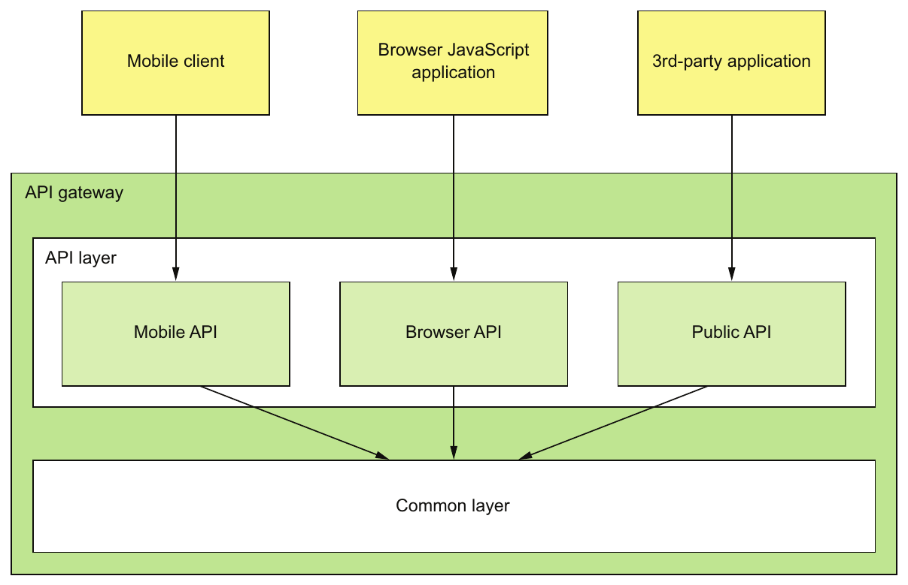

> **English:** Figure 8.5 An API gateway has a layered modular architecture. The API for each client is implemented by a separate module. The common layer implements functionality common to all APIs, such as authentication.
>
> **Türkçe:** Şekil 8.5 API gateway, katmanlı ve modüler bir mimariye sahiptir. Her istemcinin API’si ayrı bir modül tarafından gerçekleştirilir. Ortak katman, kimlik doğrulama gibi bütün API’lerde ortak olan işlevleri gerçekleştirir.

<!-- source-pages: 264 -->

<!-- source-record: u08_0087 -->

> **English:** In this example, the API gateway has three API modules:
>
> **Türkçe:** Bu örnekte, API geçidi üç API modülüne sahiptir:

<!-- source-record: u08_0088 -->

> **English:** • Mobile API—Implements the API for the FTGO mobile client
>
> **Türkçe:** - Mobil API - FTGO mobil istemcisi için API'yi uyguluyor

<!-- source-record: u08_0089 -->

> **English:** • Browser API—Implements the API for the JavaScript application running in the browser
>
> **Türkçe:** • Browser API — Tarayıcıda çalışan JavaScript uygulamasının API’sini gerçekleştirir

<!-- source-record: u08_0090 -->

> **English:** • Public API—Implements the API for third-party developers
>
> **Türkçe:** • Public API — Üçüncü taraf geliştiricilerin API’sini gerçekleştirir

<!-- source-record: u08_0091 -->

> **English:** An API module implements each API operation in one of two ways. Some API operations map directly to single service API operation. An API module implements these operations by routing requests to the corresponding service API operation. It might route requests using a generic routing module that reads a configuration file describing the routing rules.
>
> **Türkçe:** API modülü, her API işlemini iki yoldan biriyle gerçekleştirir. Bazı işlemler, tek bir servis API işlemine doğrudan eşlenir. Modül bunları, istekleri ilgili servis API işlemine yönlendirerek gerçekleştirir. Yönlendirme kurallarını açıklayan yapılandırma dosyasını okuyan genel bir yönlendirme modülü kullanabilir.

<!-- source-record: u08_0092 -->

> **English:** An API module implements other, more complex API operations using API composition. The implementation of this API operation consists of custom code. Each API operation implementation handles requests by invoking multiple services and combining the results.
>
> **Türkçe:** API modülü, daha karmaşık işlemleri API composition ile gerçekleştirir. Bu işlemlerin gerçekleştirimleri özel koddan oluşur. Her biri, birden fazla servisi çağırıp sonuçları birleştirerek istekleri işler.

<!-- source-record: u08_0093 -->

#### API GATEWAY OWNERSHIP MODEL — API gateway sahiplik modeli

<!-- source-record: u08_0094 -->

> **English:** An important question that you must answer is who is responsible for the development of the API gateway and its operation? There are a few different options. One is for a separate team to be responsible for the API gateway. The drawback to that is that it’s similar to SOA, where an Enterprise Service Bus (ESB) team was responsible for all ESB development. If a developer working on the mobile application needs access to a particular service, they must submit a request to the API gateway team and wait for them to expose the API. This kind of centralized bottleneck in the organization is very much counter to the philosophy of the microservice architecture, which promotes loosely coupled autonomous teams.
>
> **Türkçe:** Yanıtlamanız gereken önemli soru, API gateway’in geliştirilmesinden ve işletilmesinden kimin sorumlu olduğudur. Birkaç seçenek vardır. Birincisi, ayrı bir gateway ekibinin sorumluluğu üstlenmesidir. Dezavantajı, bütün ESB geliştirmesinden Enterprise Service Bus ekibinin sorumlu olduğu SOA düzenine benzemesidir. Mobil uygulama geliştiricisi belirli bir servise erişmek istediğinde gateway ekibine talep gönderip API’yi açmalarını beklemelidir. Kuruluştaki böyle merkezi bir darboğaz, gevşek bağlı ve özerk ekipleri destekleyen mikroservis felsefesine oldukça aykırıdır.

<!-- source-record: u08_0095 -->

> **English:** A better approach, which has been promoted by Netflix, is for the client teams— the mobile, web, and public API teams—to own the API module that exposes their API. An API gateway team is responsible for developing the Common module and for the operational aspects of the gateway. This ownership model, shown in figure 8.6, gives the teams control over their APIs.
>
> **Türkçe:** Netflix tarafından teşvik edilen daha iyi bir yaklaşım, istemci ekiplerinin - mobil, web ve kamu API ekiplerinin - API'lerini açığa çıkaran API modülüne sahip olmasıdır. Bir API geçit ekibi, ortak modülün geliştirilmesinden ve geçitlerin operasyonel yönlerinden sorumludur. Şekil 8.6'da gösterilen bu mülkiyet modeli, ekiplere API'lerinin kontrolünü sağlar.

<!-- source-record: u08_0096 -->

> **English:** When a team needs to change their API, they check in the changes to the source repository for the API gateway. To work well, the API gateway’s deployment pipeline must be fully automated. Otherwise, the client teams will often be blocked waiting for the API gateway team to deploy the new version.
>
> **Türkçe:** Ekip API’sini değiştirmek istediğinde değişikliklerini API gateway’in kaynak kod deposuna kaydeder. Bunun iyi çalışması için gateway’in dağıtım pipeline’ı tamamen otomatik olmalıdır. Aksi hâlde istemci ekipleri, gateway ekibinin yeni sürümü dağıtmasını beklerken sık sık ilerleyemez.

<!-- source-record: u08_0097 -->

#### USING THE BACKENDS FOR FRONTENDS PATTERN — Backends for Frontends örüntüsünü kullanmak

<!-- source-record: u08_0098 -->

> **English:** One concern with an API gateway is that responsibility for it is blurred. Multiple teams contribute to the same code base. An API gateway team is responsible for its operation. Though not as bad as a SOA ESB, this blurring of responsibilities is counter to the microservice architecture philosophy of “if you build it, you own it.”
>
> **Türkçe:** Bir API geçidiyle ilgili bir endişe, sorumluluğun bulanık olmasıdır. Çoklu ekipler aynı kod tabanına katkıda bulunur. Bir API geçit ekibi operasyonundan sorumludur. SOA ESB kadar kötü olmasa da, sorumlulukların bu bulanıklaşması "eğer inşa edersen, sahip olursun" mikroservis mimarisi felsefesine aykırıdır.

<!-- source-pages: 265 -->

<!-- source-record: u08_0099 -->

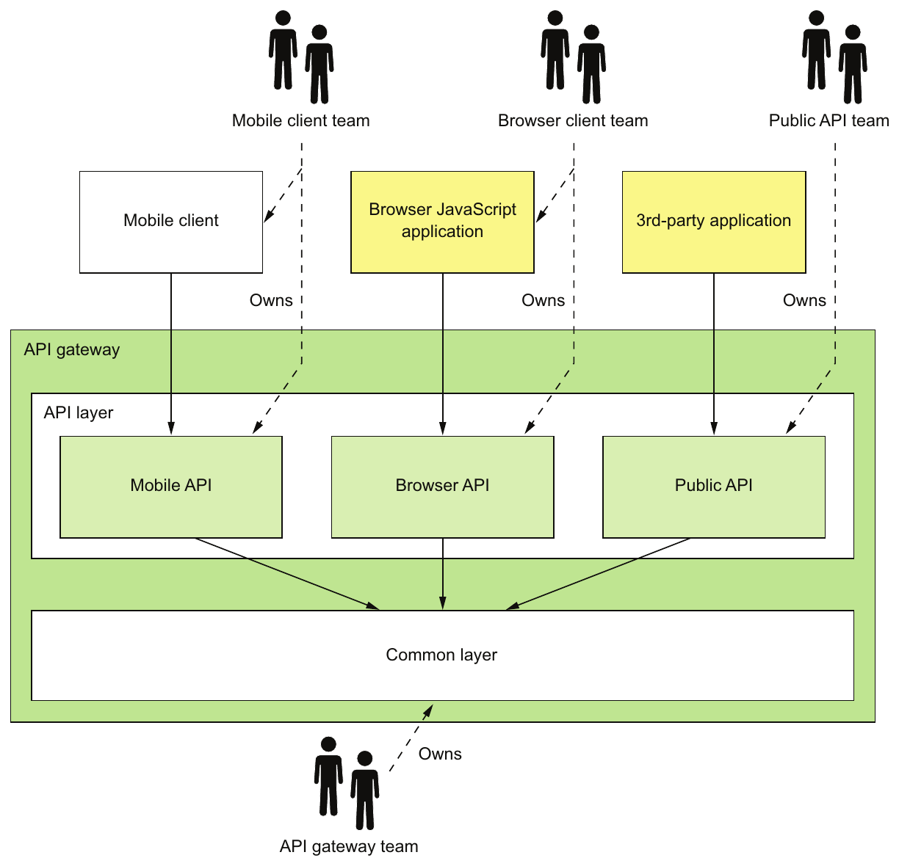

> **English:** Figure 8.6 A client team owns their API module. As they change the client, they can change the API module and not ask the API gateway team to make the changes.
>
> **Türkçe:** Şekil 8.6 İstemci ekibi kendi API modülünün sahibidir. İstemcide değişiklik yaparken, API gateway ekibinden değişiklik istemeden API modülünü kendileri değiştirebilirler.

<!-- source-record: u08_0100 -->

> **English:** The solution is to have an API gateway for each client, the so-called Backends for frontends (BFF) pattern, which was pioneered by Phil Calçado (http://philcalcado.com/) and his colleagues at SoundCloud. As figure 8.7 shows, each API module becomes its own standalone API gateway that’s developed and operated by a single client team.
>
> **Türkçe:** Çözüm, her istemci için bir API geçidi, SoundCloud'deki Phil Calçado (http://philcalcado.com/) ve meslektaşları tarafından öncülük edilen Backends for Frontends (BFF) modeline sahip olmaktır. Resim 8.7'de gösterildiği gibi, her API modülü tek bir istemci ekibi tarafından geliştirilen ve işletilen kendi API kapısı haline gelir.

<!-- source-record: u08_0101 -->

### Pattern: Backends for frontends — Örüntü: Backends for frontends (istemci arayüzlerine özel backend’ler)

<!-- source-record: u08_0102 -->

> **English:** Implement a separate API gateway for each type of client. See http://microservices.io/patterns/apigateway.html.
>
> **Türkçe:** Her bir istemci türü için ayrı bir API geçidi uygulayın. http://microservices.io/patterns/apigateway.html'a bakın.

<!-- source-pages: 266 -->

<!-- source-record: u08_0103 -->

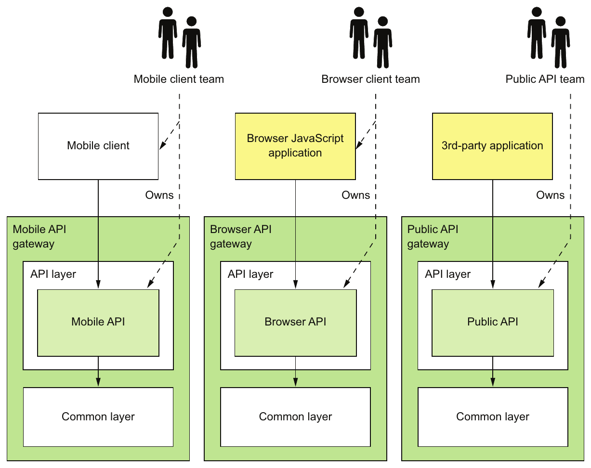

> **English:** Figure 8.7 The Backends for frontends pattern defines a separate API gateway for each client. Each client team owns their API gateway. An API gateway team owns the common layer.
>
> **Türkçe:** Şekil 8.7 Backends for frontends örüntüsü, her istemci için ayrı bir API gateway tanımlar. Her istemci ekibi kendi API gateway’inin sahibidir. Ortak katmanın sahibi ise API gateway ekibidir.

<!-- source-record: u08_0104 -->

> **English:** The public API team owns and operates their API gateway, the mobile team owns and operates theirs, and so on. In theory, different API gateways could be developed using different technology stacks. But that risks duplicating code for common functionality, such as the code that implements edge functions. Ideally, all API gateways use the same technology stack. The common functionality is a shared library implemented by the API gateway team.
>
> **Türkçe:** Public API ekibi kendi gateway’inin sahibi olur ve onu işletir; mobil ekip de kendi gateway’i için aynısını yapar. Kuramsal olarak farklı gateway’ler farklı teknoloji yığınlarıyla geliştirilebilir. Ancak bu, sınır işlevleri gibi ortak işlevlerin kodunun tekrarlanması riskini yaratır. İdeal olarak bütün gateway’ler aynı teknoloji yığınını kullanır. Ortak işlevler, gateway ekibinin geliştirdiği paylaşılan bir kütüphanede bulunur.

<!-- source-record: u08_0105 -->

> **English:** Besides clearly defining responsibilities, the BFF pattern has other benefits. The API modules are isolated from one another, which improves reliability. One misbehaving API can’t easily impact other APIs. It also improves observability, because different API modules are different processes. Another benefit of the BFF pattern is that each API is independently scalable. The BFF pattern also reduces startup time because each API gateway is a smaller, simpler application.
>
> **Türkçe:** BFF örüntüsünün, sorumlulukları açıkça belirlemenin dışında yararları da vardır. API modülleri birbirinden yalıtıldığından güvenilirlik artar. Sorunlu çalışan bir API, diğerlerini kolayca etkileyemez. Farklı modüller farklı süreçlerde çalıştığından gözlemlenebilirlik de artar. Her API bağımsız ölçeklenebilir. Ayrıca her gateway daha küçük ve basit uygulama olduğundan BFF, başlatma süresini azaltır.

<!-- source-pages: 267 -->

<!-- source-record: u08_0106 -->

### 8.2.2 Benefits and drawbacks of an API gateway — API gateway'in yararları ve dezavantajları

<!-- source-record: u08_0107 -->

> **English:** As you might expect, the API gateway pattern has both benefits and drawbacks.
>
> **Türkçe:** Beklediğiniz gibi, API geçit modelinin hem avantajları hem de dezavantajları vardır.

<!-- source-record: u08_0108 -->

#### BENEFITS OF AN API GATEWAY — API gateway'in yararları

<!-- source-record: u08_0109 -->

> **English:** A major benefit of using an API gateway is that it encapsulates internal structure of the application. Rather than having to invoke specific services, clients talk to the gateway. The API gateway provides each client with a client-specific API, which reduces the number of round-trips between the client and application. It also simplifies the client code.
>
> **Türkçe:** API gateway’in önemli yararı, uygulamanın iç yapısını kapsüllemesidir. İstemciler belirli servisleri çağırmak yerine gateway ile iletişim kurar. Gateway, her istemciye ona özgü API sağlayarak istemciyle uygulama arasındaki ağ gidiş dönüşlerinin sayısını azaltır. İstemci kodunu da basitleştirir.

<!-- source-record: u08_0110 -->

#### DRAWBACKS OF AN API GATEWAY — API gateway'in dezavantajları

<!-- source-record: u08_0111 -->

> **English:** The API gateway pattern also has some drawbacks. It is yet another highly available component that must be developed, deployed, and managed. There’s also a risk that the API gateway becomes a development bottleneck. Developers must update the API gateway in order to expose their services’s API. It’s important that the process for updating the API gateway be as lightweight as possible. Otherwise, developers will be forced to wait in line in order to update the gateway. Despite these drawbacks, though, for most real-world applications, it makes sense to use an API gateway. If necessary, you can use the Backends for frontends pattern to enable the teams to develop and deploy their APIs independently.
>
> **Türkçe:** API gateway örüntüsünün dezavantajları da vardır. Geliştirilmesi, dağıtılması ve yönetilmesi gereken, yüksek kullanılabilirliğe sahip olması zorunlu ek bir bileşendir. Geliştirme sürecinde darboğaza dönüşme riski de vardır. Geliştiriciler, servislerinin API’sini sunabilmek için gateway’i güncellemelidir. Güncelleme süreci olabildiğince hafif olmalıdır; aksi hâlde geliştiriciler sırada bekler. Buna rağmen gerçek uygulamaların çoğunda gateway kullanmak anlamlıdır. Gerekirse ekiplerin API’lerini bağımsız geliştirmesini ve dağıtmasını sağlamak için Backends for frontends kullanılabilir.

<!-- source-record: u08_0112 -->

### 8.2.3 Netflix as an example of an API gateway — API gateway örneği olarak Netflix

<!-- source-record: u08_0113 -->

> **English:** A great example of an API gateway is the Netflix API. The Netflix streaming service is available on hundreds of different kinds of devices including televisions, Blu-ray players, smartphones, and many more gadgets. Initially, Netflix attempted to have a one-size-fits-all style API for its streaming service (www.programmableweb.com/news/ why-rest-keeps-me-night/2012/05/15). But the company soon discovered that didn’t work well because of the diverse range of devices and their different needs. Today, Netflix uses an API gateway that implements a separate API for each device. The client device team develops and owns the API implementation.
>
> **Türkçe:** Netflix API, API gateway’e iyi bir örnektir. Netflix’in yayın servisi; televizyonlar, Blu-ray oynatıcılar, akıllı telefonlar ve başka birçok cihaz dâhil yüzlerce cihaz türünde kullanılabilir. Başlangıçta Netflix, yayın servisi için herkese uyan tek API yaklaşımını denedi (www.programmableweb.com/news/why-rest-keeps-me-night/2012/05/15). Ancak cihaz çeşitliliği ve farklı gereksinimler nedeniyle bunun iyi çalışmadığını kısa sürede fark etti. Kitapta anlatılan dönemde Netflix, her cihaz için ayrı API gerçekleştiren bir gateway kullanır. İstemci cihaz ekibi, API gerçekleştirimini geliştirir ve sahiplenir.

<!-- source-record: u08_0114 -->

> **English:** In the first version of the API gateway, each client team implemented their API using Groovy scripts that perform routing and API composition. Each script invoked one or more service APIs using Java client libraries provided by the service teams. On one hand, this works well, and client developers have written thousands of scripts. The Netflix API gateway handles billions of requests per day, and on average each API call fans out to six or seven backend services. On the other hand, Netflix has found this monolithic architecture to be somewhat cumbersome.
>
> **Türkçe:** Gateway’in ilk sürümünde her istemci ekibi, yönlendirme ve API composition yapan Groovy script’leriyle kendi API’sini gerçekleştirdi. Her script, servis ekiplerinin sağladığı Java istemci kütüphaneleriyle bir veya daha fazla servis API’sini çağırıyordu. Bir yandan bu iyi çalıştı ve istemci geliştiricileri binlerce script yazdı. Netflix gateway’i günde milyarlarca istek işler; her API çağrısı ortalama altı veya yedi backend servisine yayılır. Diğer yandan Netflix, bu monolitik mimariyi biraz hantal buldu.

<!-- source-record: u08_0115 -->

> **English:** As a result, Netflix is now moving to an API gateway architecture similar to the Backends for frontends pattern. In this new architecture, client teams write API modules using NodeJS. Each API module runs its own Docker container, but the scripts don’t invoke the services directly. Rather, they invoke a second “API gateway,” which exposes the service APIs using Netflix Falcor. Netflix Falcor is an API technology that does declarative, dynamic API composition and enables a client to invoke multiple services using a single request. This new architecture has a number of benefits. The API modules are isolated from one another, which improves reliability and observability, and the client API module is independently scalable.
>
> **Türkçe:** Bu nedenle Netflix, Backends for frontends’e benzer gateway mimarisine geçmektedir. Yeni mimaride istemci ekipleri API modüllerini NodeJS ile yazar. Her modül kendi Docker container’ında çalışır; fakat script’ler servisleri doğrudan çağırmaz. Servis API’lerini Netflix Falcor üzerinden sunan ikinci bir gateway’i çağırırlar. Netflix Falcor, bildirimsel ve dinamik API composition gerçekleştiren, istemcinin tek istekle birden fazla servisi çağırmasını sağlayan API teknolojisidir. Bu mimarinin birçok yararı vardır: modüllerin yalıtılması güvenilirliği ve gözlemlenebilirliği artırır; istemci API modülü bağımsız ölçeklenebilir.

<!-- source-pages: 268 -->

<!-- source-record: u08_0116 -->

### 8.2.4 API gateway design issues — API gateway tasarımında ele alınacak konular

<!-- source-record: u08_0117 -->

> **English:** Now that we’ve looked at the API gateway pattern and its benefits and drawbacks, let’s examine various API gateway design issues. There are several issues to consider when designing an API gateway:
>
> **Türkçe:** Şimdi API geçit örneğini ve avantajlarını ve dezavantajlarını inceledikten sonra, çeşitli API geçit tasarım sorunlarını inceleyelim. Bir API geçidi tasarlanırken göz önünde bulundurulacak birkaç konu vardır:

<!-- source-record: u08_0118 -->

> **English:** • Performance and scalability
>
> **Türkçe:** - Performans ve ölçeklenebilirlik

<!-- source-record: u08_0119 -->

> **English:** • Writing maintainable code by using reactive programming abstractions
>
> **Türkçe:** • Reaktif programlama soyutlamalarıyla bakımı kolay kod yazmak

<!-- source-record: u08_0120 -->

> **English:** • Handling partial failure
>
> **Türkçe:** • Kısmi arızaları ele almak

<!-- source-record: u08_0121 -->

> **English:** • Being a good citizen in the application’s architecture
>
> **Türkçe:** • Uygulama mimarisinin ortak kurallarına uyum sağlayan bir bileşen olmak

<!-- source-record: u08_0122 -->

> **English:** We’ll look at each one.
>
> **Türkçe:** Her birine bakacağız.

<!-- source-record: u08_0123 -->

#### PERFORMANCE AND SCALABILITY — Performans ve ölçeklenebilirlik

<!-- source-record: u08_0124 -->

> **English:** An API gateway is the application’s front door. All external requests must first pass through the gateway. Although most companies don’t operate at the scale of Netflix, which handles billions of requests per day, the performance and scalability of the API gateway is usually very important. A key design decision that affects performance and scalability is whether the API gateway should use synchronous or asynchronous I/O.
>
> **Türkçe:** Bir API kapısı uygulamanın ön kapısıdır. Tüm dış istekler öncelikle geçitten geçmelidir. Çoğu şirket günde milyarlarca talebi ele alan Netflix'in ölçeğinde çalışmasa da API geçitinin performansı ve ölçeklenebilirliği genellikle çok önemlidir. Performansı ve ölçeklendirilebilirliği etkileyen önemli bir tasarım kararı, API geçidi senkron veya asenkron I/O kullanmalı mıdır.

<!-- source-record: u08_0125 -->

> **English:** In the synchronous I/O model, each network connection is handled by a dedicated thread. This is a simple programming model and works reasonably well. For example, it’s the basis of the widely used Java EE servlet framework, although this framework provides the option of completing a request asynchronously. One limitation of synchronous I/O, however, is that operating system threads are heavyweight, so there is a limit on the number of threads, and hence concurrent connections, that an API gateway can have.
>
> **Türkçe:** Senkron I/O modelinde her ağ bağlantısı, ona ayrılmış bir thread tarafından ele alınır. Bu basit programlama modeli makul ölçüde iyi çalışır. Örneğin yaygın Java EE servlet framework’ünün temelidir; gerçi bu framework isteği asenkron tamamlama seçeneği de sağlar. Senkron I/O’nun sınırlaması, işletim sistemi thread’lerinin yüksek kaynak maliyetidir. Bu yüzden gateway’in sahip olabileceği thread sayısının ve dolayısıyla eşzamanlı bağlantı sayısının bir sınırı vardır.

<!-- source-record: u08_0126 -->

> **English:** The other approach is to use the asynchronous (nonblocking) I/O model. In this model, a single event loop thread dispatches I/O requests to event handlers. You have a variety of asynchronous I/O technologies to choose from. On the JVM you can use one of the NIO-based frameworks such as Netty, Vertx, Spring Reactor, or JBoss Undertow. One popular non-JVM option is NodeJS, a platform built on Chrome’s JavaScript engine.
>
> **Türkçe:** Diğer yaklaşım, asenkron yani bloklamayan I/O modelidir. Bu modelde tek event loop thread’i, I/O isteklerini olay işleyicilerine dağıtır. Birçok asenkron I/O teknolojisi arasından seçim yapabilirsiniz. JVM’de Netty, Vertx, Spring Reactor veya JBoss Undertow gibi NIO tabanlı framework’ler kullanılabilir. JVM dışındaki yaygın seçeneklerden biri, Chrome’un JavaScript motoruna dayanan NodeJS platformudur.

<!-- source-record: u08_0127 -->

> **English:** Nonblocking I/O is much more scalable because it doesn’t have the overhead of using multiple threads. The drawback, though, is that the asynchronous, callback-based programming model is much more complex. The code is more difficult to write, understand, and debug. Event handlers must return quickly to avoid blocking the event loop thread.
>
> **Türkçe:** Bloklamayan I/O, birden fazla thread kullanmanın ek maliyetini taşımadığından çok daha ölçeklenebilirdir. Ancak asenkron, callback tabanlı programlama modeli çok daha karmaşıktır. Kodu yazmak, anlamak ve hata ayıklamak daha zordur. Olay işleyicileri, event loop thread’ini bloklamamak için hızlı dönmelidir.

<!-- source-record: u08_0128 -->

> **English:** Also, whether using nonblocking I/O has a meaningful overall benefit depends on the characteristics of the API gateway’s request-processing logic. Netflix had mixed results when it rewrote Zuul, its edge server, to use NIO (see https://medium.com/netflixtechblog/zuul-2-the-netflix-journey-to-asynchronous-non-blocking-systems-45947377fb5c). On one hand, as you would expect, using NIO reduced the cost of each network connection, due to the fact that there’s no longer a dedicated thread for each one. Also, a Zuul cluster that ran I/O-intensive logic—such as request routing—had a 25% increase in throughput and a 25% reduction in CPU utilization. On the other hand, a Zuul cluster that ran CPU-intensive logic—such as decryption and compression—showed no improvement.
>
> **Türkçe:** Ayrıca bloklamayan I/O’nun genel olarak anlamlı yarar sağlayıp sağlamaması, gateway’in istek işleme mantığının özelliklerine bağlıdır. Netflix, edge sunucusu Zuul’u NIO kullanacak biçimde yeniden yazdığında farklı sonuçlar elde etti (https://medium.com/netflixtechblog/zuul-2-the-netflix-journey-to-asynchronous-non-blocking-systems-45947377fb5c). Bir yandan beklendiği gibi, her bağlantıya ayrı thread gerekmemesi bağlantı başına maliyeti düşürdü. İstek yönlendirme gibi I/O yoğun mantık çalıştıran Zuul cluster’ında işlem hacmi %25 arttı ve CPU kullanımı %25 azaldı. Diğer yandan şifre çözme ve sıkıştırma gibi CPU yoğun mantık çalıştıran cluster’da iyileşme görülmedi.

<!-- source-pages: 269 -->

<!-- source-record: u08_0129 -->

#### USE REACTIVE PROGRAMMING ABSTRACTIONS — Reactive programming soyutlamalarını kullanmak

<!-- source-record: u08_0130 -->

> **English:** As mentioned earlier, API composition consists of invoking multiple backend services. Some backend service requests depend entirely on the client request’s parameters. Others might depend on the results of other service requests. One approach is for an API endpoint handler method to call the services in the order determined by the dependencies. For example, the following listing shows the handler for the findOrder() request that’s written this way. It calls each of the four services, one after the other.
>
> **Türkçe:** Daha önce belirtildiği gibi API composition, birden fazla backend servisini çağırmayı içerir. Bazı servis istekleri tamamen istemci isteğinin parametrelerine bağlıdır. Diğerleri başka servis isteklerinin sonuçlarına bağlı olabilir. Bir yaklaşım, API endpoint işleyicisinin servisleri bağımlılıkların belirlediği sırada çağırmasıdır. Örneğin aşağıdaki listing’deki findOrder() işleyicisi bu biçimde yazılmıştır. Dört servisi birbiri ardına çağırır.

<!-- source-record: u08_0131 -->

#### Listing 8.1 Fetching the order details by calling the backend services sequentially — Listesi 8.1 Arkaplan servislerini sıradan arayarak sipariş ayrıntılarını almak

<!-- source-record: u08_0132 -->

```java
@RestController
public class OrderDetailsController {
@RequestMapping("/order/{orderId}")
public OrderDetails getOrderDetails(@PathVariable String orderId) {

  OrderInfo orderInfo = orderService.findOrderById(orderId);

  TicketInfo ticketInfo = kitchenService
          .findTicketByOrderId(orderId);

  DeliveryInfo deliveryInfo = deliveryService
          .findDeliveryByOrderId(orderId);

  BillInfo billInfo = accountingService
          .findBillByOrderId(orderId);

  OrderDetails orderDetails =
       OrderDetails.makeOrderDetails(orderInfo, ticketInfo,
                                     deliveryInfo, billInfo);

  return orderDetails;
}
...
```

<!-- source-record: u08_0133 -->

> **English:** The drawback of calling the services sequentially is that the response time is the sum of the service response times. In order to minimize response time, the composition logic should, whenever possible, invoke services concurrently. In this example, there are no dependencies between the service calls. All services should be invoked concurrently, which significantly reduces response time. The challenge is to write concurrent code that’s maintainable.
>
> **Türkçe:** Servisleri sırayla çağırmanın dezavantajı, yanıt süresinin servis yanıt sürelerinin toplamı olmasıdır. Süreyi azaltmak için birleştirme mantığı mümkün olduğunda servisleri eşzamanlı çağırmalıdır. Bu örnekte çağrılar arasında bağımlılık yoktur. Bütün servisler eşzamanlı çağrılmalıdır; bu, yanıt süresini önemli ölçüde azaltır. Güçlük, bakımı kolay eşzamanlı kod yazmaktır.

<!-- source-record: u08_0134 -->

> **English:** This is because the traditional way to write scalable, concurrent code is to use callbacks. Asynchronous, event-driven I/O is inherently callback-based. Even a Servlet API-based API composer that invokes services concurrently typically uses callbacks. It could execute requests concurrently by calling ExecutorService.submitCallable(). The problem there is that this method returns a Future, which has a blocking API. A more scalable approach is for an API composer to call ExecutorService.submit (Runnable) and for each Runnable to invoke a callback with the outcome of the request. The callback accumulates results, and once all of them have been received it sends back the response to the client.
>
> **Türkçe:** Çünkü ölçeklenebilir eşzamanlı kod yazmanın geleneksel yolu callback kullanmaktır. Asenkron, olay güdümlü I/O doğası gereği callback tabanlıdır. Servisleri eşzamanlı çağıran Servlet API tabanlı bir API composer bile genellikle callback kullanır. ExecutorService.submitCallable() çağırarak istekleri eşzamanlı çalıştırabilir. Ancak bu metot, bloklayan API’ye sahip Future döndürür. Daha ölçeklenebilir yaklaşım, API composer’ın ExecutorService.submit(Runnable) çağırması ve her Runnable’ın isteğin sonucuyla callback çağırmasıdır. Callback sonuçları toplar; hepsi geldiğinde istemciye yanıt gönderir.

<!-- source-pages: 270 -->

<!-- source-record: u08_0135 -->

> **English:** Writing API composition code using the traditional asynchronous callback approach quickly leads you to callback hell. The code will be tangled, difficult to understand, and error prone, especially when composition requires a mixture of parallel and sequential requests. A much better approach is to write API composition code in a declarative style using a reactive approach. Examples of reactive abstractions for the JVM include the following:
>
> **Türkçe:** Geleneksel asenkron geri çağrı yaklaşımını kullanarak API kompozisyon kodu yazmak sizi hızla geri çağrı cehenneme götürür. Kod karmaşık, anlaşılması zor ve hatalara eğilimli olacaktır, özellikle de kompozisyon paralel ve sıralı isteklerin bir karışımını gerektirdiğinde. Çok daha iyi bir yaklaşım, reaktif bir yaklaşım kullanarak bir deklaratif stilde API kompozisyon kodu yazmaktır. JVM için reaktif soyutlamaların örnekleri şunları içerir:

<!-- source-record: u08_0136 -->

> **English:** • Java 8 CompletableFutures
>
> **Türkçe:** - Java 8 CompletableFutures

<!-- source-record: u08_0137 -->

> **English:** • Project Reactor Monos
>
> **Türkçe:** • Project Reactor Mono’ları

<!-- source-record: u08_0138 -->

> **English:** • RxJava (Reactive Extensions for Java) Observables, created by Netflix specifically to solve this problem in its API gateway
>
> **Türkçe:** • Netflix’in özellikle gateway’indeki bu sorunu çözmek için oluşturduğu RxJava (Reactive Extensions for Java) Observable’ları

<!-- source-record: u08_0139 -->

> **English:** • Scala Futures
>
> **Türkçe:** - Scala Futures

<!-- source-record: u08_0140 -->

> **English:** A NodeJS-based API gateway would use JavaScript promises or RxJS, which is reactive extensions for JavaScript. Using one of these reactive abstractions will enable you to write concurrent code that’s simple and easy to understand. Later in this chapter, I show an example of this style of coding using Project Reactor Monos and version 5 of the Spring Framework.
>
> **Türkçe:** NodeJS tabanlı gateway, JavaScript Promise’ları veya JavaScript için reaktif uzantılar sağlayan RxJS kullanır. Bu reaktif soyutlamalardan biriyle basit ve anlaşılır eşzamanlı kod yazabilirsiniz. Bölümün ilerleyen kısmında Project Reactor Mono’ları ve Spring Framework 5 ile bu kodlama tarzına örnek veriyorum.

<!-- source-record: u08_0141 -->

#### HANDLING PARTIAL FAILURES — Partial failure (kısmi arıza) durumlarını ele almak

<!-- source-record: u08_0142 -->

> **English:** As well as being scalable, an API gateway must also be reliable. One way to achieve reliability is to run multiple instances of the gateway behind a load balancer. If one instance fails, the load balancer will route requests to the other instances.
>
> **Türkçe:** Bir API geçidi ölçeklenebilir olmasının yanı sıra güvenilir olmalıdır. Güvenilirliğe ulaşmanın bir yolu, bir yük dengeleyici arkasında geçitinin birden fazla örneğini çalıştırmaktır. Bir örnek başarısız olursa, yük dengeleyici istekleri diğer örneklere yönlendirir.

<!-- source-record: u08_0143 -->

> **English:** Another way to ensure that an API gateway is reliable is to properly handle failed requests and requests that have unacceptably high latency. When an API gateway invokes a service, there’s always a chance that the service is slow or unavailable. An API gateway may wait a very long time, perhaps indefinitely, for a response, which consumes resources and prevents it from sending a response to its client. An outstanding request to a failed service might even consume a limited, precious resource such as a thread and ultimately result in the API gateway being unable to handle any other requests. The solution, as described in chapter 3, is for an API gateway to use the Circuit breaker pattern when invoking services.
>
> **Türkçe:** Gateway’in güvenilirliğini sağlamanın başka bir yolu, başarısız istekleri ve kabul edilemeyecek kadar geciken istekleri doğru ele almaktır. Gateway servis çağırdığında servisin yavaş veya kullanılamaz olma ihtimali her zaman vardır. Yanıtı çok uzun süre, belki süresiz bekleyebilir. Bu, kaynak tüketir ve istemciye yanıt vermesini engeller. Arızalı servise gönderilmiş ve hâlâ bekleyen istek, thread gibi sınırlı ve değerli bir kaynağı tüketerek sonunda gateway’in başka istekleri de işleyememesine yol açabilir. Çözüm, 3. bölümde açıklanan Circuit breaker örüntüsünü servis çağrılarında kullanmaktır.

<!-- source-record: u08_0144 -->

#### BEING A GOOD CITIZEN IN THE ARCHITECTURE — Mimari içinde uyumlu bir bileşen olmak

<!-- source-record: u08_0145 -->

> **English:** In chapter 3 I described patterns for service discovery, and in chapter 11, I cover patterns for observability. The service discovery patterns enable a service client, such as an API gateway, to determine the network location of a service instance so that it can invoke it. The observability patterns enable developers to monitor the behavior of an application and troubleshoot problems. An API gateway, like other services in the architecture, must implement the patterns that have been selected for the architecture.
>
> **Türkçe:** Üçüncü bölümde servis keşfi örüntülerini açıkladım; 11. bölümde gözlemlenebilirlik örüntülerini ele alıyorum. Servis keşfi, gateway gibi bir servis istemcisinin servis instance’ının ağ konumunu belirleyip onu çağırmasını sağlar. Gözlemlenebilirlik, geliştiricilerin uygulama davranışını izlemesini ve sorunları gidermesini sağlar. Gateway de diğer servisler gibi mimari için seçilen örüntüleri uygulamalıdır.

<!-- source-pages: 271 -->

<!-- source-record: u08_0146 -->

## 8.3 Implementing an API gateway — API gateway gerçekleştirmek

<!-- source-record: u08_0147 -->

> **English:** Let’s now look at how to implement an API gateway. As mentioned earlier, the responsibilities of an API gateway are as follows:
>
> **Türkçe:** Şimdi bir API geçidi nasıl uygulanacağını görelim. Daha önce belirtildiği gibi, bir API geçitinin sorumlulukları aşağıdaki gibidir:

<!-- source-record: u08_0148 -->

> **English:** • Request routing—Routes requests to services using criteria such as HTTP request method and path. The API gateway must route using the HTTP request method when the application has one or more CQRS query services. As discussed in chapter 7, in such an architecture commands and queries are handled by separate services.
>
> **Türkçe:** • İstek yönlendirme — HTTP metodu ve yolu gibi ölçütlerle istekleri servislere yönlendirir. Uygulamada bir veya daha fazla CQRS sorgu servisi varsa gateway, yönlendirmede HTTP metodunu kullanmalıdır. Yedinci bölümde açıklandığı gibi bu mimaride komutları ve sorguları ayrı servisler ele alır.

<!-- source-record: u08_0149 -->

> **English:** • API composition—Implements a GET REST endpoint using the API composition pattern, described in chapter 7. The request handler combines the results of invoking multiple services.
>
> **Türkçe:** • API composition — Yedinci bölümde açıklanan örüntüyle GET REST endpoint’i gerçekleştirir. İstek işleyicisi, birden fazla servisin çağrılmasından elde edilen sonuçları birleştirir.

<!-- source-record: u08_0150 -->

> **English:** • Edge functions—Most notable among these is authentication.
>
> **Türkçe:** • Sınır işlevleri — En belirgin örneği kimlik doğrulamadır.

<!-- source-record: u08_0151 -->

> **English:** • Protocol translation—Translates between client-friendly protocols and the client-unfriendly protocols used by services.
>
> **Türkçe:** • Protokol dönüşümü — İstemcilerin kolay kullandığı protokollerle servislerin kullandığı, istemciler için uygun olmayan protokoller arasında dönüşüm yapar.

<!-- source-record: u08_0152 -->

> **English:** • Being a good citizen in the application’s architecture.
>
> **Türkçe:** • Uygulama mimarisinin ortak kurallarına uyum sağlayan bir bileşen olmak.

<!-- source-record: u08_0153 -->

> **English:** There are a couple of different ways to implement an API gateway:
>
> **Türkçe:** Bir API geçidi uygulamanın birkaç farklı yolu vardır:

<!-- source-record: u08_0154 -->

> **English:** • Using an off-the-shelf API gateway product/service—This option requires little or no development but is the least flexible. For example, an off-the-shelf API gateway typically does not support API composition
>
> **Türkçe:** • Hazır API gateway ürünü veya servisi kullanmak — Çok az geliştirme gerektirir veya hiç gerektirmez; ancak en az esnek seçenektir. Örneğin hazır gateway genellikle API composition desteklemez.

<!-- source-record: u08_0155 -->

> **English:** • Developing your own API gateway using either an API gateway framework or a web framework as the starting point—This is the most flexible approach, though it requires some development effort.
>
> **Türkçe:** - Kendi API geçitini başlangıç noktası olarak bir API geçit çerçevesini veya bir web çerçevesini kullanarak geliştirmek - Bu, bazı geliştirme çabaları gerektirse de en esnek yaklaşımdır.

<!-- source-record: u08_0156 -->

> **English:** Let’s look at these options, starting with using an off-the-shelf API gateway product or service.
>
> **Türkçe:** Hazır gateway ürünü veya servisi kullanmaktan başlayarak bu seçeneklere bakalım.

<!-- source-record: u08_0157 -->

### 8.3.1 Using an off-the-shelf API gateway product/service — Hazır bir API gateway ürünü veya servisi kullanmak

<!-- source-record: u08_0158 -->

> **English:** Several off-the-self services and products implement API gateway features. Let’s first look at a couple of services that are provided by AWS. After that, I’ll discuss some products that you can download, configure, and run yourself.
>
> **Türkçe:** Çeşitli hazır servisler ve ürünler, API gateway özellikleri sunar. Önce AWS’nin sağladığı birkaç servise bakalım. Ardından kendiniz indirip yapılandırabileceğiniz ve çalıştırabileceğiniz ürünleri ele alacağım.

<!-- source-record: u08_0159 -->

#### AWS API GATEWAY — AWS API Gateway

<!-- source-record: u08_0160 -->

> **English:** The AWS API gateway, one of the many services provided by Amazon Web Services, is a service for deploying and managing APIs. An AWS API gateway API is a set of REST resources, each of which supports one or more HTTP methods. You configure the API gateway to route each (Method, Resource) to a backend service. A backend service is either an AWS Lambda Function, described later in chapter 12, an applicationdefined HTTP service, or an AWS service. If necessary, you can configure the API gateway to transform request and response using a template-based mechanism. The AWS API gateway can also authenticate requests.
>
> **Türkçe:** Amazon Web Services tarafından sağlanan birçok servisten biri olan AWS API geçidi, API'leri dağıtmak ve yönetmek için bir servistir. Bir AWS API geçit API, her biri bir veya daha fazla HTTP yöntemini destekleyen REST kaynaklarının bir kümesidir. API geçidini her bir (Metod, Kaynak) bir arka uç servisine yönlendirmek için yapılandırırsınız. Bir arka uç servisi, daha sonra 12. bölümde açıklanan AWS Lambda Fonksiyonu, uygulama tanımlı HTTP service veya AWS service'dir. Gerekirse, API geçidini şablon tabanlı bir mekanizma kullanarak talep ve yanıt dönüştürmek için yapılandırabilirsiniz. AWS API geçidi de istekleri doğrulayabilir.

<!-- source-pages: 272 -->

<!-- source-record: u08_0161 -->

> **English:** The AWS API gateway fulfills some of the requirements for an API gateway that I listed earlier. The API gateway is provided by AWS, so you’re not responsible for installation and operations. You configure the API gateway, and AWS handles everything else, including scaling.
>
> **Türkçe:** AWS API geçidi, daha önce listelenmiş bir API geçidi için bazı gereksinimleri karşılar. API geçidi AWS tarafından sağlanır, bu yüzden kurulum ve operasyonlardan sorumlu değilsiniz. API geçidini yapılandırırsın, AWS ise ölçeklendirme de dahil olmak üzere her şeyi halleder.

<!-- source-record: u08_0162 -->

> **English:** Unfortunately, the AWS API gateway has several drawbacks and limitations that cause it to not fulfill other requirements. It doesn’t support API composition, so you’d need to implement API composition in the backend services. The AWS API gateway only supports HTTP(S) with a heavy emphasis on JSON. It only supports the Server-side discovery pattern, described in chapter 3. An application will typically use an AWS Elastic Load Balancer to load balance requests across a set of EC2 instances or ECS containers. Despite these limitations, unless you need API composition, the AWS API gateway is a good implementation of the API gateway pattern.
>
> **Türkçe:** Ne yazık ki AWS API Gateway, diğer gereksinimleri karşılamasını engelleyen sınırlamalara ve dezavantajlara sahiptir. API composition desteklemez; bunu backend servislerinde gerçekleştirmeniz gerekir. JSON’a ağırlık vererek yalnızca HTTP(S) destekler. Üçüncü bölümde anlatılan Server-side discovery örüntüsünü destekler. Uygulama, EC2 instance’ları veya ECS container’ları arasında istekleri dengelemek için genellikle AWS Elastic Load Balancer kullanır. Bu sınırlamalara rağmen API composition gerekmiyorsa AWS API Gateway, örüntünün iyi bir gerçekleştirimidir.

<!-- source-record: u08_0163 -->

#### AWS APPLICATION LOAD BALANCER — AWS Application Load Balancer

<!-- source-record: u08_0164 -->

> **English:** Another AWS service that provides API gateway-like functionality is the AWS Application Load Balancer, which is a load balancer for HTTP, HTTPS, WebSocket, and HTTP/2 (https://aws.amazon.com/blogs/aws/new-aws-application-load-balancer/). When configuring an Application Load Balancer, you define routing rules that route requests to backend services, which must be running on AWS EC2 instances.
>
> **Türkçe:** Gateway benzeri işlevler sunan başka AWS servisi, HTTP, HTTPS, WebSocket ve HTTP/2 için yük dengeleyici olan AWS Application Load Balancer’dır (https://aws.amazon.com/blogs/aws/new-aws-application-load-balancer/). Application Load Balancer’ı yapılandırırken istekleri, AWS EC2 instance’larında çalışması gereken backend servislerine yönlendiren kurallar tanımlarsınız.

<!-- source-record: u08_0165 -->

> **English:** Like the AWS API gateway, the AWS Application Load Balancer meets some of the requirements for an API gateway. It implements basic routing functionality. It’s hosted, so you’re not responsible for installation or operations. Unfortunately, it’s quite limited. It doesn’t implement HTTP method-based routing. Nor does it implement API composition or authentication. As a result, the AWS Application Load Balancer doesn’t meet the requirements for an API gateway.
>
> **Türkçe:** AWS API Gateway gibi AWS Application Load Balancer da gateway gereksinimlerinin bir bölümünü karşılar. Temel yönlendirme işlevi sunar. Barındırılan bir servis olduğundan kurulum ve işletimden siz sorumlu değilsinizdir. Ancak oldukça sınırlıdır. HTTP metoduna dayalı yönlendirme, API composition veya kimlik doğrulama sağlamaz. Bu nedenle API gateway gereksinimlerini karşılamaz.

<!-- source-record: u08_0166 -->

#### USING AN API GATEWAY PRODUCT — Bir API gateway ürünü kullanmak

<!-- source-record: u08_0167 -->

> **English:** Another option is to use an API gateway product such as Kong or Traefik. These are open source packages that you install and operate yourself. Kong is based on the NGINX HTTP server, and Traefik is written in GoLang. Both products let you configure flexible routing rules that use the HTTP method, headers, and path to select the backend service. Kong lets you configure plugins that implement edge functions such as authentication. Traefik can even integrate with some service registries, described in chapter 3.
>
> **Türkçe:** Başka bir seçenek ise Kong veya Traefik gibi bir API geçit ürününü kullanmaktır. Bunlar kendi başınıza kurduğunuz ve çalıştıracağınız açık kaynak paketleri. Kong, NGINX HTTP sunucusuna dayanır ve Traefik GoLang ile yazılır. Her iki ürün de HTTP yöntemi, başlıkları ve yolu kullanarak arka uç servisi seçmek için esnek yönlendirme kurallarını yapılandırmanıza izin verir. Kong, doğrulama gibi kenar işlevlerini uygulayan eklentileri yapılandırmanıza izin verir. Traefik, 3. bölümde açıklanan bazı servis kayıtlarıyla bile entegre edilebilir.

<!-- source-record: u08_0168 -->

> **English:** Although these products implement edge functions and powerful routing capabilities, they have some drawbacks. You must install, configure, and operate them yourself. They don’t support API composition. And if you want the API gateway to perform API composition, you must develop your own API gateway.
>
> **Türkçe:** Bu ürünler kenar fonksiyonları ve güçlü yönlendirme yeteneklerini uygulasa da bazı dezavantajları vardır. Onları kendiniz kurmalısınız, yapılandırmalısınız ve çalıştırmalısınız. API kompozisyonunu desteklemiyorlar. API kapısı API kompozisyonunu gerçekleştirmek istiyorsanız kendi API kapısı geliştirmelisiniz.

<!-- source-pages: 273 -->

<!-- source-record: u08_0169 -->

### 8.3.2 Developing your own API gateway — Kendi API gateway'inizi geliştirmek

<!-- source-record: u08_0170 -->

> **English:** Developing an API gateway isn’t particularly difficult. It’s basically a web application that proxies requests to other services. You can build one using your favorite web framework. There are, however, two key design problems that you’ll need to solve:
>
> **Türkçe:** Bir API geçidi geliştirmek özellikle zor değil. Temel olarak diğer servislere proxy istekleri gönderen bir web uygulamasıdır. En sevdiğiniz web çerçevesini kullanarak bir tane oluşturabilirsiniz. Bununla birlikte, çözmeniz gereken iki temel tasarım sorunu vardır:

<!-- source-record: u08_0171 -->

> **English:** • Implementing a mechanism for defining routing rules in order to minimize the complex coding
>
> **Türkçe:** - Karmaşık kodlamayı en aza indirmek için yönlendirme kurallarını tanımlama mekanizmasının uygulanması

<!-- source-record: u08_0172 -->

> **English:** • Correctly implementing the HTTP proxying behavior, including how HTTP headers are handled
>
> **Türkçe:** - HTTP başlıklarının nasıl işlenmesi de dahil olmak üzere HTTP proxy davranışını doğru şekilde uygula

<!-- source-record: u08_0173 -->

> **English:** Consequently, a better starting point for developing an API gateway is to use a framework designed for that purpose. Its built-in functionality significantly reduces the amount of code you need to write.
>
> **Türkçe:** Bu nedenle, bir API geçidi geliştirmek için daha iyi bir başlangıç noktası, bu amaçla tasarlanmış bir çerçeve kullanmaktır. İçerilen işlevselliği yazmanız gereken kod miktarını önemli ölçüde azaltır.

<!-- source-record: u08_0174 -->

> **English:** We’ll take a look at Netflix Zuul, an open source project by Netflix, and then consider the Spring Cloud Gateway, an open source project from Pivotal.
>
> **Türkçe:** Netflix'in açık kaynaklı bir projesi olan Netflix Zuul'a bir göz atacağız ve sonra Pivotal'ın açık kaynaklı bir projesi olan Spring Cloud Gateway'i ele alacağız.

<!-- source-record: u08_0175 -->

#### USING NETFLIX ZUUL — Netflix Zuul kullanmak

<!-- source-record: u08_0176 -->

> **English:** Netflix developed the Zuul framework to implement edge functions such as routing, rate limiting, and authentication (https://github.com/Netflix/zuul). The Zuul framework uses the concept of filters, reusable request interceptors that are similar to servlet filters or NodeJS Express middleware. Zuul handles an HTTP request by assembling a chain of applicable filters that then transform the request, invoke backend services, and transform the response before it’s sent back to the client. Although you can use Zuul directly, using Spring Cloud Zuul, an open source project from Pivotal, is far easier. Spring Cloud Zuul builds on Zuul and through convention-over-configuration makes developing a Zuul-based server remarkably easy.
>
> **Türkçe:** Netflix, yönlendirme, istek hızı sınırlama ve kimlik doğrulama gibi sınır işlevleri için Zuul framework’ünü geliştirdi (https://github.com/Netflix/zuul). Zuul; servlet filtrelerine veya NodeJS Express middleware’ine benzeyen, yeniden kullanılabilir istek interceptor’ları olan filtreler kavramını kullanır. HTTP isteğini işlemek için uygulanabilir filtrelerden zincir oluşturur. Filtreler isteği dönüştürür, backend servislerini çağırır ve yanıtı istemciye göndermeden önce dönüştürür. Zuul doğrudan kullanılabilir; ancak Pivotal’ın açık kaynaklı Spring Cloud Zuul projesini kullanmak çok daha kolaydır. Spring Cloud Zuul, Zuul üzerine kuruludur ve yapılandırma yerine yerleşik kuralları tercih eden convention-over-configuration yaklaşımıyla Zuul tabanlı sunucu geliştirmeyi kolaylaştırır.

<!-- source-record: u08_0177 -->

> **English:** Zuul handles the routing and edge functionality. You can extend Zuul by defining Spring MVC controllers that implement API composition. But a major limitation of Zuul is that it can only implement path-based routing. For example, it’s incapable of routing GET /orders to one service and POST /orders to a different service. Consequently, Zuul doesn’t support the query architecture described in chapter 7.
>
> **Türkçe:** Zuul, yönlendirme ve sınır işlevlerini ele alır. API composition gerçekleştiren Spring MVC controller’ları tanımlayarak genişletilebilir. Ancak önemli bir sınırlaması, yalnızca yola dayalı yönlendirme yapabilmesidir. Örneğin GET /orders isteğini bir servise, POST /orders isteğini başka servise yönlendiremez. Bu nedenle 7. bölümdeki sorgu mimarisini desteklemez.

<!-- source-record: u08_0178 -->

#### ABOUT SPRING CLOUD GATEWAY — Spring Cloud Gateway hakkında

<!-- source-record: u08_0179 -->

> **English:** None of the options I’ve described so far meet all the requirements. In fact, I had given up in my search for an API gateway framework and had started developing an API gateway based on Spring MVC. But then I discovered the Spring Cloud Gateway project (https://cloud.spring.io/spring-cloud-gateway/). It’s an API gateway framework built on top of several frameworks, including Spring Framework 5, Spring Boot 2, and Spring Webflux, which is a reactive web framework that's part of Spring Framework 5 and built on Project Reactor. Project Reactor is an NIO-based reactive framework for the JVM that provides the Mono abstraction used a little later in this chapter.
>
> **Türkçe:** Şimdiye kadar tarif ettiğim seçeneklerin hiçbiri tüm şartları karşılamıyor. Aslında, bir API geçit çerçevesini aramayı bıraktım ve Spring MVC tabanlı bir API geçit geliştirmeye başladım. Ama sonra Spring Cloud Gateway projesini keşfettim (https://cloud.spring.io/spring-cloud-gateway/). Spring Framework 5, Spring Boot 2 ve Spring Webflux de dahil olmak üzere birkaç çerçeve üzerine inşa edilen bir API geçit çerçevesidir. Bu, Spring Framework 5'in bir parçası olan ve Project Reactor'a dayanan reaktif bir web çerçevesidir. Project Reactor, JVM için biraz daha sonra bu bölümde kullanılan Mono soyutlamasını sağlayan NIO tabanlı bir reaktif çerçeve.

<!-- source-pages: 274 -->

<!-- source-record: u08_0180 -->

> **English:** Spring Cloud Gateway provides a simple yet comprehensive way to do the following:
>
> **Türkçe:** Spring Cloud Gateway, aşağıdakileri yapmak için basit ama kapsamlı bir yol sağlar:

<!-- source-record: u08_0181 -->

> **English:** • Route requests to backend services.
>
> **Türkçe:** • İstekleri backend servislerine yönlendirmek.

<!-- source-record: u08_0182 -->

> **English:** • Implement request handlers that perform API composition.
>
> **Türkçe:** - API kompozisyonunu yapan istek işleyicileri uygulayın.

<!-- source-record: u08_0183 -->

> **English:** • Handle edge functions such as authentication.
>
> **Türkçe:** • Kimlik doğrulama gibi sınır işlevlerini ele almak.

<!-- source-record: u08_0184 -->

> **English:** Figure 8.8 shows the key parts of an API gateway built using this framework.
>
> **Türkçe:** Şekil 8.8 bu çerçeveyi kullanarak oluşturulan bir API geçitinin anahtar parçalarını gösterir.

<!-- source-record: u08_0185 -->

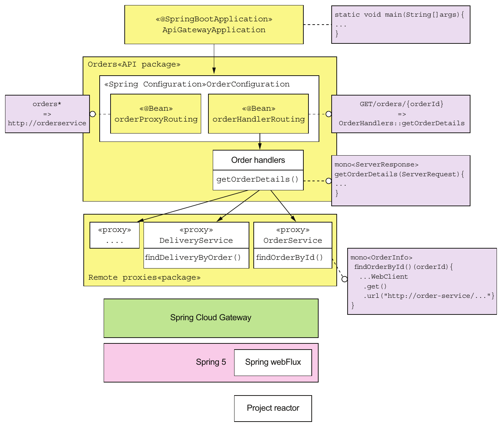

> **English:** Figure 8.8 The architecture of an API gateway built using Spring Cloud Gateway
>
> **Türkçe:** Şekil 8.8 Spring Cloud Gateway kullanılarak oluşturulan bir API gateway’in mimarisi.

<!-- source-record: u08_0186 -->

> **English:** The API gateway consists of the following packages:
>
> **Türkçe:** API geçidi aşağıdaki paketlerden oluşur:

<!-- source-record: u08_0187 -->

> **English:** • ApiGatewayMain package—Defines the Main program for the API gateway.
>
> **Türkçe:** - ApiGatewayMain paketi - API geçidi için Ana programı tanımlar.

<!-- source-record: u08_0188 -->

> **English:** • One or more API packages—An API package implements a set of API endpoints. For example, the Orders package implements the Order-related API endpoints.
>
> **Türkçe:** • Bir veya daha fazla API paketi — Her API paketi bir endpoint kümesi gerçekleştirir. Örneğin Orders paketi, Order ile ilgili endpoint’leri gerçekleştirir.

<!-- source-record: u08_0189 -->

> **English:** • Proxy package—Consists of proxy classes that are used by the API packages to invoke the services. The OrderConfiguration class defines the Spring beans responsible for routing Order-related requests. A routing rule can match against some combination of the HTTP method, the headers, and the path. The orderProxyRoutes @Bean defines rules that map API operations to backend service URLs. For example, it routes paths beginning with /orders to the Order Service.
>
> **Türkçe:** • Proxy paketi — API paketlerinin servisleri çağırmak için kullandığı proxy sınıflarından oluşur. OrderConfiguration, Order ile ilgili isteklerin yönlendirilmesinden sorumlu Spring bean’lerini tanımlar. Yönlendirme kuralı, HTTP metodu, header’lar ve yolun birleşimine göre eşleşebilir. orderProxyRoutes @Bean, API işlemlerini backend servis URL’lerine eşleyen kurallar tanımlar. Örneğin /orders ile başlayan yolları Order Service’e yönlendirir.

<!-- source-pages: 275 -->

<!-- source-record: u08_0190 -->

> **English:** The orderHandlers @Bean defines rules that override those defined by orderProxyRoutes. These rules map API operations to handler methods, which are the Spring WebFlux equivalent of Spring MVC controller methods. For example, orderHandlers maps the operation GET /orders/{orderId} to the OrderHandlers::getOrderDetails() method.
>
> **Türkçe:** orderHandlers @Bean, orderProxyRoutes kurallarını geçersiz kılan kurallar tanımlar. Bu kurallar API işlemlerini, Spring MVC controller metotlarının Spring WebFlux karşılığı olan handler metotlarına eşler. Örneğin orderHandlers, GET /orders/{orderId} işlemini OrderHandlers::getOrderDetails() metoduna eşler.

<!-- source-record: u08_0191 -->

> **English:** The OrderHandlers class implements various request handler methods, such as OrderHandlers::getOrderDetails(). This method uses API composition to fetch the order details (described earlier). The handle methods invoke backend services using remote proxy classes, such as OrderService. This class defines methods for invoking the OrderService.
>
> **Türkçe:** OrderHandlers sınıfı, OrderHandlers::getOrderDetails() gibi çeşitli istek işleyici metotları gerçekleştirir. Bu metot, daha önce açıklanan sipariş ayrıntılarını API composition ile getirir. Handler metotları, backend servislerini OrderService gibi uzak proxy sınıflarıyla çağırır. Bu sınıf, OrderService’i çağıran metotları tanımlar.

<!-- source-record: u08_0192 -->

> **English:** Let’s take a look at the code, starting with the OrderConfiguration class.
>
> **Türkçe:** OrderConfiguration sınıfından başlayarak koduna bir göz atalım.

<!-- source-record: u08_0193 -->

#### THE ORDERCONFIGURATION CLASS — OrderConfiguration sınıfı

<!-- source-record: u08_0194 -->

> **English:** The OrderConfiguration class, shown in listing 8.2, is a Spring @Configuration class. It defines the Spring @Beans that implement the /orders endpoints. The orderProxyRouting and orderHandlerRouting @Beans use the Spring WebFlux routing DSL to define the request routing. The orderHandlers @Bean implements the request handlers that perform API composition.
>
> **Türkçe:** Listing 8.2’deki OrderConfiguration, bir Spring @Configuration sınıfıdır. /orders endpoint’lerini gerçekleştiren Spring @Bean’lerini tanımlar. orderProxyRouting ve orderHandlerRouting @Bean’leri, istek yönlendirmesini tanımlamak için Spring WebFlux yönlendirme DSL’ini kullanır. orderHandlers @Bean ise API composition gerçekleştiren istek işleyicilerini sağlar.

<!-- source-record: u08_0195 -->

#### Listing 8.2 The Spring @Beans that implement the /orders endpoints — Listesi 8.2 / siparişler son noktalarını uygulayan Bahar @Beans

<!-- source-record: u08_0196 -->

```java
@Configuration
@EnableConfigurationProperties(OrderDestinations.class)
public class OrderConfiguration {

  @Bean
  public RouteLocator orderProxyRouting(OrderDestinations orderDestinations) {
    return Routes.locator()
            .route("orders")
            .uri(orderDestinations.orderServiceUrl)
            .predicate(path("/orders").or(path("/orders/*")))
             .and()
            ...
            .build();
  }

  @Bean
  public RouterFunction<ServerResponse>
             orderHandlerRouting(OrderHandlers orderHandlers) {
    return RouterFunctions.route(GET("/orders/{orderId}"),
                       orderHandlers::getOrderDetails);
  }
  @Bean
  public OrderHandlers orderHandlers(OrderService orderService,
                               KitchenService kitchenService,
                               DeliveryService deliveryService,
                               AccountingService accountingService) {
    return new OrderHandlers(orderService, kitchenService,
                              deliveryService, accountingService);
  }

}
```

<!-- source-record: u08_0197 -->

**Kod açıklaması:**

> **English:** By default, route all requests whose path begins with /orders to the URL orderDestinations.orderServiceUrl.
>
> **Türkçe:** Varsayılan olarak yolu /orders ile başlayan bütün istekleri orderDestinations.orderServiceUrl URL’sine yönlendirin.

<!-- source-record: u08_0198 -->

**Kod açıklaması:**

> **English:** Route a GET /orders/{orderId} to orderHandlers:: getOrderDetails.
>
> **Türkçe:** GET /orders/{orderId}'yi orderHandlers:: getOrderDetails'ye yönlendirin.

<!-- source-pages: 276 -->

<!-- source-record: u08_0199 -->

**Kod açıklaması:**

> **English:** The @Bean, which implements the custom request-handling logic
>
> **Türkçe:** @Bean, özel talep işleme mantığını uygulayan

<!-- source-record: u08_0200 -->

> **English:** OrderDestinations, shown in the following listing, is a Spring @ConfigurationProperties class that enables the externalized configuration of backend service URLs.
>
> **Türkçe:** Aşağıdaki listing’deki OrderDestinations, backend servis URL’lerinin dışarıdan yapılandırılmasını sağlayan bir Spring @ConfigurationProperties sınıfıdır.

<!-- source-record: u08_0201 -->

#### Listing 8.3 The externalized configuration of backend service URLs — List 8.3 Arka uç servis URL'lerinin dışlandırılmış yapılandırması

<!-- source-record: u08_0202 -->

```java
@ConfigurationProperties(prefix = "order.destinations")
public class OrderDestinations {

  @NotNull
  public String orderServiceUrl;

  public String getOrderServiceUrl() {
    return orderServiceUrl;
  }

  public void setOrderServiceUrl(String orderServiceUrl) {
    this.orderServiceUrl = orderServiceUrl;
  }
  ...
}
```

<!-- source-record: u08_0203 -->

> **English:** You can, for example, specify the URL of the Order Service either as the order.destinations.orderServiceUrl property in a properties file or as an operating system environment variable, ORDER_DESTINATIONS_ORDER_SERVICE_URL.
>
> **Türkçe:** Örneğin Order Service URL’sini, properties dosyasında order.destinations.orderServiceUrl özelliğiyle veya işletim sisteminde ORDER_DESTINATIONS_ORDER_SERVICE_URL ortam değişkeniyle belirtebilirsiniz.

<!-- source-record: u08_0204 -->

#### THE ORDERHANDLERS CLASS — OrderHandlers sınıfı

<!-- source-record: u08_0205 -->

> **English:** The OrderHandlers class, shown in the following listing, defines the request handler methods that implement custom behavior, including API composition. The getOrderDetails() method, for example, performs API composition to retrieve information about an order. This class is injected with several proxy classes that make requests to backend services.
>
> **Türkçe:** Aşağıdaki listing’deki OrderHandlers sınıfı, API composition dâhil özel davranışları gerçekleştiren istek işleyici metotlarını tanımlar. Örneğin getOrderDetails(), sipariş bilgilerini almak için API composition yapar. Backend servislerine istek gönderen çeşitli proxy sınıfları bu sınıfa enjekte edilir.

<!-- source-record: u08_0206 -->

#### Listing 8.4 The OrderHandlers class implements custom request-handling logic. — Liste 8.4 OrderHandlers sınıfı özel talep işleme mantığını uyguluyor.

<!-- source-record: u08_0207 -->

```java
public class OrderHandlers {

  private OrderService orderService;
  private KitchenService kitchenService;
  private DeliveryService deliveryService;
  private AccountingService accountingService;
  public OrderHandlers(OrderService orderService,
                       KitchenService kitchenService,
                       DeliveryService deliveryService,
                       AccountingService accountingService) {
    this.orderService = orderService;
    this.kitchenService = kitchenService;
    this.deliveryService = deliveryService;
    this.accountingService = accountingService;
  }

  public Mono<ServerResponse> getOrderDetails(ServerRequest serverRequest) {
    String orderId = serverRequest.pathVariable("orderId");

    Mono<OrderInfo> orderInfo = orderService.findOrderById(orderId);

    Mono<Optional<TicketInfo>> ticketInfo =
       kitchenService
            .findTicketByOrderId(orderId)
            .map(Optional::of)
             .onErrorReturn(Optional.empty());

    Mono<Optional<DeliveryInfo>> deliveryInfo =
        deliveryService
            .findDeliveryByOrderId(orderId)
            .map(Optional::of)
            .onErrorReturn(Optional.empty());

    Mono<Optional<BillInfo>> billInfo = accountingService
            .findBillByOrderId(orderId)
            .map(Optional::of)
            .onErrorReturn(Optional.empty());

    Mono<Tuple4<OrderInfo, Optional<TicketInfo>,
                 Optional<DeliveryInfo>, Optional<BillInfo>>> combined =
            Mono.when(orderInfo, ticketInfo, deliveryInfo, billInfo);

    Mono<OrderDetails> orderDetails =
         combined.map(OrderDetails::makeOrderDetails);

    return orderDetails.flatMap(person -> ServerResponse.ok()
             .contentType(MediaType.APPLICATION_JSON)
            .body(fromObject(person)));
  }

}
```

<!-- source-pages: 277 -->

<!-- source-record: u08_0208 -->

**Kod açıklaması:**

> **English:** Transform a TicketInfo into an Optional<TicketInfo>.
>
> **Türkçe:** TicketInfo nesnesini Optional<TicketInfo> nesnesine dönüştürün.

<!-- source-record: u08_0209 -->

**Kod açıklaması:**

> **English:** If the service invocation failed, return Optional.empty().
>
> **Türkçe:** servis çağrısı başarısız olduysa, Optional.empty()'i geri gönderin.

<!-- source-record: u08_0210 -->

**Kod açıklaması:**

> **English:** Combine the four values into a single value, a Tuple4.
>
> **Türkçe:** Dört değerini tek bir değere, Tuple4'e birleştirin.

<!-- source-record: u08_0211 -->

**Kod açıklaması:**

> **English:** Transform the Tuple4 into an OrderDetails.
>
> **Türkçe:** Tuple4'i OrderDetails'ye dönüştürün.

<!-- source-record: u08_0212 -->

**Kod açıklaması:**

> **English:** Transform the OrderDetails into a ServerResponse.
>
> **Türkçe:** OrderDetails'i ServerResponse'ye dönüştürün.

<!-- source-record: u08_0213 -->

> **English:** The getOrderDetails() method implements API composition to fetch the order details. It’s written in a scalable, reactive style using the Mono abstraction, which is provided by Project Reactor. A Mono, which is a richer kind of Java 8 CompletableFuture, contains the outcome of an asynchronous operation that’s either a value or an exception. It has a rich API for transforming and combining the values returned by asynchronous operations. You can use Monos to write concurrent code in a style that’s simple and easy to understand. In this example, the getOrderDetails() method invokes the four services in parallel and combines the results to create an OrderDetails object.
>
> **Türkçe:** getOrderDetails(), sipariş ayrıntılarını getirmek için API composition gerçekleştirir. Project Reactor’ın Mono soyutlamasını kullanarak ölçeklenebilir, reaktif tarzda yazılmıştır. Java 8 CompletableFuture’ın daha zengin bir benzeri olan Mono, asenkron işlemin değer veya exception biçimindeki sonucunu içerir. Asenkron işlemlerin döndürdüğü değerleri dönüştürmek ve birleştirmek için zengin API sunar. Mono’larla basit ve anlaşılır eşzamanlı kod yazabilirsiniz. Bu örnekte getOrderDetails(), dört servisi paralel çağırıp sonuçları bir OrderDetails nesnesi oluşturacak biçimde birleştirir.

<!-- source-pages: 278 -->

<!-- source-record: u08_0214 -->

> **English:** The getOrderDetails() method takes a ServerRequest, which is the Spring WebFlux representation of an HTTP request, as a parameter and does the following:
>
> **Türkçe:** getOrderDetails() yöntemi, bir HTTP istekinin Spring WebFlux temsilcisi olan ServerRequest'yi bir parametre olarak alır ve aşağıdakileri yapar:

<!-- source-record: u08_0215 -->

> **English:** 1 It extracts the orderId from the path.
>
> **Türkçe:** 1 Yoldan orderId çıkarır.

<!-- source-record: u08_0216 -->

> **English:** 2 It invokes the four services asynchronously via their proxies, which return Monos. In order to improve availability, getOrderDetails() treats the results of all services except the OrderService as optional. If a Mono returned by an optional service contains an exception, the call to onErrorReturn() transforms it into a Mono containing an empty Optional.
>
> **Türkçe:** 2 Dört servisi, Mono döndüren proxy’leri üzerinden asenkron çağırır. Kullanılabilirliği artırmak için getOrderDetails(), OrderService dışındaki servislerin sonuçlarını isteğe bağlı kabul eder. Bu servislerden dönen Mono exception içeriyorsa onErrorReturn() çağrısı bunu boş Optional içeren Mono’ya dönüştürür.

<!-- source-record: u08_0217 -->

> **English:** 3 It combines the results asynchronously using Mono.when(), which returns a Mono<Tuple4> containing the four values.
>
> **Türkçe:** 3 Sonuçları Mono.when() kullanarak asenkron bir şekilde birleştirir ve dört değer içeren bir Mono<Tuple4> gönderir.

<!-- source-record: u08_0218 -->

> **English:** 4 It transforms the Mono<Tuple4> into a Mono<OrderDetails> by calling OrderDetails::makeOrderDetails.
>
> **Türkçe:** 4 OrderDetails::makeOrderDetails metodunu çağırarak Mono<Tuple4> değerini Mono<OrderDetails> değerine dönüştürür.

<!-- source-record: u08_0219 -->

> **English:** 5 It transforms the OrderDetails into a ServerResponse, which is the Spring WebFlux representation of the JSON/HTTP response.
>
> **Türkçe:** 5 OrderDetails'yi, JSON/HTTP yanıtının Spring WebFlux temsilcisi olan ServerResponse'ye dönüştürür.

<!-- source-record: u08_0220 -->

> **English:** As you can see, because getOrderDetails() uses Monos, it concurrently invokes the services and combines the results without using messy, difficult-to-read callbacks. Let’s take a look at one of the service proxies that return the results of a service API call wrapped in a Mono.
>
> **Türkçe:** Gördüğünüz gibi, getOrderDetails() Monos'u kullandığı için, aynı anda servisleri çağırır ve karmaşık, okumak zor olan geri çağrıları kullanmadan sonuçları birleştirir. Bir Mono'ya sarılmış bir servis API çağrısı sonuçlarını iade eden servis proxylerinden birine bir göz atalım.

<!-- source-record: u08_0221 -->

#### THE ORDERSERVICE CLASS — OrderService sınıfı

<!-- source-record: u08_0222 -->

> **English:** The OrderService class, shown in the following listing, is a remote proxy for the Order Service. It invokes the Order Service using a WebClient, which is the Spring WebFlux reactive HTTP client.
>
> **Türkçe:** Aşağıdaki listede gösterilen OrderService sınıfı, Order Service için uzaktan bir vekildir. Spring WebFlux reaktif HTTP istemcisi olan WebClient'yi kullanarak Order Service'yi çağırır.

<!-- source-record: u08_0223 -->

#### Listing 8.5 OrderService class—a remote proxy for Order Service — Liste 8.5 OrderService sınıfı - Order Service için uzaktan bir vekil

<!-- source-record: u08_0224 -->

```java
@Service
public class OrderService {

  private OrderDestinations orderDestinations;

  private WebClient client;

  public OrderService(OrderDestinations orderDestinations, WebClient client)
     {
    this.orderDestinations = orderDestinations;
    this.client = client;
  }

  public Mono<OrderInfo> findOrderById(String orderId) {
    Mono<ClientResponse> response = client
            .get()
            .uri(orderDestinations.orderServiceUrl + "/orders/{orderId}",
                 orderId)
            .exchange();
     return response.flatMap(resp -> resp.bodyToMono(OrderInfo.class));
   }

}
```

<!-- source-pages: 279 -->

<!-- source-record: u08_0225 -->

**Kod açıklaması:**

> **English:** Invoke the service.
>
> **Türkçe:** servis çağırın.

<!-- source-record: u08_0226 -->

**Kod açıklaması:**

> **English:** Convert the response body to an OrderInfo.
>
> **Türkçe:** Yanıt gövdesini OrderInfo nesnesine dönüştürün.

<!-- source-record: u08_0227 -->

> **English:** The findOrder() method retrieves the OrderInfo for an order. It uses the WebClient to make the HTTP request to the Order Service and deserializes the JSON response to an OrderInfo. WebClient has a reactive API, and the response is wrapped in a Mono. The findOrder() method uses flatMap() to transform the Mono<ClientResponse> into a Mono<OrderInfo>. As the name suggests, the bodyToMono() method returns the response body as a Mono.
>
> **Türkçe:** findOrder(), siparişin OrderInfo bilgisini getirir. WebClient ile Order Service’e HTTP isteği gönderir ve JSON yanıtını OrderInfo’ya deserialize eder. WebClient reaktif API’ye sahiptir ve yanıt Mono içine sarılır. findOrder(), Mono<ClientResponse> değerini Mono<OrderInfo> değerine dönüştürmek için flatMap() kullanır. Adından anlaşılacağı gibi bodyToMono(), yanıt gövdesini Mono olarak döndürür.

<!-- source-record: u08_0228 -->

#### THE APIGATEWAYAPPLICATION CLASS — ApiGatewayApplication sınıfı

<!-- source-record: u08_0229 -->

> **English:** The ApiGatewayApplication class, shown in the following listing, implements the API gateway’s main() method. It’s a standard Spring Boot main class.
>
> **Türkçe:** Aşağıdaki listing’deki ApiGatewayApplication, gateway’in main() metodunu gerçekleştirir. Standart bir Spring Boot ana sınıfıdır.

<!-- source-record: u08_0230 -->

#### Listing 8.6 The main() method for the API gateway — Liste 8.6 API geçidi için main() yöntemi

<!-- source-record: u08_0231 -->

```java
@SpringBootConfiguration
@EnableAutoConfiguration
@EnableGateway
@Import(OrdersConfiguration.class)
public class ApiGatewayApplication {

  public static void main(String[] args) {
    SpringApplication.run(ApiGatewayApplication.class, args);
  }
}
```

<!-- source-record: u08_0232 -->

> **English:** The @EnableGateway annotation imports the Spring configuration for the Spring Cloud Gateway framework.
>
> **Türkçe:** @EnableGateway annotation’ı, Spring Cloud Gateway framework’ünün Spring yapılandırmasını içeri alır.

<!-- source-record: u08_0233 -->

> **English:** Spring Cloud Gateway is an excellent framework for implementing an API gateway. It enables you to configure basic proxying using a simple, concise routing rules DSL. It’s also straightforward to route requests to handler methods that perform API composition and protocol translation. Spring Cloud Gateway is built using the scalable, reactive Spring Framework 5 and Project Reactor frameworks. But there’s another appealing option for developing your own API gateway: GraphQL, a framework that provides graph-based query language. Let’s look at how that works.
>
> **Türkçe:** Spring Cloud Gateway, gateway gerçekleştirmek için çok uygun bir framework’tür. Basit ve kısa yönlendirme kuralları DSL’iyle temel proxy işlevlerini yapılandırmanızı sağlar. İstekleri, API composition ve protokol dönüşümü yapan handler metotlarına yönlendirmek de kolaydır. Ölçeklenebilir ve reaktif Spring Framework 5 ile Project Reactor üzerine kuruludur. Ancak kendi gateway’inizi geliştirmek için başka bir seçenek de vardır: graf tabanlı sorgu dili sağlayan GraphQL. Nasıl çalıştığına bakalım.

<!-- source-record: u08_0234 -->

### 8.3.3 Implementing an API gateway using GraphQL — GraphQL ile API gateway gerçekleştirmek

<!-- source-record: u08_0235 -->

> **English:** Imagine that you’re responsible for implementing the FTGO’s API Gateway’s GET /orders/{orderId} endpoint, which returns the order details. On the surface, implementing this endpoint might appear to be simple. But as described in section 8.1, this endpoint retrieves data from multiple services. Consequently, you need to use the API composition pattern and write code that invokes the services and combines the results.
>
> **Türkçe:** FTGO'nun API Geçidi'nin sipariş ayrıntılarını iade eden GET /orders/{orderId} son noktasını uygulamak için sorumlu olduğunuzu düşünün. Bu sonucu uygulamak yüzeyde basit görünebilir. Ancak bölüm 8.1'de açıklandığı gibi, bu uç noktası birden fazla servisten verileri alır. Sonuç olarak, API kompozisyon modelini kullanmanız ve servisleri çağıran ve sonuçları birleştiren kod yazmanız gerekir.

<!-- source-pages: 280 -->

<!-- source-record: u08_0236 -->

> **English:** Another challenge, mentioned earlier, is that different clients need slightly different data. For example, unlike the mobile application, the desktop SPA application displays your rating for the order. One way to tailor the data returned by the endpoint, as described in chapter 3, is to give the client the ability to specify the data they need. An endpoint can, for example, support query parameters such as the expand parameter, which specifies the related resources to return, and the field parameter, which specifies the fields of each resource to return. The other option is to define multiple versions of this endpoint as part of applying the Backends for frontends pattern. This is a lot of work for just one of the many API endpoints that the FTGO’s API Gateway needs to implement.
>
> **Türkçe:** Daha önce belirtilen başka bir güçlük, farklı istemcilerin biraz farklı verilere ihtiyaç duymasıdır. Örneğin masaüstü SPA, mobil uygulamadan farklı olarak siparişe verdiğiniz puanı gösterir. Üçüncü bölümde anlatıldığı gibi dönen verileri uyarlamanın bir yolu, istemcinin ihtiyaç duyduğu verileri belirtmesini sağlamaktır. Örneğin endpoint, döndürülecek ilişkili kaynakları belirten expand ve her kaynağın döndürülecek alanlarını belirten field sorgu parametrelerini destekleyebilir. Diğer seçenek, Backends for frontends kapsamında endpoint’in birden fazla sürümünü tanımlamaktır. Bu, FTGO gateway’inin gerçekleştirmesi gereken çok sayıdaki endpoint’ten yalnızca biri için bile büyük bir iştir.

<!-- source-record: u08_0237 -->

> **English:** Implementing an API gateway with a REST API that supports a diverse set of clients well is time consuming. Consequently, you may want to consider using a graph-based API framework, such as GraphQL, that’s designed to support efficient data fetching. The key idea with graph-based API frameworks is that, as figure 8.9 shows, the server’s API consists of a graph-based schema. The graph-based schema defines a set of nodes (types), which have properties (fields) and relationships with other nodes. The client retrieves data by executing a query that specifies the required data in terms of the graph’s nodes and their properties and relationships. As a result, a client can retrieve the data it needs in a single round-trip to the API gateway.
>
> **Türkçe:** Farklı istemcileri iyi destekleyen REST API’li gateway geliştirmek zaman alır. Bu nedenle verimli veri getirmek üzere tasarlanmış GraphQL gibi graf tabanlı API framework’lerini değerlendirebilirsiniz. Temel fikir, Şekil 8.9’daki gibi sunucu API’sinin graf tabanlı şemadan oluşmasıdır. Şema, özellikleri (alanları) ve diğer düğümlerle ilişkileri olan düğümler (türler) tanımlar. İstemci; gereken verileri grafın düğümleri, özellikleri ve ilişkileriyle ifade eden sorguyu çalıştırır. Böylece ihtiyaç duyduğu verileri gateway’e tek ağ gidiş dönüşüyle alabilir.

<!-- source-record: u08_0238 -->

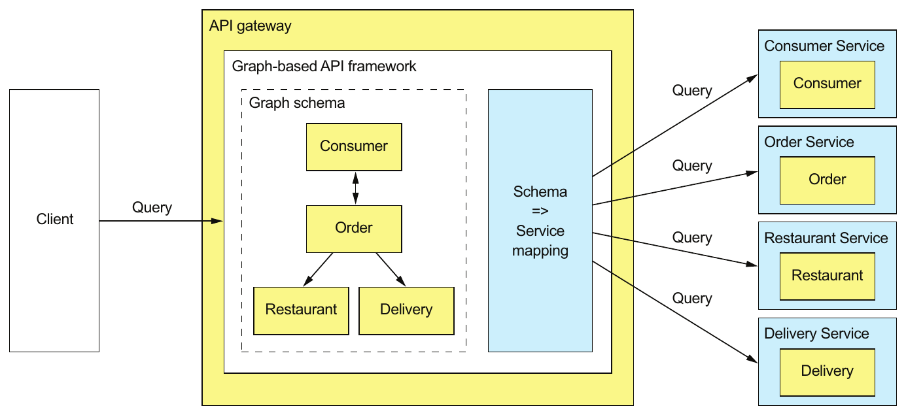

> **English:** Figure 8.9 The API gateway’s API consists of a graph-based schema that’s mapped to the services. A client issues a query that retrieves multiple graph nodes. The graph-based API framework executes the query by retrieving data from one or more services.
>
> **Türkçe:** Şekil 8.9 API gateway’in API’si, servislere eşlenen graf tabanlı bir şemadan oluşur. İstemci, grafın birden fazla düğümünü getiren bir sorgu gönderir. Graf tabanlı API framework’ü, bir veya daha fazla servisten veri alarak sorguyu yürütür.

<!-- source-record: u08_0239 -->

> **English:** Graph-based API technology has a couple of important benefits. It gives clients control over what data is returned. Consequently, developing a single API that’s flexible enough to support diverse clients becomes feasible. Another benefit is that even though the API is much more flexible, this approach significantly reduces the development effort. That’s because you write the server-side code using a query execution framework that’s designed to support API composition and projections. It’s as if, rather than force clients to retrieve data via stored procedures that you need to write and maintain, you let them execute queries against the underlying database.
>
> **Türkçe:** Graf tabanlı API teknolojisinin önemli yararları vardır. Döndürülecek veriyi istemci kontrol eder; böylece farklı istemcileri destekleyecek kadar esnek tek API geliştirmek mümkün olur. Ayrıca API daha esnek olmasına rağmen geliştirme çabası önemli ölçüde azalır. Çünkü sunucu kodunu, API composition ve alan seçimini destekleyen sorgu yürütme framework’üyle yazarsınız. Bu, istemcileri yazıp bakımını yapmanız gereken stored procedure’ler üzerinden veri almaya zorlamak yerine, alttaki veritabanını sorgulamalarına izin vermeye benzer.

<!-- source-pages: 281 -->

<!-- source-record: u08_0240 -->

### Schema-driven API technologies — Şema yönlendirilen API teknolojileri

<!-- source-record: u08_0241 -->

> **English:** The two most popular graph-based API technologies are GraphQL (http://graphql.org) and Netflix Falcor (http://netflix.github.io/falcor/). Netflix Falcor models server-side data as a virtual JSON object graph. The Falcor client retrieves data from a Falcor server by executing a query that retrieves properties of that JSON object. The client can also update properties. In the Falcor server, the properties of the object graph are mapped to backend data sources, such as services with REST APIs. The server handles a request to set or get properties by invoking one or more backend data sources.
>
> **Türkçe:** En yaygın iki graf tabanlı API teknolojisi GraphQL (http://graphql.org) ve Netflix Falcor’dur (http://netflix.github.io/falcor/). Falcor, sunucu verilerini sanal JSON nesne grafı olarak modeller. İstemci, bu JSON nesnesinin özelliklerini getiren sorgu çalıştırarak Falcor sunucusundan veri alır. Özellikleri güncelleyebilir de. Sunucuda nesne grafının özellikleri, REST API sunan servisler gibi backend veri kaynaklarına eşlenir. Sunucu, özellik okuma veya yazma isteğini bir veya daha fazla backend veri kaynağını çağırarak işler.

<!-- source-record: u08_0242 -->

> **English:** GraphQL, developed by Facebook and released in 2015, is another popular graph-based API technology. It models the server-side data as a graph of objects that have fields and references to other objects. The object graph is mapped to backend data sources. GraphQL clients can execute queries that retrieve data and mutations that create and update data. Unlike Netflix Falcor, which is an implementation, GraphQL is a standard, with clients and servers available for a variety of languages, including NodeJS, Java, and Scala.
>
> **Türkçe:** Facebook’un geliştirip 2015’te yayımladığı GraphQL, diğer yaygın graf tabanlı API teknolojisidir. Sunucu verilerini, alanları ve diğer nesnelere referansları bulunan nesnelerden oluşan graf olarak modeller. Nesne grafı backend veri kaynaklarına eşlenir. İstemciler, veri getiren sorgular ve veri oluşturup güncelleyen mutation’lar çalıştırabilir. Bir gerçekleştirim olan Netflix Falcor’dan farklı olarak GraphQL bir standarttır; NodeJS, Java ve Scala dâhil çeşitli dillerde istemci ve sunucuları vardır.

<!-- source-record: u08_0243 -->

> **English:** Apollo GraphQL is a popular JavaScript/NodeJS implementation (www.apollographql.com). It’s a platform that includes a GraphQL server and client. Apollo GraphQL implements some powerful extensions to the GraphQL specification, such as subscriptions that push changed data to the client.
>
> **Türkçe:** Apollo GraphQL, yaygın bir JavaScript/NodeJS gerçekleştirimidir (www.apollographql.com). GraphQL sunucusu ve istemcisi içeren bir platformdur. Değişen verileri istemciye iten abonelikler gibi, GraphQL belirtimine güçlü eklentiler sağlar.

<!-- source-record: u08_0244 -->

> **English:** This section talks about how to develop an API gateway using Apollo GraphQL. I’m only going to cover a few of the key features of GraphQL and Apollo GraphQL. For more information, you should consult the GraphQL and Apollo GraphQL documentation.
>
> **Türkçe:** Bu bölüm, Apollo GraphQL kullanarak bir API geçidi nasıl geliştirildiği hakkında konuşuyor. Sadece GraphQL ve Apollo GraphQL'in birkaç ana özelliğini ele alacağım. Daha fazla bilgi için GraphQL ve Apollo GraphQL belgelerine başvurmalısınız.

<!-- source-record: u08_0245 -->

> **English:** The GraphQL-based API gateway, shown in figure 8.10, is written in JavaScript using the NodeJS Express web framework and the Apollo GraphQL server. The key parts of the design are as follows:
>
> **Türkçe:** Şekilde 8.10'da gösterilen GraphQL tabanlı API geçidi, JavaScript'de NodeJS Express web çerçevesini ve Apollo GraphQL sunucusu kullanarak yazılmıştır. Tasarımın ana parçaları aşağıdakiler:

<!-- source-record: u08_0246 -->

> **English:** • GraphQL schema—The GraphQL schema defines the server-side data model and the queries it supports.
>
> **Türkçe:** - GraphQL şeması - GraphQL şeması, sunucu tarafındaki veri modelini ve desteklediği sorguları tanımlar.

<!-- source-record: u08_0247 -->

> **English:** • Resolver functions—The resolve functions map elements of the schema to the various backend services.
>
> **Türkçe:** • Resolver işlevleri — Şemanın öğelerini çeşitli backend servislerine eşler.

<!-- source-record: u08_0248 -->

> **English:** • Proxy classes—The proxy classes invoke the FTGO application’s services.
>
> **Türkçe:** - Proxy sınıfları - Proxy sınıfları FTGO uygulamasının servislerini çağırır.

<!-- source-record: u08_0249 -->

> **English:** There’s also a small amount of glue code that integrates the GraphQL server with the Express web framework. Let’s look at each part, starting with the GraphQL schema.
>
> **Türkçe:** GraphQL sunucusunu Express web framework’üne entegre eden az miktarda bağlantı kodu da vardır. GraphQL şemasından başlayarak her parçaya bakalım.

<!-- source-pages: 282 -->

<!-- source-record: u08_0250 -->

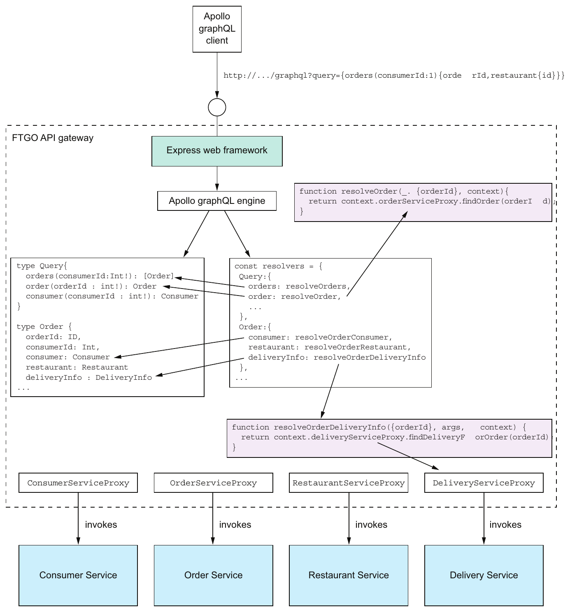

> **English:** Figure 8.10 The design of the GraphQL-based FTGO API Gateway
>
> **Türkçe:** Şekil 8.10 GraphQL tabanlı FTGO API Gateway’in tasarımı.

<!-- source-record: u08_0251 -->

#### DEFINING A GRAPHQL SCHEMA — GraphQL şeması tanımlamak

<!-- source-record: u08_0252 -->

> **English:** A GraphQL API is centered around a schema, which consists of a collection of types that define the structure of the server-side data model and the operations, such as queries, that a client can perform. GraphQL has several different kinds of types. The example code in this section uses just two kinds of types: object types, which are the primary way of defining the data model, and enums, which are similar to Java enums. An object type has a name and a collection of typed, named fields. A field can be a scalar type, such as a number, string, or enum; a list of scalar types; a reference to another object type; or a collection of references to another object type. Despite resembling a field of a traditional object-oriented class, a GraphQL field is conceptually a function that returns a value. It can have arguments, which enable a GraphQL client to tailor the data the function returns.
>
> **Türkçe:** GraphQL API’nin merkezinde şema bulunur. Şema, sunucu veri modelinin yapısını ve istemcinin çalıştırabileceği sorgular gibi işlemleri tanımlayan türlerden oluşur. GraphQL’de çeşitli tür çeşitleri vardır. Bu kısımdaki örnek yalnızca ikisini kullanır: veri modelini tanımlamanın temel yolu olan nesne türleri ve Java enum’larına benzeyen enum’lar. Nesne türünün adı ve adlandırılmış, türü belirtilmiş alanları vardır. Alan; sayı, string veya enum gibi skaler tür, skaler tür listesi, başka nesne türüne referans ya da başka nesne türüne referanslar koleksiyonu olabilir. Geleneksel nesne yönelimli sınıf alanına benzese de GraphQL alanı kavramsal olarak değer döndüren işlevdir. İstemcinin dönen veriyi uyarlamasını sağlayan argümanlar alabilir.

<!-- source-pages: 283 -->

<!-- source-record: u08_0253 -->

> **English:** GraphQL also uses fields to define the queries supported by the schema. You define the schema’s queries by declaring an object type, which by convention is called Query. Each field of the Query object is a named query, which has an optional set of parameters, and a return type. I found this way of defining queries a little confusing when I first encountered it, but it helps to keep in mind that a GraphQL field is a function. It will become even clearer when we look at how fields are connected to the backend data sources.
>
> **Türkçe:** GraphQL, şemanın desteklediği sorguları tanımlamak için de alanları kullanır. Yerleşik adlandırmaya göre Query denen nesne türünü bildirerek sorguları tanımlarsınız. Query nesnesinin her alanı, isteğe bağlı parametreleri ve dönüş türü olan adlandırılmış bir sorgudur. İlk karşılaştığımda bunu biraz kafa karıştırıcı buldum; ancak GraphQL alanının işlev olduğunu hatırlamak yardımcı olur. Alanların backend veri kaynaklarına nasıl bağlandığına baktığımızda daha da açıklık kazanacak.

<!-- source-record: u08_0254 -->

> **English:** The following listing shows part of the schema for the GraphQL-based FTGO API gateway. It defines several object types. Most of the object types correspond to the FTGO application’s Consumer, Order, and Restaurant entities. It also has a Query object type that defines the schema’s queries.
>
> **Türkçe:** Aşağıdaki listing, GraphQL tabanlı FTGO gateway şemasının bir bölümünü gösterir. Çeşitli nesne türleri tanımlar. Çoğu FTGO’nun Consumer, Order ve Restaurant entity’lerine karşılık gelir. Ayrıca şemanın sorgularını tanımlayan Query nesne türü vardır.

<!-- source-record: u08_0255 -->

#### Listing 8.7 The GraphQL schema for the FTGO API gateway — Liste 8.7 FTGO API geçidi için GraphQL şeması

<!-- source-record: u08_0256 -->

```graphql
type Query {
  orders(consumerId : Int!): [Order]
  order(orderId : Int!): Order
  consumer(consumerId : Int!): Consumer
}

type Consumer {
  id: ID
  firstName: String
  lastName: String
  orders: [Order]
 }

type Order {
  orderId: ID,
  consumerId : Int,
  consumer: Consumer
  restaurant: Restaurant

  deliveryInfo : DeliveryInfo

  ...
}

type Restaurant {
  id: ID
  name: String
  ...
}
type DeliveryInfo {
  status : DeliveryStatus
  estimatedDeliveryTime : Int
  assignedCourier :String
}

enum DeliveryStatus {
  PREPARING
  READY_FOR_PICKUP
  PICKED_UP
  DELIVERED
}
```

<!-- source-record: u08_0257 -->

**Kod açıklaması:**

> **English:** Defines the queries that a client can execute
>
> **Türkçe:** Bir istemci tarafından gerçekleştirilebilecek sorguları tanımlar

<!-- source-record: u08_0258 -->

**Kod açıklaması:**

> **English:** The unique ID for a Consumer
>
> **Türkçe:** Consumer için eşsiz ID

<!-- source-record: u08_0259 -->

**Kod açıklaması:**

> **English:** A consumer has a list of orders.
>
> **Türkçe:** Bir tüketicinin bir sipariş listesi vardır.

<!-- source-pages: 284 -->

<!-- source-record: u08_0260 -->

> **English:** Despite having a different syntax, the Consumer, Order, Restaurant, and DeliveryInfo object types are structurally similar to the corresponding Java classes. One difference is the ID type, which represents a unique identifier.
>
> **Türkçe:** Sözdizimleri farklı olsa da Consumer, Order, Restaurant ve DeliveryInfo nesne türleri, karşılık gelen Java sınıflarına yapısal olarak benzer. Bir fark, benzersiz tanımlayıcıyı temsil eden ID türüdür.

<!-- source-record: u08_0261 -->

> **English:** This schema defines three queries:
>
> **Türkçe:** Bu şema üç sorgu tanımlar:

<!-- source-record: u08_0262 -->

> **English:** • orders()—Returns the Orders for the specified Consumer
>
> **Türkçe:** - orders() - Belirtilen Consumer için siparişleri geri verir

<!-- source-record: u08_0263 -->

> **English:** • order()—Returns the specified Order
>
> **Türkçe:** - order() - Belirtilen Order'yi gönderir

<!-- source-record: u08_0264 -->

> **English:** • consumer()—Returns the specified Consumer
>
> **Türkçe:** - consumer() - Belirtilen Consumer'yi gönderir

<!-- source-record: u08_0265 -->

> **English:** These queries may seem not different from the equivalent REST endpoints, but GraphQL gives the client tremendous control over the data that’s returned. To understand why, let’s look at how a client executes GraphQL queries.
>
> **Türkçe:** Bu sorgular eşdeğer REST endpoint’lerinden farklı görünmeyebilir; ancak GraphQL istemciye dönen veriler üzerinde büyük kontrol sağlar. Nedenini anlamak için istemcinin sorguları nasıl çalıştırdığına bakalım.

<!-- source-record: u08_0266 -->

#### EXECUTING GRAPHQL QUERIES — GraphQL sorgularını çalıştırmak

<!-- source-record: u08_0267 -->

> **English:** The principal benefit of using GraphQL is that its query language gives the client incredible control over the returned data. A client executes a query by making a request containing a query document to the server. In the simple case, a query document specifies the name of the query, the argument values, and the fields of the result object to return. Here’s a simple query that retrieves firstName and lastName of the consumer with a particular ID:
>
> **Türkçe:** GraphQL’nin temel yararı, sorgu dilinin istemciye dönen veriler üzerinde büyük kontrol sağlamasıdır. İstemci, sunucuya sorgu belgesi içeren istek göndererek sorguyu çalıştırır. Basit durumda belge; sorgu adını, argüman değerlerini ve sonuç nesnesinin döndürülecek alanlarını belirtir. Şu basit sorgu, belirli kimliğe sahip tüketicinin firstName ve lastName alanlarını getirir:

<!-- source-record: u08_0268 -->

**Kod açıklaması:**

> **English:** Specifies the query called consumer, which fetches a consumer
>
> **Türkçe:** Tüketici getiren consumer adlı sorguyu belirtir

<!-- source-record: u08_0269 -->

```graphql
query {
  consumer(consumerId:1)
   {
     firstName
    lastName
  }
}
```

<!-- source-record: u08_0270 -->

**Kod açıklaması:**

> **English:** The fields of the Consumer to return
>
> **Türkçe:** Consumer'nin geri gönderilmesi gereken alanları

<!-- source-record: u08_0271 -->

> **English:** This query returns those fields of the specified Consumer.
>
> **Türkçe:** Bu sorgu, belirtilen Consumer alanlarını gönderir.

<!-- source-record: u08_0272 -->

> **English:** Here’s a more elaborate query that returns a consumer, their orders, and the ID and name of each order’s restaurant:
>
> **Türkçe:** İşte bir tüketiciyi, siparişlerini ve her siparişe ait restoranın kimliğini ve adını döndüren daha ayrıntılı bir sorgu:

<!-- source-record: u08_0273 -->

```graphql
query {
    consumer(consumerId:1)  {
      id
      firstName
      lastName
      orders {
        orderId
        restaurant {
          id
          name
        }
        deliveryInfo {
          estimatedDeliveryTime
          name
        }
      }
  }
}
```

<!-- source-pages: 285 -->

<!-- source-record: u08_0274 -->

> **English:** This query tells the server to return more than just the fields of the Consumer. It retrieves the consumer’s Orders and each Order’s restaurant. As you can see, a GraphQL client can specify exactly the data to return, including the fields of transitively related objects.
>
> **Türkçe:** Bu sorgu, sunucudan Consumer alanlarının ötesinde veri ister. Tüketicinin Order’larını ve her Order’ın restoranını getirir. Görüldüğü gibi GraphQL istemcisi, dolaylı ilişkiler üzerinden bağlı nesnelerin alanları dâhil, döndürülecek veriyi tam olarak belirtebilir.

<!-- source-record: u08_0275 -->

> **English:** The query language is more flexible than it might first appear. That’s because a query is a field of the Query object, and a query document specifies which of those fields the server should return. These simple examples retrieve a single field, but a query document can execute multiple queries by specifying multiple fields. For each field, the query document supplies the field’s arguments and specifies what fields of the result object it’s interested in. Here’s a query that retrieves two different consumers:
>
> **Türkçe:** Sorgu dili ilk bakışta göründüğünden daha esnektir. Çünkü sorgu, Query nesnesinin alanıdır ve sorgu belgesi, sunucunun bu alanlardan hangilerini döndüreceğini belirtir. Basit örnekler tek alan getirir; ancak belge birden fazla alan belirterek birden fazla sorgu çalıştırabilir. Her alanın argümanlarını ve sonuç nesnesinin hangi alanlarıyla ilgilendiğini belirtir. Şu sorgu, iki farklı tüketici getirir:

<!-- source-record: u08_0276 -->

```graphql
query {
  c1: consumer (consumerId:1)  { id, firstName, lastName}
  c2: consumer (consumerId:2)  { id, firstName, lastName}
}
```

<!-- source-record: u08_0277 -->

> **English:** In this query document, c1 and c2 are what GraphQL calls aliases. They’re used to distinguish between the two Consumers in the result, which would otherwise both be called consumer. This example retrieves two objects of the same type, but a client could retrieve several objects of different types.
>
> **Türkçe:** Bu sorgu belgesindeki c1 ve c2, GraphQL’de alias denen takma adlardır. Bunlar, aksi hâlde ikisi de consumer adını taşıyacak iki Consumer’ı sonuçta ayırt etmek için kullanılır. Örnek aynı türde iki nesne getirir; ancak istemci farklı türlerde birkaç nesne de getirebilir.

<!-- source-record: u08_0278 -->

> **English:** A GraphQL schema defines the shape of the data and the supported queries. To be useful, it has to be connected to the source of the data. Let’s look at how to do that.
>
> **Türkçe:** GraphQL şeması verilerin şeklini ve desteklenen sorguları tanımlar. Faydalı olması için, verilerin kaynağına bağlanmalıdır. Bunu nasıl yapacağımıza bakalım.

<!-- source-record: u08_0279 -->

#### CONNECTING THE SCHEMA TO THE DATA — Şemayı veriye bağlamak

<!-- source-record: u08_0280 -->

> **English:** When the GraphQL server executes a query, it must retrieve the requested data from one or more data stores. In the case of the FTGO application, the GraphQL server must invoke the APIs of the services that own the data. You associate a GraphQL schema with the data sources by attaching resolver functions to the fields of the object types defined by the schema. The GraphQL server implements the API composition pattern by invoking resolver functions to retrieve the data, first for the top-level query, and then recursively for the fields of the result object or objects.
>
> **Türkçe:** GraphQL sunucusu sorguyu çalıştırırken istenen verileri bir veya daha fazla veri deposundan getirmelidir. FTGO’da, verinin sahibi olan servislerin API’lerini çağırır. Şemayı veri kaynaklarıyla ilişkilendirmek için şemadaki nesne türlerinin alanlarına resolver işlevleri bağlarsınız. Sunucu, verileri önce üst düzey sorgu için, sonra sonuç nesnelerinin alanları için özyinelemeli olarak resolver’ları çağırarak getirir; böylece API composition gerçekleştirir.

<!-- source-record: u08_0281 -->

> **English:** The details of how resolver functions are associated with the schema depend on which GraphQL server you are using. Listing 8.8 shows how to define the resolvers when using the Apollo GraphQL server. You create a doubly nested JavaScript object. Each top-level property corresponds to an object type, such as Query and Order. Each second-level property, such as Order.consumer, defines a field’s resolver function.
>
> **Türkçe:** Çözücü fonksiyonlarının şema ile nasıl ilişkili olduğu ayrıntıları, kullandığınız GraphQL sunucusuna bağlıdır. 8.8 listesi, Apollo GraphQL sunucusunu kullanırken çözücülerin nasıl tanımlanacağını gösterir. JavaScript nesnesini iki katlı bir şekilde oluşturursunuz. Her üst düzey özelliği, Query ve Order gibi bir nesne türüne karşılık gelir. Order.consumer gibi her ikinci seviye özelliği, bir alanın çözücü fonksiyonunu tanımlar.

<!-- source-pages: 286 -->

<!-- source-record: u08_0282 -->

#### Listing 8.8 Attaching the resolver functions to fields of the GraphQL schema — Liste 8.8 Çözücü fonksiyonlarını GraphQL şeması alanlarına bağlamak

<!-- source-record: u08_0283 -->

```javascript
const resolvers = {
  Query: {
    orders: resolveOrders,
    consumer: resolveConsumer,
    order: resolveOrder
  },
  Order: {
    consumer: resolveOrderConsumer,
    restaurant: resolveOrderRestaurant,
    deliveryInfo: resolveOrderDeliveryInfo
...
};
```

<!-- source-record: u08_0284 -->

**Kod açıklaması:**

> **English:** The resolver for the orders query
>
> **Türkçe:** orders sorgusunun resolver’ı

<!-- source-record: u08_0285 -->

**Kod açıklaması:**

> **English:** The resolver for the consumer field of an Order
>
> **Türkçe:** Order’ın consumer alanının resolver’ı

<!-- source-record: u08_0286 -->

> **English:** A resolver function has three parameters:
>
> **Türkçe:** Bir çözücü fonksiyonunun üç parametri vardır:

<!-- source-record: u08_0287 -->

> **English:** • Object—For a top-level query field, such as resolveOrders, object is a root object that’s usually ignored by the resolver function. Otherwise, object is the value returned by the resolver for the parent object. For example, the resolver function for the Order.consumer field is passed the value returned by the Order’s resolver function.
>
> **Türkçe:** • Object — resolveOrders gibi üst düzey sorgu alanında object, resolver’ın genellikle görmezden geldiği kök nesnedir. Diğer durumlarda üst nesnenin resolver’ının döndürdüğü değerdir. Örneğin Order.consumer resolver’ına, Order’ın resolver’ının döndürdüğü değer geçirilir.

<!-- source-record: u08_0288 -->

> **English:** • Query arguments—These are supplied by the query document.
>
> **Türkçe:** - Sorgu argümanları - Bunlar sorgu belgesinde bulunur.

<!-- source-record: u08_0289 -->

> **English:** • Context—Global state of the query execution that’s accessible by all resolvers. It’s used, for example, to pass user information and dependencies to the resolvers.
>
> **Türkçe:** • Context — Bütün resolver’ların erişebildiği, sorgu yürütmenin genel durumudur. Örneğin kullanıcı bilgilerini ve bağımlılıkları resolver’lara aktarmak için kullanılır.

<!-- source-record: u08_0290 -->

> **English:** A resolver function might invoke a single service or it might implement the API composition pattern and retrieve data from multiple services. An Apollo GraphQL server resolver function returns a Promise, which is JavaScript’s version of Java’s CompletableFuture. The promise contains the object (or a list of objects) that the resolver function retrieved from the data store. GraphQL engine includes the return value in the result object.
>
> **Türkçe:** Resolver tek servis çağırabilir veya API composition ile birden fazla servisten veri getirebilir. Apollo GraphQL sunucusunun resolver’ı, Java’daki CompletableFuture’ın JavaScript karşılığı olan Promise döndürür. Promise, resolver’ın veri deposundan getirdiği nesneyi veya nesne listesini içerir. GraphQL motoru, dönüş değerini sonuç nesnesine ekler.

<!-- source-record: u08_0291 -->

> **English:** Let’s look at a couple of examples. Here’s the resolveOrders() function, which is the resolver for the orders query:
>
> **Türkçe:** Birkaç örneğe bakalım. orders sorgusunun resolver’ı olan resolveOrders() işlevi şöyledir:

<!-- source-record: u08_0292 -->

```javascript
function resolveOrders(_, { consumerId }, context) {
  return context.orderServiceProxy.findOrders(consumerId);
}
```

<!-- source-record: u08_0293 -->

> **English:** This function obtains the OrderServiceProxy from the context and invokes it to fetch a consumer’s orders. It ignores its first parameter. It passes the consumerId argument, provided by the query document, to OrderServiceProxy.findOrders(). The findOrders() method retrieves the consumer’s orders from OrderHistoryService.
>
> **Türkçe:** Bu işlev OrderServiceProxy'i bağlamdan alır ve onu bir tüketicinin siparişlerini almak için kullanır. İlk parametresini görmezden geliyor. Sorgu belgesinde sağlanan consumerId argümanı, OrderServiceProxy.findOrders()'ye geçer. findOrders() yöntemi, tüketicinin OrderHistoryService'den siparişlerini geri alır.

<!-- source-pages: 287 -->

<!-- source-record: u08_0294 -->

> **English:** Here’s the resolveOrderRestaurant() function, which is the resolver for the Order.restaurant field that retrieves an order’s restaurant:
>
> **Türkçe:** İşte resolveOrderRestaurant() fonksiyonu, bir siparişin restoranını geri alan Order.restaurant alanının çözücüdür:

<!-- source-record: u08_0295 -->

```javascript
function resolveOrderRestaurant({restaurantId}, args, context) {
    return context.restaurantServiceProxy.findRestaurant(restaurantId);
}
```

<!-- source-record: u08_0296 -->

> **English:** Its first parameter is Order. It invokes RestaurantServiceProxy.findRestaurant() with the Order’s restaurantId, which was provided by resolveOrders().
>
> **Türkçe:** İlk parametresi Order’dır. resolveOrders() tarafından sağlanan Order’ın restaurantId değerini RestaurantServiceProxy.findRestaurant() metoduna geçirerek çağrı yapar.

<!-- source-record: u08_0297 -->

> **English:** GraphQL uses a recursive algorithm to execute the resolver functions. First, it executes the resolver function for the top-level query specified by the Query document. Next, for each object returned by the query, it iterates through the fields specified in the Query document. If a field has a resolver, it invokes the resolver with the object and the arguments from the Query document. It then recurses on the object or objects returned by that resolver.
>
> **Türkçe:** GraphQL, resolver’ları çalıştırmak için özyinelemeli algoritma kullanır. Önce Query belgesindeki üst düzey sorgunun resolver’ını çalıştırır. Sonra sorgunun döndürdüğü her nesne için belgede belirtilen alanları dolaşır. Alanın resolver’ı varsa onu nesne ve belgedeki argümanlarla çağırır. Ardından resolver’ın döndürdüğü nesnelerde aynı işlemi özyinelemeli olarak sürdürür.

<!-- source-record: u08_0298 -->

> **English:** Figure 8.11 shows how this algorithm executes the query that retrieves a consumer’s orders and each order’s delivery information and restaurant. First, the GraphQL engine invokes resolveConsumer(), which retrieves Consumer. Next, it invokes resolveConsumerOrders(), which is the resolver for the Consumer.orders field that returns the consumer’s orders. The GraphQL engine then iterates through Orders, invoking the resolvers for the Order.restaurant and Order.deliveryInfo fields.
>
> **Türkçe:** Şekil 8.11, algoritmanın tüketicinin siparişlerini ve her siparişin teslimat bilgileriyle restoranını getiren sorguyu nasıl yürüttüğünü gösterir. Önce GraphQL motoru, Consumer getiren resolveConsumer() işlevini çağırır. Ardından Consumer.orders alanının resolver’ı olan ve tüketicinin siparişlerini döndüren resolveConsumerOrders() işlevini çağırır. Daha sonra Order’ları dolaşarak Order.restaurant ve Order.deliveryInfo alanlarının resolver’larını çağırır.

<!-- source-record: u08_0299 -->

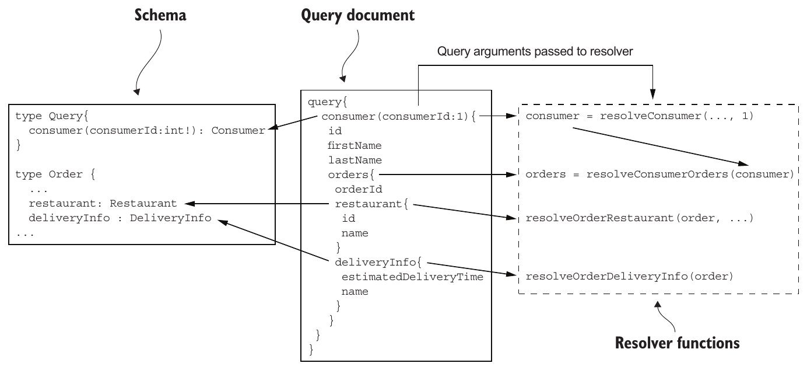

> **English:** Figure 8.11 GraphQL executes a query by recursively invoking the resolver functions for the fields specified in the Query document. First, it executes the resolver for the query, and then it recursively invokes the resolvers for the fields in the result object hierarchy.
>
> **Türkçe:** Şekil 8.11 GraphQL, Query belgesinde belirtilen alanların resolver işlevlerini özyinelemeli biçimde çağırarak sorguyu yürütür. Önce sorgunun resolver’ını çalıştırır; ardından sonuç nesnesi hiyerarşisindeki alanların resolver’larını özyinelemeli olarak çağırır.

<!-- source-record: u08_0300 -->

> **English:** The result of executing the resolvers is a Consumer object populated with data retrieved from multiple services.
>
> **Türkçe:** Çözücülerin işlenmesinin sonucu, birden fazla servisten alınan verilerle dolu bir Consumer nesnesi.

<!-- source-record: u08_0301 -->

> **English:** Let’s now look at how to optimize the executing of resolvers by using batching and caching.
>
> **Türkçe:** Şimdi toplu yükleme ve önbelleğe alma ile resolver yürütmesini nasıl optimize edebileceğimize bakalım.

<!-- source-pages: 288 -->

<!-- source-record: u08_0302 -->

#### OPTIMIZING LOADING USING BATCHING AND CACHING — Batching ve caching ile veri yüklemeyi iyileştirmek

<!-- source-record: u08_0303 -->

> **English:** GraphQL can potentially execute a large number of resolvers when executing a query. Because the GraphQL server executes each resolver independently, there’s a risk of poor performance due to excessive round-trips to the services. Consider, for example, a query that retrieves a consumer, their orders, and the orders’ restaurants. If there are N orders, then a simplistic implementation would make one call to Consumer Service, one call to Order History Service, and then N calls to Restaurant Service. Even though the GraphQL engine will typically make the calls to Restaurant Service in parallel, there’s a risk of poor performance. Fortunately, you can use a few techniques to improve performance.
>
> **Türkçe:** GraphQL, bir sorguda çok sayıda resolver çalıştırabilir. Sunucu her resolver’ı bağımsız yürüttüğünden servislere fazla ağ gidiş dönüşü yapılması performansı düşürebilir. Örneğin tüketiciyi, siparişlerini ve siparişlerin restoranlarını getiren sorguyu düşünün. N sipariş varsa basit bir gerçekleştirim Consumer Service’e bir, Order History Service’e bir ve Restaurant Service’e N çağrı yapar. GraphQL motoru restoran çağrılarını genellikle paralel yapsa da düşük performans riski vardır. Neyse ki performansı artıran bazı teknikler kullanılabilir.

<!-- source-record: u08_0304 -->

> **English:** One important optimization is to use a combination of server-side batching and caching. Batching turns N calls to a service, such as Restaurant Service, into a single call that retrieves a batch of N objects. Caching reuses the result of a previous fetch of the same object to avoid making an unnecessary duplicate call. The combination of batching and caching significantly reduces the number of round-trips to backend services.
>
> **Türkçe:** Önemli bir optimizasyon, sunucu tarafında batching (toplu yükleme) ile önbelleğe almayı birlikte kullanmaktır. Batching, Restaurant Service gibi bir servise N çağrı yapmak yerine N nesneyi topluca getiren tek çağrı yapar. Önbelleğe alma, gereksiz yinelenen çağrıyı önlemek için aynı nesnenin önceki getirilmesinin sonucunu yeniden kullanır. İkisi birlikte backend servislerine ağ gidiş dönüşlerinin sayısını önemli ölçüde azaltır.

<!-- source-record: u08_0305 -->

> **English:** A NodeJS-based GraphQL server can use the DataLoader module to implement batching and caching (https://github.com/facebook/dataloader). It coalesces loads that occur within a single execution of the event loop and calls a batch loading function that you provide. It also caches calls to eliminate duplicate loads. The following listing shows how RestaurantServiceProxy can use DataLoader. The findRestaurant() method loads a Restaurant via DataLoader.
>
> **Türkçe:** NodeJS tabanlı GraphQL sunucusu, toplu yükleme ve önbelleğe alma için DataLoader modülünü kullanabilir (https://github.com/facebook/dataloader). Event loop’un tek çalıştırılmasında oluşan yüklemeleri birleştirir ve sizin sağladığınız toplu yükleme işlevini çağırır. Yinelenen yüklemeleri engellemek için çağrıları önbelleğe de alır. Aşağıdaki listing, RestaurantServiceProxy’nin DataLoader kullanımını gösterir. findRestaurant(), Restaurant’ı DataLoader üzerinden yükler.

<!-- source-record: u08_0306 -->

#### Listing 8.9 Using a DataLoader to optimize calls to Restaurant Service — Listesi 8.9 DataLoader'yi kullanarak Restaurant Service'e aramaları optimize etmek

<!-- source-record: u08_0307 -->

```javascript
const DataLoader = require('dataloader');

class RestaurantServiceProxy {
    constructor() {
        this.dataLoader =
            new DataLoader(restaurantIds =>
             this.batchFindRestaurants(restaurantIds));
    }

    findRestaurant(restaurantId) {
         return this.dataLoader.load(restaurantId);
    }

    batchFindRestaurants(restaurantIds) {
       ...
    }
}
```

<!-- source-record: u08_0308 -->

**Kod açıklaması:**

> **English:** Create a DataLoader, which uses batchFindRestaurants() as the batch loading functions.
>
> **Türkçe:** Toplu yükleme işlevi olarak batchFindRestaurants() kullanan DataLoader oluşturun.

<!-- source-record: u08_0309 -->

**Kod açıklaması:**

> **English:** Load the specified Restaurant via the DataLoader.
>
> **Türkçe:** DataLoader üzerinden belirtilen Restaurant yükleyin.

<!-- source-record: u08_0310 -->

**Kod açıklaması:**

> **English:** Load a batch of Restaurants.
>
> **Türkçe:** Restaurant nesnelerini topluca yükleyin.

<!-- source-record: u08_0311 -->

> **English:** RestaurantServiceProxy and, hence, DataLoader are created for each request, so there’s no possibility of DataLoader mixing together different users’ data.
>
> **Türkçe:** RestaurantServiceProxy ve bu nedenle, DataLoader her talep için oluşturulur, bu nedenle DataLoader'nin farklı kullanıcıların verilerini bir araya getirme ihtimali yoktur.

<!-- source-record: u08_0312 -->

> **English:** Let’s now look at how to integrate the GraphQL engine with a web framework so that it can be invoked by clients.
>
> **Türkçe:** Şimdi GraphQL motorunu bir web çerçevesine nasıl entegre edeceğimize bakalım böylece istemciler tarafından çağrılabilir.

<!-- source-pages: 289 -->

<!-- source-record: u08_0313 -->

#### INTEGRATING THE APOLLO GRAPHQL SERVER WITH EXPRESS — Apollo GraphQL sunucusunu Express ile bütünleştirmek

<!-- source-record: u08_0314 -->

> **English:** The Apollo GraphQL server executes GraphQL queries. In order for clients to invoke it, you need to integrate it with a web framework. Apollo GraphQL server supports several web frameworks, including Express, a popular NodeJS web framework.
>
> **Türkçe:** Apollo GraphQL sunucusu GraphQL sorgularını çalıştırır. İstemcilerin çağırabilmesi için web framework’üyle entegre edilmelidir. Popüler NodeJS framework’ü Express dâhil birkaç web framework’ünü destekler.

<!-- source-record: u08_0315 -->

> **English:** Listing 8.10 shows how to use the Apollo GraphQL server in an Express application. The key function is graphqlExpress, which is provided by the apollo-serverexpress module. It builds an Express request handler that executes GraphQL queries against a schema. This example configures Express to route requests to the GET /graphql and POST /graphql endpoints of this GraphQL request handler. It also creates a GraphQL context containing the proxies, which makes them available to the resolvers.
>
> **Türkçe:** Listing 8.10, Apollo GraphQL sunucusunun Express uygulamasında kullanımını gösterir. Temel işlev, apollo-serverexpress modülünün sağladığı graphqlExpress’tir. Şema üzerinde GraphQL sorguları çalıştıran Express istek işleyicisini oluşturur. Örnek, GET /graphql ve POST /graphql isteklerini bu GraphQL işleyicisine yönlendirecek biçimde Express’i yapılandırır. Ayrıca proxy’leri içeren GraphQL context’i oluşturarak resolver’ların bunlara erişmesini sağlar.

<!-- source-record: u08_0316 -->

#### Listing 8.10 Integrating the GraphQL server with the Express web framework — Listesi 8.10 GraphQL sunucusu ile Express web çerçevesini entegre etmek

<!-- source-record: u08_0317 -->

```javascript
const {graphqlExpress} = require("apollo-server-express");
const typeDefs = gql`
   type Query {
    orders: resolveOrders,
   ...
  }
  type Consumer {
   ...
const resolvers = {
   Query: {
  ...
  }
}
const schema = makeExecutableSchema({ typeDefs, resolvers });

const app = express();

function makeContextWithDependencies(req) {
    const orderServiceProxy = new OrderServiceProxy();
    const consumerServiceProxy = new ConsumerServiceProxy();
    const restaurantServiceProxy = new RestaurantServiceProxy();
    ...
    return {orderServiceProxy, consumerServiceProxy,
              restaurantServiceProxy, ...};
}

function makeGraphQLHandler() {
     return graphqlExpress(req => {
        return {schema: schema, context: makeContextWithDependencies(req)}
    });
}
app.post('/graphql', bodyParser.json(), makeGraphQLHandler());

app.get('/graphql', makeGraphQLHandler());

app.listen(PORT);
```

<!-- source-record: u08_0318 -->

**Kod açıklaması:**

> **English:** Define the GraphQL schema.
>
> **Türkçe:** GraphQL şemasını tanımlayın.

<!-- source-record: u08_0319 -->

**Kod açıklaması:**

> **English:** Define the resolvers.
>
> **Türkçe:** Resolver’ları tanımlayın.

<!-- source-record: u08_0320 -->

**Kod açıklaması:**

> **English:** Combine the schema with the resolvers to create an executable schema.
>
> **Türkçe:** Çalıştırılabilir şema oluşturmak için şemayı resolver’larla birleştirin.

<!-- source-record: u08_0321 -->

**Kod açıklaması:**

> **English:** Inject repositories into the context so they’re available to resolvers.
>
> **Türkçe:** Resolver’ların erişebilmesi için repository’leri context’e enjekte edin.

<!-- source-record: u08_0322 -->

**Kod açıklaması:**

> **English:** Make an express request handler that executes GraphQL queries against the executable schema.
>
> **Türkçe:** Çalıştırılabilir şema üzerinde GraphQL sorguları yürüten Express istek işleyicisi oluşturun.

<!-- source-record: u08_0323 -->

**Kod açıklaması:**

> **English:** Route POST /graphql and GET /graphql endpoints to the GraphQL server.
>
> **Türkçe:** POST /graphql ve GET /graphql endpoint’lerini GraphQL sunucusuna yönlendirin.

<!-- source-pages: 290 -->

<!-- source-record: u08_0324 -->

> **English:** This example doesn’t handle concerns such as security, but those would be straightforward to implement. The API gateway could, for example, authenticate users using Passport, a NodeJS security framework described in chapter 11. The makeContextWithDependencies() function would pass the user information to each repository’s constructor so that they can propagate the user information to the services.
>
> **Türkçe:** Bu örnek güvenlik gibi konuları ele almaz; ancak bunları gerçekleştirmek kolaydır. Örneğin gateway, 11. bölümde açıklanan NodeJS güvenlik framework’ü Passport ile kullanıcıların kimliğini doğrulayabilir. makeContextWithDependencies(), kullanıcı bilgilerini servislerine aktarabilmeleri için her repository’nin constructor’ına geçirir.

<!-- source-record: u08_0325 -->

> **English:** Let’s now look at how a client can invoke this server to execute GraphQL queries.
>
> **Türkçe:** Şimdi istemcinin GraphQL sorgularını çalıştırmak için bu sunucuyu nasıl çağıracağına bakalım.

<!-- source-record: u08_0326 -->

#### WRITING A GRAPHQL CLIENT — GraphQL istemcisi yazmak

<!-- source-record: u08_0327 -->

> **English:** There are a couple of different ways a client application can invoke the GraphQL server. Because the GraphQL server has an HTTP-based API, a client application could use an HTTP library to make requests, such as GET http://localhost:3000/graphql?query={orders(consumerId:1){orderId,restaurant{id}}}'. It’s easier, though, to use a GraphQL client library, which takes care of properly formatting requests and typically provides features such as client-side caching.
>
> **Türkçe:** İstemci uygulaması GraphQL sunucusunu birkaç yolla çağırabilir. Sunucu HTTP tabanlı API sunduğundan istemci, HTTP kütüphanesiyle GET http://localhost:3000/graphql?query={orders(consumerId:1){orderId,restaurant{id}}} gibi istekler gönderebilir. Ancak istekleri doğru biçimlendiren ve genellikle istemci tarafı önbelleğe alma gibi özellikler sunan GraphQL istemci kütüphanesi kullanmak daha kolaydır.

<!-- source-record: u08_0328 -->

> **English:** The following listing shows the FtgoGraphQLClient class, which is a simple GraphQL-based client for the FTGO application. Its constructor instantiates ApolloClient, which is provided by the Apollo GraphQL client library. The FtgoGraphQLClient class defines a findConsumer() method that uses the client to retrieve the name of a consumer.
>
> **Türkçe:** Aşağıdaki listing, FTGO için basit GraphQL istemcisi olan FtgoGraphQLClient sınıfını gösterir. Constructor’ı, Apollo GraphQL istemci kütüphanesinin sağladığı ApolloClient’ı oluşturur. Sınıf, tüketicinin adını getirmek için istemciyi kullanan findConsumer() metodunu tanımlar.

<!-- source-record: u08_0329 -->

#### Listing 8.11 Using the Apollo GraphQL client to execute queries — Liste 8.11 Sorguları gerçekleştirmek için Apollo GraphQL istemcisini kullanmak

<!-- source-record: u08_0330 -->

```javascript
class FtgoGraphQLClient {

    constructor(...) {
        this.client = new ApolloClient({ ... });
    }

    findConsumer(consumerId) {
        return this.client.query({
            variables: { cid: consumerId},
             query: gql`
              query foo($cid : Int!) {
                 consumer(consumerId: $cid)  {
                     id
                    firstName
                    lastName
                }
            } `,
        })
    }

}
```

<!-- source-record: u08_0331 -->

**Kod açıklaması:**

> **English:** Supply the value of the $cid.
>
> **Türkçe:** $cid değerini sağlayın.

<!-- source-record: u08_0332 -->

**Kod açıklaması:**

> **English:** Define $cid as a variable of type Int.
>
> **Türkçe:** $cid değişkenini Int türünde tanımlayın.

<!-- source-record: u08_0333 -->

**Kod açıklaması:**

> **English:** Set the value of query parameter consumerid to $cid.
>
> **Türkçe:** consumerid sorgu parametresinin değerini $cid olarak ayarlayın.

<!-- source-record: u08_0334 -->

> **English:** The FtgoGraphQLClient class can define a variety of query methods, such as findConsumer(). Each one executes a query that retrieves exactly the data needed by the client.
>
> **Türkçe:** FtgoGraphQLClient, findConsumer() gibi çeşitli sorgu metotları tanımlayabilir. Her biri, istemcinin tam olarak ihtiyaç duyduğu verileri getiren sorgu çalıştırır.

<!-- source-pages: 291 -->

<!-- source-record: u08_0335 -->

> **English:** This section has barely scratched the surface of GraphQL’s capabilities. I hope I’ve demonstrated that GraphQL is a very appealing alternative to a more traditional, REST-based API gateway. It lets you implement an API that’s flexible enough to support a diverse set of clients. Consequently, you should consider using GraphQL to implement your API gateway.
>
> **Türkçe:** Bu kısımda GraphQL’nin yeteneklerine yalnızca yüzeysel olarak değinebildik. Geleneksel REST tabanlı gateway’e çok çekici bir alternatif olduğunu gösterebildiğimi umuyorum. Farklı istemcileri destekleyecek kadar esnek API gerçekleştirmenizi sağlar. Bu nedenle gateway’inizi oluştururken GraphQL kullanmayı değerlendirmelisiniz.

<!-- source-record: u08_0336 -->

## Summary — Bölüm özeti

<!-- source-record: u08_0337 -->

> **English:** • Your application’s external clients usually access the application’s services via an API gateway. An API gateway provides each client with a custom API. It’s responsible for request routing, API composition, protocol translation, and implementation of edge functions such as authentication.
>
> **Türkçe:** • Uygulamanın dış istemcileri servislere genellikle API gateway üzerinden erişir. Gateway, her istemciye özel API sunar. İstek yönlendirme, API composition, protokol dönüşümü ve kimlik doğrulama gibi sınır işlevlerinden sorumludur.

<!-- source-record: u08_0338 -->

> **English:** • Your application can have a single API gateway or it can use the Backends for frontends pattern, which defines an API gateway for each type of client. The main advantage of the Backends for frontends pattern is that it gives the client teams greater autonomy, because they develop, deploy, and operate their own API gateway.
>
> **Türkçe:** • Uygulamanın tek gateway’i olabilir veya her istemci türü için ayrı gateway tanımlayan Backends for frontends örüntüsünü kullanabilir. BFF’nin temel yararı, kendi gateway’lerini geliştirip dağıtan ve işleten istemci ekiplerine daha fazla özerklik sağlamasıdır.

<!-- source-record: u08_0339 -->

> **English:** • There are numerous technologies you can use to implement an API gateway, including off-the-shelf API gateway products. Alternatively, you can develop your own API gateway using a framework.
>
> **Türkçe:** • Gateway gerçekleştirmek için hazır gateway ürünleri dâhil birçok teknoloji kullanılabilir. Alternatif olarak framework kullanarak kendi gateway’inizi geliştirebilirsiniz.

<!-- source-record: u08_0340 -->

> **English:** • Spring Cloud Gateway is a good, easy-to-use framework for developing an API gateway. It routes requests using any request attribute, including the method and the path. Spring Cloud Gateway can route a request either directly to a backend service or to a custom handler method. It’s built using the scalable, reactive Spring Framework 5 and Project Reactor frameworks. You can write your custom request handlers in a reactive style using, for example, Project Reactor’s Mono abstraction.
>
> **Türkçe:** • Spring Cloud Gateway, gateway geliştirmek için iyi ve kullanımı kolay framework’tür. Metot ve yol dâhil herhangi bir istek niteliğiyle yönlendirme yapar. İsteği doğrudan backend servisine veya özel handler metoduna yönlendirebilir. Ölçeklenebilir ve reaktif Spring Framework 5 ile Project Reactor üzerine kuruludur. Özel istek işleyicilerinizi, örneğin Project Reactor’ın Mono soyutlamasıyla reaktif tarzda yazabilirsiniz.

<!-- source-record: u08_0341 -->

> **English:** • GraphQL, a framework that provides graph-based query language, is another excellent foundation for developing an API Gateway. You write a graph-oriented schema to describe the server-side data model and its supported queries. You then map that schema to your services by writing resolvers, which retrieve data. GraphQL-based clients execute queries against the schema that specify exactly the data that the server should return. As a result, a GraphQL-based API gateway can support diverse clients.
>
> **Türkçe:** • Graf tabanlı sorgu dili sağlayan GraphQL, gateway geliştirmek için başka bir güçlü temeldir. Sunucu veri modelini ve desteklenen sorguları tanımlayan graf odaklı şema yazarsınız. Ardından veri getiren resolver’larla şemayı servislere eşlersiniz. GraphQL istemcileri, sunucunun tam olarak hangi verileri döndüreceğini belirten sorguları şema üzerinde çalıştırır. Böylece GraphQL tabanlı gateway farklı istemcileri destekleyebilir.
