# Ünite 09 · Testing microservices: Part 1 — Microservice testleri: Bölüm 1

**Amaç:** Microservice testleri: Bölüm 1 konusunu İngilizce–Türkçe karşılaştırmalı çalışmak; teknik açıklamaları özgün şekiller, tablolar ve kod örnekleriyle birlikte okumak.

**Kaynak:** Kullanıcının sağladığı *Microservices Patterns*, bölüm 9; `Microservices_Patterns_1_Bolumden_Itibaren.pdf`, kaynak PDF sayfaları **292–317**. Başlık ve metin sırası korunmuş, sayfa sonlarında bölünen paragraflar birleştirilmiştir. Şekiller, üzerlerindeki yazılar korunarak kaynak PDF'den alınmıştır.

**Okuma notu:** Teknoloji ve şirket örnekleri kitabın yazıldığı dönemin anlatımıdır. Kodlar kaynakta verilen bağlama bağlı örneklerdir; bağımsız Java 17 programları olarak sunulmaz. İngilizce kaynak ve Türkçe çeviri ardışık bloklardadır. Türkçe paragraflar kaynak metinle karşılaştırılarak hazırlanmış; teknik terimler, anlam ilişkileri ve metin aktarımı kontrol edilmiştir.

**Dil çalışması:** [Ünite sözlüğü](vocabulary.md) · [Vocabulary PDF](vocabulary.pdf) · [Grammar notları](grammar_notes.md) · [Grammar PDF](grammar_notes.pdf). Kelime anlamları ve cümle yapılarının ayrıntıları bu iki eşlikçi kaynaktadır.

<!-- source-pages: 292 -->

<!-- source-record: u09_0000 -->

## This chapter covers — Bu bölümün kapsamı

<!-- source-record: u09_0001 -->

> **English:** • Effective testing strategies for microservices
>
> **Türkçe:** • Microservice'ler için etkili test stratejileri

<!-- source-record: u09_0002 -->

> **English:** • Using mocks and stubs to test a software element in isolation
>
> **Türkçe:** • Bir yazılım öğesini yalıtılmış biçimde test etmek için mock ve stub kullanımı

<!-- source-record: u09_0003 -->

> **English:** • Using the test pyramid to determine where to focus testing efforts
>
> **Türkçe:** • Test çalışmalarının nereye odaklanacağını belirlemek için test piramidinin kullanılması

<!-- source-record: u09_0004 -->

> **English:** • Unit testing the classes inside a service
>
> **Türkçe:** • Bir servisin içindeki sınıflar için unit test yazılması

<!-- source-record: u09_0005 -->

> **English:** FTGO, like many organizations, had adopted a traditional approach to testing. Testing is primarily an activity that happens after development. The FTGO developers throw their code over a wall to the QA team, who verify that the software works as expected. What’s more, most of their testing is done manually. Sadly, this approach to testing is broken—for two reasons:
>
> **Türkçe:** FTGO, birçok kuruluş gibi test konusunda geleneksel bir yaklaşım benimsemişti. Test, öncelikle geliştirmeden sonra yapılan bir faaliyetti. FTGO geliştiricileri kodlarını adeta bir duvarın ötesine, yazılımın beklendiği gibi çalıştığını doğrulayan QA ekibine atıyordu. Üstelik testlerinin çoğu elle yapılıyordu. Ne yazık ki bu test yaklaşımı iki nedenle işlemiyordu:

<!-- source-record: u09_0006 -->

> **English:** • Manual testing is extremely inefficient—You should never ask a human to do what a machine can do better. Compared to machines, humans are slow and can’t work 24/7. You won’t be able to deliver software rapidly and safely if you rely on manual testing. It’s essential that you write automated tests.
>
> **Türkçe:** • Elle test yapmak son derece verimsizdir—Bir makinenin daha iyi yapabileceği bir işi hiçbir zaman insandan istememelisiniz. İnsanlar makinelere göre yavaştır ve haftanın yedi günü, günün yirmi dört saati çalışamaz. Elle teste dayanırsanız yazılımı hızlı ve güvenli biçimde teslim edemezsiniz. Otomatik testler yazmanız şarttır.

<!-- source-record: u09_0007 -->

> **English:** • Testing is done far too late in the delivery process—There certainly is a role for tests that critique an application after it’s been written, but experience has shown that those tests are insufficient. A much better approach is for developers to write automated tests as part of development. It improves their productivity because, for example, they’ll have tests that provide immediate feedback while editing code.
>
> **Türkçe:** • Test, teslim sürecinde çok geç yapılmaktadır—Uygulama yazıldıktan sonra onu eleştirel biçimde değerlendiren testlerin elbette bir yeri vardır; ancak deneyim, bu testlerin yetersiz olduğunu göstermiştir. Çok daha iyi bir yaklaşım, geliştiricilerin geliştirme sırasında otomatik testler yazmasıdır. Bu yaklaşım üretkenliği artırır; örneğin kodu düzenlerken anında geri bildirim veren testleri olur.

<!-- source-pages: 293 -->

<!-- source-record: u09_0008 -->

> **English:** In this regard, FTGO is a fairly typical organization. The Sauce Labs Testing Trends in 2018 report paints a fairly gloomy picture of the state of test automation (https://saucelabs.com/resources/white-papers/testing-trends-for-2018). It describes how only 26% of organizations are mostly automated, and a minuscule 3% are fully automated!
>
> **Türkçe:** Bu açıdan FTGO oldukça tipik bir kuruluştur. Sauce Labs'in Testing Trends in 2018 raporu, test otomasyonunun durumu hakkında oldukça karamsar bir tablo çizer (https://saucelabs.com/resources/white-papers/testing-trends-for-2018). Rapora göre kuruluşların yalnızca %26'sında testlerin çoğu, sadece %3'ünde ise tamamı otomatikleştirilmiştir!

<!-- source-record: u09_0009 -->

> **English:** The reliance on manual testing isn’t because of a lack of tooling and frameworks. For example, JUnit, a popular Java testing framework, was first released in 1998. The reason for the lack of automated tests is mostly cultural: “Testing is QA’s job,” “It’s not the best use of a developer’s time,” and so on. It also doesn’t help that developing a fast-running, yet effective, maintainable test suite is challenging. And, a typical large, monolithic application is extremely difficult to test.
>
> **Türkçe:** Elle teste bağımlılığın nedeni araç ve framework eksikliği değildir. Örneğin popüler bir Java test framework'ü olan JUnit ilk kez 1998'de yayımlanmıştır. Otomatik test eksikliğinin nedeni çoğunlukla kültüreldir: “Test yapmak QA ekibinin işidir”, “Geliştiricinin zamanını değerlendirmek için en iyi yol bu değildir” ve benzeri düşünceler. Hızlı çalışan, aynı zamanda etkili ve bakımı yapılabilir bir test suite geliştirmenin güç olması da durumu kolaylaştırmaz. Ayrıca tipik, büyük bir monolitik uygulamayı test etmek son derece zordur.

<!-- source-record: u09_0010 -->

> **English:** One key motivation for using the microservice architecture is, as described in chapter 2, improving testability. Yet at the same time, the complexity of the microservice architecture demands that you write automated tests. Furthermore, some aspects of testing microservices are challenging. That’s because we need to verify that services can interact correctly while minimizing the number of slow, complex, and unreliable end-to-end-tests that launch many services.
>
> **Türkçe:** Bölüm 2'de anlatıldığı gibi, microservice mimarisi kullanmanın temel gerekçelerinden biri test edilebilirliği artırmaktır. Ancak aynı zamanda microservice mimarisinin karmaşıklığı otomatik testler yazmanızı gerektirir. Dahası, microservice testlerinin bazı yönleri zorludur. Çünkü çok sayıda servisi başlatan yavaş, karmaşık ve güvenilmez end-to-end testlerin sayısını en aza indirirken servislerin doğru etkileşim kurabildiğini doğrulamamız gerekir.

<!-- source-record: u09_0011 -->

> **English:** This chapter is the first of two chapters on testing. It’s an introduction to testing. Chapter 10 covers more advanced testing concepts. The two chapters are long, but together they cover testing ideas and techniques that are essential to modern software development in general, and to the microservice architecture in particular.
>
> **Türkçe:** Bu bölüm, test konusundaki iki bölümden ilkidir ve teste giriş niteliğindedir. Bölüm 10 daha ileri test kavramlarını ele alır. Bu iki bölüm uzundur; ancak birlikte, genel olarak modern yazılım geliştirme ve özel olarak microservice mimarisi için vazgeçilmez test fikirlerini ve tekniklerini kapsar.

<!-- source-record: u09_0012 -->

> **English:** I begin this chapter by describing effective testing strategies for a microservices-based application. These strategies enable you to be confident that your software works, while minimizing test complexity and execution time. After that, I describe how to write one particular kind of test for your services: unit tests. Chapter 10 covers the other kinds of tests: integration, component, and end-to-end.
>
> **Türkçe:** Bu bölüme microservice tabanlı bir uygulama için etkili test stratejilerini anlatarak başlıyorum. Bu stratejiler, test karmaşıklığını ve yürütme süresini en aza indirirken yazılımınızın çalıştığından emin olmanızı sağlar. Ardından servisleriniz için belirli bir test türünü, unit testleri nasıl yazacağınızı anlatıyorum. Bölüm 10 diğer test türlerini ele alır: integration, component ve end-to-end testleri.

<!-- source-record: u09_0013 -->

> **English:** Let’s start by taking a look at testing strategies for microservices.
>
> **Türkçe:** Microservice test stratejilerine göz atarak başlayalım.

<!-- source-record: u09_0014 -->

### Why an introduction to testing? — Teste giriş neden gerekli?

<!-- source-record: u09_0015 -->

> **English:** You may be wondering why this chapter includes an introduction to basic testing concepts. If you’re already familiar with concepts such as the test pyramid and the different types of tests, feel free to speed-read this chapter and move onto the next one, which focuses on microservices-specific testing topics. But based on my experiences consulting for and training clients all over the world, a fundamental weakness of many software development organizations is the lack of automated testing. That’s because if you want to deliver software quickly and reliably, it’s absolutely essential to do automated testing. It’s the only way to have a short lead time, which is the time it takes to get committed code into production. Perhaps even more importantly, automated testing is essential because it forces you to develop a testable application. It’s typically very difficult to introduce automating testing into an already large, complex application. In other words, the fast track to monolithic hell is to not write automated tests.
>
> **Türkçe:** Bu bölümün neden temel test kavramlarına bir giriş içerdiğini merak ediyor olabilirsiniz. Test piramidi ve farklı test türleri gibi kavramları zaten biliyorsanız bu bölümü hızlıca okuyup microservice'lere özgü test konularına odaklanan sonraki bölüme geçebilirsiniz. Ancak dünyanın farklı yerlerindeki müşterilere danışmanlık ve eğitim verme deneyimlerime göre birçok yazılım geliştirme kuruluşunun temel zayıflığı otomatik test eksikliğidir. Çünkü yazılımı hızlı ve güvenilir biçimde teslim etmek istiyorsanız otomatik test yapmak kesinlikle gereklidir. Commit edilmiş kodun production ortamına alınmasına kadar geçen süre olan lead time'ı kısa tutmanın tek yolu budur. Belki daha da önemlisi, otomatik testler sizi test edilebilir bir uygulama geliştirmeye zorladığı için gereklidir. Zaten büyük ve karmaşık hale gelmiş bir uygulamaya otomatik test eklemek genellikle çok zordur. Başka bir deyişle, monolitik cehenneme giden kestirme yol otomatik test yazmamaktır.

<!-- source-pages: 294 -->

<!-- source-record: u09_0016 -->

## 9.1 Testing strategies for microservice architectures — Microservice mimarileri için test stratejileri

<!-- source-record: u09_0017 -->

> **English:** Let’s say you’ve made a change to FTGO application’s Order Service. Naturally, the next step is for you to run your code and verify that the change works correctly. One option is to test the change manually. First, you run Order Service and all its dependencies, which include infrastructure services such as a database and other application services. Then you “test” the service by either invoking its API or using the FTGO application’s UI. The downside of this approach is that it’s a slow, manual way to test your code.
>
> **Türkçe:** FTGO uygulamasının Order Service servisinde bir değişiklik yaptığınızı varsayalım. Doğal olarak sonraki adım kodunuzu çalıştırıp değişikliğin doğru çalıştığını doğrulamaktır. Seçeneklerden biri değişikliği elle test etmektir. Önce Order Service'i ve veritabanı gibi altyapı servisleriyle diğer uygulama servislerini kapsayan tüm bağımlılıklarını çalıştırırsınız. Ardından ya API'sini çağırarak ya da FTGO uygulamasının kullanıcı arayüzünü kullanarak servisi “test edersiniz”. Bu yaklaşımın dezavantajı, kodunuzu sınamak için yavaş ve elle yürütülen bir yöntem olmasıdır.

<!-- source-record: u09_0018 -->

> **English:** A much better option is to have automated tests that you can run during development. Your development workflow should be: edit code, run tests (ideally with a single keystroke), repeat. The fast-running tests quickly tell you whether your changes work within a few seconds. But how do you write fast-running tests? And are they sufficient or do you need more comprehensive tests? These are the kind of questions I answer in this and other sections in this chapter.
>
> **Türkçe:** Çok daha iyi bir seçenek, geliştirme sırasında çalıştırabileceğiniz otomatik testlere sahip olmaktır. Geliştirme iş akışınız şöyle olmalıdır: kodu düzenle, testleri çalıştır (ideal olarak tek bir tuşa basarak), tekrarla. Hızlı çalışan testler, değişikliklerinizin işe yarayıp yaramadığını birkaç saniye içinde söyler. Peki hızlı çalışan testler nasıl yazılır? Bunlar yeterli midir, yoksa daha kapsamlı testler de gerekir mi? Bu bölümdeki bu ve diğer kısımlarda yanıtladığım sorular bunlardır.

<!-- source-record: u09_0019 -->

> **English:** I start this section with an overview of important automated testing concepts. We’ll look at the purpose of testing and the structure of a typical test. I cover the different types of tests that you’ll need to write. I also describe the test pyramid, which provides valuable guidance about where you should focus your testing efforts. After covering testing concepts, I discuss strategies for testing microservices. We’ll look at the distinct challenges of testing applications that have a microservice architecture. I describe techniques you can use to write simpler and faster, yet still-effective, tests for your microservices.
>
> **Türkçe:** Bu kısma önemli otomatik test kavramlarına genel bir bakışla başlıyorum. Testin amacını ve tipik bir testin yapısını inceleyeceğiz. Yazmanız gereken farklı test türlerini ele alıyorum. Test çalışmalarınızı nereye odaklamanız gerektiği konusunda değerli yol göstericilik sağlayan test piramidini de anlatıyorum. Test kavramlarından sonra microservice test stratejilerini tartışıyorum. Microservice mimarisine sahip uygulamaları test etmenin kendine özgü güçlüklerini inceleyeceğiz. Microservice'leriniz için daha basit ve hızlı, ancak yine de etkili testler yazmakta kullanabileceğiniz teknikleri açıklıyorum.

<!-- source-record: u09_0020 -->

> **English:** Let’s take a look at testing concepts.
>
> **Türkçe:** Test kavramlarına göz atalım.

<!-- source-record: u09_0021 -->

### 9.1.1 Overview of testing — Teste genel bakış

<!-- source-record: u09_0022 -->

> **English:** In this chapter, my focus is on automated testing, and I use the term test as shorthand for automated test. Wikipedia defines a test case, or test, as follows:
>
> **Türkçe:** Bu bölümde odağım otomatik testtir ve test terimini otomatik testin kısa karşılığı olarak kullanıyorum. Wikipedia bir test case'i, yani testi, şöyle tanımlar:

<!-- source-record: u09_0023 -->

> **English:** A test case is a set of test inputs, execution conditions, and expected results developed for a particular objective, such as to exercise a particular program path or to verify compliance with a specific requirement. https://en.wikipedia.org/wiki/Test_case
>
> **Türkçe:** Bir test case; belirli bir program yolunu çalıştırmak veya belirli bir gereksinime uyulduğunu doğrulamak gibi özel bir amaç için hazırlanmış test girdileri, yürütme koşulları ve beklenen sonuçlar kümesidir. https://en.wikipedia.org/wiki/Test_case

<!-- source-record: u09_0024 -->

> **English:** In other words, the purpose of a test is, as figure 9.1 shows, to verify the behavior of the System Under Test (SUT). In this definition, system is a fancy term that means the software element being tested. It might be something as small as a class, as large as the entire application, or something in between, such as a cluster of classes or an individual service. A collection of related tests form a test suite.
>
> **Türkçe:** Başka bir deyişle, Şekil 9.1'in gösterdiği gibi testin amacı System Under Test'in (SUT; test edilen sistem) davranışını doğrulamaktır. Bu tanımdaki sistem, test edilen yazılım öğesini ifade eden gösterişli bir sözcüktür. Bu öğe bir sınıf kadar küçük, tüm uygulama kadar büyük veya bir sınıf kümesi ya da tek bir servis gibi bu ikisinin arasında olabilir. Birbiriyle ilişkili testler topluluğu bir test suite (test paketi) oluşturur.

<!-- source-record: u09_0025 -->

> **English:** Let’s first look at the concept of an automated test. Then I discuss the different kinds of tests that you’ll need to write. After that, I discuss the test pyramid, which describes the relative proportions of the different types of tests that you should write.
>
> **Türkçe:** Önce otomatik test kavramını inceleyelim. Ardından yazmanız gereken farklı test türlerini ele alacağım. Sonrasında, yazmanız gereken farklı test türlerinin göreli oranlarını açıklayan test piramidini tartışacağım.

<!-- source-pages: 295 -->

<!-- source-record: u09_0026 -->

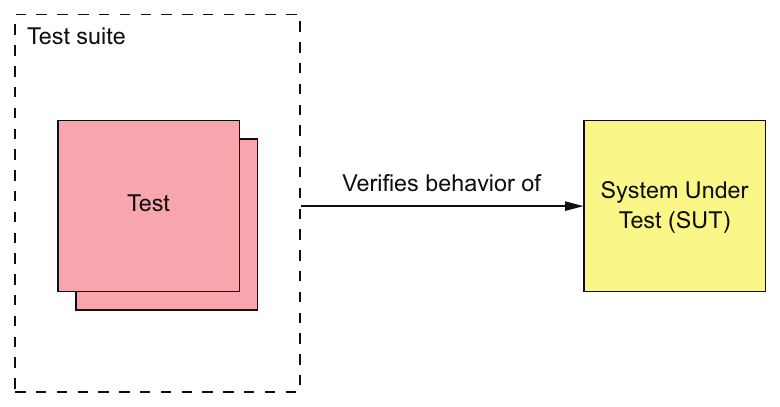

> **English:** Figure 9.1 The goal of a test is to verify the behavior of the system under test. An SUT might be as small as a class or as large as an entire application.
>
> **Türkçe:** Şekil 9.1 Bir testin amacı, test edilen sistemin davranışını doğrulamaktır. SUT bir sınıf kadar küçük ya da bütün bir uygulama kadar büyük olabilir.

<!-- source-record: u09_0027 -->

#### WRITING AUTOMATED TESTS — OTOMATİK TEST YAZMA

<!-- source-record: u09_0028 -->

> **English:** Automated tests are usually written using a testing framework. JUnit, for example, is a popular Java testing framework. Figure 9.2 shows the structure of an automated test. Each test is implemented by a test method, which belongs to a test class.
>
> **Türkçe:** Otomatik testler genellikle bir test framework'ü kullanılarak yazılır. Örneğin JUnit popüler bir Java test framework'üdür. Şekil 9.2, otomatik bir testin yapısını gösterir. Her test, bir test sınıfına ait test metodu olarak uygulanır.

<!-- source-record: u09_0029 -->

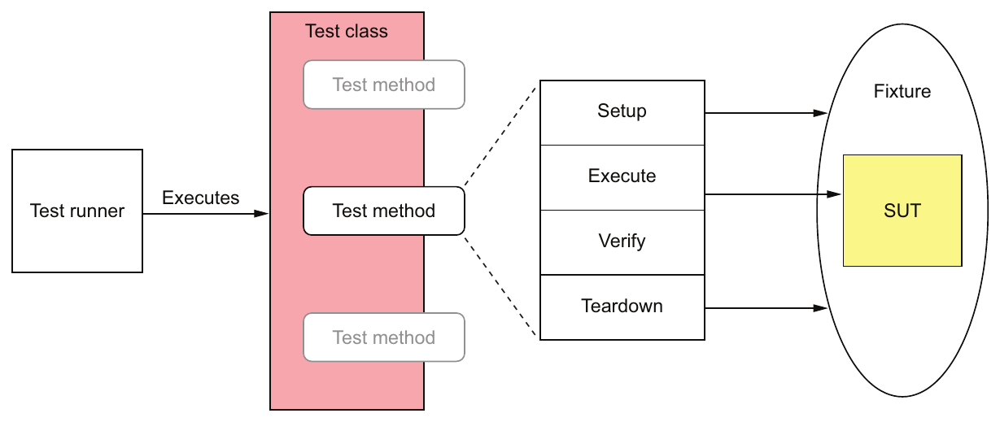

> **English:** Figure 9.2 Each automated test is implemented by a test method, which belongs to a test class. A test consists of four phases: setup, which initializes the test fixture, which is everything required to run the test; execute, which invokes the SUT; verify, which verifies the outcome of the test; and teardown, which cleans up the test fixture.
>
> **Türkçe:** Şekil 9.2 Her otomatik test, bir test sınıfına ait test metodu olarak uygulanır. Bir test dört aşamadan oluşur: testi çalıştırmak için gereken her şeyi kapsayan test fixture'ı başlatan setup; SUT'yi çağıran execute; test sonucunu doğrulayan verify ve test fixture'ı temizleyen teardown.

<!-- source-record: u09_0030 -->

> **English:** An automated test typically consists of four phases (http://xunitpatterns.com/Four%20Phase%20Test.html):
>
> **Türkçe:** Otomatik bir test tipik olarak dört aşamadan oluşur (http://xunitpatterns.com/Four%20Phase%20Test.html):

<!-- source-record: u09_0031 -->

> **English:** 1 Setup—Initialize the test fixture, which consists of the SUT and its dependencies, to the desired initial state. For example, create the class under test and initialize it to the state required for it to exhibit the desired behavior.
>
> **Türkçe:** 1 Setup (hazırlık)—SUT ve bağımlılıklarından oluşan test fixture'ı istenen başlangıç durumuna getirir. Örneğin test edilen sınıfı oluşturur ve beklenen davranışı göstermesi için gereken duruma getirir.

<!-- source-record: u09_0032 -->

> **English:** 2 Exercise—Invoke the SUT—for example, invoke a method on the class under test.
>
> **Türkçe:** 2 Exercise (çalıştırma)—SUT'yi çağırır; örneğin test edilen sınıftaki bir metodu çağırır.

<!-- source-record: u09_0033 -->

> **English:** 3 Verify—Make assertions about the invocation’s outcome and the state of the SUT. For example, verify the method’s return value and the new state of the class under test.
>
> **Türkçe:** 3 Verify (doğrulama)—Çağrının sonucu ve SUT'nin durumu hakkında assertion'lar yapar. Örneğin metodun dönüş değerini ve test edilen sınıfın yeni durumunu doğrular.

<!-- source-pages: 296 -->

<!-- source-record: u09_0034 -->

> **English:** 4 Teardown—Clean up the test fixture, if necessary. Many tests omit this phase, but some types of database test will, for example, roll back a transaction initiated by the setup phase.
>
> **Türkçe:** 4 Teardown (temizleme)—Gerekliyse test fixture'ı temizler. Birçok test bu aşamayı atlar; ancak bazı veritabanı testleri, örneğin setup aşamasında başlatılan transaction'ı geri alır.

<!-- source-record: u09_0035 -->

> **English:** In order to reduce code duplication and simplify tests, a test class might have setup methods that are run before a test method, and teardown methods that are run afterwards. A test suite is a set of test classes. The tests are executed by a test runner.
>
> **Türkçe:** Kod tekrarını azaltmak ve testleri basitleştirmek için bir test sınıfında test metodundan önce çalışan setup metotları ve sonrasında çalışan teardown metotları bulunabilir. Bir test suite, test sınıflarından oluşur. Testler bir test runner tarafından yürütülür.

<!-- source-record: u09_0036 -->

#### TESTING USING MOCKS AND STUBS — MOCK VE STUB KULLANARAK TEST ETME

<!-- source-record: u09_0037 -->

> **English:** An SUT often has dependencies. The trouble with dependencies is that they can complicate and slow down tests. For example, the OrderController class invokes OrderService, which ultimately depends on numerous other application services and infrastructure services. It wouldn’t be practical to test the OrderController class by running a large portion of the system. We need a way to test an SUT in isolation.
>
> **Türkçe:** Bir SUT'nin çoğu zaman bağımlılıkları vardır. Bağımlılıkların sorunu, testleri karmaşıklaştırıp yavaşlatabilmeleridir. Örneğin OrderController sınıfı, sonuçta çok sayıda başka uygulama ve altyapı servisine bağımlı olan OrderService'i çağırır. Sistemin büyük bir bölümünü çalıştırarak OrderController sınıfını test etmek pratik olmaz. SUT'yi yalıtılmış biçimde test etmenin bir yoluna ihtiyacımız vardır.

<!-- source-record: u09_0038 -->

> **English:** The solution, as figure 9.3 shows, is to replace the SUT’s dependencies with test doubles. A test double is an object that simulates the behavior of the dependency.
>
> **Türkçe:** Şekil 9.3'te gösterildiği gibi çözüm, SUT'nin bağımlılıklarını test double'larla (test taklitleriyle) değiştirmektir. Test double, bağımlılığın davranışını taklit eden bir nesnedir.

<!-- source-record: u09_0039 -->

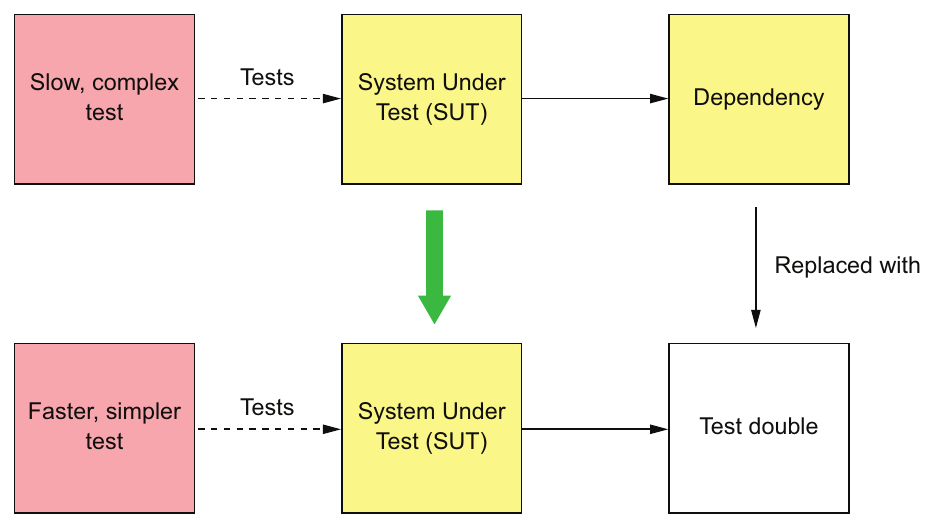

> **English:** Figure 9.3 Replacing a dependency with a test double enables the SUT to be tested in isolation. The test is simpler and faster.
>
> **Türkçe:** Şekil 9.3 Bir bağımlılığı test double ile değiştirmek, SUT'nin yalıtılmış biçimde test edilmesini sağlar. Test daha basit ve hızlı olur.

<!-- source-record: u09_0040 -->

> **English:** There are two types of test doubles: stubs and mocks. The terms stubs and mocks are often used interchangeably, although they have slightly different behavior. A stub is a test double that returns values to the SUT. A mock is a test double that a test uses to verify that the SUT correctly invokes a dependency. Also, a mock is often a stub.
>
> **Türkçe:** İki tür test double vardır: stub ve mock. Davranışları biraz farklı olsa da stub ve mock terimleri çoğu zaman birbirinin yerine kullanılır. Stub, SUT'ye değer döndüren bir test double'dır. Mock ise testin, SUT'nin bir bağımlılığı doğru çağırdığını doğrulamak için kullandığı test double'dır. Ayrıca bir mock çoğu zaman aynı zamanda bir stub'dır.

> **Terim notu:** Kaynak bu bağlamda stub ve mock ayrımına odaklanır. Test double üst kavramının başka sınıflandırmalarında dummy, fake ve spy gibi türler de bulunur. Ayrıntı için [ünite sözlüğüne](vocabulary.md) bakın.

<!-- source-record: u09_0041 -->

> **English:** Later on in this chapter, you’ll see examples of test doubles in action. For example, section 9.2.5 shows how to test the OrderController class in isolation by using a test double for the OrderService class. In that example, the OrderService test double is implemented using Mockito, a popular mock object framework for Java. Chapter 10 shows how to test Order Service using test doubles for the other services that it invokes. Those test doubles respond to command messages sent by Order Service.
>
> **Türkçe:** Bu bölümün ilerleyen kısımlarında test double'ların kullanım örneklerini göreceksiniz. Örneğin 9.2.5 kısmı, OrderService sınıfı yerine bir test double kullanarak OrderController sınıfının yalıtılmış biçimde nasıl test edildiğini gösterir. Bu örnekte OrderService test double'ı, Java için popüler bir mock nesne framework'ü olan Mockito ile uygulanmıştır. Bölüm 10, Order Service'in çağırdığı diğer servisler yerine test double'lar kullanarak nasıl test edildiğini gösterir. Bu test double'lar, Order Service'in gönderdiği komut mesajlarına yanıt verir.

<!-- source-record: u09_0042 -->

> **English:** Let’s now look at the different types of tests.
>
> **Türkçe:** Şimdi farklı test türlerine bakalım.

<!-- source-pages: 297 -->

<!-- source-record: u09_0043 -->

#### THE DIFFERENT TYPES OF TESTS — FARKLI TEST TÜRLERİ

<!-- source-record: u09_0044 -->

> **English:** There are many different types of tests. Some tests, such as performance tests and usability tests, verify that the application satisfies its quality of service requirements. In this chapter, I focus on automated tests that verify the functional aspects of the application or service. I describe how to write four different types of tests:
>
> **Türkçe:** Birçok farklı test türü vardır. Performans ve kullanılabilirlik testleri gibi bazı testler, uygulamanın hizmet kalitesi gereksinimlerini karşıladığını doğrular. Bu bölümde uygulamanın veya servisin işlevsel yönlerini doğrulayan otomatik testlere odaklanıyorum. Dört farklı test türünün nasıl yazılacağını anlatıyorum:

<!-- source-record: u09_0045 -->

> **English:** • Unit tests—Test a small part of a service, such as a class.
>
> **Türkçe:** • Unit testler (birim testleri)—Bir sınıf gibi servisin küçük bir parçasını test eder.

<!-- source-record: u09_0046 -->

> **English:** • Integration tests—Verify that a service can interact with infrastructure services such as databases and other application services.
>
> **Türkçe:** • Integration testler (entegrasyon testleri)—Bir servisin veritabanları gibi altyapı servisleriyle ve diğer uygulama servisleriyle etkileşim kurabildiğini doğrular.

<!-- source-record: u09_0047 -->

> **English:** • Component tests—Acceptance tests for an individual service.
>
> **Türkçe:** • Component testler (bileşen testleri)—Tek bir servise yönelik kabul testleridir.

<!-- source-record: u09_0048 -->

> **English:** • End-to-end tests—Acceptance tests for the entire application.
>
> **Türkçe:** • End-to-end testler (uçtan uca testler)—Uygulamanın tamamına yönelik kabul testleridir.

<!-- source-record: u09_0049 -->

> **English:** They differ primarily in scope. At one end of the spectrum are unit tests, which verify behavior of the smallest meaningful program element. For an object-oriented language such as Java, that’s a class. At the other end of the spectrum are end-to-end tests, which verify the behavior of an entire application. In the middle are component tests, which test individual services. Integration tests, as you’ll see in the next chapter, have a relatively small scope, but they’re more complex than pure unit tests. Scope is only one way of characterizing tests. Another way is to use the test quadrant.
>
> **Türkçe:** Bunlar temel olarak kapsam bakımından farklılaşır. Yelpazenin bir ucunda, anlamlı en küçük program öğesinin davranışını doğrulayan unit testler bulunur. Java gibi nesne yönelimli bir dilde bu öğe sınıftır. Diğer uçta, bütün uygulamanın davranışını doğrulayan end-to-end testler vardır. Ortada ise servisleri ayrı ayrı test eden component testler bulunur. Sonraki bölümde göreceğiniz gibi integration testlerin kapsamı görece küçüktür; ancak saf unit testlerden daha karmaşıktır. Kapsam, testleri nitelendirmenin yalnızca bir yoludur. Başka bir yol test quadrant'ını kullanmaktır.

<!-- source-record: u09_0050 -->

### Compile-time unit tests — Derleme sırasında çalıştırılan unit testler

<!-- source-record: u09_0051 -->

> **English:** Testing is an integral part of development. The modern development workflow is to edit code, then run tests. Moreover, if you’re a Test-Driven Development (TDD) practitioner, you develop a new feature or fix a bug by first writing a failing test and then writing the code to make it pass. Even if you’re not a TDD adherent, an excellent way to fix a bug is to write a test that reproduces the bug and then write the code that fixes it.
>
> **Türkçe:** Test, geliştirmenin ayrılmaz bir parçasıdır. Modern geliştirme iş akışı, kodu düzenlemek ve ardından testleri çalıştırmaktır. Üstelik Test-Driven Development (TDD; test güdümlü geliştirme) uyguluyorsanız yeni bir özellik geliştirirken veya hatayı düzeltirken önce başarısız olan bir test, sonra onu başarılı kılacak kodu yazarsınız. TDD yaklaşımını benimsememiş olsanız bile hatayı yeniden üreten bir test yazıp ardından hatayı düzelten kodu yazmak, hata düzeltmenin mükemmel bir yoludur.

<!-- source-record: u09_0052 -->

> **English:** The tests that you run as part of this workflow are known as compile-time tests. In a modern IDE, such as IntelliJ IDEA or Eclipse, you typically don’t compile your code as a separate step. Rather, you use a single keystroke to compile the code and run the tests. In order to stay in the flow, these tests need to execute quickly—ideally, no more than a few seconds.
>
> **Türkçe:** Bu iş akışının parçası olarak çalıştırdığınız testler compile-time tests olarak bilinir. IntelliJ IDEA veya Eclipse gibi modern bir IDE'de kodunuzu genellikle ayrı bir adımda derlemezsiniz. Bunun yerine, tek bir tuşa basarak kodu derleyip testleri çalıştırırsınız. Akışı kaybetmemek için bu testlerin hızlı yürütülmesi, ideal olarak birkaç saniyeden fazla sürmemesi gerekir.

> **Teknik not — compile-time test:** Buradaki terim, geliştirme sırasında derleme ile birlikte çalıştırılan hızlı testleri anlatır. Test assertion’ları derleyici tarafından değerlendirilmez; derleme sonrasında test runner tarafından yürütülür.

<!-- source-record: u09_0053 -->

#### USING THE TEST QUADRANT TO CATEGORIZE TESTS — TESTLERİ SINIFLANDIRMAK İÇİN TEST QUADRANT KULLANIMI

<!-- source-record: u09_0054 -->

> **English:** A good way to categorize tests is Brian Marick’s test quadrant (www.exampler.com/oldblog/2003/08/21/#agile-testing-project-1). The test quadrant, shown in figure 9.4, categorizes tests along two dimensions:
>
> **Türkçe:** Testleri sınıflandırmanın iyi bir yolu Brian Marick'in test quadrant'ıdır (www.exampler.com/oldblog/2003/08/21/#agile-testing-project-1). Şekil 9.4'te gösterilen test quadrant, testleri iki boyutta sınıflandırır:

<!-- source-record: u09_0055 -->

> **English:** • Whether the test is business facing or technology facing—A business-facing test is described using the terminology of a domain expert, whereas a technology-facing test is described using the terminology of developers and the implementation.
>
> **Türkçe:** • Testin iş odaklı mı, teknoloji odaklı mı olduğu—İş odaklı bir test, alan uzmanının terimleriyle; teknoloji odaklı bir test ise geliştiricilerin ve uygulama ayrıntılarının terimleriyle anlatılır.

<!-- source-record: u09_0056 -->

> **English:** • Whether the goal of the test is to support programming or critique the application—Developers use tests that support programming as part of their daily work. Tests that critique the application aim to identify areas that need improvement.
>
> **Türkçe:** • Testin amacının programlamayı desteklemek mi, uygulamayı eleştirel biçimde değerlendirmek mi olduğu—Geliştiriciler, programlamayı destekleyen testleri günlük çalışmalarının parçası olarak kullanır. Uygulamayı değerlendiren testler, iyileştirme gereken alanları bulmayı amaçlar.

<!-- source-pages: 298 -->

<!-- source-record: u09_0057 -->

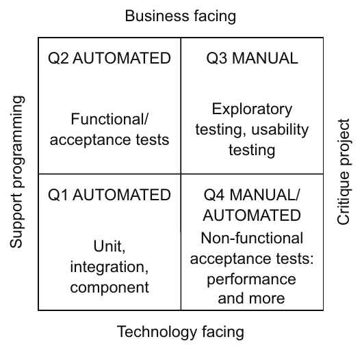

> **English:** Figure 9.4 The test quadrant categorizes tests along two dimensions. The first dimension is whether a test is business facing or technology facing. The second is whether the purpose of the test is to support programming or critique the application.
>
> **Türkçe:** Şekil 9.4 Test quadrant, testleri iki boyutta sınıflandırır. İlk boyut testin iş odaklı mı teknoloji odaklı mı olduğudur. İkincisi ise amacının programlamayı desteklemek mi uygulamayı eleştirel biçimde değerlendirmek mi olduğudur.

<!-- source-record: u09_0058 -->

> **English:** The test quadrant defines four different categories of tests:
>
> **Türkçe:** Test quadrant dört farklı test kategorisi tanımlar:

<!-- source-record: u09_0059 -->

> **English:** • Q1—Support programming/technology facing: unit and integration tests
>
> **Türkçe:** • Q1—Programlamayı destekleyen/teknoloji odaklı: unit ve integration testler

<!-- source-record: u09_0060 -->

> **English:** • Q2—Support programming/business facing: component and end-to-end test
>
> **Türkçe:** • Q2—Programlamayı destekleyen/iş odaklı: component ve end-to-end testler

<!-- source-record: u09_0061 -->

> **English:** • Q3—Critique application/business facing: usability and exploratory testing
>
> **Türkçe:** • Q3—Uygulamayı değerlendiren/iş odaklı: kullanılabilirlik ve keşif testleri

<!-- source-record: u09_0062 -->

> **English:** • Q4—Critique application/technology facing: nonfunctional acceptance tests such as performance tests
>
> **Türkçe:** • Q4—Uygulamayı değerlendiren/teknoloji odaklı: performans testleri gibi işlevsel olmayan kabul testleri

<!-- source-record: u09_0063 -->

> **English:** The test quadrant isn’t the only way of organizing tests. There’s also the test pyramid, which provides guidance on how many tests of each type to write.
>
> **Türkçe:** Test quadrant, testleri düzenlemenin tek yolu değildir. Her türden kaç test yazılacağı konusunda yol gösteren test piramidi de vardır.

<!-- source-record: u09_0064 -->

#### USING THE TEST PYRAMID AS A GUIDE TO FOCUSING YOUR TESTING EFFORTS — TEST ÇALIŞMALARINIZI ODAKLAMAK İÇİN TEST PİRAMİDİNİ REHBER OLARAK KULLANMA

<!-- source-record: u09_0065 -->

> **English:** We must write different kinds of tests in order to be confident that our application works. The challenge, though, is that the execution time and complexity of a test increase with its scope. Also, the larger the scope of a test and the more moving parts it has, the less reliable it becomes. Unreliable tests are almost as bad as no tests, because if you can’t trust a test, you’re likely to ignore failures.
>
> **Türkçe:** Uygulamamızın çalıştığından emin olmak için farklı türlerde testler yazmalıyız. Ancak güçlük şudur: Bir testin kapsamı genişledikçe yürütme süresi ve karmaşıklığı artar. Ayrıca kapsamı büyüdükçe ve birbirine bağlı çalışan parçaları çoğaldıkça güvenilirliği azalır. Güvenilmez testler, neredeyse hiç test olmaması kadar kötüdür; çünkü bir teste güvenemiyorsanız başarısızlıklarını görmezden gelme olasılığınız artar.

<!-- source-record: u09_0066 -->

> **English:** On one end of the spectrum are unit tests for individual classes. They’re fast to execute, easy to write, and reliable. At the other end of the spectrum are end-to-end tests for the entire application. These tend to be slow, difficult to write, and often unreliable because of their complexity. Because we don’t have unlimited budget for development and testing, we want to focus on writing tests that have small scope without compromising the effectiveness of the test suite.
>
> **Türkçe:** Yelpazenin bir ucunda tek tek sınıflara yönelik unit testler vardır. Bunlar hızlı çalışır, kolay yazılır ve güvenilirdir. Diğer uçta ise uygulamanın tamamına yönelik end-to-end testler bulunur. Bunlar genellikle yavaş ve yazılması güçtür; karmaşıklıkları nedeniyle çoğu zaman güvenilmezdir. Geliştirme ve test için sınırsız bütçemiz olmadığından, test paketinin etkililiğinden ödün vermeden dar kapsamlı testler yazmaya odaklanmak isteriz.

<!-- source-record: u09_0067 -->

> **English:** The test pyramid, shown in figure 9.5, is a good guide (https://martinfowler.com/bliki/TestPyramid.html). At the base of the pyramid are the fast, simple, and reliable unit tests. At the top of the pyramid are the slow, complex, and brittle end-to-end tests. Like the USDA food pyramid, although more useful and less controversial (https://en.wikipedia.org/wiki/History_of_USDA_nutrition_guides), the test pyramid describes the relative proportions of each type of test.
>
> **Türkçe:** Şekil 9.5'te gösterilen test piramidi iyi bir rehberdir (https://martinfowler.com/bliki/TestPyramid.html). Piramidin tabanında hızlı, basit ve güvenilir unit testler bulunur. Tepesinde ise yavaş, karmaşık ve kırılgan end-to-end testler vardır. Test piramidi, USDA besin piramidine benzer şekilde her test türünün göreli oranlarını açıklar; ancak ondan daha yararlı ve daha az tartışmalıdır (https://en.wikipedia.org/wiki/History_of_USDA_nutrition_guides).

<!-- source-record: u09_0068 -->

> **English:** The key idea of the test pyramid is that as we move up the pyramid we should write fewer and fewer tests. We should write lots of unit tests and very few end-to-end tests.
>
> **Türkçe:** Test piramidinin temel fikri, piramitte yukarı çıktıkça giderek daha az test yazmamız gerektiğidir. Çok sayıda unit test ve çok az end-to-end test yazmalıyız.

<!-- source-pages: 299 -->

<!-- source-record: u09_0069 -->

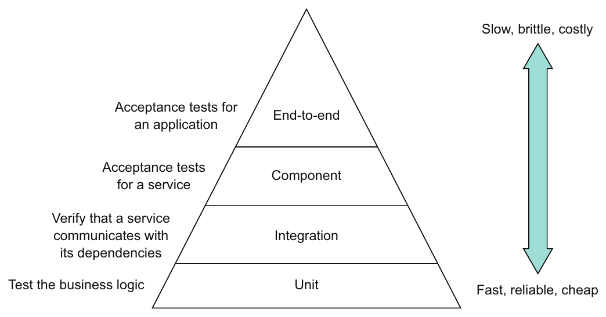

> **English:** Figure 9.5 The test pyramid describes the relative proportions of each type of test that you need to write. As you move up the pyramid, you should write fewer and fewer tests.
>
> **Türkçe:** Şekil 9.5 Test piramidi, yazmanız gereken her test türünün göreli oranını açıklar. Piramitte yukarı çıktıkça giderek daha az test yazmalısınız.

<!-- source-record: u09_0070 -->

> **English:** As you’ll see in this chapter, I describe a strategy that emphasizes testing the pieces of a service. It even minimizes the number of component tests, which test an entire service.
>
> **Türkçe:** Bu bölümde göreceğiniz gibi, bir servisin parçalarını test etmeyi vurgulayan bir strateji anlatıyorum. Bu strateji, tüm bir servisi test eden component testlerin sayısını bile en aza indirir.

<!-- source-record: u09_0071 -->

> **English:** It’s clear how to test individual microservices such as Consumer Service, which don’t depend on any other services. But what about services such as Order Service, that do depend on numerous other services? And how can we be confident that the application as a whole works? This is the key challenge of testing applications that have a microservice architecture. The complexity of testing has moved from the individual services to the interactions between them. Let’s look at how to tackle this problem.
>
> **Türkçe:** Başka servislere bağımlı olmayan Consumer Service gibi microservice'lerin tek tek nasıl test edileceği açıktır. Peki çok sayıda başka servise bağımlı olan Order Service gibi servisler ne olacak? Uygulamanın bütün olarak çalıştığından nasıl emin olabiliriz? Microservice mimarisine sahip uygulamaları test etmenin temel güçlüğü budur. Testin karmaşıklığı tek tek servislerden, aralarındaki etkileşimlere taşınmıştır. Bu sorunun nasıl ele alınacağına bakalım.

<!-- source-record: u09_0072 -->

### 9.1.2 The challenge of testing microservices — Microservice testlerinin güçlüğü

<!-- source-record: u09_0073 -->

> **English:** Interprocess communication plays a much more important role in a microservices-based application than in a monolithic application. A monolithic application might communicate with a few external clients and services. For example, the monolithic version of the FTGO application uses a few third-party web services, such as Stripe for payments, Twilio for messaging, and Amazon SES for email, which have stable APIs. Any interaction between the modules of the application is through programming language-based APIs. Interprocess communication is very much on the edge of the application.
>
> **Türkçe:** Süreçler arası iletişim, microservice tabanlı bir uygulamada monolitik uygulamaya göre çok daha önemli bir rol oynar. Monolitik bir uygulama birkaç dış istemci ve servisle iletişim kurabilir. Örneğin FTGO uygulamasının monolitik sürümü ödeme için Stripe, mesajlaşma için Twilio ve e-posta için Amazon SES gibi kararlı API'leri olan birkaç üçüncü taraf web servisi kullanır. Uygulama modülleri arasındaki tüm etkileşimler programlama diline dayalı API'ler üzerinden gerçekleşir. Süreçler arası iletişim, büyük ölçüde uygulamanın sınırlarında yer alır.

<!-- source-record: u09_0074 -->

> **English:** In contrast, interprocess communication is central to microservice architecture. A microservices-based application is a distributed system. Teams are constantly developing their services and evolving their APIs. It’s essential that developers of a service write tests that verify that their service interacts with its dependencies and clients.
>
> **Türkçe:** Buna karşılık süreçler arası iletişim, microservice mimarisinin merkezindedir. Microservice tabanlı bir uygulama dağıtık bir sistemdir. Ekipler servislerini sürekli geliştirir ve API'lerini değiştirir. Servis geliştiricilerinin, servislerinin bağımlılıkları ve istemcileriyle etkileşimini doğrulayan testler yazması şarttır.

<!-- source-record: u09_0075 -->

> **English:** As described in chapter 3, services communicate with each other using a variety of interaction styles and IPC mechanisms. Some services use request/response-style interaction that’s implemented using a synchronous protocol, such as REST or gRPC. Other services interact through request/asynchronous reply or publish/subscribe using asynchronous messaging. For instance, figure 9.6 shows how some of the services in the FTGO application communicate. Each arrow points from a consumer service to a producer service.
>
> **Türkçe:** Bölüm 3'te anlatıldığı gibi servisler çeşitli etkileşim biçimleri ve IPC mekanizmaları kullanarak haberleşir. Bazıları REST veya gRPC gibi senkron bir protokolle uygulanan request/response tarzı etkileşim kullanır. Diğerleri asenkron mesajlaşma üzerinden request/asynchronous reply veya publish/subscribe yoluyla etkileşir. Örneğin Şekil 9.6, FTGO uygulamasındaki bazı servislerin nasıl iletişim kurduğunu gösterir. Her ok tüketici servisten üretici servise yönelir.

<!-- source-pages: 300 -->

<!-- source-record: u09_0076 -->

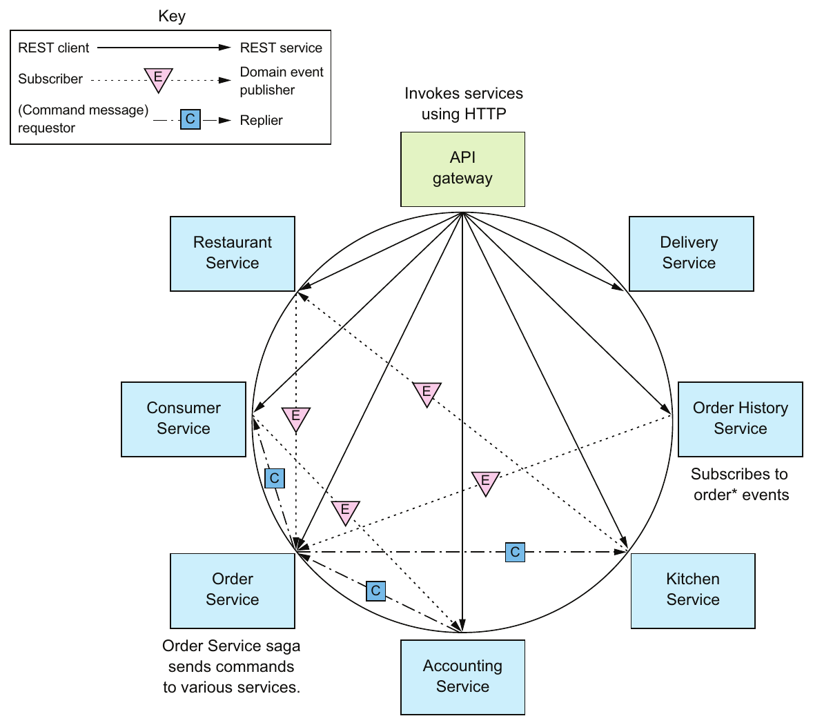

> **English:** Figure 9.6 Some of the interservice communication in the FTGO application. Each arrow points from a consumer service to a producer service.
>
> **Türkçe:** Şekil 9.6 FTGO uygulamasındaki servisler arası iletişimin bir bölümü. Her ok tüketici servisten üretici servise yönelir.

<!-- source-record: u09_0077 -->

> **English:** The arrow points in the direction of the dependency, from the consumer of the API to the provider of the API. The assumptions that a consumer makes about an API depend on the nature of the interaction:
>
> **Türkçe:** Ok, bağımlılık yönünde, API'yi tüketen taraftan API'yi sağlayan tarafa doğru ilerler. Tüketicinin API hakkında yaptığı varsayımlar, etkileşimin niteliğine bağlıdır:

<!-- source-record: u09_0078 -->

> **English:** • REST client → service—The API gateway routes requests to services and implements API composition.
>
> **Türkçe:** • REST istemcisi → servis—API gateway, istekleri servislere yönlendirir ve API composition uygular.

<!-- source-record: u09_0079 -->

> **English:** • Domain event consumer → publisher—Order History Service consumes events published by Order Service.
>
> **Türkçe:** • Domain event tüketicisi → yayıncı—Order History Service, Order Service'in yayımladığı olayları tüketir.

<!-- source-record: u09_0080 -->

> **English:** • Command message requestor → replier—Order Service sends command messages to various services and consumes the replies. Each interaction between a pair of services represents an agreement or contract between the two services. Order History Service and Order Service must, for example, agree on the event message structure and the channel that they’re published to. Similarly, the API gateway and the services must agree on the REST API endpoints. And Order Service and each service that it invokes using asynchronous request/ response must agree on the command channel and the format of the command and reply messages.
>
> **Türkçe:** • Komut mesajını isteyen taraf → yanıtlayan taraf—Order Service, çeşitli servislere komut mesajları gönderir ve yanıtları tüketir. İki servis arasındaki her etkileşim, bu servisler arasında bir anlaşma veya sözleşmeyi temsil eder. Örneğin Order History Service ve Order Service, olay mesajının yapısı ve olayların yayımlanacağı kanal üzerinde anlaşmalıdır. Benzer biçimde API gateway ile servisler REST API endpoint'leri üzerinde anlaşmalıdır. Order Service ile asenkron request/response kullanarak çağırdığı her servis de komut kanalı ve komut/yanıt mesajlarının biçimi üzerinde anlaşmalıdır.

<!-- source-pages: 301 -->

<!-- source-record: u09_0081 -->

> **English:** As a developer of a service, you need to be confident that the services you consume have stable APIs. Similarly, you don’t want to unintentionally make breaking changes to your service’s API. For example, if you’re working on OrderService, you want to be sure that the developers of your service’s dependencies, such as Consumer Service and Kitchen Service, don’t change their APIs in ways that are incompatible with your service. Similarly, you must ensure that you don’t change the Order Service’s API in a way that breaks the API Gateway or Order History Service.
>
> **Türkçe:** Bir servisin geliştiricisi olarak kullandığınız servislerin kararlı API'lere sahip olduğundan emin olmanız gerekir. Benzer şekilde, kendi servisinizin API'sinde istemeden uyumluluğu bozan değişiklikler yapmak istemezsiniz. Örneğin OrderService üzerinde çalışıyorsanız Consumer Service ve Kitchen Service gibi bağımlılıkların geliştiricilerinin API'lerini servisinizle uyumsuz biçimde değiştirmediğinden emin olmak istersiniz. Aynı şekilde Order Service API'sini, API Gateway veya Order History Service'i bozacak biçimde değiştirmediğinizi de güvenceye almalısınız.

<!-- source-record: u09_0082 -->

> **English:** One way to verify that two services can interact is to run both services, invoke an API that triggers the communication, and verify that it has the expected outcome. This will certainly catch integration problems, but it’s basically an end-to-end. The test likely would need to run numerous other transitive dependencies of those services. A test might also need to invoke complex, high-level functionality such as business logic, even if its goal is to test relatively low-level IPC. It’s best to avoid writing end-to-end tests like these. Somehow, we need to write faster, simpler, and more reliable tests that ideally test services in isolation. The solution is to use what’s known as consumer-driven contract testing.
>
> **Türkçe:** İki servisin etkileşim kurabildiğini doğrulamanın bir yolu, ikisini çalıştırmak, iletişimi tetikleyen bir API'yi çağırmak ve beklenen sonucun alındığını doğrulamaktır. Bu yöntem entegrasyon sorunlarını elbette yakalar; ancak temelde bir end-to-end testtir. Testin, bu servislerin çok sayıda dolaylı bağımlılığını da çalıştırması gerekebilir. Amaç görece düşük seviyeli IPC'yi sınamak olsa bile iş mantığı gibi karmaşık, üst seviye işlevleri çağırması gerekebilir. Bu tür end-to-end testler yazmaktan kaçınmak en iyisidir. Bir şekilde daha hızlı, basit ve güvenilir, ideal olarak servisleri yalıtılmış biçimde test eden testler yazmamız gerekir. Çözüm, consumer-driven contract testing adı verilen yöntemi kullanmaktır.

<!-- source-record: u09_0083 -->

#### CONSUMER-DRIVEN CONTRACT TESTING — CONSUMER-DRIVEN CONTRACT TESTING (TÜKETİCİ GÜDÜMLÜ SÖZLEŞME TESTİ)

<!-- source-record: u09_0084 -->

> **English:** Imagine that you’re a member of the team developing API Gateway, described in chapter 8. The API Gateway’s OrderServiceProxy invokes various REST endpoints, including the GET /orders/{orderId} endpoint. It’s essential that we write tests that verify that API Gateway and Order Service agree on an API. In the terminology of consumer contract testing, the two services participate in a consumer-provider relationship. API Gateway is a consumer, and Order Service is a provider. A consumer contract test is an integration test for a provider, such as Order Service, that verifies that its API matches the expectations of a consumer, such as API Gateway.
>
> **Türkçe:** Bölüm 8'de anlatılan API Gateway'i geliştiren ekibin üyesi olduğunuzu düşünün. API Gateway'in OrderServiceProxy bileşeni, GET /orders/{orderId} dahil çeşitli REST endpoint'lerini çağırır. API Gateway ile Order Service'in API üzerinde anlaştığını doğrulayan testler yazmamız şarttır. Consumer contract testing terminolojisinde iki servis tüketici–sağlayıcı ilişkisindedir. API Gateway tüketici, Order Service sağlayıcıdır. Consumer contract test, Order Service gibi bir sağlayıcının API'sinin, API Gateway gibi bir tüketicinin beklentileriyle eşleştiğini doğrulayan integration testtir.

<!-- source-record: u09_0085 -->

> **English:** A consumer contract test focuses on verifying that the “shape” of a provider’s API meets the consumer’s expectations. For a REST endpoint, a contract test verifies that the provider implements an endpoint that
>
> **Türkçe:** Consumer contract test, sağlayıcının API'sinin “biçiminin” tüketicinin beklentilerini karşıladığını doğrulamaya odaklanır. Bir REST endpoint için contract test, sağlayıcının şu özelliklere sahip bir endpoint uyguladığını doğrular:

<!-- source-record: u09_0086 -->

> **English:** • Has the expected HTTP method and path
>
> **Türkçe:** • Beklenen HTTP metoduna ve yoluna sahiptir.

<!-- source-record: u09_0087 -->

> **English:** • Accepts the expected headers, if any
>
> **Türkçe:** • Varsa beklenen header'ları kabul eder.

<!-- source-record: u09_0088 -->

> **English:** • Accepts a request body, if any
>
> **Türkçe:** • Varsa bir request body kabul eder.

<!-- source-record: u09_0089 -->

> **English:** • Returns a response with the expected status code, headers, and body
>
> **Türkçe:** • Beklenen durum kodu, header'lar ve gövdeyi içeren bir yanıt döndürür.

<!-- source-record: u09_0090 -->

> **English:** It’s important to remember that contract tests don’t thoroughly test the provider’s business logic. That’s the job of unit tests. Later on, you’ll see that consumer contract tests for a REST API are in fact mock controller tests.
>
> **Türkçe:** Contract testlerin sağlayıcının iş mantığını kapsamlı biçimde test etmediğini unutmamak önemlidir. Bu, unit testlerin görevidir. İleride REST API için consumer contract testlerin aslında mock controller testleri olduğunu göreceksiniz.

<!-- source-pages: 302 -->

<!-- source-record: u09_0091 -->

> **English:** The team that develops the consumer writes a contract test suite and adds it (for example, via a pull request) to the provider’s test suite. The developers of other services that invoke Order Service also contribute a test suite, as shown in figure 9.7. Each test suite will test those aspects of Order Service’s API that are relevant to each consumer. The test suite for Order History Service, for example, verifies that Order Service publishes the expected events.
>
> **Türkçe:** Tüketiciyi geliştiren ekip bir contract test suite yazar ve bunu, örneğin bir pull request aracılığıyla, sağlayıcının test paketine ekler. Şekil 9.7'de gösterildiği gibi Order Service'i çağıran diğer servislerin geliştiricileri de bir test paketi sağlar. Her paket, Order Service API'sinin ilgili tüketici açısından önemli yönlerini test eder. Örneğin Order History Service için yazılan test paketi, Order Service'in beklenen olayları yayımladığını doğrular.

<!-- source-record: u09_0092 -->

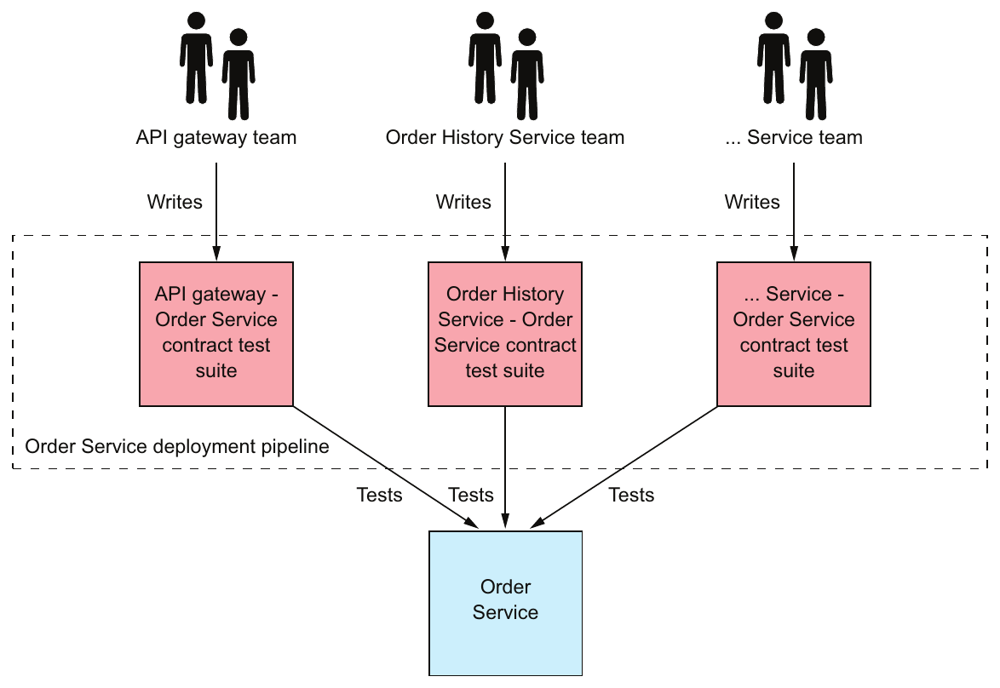

> **English:** Figure 9.7 Each team that develops a service that consumes Order Service’s API contributes a contract test suite. The test suite verifies that the API matches the consumer’s expectations. This test suite, along with those contributed by other teams, is run by Order Service’s deployment pipeline.
>
> **Türkçe:** Şekil 9.7 Order Service API'sini tüketen bir servis geliştiren her ekip bir contract test suite sağlar. Bu paket, API'nin tüketicinin beklentilerine uyduğunu doğrular. Diğer ekiplerin sağladıklarıyla birlikte bu test paketi, Order Service'in deployment pipeline'ı tarafından çalıştırılır.

<!-- source-record: u09_0093 -->

> **English:** These test suites are executed by the deployment pipeline for Order Service. If a consumer contract test fails, that failure tells the producer team that they’ve made a breaking change to the API. They must either fix the API or talk to the consumer team.
>
> **Türkçe:** Bu test paketleri Order Service'in deployment pipeline'ında çalıştırılır. Bir consumer contract test başarısız olursa bu sonuç, üretici ekibe API'de uyumluluğu bozan bir değişiklik yaptığını bildirir. Ekip ya API'yi düzeltmeli ya da tüketici ekiple görüşmelidir.

<!-- source-record: u09_0094 -->

### Pattern: Consumer-driven contract test — Örüntü: Consumer-driven contract test

<!-- source-record: u09_0095 -->

> **English:** Verify that a service meets the expectations of its clients See http://microservices.io/patterns/testing/service-integration-contract-test.html.
>
> **Türkçe:** Bir servisin istemcilerinin beklentilerini karşıladığını doğrulayın. Bkz. http://microservices.io/patterns/testing/service-integration-contract-test.html.

<!-- source-record: u09_0096 -->

> **English:** Consumer-driven contract tests typically use testing by example. The interaction between a consumer and provider is defined by a set of examples, known as contracts. Each contract consists of example messages that are exchanged during one interaction. For instance, a contract for a REST API consists of an example HTTP request and response. On the surface, it may seem better to define the interaction using schemas written using, for example, OpenAPI or JSON schema. But it turns out schemas aren’t that useful when writing tests. A test can validate the response using the schema but it still needs to invoke the provider with an example request.
>
> **Türkçe:** Consumer-driven contract testler genellikle örneklerle test yaklaşımını kullanır. Tüketici ile sağlayıcı arasındaki etkileşim, contract adı verilen örnekler kümesiyle tanımlanır. Her contract, tek bir etkileşim sırasında alışverişi yapılan örnek mesajlardan oluşur. Örneğin REST API sözleşmesi, örnek bir HTTP isteği ve yanıtından oluşur. İlk bakışta etkileşimi OpenAPI veya JSON schema gibi araçlarla yazılmış şemalarla tanımlamak daha iyi görünebilir. Ancak şemaların test yazarken o kadar da yararlı olmadığı anlaşılır. Bir test yanıtı şema kullanarak doğrulayabilir, fakat sağlayıcıyı yine de örnek bir istekle çağırması gerekir.

<!-- source-pages: 303 -->

<!-- source-record: u09_0097 -->

> **English:** What’s more, consumer tests also need example responses. That’s because even though the focus of consumer-driven contract testing is to test a provider, contracts are also used to verify that the consumer conforms to the contract. For instance, a consumer-side contract test for a REST client uses the contract to configure an HTTP stub service that verifies that the HTTP request matches the contract’s request and sends back the contract’s HTTP response. Testing both sides of interaction ensures that the consumer and provider agree on the API. Later on we’ll look at examples of how to write this kind of testing, but first let’s see how to write consumer contract tests using Spring Cloud Contract.
>
> **Türkçe:** Üstelik tüketici testleri için örnek yanıtlar da gerekir. Çünkü consumer-driven contract testing'in odağı sağlayıcıyı test etmek olsa da sözleşmeler, tüketicinin sözleşmeye uyduğunu doğrulamak için de kullanılır. Örneğin REST istemcisinin tüketici tarafındaki contract testi, HTTP isteğinin sözleşmedeki istekle eşleştiğini doğrulayan ve sözleşmedeki HTTP yanıtını döndüren bir HTTP stub servisini yapılandırmak için sözleşmeyi kullanır. Etkileşimin iki tarafını da test etmek, tüketici ile sağlayıcının API üzerinde anlaşmasını güvenceye alır. İleride bu tür testlerin yazım örneklerini inceleyeceğiz; önce Spring Cloud Contract ile consumer contract testlerin nasıl yazıldığına bakalım.

<!-- source-record: u09_0098 -->

### Pattern: Consumer-side contract test — Örüntü: Consumer-side contract test

<!-- source-record: u09_0099 -->

> **English:** Verify that the client of a service can communicate with the service. See https://microservices.io/patterns/testing/consumer-side-contract-test.html.
>
> **Türkçe:** Bir servisin istemcisinin servisle iletişim kurabildiğini doğrulayın. Bkz. https://microservices.io/patterns/testing/consumer-side-contract-test.html.

<!-- source-record: u09_0100 -->

#### TESTING SERVICES USING SPRING CLOUD CONTRACT — SPRING CLOUD CONTRACT KULLANARAK SERVİSLERİ TEST ETME

<!-- source-record: u09_0101 -->

> **English:** Two popular contract testing frameworks are Spring Cloud Contract (https://cloud.spring.io/spring-cloud-contract/), which is a consumer contract testing framework for Spring applications, and the Pact family of frameworks (https://github.com/pactfoundation), which support a variety of languages. The FTGO application is a Spring framework-based application, so in this chapter I’m going to describe how to use Spring Cloud Contract. It provides a Groovy domain-specific language (DSL) for writing contracts. Each contract is a concrete example of an interaction between a consumer and a provider, such as an HTTP request and response. Spring Cloud Contract code generates contract tests for the provider. It also configures mocks, such as a mock HTTP server, for consumer integration tests.
>
> **Türkçe:** İki popüler contract testing framework'ü, Spring uygulamalarına yönelik Spring Cloud Contract (https://cloud.spring.io/spring-cloud-contract/) ve çeşitli dilleri destekleyen Pact framework ailesidir (https://github.com/pactfoundation). FTGO uygulaması Spring tabanlı olduğundan bu bölümde Spring Cloud Contract'ın kullanımını anlatacağım. Sözleşmeleri yazmak için Groovy tabanlı bir domain-specific language (DSL; alana özgü dil) sunar. Her sözleşme, HTTP isteği ve yanıtı gibi tüketici ile sağlayıcı arasındaki etkileşimin somut bir örneğidir. Spring Cloud Contract, sağlayıcı için contract test kodu üretir. Tüketici integration testleri için mock HTTP sunucusu gibi mock'ları da yapılandırır.

<!-- source-record: u09_0102 -->

> **English:** Say, for example, you’re working on API Gateway and want to write a consumer contract test for Order Service. Figure 9.8 shows the process, which requires you to collaborate with Order Service teams. You write contracts that define how API Gateway interacts with Order Service. The Order Service team uses these contracts to test Order Service, and you use them to test API Gateway. The sequence of steps is as follows:
>
> **Türkçe:** Örneğin API Gateway üzerinde çalıştığınızı ve Order Service için bir consumer contract test yazmak istediğinizi düşünün. Şekil 9.8, Order Service ekipleriyle işbirliği yapmanızı gerektiren süreci gösterir. API Gateway'in Order Service ile nasıl etkileştiğini tanımlayan sözleşmeler yazarsınız. Order Service ekibi bunları Order Service'i test etmek, siz de API Gateway'i test etmek için kullanırsınız. Adımların sırası şöyledir:

<!-- source-record: u09_0103 -->

> **English:** 1 You write one or more contracts, such as the one shown in listing 9.1. Each contract consists of an HTTP request that API Gateway might send to Order Service and an expected HTTP response. You give the contracts, perhaps via a Git pull request, to the Order Service team.
>
> **Türkçe:** 1 Kod Listesi 9.1'deki gibi bir veya daha fazla sözleşme yazarsınız. Her sözleşme, API Gateway'in Order Service'e gönderebileceği bir HTTP isteği ve beklenen HTTP yanıtından oluşur. Sözleşmeleri, örneğin Git pull request yoluyla, Order Service ekibine verirsiniz.

<!-- source-record: u09_0104 -->

> **English:** 2 The Order Service team tests Order Service using consumer contract tests, which Spring Cloud Contract code generates from contracts.
>
> **Türkçe:** 2 Order Service ekibi, Spring Cloud Contract'ın sözleşmelerden ürettiği consumer contract testlerle Order Service'i test eder.

<!-- source-pages: 304 -->

<!-- source-record: u09_0105 -->

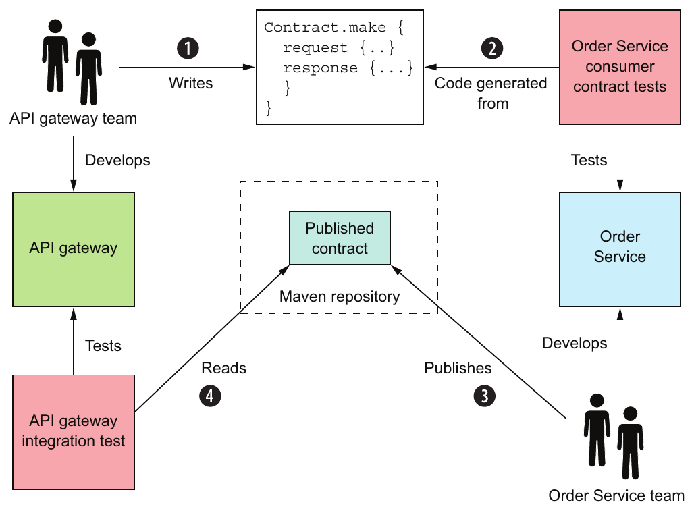

> **English:** Figure 9.8 The API Gateway team writes the contracts. The Order Service team uses those contracts to test Order Service and publishes them to a repository. The API Gateway team uses the published contracts to test API Gateway.
>
> **Türkçe:** Şekil 9.8 API Gateway ekibi sözleşmeleri yazar. Order Service ekibi bu sözleşmeleri Order Service'i test etmek için kullanır ve bir depoya yayımlar. API Gateway ekibi, yayımlanan sözleşmeleri API Gateway'i test etmek için kullanır.

<!-- source-record: u09_0106 -->

> **English:** 3 The Order Service team publishes the contracts that tested Order Service to a Maven repository.
>
> **Türkçe:** 3 Order Service ekibi, Order Service'i test eden sözleşmeleri bir Maven deposuna yayımlar.

<!-- source-record: u09_0107 -->

> **English:** 4 You use the published contracts to write tests for API Gateway.
>
> **Türkçe:** 4 Yayımlanan sözleşmeleri kullanarak API Gateway için testler yazarsınız.

<!-- source-record: u09_0108 -->

> **English:** Because you test API Gateway using the published contracts, you can be confident that it works with the deployed Order Service.
>
> **Türkçe:** API Gateway'i yayımlanmış sözleşmelerle test ettiğiniz için dağıtıma alınmış Order Service ile çalıştığından emin olabilirsiniz.

<!-- source-record: u09_0109 -->

> **English:** The contracts are the key part of this testing strategy. The following listing shows an example Spring Cloud Contract. It consists of an HTTP request and an HTTP response.
>
> **Türkçe:** Sözleşmeler, bu test stratejisinin temel parçasıdır. Aşağıdaki kod listesi örnek bir Spring Cloud Contract sözleşmesi gösterir. Bir HTTP isteği ve bir HTTP yanıtından oluşur.

<!-- source-record: u09_0110 -->

#### Listing 9.1 A contract that describes how API Gateway invokes Order Service — Kod Listesi 9.1 API Gateway'in Order Service'i nasıl çağırdığını açıklayan bir sözleşme

<!-- source-record: u09_0111 -->

```groovy
org.springframework.cloud.contract.spec.Contract.make {
    request {
        method 'GET'
        url '/orders/1223232'
    }
    response {
        status 200
        headers {
            header('Content-Type': 'application/json;charset=UTF-8')
        }
        body("{ ... }")
    }
}
```

<!-- source-record: u09_0112 -->

**Kod açıklaması:**

> **English:** The HTTP request’s method and path
>
> **Türkçe:** HTTP isteğinin metodu ve yolu

<!-- source-record: u09_0113 -->

**Kod açıklaması:**

> **English:** The HTTP response’s status code, headers, and body
>
> **Türkçe:** HTTP yanıtının durum kodu, header'ları ve gövdesi

<!-- source-pages: 305 -->

<!-- source-record: u09_0114 -->

> **English:** The request element is an HTTP request for the REST endpoint GET /orders/{orderId}. The response element is an HTTP response that describes an Order expected by API Gateway. The Groovy contracts are part of the provider’s code base. Each consumer team writes contracts that describe how their service interacts with the provider and gives them, perhaps via a Git pull request, to the provider team. The provider team is responsible for packaging the contracts as a JAR and publishing them to a Maven repository. The consumer-side tests download the JAR from the repository.
>
> **Türkçe:** request öğesi, GET /orders/{orderId} REST endpoint'ine yönelik bir HTTP isteğidir. response öğesi, API Gateway'in beklediği bir Order'ı açıklayan HTTP yanıtıdır. Groovy sözleşmeleri sağlayıcının kod tabanının parçasıdır. Her tüketici ekip, servisinin sağlayıcıyla nasıl etkileştiğini açıklayan sözleşmeler yazar ve bunları, örneğin Git pull request aracılığıyla, sağlayıcı ekibe verir. Sağlayıcı ekip sözleşmeleri JAR olarak paketleyip Maven deposuna yayımlamaktan sorumludur. Tüketici tarafındaki testler JAR'ı depodan indirir.

<!-- source-record: u09_0115 -->

> **English:** Each contract’s request and response play dual roles of test data and the specification of expected behavior. In a consumer-side test, the contract is used to configure a stub, which is similar to a Mockito mock object and simulates the behavior of Order Service. It enables API Gateway to be tested without running Order Service. In the provider-side test, the generated test class invokes the provider with the contract’s request and verifies that it returns a response that matches the contract’s response. The next chapter discusses the details of how to use Spring Cloud Contract, but now we’re going to look at how to use consumer contract testing for messaging APIs.
>
> **Türkçe:** Her sözleşmenin isteği ve yanıtı hem test verisi hem de beklenen davranışın tanımı olarak iki rol üstlenir. Tüketici tarafındaki testte sözleşme, Mockito mock nesnesine benzeyen ve Order Service'in davranışını taklit eden bir stub'ı yapılandırmak için kullanılır. Bu, Order Service'i çalıştırmadan API Gateway'in test edilmesini sağlar. Sağlayıcı tarafındaki testte ise üretilen test sınıfı, sağlayıcıyı sözleşmedeki istekle çağırır ve sözleşmenin yanıtıyla eşleşen bir yanıt döndürdüğünü doğrular. Sonraki bölüm Spring Cloud Contract kullanımının ayrıntılarını tartışır; şimdi messaging API'leri için consumer contract testing kullanımına bakacağız.

<!-- source-record: u09_0116 -->

#### CONSUMER CONTRACT TESTS FOR MESSAGING APIS — MESSAGING API'LERİ İÇİN CONSUMER CONTRACT TESTLER

<!-- source-record: u09_0117 -->

> **English:** A REST client isn’t the only kind of consumer that has expectations of a provider’s API. Services that subscribe to domain events and use asynchronous request/response-based communication are also consumers. They consume some other service’s messaging API, and make assumptions about the nature of that API. We must also write consumer contract tests for these services.
>
> **Türkçe:** REST istemcisi, sağlayıcının API'sinden beklentileri olan tek tüketici türü değildir. Domain event'lere abone olan ve asenkron request/response tabanlı iletişim kullanan servisler de tüketicidir. Başka bir servisin messaging API'sini tüketir ve bu API'nin niteliği hakkında varsayımlar yaparlar. Bu servisler için de consumer contract testler yazmalıyız.

<!-- source-record: u09_0118 -->

> **English:** Spring Cloud Contract also provides support for testing messaging-based interactions. The structure of a contract and how it’s used by the tests depend on the type of interaction. A contract for domain event publishing consists of an example domain event. A provider test causes the provider to emit an event and verifies that it matches the contract’s event. A consumer test verifies that the consumer can handle that event. In the next chapter, I describe an example test.
>
> **Türkçe:** Spring Cloud Contract, mesajlaşma tabanlı etkileşimlerin testini de destekler. Sözleşmenin yapısı ve testlerde nasıl kullanıldığı, etkileşimin türüne bağlıdır. Domain event yayınına yönelik sözleşme, örnek bir domain event'ten oluşur. Sağlayıcı testi, sağlayıcının bir olay üretmesini tetikler ve olayın sözleşmedeki olayla eşleştiğini doğrular. Tüketici testi ise tüketicinin bu olayı işleyebildiğini doğrular. Sonraki bölümde örnek bir test anlatıyorum.

<!-- source-record: u09_0119 -->

> **English:** A contract for an asynchronous request/response interaction is similar to an HTTP contract. It consists of a request message and a response message. A provider test invokes the API with the contract’s request message and verifies that the response matches the contract’s response. A consumer test uses the contract to configure a stub subscriber, which listens for the contract’s request message and replies with the specified response. The next chapter discusses an example test. But first we’ll take a look at the deployment pipeline, which runs these and other tests.
>
> **Türkçe:** Asenkron request/response etkileşimine yönelik sözleşme HTTP sözleşmesine benzer. Bir istek mesajı ve bir yanıt mesajından oluşur. Sağlayıcı testi, API'yi sözleşmedeki istek mesajıyla çağırır ve yanıtın sözleşmedeki yanıtla eşleştiğini doğrular. Tüketici testi ise sözleşmedeki istek mesajını dinleyen ve belirtilen yanıtı döndüren bir stub aboneyi yapılandırmak için sözleşmeyi kullanır. Sonraki bölüm örnek bir testi tartışır. Ancak önce bunları ve diğer testleri çalıştıran deployment pipeline'a göz atacağız.

<!-- source-record: u09_0120 -->

### 9.1.3 The deployment pipeline — Deployment pipeline

<!-- source-record: u09_0121 -->

> **English:** Every service has a deployment pipeline. Jez Humble’s book, Continuous Delivery (Addison-Wesley, 2010) describes a deployment pipeline as the automated process of getting code from the developer’s desktop into production. As figure 9.9 shows, it consists of a series of stages that execute test suites, followed by a stage that releases or deploys the service. Ideally, it’s fully automated, but it might contain manual steps. A deployment pipeline is often implemented using a Continuous Integration (CI) server, such as Jenkins.
>
> **Türkçe:** Her servisin bir deployment pipeline'ı (dağıtım hattı) vardır. Jez Humble'ın Continuous Delivery (Addison-Wesley, 2010) kitabı, deployment pipeline'ı kodun geliştiricinin masaüstünden production ortamına taşındığı otomatik süreç olarak tanımlar. Şekil 9.9'da gösterildiği gibi test paketlerini çalıştıran aşamalar dizisinden ve ardından servisi yayımlayan ya da dağıtan bir aşamadan oluşur. İdeal olarak tamamen otomatiktir; ancak elle yürütülen adımlar içerebilir. Deployment pipeline genellikle Jenkins gibi bir Continuous Integration (CI; sürekli entegrasyon) sunucusuyla uygulanır.

<!-- source-pages: 306 -->

<!-- source-record: u09_0122 -->

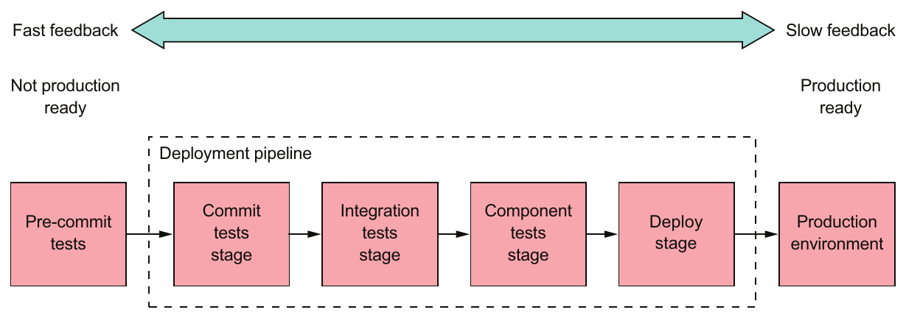

> **English:** Figure 9.9 An example deployment pipeline for Order Service. It consists of a series of stages. The pre-commit tests are run by the developer prior to committing their code. The remaining stages are executed by an automated tool, such as the Jenkins CI server.
>
> **Türkçe:** Şekil 9.9 Order Service için örnek deployment pipeline. Bir aşamalar dizisinden oluşur. Pre-commit testlerini geliştirici, kodunu commit etmeden önce çalıştırır. Kalan aşamalar Jenkins CI sunucusu gibi otomatik bir araçla yürütülür.

<!-- source-record: u09_0123 -->

> **English:** As code flows through the pipeline, the test suites subject it to increasingly more thorough testing in environments that are more production like. At the same time, the execution time of each test suite typically grows. The idea is to provide feedback about test failures as rapidly as possible.
>
> **Türkçe:** Kod pipeline boyunca ilerlerken test paketleri onu production ortamına giderek daha fazla benzeyen ortamlarda, giderek daha kapsamlı testlere tabi tutar. Aynı zamanda her test paketinin yürütme süresi genellikle artar. Amaç, test başarısızlıkları hakkında mümkün olduğunca hızlı geri bildirim sağlamaktır.

<!-- source-record: u09_0124 -->

> **English:** The example deployment pipeline shown in figure 9.9 consists of the following stages:
>
> **Türkçe:** Şekil 9.9'daki örnek deployment pipeline şu aşamalardan oluşur:

<!-- source-record: u09_0125 -->

> **English:** • Pre-commit tests stage—Runs the unit tests. This is executed by the developer before committing their changes.
>
> **Türkçe:** • Pre-commit tests aşaması—Unit testleri çalıştırır. Geliştirici, değişikliklerini commit etmeden önce bu aşamayı yürütür.

<!-- source-record: u09_0126 -->

> **English:** • Commit tests stage—Compiles the service, runs the unit tests, and performs static code analysis.
>
> **Türkçe:** • Commit tests aşaması—Servisi derler, unit testleri çalıştırır ve statik kod analizi yapar.

<!-- source-record: u09_0127 -->

> **English:** • Integration tests stage—Runs the integration tests.
>
> **Türkçe:** • Integration tests aşaması—Integration testleri çalıştırır.

<!-- source-record: u09_0128 -->

> **English:** • Component tests stage—Runs the component tests for the service.
>
> **Türkçe:** • Component tests aşaması—Servise yönelik component testleri çalıştırır.

<!-- source-record: u09_0129 -->

> **English:** • Deploy stage—Deploys the service into production.
>
> **Türkçe:** • Deploy aşaması—Servisi production ortamına dağıtır.

<!-- source-record: u09_0130 -->

> **English:** The CI server runs the commit stage when a developer commits a change. It executes extremely quickly, so it provides rapid feedback about the commit. The later stages take longer to run, providing less immediate feedback. If all the tests pass, the final stage is when this pipeline deploys it into production.
>
> **Türkçe:** CI sunucusu, geliştirici bir değişikliği commit ettiğinde commit aşamasını çalıştırır. Bu aşama son derece hızlı yürütülür ve commit hakkında hızlı geri bildirim verir. Daha sonraki aşamalar daha uzun sürdüğünden geri bildirim daha geç gelir. Tüm testler geçerse pipeline son aşamada kodu production ortamına dağıtır.

<!-- source-record: u09_0131 -->

> **English:** In this example, the deployment pipeline is fully automated all the way from commit to deployment. There are, however, situations that require manual steps. For example, you might need a manual testing stage, such as a staging environment. In such a scenario, the code progresses to the next stage when a tester clicks a button to indicate that it was successful. Alternatively, a deployment pipeline for an on-premise product would release the new version of the service. Later on, the released services would be packaged into a product release and shipped to customers.
>
> **Türkçe:** Bu örnekte deployment pipeline commit'ten dağıtıma kadar tamamen otomatiktir. Ancak elle yürütülen adımlar gerektiren durumlar da vardır. Örneğin staging ortamı gibi bir manuel test aşamasına ihtiyaç duyabilirsiniz. Böyle bir senaryoda test uzmanı, aşamanın başarılı olduğunu belirtmek için bir düğmeye bastığında kod sonraki aşamaya geçer. Alternatif olarak, müşterinin kendi ortamında kurduğu bir ürüne ait deployment pipeline servisin yeni sürümünü yayımlayabilir. Daha sonra yayımlanan servisler bir ürün sürümü içinde paketlenip müşterilere gönderilir.

<!-- source-pages: 307 -->

<!-- source-record: u09_0132 -->

> **English:** Now that we’ve looked at the organization of the deployment pipeline and when it executes the different types of tests, let’s head to the bottom of the test pyramid and look at how to write unit tests for a service.
>
> **Türkçe:** Deployment pipeline'ın düzenini ve farklı test türlerini ne zaman çalıştırdığını incelediğimize göre test piramidinin tabanına inip bir servis için unit testlerin nasıl yazıldığına bakalım.

<!-- source-record: u09_0133 -->

## 9.2 Writing unit tests for a service — Bir servis için unit test yazma

<!-- source-record: u09_0134 -->

> **English:** Imagine that you want to write a test that verifies that the FTGO application’s Order Service correctly calculates the subtotal of an Order. You could write tests that run Order Service, invoke its REST API to create an Order, and check that the HTTP response contains the expected values. The drawback of this approach is that not only is the test complex, it’s also slow. If these tests were the compile-time tests for the Order class, you’d waste a lot of time waiting for it to finish. A much more productive approach is to write unit tests for the Order class.
>
> **Türkçe:** FTGO uygulamasının Order Service servisinin bir Order'ın ara toplamını doğru hesapladığını doğrulayan bir test yazmak istediğinizi düşünün. Order Service'i çalıştıran, bir Order oluşturmak için REST API'sini çağıran ve HTTP yanıtının beklenen değerleri içerdiğini denetleyen testler yazabilirsiniz. Bu yaklaşımın dezavantajı, testin hem karmaşık hem de yavaş olmasıdır. Bunlar Order sınıfının compile-time testleri olsaydı tamamlanmalarını bekleyerek çok zaman kaybederdiniz. Çok daha üretken bir yaklaşım, Order sınıfı için unit testler yazmaktır.

<!-- source-record: u09_0135 -->

> **English:** As figure 9.10 shows, unit tests are the lowest level of the test pyramid. They’re technology-facing tests that support development. A unit test verifies that a unit, which is a very small part of a service, works correctly. A unit is typically a class, so the goal of unit testing is to verify that it behaves as expected.
>
> **Türkçe:** Şekil 9.10'un gösterdiği gibi unit testler, test piramidinin en alt seviyesidir. Geliştirmeyi destekleyen, teknoloji odaklı testlerdir. Unit test, servisin çok küçük bir parçası olan bir birimin doğru çalıştığını doğrular. Birim genellikle bir sınıftır; dolayısıyla unit testing'in amacı onun beklendiği gibi davrandığını doğrulamaktır.

<!-- source-record: u09_0136 -->

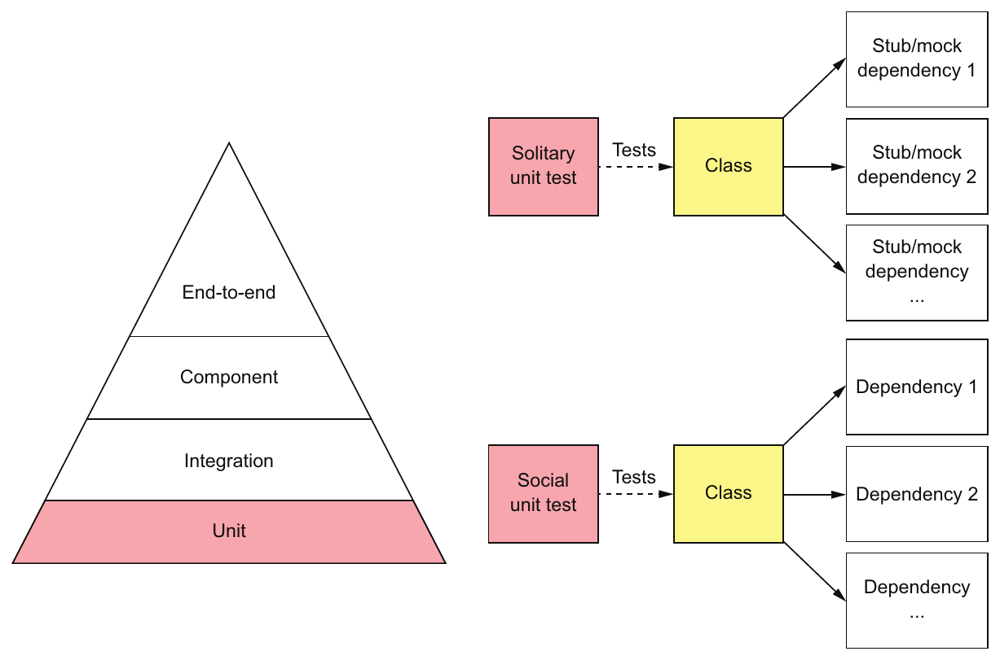

> **English:** Figure 9.10 Unit tests are the base of the pyramid. They’re fast running, easy to write, and reliable. A solitary unit test tests a class in isolation, using mocks or stubs for its dependencies. A sociable unit test tests a class and its dependencies.
>
> **Türkçe:** Şekil 9.10 Unit testler piramidin tabanını oluşturur. Hızlı çalışırlar, kolay yazılırlar ve güvenilirdirler. Solitary unit test, bağımlılıkları için mock veya stub kullanarak bir sınıfı yalıtılmış biçimde sınar. Sociable unit test ise sınıfı bağımlılıklarıyla birlikte sınar.

<!-- source-pages: 308 -->

<!-- source-record: u09_0137 -->

> **English:** There are two types of unit tests (https://martinfowler.com/bliki/UnitTest.html):
>
> **Türkçe:** İki tür unit test vardır (https://martinfowler.com/bliki/UnitTest.html):

<!-- source-record: u09_0138 -->

> **English:** • Solitary unit test—Tests a class in isolation using mock objects for the class’s dependencies
>
> **Türkçe:** • Solitary unit test (yalıtılmış birim testi)—Sınıfın bağımlılıkları için mock nesneler kullanarak sınıfı yalıtılmış biçimde test eder.

<!-- source-record: u09_0139 -->

> **English:** • Sociable unit test—Tests a class and its dependencies
>
> **Türkçe:** • Sociable unit test (birlikte çalışan birim testi)—Bir sınıfı bağımlılıklarıyla birlikte test eder.

<!-- source-record: u09_0140 -->

> **English:** The responsibilities of the class and its role in the architecture determine which type of test to use. Figure 9.11 shows the hexagonal architecture of a typical service and the type of unit test that you’ll typically use for each kind of class. Controller and service classes are often tested using solitary unit tests. Domain objects, such as entities and value objects, are typically tested using sociable unit tests.
>
> **Türkçe:** Hangi test türünün kullanılacağını sınıfın sorumlulukları ve mimarideki rolü belirler. Şekil 9.11, tipik bir servisin hexagonal architecture yapısını ve her sınıf türü için genellikle kullanılacak unit test türünü gösterir. Controller ve service sınıfları çoğunlukla solitary unit testlerle sınanır. Entity ve value object gibi domain nesneleri ise genellikle sociable unit testlerle sınanır.

<!-- source-record: u09_0141 -->

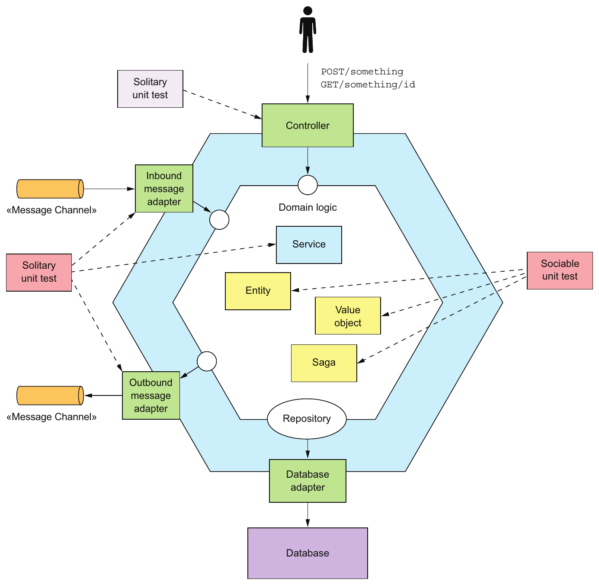

> **English:** Figure 9.11 The responsibilities of a class determine whether to use a solitary or sociable unit test.
>
> **Türkçe:** Şekil 9.11 Solitary veya sociable unit test kullanılacağını sınıfın sorumlulukları belirler.

<!-- source-pages: 309 -->

<!-- source-record: u09_0142 -->

> **English:** The typical testing strategy for each class is as follows:
>
> **Türkçe:** Her sınıf için tipik test stratejisi şöyledir:

<!-- source-record: u09_0143 -->

> **English:** • Entities, such as Order, which as described in chapter 5 are objects with persistent identity, are tested using sociable unit tests.
>
> **Türkçe:** • Bölüm 5'te anlatıldığı gibi kalıcı kimliği olan nesneler olan Order gibi entity'ler, sociable unit testlerle test edilir.

<!-- source-record: u09_0144 -->

> **English:** • Value objects, such as Money, which as described in chapter 5 are objects that are collections of values, are tested using sociable unit tests.
>
> **Türkçe:** • Bölüm 5'te anlatıldığı gibi değer kümelerinden oluşan nesneler olan Money gibi value object'ler, sociable unit testlerle test edilir.

<!-- source-record: u09_0145 -->

> **English:** • Sagas, such as CreateOrderSaga, which as described in chapter 4 maintain data consistency across services, are tested using sociable unit tests.
>
> **Türkçe:** • Bölüm 4'te anlatıldığı gibi servisler arasında veri tutarlılığını koruyan CreateOrderSaga gibi saga'lar, sociable unit testlerle test edilir.

<!-- source-record: u09_0146 -->

> **English:** • Domain services, such as OrderService, which as described in chapter 5 are classes that implement business logic that doesn’t belong in entities or value objects, are tested using solitary unit tests.
>
> **Türkçe:** • Bölüm 5'te anlatıldığı gibi entity veya value object içine ait olmayan iş mantığını uygulayan sınıflar olan OrderService gibi domain service'ler, solitary unit testlerle test edilir.

<!-- source-record: u09_0147 -->

> **English:** • Controllers, such as OrderController, which handle HTTP requests, are tested using solitary unit tests.
>
> **Türkçe:** • HTTP isteklerini işleyen OrderController gibi controller'lar, solitary unit testlerle test edilir.

<!-- source-record: u09_0148 -->

> **English:** • Inbound and outbound messaging gateways are tested using solitary unit tests.
>
> **Türkçe:** • Gelen ve giden mesajlaşma gateway'leri, solitary unit testlerle test edilir.

<!-- source-record: u09_0149 -->

> **English:** Let’s begin by looking at how to test entities.
>
> **Türkçe:** Entity'lerin nasıl test edildiğine bakarak başlayalım.

<!-- source-record: u09_0150 -->

### 9.2.1 Developing unit tests for entities — Entity'ler için unit test geliştirme

<!-- source-record: u09_0151 -->

> **English:** The following listing shows an excerpt of OrderTest class, which implements the unit tests for the Order entity. The class has an @Before setUp() method that creates an Order before running each test. Its @Test methods might further initialize Order, invoke one of its methods, and then make assertions about the return value and the state of Order.
>
> **Türkçe:** Aşağıdaki kod listesi, Order entity'sinin unit testlerini uygulayan OrderTest sınıfından bir kesit gösterir. Sınıf, her test çalışmadan önce bir Order oluşturan @Before setUp() metoduna sahiptir. @Test metotları Order'ı ek olarak hazırlayabilir, metotlarından birini çağırabilir ve ardından dönüş değeri ile Order'ın durumu hakkında assertion'lar yapabilir.

<!-- source-record: u09_0152 -->

#### Listing 9.2 A simple, fast-running unit test for the Order entity — Kod Listesi 9.2 Order entity'si için basit ve hızlı çalışan bir unit test

<!-- source-record: u09_0153 -->

```java
public class OrderTest {

  private ResultWithEvents<Order> createResult;
  private Order order;

  @Before
  public void setUp() throws Exception {
    createResult = Order.createOrder(CONSUMER_ID, AJANTA_ID, CHICKEN_VINDALOO_LINE_ITEMS);
    order = createResult.result;
  }

  @Test
  public void shouldCalculateTotal() {
    assertEquals(CHICKEN_VINDALOO_PRICE.multiply(CHICKEN_VINDALOO_QUANTITY),
     order.getOrderTotal());
  }

  ...

}
```

<!-- source-record: u09_0154 -->

> **English:** The @Test shouldCalculateTotal() method verifies that Order.getOrderTotal() returns the expected value. Unit tests thoroughly test the business logic. They are sociable unit tests for the Order class and its dependencies. You can use them as compile-time tests because they execute extremely quickly. The Order class relies on the Money value object, so it’s important to test that class as well. Let’s see how to do that.
>
> **Türkçe:** @Test shouldCalculateTotal() metodu, Order.getOrderTotal() çağrısının beklenen değeri döndürdüğünü doğrular. Unit testler iş mantığını kapsamlı biçimde test eder. Bunlar Order sınıfını bağımlılıklarıyla birlikte sınayan sociable unit testlerdir. Son derece hızlı çalıştıklarından compile-time testleri olarak kullanılabilirler. Order sınıfı Money value object'ine dayandığı için bu sınıfı da test etmek önemlidir. Bunun nasıl yapılacağına bakalım.

<!-- source-pages: 310 -->

<!-- source-record: u09_0155 -->

### 9.2.2 Writing unit tests for value objects — Value object'ler için unit test yazma

<!-- source-record: u09_0156 -->

> **English:** Value objects are immutable, so they tend to be easy to test. You don’t have to worry about side effects. A test for a value object typically creates a value object in a particular state, invokes one of its methods, and makes assertions about the return value. Listing 9.3 shows the tests for the Money value object, which is a simple class that represents a money value. These tests verify the behavior of the Money class’s methods, including add(), which adds two Money objects, and multiply(), which multiplies a Money object by an integer. They are solitary tests because the Money class doesn’t depend on any other application classes.
>
> **Türkçe:** Value object'ler immutable (değişmez) olduğundan genellikle kolay test edilir. Yan etkiler konusunda endişelenmeniz gerekmez. Value object testi tipik olarak belirli bir durumda bir value object oluşturur, metotlarından birini çağırır ve dönüş değeri hakkında assertion'lar yapar. Kod Listesi 9.3, parasal bir değeri temsil eden basit bir sınıf olan Money value object'inin testlerini gösterir. Bu testler, iki Money nesnesini toplayan add() ve bir Money nesnesini bir tamsayıyla çarpan multiply() dahil Money sınıfının metotlarının davranışını doğrular. Money sınıfı başka hiçbir uygulama sınıfına bağımlı olmadığı için bunlar solitary testlerdir.

<!-- source-record: u09_0157 -->

#### Listing 9.3 A simple, fast-running test for the Money value object — Kod Listesi 9.3 Money value object'i için basit ve hızlı çalışan bir test

<!-- source-record: u09_0158 -->

```java
public class MoneyTest {

  private final int M1_AMOUNT = 10;
  private final int M2_AMOUNT = 15;

  private Money m1 = new Money(M1_AMOUNT);
  private Money m2 = new Money(M2_AMOUNT);

  @Test
  public void shouldAdd() {
     assertEquals(new Money(M1_AMOUNT + M2_AMOUNT), m1.add(m2));
  }

  @Test
  public void shouldMultiply() {
    int multiplier = 12;
    assertEquals(new Money(M2_AMOUNT * multiplier), m2.multiply(multiplier));
  }

  ...
}
```

<!-- source-record: u09_0159 -->

**Kod açıklaması:**

> **English:** Verify that two Money objects can be added together.
>
> **Türkçe:** İki Money nesnesinin toplanabildiğini doğrular.

<!-- source-record: u09_0160 -->

**Kod açıklaması:**

> **English:** Verify that a Money object can be multiplied by an integer.
>
> **Türkçe:** Bir Money nesnesinin bir tamsayıyla çarpılabildiğini doğrular.

<!-- source-record: u09_0161 -->

> **English:** Entities and value objects are the building blocks of a service’s business logic. But some business logic also resides in the service’s sagas and services. Let’s look at how to test those.
>
> **Türkçe:** Entity ve value object'ler, bir servisin iş mantığının yapı taşlarıdır. Ancak iş mantığının bir bölümü servisin saga'larında ve domain service'lerinde de yer alır. Bunları nasıl test edeceğimize bakalım.

<!-- source-record: u09_0162 -->

### 9.2.3 Developing unit tests for sagas — Saga'lar için unit test geliştirme

<!-- source-record: u09_0163 -->

> **English:** A saga, such as the CreateOrderSaga class, implements important business logic, so needs to be tested. It’s a persistent object that sends command messages to saga participants and processes their replies. As described in chapter 4, CreateOrderSaga exchanges command/reply messages with several services, such as Consumer Service and Kitchen Service. A test for this class creates a saga and verifies that it sends the expected sequence of messages to the saga participants. One test you need to write is for the happy path. You must also write tests for the various scenarios where the saga rolls back because a saga participant sent back a failure message.
>
> **Türkçe:** CreateOrderSaga sınıfı gibi bir saga önemli iş mantığı uygular ve bu nedenle test edilmelidir. Saga katılımcılarına komut mesajları gönderen ve yanıtlarını işleyen kalıcı bir nesnedir. Bölüm 4'te anlatıldığı gibi CreateOrderSaga, Consumer Service ve Kitchen Service gibi birkaç servisle komut/yanıt mesajları alışverişi yapar. Bu sınıfın testi bir saga oluşturur ve katılımcılara beklenen mesaj dizisini gönderdiğini doğrular. Yazmanız gereken testlerden biri happy path'e, yani her şeyin beklendiği gibi ilerlediği akışa yöneliktir. Bir saga katılımcısının hata mesajı göndermesi nedeniyle saga'nın geri alındığı çeşitli senaryolar için de test yazmalısınız.

<!-- source-pages: 311 -->

<!-- source-record: u09_0164 -->

> **English:** One approach would be to write tests that use a real database and message broker along with stubs to simulate the various saga participants. For example, a stub for Consumer Service would subscribe to the consumerService command channel and send back the desired reply message. But tests written using this approach would be quite slow. A much more effective approach is to write tests that mock those classes that interact with the database and message broker. That way, we can focus on testing the saga’s core responsibility.
>
> **Türkçe:** Bir yaklaşım, çeşitli saga katılımcılarını taklit eden stub'larla birlikte gerçek veritabanı ve message broker kullanan testler yazmak olabilir. Örneğin Consumer Service stub'ı consumerService komut kanalına abone olur ve istenen yanıt mesajını gönderir. Ancak bu yaklaşımla yazılan testler oldukça yavaş olur. Çok daha etkili bir yaklaşım, veritabanı ve message broker ile etkileşen sınıfları mock'layan testler yazmaktır. Böylece saga'nın temel sorumluluğunu test etmeye odaklanabiliriz.

<!-- source-record: u09_0165 -->

> **English:** Listing 9.4 shows a test for CreateOrderSaga. It’s a sociable unit test that tests the saga class and its dependencies. It’s written using the Eventuate Tram Saga testing framework (https://github.com/eventuate-tram/eventuate-tram-sagas). This framework provides an easy-to-use DSL that abstracts away the details of interacting with sagas. With this DSL, you can create a saga and verify that it sends the correct command messages. Under the covers, the Saga testing framework configures the Saga framework with mocks for the database and messaging infrastructure.
>
> **Türkçe:** Kod Listesi 9.4, CreateOrderSaga için bir test gösterir. Saga sınıfını bağımlılıklarıyla birlikte sınayan bir sociable unit testtir. Eventuate Tram Saga test framework'ü kullanılarak yazılmıştır (https://github.com/eventuate-tram/eventuate-tram-sagas). Bu framework, saga'larla etkileşimin ayrıntılarını gizleyen kullanımı kolay bir DSL sunar. Bu DSL ile saga oluşturabilir ve doğru komut mesajlarını gönderdiğini doğrulayabilirsiniz. Arka planda Saga test framework'ü, Saga framework'ünü veritabanı ve mesajlaşma altyapısı için mock'larla yapılandırır.

<!-- source-record: u09_0166 -->

#### Listing 9.4 A simple, fast-running unit test for CreateOrderSaga — Kod Listesi 9.4 CreateOrderSaga için basit ve hızlı çalışan bir unit test

<!-- source-record: u09_0167 -->

```java
public class CreateOrderSagaTest {

  @Test
  public void shouldCreateOrder() {
    given()
        .saga(new CreateOrderSaga(kitchenServiceProxy),
                 new CreateOrderSagaState(ORDER_ID,
                            CHICKEN_VINDALOO_ORDER_DETAILS)).
    expect().
         command(new ValidateOrderByConsumer(CONSUMER_ID, ORDER_ID,
                CHICKEN_VINDALOO_ORDER_TOTAL)).
        to(ConsumerServiceChannels.consumerServiceChannel).
    andGiven().
        successReply().
     expect().
          command(new CreateTicket(AJANTA_ID, ORDER_ID, null)).
           to(KitchenServiceChannels.kitchenServiceChannel);
  }

  @Test
  public void shouldRejectOrderDueToConsumerVerificationFailed() {
    given()
        .saga(new CreateOrderSaga(kitchenServiceProxy),
                new CreateOrderSagaState(ORDER_ID,
                           CHICKEN_VINDALOO_ORDER_DETAILS)).
    expect().
        command(new ValidateOrderByConsumer(CONSUMER_ID, ORDER_ID,
                CHICKEN_VINDALOO_ORDER_TOTAL)).
        to(ConsumerServiceChannels.consumerServiceChannel).
    andGiven().
        failureReply().
     expect().
        command(new RejectOrderCommand(ORDER_ID)).
        to(OrderServiceChannels.orderServiceChannel);
   }

}
```

<!-- source-record: u09_0168 -->

**Kod açıklaması:**

> **English:** Create the saga.
>
> **Türkçe:** Saga'yı oluşturur.

<!-- source-record: u09_0169 -->

**Kod açıklaması:**

> **English:** Verify that it sends a ValidateOrderByConsumer message to Consumer Service.
>
> **Türkçe:** Consumer Service'e ValidateOrderByConsumer mesajı gönderdiğini doğrular.

<!-- source-record: u09_0170 -->

**Kod açıklaması:**

> **English:** Send a Success reply to that message.
>
> **Türkçe:** Bu mesaja Success yanıtı gönderir.

<!-- source-record: u09_0171 -->

**Kod açıklaması:**

> **English:** Verify that it sends a CreateTicket message to Kitchen Service.
>
> **Türkçe:** Kitchen Service'e CreateTicket mesajı gönderdiğini doğrular.

<!-- source-pages: 312 -->

<!-- source-record: u09_0172 -->

**Kod açıklaması:**

> **English:** Send a failure reply indicating that Consumer Service rejected Order.
>
> **Türkçe:** Consumer Service'in Order'ı reddettiğini belirten bir hata yanıtı gönderir.

<!-- source-record: u09_0173 -->

**Kod açıklaması:**

> **English:** Verify that the saga sends a RejectOrderCommand message to Order Service.
>
> **Türkçe:** Saga'nın Order Service'e RejectOrderCommand mesajı gönderdiğini doğrular.

<!-- source-record: u09_0174 -->

> **English:** The @Test shouldCreateOrder() method tests the happy path. The @Test shouldRejectOrderDueToConsumerVerificationFailed() method tests the scenario where Consumer Service rejects the order. It verifies that CreateOrderSaga sends a RejectOrderCommand to compensate for the consumer being rejected. The CreateOrderSagaTest class has methods that test other failure scenarios.
>
> **Türkçe:** @Test shouldCreateOrder() metodu happy path'i test eder. @Test shouldRejectOrderDueToConsumerVerificationFailed() metodu, Consumer Service'in siparişi reddettiği senaryoyu test eder. Müşterinin reddedilmesini telafi etmek için CreateOrderSaga'nın bir RejectOrderCommand gönderdiğini doğrular. CreateOrderSagaTest sınıfında başka hata senaryolarını test eden metotlar da vardır.

<!-- source-record: u09_0175 -->

> **English:** Let’s now look at how to test domain services.
>
> **Türkçe:** Şimdi domain service'leri nasıl test edeceğimize bakalım.

<!-- source-record: u09_0176 -->

### 9.2.4 Writing unit tests for domain services — Domain service'ler için unit test yazma

<!-- source-record: u09_0177 -->

> **English:** The majority of a service’s business logic is implemented by the entities, value objects, and sagas. Domain service classes, such as the OrderService class, implement the remainder. This class is a typical domain service class. Its methods invoke entities and repositories and publish domain events. An effective way to test this kind of class is to use a mostly solitary unit test, which mocks dependencies such as repositories and messaging classes.
>
> **Türkçe:** Bir servisin iş mantığının büyük bölümü entity'ler, value object'ler ve saga'lar tarafından uygulanır. Kalan kısmı OrderService gibi domain service sınıfları uygular. Bu sınıf tipik bir domain service sınıfıdır. Metotları entity'leri ve repository'leri çağırır, domain event'ler yayımlar. Bu tür sınıfları test etmenin etkili bir yolu, repository ve mesajlaşma sınıfları gibi bağımlılıkları mock'layan, büyük ölçüde solitary bir unit test kullanmaktır.

<!-- source-record: u09_0178 -->

> **English:** Listing 9.5 shows the OrderServiceTest class, which tests OrderService. It defines solitary unit tests, which use Mockito mocks for the service’s dependencies. Each test implements the test phases as follows:
>
> **Türkçe:** Kod Listesi 9.5, OrderService'i test eden OrderServiceTest sınıfını gösterir. Servisin bağımlılıkları için Mockito mock'ları kullanan solitary unit testler tanımlar. Her test aşamaları şöyle uygular:

<!-- source-record: u09_0179 -->

> **English:** 1 Setup—Configures the mock objects for the service’s dependencies
>
> **Türkçe:** 1 Setup—Servisin bağımlılıklarını temsil eden mock nesneleri yapılandırır.

<!-- source-record: u09_0180 -->

> **English:** 2 Execute—Invokes a service method
>
> **Türkçe:** 2 Execute—Bir servis metodunu çağırır.

<!-- source-record: u09_0181 -->

> **English:** 3 Verify—Verifies that the value returned by the service method is correct and that the dependencies have been invoked correctly
>
> **Türkçe:** 3 Verify—Servis metodunun döndürdüğü değerin doğru olduğunu ve bağımlılıkların doğru çağrıldığını doğrular.

<!-- source-record: u09_0182 -->

#### Listing 9.5 A simple, fast-running unit test for the OrderService class — Kod Listesi 9.5 OrderService sınıfı için basit ve hızlı çalışan bir unit test

<!-- source-record: u09_0183 -->

```java
public class OrderServiceTest {

  private OrderService orderService;
  private OrderRepository orderRepository;
  private DomainEventPublisher eventPublisher;
  private RestaurantRepository restaurantRepository;
  private SagaManager<CreateOrderSagaState> createOrderSagaManager;
  private SagaManager<CancelOrderSagaData> cancelOrderSagaManager;
  private SagaManager<ReviseOrderSagaData> reviseOrderSagaManager;

  @Before
  public void setup() {
    orderRepository = mock(OrderRepository.class);
     eventPublisher = mock(DomainEventPublisher.class);
    restaurantRepository = mock(RestaurantRepository.class);
    createOrderSagaManager = mock(SagaManager.class);
    cancelOrderSagaManager = mock(SagaManager.class);
    reviseOrderSagaManager = mock(SagaManager.class);
    orderService = new OrderService(orderRepository, eventPublisher,
             restaurantRepository, createOrderSagaManager,
            cancelOrderSagaManager, reviseOrderSagaManager);
  }

  @Test
  public void shouldCreateOrder() {
    when(restaurantRepository
       .findById(AJANTA_ID)).thenReturn(Optional.of(AJANTA_RESTAURANT_);
    when(orderRepository.save(any(Order.class))).then(invocation -> {
       Order order = (Order) invocation.getArguments()[0];
      order.setId(ORDER_ID);
      return order;
    });

    Order order = orderService.createOrder(CONSUMER_ID,
                     AJANTA_ID, CHICKEN_VINDALOO_MENU_ITEMS_AND_QUANTITIES);

    verify(orderRepository).save(same(order));

    verify(eventPublisher).publish(Order.class, ORDER_ID,
             singletonList(
                 new OrderCreatedEvent(CHICKEN_VINDALOO_ORDER_DETAILS)));

    verify(createOrderSagaManager)
           .create(new CreateOrderSagaState(ORDER_ID,
                       CHICKEN_VINDALOO_ORDER_DETAILS),
                  Order.class, ORDER_ID);
  }

}
```

> **Editör notu — kaynak kodunun derlenebilirliği:** Kod Listesi 9.5’te `thenReturn(Optional.of(AJANTA_RESTAURANT_);` satırının kapanış parantezleri eksiktir; bu haliyle **derlenmez (Does not compile)**. Kaynak satırı korunmuştur. Ayrıca izleyen açıklamadaki `OrderService.create()` adı yerine kod `createOrder()` çağırır.

<!-- source-record: u09_0184 -->

**Kod açıklaması:**

> **English:** Create Mockito mocks for OrderService’s dependencies.
>
> **Türkçe:** OrderService'in bağımlılıkları için Mockito mock'ları oluşturur.

<!-- source-pages: 313 -->

<!-- source-record: u09_0185 -->

**Kod açıklaması:**

> **English:** Create an OrderService injected with mock dependencies.
>
> **Türkçe:** Mock bağımlılıkların enjekte edildiği bir OrderService oluşturur.

<!-- source-record: u09_0186 -->

**Kod açıklaması:**

> **English:** Configure RestaurantRepository.findById() to return the Ajanta restaurant.
>
> **Türkçe:** RestaurantRepository.findById() metodunu Ajanta restoranını döndürecek şekilde yapılandırır.

<!-- source-record: u09_0187 -->

**Kod açıklaması:**

> **English:** Configure OrderRepository.save() to set Order’s ID.
>
> **Türkçe:** OrderRepository.save() metodunu Order'ın ID'sini ayarlayacak şekilde yapılandırır.

<!-- source-record: u09_0188 -->

**Kod açıklaması:**

> **English:** Invoke OrderService.create().
>
> **Türkçe:** OrderService.create() metodunu çağırır.

<!-- source-record: u09_0189 -->

**Kod açıklaması:**

> **English:** Verify that OrderService saved the newly created Order in the database.
>
> **Türkçe:** OrderService'in yeni oluşturulan Order'ı veritabanına kaydettiğini doğrular.

<!-- source-record: u09_0190 -->

**Kod açıklaması:**

> **English:** Verify that OrderService published an OrderCreatedEvent.
>
> **Türkçe:** OrderService'in bir OrderCreatedEvent yayımladığını doğrular.

<!-- source-record: u09_0191 -->

**Kod açıklaması:**

> **English:** Verify that OrderService created a CreateOrderSaga.
>
> **Türkçe:** OrderService'in bir CreateOrderSaga oluşturduğunu doğrular.

<!-- source-record: u09_0192 -->

> **English:** The setUp() method creates an OrderService injected with mock dependencies. The @Test shouldCreateOrder() method verifies that OrderService.createOrder() invokes OrderRepository to save the newly created Order, publishes an OrderCreatedEvent, and creates a CreateOrderSaga.
>
> **Türkçe:** setUp() metodu, mock bağımlılıkları enjekte edilmiş bir OrderService oluşturur. @Test shouldCreateOrder() metodu; OrderService.createOrder() çağrısının yeni oluşturulan Order'ı kaydetmek için OrderRepository'yi çağırdığını, bir OrderCreatedEvent yayımladığını ve bir CreateOrderSaga oluşturduğunu doğrular.

<!-- source-record: u09_0193 -->

> **English:** Now that we’ve seen how to unit test the domain logic classes, let’s look at how to unit test the adapters that interact with external systems.
>
> **Türkçe:** Domain mantığı sınıflarının unit testlerini gördüğümüze göre şimdi dış sistemlerle etkileşen adapter'ların unit testlerine bakalım.

<!-- source-record: u09_0194 -->

### 9.2.5 Developing unit tests for controllers — Controller'lar için unit test geliştirme

<!-- source-record: u09_0195 -->

> **English:** Services, such as Order Service, typically have one or more controllers that handle HTTP requests from other services and the API gateway. A controller class consists of a set of request handler methods. Each method implements a REST API endpoint. A method’s parameters represent values from the HTTP request, such as path variables. It typically invokes a domain service or a repository and returns a response object. OrderController, for instance, invokes OrderService and OrderRepository. An effective testing strategy for controllers is solitary unit tests that mock the services and repositories.
>
> **Türkçe:** Order Service gibi servislerde, diğer servislerden ve API gateway'den gelen HTTP isteklerini işleyen bir veya daha fazla controller bulunur. Controller sınıfı bir dizi request handler metodundan oluşur. Her metot bir REST API endpoint'i uygular. Metodun parametreleri, path variable gibi HTTP isteğindeki değerleri temsil eder. Metot genellikle bir domain service veya repository çağırıp bir yanıt nesnesi döndürür. Örneğin OrderController, OrderService ve OrderRepository'yi çağırır. Controller'lar için etkili bir test stratejisi, servisleri ve repository'leri mock'layan solitary unit testlerdir.

<!-- source-pages: 314 -->

<!-- source-record: u09_0196 -->

> **English:** You could write a test class similar to the OrderServiceTest class to instantiate a controller class and invoke its methods. But this approach doesn’t test some important functionality, such as request routing. It’s much more effective to use a mock MVC testing framework, such as Spring Mock Mvc, which is part of the Spring Framework, or Rest Assured Mock MVC, which builds on Spring Mock Mvc. Tests written using one of these frameworks make what appear to be HTTP requests and make assertions about HTTP responses. These frameworks enable you to test HTTP request routing and conversion of Java objects to and from JSON without having to make real network calls. Under the covers, Spring Mock Mvc instantiates just enough of the Spring MVC classes to make this possible.
>
> **Türkçe:** Bir controller sınıfının örneğini oluşturup metotlarını çağırmak için OrderServiceTest'e benzer bir test sınıfı yazabilirsiniz. Ancak bu yaklaşım istek yönlendirme gibi bazı önemli işlevleri test etmez. Spring Framework'ün parçası olan Spring Mock Mvc veya onun üzerine kurulu Rest Assured Mock MVC gibi bir mock MVC test framework'ü kullanmak çok daha etkilidir. Bu framework'lerden biriyle yazılan testler, HTTP isteği gibi görünen çağrılar yapar ve HTTP yanıtları hakkında assertion'lar uygular. Bu framework'ler gerçek ağ çağrıları yapmadan HTTP isteği yönlendirmesini ve Java nesnelerinin JSON'a, JSON'ın da Java nesnelerine dönüştürülmesini test etmenizi sağlar. Arka planda Spring Mock Mvc, bunu mümkün kılacak kadar Spring MVC sınıfının örneğini oluşturur.

<!-- source-record: u09_0197 -->

### Are these really unit tests? — Bunlar gerçekten unit test mi?

<!-- source-record: u09_0198 -->

> **English:** Because these tests use the Spring Framework, you might argue that they’re not unit tests. They’re certainly more heavyweight than the unit tests I’ve described so far. The Spring Mock Mvc documentation refers to these as out-of-servlet-container integration tests (https://docs.spring.io/spring/docs/current/spring-framework-reference/testing.html#spring-mvc-test-vs-end-to-end-integration-tests). Yet Rest Assured Mock MVC describes these tests as unit tests (https://github.com/rest-assured/rest-assured/wiki/Usage#spring-mock-mvc-module). Regardless of the debate over terminology, these are important tests to write.
>
> **Türkçe:** Bu testler Spring Framework kullandığı için unit test olmadıklarını savunabilirsiniz. Şimdiye kadar anlattığım unit testlere göre kesinlikle daha ağırdırlar. Spring Mock Mvc dokümantasyonu bunları servlet container dışında çalışan integration testler olarak adlandırır (https://docs.spring.io/spring/docs/current/spring-framework-reference/testing.html#spring-mvc-test-vs-end-to-end-integration-tests). Rest Assured Mock MVC ise unit test olarak tanımlar (https://github.com/rest-assured/rest-assured/wiki/Usage#spring-mock-mvc-module). Terim tartışmasından bağımsız olarak bunlar yazılması önemli testlerdir.

<!-- source-record: u09_0199 -->

> **English:** Listing 9.6 shows the OrderControllerTest class, which tests Order Service’s OrderController. It defines solitary unit tests that use mocks for OrderController’s dependencies. It’s written using Rest Assured Mock MVC, which provides a simple DSL that abstracts away the details of interacting with controllers. Rest Assured makes it easy to send a mock HTTP request to a controller and verify the response. OrderControllerTest creates a controller that’s injected with Mockito mocks for OrderService and OrderRepository. Each test configures the mocks, makes an HTTP request, verifies that the response is correct, and possibly verifies that the controller invoked the mocks.
>
> **Türkçe:** Kod Listesi 9.6, Order Service'in OrderController sınıfını test eden OrderControllerTest'i gösterir. OrderController'ın bağımlılıkları için mock kullanan solitary unit testler tanımlar. Controller'larla etkileşim ayrıntılarını gizleyen basit bir DSL sunan Rest Assured Mock MVC ile yazılmıştır. Rest Assured, controller'a mock HTTP isteği göndermeyi ve yanıtı doğrulamayı kolaylaştırır. OrderControllerTest, OrderService ve OrderRepository için Mockito mock'larının enjekte edildiği bir controller oluşturur. Her test mock'ları yapılandırır, HTTP isteği yapar, yanıtın doğruluğunu denetler ve gerekirse controller'ın mock'ları çağırdığını doğrular.

<!-- source-record: u09_0200 -->

#### Listing 9.6 A simple, fast-running unit test for the OrderController class — Kod Listesi 9.6 OrderController sınıfı için basit ve hızlı çalışan bir unit test

<!-- source-record: u09_0201 -->

```java
public class OrderControllerTest {

  private OrderService orderService;
  private OrderRepository orderRepository;

  @Before
  public void setUp() throws Exception {
    orderService = mock(OrderService.class);
    orderRepository = mock(OrderRepository.class);
    orderController = new OrderController(orderService, orderRepository);
  }

  @Test
  public void shouldFindOrder() {

    when(orderRepository.findById(1L))
          .thenReturn(Optional.of(CHICKEN_VINDALOO_ORDER_);

    given().
      standaloneSetup(configureControllers(
               new OrderController(orderService, orderRepository))).
    when().
            get("/orders/1").
    then().
      statusCode(200).
       body("orderId",
            equalTo(new Long(OrderDetailsMother.ORDER_ID).intValue())).
      body("state",
           equalTo(OrderDetailsMother.CHICKEN_VINDALOO_ORDER_STATE.name())).
      body("orderTotal",
          equalTo(CHICKEN_VINDALOO_ORDER_TOTAL.asString()))
    ;
  }

  @Test
  public void shouldFindNotOrder() { ... }

  private StandaloneMockMvcBuilder controllers(Object... controllers) { ... }

}
```

> **Editör notu — kaynak kodunun derlenebilirliği:** Kod Listesi 9.6’da `thenReturn(Optional.of(CHICKEN_VINDALOO_ORDER_);` satırının kapanış parantezleri eksiktir; bu haliyle **derlenmez**. Kaynakta `configureControllers(...)` çağrısıyla aşağıdaki `controllers(...)` yardımcı metot adı da farklıdır. Bu parçalar, tamamlanmış bağımsız programlar olarak değerlendirilmemelidir.

<!-- source-record: u09_0202 -->

**Kod açıklaması:**

> **English:** Create mocks for OrderController’s dependencies.
>
> **Türkçe:** OrderController'ın bağımlılıkları için mock'lar oluşturur.

<!-- source-pages: 315 -->

<!-- source-record: u09_0203 -->

**Kod açıklaması:**

> **English:** Configure the mock OrderRepository to return an Order.
>
> **Türkçe:** Mock OrderRepository'yi bir Order döndürecek şekilde yapılandırır.

<!-- source-record: u09_0204 -->

**Kod açıklaması:**

> **English:** Configure OrderController.
>
> **Türkçe:** OrderController'ı yapılandırır.

<!-- source-record: u09_0205 -->

**Kod açıklaması:**

> **English:** Make an HTTP request.
>
> **Türkçe:** Bir HTTP isteği yapar.

<!-- source-record: u09_0206 -->

**Kod açıklaması:**

> **English:** Verify the response status code.
>
> **Türkçe:** Yanıtın durum kodunu doğrular.

<!-- source-record: u09_0207 -->

**Kod açıklaması:**

> **English:** Verify elements of the JSON response body.
>
> **Türkçe:** JSON yanıt gövdesinin öğelerini doğrular.

<!-- source-record: u09_0208 -->

> **English:** The shouldFindOrder() test method first configures the OrderRepository mock to return an Order. It then makes an HTTP request to retrieve the order. Finally, it checks that the request was successful and that the response body contains the expected data.
>
> **Türkçe:** shouldFindOrder() test metodu önce OrderRepository mock'ını bir Order döndürecek biçimde yapılandırır. Ardından siparişi almak için HTTP isteği yapar. Son olarak isteğin başarılı olduğunu ve yanıt gövdesinin beklenen verileri içerdiğini denetler.

<!-- source-record: u09_0209 -->

> **English:** Controllers aren’t the only adapters that handle requests from external systems. There are also event/message handlers, so let’s talk about how to unit test those.
>
> **Türkçe:** Dış sistemlerden gelen istekleri işleyen tek adapter türü controller değildir. Event/message handler'lar da vardır; şimdi bunların unit testlerini nasıl yazacağımızı konuşalım.

<!-- source-record: u09_0210 -->

### 9.2.6 Writing unit tests for event and message handlers — Event ve message handler'lar için unit test yazma

<!-- source-record: u09_0211 -->

> **English:** Services often process messages sent by external systems. Order Service, for example, has OrderEventConsumer, which is a message adapter that handles domain events published by other services. Like controllers, message adapters tend to be simple classes that invoke domain services. Each of a message adapter’s methods typically invokes a service method with data from the message or event.
>
> **Türkçe:** Servisler çoğu zaman dış sistemlerin gönderdiği mesajları işler. Örneğin Order Service'te, diğer servislerin yayımladığı domain event'leri işleyen bir mesaj adapter'ı olan OrderEventConsumer bulunur. Controller'lar gibi mesaj adapter'ları da genellikle domain service'leri çağıran basit sınıflardır. Mesaj adapter'ının her metodu çoğunlukla mesajdan veya olaydan aldığı verilerle bir servis metodunu çağırır.

<!-- source-record: u09_0212 -->

> **English:** We can unit test message adapters using an approach similar to the one we used for unit testing controllers. Each test instantiates the message adapter, sends a message to a channel, and verifies that the service mock was invoked correctly. Behind the scenes, though, the messaging infrastructure is stubbed, so no message broker is involved. Let’s look at how to test the OrderEventConsumer class.
>
> **Türkçe:** Controller'ların unit testlerinde kullandığımıza benzer bir yaklaşımla mesaj adapter'larını test edebiliriz. Her test mesaj adapter'ının örneğini oluşturur, bir kanala mesaj gönderir ve servis mock'ının doğru çağrıldığını doğrular. Ancak arka planda mesajlaşma altyapısı stub ile değiştirildiğinden işin içinde message broker yoktur. OrderEventConsumer sınıfının nasıl test edildiğine bakalım.

<!-- source-pages: 316 -->

<!-- source-record: u09_0213 -->

> **English:** Listing 9.7 shows part of the OrderEventConsumerTest class, which tests OrderEventConsumer. It verifies that OrderEventConsumer routes each event to the appropriate handler method and correctly invokes OrderService. The test uses the Eventuate Tram Mock Messaging framework, which provides an easy-to-use DSL for writing mock messaging tests that uses the same given-when-then format as Rest Assured. Each test instantiates OrderEventConsumer injected with a mock OrderService, publishes a domain event, and verifies that OrderEventConsumer correctly invokes the service mock.
>
> **Türkçe:** Kod Listesi 9.7, OrderEventConsumer'ı test eden OrderEventConsumerTest sınıfının bir bölümünü gösterir. OrderEventConsumer'ın her olayı uygun handler metoduna yönlendirdiğini ve OrderService'i doğru çağırdığını doğrular. Test, Rest Assured ile aynı given-when-then biçimini kullanan mock mesajlaşma testleri yazmak için kolay bir DSL sunan Eventuate Tram Mock Messaging framework'ünü kullanır. Her test, mock OrderService enjekte edilmiş bir OrderEventConsumer oluşturur, bir domain event yayımlar ve OrderEventConsumer'ın servis mock'ını doğru çağırdığını doğrular.

<!-- source-record: u09_0214 -->

#### Listing 9.7 A fast-running unit test for the OrderEventConsumer class — Kod Listesi 9.7 OrderEventConsumer sınıfı için hızlı çalışan bir unit test

<!-- source-record: u09_0215 -->

```java
public class OrderEventConsumerTest {

  private OrderService orderService;
  private OrderEventConsumer orderEventConsumer;

  @Before
  public void setUp() throws Exception {
    orderService = mock(OrderService.class);
    orderEventConsumer = new OrderEventConsumer(orderService);
  }

  @Test
  public void shouldCreateMenu() {

    given().
            eventHandlers(orderEventConsumer.domainEventHandlers()).
    when().
      aggregate("net.chrisrichardson.ftgo.restaurantservice.domain.Restaurant",
                AJANTA_ID).
      publishes(new RestaurantCreated(AJANTA_RESTAURANT_NAME,
                          RestaurantMother.AJANTA_RESTAURANT_MENU))
    then().
       verify(() -> {
          verify(orderService)
                .createMenu(AJANTA_ID,
            new RestaurantMenu(RestaurantMother.AJANTA_RESTAURANT_MENU_ITEMS));
       })
    ;
  }

}
```

> **Editör notu — fluent çağrı zinciri:** Kod Listesi 9.7’de `publishes(...)` çağrısından sonra `then()` zincirine geçişte `.` eksiktir. Kaynak bu haliyle **derlenmez**; yöntem zincirinin burada noktayla sürmesi gerekir.

<!-- source-record: u09_0216 -->

**Kod açıklaması:**

> **English:** Instantiate OrderEventConsumer with mocked dependencies.
>
> **Türkçe:** Mock bağımlılıklarla OrderEventConsumer örneği oluşturur.

<!-- source-record: u09_0217 -->

**Kod açıklaması:**

> **English:** Configure OrderEventConsumer domain handlers.
>
> **Türkçe:** OrderEventConsumer domain handler'larını yapılandırır.

<!-- source-record: u09_0218 -->

**Kod açıklaması:**

> **English:** Publish a RestaurantCreated event.
>
> **Türkçe:** Bir RestaurantCreated olayı yayımlar.

<!-- source-record: u09_0219 -->

**Kod açıklaması:**

> **English:** Verify that OrderEventConsumer invoked OrderService.createMenu().
>
> **Türkçe:** OrderEventConsumer'ın OrderService.createMenu() metodunu çağırdığını doğrular.

<!-- source-record: u09_0220 -->

> **English:** The setUp() method creates an OrderEventConsumer injected with a mock OrderService. The shouldCreateMenu() method publishes a RestaurantCreated event and verifies that OrderEventConsumer invoked OrderService.createMenu(). The OrderEventConsumerTest class and the other unit test classes execute extremely quickly. The unit tests run in just a few seconds.
>
> **Türkçe:** setUp() metodu, mock OrderService enjekte edilmiş bir OrderEventConsumer oluşturur. shouldCreateMenu() metodu bir RestaurantCreated olayı yayımlar ve OrderEventConsumer'ın OrderService.createMenu() metodunu çağırdığını doğrular. OrderEventConsumerTest ve diğer unit test sınıfları son derece hızlı çalışır. Unit testler yalnızca birkaç saniyede tamamlanır.

<!-- source-pages: 317 -->

<!-- source-record: u09_0221 -->

> **English:** But the unit tests don’t verify that a service, such as Order Service, properly interacts with other services. For example, the unit tests don’t verify that an Order can be persisted in MySQL. Nor do they verify that CreateOrderSaga sends command messages in the right format to the right message channel. And they don’t verify that the RestaurantCreated event processed by OrderEventConsumer has the same structure as the event published by Restaurant Service. In order to verify that a service properly interacts with other services, we must write integration tests. We also need to write component tests that test an entire service in isolation. The next chapter discusses how to conduct those types of tests, as well as end-to-end tests.
>
> **Türkçe:** Ancak unit testler, Order Service gibi bir servisin diğer servislerle doğru etkileştiğini doğrulamaz. Örneğin bir Order'ın MySQL'de kalıcı olarak saklanabildiğini doğrulamazlar. CreateOrderSaga'nın komut mesajlarını doğru biçimde doğru mesaj kanalına gönderdiğini de doğrulamazlar. OrderEventConsumer'ın işlediği RestaurantCreated olayının, Restaurant Service'in yayımladığı olayla aynı yapıda olduğunu da doğrulamazlar. Bir servisin diğer servislerle doğru etkileştiğini doğrulamak için integration testler yazmalıyız. Tüm bir servisi yalıtılmış biçimde test eden component testler de yazmamız gerekir. Sonraki bölüm, bu test türleriyle birlikte end-to-end testlerin nasıl yapılacağını ele alır.

<!-- source-record: u09_0222 -->

## Summary — Bölüm özeti

<!-- source-record: u09_0223 -->

> **English:** • Automated testing is the key foundation of rapid, safe delivery of software. What’s more, because of its inherent complexity, to fully benefit from the microservice architecture you must automate your tests.
>
> **Türkçe:** • Otomatik test, yazılımın hızlı ve güvenli tesliminin temel dayanağıdır. Üstelik microservice mimarisinin doğasındaki karmaşıklık nedeniyle bu mimariden tam yararlanmak için testlerinizi otomatikleştirmelisiniz.

<!-- source-record: u09_0224 -->

> **English:** • The purpose of a test is to verify the behavior of the system under test (SUT). In this definition, system is a fancy term that means the software element being tested. It might be something as small as a class, as large as the entire application, or something in between, such as a cluster of classes or an individual service. A collection of related tests form a test suite.
>
> **Türkçe:** • Bir testin amacı, test edilen sistemin (SUT) davranışını doğrulamaktır. Bu tanımdaki sistem, test edilen yazılım öğesini ifade eden gösterişli bir terimdir. Bir sınıf kadar küçük, tüm uygulama kadar büyük veya bir sınıf kümesi ya da tek bir servis gibi ikisinin arasında olabilir. İlişkili testler topluluğu bir test suite oluşturur.

<!-- source-record: u09_0225 -->

> **English:** • A good way to simplify and speed up a test is to use test doubles. A test double is an object that simulates the behavior of a SUT’s dependency. There are two types of test doubles: stubs and mocks. A stub is a test double that returns values to the SUT. A mock is a test double that a test uses to verify that the SUT correctly invokes a dependency.
>
> **Türkçe:** • Bir testi basitleştirip hızlandırmanın iyi bir yolu test double kullanmaktır. Test double, SUT'nin bir bağımlılığının davranışını taklit eden nesnedir. İki türü vardır: stub ve mock. Stub, SUT'ye değer döndüren test double'dır. Mock ise testin, SUT'nin bağımlılığı doğru çağırdığını doğrulamak için kullandığı test double'dır.

<!-- source-record: u09_0226 -->

> **English:** • Use the test pyramid to determine where to focus your testing efforts for your services. The majority of your tests should be fast, reliable, and easy-to-write unit tests. You must minimize the number of end-to-end tests, because they’re slow, brittle, and time consuming to write.
>
> **Türkçe:** • Servislerinize yönelik test çalışmalarını nereye odaklayacağınızı belirlemek için test piramidini kullanın. Testlerinizin çoğu hızlı, güvenilir ve kolay yazılabilir unit testler olmalıdır. Yavaş, kırılgan ve yazılması zaman alıcı oldukları için end-to-end test sayısını en aza indirmelisiniz.
