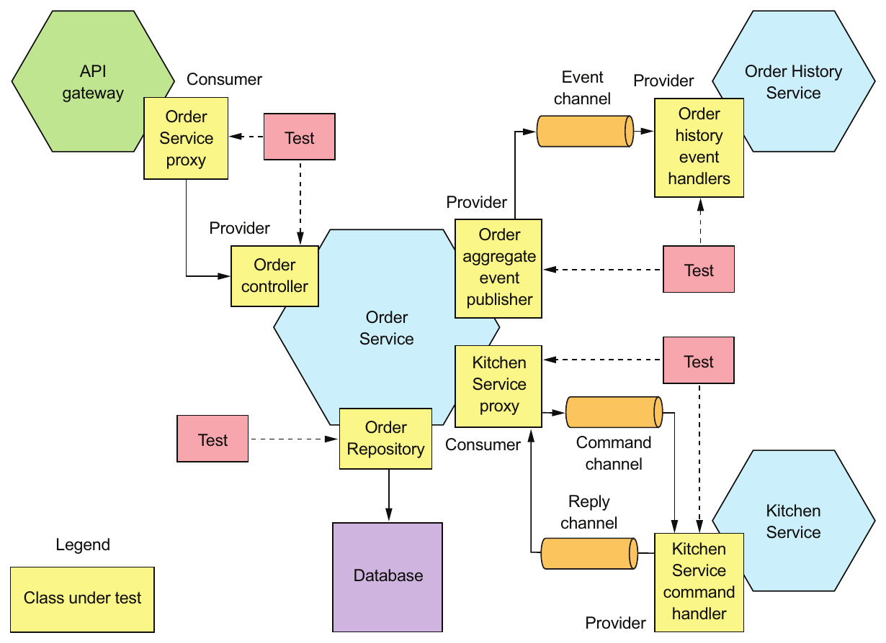
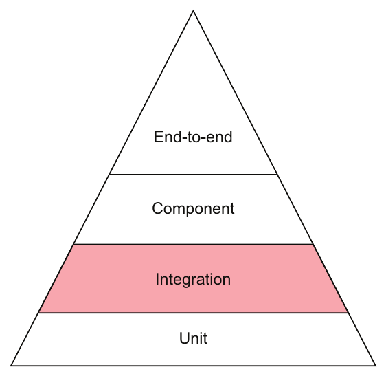
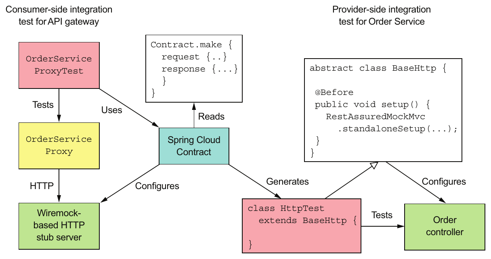
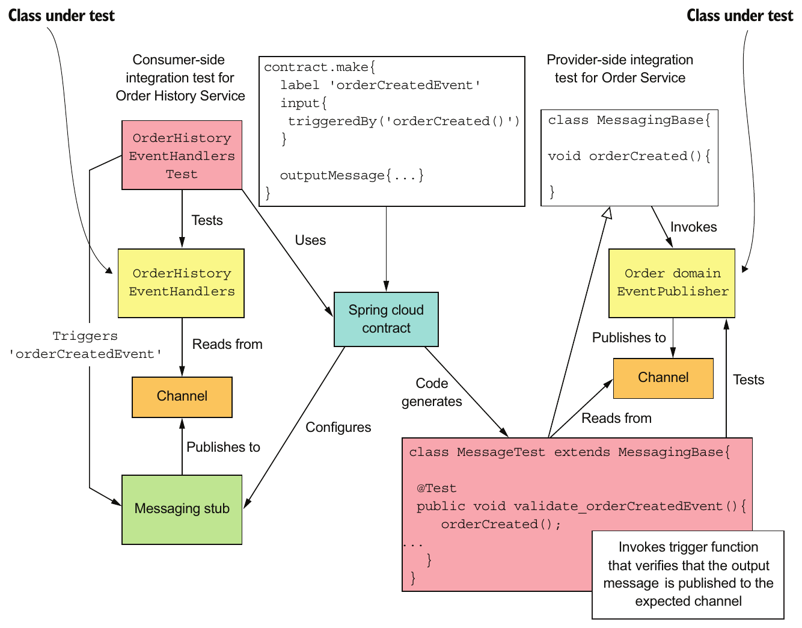
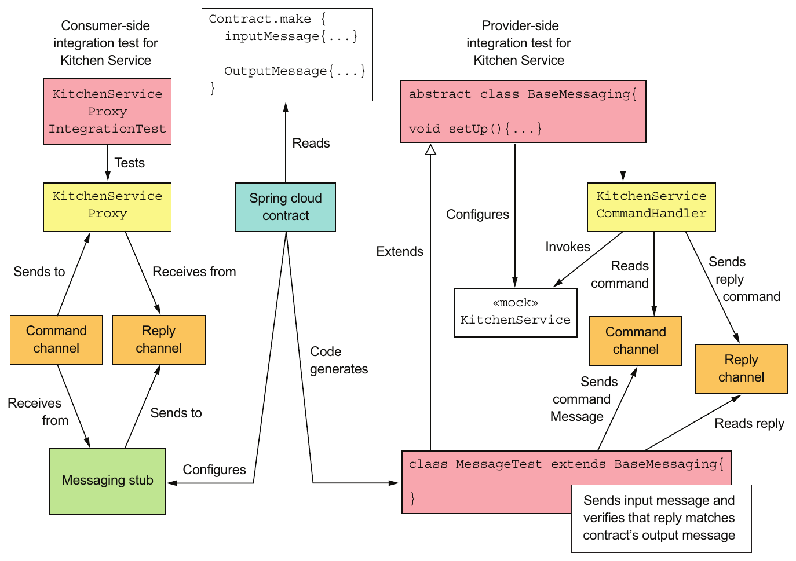
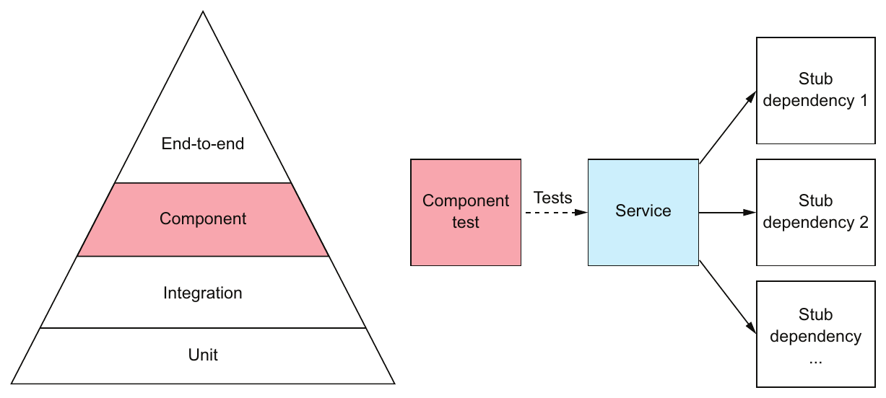
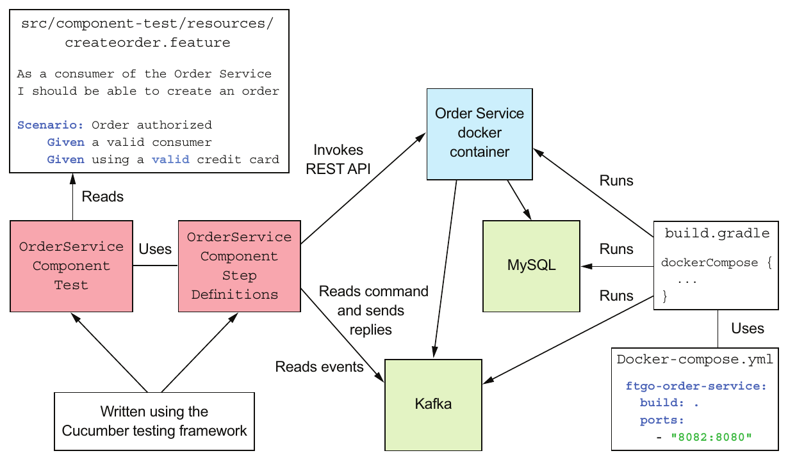
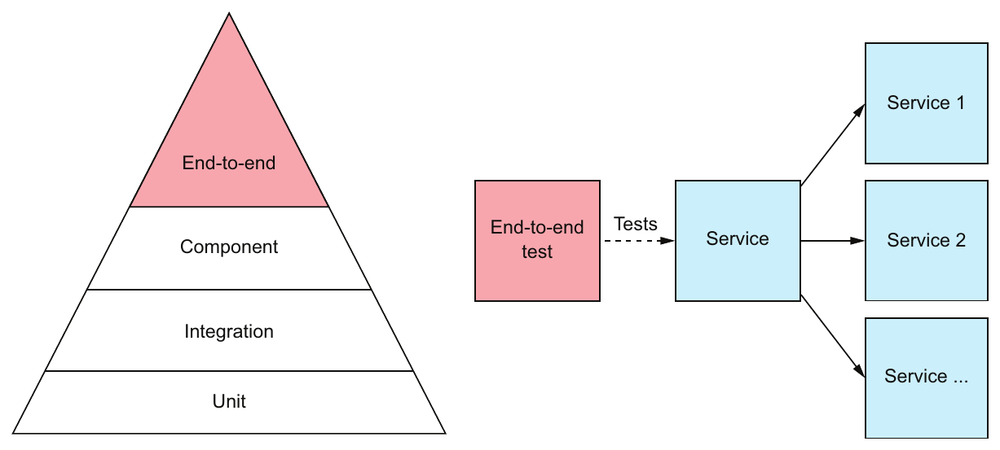

# Ünite 10 · Testing microservices: Part 2 — Microservice testleri: Bölüm 2

**Amaç:** Microservice testleri: Bölüm 2 konusunu İngilizce–Türkçe karşılaştırmalı çalışmak; teknik açıklamaları özgün şekiller, tablolar ve kod örnekleriyle birlikte okumak.

**Kaynak:** Kullanıcının sağladığı *Microservices Patterns*, bölüm 10; `Microservices_Patterns_1_Bolumden_Itibaren.pdf`, kaynak PDF sayfaları **318–347**. Başlık ve metin sırası korunmuş, sayfa sonlarında bölünen paragraflar birleştirilmiştir. Şekiller, üzerlerindeki yazılar korunarak kaynak PDF'den alınmıştır.

**Okuma notu:** Teknoloji ve şirket örnekleri kitabın yazıldığı dönemin anlatımıdır. Kodlar kaynakta verilen bağlama bağlı örneklerdir; bağımsız Java 17 programları olarak sunulmaz. İngilizce kaynak ve Türkçe çeviri ardışık bloklardadır. Türkçe paragraflar kaynak metinle karşılaştırılarak hazırlanmış; teknik terimler, anlam ilişkileri ve metin aktarımı kontrol edilmiştir.

**Dil çalışması:** [Ünite sözlüğü](vocabulary.md) · [Vocabulary PDF](vocabulary.pdf) · [Grammar notları](grammar_notes.md) · [Grammar PDF](grammar_notes.pdf). Kelime anlamları ve cümle yapılarının ayrıntıları bu iki eşlikçi kaynaktadır.

<!-- source-pages: 318 -->

<!-- source-record: u10_0000 -->

## This chapter covers — Bu bölümün kapsamı

<!-- source-record: u10_0001 -->

> **English:** • Techniques for testing services in isolation
>
> **Türkçe:** • Servisleri yalıtılmış biçimde test etme teknikleri

<!-- source-record: u10_0002 -->

> **English:** • Using consumer-driven contract testing to write tests that quickly yet reliably verify interservice communication
>
> **Türkçe:** • Servisler arası iletişimi hızlı, aynı zamanda güvenilir biçimde doğrulayan testler yazmak için consumer-driven contract testing kullanımı

<!-- source-record: u10_0003 -->

> **English:** • When and how to do end-to-end testing of applications
>
> **Türkçe:** • Uygulamaların end-to-end testlerinin ne zaman ve nasıl yapılacağı

<!-- source-record: u10_0004 -->

> **English:** This chapter builds on the previous chapter, which introduced testing concepts, including the test pyramid. The test pyramid describes the relative proportions of the different types of tests that you should write. The previous chapter described how to write unit tests, which are at the base of the testing pyramid. In this chapter, we continue our ascent of the testing pyramid.
>
> **Türkçe:** Bu bölüm, test piramidi dahil test kavramlarını tanıtan önceki bölümün üzerine kuruludur. Test piramidi, yazmanız gereken farklı test türlerinin göreli oranlarını açıklar. Önceki bölümde, test piramidinin tabanındaki unit testlerin nasıl yazıldığı anlatıldı. Bu bölümde piramitte yukarı çıkmayı sürdürüyoruz.

<!-- source-record: u10_0005 -->

> **English:** This chapter begins with how to write integration tests, which are the level above unit tests in the testing pyramid. Integration tests verify that a service can properly interact with infrastructure services, such as databases, and other application services. Next, I cover component tests, which are acceptance tests for services. A component test tests a service in isolation by using stubs for its dependencies. After that, I describe how to write end-to-end tests, which test a group of services or the entire application. End-to-end tests are at the top of the test pyramid and should, therefore, be used sparingly.
>
> **Türkçe:** Bu bölüm, test piramidinde unit testlerin bir üst seviyesinde bulunan integration testlerin yazımıyla başlar. Integration testler, bir servisin veritabanları gibi altyapı servisleriyle ve diğer uygulama servisleriyle doğru etkileşebildiğini doğrular. Ardından servislere yönelik kabul testleri olan component testleri ele alıyorum. Component test, servisin bağımlılıkları için stub kullanarak servisi yalıtılmış biçimde test eder. Sonra bir servis grubunu veya tüm uygulamayı test eden end-to-end testlerin nasıl yazıldığını anlatıyorum. End-to-end testler piramidin tepesindedir ve bu nedenle az kullanılmalıdır.

<!-- source-pages: 319 -->

<!-- source-record: u10_0006 -->

> **English:** Let’s start by taking a look at how to write integration tests.
>
> **Türkçe:** Integration testlerin nasıl yazıldığına göz atarak başlayalım.

<!-- source-record: u10_0007 -->

## 10.1 Writing integration tests — Integration test yazma

<!-- source-record: u10_0008 -->

> **English:** Services typically interact with other services. For example, Order Service, as figure 10.1 shows, interacts with several services. Its REST API is consumed by API Gateway, and its domain events are consumed by services, including Order History Service. Order Service uses several other services. It persists Orders in MySQL. It also sends commands to and consumes replies from several other services, such as Kitchen Service.
>
> **Türkçe:** Servisler genellikle başka servislerle etkileşir. Örneğin Şekil 10.1'in gösterdiği gibi Order Service birkaç servisle etkileşir. REST API'si API Gateway tarafından, domain event'leri ise Order History Service dahil çeşitli servisler tarafından tüketilir. Order Service başka servislerden de yararlanır. Order'ları MySQL'de kalıcı olarak saklar. Kitchen Service gibi birkaç servise komut gönderir ve yanıtlarını tüketir.

<!-- source-record: u10_0009 -->



> **English:** Figure 10.1 Integration tests must verify that a service can communicate with its clients and dependencies. But rather than testing whole services, the strategy is to test the individual adapter classes that implement the communication.
>
> **Türkçe:** Şekil 10.1 Integration testler, bir servisin istemcileriyle ve bağımlılıklarıyla iletişim kurabildiğini doğrulamalıdır. Ancak strateji, servislerin tamamını test etmek yerine iletişimi uygulayan adapter sınıflarını tek tek test etmektir.

<!-- source-record: u10_0010 -->

> **English:** In order to be confident that a service such as Order Service works as expected, we must write tests that verify that the service can properly interact with infrastructure services and other application services. One approach is to launch all the services and test them through their APIs. This, however, is what’s known as end-to-end testing, which is slow, brittle, and costly. As explained in section 10.3, there’s a role for end-to-end testing sometimes, but it’s at the top of the test pyramid, so you want to minimize the number of end-to-end tests.
>
> **Türkçe:** Order Service gibi bir servisin beklendiği gibi çalıştığından emin olmak için altyapı servisleri ve diğer uygulama servisleriyle doğru etkileştiğini doğrulayan testler yazmalıyız. Bir yaklaşım bütün servisleri başlatıp API'leri üzerinden test etmektir. Ancak bu, yavaş, kırılgan ve maliyetli olan end-to-end testing yaklaşımıdır. Kısım 10.3'te açıklandığı gibi end-to-end testin bazen bir yeri vardır; fakat test piramidinin tepesinde bulunduğu için bu testlerin sayısını en aza indirmek istersiniz.

<!-- source-pages: 320 -->

<!-- source-record: u10_0011 -->

> **English:** A much more effective strategy is to write what are known as integration tests. As figure 10.2 shows, integration tests are the layer above unit tests in the testing pyramid. They verify that a service can properly interact with infrastructure services and other services. But unlike end-to-end tests, they don’t launch services. Instead, we use a couple of strategies that significantly simplify the tests without impacting their effectiveness.
>
> **Türkçe:** Çok daha etkili bir strateji, integration test olarak bilinen testleri yazmaktır. Şekil 10.2'de gösterildiği gibi bunlar test piramidinde unit testlerin bir üst katmanındadır. Bir servisin altyapı servisleri ve diğer servislerle doğru etkileşebildiğini doğrularlar. Ancak end-to-end testlerden farklı olarak servisleri başlatmazlar. Bunun yerine etkililiklerini azaltmadan testleri önemli ölçüde basitleştiren birkaç strateji kullanırız.

<!-- source-record: u10_0012 -->



> **English:** Figure 10.2 Integration tests are the layer above unit tests. They verify that a service can communicate with its dependencies, which includes infrastructure services, such as the database, and application services.
>
> **Türkçe:** Şekil 10.2 Integration testler, unit testlerin bir üst katmanıdır. Bir servisin, veritabanı gibi altyapı servislerini ve uygulama servislerini kapsayan bağımlılıklarıyla iletişim kurabildiğini doğrularlar.

<!-- source-record: u10_0013 -->

> **English:** The first strategy is to test each of the service’s adapters, along with, perhaps, the adapter’s supporting classes. For example, in section 10.1.1 you’ll see a JPA persistence test that verifies that Orders are persisted correctly. Rather than test persistence through Order Service’s API, it directly tests the OrderRepository class. Similarly, in section 10.1.3 you’ll see a test that verifies that Order Service publishes correctly structured domain events by testing the OrderDomainEventPublisher class. The benefit of testing only a small number of classes rather than the entire service is that the tests are significantly simpler and faster.
>
> **Türkçe:** İlk strateji, servisin her adapter'ını ve gerektiğinde onu destekleyen sınıfları test etmektir. Örneğin 10.1.1 kısmında Order'ların doğru saklandığını doğrulayan bir JPA persistence testi göreceksiniz. Kalıcılığı Order Service API'si üzerinden sınamak yerine doğrudan OrderRepository sınıfını test eder. Benzer biçimde 10.1.3 kısmında OrderDomainEventPublisher sınıfını test ederek Order Service'in doğru yapılandırılmış domain event'ler yayımladığını doğrulayan bir test göreceksiniz. Tüm servis yerine az sayıda sınıfı test etmenin yararı, testlerin belirgin biçimde daha basit ve hızlı olmasıdır.

<!-- source-record: u10_0014 -->

> **English:** The second strategy for simplifying integration tests that verify interactions between application services is to use contracts, discussed in chapter 9. A contract is a concrete example of an interaction between a pair of services. As table 10.1 shows, the structure of a contract depends on the type of interaction between the services.
>
> **Türkçe:** Uygulama servisleri arasındaki etkileşimleri doğrulayan integration testleri basitleştirmenin ikinci stratejisi, Bölüm 9'da ele alınan sözleşmeleri kullanmaktır. Sözleşme, iki servis arasındaki etkileşimin somut bir örneğidir. Tablo 10.1'in gösterdiği gibi sözleşmenin yapısı, servisler arasındaki etkileşimin türüne bağlıdır.

<!-- source-record: u10_0015 -->

> **English:** Table 10.1 The structure of a contract depends on the type of interaction between the services.
>
> **Türkçe:** Tablo 10.1 Bir sözleşmenin yapısı, servisler arasındaki etkileşimin türüne bağlıdır.

| **EN:** Interaction style<br/>**TR:** Etkileşim biçimi | **EN:** Consumer<br/>**TR:** Tüketici | **EN:** Provider<br/>**TR:** Sağlayıcı | **EN:** Contract<br/>**TR:** Sözleşme |
| --- | --- | --- | --- |
| **EN:** REST-based, request/response<br/>**TR:** REST tabanlı request/response | **EN:** API Gateway<br/>**TR:** API Gateway | **EN:** Order Service<br/>**TR:** Order Service | **EN:** HTTP request and response<br/>**TR:** HTTP isteği ve yanıtı |
| **EN:** Publish/subscribe<br/>**TR:** Yayımla/abone ol | **EN:** Order History Service<br/>**TR:** Order History Service | **EN:** Order Service<br/>**TR:** Order Service | **EN:** Domain event<br/>**TR:** Domain event (alan olayı) |
| **EN:** Asynchronous request/response<br/>**TR:** Asenkron request/response | **EN:** Order Service<br/>**TR:** Order Service | **EN:** Kitchen Service<br/>**TR:** Kitchen Service | **EN:** Command message and reply message<br/>**TR:** Komut mesajı ve yanıt mesajı |

<!-- source-pages: 321 -->

<!-- source-record: u10_0016 -->

> **English:** A contract consists of either one message, in the case of publish/subscribe style interactions, or two messages, in the case of request/response and asynchronous request/ response style interactions.
>
> **Türkçe:** Bir sözleşme, publish/subscribe tarzı etkileşimlerde tek mesajdan; request/response ve asenkron request/response tarzı etkileşimlerde ise iki mesajdan oluşur.

<!-- source-record: u10_0017 -->

> **English:** The contracts are used to test both the consumer and the provider, which ensures that they agree on the API. They’re used in slightly different ways depending on whether you’re testing the consumer or the provider:
>
> **Türkçe:** Sözleşmeler hem tüketiciyi hem sağlayıcıyı test etmekte kullanılır; böylece API üzerinde anlaşmaları sağlanır. Tüketicinin mi sağlayıcının mı test edildiğine göre biraz farklı biçimlerde kullanılırlar:

<!-- source-record: u10_0018 -->

> **English:** • Consumer-side tests—These are tests for the consumer’s adapter. They use the contracts to configure stubs that simulate the provider, enabling you to write integration tests for a consumer that don’t require a running provider.
>
> **Türkçe:** • Tüketici tarafındaki testler—Tüketicinin adapter'ına yönelik testlerdir. Sağlayıcıyı taklit eden stub'ları yapılandırmak için sözleşmeleri kullanırlar. Böylece çalışan bir sağlayıcı gerektirmeden tüketici için integration test yazabilirsiniz.

<!-- source-record: u10_0019 -->

> **English:** • Provider-side tests—These are tests for the provider’s adapter. They use the contracts to test the adapters using mocks for the adapters’ dependencies.
>
> **Türkçe:** • Sağlayıcı tarafındaki testler—Sağlayıcının adapter'ına yönelik testlerdir. Adapter'ın bağımlılıkları için mock kullanarak adapter'ları test etmekte sözleşmelerden yararlanırlar.

<!-- source-record: u10_0020 -->

> **English:** Later in this section, I describe examples of these types of tests—but first let’s look at how to write persistence tests.
>
> **Türkçe:** Bu kısmın ilerleyen bölümlerinde bu test türlerinin örneklerini anlatıyorum; ancak önce persistence testlerinin yazımına bakalım.

<!-- source-record: u10_0021 -->

### 10.1.1 Persistence integration tests — Persistence integration testleri

<!-- source-record: u10_0022 -->

> **English:** Services typically store data in a database. For instance, Order Service persists aggregates, such as Order, in MySQL using JPA. Similarly, Order History Service maintains a CQRS view in AWS DynamoDB. The unit tests we wrote earlier only test in-memory objects. In order to be confident that a service works correctly, we must write persistence integration tests, which verify that a service’s database access logic works as expected. In the case of Order Service, this means testing the JPA repositories, such as OrderRepository.
>
> **Türkçe:** Servisler verileri genellikle veritabanında saklar. Örneğin Order Service, Order gibi aggregate'leri JPA kullanarak MySQL'de saklar. Benzer biçimde Order History Service, AWS DynamoDB üzerinde bir CQRS görünümü tutar. Önceden yazdığımız unit testler yalnızca bellekteki nesneleri sınar. Bir servisin doğru çalıştığından emin olmak için veritabanı erişim mantığının beklendiği gibi çalıştığını doğrulayan persistence integration testler yazmalıyız. Order Service için bu, OrderRepository gibi JPA repository'lerini test etmek demektir.

<!-- source-record: u10_0023 -->

> **English:** Each phase of a persistence integration test behaves as follows:
>
> **Türkçe:** Bir persistence integration testinin her aşaması şöyle davranır:

<!-- source-record: u10_0024 -->

> **English:** • Setup—Set up the database by creating the database schema and initializing it to a known state. It might also begin a database transaction.
>
> **Türkçe:** • Setup—Veritabanı şemasını oluşturarak ve veritabanını bilinen bir duruma getirerek hazırlık yapar. Bir veritabanı transaction'ı da başlatabilir.

<!-- source-record: u10_0025 -->

> **English:** • Execute—Perform a database operation.
>
> **Türkçe:** • Execute—Bir veritabanı işlemi yürütür.

<!-- source-record: u10_0026 -->

> **English:** • Verify—Make assertions about the state of the database and objects retrieved from the database.
>
> **Türkçe:** • Verify—Veritabanının durumu ve veritabanından alınan nesneler hakkında assertion'lar yapar.

<!-- source-record: u10_0027 -->

> **English:** • Teardown—An optional phase that might undo the changes made to the database by, for example, rolling back the transaction that was started by the setup phase.
>
> **Türkçe:** • Teardown—Örneğin setup aşamasında başlatılan transaction'ı geri alarak veritabanında yapılan değişiklikleri geri çevirebilen isteğe bağlı aşamadır.

<!-- source-record: u10_0028 -->

> **English:** Listing 10.1 shows a persistent integration test for the Order aggregate and OrderRepository. Apart from relying on JPA to create the database schema, the persistence integration tests don’t make any assumption about the state of the database. Consequently, tests don’t need to roll back the changes they make to the database, which avoids problems with the ORM caching data changes in memory.
>
> **Türkçe:** Kod Listesi 10.1, Order aggregate'i ve OrderRepository için bir persistence integration testi gösterir. Veritabanı şemasını oluşturmak için JPA'ya dayanmaları dışında bu testler veritabanının durumu hakkında varsayım yapmaz. Bu nedenle testlerin veritabanında yaptığı değişiklikleri geri alması gerekmez; bu da ORM'nin veri değişikliklerini bellekte önbelleğe almasıyla ilgili sorunları önler.

<!-- source-record: u10_0029 -->

#### Listing 10.1 An integration test that verifies that an Order can be persisted — Kod Listesi 10.1 Bir Order'ın kalıcı olarak saklanabildiğini doğrulayan integration test

<!-- source-record: u10_0030 -->

```java
@RunWith(SpringRunner.class)
@SpringBootTest(classes = OrderJpaTestConfiguration.class)
public class OrderJpaTest {
  @Autowired
  private OrderRepository orderRepository;

  @Autowired
  private TransactionTemplate transactionTemplate;

  @Test
  public void shouldSaveAndLoadOrder() {

    Long orderId = transactionTemplate.execute((ts) -> {
      Order order =
              new Order(CONSUMER_ID, AJANTA_ID, CHICKEN_VINDALOO_LINE_ITEMS);
      orderRepository.save(order);
      return order.getId();
    });

    transactionTemplate.execute((ts) -> {
      Order order = orderRepository.findById(orderId).get();

      assertEquals(OrderState.APPROVAL_PENDING, order.getState());
      assertEquals(AJANTA_ID, order.getRestaurantId());
      assertEquals(CONSUMER_ID, order.getConsumerId().longValue());
      assertEquals(CHICKEN_VINDALOO_LINE_ITEMS, order.getLineItems());
      return null;
    });

  }

}
```

<!-- source-pages: 322 -->

<!-- source-record: u10_0031 -->

> **English:** The shouldSaveAndLoadOrder() test method executes two transactions. The first saves a newly created Order in the database. The second transaction loads the Order and verifies that its fields are properly initialized.
>
> **Türkçe:** shouldSaveAndLoadOrder() test metodu iki transaction yürütür. İlki yeni oluşturulan Order'ı veritabanına kaydeder. İkinci transaction Order'ı yükler ve alanlarının doğru başlatıldığını doğrular.

<!-- source-record: u10_0032 -->

> **English:** One problem you need to solve is how to provision the database that’s used in persistence integration tests. An effective solution to run an instance of the database during testing is to use Docker. Section 10.2 describes how to use the Docker Compose Gradle plugin to automatically run services during component testing. You can use a similar approach to run MySQL, for example, during persistence integration testing.
>
> **Türkçe:** Çözmeniz gereken sorunlardan biri, persistence integration testlerinde kullanılan veritabanını nasıl sağlayacağınızdır. Test sırasında bir veritabanı örneği çalıştırmak için etkili çözüm Docker kullanmaktır. Kısım 10.2, component testler sırasında servisleri otomatik çalıştırmak için Docker Compose Gradle eklentisinin kullanımını anlatır. Örneğin persistence integration testleri sırasında MySQL'i çalıştırmak için benzer bir yaklaşım kullanabilirsiniz.

<!-- source-record: u10_0033 -->

> **English:** The database is only one of the external services a service interacts with. Let’s now look at how to write integration tests for interservice communication between application services, starting with REST.
>
> **Türkçe:** Veritabanı, bir servisin etkileştiği dış servislerden yalnızca biridir. Şimdi REST ile başlayarak uygulama servisleri arasındaki iletişim için integration testlerin nasıl yazıldığına bakalım.

<!-- source-record: u10_0034 -->

### 10.1.2 Integration testing REST-based request/response style interactions — REST tabanlı request/response etkileşimlerinin integration testi

<!-- source-record: u10_0035 -->

> **English:** REST is a widely used interservice communication mechanism. The REST client and REST service must agree on the REST API, which includes the REST endpoints and the structure of the request and response bodies. The client must send an HTTP request to the correct endpoint, and the service must send back the response that the client expects.
>
> **Türkçe:** REST, servisler arası iletişimde yaygın kullanılan bir mekanizmadır. REST istemcisi ile REST servisi; endpoint'leri, istek ve yanıt gövdelerinin yapısını içeren REST API üzerinde anlaşmalıdır. İstemci doğru endpoint'e HTTP isteği göndermeli ve servis de istemcinin beklediği yanıtı döndürmelidir.

<!-- source-pages: 323 -->

<!-- source-record: u10_0036 -->

> **English:** For example, chapter 8 describes how the FTGO application’s API Gateway makes REST API calls to numerous services, including ConsumerService, Order Service, and Delivery Service. The Order Service’s GET /orders/{orderId} endpoint is one of the endpoints invoked by the API Gateway. In order to be confident that API Gateway and Order Service can communicate without using an end-to-end test, we need to write integration tests.
>
> **Türkçe:** Örneğin Bölüm 8, FTGO uygulamasındaki API Gateway'in ConsumerService, Order Service ve Delivery Service dahil birçok servise REST API çağrıları yaptığını anlatır. Order Service'in GET /orders/{orderId} endpoint'i, API Gateway'in çağırdığı endpoint'lerden biridir. End-to-end test kullanmadan API Gateway ile Order Service'in iletişim kurabildiğinden emin olmak için integration testler yazmamız gerekir.

<!-- source-record: u10_0037 -->

> **English:** As stated in the preceding chapter, a good integration testing strategy is to use consumer-driven contract tests. The interaction between API Gateway and GET /orders/{orderId} can be described using a set of HTTP-based contracts. Each contract consists of an HTTP request and an HTTP reply. The contracts are used to test API Gateway and Order Service.
>
> **Türkçe:** Önceki bölümde belirtildiği gibi iyi bir integration test stratejisi, consumer-driven contract testler kullanmaktır. API Gateway ile GET /orders/{orderId} arasındaki etkileşim, HTTP tabanlı sözleşmeler kümesiyle tanımlanabilir. Her sözleşme bir HTTP isteği ve HTTP yanıtından oluşur. Sözleşmeler API Gateway ve Order Service'i test etmek için kullanılır.

<!-- source-record: u10_0038 -->

> **English:** Figure 10.3 shows how to use Spring Cloud Contract to test REST-based interactions. The consumer-side API Gateway integration tests use the contracts to configure an HTTP stub server that simulates the behavior of Order Service. A contract’s request specifies an HTTP request from the API gateway, and the contract’s response specifies the response that the stub sends back to the API gateway. Spring Cloud Contract uses the contracts to code-generate the provider-side Order Service integration tests, which test the controllers using Spring Mock MVC or Rest Assured Mock MVC. The contract’s request specifies the HTTP request to make to the controller, and the contract’s response specifies the controller’s expected response.
>
> **Türkçe:** Şekil 10.3, REST tabanlı etkileşimleri test etmek için Spring Cloud Contract kullanımını gösterir. Tüketici tarafındaki API Gateway integration testleri, Order Service'in davranışını taklit eden HTTP stub sunucusunu yapılandırmak için sözleşmeleri kullanır. Sözleşmenin isteği API gateway'den gelen HTTP isteğini, yanıtı ise stub'ın API gateway'e döndürdüğü yanıtı tanımlar. Spring Cloud Contract, sözleşmelerden sağlayıcı tarafındaki Order Service integration testlerinin kodunu üretir; bu testler controller'ları Spring Mock MVC veya Rest Assured Mock MVC ile test eder. Sözleşmenin isteği controller'a yapılacak HTTP isteğini, yanıtı ise controller'ın beklenen yanıtını belirtir.

<!-- source-record: u10_0039 -->

> **English:** The consumer-side OrderServiceProxyTest invokes OrderServiceProxy, which has been configured to make HTTP requests to WireMock. WireMock is a tool for efficiently mocking HTTP servers—in this test it simulates Order Service. Spring Cloud Contract manages WireMock and configures it to respond to the HTTP requests defined by the contracts.
>
> **Türkçe:** Tüketici tarafındaki OrderServiceProxyTest, WireMock'a HTTP istekleri yapacak şekilde yapılandırılmış OrderServiceProxy'yi çağırır. WireMock, HTTP sunucularını etkili biçimde mock'lamak için kullanılan bir araçtır; bu testte Order Service'i taklit eder. Spring Cloud Contract, WireMock'ı yönetir ve sözleşmelerde tanımlanan HTTP isteklerine yanıt verecek şekilde yapılandırır.

<!-- source-record: u10_0040 -->



> **English:** Figure 10.3 The contracts are used to verify that the adapter classes on both sides of the REST-based communication between API Gateway and Order Service conform to the contract. The consumer-side tests verify that OrderServiceProxy invokes Order Service correctly. The provider-side tests verify that OrderController implements the REST API endpoints correctly.
>
> **Türkçe:** Şekil 10.3 Sözleşmeler, API Gateway ile Order Service arasındaki REST tabanlı iletişimin iki tarafındaki adapter sınıflarının sözleşmeye uyduğunu doğrulamak için kullanılır. Tüketici tarafındaki testler, OrderServiceProxy'nin Order Service'i doğru çağırdığını doğrular. Sağlayıcı tarafındakiler ise OrderController'ın REST API endpoint'lerini doğru uyguladığını doğrular.

<!-- source-pages: 324 -->

<!-- source-record: u10_0041 -->

> **English:** On the provider side, Spring Cloud Contract generates a test class called HttpTest, which uses Rest Assured Mock MVC to test Order Service’s controllers. Test classes such as HttpTest must extend a handwritten base class. In this example, the base class BaseHttp instantiates OrderController injected with mock dependencies and calls RestAssuredMockMvc.standaloneSetup() to configure Spring MVC.
>
> **Türkçe:** Sağlayıcı tarafında Spring Cloud Contract, Order Service controller'larını Rest Assured Mock MVC ile test eden HttpTest adlı test sınıfını üretir. HttpTest gibi test sınıfları elle yazılan bir temel sınıfı genişletmelidir. Bu örnekte BaseHttp temel sınıfı, mock bağımlılıklar enjekte edilmiş OrderController örneğini oluşturur ve Spring MVC'yi yapılandırmak için RestAssuredMockMvc.standaloneSetup() çağrısını yapar.

> **Editör notu — temel sınıf adı:** Kaynak burada BaseHttp der; izleyen açıklama ve Kod Listesi 10.3 aynı rol için **HttpBase** adını kullanır.

<!-- source-record: u10_0042 -->

> **English:** Let’s take a closer look at how this works, starting with an example contract.
>
> **Türkçe:** Örnek bir sözleşmeyle başlayarak bunun nasıl çalıştığını daha yakından inceleyelim.

<!-- source-record: u10_0043 -->

#### AN EXAMPLE CONTRACT FOR A REST API — REST API İÇİN ÖRNEK SÖZLEŞME

<!-- source-record: u10_0044 -->

> **English:** A REST contract, such as the one shown in listing 10.2, specifies an HTTP request, which is sent by the REST client, and the HTTP response, which the client expects to get back from the REST server. A contract’s request specifies the HTTP method, the path, and optional headers. A contract’s response specifies the HTTP status code, optional headers, and, when appropriate, the expected body.
>
> **Türkçe:** Kod Listesi 10.2'deki gibi bir REST sözleşmesi, REST istemcisinin gönderdiği HTTP isteğini ve REST sunucusundan almayı beklediği HTTP yanıtını tanımlar. Sözleşmenin isteği HTTP metodunu, yolu ve isteğe bağlı header'ları belirtir. Yanıtı ise HTTP durum kodunu, isteğe bağlı header'ları ve gerektiğinde beklenen gövdeyi belirtir.

<!-- source-record: u10_0045 -->

#### Listing 10.2 A contract that describes an HTTP-based request/response style interaction — Kod Listesi 10.2 HTTP tabanlı request/response etkileşimini açıklayan sözleşme

<!-- source-record: u10_0046 -->

```groovy
org.springframework.cloud.contract.spec.Contract.make {
    request {
        method 'GET'
        url '/orders/1223232'
    }
    response {
        status 200
        headers {
            header('Content-Type': 'application/json;charset=UTF-8')
        }
        body('''{"orderId" : "1223232", "state" : "APPROVAL_PENDING"}''')
    }
}
```

<!-- source-record: u10_0047 -->

> **English:** This particular contract describes a successful attempt by API Gateway to retrieve an Order from Order Service. Let’s now look at how to use this contract to write integration tests, starting with the tests for Order Service.
>
> **Türkçe:** Bu sözleşme, API Gateway'in Order Service'ten bir Order alma girişiminin başarılı olduğu durumu açıklar. Şimdi Order Service testlerinden başlayarak bu sözleşmenin integration testlerde kullanımına bakalım.

<!-- source-record: u10_0048 -->

#### CONSUMER-DRIVEN CONTRACT INTEGRATION TESTS FOR ORDER SERVICE — ORDER SERVICE İÇİN CONSUMER-DRIVEN CONTRACT INTEGRATION TESTLERİ

<!-- source-record: u10_0049 -->

> **English:** The consumer-driven contract integration tests for Order Service verify that its API meets its clients’ expectations. Listing 10.3 shows HttpBase, which is the base class for the test class code-generated by Spring Cloud Contract. It’s responsible for the setup phase of the test. It creates the controllers injected with mock dependencies and configures those mocks to return values that cause the controller to generate the expected response.
>
> **Türkçe:** Order Service'in consumer-driven contract integration testleri, API'sinin istemcilerinin beklentilerini karşıladığını doğrular. Kod Listesi 10.3, Spring Cloud Contract'ın ürettiği test sınıfının temel sınıfı olan HttpBase'i gösterir. Testin setup aşamasından sorumludur. Mock bağımlılıklar enjekte edilmiş controller'ları oluşturur ve bu mock'ları, controller'ın beklenen yanıtı üretmesini sağlayacak değerleri döndürecek şekilde yapılandırır.

<!-- source-record: u10_0050 -->

#### Listing 10.3 The abstract base class for the tests code-generated by Spring Cloud Contract — Kod Listesi 10.3 Spring Cloud Contract'ın ürettiği testler için abstract temel sınıf

<!-- source-record: u10_0051 -->

```java
public abstract class HttpBase {
  private StandaloneMockMvcBuilder controllers(Object... controllers) {
    ...
    return MockMvcBuilders.standaloneSetup(controllers)
                     .setMessageConverters(...);
  }

  @Before
  public void setup() {
    OrderService orderService = mock(OrderService.class);
     OrderRepository orderRepository = mock(OrderRepository.class);
    OrderController orderController =
              new OrderController(orderService, orderRepository);

    when(orderRepository.findById(1223232L))
            .thenReturn(Optional.of(OrderDetailsMother.CHICKEN_VINDALOO_ORDER));
    ...
    RestAssuredMockMvc.standaloneSetup(controllers(orderController));

  }
}
```

<!-- source-pages: 325 -->

<!-- source-record: u10_0052 -->

**Kod açıklaması:**

> **English:** Create OrderRepository injected with mocks.
>
> **Türkçe:** Mock'lar enjekte edilmiş OrderRepository oluşturur.

<!-- source-record: u10_0053 -->

**Kod açıklaması:**

> **English:** Configure Spring MVC with OrderController.
>
> **Türkçe:** Spring MVC'yi OrderController ile yapılandırır.

<!-- source-record: u10_0054 -->

**Kod açıklaması:**

> **English:** Configure OrderResponse to return an Order when findById() is invoked with the orderId specified in the contract.
>
> **Türkçe:** findById(), sözleşmede belirtilen orderId ile çağrıldığında bir Order döndürmesi için OrderResponse'u yapılandırır.

> **Editör notu — kaynakta sınıf adları:** Yukarıdaki iki kod açıklamasında kaynak “OrderRepository oluştur” ve “OrderResponse’u yapılandır” der. Kod ise mock bağımlılıklar enjekte edilmiş **OrderController** oluşturur ve **OrderRepository.findById()** mock’ını yapılandırır. Açıklamalardaki özgün adlar korunmuştur; uygulama için kodu esas alın.

<!-- source-record: u10_0055 -->

> **English:** The argument 1223232L that’s passed to the mock OrderRepository’s findById() method matches the orderId specified in the contract shown in listing 10.3. This test verifies that Order Service has a GET /orders/{orderId} endpoint that matches its client’s expectations.
>
> **Türkçe:** Mock OrderRepository'nin findById() metoduna geçirilen 1223232L argümanı, Kod Listesi 10.3'te gösterilen sözleşmedeki orderId ile eşleşir. Bu test, Order Service'in istemcisinin beklentilerine uyan bir GET /orders/{orderId} endpoint'ine sahip olduğunu doğrular.

> **Editör notu — çapraz başvuru:** Bu paragraftaki sözleşme, Kod Listesi **10.2**’dedir; 10.3 temel test sınıfını gösterir. Kaynağın 10.3 ifadesi korunmuştur.

<!-- source-record: u10_0056 -->

> **English:** Let’s take a look at the corresponding client test.
>
> **Türkçe:** Karşılık gelen istemci testine bakalım.

<!-- source-record: u10_0057 -->

#### CONSUMER-SIDE INTEGRATION TEST FOR API GATEWAY’S ORDERSERVICEPROXY — API GATEWAY'İN ORDERSERVICEPROXY SINIFI İÇİN TÜKETİCİ TARAFINDA INTEGRATION TEST

<!-- source-record: u10_0058 -->

> **English:** API Gateway’s OrderServiceProxy invokes the GET /orders/{orderId} endpoint. Listing 10.4 shows the OrderServiceProxyIntegrationTest test class, which verifies that it conforms to the contracts. This class is annotated with @AutoConfigureStubRunner, provided by Spring Cloud Contract. It tells Spring Cloud Contract to run the WireMock server on a random port and configure it using the specified contracts. OrderServiceProxyIntegrationTest configures OrderServiceProxy to make requests to the WireMock port.
>
> **Türkçe:** API Gateway'in OrderServiceProxy sınıfı GET /orders/{orderId} endpoint'ini çağırır. Kod Listesi 10.4, bunun sözleşmelere uyduğunu doğrulayan OrderServiceProxyIntegrationTest sınıfını gösterir. Bu sınıf Spring Cloud Contract'ın sağladığı @AutoConfigureStubRunner ile işaretlenmiştir. Bu annotation, Spring Cloud Contract'a WireMock sunucusunu rastgele bir portta çalıştırmasını ve belirtilen sözleşmelerle yapılandırmasını söyler. OrderServiceProxyIntegrationTest, OrderServiceProxy'yi WireMock portuna istek gönderecek şekilde yapılandırır.

<!-- source-record: u10_0059 -->

#### Listing 10.4 A consumer-side integration test for API Gateway's OrderServiceProxy — Kod Listesi 10.4 API Gateway'in OrderServiceProxy sınıfı için tüketici tarafında integration test

<!-- source-record: u10_0060 -->

**Kod açıklaması:**

> **English:** Obtain the randomly assigned port that WireMock is running on.
>
> **Türkçe:** WireMock'ın çalıştığı rastgele atanmış portu alır.

<!-- source-record: u10_0061 -->

**Kod açıklaması:**

> **English:** Tell Spring Cloud Contract to configure WireMock with Order Service’s contracts.
>
> **Türkçe:** Spring Cloud Contract'a WireMock'ı Order Service sözleşmeleriyle yapılandırmasını söyler.

<!-- source-record: u10_0062 -->

```java
@RunWith(SpringRunner.class)
@SpringBootTest(classes=TestConfiguration.class,
        webEnvironment= SpringBootTest.WebEnvironment.NONE)
@AutoConfigureStubRunner(ids =
         {"net.chrisrichardson.ftgo.contracts:ftgo-order-service-contracts"},
        workOffline = false)
@DirtiesContext
public class OrderServiceProxyIntegrationTest {

  @Value("${stubrunner.runningstubs.ftgo-order-service-contracts.port}")
  private int port;
  private OrderDestinations orderDestinations;
  private OrderServiceProxy orderService;

  @Before
  public void setUp() throws Exception {
    orderDestinations = new OrderDestinations();
    String orderServiceUrl = "http://localhost:" + port;
    orderDestinations.setOrderServiceUrl(orderServiceUrl);
    orderService = new OrderServiceProxy(orderDestinations,
                                          WebClient.create());
  }

  @Test
  public void shouldVerifyExistingCustomer() {
    OrderInfo result = orderService.findOrderById("1223232").block();
    assertEquals("1223232", result.getOrderId());
    assertEquals("APPROVAL_PENDING", result.getState());
  }

  @Test(expected = OrderNotFoundException.class)
  public void shouldFailToFindMissingOrder() {
    orderService.findOrderById("555").block();
  }

}
```

<!-- source-pages: 326 -->

<!-- source-record: u10_0063 -->

**Kod açıklaması:**

> **English:** Create an OrderServiceProxy configured to make requests to WireMock.
>
> **Türkçe:** WireMock'a istek gönderecek şekilde yapılandırılmış OrderServiceProxy oluşturur.

<!-- source-record: u10_0064 -->

> **English:** Each test method invokes OrderServiceProxy and verifies that either it returns the correct values or throws the expected exception. The shouldVerifyExistingCustomer() test method verifies that findOrderById() returns values equal to those specified in the contract’s response. The shouldFailToFindMissingOrder() attempts to retrieve a nonexistent Order and verifies that OrderServiceProxy throws an OrderNotFoundException. Testing both the REST client and the REST service using the same contracts ensures that they agree on the API.
>
> **Türkçe:** Her test metodu OrderServiceProxy'yi çağırır ve doğru değerleri döndürdüğünü veya beklenen exception'ı fırlattığını doğrular. shouldVerifyExistingCustomer() test metodu, findOrderById() çağrısının sözleşmenin yanıtında belirtilenlere eşit değerler döndürdüğünü doğrular. shouldFailToFindMissingOrder(), var olmayan bir Order'ı almaya çalışır ve OrderServiceProxy'nin OrderNotFoundException fırlattığını doğrular. Hem REST istemcisini hem REST servisini aynı sözleşmelerle test etmek, API üzerinde anlaşmalarını sağlar.

<!-- source-record: u10_0065 -->

> **English:** Let’s now look at how to do the same kind of testing for services that interact using messaging.
>
> **Türkçe:** Şimdi mesajlaşmayla etkileşen servislerde aynı tür testin nasıl yapıldığına bakalım.

<!-- source-record: u10_0066 -->

### 10.1.3 Integration testing publish/subscribe-style interactions — Publish/subscribe etkileşimlerinin integration testi

<!-- source-record: u10_0067 -->

> **English:** Services often publish domain events that are consumed by one or more other services. Integration testing must verify that the publisher and its consumers agree on the message channel and the structure of the domain events. OrderService, for example, publishes Order* events whenever it creates or updates an Order aggregate. Order History Service is one of the consumers of those events. We must, therefore, write tests that verify that these services can interact.
>
> **Türkçe:** Servisler çoğu zaman başka bir veya daha fazla servisin tükettiği domain event'ler yayımlar. Integration testing, yayıncı ile tüketicilerin mesaj kanalı ve domain event yapısı üzerinde anlaştığını doğrulamalıdır. Örneğin OrderService, bir Order aggregate'i oluşturduğunda veya güncellediğinde Order* olayları yayımlar. Order History Service bu olayların tüketicilerinden biridir. Bu nedenle bu servislerin etkileşebildiğini doğrulayan testler yazmalıyız.

<!-- source-record: u10_0068 -->

> **English:** Figure 10.4 shows the approach to integration testing publish/subscribe interactions. It’s quite similar to the approach used for testing REST interactions. As before, the interactions are defined by a set of contracts. What’s different is that each contract specifies a domain event.
>
> **Türkçe:** Şekil 10.4, publish/subscribe etkileşimlerine yönelik integration test yaklaşımını gösterir. REST etkileşimlerini test etmekte kullanılan yaklaşıma oldukça benzer. Önceki gibi etkileşimler bir sözleşmeler kümesiyle tanımlanır. Fark, her sözleşmenin bir domain event belirtmesidir.

<!-- source-pages: 327 -->

<!-- source-record: u10_0069 -->



> **English:** Figure 10.4 The contracts are used to test both sides of the publish/subscribe interaction. The provider-side tests verify that OrderDomainEventPublisher publishes events that conform to the contract. The consumer-side tests verify that OrderHistoryEventHandlers consume the example events from the contract.
>
> **Türkçe:** Şekil 10.4 Sözleşmeler, publish/subscribe etkileşiminin iki tarafını test etmek için kullanılır. Sağlayıcı tarafındaki testler OrderDomainEventPublisher'ın sözleşmeye uygun olaylar yayımladığını doğrular. Tüketici tarafındaki testler ise OrderHistoryEventHandlers'ın sözleşmedeki örnek olayları tükettiğini doğrular.

<!-- source-record: u10_0070 -->

> **English:** Each consumer-side test publishes the event specified by the contract and verifies that OrderHistoryEventHandlers invokes its mocked dependencies correctly.
>
> **Türkçe:** Tüketici tarafındaki her test, sözleşmede belirtilen olayı yayımlar ve OrderHistoryEventHandlers'ın mock bağımlılıklarını doğru çağırdığını doğrular.

<!-- source-record: u10_0071 -->

> **English:** On the provider side, Spring Cloud Contract code-generates test classes that extend MessagingBase, which is a hand-written abstract superclass. Each test method invokes a hook method defined by MessagingBase, which is expected to trigger the publication of an event by the service. In this example, each hook method invokes OrderDomainEventPublisher, which is responsible for publishing Order aggregate events. The test method then verifies that OrderDomainEventPublisher published the expected event. Let’s look at the details of how these tests work, starting with the contract.
>
> **Türkçe:** Sağlayıcı tarafında Spring Cloud Contract, elle yazılmış abstract üst sınıf MessagingBase'i genişleten test sınıfları üretir. Her test metodu, MessagingBase'in tanımladığı ve servisin olay yayımlamasını tetiklemesi beklenen bir hook metodunu çağırır. Bu örnekte her hook metodu, Order aggregate olaylarını yayımlamaktan sorumlu OrderDomainEventPublisher'ı çağırır. Ardından test metodu, OrderDomainEventPublisher'ın beklenen olayı yayımladığını doğrular. Sözleşmeyle başlayarak bu testlerin çalışma ayrıntılarına bakalım.

<!-- source-record: u10_0072 -->

#### THE CONTRACT FOR PUBLISHING AN ORDERCREATED EVENT — ORDERCREATED OLAYI YAYIMLAMA SÖZLEŞMESİ

<!-- source-record: u10_0073 -->

> **English:** Listing 10.5 shows the contract for an OrderCreated event. It specifies the event’s channel, along with the expected body and message headers.
>
> **Türkçe:** Kod Listesi 10.5, OrderCreated olayı için sözleşmeyi gösterir. Beklenen gövde ve mesaj header'larıyla birlikte olayın kanalını belirtir.

<!-- source-pages: 328 -->

<!-- source-record: u10_0074 -->

#### Listing 10.5 A contract for a publish/subscribe interaction style — Kod Listesi 10.5 Publish/subscribe etkileşim tarzı için sözleşme

<!-- source-record: u10_0075 -->

**Kod açıklaması:**

> **English:** Used by the consumer test to trigger the event to be published
>
> **Türkçe:** Tüketici testinin olay yayımlanmasını tetiklemek için kullandığı öğe

<!-- source-record: u10_0076 -->

```groovy
package contracts;

org.springframework.cloud.contract.spec.Contract.make {
    label 'orderCreatedEvent'
    input {
        triggeredBy('orderCreated()')
    }

    outputMessage {
        sentTo('net.chrisrichardson.ftgo.orderservice.domain.Order')
        body('''{"orderDetails":{"lineItems":[{"quantity":5,"menuItemId":"1",
                 "name":"Chicken Vindaloo","price":"12.34","total":"61.70"}],
                 "orderTotal":"61.70","restaurantId":1,
        "consumerId":1511300065921},"orderState":"APPROVAL_PENDING"}''')
        headers {
            header('event-aggregate-type',
                        'net.chrisrichardson.ftgo.orderservice.domain.Order')
            header('event-aggregate-id', '1')
        }
    }
}
```

<!-- source-record: u10_0077 -->

**Kod açıklaması:**

> **English:** Invoked by the code-generated provider test
>
> **Türkçe:** Üretilen sağlayıcı testi tarafından çağrılır.

<!-- source-record: u10_0078 -->

**Kod açıklaması:**

> **English:** An OrderCreated domain event
>
> **Türkçe:** Bir OrderCreated domain event'i

<!-- source-record: u10_0079 -->

> **English:** The contract also has two other important elements:
>
> **Türkçe:** Sözleşmede ayrıca iki önemli öğe bulunur:

<!-- source-record: u10_0080 -->

> **English:** • label—is used by a consumer test to trigger publication of the event by Spring Cloud Contract
>
> **Türkçe:** • label—Tüketici testi, Spring Cloud Contract'ın olayı yayımlamasını tetiklemek için bunu kullanır.

<!-- source-record: u10_0081 -->

> **English:** • triggeredBy—the name of the superclass method invoked by the generated test method to trigger the publishing of the event
>
> **Türkçe:** • triggeredBy—Üretilen test metodunun olay yayımlanmasını tetiklemek için çağırdığı üst sınıf metodunun adıdır.

<!-- source-record: u10_0082 -->

> **English:** Let’s look at how the contract is used, starting with the provider-side test for OrderService.
>
> **Türkçe:** Order Service'in sağlayıcı tarafındaki testinden başlayarak sözleşmenin nasıl kullanıldığına bakalım.

<!-- source-record: u10_0083 -->

#### CONSUMER-DRIVEN CONTRACT TESTS FOR ORDER SERVICE — ORDER SERVICE İÇİN CONSUMER-DRIVEN CONTRACT TESTLERİ

<!-- source-record: u10_0084 -->

> **English:** The provider-side test for Order Service is another consumer-driven contract integration test. It verifies that OrderDomainEventPublisher, which is responsible for publishing Order aggregate domain events, publishes events that match its clients’ expectations. Listing 10.6 shows MessagingBase, which is the base class for the test classes code-generated by Spring Cloud Contract. It’s responsible for configuring the OrderDomainEventPublisher class to use in-memory messaging stubs. It also defines the methods, such as orderCreated(), which are invoked by the generated tests to trigger the publishing of the event.
>
> **Türkçe:** Order Service'in sağlayıcı tarafındaki testi, başka bir consumer-driven contract integration testidir. Order aggregate domain event'lerini yayımlamaktan sorumlu OrderDomainEventPublisher'ın, istemcilerinin beklentilerine uyan olaylar yayımladığını doğrular. Kod Listesi 10.6, Spring Cloud Contract'ın ürettiği test sınıflarının temel sınıfı olan MessagingBase'i gösterir. OrderDomainEventPublisher sınıfını bellekte çalışan mesajlaşma stub'larını kullanacak şekilde yapılandırmaktan sorumludur. Ayrıca üretilen testlerin olay yayımlanmasını tetiklemek için çağırdığı orderCreated() gibi metotları tanımlar.

<!-- source-record: u10_0085 -->

#### Listing 10.6 The abstract base class for the Spring Cloud Contract provider-side tests — Kod Listesi 10.6 Spring Cloud Contract sağlayıcı testlerinin abstract temel sınıfı

<!-- source-record: u10_0086 -->

```java
@RunWith(SpringRunner.class)
@SpringBootTest(classes = MessagingBase.TestConfiguration.class,
                webEnvironment = SpringBootTest.WebEnvironment.NONE)
@AutoConfigureMessageVerifier
public abstract class MessagingBase {
  @Configuration
  @EnableAutoConfiguration
  @Import({EventuateContractVerifierConfiguration.class,
           TramEventsPublisherConfiguration.class,
           TramInMemoryConfiguration.class})
  public static class TestConfiguration {

    @Bean
    public OrderDomainEventPublisher
            OrderDomainEventPublisher(DomainEventPublisher eventPublisher) {
      return new OrderDomainEventPublisher(eventPublisher);
    }
  }

  @Autowired
  private OrderDomainEventPublisher OrderDomainEventPublisher;

  protected void orderCreated() {
     OrderDomainEventPublisher.publish(CHICKEN_VINDALOO_ORDER,
          singletonList(new OrderCreatedEvent(CHICKEN_VINDALOO_ORDER_DETAILS)
     ));
  }

}
```

<!-- source-pages: 329 -->

<!-- source-record: u10_0087 -->

**Kod açıklaması:**

> **English:** orderCreated() is invoked by a code-generated test subclass to publish the event.
>
> **Türkçe:** orderCreated(), olayı yayımlamak için üretilen bir test alt sınıfı tarafından çağrılır.

<!-- source-record: u10_0088 -->

> **English:** This test class configures OrderDomainEventPublisher with in-memory messaging stubs. orderCreated() is invoked by the test method generated from the contract shown earlier in listing 10.5. It invokes OrderDomainEventPublisher to publish an OrderCreated event. The test method attempts to receive this event and then verifies that it matches the event specified in the contract. Let’s now look at the corresponding consumer-side tests.
>
> **Türkçe:** Bu test sınıfı, OrderDomainEventPublisher'ı bellekte çalışan mesajlaşma stub'larıyla yapılandırır. orderCreated(), daha önce Kod Listesi 10.5'te gösterilen sözleşmeden üretilen test metodu tarafından çağrılır. OrderCreated olayı yayımlamak için OrderDomainEventPublisher'ı çağırır. Test metodu bu olayı almaya çalışır ve sonra sözleşmede belirtilen olayla eşleştiğini doğrular. Şimdi karşılık gelen tüketici testlerine bakalım.

<!-- source-record: u10_0089 -->

#### CONSUMER-SIDE CONTRACT TEST FOR THE ORDER HISTORY SERVICE — ORDER HISTORY SERVICE İÇİN TÜKETİCİ TARAFINDA CONTRACT TEST

<!-- source-record: u10_0090 -->

> **English:** Order History Service consumes events published by Order Service. As I described in chapter 7, the adapter class that handles these events is the OrderHistoryEventHandlers class. Its event handlers invoke OrderHistoryDao to update the CQRS view. Listing 10.7 shows the consumer-side integration test. It creates an OrderHistoryEventHandlers injected with a mock OrderHistoryDao. Each test method first invokes Spring Cloud to publish the event defined in the contract and then verifies that OrderHistoryEventHandlers invokes OrderHistoryDao correctly.
>
> **Türkçe:** Order History Service, Order Service'in yayımladığı olayları tüketir. Bölüm 7'de anlattığım gibi bu olayları işleyen adapter sınıfı OrderHistoryEventHandlers'tır. Event handler'ları CQRS görünümünü güncellemek için OrderHistoryDao'yu çağırır. Kod Listesi 10.7, tüketici tarafındaki integration testi gösterir. Mock OrderHistoryDao enjekte edilmiş bir OrderHistoryEventHandlers oluşturur. Her test metodu önce sözleşmede tanımlanan olayı yayımlamak için Spring Cloud'u çağırır, sonra OrderHistoryEventHandlers'ın OrderHistoryDao'yu doğru çağırdığını doğrular.

<!-- source-record: u10_0091 -->

#### Listing 10.7 The consumer-side integration test for the OrderHistoryEventHandlers class — Kod Listesi 10.7 OrderHistoryEventHandlers sınıfı için tüketici tarafında integration test

<!-- source-record: u10_0092 -->

```java
@RunWith(SpringRunner.class)
@SpringBootTest(classes= OrderHistoryEventHandlersTest.TestConfiguration.class,
        webEnvironment= SpringBootTest.WebEnvironment.NONE)
@AutoConfigureStubRunner(ids =
        {"net.chrisrichardson.ftgo.contracts:ftgo-order-service-contracts"},
        workOffline = false)
@DirtiesContext
public class OrderHistoryEventHandlersTest {

  @Configuration
  @EnableAutoConfiguration
  @Import({OrderHistoryServiceMessagingConfiguration.class,
          TramCommandProducerConfiguration.class,
          TramInMemoryConfiguration.class,
          EventuateContractVerifierConfiguration.class})
  public static class TestConfiguration {

    @Bean
    public OrderHistoryDao orderHistoryDao() {
      return mock(OrderHistoryDao.class);
     }
  }

  @Test
  public void shouldHandleOrderCreatedEvent() throws ... {
    stubFinder.trigger("orderCreatedEvent");
     eventually(() -> {
       verify(orderHistoryDao).addOrder(any(Order.class), any(Optional.class));
    });
  }
```

<!-- source-pages: 330 -->

<!-- source-record: u10_0093 -->

**Kod açıklaması:**

> **English:** Create a mock OrderHistoryDao to inject into OrderHistoryEventHandlers.
>
> **Türkçe:** OrderHistoryEventHandlers'a enjekte etmek için mock OrderHistoryDao oluşturur.

<!-- source-record: u10_0094 -->

**Kod açıklaması:**

> **English:** Trigger the orderCreatedEvent stub, which emits an OrderCreated event.
>
> **Türkçe:** OrderCreated olayı üreten orderCreatedEvent stub'ını tetikler.

<!-- source-record: u10_0095 -->

**Kod açıklaması:**

> **English:** Verify that OrderHistoryEventHandlers invoked orderHistoryDao.addOrder().
>
> **Türkçe:** OrderHistoryEventHandlers'ın orderHistoryDao.addOrder() metodunu çağırdığını doğrular.

<!-- source-record: u10_0096 -->

> **English:** The shouldHandleOrderCreatedEvent() test method tells Spring Cloud Contract to publish the OrderCreated event. It then verifies that OrderHistoryEventHandlers invoked orderHistoryDao.addOrder(). Testing both the domain event’s publisher and consumer using the same contracts ensures that they agree on the API. Let’s now look at how to do integration test services that interact using asynchronous request/response.
>
> **Türkçe:** shouldHandleOrderCreatedEvent() test metodu, Spring Cloud Contract'a OrderCreated olayını yayımlamasını söyler. Ardından OrderHistoryEventHandlers'ın orderHistoryDao.addOrder() metodunu çağırdığını doğrular. Domain event'in hem yayıncısını hem tüketicisini aynı sözleşmelerle test etmek, API üzerinde anlaşmalarını sağlar. Şimdi asenkron request/response ile etkileşen servisler için integration testin nasıl yapıldığına bakalım.

<!-- source-record: u10_0097 -->

### 10.1.4 Integration contract tests for asynchronous request/response interactions — Asenkron request/response etkileşimleri için integration contract testleri

<!-- source-record: u10_0098 -->

> **English:** Publish/subscribe isn’t the only kind of messaging-based interaction style. Services also interact using asynchronous request/response. For example, in chapter 4 we saw that Order Service implements sagas that send command messages to various services, such as Kitchen Service, and processes the reply messages.
>
> **Türkçe:** Publish/subscribe, mesajlaşmaya dayalı tek etkileşim biçimi değildir. Servisler asenkron request/response yoluyla da etkileşir. Örneğin Bölüm 4'te Order Service'in, Kitchen Service gibi çeşitli servislere komut mesajı gönderip yanıt mesajlarını işleyen saga'lar uyguladığını gördük.

<!-- source-record: u10_0099 -->

> **English:** The two parties in an asynchronous request/response interaction are the requestor, which is the service that sends the command, and the replier, which is the service that processes the command and sends back a reply. They must agree on the name of command message channel and the structure of the command and reply messages. Let’s look at how to write integration tests for asynchronous request/response interactions.
>
> **Türkçe:** Asenkron request/response etkileşiminin iki tarafı; komutu gönderen servis olan requestor ile komutu işleyip yanıt döndüren servis olan replier'dır. Komut mesajı kanalının adı ve komut/yanıt mesajlarının yapısı üzerinde anlaşmalıdırlar. Asenkron request/response etkileşimleri için integration testlerin nasıl yazıldığına bakalım.

<!-- source-record: u10_0100 -->

> **English:** Figure 10.5 shows how to test the interaction between Order Service and Kitchen Service. The approach to integration testing asynchronous request/response interactions is quite similar to the approach used for testing REST interactions. The interactions between the services are defined by a set of contracts. What’s different is that a contract specifies an input message and an output message instead of an HTTP request and reply.
>
> **Türkçe:** Şekil 10.5, Order Service ile Kitchen Service arasındaki etkileşimin nasıl test edildiğini gösterir. Asenkron request/response etkileşimlerinin integration test yaklaşımı, REST etkileşimlerinde kullanılan yaklaşıma oldukça benzer. Servisler arası etkileşimler bir sözleşmeler kümesiyle tanımlanır. Fark, sözleşmenin HTTP isteği ve yanıtı yerine bir girdi mesajı ve bir çıktı mesajı belirtmesidir.

<!-- source-pages: 331 -->

<!-- source-record: u10_0101 -->



> **English:** Figure 10.5 The contracts are used to test the adapter classes that implement each side of the asynchronous request/response interaction. The provider-side tests verify that KitchenServiceCommandHandler handles commands and sends back replies. The consumer-side tests verify KitchenServiceProxy sends commands that conform to the contract, and that it handles the example replies from the contract.
>
> **Türkçe:** Şekil 10.5 Sözleşmeler, asenkron request/response etkileşiminin iki tarafını uygulayan adapter sınıflarını test etmekte kullanılır. Sağlayıcı testleri KitchenServiceCommandHandler'ın komutları işleyip yanıt gönderdiğini doğrular. Tüketici testleri ise KitchenServiceProxy'nin sözleşmeye uygun komutlar gönderdiğini ve sözleşmedeki örnek yanıtları işlediğini doğrular.

<!-- source-record: u10_0102 -->

> **English:** The consumer-side test verifies that the command message proxy class sends correctly structured command messages and correctly processes reply messages. In this example, KitchenServiceProxyTest tests KitchenServiceProxy. It uses Spring Cloud Contract to configure messaging stubs that verify that the command message matches a contract’s input message and replies with the corresponding output message.
>
> **Türkçe:** Tüketici tarafındaki test, komut mesajı proxy sınıfının doğru yapıdaki komut mesajlarını gönderdiğini ve yanıt mesajlarını doğru işlediğini doğrular. Bu örnekte KitchenServiceProxyTest, KitchenServiceProxy'yi test eder. Komut mesajının sözleşmenin girdi mesajıyla eşleştiğini doğrulayan ve karşılık gelen çıktı mesajıyla yanıtlayan messaging stub'ları yapılandırmak için Spring Cloud Contract kullanır.

<!-- source-record: u10_0103 -->

> **English:** The provider-side tests are code-generated by Spring Cloud Contract. Each test method corresponds to a contract. It sends the contract’s input message as a command message and verifies that the reply message matches the contract’s output message. Let’s look at the details, starting with the contract.
>
> **Türkçe:** Sağlayıcı tarafındaki testlerin kodu Spring Cloud Contract tarafından üretilir. Her test metodu bir sözleşmeye karşılık gelir. Sözleşmenin girdi mesajını komut mesajı olarak gönderir ve yanıt mesajının sözleşmenin çıktı mesajıyla eşleştiğini doğrular. Sözleşmeden başlayarak ayrıntılara bakalım.

<!-- source-record: u10_0104 -->

#### EXAMPLE ASYNCHRONOUS REQUEST/RESPONSE CONTRACT — ÖRNEK ASENKRON REQUEST/RESPONSE SÖZLEŞMESİ

<!-- source-record: u10_0105 -->

> **English:** Listing 10.8 shows the contract for one interaction. It consists of an input message and an output message. Both messages specify a message channel, message body, and message headers. The naming convention is from the provider’s perspective. The input message’s messageFrom element specifies the channel that the message is read from. Similarly, the output message’s sentTo element specifies the channel that the reply should be sent to.
>
> **Türkçe:** Kod Listesi 10.8, bir etkileşim için sözleşmeyi gösterir. Girdi mesajı ve çıktı mesajından oluşur. Her iki mesaj da mesaj kanalı, gövde ve header'lar belirtir. Adlandırma sağlayıcının bakış açısına göredir. Girdi mesajının messageFrom öğesi, mesajın okunduğu kanalı belirtir. Benzer biçimde çıktı mesajının sentTo öğesi, yanıtın gönderileceği kanalı belirtir.

<!-- source-pages: 332 -->

<!-- source-record: u10_0106 -->

#### Listing 10.8 Contract describing how Order Service asynchronously invokes Kitchen Service — Kod Listesi 10.8 Order Service'in Kitchen Service'i asenkron biçimde nasıl çağırdığını açıklayan sözleşme

<!-- source-record: u10_0107 -->

```groovy
package contracts;

org.springframework.cloud.contract.spec.Contract.make {
    label 'createTicket'
    input {
        messageFrom('kitchenService')
        messageBody('''{"orderId":1,"restaurantId":1,"ticketDetails":{...}}''')
        messageHeaders {
            header('command_type','net.chrisrichardson...CreateTicket')
            header('command_saga_type','net.chrisrichardson...CreateOrderSaga')
            header('command_saga_id',$(consumer(regex('[0-9a-f]{16}-[0-9a-f]{16}'))))
            header('command_reply_to','net.chrisrichardson...CreateOrderSaga-Reply')
        }
    }
    outputMessage {
        sentTo('net.chrisrichardson...CreateOrderSaga-reply')
        body([
                ticketId: 1
        ])
        headers {
            header('reply_type', 'net.chrisrichardson...CreateTicketReply')
            header('reply_outcome-type', 'SUCCESS')
        }
    }
}
```

> **Editör notu — kanal adı tutarlılığı:** Sözleşmenin `command_reply_to` header’ı `CreateOrderSaga-Reply`, `sentTo` değeri ise `CreateOrderSaga-reply` kullanır. Kaynaktaki büyük/küçük harf farkı korunmuştur. Gerçek testte bunlar aynı yanıt kanalını göstermelidir.

<!-- source-record: u10_0108 -->

**Kod açıklaması:**

> **English:** The command message sent by Order Service to the kitchenService channel
>
> **Türkçe:** Order Service'in kitchenService kanalına gönderdiği komut mesajı

<!-- source-record: u10_0109 -->

**Kod açıklaması:**

> **English:** The reply message sent by Kitchen Service
>
> **Türkçe:** Kitchen Service'in gönderdiği yanıt mesajı

<!-- source-record: u10_0110 -->

> **English:** In this example contract, the input message is a CreateTicket command that’s sent to the kitchenService channel. The output message is a successful reply that’s sent to the CreateOrderSaga’s reply channel. Let’s look at how to use this contract in tests, starting with the consumer-side tests for Order Service.
>
> **Türkçe:** Bu örnek sözleşmede girdi mesajı kitchenService kanalına gönderilen CreateTicket komutudur. Çıktı mesajı ise CreateOrderSaga'nın yanıt kanalına gönderilen başarılı yanıttır. Order Service'in tüketici testlerinden başlayarak bu sözleşmenin testlerde kullanımına bakalım.

<!-- source-record: u10_0111 -->

#### CONSUMER-SIDE CONTRACT INTEGRATION TEST FOR AN ASYNCHRONOUS REQUEST/RESPONSE INTERACTION — ASENKRON REQUEST/RESPONSE ETKİLEŞİMİ İÇİN TÜKETİCİ TARAFINDA CONTRACT INTEGRATION TEST

<!-- source-record: u10_0112 -->

> **English:** The strategy for writing a consumer-side integration test for an asynchronous request/ response interaction is similar to testing a REST client. The test invokes the service’s messaging proxy and verifies two aspects of its behavior. First, it verifies that the messaging proxy sends a command message that conforms to the contract. Second, it verifies that the proxy properly handles the reply message.
>
> **Türkçe:** Asenkron request/response etkileşimi için tüketici tarafında integration test yazma stratejisi, REST istemcisini test etmeye benzer. Test, servisin messaging proxy'sini çağırır ve davranışının iki yönünü doğrular. İlk olarak proxy'nin sözleşmeye uygun bir komut mesajı gönderdiğini doğrular. İkinci olarak proxy'nin yanıt mesajını doğru işlediğini doğrular.

<!-- source-record: u10_0113 -->

> **English:** Listing 10.9 shows the consumer-side integration test for KitchenServiceProxy, which is the messaging proxy used by Order Service to invoke Kitchen Service. Each test sends a command message using KitchenServiceProxy and verifies that it returns the expected result. It uses Spring Cloud Contract to configure messaging stubs for Kitchen Service that find the contract whose input message matches the command message and sends its output message as the reply. The tests use in-memory messaging for simplicity and speed.
>
> **Türkçe:** Kod Listesi 10.9, Order Service'in Kitchen Service'i çağırırken kullandığı messaging proxy olan KitchenServiceProxy'nin tüketici tarafındaki integration testini gösterir. Her test KitchenServiceProxy aracılığıyla komut mesajı gönderir ve beklenen sonucu döndürdüğünü doğrular. Spring Cloud Contract ile Kitchen Service için messaging stub'lar yapılandırır; bunlar girdi mesajı komut mesajıyla eşleşen sözleşmeyi bulur ve sözleşmenin çıktı mesajını yanıt olarak gönderir. Testler basitlik ve hız için bellekte mesajlaşma kullanır.

<!-- source-pages: 333 -->

<!-- source-record: u10_0114 -->

#### Listing 10.9 The consumer-side contract integration test for Order Service — Kod Listesi 10.9 Order Service için tüketici tarafında contract integration test

<!-- source-record: u10_0115 -->

```java
@RunWith(SpringRunner.class)
@SpringBootTest(classes=
     KitchenServiceProxyIntegrationTest.TestConfiguration.class,
        webEnvironment= SpringBootTest.WebEnvironment.NONE)
@AutoConfigureStubRunner(ids =
         {"net.chrisrichardson.ftgo.contracts:ftgo-kitchen-service-contracts"},
        workOffline = false)
@DirtiesContext
public class KitchenServiceProxyIntegrationTest {

  @Configuration
  @EnableAutoConfiguration
  @Import({TramCommandProducerConfiguration.class,
          TramInMemoryConfiguration.class,
            EventuateContractVerifierConfiguration.class})
  public static class TestConfiguration { ... }

  @Autowired
  private SagaMessagingTestHelper sagaMessagingTestHelper;

  @Autowired
  private  KitchenServiceProxy kitchenServiceProxy;

  @Test
  public void shouldSuccessfullyCreateTicket() {
    CreateTicket command = new CreateTicket(AJANTA_ID,
          OrderDetailsMother.ORDER_ID,
      new TicketDetails(Collections.singletonList(
        new TicketLineItem(CHICKEN_VINDALOO_MENU_ITEM_ID,
                           CHICKEN_VINDALOO,
                           CHICKEN_VINDALOO_QUANTITY))));

    String sagaType = CreateOrderSaga.class.getName();

    CreateTicketReply reply =
       sagaMessagingTestHelper
             .sendAndReceiveCommand(kitchenServiceProxy.create,
                                   command,
                                    CreateTicketReply.class, sagaType);

    assertEquals(new CreateTicketReply(OrderDetailsMother.ORDER_ID), reply);

  }

}
```

<!-- source-record: u10_0116 -->

**Kod açıklaması:**

> **English:** Configure the stub Kitchen Service to respond to messages.
>
> **Türkçe:** Stub Kitchen Service'i mesajlara yanıt verecek şekilde yapılandırır.

<!-- source-record: u10_0117 -->

**Kod açıklaması:**

> **English:** Send the command and wait for a reply.
>
> **Türkçe:** Komutu gönderir ve yanıt bekler.

<!-- source-record: u10_0118 -->

**Kod açıklaması:**

> **English:** Verify the reply.
>
> **Türkçe:** Yanıtı doğrular.

<!-- source-pages: 334 -->

<!-- source-record: u10_0119 -->

> **English:** The shouldSuccessfullyCreateTicket() test method sends a CreateTicket command message and verifies that the reply contains the expected data. It uses SagaMessagingTestHelper, which is a test helper class that synchronously sends and receives messages.
>
> **Türkçe:** shouldSuccessfullyCreateTicket() test metodu CreateTicket komut mesajı gönderir ve yanıtın beklenen verileri içerdiğini doğrular. Mesajları senkron biçimde gönderip alan bir test yardımcı sınıfı olan SagaMessagingTestHelper'ı kullanır.

<!-- source-record: u10_0120 -->

> **English:** Let’s now look at how to write provider-side integration tests.
>
> **Türkçe:** Şimdi sağlayıcı tarafındaki integration testlerin yazımına bakalım.

<!-- source-record: u10_0121 -->

#### WRITING PROVIDER-SIDE, CONSUMER-DRIVEN CONTRACT TESTS FOR ASYNCHRONOUS REQUEST/RESPONSE INTERACTIONS — ASENKRON REQUEST/RESPONSE ETKİLEŞİMLERİ İÇİN SAĞLAYICI TARAFINDA CONSUMER-DRIVEN CONTRACT TEST YAZMA

<!-- source-record: u10_0122 -->

> **English:** A provider-side integration test must verify that the provider handles a command message by sending the correct reply. Spring Cloud Contract generates test classes that have a test method for each contract. Each test method sends the contract’s input message and verifies that the reply matches the contract’s output message.
>
> **Türkçe:** Sağlayıcı tarafındaki integration test, sağlayıcının komut mesajını doğru yanıtı göndererek işlediğini doğrulamalıdır. Spring Cloud Contract, her sözleşme için bir test metodu içeren test sınıfları üretir. Her test metodu sözleşmenin girdi mesajını gönderir ve yanıtın sözleşmenin çıktı mesajıyla eşleştiğini doğrular.

<!-- source-record: u10_0123 -->

> **English:** The provider-side integration tests for Kitchen Service test KitchenServiceCommandHandler. The KitchenServiceCommandHandler class handles a message by invoking KitchenService. The following listing shows the AbstractKitchenServiceConsumerContractTest class, which is the base class for the Spring Cloud Contract-generated tests. It creates a KitchenServiceCommandHandler injected with a mock KitchenService.
>
> **Türkçe:** Kitchen Service'in sağlayıcı integration testleri, KitchenServiceCommandHandler'ı test eder. KitchenServiceCommandHandler sınıfı, KitchenService'i çağırarak mesajı işler. Aşağıdaki kod listesi, Spring Cloud Contract'ın ürettiği testlerin temel sınıfı olan AbstractKitchenServiceConsumerContractTest'i gösterir. Mock KitchenService enjekte edilmiş KitchenServiceCommandHandler oluşturur.

<!-- source-record: u10_0124 -->

#### Listing 10.10 Superclass of provider-side, consumer-driven contract tests for Kitchen Service — Kod Listesi 10.10 Kitchen Service'in sağlayıcı tarafındaki consumer-driven contract testlerinin üst sınıfı

<!-- source-record: u10_0125 -->

```java
@RunWith(SpringRunner.class)
@SpringBootTest(classes =
     AbstractKitchenServiceConsumerContractTest.TestConfiguration.class,
                webEnvironment = SpringBootTest.WebEnvironment.NONE)
@AutoConfigureMessageVerifier
public abstract class AbstractKitchenServiceConsumerContractTest {

  @Configuration
  @Import(RestaurantMessageHandlersConfiguration.class)
  public static class TestConfiguration {
    ...
    @Bean
    public KitchenService kitchenService() {
       return mock(KitchenService.class);
    }
  }

  @Autowired
  private KitchenService kitchenService;

  @Before
  public void setup() {
     reset(kitchenService);
     when(kitchenService
           .createTicket(eq(1L), eq(1L),
                           any(TicketDetails.class)))
           .thenReturn(new Ticket(1L, 1L,
                        new TicketDetails(Collections.emptyList())));
  }

}
```

<!-- source-record: u10_0126 -->

**Kod açıklaması:**

> **English:** Overrides the definition of the kitchenService @Bean with a mock
>
> **Türkçe:** kitchenService @Bean tanımını bir mock ile değiştirir.

<!-- source-record: u10_0127 -->

**Kod açıklaması:**

> **English:** Configures the mock to return the values that match a contract’s output message
>
> **Türkçe:** Mock'ı, sözleşmenin çıktı mesajıyla eşleşen değerleri döndürecek şekilde yapılandırır.

<!-- source-pages: 335 -->

<!-- source-record: u10_0128 -->

> **English:** KitchenServiceCommandHandler invokes KitchenService with arguments that are derived from a contract’s input message and creates a reply message that’s derived from the return value. The test class’s setup() method configures the mock KitchenService to return the values that match the contract’s output message
>
> **Türkçe:** KitchenServiceCommandHandler, sözleşmenin girdi mesajından türetilen argümanlarla KitchenService'i çağırır ve dönüş değerinden bir yanıt mesajı oluşturur. Test sınıfının setup() metodu, mock KitchenService'i sözleşmenin çıktı mesajıyla eşleşen değerleri döndürecek şekilde yapılandırır.

<!-- source-record: u10_0129 -->

> **English:** Integration tests and unit tests verify the behavior of individual parts of a service. The integration tests verify that services can communicate with their clients and dependencies. The unit tests verify that a service’s logic is correct. Neither type of test runs the entire service. In order to verify that a service as a whole works, we’ll move up the pyramid and look at how to write component tests.
>
> **Türkçe:** Integration ve unit testler, servisin tek tek parçalarının davranışını doğrular. Integration testler servislerin istemcileri ve bağımlılıklarıyla iletişim kurabildiğini, unit testler ise servisin mantığının doğru olduğunu doğrular. Hiçbiri tüm servisi çalıştırmaz. Bir servisin bütün olarak çalıştığını doğrulamak için piramitte yukarı çıkıp component testlerin nasıl yazıldığına bakacağız.

<!-- source-record: u10_0130 -->

## 10.2 Developing component tests — Component test geliştirme

<!-- source-record: u10_0131 -->

> **English:** So far, we’ve looked at how to test individual classes and clusters of classes. But imagine that we now want to verify that Order Service works as expected. In other words, we want to write the service’s acceptance tests, which treat it as a black box and verify its behavior through its API. One approach is to write what are essentially end-to-end tests and deploy Order Service and all of its transitive dependencies. As you should know by now, that’s a slow, brittle, and expensive way to test a service.
>
> **Türkçe:** Şimdiye kadar tek tek sınıfların ve sınıf kümelerinin nasıl test edildiğini gördük. Ancak şimdi Order Service'in beklendiği gibi çalıştığını doğrulamak istediğimizi düşünün. Başka bir deyişle servisi kara kutu olarak ele alan ve davranışını API üzerinden doğrulayan kabul testlerini yazmak istiyoruz. Bir yaklaşım, özünde end-to-end testler yazıp Order Service'i bütün dolaylı bağımlılıklarıyla dağıtmaktır. Artık bildiğiniz gibi bu, bir servisi test etmenin yavaş, kırılgan ve pahalı bir yoludur.

<!-- source-record: u10_0132 -->

### Pattern: Service component test — Örüntü: Service component test

<!-- source-record: u10_0133 -->

> **English:** Test a service in isolation. See http://microservices.io/patterns/testing/servicecomponent-test.html.
>
> **Türkçe:** Bir servisi yalıtılmış biçimde test edin. Bkz. http://microservices.io/patterns/testing/servicecomponent-test.html.

<!-- source-record: u10_0134 -->

> **English:** A much better way to write acceptance tests for a service is to use component testing. As figure 10.6 shows, component tests are sandwiched between integration tests and end-to-end tests. Component testing verifies the behavior of a service in isolation. It replaces a service’s dependencies with stubs that simulate their behavior. It might even use in-memory versions of infrastructure services such as databases. As a result, component tests are much easier to write and faster to run.
>
> **Türkçe:** Bir servis için kabul testi yazmanın çok daha iyi yolu component testing kullanmaktır. Şekil 10.6'nın gösterdiği gibi component testler, integration testlerle end-to-end testler arasındadır. Component testing, bir servisin davranışını yalıtılmış biçimde doğrular. Servisin bağımlılıklarını, onların davranışını taklit eden stub'larla değiştirir. Veritabanı gibi altyapı servislerinin bellekte çalışan sürümlerini bile kullanabilir. Sonuç olarak component testleri yazmak çok daha kolaydır ve daha hızlı çalışırlar.

<!-- source-record: u10_0135 -->

> **English:** I begin by briefly describing how to use a testing DSL called Gherkin to write acceptance tests for services, such as Order Service. After that I discuss various component testing design issues. I then show how to write acceptance tests for Order Service.
>
> **Türkçe:** Order Service gibi servisler için kabul testleri yazmakta Gherkin adlı test DSL'inin nasıl kullanıldığını kısaca anlatarak başlıyorum. Ardından component testing ile ilgili çeşitli tasarım konularını tartışıyorum. Sonra Order Service'in kabul testlerinin yazımını gösteriyorum.

<!-- source-record: u10_0136 -->

> **English:** Let’s look at writing acceptance tests using Gherkin.
>
> **Türkçe:** Gherkin ile kabul testi yazımına bakalım.

<!-- source-pages: 336 -->

<!-- source-record: u10_0137 -->



> **English:** Figure 10.6 A component test tests a service in isolation. It typically uses stubs for the service’s dependencies.
>
> **Türkçe:** Şekil 10.6 Component test, bir servisi yalıtılmış biçimde test eder. Genellikle servisin bağımlılıkları yerine stub kullanır.

<!-- source-record: u10_0138 -->

### 10.2.1 Defining acceptance tests — Kabul testlerini tanımlama

<!-- source-record: u10_0139 -->

> **English:** Acceptance tests are business-facing tests for a software component. They describe the desired externally visible behavior from the perspective of the component’s clients rather than in terms of the internal implementation. These tests are derived from user stories or use cases. For example, one of the key stories for Order Service is the Place Order story:
>
> **Türkçe:** Kabul testleri, bir yazılım bileşenine yönelik iş odaklı testlerdir. İstenen dışarıdan gözlenebilir davranışı, iç uygulama ayrıntılarıyla değil bileşenin istemcilerinin bakış açısından anlatırlar. Bu testler user story veya use case'lerden türetilir. Örneğin Order Service'in temel hikâyelerinden biri Place Order hikâyesidir:

<!-- source-record: u10_0140 -->

```gherkin
As a consumer of the Order Service
I should be able to place an order
```

<!-- source-record: u10_0141 -->

> **English:** We can expand this story into scenarios such as the following:
>
> **Türkçe:** Bu hikâyeyi aşağıdaki gibi senaryolara genişletebiliriz:

<!-- source-record: u10_0142 -->

```gherkin
Given a valid consumer
Given using a valid credit card
Given the restaurant is accepting orders
When I place an order for Chicken Vindaloo at Ajanta
Then the order should be APPROVED
And an OrderAuthorized event should be published
```

<!-- source-record: u10_0143 -->

> **English:** This scenario describes the desired behavior of Order Service in terms of its API.
>
> **Türkçe:** Bu senaryo, Order Service'in istenen davranışını API'si üzerinden tanımlar.

<!-- source-record: u10_0144 -->

> **English:** Each scenario defines an acceptance test. The givens correspond to the test’s setup phase, the when maps to the execute phase, and the then and the and to the verification phase. Later, you see a test for this scenario that does the following:
>
> **Türkçe:** Her senaryo bir kabul testi tanımlar. Given adımları setup aşamasına, when execute aşamasına, then ve and ise doğrulama aşamasına karşılık gelir. İleride bu senaryo için şu işlemleri yapan bir test göreceksiniz:

<!-- source-record: u10_0145 -->

> **English:** 1 Creates an Order by invoking the POST /orders endpoint
>
> **Türkçe:** 1 POST /orders endpoint'ini çağırarak bir Order oluşturur.

<!-- source-record: u10_0146 -->

> **English:** 2 Verifies the state of the Order by invoking the GET /orders/{orderId} endpoint
>
> **Türkçe:** 2 GET /orders/{orderId} endpoint'ini çağırarak Order'ın durumunu doğrular.

<!-- source-record: u10_0147 -->

> **English:** 3 Verifies that the Order Service published an OrderAuthorized event by subscribing to the appropriate message channel
>
> **Türkçe:** 3 Uygun mesaj kanalına abone olarak Order Service'in bir OrderAuthorized olayı yayımladığını doğrular.

<!-- source-record: u10_0148 -->

> **English:** We could translate each scenario into Java code. An easier option, though, is to write the acceptance tests using a DSL such as Gherkin.
>
> **Türkçe:** Her senaryoyu Java koduna çevirebiliriz. Ancak daha kolay seçenek, kabul testlerini Gherkin gibi bir DSL ile yazmaktır.

<!-- source-pages: 337 -->

<!-- source-record: u10_0149 -->

### 10.2.2 Writing acceptance tests using Gherkin — Gherkin ile kabul testi yazma

<!-- source-record: u10_0150 -->

> **English:** Writing acceptance tests in Java is challenging. There’s a risk that the scenarios and the Java tests diverge. There’s also a disconnect between the high-level scenarios and the Java tests, which consist of low-level implementation details. Also, there’s a risk that a scenario lacks precision or is ambiguous and can’t be translated into Java code. A much better approach is to eliminate the manual translation step and write executable scenarios.
>
> **Türkçe:** Java ile kabul testi yazmak zordur. Senaryolarla Java testlerinin birbirinden uzaklaşması riski vardır. Üst seviyeli senaryolarla düşük seviyeli uygulama ayrıntılarından oluşan Java testleri arasında da bir kopukluk bulunur. Ayrıca senaryonun yeterince kesin olmaması veya belirsiz kalıp Java koduna dönüştürülememesi riski vardır. Çok daha iyi yaklaşım, elle çeviri adımını kaldırmak ve yürütülebilir senaryolar yazmaktır.

<!-- source-record: u10_0151 -->

> **English:** Gherkin is a DSL for writing executable specifications. When using Gherkin, you define your acceptance tests using English-like scenarios, such as the one shown earlier. You then execute the specifications using Cucumber, a test automation framework for Gherkin. Gherkin and Cucumber eliminate the need to manually translate scenarios into runnable code.
>
> **Türkçe:** Gherkin, yürütülebilir belirtimler yazmak için bir DSL'dir. Gherkin kullanırken kabul testlerini daha önce gösterilen örnek gibi İngilizceye benzeyen senaryolarla tanımlarsınız. Ardından belirtimleri, Gherkin için test otomasyonu framework'ü olan Cucumber ile çalıştırırsınız. Gherkin ve Cucumber, senaryoları elle çalıştırılabilir koda çevirme ihtiyacını ortadan kaldırır.

<!-- source-record: u10_0152 -->

> **English:** The Gherkin specification for a service such as Order Service consists of a set of features. Each feature is described by a set of scenarios such as the one you saw earlier. A scenario has the given-when-then structure. The givens are the preconditions, the when is the action or event that occurs, and the then/and are the expected outcome.
>
> **Türkçe:** Order Service gibi bir servisin Gherkin belirtimi bir feature kümesinden oluşur. Her feature, daha önce gördüğünüz gibi bir dizi senaryoyla açıklanır. Senaryonun yapısı given-when-then biçimindedir. Given adımları önkoşullar, when gerçekleşen eylem veya olay, then/and ise beklenen sonuçtur.

<!-- source-record: u10_0153 -->

> **English:** For example, the desired behavior of Order Service is defined by several features, including Place Order, Cancel Order, and Revise Order. Listing 10.11 is an excerpt of the Place Order feature. This feature consists of several elements:
>
> **Türkçe:** Örneğin Order Service'in istenen davranışı, Place Order, Cancel Order ve Revise Order dahil çeşitli feature'larla tanımlanır. Kod Listesi 10.11, Place Order feature'ından bir kesittir. Bu feature birkaç öğeden oluşur:

<!-- source-record: u10_0154 -->

> **English:** • Name—For this feature, the name is Place Order.
>
> **Türkçe:** • Name (ad)—Bu feature'ın adı Place Order'dır.

<!-- source-record: u10_0155 -->

> **English:** • Specification brief—This describes why the feature exists. For this feature, the specification brief is the user story.
>
> **Türkçe:** • Specification brief (belirtim özeti)—Feature'ın neden var olduğunu açıklar. Bu feature için belirtim özeti user story'dir.

<!-- source-record: u10_0156 -->

> **English:** • Scenarios—Order authorized and Order rejected due to expired credit card.
>
> **Türkçe:** • Scenarios (senaryolar)—Siparişin onaylanması ve kredi kartının süresi dolduğu için siparişin reddedilmesi.

<!-- source-record: u10_0157 -->

#### Listing 10.11 The Gherkin definition of the Place Order feature and some of its scenarios — Kod Listesi 10.11 Place Order feature'ının ve bazı senaryolarının Gherkin tanımı

<!-- source-record: u10_0158 -->

```gherkin
Feature: Place Order

  As a consumer of the Order Service
  I should be able to place an order

  Scenario: Order authorized
    Given a valid consumer
    Given using a valid credit card
    Given the restaurant is accepting orders
    When I place an order for Chicken Vindaloo at Ajanta
    Then the order should be APPROVED
    And an OrderAuthorized event should be published

  Scenario: Order rejected due to expired credit card
    Given a valid consumer
    Given using an expired credit card
    Given the restaurant is accepting orders
    When I place an order for Chicken Vindaloo at Ajanta
    Then the order should be REJECTED
    And an OrderRejected event should be published

...
```

<!-- source-pages: 338 -->

<!-- source-record: u10_0159 -->

> **English:** In both scenarios, a consumer attempts to place an order. In the first scenario, they succeed. In the second scenario, the order is rejected because the consumer’s credit card has expired. For more information on Gherkin, see the book Writing Great Specifications: Using Specification by Example and Gherkin by Kamil Nicieja (Manning, 2017).
>
> **Türkçe:** Her iki senaryoda da bir müşteri sipariş vermeye çalışır. İlkinde başarılı olur. İkincisinde müşterinin kredi kartının süresi dolduğu için sipariş reddedilir. Gherkin hakkında daha fazla bilgi için Kamil Nicieja'nın Writing Great Specifications: Using Specification by Example and Gherkin (Manning, 2017) kitabına bakabilirsiniz.

<!-- source-record: u10_0160 -->

#### EXECUTING GHERKIN SPECIFICATIONS USING CUCUMBER — GHERKIN BELİRTİMLERİNİ CUCUMBER İLE ÇALIŞTIRMA

<!-- source-record: u10_0161 -->

> **English:** Cucumber is an automated testing framework that executes tests written in Gherkin. It’s available in a variety of languages, including Java. When using Cucumber for Java, you write a step definition class, such as the one shown in listing 10.12. A step definition class consists of methods that define the meaning of each given-then-when step. Each step definition method is annotated with either @Given, @When, @Then, or @And. Each of these annotations has a value element that’s a regular expression, which Cucumber matches against the steps.
>
> **Türkçe:** Cucumber, Gherkin ile yazılmış testleri çalıştıran otomatik test framework'üdür. Java dahil çeşitli dillerde kullanılabilir. Cucumber for Java kullanırken Kod Listesi 10.12'deki gibi bir step definition sınıfı yazarsınız. Bu sınıf, her given-then-when adımının anlamını tanımlayan metotlardan oluşur. Her step definition metodu @Given, @When, @Then veya @And ile işaretlenir. Bu annotation'ların her birinde, Cucumber'ın adımlarla eşleştirdiği regular expression olan bir value öğesi bulunur.

<!-- source-record: u10_0162 -->

#### Listing 10.12 The Java step definitions class makes the Gherkin scenarios executable. — Kod Listesi 10.12 Java step definition sınıfı, Gherkin senaryolarını yürütülebilir hale getirir.

<!-- source-record: u10_0163 -->

```java
public class StepDefinitions ...  {

  ...

  @Given("A valid consumer")
  public void useConsumer() { ... }

  @Given("using a(.?) (.*) credit card")
  public void useCreditCard(String ignore, String creditCard) { ... }

  @When("I place an order for Chicken Vindaloo at Ajanta")
  public void placeOrder() { ... }

  @Then("the order should be (.*)")
  public void theOrderShouldBe(String desiredOrderState) { ... }

  @And("an (.*) event should be published")
  public void verifyEventPublished(String expectedEventClass)  { ... }

}
```

<!-- source-record: u10_0164 -->

> **English:** Each type of method is part of a particular phase of the test:
>
> **Türkçe:** Her metot türü, testin belirli bir aşamasına aittir:

<!-- source-record: u10_0165 -->

> **English:** • @Given—The setup phase
>
> **Türkçe:** • @Given—Setup aşaması

<!-- source-record: u10_0166 -->

> **English:** • @When—The execute phase
>
> **Türkçe:** • @When—Execute aşaması

<!-- source-record: u10_0167 -->

> **English:** • @Then and @And—The verification phase
>
> **Türkçe:** • @Then ve @And—Doğrulama aşaması

<!-- source-record: u10_0168 -->

> **English:** Later in section 10.2.4, when I describe this class in more detail, you’ll see that many of these methods make REST calls to Order Service. For example, the placeOrder() method creates Order by invoking the POST /orders REST endpoint. The theOrderShouldBe() method verifies the status of the order by invoking GET /orders/{orderId}.
>
> **Türkçe:** İleride 10.2.4 kısmında bu sınıfı daha ayrıntılı anlatırken metotların çoğunun Order Service'e REST çağrıları yaptığını göreceksiniz. Örneğin placeOrder() metodu, POST /orders REST endpoint'ini çağırarak Order oluşturur. theOrderShouldBe() metodu ise GET /orders/{orderId} çağrısıyla siparişin durumunu doğrular.

<!-- source-record: u10_0169 -->

> **English:** But before getting into the details of how to write step classes, let’s explore some design issues with component tests.
>
> **Türkçe:** Ancak step sınıflarının yazım ayrıntılarına geçmeden önce component testlerin bazı tasarım konularını inceleyelim.

<!-- source-pages: 339 -->

<!-- source-record: u10_0170 -->

### 10.2.3 Designing component tests — Component testleri tasarlama

<!-- source-record: u10_0171 -->

> **English:** Imagine you’re implementing the component tests for Order Service. Section 10.2.2 shows how to specify the desired behavior using Gherkin and execute it using Cucumber. But before a component test can execute the Gherkin scenarios, it must first run Order Service and set up the service’s dependencies. You need to test Order Service in isolation, so the component test must configure stubs for several services, including Kitchen Service. It also needs to set up a database and the messaging infrastructure. There are a few different options that trade off realism with speed and simplicity.
>
> **Türkçe:** Order Service'in component testlerini uyguladığınızı düşünün. Kısım 10.2.2, istenen davranışın Gherkin ile tanımlanmasını ve Cucumber ile yürütülmesini gösterir. Ancak component test, Gherkin senaryolarını yürütmeden önce Order Service'i çalıştırmalı ve bağımlılıklarını hazırlamalıdır. Order Service'i yalıtılmış biçimde test etmeniz gerektiğinden component test, Kitchen Service dahil birkaç servis için stub yapılandırmalıdır. Veritabanını ve mesajlaşma altyapısını da hazırlamalıdır. Gerçekçilik ile hız ve basitlik arasında farklı dengeler kuran birkaç seçenek vardır.

<!-- source-record: u10_0172 -->

#### IN-PROCESS COMPONENT TESTS — SÜREÇ İÇİNDE COMPONENT TESTLER

<!-- source-record: u10_0173 -->

> **English:** One option is to write in-process component tests. An in-process component test runs the service with in-memory stubs and mocks for its dependencies. For example, you can write a component test for a Spring Boot-based service using the Spring Boot testing framework. A test class, which is annotated with @SpringBootTest, runs the service in the same JVM as the test. It uses dependency injection to configure the service to use mocks and stubs. For instance, a test for Order Service would configure it to use an in-memory JDBC database, such as H2, HSQLDB, or Derby, and in-memory stubs for Eventuate Tram. In-process tests are simpler to write and faster, but have the downside of not testing the deployable service.
>
> **Türkçe:** Seçeneklerden biri in-process component test yazmaktır. Böyle bir test servisi, bağımlılıkları için bellekteki stub ve mock'larla çalıştırır. Örneğin Spring Boot tabanlı bir servise component test yazarken Spring Boot test framework'ünü kullanabilirsiniz. @SpringBootTest ile işaretlenen test sınıfı, servisi testle aynı JVM'de çalıştırır. Servisi mock ve stub kullanacak şekilde yapılandırmak için dependency injection kullanır. Örneğin Order Service testi, servisi H2, HSQLDB veya Derby gibi bellekte çalışan JDBC veritabanını ve Eventuate Tram için bellek içi stub'ları kullanacak şekilde yapılandırır. In-process testleri yazmak daha basittir ve daha hızlıdırlar; ancak dağıtılabilir servis paketini test etmemeleri dezavantajdır.

<!-- source-record: u10_0174 -->

#### OUT-OF-PROCESS COMPONENT TESTING — SÜREÇ DIŞINDA COMPONENT TESTING

<!-- source-record: u10_0175 -->

> **English:** A more realistic approach is to package the service in a production-ready format and run it as a separate process. For example, chapter 12 explains that it’s increasingly common to package services as Docker container images. An out-of-process component test uses real infrastructure services, such as databases and message brokers, but uses stubs for any dependencies that are application services. For example, an out-of-process component test for FTGO Order Service would use MySQL and Apache Kafka, and stubs for services including Consumer Service and Accounting Service. Because Order Service interacts with those services using messaging, these stubs would consume messages from Apache Kafka and send back reply messages.
>
> **Türkçe:** Daha gerçekçi yaklaşım, servisi production'a hazır biçimde paketleyip ayrı bir süreç olarak çalıştırmaktır. Örneğin Bölüm 12, servisleri Docker container image olarak paketlemenin giderek yaygınlaştığını açıklar. Out-of-process component test, veritabanı ve message broker gibi gerçek altyapı servislerini kullanır; uygulama servisi olan bağımlılıklar içinse stub kullanır. Örneğin FTGO Order Service'in out-of-process component testi MySQL ve Apache Kafka'yı, Consumer Service ve Accounting Service dahil servisler için de stub'ları kullanır. Order Service bu servislerle mesajlaşarak etkileştiği için stub'lar Apache Kafka'dan mesajları alır ve yanıt mesajları gönderir.

<!-- source-record: u10_0176 -->

> **English:** A key benefit of out-of-process component testing is that it improves test coverage, because what’s being tested is much closer to what’s being deployed. The drawback is that this type of test is more complex to write, slower to execute, and potentially more brittle than an in-process component test. You also have to figure out how to stub the application services. Let’s look at how to do that.
>
> **Türkçe:** Out-of-process component testing'in temel yararı, test edilen şey dağıtıma alınana çok daha yakın olduğu için test kapsamını iyileştirmesidir. Dezavantajı ise bu tür testin in-process component teste göre daha karmaşık yazılması, daha yavaş çalışması ve daha kırılgan olabilmesidir. Uygulama servislerini nasıl stub ile değiştireceğinizi de belirlemelisiniz. Bunun nasıl yapılacağına bakalım.

<!-- source-record: u10_0177 -->

#### HOW TO STUB SERVICES IN OUT-OF-PROCESS COMPONENT TESTS — OUT-OF-PROCESS COMPONENT TESTLERDE SERVİSLERİN STUB İLE DEĞİŞTİRİLMESİ

<!-- source-record: u10_0178 -->

> **English:** The service under test often invokes dependencies using interaction styles that involve sending back a response. Order Service, for example, uses asynchronous request/ response and sends command messages to various services. API Gateway uses HTTP, which is a request/response interaction style. An out-of-process test must configure stubs for these kinds of dependencies, which handle requests and send back replies.
>
> **Türkçe:** Test edilen servis, bağımlılıklarını çoğu zaman yanıt dönülmesini içeren etkileşim biçimleriyle çağırır. Örneğin Order Service asenkron request/response kullanır ve çeşitli servislere komut mesajları gönderir. API Gateway ise request/response etkileşim biçimi olan HTTP kullanır. Out-of-process test, bu tür bağımlılıklar için istekleri işleyen ve yanıt gönderen stub'ları yapılandırmalıdır.

<!-- source-record: u10_0179 -->

> **English:** One option is to use Spring Cloud Contract, which we looked at earlier in section 10.1 when discussing integration tests. We could write contracts that configure stubs for component tests. One thing to consider, though, is that it’s likely that these contracts, unlike those used for integration, would only be used by the component tests.
>
> **Türkçe:** Seçeneklerden biri, 10.1 kısmında integration testleri ele alırken incelediğimiz Spring Cloud Contract'ı kullanmaktır. Component testlerin stub'larını yapılandıran sözleşmeler yazabiliriz. Ancak dikkate alınması gereken nokta, bu sözleşmelerin integration testlerde kullanılanlardan farklı olarak büyük olasılıkla yalnızca component testlerde kullanılacak olmasıdır.

<!-- source-pages: 340 -->

<!-- source-record: u10_0180 -->

> **English:** Another drawback of using Spring Cloud Contract for component testing is that because its focus is consumer contract testing, it takes a somewhat heavyweight approach. The JAR files containing the contracts must be deployed in a Maven repository rather than merely being on the classpath. Handling interactions involving dynamically generated values is also challenging. Consequently, a simpler option is to configure stubs from within the test itself.
>
> **Türkçe:** Component testing için Spring Cloud Contract kullanımının başka bir dezavantajı, consumer contract testing'e odaklandığından biraz ağır bir yaklaşım sunmasıdır. Sözleşmeleri içeren JAR dosyalarının yalnızca classpath'te bulunması yetmez; Maven deposuna yayımlanmaları gerekir. Dinamik üretilen değerleri içeren etkileşimleri ele almak da zordur. Bu nedenle daha basit seçenek, stub'ları doğrudan testin içinden yapılandırmaktır.

<!-- source-record: u10_0181 -->

> **English:** A test can, for example, configure an HTTP stub using the WireMock stubbing DSL. Similarly, a test for a service that uses Eventuate Tram messaging can configure messaging stubs. Later in this section I show an easy-to-use Java library that does this.
>
> **Türkçe:** Örneğin test, WireMock stubbing DSL ile HTTP stub yapılandırabilir. Benzer şekilde Eventuate Tram mesajlaşmasını kullanan bir servisin testi messaging stub'lar yapılandırabilir. Bu kısmın ilerleyen bölümlerinde bunu yapan, kullanımı kolay bir Java kütüphanesi gösteriyorum.

<!-- source-record: u10_0182 -->

> **English:** Now that we’ve looked at how to design component tests, let’s consider how to write component tests for the FTGO Order Service.
>
> **Türkçe:** Component testlerin tasarımına baktığımıza göre şimdi FTGO Order Service için bu testlerin nasıl yazıldığını ele alalım.

<!-- source-record: u10_0183 -->

### 10.2.4 Writing component tests for the FTGO Order Service — FTGO Order Service için component test yazma

<!-- source-record: u10_0184 -->

> **English:** As you saw earlier in this section, there are a few different ways to implement component tests. This section describes the component tests for Order Service that use the out-of-process strategy to test the service running as a Docker container. You’ll see how the tests use a Gradle plugin to start and stop the Docker container. I discuss how to use Cucumber to execute the Gherkin-based scenarios that define the desired behavior for Order Service.
>
> **Türkçe:** Bu kısımda daha önce gördüğünüz gibi component test uygulamanın birkaç farklı yolu vardır. Burada, Docker container olarak çalışan Order Service'i sınamak için out-of-process stratejiyi kullanan component testler anlatılır. Testlerin Docker container'ı başlatıp durdurmak için Gradle eklentisini nasıl kullandığını göreceksiniz. Order Service'in istenen davranışını tanımlayan Gherkin tabanlı senaryoların Cucumber ile yürütülmesini anlatıyorum.

<!-- source-record: u10_0185 -->

> **English:** Figure 10.7 shows the design of the component tests for Order Service. OrderServiceComponentTest is the test class that runs Cucumber:
>
> **Türkçe:** Şekil 10.7, Order Service'in component testlerinin tasarımını gösterir. OrderServiceComponentTest, Cucumber'ı çalıştıran test sınıfıdır:

<!-- source-record: u10_0186 -->

```java
@RunWith(Cucumber.class)
@CucumberOptions(features = "src/component-test/resources/features")
public class OrderServiceComponentTest {
}
```

<!-- source-record: u10_0187 -->

> **English:** It has an @CucumberOptions annotation that specifies where to find the Gherkin feature files. It’s also annotated with @RunWith(Cucumber.class), which tells JUNIT to use the Cucumber test runner. But unlike a typical JUNIT-based test class, it doesn’t have any test methods. Instead, it defines the tests by reading the Gherkin features and uses the OrderServiceComponentTestStepDefinitions class to make them executable.
>
> **Türkçe:** Gherkin feature dosyalarının nerede bulunacağını belirten @CucumberOptions annotation'ına sahiptir. Ayrıca JUnit'e Cucumber test runner'ını kullanmasını söyleyen @RunWith(Cucumber.class) ile işaretlenmiştir. Ancak tipik bir JUnit test sınıfının aksine hiç test metodu içermez. Bunun yerine Gherkin feature'larını okuyarak testleri tanımlar ve bunları yürütülebilir hale getirmek için OrderServiceComponentTestStepDefinitions sınıfını kullanır.

<!-- source-record: u10_0188 -->

> **English:** Using Cucumber with the Spring Boot testing framework requires a slightly unusual structure. Despite not being a test class, OrderServiceComponentTestStepDefinitions is still annotated with @ContextConfiguration, which is part of the Spring Testing framework. It creates Spring ApplicationContext, which defines the various Spring components, including messaging stubs. Let’s look at the details of the step definitions.
>
> **Türkçe:** Cucumber'ı Spring Boot test framework'üyle kullanmak biraz alışılmadık bir yapı gerektirir. Test sınıfı olmamasına rağmen OrderServiceComponentTestStepDefinitions, Spring Testing framework'ünün parçası olan @ContextConfiguration ile işaretlenmiştir. Messaging stub'lar dahil çeşitli Spring bileşenlerini tanımlayan Spring ApplicationContext'i oluşturur. Step definition'ların ayrıntılarına bakalım.

<!-- source-pages: 341 -->

<!-- source-record: u10_0189 -->



> **English:** Figure 10.7 The component tests for Order Service use the Cucumber testing framework to execute tests scenarios written using Gherkin acceptance testing DSL. The tests use Docker to run Order Service along with its infrastructure services, such as Apache Kafka and MySQL.
>
> **Türkçe:** Şekil 10.7 Order Service'in component testleri, Gherkin kabul testi DSL'iyle yazılmış senaryoları Cucumber test framework'üyle yürütür. Testler, Order Service'i Apache Kafka ve MySQL gibi altyapı servisleriyle birlikte çalıştırmak için Docker kullanır.

<!-- source-record: u10_0190 -->

#### THE ORDERSERVICECOMPONENTTESTSTEPDEFINITIONS CLASS — ORDERSERVICECOMPONENTTESTSTEPDEFINITIONS SINIFI

<!-- source-record: u10_0191 -->

> **English:** The OrderServiceComponentTestStepDefinitions class is the heart of the tests. This class defines the meaning of each step in Order Service’s component tests. The following listing shows the usingCreditCard() method, which defines the meaning of the Given using … credit card step.
>
> **Türkçe:** OrderServiceComponentTestStepDefinitions sınıfı testlerin merkezidir. Order Service component testlerindeki her adımın anlamını tanımlar. Aşağıdaki kod listesi, Given using … credit card adımının anlamını belirleyen usingCreditCard() metodunu gösterir.

<!-- source-record: u10_0192 -->

#### Listing 10.13 The @Given useCreditCard() method defines the meaning of the Given using … credit card step. — Kod Listesi 10.13 @Given useCreditCard() metodu, Given using … credit card adımının anlamını tanımlar.

<!-- source-record: u10_0193 -->

```java
@ContextConfiguration(classes =
     OrderServiceComponentTestStepDefinitions.TestConfiguration.class)
public class OrderServiceComponentTestStepDefinitions {

  ...

  @Autowired
  protected SagaParticipantStubManager sagaParticipantStubManager;

  @Given("using a(.?) (.*) credit card")
  public void useCreditCard(String ignore, String creditCard) {
    if (creditCard.equals("valid"))
      sagaParticipantStubManager
            .forChannel("accountingService")
            .when(AuthorizeCommand.class).replyWithSuccess();
    else if (creditCard.equals("invalid"))
      sagaParticipantStubManager
               .forChannel("accountingService")
              .when(AuthorizeCommand.class).replyWithFailure();
    else
      fail("Don't know what to do with this credit card");
  }
```

> **Editör notu — senaryo ile adım kodu:** Kod Listesi 10.11’in ikinci senaryosu **expired** credit card derken bu metot **invalid** değerini ele alır. Kaynaktaki iki ifade korunmuştur; örneği çalıştırırken senaryoyu ve metodu aynı değer üzerinde uzlaştırmak gerekir. Metodun doğru adı kodda `useCreditCard()`’dır.

<!-- source-record: u10_0194 -->

**Kod açıklaması:**

> **English:** Send a success reply.
>
> **Türkçe:** Başarı yanıtı gönderir.

<!-- source-record: u10_0195 -->

**Kod açıklaması:**

> **English:** Send a failure reply.
>
> **Türkçe:** Hata yanıtı gönderir.

<!-- source-pages: 342 -->

<!-- source-record: u10_0196 -->

> **English:** This method uses the SagaParticipantStubManager class, a test helper class that configures stubs for saga participants. The useCreditCard() method uses it to configure the Accounting Service stub to reply with either a success or a failure message, depending on the specified credit card.
>
> **Türkçe:** Bu metot, saga katılımcıları için stub yapılandıran bir test yardımcı sınıfı olan SagaParticipantStubManager'ı kullanır. useCreditCard() metodu, belirtilen kredi kartına göre başarı veya hata mesajı döndürmesi için Accounting Service stub'ını bu sınıfla yapılandırır.

<!-- source-record: u10_0197 -->

> **English:** The following listing shows the placeOrder() method, which defines the When I place an order for Chicken Vindaloo at Ajanta step. It invokes the Order Service REST API to create Order and saves the response for validation in a later step.
>
> **Türkçe:** Aşağıdaki kod listesi, When I place an order for Chicken Vindaloo at Ajanta adımını tanımlayan placeOrder() metodunu gösterir. Order oluşturmak için Order Service REST API'sini çağırır ve sonraki adımda doğrulamak üzere yanıtı saklar.

<!-- source-record: u10_0198 -->

#### Listing 10.14 The placeOrder() method defines the When I place an order for Chicken Vindaloo at Ajanta step. — Kod Listesi 10.14 placeOrder() metodu, When I place an order for Chicken Vindaloo at Ajanta adımını tanımlar.

<!-- source-record: u10_0199 -->

```java
@ContextConfiguration(classes =
     OrderServiceComponentTestStepDefinitions.TestConfiguration.class)
public class OrderServiceComponentTestStepDefinitions {

  private int port = 8082;
  private String host = System.getenv("DOCKER_HOST_IP");

  protected String baseUrl(String path) {
    return String.format("http://%s:%s%s", host, port, path);
  }

  private Response response;

  @When("I place an order for Chicken Vindaloo at Ajanta")
  public void placeOrder() {

    response = given().
            body(new CreateOrderRequest(consumerId,
                    RestaurantMother.AJANTA_ID, Collections.singletonList(
                        new CreateOrderRequest.LineItem(
                           RestaurantMother.CHICKEN_VINDALOO_MENU_ITEM_ID,
                          OrderDetailsMother.CHICKEN_VINDALOO_QUANTITY)))).
            contentType("application/json").
            when().
            post(baseUrl("/orders"));
  }
```

<!-- source-record: u10_0200 -->

**Kod açıklaması:**

> **English:** Invokes the Order Service REST API to create Order
>
> **Türkçe:** Order oluşturmak için Order Service REST API'sini çağırır.

<!-- source-record: u10_0201 -->

> **English:** The baseUrl() helper method returns the URL of the order service.
>
> **Türkçe:** baseUrl() yardımcı metodu, order servisinin URL'sini döndürür.

<!-- source-record: u10_0202 -->

> **English:** Listing 10.15 shows the theOrderShouldBe() method, which defines the meaning of the Then the order should be … step. It verifies that Order was successfully created and that it’s in the expected state.
>
> **Türkçe:** Kod Listesi 10.15, Then the order should be … adımının anlamını tanımlayan theOrderShouldBe() metodunu gösterir. Order'ın başarıyla oluşturulduğunu ve beklenen durumda olduğunu doğrular.

<!-- source-pages: 343 -->

<!-- source-record: u10_0203 -->

#### Listing 10.15 The @Then theOrderShouldBe() method verifies HTTP request was successful. — Kod Listesi 10.15 @Then theOrderShouldBe() metodu, HTTP isteğinin başarılı olduğunu doğrular.

<!-- source-record: u10_0204 -->

```java
@ContextConfiguration(classes =
     OrderServiceComponentTestStepDefinitions.TestConfiguration.class)
public class OrderServiceComponentTestStepDefinitions {

  @Then("the order should be (.*)")
  public void theOrderShouldBe(String desiredOrderState) {

    Integer orderId =
             this.response. then(). statusCode(200).
                    extract(). path("orderId");

    assertNotNull(orderId);

    eventually(() -> {
      String state = given().
              when().
              get(baseUrl("/orders/" + orderId)).
              then().
              statusCode(200)
              .extract().
                      path("state");
      assertEquals(desiredOrderState, state);
     });

  }
}
```

> **Editör notu — parantez düzeltmesi:** Kaynak Kod Listesi 10.15’in sonunda sınıfı kapatan işaret yanlışlıkla `]` basılmıştır. Burada Java sözdizimine uygun `}` olarak düzeltilmiştir. Bu düzeltme, eksik uygulama bağımlılıklarının tamamlandığı veya testin çalıştırıldığı anlamına gelmez.

<!-- source-record: u10_0205 -->

**Kod açıklaması:**

> **English:** Verify that Order was created successfully.
>
> **Türkçe:** Order'ın başarıyla oluşturulduğunu doğrular.

<!-- source-record: u10_0206 -->

**Kod açıklaması:**

> **English:** Verify the state of Order.
>
> **Türkçe:** Order'ın durumunu doğrular.

<!-- source-record: u10_0207 -->

> **English:** The assertion of the expected state is wrapped in a call to eventually(), which repeatedly executes the assertion.
>
> **Türkçe:** Beklenen durumu sınayan assertion, kendisini tekrar tekrar çalıştıran eventually() çağrısının içine alınmıştır.

<!-- source-record: u10_0208 -->

> **English:** The following listing shows the verifyEventPublished() method, which defines the And an … event should be published step. It verifies that the expected domain event was published.
>
> **Türkçe:** Aşağıdaki kod listesi, And an … event should be published adımını tanımlayan verifyEventPublished() metodunu gösterir. Beklenen domain event'in yayımlandığını doğrular.

<!-- source-record: u10_0209 -->

#### Listing 10.16 The Cucumber step definitions class for the Order Service component tests — Kod Listesi 10.16 Order Service component testlerinin Cucumber step definition sınıfı

<!-- source-record: u10_0210 -->

```java
@ContextConfiguration(classes =
     OrderServiceComponentTestStepDefinitions.TestConfiguration.class)
public class OrderServiceComponentTestStepDefinitions {

  @Autowired
  protected MessageTracker messageTracker;

  @And("an (.*) event should be published")
  public void verifyEventPublished(String expectedEventClass) throws ClassNotFoundException {
    messageTracker.assertDomainEventPublished("net.chrisrichardson.ftgo.orderservice.domain.Order",
            (Class<DomainEvent>)Class.forName("net.chrisrichardson.ftgo.orderservice.domain." + expectedEventClass));
  }
  ....
}
```

<!-- source-pages: 344 -->

<!-- source-record: u10_0211 -->

> **English:** The verifyEventPublished() method uses the MessageTracker class, a test helper class that records the events that have been published during the test. This class and SagaParticipantStubManager are instantiated by the TestConfiguration @Configuration class.
>
> **Türkçe:** verifyEventPublished() metodu, test sırasında yayımlanmış olayları kaydeden bir test yardımcı sınıfı olan MessageTracker'ı kullanır. Bu sınıfın ve SagaParticipantStubManager'ın örnekleri, @Configuration ile işaretli TestConfiguration sınıfı tarafından oluşturulur.

<!-- source-record: u10_0212 -->

> **English:** Now that we’ve looked at the step definitions, let’s look at how to run the component tests.
>
> **Türkçe:** Step definition'ları incelediğimize göre şimdi component testlerin nasıl çalıştırıldığına bakalım.

<!-- source-record: u10_0213 -->

#### RUNNING THE COMPONENT TESTS — COMPONENT TESTLERİ ÇALIŞTIRMA

<!-- source-record: u10_0214 -->

> **English:** Because these tests are relatively slow, we don’t want to run them as part of ./gradlew test. Instead, we’ll put the test code in a separate src/component-test/java directory and run them using ./gradlew componentTest. Take a look at the ftgo-order-service/build.gradle file to see the Gradle configuration.
>
> **Türkçe:** Bu testler görece yavaş olduğu için ./gradlew test komutunun parçası olarak çalıştırmak istemiyoruz. Bunun yerine test kodunu ayrı bir src/component-test/java dizinine koyup ./gradlew componentTest ile çalıştıracağız. Gradle yapılandırması için ftgo-order-service/build.gradle dosyasına bakın.

<!-- source-record: u10_0215 -->

> **English:** The tests use Docker to run Order Service and its dependencies. As described in chapter 12, a Docker container is a lightweight operating system virtualization mechanism that lets you deploy a service instance in an isolated sandbox. Docker Compose is an extremely useful tool with which you can define a set of containers and start and stop them as a unit. The FTGO application has a docker-compose file in the root directory that defines containers for all the services, and the infrastructure service.
>
> **Türkçe:** Testler, Order Service ve bağımlılıklarını çalıştırmak için Docker kullanır. Bölüm 12'de anlatıldığı gibi Docker container, servis örneğini yalıtılmış bir sandbox içinde dağıtmanıza olanak sağlayan hafif bir işletim sistemi sanallaştırma mekanizmasıdır. Docker Compose, bir container kümesi tanımlayıp bunları tek bir birim olarak başlatıp durdurabileceğiniz son derece yararlı bir araçtır. FTGO uygulamasının kök dizininde tüm servisler ve altyapı servisi için container tanımları içeren bir docker-compose dosyası bulunur.

<!-- source-record: u10_0216 -->

> **English:** We can use the Gradle Docker Compose plugin to run the containers before executing the tests and stop the containers once the tests complete:
>
> **Türkçe:** Testlerden önce container'ları çalıştırmak ve testler tamamlandığında durdurmak için Gradle Docker Compose eklentisini kullanabiliriz:

<!-- source-record: u10_0217 -->

```groovy
apply plugin: 'docker-compose'

dockerCompose.isRequiredBy(componentTest)
componentTest.dependsOn(assemble)

dockerCompose {
   startedServices = [ 'ftgo-order-service']
}
```

<!-- source-record: u10_0218 -->

> **English:** The preceding snippet of Gradle configuration does two things. First, it configures the Gradle Docker Compose plugin to run before the component tests and start Order Service along with the infrastructure services that it’s configured to depend on. Second, it configures componentTest to depend on assemble so that the JAR file required by the Docker image is built first. With that in place, we can run these component tests with the following commands:
>
> **Türkçe:** Yukarıdaki Gradle yapılandırma parçası iki iş yapar. İlk olarak Gradle Docker Compose eklentisini component testlerden önce çalışıp Order Service'i ve bağımlı olacak şekilde yapılandırıldığı altyapı servislerini başlatacak biçimde ayarlar. İkinci olarak Docker image'ın gerektirdiği JAR dosyası önce oluşturulsun diye componentTest görevini assemble görevine bağımlı kılar. Bu yapılandırmayla component testleri aşağıdaki komutlarla çalıştırabiliriz:

<!-- source-record: u10_0219 -->

```bash
./gradlew  :ftgo-order-service:componentTest
```

<!-- source-pages: 345 -->

<!-- source-record: u10_0220 -->

> **English:** Those commands, which take a couple of minutes, perform the following actions:
>
> **Türkçe:** Birkaç dakika süren bu komutlar şu işlemleri yapar:

<!-- source-record: u10_0221 -->

> **English:** 1 Build Order Service.
>
> **Türkçe:** 1 Order Service'i derleyip paketler.

<!-- source-record: u10_0222 -->

> **English:** 2 Run the service and its infrastructure services.
>
> **Türkçe:** 2 Servisi ve altyapı servislerini çalıştırır.

<!-- source-record: u10_0223 -->

> **English:** 3 Run the tests.
>
> **Türkçe:** 3 Testleri çalıştırır.

<!-- source-record: u10_0224 -->

> **English:** 4 Stop the running services.
>
> **Türkçe:** 4 Çalışan servisleri durdurur.

<!-- source-record: u10_0225 -->

> **English:** Now that we’ve looked at how to test a service in isolation, we’ll see how to test the entire application.
>
> **Türkçe:** Bir servisin yalıtılmış biçimde test edilmesini gördüğümüze göre şimdi tüm uygulamanın nasıl test edildiğine bakacağız.

<!-- source-record: u10_0226 -->

## 10.3 Writing end-to-end tests — End-to-end test yazma

<!-- source-record: u10_0227 -->

> **English:** Component testing tests each service separately. End-to-end testing, though, tests the entire application. As figure 10.8 shows, end-to-end testing is the top of the test pyramid. That’s because these kinds of tests are—say it with me now—slow, brittle, and time consuming to develop.
>
> **Türkçe:** Component testing her servisi ayrı test eder. End-to-end testing ise tüm uygulamayı sınar. Şekil 10.8'in gösterdiği gibi end-to-end testing, test piramidinin tepesindedir. Çünkü bu testler—şimdi benimle birlikte söyleyin—yavaş, kırılgan ve geliştirmesi zaman alıcıdır.

<!-- source-record: u10_0228 -->



> **English:** Figure 10.8 End-to-end tests are at the top of the test pyramid. They are slow, brittle, and time consuming to develop. You should minimize the number of end-to-end tests.
>
> **Türkçe:** Şekil 10.8 End-to-end testler, test piramidinin tepesindedir. Yavaş, kırılgan ve geliştirmesi zaman alıcı testlerdir. End-to-end test sayısını en aza indirmelisiniz.

<!-- source-record: u10_0229 -->

> **English:** End-to-end tests have a large number of moving parts. You must deploy multiple services and their supporting infrastructure services. As a result, end-to-end tests are slow. Also, if your test needs to deploy a large number of services, there’s a good chance one of them will fail to deploy, making the tests unreliable. Consequently, you should minimize the number of end-to-end tests.
>
> **Türkçe:** End-to-end testlerde birbirine bağlı çok sayıda parça vardır. Birden çok servisi, onları destekleyen altyapı servisleriyle birlikte dağıtmanız gerekir. Bu nedenle end-to-end testler yavaştır. Ayrıca testiniz çok sayıda servis dağıtmak zorundaysa bunlardan birinin dağıtımının başarısız olma olasılığı yüksektir; bu da testleri güvenilmez kılar. Sonuç olarak end-to-end test sayısını en aza indirmelisiniz.

<!-- source-record: u10_0230 -->

### 10.3.1 Designing end-to-end tests — End-to-end testleri tasarlama

<!-- source-record: u10_0231 -->

> **English:** As I’ve explained, it’s best to write as few of these as possible. A good strategy is to write user journey tests. A user journey test corresponds to a user’s journey through the system. For example, rather than test create order, revise order, and cancel order separately, you can write a single test that does all three. This approach significantly reduces the number of tests you must write and shortens the test execution time.
>
> **Türkçe:** Açıkladığım gibi bu testlerden mümkün olduğunca az yazmak en iyisidir. İyi bir strateji user journey testleri yazmaktır. User journey test, kullanıcının sistem içindeki yolculuğuna karşılık gelir. Örneğin sipariş oluşturma, değiştirme ve iptal etme işlemlerini ayrı ayrı test etmek yerine üçünü de yapan tek test yazabilirsiniz. Bu yaklaşım, yazmanız gereken test sayısını önemli ölçüde azaltır ve testlerin yürütme süresini kısaltır.

<!-- source-pages: 346 -->

<!-- source-record: u10_0232 -->

### 10.3.2 Writing end-to-end tests — End-to-end testleri yazma

<!-- source-record: u10_0233 -->

> **English:** End-to-end tests are, like the acceptance tests covered in section 10.2, business-facing tests. It makes sense to write them in a high-level DSL that’s understood by the business people. You can, for example, write the end-to-end tests using Gherkin and execute them using Cucumber. The following listing shows an example of such a test. It’s similar to the acceptance tests we looked at earlier. The main difference is that rather than a single Then, this test has multiple actions.
>
> **Türkçe:** End-to-end testler, 10.2 kısmında ele alınan kabul testleri gibi iş odaklıdır. Bunları iş birimindeki kişilerin anlayabileceği üst seviyeli bir DSL ile yazmak mantıklıdır. Örneğin Gherkin ile yazıp Cucumber ile çalıştırabilirsiniz. Aşağıdaki kod listesi böyle bir testin örneğini gösterir. Daha önce incelediğimiz kabul testlerine benzer. Temel fark, tek bir Then yerine bu testin birden çok eylem içermesidir.

<!-- source-record: u10_0234 -->

#### Listing 10.17 A Gherkin-based specification of a user journey — Kod Listesi 10.17 Bir user journey'nin Gherkin tabanlı belirtimi

<!-- source-record: u10_0235 -->

```gherkin
Feature: Place Revise and Cancel

  As a consumer of the Order Service
  I should be able to place, revise, and cancel an order

  Scenario: Order created, revised, and cancelled
    Given a valid consumer
    Given using a valid credit card
    Given the restaurant is accepting orders
    When I place an order for Chicken Vindaloo at Ajanta
     Then the order should be APPROVED
    Then the order total should be 16.33
    And when I revise the order by adding 2 vegetable samosas
     Then the order total should be 20.97
    And when I cancel the order
    Then the order should be CANCELLED
```

<!-- source-record: u10_0236 -->

**Kod açıklaması:**

> **English:** Create Order.
>
> **Türkçe:** Order oluşturur.

<!-- source-record: u10_0237 -->

**Kod açıklaması:**

> **English:** Revise Order.
>
> **Türkçe:** Order'ı değiştirir.

<!-- source-record: u10_0238 -->

**Kod açıklaması:**

> **English:** Cancel Order.
>
> **Türkçe:** Order'ı iptal eder.

<!-- source-record: u10_0239 -->

> **English:** This scenario places an order, revises it, and then cancels it. Let’s look at how to run it.
>
> **Türkçe:** Bu senaryo bir sipariş verir, siparişi değiştirir ve ardından iptal eder. Nasıl çalıştırıldığına bakalım.

<!-- source-record: u10_0240 -->

### 10.3.3 Running end-to-end tests — End-to-end testleri çalıştırma

<!-- source-record: u10_0241 -->

> **English:** End-to-end tests must run the entire application, including any required infrastructure services. As you saw in earlier in section 10.2, the Gradle Docker Compose plugin provides a convenient way to do this. Instead of running a single application service, though, the Docker Compose file runs all the application’s services.
>
> **Türkçe:** End-to-end testler, gerekli altyapı servisleri dahil tüm uygulamayı çalıştırmalıdır. Daha önce 10.2 kısmında gördüğünüz gibi Gradle Docker Compose eklentisi bunun için uygun bir yol sunar. Ancak tek uygulama servisi çalıştırmak yerine Docker Compose dosyası uygulamanın bütün servislerini çalıştırır.

<!-- source-record: u10_0242 -->

> **English:** Now that we’ve looked at different aspects of designing and writing end-to-end tests, let’s see an example end-to-end test.
>
> **Türkçe:** End-to-end testleri tasarlamanın ve yazmanın farklı yönlerini incelediğimize göre bir end-to-end test örneğine bakalım.

<!-- source-record: u10_0243 -->

> **English:** The ftgo-end-to-end-test module implements the end-to-end tests for the FTGO application. The implementation of the end-to-end test is quite similar to the implementation of the component tests discussed earlier in section 10.2. These tests are written using Gherkin and executed using Cucumber. The Gradle Docker Compose plugin runs the containers before the tests run. It takes around four to five minutes to start the containers and run the tests.
>
> **Türkçe:** ftgo-end-to-end-test modülü, FTGO uygulamasının end-to-end testlerini uygular. Bu testin uygulaması, daha önce 10.2 kısmında tartışılan component testlerin uygulamasına oldukça benzer. Testler Gherkin ile yazılır ve Cucumber ile yürütülür. Gradle Docker Compose eklentisi, testler başlamadan önce container'ları çalıştırır. Container'ları başlatmak ve testleri çalıştırmak yaklaşık dört ila beş dakika sürer.

<!-- source-record: u10_0244 -->

> **English:** That may not seem like a long time, but this is a relatively simple application with just a handful of containers and tests. Imagine if there were hundreds of containers and many more tests. The tests could take quite a long time. Consequently, it’s best to focus on writing tests that are lower down the pyramid.
>
> **Türkçe:** Bu uzun bir süre gibi görünmeyebilir; ancak söz konusu uygulama, yalnızca birkaç container ve test içeren görece basit bir uygulamadır. Yüzlerce container ve çok daha fazla test olduğunu düşünün. Testler oldukça uzun sürebilir. Bu nedenle piramidin daha alt seviyelerinde bulunan testleri yazmaya odaklanmak en iyisidir.

<!-- source-pages: 347 -->

<!-- source-record: u10_0245 -->

## Summary — Bölüm özeti

<!-- source-record: u10_0246 -->

> **English:** • Use contracts, which are example messages, to drive the testing of interactions between services. Rather than write slow-running tests that run both services and their transitive dependencies, write tests that verify that the adapters of both services conform to the contracts.
>
> **Türkçe:** • Servisler arasındaki etkileşimlerin testine yön vermek için örnek mesajlardan oluşan sözleşmeler kullanın. Her iki servisi ve dolaylı bağımlılıklarını çalıştıran yavaş testler yerine, her iki servisin adapter'larının sözleşmelere uyduğunu doğrulayan testler yazın.

<!-- source-record: u10_0247 -->

> **English:** • Write component tests to verify the behavior of a service via its API. You should simplify and speed up component tests by testing a service in isolation, using stubs for its dependencies.
>
> **Türkçe:** • Servisin davranışını API'si üzerinden doğrulamak için component testler yazın. Bağımlılıkları için stub kullanıp servisi yalıtılmış biçimde test ederek component testleri basitleştirmeli ve hızlandırmalısınız.

<!-- source-record: u10_0248 -->

> **English:** • Write user journey tests to minimize the number of end-to-end tests, which are slow, brittle, and time consuming. A user journey test simulates a user’s journey through the application and verifies high-level behavior of a relatively large slice of the application’s functionality. Because there are few tests, the amount of per-test overhead, such as test setup, is minimized, which speeds up the tests.
>
> **Türkçe:** • Yavaş, kırılgan ve zaman alıcı olan end-to-end testlerin sayısını azaltmak için user journey testler yazın. Bir user journey test, kullanıcının uygulamadaki yolculuğunu taklit eder ve uygulamanın işlevlerinin görece geniş bir bölümündeki üst seviye davranışı doğrular. Test sayısı az olduğundan hazırlık gibi test başına ek maliyetler en aza iner; bu da testleri hızlandırır.
