# Ünite 11 · Developing production-ready services — Üretim ortamına hazır servisler geliştirme

**Amaç:** Üretim ortamına hazır servisler geliştirme konusunu İngilizce–Türkçe karşılaştırmalı çalışmak; teknik açıklamaları özgün şekiller, tablolar ve kod örnekleriyle birlikte okumak.

**Kaynak:** Kullanıcının sağladığı *Microservices Patterns*, bölüm 11; `Microservices_Patterns_1_Bolumden_Itibaren.pdf`, kaynak PDF sayfaları **348–382**. Başlık ve metin sırası korunmuş, sayfa sonlarında bölünen paragraflar birleştirilmiştir. Şekiller, üzerlerindeki yazılar korunarak kaynak PDF'den alınmıştır.

**Okuma notu:** Teknoloji ve şirket örnekleri kitabın yazıldığı dönemin anlatımıdır. Kodlar kaynakta verilen bağlama bağlı örneklerdir; bağımsız Java 17 programları olarak sunulmaz. İngilizce kaynak ve Türkçe çeviri ardışık bloklardadır. Bu ünitenin Türkçe çevirisi kaynak kayıtları üzerinden hazırlanmış; teknik terimler ve kaynakla çelişen ifadeler ayrıca gözden geçirilmiştir.

**Dil çalışması:** [Ünite sözlüğü](vocabulary.md) · [Vocabulary PDF](vocabulary.pdf) · [Grammar notları](grammar_notes.md) · [Grammar PDF](grammar_notes.pdf). Kelime anlamları ve cümle yapılarının ayrıntıları bu iki eşlikçi kaynaktadır.

<!-- source-pages: 348 -->

<!-- source-record: u11_0000 -->

### This chapter covers: — Bu bölümün kapsamı:

<!-- source-record: u11_0001 -->

> **English:** • Developing secure services
>
> **Türkçe:** • Güvenli servisler geliştirme

<!-- source-record: u11_0002 -->

> **English:** • Applying the Externalized configuration pattern
>
> **Türkçe:** • Externalized configuration (dışarıdan yapılandırma) örüntüsünü uygulama

<!-- source-record: u11_0003 -->

> **English:** • Applying the observability patterns: – Health check API – Log aggregation – Distributed tracing – Exception tracking – Application metrics – Audit logging
>
> **Türkçe:** • Observability (gözlemlenebilirlik) örüntülerini uygulama: – Health check API (sağlık kontrolü API'si) – Log aggregation (logları merkezde toplama) – Distributed tracing (dağıtık izleme) – Exception tracking (istisna takibi) – Application metrics (uygulama metrikleri) – Audit logging (denetim günlüğü tutma)

<!-- source-record: u11_0004 -->

> **English:** • Simplifying the development of services by applying the Microservice chassis pattern
>
> **Türkçe:** • Microservice chassis (mikroservis temel çatısı) örüntüsünü uygulayarak servis geliştirmeyi kolaylaştırma

<!-- source-record: u11_0005 -->

> **English:** Mary and her team felt that they had mastered service decomposition, interservice communication, transaction management, querying and business logic design, and testing. They were confident that they could develop services that met their functional requirements. But in order for a service to be ready to be deployed into production, they needed to ensure that it would also satisfy three critically important quality attributes: security, configurability, and observability.
>
> **Türkçe:** Mary ve ekibi; servislere ayrıştırma, servisler arası iletişim, işlem yönetimi, sorgulama, iş mantığı tasarımı ve test konularına hâkim olduklarını düşünüyordu. İşlevsel gereksinimleri karşılayan servisler geliştirebileceklerinden emindiler. Ancak bir servisin üretim ortamına dağıtılmaya hazır olması için kritik önemdeki üç kalite niteliğini daha karşıladığından emin olmaları gerekiyordu: güvenlik, yapılandırılabilirlik ve gözlemlenebilirlik.

<!-- source-pages: 349 -->

<!-- source-record: u11_0006 -->

> **English:** The first quality attribute is application security. It’s essential to develop secure applications, unless you want your company to be in the headlines for a data breach. Fortunately, most aspects of security in a microservice architecture are not any different than in a monolithic application. The FTGO team knew that much of what they had learned over the years developing the monolith also applied to microservices. But the microservice architecture forces you to implement some aspects of application-level security differently. For example, you need to implement a mechanism to pass the identity of the user from one service to another.
>
> **Türkçe:** İlk kalite niteliği uygulama güvenliğidir. Şirketinizin bir veri ihlali nedeniyle manşetlere çıkmasını istemiyorsanız güvenli uygulamalar geliştirmek zorunludur. Neyse ki mikroservis mimarisinde güvenliğin çoğu yönü monolitik uygulamadakinden farklı değildir. FTGO ekibi, yıllarca monoliti geliştirirken öğrendiklerinin büyük bölümünün mikroservisler için de geçerli olduğunu biliyordu. Bununla birlikte mikroservis mimarisi, uygulama düzeyindeki güvenliğin bazı yönlerini farklı gerçekleştirmenizi gerektirir. Örneğin kullanıcı kimliğini bir servisten diğerine aktaracak bir mekanizma geliştirmeniz gerekir.

<!-- source-record: u11_0007 -->

> **English:** The second quality attribute you must address is service configurability. A service typically uses one or more external services, such as message brokers and databases. The network location and credentials of each external service often depend on the environment that the service is running in. You can’t hard-wire the configuration properties into the service. Instead, you must use an externalized configuration mechanism that provides a service with configuration properties at runtime.
>
> **Türkçe:** Ele almanız gereken ikinci kalite niteliği servis yapılandırılabilirliğidir. Bir servis genellikle mesaj broker'ları ve veritabanları gibi bir veya daha fazla haricî servis kullanır. Her haricî servisin ağ konumu ve kimlik bilgileri çoğunlukla servisin çalıştığı ortama bağlıdır. Yapılandırma özelliklerini servisin içine sabit olarak yazamazsınız. Bunun yerine servise çalışma zamanında yapılandırma özellikleri sağlayan bir dışarıdan yapılandırma mekanizması kullanmalısınız.

<!-- source-record: u11_0008 -->

> **English:** The third quality attribute is observability. The FTGO team had implemented monitoring and logging for the existing application. But a microservice architecture is a distributed system, and that presents some additional challenges. Every request is handled by the API gateway and at least one service. Imagine, for example, that you’re trying to determine which of six services is causing a latency issue. Or imagine trying to understand how a request is handled when the log entries are scattered across five different services. In order to make it easier to understand the behavior of your application and troubleshoot problems, you must implement several observability patterns.
>
> **Türkçe:** Üçüncü kalite niteliği gözlemlenebilirliktir. FTGO ekibi mevcut uygulama için izleme ve loglama geliştirmişti. Ancak mikroservis mimarisi dağıtık bir sistemdir ve bu durum bazı ek güçlükler doğurur. Her istek API gateway ve en az bir servis tarafından işlenir. Örneğin altı servisten hangisinin gecikme sorununa yol açtığını belirlemeye çalıştığınızı düşünün. Ya da log kayıtları beş farklı servise dağılmışken bir isteğin nasıl işlendiğini anlamaya çalıştığınızı hayal edin. Uygulamanızın davranışını anlamayı ve sorunları gidermeyi kolaylaştırmak için çeşitli gözlemlenebilirlik örüntülerini uygulamalısınız.

<!-- source-record: u11_0009 -->

> **English:** I begin this chapter by describing how to implement security in a microservice architecture. Next, I discuss how to design services that are configurable. I cover a couple of different service configuration mechanisms. After that I talk about how to make your services easier to understand and troubleshoot by using the observability patterns. I end the chapter by showing how to simplify the implementation of these and other concerns by developing your services on top of a microservice chassis framework.
>
> **Türkçe:** Bu bölüme mikroservis mimarisinde güvenliğin nasıl uygulanacağını anlatarak başlıyorum. Ardından yapılandırılabilir servislerin nasıl tasarlanacağını ele alıyorum. Birkaç farklı servis yapılandırma mekanizmasını inceliyorum. Sonra gözlemlenebilirlik örüntüleriyle servislerinizi anlamayı ve sorunlarını gidermeyi nasıl kolaylaştırabileceğinizi anlatıyorum. Bölümü, servislerinizi bir mikroservis temel çatısı üzerinde geliştirerek bu ve diğer ortak gereksinimlerin gerçekleştirilmesini nasıl basitleştireceğinizi göstererek bitiriyorum.

<!-- source-record: u11_0010 -->

> **English:** Let’s first look at security.
>
> **Türkçe:** Önce güvenliğe bakalım.

<!-- source-record: u11_0011 -->

## 11.1 Developing secure services — Güvenli servisler geliştirme

<!-- source-record: u11_0012 -->

> **English:** Cybersecurity has become a critical issue for every organization. Almost every day there are headlines about how hackers have stolen a company’s data. In order to develop secure software and stay out of the headlines, an organization needs to tackle a diverse range of security issues, including physical security of the hardware, encryption of data in transit and at rest, authentication and authorization, and policies for patching software vulnerabilities. Most of these issues are the same regardless of whether you’re using a monolithic or microservice architecture. This section focuses on how the microservice architecture impacts security at the application level.
>
> **Türkçe:** Siber güvenlik her kuruluş için kritik bir konu hâline gelmiştir. Neredeyse her gün saldırganların bir şirketin verilerini nasıl çaldığına ilişkin haberler çıkar. Güvenli yazılım geliştirmek ve bu tür haberlerde yer almamak için kuruluşların donanımın fiziksel güvenliği, aktarım sırasında ve depolamada verilerin şifrelenmesi, kimlik doğrulama ve yetkilendirme, ayrıca yazılım açıklarını yamama politikaları dâhil çok çeşitli güvenlik konularını ele alması gerekir. Monolitik ya da mikroservis mimarisi kullanmanızdan bağımsız olarak bu konuların çoğu aynıdır. Bu kısım, mikroservis mimarisinin uygulama düzeyindeki güvenliği nasıl etkilediğine odaklanır.

<!-- source-pages: 350 -->

<!-- source-record: u11_0013 -->

> **English:** An application developer is primarily responsible for implementing four different aspects of security:
>
> **Türkçe:** Bir uygulama geliştirici temel olarak güvenliğin dört farklı yönünü gerçekleştirmekten sorumludur:

<!-- source-record: u11_0014 -->

> **English:** • Authentication—Verifying the identity of the application or human (a.k.a. the principal) that’s attempting to access the application. For example, an application typically verifies a principal’s credentials, such as a user ID and password or an application’s API key and secret.
>
> **Türkçe:** • Authentication (kimlik doğrulama) — Uygulamaya erişmeye çalışan uygulamanın veya kişinin, yani principal'ın (işlem yapan öznenin), kimliğini doğrulama. Örneğin bir uygulama genellikle kullanıcı adı ve parola ya da uygulamanın API anahtarı ve sırrı gibi kimlik bilgilerini doğrular.

<!-- source-record: u11_0015 -->

> **English:** • Authorization—Verifying that the principal is allowed to perform the requested operation on the specified data. Applications often use a combination of role-based security and access control lists (ACLs). Role-based security assigns each user one or more roles that grant them permission to invoke particular operations. ACLs grant users or roles permission to perform an operation on a particular business object, or aggregate.
>
> **Türkçe:** • Authorization (yetkilendirme) — Principal'ın belirtilen veriler üzerinde istenen işlemi yapmaya yetkili olduğunu doğrulama. Uygulamalar sıklıkla rol tabanlı güvenliği access control list'lerle (ACL, erişim kontrol listeleri) birlikte kullanır. Rol tabanlı güvenlik, her kullanıcıya belirli işlemleri çağırma izni veren bir veya daha fazla rol atar. ACL'ler ise kullanıcılara veya rollere belirli bir iş nesnesi ya da aggregate üzerinde işlem yapma izni verir.

<!-- source-record: u11_0016 -->

> **English:** • Auditing—Tracking the operations that a principal performs in order to detect security issues, help customer support, and enforce compliance.
>
> **Türkçe:** • Auditing (denetim) — Güvenlik sorunlarını saptamak, müşteri desteğine yardımcı olmak ve uyum gereksinimlerini yerine getirmek için bir principal'ın yaptığı işlemleri takip etme.

<!-- source-record: u11_0017 -->

> **English:** • Secure interprocess communication—Ideally, all communication in and out of services should be over Transport Layer Security (TLS). Interservice communication may even need to use authentication.
>
> **Türkçe:** • Güvenli süreçler arası iletişim — İdeal olarak servislere giren ve servislerden çıkan tüm iletişim Transport Layer Security (TLS) üzerinden yapılmalıdır. Servisler arası iletişimde ayrıca kimlik doğrulama kullanılması da gerekebilir.

<!-- source-record: u11_0018 -->

> **English:** I describe auditing in detail in section 11.3 and touch on securing interservice communication when discussing service meshes in section 11.4.1. This section focuses on implementing authentication and authorization.
>
> **Türkçe:** Denetimi 11.3'te ayrıntılı anlatıyor, servisler arası iletişimin güvenliğine ise 11.4.1'de service mesh'leri ele alırken değiniyorum. Bu kısım kimlik doğrulama ve yetkilendirmenin uygulanmasına odaklanır.

<!-- source-record: u11_0019 -->

> **English:** I begin by first describing how security is implemented in the FTGO monolith application. I then describe the challenges with implementing security in a microservice architecture and how techniques that work well in a monolithic architecture can’t be used in a microservice architecture. After that I cover how to implement security in a microservice architecture.
>
> **Türkçe:** Önce monolitik FTGO uygulamasında güvenliğin nasıl sağlandığını anlatıyorum. Ardından mikroservis mimarisinde güvenlik sağlamanın güçlüklerini ve monolitik mimaride iyi çalışan tekniklerin neden mikroservis mimarisinde kullanılamadığını açıklıyorum. Sonrasında mikroservis mimarisinde güvenliğin nasıl uygulanacağını ele alıyorum.

<!-- source-record: u11_0020 -->

> **English:** Let’s start by reviewing how the monolithic FTGO application handles security.
>
> **Türkçe:** Monolitik FTGO uygulamasının güvenliği nasıl ele aldığını gözden geçirerek başlayalım.

<!-- source-record: u11_0021 -->

### 11.1.1 Overview of security in a traditional monolithic application — Geleneksel monolitik uygulamada güvenliğe genel bakış

<!-- source-record: u11_0022 -->

> **English:** The FTGO application has several kinds of human users, including consumers, couriers, and restaurant staff. They access the application using browser-based web applications and mobile applications. All FTGO users must log in to access the application. Figure 11.1 shows how the clients of the monolithic FTGO application authenticate and make requests.
>
> **Türkçe:** FTGO uygulamasının tüketiciler, kuryeler ve restoran personeli dâhil çeşitli insan kullanıcıları vardır. Bu kişiler uygulamaya tarayıcı tabanlı web uygulamaları ve mobil uygulamalarla erişir. Tüm FTGO kullanıcılarının erişim için oturum açması gerekir. Şekil 11.1, monolitik FTGO uygulamasının istemcilerinin nasıl kimlik doğruladığını ve istek gönderdiğini gösterir.

<!-- source-record: u11_0023 -->

> **English:** When a user logs in with their user ID and password, the client makes a POST request containing the user’s credentials to the FTGO application. The FTGO application verifies the credentials and returns a session token to the client. The client includes the session token in each subsequent request to the FTGO application.
>
> **Türkçe:** Kullanıcı, kullanıcı adı ve parolasıyla oturum açtığında istemci FTGO uygulamasına bu kimlik bilgilerini içeren bir POST isteği gönderir. FTGO uygulaması bilgileri doğrular ve istemciye bir session token (oturum belirteci) döndürür. İstemci, FTGO uygulamasına yaptığı sonraki her isteğe bu belirteci ekler.

<!-- source-record: u11_0024 -->

> **English:** Figure 11.2 shows a high-level view of how the FTGO application implements security. The FTGO application is written in Java and uses the Spring Security framework, but I’ll describe the design using generic terms that are applicable to other frameworks, such as Passport for NodeJS.
>
> **Türkçe:** Şekil 11.2, FTGO uygulamasının güvenliği nasıl gerçekleştirdiğini genel hatlarıyla gösterir. FTGO uygulaması Java ile yazılmıştır ve Spring Security framework'ünü kullanır. Ancak tasarımı, NodeJS için Passport gibi diğer framework'lere de uygulanabilecek genel terimlerle anlatacağım.

<!-- source-pages: 351 -->

<!-- source-record: u11_0025 -->

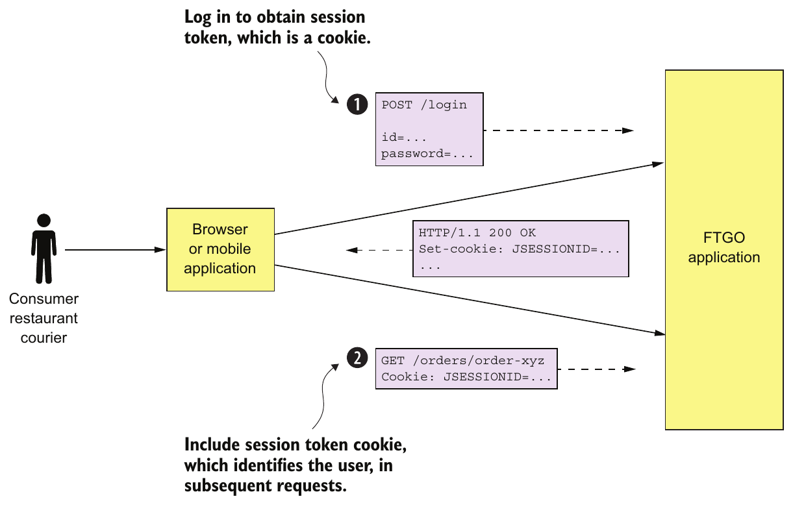

> **English:** Figure 11.1 A client of the FTGO application first logs in to obtain a session token, which is often a cookie. The client includes the session token in each subsequent request it makes to the application.
>
> **Türkçe:** Şekil 11.1 FTGO uygulamasının istemcisi, çoğunlukla bir cookie olan oturum belirtecini almak için önce oturum açar. İstemci, uygulamaya yaptığı sonraki her isteğe oturum belirtecini ekler.

<!-- source-record: u11_0026 -->

### Using a security framework — Bir güvenlik framework'ü kullanma

<!-- source-record: u11_0027 -->

> **English:** Implementing authentication and authorization correctly is challenging. It’s best to use a proven security framework. Which framework to use depends on your application’s technology stack. Some popular frameworks include the following:
>
> **Türkçe:** Kimlik doğrulama ve yetkilendirmeyi doğru gerçekleştirmek zordur. Kendini kanıtlamış bir güvenlik framework'ü kullanmak en iyisidir. Seçilecek framework, uygulamanızın teknoloji yığınına bağlıdır. Yaygın framework'lerden bazıları şunlardır:

<!-- source-record: u11_0028 -->

> **English:** • Spring Security (https://projects.spring.io/spring-security/)—A popular framework for Java applications. It’s a sophisticated framework that handles authentication and authorization.
>
> **Türkçe:** • Spring Security (https://projects.spring.io/spring-security/) — Java uygulamaları için yaygın bir framework. Kimlik doğrulama ve yetkilendirmeyi ele alan gelişmiş bir framework'tür.

<!-- source-record: u11_0029 -->

> **English:** • Apache Shiro (https://shiro.apache.org)—Another Java framework.
>
> **Türkçe:** • Apache Shiro (https://shiro.apache.org) — Java için bir başka framework.

<!-- source-record: u11_0030 -->

> **English:** • Passport (http://www.passportjs.org)—A popular security framework for NodeJS applications that’s focused on authentication.
>
> **Türkçe:** • Passport (http://www.passportjs.org) — NodeJS uygulamaları için kimlik doğrulamaya odaklanan yaygın bir güvenlik framework'ü.

<!-- source-record: u11_0031 -->

> **English:** One key part of the security architecture is the session, which stores the principal’s ID and roles. The FTGO application is a traditional Java EE application, so the session is an HttpSession in-memory session. A session is identified by a session token, which the client includes in each request. It’s usually an opaque token such as a cryptographically strong random number. The FTGO application’s session token is an HTTP cookie called JSESSIONID.
>
> **Türkçe:** Güvenlik mimarisinin temel parçalarından biri, principal'ın kimliğini ve rollerini saklayan session'dır (oturum). FTGO uygulaması geleneksel bir Java EE uygulaması olduğundan oturum, bellekte tutulan bir HttpSession'dır. Oturum, istemcinin her isteğe eklediği bir oturum belirteciyle tanımlanır. Bu belirteç genellikle kriptografik olarak güçlü rastgele bir sayı gibi opaque token'dır (içeriği istemci açısından anlam taşımayan belirteç). FTGO uygulamasının oturum belirteci JSESSIONID adlı bir HTTP cookie'sidir.

<!-- source-record: u11_0032 -->

> **English:** The other key part of the security implementation is the security context, which stores information about the user making the current request. The Spring Security framework uses the standard Java EE approach of storing the security context in a static, thread-local variable, which is readily accessible to any code that’s invoked to handle the request. A request handler can call SecurityContextHolder.getContext().getAuthentication() to obtain information about the current user, such as their identity and roles. In contrast, the Passport framework stores the security context as the user attribute of the request.
>
> **Türkçe:** Güvenlik gerçekleştiriminin diğer temel parçası, mevcut isteği gönderen kullanıcıya ilişkin bilgileri tutan security context'tir (güvenlik bağlamı). Spring Security framework'ü, güvenlik bağlamını static bir thread-local değişkende tutan standart Java EE yaklaşımını kullanır; isteği işlemek üzere çağrılan tüm kodlar buna kolayca erişebilir. Bir request handler, mevcut kullanıcının kimliği ve rolleri gibi bilgileri almak için SecurityContextHolder.getContext().getAuthentication() çağrısını yapabilir. Buna karşılık Passport framework'ü güvenlik bağlamını isteğin user özelliğinde tutar.

<!-- source-pages: 352 -->

<!-- source-record: u11_0033 -->

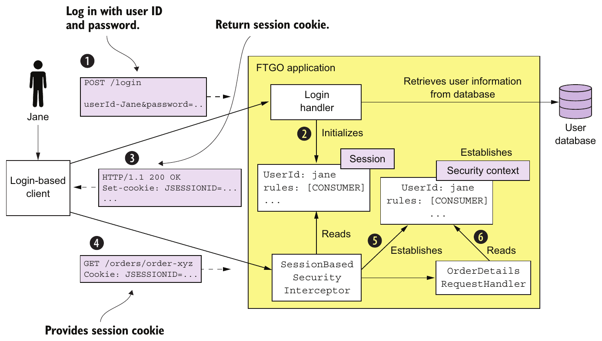

> **English:** Figure 11.2 When a client of the FTGO application makes a login request, Login Handler authenticates the user, initializes the session user information, and returns a session token cookie, which securely identifies the session. Next, when the client makes a request containing the session token, SessionBasedSecurityInterceptor retrieves the user information from the specified session and establishes the security context. Request handlers, such as OrderDetailsRequestHandler, retrieve the user information from the security context.
>
> **Türkçe:** Şekil 11.2 FTGO uygulamasının istemcisi bir oturum açma isteği gönderdiğinde Login Handler kullanıcının kimliğini doğrular, oturumdaki kullanıcı bilgilerini başlatır ve oturumu güvenli biçimde tanımlayan bir oturum belirteci cookie'si döndürür. Ardından istemci bu belirteci içeren bir istek gönderdiğinde SessionBasedSecurityInterceptor, belirtilen oturumdan kullanıcı bilgilerini alır ve güvenlik bağlamını oluşturur. OrderDetailsRequestHandler gibi request handler'lar kullanıcı bilgilerini bu bağlamdan alır.

<!-- source-record: u11_0034 -->

> **English:** The sequence of events shown in Figure 11.2 is as follows:
>
> **Türkçe:** Şekil 11.2'de gösterilen olay sırası şöyledir:

<!-- source-record: u11_0035 -->

> **English:** 1 The client makes a login request to the FTGO application.
>
> **Türkçe:** 1 İstemci FTGO uygulamasına bir oturum açma isteği gönderir.

<!-- source-record: u11_0036 -->

> **English:** 2 The login request is handled by LoginHandler, which verifies the credentials, creates the session, and stores information about the principal in the session.
>
> **Türkçe:** 2 Bu isteği işleyen LoginHandler kimlik bilgilerini doğrular, oturumu oluşturur ve principal'a ilişkin bilgileri oturumda saklar.

<!-- source-record: u11_0037 -->

> **English:** 3 Login Handler returns a session token to the client.
>
> **Türkçe:** 3 Login Handler istemciye bir oturum belirteci döndürür.

<!-- source-record: u11_0038 -->

> **English:** 4 The client includes the session token in requests that invoke operations.
>
> **Türkçe:** 4 İstemci, işlemleri çağıran isteklerine oturum belirtecini ekler.

<!-- source-record: u11_0039 -->

> **English:** 5 These requests are first processed by SessionBasedSecurityInterceptor. The interceptor authenticates each request by verifying the session token and establishes a security context. The security context describes the principal and its roles.
>
> **Türkçe:** 5 Bu istekler önce SessionBasedSecurityInterceptor tarafından işlenir. Interceptor, oturum belirtecini doğrulayarak her isteğin kimlik doğrulamasını yapar ve bir güvenlik bağlamı oluşturur. Bu bağlam principal'ı ve rollerini tanımlar.

<!-- source-pages: 353 -->

<!-- source-record: u11_0040 -->

> **English:** 6 A request handler uses the security context to determine whether to allow a user to perform the requested operation and obtain their identity.
>
> **Türkçe:** 6 Request handler, kullanıcının istenen işlemi yapmasına izin verilip verilmeyeceğini belirlemek ve kullanıcının kimliğini almak için güvenlik bağlamını kullanır.

<!-- source-record: u11_0041 -->

> **English:** The FTGO application uses role-based authorization. It defines several roles corresponding to the different kinds of users, including CONSUMER, RESTAURANT, COURIER, and ADMIN. It uses Spring Security’s declarative security mechanism to restrict access to URLs and service methods to specific roles. Roles are also interwoven into the business logic. For example, a consumer can only access their orders, whereas an administrator can access all orders.
>
> **Türkçe:** FTGO uygulaması rol tabanlı yetkilendirme kullanır. CONSUMER, RESTAURANT, COURIER ve ADMIN dâhil farklı kullanıcı türlerine karşılık gelen çeşitli roller tanımlar. URL'lere ve servis metotlarına erişimi belirli rollerle sınırlamak için Spring Security'nin bildirimsel güvenlik mekanizmasını kullanır. Roller iş mantığına da işlenmiştir. Örneğin bir tüketici yalnızca kendi siparişlerine erişebilirken yönetici tüm siparişlere erişebilir.

<!-- source-record: u11_0042 -->

> **English:** The security design used by the monolithic FTGO application is only one possible way to implement security. For example, one drawback of using an in-memory session is that it requires all requests for a particular session to be routed to the same application instance. This requirement complicates load balancing and operations. You must, for example, implement a session draining mechanism that waits for all sessions to expire before shutting down an application instance. An alternative approach, which avoids these problems, is to store the session in a database.
>
> **Türkçe:** Monolitik FTGO uygulamasının güvenlik tasarımı, güvenliği sağlamanın olası yollarından yalnızca biridir. Örneğin bellekte oturum tutmanın bir dezavantajı, belirli bir oturuma ait tüm isteklerin aynı uygulama örneğine yönlendirilmesini gerektirmesidir. Bu gereksinim yük dengelemeyi ve operasyonları karmaşıklaştırır. Örneğin bir uygulama örneğini kapatmadan önce tüm oturumların süresinin dolmasını bekleyen bir session draining (oturumları sonlandırarak boşaltma) mekanizması kurmalısınız. Bu sorunları önleyen alternatif yaklaşım, oturumu veritabanında saklamaktır.

<!-- source-record: u11_0043 -->

> **English:** You can sometimes eliminate the server-side session entirely. For example, many applications have API clients that provide their credentials, such as an API key and secret, in every request. As a result, there’s no need to maintain a server-side session. Alternatively, the application can store session state in the session token. Later in this section, I describe one way to use a session token to store the session state. But let’s begin by looking at the challenges of implementing security in a microservice architecture.
>
> **Türkçe:** Bazen sunucu tarafındaki oturumu tamamen kaldırabilirsiniz. Örneğin birçok uygulamada, her istekte API anahtarı ve sırrı gibi kimlik bilgilerini sunan API istemcileri bulunur. Böylece sunucu tarafında oturum tutmaya gerek kalmaz. Alternatif olarak uygulama, oturum durumunu oturum belirtecinin içinde saklayabilir. Bu kısmın ilerleyen bölümünde oturum durumunu belirteçte saklamanın bir yolunu anlatıyorum. Önce mikroservis mimarisinde güvenliği gerçekleştirmenin güçlüklerine bakalım.

<!-- source-record: u11_0044 -->

### 11.1.2 Implementing security in a microservice architecture — Mikroservis mimarisinde güvenliği uygulama

<!-- source-record: u11_0045 -->

> **English:** A microservice architecture is a distributed architecture. Each external request is handled by the API gateway and at least one service. Consider, for example, the getOrderDetails() query, discussed in chapter 8. The API gateway handles this query by invoking several services, including Order Service, Kitchen Service, and Accounting Service. Each service must implement some aspects of security. For instance, Order Service must only allow a consumer to see their orders, which requires a combination of authentication and authorization. In order to implement security in a microservice architecture we need to determine who is responsible for authenticating the user and who is responsible for authorization.
>
> **Türkçe:** Mikroservis mimarisi dağıtık bir mimaridir. Her haricî istek API gateway ve en az bir servis tarafından işlenir. Örneğin 8. bölümde ele alınan getOrderDetails() sorgusunu düşünün. API gateway bu sorguyu Order Service, Kitchen Service ve Accounting Service dâhil çeşitli servisleri çağırarak işler. Her servis güvenliğin bazı yönlerini gerçekleştirmelidir. Örneğin Order Service, tüketicinin yalnızca kendi siparişlerini görmesine izin vermelidir; bunun için kimlik doğrulama ve yetkilendirme birlikte gerekir. Mikroservis mimarisinde güvenliği sağlamak için kullanıcının kimliğini kimin doğrulayacağını ve yetkilendirmeden kimin sorumlu olacağını belirlemeliyiz.

<!-- source-record: u11_0046 -->

> **English:** One challenge with implementing security in a microservices application is that we can’t just copy the design from a monolithic application. That’s because two aspects of the monolithic application’s security architecture are nonstarters for a microservice architecture:
>
> **Türkçe:** Mikroservis uygulamasında güvenliği sağlamanın güçlüklerinden biri, monolitik uygulamanın tasarımını olduğu gibi kopyalayamamamızdır. Bunun nedeni, monolitik uygulamanın güvenlik mimarisindeki iki unsurun mikroservis mimarisine uygun olmamasıdır:

<!-- source-record: u11_0047 -->

> **English:** • In-memory security context—Using an in-memory security context, such as a thread-local, to pass around user identity. Services can’t share memory, so they can’t use an in-memory security context, such as a thread-local, to pass around the user identity. In a microservice architecture, we need a different mechanism for passing user identity from one service to another.
>
> **Türkçe:** • Bellekteki güvenlik bağlamı — Kullanıcı kimliğini aktarmak için thread-local gibi bellekte tutulan bir güvenlik bağlamı kullanılması. Servisler belleği paylaşamadığından kullanıcı kimliğini birbirlerine aktarmak için böyle bir bağlamı kullanamaz. Mikroservis mimarisinde kullanıcı kimliğini bir servisten diğerine geçirmek için farklı bir mekanizma gerekir.

<!-- source-pages: 354 -->

<!-- source-record: u11_0048 -->

> **English:** • Centralized session —Because an in-memory security context doesn’t make sense, neither does an in-memory session. In theory, multiple services could access a database-based session, except that it would violate the principle of loose coupling. We need a different session mechanism in a microservice architecture.
>
> **Türkçe:** • Merkezî oturum — Bellekteki güvenlik bağlamı servisler arasında anlamlı olmadığından bellekteki oturum da değildir. Teoride birden fazla servis veritabanında saklanan oturuma erişebilir; ancak bu, gevşek bağlılık ilkesini ihlal eder. Mikroservis mimarisinde farklı bir oturum mekanizmasına ihtiyaç vardır.

<!-- source-record: u11_0049 -->

> **English:** Let’s begin our exploration of security in a microservice architecture by looking at how to handle authentication.
>
> **Türkçe:** Mikroservis mimarisindeki güvenlik incelememize kimlik doğrulamanın nasıl ele alınacağına bakarak başlayalım.

<!-- source-record: u11_0050 -->

#### HANDLING AUTHENTICATION IN THE API GATEWAY — API GATEWAY'DE KİMLİK DOĞRULAMA

<!-- source-record: u11_0051 -->

> **English:** There are a couple of different ways to handle authentication. One option is for the individual services to authenticate the user. The problem with this approach is that it permits unauthenticated requests to enter the internal network. It relies on every development team correctly implementing security in all of their services. As a result, there’s a significant risk of an application containing security vulnerabilities.
>
> **Türkçe:** Kimlik doğrulamayı ele almanın birkaç farklı yolu vardır. Bir seçenek, kullanıcının kimliğini her bir servisin doğrulamasıdır. Bu yaklaşımın sorunu, kimliği doğrulanmamış isteklerin iç ağa girmesine izin vermesidir. Her geliştirme ekibinin tüm servislerinde güvenliği doğru uygulamasına dayanır. Sonuç olarak uygulamada güvenlik açıkları bulunma riski kayda değerdir.

<!-- source-record: u11_0052 -->

> **English:** Another problem with implementing authentication in the services is that different clients authenticate in different ways. Pure API clients supply credentials with each request using, for example, basic authentication. Other clients might first log in and then supply a session token with each request. We want to avoid requiring services to handle a diverse set of authentication mechanisms.
>
> **Türkçe:** Kimlik doğrulamayı servislerde gerçekleştirmenin başka bir sorunu, farklı istemcilerin farklı yollarla kimlik doğrulamasıdır. Yalnızca API kullanan istemciler, örneğin basic authentication ile her istekte kimlik bilgileri gönderir. Diğer istemciler önce oturum açıp sonra her istekte bir oturum belirteci sunabilir. Servislerin çeşitli kimlik doğrulama mekanizmalarını ele almak zorunda kalmasını istemeyiz.

<!-- source-record: u11_0053 -->

> **English:** A better approach is for the API gateway to authenticate a request before forwarding it to the services. Centralizing API authentication in the API gateway has the advantage that there’s only one place to get right. As a result, there’s a much smaller chance of a security vulnerability. Another benefit is that only the API gateway has to deal with the various different authentication mechanisms. It hides this complexity from the services.
>
> **Türkçe:** Daha iyi yaklaşım, API gateway'in isteği servislere iletmeden önce kimlik doğrulamasını yapmasıdır. API kimlik doğrulamasını gateway'de merkezîleştirmenin avantajı, doğru gerçekleştirilmesi gereken tek bir yer olmasıdır. Böylece güvenlik açığı olasılığı çok daha düşer. Diğer yararı ise çeşitli kimlik doğrulama mekanizmalarıyla yalnızca API gateway'in ilgilenmesi ve bu karmaşıklığı servislerden gizlemesidir.

<!-- source-record: u11_0054 -->

> **English:** Figure 11.3 shows how this approach works. Clients authenticate with the API gateway. API clients include credentials in each request. Login-based clients POST the user’s credentials to the API gateway’s authentication and receive a session token. Once the API gateway has authenticated a request, it invokes one or more services.
>
> **Türkçe:** Şekil 11.3 bu yaklaşımın işleyişini gösterir. İstemciler API gateway üzerinden kimlik doğrular. API istemcileri her isteğe kimlik bilgilerini ekler. Oturum açmaya dayalı istemciler, kullanıcının kimlik bilgilerini API gateway'in kimlik doğrulama uç noktasına POST eder ve bir oturum belirteci alır. Gateway bir isteğin kimliğini doğruladıktan sonra bir veya daha fazla servisi çağırır.

<!-- source-record: u11_0055 -->

### Pattern: Access token — Örüntü: Access token (erişim belirteci)

<!-- source-record: u11_0056 -->

> **English:** The API gateway passes a token containing information about the user, such as their identity and their roles, to the services that it invokes. See http://microservices.io/patterns/security/access-token.html.
>
> **Türkçe:** API gateway, çağırdığı servislere kullanıcının kimliği ve rolleri gibi bilgileri içeren bir belirteç aktarır. Bkz. http://microservices.io/patterns/security/access-token.html.

<!-- source-record: u11_0057 -->

> **English:** A service invoked by the API gateway needs to know the principal making the request. It must also verify that the request has been authenticated. The solution is for the API gateway to include a token in each service request. The service uses the token to validate the request and obtain information about the principal. The API gateway might also give the same token to session-oriented clients to use as the session token.
>
> **Türkçe:** API gateway'in çağırdığı servis, isteği yapan principal'ı bilmelidir. İsteğin kimliğinin doğrulandığını da denetlemelidir. Çözüm, API gateway'in her servis isteğine bir belirteç eklemesidir. Servis bu belirteci isteği doğrulamak ve principal hakkında bilgi almak için kullanır. API gateway, aynı belirteci oturum odaklı istemcilere oturum belirteci olarak kullanmaları için de verebilir.

<!-- source-pages: 355 -->

<!-- source-record: u11_0058 -->

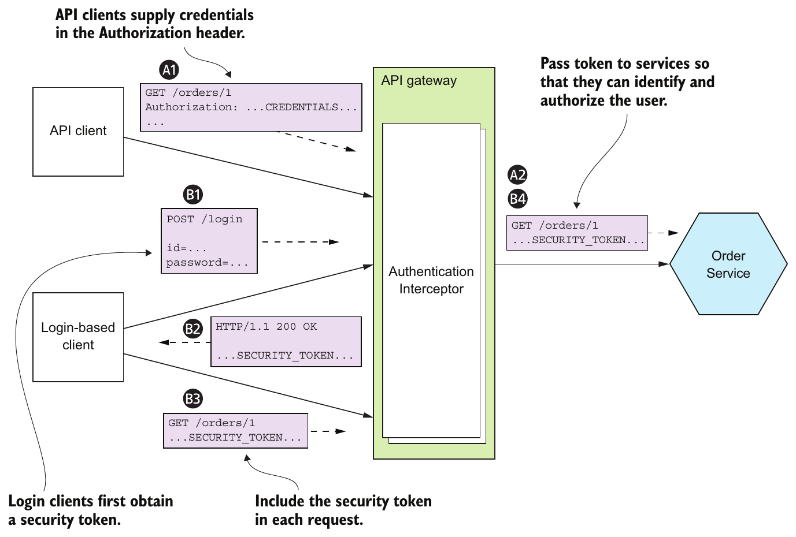

> **English:** Figure 11.3 The API gateway authenticates requests from clients and includes a security token in the requests it makes to services. The services use the token to obtain information about the principal. The API gateway can also use the security token as a session token.
>
> **Türkçe:** Şekil 11.3 API gateway, istemcilerden gelen isteklerin kimliğini doğrular ve servislere gönderdiği isteklere bir güvenlik belirteci ekler. Servisler principal hakkında bilgi edinmek için bu belirteci kullanır. API gateway güvenlik belirtecini oturum belirteci olarak da kullanabilir.

<!-- source-record: u11_0059 -->

> **English:** The sequence of events for API clients is as follows:
>
> **Türkçe:** API istemcileri için olay sırası şöyledir:

<!-- source-record: u11_0060 -->

> **English:** 1 A client makes a request containing credentials.
>
> **Türkçe:** 1 İstemci, kimlik bilgilerini içeren bir istek gönderir.

<!-- source-record: u11_0061 -->

> **English:** 2 The API gateway authenticates the credentials, creates a security token, and passes that to the service or services.
>
> **Türkçe:** 2 API gateway kimlik bilgilerini doğrular, bir güvenlik belirteci oluşturur ve bunu servise ya da servislere aktarır.

<!-- source-record: u11_0062 -->

> **English:** The sequence of events for login-based clients is as follows:
>
> **Türkçe:** Oturum açmaya dayalı istemciler için olay sırası şöyledir:

<!-- source-record: u11_0063 -->

> **English:** 1 A client makes a login request containing credentials.
>
> **Türkçe:** 1 İstemci, kimlik bilgilerini içeren bir oturum açma isteği gönderir.

<!-- source-record: u11_0064 -->

> **English:** 2 The API gateway returns a security token.
>
> **Türkçe:** 2 API gateway bir güvenlik belirteci döndürür.

<!-- source-record: u11_0065 -->

> **English:** 3 The client includes the security token in requests that invoke operations.
>
> **Türkçe:** 3 İstemci, işlemleri çağıran isteklere güvenlik belirtecini ekler.

<!-- source-record: u11_0066 -->

> **English:** 4 The API gateway validates the security token and forwards it to the service or services.
>
> **Türkçe:** 4 API gateway güvenlik belirtecini doğrular ve servise ya da servislere iletir.

<!-- source-record: u11_0067 -->

> **English:** A little later in this chapter, I describe how to implement tokens, but let’s first look at the other main aspect of security: authorization.
>
> **Türkçe:** Bu bölümün biraz ilerisinde belirteçlerin nasıl gerçekleştirileceğini anlatıyorum; ancak önce güvenliğin diğer ana yönüne, yetkilendirmeye bakalım.

<!-- source-pages: 356 -->

<!-- source-record: u11_0068 -->

#### HANDLING AUTHORIZATION — YETKİLENDİRMEYİ ELE ALMA

<!-- source-record: u11_0069 -->

> **English:** Authenticating a client’s credentials is important but insufficient. An application must also implement an authorization mechanism that verifies that the client is allowed to perform the requested operation. For example, in the FTGO application the getOrderDetails() query can only be invoked by the consumer who placed the Order (an example of instance-based security) and a customer service agent who is helping the consumer.
>
> **Türkçe:** İstemcinin kimlik bilgilerini doğrulamak önemlidir fakat yeterli değildir. Uygulama, istemcinin istenen işlemi yapmasına izin verildiğini doğrulayan bir yetkilendirme mekanizması da uygulamalıdır. Örneğin FTGO uygulamasında getOrderDetails() sorgusunu yalnızca Order'ı veren tüketici — nesne örneği düzeyinde güvenliğe bir örnek — ve tüketiciye yardımcı olan müşteri hizmetleri temsilcisi çağırabilir.

<!-- source-record: u11_0070 -->

> **English:** One place to implement authorization is the API gateway. It can, for example, restrict access to GET /orders/{orderId} to only users who are consumers and customer service agents. If a user isn’t allowed to access a particular path, the API gateway can reject the request before forwarding it on to the service. As with authentication, centralizing authorization within the API gateway reduces the risk of security vulnerabilities. You can implement authorization in the API gateway using a security framework, such as Spring Security.
>
> **Türkçe:** Yetkilendirmenin uygulanabileceği yerlerden biri API gateway'dir. Örneğin GET /orders/{orderId} erişimini yalnızca tüketici ve müşteri hizmetleri temsilcisi olan kullanıcılarla sınırlayabilir. Kullanıcının belirli bir yola erişim izni yoksa API gateway isteği servise iletmeden reddedebilir. Kimlik doğrulamada olduğu gibi yetkilendirmeyi de API gateway'de merkezîleştirmek güvenlik açığı riskini azaltır. Gateway'de yetkilendirmeyi Spring Security gibi bir güvenlik framework'üyle uygulayabilirsiniz.

<!-- source-record: u11_0071 -->

> **English:** One drawback of implementing authorization in the API gateway is that it risks coupling the API gateway to the services, requiring them to be updated in lockstep. What’s more, the API gateway can typically only implement role-based access to URL paths. It’s generally not practical for the API gateway to implement ACLs that control access to individual domain objects, because that requires detailed knowledge of a service’s domain logic.
>
> **Türkçe:** Yetkilendirmeyi API gateway'de gerçekleştirmenin bir dezavantajı, gateway ile servisleri birbirine bağlayarak birlikte güncellenmelerini gerektirme riskidir. Üstelik API gateway genellikle yalnızca URL yollarına rol tabanlı erişimi uygulayabilir. Tek tek alan nesnelerine erişimi denetleyen ACL'leri gateway'de gerçekleştirmek genellikle pratik değildir; çünkü bunun için servisin alan mantığının ayrıntılı bilinmesi gerekir.

<!-- source-record: u11_0072 -->

> **English:** The other place to implement authorization is in the services. A service can implement role-based authorization for URLs and for service methods. It can also implement ACLs to manage access to aggregates. Order Service can, for example, implement the role-based and ACL-based authorization mechanism for controlling access to orders. Other services in the FTGO application implement similar authorization logic.
>
> **Türkçe:** Yetkilendirmenin gerçekleştirilebileceği diğer yer servislerdir. Bir servis, URL'ler ve servis metotları için rol tabanlı yetkilendirme uygulayabilir. Aggregate'lere erişimi yönetmek için ACL'ler de uygulayabilir. Örneğin Order Service, siparişlere erişimi kontrol eden rol ve ACL tabanlı yetkilendirme mekanizmasını gerçekleştirebilir. FTGO uygulamasındaki diğer servisler de benzer yetkilendirme mantığı uygular.

<!-- source-record: u11_0073 -->

#### USING JWTS TO PASS USER IDENTITY AND ROLES — KULLANICI KİMLİĞİNİ VE ROLLERİNİ JWT İLE AKTARMA

<!-- source-record: u11_0074 -->

> **English:** When implementing security in a microservice architecture, you need to decide which type of token an API gateway should use to pass user information to the services. There are two types of tokens to choose from. One option is to use opaque tokens, which are typically UUIDs. The downside of opaque tokens is that they reduce performance and availability and increase latency. That’s because the recipient of such a token must make a synchronous RPC call to a security service to validate the token and retrieve the user information.
>
> **Türkçe:** Mikroservis mimarisinde güvenliği sağlarken API gateway'in kullanıcı bilgilerini servislere aktarmak için hangi belirteç türünü kullanacağına karar vermelisiniz. İki tür arasından seçim yapılabilir. Bir seçenek, genellikle UUID olan opaque token'ları kullanmaktır. Bunların dezavantajı performansı ve kullanılabilirliği azaltıp gecikmeyi artırmalarıdır. Çünkü böyle bir belirteci alan taraf, onu doğrulamak ve kullanıcı bilgilerini almak için bir güvenlik servisine senkron RPC çağrısı yapmalıdır.

<!-- source-record: u11_0075 -->

> **English:** An alternative approach, which eliminates the call to the security service, is to use a transparent token containing information about the user. One such popular standard for transparent tokens is the JSON Web Token (JWT). JWT is standard way to securely represent claims, such as user identity and roles, between two parties. A JWT has a payload, which is a JSON object that contains information about the user, such as their identity and roles, and other metadata, such as an expiration date. It’s signed with a secret that’s only known to the creator of the JWT, such as the API gateway and the recipient of the JWT, such as a service. The secret ensures that a malicious third party can’t forge or tamper with a JWT.
>
> **Türkçe:** Güvenlik servisine çağrıyı ortadan kaldıran alternatif yaklaşım, kullanıcı bilgilerini içinde taşıyan, içeriği okunabilir bir belirteç kullanmaktır. Bu tür belirteçler için yaygın standartlardan biri JSON Web Token'dır (JWT). JWT, kullanıcı kimliği ve rolleri gibi claim'leri (beyanları) iki taraf arasında güvenli biçimde temsil etmenin standart bir yoludur. JWT'nin payload'ı (veri yükü), kullanıcı kimliği ve rolleri gibi bilgilerin yanı sıra son kullanma zamanı gibi diğer üst verileri içeren bir JSON nesnesidir. Bu belirteç, API gateway gibi JWT'yi oluşturan taraf ile servis gibi alıcı tarafın bildiği bir sırla imzalanır. Bu sır, kötü niyetli üçüncü bir tarafın JWT üretmesini veya JWT üzerinde oynama yapmasını engeller.

> **Teknik not — JWT imzası:** Kaynak burada ortak sırla doğrulanan HMAC örneğini anlatır. JWT yalnızca bu yönteme bağlı değildir; JWS dijital imza/MAC, JWE ise şifreleme sağlayabilir. İmzalı bir belirteç, içeriğinin gizli olduğu anlamına gelmez. [RFC 7519, bölüm 3](https://www.rfc-editor.org/rfc/rfc7519.html#section-3).

<!-- source-pages: 357 -->

<!-- source-record: u11_0076 -->

> **English:** One issue with JWT is that because a token is self-contained, it’s irrevocable. By design, a service will perform the request operation after verifying the JWT’s signature and expiration date. As a result, there’s no practical way to revoke an individual JWT that has fallen into the hands of a malicious third party. The solution is to issue JWTs with short expiration times, because that limits what a malicious party could do. One drawback of short-lived JWTs, though, is that the application must somehow continually reissue JWTs to keep the session active. Fortunately, this is one of the many protocols that are solved by a security standard calling OAuth 2.0. Let’s look at how that works.
>
> **Türkçe:** JWT ile ilgili bir sorun, belirtecin kendi kendine yeterli olması nedeniyle geri alınamamasıdır. Tasarım gereği servis, JWT'nin imzasını ve son kullanma zamanını doğruladıktan sonra istenen işlemi yapar. Dolayısıyla kötü niyetli bir üçüncü tarafın eline geçen tek bir JWT'yi iptal etmenin pratik bir yolu yoktur. Çözüm, kötü niyetli tarafın yapabileceklerini sınırlamak için kısa süreli JWT'ler vermektir. Ancak kısa ömürlü JWT'lerin bir dezavantajı, oturumu etkin tutmak için uygulamanın bir şekilde sürekli yeni JWT'ler vermek zorunda olmasıdır. Neyse ki bu, OAuth 2.0 adlı güvenlik standardının çözdüğü birçok protokolden biridir. Bunun nasıl çalıştığına bakalım.

> **Teknik not — iptal sınırı:** “İptal edilemez” ifadesi, yalnızca yerel imza ve süre kontrolü yapan durumsuz doğrulama modeline aittir. Kendine yeterli belirteçlerin anında iptali ek sunucu iletişimi/durum takibiyle tasarlanabilir; kısa ömür ise iptal bilgisinin yokluğunda kalan kullanım süresini sınırlar. [RFC 7009, bölüm 3](https://www.rfc-editor.org/rfc/rfc7009.html#section-3).

<!-- source-record: u11_0077 -->

#### USING OAUTH 2.0 IN A MICROSERVICE ARCHITECTURE — MİKROSERVİS MİMARİSİNDE OAUTH 2.0 KULLANMA

<!-- source-record: u11_0078 -->

> **English:** Let’s say you want to implement a User Service for the FTGO application that manages a user database containing user information, such as credentials and roles. The API gateway calls the User Service to authenticate a client request and obtain a JWT. You could design a User Service API and implement it using your favorite web framework. But that’s generic functionality that isn’t specific to the FTGO application— developing such a service wouldn’t be an efficient use of development resources.
>
> **Türkçe:** FTGO uygulaması için kullanıcıların kimlik bilgileri ve rolleri gibi verileri içeren bir kullanıcı veritabanını yöneten User Service geliştirmek istediğinizi varsayalım. API gateway, istemci isteğinin kimliğini doğrulamak ve bir JWT almak için User Service'i çağırır. Bir User Service API'si tasarlayıp sevdiğiniz web framework'üyle gerçekleştirebilirsiniz. Ancak bu, FTGO uygulamasına özgü olmayan genel bir işlevdir; böyle bir servis geliştirmek, geliştirme kaynaklarının verimli kullanımı olmaz.

<!-- source-record: u11_0079 -->

> **English:** Fortunately, you don’t need to develop this kind of security infrastructure. You can use an off-the-shelf service or framework that implements a standard called OAuth 2.0. OAuth 2.0 is an authorization protocol that was originally designed to enable a user of a public cloud service, such as GitHub or Google, to grant a third-party application access to its information without revealing its password. For example, OAuth 2.0 is the mechanism that enables you to securely grant a third party cloud-based Continuous Integration (CI) service access to your GitHub repository.
>
> **Türkçe:** Neyse ki bu tür bir güvenlik altyapısı geliştirmeniz gerekmez. OAuth 2.0 adlı standardı uygulayan hazır bir servis veya framework kullanabilirsiniz. OAuth 2.0, başlangıçta GitHub veya Google gibi genel bulut servislerinin kullanıcılarının parolalarını açıklamadan üçüncü taraf uygulamalara kendi bilgilerine erişim izni vermesini sağlamak için tasarlanmış bir yetkilendirme protokolüdür. Örneğin bulut tabanlı üçüncü taraf bir Continuous Integration (CI, sürekli entegrasyon) servisine GitHub deponuza güvenli erişim izni vermenizi sağlayan mekanizma OAuth 2.0'dır.

<!-- source-record: u11_0080 -->

> **English:** Although the original focus of OAuth 2.0 was authorizing access to public cloud services, you can also use it for authentication and authorization in your application. Let’s take a quick look at how a microservice architecture might use OAuth 2.0.
>
> **Türkçe:** OAuth 2.0 başlangıçta genel bulut servislerine erişimi yetkilendirmeye odaklansa da uygulamanızda kimlik doğrulama ve yetkilendirme için de kullanılabilir. Mikroservis mimarisinin OAuth 2.0'ı nasıl kullanabileceğine kısaca bakalım.

> **Teknik not — authentication / authorization:** OAuth 2.0 bir yetkilendirme çerçevesidir. Standart kullanıcı kimlik doğrulama katmanı **OpenID Connect** ile eklenir. Kaynağın bu iki kavramı birlikte kullandığı cümleleri okurken access token ile kimlik doğrulama sonucunu aynı şey saymayın. [OpenID Connect Core](https://openid.net/specs/openid-connect-core-1_0.html#Introduction).

<!-- source-record: u11_0081 -->

### About OAuth 2.0 — OAuth 2.0 hakkında

<!-- source-record: u11_0082 -->

> **English:** OAuth 2.0 is a complex topic. In this chapter, I can only provide a brief overview and describe how it can be used in a microservice architecture. For more information on OAuth 2.0, check out the online book OAuth 2.0 Servers by Aaron Parecki (www.oauth.com). Chapter 7 of Spring Microservices in Action (Manning, 2017) also covers this topic (https://livebook.manning.com/#!/book/spring-microservices-inaction/chapter-7/).
>
> **Türkçe:** OAuth 2.0 karmaşık bir konudur. Bu bölümde ancak kısa bir genel bakış sunabilir ve mikroservis mimarisinde nasıl kullanılabileceğini anlatabilirim. Daha fazla bilgi için Aaron Parecki'nin çevrim içi OAuth 2.0 Servers kitabına (www.oauth.com) bakabilirsiniz. Spring Microservices in Action (Manning, 2017) kitabının 7. bölümü de bu konuyu ele alır (https://livebook.manning.com/#!/book/spring-microservices-inaction/chapter-7/).

<!-- source-record: u11_0083 -->

> **English:** The key concepts in OAuth 2.0 are the following:
>
> **Türkçe:** OAuth 2.0'ın temel kavramları şunlardır:

<!-- source-record: u11_0084 -->

> **English:** • Authorization Server—Provides an API for authenticating users and obtaining an access token and a refresh token. Spring OAuth is a great example of a framework for building an OAuth 2.0 authorization server.
>
> **Türkçe:** • Authorization Server (yetkilendirme sunucusu) — Kullanıcıların kimliğini doğrulamak, access token (erişim belirteci) ve refresh token (yenileme belirteci) almak için bir API sağlar. Spring OAuth, OAuth 2.0 yetkilendirme sunucusu geliştirmeye yönelik framework'lere iyi bir örnektir.

<!-- source-record: u11_0085 -->

> **English:** • Access Token—A token that grants access to a Resource Server. The format of the access token is implementation dependent. But some implementations, such as Spring OAuth, use JWTs.
>
> **Türkçe:** • Access Token (erişim belirteci) — Resource Server'a erişim sağlayan belirteç. Biçimi gerçekleştirime bağlıdır. Spring OAuth gibi bazı gerçekleştirimler JWT kullanır.

<!-- source-pages: 358 -->

<!-- source-record: u11_0086 -->

> **English:** • Refresh Token—A long-lived yet revocable token that a Client uses to obtain a new AccessToken.
>
> **Türkçe:** • Refresh Token (yenileme belirteci) — Client'ın yeni bir AccessToken almak için kullandığı uzun ömürlü, ancak iptal edilebilir belirteç.

<!-- source-record: u11_0087 -->

> **English:** • Resource Server—A service that uses an access token to authorize access. In a microservice architecture, the services are resource servers.
>
> **Türkçe:** • Resource Server (kaynak sunucusu) — Erişimi yetkilendirmek için erişim belirteci kullanan servis. Mikroservis mimarisinde servisler kaynak sunucularıdır.

<!-- source-record: u11_0088 -->

> **English:** • Client—A client that wants to access a Resource Server. In a microservice architecture, API Gateway is the OAuth 2.0 client.
>
> **Türkçe:** • Client (istemci) — Resource Server'a erişmek isteyen istemci. Mikroservis mimarisinde API Gateway, OAuth 2.0 istemcisidir.

<!-- source-record: u11_0089 -->

> **English:** Later in this section, I describe how to support login-based clients. But first, let’s talk about how to authenticate API clients.
>
> **Türkçe:** Bu kısmın ilerleyen bölümünde oturum açmaya dayalı istemcilerin nasıl destekleneceğini anlatıyorum. Önce API istemcilerinin kimliğinin nasıl doğrulanacağına bakalım.

<!-- source-record: u11_0090 -->

> **English:** Figure 11.4 shows how the API gateway authenticates a request from an API client. The API gateway authenticates the API client by making a request to the OAuth 2.0 authorization server, which returns an access token. The API gateway then makes one or more requests containing the access token to the services.
>
> **Türkçe:** Şekil 11.4, API gateway'in API istemcisinden gelen isteğin kimliğini nasıl doğruladığını gösterir. API gateway, OAuth 2.0 yetkilendirme sunucusuna bir istek göndererek API istemcisinin kimliğini doğrular; sunucu bir erişim belirteci döndürür. Ardından gateway, servislere bu erişim belirtecini içeren bir veya daha fazla istek gönderir.

<!-- source-record: u11_0091 -->

> **English:** The sequence of events shown in figure 11.4 is as follows:
>
> **Türkçe:** Şekil 11.4'te gösterilen olay sırası şöyledir:

<!-- source-record: u11_0092 -->

> **English:** 1 The client makes a request, supplying its credentials using basic authentication.
>
> **Türkçe:** 1 İstemci, basic authentication kullanarak kimlik bilgilerini sunduğu bir istek gönderir.

<!-- source-record: u11_0093 -->

> **English:** 2 The API gateway makes an OAuth 2.0 Password Grant request (www.oauth.com/ oauth2-servers/access-tokens/password-grant/) to the OAuth 2.0 authentication server.
>
> **Türkçe:** 2 API gateway, OAuth 2.0 kimlik doğrulama sunucusuna bir OAuth 2.0 Password Grant isteği gönderir (www.oauth.com/oauth2-servers/access-tokens/password-grant/).

<!-- source-record: u11_0094 -->

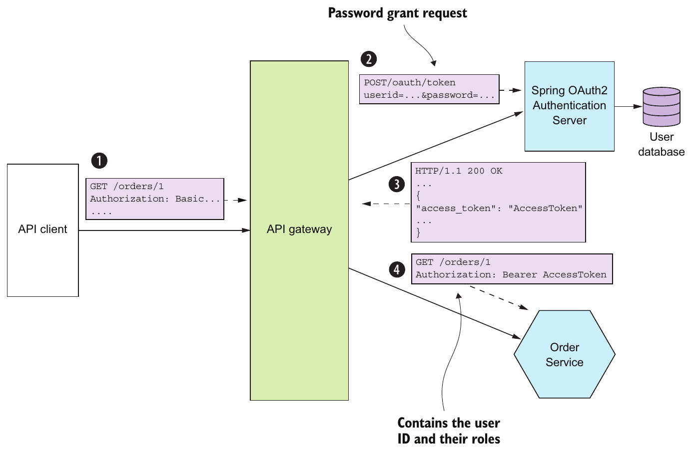

> **English:** Figure 11.4 An API gateway authenticates an API client by making a Password Grant request to the OAuth 2.0 authentication server. The server returns an access token, which the API gateway passes to the services. A service verifies the token’s signature and extracts information about the user, including their identity and roles.
>
> **Türkçe:** Şekil 11.4 API gateway, OAuth 2.0 kimlik doğrulama sunucusuna Password Grant isteği göndererek API istemcisinin kimliğini doğrular. Sunucu, gateway'in servislere aktardığı bir erişim belirteci döndürür. Servis belirtecin imzasını doğrular ve kullanıcının kimliği ile rolleri dâhil kullanıcı bilgilerini çıkarır.

> **Güncellik notu — tarihsel Password Grant örneği:** Şekil ve akış kitabın dönemindeki tasarımı korur. Güncel OAuth güvenlik uygulaması **Resource Owner Password Credentials Grant kullanılmamasını** şart koşar. Bu örnek yeni uygulama için kurulum önerisi değildir. [RFC 9700, bölüm 2.4](https://www.rfc-editor.org/rfc/rfc9700.html#section-2.4).

<!-- source-pages: 359 -->

<!-- source-record: u11_0095 -->

> **English:** 3 The authentication server validates the API client’s credentials and returns an access token and a refresh token.
>
> **Türkçe:** 3 Kimlik doğrulama sunucusu, API istemcisinin kimlik bilgilerini doğrular ve bir erişim belirteci ile bir yenileme belirteci döndürür.

<!-- source-record: u11_0096 -->

> **English:** 4 The API gateway includes the access token in the requests it makes to the services. A service validates the access token and uses it to authorize the request.
>
> **Türkçe:** 4 API gateway, servislere gönderdiği isteklere erişim belirtecini ekler. Servis bu belirteci doğrular ve isteği yetkilendirmek için kullanır.

<!-- source-record: u11_0097 -->

> **English:** An OAuth 2.0-based API gateway can authenticate session-oriented clients by using an OAuth 2.0 access token as a session token. What’s more, when the access token expires, it can obtain a new access token using the refresh token. Figure 11.5 shows how an API gateway can use OAuth 2.0 to handle session-oriented clients. An API client initiates a session by POSTing its credentials to the API gateway’s /login endpoint. The API gateway returns an access token and a refresh token to the client. The API client then supplies both tokens when it makes requests to the API gateway.
>
> **Türkçe:** OAuth 2.0 tabanlı API gateway, OAuth 2.0 erişim belirtecini oturum belirteci olarak kullanarak oturum odaklı istemcilerin kimliğini doğrulayabilir. Ayrıca erişim belirtecinin süresi dolduğunda yenileme belirteciyle yeni bir erişim belirteci alabilir. Şekil 11.5, gateway'in oturum odaklı istemcileri OAuth 2.0 ile nasıl ele alabileceğini gösterir. API istemcisi, kimlik bilgilerini gateway'in /login uç noktasına POST ederek oturum başlatır. Gateway istemciye bir erişim belirteci ve bir yenileme belirteci döndürür. API istemcisi daha sonra gateway'e istek gönderirken her iki belirteci de sunar.

<!-- source-record: u11_0098 -->

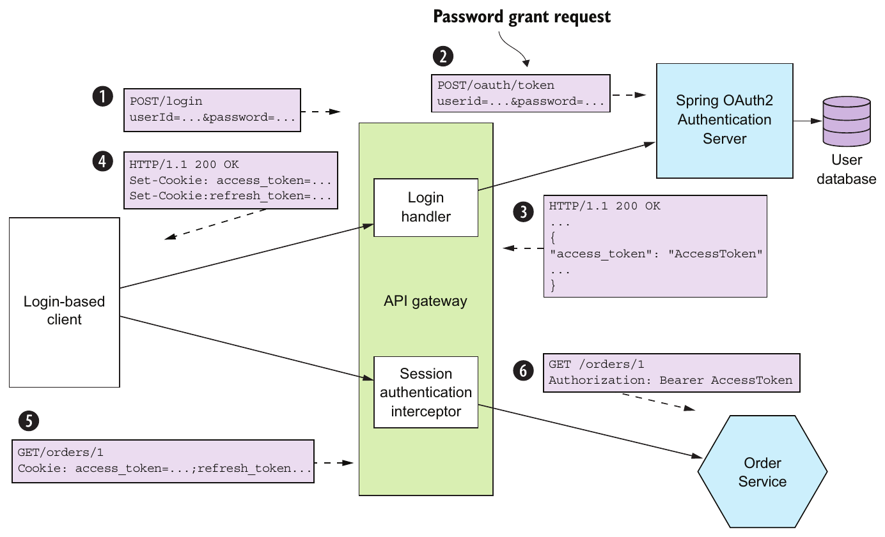

> **English:** Figure 11.5 A client logs in by POSTing its credentials to the API gateway. The API gateway authenticates the credentials using the OAuth 2.0 authentication server and returns the access token and refresh token as cookies. A client includes these tokens in the requests it makes to the API gateway.
>
> **Türkçe:** Şekil 11.5 İstemci, kimlik bilgilerini API gateway'e POST ederek oturum açar. Gateway, OAuth 2.0 kimlik doğrulama sunucusuyla bu bilgileri doğrular ve erişim ile yenileme belirteçlerini cookie olarak döndürür. İstemci, gateway'e gönderdiği isteklere bu belirteçleri ekler.

<!-- source-record: u11_0099 -->

> **English:** The sequence of events is as follows:
>
> **Türkçe:** Olay sırası şöyledir:

<!-- source-record: u11_0100 -->

> **English:** 1 The login-based client POSTs its credentials to the API gateway.
>
> **Türkçe:** 1 Oturum açmaya dayalı istemci, kimlik bilgilerini API gateway'e POST eder.

<!-- source-record: u11_0101 -->

> **English:** 2 The API gateway’s Login Handler makes an OAuth 2.0 Password Grant request (www.oauth.com/oauth2-servers/access-tokens/password-grant/) to the OAuth 2.0 authentication server.
>
> **Türkçe:** 2 API gateway'in Login Handler bileşeni, OAuth 2.0 kimlik doğrulama sunucusuna OAuth 2.0 Password Grant isteği gönderir (www.oauth.com/oauth2-servers/access-tokens/password-grant/).

<!-- source-pages: 360 -->

<!-- source-record: u11_0102 -->

> **English:** 3 The authentication server validates the client’s credentials and returns an access token and a refresh token.
>
> **Türkçe:** 3 Kimlik doğrulama sunucusu istemcinin kimlik bilgilerini doğrular ve bir erişim belirteci ile bir yenileme belirteci döndürür.

<!-- source-record: u11_0103 -->

> **English:** 4 The API gateway returns the access and refresh tokens to the client—as cookies, for example.
>
> **Türkçe:** 4 API gateway, erişim ve yenileme belirteçlerini istemciye, örneğin cookie olarak, döndürür.

<!-- source-record: u11_0104 -->

> **English:** 5 The client includes the access and refresh tokens in requests it makes to the API gateway.
>
> **Türkçe:** 5 İstemci, API gateway'e gönderdiği isteklere erişim ve yenileme belirteçlerini ekler.

<!-- source-record: u11_0105 -->

> **English:** 6 The API gateway’s Session Authentication Interceptor validates the access token and includes it in requests it makes to the services.
>
> **Türkçe:** 6 API gateway'in Session Authentication Interceptor bileşeni erişim belirtecini doğrular ve servislere gönderdiği isteklere ekler.

<!-- source-record: u11_0106 -->

> **English:** If the access token has expired or is about to expire, the API gateway obtains a new access token by making an OAuth 2.0 Refresh Grant request (www.oauth.com/ oauth2-servers/access-tokens/refreshing-access-tokens/), which contains the refresh token, to the authorization server. If the refresh token hasn’t expired or been revoked, the authorization server returns a new access token. API Gateway passes the new access token to the services and returns it to the client.
>
> **Türkçe:** Erişim belirtecinin süresi dolmuşsa ya da dolmak üzereyse API gateway, yetkilendirme sunucusuna yenileme belirtecini içeren bir OAuth 2.0 Refresh Grant isteği göndererek yeni bir erişim belirteci alır (www.oauth.com/oauth2-servers/access-tokens/refreshing-access-tokens/). Yenileme belirtecinin süresi dolmamışsa ve belirteç iptal edilmemişse yetkilendirme sunucusu yeni bir erişim belirteci döndürür. API Gateway bunu servislere aktarır ve istemciye döndürür.

<!-- source-record: u11_0107 -->

> **English:** An important benefit of using OAuth 2.0 is that it’s a proven security standard. Using an off-the-shelf OAuth 2.0 Authentication Server means you don’t have to waste time reinventing the wheel or risk developing an insecure design. But OAuth 2.0 isn’t the only way to implement security in a microservice architecture. Regardless of which approach you use, the three key ideas are as follows:
>
> **Türkçe:** OAuth 2.0 kullanmanın önemli yararı, kendini kanıtlamış bir güvenlik standardı olmasıdır. Hazır bir OAuth 2.0 kimlik doğrulama sunucusu kullanmak, mevcut çözümü yeniden geliştirmekle zaman kaybetmemeniz ve güvensiz bir tasarım geliştirme riskini almamanız demektir. Ancak mikroservis mimarisinde güvenliği sağlamanın tek yolu OAuth 2.0 değildir. Hangi yaklaşımı kullanırsanız kullanın, üç temel fikir şöyledir:

<!-- source-record: u11_0108 -->

> **English:** • The API gateway is responsible for authenticating clients.
>
> **Türkçe:** • İstemcilerin kimliğini doğrulamaktan API gateway sorumludur.

<!-- source-record: u11_0109 -->

> **English:** • The API gateway and the services use a transparent token, such as a JWT, to pass around information about the principal.
>
> **Türkçe:** • API gateway ile servisler, principal hakkındaki bilgileri aktarmak için JWT gibi içeriği okunabilir bir belirteç kullanır.

<!-- source-record: u11_0110 -->

> **English:** • A service uses the token to obtain the principal’s identity and roles.
>
> **Türkçe:** • Servis, principal'ın kimliğini ve rollerini almak için belirteci kullanır.

<!-- source-record: u11_0111 -->

> **English:** Now that we’ve looked at how to make services secure, let’s see how to make them configurable.
>
> **Türkçe:** Servislerin nasıl güvenli hâle getirileceğini gördüğümüze göre şimdi nasıl yapılandırılabilir hâle getirileceklerine bakalım.

<!-- source-record: u11_0112 -->

## 11.2 Designing configurable services — Yapılandırılabilir servisler tasarlama

<!-- source-record: u11_0113 -->

> **English:** Imagine that you’re responsible for Order History Service. As figure 11.6 shows, the service consumes events from Apache Kafka and reads and writes AWS DynamoDB table items. In order for this service to run, it needs various configuration properties, including the network location of Apache Kafka and the credentials and network location for AWS DynamoDB.
>
> **Türkçe:** Order History Service'ten sorumlu olduğunuzu düşünün. Şekil 11.6'da gösterildiği gibi servis, Apache Kafka'dan olayları tüketir ve AWS DynamoDB tablo öğelerini okuyup yazar. Çalışabilmesi için Apache Kafka'nın ağ konumu ile AWS DynamoDB'nin kimlik bilgileri ve ağ konumu dâhil çeşitli yapılandırma özelliklerine ihtiyaç duyar.

<!-- source-record: u11_0114 -->

> **English:** The values of these configuration properties depend on which environment the service is running in. For example, the developer and production environments will use different Apache Kafka brokers and different AWS credentials. It doesn’t make sense to hard-wire a particular environment’s configuration property values into the deployable service because that would require it to be rebuilt for each environment. Instead, a service should be built once by the deployment pipeline and deployed into multiple environments.
>
> **Türkçe:** Bu yapılandırma özelliklerinin değerleri, servisin hangi ortamda çalıştığına bağlıdır. Örneğin geliştirici ve üretim ortamları farklı Apache Kafka broker'ları ve farklı AWS kimlik bilgileri kullanır. Belirli bir ortamın yapılandırma değerlerini dağıtılabilir servise sabit olarak yerleştirmek anlamlı değildir; çünkü servis her ortam için yeniden derlenmek zorunda kalır. Bunun yerine servis, deployment pipeline (dağıtım hattı) tarafından bir kez derlenmeli ve birden fazla ortama dağıtılmalıdır.

<!-- source-record: u11_0115 -->

> **English:** Nor does it make sense to hard-wire different sets of configuration properties into the source code and use, for example, the Spring Framework’s profile mechanism to select the appropriate set at runtime. That’s because doing so would introduce a security vulnerability and limit where it can be deployed. Additionally, sensitive data such as credentials should be stored securely using a secrets storage mechanism, such as Hashicorp Vault (www.vaultproject.io) or AWS Parameter Store (https://docs.aws.amazon.com/systems-manager/latest/userguide/systems-manager-paramstore.html). Instead, you should supply the appropriate configuration properties to the service at runtime by using the Externalized configuration pattern.
>
> **Türkçe:** Farklı yapılandırma özelliği kümelerini kaynak koduna sabit olarak yazıp çalışma zamanında uygun kümeyi seçmek için örneğin Spring Framework'ün profile mekanizmasını kullanmak da anlamlı değildir. Böyle yapmak güvenlik açığı oluşturur ve servisin dağıtılabileceği ortamları sınırlar. Ayrıca kimlik bilgileri gibi hassas veriler, Hashicorp Vault (www.vaultproject.io) veya AWS Parameter Store (https://docs.aws.amazon.com/systems-manager/latest/userguide/systems-manager-paramstore.html) gibi bir sır saklama mekanizmasıyla güvenli biçimde tutulmalıdır. Bunun yerine uygun yapılandırma özelliklerini, Externalized configuration örüntüsünü kullanarak servise çalışma zamanında sağlamalısınız.

<!-- source-pages: 361 -->

<!-- source-record: u11_0116 -->

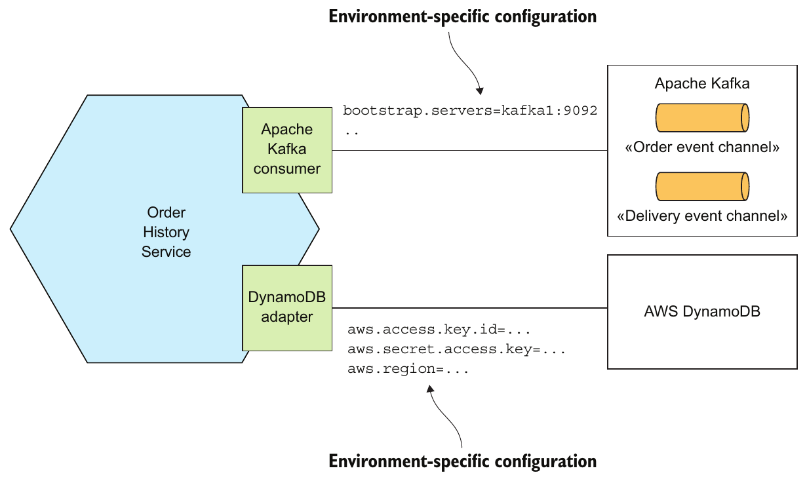

> **English:** Figure 11.6 Order History Service uses Apache Kafka and AWS DynamoDB. It needs to be configured with each service’s network location, credentials, and so on.
>
> **Türkçe:** Şekil 11.6 Order History Service, Apache Kafka ve AWS DynamoDB kullanır. Her servisin ağ konumu, kimlik bilgileri ve benzeri değerlerle yapılandırılması gerekir.

<!-- source-record: u11_0117 -->

### Pattern: Externalized configuration — Örüntü: Externalized configuration (dışarıdan yapılandırma)

<!-- source-record: u11_0118 -->

> **English:** Supply configuration property values, such as database credentials and network location, to a service at runtime. See http://microservices.io/patterns/externalizedconfiguration.html.
>
> **Türkçe:** Veritabanı kimlik bilgileri ve ağ konumu gibi yapılandırma değerlerini servise çalışma zamanında sağlayın. Bkz. http://microservices.io/patterns/externalizedconfiguration.html.

<!-- source-record: u11_0119 -->

> **English:** An externalized configuration mechanism provides the configuration property values to a service instance at runtime. There are two main approaches:
>
> **Türkçe:** Dışarıdan yapılandırma mekanizması, servis örneğine yapılandırma değerlerini çalışma zamanında sağlar. İki temel yaklaşım vardır:

<!-- source-record: u11_0120 -->

> **English:** • Push model—The deployment infrastructure passes the configuration properties to the service instance using, for example, operating system environment variables or a configuration file.
>
> **Türkçe:** • Push model (itme modeli) — Dağıtım altyapısı yapılandırma özelliklerini, örneğin işletim sistemi ortam değişkenleri veya bir yapılandırma dosyası aracılığıyla servis örneğine aktarır.

<!-- source-record: u11_0121 -->

> **English:** • Pull model—The service instance reads its configuration properties from a configuration server.
>
> **Türkçe:** • Pull model (çekme modeli) — Servis örneği yapılandırma özelliklerini bir yapılandırma sunucusundan okur.

<!-- source-record: u11_0122 -->

> **English:** We’ll look at each approach, starting with the push model.
>
> **Türkçe:** Önce push model olmak üzere her iki yaklaşımı inceleyeceğiz.

<!-- source-pages: 362 -->

<!-- source-record: u11_0123 -->

### 11.2.1 Using push-based externalized configuration — Push tabanlı dışarıdan yapılandırma kullanma

<!-- source-record: u11_0124 -->

> **English:** The push model relies on the collaboration of the deployment environment and the service. The deployment environment supplies the configuration properties when it creates a service instance. It might, as figure 11.7 shows, pass the configuration properties as environment variables. Alternatively, the deployment environment may supply the configuration properties using a configuration file. The service instance then reads the configuration properties when it starts up.
>
> **Türkçe:** Push model, dağıtım ortamı ile servisin iş birliğine dayanır. Dağıtım ortamı servis örneğini oluştururken yapılandırma özelliklerini sağlar. Şekil 11.7'de gösterildiği gibi bunları ortam değişkenleri olarak aktarabilir. Alternatif olarak bir yapılandırma dosyası kullanabilir. Servis örneği de başlatılırken bu özellikleri okur.

<!-- source-record: u11_0125 -->

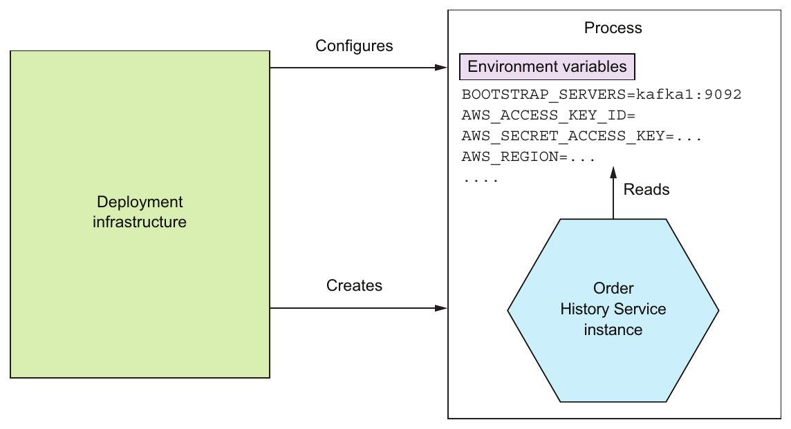

> **English:** Figure 11.7 When the deployment infrastructure creates an instance of Order History Service, it sets the environment variables containing the externalized configuration. Order History Service reads those environment variables.
>
> **Türkçe:** Şekil 11.7 Dağıtım altyapısı Order History Service örneğini oluştururken dış yapılandırmayı içeren ortam değişkenlerini ayarlar. Order History Service bu ortam değişkenlerini okur.

<!-- source-record: u11_0126 -->

> **English:** The deployment environment and the service must agree on how the configuration properties are supplied. The precise mechanism depends on the specific deployment environment. For example, chapter 12 describes how you can specify the environment variables of a Docker container.
>
> **Türkçe:** Dağıtım ortamı ile servis, yapılandırma özelliklerinin nasıl sağlanacağı konusunda uzlaşmalıdır. Kullanılacak mekanizma dağıtım ortamına bağlıdır. Örneğin 12. bölüm, bir Docker container'ın ortam değişkenlerinin nasıl belirtilebileceğini açıklar.

<!-- source-record: u11_0127 -->

> **English:** Let’s imagine that you’ve decided to supply externalized configuration property values using environment variables. Your application could call System.getenv() to obtain their values. But if you’re a Java developer, it’s likely that you’re using a framework that provides a more convenient mechanism. The FTGO services are built using Spring Boot, which has an extremely flexible externalized configuration mechanism that retrieves configuration properties from a variety of sources with well-defined precedence rules (https://docs.spring.io/spring-boot/docs/current/reference/html/bootfeatures-external-config.html). Let’s look at how it works.
>
> **Türkçe:** Dış yapılandırma değerlerini ortam değişkenleriyle sağlamaya karar verdiğinizi varsayalım. Uygulamanız bunların değerlerini almak için System.getenv() çağırabilir. Ancak Java geliştiriciyseniz muhtemelen daha elverişli bir mekanizma sağlayan bir framework kullanıyorsunuzdur. FTGO servisleri, iyi tanımlanmış öncelik kurallarıyla çeşitli kaynaklardan yapılandırma özellikleri alan son derece esnek bir dışarıdan yapılandırma mekanizmasına sahip Spring Boot ile geliştirilmiştir (https://docs.spring.io/spring-boot/docs/current/reference/html/bootfeatures-external-config.html). Nasıl çalıştığına bakalım.

<!-- source-record: u11_0128 -->

> **English:** Spring Boot reads properties from a variety of sources. I find the following sources useful in a microservice architecture:
>
> **Türkçe:** Spring Boot, özellikleri çeşitli kaynaklardan okur. Mikroservis mimarisinde şu kaynakları yararlı buluyorum:

<!-- source-pages: 363 -->

<!-- source-record: u11_0129 -->

> **English:** 1 Command-line arguments
>
> **Türkçe:** 1 Komut satırı argümanları

<!-- source-record: u11_0130 -->

> **English:** 2 SPRING_APPLICATION_JSON, an operating system environment variable or JVM system property that contains JSON
>
> **Türkçe:** 2 JSON içeren bir işletim sistemi ortam değişkeni veya JVM sistem özelliği olan SPRING_APPLICATION_JSON

<!-- source-record: u11_0131 -->

> **English:** 3 JVM System properties
>
> **Türkçe:** 3 JVM sistem özellikleri

<!-- source-record: u11_0132 -->

> **English:** 4 Operating system environment variables
>
> **Türkçe:** 4 İşletim sistemi ortam değişkenleri

<!-- source-record: u11_0133 -->

> **English:** 5 A configuration file in the current directory
>
> **Türkçe:** 5 Geçerli dizindeki yapılandırma dosyası

<!-- source-record: u11_0134 -->

> **English:** A particular property value from a source earlier in this list overrides the same property from a source later in this list. For example, operating system environment variables override properties read from a configuration file.
>
> **Türkçe:** Bu listede daha önce gelen bir kaynaktaki özellik değeri, daha sonra gelen kaynaktaki aynı özelliğin değerini geçersiz kılar. Örneğin işletim sistemi ortam değişkenleri, yapılandırma dosyasından okunan özelliklere göre önceliklidir.

<!-- source-record: u11_0135 -->

> **English:** Spring Boot makes these properties available to the Spring Framework’s ApplicationContext. A service can, for example, obtain the value of a property using the @Value annotation:
>
> **Türkçe:** Spring Boot bu özellikleri Spring Framework'ün ApplicationContext'ine sunar. Örneğin bir servis, @Value annotation'ını kullanarak bir özelliğin değerini alabilir:

<!-- source-record: u11_0136 -->

```java
public class OrderHistoryDynamoDBConfiguration {

  @Value("${aws.region}")
  private String awsRegion;
```

<!-- source-record: u11_0137 -->

> **English:** The Spring Framework initializes the awsRegion field to the value of the aws.region property. This property is read from one of the sources listed earlier, such as a configuration file or from the AWS_REGION environment variable.
>
> **Türkçe:** Spring Framework, awsRegion alanını aws.region özelliğinin değeriyle başlatır. Bu özellik, yapılandırma dosyası veya AWS_REGION ortam değişkeni gibi daha önce sıralanan kaynaklardan birinden okunur.

<!-- source-record: u11_0138 -->

> **English:** The push model is an effective and widely used mechanism for configuring a service. One limitation, however, is that reconfiguring a running service might be challenging, if not impossible. The deployment infrastructure might not allow you to change the externalized configuration of a running service without restarting it. You can’t, for example, change the environment variables of a running process. Another limitation is that there’s a risk of the configuration property values being scattered throughout the definition of numerous services. As a result, you may want to consider using a pull-based model. Let’s look at how it works.
>
> **Türkçe:** Push model, bir servisi yapılandırmanın etkili ve yaygın bir yoludur. Ancak bir sınırlaması, çalışan servisi yeniden yapılandırmanın imkânsız olmasa bile zor olabilmesidir. Dağıtım altyapısı, çalışan servisi yeniden başlatmadan dış yapılandırmasını değiştirmenize izin vermeyebilir. Örneğin çalışan bir sürecin ortam değişkenlerini değiştiremezsiniz. Diğer sınırlama, yapılandırma değerlerinin çok sayıda servis tanımına dağılması riskidir. Bu nedenle pull tabanlı modeli değerlendirmek isteyebilirsiniz. Nasıl çalıştığına bakalım.

<!-- source-record: u11_0139 -->

### 11.2.2 Using pull-based externalized configuration — Pull tabanlı dışarıdan yapılandırma kullanma

<!-- source-record: u11_0140 -->

> **English:** In the pull model, a service instance reads its configuration properties from a configuration server. Figure 11.8 shows how it works. On startup, a service instance queries the configuration service for its configuration. The configuration properties for accessing the configuration server, such as its network location, are provided to the service instance via a push-based configuration mechanism, such as environment variables.
>
> **Türkçe:** Pull model'de servis örneği yapılandırma özelliklerini bir yapılandırma sunucusundan okur. Şekil 11.8 bunun işleyişini gösterir. Servis örneği başlatılırken yapılandırma servisini sorgular. Yapılandırma sunucusuna erişmek için gereken ağ konumu gibi özellikler ise ortam değişkenleri gibi push tabanlı bir mekanizmayla servis örneğine sağlanır.

<!-- source-record: u11_0141 -->

> **English:** There are a variety of ways to implement a configuration server, including the following:
>
> **Türkçe:** Yapılandırma sunucusunu gerçekleştirmenin çeşitli yolları vardır; bunlardan bazıları şunlardır:

<!-- source-record: u11_0142 -->

> **English:** • Version control system such as Git
>
> **Türkçe:** • Git gibi bir sürüm kontrol sistemi

<!-- source-record: u11_0143 -->

> **English:** • SQL and NoSQL databases
>
> **Türkçe:** • SQL ve NoSQL veritabanları

<!-- source-record: u11_0144 -->

> **English:** • Specialized configuration servers, such as Spring Cloud Config Server, Hashicorp Vault, which is a store for sensitive data such as credentials, and AWS Parameter Store
>
> **Türkçe:** • Spring Cloud Config Server, kimlik bilgileri gibi hassas verileri saklayan Hashicorp Vault ve AWS Parameter Store gibi özel yapılandırma sunucuları.

> **English:** The Spring Cloud Config project is a good example of a configuration server-based framework. It consists of a server and a client. The server supports a variety of backends for storing configuration properties, including version control systems, databases, and Hashicorp Vault. The client retrieves configuration properties from the server and injects them into the Spring ApplicationContext.
>
> **Türkçe:** Spring Cloud Config projesi, yapılandırma sunucusu tabanlı framework'lere iyi bir örnektir. Bir sunucu ve bir istemciden oluşur. Sunucu; sürüm kontrol sistemleri, veritabanları ve Hashicorp Vault dâhil çeşitli arka uçlarda yapılandırma özelliklerini saklamayı destekler. İstemci özellikleri sunucudan alıp Spring ApplicationContext'e enjekte eder.

<!-- source-pages: 364 -->

<!-- source-record: u11_0145 -->

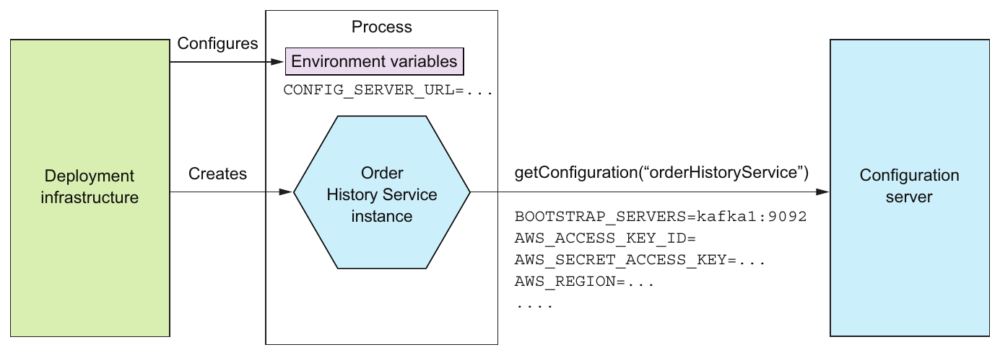

> **English:** Figure 11.8 On startup, a service instance retrieves its configuration properties from a configuration server. The deployment infrastructure provides the configuration properties for accessing the configuration server.
>
> **Türkçe:** Şekil 11.8 Servis örneği, başlatılırken yapılandırma özelliklerini bir yapılandırma sunucusundan alır. Dağıtım altyapısı, bu sunucuya erişmek için gereken yapılandırma özelliklerini sağlar.

<!-- source-record: u11_0146 -->

> **English:** Using a configuration server has several benefits:
>
> **Türkçe:** Yapılandırma sunucusu kullanmanın çeşitli yararları vardır:

<!-- source-record: u11_0147 -->

> **English:** • Centralized configuration—All the configuration properties are stored in one place, which makes them easier to manage. What’s more, in order to eliminate duplicate configuration properties, some implementations let you define global defaults, which can be overridden on a per-service basis.
>
> **Türkçe:** • Merkezî yapılandırma — Tüm yapılandırma özellikleri tek yerde tutulur; bu da yönetimi kolaylaştırır. Ayrıca yinelenen özellikleri ortadan kaldırmak için bazı gerçekleştirimler, servis bazında geçersiz kılınabilen genel varsayılanlar tanımlamanıza izin verir.

<!-- source-record: u11_0148 -->

> **English:** • Transparent decryption of sensitive data—Encrypting sensitive data such as database credentials is a security best practice. One challenge of using encryption, though, is that usually the service instance needs to decrypt them, which means it needs the encryption keys. Some configuration server implementations automatically decrypt properties before returning them to the service.
>
> **Türkçe:** • Hassas verilerin şifresinin saydam biçimde çözülmesi — Veritabanı kimlik bilgileri gibi hassas verileri şifrelemek iyi bir güvenlik uygulamasıdır. Ancak şifreleme kullanmanın güçlüklerinden biri, genellikle şifreyi servis örneğinin çözmesi ve bunun için şifreleme anahtarlarına ihtiyaç duymasıdır. Bazı yapılandırma sunucuları, özellikleri servise döndürmeden önce otomatik olarak çözer.

<!-- source-record: u11_0149 -->

> **English:** • Dynamic reconfiguration—A service could potentially detect updated property values by, for example, polling, and reconfigure itself.
>
> **Türkçe:** • Dinamik yeniden yapılandırma — Servis, örneğin polling (düzenli aralıklarla sorgulama) yoluyla güncellenen özellik değerlerini saptayabilir ve kendini yeniden yapılandırabilir.

<!-- source-record: u11_0150 -->

> **English:** The primary drawback of using a configuration server is that unless it’s provided by the infrastructure, it’s yet another piece of infrastructure that needs to be set up and maintained. Fortunately, there are various open source frameworks, such as Spring Cloud Config, which make it easier to run a configuration server.
>
> **Türkçe:** Yapılandırma sunucusunun temel dezavantajı, mevcut altyapı tarafından sağlanmadıkça kurulması ve bakımı gereken yeni bir altyapı bileşeni olmasıdır. Neyse ki Spring Cloud Config gibi çeşitli açık kaynak framework'ler bu sunucunun işletilmesini kolaylaştırır.

<!-- source-record: u11_0151 -->

> **English:** Now that we’ve looked at how to design configurable services, let’s talk about how to design observable services.
>
> **Türkçe:** Yapılandırılabilir servislerin tasarımını gördüğümüze göre şimdi gözlemlenebilir servisleri nasıl tasarlayacağımıza bakalım.

<!-- source-record: u11_0152 -->

## 11.3 Designing observable services — Gözlemlenebilir servisler tasarlama

<!-- source-record: u11_0153 -->

> **English:** Let’s say you’ve deployed the FTGO application into production. You probably want to know what the application is doing: requests per second, resource utilization, and so on. You also need to be alerted if there’s a problem, such as a failed service instance or a disk filling up—ideally before it impacts a user. And, if there’s a problem, you need to be able to troubleshoot and identify the root cause.
>
> **Türkçe:** FTGO uygulamasını üretim ortamına dağıttığınızı varsayalım. Muhtemelen saniyedeki istek sayısı, kaynak kullanımı ve benzeri bilgilerle uygulamanın ne yaptığını bilmek istersiniz. Arızalı bir servis örneği ya da dolmak üzere olan disk gibi bir sorun olduğunda, ideal olarak kullanıcı etkilenmeden önce uyarılmanız da gerekir. Sorun çıktığında teşhis koyabilmeli ve kök nedeni belirleyebilmelisiniz.

<!-- source-pages: 365 -->

<!-- source-record: u11_0154 -->

> **English:** Many aspects of managing an application in production are outside the scope of the developer, such as monitoring hardware availability and utilization. These are clearly the responsibility of operations. But there are several patterns that you, as a service developer, must implement to make your service easier to manage and troubleshoot. These patterns, shown in figure 11.9, expose a service instance’s behavior and health. They enable a monitoring system to track and visualize the state of a service and generate alerts when there’s a problem. These patterns also make troubleshooting problems easier. You can use the following patterns to design observable services:
>
> **Türkçe:** Üretimdeki uygulamayı yönetmenin donanım kullanılabilirliğini ve kullanımını izlemek gibi birçok yönü geliştiricinin kapsamı dışındadır. Bunlar açıkça operasyon ekibinin sorumluluğudur. Ancak servis geliştirici olarak servisinizi yönetmeyi ve sorunlarını gidermeyi kolaylaştırmak için uygulamanız gereken çeşitli örüntüler vardır. Şekil 11.9'daki bu örüntüler, servis örneğinin davranışını ve sağlık durumunu dışarıya sunar. İzleme sisteminin servisin durumunu takip edip görselleştirmesini ve sorun olduğunda uyarı üretmesini sağlar. Ayrıca sorun teşhisini kolaylaştırır. Gözlemlenebilir servisler tasarlamak için şu örüntüleri kullanabilirsiniz:

<!-- source-record: u11_0155 -->

> **English:** • Health check API—Expose an endpoint that returns the health of the service.
>
> **Türkçe:** • Health check API — Servisin sağlık durumunu döndüren bir uç nokta sunun.

<!-- source-record: u11_0156 -->

> **English:** • Log aggregation—Log service activity and write logs into a centralized logging server, which provides searching and alerting.
>
> **Türkçe:** • Log aggregation — Servis etkinliğini loglayın ve logları arama ile uyarı olanakları sağlayan merkezî bir log sunucusuna yazın.

<!-- source-record: u11_0157 -->

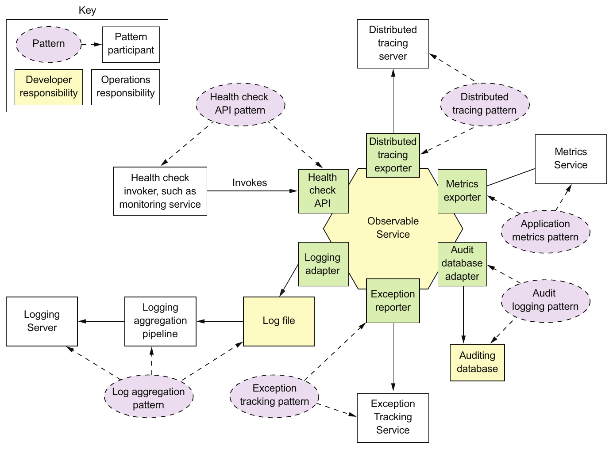

> **English:** Figure 11.9 The observability patterns enable developers and operations to understand the behavior of an application and troubleshoot problems. Developers are responsible for ensuring that their services are observable. Operations are responsible for the infrastructure that collects the information exposed by the services.
>
> **Türkçe:** Şekil 11.9 Gözlemlenebilirlik örüntüleri, geliştiricilerin ve operasyon ekibinin uygulama davranışını anlamasını ve sorunları gidermesini sağlar. Geliştiriciler servislerinin gözlemlenebilir olmasından sorumludur. Operasyon ekibi ise servislerin sunduğu bilgileri toplayan altyapıdan sorumludur.

<!-- source-pages: 366 -->

<!-- source-record: u11_0158 -->

> **English:** • Distributed tracing—Assign each external request a unique ID and trace requests as they flow between services.
>
> **Türkçe:** • Distributed tracing — Her haricî isteğe benzersiz bir kimlik atayın ve istekleri servisler arasında ilerlerken izleyin.

<!-- source-record: u11_0159 -->

> **English:** • Exception tracking—Report exceptions to an exception tracking service, which de-duplicates exceptions, alerts developers, and tracks the resolution of each exception.
>
> **Türkçe:** • Exception tracking — İstisnaları, tekrarları birleştiren, geliştiricileri uyaran ve her istisnanın çözümünü takip eden bir istisna takip servisine bildirin.

<!-- source-record: u11_0160 -->

> **English:** • Application metrics—Services maintain metrics, such as counters and gauges, and expose them to a metrics server.
>
> **Türkçe:** • Application metrics — Servisler counter (sayaç) ve gauge (anlık değer göstergesi) gibi metrikler tutar ve bunları bir metrik sunucusuna sunar.

<!-- source-record: u11_0161 -->

> **English:** • Audit logging—Log user actions.
>
> **Türkçe:** • Audit logging — Kullanıcı eylemlerini kaydedin.

<!-- source-record: u11_0162 -->

> **English:** A distinctive feature of most of these patterns is that each pattern has a developer component and an operations component. Consider, for example, the Health check API pattern. The developer is responsible for ensuring that their service implements a health check endpoint. Operations is responsible for the monitoring system that periodically invokes the health check API. Similarly, for the Log aggregation pattern, a developer is responsible for ensuring that their services log useful information, whereas operations is responsible for log aggregation.
>
> **Türkçe:** Bu örüntülerin çoğunun ayırt edici özelliği, her birinin hem geliştirici hem operasyon bileşeni içermesidir. Örneğin Health check API örüntüsünde geliştirici, servisin bir sağlık kontrolü uç noktası sağlamasından sorumludur. Operasyon ekibi ise bu API'yi düzenli aralıklarla çağıran izleme sisteminden sorumludur. Benzer şekilde Log aggregation örüntüsünde geliştirici servislerin yararlı bilgiler loglamasını sağlarken operasyon ekibi logların merkezde toplanmasından sorumludur.

<!-- source-record: u11_0163 -->

> **English:** Let’s take a look at each of these patterns, starting with the Health check API pattern.
>
> **Türkçe:** Health check API örüntüsünden başlayarak bunların her birine bakalım.

<!-- source-record: u11_0164 -->

### 11.3.1 Using the Health check API pattern — Health check API örüntüsünü kullanma

<!-- source-record: u11_0165 -->

> **English:** Sometimes a service may be running but unable to handle requests. For instance, a newly started service instance may not be ready to accept requests. The FTGO Consumer Service, for example, takes around 10 seconds to initialize the messaging and database adapters. It would be pointless for the deployment infrastructure to route HTTP requests to a service instance until it’s ready to process them.
>
> **Türkçe:** Bazen servis çalışıyor olsa da istekleri işleyemeyebilir. Örneğin yeni başlatılan bir servis örneği henüz istek kabul etmeye hazır olmayabilir. FTGO Consumer Service'in mesajlaşma ve veritabanı adaptörlerini başlatması yaklaşık 10 saniye sürer. Dağıtım altyapısının, hazır olmadan servis örneğine HTTP isteklerini yönlendirmesi anlamsız olur.

<!-- source-record: u11_0166 -->

> **English:** Also, a service instance can fail without terminating. For example, a bug might cause an instance of Consumer Service to run out of database connections and be unable to access the database. The deployment infrastructure shouldn’t route requests to a service instance that has failed yet is still running. And, if the service instance does not recover, the deployment infrastructure must terminate it and create a new instance.
>
> **Türkçe:** Servis örneği sonlanmadan da arızalanabilir. Örneğin bir hata, Consumer Service örneğinin veritabanı bağlantılarını tüketmesine ve veritabanına erişememesine yol açabilir. Dağıtım altyapısı, arızalı olmasına rağmen çalışmayı sürdüren örneğe istek yönlendirmemelidir. Örnek kendini toparlamazsa altyapı onu sonlandırmalı ve yeni bir örnek oluşturmalıdır.

<!-- source-record: u11_0167 -->

### Pattern: Health check API — Örüntü: Health check API (sağlık kontrolü API'si)

<!-- source-record: u11_0168 -->

> **English:** A service exposes a health check API endpoint, such as GET /health, which returns the health of the service. See http://microservices.io/patterns/observability/healthcheck-api.html.
>
> **Türkçe:** Servis, sağlık durumunu döndüren GET /health gibi bir sağlık kontrolü uç noktası sunar. Bkz. http://microservices.io/patterns/observability/healthcheck-api.html.

<!-- source-record: u11_0169 -->

> **English:** A service instance needs to be able to tell the deployment infrastructure whether or not it’s able to handle requests. A good solution is for a service to implement a health check endpoint, which is shown in figure 11.10. The Spring Boot Actuator Java library, for example, implements a GET /actuator/health endpoint, which returns 200 if and only if the service is healthy, and 503 otherwise. Similarly, the HealthChecks.NET library implements a GET /hc endpoint (https://docs.microsoft.com/en-us/dotnet/standard/microservices-architecture/implement-resilient-applications/monitor-apphealth). The deployment infrastructure periodically invokes this endpoint to determine the health of the service instance and takes the appropriate action if it’s unhealthy.
>
> **Türkçe:** Servis örneğinin, istek işleyip işleyemediğini dağıtım altyapısına bildirebilmesi gerekir. İyi bir çözüm, Şekil 11.10'daki gibi bir sağlık kontrolü uç noktası gerçekleştirmektir. Örneğin Spring Boot Actuator Java kütüphanesi, ancak ve ancak servis sağlıklıysa 200, aksi durumda 503 döndüren GET /actuator/health uç noktasını sağlar. Benzer şekilde HealthChecks.NET kütüphanesi GET /hc uç noktasını gerçekleştirir (https://docs.microsoft.com/en-us/dotnet/standard/microservices-architecture/implement-resilient-applications/monitor-apphealth). Dağıtım altyapısı, servis örneğinin sağlık durumunu belirlemek için bu uç noktayı düzenli aralıklarla çağırır ve sağlıksızsa uygun işlemi yapar.

<!-- source-pages: 367 -->

<!-- source-record: u11_0170 -->

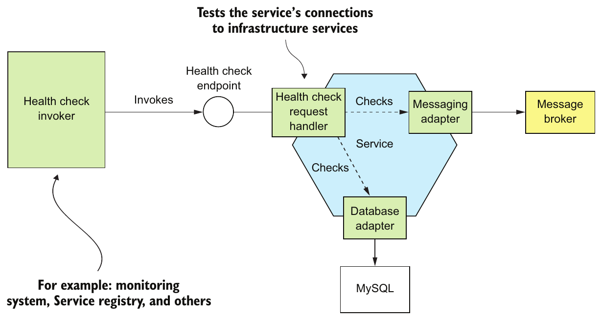

> **English:** Figure 11.10 A service implements a health check endpoint, which is periodically invoked by the deployment infrastructure to determine the health of the service instance.
>
> **Türkçe:** Şekil 11.10 Servis, örneğin sağlık durumunu belirlemek için dağıtım altyapısının düzenli aralıklarla çağırdığı bir sağlık kontrolü uç noktası gerçekleştirir.

<!-- source-record: u11_0171 -->

> **English:** A Health Check Request Handler typically tests the service instance’s connections to external services. It might, for example, execute a test query against a database. If all the tests succeed, Health Check Request Handler returns a healthy response, such as an HTTP 200 status code. If any of them fails, it returns an unhealthy response, such as an HTTP 500 status code. Health Check Request Handler might simply return an empty HTTP response with the appropriate status code. Or it might return a detailed description of the health of each of the adapters. The detailed information is useful for troubleshooting. But because it may contain sensitive information, some frameworks, such as Spring Boot Actuator, let you configure the level of detail in the health endpoint response.
>
> **Türkçe:** Health Check Request Handler genellikle servis örneğinin haricî servislere bağlantılarını sınar. Örneğin veritabanında bir test sorgusu çalıştırabilir. Tüm testler başarılıysa HTTP 200 gibi sağlıklı durumu belirten bir yanıt döndürür. Herhangi biri başarısızsa HTTP 500 gibi sağlıksız durumu belirten bir yanıt döndürür. Handler, uygun durum koduyla boş bir HTTP yanıtı gönderebilir veya her adaptörün sağlık durumunu ayrıntılı açıklayabilir. Bu ayrıntılar sorun gidermede yararlıdır. Ancak hassas bilgiler içerebileceğinden Spring Boot Actuator gibi bazı framework'ler sağlık uç noktasının yanıtındaki ayrıntı düzeyini yapılandırmanıza izin verir.

> **Okuma notu — sağlık yanıtı:** Önceki paragraftaki 503, Spring Boot örneğinin; buradaki 500 ise genel handler örneğinin durum kodudur. Ayrıca sürecin canlı olması ile trafik almaya hazır olması farklı kontrollerdir; bunların dağıtım bağlamı [Ünite 12](../unit_12_deploying_microservices/README.md) içinde ele alınır.

<!-- source-record: u11_0172 -->

> **English:** There are two issues you need to consider when using health checks. The first is the implementation of the endpoint, which must report back on the health of the service instance. The second issue is how to configure the deployment infrastructure to invoke the health check endpoint. Let’s first look at how to implement the endpoint.
>
> **Türkçe:** Sağlık kontrollerini kullanırken iki konuyu düşünmelisiniz. Birincisi, servis örneğinin sağlığını bildirmesi gereken uç noktanın gerçekleştirimi; ikincisi ise dağıtım altyapısının bu uç noktayı çağıracak biçimde yapılandırılmasıdır. Önce uç noktanın nasıl gerçekleştirileceğine bakalım.

<!-- source-record: u11_0173 -->

#### IMPLEMENTING THE HEALTH CHECK ENDPOINT — SAĞLIK KONTROLÜ UÇ NOKTASINI GERÇEKLEŞTİRME

<!-- source-record: u11_0174 -->

> **English:** The code that implements the health check endpoint must somehow determine the health of the service instance. One simple approach is to verify that the service instance can access its external infrastructure services. How to do this depends on the infrastructure service. The health check code can, for example, verify that it’s connected to an RDBMS by obtaining a database connection and executing a test query. A more elaborate approach is to execute a synthetic transaction that simulates the invocation of the service’s API by a client. This kind of health check is more thorough, but it’s likely to be more time consuming to implement and take longer to execute.
>
> **Türkçe:** Sağlık kontrolü uç noktasını gerçekleştiren kod, servis örneğinin sağlığını bir şekilde belirlemelidir. Basit bir yaklaşım, örneğin haricî altyapı servislerine erişebildiğini doğrulamaktır. Bunun nasıl yapılacağı altyapı servisine bağlıdır. Örneğin sağlık kontrolü kodu bir veritabanı bağlantısı alıp test sorgusu çalıştırarak RDBMS'e bağlı olduğunu doğrulayabilir. Daha kapsamlı yaklaşım, bir istemcinin servis API'sini çağırmasını taklit eden synthetic transaction (sentetik işlem) çalıştırmaktır. Bu kontrol daha ayrıntılıdır; ancak geliştirilmesi muhtemelen daha çok zaman alır ve çalışması da daha uzun sürer.

<!-- source-pages: 368 -->

<!-- source-record: u11_0175 -->

> **English:** A great example of a health check library is Spring Boot Actuator. As mentioned earlier, it implements a /actuator/health endpoint. The code that implements this endpoint returns the result of executing a set of health checks. By using convention over configuration, Spring Boot Actuator implements a sensible set of health checks based on the infrastructure services used by the service. If, for example, a service uses a JDBC DataSource, Spring Boot Actuator configures a health check that executes a test query. Similarly, if the service uses the RabbitMQ message broker, it automatically configures a health check that verifies that the RabbitMQ server is up.
>
> **Türkçe:** Sağlık kontrolü kütüphanesine iyi bir örnek Spring Boot Actuator'dır. Daha önce belirtildiği gibi /actuator/health uç noktasını gerçekleştirir. Bu uç noktanın kodu, bir dizi sağlık kontrolünün sonucunu döndürür. Spring Boot Actuator, convention over configuration (yapılandırma yerine yerleşik kabuller) yaklaşımıyla servisin kullandığı altyapı servislerine uygun bir kontrol kümesi oluşturur. Örneğin servis JDBC DataSource kullanıyorsa test sorgusu çalıştıran bir sağlık kontrolü yapılandırır. Servis RabbitMQ mesaj broker'ını kullanıyorsa RabbitMQ sunucusunun çalıştığını doğrulayan kontrolü otomatik olarak yapılandırır.

<!-- source-record: u11_0176 -->

> **English:** You can also customize this behavior by implementing additional health checks for your service. You implement a custom health check by defining a class that implements the HealthIndicator interface. This interface defines a health() method, which is called by the implementation of the /actuator/health endpoint. It returns the outcome of the health check.
>
> **Türkçe:** Servisinize ek sağlık kontrolleri yazarak bu davranışı özelleştirebilirsiniz. Özel kontrol için HealthIndicator arayüzünü uygulayan bir sınıf tanımlarsınız. Bu arayüzün health() metodu, /actuator/health uç noktasının gerçekleştirimi tarafından çağrılır ve sağlık kontrolünün sonucunu döndürür.

<!-- source-record: u11_0177 -->

#### INVOKING THE HEALTH CHECK ENDPOINT — SAĞLIK KONTROLÜ UÇ NOKTASINI ÇAĞIRMA

<!-- source-record: u11_0178 -->

> **English:** A health check endpoint isn’t much use if nobody calls it. When you deploy your service, you must configure the deployment infrastructure to invoke the endpoint. How you do that depends on the specific details of your deployment infrastructure. For example, as described in chapter 3, you can configure some service registries, such as Netflix Eureka, to invoke the health check endpoint in order to determine whether traffic should be routed to the service instance. Chapter 12 discusses how to configure Docker and Kubernetes to invoke a health check endpoint.
>
> **Türkçe:** Hiç kimse çağırmıyorsa sağlık kontrolü uç noktasının pek yararı olmaz. Servisi dağıtırken dağıtım altyapısını bu uç noktayı çağıracak şekilde yapılandırmalısınız. Nasıl yapılacağı altyapının ayrıntılarına bağlıdır. Örneğin 3. bölümde anlatıldığı gibi Netflix Eureka dâhil bazı service registry'leri, trafiğin servis örneğine yönlendirilip yönlendirilmeyeceğini belirlemek için sağlık uç noktasını çağıracak biçimde yapılandırabilirsiniz. 12. bölüm, Docker ve Kubernetes'in sağlık kontrolü uç noktasını çağırmak üzere nasıl yapılandırılacağını ele alır.

<!-- source-record: u11_0179 -->

### 11.3.2 Applying the Log aggregation pattern — Log aggregation örüntüsünü uygulama

<!-- source-record: u11_0180 -->

> **English:** Logs are a valuable troubleshooting tool. If you want to know what’s wrong with your application, a good place to start is the log files. But using logs in a microservice architecture is challenging. For example, imagine you’re debugging a problem with the getOrderDetails() query. As described in chapter 8, the FTGO application implements this query using API composition. As a result, the log entries you need are scattered across the log files of the API gateway and several services, including Order Service and Kitchen Service.
>
> **Türkçe:** Loglar değerli bir sorun giderme aracıdır. Uygulamanızdaki sorunu anlamak için log dosyaları iyi bir başlangıç noktasıdır. Ancak mikroservis mimarisinde logları kullanmak zordur. Örneğin getOrderDetails() sorgusundaki bir hatayı ayıkladığınızı düşünün. 8. bölümde anlatıldığı gibi FTGO bu sorguyu API composition ile gerçekleştirir. Dolayısıyla ihtiyaç duyduğunuz kayıtlar, API gateway ile Order Service ve Kitchen Service dâhil çeşitli servislerin log dosyalarına dağılmıştır.

<!-- source-record: u11_0181 -->

### Pattern: Log aggregation — Örüntü: Log aggregation (logları merkezde toplama)

<!-- source-record: u11_0182 -->

> **English:** Aggregate the logs of all services in a centralized database that supports searching and alerting. See http://microservices.io/patterns/observability/application-logging.html.
>
> **Türkçe:** Tüm servislerin loglarını, arama ve uyarı olanakları sunan merkezî bir veritabanında toplayın. Bkz. http://microservices.io/patterns/observability/application-logging.html.

> **English:** The solution is to use log aggregation. As figure 11.11 shows, the log aggregation pipeline sends the logs of all of the service instances to a centralized logging server. Once the logs are stored by the logging server, you can view, search, and analyze them. You can also configure alerts that are triggered when certain messages appear in the logs.
>
> **Türkçe:** Çözüm log aggregation kullanmaktır. Şekil 11.11'de gösterildiği gibi log toplama hattı, tüm servis örneklerinin loglarını merkezî bir log sunucusuna gönderir. Loglar burada saklandıktan sonra onları görüntüleyebilir, arayabilir ve analiz edebilirsiniz. Belirli mesajlar loglarda göründüğünde tetiklenen uyarılar da yapılandırabilirsiniz.

<!-- source-pages: 369 -->

<!-- source-record: u11_0183 -->

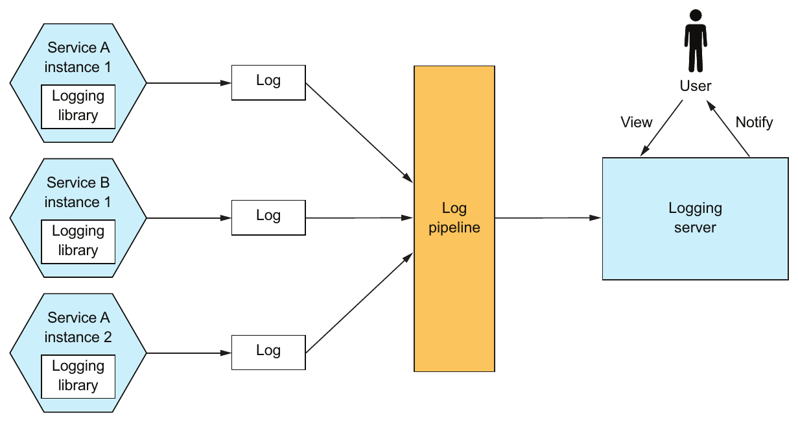

> **English:** Figure 11.11 The log aggregation infrastructure ships the logs of each service instance to a centralized logging server. Users can view and search the logs. They can also set up alerts, which are triggered when log entries match search criteria.
>
> **Türkçe:** Şekil 11.11 Log toplama altyapısı, her servis örneğinin loglarını merkezî bir log sunucusuna gönderir. Kullanıcılar logları görüntüleyebilir ve arayabilir. Kayıtlar arama ölçütleriyle eşleştiğinde tetiklenen uyarılar da oluşturabilirler.

<!-- source-record: u11_0184 -->

> **English:** The logging pipeline and server are usually the responsibility of operations. But service developers are responsible for writing services that generate useful logs. Let’s first look at how a service generates a log.
>
> **Türkçe:** Loglama hattı ve sunucusu genellikle operasyon ekibinin sorumluluğundadır. Ancak yararlı loglar üreten servisleri yazmaktan servis geliştiricileri sorumludur. Önce servisin nasıl log ürettiğine bakalım.

<!-- source-record: u11_0185 -->

#### HOW A SERVICE GENERATES A LOG — SERVİS NASIL LOG ÜRETİR?

<!-- source-record: u11_0186 -->

> **English:** As a service developer, there are a couple of issues you need to consider. First you need to decide which logging library to use. The second issue is where to write the log entries. Let’s first look at the logging library.
>
> **Türkçe:** Servis geliştirici olarak düşünmeniz gereken birkaç konu vardır. Önce hangi loglama kütüphanesini kullanacağınıza karar vermelisiniz. İkinci konu log kayıtlarının nereye yazılacağıdır. Önce kütüphaneye bakalım.

<!-- source-record: u11_0187 -->

> **English:** Most programming languages have one or more logging libraries that make it easy to generate correctly structured log entries. For example, three popular Java logging libraries are Logback, log4j, and JUL (java.util.logging). There’s also SLF4J, which is a logging facade API for the various logging frameworks. Similarly, Log4JS is a popular logging framework for NodeJS. One reasonable way to use logging is to sprinkle calls to one of these logging libraries in your service’s code. But if you have strict logging requirements that can’t be enforced by the logging library, you may need to define your own logging API that wraps a logging library.
>
> **Türkçe:** Çoğu programlama dilinde doğru yapılandırılmış log kayıtlarını kolayca üretmenizi sağlayan bir veya daha fazla loglama kütüphanesi vardır. Örneğin Java'da yaygın üç kütüphane Logback, log4j ve JUL'dur (java.util.logging). Ayrıca çeşitli loglama framework'lerine facade (ön yüz) API'si sağlayan SLF4J vardır. Benzer şekilde Log4JS, NodeJS için yaygın bir loglama framework'üdür. Servis kodunun uygun yerlerine bu kütüphanelerden birine yapılan çağrılar eklemek makul bir loglama yaklaşımıdır. Ancak kütüphanenin zorunlu kılamadığı katı loglama gereksinimleriniz varsa kütüphaneyi saran kendi loglama API'nizi tanımlamanız gerekebilir.

<!-- source-record: u11_0188 -->

> **English:** You also need to decide where to log. Traditionally, you would configure the logging framework to write to a log file in a well-known location in the filesystem. But with the more modern deployment technologies, such as containers and serverless, described in chapter 12, this is often not the best approach. In some environments, such as AWS Lambda, there isn’t even a “permanent” filesystem to write the logs to! Instead, your service should log to stdout. The deployment infrastructure will then decide what to do with the output of your service.
>
> **Türkçe:** Nereye log yazacağınıza da karar vermelisiniz. Geleneksel olarak loglama framework'ünü, dosya sisteminde bilinen bir konumdaki log dosyasına yazacak biçimde yapılandırırsınız. Ancak 12. bölümde anlatılan container ve serverless gibi daha modern dağıtım teknolojilerinde bu çoğu zaman en iyi yaklaşım değildir. AWS Lambda gibi bazı ortamlarda log yazılabilecek kalıcı bir dosya sistemi bile yoktur! Bunun yerine servisiniz stdout'a log yazmalıdır. Dağıtım altyapısı daha sonra bu çıktıyla ne yapılacağını belirler.

<!-- source-pages: 370 -->

<!-- source-record: u11_0189 -->

#### THE LOG AGGREGATION INFRASTRUCTURE — LOG TOPLAMA ALTYAPISI

<!-- source-record: u11_0190 -->

> **English:** The logging infrastructure is responsible for aggregating the logs, storing them, and enabling the user to search them. One popular logging infrastructure is the ELK stack. ELK consists of three open source products:
>
> **Türkçe:** Loglama altyapısı, logları toplamak, saklamak ve kullanıcının bunlarda arama yapmasını sağlamaktan sorumludur. Yaygın altyapılardan biri ELK yığınıdır. ELK üç açık kaynak üründen oluşur:

<!-- source-record: u11_0191 -->

> **English:** • Elasticsearch—A text search-oriented NoSQL database that’s used as the logging server
>
> **Türkçe:** • Elasticsearch — Log sunucusu olarak kullanılan, metin aramaya odaklı NoSQL veritabanı

<!-- source-record: u11_0192 -->

> **English:** • Logstash—A log pipeline that aggregates the service logs and writes them to Elasticsearch
>
> **Türkçe:** • Logstash — Servis loglarını toplayıp Elasticsearch'e yazan log hattı

<!-- source-record: u11_0193 -->

> **English:** • Kibana—A visualization tool for Elasticsearch
>
> **Türkçe:** • Kibana — Elasticsearch için görselleştirme aracı

<!-- source-record: u11_0194 -->

> **English:** Other open source log pipelines include Fluentd and Apache Flume. Examples of logging servers include cloud services, such as AWS CloudWatch Logs, as well as numerous commercial offerings. Log aggregation is a useful debugging tool in a microservice architecture.
>
> **Türkçe:** Diğer açık kaynak log hatları arasında Fluentd ve Apache Flume bulunur. Log sunucularına AWS CloudWatch Logs gibi bulut servisleri ve çok sayıda ticari ürün örnek verilebilir. Log aggregation, mikroservis mimarisinde yararlı bir hata ayıklama aracıdır.

<!-- source-record: u11_0195 -->

> **English:** Let’s now look at distributed tracing, which is another way of understanding the behavior of a microservices-based application.
>
> **Türkçe:** Şimdi mikroservis tabanlı uygulamanın davranışını anlamanın başka bir yolu olan dağıtık izlemeye bakalım.

<!-- source-record: u11_0196 -->

### 11.3.3 Using the Distributed tracing pattern — Distributed tracing örüntüsünü kullanma

<!-- source-record: u11_0197 -->

> **English:** Imagine you’re a FTGO developer who is investigating why the getOrderDetails() query has slowed down. You’ve ruled out the problem being an external networking issue. The increased latency must be caused by either the API gateway or one of the services it has invoked. One option is to look at each service’s average response time. The trouble with this option is that it’s an average across requests rather than the timing breakdown for an individual request. Plus more complex scenarios might involve many nested service invocations. You may not even be familiar with all services. As a result, it can be challenging to troubleshoot and diagnose these kinds of performance problems in a microservice architecture.
>
> **Türkçe:** getOrderDetails() sorgusunun neden yavaşladığını araştıran bir FTGO geliştiricisi olduğunuzu düşünün. Sorunun dış ağdan kaynaklanmadığını belirlediniz. Artan gecikme ya API gateway'den ya da onun çağırdığı servislerden birinden kaynaklanıyor olmalıdır. Bir seçenek, her servisin ortalama yanıt süresine bakmaktır. Sorun şu ki bu değer, tek bir istekte zamanın nerede harcandığını göstermek yerine tüm isteklerin ortalamasıdır. Daha karmaşık senaryolarda çok sayıda iç içe servis çağrısı da olabilir. Tüm servisleri tanımıyor bile olabilirsiniz. Bu nedenle mikroservis mimarisinde bu tür performans sorunlarını teşhis edip gidermek zor olabilir.

<!-- source-record: u11_0198 -->

### Pattern: Distributed tracing — Örüntü: Distributed tracing (dağıtık izleme)

<!-- source-record: u11_0199 -->

> **English:** Assign each external request a unique ID and record how it flows through the system from one service to the next in a centralized server that provides visualization and analysis. See http://microservices.io/patterns/observability/distributed-tracing.html.
>
> **Türkçe:** Her haricî isteğe benzersiz bir kimlik atayın; sistemde servisten servise nasıl ilerlediğini, görselleştirme ve analiz sağlayan merkezî bir sunucuda kaydedin. Bkz. http://microservices.io/patterns/observability/distributed-tracing.html.

<!-- source-record: u11_0200 -->

> **English:** A good way to get insight into what your application is doing is to use distributed tracing. Distributed tracing is analogous to a performance profiler in a monolithic application. It records information (for example, start time and end time) about the tree of service calls that are made when handling a request. You can then see how the services interact during the handling of external requests, including a breakdown of where the time is spent.
>
> **Türkçe:** Uygulamanızın ne yaptığını anlamanın iyi bir yolu dağıtık izlemedir. Dağıtık izleme, monolitik uygulamadaki performans profilleyicisine benzer. İstek işlenirken yapılan servis çağrılarının ağacı hakkında başlangıç ve bitiş zamanı gibi bilgileri kaydeder. Böylece haricî istekler işlenirken servislerin nasıl etkileştiğini ve zamanın nerede harcandığını görebilirsiniz.

<!-- source-pages: 371 -->

<!-- source-record: u11_0201 -->

> **English:** Figure 11.12 shows an example of how a distributed tracing server displays what happens when the API gateway handles a request. It shows the inbound request to the API gateway and the request that the gateway makes to Order Service. For each request, the distributed tracing server shows the operation that’s performed and the timing of the request.
>
> **Türkçe:** Şekil 11.12, API gateway bir isteği işlerken olanları dağıtık izleme sunucusunun nasıl gösterdiğine örnektir. API gateway'e gelen istek ile gateway'in Order Service'e yaptığı isteği gösterir. Sunucu, her istek için yapılan işlemi ve zaman bilgisini görüntüler.

<!-- source-record: u11_0202 -->

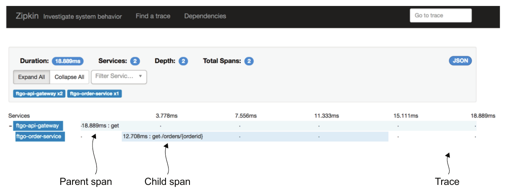

> **English:** Figure 11.12 The Zipkin server shows how the FTGO application handles a request that’s routed by the API gateway to Order Service. Each request is represented by a trace. A trace is a set of spans. Each span, which can contain child spans, is the invocation of a service. Depending on the level of detail collected, a span can also represent the invocation of an operation inside a service.
>
> **Türkçe:** Şekil 11.12 Zipkin sunucusu, API gateway'in Order Service'e yönlendirdiği isteğin FTGO uygulamasında nasıl işlendiğini gösterir. Her istek bir trace ile temsil edilir. Trace, span'lerden oluşur. Alt span'ler içerebilen her span bir servis çağrısıdır. Toplanan ayrıntı düzeyine göre span, servis içindeki bir işlemin çağrısını da temsil edebilir.

<!-- source-record: u11_0203 -->

> **English:** Figure 11.12 shows what in distributed tracing terminology is called a trace. A trace represents an external request and consists of one or more spans. A span represents an operation, and its key attributes are an operation name, start timestamp, and end time. A span can have one or more child spans, which represent nested operations. For example, a top-level span might represent the invocation of the API gateway, as is the case in figure 11.12. Its child spans represent the invocations of services by the API gateway.
>
> **Türkçe:** Şekil 11.12'de dağıtık izleme terminolojisinde trace (iz) denen yapı gösterilir. Trace, haricî bir isteği temsil eder ve bir veya daha fazla span'den (işlem aralığından) oluşur. Span bir işlemi temsil eder; temel nitelikleri işlem adı, başlangıç zaman damgası ve bitiş zamanıdır. Bir span, iç içe işlemleri temsil eden bir veya daha fazla alt span içerebilir. Örneğin Şekil 11.12'deki gibi en üst span API gateway çağrısını temsil edebilir. Alt span'ler de gateway'in servis çağrılarını temsil eder.

<!-- source-record: u11_0204 -->

> **English:** A valuable side effect of distributed tracing is that it assigns a unique ID to each external request. A service can include the request ID in its log entries. When combined with log aggregation, the request ID enables you to easily find all log entries for a particular external request. For example, here’s an example log entry from Order Service:
>
> **Türkçe:** Dağıtık izlemenin yararlı bir yan etkisi, her haricî isteğe benzersiz kimlik atamasıdır. Servis, log kayıtlarına bu istek kimliğini ekleyebilir. Log aggregation ile birlikte bu kimlik, belirli bir haricî isteğe ait tüm kayıtları kolayca bulmanızı sağlar. Örneğin Order Service'ten bir log kaydı şöyledir:

<!-- source-record: u11_0205 -->

```text
2018-03-04 17:38:12.032 DEBUG [ftgo-order-
     service,8d8fdc37be104cc6,8d8fdc37be104cc6,false]
  7 --- [nio-8080-exec-6] org.hibernate.SQL                        :
  select order0_.id as id1_3_0_, order0_.consumer_id as consumer2_3_0_, order
     0_.city as city3_3_0_,
  order0_.delivery_state as delivery4_3_0_, order0_.street1 as street5_3_0_,
  order0_.street2 as street6_3_0_, order0_.zip as zip7_3_0_,
order0_.delivery_time as delivery8_3_0_, order0_.a
```

<!-- source-pages: 372 -->

<!-- source-record: u11_0206 -->

> **English:** The [ftgo-order-service,8d8fdc37be104cc6,8d8fdc37be104cc6,false] part of the log entry (the SLF4J Mapped Diagnostic Context—see www.slf4j.org/manual.html) contains information from the distributed tracing infrastructure. It consists of four values:
>
> **Türkçe:** Log kaydının [ftgo-order-service,8d8fdc37be104cc6,8d8fdc37be104cc6,false] bölümü — SLF4J Mapped Diagnostic Context; bkz. www.slf4j.org/manual.html — dağıtık izleme altyapısından gelen bilgileri içerir. Dört değerden oluşur:

<!-- source-record: u11_0207 -->

> **English:** • ftgo-order-service—The name of the application
>
> **Türkçe:** • ftgo-order-service — Uygulamanın adı

<!-- source-record: u11_0208 -->

> **English:** • 8d8fdc37be104cc6—The traceId
>
> **Türkçe:** • 8d8fdc37be104cc6 — traceId

<!-- source-record: u11_0209 -->

> **English:** • 8d8fdc37be104cc6—The spanId
>
> **Türkçe:** • 8d8fdc37be104cc6 — spanId

<!-- source-record: u11_0210 -->

> **English:** • false—Indicates that this span wasn’t exported to the distributed tracing server
>
> **Türkçe:** • false — Bu span'in dağıtık izleme sunucusuna aktarılmadığını belirtir

<!-- source-record: u11_0211 -->

> **English:** If you search the logs for 8d8fdc37be104cc6, you’ll find all log entries for that request.
>
> **Türkçe:** Loglarda 8d8fdc37be104cc6 değerini ararsanız bu isteğe ait tüm log kayıtlarını bulursunuz.

<!-- source-record: u11_0212 -->

> **English:** Figure 11.13 shows how distributed tracing works. There are two parts to distributed tracing: an instrumentation library, which is used by each service, and a distributed tracing server. The instrumentation library manages the traces and spans. It also adds tracing information, such as the current trace ID and the parent span ID, to outbound requests. For example, one common standard for propagating trace information is the B3 standard (https://github.com/openzipkin/b3-propagation), which uses headers such as X-B3-TraceId and X-B3-ParentSpanId. The instrumentation library also reports traces to the distributed tracing server. The distributed tracing server stores the traces and provides a UI for visualizing them.
>
> **Türkçe:** Şekil 11.13 dağıtık izlemenin işleyişini gösterir. Dağıtık izleme iki parçadan oluşur: her servisin kullandığı instrumentation library (ölçüm ve izleme kütüphanesi) ile dağıtık izleme sunucusu. Kütüphane trace ve span'leri yönetir. Ayrıca mevcut trace ID ve üst span ID gibi izleme bilgilerini dışarı giden isteklere ekler. Örneğin bu bilgileri aktarmada yaygın standartlardan biri, X-B3-TraceId ve X-B3-ParentSpanId gibi başlıkları kullanan B3 standardıdır (https://github.com/openzipkin/b3-propagation). Kütüphane izleri sunucuya da bildirir. Dağıtık izleme sunucusu izleri saklar ve görselleştirmek için bir kullanıcı arayüzü sunar.

<!-- source-record: u11_0213 -->

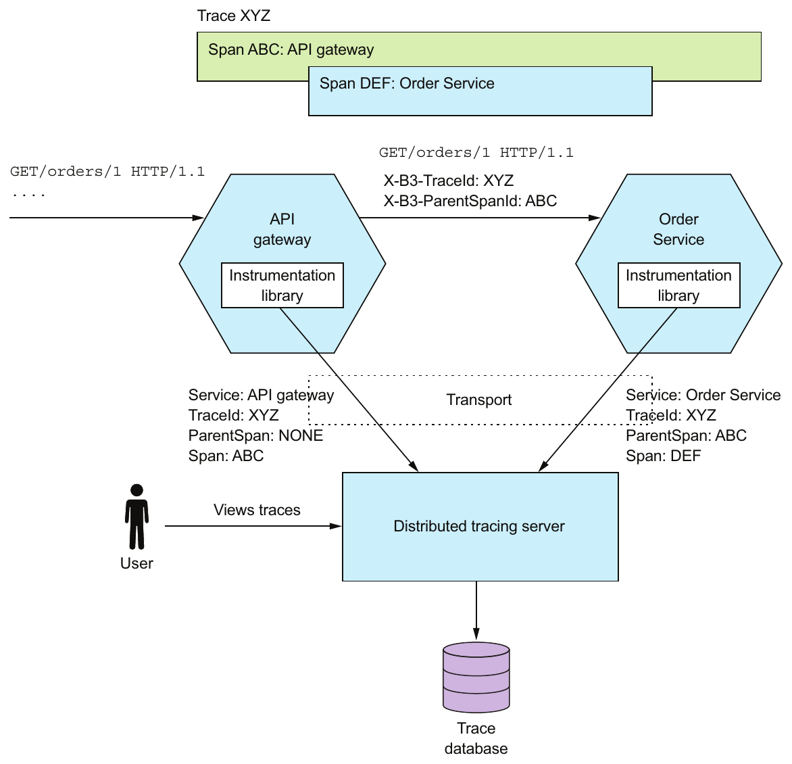

> **English:** Figure 11.13 Each service (including the API gateway) uses an instrumentation library. The instrumentation library assigns an ID to each external request, propagates tracing state between services, and reports spans to the distributed tracing server.
>
> **Türkçe:** Şekil 11.13 API gateway dâhil her servis bir instrumentation kütüphanesi kullanır. Bu kütüphane her haricî isteğe kimlik atar, servisler arasında izleme durumunu aktarır ve span'leri dağıtık izleme sunucusuna bildirir.

<!-- source-pages: 373 -->

<!-- source-record: u11_0214 -->

> **English:** Let’s take a look at the instrumentation library and the distribution tracing server, beginning with the library.
>
> **Türkçe:** Önce kütüphane olmak üzere instrumentation kütüphanesine ve dağıtık izleme sunucusuna bakalım.

<!-- source-record: u11_0215 -->

#### USING AN INSTRUMENTATION LIBRARY — INSTRUMENTATION KÜTÜPHANESİ KULLANMA

<!-- source-record: u11_0216 -->

> **English:** The instrumentation library builds the tree of spans and sends them to the distributed tracing server. The service code could call the instrumentation library directly, but that would intertwine the instrumentation logic with business and other logic. A cleaner approach is to use interceptors or aspect-oriented programming (AOP).
>
> **Türkçe:** Instrumentation kütüphanesi span ağacını oluşturur ve span'leri dağıtık izleme sunucusuna gönderir. Servis kodu kütüphaneyi doğrudan çağırabilir; ancak bu, izleme mantığını iş mantığı ve diğer mantıkla iç içe geçirir. Daha temiz yaklaşım interceptor'lar veya aspect-oriented programming (AOP, görünüm yönelimli programlama) kullanmaktır.

<!-- source-record: u11_0217 -->

> **English:** A great example of an AOP-based framework is Spring Cloud Sleuth. It uses the Spring Framework’s AOP mechanism to automagically integrate distributed tracing into the service. As a result, you have to add Spring Cloud Sleuth as a project dependency. Your service doesn’t need to call a distributed tracing API except in those cases that aren’t handled by Spring Cloud Sleuth.
>
> **Türkçe:** AOP tabanlı framework'e iyi bir örnek Spring Cloud Sleuth'tur. Dağıtık izlemeyi servise otomatik olarak entegre etmek için Spring Framework'ün AOP mekanizmasını kullanır. Bu nedenle Spring Cloud Sleuth'u proje bağımlılığı olarak eklemeniz gerekir. Sleuth'un ele almadığı durumlar dışında servisinizin dağıtık izleme API'sini çağırmasına gerek yoktur.

<!-- source-record: u11_0218 -->

#### ABOUT THE DISTRIBUTED TRACING SERVER — DAĞITIK İZLEME SUNUCUSU HAKKINDA

<!-- source-record: u11_0219 -->

> **English:** The instrumentation library sends the spans to a distributed tracing server. The distributed tracing server stitches the spans together to form complete traces and stores them in a database. One popular distributed tracing server is Open Zipkin. Zipkin was originally developed by Twitter. Services can deliver spans to Zipkin using either HTTP or a message broker. Zipkin stores the traces in a storage backend, which is either a SQL or NoSQL database. It has a UI that displays traces, as shown earlier in figure 11.12. AWS X-ray is another example of a distributed tracing server.
>
> **Türkçe:** Instrumentation kütüphanesi span'leri dağıtık izleme sunucusuna gönderir. Sunucu bunları birleştirerek tam trace'ler oluşturur ve veritabanında saklar. Yaygın dağıtık izleme sunucularından biri Open Zipkin'dir. Zipkin başlangıçta Twitter tarafından geliştirilmiştir. Servisler span'leri Zipkin'e HTTP veya mesaj broker'ı ile iletebilir. Zipkin izleri SQL ya da NoSQL veritabanı olan bir depolama arka ucunda saklar. Şekil 11.12'de gösterildiği gibi izleri görüntüleyen bir arayüzü vardır. AWS X-Ray, dağıtık izleme sunucusunun bir başka örneğidir.

<!-- source-record: u11_0220 -->

### 11.3.4 Applying the Application metrics pattern — Application metrics örüntüsünü uygulama

<!-- source-record: u11_0221 -->

> **English:** A key part of the production environment is monitoring and alerting. As figure 11.14 shows, the monitoring system gathers metrics, which provide critical information about the health of an application, from every part of the technology stack. Metrics range from infrastructure-level metrics, such as CPU, memory, and disk utilization, to application-level metrics, such as service request latency and number of requests executed. Order Service, for example, gathers metrics about the number of placed, approved, and rejected orders. The metrics are collected by a metrics service, which provides visualization and alerting.
>
> **Türkçe:** Üretim ortamının temel parçalarından biri izleme ve uyarı mekanizmasıdır. Şekil 11.14'te gösterildiği gibi izleme sistemi, uygulamanın sağlığı hakkında kritik bilgi sağlayan metrikleri teknoloji yığınının her katmanından toplar. Metrikler CPU, bellek ve disk kullanımı gibi altyapı düzeyindeki değerlerden servis isteği gecikmesi ve çalıştırılan istek sayısı gibi uygulama düzeyindeki değerlere kadar uzanır. Örneğin Order Service, verilen, onaylanan ve reddedilen sipariş sayılarına ilişkin metrikler toplar. Bu değerler, görselleştirme ve uyarı sağlayan bir metrik servisi tarafından toplanır.

<!-- source-record: u11_0222 -->

### Pattern: Application metrics — Örüntü: Application metrics (uygulama metrikleri)

<!-- source-record: u11_0223 -->

> **English:** Services report metrics to a central server that provides aggregation, visualization, and alerting.
>
> **Türkçe:** Servisler metriklerini toplulaştırma, görselleştirme ve uyarı olanakları sağlayan merkezî bir sunucuya bildirir.

<!-- source-pages: 374 -->

<!-- source-record: u11_0224 -->

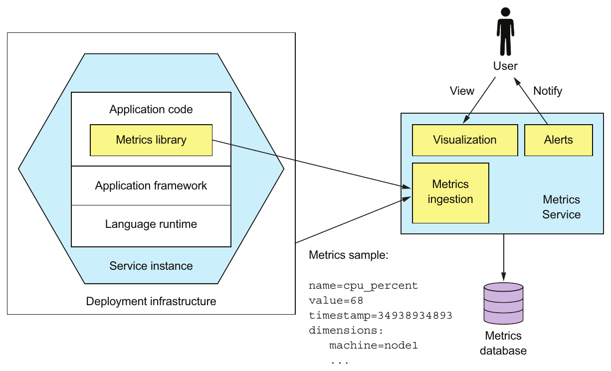

> **English:** Figure 11.14 Metrics at every level of the stack are collected and stored in a metrics service, which provides visualization and alerting.
>
> **Türkçe:** Şekil 11.14 Yığının her katmanındaki metrikler, görselleştirme ve uyarı olanakları sağlayan bir metrik servisinde toplanıp saklanır.

<!-- source-record: u11_0225 -->

> **English:** Metrics are sampled periodically. A metric sample has the following three properties:
>
> **Türkçe:** Metriklerden düzenli aralıklarla örnek alınır. Bir metrik örneğinin şu üç özelliği vardır:

<!-- source-record: u11_0226 -->

> **English:** • Name—The name of the metric, such as jvm_memory_max_bytes or placed_orders
>
> **Türkçe:** • Name (ad) — jvm_memory_max_bytes veya placed_orders gibi metriğin adı

<!-- source-record: u11_0227 -->

> **English:** • Value—A numeric value
>
> **Türkçe:** • Value (değer) — Sayısal değer

<!-- source-record: u11_0228 -->

> **English:** • Timestamp—The time of the sample
>
> **Türkçe:** • Timestamp (zaman damgası) — Örneğin alındığı zaman

<!-- source-record: u11_0229 -->

> **English:** In addition, some monitoring systems support the concept of dimensions, which are arbitrary name-value pairs. For example, jvm_memory_max_bytes is reported with dimensions such as area="heap",id="PS Eden Space" and area="heap",id="PS Old Gen". Dimensions are often used to provide additional information, such as the machine name or service name, or a service instance identifier. A monitoring system typically aggregates (sums or averages) metric samples along one or more dimensions.
>
> **Türkçe:** Ayrıca bazı izleme sistemleri, isteğe göre belirlenen ad-değer çiftleri olan dimension'ları (boyutları) destekler. Örneğin jvm_memory_max_bytes, area="heap",id="PS Eden Space" ve area="heap",id="PS Old Gen" gibi boyutlarla raporlanır. Boyutlar sıklıkla makine adı, servis adı veya servis örneği kimliği gibi ek bilgiler vermek için kullanılır. İzleme sistemi genellikle bir veya daha fazla boyut boyunca metrik örneklerini toplulaştırır; örneğin toplar ya da ortalamalarını alır.

<!-- source-record: u11_0230 -->

> **English:** Many aspects of monitoring are the responsibility of operations. But a service developer is responsible for two aspects of metrics. First, they must instrument their service so that it collects metrics about its behavior. Second, they must expose those service metrics, along with metrics from the JVM and the application framework, to the metrics server.
>
> **Türkçe:** İzlemenin birçok yönü operasyon ekibinin sorumluluğundadır. Ancak servis geliştirici metriklerle ilgili iki yönden sorumludur. İlk olarak servisini, davranışına ilişkin metrikleri toplayacak ölçüm koduyla donatmalıdır. İkinci olarak bu servis metriklerini JVM ve uygulama framework'ünden gelen metriklerle birlikte metrik sunucusuna sunmalıdır.

<!-- source-record: u11_0231 -->

> **English:** Let’s first look at how a service collects metrics.
>
> **Türkçe:** Önce servisin metrikleri nasıl topladığına bakalım.

<!-- source-record: u11_0232 -->

#### COLLECTING SERVICE-LEVEL METRICS — SERVİS DÜZEYİNDE METRİK TOPLAMA

<!-- source-record: u11_0233 -->

> **English:** How much work you need to do to collect metrics depends on the frameworks that your application uses and the metrics you want to collect. A Spring Boot-based service can, for example, gather (and expose) basic metrics, such as JVM metrics, by including the Micrometer Metrics library as a dependency and using a few lines of configuration. Spring Boot’s autoconfiguration takes care of configuring the metrics library and exposing the metrics. A service only needs to use the Micrometer Metrics API directly if it gathers application-specific metrics.
>
> **Türkçe:** Metrik toplamak için ne kadar iş yapmanız gerektiği, uygulamanızın kullandığı framework'lere ve toplamak istediğiniz metriklere bağlıdır. Örneğin Spring Boot tabanlı bir servis, Micrometer Metrics kütüphanesini bağımlılık olarak ekleyip birkaç satır yapılandırmayla JVM metrikleri gibi temel metrikleri toplayabilir ve sunabilir. Spring Boot'un otomatik yapılandırması, metrik kütüphanesini yapılandırır ve metrikleri dışarı sunar. Servisin Micrometer Metrics API'sini doğrudan kullanması, yalnızca uygulamaya özgü metrikler topluyorsa gerekir.

<!-- source-pages: 375 -->

<!-- source-record: u11_0234 -->

> **English:** The following listing shows how OrderService can collect metrics about the number of orders placed, approved, and rejected. It uses MeterRegistry, which is the interface provided by Micrometer Metrics, to gather custom metrics. Each method increments an appropriately named counter.
>
> **Türkçe:** Aşağıdaki liste, OrderService'in verilen, onaylanan ve reddedilen sipariş sayılarına ilişkin metrikleri nasıl toplayabileceğini gösterir. Özel metrikleri toplamak için Micrometer Metrics'in sağladığı MeterRegistry arayüzünü kullanır. Her metot uygun ad verilmiş bir sayacı artırır.

<!-- source-record: u11_0235 -->

#### Listing 11.1 OrderService tracks the number of orders placed, approved, and rejected. — Kod Listesi 11.1 OrderService verilen, onaylanan ve reddedilen sipariş sayılarını takip eder.

<!-- source-record: u11_0236 -->

```java
public class OrderService {

  @Autowired
  private MeterRegistry meterRegistry;

  public Order createOrder(...) {
    ...
    meterRegistry.counter("placed_orders").increment();
     return order;
  }

  public void approveOrder(long orderId) {
    ...
    meterRegistry.counter("approved_orders").increment();
   }

  public void rejectOrder(long orderId) {
    ...
    meterRegistry.counter("rejected_orders").increment();
   }
```

<!-- source-record: u11_0237 -->

**Kod açıklaması:**

> **English:** The Micrometer Metrics library API for managing application-specific meters
>
> **Türkçe:** Uygulamaya özgü ölçüm araçlarını yönetmek için Micrometer Metrics kütüphanesinin API'si

<!-- source-record: u11_0238 -->

**Kod açıklaması:**

> **English:** Increments the placedOrders counter when an order has successfully been placed
>
> **Türkçe:** Sipariş başarıyla verildiğinde placedOrders sayacını artırır

<!-- source-record: u11_0239 -->

**Kod açıklaması:**

> **English:** Increments the approvedOrders counter when an order has been approved
>
> **Türkçe:** Sipariş onaylandığında approvedOrders sayacını artırır

<!-- source-record: u11_0240 -->

**Kod açıklaması:**

> **English:** Increments the rejectedOrders counter when an order has been rejected
>
> **Türkçe:** Sipariş reddedildiğinde rejectedOrders sayacını artırır

<!-- source-record: u11_0241 -->

#### DELIVERING METRICS TO THE METRICS SERVICE — METRİKLERİ METRİK SERVİSİNE İLETME

<!-- source-record: u11_0242 -->

> **English:** A service delivers metrics to the Metrics Service in one of two ways: push or pull. With the push model, a service instance sends the metrics to the Metrics Service by invoking an API. AWS Cloudwatch metrics, for example, implements the push model.
>
> **Türkçe:** Servis, metrikleri Metrics Service'e iki yoldan biriyle iletir: push veya pull. Push model'de servis örneği bir API çağırarak metrikleri Metrics Service'e gönderir. Örneğin AWS CloudWatch metrics push model'i uygular.

<!-- source-record: u11_0243 -->

> **English:** With the pull model, the Metrics Service (or its agent running locally) invokes a service API to retrieve the metrics from the service instance. Prometheus, a popular open source monitoring and alerting system, uses the pull model.
>
> **Türkçe:** Pull model'de Metrics Service veya yerelde çalışan ajanı, servis örneğinden metrikleri almak için servis API'sini çağırır. Yaygın bir açık kaynak izleme ve uyarı sistemi olan Prometheus pull model'i kullanır.

<!-- source-record: u11_0244 -->

> **English:** The FTGO application’s Order Service uses the micrometer-registry-prometheus library to integrate with Prometheus. Because this library is on the classpath, Spring Boot exposes a GET /actuator/prometheus endpoint, which returns metrics in the format that Prometheus expects. The custom metrics from OrderService are reported as follows:
>
> **Türkçe:** FTGO uygulamasının Order Service'i, Prometheus ile entegrasyon için micrometer-registry-prometheus kütüphanesini kullanır. Kütüphane classpath'te bulunduğu için Spring Boot, metrikleri Prometheus'un beklediği biçimde döndüren GET /actuator/prometheus uç noktasını sunar. OrderService'in özel metrikleri şöyle raporlanır:

<!-- source-record: u11_0245 -->

```bash
$ curl -v http://localhost:8080/actuator/prometheus | grep _orders
# HELP placed_orders_total
# TYPE placed_orders_total counter
placed_orders_total{service="ftgo-order-service",} 1.0
# HELP approved_orders_total
# TYPE approved_orders_total counter
approved_orders_total{service="ftgo-order-service",} 1.0
```

<!-- source-pages: 376 -->

<!-- source-record: u11_0246 -->

> **English:** The placed_orders counter is, for example, reported as a metric of type counter.
>
> **Türkçe:** Örneğin placed_orders sayacı, counter türünde bir metrik olarak raporlanır.

<!-- source-record: u11_0247 -->

> **English:** The Prometheus server periodically polls this endpoint to retrieve metrics. Once the metrics are in Prometheus, you can view them using Grafana, a data visualization tool (https://grafana.com). You can also set up alerts for these metrics, such as when the rate of change for placed_orders_total falls below some threshold.
>
> **Türkçe:** Prometheus sunucusu metrikleri almak için bu uç noktayı düzenli aralıklarla sorgular. Metrikler Prometheus'a geldikten sonra veri görselleştirme aracı Grafana ile görüntülenebilir (https://grafana.com). Örneğin placed_orders_total değerinin değişim hızı belirli bir eşiğin altına düştüğünde tetiklenen uyarılar da oluşturabilirsiniz.

<!-- source-record: u11_0248 -->

> **English:** Application metrics provide valuable insights into your application’s behavior. Alerts triggered by metrics enable you to quickly respond to a production issue, perhaps before it impacts users. Let’s now look at how to observe and respond to another source of alerts: exceptions.
>
> **Türkçe:** Uygulama metrikleri, uygulamanızın davranışına ilişkin değerli bilgiler sağlar. Metriklerin tetiklediği uyarılar, üretimdeki sorunlara belki de kullanıcılar etkilenmeden hızlıca yanıt vermenizi sağlar. Şimdi başka bir uyarı kaynağını, istisnaları, nasıl gözlemleyip ele alacağımıza bakalım.

<!-- source-record: u11_0249 -->

### 11.3.5 Using the Exception tracking pattern — Exception tracking örüntüsünü kullanma

<!-- source-record: u11_0250 -->

> **English:** A service should rarely log an exception, and when it does, it’s important that you identify the root cause. The exception might be a symptom of a failure or a programming bug. The traditional way to view exceptions is to look in the logs. You might even configure the logging server to alert you if an exception appears in the log file. There are, however, several problems with this approach:
>
> **Türkçe:** Bir servisin loglarına istisna düşmesi seyrek olmalıdır; gerçekleştiğinde ise kök nedeni belirlemeniz önemlidir. İstisna, bir arızanın veya programlama hatasının belirtisi olabilir. İstisnaları incelemenin geleneksel yolu loglara bakmaktır. Log dosyasında istisna göründüğünde sizi uyarması için log sunucusunu yapılandırabilirsiniz. Ancak bu yaklaşımın çeşitli sorunları vardır:

<!-- source-record: u11_0251 -->

> **English:** • Log files are oriented around single-line log entries, whereas exceptions consist of multiple lines.
>
> **Türkçe:** • Log dosyaları tek satırlık kayıtlar etrafında düzenlenirken istisnalar birden fazla satırdan oluşur.

<!-- source-record: u11_0252 -->

> **English:** • There’s no mechanism to track the resolution of exceptions that occur in log files. You would have to manually copy/paste the exception into an issue tracker.
>
> **Türkçe:** • Log dosyalarında görülen istisnaların çözümünü takip eden bir mekanizma yoktur. İstisnayı elle kopyalayıp bir sorun takip sistemine yapıştırmanız gerekir.

<!-- source-record: u11_0253 -->

> **English:** • There are likely to be duplicate exceptions, but there’s no automatic mechanism to treat them as one.
>
> **Türkçe:** • Yinelenen istisnalar bulunması muhtemeldir; ancak bunları tek bir sorun olarak ele alan otomatik bir mekanizma yoktur.

<!-- source-record: u11_0254 -->

### Pattern: Exception tracking — Örüntü: Exception tracking (istisna takibi)

<!-- source-record: u11_0255 -->

> **English:** Services report exceptions to a central service that de-duplicates exceptions, generates alerts, and manages the resolution of exceptions. See http://microservices.io/patterns/observability/audit-logging.html.
>
> **Türkçe:** Servisler istisnaları; tekrarları birleştiren, uyarılar üreten ve istisnaların çözümünü yöneten merkezî bir servise bildirir. Bkz. http://microservices.io/patterns/observability/audit-logging.html.

> **Editör notu — kaynak bağlantısı:** Kaynak, Exception tracking açıklamasında Audit logging bağlantısını vermiştir. İlgili örüntü [Exception tracking](https://microservices.io/patterns/observability/exception-tracking.html) sayfasıdır; kaynak bağlantısı karşılaştırma için korunmuştur.

<!-- source-record: u11_0256 -->

> **English:** A better approach is to use an exception tracking service. As figure 11.15 shows, you configure your service to report exceptions to an exception tracking service via, for example, a REST API. The exception tracking service de-duplicates exceptions, generates alerts, and manages the resolution of exceptions.
>
> **Türkçe:** Daha iyi yaklaşım, bir istisna takip servisi kullanmaktır. Şekil 11.15'te gösterildiği gibi servisinizi, örneğin bir REST API üzerinden istisnaları takip servisine bildirecek biçimde yapılandırırsınız. Takip servisi yinelenen istisnaları birleştirir, uyarılar üretir ve çözümlerini yönetir.

<!-- source-record: u11_0257 -->

> **English:** There are a couple of ways to integrate the exception tracking service into your application. Your service could invoke the exception tracking service’s API directly. A better approach is to use a client library provided by the exception tracking service. For example, HoneyBadger’s client library provides several easy-to-use integration mechanisms, including a Servlet Filter that catches and reports exceptions.
>
> **Türkçe:** İstisna takip servisini uygulamanıza entegre etmenin birkaç yolu vardır. Servisiniz takip servisinin API'sini doğrudan çağırabilir. Daha iyi yaklaşım, takip servisinin sunduğu istemci kütüphanesini kullanmaktır. Örneğin HoneyBadger'ın istemci kütüphanesi, istisnaları yakalayıp bildiren bir Servlet Filter dâhil çeşitli kolay entegrasyon mekanizmaları sağlar.

<!-- source-pages: 377 -->

<!-- source-record: u11_0258 -->

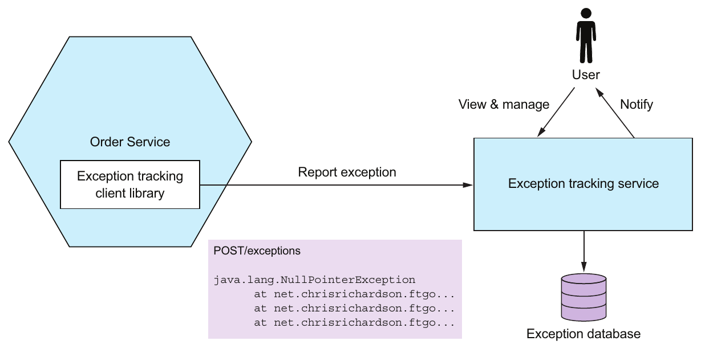

> **English:** Figure 11.15 A service reports exceptions to an exception tracking service, which de-duplicates exceptions and alerts developers. It has a UI for viewing and managing exceptions.
>
> **Türkçe:** Şekil 11.15 Servis, istisnaları tekrarları birleştiren ve geliştiricileri uyaran bir istisna takip servisine bildirir. Takip servisinin istisnaları görüntülemek ve yönetmek için bir kullanıcı arayüzü vardır.

<!-- source-record: u11_0259 -->

### Exception tracking services — İstisna takip servisleri

<!-- source-record: u11_0260 -->

> **English:** There are several exception tracking services. Some, such as Honeybadger (www.honeybadger.io), are purely cloud-based. Others, such as Sentry.io (https://sentry.io/welcome/), also have an open source version that you can deploy on your own infrastructure. These services receive exceptions from your application and generate alerts. They provide a console for viewing exceptions and managing their resolution. An exception tracking service typically provides client libraries in a variety of languages.
>
> **Türkçe:** Çeşitli istisna takip servisleri vardır. Honeybadger (www.honeybadger.io) gibi bazıları yalnızca bulut tabanlıdır. Sentry.io (https://sentry.io/welcome/) gibi diğerlerinin kendi altyapınızda dağıtabileceğiniz açık kaynak sürümü de bulunur. Bu servisler uygulamanızdan istisnaları alır ve uyarılar üretir. İstisnaları görüntülemek ve çözüm süreçlerini yönetmek için bir konsol sağlarlar. İstisna takip servisi genellikle çeşitli programlama dilleri için istemci kütüphaneleri sunar.

<!-- source-record: u11_0261 -->

> **English:** The Exception tracking pattern is a useful way to quickly identify and respond to production issues.
>
> **Türkçe:** Exception tracking örüntüsü, üretimdeki sorunları hızlıca belirleyip ele almanın yararlı bir yoludur.

<!-- source-record: u11_0262 -->

> **English:** It’s also important to track user behavior. Let’s look at how to do that.
>
> **Türkçe:** Kullanıcı davranışını takip etmek de önemlidir. Nasıl yapılacağına bakalım.

<!-- source-record: u11_0263 -->

### 11.3.6 Applying the Audit logging pattern — Audit logging örüntüsünü uygulama

<!-- source-record: u11_0264 -->

> **English:** The purpose of audit logging is to record each user’s actions. An audit log is typically used to help customer support, ensure compliance, and detect suspicious behavior. Each audit log entry records the identity of the user, the action they performed, and the business object(s). An application usually stores the audit log in a database table.
>
> **Türkçe:** Audit logging'in (denetim günlüğü tutmanın) amacı, her kullanıcının eylemlerini kaydetmektir. Denetim günlüğü genellikle müşteri desteğine yardımcı olmak, uyum gereksinimlerini karşılamak ve şüpheli davranışları saptamak için kullanılır. Her kayıt, kullanıcının kimliğini, yaptığı işlemi ve ilgili iş nesnelerini içerir. Uygulama denetim günlüğünü genellikle bir veritabanı tablosunda saklar.

<!-- source-record: u11_0265 -->

### Pattern: Audit logging — Örüntü: Audit logging (denetim günlüğü tutma)

<!-- source-record: u11_0266 -->

> **English:** Record user actions in a database in order to help customer support, ensure compliance, and detect suspicious behavior. See http://microservices.io/patterns/observability/audit-logging.html.
>
> **Türkçe:** Müşteri desteğine yardımcı olmak, uyum gereksinimlerini karşılamak ve şüpheli davranışları saptamak için kullanıcı eylemlerini veritabanına kaydedin. Bkz. http://microservices.io/patterns/observability/audit-logging.html.

> **English:** There are a few different ways to implement audit logging:
>
> **Türkçe:** Denetim günlüğünü gerçekleştirmenin birkaç farklı yolu vardır:

<!-- source-pages: 378 -->

<!-- source-record: u11_0267 -->

> **English:** • Add audit logging code to the business logic.
>
> **Türkçe:** • İş mantığına denetim günlüğü kodu eklemek.

<!-- source-record: u11_0268 -->

> **English:** • Use aspect-oriented programming (AOP).
>
> **Türkçe:** • Aspect-oriented programming (AOP) kullanmak.

<!-- source-record: u11_0269 -->

> **English:** • Use event sourcing.
>
> **Türkçe:** • Event sourcing kullanmak.

<!-- source-record: u11_0270 -->

> **English:** Let’s look at each option.
>
> **Türkçe:** Her seçeneğe bakalım.

<!-- source-record: u11_0271 -->

#### ADD AUDIT LOGGING CODE TO THE BUSINESS LOGIC — İŞ MANTIĞINA DENETİM GÜNLÜĞÜ KODU EKLEME

<!-- source-record: u11_0272 -->

> **English:** The first and most straightforward option is to sprinkle audit logging code throughout your service’s business logic. Each service method, for example, can create an audit log entry and save it in the database. The drawback with this approach is that it intertwines auditing logging code and business logic, which reduces maintainability. The other drawback is that it’s potentially error prone, because it relies on the developer writing audit logging code.
>
> **Türkçe:** İlk ve en doğrudan seçenek, servisinizin iş mantığının uygun yerlerine denetim günlüğü kodu eklemektir. Örneğin her servis metodu bir denetim kaydı oluşturup veritabanına kaydedebilir. Bu yaklaşımın dezavantajı, denetim kodunu iş mantığıyla iç içe geçirerek bakım yapılabilirliği azaltmasıdır. Diğer dezavantajı ise geliştiricinin bu kodu yazmasına bağlı olduğu için hataya açık olabilmesidir.

<!-- source-record: u11_0273 -->

#### USE ASPECT-ORIENTED PROGRAMMING — ASPECT-ORIENTED PROGRAMMING KULLANMA

<!-- source-record: u11_0274 -->

> **English:** The second option is to use AOP. You can use an AOP framework, such as Spring AOP, to define advice that automatically intercepts each service method call and persists an audit log entry. This is a much more reliable approach, because it automatically records every service method invocation. The main drawback of using AOP is that the advice only has access to the method name and its arguments, so it might be challenging to determine the business object being acted upon and generate a business-oriented audit log entry.
>
> **Türkçe:** İkinci seçenek AOP kullanmaktır. Spring AOP gibi bir framework ile her servis metodu çağrısının arasına otomatik girip denetim kaydını kalıcılaştıran bir advice tanımlayabilirsiniz. Her çağrıyı otomatik kaydettiği için bu çok daha güvenilir bir yaklaşımdır. Temel dezavantajı, advice'ın yalnızca metot adına ve argümanlarına erişebilmesidir. Bu yüzden üzerinde işlem yapılan iş nesnesini belirlemek ve iş açısından anlamlı bir denetim kaydı üretmek zor olabilir.

<!-- source-record: u11_0275 -->

#### USE EVENT SOURCING — EVENT SOURCING KULLANMA

<!-- source-record: u11_0276 -->

> **English:** The third and final option is to implement your business logic using event sourcing. As mentioned in chapter 6, event sourcing automatically provides an audit log for create and update operations. You need to record the identity of the user in each event. One limitation with using event sourcing, though, is that it doesn’t record queries. If your service must create log entries for queries, then you’ll have to use one of the other options as well.
>
> **Türkçe:** Üçüncü ve son seçenek, iş mantığını event sourcing ile gerçekleştirmektir. 6. bölümde belirtildiği gibi event sourcing, oluşturma ve güncelleme işlemleri için kendiliğinden bir denetim günlüğü sağlar. Her olaya kullanıcının kimliğini kaydetmeniz gerekir. Ancak event sourcing'in bir sınırlaması sorguları kaydetmemesidir. Servisiniz sorgular için de log kayıtları oluşturmak zorundaysa diğer seçeneklerden birini ayrıca kullanmanız gerekir.

<!-- source-record: u11_0277 -->

## 11.4 Developing services using the Microservice chassis pattern — Microservice chassis örüntüsüyle servis geliştirme

<!-- source-record: u11_0278 -->

> **English:** This chapter has described numerous concerns that a service must implement, including metrics, reporting exceptions to an exception tracker, logging and health checks, externalized configuration, and security. Moreover, as described in chapter 3, a service may also need to handle service discovery and implement circuit breakers. That’s not something you’d want to set up from scratch each time you implement a new service. If you did, it would potentially be days, if not weeks, before you wrote your first line of business logic.
>
> **Türkçe:** Bu bölümde servisin gerçekleştirmesi gereken çok sayıda ortak gereksinim anlatıldı: metrikler, istisnaları takip sistemine bildirme, loglama ve sağlık kontrolleri, dışarıdan yapılandırma ve güvenlik. Ayrıca 3. bölümde anlatıldığı gibi servis, service discovery'yi (servis keşfini) ele almak ve circuit breaker'lar (devre kesiciler) uygulamak zorunda da olabilir. Her yeni servis geliştirdiğinizde bunları sıfırdan kurmak istemezsiniz. Öyle yaparsanız ilk iş mantığı satırını yazmanız haftalar olmasa bile günler alabilir.

<!-- source-pages: 379 -->

<!-- source-record: u11_0279 -->

### Pattern: Microservice chassis — Örüntü: Microservice chassis (mikroservis temel çatısı)

<!-- source-record: u11_0280 -->

> **English:** Build services on a framework or collection of frameworks that handle cross-cutting concerns, such as exception tracking, logging, health checks, externalized configuration, and distributed tracing. See http://microservices.io/patterns/microservicechassis.html.
>
> **Türkçe:** Servislerinizi; istisna takibi, loglama, sağlık kontrolleri, dışarıdan yapılandırma ve dağıtık izleme gibi cross-cutting concern'leri (birçok bileşeni ilgilendiren ortak gereksinimleri) karşılayan bir framework veya framework kümesi üzerinde geliştirin. Bkz. http://microservices.io/patterns/microservicechassis.html.

<!-- source-record: u11_0281 -->

> **English:** A much faster way to develop services is to build your services upon a microservices chassis. As figure 11.16 shows, a microservice chassis is a framework or set of frameworks that handle these concerns. When using a microservice chassis, you write little, if any, code to handle these concerns.
>
> **Türkçe:** Servis geliştirmenin çok daha hızlı yolu, servisleri bir microservice chassis üzerinde kurmaktır. Şekil 11.16'da gösterildiği gibi microservice chassis, bu gereksinimleri karşılayan bir framework veya framework kümesidir. Böyle bir çatı kullandığınızda bu konular için çok az kod yazarsınız; hatta hiç yazmanız gerekmeyebilir.

<!-- source-record: u11_0282 -->

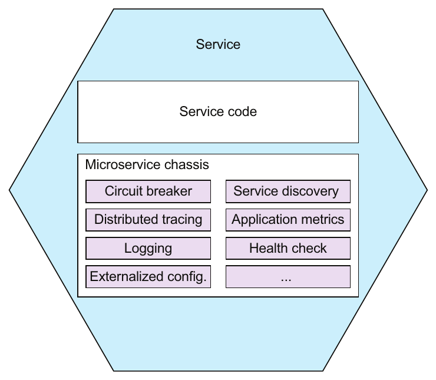

> **English:** Figure 11.16 A microservice chassis is a framework that handles numerous concerns, such as exception tracking, logging, health checks, externalized configuration, and distributed tracing.
>
> **Türkçe:** Şekil 11.16 Microservice chassis; istisna takibi, loglama, sağlık kontrolleri, dışarıdan yapılandırma ve dağıtık izleme gibi çok sayıda ortak gereksinimi karşılayan bir framework'tür.

<!-- source-record: u11_0283 -->

> **English:** In this section, I first describe the concept of a microservice chassis and suggest some excellent microservice chassis frameworks. After that I introduce the concept of a service mesh, which at the time of writing is emerging as an intriguing alternative to using frameworks and libraries.
>
> **Türkçe:** Bu kısımda önce microservice chassis kavramını anlatıyor ve bu amaçla kullanılabilecek bazı güçlü framework'ler öneriyorum. Ardından kitabın yazıldığı dönemde framework ve kütüphanelere ilgi çekici bir alternatif olarak ortaya çıkan service mesh kavramını tanıtıyorum.

<!-- source-record: u11_0284 -->

> **English:** Let’s first look at the idea of a microservice chassis.
>
> **Türkçe:** Önce microservice chassis fikrine bakalım.

<!-- source-record: u11_0285 -->

### 11.4.1 Using a microservice chassis — Microservice chassis kullanma

<!-- source-record: u11_0286 -->

> **English:** A microservices chassis is a framework or set of frameworks that handle numerous concerns including the following:
>
> **Türkçe:** Microservice chassis, şu konular dâhil çok sayıda ortak gereksinimi karşılayan bir framework veya framework kümesidir:

<!-- source-record: u11_0287 -->

> **English:** • Externalized configuration
>
> **Türkçe:** • Dışarıdan yapılandırma

<!-- source-record: u11_0288 -->

> **English:** • Health checks
>
> **Türkçe:** • Sağlık kontrolleri

<!-- source-record: u11_0289 -->

> **English:** • Application metrics
>
> **Türkçe:** • Uygulama metrikleri

<!-- source-record: u11_0290 -->

> **English:** • Service discovery
>
> **Türkçe:** • Servis keşfi

<!-- source-pages: 380 -->

<!-- source-record: u11_0291 -->

> **English:** • Circuit breakers
>
> **Türkçe:** • Circuit breaker'lar (devre kesiciler)

<!-- source-record: u11_0292 -->

> **English:** • Distributed tracing
>
> **Türkçe:** • Dağıtık izleme

<!-- source-record: u11_0293 -->

> **English:** It significantly reduces the amount of code you need to write. You may not even need to write any code. Instead, you configure the microservice chassis to fit your requirements. A microservice chassis enables you to focus on developing your service’s business logic.
>
> **Türkçe:** Yazmanız gereken kod miktarını önemli ölçüde azaltır. Hiç kod yazmanız bile gerekmeyebilir. Bunun yerine microservice chassis'i gereksinimlerinize göre yapılandırırsınız. Bu çatı, servisinizin iş mantığını geliştirmeye odaklanmanızı sağlar.

<!-- source-record: u11_0294 -->

> **English:** The FTGO application uses Spring Boot and Spring Cloud as the microservice chassis. Spring Boot provides functions such as externalized configuration. Spring Cloud provides functions such as circuit breakers. It also implements client-side service discovery, although the FTGO application relies on the infrastructure for service discovery. Spring Boot and Spring Cloud aren’t the only microservice chassis frameworks. If, for example, you’re writing services in GoLang, you could use either Go Kit (https://github.com/go-kit/kit) or Micro (https://github.com/micro/micro).
>
> **Türkçe:** FTGO uygulaması, microservice chassis olarak Spring Boot ve Spring Cloud kullanır. Spring Boot dışarıdan yapılandırma gibi işlevler sağlar. Spring Cloud ise circuit breaker gibi işlevler sunar. İstemci tarafında servis keşfini de gerçekleştirir; ancak FTGO uygulaması servis keşfi için altyapıya dayanır. Spring Boot ve Spring Cloud, tek microservice chassis framework'leri değildir. Örneğin GoLang ile servis yazıyorsanız Go Kit (https://github.com/go-kit/kit) veya Micro (https://github.com/micro/micro) kullanabilirsiniz.

<!-- source-record: u11_0295 -->

> **English:** One drawback of using a microservice chassis is that you need one for every language/platform combination that you use to develop services. Fortunately, it’s likely that many of the functions implemented by a microservice chassis will instead be implemented by the infrastructure. For example, as described in chapter 3, many deployment environments handle service discovery. What’s more, many of the networkrelated functions of a microservice chassis will be handled by what’s known as a service mesh, an infrastructure layer running outside of the services.
>
> **Türkçe:** Microservice chassis kullanmanın bir dezavantajı, servis geliştirmede kullandığınız her dil/platform birleşimi için ayrı bir çatıya ihtiyaç duymanızdır. Neyse ki böyle bir çatının sağladığı işlevlerin çoğunun bunun yerine altyapı tarafından gerçekleştirilmesi olasıdır. Örneğin 3. bölümde anlatıldığı gibi birçok dağıtım ortamı servis keşfini ele alır. Ayrıca microservice chassis'in ağla ilgili birçok işlevi, servislerin dışında çalışan ve service mesh denen altyapı katmanı tarafından gerçekleştirilecektir.

<!-- source-record: u11_0296 -->

### 11.4.2 From microservice chassis to service mesh — Microservice chassis'ten service mesh'e

<!-- source-record: u11_0297 -->

> **English:** A microservice chassis is a good way to implement various cross-cutting concerns, such as circuit breakers. But one obstacle to using a microservice chassis is that you need one for each programming language you use. For example, Spring Boot and Spring Cloud are useful if you’re a Java/Spring developer, but they aren’t any help if you want to write a NodeJS-based service.
>
> **Türkçe:** Microservice chassis, circuit breaker gibi çeşitli ortak gereksinimleri gerçekleştirmenin iyi bir yoludur. Ancak önündeki engellerden biri, kullandığınız her programlama dili için ayrı bir çatıya ihtiyaç duymanızdır. Örneğin Java/Spring geliştiriciyseniz Spring Boot ve Spring Cloud yararlıdır; fakat NodeJS tabanlı servis yazmak istediğinizde yardımcı olmazlar.

<!-- source-record: u11_0298 -->

### Pattern: Service mesh — Örüntü: Service mesh (servis ağı)

<!-- source-record: u11_0299 -->

> **English:** Route all network traffic in and out of services through a networking layer that implements various concerns, including circuit breakers, distributed tracing, service discovery, load balancing, and rule-based traffic routing. See http://microservices.io/patterns/deployment/service-mesh.html.
>
> **Türkçe:** Servislere giren ve servislerden çıkan tüm ağ trafiğini; circuit breaker, dağıtık izleme, servis keşfi, yük dengeleme ve kural tabanlı trafik yönlendirme gibi çeşitli ortak gereksinimleri gerçekleştiren bir ağ katmanından geçirin. Bkz. http://microservices.io/patterns/deployment/service-mesh.html.

<!-- source-record: u11_0300 -->

> **English:** An emerging alternative that avoids this problem is to implement some of this functionality outside of the service in what’s known as a service mesh. A service mesh is networking infrastructure that mediates the communication between a service and other services and external applications. As figure 11.17 shows, all network traffic in and out of a service goes through the service mesh. It implements various concerns including circuit breakers, distributed tracing, service discovery, load balancing, and rule-based traffic routing. A service mesh can also secure interprocess communication by using TLS-based IPC between services. As a result, you no longer need to implement these particular concerns in the services.
>
> **Türkçe:** Bu sorunu önleyen ve yeni gelişmekte olan alternatif, bu işlevlerin bir kısmını servisin dışında, service mesh denen yapıda gerçekleştirmektir. Service mesh, bir servis ile diğer servisler ve haricî uygulamalar arasındaki iletişime aracılık eden ağ altyapısıdır. Şekil 11.17'de gösterildiği gibi servise giren ve servisten çıkan tüm trafik service mesh'ten geçer. Circuit breaker, dağıtık izleme, servis keşfi, yük dengeleme ve kural tabanlı trafik yönlendirme dâhil çeşitli gereksinimleri gerçekleştirir. Servisler arasında TLS tabanlı IPC kullanarak süreçler arası iletişimi de güvenli hâle getirebilir. Böylece bu konuları artık servislerin içinde gerçekleştirmeniz gerekmez.

<!-- source-pages: 381 -->

<!-- source-record: u11_0301 -->

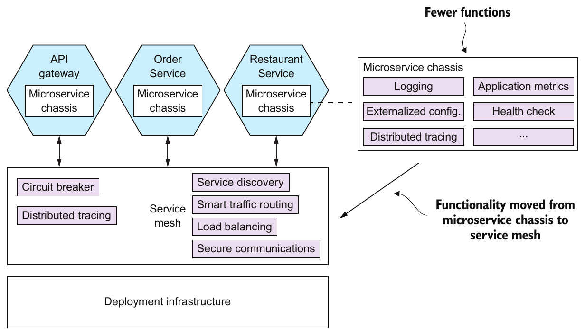

> **English:** Figure 11.17 All network traffic in and out of a service flows through the service mesh. The service mesh implements various functions including circuit breakers, distributed tracing, service discovery, and load balancing. Fewer functions are implemented by the microservice chassis. It also secures interprocess communication by using TLS-based IPC between services.
>
> **Türkçe:** Şekil 11.17 Servise giren ve servisten çıkan tüm ağ trafiği service mesh üzerinden akar. Service mesh; circuit breaker, dağıtık izleme, servis keşfi ve yük dengeleme dâhil çeşitli işlevler gerçekleştirir. Microservice chassis'in gerçekleştirdiği işlevler azalır. Service mesh, servisler arasında TLS tabanlı IPC kullanarak süreçler arası iletişimi de güvenli hâle getirir.

<!-- source-record: u11_0302 -->

> **English:** When using a service mesh, the microservice chassis is much simpler. It only needs to implement concerns that are tightly integrated with the application code, such as externalized configuration and health checks. The microservice chassis must support distributed tracing by propagating distributed tracing information, such as the B3 standard headers I discussed earlier in section 11.3.3.
>
> **Türkçe:** Service mesh kullanıldığında microservice chassis çok daha basit olur. Yalnızca dışarıdan yapılandırma ve sağlık kontrolleri gibi uygulama koduyla sıkı biçimde bütünleşmiş konuları gerçekleştirmesi gerekir. Chassis, 11.3.3'te ele aldığım B3 standart başlıkları gibi dağıtık izleme bilgilerini aktararak dağıtık izlemeyi desteklemelidir.

<!-- source-record: u11_0303 -->

### The current state of service mesh implementations — Service mesh gerçekleştirimlerinin mevcut durumu

<!-- source-record: u11_0304 -->

> **English:** There are various service mesh implementations, including the following:
>
> **Türkçe:** Çeşitli service mesh gerçekleştirimleri vardır; bazıları şunlardır:

<!-- source-record: u11_0305 -->

> **English:** • Istio (https://istio.io)
>
> **Türkçe:** • Istio (https://istio.io)

<!-- source-record: u11_0306 -->

> **English:** • Linkerd (https://linkerd.io)
>
> **Türkçe:** • Linkerd (https://linkerd.io)

<!-- source-record: u11_0307 -->

> **English:** • Conduit (https://conduit.io)
>
> **Türkçe:** • Conduit (https://conduit.io)

<!-- source-record: u11_0308 -->

> **English:** As of the time of writing, Linkerd is the most mature, with Istio and Conduit still under active development. For more information about this exciting new technology, take a look at each product’s documentation.
>
> **Türkçe:** Kitabın yazıldığı dönemde Linkerd bunlar arasında en olgun olanıdır; Istio ve Conduit ise hâlâ etkin biçimde geliştirilmektedir. Bu heyecan verici yeni teknoloji hakkında daha fazla bilgi için her ürünün dokümantasyonuna bakabilirsiniz.

> **Tarihsel bağlam:** “Mevcut durum” ve ürünlerin olgunluk karşılaştırması kitabın yazıldığı döneme aittir. Bu paragraf güncel ürün sıralaması olarak okunmamalıdır.

<!-- source-record: u11_0309 -->

> **English:** The service mesh concept is an extremely promising idea. It frees the developer from having to deal with various cross-cutting concerns. Also, the ability of a service mesh to route traffic enables you to separate deployment from release. It gives you the ability to deploy a new version of a service into production but only release it to certain users, such as internal test users. Chapter 12 discusses this concept further when describing how to deploy services using Kubernetes.
>
> **Türkçe:** Service mesh son derece umut verici bir fikirdir. Geliştiriciyi çeşitli ortak gereksinimlerle uğraşmaktan kurtarır. Ayrıca trafik yönlendirme yeteneği, deployment (üretim ortamına dağıtma) ile release'i (kullanıma açma) ayırmanıza olanak tanır. Servisin yeni sürümünü üretime dağıtıp yalnızca iç test kullanıcıları gibi belirli kullanıcılara açabilirsiniz. 12. bölüm, Kubernetes ile servis dağıtımını anlatırken bu kavramı daha ayrıntılı ele alır.

<!-- source-pages: 382 -->

<!-- source-record: u11_0310 -->

## Summary — Bölüm özeti

<!-- source-record: u11_0311 -->

> **English:** • It’s essential that a service implements its functional requirements, but it must also be secure, configurable, and observable.
>
> **Türkçe:** • Servisin işlevsel gereksinimlerini gerçekleştirmesi zorunludur; bunun yanında güvenli, yapılandırılabilir ve gözlemlenebilir de olmalıdır.

<!-- source-record: u11_0312 -->

> **English:** • Many aspects of security in a microservice architecture are no different than in a monolithic architecture. But there are some aspects of application security that are necessarily different, including how user identity is passed between the API gateway and the services and who is responsible for authentication and authorization. A commonly used approach is for the API gateway to authenticate clients. The API gateway includes a transparent token, such as a JWT, in each request to a service. The token contains the identity of the principal and their roles. The services use the information in the token to authorize access to resources. OAuth 2.0 is a good foundation for security in a microservice architecture.
>
> **Türkçe:** • Mikroservis mimarisinde güvenliğin birçok yönü monolitik mimaridekinden farklı değildir. Ancak kullanıcı kimliğinin API gateway ile servisler arasında nasıl aktarıldığı ve kimlik doğrulama ile yetkilendirmeden kimin sorumlu olduğu gibi bazı yönler zorunlu olarak farklıdır. Yaygın bir yaklaşım, istemcilerin kimliğini API gateway'in doğrulamasıdır. Gateway, servislere gönderdiği her isteğe JWT gibi içeriği okunabilir bir belirteç ekler. Belirteç principal'ın kimliğini ve rollerini içerir. Servisler bu bilgileri kaynaklara erişimi yetkilendirmek için kullanır. OAuth 2.0, mikroservis mimarisinde güvenlik için iyi bir temel sağlar.

<!-- source-record: u11_0313 -->

> **English:** • A service typically uses one or more external services, such as message brokers and databases. The network location and credentials of each external service often depend on the environment that the service is running in. You must apply the Externalized configuration pattern and implement a mechanism that provides a service with configuration properties at runtime. One commonly used approach is for the deployment infrastructure to supply those properties via operating system environment variables or a properties file when it creates a service instance. Another option is for a service instance to retrieve its configuration from a configuration properties server.
>
> **Türkçe:** • Servisler genellikle mesaj broker'ları ve veritabanları gibi bir veya daha fazla haricî servis kullanır. Her haricî servisin ağ konumu ve kimlik bilgileri çoğunlukla çalışılan ortama bağlıdır. Externalized configuration örüntüsünü uygulamalı ve servise yapılandırma özelliklerini çalışma zamanında sağlayan bir mekanizma geliştirmelisiniz. Yaygın bir yaklaşım, dağıtım altyapısının servis örneğini oluştururken özellikleri işletim sistemi ortam değişkenleri veya bir properties dosyasıyla sunmasıdır. Diğer seçenek, servis örneğinin yapılandırmasını bir yapılandırma özellikleri sunucusundan almasıdır.

<!-- source-record: u11_0314 -->

> **English:** • Operations and developers share responsibility for implementing the observability patterns. Operations is responsible for the observability infrastructure, such as servers that handle log aggregation, metrics, exception tracking, and distributed tracing. Developers are responsible for ensuring that their services are observable. Services must have health check API endpoints, generate log entries, collect and expose metrics, report exceptions to an exception tracking service, and implement distributed tracing.
>
> **Türkçe:** • Gözlemlenebilirlik örüntülerinin uygulanmasından operasyon ekibi ile geliştiriciler birlikte sorumludur. Operasyon ekibi; log toplama, metrikler, istisna takibi ve dağıtık izleme sunucuları gibi gözlemlenebilirlik altyapısından sorumludur. Geliştiriciler servislerin gözlemlenebilir olmasını sağlar. Servisler sağlık kontrolü API uç noktaları sunmalı, log kayıtları üretmeli, metrikleri toplayıp dışarı sunmalı, istisnaları takip servisine bildirmeli ve dağıtık izlemeyi gerçekleştirmelidir.

<!-- source-record: u11_0315 -->

> **English:** • In order to simplify and accelerate development, you should develop services on top of a microservices chassis. A microservices chassis is framework or set of frameworks that handle various cross-cutting concerns, including those described in this chapter. Over time, though, it’s likely that many of the networkingrelated functions of a microservice chassis will migrate into a service mesh, a layer of infrastructure software through which all of a service’s network traffic flows.
>
> **Türkçe:** • Geliştirmeyi basitleştirip hızlandırmak için servisleri bir microservice chassis üzerinde geliştirmelisiniz. Bu çatı, bu bölümdekiler dâhil çeşitli ortak gereksinimleri karşılayan bir framework veya framework kümesidir. Zamanla çatının ağla ilgili birçok işlevinin, servisin tüm ağ trafiğinin içinden geçtiği bir altyapı yazılım katmanı olan service mesh'e taşınması olasıdır.
