# Ünite 12 · Deploying microservices — Mikroservisleri dağıtma

**Amaç:** Mikroservisleri dağıtma konusunu İngilizce–Türkçe karşılaştırmalı çalışmak; teknik açıklamaları özgün şekiller, tablolar ve kod örnekleriyle birlikte okumak.

**Kaynak:** Kullanıcının sağladığı *Microservices Patterns*, bölüm 12; `Microservices_Patterns_1_Bolumden_Itibaren.pdf`, kaynak PDF sayfaları **383–427**. Başlık ve metin sırası korunmuş, sayfa sonlarında bölünen paragraflar birleştirilmiştir. Şekiller, üzerlerindeki yazılar korunarak kaynak PDF'den alınmıştır.

**Okuma notu:** Teknoloji ve şirket örnekleri kitabın yazıldığı dönemin anlatımıdır. Kodlar kaynakta verilen bağlama bağlı örneklerdir; bağımsız Java 17 programları olarak sunulmaz. İngilizce kaynak ve Türkçe çeviri ardışık bloklardadır. Bu ünitenin Türkçe çevirisi kaynak kayıtları tek tek okunarak hazırlanmıştır; yerel makine çevirisi çıktısı kullanılmamıştır. Kitaptaki Java 8, Kubernetes ve Istio sürümlerine ait örnekler tarihsel kaynak içeriğidir; Java 17 veya güncel platformlar için çalıştırılabilir dağıtım reçetesi değildir.

**Dil çalışması:** [Ünite sözlüğü](vocabulary.md) · [Vocabulary PDF](vocabulary.pdf) · [Grammar notları](grammar_notes.md) · [Grammar PDF](grammar_notes.pdf). Kelime anlamları ve cümle yapılarının ayrıntıları bu iki eşlikçi kaynaktadır.

<!-- source-pages: 383 -->

<!-- source-record: u12_0000 -->

## This chapter covers — Bu bölümün kapsamı

<!-- source-record: u12_0001 -->

> **English:** • The four key deployment patterns, how they work, and their benefits and drawbacks: – Language-specific packaging format – Deploying a service as a VM – Deploying a service as a container – Serverless deployment
>
> **Türkçe:** • Dört temel deployment (dağıtım) örüntüsü, bunların işleyişi, yararları ve sakıncaları: – Dile özgü paketleme biçimi – Servisi VM olarak dağıtma – Servisi container olarak dağıtma – Serverless dağıtım

<!-- source-record: u12_0002 -->

> **English:** • Deploying services with Kubernetes
>
> **Türkçe:** • Servisleri Kubernetes ile dağıtma

<!-- source-record: u12_0003 -->

> **English:** • Using a service mesh to separate deployment from release
>
> **Türkçe:** • Deployment ile release süreçlerini ayırmak için service mesh kullanma

<!-- source-record: u12_0004 -->

> **English:** • Deploying services with AWS Lambda
>
> **Türkçe:** • Servisleri AWS Lambda ile dağıtma

<!-- source-record: u12_0005 -->

> **English:** • Picking a deployment pattern
>
> **Türkçe:** • Bir dağıtım örüntüsü seçme

<!-- source-record: u12_0006 -->

> **English:** Mary and her team at FTGO are almost finished writing their first service. Although it’s not yet feature complete, it’s running on developer laptops and the Jenkins CI server. But that’s not good enough. Software has no value to FTGO until it’s running in production and available to users. FTGO needs to deploy their service into production.
>
> **Türkçe:** Mary ve FTGO’daki ekibi, ilk servislerini yazmayı neredeyse tamamladı. Henüz bütün özellikleri hazır olmasa da servis, geliştiricilerin dizüstü bilgisayarlarında ve Jenkins CI sunucusunda çalışıyor. Fakat bu yeterli değil. Yazılım, production (canlı) ortamında çalışıp kullanıcıların erişimine açılmadıkça FTGO’ya değer sağlamaz. FTGO’nun servisini canlı ortama dağıtması gerekiyor.

> **English:** Deployment is a combination of two interrelated concepts: process and architecture. The deployment process consists of the steps that must be performed by people— developers and operations—in order to get software into production. The deployment architecture defines the structure of the environment in which that software runs. Both aspects of deployment have changed radically since I first started developing Enterprise Java applications in the late 1990s. The manual process of developers throwing code over the wall to production has become highly automated. As figure 12.1 shows, physical production environments have been replaced by increasingly lightweight and ephemeral computing infrastructure.
>
> **Türkçe:** Deployment, birbiriyle ilişkili iki kavramın birleşimidir: süreç ve mimari. Dağıtım süreci, yazılımı canlı ortama almak için insanların — geliştiricilerin ve operasyon ekibinin — gerçekleştirmesi gereken adımlardan oluşur. Dağıtım mimarisi ise yazılımın çalıştığı ortamın yapısını tanımlar. Enterprise Java uygulamaları geliştirmeye başladığım 1990’ların sonlarından bu yana dağıtımın her iki yönü de köklü biçimde değişti. Geliştiricilerin kodu bir duvarın öte yanına atar gibi canlı ortamdan sorumlu ekibe devrettiği elle yürütülen süreç, büyük ölçüde otomatikleşti. Şekil 12.1’de görüldüğü gibi fiziksel canlı ortamların yerini giderek daha hafif ve kısa ömürlü bilgi işlem altyapıları aldı.

<!-- source-pages: 384 -->

<!-- source-record: u12_0007 -->

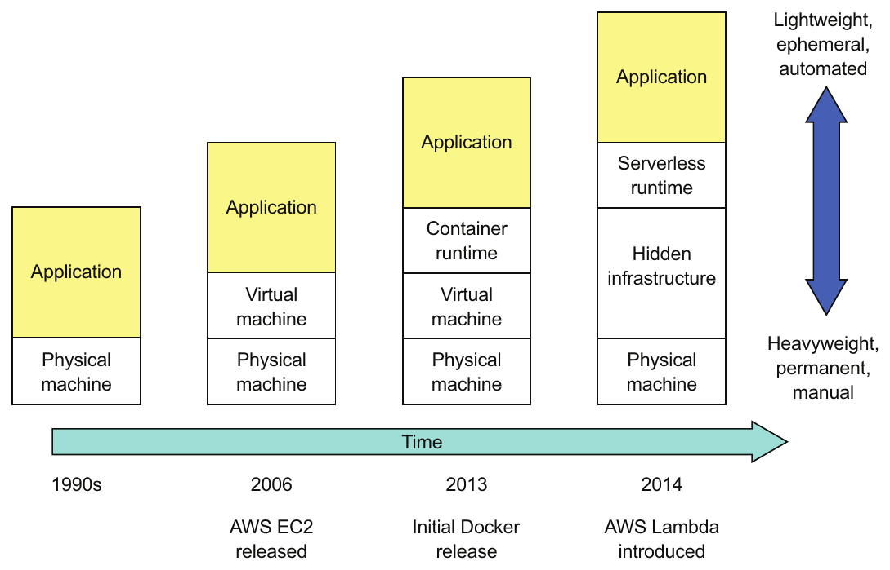

> **English:** Figure 12.1 Heavyweight and long-lived physical machines have been abstracted away by increasingly lightweight and ephemeral technologies.
>
> **Türkçe:** Şekil 12.1 Ağır ve uzun ömürlü fiziksel makineler, giderek daha hafif ve kısa ömürlü teknolojilerle soyutlandı.

<!-- source-record: u12_0008 -->

> **English:** Back in the 1990s, if you wanted to deploy an application into production, the first step was to throw your application along with a set of operating instructions over the wall to operations. You might, for example, file a trouble ticket asking operations to deploy the application. Whatever happened next was entirely the responsibility of operations, unless they encountered a problem they needed your help to fix. Typically, operations bought and installed expensive and heavyweight application servers such as WebLogic or WebSphere. Then they would log in to the application server console and deploy your applications. They would lovingly care for those machines, as if they were pets, installing patches and updating the software.
>
> **Türkçe:** 1990’larda bir uygulamayı canlı ortama dağıtmak istediğinizde ilk adım, uygulamayı bir dizi işletim talimatıyla birlikte, bir duvarın öte yanına atar gibi operasyon ekibine teslim etmekti. Örneğin operasyon ekibinden uygulamayı dağıtmasını isteyen bir destek kaydı açabilirdiniz. Çözmek için yardımınıza ihtiyaç duydukları bir sorunla karşılaşmadıkları sürece, bundan sonra olan her şey tamamen operasyon ekibinin sorumluluğundaydı. Ekip genellikle WebLogic veya WebSphere gibi pahalı ve ağır uygulama sunucularını satın alıp kurardı. Ardından uygulama sunucusunun konsoluna giriş yapıp uygulamalarınızı dağıtırdı. Bu makinelere evcil hayvanlarıymış gibi özen gösterir; yamaları kurar, yazılımları güncellerdi.

<!-- source-record: u12_0009 -->

> **English:** In the mid 2000s, the expensive application servers were replaced with open source, lightweight web containers such as Apache Tomcat and Jetty. You could still run multiple applications on each web container, but having one application per web container became feasible. Also, virtual machines started to replace physical machines. But machines were still treated as beloved pets, and deployment was still a fundamentally manual process.
>
> **Türkçe:** 2000’lerin ortalarında pahalı uygulama sunucularının yerini Apache Tomcat ve Jetty gibi açık kaynaklı, hafif web container’ları aldı. Her web container’ında birden fazla uygulama çalıştırmak hâlâ mümkündü; fakat her web container’ında tek uygulama çalıştırmak da uygulanabilir hâle geldi. Ayrıca fiziksel makinelerin yerini sanal makineler almaya başladı. Buna rağmen makinelere hâlâ sevilen evcil hayvanlar gibi davranılıyor, dağıtım ise temelde elle yürütülen bir süreç olmayı sürdürüyordu.

<!-- source-pages: 385 -->

<!-- source-record: u12_0010 -->

> **English:** Today, the deployment process is radically different. Instead of handing off code to a separate production team, the adoption of DevOps means that the development team is also responsible for deploying their application or services. In some organizations, operations provides developers with a console for deploying their code. Or, better yet, once the tests pass, the deployment pipeline automatically deploys the code into production.
>
> **Türkçe:** Bugün dağıtım süreci köklü biçimde farklıdır. DevOps’un benimsenmesiyle, kodu ayrı bir canlı ortam ekibine devretmek yerine geliştirme ekibi kendi uygulamasını veya servislerini dağıtmaktan da sorumlu olur. Bazı kuruluşlarda operasyon ekibi, geliştiricilere kodlarını dağıtabilecekleri bir konsol sağlar. Daha iyi bir düzende ise testler geçer geçmez deployment pipeline (dağıtım hattı) kodu otomatik olarak canlı ortama dağıtır.

<!-- source-record: u12_0011 -->

> **English:** The computing resources used in a production environment have also changed radically with physical machines being abstracted away. Virtual machines running on a highly automated cloud, such as AWS, have replaced the long-lived, pet-like physical and virtual machines. Today’s virtual machines are immutable. They’re treated as disposable cattle instead of pets and are discarded and recreated rather than being reconfigured. Containers, an even more lightweight abstraction layer on top of virtual machines, are an increasingly popular way of deploying applications. You can also use an even more lightweight serverless deployment platform, such as AWS Lambda, for many use cases.
>
> **Türkçe:** Canlı ortamda kullanılan bilgi işlem kaynakları da fiziksel makinelerin soyutlanmasıyla köklü biçimde değişti. AWS gibi büyük ölçüde otomatikleştirilmiş bir bulutta çalışan sanal makineler, uzun ömürlü ve evcil hayvan gibi bakılan fiziksel ve sanal makinelerin yerini aldı. Günümüzün sanal makineleri immutable (değiştirilemez) kabul edilir. Evcil hayvanlar yerine kolayca yenisiyle değiştirilebilen sürü hayvanları gibi ele alınırlar; yeniden yapılandırılmak yerine atılıp yeniden oluşturulurlar. Sanal makinelerin üzerinde daha da hafif bir soyutlama katmanı sağlayan container’lar, uygulama dağıtımında giderek yaygınlaşmaktadır. Birçok kullanım durumunda AWS Lambda gibi daha da hafif bir serverless (sunucusuz) dağıtım platformu da kullanılabilir.

<!-- source-record: u12_0012 -->

> **English:** It’s no coincidence that the evolution of deployment processes and architectures has coincided with the growing adoption of the microservice architecture. An application might have tens or hundreds of services written in a variety of languages and frameworks. Because each service is a small application, that means you have tens or hundreds of applications in production. It’s no longer practical, for example, for system administrators to hand configure servers and services. If you want to deploy microservices at scale, you need a highly automated deployment process and infrastructure.
>
> **Türkçe:** Dağıtım süreçleri ve mimarilerinin evriminin, mikroservis mimarisinin giderek yaygınlaşmasıyla aynı döneme rastlaması tesadüf değildir. Bir uygulama, çeşitli diller ve framework’lerle yazılmış onlarca ya da yüzlerce servisten oluşabilir. Her servis küçük bir uygulama olduğundan, bu durum canlı ortamda onlarca ya da yüzlerce uygulamanızın bulunması demektir. Örneğin sistem yöneticilerinin sunucuları ve servisleri elle yapılandırması artık uygulanabilir değildir. Mikroservisleri büyük ölçekte dağıtmak istiyorsanız büyük ölçüde otomatikleştirilmiş bir dağıtım sürecine ve altyapısına ihtiyaç duyarsınız.

<!-- source-record: u12_0013 -->

> **English:** Figure 12.2 shows a high-level view of a production environment. The production environment enables developers to configure and manage their services, the deployment pipeline to deploy new versions of services, and users to access functionality implemented by those services.
>
> **Türkçe:** Şekil 12.2, canlı ortamın üst düzey görünümünü gösterir. Canlı ortam, geliştiricilerin servislerini yapılandırıp yönetmesini, dağıtım hattının servislerin yeni sürümlerini dağıtmasını ve kullanıcıların bu servislerin gerçekleştirdiği işlevlere erişmesini sağlar.

<!-- source-record: u12_0014 -->

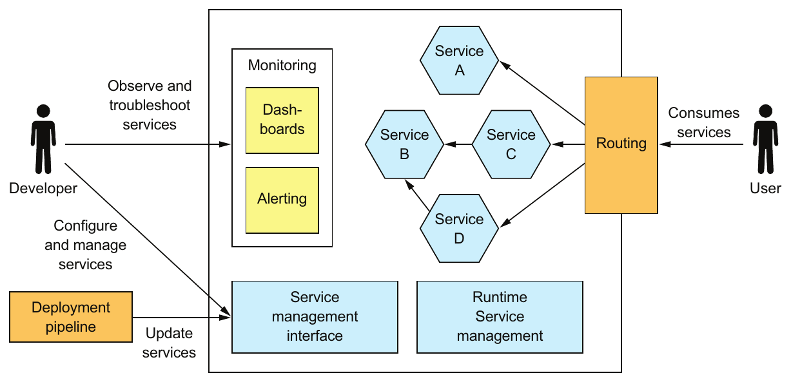

> **English:** Figure 12.2 A simplified view of the production environment. It provides four main capabilities: service management enables developers to deploy and manage their services, runtime management ensures that the services are running, monitoring visualizes service behavior and generates alerts, and request routing routes requests from users to the services.
>
> **Türkçe:** Şekil 12.2 Canlı ortamın basitleştirilmiş görünümü. Dört temel yetenek sağlar: servis yönetimi, geliştiricilerin servislerini dağıtıp yönetmesini sağlar; çalışma zamanı yönetimi, servislerin çalışır durumda kalmasını sağlar; izleme, servis davranışını görselleştirip uyarılar üretir; istek yönlendirme ise kullanıcılardan gelen istekleri servislere yönlendirir.

<!-- source-pages: 386 -->

<!-- source-record: u12_0015 -->

> **English:** A production environment must implement four key capabilities:
>
> **Türkçe:** Bir canlı ortam dört temel yeteneği gerçekleştirmelidir:

<!-- source-record: u12_0016 -->

> **English:** • Service management interface—Enables developers to create, update, and configure services. Ideally, this interface is a REST API invoked by command-line and GUI deployment tools.
>
> **Türkçe:** • Servis yönetimi arayüzü — Geliştiricilerin servis oluşturmasını, güncellemesini ve yapılandırmasını sağlar. İdeal olarak bu arayüz, komut satırı ve grafik arayüzlü dağıtım araçlarının çağırdığı bir REST API’dir.

<!-- source-record: u12_0017 -->

> **English:** • Runtime service management—Attempts to ensure that the desired number of service instances is running at all times. If a service instance crashes or is somehow unable to handle requests, the production environment must restart it. If a machine crashes, the production environment must restart those service instances on a different machine.
>
> **Türkçe:** • Çalışma zamanında servis yönetimi — İstenen sayıda servis örneğinin her an çalışır durumda olmasını sağlamaya çalışır. Bir servis örneği çöker veya herhangi bir nedenle istekleri işleyemez duruma gelirse canlı ortam onu yeniden başlatmalıdır. Bir makine çökerse canlı ortam o makinedeki servis örneklerini başka bir makinede yeniden başlatmalıdır.

<!-- source-record: u12_0018 -->

> **English:** • Monitoring—Provides developers with insight into what their services are doing, including log files and metrics. If there are problems, the production environment must alert the developers. Chapter 11 describes monitoring, also called observability.
>
> **Türkçe:** • İzleme — Log dosyaları ve metrikler dâhil olmak üzere, geliştiricilerin servislerinin ne yaptığını anlamasını sağlar. Sorun oluştuğunda canlı ortam geliştiricileri uyarmalıdır. Monitoring olarak adlandırılan ve observability (gözlemlenebilirlik) adıyla da ele alınan konu 11. bölümde açıklanır.

<!-- source-record: u12_0019 -->

> **English:** • Request routing—Routes requests from users to the services.
>
> **Türkçe:** • İstek yönlendirme — Kullanıcılardan gelen istekleri servislere yönlendirir.

<!-- source-record: u12_0020 -->

> **English:** In this chapter I discuss the four main deployment options:
>
> **Türkçe:** Bu bölümde dört ana dağıtım seçeneğini ele alıyorum:

<!-- source-record: u12_0021 -->

> **English:** • Deploying services as language-specific packages, such as Java JAR or WAR files. It’s worthwhile exploring this option, because even though I recommend using one of the other options, its drawbacks motivate the other options.
>
> **Türkçe:** • Servisleri Java JAR veya WAR dosyaları gibi dile özgü paketler hâlinde dağıtmak. Diğer seçeneklerden birini kullanmanızı önersem de bu seçeneği incelemek yararlıdır; çünkü sakıncaları diğer seçeneklere neden ihtiyaç duyulduğunu açıklar.

<!-- source-record: u12_0022 -->

> **English:** • Deploying services as virtual machines, which simplifies deployment by packaging a service as a virtual machine image that encapsulates the service’s technology stack.
>
> **Türkçe:** • Servisleri sanal makine olarak dağıtmak. Bu yaklaşım, servisi teknoloji yığınını kapsülleyen bir sanal makine imajı olarak paketleyerek dağıtımı basitleştirir.

<!-- source-record: u12_0023 -->

> **English:** • Deploying services as containers, which are more lightweight than virtual machines. I show how to deploy the FTGO application’s Restaurant Service using Kubernetes, a popular Docker orchestration framework.
>
> **Türkçe:** • Servisleri sanal makinelerden daha hafif olan container’lar olarak dağıtmak. FTGO uygulamasının Restaurant Service servisini, yaygın bir Docker orkestrasyon framework’ü olan Kubernetes ile nasıl dağıtacağınızı göstereceğim.

<!-- source-record: u12_0024 -->

> **English:** • Deploying services using serverless deployment, which is even more modern than containers. We’ll look at how to deploy Restaurant Service using AWS Lambda, a popular serverless platform.
>
> **Türkçe:** • Servisleri container’lardan da yeni bir yaklaşım olan serverless dağıtımla çalıştırmak. Yaygın bir serverless platformu olan AWS Lambda kullanarak Restaurant Service’in nasıl dağıtılacağını inceleyeceğiz.

<!-- source-record: u12_0025 -->

> **English:** Let’s first look at how to deploy services as language-specific packages.
>
> **Türkçe:** Önce servislerin dile özgü paketler olarak nasıl dağıtılacağına bakalım.

<!-- source-record: u12_0026 -->

## 12.1 Deploying services using the Language-specific packaging format pattern — Language-specific packaging format örüntüsünü kullanarak servisleri dağıtma

<!-- source-record: u12_0027 -->

> **English:** Let’s imagine that you want to deploy the FTGO application’s Restaurant Service, which is a Spring Boot-based Java application. One way to deploy this service is by using the Service as a language-specific package pattern. When using this pattern, what’s deployed in production and what’s managed by the service runtime is a service in its language-specific package. In the case of Restaurant Service, that’s either the executable JAR file or a WAR file. For other languages, such as NodeJS, a service is a directory of source code and modules. For some languages, such as GoLang, a service is an operating system-specific executable.
>
> **Türkçe:** Spring Boot tabanlı bir Java uygulaması olan FTGO uygulamasındaki Restaurant Service’i dağıtmak istediğinizi düşünün. Bu servisi dağıtmanın bir yolu, Service as a language-specific package (dile özgü paket olarak servis) örüntüsünü kullanmaktır. Bu örüntüde canlı ortama dağıtılan ve servis çalışma zamanı tarafından yönetilen şey, dile özgü paketi içindeki servistir. Restaurant Service için bu, çalıştırılabilir JAR dosyası veya WAR dosyasıdır. NodeJS gibi başka dillerde servis, kaynak kod ve modüllerden oluşan bir klasördür. GoLang gibi bazı dillerde ise servis, işletim sistemine özgü bir çalıştırılabilir dosyadır.

<!-- source-pages: 387 -->

<!-- source-record: u12_0028 -->

### Pattern: Language-specific packaging format — Örüntü: Language-specific packaging format — Dile özgü paketleme biçimi

<!-- source-record: u12_0029 -->

> **English:** Deploy a language-specific package into production. See http://microservices.io/patterns/deployment/language-specific-packaging.html.
>
> **Türkçe:** Canlı ortama dile özgü bir paket dağıtın. Bkz. http://microservices.io/patterns/deployment/language-specific-packaging.html.

<!-- source-record: u12_0030 -->

> **English:** To deploy Restaurant Service on a machine, you would first install the necessary runtime, which in this case is the JDK. If it’s a WAR file, you also need to install a web container such as Apache Tomcat. Once you’ve configured the machine, you copy the package to the machine and start the service. Each service instance runs as a JVM process.
>
> **Türkçe:** Restaurant Service’i bir makineye dağıtmak için önce gerekli çalışma zamanını, bu durumda JDK’yi, kurarsınız. Paket WAR dosyasıysa Apache Tomcat gibi bir web container’ı da kurmanız gerekir. Makineyi yapılandırdıktan sonra paketi makineye kopyalar ve servisi başlatırsınız. Her servis örneği bir JVM süreci olarak çalışır.

<!-- source-record: u12_0031 -->

> **English:** Ideally, you’ve set up your deployment pipeline to automatically deploy the service to production, as shown in figure 12.3. The deployment pipeline builds an executable JAR file or WAR file. It then invokes the production environment’s service management interface to deploy the new version.
>
> **Türkçe:** İdeal durumda dağıtım hattınızı, Şekil 12.3’te gösterildiği gibi servisi otomatik olarak canlı ortama dağıtacak biçimde kurmuşsunuzdur. Dağıtım hattı çalıştırılabilir bir JAR dosyası veya WAR dosyası oluşturur. Ardından yeni sürümü dağıtmak için canlı ortamın servis yönetimi arayüzünü çağırır.

<!-- source-record: u12_0032 -->

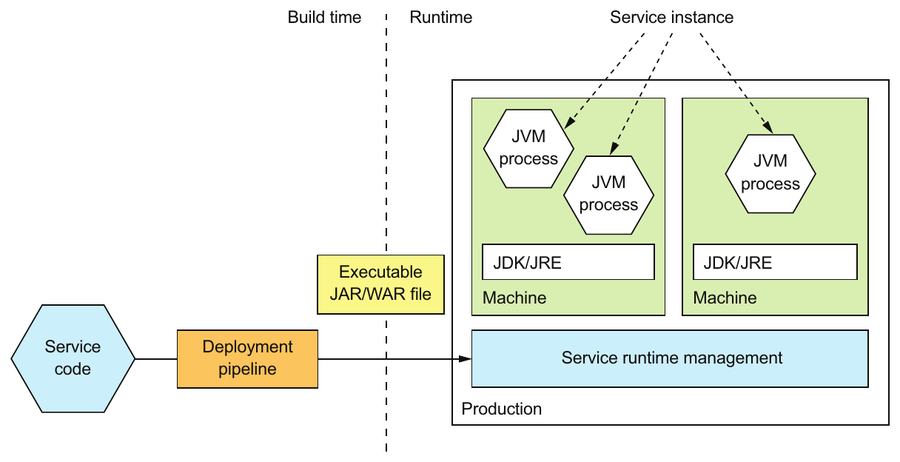

> **English:** Figure 12.3 The deployment pipeline builds an executable JAR file and deploys it into production. In production, each service instance is a JVM running on a machine that has the JDK or JRE installed.
>
> **Türkçe:** Şekil 12.3 Dağıtım hattı, çalıştırılabilir bir JAR dosyası oluşturup canlı ortama dağıtır. Canlı ortamda her servis örneği, JDK veya JRE kurulu bir makinede çalışan bir JVM’dir.

<!-- source-record: u12_0033 -->

> **English:** A service instance is typically a single process but sometimes may be a group of processes. A Java service instance, for example, is a process running the JVM. A NodeJS service might spawn multiple worker processes in order to process requests concurrently. Some languages support deploying multiple service instances within the same process.
>
> **Türkçe:** Bir servis örneği genellikle tek bir süreçtir; ancak bazen bir süreçler grubu olabilir. Örneğin bir Java servis örneği JVM’yi çalıştıran bir süreçtir. Bir NodeJS servisi, istekleri eşzamanlı işlemek için birden fazla worker process (işçi süreç) başlatabilir. Bazı diller, birden fazla servis örneğinin aynı süreç içinde dağıtılmasını destekler.

<!-- source-record: u12_0034 -->

> **English:** Sometimes you might deploy a single service instance on a machine, while retaining the option to deploy multiple service instances on the same machine. For example, as figure 12.4 shows, you could run multiple JVMs on a single machine. Each JVM runs a single service instance.
>
> **Türkçe:** Bazen bir makineye tek bir servis örneği dağıtırken aynı makineye birden fazla servis örneği dağıtma seçeneğini de korumak isteyebilirsiniz. Örneğin Şekil 12.4’teki gibi tek makinede birden fazla JVM çalıştırabilirsiniz. Her JVM tek bir servis örneğini çalıştırır.

<!-- source-pages: 388 -->

<!-- source-record: u12_0035 -->

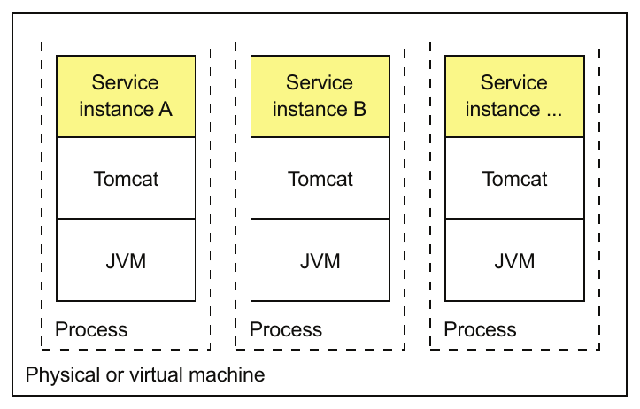

> **English:** Figure 12.4 Deploying multiple service instances on the same machine. They might be instances of the same service or instances of different services. The overhead of the OS is shared among the service instances. Each service instance is a separate process, so there’s some isolation between them.
>
> **Türkçe:** Şekil 12.4 Aynı makinede birden fazla servis örneğinin dağıtılması. Bunlar aynı servisin veya farklı servislerin örnekleri olabilir. İşletim sisteminin ek kaynak maliyeti servis örnekleri arasında paylaşılır. Her servis örneği ayrı bir süreç olduğundan aralarında belirli düzeyde yalıtım vardır.

<!-- source-record: u12_0036 -->

> **English:** Some languages also let you run multiple services instances in a single process. For example, as figure 12.5 shows, you can run multiple Java services on a single Apache Tomcat.
>
> **Türkçe:** Bazı diller, tek bir süreçte birden fazla servis örneği çalıştırmanıza da izin verir. Örneğin Şekil 12.5’te gösterildiği gibi tek bir Apache Tomcat üzerinde birden fazla Java servisi çalıştırabilirsiniz.

<!-- source-record: u12_0037 -->

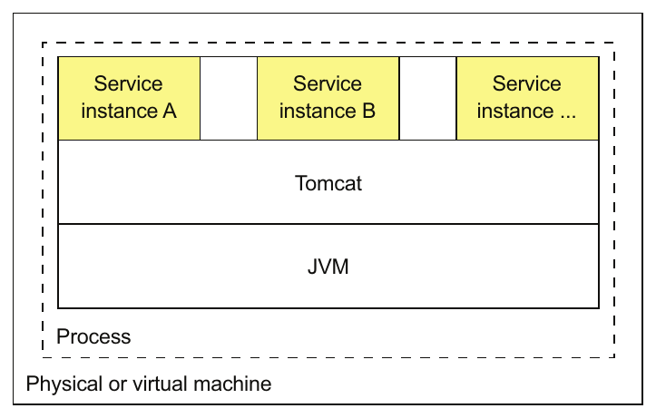

> **English:** Figure 12.5 Deploying multiple services instances on the same web container or application server. They might be instances of the same service or instances of different services. The overhead of the OS and runtime is shared among all the service instances. But because the service instances are in the same process, there’s no isolation between them.
>
> **Türkçe:** Şekil 12.5 Aynı web container’ında veya uygulama sunucusunda birden fazla servis örneğinin dağıtılması. Bunlar aynı servisin veya farklı servislerin örnekleri olabilir. İşletim sisteminin ve çalışma zamanının ek kaynak maliyeti bütün servis örnekleri arasında paylaşılır. Ancak servis örnekleri aynı süreç içinde bulunduğundan aralarında yalıtım yoktur.

<!-- source-record: u12_0038 -->

> **English:** This approach is commonly used when deploying applications on traditional expensive and heavyweight application servers, such as WebLogic and WebSphere. You can also package services as OSGI bundles and run multiple service instances in each OSGI container.
>
> **Türkçe:** Bu yaklaşım, uygulamalar WebLogic ve WebSphere gibi geleneksel, pahalı ve ağır uygulama sunucularında dağıtılırken yaygın olarak kullanılır. Servisleri OSGI bundle’ları olarak paketleyip her OSGI container’ında birden fazla servis örneği de çalıştırabilirsiniz.

<!-- source-record: u12_0039 -->

> **English:** The Service as a language-specific package pattern has both benefits and drawbacks. Let’s first look at the benefits.
>
> **Türkçe:** Service as a language-specific package örüntüsünün hem yararları hem sakıncaları vardır. Önce yararlarına bakalım.

<!-- source-record: u12_0040 -->

### 12.1.1 Benefits of the Service as a language-specific package pattern — Service as a language-specific package örüntüsünün yararları

<!-- source-record: u12_0041 -->

> **English:** The Service as a language-specific package pattern has a few benefits:
>
> **Türkçe:** Service as a language-specific package örüntüsünün birkaç yararı vardır:

<!-- source-record: u12_0042 -->

> **English:** • Fast deployment
>
> **Türkçe:** • Hızlı dağıtım

<!-- source-record: u12_0043 -->

> **English:** • Efficient resource utilization, especially when running multiple instances on the same machine or within the same process
>
> **Türkçe:** • Özellikle aynı makinede veya aynı süreç içinde birden fazla örnek çalıştırırken kaynakların verimli kullanılması

<!-- source-record: u12_0044 -->

> **English:** Let’s look at each one.
>
> **Türkçe:** Her birini inceleyelim.

<!-- source-pages: 389 -->

<!-- source-record: u12_0045 -->

#### FAST DEPLOYMENT — HIZLI DAĞITIM

<!-- source-record: u12_0046 -->

> **English:** One major benefit of this pattern is that deploying a service instance is relatively fast: you copy the service to a host and start it. If the service is written in Java, you copy a JAR or WAR file. For other languages, such as NodeJS or Ruby, you copy the source code. In either case, the number of bytes copied over the network is relatively small.
>
> **Türkçe:** Bu örüntünün önemli bir yararı, servis örneğini dağıtmanın görece hızlı olmasıdır: servisi bir host’a kopyalar ve başlatırsınız. Servis Java ile yazılmışsa JAR veya WAR dosyasını kopyalarsınız. NodeJS veya Ruby gibi başka dillerde ise kaynak kodu kopyalarsınız. Her iki durumda da ağ üzerinden kopyalanan bayt miktarı görece küçüktür.

<!-- source-record: u12_0047 -->

> **English:** Also, starting a service is rarely time consuming. If the service is its own process, you start it. Otherwise, if the service is one of several instances running in the same container process, you either dynamically deploy it into the container or restart the container. Because of the lack of overhead, starting a service is usually fast.
>
> **Türkçe:** Ayrıca bir servisi başlatmak nadiren çok zaman alır. Servis ayrı bir süreçse o süreci başlatırsınız. Aksi durumda, servis aynı container sürecinde çalışan birkaç örnekten biriyse onu container’a dinamik olarak dağıtır veya container’ı yeniden başlatırsınız. Ek yük bulunmadığından bir servisi başlatmak genellikle hızlıdır.

<!-- source-record: u12_0048 -->

#### EFFICIENT RESOURCE UTILIZATION — KAYNAKLARIN VERİMLİ KULLANILMASI

<!-- source-record: u12_0049 -->

> **English:** Another major benefit of this pattern is that it uses resources relatively efficiently. Multiple service instances share the machine and its operating system. It’s even more efficient if multiple service instances run within the same process. For example, multiple web applications could share the same Apache Tomcat server and JVM.
>
> **Türkçe:** Bu örüntünün diğer önemli yararı, kaynakları görece verimli kullanmasıdır. Birden fazla servis örneği makineyi ve işletim sistemini paylaşır. Birden fazla servis örneği aynı süreç içinde çalışıyorsa verimlilik daha da artar. Örneğin birden fazla web uygulaması aynı Apache Tomcat sunucusunu ve JVM’yi paylaşabilir.

<!-- source-record: u12_0050 -->

### 12.1.2 Drawbacks of the Service as a language-specific package pattern — Service as a language-specific package örüntüsünün sakıncaları

<!-- source-record: u12_0051 -->

> **English:** Despite its appeal, the Service as a language-specific package pattern has several significant drawbacks:
>
> **Türkçe:** Çekici yanlarına rağmen Service as a language-specific package örüntüsünün bazı önemli sakıncaları vardır:

<!-- source-record: u12_0052 -->

> **English:** • Lack of encapsulation of the technology stack.
>
> **Türkçe:** • Teknoloji yığınının kapsüllenmemesi.

<!-- source-record: u12_0053 -->

> **English:** • No ability to constrain the resources consumed by a service instance.
>
> **Türkçe:** • Bir servis örneğinin tükettiği kaynakların sınırlandırılamaması.

<!-- source-record: u12_0054 -->

> **English:** • Lack of isolation when running multiple service instances on the same machine.
>
> **Türkçe:** • Aynı makinede birden fazla servis örneği çalıştırıldığında yalıtım bulunmaması.

<!-- source-record: u12_0055 -->

> **English:** • Automatically determining where to place service instances is challenging.
>
> **Türkçe:** • Servis örneklerinin nereye yerleştirileceğini otomatik olarak belirlemenin zor olması.

<!-- source-record: u12_0056 -->

> **English:** Let’s look at each drawback.
>
> **Türkçe:** Her bir sakıncayı inceleyelim.

<!-- source-record: u12_0057 -->

#### LACK OF ENCAPSULATION OF THE TECHNOLOGY STACK — TEKNOLOJİ YIĞINININ KAPSÜLLENMEMESİ

<!-- source-record: u12_0058 -->

> **English:** The operation team must know the specific details of how to deploy each and every service. Each service needs a particular version of the runtime. A Java web application, for example, needs particular versions of Apache Tomcat and the JDK. Operations must install the correct version of each required software package.
>
> **Türkçe:** Operasyon ekibi, her bir servisin nasıl dağıtılacağına ilişkin özel ayrıntıları bilmelidir. Her servis çalışma zamanının belirli bir sürümüne ihtiyaç duyar. Örneğin bir Java web uygulaması Apache Tomcat ve JDK’nin belirli sürümlerini gerektirir. Operasyon ekibi, gereken her yazılım paketinin doğru sürümünü kurmalıdır.

<!-- source-record: u12_0059 -->

> **English:** To make matters worse, services can be written in a variety of languages and frameworks. They might also be written in multiple versions of those languages and frameworks. Consequently, the development team must share lots of details with operations. This complexity increases the risk of errors during deployment. A machine might, for example, have the wrong version of the language runtime.
>
> **Türkçe:** Üstelik servisler çeşitli diller ve framework’lerle yazılmış olabilir. Bu dillerin ve framework’lerin farklı sürümleri de kullanılmış olabilir. Dolayısıyla geliştirme ekibi operasyon ekibiyle çok sayıda ayrıntı paylaşmak zorundadır. Bu karmaşıklık, dağıtım sırasında hata yapma riskini artırır. Örneğin bir makinede dilin çalışma zamanının yanlış sürümü bulunabilir.

<!-- source-record: u12_0060 -->

#### NO ABILITY TO CONSTRAIN THE RESOURCES CONSUMED BY A SERVICE INSTANCE — BİR SERVİS ÖRNEĞİNİN TÜKETTİĞİ KAYNAKLARIN SINIRLANDIRILAMAMASI

<!-- source-record: u12_0061 -->

> **English:** Another drawback is that you can’t constrain the resources consumed by a service instance. A process can potentially consume all of a machine’s CPU or memory, starving other service instances and operating systems of resources. This might happen, for example, because of a bug.
>
> **Türkçe:** Diğer bir sakınca, servis örneğinin tükettiği kaynakları sınırlandıramamanızdır. Bir süreç, makinenin bütün CPU veya belleğini tüketerek diğer servis örneklerini ve işletim sistemini kaynaklardan mahrum bırakabilir. Bu durum örneğin bir hata nedeniyle ortaya çıkabilir.

<!-- source-pages: 390 -->

> **Teknik sınır:** Bu paragraf, ek kaynak sınırlaması kurulmamış doğrudan süreç dağıtımını anlatır. İşletim sisteminin sunduğu kaynak denetimlerinin genel olarak imkânsız olduğu anlamına gelmez.

<!-- source-record: u12_0062 -->

#### LACK OF ISOLATION WHEN RUNNING MULTIPLE SERVICE INSTANCES ON THE SAME MACHINE — AYNI MAKİNEDE BİRDEN FAZLA SERVİS ÖRNEĞİ ÇALIŞTIRILDIĞINDA YALITIM BULUNMAMASI

<!-- source-record: u12_0063 -->

> **English:** The problem is even worse when running multiple instances on the same machine. The lack of isolation means that a misbehaving service instance can impact other service instances. As a result, the application risks being unreliable, especially when running multiple service instances on the same machine.
>
> **Türkçe:** Aynı makinede birden fazla örnek çalıştırıldığında sorun daha da büyür. Yalıtımın bulunmaması, hatalı davranan bir servis örneğinin diğer servis örneklerini etkileyebilmesi demektir. Sonuç olarak özellikle aynı makinede birden fazla servis örneği çalıştırılırken uygulamanın güvenilir olmaması riski doğar.

<!-- source-record: u12_0064 -->

#### AUTOMATICALLY DETERMINING WHERE TO PLACE SERVICE INSTANCES IS CHALLENGING — SERVİS ÖRNEKLERİNİN YERLEŞİMİNİ OTOMATİK BELİRLEMENİN ZOR OLMASI

<!-- source-record: u12_0065 -->

> **English:** Another challenge with running multiple service instances on the same machine is determining the placement of service instances. Each machine has a fixed set of resources, CPU, memory, and so on, and each service instance needs some amount of resources. It’s important to assign service instances to machines in a way that uses the machines efficiently without overloading them. As I explain shortly, VM-based clouds and container orchestration frameworks handle this automatically. When deploying services natively, it’s likely that you’ll need to manually decide the placement.
>
> **Türkçe:** Aynı makinede birden fazla servis örneği çalıştırmanın diğer bir güçlüğü, servis örneklerinin yerleşimini belirlemektir. Her makinenin CPU, bellek gibi sınırlı kaynakları vardır; her servis örneği de belirli miktarda kaynağa ihtiyaç duyar. Servis örneklerini, makineleri aşırı yüklemeden verimli kullanacak biçimde makinelere atamak önemlidir. Birazdan açıklayacağım gibi VM tabanlı bulutlar ve container orkestrasyon framework’leri bunu otomatik olarak yapar. Servisleri doğrudan makine üzerinde dağıttığınızda yerleşime büyük olasılıkla elle karar vermeniz gerekir.

<!-- source-record: u12_0066 -->

> **English:** As you can see, despite its familiarity, the Service as a language-specific package pattern has some significant drawbacks. You should rarely use this approach, except perhaps when efficiency outweighs all other concerns.
>
> **Türkçe:** Gördüğünüz gibi tanıdık bir yaklaşım olsa da Service as a language-specific package örüntüsünün önemli sakıncaları vardır. Verimliliğin bütün diğer kaygılardan ağır bastığı durumlar dışında bu yaklaşımı nadiren kullanmalısınız.

<!-- source-record: u12_0067 -->

> **English:** Let’s now look at modern ways of deploying services that avoid these problems.
>
> **Türkçe:** Şimdi bu sorunlardan kaçınan modern servis dağıtım yöntemlerine bakalım.

<!-- source-record: u12_0068 -->

## 12.2 Deploying services using the Service as a virtual machine pattern — Service as a virtual machine örüntüsünü kullanarak servisleri dağıtma

<!-- source-record: u12_0069 -->

> **English:** Once again, imagine you want to deploy the FTGO Restaurant Service, except this time it’s on AWS EC2. One option would be to create and configure an EC2 instance and copy onto it the executable or WAR file. Although you would get some benefit from using the cloud, this approach suffers from the drawbacks described in the preceding section. A better, more modern approach is to package the service as an Amazon Machine Image (AMI), as shown in figure 12.6. Each service instance is an EC2 instance created from that AMI. The EC2 instances would typically be managed by an AWS Auto Scaling group, which attempts to ensure that the desired number of healthy instances is always running.
>
> **Türkçe:** FTGO Restaurant Service’i dağıtmak istediğinizi yeniden düşünün; bu kez hedef AWS EC2 olsun. Bir seçenek, bir EC2 instance’ı oluşturup yapılandırmak ve çalıştırılabilir dosyayı veya WAR dosyasını ona kopyalamaktır. Bulut kullanmanın bazı yararlarını elde etseniz de bu yaklaşım önceki bölümde açıklanan sakıncaları taşır. Daha iyi ve daha modern bir yaklaşım, Şekil 12.6’daki gibi servisi bir Amazon Machine Image (AMI) olarak paketlemektir. Her servis örneği bu AMI’den oluşturulan bir EC2 instance’ıdır. EC2 instance’ları genellikle, istenen sayıda sağlıklı instance’ın her zaman çalışmasını sağlamaya çalışan bir AWS Auto Scaling grubu tarafından yönetilir.

<!-- source-record: u12_0070 -->

### Pattern: Deploy a service as a VM — Örüntü: Servisi VM olarak dağıtma

<!-- source-record: u12_0071 -->

> **English:** Deploy services packaged as VM images into production. Each service instance is a VM. See http://microservices.io/patterns/deployment/service-per-vm.html.
>
> **Türkçe:** VM imajları olarak paketlenmiş servisleri canlı ortama dağıtın. Her servis örneği bir VM’dir. Bkz. http://microservices.io/patterns/deployment/service-per-vm.html.

<!-- source-record: u12_0072 -->

> **English:** The virtual machine image is built by the service’s deployment pipeline. The deployment pipeline, as figure 12.6 shows, runs a VM image builder to create a VM image that contains the service’s code and whatever software is required to run it. For example, the VM builder for a FTGO service installs the JDK and the service’s executable JAR. The VM image builder configures the VM image machine to run the application when the VM boots, using Linux’s init system, such as upstart.
>
> **Türkçe:** Sanal makine imajı, servisin dağıtım hattı tarafından oluşturulur. Şekil 12.6’da görüldüğü gibi dağıtım hattı, servisin kodunu ve çalıştırmak için gereken bütün yazılımları içeren bir VM imajı oluşturmak üzere bir VM image builder çalıştırır. Örneğin bir FTGO servisi için VM imajı oluşturucu, JDK’yi ve servisin çalıştırılabilir JAR dosyasını kurar. Oluşturucu, upstart gibi Linux init sistemlerinden yararlanarak VM başlatıldığında uygulamanın çalışacağı biçimde imajı yapılandırır.

<!-- source-pages: 391 -->

<!-- source-record: u12_0073 -->

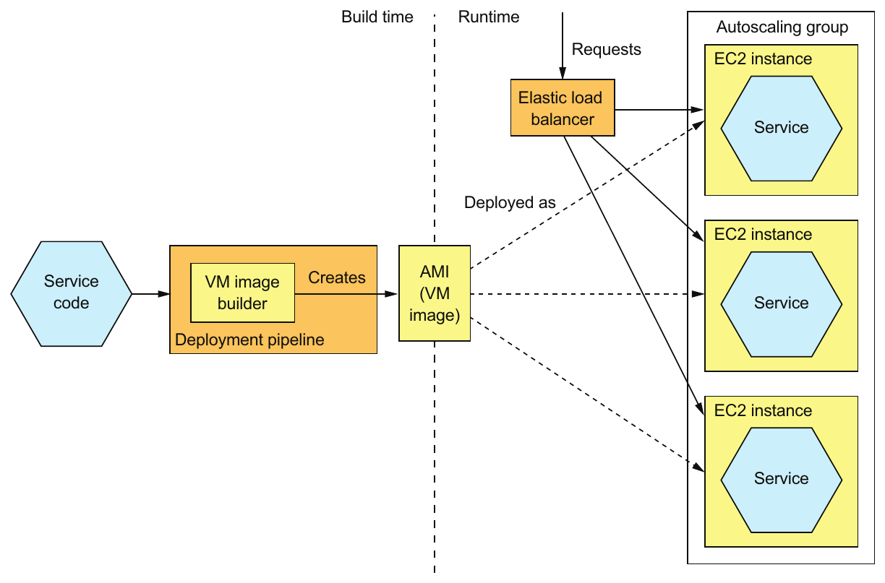

> **English:** Figure 12.6 The deployment pipeline packages a service as a virtual machine image, such as an EC2 AMI, containing everything required to run the service, including the language runtime. At runtime, each service instance is a VM, such as an EC2 instance, instantiated from that image. An EC2 Elastic Load Balancer routes requests to the instances.
>
> **Türkçe:** Şekil 12.6 Dağıtım hattı, servisi EC2 AMI gibi bir sanal makine imajı olarak paketler. İmaj, dilin çalışma zamanı dâhil servisi çalıştırmak için gereken her şeyi içerir. Çalışma zamanında her servis örneği, bu imajdan oluşturulan EC2 instance’ı gibi bir VM’dir. EC2 Elastic Load Balancer, istekleri instance’lara yönlendirir.

<!-- source-record: u12_0074 -->

> **English:** There are a variety of tools that your deployment pipeline can use to build VM images. One early tool for creating EC2 AMIs is Aminator, created by Netflix, which used it to deploy its video-streaming service on AWS (https://github.com/Netflix/aminator). A more modern VM image builder is Packer, which unlike Aminator supports a variety of virtualization technologies, including EC2, Digital Ocean, Virtual Box, and VMware (www.packer.io). To use Packer to create an AMI, you write a configuration file that specifies the base image and a set of provisioners that install software and configure the AMI.
>
> **Türkçe:** Dağıtım hattınızın VM imajı oluşturmak için kullanabileceği çeşitli araçlar vardır. EC2 AMI oluşturmaya yönelik ilk araçlardan biri, Netflix’in geliştirdiği ve video yayın servisini AWS üzerinde dağıtmak için kullandığı Aminator’dır (https://github.com/Netflix/aminator). Daha modern bir VM imajı oluşturucu Packer’dır. Aminator’ın aksine EC2, Digital Ocean, Virtual Box ve VMware dâhil çeşitli sanallaştırma teknolojilerini destekler (www.packer.io). Packer ile AMI oluşturmak için temel imajı ve yazılım kurup AMI’yi yapılandıran bir dizi provisioner’ı belirten bir yapılandırma dosyası yazarsınız.

<!-- source-record: u12_0075 -->

### About Elastic Beanstalk — Elastic Beanstalk hakkında

<!-- source-record: u12_0076 -->

> **English:** Elastic Beanstalk, which is provided by AWS, is an easy way to deploy your services using VMs. You upload your code, such as a WAR file, and Elastic Beanstalk deploys it as one or more load-balanced and managed EC2 instances. Elastic Beanstalk is perhaps not quite as fashionable as, say, Kubernetes, but it’s an easy way to deploy a microservices-based application on EC2. Interestingly, Elastic Beanstalk combines elements of the three deployment patterns described in this chapter. It supports several packaging formats for several languages, including Java, Ruby, and .NET. It deploys the application as VMs, but rather than building an AMI, it uses a base image that installs the application on startup.
>
> **Türkçe:** AWS’nin sunduğu Elastic Beanstalk, servislerinizi VM kullanarak dağıtmanın kolay bir yoludur. WAR dosyası gibi kodunuzu yüklersiniz; Elastic Beanstalk bunu yük dengelemesi yapılan ve yönetilen bir veya daha fazla EC2 instance’ı olarak dağıtır. Elastic Beanstalk, örneğin Kubernetes kadar gözde olmayabilir; fakat mikroservis tabanlı bir uygulamayı EC2 üzerinde dağıtmak için kolay bir yoldur. İlginç biçimde Elastic Beanstalk, bu bölümde anlatılan üç dağıtım örüntüsünün öğelerini birleştirir. Java, Ruby ve .NET dâhil çeşitli dillerin farklı paketleme biçimlerini destekler. Uygulamayı VM olarak dağıtır; ancak AMI oluşturmak yerine uygulamayı başlangıç sırasında kuran bir temel imaj kullanır.

<!-- source-pages: 392 -->

<!-- source-record: u12_0077 -->

#### (continued) — Devamı

<!-- source-record: u12_0078 -->

> **English:** Elastic Beanstalk can also deploy Docker containers. Each EC2 instance runs a collection of one or more containers. Unlike a Docker orchestration framework, covered later in the chapter, the unit of scaling is the EC2 instance rather than a container.
>
> **Türkçe:** Elastic Beanstalk, Docker container’larını da dağıtabilir. Her EC2 instance’ı bir veya daha fazla container’dan oluşan bir grubu çalıştırır. Bölümün ilerleyen kısmında ele alınan Docker orkestrasyon framework’lerinden farklı olarak ölçeklendirme birimi container değil, EC2 instance’ıdır.

<!-- source-record: u12_0079 -->

> **English:** Let’s look at the benefits and drawbacks of using this approach.
>
> **Türkçe:** Bu yaklaşımın yararlarını ve sakıncalarını inceleyelim.

<!-- source-record: u12_0080 -->

### 12.2.1 The benefits of deploying services as VMs — Servisleri VM olarak dağıtmanın yararları

<!-- source-record: u12_0081 -->

> **English:** The Service as a virtual machine pattern has a number of benefits:
>
> **Türkçe:** Service as a virtual machine örüntüsünün çeşitli yararları vardır:

<!-- source-record: u12_0082 -->

> **English:** • The VM image encapsulates the technology stack.
>
> **Türkçe:** • VM imajı teknoloji yığınını kapsüller.

<!-- source-record: u12_0083 -->

> **English:** • Isolated service instances.
>
> **Türkçe:** • Servis örnekleri yalıtılmıştır.

<!-- source-record: u12_0084 -->

> **English:** • Uses mature cloud infrastructure.
>
> **Türkçe:** • Olgun bulut altyapısından yararlanır.

<!-- source-record: u12_0085 -->

> **English:** Let’s look at each one.
>
> **Türkçe:** Her birini inceleyelim.

<!-- source-record: u12_0086 -->

#### THE VM IMAGE ENCAPSULATES THE TECHNOLOGY STACK — VM İMAJI TEKNOLOJİ YIĞININI KAPSÜLLER

<!-- source-record: u12_0087 -->

> **English:** An important benefit of this pattern is that the VM image contains the service and all of its dependencies. It eliminates the error-prone requirement to correctly install and set up the software that a service needs in order to run. Once a service has been packaged as a virtual machine, it becomes a black box that encapsulates your service’s technology stack. The VM image can be deployed anywhere without modification. The API for deploying the service becomes the VM management API. Deployment becomes much simpler and more reliable.
>
> **Türkçe:** Bu örüntünün önemli bir yararı, VM imajının servisi ve bütün bağımlılıklarını içermesidir. Böylece servisin çalışmak için ihtiyaç duyduğu yazılımı doğru kurup ayarlama zorunluluğundan kaynaklanan hata riski ortadan kalkar. Bir servis sanal makine olarak paketlendiğinde, teknoloji yığınını kapsülleyen bir kara kutuya dönüşür. VM imajı değişiklik yapılmadan her yerde dağıtılabilir. Servisi dağıtmak için kullanılan API, VM yönetim API’si olur. Dağıtım çok daha basit ve güvenilir hâle gelir.

<!-- source-record: u12_0088 -->

#### SERVICE INSTANCES ARE ISOLATED — SERVİS ÖRNEKLERİ YALITILMIŞTIR

<!-- source-record: u12_0089 -->

> **English:** A major benefit of virtual machines is that each service instance runs in complete isolation. That, after all, is one of the main goals of virtual machine technology. Each virtual machine has a fixed amount of CPU and memory and can’t steal resources from other services.
>
> **Türkçe:** Sanal makinelerin önemli bir yararı, her servis örneğinin tam yalıtım içinde çalışmasıdır. Zaten sanal makine teknolojisinin temel amaçlarından biri budur. Her sanal makinenin sabit miktarda CPU ve belleği vardır; diğer servislerin kaynaklarını kullanıp onları mahrum bırakamaz.

<!-- source-record: u12_0090 -->

#### USES MATURE CLOUD INFRASTRUCTURE — OLGUN BULUT ALTYAPISINDAN YARARLANIR

<!-- source-record: u12_0091 -->

> **English:** Another benefit of deploying your microservices as virtual machines is that you can leverage mature, highly automated cloud infrastructure. Public clouds such as AWS attempt to schedule VMs on physical machines in a way that avoids overloading the machine. They also provide valuable features such as load balancing of traffic across VMs and autoscaling.
>
> **Türkçe:** Mikroservislerinizi sanal makine olarak dağıtmanın diğer bir yararı, olgun ve büyük ölçüde otomatikleştirilmiş bulut altyapısından yararlanabilmenizdir. AWS gibi genel bulutlar, VM’leri fiziksel makinelere, makinelerin aşırı yüklenmesini önleyecek biçimde yerleştirmeye çalışır. Ayrıca trafiğin VM’ler arasında yük dengelenmesi ve autoscaling (otomatik ölçeklendirme) gibi değerli özellikler sağlarlar.

<!-- source-record: u12_0092 -->

### 12.2.2 The drawbacks of deploying services as VMs — Servisleri VM olarak dağıtmanın sakıncaları

<!-- source-record: u12_0093 -->

> **English:** The Service as a VM pattern also has some drawbacks:
>
> **Türkçe:** Service as a VM örüntüsünün bazı sakıncaları da vardır:

<!-- source-record: u12_0094 -->

> **English:** • Less-efficient resource utilization
>
> **Türkçe:** • Kaynakların daha az verimli kullanılması

<!-- source-record: u12_0095 -->

> **English:** • Relatively slow deployments
>
> **Türkçe:** • Dağıtımların görece yavaş olması

<!-- source-record: u12_0096 -->

> **English:** • System administration overhead
>
> **Türkçe:** • Sistem yönetiminin getirdiği ek iş yükü

<!-- source-record: u12_0097 -->

> **English:** Let’s look at each drawback in turn.
>
> **Türkçe:** Bu sakıncaları sırayla inceleyelim.

<!-- source-pages: 393 -->

<!-- source-record: u12_0098 -->

#### LESS-EFFICIENT RESOURCE UTILIZATION — KAYNAKLARIN DAHA AZ VERİMLİ KULLANILMASI

<!-- source-record: u12_0099 -->

> **English:** Each service instance has the overhead of an entire virtual machine, including its operating system. Moreover, a typical public IaaS virtual machine offers a limited set of VM sizes, so the VM will probably be underutilized. This is less likely to be a problem for Java-based services because they’re relatively heavyweight. But this pattern might be an inefficient way of deploying lightweight NodeJS and GoLang services.
>
> **Türkçe:** Her servis örneği, işletim sistemi dâhil bütün bir sanal makinenin ek kaynak maliyetini taşır. Üstelik genel IaaS hizmetleri genellikle sınırlı sayıda VM boyutu sunar; bu nedenle VM büyük olasılıkla kapasitesinin altında kullanılır. Java tabanlı servisler görece ağır olduğundan bunun sorun olma olasılığı daha düşüktür. Ancak bu örüntü, hafif NodeJS ve GoLang servislerini dağıtmak için verimsiz olabilir.

<!-- source-record: u12_0100 -->

#### RELATIVELY SLOW DEPLOYMENTS — DAĞITIMLARIN GÖRECE YAVAŞ OLMASI

<!-- source-record: u12_0101 -->

> **English:** Building a VM image typically takes some number of minutes because of the size of the VM. There are lots of bits to be moved over the network. Also, instantiating a VM from a VM image is time consuming because of, once again, the amount of data that must be moved over the network. The operating system running inside the VM also takes some time to boot, though slow is a relative term. This process, which perhaps takes minutes, is much faster than the traditional deployment process. But it’s much slower than the more lightweight deployment patterns you’ll read about soon.
>
> **Türkçe:** VM’nin boyutu nedeniyle bir VM imajı oluşturmak genellikle birkaç dakika sürer. Ağ üzerinden taşınması gereken çok miktarda veri vardır. Benzer biçimde, ağ üzerinden taşınacak veri miktarı nedeniyle bir VM imajından VM oluşturmak da zaman alır. VM içinde çalışan işletim sisteminin başlaması da biraz zaman alır; ancak yavaşlık görecelidir. Belki birkaç dakika süren bu süreç, geleneksel dağıtım sürecinden çok daha hızlıdır. Fakat birazdan okuyacağınız daha hafif dağıtım örüntülerinden çok daha yavaştır.

<!-- source-record: u12_0102 -->

#### SYSTEM ADMINISTRATION OVERHEAD — SİSTEM YÖNETİMİNİN GETİRDİĞİ EK İŞ YÜKÜ

<!-- source-record: u12_0103 -->

> **English:** You’re responsible for patching the operating system and runtime. System administration may seem inevitable when deploying software, but later in section 12.5, I describe serverless deployment, which eliminates this kind of system administration.
>
> **Türkçe:** İşletim sistemini ve çalışma zamanını yamalamaktan siz sorumlusunuz. Yazılım dağıtırken sistem yönetimi kaçınılmaz görünebilir; fakat 12.5. bölümde, bu tür sistem yönetimini ortadan kaldıran serverless dağıtımı açıklıyorum.

<!-- source-record: u12_0104 -->

> **English:** Let’s now look at an alternative way to deploy microservices that’s more lightweight, yet still has many of the benefits of virtual machines.
>
> **Türkçe:** Şimdi mikroservisleri dağıtmak için daha hafif olmasına rağmen sanal makinelerin birçok yararını koruyan alternatif bir yönteme bakalım.

<!-- source-record: u12_0105 -->

## 12.3 Deploying services using the Service as a container pattern — Service as a container örüntüsünü kullanarak servisleri dağıtma

<!-- source-record: u12_0106 -->

> **English:** Containers are a more modern and lightweight deployment mechanism. They’re an operating-system-level virtualization mechanism. A container, as figure 12.7 shows, consists of usually one but sometimes multiple processes running in a sandbox, which isolates it from other containers. A container running a Java service, for example, would typically consist of the JVM process.
>
> **Türkçe:** Container’lar daha modern ve hafif bir dağıtım mekanizmasıdır. İşletim sistemi düzeyinde bir sanallaştırma mekanizması sağlarlar. Şekil 12.7’de görüldüğü gibi bir container, kendisini diğer container’lardan yalıtan bir sandbox içinde çalışan, genellikle tek fakat bazen birden fazla süreçten oluşur. Örneğin Java servisi çalıştıran bir container tipik olarak JVM sürecinden oluşur.

<!-- source-record: u12_0107 -->

> **English:** From the perspective of a process running in a container, it’s as if it’s running on its own machine. It typically has its own IP address, which eliminates port conflicts. All Java processes can, for example, listen on port 8080. Each container also has its own root filesystem. The container runtime uses operating system mechanisms to isolate the containers from each other. The most popular example of a container runtime is Docker, although there are others, such as Solaris Zones.
>
> **Türkçe:** Container içinde çalışan bir sürecin bakış açısından, sanki kendisine ait bir makinede çalışıyormuş gibidir. Genellikle kendi IP adresi bulunur; bu da port çakışmalarını ortadan kaldırır. Örneğin bütün Java süreçleri 8080 portunu dinleyebilir. Her container’ın kendisine ait bir kök dosya sistemi de vardır. Container runtime, container’ları birbirinden yalıtmak için işletim sistemi mekanizmalarını kullanır. Container runtime’ın en yaygın örneği Docker’dır; Solaris Zones gibi başka örnekler de vardır.

<!-- source-record: u12_0108 -->

### Pattern: Deploy a service as a container — Örüntü: Servisi container olarak dağıtma

<!-- source-record: u12_0109 -->

> **English:** Deploy services packaged as container images into production. Each service instance is a container. See http://microservices.io/patterns/deployment/service-per-container.html.
>
> **Türkçe:** Container imajları olarak paketlenmiş servisleri canlı ortama dağıtın. Her servis örneği bir container’dır. Bkz. http://microservices.io/patterns/deployment/service-per-container.html.

<!-- source-pages: 394 -->

<!-- source-record: u12_0110 -->

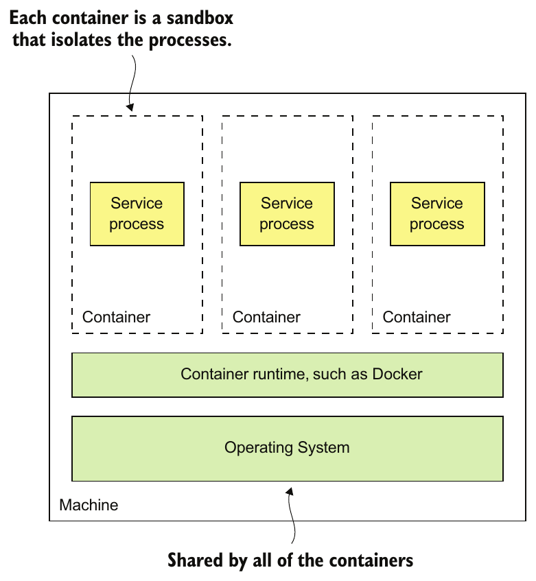

> **English:** Figure 12.7 A container consists of one or more processes running in an isolated sandbox. Multiple containers usually run on a single machine. The containers share the operating system.
>
> **Türkçe:** Şekil 12.7 Bir container, yalıtılmış bir sandbox içinde çalışan bir veya daha fazla süreçten oluşur. Genellikle tek makinede birden fazla container çalışır. Container’lar işletim sistemini paylaşır.

<!-- source-record: u12_0111 -->

> **English:** When you create a container, you can specify its CPU, memory resources, and, depending on the container implementation, perhaps the I/O resources. The container runtime enforces these limits and prevents a container from hogging the resources of its machine. When using a Docker orchestration framework such as Kubernetes, it’s especially important to specify a container’s resources. That’s because the orchestration framework uses a container’s requested resources to select the machine to run the container and thereby ensure that machines aren’t overloaded.
>
> **Türkçe:** Container oluştururken CPU ve bellek kaynaklarını, kullanılan container gerçekleştirimine bağlı olarak I/O kaynaklarını da belirtebilirsiniz. Container runtime bu sınırları uygular ve bir container’ın makinenin kaynaklarını tekeline almasını önler. Kubernetes gibi bir Docker orkestrasyon framework’ü kullanırken container’ın kaynaklarını belirtmek özellikle önemlidir. Çünkü orkestrasyon framework’ü, container’ın çalışacağı makineyi seçmek için talep ettiği kaynakları kullanır; böylece makinelerin aşırı yüklenmemesini sağlar.

<!-- source-record: u12_0112 -->

> **English:** Figure 12.8 shows the process of deploying a service as a container. At build-time, the deployment pipeline uses a container image-building tool, which reads the service’s code and a description of the image, to create the container image and stores it in a registry. At runtime, the container image is pulled from the registry and used to create containers.
>
> **Türkçe:** Şekil 12.8, servisi container olarak dağıtma sürecini gösterir. Build zamanında dağıtım hattı, servisin kodunu ve imajın tanımını okuyan bir container imajı oluşturma aracıyla imajı oluşturur ve bir registry’de saklar. Çalışma zamanında container imajı registry’den çekilir ve container oluşturmak için kullanılır.

<!-- source-record: u12_0113 -->

> **English:** Let’s take a look at build-time and runtime steps in more detail.
>
> **Türkçe:** Build ve çalışma zamanı adımlarını daha ayrıntılı inceleyelim.

<!-- source-pages: 395 -->

<!-- source-record: u12_0114 -->

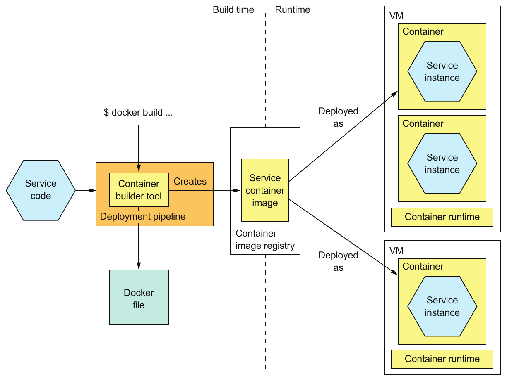

> **English:** Figure 12.8 A service is packaged as a container image, which is stored in a registry. At runtime the service consists of multiple containers instantiated from that image. Containers typically run on virtual machines. A single VM will usually run multiple containers.
>
> **Türkçe:** Şekil 12.8 Bir servis, registry’de saklanan bir container imajı olarak paketlenir. Çalışma zamanında servis, bu imajdan oluşturulan birden fazla container’dan oluşur. Container’lar genellikle sanal makinelerde çalışır. Tek bir VM genellikle birden fazla container çalıştırır.

<!-- source-record: u12_0115 -->

### 12.3.1 Deploying services using Docker — Servisleri Docker kullanarak dağıtma

<!-- source-record: u12_0116 -->

> **English:** To deploy a service as a container, you must package it as a container image. A container image is a filesystem image consisting of the application and any software required to run the service. It’s often a complete Linux root filesystem, although more lightweight images are also used. For example, to deploy a Spring Boot-based service, you build a container image containing the service’s executable JAR and the correct version of the JDK. Similarly, to deploy a Java web application, you would build a container image containing the WAR file, Apache Tomcat, and the JDK.
>
> **Türkçe:** Bir servisi container olarak dağıtmak için onu container imajı olarak paketlemelisiniz. Container imajı, uygulamadan ve servisi çalıştırmak için gereken bütün yazılımlardan oluşan bir dosya sistemi imajıdır. Daha hafif imajlar da kullanılsa da çoğu zaman eksiksiz bir Linux kök dosya sistemidir. Örneğin Spring Boot tabanlı bir servis dağıtmak için servisin çalıştırılabilir JAR dosyasını ve JDK’nin doğru sürümünü içeren bir container imajı oluşturursunuz. Benzer biçimde bir Java web uygulaması dağıtmak için WAR dosyasını, Apache Tomcat’i ve JDK’yi içeren bir container imajı oluşturursunuz.

<!-- source-record: u12_0117 -->

#### BUILDING A DOCKER IMAGE — DOCKER İMAJI OLUŞTURMA

<!-- source-record: u12_0118 -->

> **English:** The first step in building an image is to create a Dockerfile. A Dockerfile describes how to build a Docker container image. It specifies the base container image, a series of instructions for installing software and configuring the container, and the shell command to run when the container is created. Listing 12.1 shows the Dockerfile used to build an image for Restaurant Service. It builds a container image containing the service’s executable JAR file. It configures the container to run the java -jar command on startup.
>
> **Türkçe:** İmaj oluşturmanın ilk adımı bir Dockerfile hazırlamaktır. Dockerfile, Docker container imajının nasıl oluşturulacağını açıklar. Temel container imajını, yazılım kurma ve container’ı yapılandırmaya yönelik talimatları ve container oluşturulduğunda çalıştırılacak shell komutunu belirtir. Kod 12.1, Restaurant Service imajını oluşturmak için kullanılan Dockerfile’ı gösterir. Bu dosya, servisin çalıştırılabilir JAR dosyasını içeren bir container imajı oluşturur. Container’ı, başlangıçta java -jar komutunu çalıştıracak biçimde yapılandırır.

<!-- source-pages: 396 -->

<!-- source-record: u12_0119 -->

#### Listing 12.1 The Dockerfile used to build Restaurant Service — Kod 12.1 Restaurant Service imajını oluşturmak için kullanılan Dockerfile

<!-- source-record: u12_0120 -->

**Kod açıklaması:**

> **English:** Install curl for use by the health check.
>
> **Türkçe:** Health check sırasında kullanmak için curl kurulur.

<!-- source-record: u12_0121 -->

**Kod açıklaması:**

> **English:** The base image
>
> **Türkçe:** Temel imaj

<!-- source-record: u12_0122 -->

**Kod açıklaması:**

> **English:** Configure Docker to run java -jar.. when the container is started.
>
> **Türkçe:** Docker, container başlatıldığında java -jar … çalıştıracak biçimde yapılandırılır.

<!-- source-record: u12_0123 -->

```dockerfile
FROM openjdk:8u171-jre-alpine
RUN apk --no-cache add curl
CMD java ${JAVA_OPTS} -jar ftgo-restaurant-service.jar
HEALTHCHECK --start-period=30s --interval=5s CMD curl http://localhost:8080/actuator/health || exit 1
COPY build/libs/ftgo-restaurant-service.jar .
```

> **Editör notu — satır kırılması ve sürüm:** Kaynakta satır sonunda bölünen `--interval` seçeneği birleştirildi. `openjdk:8u171-jre-alpine` tarihsel Java 8 imajıdır; Java 17 imajı değildir. Örnek Docker üzerinde çalıştırılmadı.

<!-- source-record: u12_0124 -->

**Kod açıklaması:**

> **English:** Configure Docker to invoke the health check endpoint.
>
> **Türkçe:** Docker, health check endpoint’ini çağıracak biçimde yapılandırılır.

<!-- source-record: u12_0125 -->

**Kod açıklaması:**

> **English:** Copies the JAR in Gradle’s build directory into the image
>
> **Türkçe:** Gradle’ın build klasöründeki JAR dosyasını imaja kopyalar

<!-- source-record: u12_0126 -->

> **English:** The base image openjdk:8u171-jre-alpine is a minimal footprint Linux image containing the JRE. The Dockerfile copies the service’s JAR into the image and configures the image to execute the JAR on startup. It also configures Docker to periodically invoke the health check endpoint, described in chapter 11. The HEALTHCHECK directive says to invoke the health check endpoint API, described in chapter 11, every 5 seconds after an initial 30-second delay, which gives the service time to start.
>
> **Türkçe:** openjdk:8u171-jre-alpine temel imajı, JRE içeren ve az yer kaplayan bir Linux imajıdır. Dockerfile, servisin JAR dosyasını imaja kopyalar ve imajı başlangıçta bu JAR’ı çalıştıracak biçimde yapılandırır. Ayrıca Docker’ı, 11. bölümde açıklanan health check endpoint’ini düzenli aralıklarla çağıracak biçimde yapılandırır. HEALTHCHECK yönergesi, servisin başlamasına zaman tanıyan ilk 30 saniyelik gecikmeden sonra, 11. bölümde anlatılan health check endpoint API’sinin her 5 saniyede bir çağrılmasını söyler.

> **Editör notu — başlangıç süresi:** Kaynak, `--start-period=30s` değerini ilk kontrolden önceki gecikme gibi anlatır. Bu değer başlangıçta başarısız kontrollerin nasıl değerlendirileceğine ilişkin tolerans süresidir; kontrollerin kesinlikle 30 saniye sonra başlayacağı garantisi olarak okunmamalıdır. [Docker HEALTHCHECK belgesi](https://docs.docker.com/reference/dockerfile/#healthcheck).

<!-- source-record: u12_0127 -->

> **English:** Once you’ve written the Dockerfile, you can then build the image. The following listing shows the shell commands to build the image for Restaurant Service. The script builds the service’s JAR file and executes the docker build command to create the image.
>
> **Türkçe:** Dockerfile’ı yazdıktan sonra imajı oluşturabilirsiniz. Sonraki kod bloğu, Restaurant Service imajını oluşturmak için kullanılan shell komutlarını gösterir. Betik, servisin JAR dosyasını oluşturur ve imajı üretmek için docker build komutunu çalıştırır.

<!-- source-record: u12_0128 -->

#### Listing 12.2 The shell commands used to build the container image for Restaurant Service — Kod 12.2 Restaurant Service container imajını oluşturmak için kullanılan shell komutları

<!-- source-record: u12_0129 -->

**Kod açıklaması:**

> **English:** Change to the service’s directory.
>
> **Türkçe:** Servisin klasörüne geçilir.

<!-- source-record: u12_0130 -->

**Kod açıklaması:**

> **English:** Build the service’s JAR.
>
> **Türkçe:** Servisin JAR dosyası oluşturulur.

<!-- source-record: u12_0131 -->

```bash
cd ftgo-restaurant-service
../gradlew assemble
docker build -t ftgo-restaurant-service .
```

<!-- source-record: u12_0132 -->

**Kod açıklaması:**

> **English:** Build the image.
>
> **Türkçe:** İmaj oluşturulur.

<!-- source-record: u12_0133 -->

> **English:** The docker build command has two arguments: the -t argument specifies the name of the image, and the . specifies what Docker calls the context. The context, which in this example is the current directory, consists of Dockerfile and the files used to build the image. The docker build command uploads the context to the Docker daemon, which builds the image.
>
> **Türkçe:** docker build komutunun iki argümanı vardır: -t argümanı imajın adını, . ise Docker’ın context adını verdiği bağlamı belirtir. Bu örnekte geçerli klasör olan context, Dockerfile’dan ve imajı oluşturmak için kullanılan dosyalardan oluşur. docker build komutu, context’i imajı oluşturan Docker daemon’a yükler.

<!-- source-record: u12_0134 -->

#### PUSHING A DOCKER IMAGE TO A REGISTRY — DOCKER İMAJINI REGISTRY’YE GÖNDERME

<!-- source-record: u12_0135 -->

> **English:** The final step of the build process is to push the newly built Docker image to what is known as a registry. A Docker registry is the equivalent of a Java Maven repository for Java libraries, or a NodeJS npm registry for NodeJS packages. Docker hub is an example of a public Docker registry and is equivalent to Maven Central or NpmJS.org. But for your applications you’ll probably want to use a private registry provided by services, such as Docker Cloud registry or AWS EC2 Container Registry.
>
> **Türkçe:** Build sürecinin son adımı, yeni oluşturulan Docker imajını registry adı verilen depoya göndermektir. Docker registry, Java kütüphaneleri için Java Maven deposunun veya NodeJS paketleri için npm registry’sinin karşılığıdır. Docker Hub, genel bir Docker registry örneğidir ve Maven Central veya NpmJS.org ile benzer işlev görür. Ancak kendi uygulamalarınız için büyük olasılıkla Docker Cloud registry veya AWS EC2 Container Registry gibi servislerin sağladığı özel bir registry kullanmak istersiniz.

<!-- source-record: u12_0136 -->

> **English:** You must use two Docker commands to push an image to a registry. First, you use the docker tag command to give the image a name that’s prefixed with the hostname and optional port of the registry. The image name is also suffixed with the version, which will be important when you make a new release of the service. For example, if the hostname of the registry is registry.acme.com, you would use this command to tag the image:
>
> **Türkçe:** Bir imajı registry’ye göndermek için iki Docker komutu kullanmalısınız. Önce docker tag komutuyla imaja, başında registry’nin host adı ve isteğe bağlı port numarası bulunan bir ad verirsiniz. İmaj adının sonuna sürüm de eklenir; bu bilgi servisin yeni bir sürümünü yayımladığınızda önem kazanır. Örneğin registry’nin host adı registry.acme.com ise imajı etiketlemek için şu komutu kullanırsınız:

<!-- source-pages: 397 -->

<!-- source-record: u12_0137 -->

```bash
docker tag ftgo-restaurant-service registry.acme.com/ftgo-restaurant-service:1.0.0.RELEASE
```

<!-- source-record: u12_0138 -->

> **English:** Next you use the docker push command to upload that tagged image to the registry:
>
> **Türkçe:** Ardından etiketlenen imajı registry’ye yüklemek için docker push komutunu kullanırsınız:

<!-- source-record: u12_0139 -->

```bash
docker push registry.acme.com/ftgo-restaurant-service:1.0.0.RELEASE
```

<!-- source-record: u12_0140 -->

> **English:** This command often takes much less time than you might expect. That’s because a Docker image has what’s known as a layered file system, which enables Docker to only transfer part of the image over the network. An image’s operating system, Java runtime, and the application are in separate layers. Docker only needs to transfer those layers that don’t exist in the destination. As a result, transferring an image over a network is quite fast when Docker only has to move the application’s layers, which are a small fraction of the image.
>
> **Türkçe:** Bu komut genellikle beklediğinizden çok daha kısa sürer. Çünkü Docker imajı, Docker’ın ağ üzerinden yalnızca imajın bir bölümünü aktarmasını sağlayan katmanlı bir dosya sistemine sahiptir. İmajın işletim sistemi, Java çalışma zamanı ve uygulaması ayrı katmanlarda bulunur. Docker yalnızca hedefte bulunmayan katmanları aktarmalıdır. Sonuç olarak Docker’ın yalnızca imajın küçük bir kısmını oluşturan uygulama katmanlarını taşıması gerektiğinde, imajın ağ üzerinden aktarılması oldukça hızlıdır.

<!-- source-record: u12_0141 -->

> **English:** Now that we’ve pushed the image to a registry, let’s look at how to create a container.
>
> **Türkçe:** İmajı registry’ye gönderdiğimize göre şimdi container’ın nasıl oluşturulacağına bakalım.

<!-- source-record: u12_0142 -->

#### RUNNING A DOCKER CONTAINER — DOCKER CONTAINER’I ÇALIŞTIRMA

<!-- source-record: u12_0143 -->

> **English:** Once you’ve packaged your service as a container image, you can then create one or more containers. The container infrastructure will pull the image from the registry onto a production server. It will then create one or more containers from that image. Each container is an instance of your service.
>
> **Türkçe:** Servisinizi container imajı olarak paketledikten sonra bir veya daha fazla container oluşturabilirsiniz. Container altyapısı imajı registry’den bir canlı ortam sunucusuna çeker. Ardından bu imajdan bir veya daha fazla container oluşturur. Her container, servisinizin bir örneğidir.

<!-- source-record: u12_0144 -->

> **English:** As you might expect, Docker provides a docker run command that creates and starts a container. Listing 12.3 shows how to use this command to run Restaurant Service. The docker run command has several arguments, including the container image and a specification of environment variables to set in the runtime container. These are used to pass an externalized configuration, such as the database’s network location and more.
>
> **Türkçe:** Bekleneceği gibi Docker, container oluşturup başlatan docker run komutunu sağlar. Kod 12.3, bu komutla Restaurant Service’in nasıl çalıştırılacağını gösterir. docker run komutunun, container imajı ve çalışma zamanı container’ında ayarlanacak ortam değişkenleri dâhil çeşitli argümanları vardır. Bu değişkenler, veritabanının ağ konumu ve benzeri dışsallaştırılmış yapılandırma bilgilerini aktarmak için kullanılır.

<!-- source-record: u12_0145 -->

#### Listing 12.3 Using docker run to run a containerized service — Kod 12.3 Container içindeki servisi çalıştırmak için docker run kullanımı

<!-- source-record: u12_0146 -->

**Kod açıklaması:**

> **English:** Runs it as a background daemon
>
> **Türkçe:** Arka planda daemon olarak çalıştırır

<!-- source-record: u12_0147 -->

```bash
docker run \
  -d  \
  --name ftgo-restaurant-service  \
  -p 8082:8080  \
  -e SPRING_DATASOURCE_URL=... -e SPRING_DATASOURCE_USERNAME=...  \
  -e SPRING_DATASOURCE_PASSWORD=... \
  registry.acme.com/ftgo-restaurant-service:1.0.0.RELEASE
```

<!-- source-record: u12_0148 -->

**Kod açıklaması:**

> **English:** The name of the container
>
> **Türkçe:** Container’ın adı

<!-- source-record: u12_0149 -->

**Kod açıklaması:**

> **English:** Binds port 8080 of the container to port 8082 of the host machine
>
> **Türkçe:** Container’ın 8080 portunu host makinenin 8082 portuna bağlar

<!-- source-record: u12_0150 -->

**Kod açıklaması:**

> **English:** Environment variables
>
> **Türkçe:** Ortam değişkenleri

<!-- source-record: u12_0151 -->

**Kod açıklaması:**

> **English:** Image to run
>
> **Türkçe:** Çalıştırılacak imaj

<!-- source-pages: 398 -->

<!-- source-record: u12_0152 -->

> **English:** The docker run command pulls the image from the registry if necessary. It then creates and starts the container, which runs the java -jar command specified in the Dockerfile.
>
> **Türkçe:** docker run komutu gerekirse imajı registry’den çeker. Ardından container’ı oluşturup başlatır; container, Dockerfile’da belirtilen java -jar komutunu çalıştırır.

<!-- source-record: u12_0153 -->

> **English:** Using the docker run command may seem simple, but there are a couple of problems. One is that docker run isn’t a reliable way to deploy a service, because it creates a container running on a single machine. The Docker engine provides some basic management features, such as automatically restarting containers if they crash or if the machine is rebooted. But it doesn’t handle machine crashes.
>
> **Türkçe:** docker run komutunu kullanmak basit görünebilir, fakat birkaç sorun vardır. Bunlardan biri, docker run’ın tek makinede çalışan bir container oluşturduğu için servisi dağıtmanın güvenilir bir yolu olmamasıdır. Docker engine, container çöktüğünde veya makine yeniden başlatıldığında container’ları otomatik yeniden başlatmak gibi bazı temel yönetim özellikleri sağlar. Ancak makinenin çökmesini ele almaz.

<!-- source-record: u12_0154 -->

> **English:** Another problem is that services typically don’t exist in isolation. They depend on other services, such as databases and message brokers. It would be nice to deploy or undeploy a service and its dependencies as a unit.
>
> **Türkçe:** Başka bir sorun, servislerin genellikle tek başlarına var olmamasıdır. Veritabanları ve mesaj aracıları gibi başka servislere bağımlıdırlar. Bir servisi ve bağımlılıklarını tek bir bütün olarak dağıtabilmek veya kaldırabilmek yararlı olurdu.

<!-- source-record: u12_0155 -->

> **English:** A better approach that’s especially useful during development is to use Docker Compose. Docker Compose is a tool that lets you declaratively define a set of containers using a YAML file, and then start and stop those containers as a group. What’s more, the YAML file is a convenient way to specify numerous externalized configuration properties. To learn more about Docker Compose, I recommend reading Docker in Action by Jeff Nickoloff (Manning, 2016) and looking at the docker-compose.yml file in the example code.
>
> **Türkçe:** Özellikle geliştirme sırasında kullanışlı olan daha iyi bir yaklaşım Docker Compose kullanmaktır. Docker Compose, bir YAML dosyasında bir container kümesini declarative (bildirimsel) biçimde tanımlamanızı, ardından bu container’ları grup hâlinde başlatıp durdurmanızı sağlayan bir araçtır. Üstelik YAML dosyası, çok sayıda dışsallaştırılmış yapılandırma özelliğini belirtmek için kullanışlıdır. Docker Compose hakkında daha fazla bilgi için Jeff Nickoloff’un Docker in Action (Manning, 2016) kitabını okumanızı ve örnek koddaki docker-compose.yml dosyasını incelemenizi öneririm.

<!-- source-record: u12_0156 -->

> **English:** The problem with Docker Compose, though, is that it’s limited to a single machine. To deploy services reliably, you must use a Docker orchestration framework, such as Kubernetes, which turns a set of machines into a pool of resources. I describe how to use Kubernetes later, in section 12.4. First, let’s review the benefits and drawbacks of using containers.
>
> **Türkçe:** Ancak Docker Compose’un sorunu, tek makineyle sınırlı olmasıdır. Servisleri güvenilir biçimde dağıtmak için, bir makine kümesini kaynak havuzuna dönüştüren Kubernetes gibi bir Docker orkestrasyon framework’ü kullanmalısınız. Kubernetes’in kullanımını ileride 12.4. bölümde açıklıyorum. Önce container kullanmanın yararlarını ve sakıncalarını gözden geçirelim.

<!-- source-record: u12_0157 -->

### 12.3.2 Benefits of deploying services as containers — Servisleri container olarak dağıtmanın yararları

<!-- source-record: u12_0158 -->

> **English:** Deploying services as containers has several benefits. First, containers have many of the benefits of virtual machines:
>
> **Türkçe:** Servisleri container olarak dağıtmanın çeşitli yararları vardır. Öncelikle container’lar sanal makinelerin birçok yararını taşır:

<!-- source-record: u12_0159 -->

> **English:** • Encapsulation of the technology stack in which the API for managing your services becomes the container API.
>
> **Türkçe:** • Teknoloji yığınının kapsüllenmesi; böylece servislerinizi yönetme API’si container API’si olur.

<!-- source-record: u12_0160 -->

> **English:** • Service instances are isolated.
>
> **Türkçe:** • Servis örneklerinin yalıtılması.

<!-- source-record: u12_0161 -->

> **English:** • Service instances’ resources are constrained.
>
> **Türkçe:** • Servis örneklerinin kaynaklarının sınırlandırılması.

<!-- source-record: u12_0162 -->

> **English:** But unlike virtual machines, containers are a lightweight technology. Container images are typically fast to build. For example, on my laptop it takes as little as five seconds to package a Spring Boot application as a container image. Moving a container image over the network, such as to and from the container registry, is also relatively fast, primarily because only a subset of an image’s layers need to be transferred. Containers also start very quickly, because there’s no lengthy OS boot process. When a container starts, all that runs is the service.
>
> **Türkçe:** Ancak sanal makinelerden farklı olarak container’lar hafif bir teknolojidir. Container imajları genellikle hızlı oluşturulur. Örneğin benim dizüstü bilgisayarımda bir Spring Boot uygulamasını container imajı olarak paketlemek beş saniye kadar kısa sürebilir. Container imajını ağ üzerinden taşımak, örneğin registry’ye göndermek veya registry’den almak da görece hızlıdır; bunun başlıca nedeni imaj katmanlarının yalnızca bir bölümünün aktarılmasının gerekmesidir. Uzun bir işletim sistemi başlatma süreci bulunmadığından container’lar da çok hızlı başlar. Container başlatıldığında çalışan şey yalnızca servistir.

<!-- source-pages: 399 -->

<!-- source-record: u12_0163 -->

### 12.3.3 Drawbacks of deploying services as containers — Servisleri container olarak dağıtmanın sakıncaları

<!-- source-record: u12_0164 -->

> **English:** One significant drawback of containers is that you’re responsible for the undifferentiated heavy lifting of administering the container images. You must patch the operating system and runtime. Also, unless you’re using a hosted container solution such as Google Container Engine or AWS ECS, you must administer the container infrastructure and possibly the VM infrastructure it runs on.
>
> **Türkçe:** Container’ların önemli bir sakıncası, container imajlarını yönetmenin uygulamanızı farklılaştırmayan zahmetli işleriyle sizin uğraşmanızdır. İşletim sistemine ve çalışma zamanına yama uygulamalısınız. Ayrıca Google Container Engine veya AWS ECS gibi barındırılan bir container çözümü kullanmıyorsanız container altyapısını, muhtemelen onun üzerinde çalıştığı VM altyapısını da yönetmelisiniz.

<!-- source-record: u12_0165 -->

## 12.4 Deploying the FTGO application with Kubernetes — FTGO uygulamasını Kubernetes ile dağıtma

<!-- source-record: u12_0166 -->

> **English:** Now that we’ve looked at containers and their trade-offs, let’s look at how to deploy the FTGO application’s Restaurant Service using Kubernetes. Docker Compose, described in section 12.3.1, is great for development and testing. But to reliably run containerized services in production, you need to use a much more sophisticated container runtime, such as Kubernetes. Kubernetes is a Docker orchestration framework, a layer of software on top of Docker that turns a set of machines into a single pool of resources for running services. It endeavors to keep the desired number of instances of each service running at all times, even when service instances or machines crash. The agility of containers combined with the sophistication of Kubernetes is a compelling way to deploy services.
>
> **Türkçe:** Container’ları ve getirdikleri ödünleşimleri incelediğimize göre FTGO uygulamasındaki Restaurant Service’in Kubernetes ile nasıl dağıtılacağına bakalım. 12.3.1. bölümde anlatılan Docker Compose, geliştirme ve test için çok uygundur. Ancak container olarak paketlenmiş servisleri canlı ortamda güvenilir biçimde çalıştırmak için Kubernetes gibi çok daha gelişmiş bir container çalışma ortamı gerekir. Kubernetes, Docker üzerinde çalışan ve bir makine kümesini servis çalıştırmaya yönelik tek bir kaynak havuzuna dönüştüren bir Docker orkestrasyon framework’üdür. Servis örnekleri veya makineler çöktüğünde bile, her servisin istenen sayıda örneğini her zaman çalışır durumda tutmaya çalışır. Container’ların çevikliğiyle Kubernetes’in gelişmiş özelliklerinin birleşmesi, servis dağıtımı için güçlü bir seçenektir.

<!-- source-record: u12_0167 -->

> **English:** In this section, I first give an overview of Kubernetes, its functionality, and its architecture. After that, I show how to deploy a service using Kubernetes. Kubernetes is a complex topic, and covering it exhaustively is beyond the scope of this book, so I only show how to use Kubernetes from the perspective of a developer. For more information, I recommend Kubernetes in Action by Marko Luksa (Manning, 2018).
>
> **Türkçe:** Bu bölümde önce Kubernetes’e, işlevlerine ve mimarisine genel bir bakış sunuyorum. Ardından Kubernetes kullanarak bir servisin nasıl dağıtılacağını gösteriyorum. Kubernetes karmaşık bir konudur ve bütün ayrıntılarıyla ele alınması bu kitabın kapsamını aşar; bu nedenle Kubernetes kullanımını yalnızca geliştirici bakış açısından gösteriyorum. Daha fazla bilgi için Marko Luksa’nın Kubernetes in Action (Manning, 2018) kitabını öneririm.

<!-- source-record: u12_0168 -->

### 12.4.1 Overview of Kubernetes — Kubernetes’e genel bakış

<!-- source-record: u12_0169 -->

> **English:** Kubernetes is a Docker orchestration framework. A Docker orchestration framework treats a set of machines running Docker as a pool of resources. You tell the Docker orchestration framework to run N instances of your service, and it handles the rest. Figure 12.9 shows the architecture of a Docker orchestration framework.
>
> **Türkçe:** Kubernetes bir Docker orkestrasyon framework’üdür. Docker orkestrasyon framework’ü, Docker çalıştıran makineler kümesini bir kaynak havuzu olarak ele alır. Framework’e servisinizin N örneğini çalıştırmasını söylersiniz; geri kalanını o yönetir. Şekil 12.9, Docker orkestrasyon framework’ünün mimarisini gösterir.

<!-- source-record: u12_0170 -->

> **English:** A Docker orchestration framework, such as Kubernetes, has three main functions:
>
> **Türkçe:** Kubernetes gibi bir Docker orkestrasyon framework’ünün üç ana işlevi vardır:

<!-- source-record: u12_0171 -->

> **English:** • Resource management—Treats a cluster of machines as a pool of CPU, memory, and storage volumes, turning the collection of machines into a single machine.
>
> **Türkçe:** • Kaynak yönetimi — Bir makine kümesini CPU, bellek ve depolama volume’larından oluşan bir havuz olarak ele alır; böylece makine topluluğunu tek bir makine gibi sunar.

<!-- source-record: u12_0172 -->

> **English:** • Scheduling—Selects the machine to run your container. By default, scheduling considers the resource requirements of the container and each node’s available resources. It might also implement affinity, which colocates containers on the same node, and anti-affinity, which places containers on different nodes.
>
> **Türkçe:** • Scheduling (yerleştirme) — Container’ınızın çalışacağı makineyi seçer. Varsayılan olarak container’ın kaynak gereksinimleri ve her node’un kullanılabilir kaynakları dikkate alınır. Container’ları aynı node’a birlikte yerleştiren affinity ve farklı node’lara yerleştiren anti-affinity kuralları da uygulanabilir.

<!-- source-record: u12_0173 -->

> **English:** • Service management—Implements the concept of named and versioned services that map directly to services in the microservice architecture. The orchestration framework ensures that the desired number of healthy instances is running at all times. It load balances requests across them. The orchestration framework performs rolling upgrades of services and lets you roll back to an old version.
>
> **Türkçe:** • Servis yönetimi — Mikroservis mimarisindeki servislerle doğrudan eşleşen, adlandırılmış ve sürümlenmiş servis kavramını gerçekleştirir. Orkestrasyon framework’ü, istenen sayıda sağlıklı örneğin her zaman çalışmasını sağlar. İstekleri bu örnekler arasında yük dengeler. Servisleri rolling upgrade ile kademeli olarak yükseltir ve eski sürüme geri dönmenize izin verir.

<!-- source-pages: 400 -->

<!-- source-record: u12_0174 -->

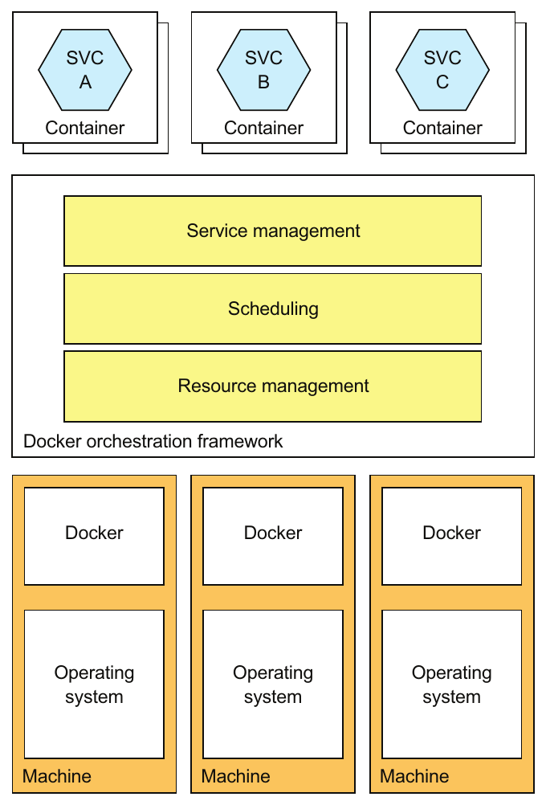

> **English:** Figure 12.9 A Docker orchestration framework turns a set of machines running Docker into a cluster of resources. It assigns containers to machines. The framework attempts to keep the desired number of healthy containers running at all times.
>
> **Türkçe:** Şekil 12.9 Docker orkestrasyon framework’ü, Docker çalıştıran makineler kümesini bir kaynak kümesine dönüştürür. Container’ları makinelere atar. Framework, istenen sayıda sağlıklı container’ı her zaman çalışır durumda tutmaya çalışır.

<!-- source-record: u12_0175 -->

> **English:** Docker orchestration frameworks are an increasingly popular way to deploy applications. Docker Swarm is part of the Docker engine, so is easy to set up and use. Kubernetes is much more complex to set up and administer, but it’s much more sophisticated. At the time of writing, Kubernetes has tremendous momentum, with a massive open source community. Let’s take a closer look at how it works.
>
> **Türkçe:** Docker orkestrasyon framework’leri, uygulama dağıtımında giderek yaygınlaşmaktadır. Docker Swarm, Docker engine’in parçası olduğundan kurulumu ve kullanımı kolaydır. Kubernetes’in kurulumu ve yönetimi çok daha karmaşıktır; ancak özellikleri de çok daha gelişmiştir. Kitabın yazıldığı dönemde Kubernetes, çok büyük bir açık kaynak topluluğuyla güçlü bir ivmeye sahiptir. Nasıl çalıştığına daha yakından bakalım.

<!-- source-record: u12_0176 -->

#### KUBERNETES ARCHITECTURE — KUBERNETES MİMARİSİ

<!-- source-record: u12_0177 -->

> **English:** Kubernetes runs on a cluster of machines. Figure 12.10 shows the architecture of a Kubernetes cluster. Each machine in a Kubernetes cluster is either a master or a node. A typical cluster has a small number of masters—perhaps just one—and many nodes. A master machine is responsible for managing the cluster. A node is a worker that runs one or more pods. A pod is Kubernetes’s unit of deployment and consists of a set of containers.
>
> **Türkçe:** Kubernetes, bir makine kümesi üzerinde çalışır. Şekil 12.10, Kubernetes kümesinin mimarisini gösterir. Kümedeki her makine ya master ya da node’dur. Tipik bir kümede az sayıda — belki yalnızca bir — master ve çok sayıda node bulunur. Master makine kümeyi yönetmekten sorumludur. Node, bir veya daha fazla pod çalıştıran işçi makinedir. Pod, Kubernetes’in dağıtım birimidir ve bir container kümesinden oluşur.

<!-- source-record: u12_0178 -->

> **English:** A master runs several components, including the following:
>
> **Türkçe:** Master, aşağıdakiler dâhil çeşitli bileşenleri çalıştırır:

<!-- source-record: u12_0179 -->

> **English:** • API server—The REST API for deploying and managing services, used by the kubectl command-line interface, for example.
>
> **Türkçe:** • API server — Servisleri dağıtıp yönetmek için kullanılan REST API’dir; örneğin kubectl komut satırı arayüzü tarafından kullanılır.

<!-- source-record: u12_0180 -->

> **English:** • Etcd—A key-value NoSQL database that stores the cluster data.
>
> **Türkçe:** • Etcd — Küme verilerini saklayan anahtar-değer türünde bir NoSQL veritabanıdır.

<!-- source-pages: 401 -->

<!-- source-record: u12_0181 -->

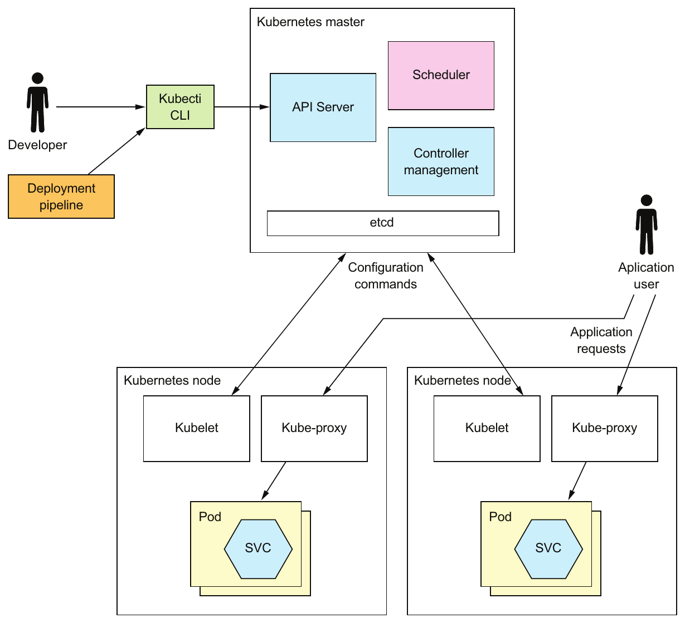

> **English:** Figure 12.10 A Kubernetes cluster consists of a master, which manages the cluster, and nodes, which run the services. Developers and the deployment pipeline interact with Kubernetes through the API server, which along with other cluster-management software runs on the master. Application containers run on nodes. Each node runs a Kubelet, which manages the application container, and a kube-proxy, which routes application requests to the pods, either directly as a proxy or indirectly by configuring iptables routing rules built into the Linux kernel.
>
> **Türkçe:** Şekil 12.10 Kubernetes kümesi, kümeyi yöneten bir master’dan ve servisleri çalıştıran node’lardan oluşur. Geliştiriciler ve dağıtım hattı, diğer küme yönetimi yazılımlarıyla birlikte master üzerinde çalışan API server aracılığıyla Kubernetes’le etkileşir. Uygulama container’ları node’larda çalışır. Her node, uygulama container’ını yöneten bir Kubelet ve uygulama isteklerini pod’lara yönlendiren bir kube-proxy çalıştırır. kube-proxy bu yönlendirmeyi ya doğrudan proxy olarak ya da Linux çekirdeğindeki iptables yönlendirme kurallarını yapılandırarak dolaylı biçimde yapar.

<!-- source-record: u12_0182 -->

> **English:** • Scheduler—Selects a node to run a pod.
>
> **Türkçe:** • Scheduler — Pod’un çalışacağı node’u seçer.

<!-- source-record: u12_0183 -->

> **English:** • Controller manager—Runs the controllers, which ensure that the state of the cluster matches the intended state. For example, one type of controller known as a replication controller ensures that the desired number of instances of a service are running by starting and terminating instances.
>
> **Türkçe:** • Controller manager — Kümenin gerçek durumunun hedeflenen durumla eşleşmesini sağlayan controller’ları çalıştırır. Örneğin replication controller adı verilen controller türü, örnekleri başlatıp sonlandırarak bir servisin istenen sayıda örneğinin çalışmasını sağlar.

<!-- source-record: u12_0184 -->

> **English:** A node runs several components, including the following:
>
> **Türkçe:** Node, aşağıdakiler dâhil çeşitli bileşenleri çalıştırır:

<!-- source-record: u12_0185 -->

> **English:** • Kubelet—Creates and manages the pods running on the node
>
> **Türkçe:** • Kubelet — Node üzerinde çalışan pod’ları oluşturur ve yönetir

<!-- source-record: u12_0186 -->

> **English:** • Kube-proxy—Manages networking, including load balancing across pods
>
> **Türkçe:** • Kube-proxy — Pod’lar arasında yük dengelemesi dâhil ağ işlerini yönetir

<!-- source-record: u12_0187 -->

> **English:** • Pods—The application services
>
> **Türkçe:** • Pods — Uygulama servisleri

> **English:** Let’s now look at key Kubernetes concepts you’ll need to master to deploy services on Kubernetes.
>
> **Türkçe:** Şimdi Kubernetes üzerinde servis dağıtmak için öğrenmeniz gereken temel Kubernetes kavramlarına bakalım.

<!-- source-pages: 402 -->

<!-- source-record: u12_0188 -->

#### KEY KUBERNETES CONCEPTS — TEMEL KUBERNETES KAVRAMLARI

<!-- source-record: u12_0189 -->

> **English:** As mentioned in the introduction to this section, Kubernetes is quite complex. But it’s possible to use Kubernetes productively once you master a few key concepts, called objects. Kubernetes defines many types of objects. From a developer’s perspective, the most important objects are the following:
>
> **Türkçe:** Bu bölümün girişinde belirtildiği gibi Kubernetes oldukça karmaşıktır. Ancak object (nesne) adı verilen birkaç temel kavramı öğrendiğinizde Kubernetes’i verimli biçimde kullanabilirsiniz. Kubernetes birçok nesne türü tanımlar. Geliştirici açısından en önemli nesneler şunlardır:

<!-- source-record: u12_0190 -->

> **English:** • Pod—A pod is the basic unit of deployment in Kubernetes. It consists of one or more containers that share an IP address and storage volumes. The pod for a service instance often consists of a single container, such as a container running the JVM. But in some scenarios a pod contains one or more sidecar containers, which implement supporting functions. For example, an NGINX server could have a sidecar that periodically does a git pull to download the latest version of the website. A pod is ephemeral, because either the pod’s containers or the node it’s running on might crash.
>
> **Türkçe:** • Pod — Kubernetes’in temel dağıtım birimidir. Aynı IP adresini ve depolama volume’larını paylaşan bir veya daha fazla container’dan oluşur. Servis örneğinin pod’u çoğu zaman, örneğin JVM çalıştıran tek bir container içerir. Ancak bazı senaryolarda pod, destekleyici işlevleri gerçekleştiren bir veya daha fazla sidecar container içerir. Örneğin bir NGINX sunucusunun yanında, web sitesinin en yeni sürümünü indirmek için düzenli aralıklarla git pull yapan bir sidecar bulunabilir. Pod kısa ömürlüdür; çünkü gerek içindeki container’lar gerekse üzerinde çalıştığı node çökebilir.

<!-- source-record: u12_0191 -->

> **English:** • Deployment—A declarative specification of a pod. A deployment is a controller that ensures that the desired number of instances of the pod (service instances) are running at all times. It supports versioning with rolling upgrades and rollbacks. Later in section 12.4.2, you’ll see that each service in a microservice architecture is a Kubernetes deployment.
>
> **Türkçe:** • Deployment — Bir pod’un bildirimsel tanımıdır. Deployment, pod’un istenen sayıda örneğinin — servis örneklerinin — her zaman çalışmasını sağlayan bir controller’dır. Rolling upgrade ve rollback ile sürümlemeyi destekler. İleride 12.4.2. bölümde, mikroservis mimarisindeki her servisin bir Kubernetes deployment’ı olduğunu göreceksiniz.

<!-- source-record: u12_0192 -->

> **English:** • Service—Provides clients of an application service with a static/stable network location. It’s a form of infrastructure-provided service discovery, described in chapter 3. A service has an IP address and a DNS name that resolves to that IP address and load balances TCP and UDP traffic across one or more pods. The IP address and a DNS name are only accessible within the Kubernetes. Later, I describe how to configure services that are accessible from outside the cluster.
>
> **Türkçe:** • Service — Bir uygulama servisinin istemcilerine sabit ve kararlı bir ağ konumu sağlar. 3. bölümde açıklanan, altyapının sağladığı service discovery yaklaşımının bir biçimidir. Service’in bir IP adresi ve bu adrese çözümlenen bir DNS adı vardır; TCP ve UDP trafiğini bir veya daha fazla pod arasında yük dengeler. IP adresine ve DNS adına yalnızca Kubernetes içinden erişilebilir. İleride küme dışından erişilebilen Service nesnelerinin nasıl yapılandırılacağını açıklıyorum.

<!-- source-record: u12_0193 -->

> **English:** • ConfigMap—A named collection of name-value pairs that defines the externalized configuration for one or more application services (see chapter 11 for an overview of externalized configuration). The definition of a pod’s container can reference a ConfigMap to define the container’s environment variables. It can also use a ConfigMap to create configuration files inside the container. You can store sensitive information, such as passwords, in a form of ConfigMap called a Secret.
>
> **Türkçe:** • ConfigMap — Bir veya daha fazla uygulama servisinin dışsallaştırılmış yapılandırmasını tanımlayan, ad-değer çiftlerinden oluşan adlandırılmış bir koleksiyondur. Dışsallaştırılmış yapılandırmaya genel bakış için 11. bölüme bakın. Bir pod’un container tanımı, container ortam değişkenlerini tanımlamak için ConfigMap’e başvurabilir. ConfigMap, container içinde yapılandırma dosyaları oluşturmak için de kullanılabilir. Parola gibi hassas bilgileri, kaynakta ConfigMap’in bir biçimi olarak anlatılan Secret içinde saklayabilirsiniz.

> **Terim notu:** `Secret` ve `ConfigMap` ayrı Kubernetes nesne türleridir. Kaynağın “a form of ConfigMap” ifadesi, ikisinin de yapılandırma verisi taşıması üzerinden yapılmış bir benzetme olarak okunmalıdır. [Kubernetes Secret belgesi](https://kubernetes.io/docs/concepts/configuration/secret/).

<!-- source-record: u12_0194 -->

> **English:** Now that we’ve reviewed the key Kubernetes concepts, let’s see them in action by looking at how to deploy an application service on Kubernetes.
>
> **Türkçe:** Temel Kubernetes kavramlarını gözden geçirdiğimize göre bir uygulama servisinin Kubernetes üzerinde nasıl dağıtılacağını inceleyerek bunları uygulamada görelim.

<!-- source-record: u12_0195 -->

### 12.4.2 Deploying the Restaurant service on Kubernetes — Restaurant Service’i Kubernetes üzerinde dağıtma

<!-- source-record: u12_0196 -->

> **English:** As mentioned earlier, to deploy a service on Kubernetes, you need to define a deployment. The easiest way to create a Kubernetes object such as a deployment is by writing a YAML file. Listing 12.4 is a YAML file defining a deployment for Restaurant Service. This deployment specifies running two replicas of a pod. The pod has just one container. The container definition specifies the Docker image running along with other attributes, such as the values of environment variables. The container’s environment variables are the service’s externalized configuration. They are read by Spring Boot and made available as properties in the application context.
>
> **Türkçe:** Daha önce belirtildiği gibi Kubernetes üzerinde bir servis dağıtmak için deployment tanımlamanız gerekir. Deployment gibi bir Kubernetes nesnesi oluşturmanın en kolay yolu YAML dosyası yazmaktır. Kod 12.4, Restaurant Service için deployment tanımlayan bir YAML dosyasıdır. Bu deployment, bir pod’un iki replikasının çalıştırılmasını belirtir. Pod yalnızca bir container içerir. Container tanımı, çalıştırılacak Docker imajının yanında ortam değişkenlerinin değerleri gibi başka özellikleri de belirtir. Container’ın ortam değişkenleri, servisin dışsallaştırılmış yapılandırmasıdır. Spring Boot tarafından okunur ve application context içinde property olarak kullanıma sunulurlar.

<!-- source-pages: 403 -->

<!-- source-record: u12_0197 -->

#### Listing 12.4 Kubernetes Deployment for ftgo-restaurant-service — Kod 12.4 ftgo-restaurant-service için Kubernetes Deployment tanımı

<!-- source-record: u12_0198 -->

**Kod açıklaması:**

> **English:** Specifies that this is an object of type Deployment
>
> **Türkçe:** Bunun Deployment türünde bir nesne olduğunu belirtir

<!-- source-record: u12_0199 -->

```yaml
apiVersion: extensions/v1beta1
kind: Deployment
metadata:
  name: ftgo-restaurant-service
spec:
  replicas: 2
  template:
    metadata:
      labels:
        app: ftgo-restaurant-service
    spec:
       containers:
       - name: ftgo-restaurant-service
         image: msapatterns/ftgo-restaurant-service:latest
         imagePullPolicy: Always
         ports:
         - containerPort: 8080
           name: httpport
         env:
           - name: JAVA_OPTS
             value: "-Dsun.net.inetaddr.ttl=30"
           - name: SPRING_DATASOURCE_URL
             value: jdbc:mysql://ftgo-mysql/eventuate
           - name: SPRING_DATASOURCE_USERNAME
             valueFrom:
               secretKeyRef:
                 name: ftgo-db-secret
                 key: username
           - name: SPRING_DATASOURCE_PASSWORD
             valueFrom:
               secretKeyRef:
                 name: ftgo-db-secret
                 key: password
           - name: SPRING_DATASOURCE_DRIVER_CLASS_NAME
             value: com.mysql.jdbc.Driver
           - name: EVENTUATELOCAL_KAFKA_BOOTSTRAP_SERVERS
             value: ftgo-kafka:9092
           - name: EVENTUATELOCAL_ZOOKEEPER_CONNECTION_STRING
             value: ftgo-zookeeper:2181
         livenessProbe:
           httpGet:
             path: /actuator/health
             port: 8080
           initialDelaySeconds: 60
           periodSeconds: 20
         readinessProbe:
           httpGet:
             path: /actuator/health
             port: 8080
           initialDelaySeconds: 60
           periodSeconds: 20
```

> **Editör notu — kaynak biçimi:** YAML üst düzey alanlarının ve pod şablonunun girintileri okunabilir biçime getirildi. Kaynaktaki `extensions/v1beta1` ve diğer API/sürüm değerleri korunmuştur; bu örnek güncel bir kümeye uygulanmak üzere doğrulanmadı.

<!-- source-record: u12_0200 -->

**Kod açıklaması:**

> **English:** The name of the deployment
>
> **Türkçe:** Deployment’ın adı

<!-- source-record: u12_0201 -->

**Kod açıklaması:**

> **English:** Number of pod replicas
>
> **Türkçe:** Pod replika sayısı

<!-- source-record: u12_0202 -->

**Kod açıklaması:**

> **English:** Gives each pod a label called app whose value is ftgo-restaurant-service
>
> **Türkçe:** Her pod’a değeri ftgo-restaurant-service olan app adlı bir label verir

<!-- source-record: u12_0203 -->

**Kod açıklaması:**

> **English:** The specification of the pod, which defines just one container
>
> **Türkçe:** Yalnızca tek bir container tanımlayan pod belirtimi

<!-- source-record: u12_0204 -->

**Kod açıklaması:**

> **English:** The container’s port
>
> **Türkçe:** Container’ın portu

<!-- source-record: u12_0205 -->

**Kod açıklaması:**

> **English:** The container’s environment variables, which are read by Spring Boot
>
> **Türkçe:** Spring Boot tarafından okunan container ortam değişkenleri

<!-- source-record: u12_0206 -->

**Kod açıklaması:**

> **English:** Sensitive values that are retrieved from the Kubernetes Secret called ftgo-db-secret
>
> **Türkçe:** ftgo-db-secret adlı Kubernetes Secret’tan alınan hassas değerler

<!-- source-record: u12_0207 -->

**Kod açıklaması:**

> **English:** Configure Kubernetes to invoke the health check endpoint.
>
> **Türkçe:** Kubernetes, health check endpoint’ini çağıracak biçimde yapılandırılır.

<!-- source-pages: 404 -->

<!-- source-record: u12_0208 -->

> **English:** This deployment definition configures Kubernetes to invoke Restaurant Service’s health check endpoint. As described in chapter 11, a health check endpoint enables Kubernetes to determine the health of the service instance. Kubernetes implements two different checks. The first check is readinessProbe, which it uses to determine whether it should route traffic to a service instance. In this example, Kubernetes invokes the /actuator/health HTTP endpoint every 20 seconds after an initial 30- second delay, which gives it a chance to initialize. If some number (default is 1) of consecutive readinessProbes succeeds, Kubernetes considers the service to be ready, whereas if some number (default, 3) of consecutive readinessProbes fail, it’s considered not to be ready. Kubernetes will only route traffic to the service instance when the readinessProbe indicates that it’s ready.
>
> **Türkçe:** Bu deployment tanımı, Kubernetes’i Restaurant Service’in health check endpoint’ini çağıracak biçimde yapılandırır. 11. bölümde açıklandığı gibi health check endpoint’i, Kubernetes’in servis örneğinin sağlığını belirlemesini sağlar. Kubernetes iki farklı kontrol uygular. İlki, trafiğin servis örneğine yönlendirilip yönlendirilmemesini belirlemek için kullanılan readinessProbe’dur. Bu örnekte Kubernetes, servise başlangıç işlemlerini tamamlaması için zaman tanıyan ilk 30 saniyelik gecikmeden sonra /actuator/health HTTP endpoint’ini her 20 saniyede bir çağırır. Art arda belirli sayıda — varsayılan olarak 1 — readinessProbe başarılı olursa Kubernetes servisi hazır kabul eder; art arda belirli sayıda — varsayılan olarak 3 — readinessProbe başarısız olursa hazır olmadığını kabul eder. Kubernetes, yalnızca readinessProbe hazır olduğunu gösterdiğinde trafiği servis örneğine yönlendirir.

> **Editör notu — 30 / 60 saniye:** Kaynak paragrafı 30 saniye der; hemen üstteki YAML hem `readinessProbe` hem `livenessProbe` için `initialDelaySeconds: 60` tanımlar. Gösterilen yapılandırmanın değeri 60 saniyedir. Çeviri, kaynak iddiasını görünür kılmak için 30 sayısını korur.

<!-- source-record: u12_0209 -->

> **English:** The second health check is the livenessProbe. It’s configured the same way as the readinessProbe. But rather than determine whether traffic should be routed to a service instance, the livenessProbe determines whether Kubernetes should terminate and restart the service instance. If some number (default, 3) of consecutive livenessProbes fail in a row, Kubernetes will terminate and restart the service.
>
> **Türkçe:** İkinci sağlık kontrolü livenessProbe’dur. readinessProbe ile aynı biçimde yapılandırılır. Ancak trafiğin servis örneğine yönlendirilip yönlendirilmemesini belirlemek yerine, Kubernetes’in servis örneğini sonlandırıp yeniden başlatıp başlatmaması gerektiğini belirler. Art arda belirli sayıda — varsayılan olarak 3 — livenessProbe başarısız olursa Kubernetes servisi sonlandırıp yeniden başlatır.

<!-- source-record: u12_0210 -->

> **English:** Once you’ve written the YAML file, you can create or update the deployment by using the kubectl apply command:
>
> **Türkçe:** YAML dosyasını yazdıktan sonra kubectl apply komutuyla deployment oluşturabilir veya güncelleyebilirsiniz:

<!-- source-record: u12_0211 -->

```bash
kubectl apply -f ftgo-restaurant-service/src/deployment/kubernetes/ftgo-restaurant-service.yml
```

<!-- source-record: u12_0212 -->

> **English:** This command makes a request to the Kubernetes API server that results in the creation of the deployment and the pods.
>
> **Türkçe:** Bu komut, Kubernetes API server’a bir istek gönderir; bunun sonucunda deployment ve pod’lar oluşturulur.

<!-- source-record: u12_0213 -->

> **English:** To create this deployment, you must first create the Kubernetes Secret called ftgo-db-secret. One quick and insecure way to do that is as follows:
>
> **Türkçe:** Bu deployment’ı oluşturmak için önce ftgo-db-secret adlı Kubernetes Secret’ı oluşturmalısınız. Bunu yapmanın hızlı fakat güvenli olmayan bir yolu şöyledir:

<!-- source-record: u12_0214 -->

```bash
kubectl create secret generic ftgo-db-secret \
  --from-literal=username=mysqluser --from-literal=password=mysqlpw
```

<!-- source-record: u12_0215 -->

> **English:** This command creates a secret containing the database user ID and password specified on the command line. See the Kubernetes documentation (https://kubernetes.io/docs/concepts/configuration/secret/#creating-your-own-secrets) for more secure ways to create secrets.
>
> **Türkçe:** Bu komut, komut satırında belirtilen veritabanı kullanıcı kimliğini ve parolasını içeren bir Secret oluşturur. Secret oluşturmanın daha güvenli yolları için Kubernetes belgelerine bakın: https://kubernetes.io/docs/concepts/configuration/secret/#creating-your-own-secrets.

<!-- source-record: u12_0216 -->

#### CREATING A KUBERNETES SERVICE — KUBERNETES SERVICE OLUŞTURMA

<!-- source-record: u12_0217 -->

> **English:** At this point the pods are running, and the Kubernetes deployment will do its best to keep them running. The problem is that the pods have dynamically assigned IP addresses and, as such, aren’t that useful to a client that wants to make an HTTP request. As described in chapter 3, the solution is to use a service discovery mechanism. One approach is to use a client-side discovery mechanism and install a service registry, such as Netflix OSS Eureka. Fortunately, we can avoid doing that by using the service discovery mechanism built in to Kubernetes and define a Kubernetes service.
>
> **Türkçe:** Bu noktada pod’lar çalışmaktadır ve Kubernetes deployment’ı onları çalışır durumda tutmak için elinden geleni yapacaktır. Sorun, pod’ların dinamik olarak atanan IP adreslerine sahip olmasıdır; bu nedenle HTTP isteği yapmak isteyen bir istemci açısından tek başlarına pek kullanışlı değildirler. 3. bölümde açıklandığı gibi çözüm, service discovery mekanizması kullanmaktır. Bir yaklaşım, istemci tarafında keşif mekanizması kullanmak ve Netflix OSS Eureka gibi bir service registry kurmaktır. Neyse ki Kubernetes’in yerleşik servis keşif mekanizmasını kullanıp bir Kubernetes Service tanımlayarak buna gerek bırakmayabiliriz.

<!-- source-pages: 405 -->

<!-- source-record: u12_0218 -->

> **English:** A service is a Kubernetes object that provides the clients of one or more pods with a stable endpoint. It has an IP address and a DNS name that resolves that IP address. The service load balances traffic to that IP address across the pods. Listing 12.5 shows the Kubernetes service for Restaurant Service. This service routes traffic from http://ftgo-restaurant-service:8080 to the pods defined by the deployment shown in the listing.
>
> **Türkçe:** Service, bir veya daha fazla pod’un istemcilerine kararlı bir endpoint sağlayan Kubernetes nesnesidir. Bir IP adresi ve o IP adresine çözümlenen DNS adı vardır. Service, bu IP adresine gelen trafiği pod’lar arasında yük dengeler. Kod 12.5, Restaurant Service için Kubernetes Service tanımını gösterir. Bu Service, http://ftgo-restaurant-service:8080 adresine gelen trafiği örnekteki deployment tarafından tanımlanan pod’lara yönlendirir.

<!-- source-record: u12_0219 -->

#### Listing 12.5 The YAML definition of the Kubernetes service for ftgo-restaurant-service — Kod 12.5 ftgo-restaurant-service için Kubernetes Service YAML tanımı

<!-- source-record: u12_0220 -->

```yaml
apiVersion: v1
kind: Service
metadata:
  name: ftgo-restaurant-service
spec:
  ports:
  - port: 8080
    targetPort: 8080
  selector:
    app: ftgo-restaurant-service
---
```

<!-- source-record: u12_0221 -->

**Kod açıklaması:**

> **English:** The name of the service, also the DNS name
>
> **Türkçe:** Service’in adı; aynı zamanda DNS adıdır

<!-- source-record: u12_0222 -->

**Kod açıklaması:**

> **English:** The exposed port
>
> **Türkçe:** Dışarıya sunulan port

<!-- source-record: u12_0223 -->

**Kod açıklaması:**

> **English:** The container port to route traffic to
>
> **Türkçe:** Trafiğin yönlendirileceği container portu

<!-- source-record: u12_0224 -->

**Kod açıklaması:**

> **English:** Selects the containers to route traffic to
>
> **Türkçe:** Trafiğin yönlendirileceği container’ları seçer

<!-- source-record: u12_0225 -->

> **English:** The key part of the service definition is selector, which selects the target pods. It selects those pods that have a label named app with the value ftgo-restaurant-service. If you look closely, you’ll see that the container defined in listing 12.4 has such a label.
>
> **Türkçe:** Service tanımının kilit bölümü, hedef pod’ları seçen selector’dır. app adlı label’ının değeri ftgo-restaurant-service olan pod’ları seçer. Dikkatli bakarsanız Kod 12.4’te tanımlanan container için böyle bir label bulunduğunu görürsünüz.

> **Editör notu — label’ın yeri:** Seçilen label, YAML içinde `spec.template.metadata.labels` altında pod şablonuna aittir. Kaynağın “container” sözcüğü burada pod düzeyini gevşek biçimde adlandırmaktadır.

<!-- source-record: u12_0226 -->

> **English:** Once you’ve written the YAML file, you can create the service using this command:
>
> **Türkçe:** YAML dosyasını yazdıktan sonra şu komutla Service oluşturabilirsiniz:

<!-- source-record: u12_0227 -->

```bash
kubectl apply -f ftgo-restaurant-service-service.yml
```

<!-- source-record: u12_0228 -->

> **English:** Now that we’ve created the Kubernetes service, any clients of Restaurant Service that are running inside the Kubernetes cluster can access its REST API via http://ftgo-restaurant-service:8080. Later, I discuss how to upgrade running services, but first let’s take a look at how to make the services accessible from outside the Kubernetes cluster.
>
> **Türkçe:** Kubernetes Service’i oluşturduğumuza göre Kubernetes kümesi içinde çalışan bütün Restaurant Service istemcileri, http://ftgo-restaurant-service:8080 üzerinden REST API’ye erişebilir. İleride çalışan servislerin nasıl yükseltileceğini ele alıyorum; fakat önce servislerin Kubernetes kümesi dışından nasıl erişilebilir hâle getirileceğine bakalım.

<!-- source-record: u12_0229 -->

### 12.4.3 Deploying the API gateway — API gateway’i dağıtma

<!-- source-record: u12_0230 -->

> **English:** The Kubernetes service for Restaurant Service, shown in listing 12.5, is only accessible from within the cluster. That’s not a problem for Restaurant Service, but what about API Gateway? Its role is to route traffic from the outside world to the service. It therefore needs to be accessible from outside the cluster. Fortunately, a Kubernetes service supports this use case as well. The service we looked at earlier is a ClusterIP service, which is the default, but there are, however, two other types of services: NodePort and LoadBalancer.
>
> **Türkçe:** Kod 12.5’te gösterilen Restaurant Service için Kubernetes Service’e yalnızca küme içinden erişilebilir. Bu, Restaurant Service için sorun değildir; fakat API Gateway için durum nedir? Onun görevi, dış dünyadan gelen trafiği servise yönlendirmektir. Bu nedenle küme dışından erişilebilir olmalıdır. Neyse ki Kubernetes Service bu kullanım durumunu da destekler. Daha önce incelediğimiz Service, varsayılan tür olan ClusterIP türündedir; ancak iki Service türü daha vardır: NodePort ve LoadBalancer.

<!-- source-pages: 406 -->

<!-- source-record: u12_0231 -->

> **English:** A NodePort service is accessible via a cluster-wide port on all the nodes in the cluster. Any traffic to that port on any cluster node is load balanced to the backend pods. You must select an available port in the range of 30000–32767. For example, listing 12.6 shows a service that routes traffic to port 30000 of Consumer Service.
>
> **Türkçe:** NodePort Service’e, kümedeki bütün node’larda ortak bir küme portu üzerinden erişilebilir. Kümedeki herhangi bir node’un o portuna gelen trafik, arka uç pod’ları arasında yük dengelenir. 30000–32767 aralığında kullanılabilir bir port seçmelisiniz. Örneğin Kod 12.6, trafiği Consumer Service’in 30000 portuna yönlendiren bir Service gösterir.

<!-- source-record: u12_0232 -->

#### Listing 12.6 The YAML definition of a NodePort service that routes traffic to port 8082 of Consumer Service — Kod 12.6 Trafiği Consumer Service’in 8082 portuna yönlendiren NodePort Service’in YAML tanımı

<!-- source-record: u12_0233 -->

```yaml
apiVersion: v1
kind: Service
metadata:
  name: ftgo-api-gateway
spec:
  type: NodePort
  ports:
  - nodePort: 30000
    port: 80
    targetPort: 8080
  selector:
    app: ftgo-api-gateway
---
```

<!-- source-record: u12_0234 -->

**Kod açıklaması:**

> **English:** Specifies a type of NodePort
>
> **Türkçe:** Türün NodePort olduğunu belirtir

<!-- source-record: u12_0235 -->

**Kod açıklaması:**

> **English:** The cluster-wide port
>
> **Türkçe:** Küme genelinde kullanılan port

<!-- source-record: u12_0236 -->

> **English:** API Gateway is within the cluster using the URL http://ftgo-api-gateway and outside the URL http://<node-ip-address>:3000/, where node-ip-address is the IP address of one of the nodes. After configuring a NodePort service you can, for example, configure an AWS Elastic Load Balancer (ELB) to load balance requests from the internet across the nodes. A key benefit of this approach is that the ELB is entirely under your control. You have complete flexibility when configuring it.
>
> **Türkçe:** API Gateway’e küme içinden http://ftgo-api-gateway URL’siyle, dışarıdan ise http://<node-ip-address>:3000/URL’siyle erişilir; burada node-ip-address node’lardan birinin IP adresidir. NodePort Service’i yapılandırdıktan sonra örneğin internetten gelen istekleri node’lar arasında yük dengelemek için bir AWS Elastic Load Balancer (ELB) yapılandırabilirsiniz. Bu yaklaşımın temel yararı, ELB’nin tamamen sizin denetiminizde olmasıdır. Yapılandırırken tam esnekliğe sahip olursunuz.

> **Editör notu — NodePort örneğindeki uyuşmazlıklar:** Önceki kaynak paragrafı ve Kod 12.6 başlığı Consumer Service/8082 ifadelerini kullanır; YAML ise `ftgo-api-gateway`, `nodePort: 30000`, `port: 80`, `targetPort: 8080` tanımlar. Bu paragraftaki dış URL’de bulunan `3000` da YAML ile uyuşmaz: örneğe göre dış erişim portu **30000** olmalıdır. Kaynak İngilizce ve çeviri korunmuş, doğru okuma burada ayrılmıştır.

<!-- source-record: u12_0237 -->

> **English:** A NodePort type service isn’t the only option, though. You can also use a LoadBalancer service, which automatically configures a cloud-specific load balancer. The load balancer will be an ELB if Kubernetes is running on AWS. One benefit of this type of service is that you no longer have to configure your own load balancer. The drawback, however, is that although Kubernetes does give a few options for configuring the ELB, such the SSL certificate, you have a lot less control over its configuration.
>
> **Türkçe:** Ancak NodePort türünde Service tek seçenek değildir. Buluta özgü bir load balancer’ı otomatik yapılandıran LoadBalancer Service de kullanabilirsiniz. Kubernetes AWS üzerinde çalışıyorsa bu load balancer bir ELB olur. Bu Service türünün bir yararı, kendi load balancer’ınızı yapılandırmak zorunda kalmamanızdır. Buna karşılık Kubernetes, SSL sertifikası gibi birkaç ELB yapılandırma seçeneği sağlasa da yapılandırma üzerinde çok daha az denetiminiz olur.

<!-- source-record: u12_0238 -->

### 12.4.4 Zero-downtime deployments — Kesintisiz dağıtımlar

<!-- source-record: u12_0239 -->

> **English:** Imagine you’ve updated Restaurant Service and want to deploy those changes into production. Updating a running service is a simple three-step process when using Kubernetes:
>
> **Türkçe:** Restaurant Service’i güncellediğinizi ve değişiklikleri canlı ortama dağıtmak istediğinizi düşünün. Kubernetes kullanıldığında çalışan servisi güncellemek üç basit adımdan oluşur:

<!-- source-record: u12_0240 -->

> **English:** 1 Build a new container image and push it to the registry using the same process described earlier. The only difference is that the image will be tagged with a different version tag—for example, ftgo-restaurant-service:1.1.0.RELEASE.
>
> **Türkçe:** 1 Daha önce anlatılan süreçle yeni container imajını oluşturup registry’ye gönderin. Tek fark, imajın farklı bir sürüm etiketi taşımasıdır; örneğin ftgo-restaurant-service:1.1.0.RELEASE.

<!-- source-record: u12_0241 -->

> **English:** 2 Edit the YAML file for the service’s deployment so that it references the new image.
>
> **Türkçe:** 2 Servisin deployment YAML dosyasını, yeni imaja başvuracak biçimde düzenleyin.

<!-- source-record: u12_0242 -->

> **English:** 3 Update the deployment using the kubectl apply -f command.
>
> **Türkçe:** 3 kubectl apply -f komutunu kullanarak deployment’ı güncelleyin.

<!-- source-record: u12_0243 -->

> **English:** Kubernetes will then perform a rolling upgrade of the pods. It will incrementally create pods running version 1.1.0.RELEASE and terminate the pods running version 1.0.0.RELEASE. What’s great about how Kubernetes does this is that it doesn’t terminate old pods until their replacements are ready to handle requests. It uses the readinessProbe mechanism, a health check mechanism described earlier in this section, to determine whether a pod is ready. As a result, there will always be pods available to handle requests. Eventually, assuming the new pods start successfully, all the deployment’s pods will be running the new version.
>
> **Türkçe:** Kubernetes daha sonra pod’ları rolling upgrade ile kademeli olarak yükseltir. 1.1.0.RELEASE sürümünü çalıştıran pod’ları aşamalı biçimde oluşturur, 1.0.0.RELEASE sürümünü çalıştıran pod’ları sonlandırır. Kubernetes’in bunu yapma biçiminin güzel yanı, yerlerine geçecek pod’lar istek işlemeye hazır olmadan eski pod’ları sonlandırmamasıdır. Pod’un hazır olup olmadığını belirlemek için bu bölümde daha önce açıklanan readinessProbe sağlık kontrolü mekanizmasını kullanır. Böylece istekleri işleyecek pod’lar her zaman bulunur. Yeni pod’ların başarıyla başladığı varsayılırsa sonunda deployment’ın bütün pod’ları yeni sürümü çalıştırır.

<!-- source-pages: 407 -->

<!-- source-record: u12_0244 -->

> **English:** But what if there’s a problem and the version 1.1.0.RELEASE pods don’t start? Perhaps there’s a bug, such as a misspelled container image name or a missing environment variable for a new configuration property. If the pods fail to start, the deployment will become stuck. At that point, you have two options. One option is to fix the YAML file and rerun kubectl apply -f to update the deployment. The other option is to roll back the deployment.
>
> **Türkçe:** Peki bir sorun varsa ve 1.1.0.RELEASE pod’ları başlamazsa ne olur? Örneğin container imajı adının yanlış yazılması veya yeni bir yapılandırma özelliğine ait ortam değişkeninin eksik olması gibi bir hata bulunabilir. Pod’lar başlayamazsa deployment ilerleyemez hâle gelir. Bu noktada iki seçeneğiniz vardır. Birincisi YAML dosyasını düzeltip deployment’ı güncellemek için kubectl apply -f komutunu yeniden çalıştırmaktır. İkincisi deployment’ı önceki sürüme geri almaktır.

<!-- source-record: u12_0245 -->

> **English:** A deployment maintains the history of what are termed rollouts. Each time you update the deployment, it creates a new rollout. As a result, you can easily roll back a deployment to a previous version by executing the following command:
>
> **Türkçe:** Deployment, rollout adı verilen dağıtım değişikliklerinin geçmişini saklar. Deployment’ı her güncellediğinizde yeni bir rollout oluşturur. Böylece şu komutu çalıştırarak deployment’ı kolayca önceki bir sürüme döndürebilirsiniz:

<!-- source-record: u12_0246 -->

```bash
kubectl rollout undo deployment ftgo-restaurant-service
```

<!-- source-record: u12_0247 -->

> **English:** Kubernetes will then replace the pods running version 1.1.0.RELEASE with pods running the older version, 1.0.0.RELEASE.
>
> **Türkçe:** Kubernetes daha sonra 1.1.0.RELEASE sürümünü çalıştıran pod’ları, eski 1.0.0.RELEASE sürümünü çalıştıran pod’larla değiştirir.

<!-- source-record: u12_0248 -->

> **English:** A Kubernetes deployment is a good way to deploy a service without downtime. But what if a bug only appears after the pod is ready and receiving production traffic? In that situation, Kubernetes will continue to roll out new versions, so a growing number of users will be impacted. Though your monitoring system will hopefully detect the issue and quickly roll back the deployment, you won’t avoid impacting at least some users. To address this issue and make rolling out a new version of a service more reliable, we need to separate deploying, which means getting the service running in production, from releasing the service, which means making it available to handle production traffic. Let’s look at how to accomplish that using a service mesh.
>
> **Türkçe:** Kubernetes deployment, servisi kesinti olmadan dağıtmanın iyi bir yoludur. Ancak bir hata yalnızca pod hazır olup canlı ortam trafiği almaya başladıktan sonra ortaya çıkarsa ne olur? Bu durumda Kubernetes yeni sürümleri dağıtmaya devam eder; dolayısıyla giderek daha çok kullanıcı etkilenir. İzleme sisteminizin sorunu algılayıp deployment’ı hızla geri almasını umsanız da en azından bazı kullanıcıların etkilenmesini önleyemezsiniz. Bu sorunu gidermek ve yeni bir servis sürümünün kullanıma alınmasını daha güvenilir kılmak için, servisi canlı ortamda çalışır hâle getirmek anlamındaki deploying ile servisi canlı ortam trafiğini karşılamaya açmak anlamındaki releasing süreçlerini ayırmalıyız. Bunu service mesh ile nasıl yapacağımıza bakalım.

<!-- source-record: u12_0249 -->

### 12.4.5 Using a service mesh to separate deployment from release — Deployment ile release süreçlerini ayırmak için service mesh kullanma

<!-- source-record: u12_0250 -->

> **English:** The traditional way to roll out a new version of a service is to first test it in a staging environment. Then, once it’s passed the test in staging, you deploy in production by doing a rolling upgrade that replaces old instances of the service with new service instances. On one hand, as you just saw, Kubernetes deployments make doing a rolling upgrade very straightforward. On the other hand, this approach assumes that once a service version has passed the tests in the staging environment, it will work in production. Sadly, this is not always the case.
>
> **Türkçe:** Yeni bir servis sürümünü kullanıma almanın geleneksel yolu, önce staging (canlı ortam öncesi doğrulama) ortamında test etmektir. Staging testleri geçildikten sonra eski servis örneklerini yenileriyle değiştiren bir rolling upgrade yaparak canlı ortama dağıtırsınız. Bir yandan, az önce gördüğünüz gibi Kubernetes deployment’ları rolling upgrade yapmayı oldukça kolaylaştırır. Diğer yandan bu yaklaşım, staging ortamındaki testleri geçen bir servis sürümünün canlı ortamda da çalışacağını varsayar. Ne yazık ki her zaman böyle olmaz.

<!-- source-record: u12_0251 -->

> **English:** One reason is because staging is unlikely to be an exact clone, if for no other reason than the production environment is likely to be much larger and handle much more traffic. It’s also time consuming to keep the two environments synchronized. As a result of discrepancies, it’s likely that some bugs will only show up in production. And even if it were an exact clone, you can’t guarantee that testing will catch all bugs.
>
> **Türkçe:** Bunun nedenlerinden biri, staging ortamının tam bir kopya olmasının düşük olasılıklı olmasıdır; başka neden olmasa bile canlı ortamın çok daha büyük olması ve çok daha fazla trafik işlemesi beklenir. İki ortamı eşzamanlı tutmak da zaman alır. Aralarındaki farklılıklar nedeniyle bazı hataların yalnızca canlı ortamda ortaya çıkması olasıdır. Üstelik tam bir kopya olsaydı bile testlerin bütün hataları yakalayacağını garanti edemezsiniz.

<!-- source-pages: 408 -->

<!-- source-record: u12_0252 -->

> **English:** A much more reliable way to roll out a new version is to separate deployment from release:
>
> **Türkçe:** Yeni sürümü kullanıma almanın çok daha güvenilir yolu, deployment ile release’i ayırmaktır:

<!-- source-record: u12_0253 -->

> **English:** • Deployment—Running in the production environment
>
> **Türkçe:** • Deployment — Canlı ortamda çalıştırmak

<!-- source-record: u12_0254 -->

> **English:** • Releasing a service—Making it available to end users
>
> **Türkçe:** • Servisi release etmek — Son kullanıcıların kullanımına açmak

<!-- source-record: u12_0255 -->

> **English:** You then deploy a service into production using the following steps:
>
> **Türkçe:** Ardından servisi şu adımlarla canlı ortama dağıtırsınız:

<!-- source-record: u12_0256 -->

> **English:** 1 Deploy the new version into production without routing any end-user requests to it.
>
> **Türkçe:** 1 Yeni sürümü canlı ortama dağıtın, fakat hiçbir son kullanıcı isteğini ona yönlendirmeyin.

<!-- source-record: u12_0257 -->

> **English:** 2 Test it in production.
>
> **Türkçe:** 2 Canlı ortamda test edin.

<!-- source-record: u12_0258 -->

> **English:** 3 Release it to a small number of end users.
>
> **Türkçe:** 3 Az sayıda son kullanıcının kullanımına açın.

<!-- source-record: u12_0259 -->

> **English:** 4 Incrementally release it to an increasingly larger number of users until it’s handling all the production traffic.
>
> **Türkçe:** 4 Canlı ortam trafiğinin tamamını karşılayana kadar, giderek daha büyük kullanıcı gruplarına aşamalı biçimde açın.

<!-- source-record: u12_0260 -->

> **English:** 5 If at any point there’s an issue, revert back to the old version—otherwise, once you’re confident the new version is working correctly, delete the old version.
>
> **Türkçe:** 5 Herhangi bir noktada sorun çıkarsa eski sürüme geri dönün; sorun çıkmazsa yeni sürümün doğru çalıştığından emin olduğunuzda eski sürümü silin.

<!-- source-record: u12_0261 -->

> **English:** Ideally, those steps will be performed by a fully automated deployment pipeline that carefully monitors the newly deployed service for errors.
>
> **Türkçe:** İdeal olarak bu adımları, yeni dağıtılan servisi hatalara karşı dikkatle izleyen, tamamen otomatik bir dağıtım hattı gerçekleştirir.

<!-- source-record: u12_0262 -->

> **English:** Traditionally, separating deployments and releases in this way has been challenging because it requires a lot of work to implement it. But one of the benefits of using a service mesh is that using this style of deployment is a lot easier. A service mesh is, as described in chapter 11, networking infrastructure that mediates all communication between a service and other services and external applications. In addition to taking on some of the responsibilities of the microservice chassis framework, a service mesh provides rule-based load balancing and traffic routing that lets you safely run multiple versions of your services simultaneously. Later in this section, you’ll see that you can route test users to one version of a service and end-users to a different version, for example.
>
> **Türkçe:** Geleneksel olarak deployment ve release süreçlerini bu şekilde ayırmak zordur; çünkü gerçekleştirmek için çok fazla iş gerekir. Ancak service mesh kullanmanın yararlarından biri, bu dağıtım biçimini çok daha kolaylaştırmasıdır. 11. bölümde açıklandığı gibi service mesh, bir servisin diğer servislerle ve dış uygulamalarla bütün iletişimine aracılık eden ağ altyapısıdır. Microservice chassis framework’ünün bazı sorumluluklarını üstlenmenin yanı sıra service mesh, servislerinizin birden fazla sürümünü aynı anda güvenle çalıştırmanızı sağlayan kural tabanlı yük dengeleme ve trafik yönlendirme sağlar. Örneğin bu bölümün ilerleyen kısmında test kullanıcılarını servisin bir sürümüne, son kullanıcıları başka bir sürümüne yönlendirebildiğinizi göreceksiniz.

<!-- source-record: u12_0263 -->

> **English:** As described in chapter 11, there are several service meshes to choose from. In this section, I show you how to use Istio, a popular, open source service mesh originally developed by Google, IBM, and Lyft. I begin by providing a brief overview of Istio and a few of its many features. Next I describe how to deploy an application using Istio. After that, I show how to use its traffic-routing capabilities to deploy and release an upgrade to a service.
>
> **Türkçe:** 11. bölümde anlatıldığı gibi seçebileceğiniz çeşitli service mesh çözümleri vardır. Bu bölümde, ilk olarak Google, IBM ve Lyft tarafından geliştirilen yaygın açık kaynak service mesh Istio’nun nasıl kullanılacağını gösteriyorum. Önce Istio’ya ve çok sayıdaki özelliğinden birkaçına kısaca genel bakış sunuyorum. Ardından Istio ile uygulamanın nasıl dağıtılacağını açıklıyorum. Son olarak trafik yönlendirme yeteneklerini kullanarak servis yükseltmesinin nasıl dağıtılıp kullanıma açılacağını gösteriyorum.

<!-- source-record: u12_0264 -->

#### OVERVIEW OF THE ISTIO SERVICE MESH — ISTIO SERVICE MESH’E GENEL BAKIŞ

<!-- source-record: u12_0265 -->

> **English:** The Istio website describes Istio as an “An open platform to connect, manage, and secure microservices” (https://istio.io). It’s a networking layer through which all of your services’ network traffic flows. Istio has a rich set of features organized into four main categories:
>
> **Türkçe:** Istio web sitesi, Istio’yu “mikroservisleri birbirine bağlamak, yönetmek ve güvenliğini sağlamak için açık bir platform” olarak tanımlar (https://istio.io). Bütün servislerinizin ağ trafiğinin içinden geçtiği bir ağ katmanıdır. Istio, dört ana kategoride düzenlenmiş zengin bir özellik kümesine sahiptir:

<!-- source-record: u12_0266 -->

> **English:** • Traffic management—Includes service discovery, load balancing, routing rules, and circuit breakers
>
> **Türkçe:** • Trafik yönetimi — Service discovery, yük dengeleme, yönlendirme kuralları ve circuit breaker’ları kapsar

<!-- source-record: u12_0267 -->

> **English:** • Security—Secures interservice communication using Transport Layer Security (TLS)
>
> **Türkçe:** • Güvenlik — Transport Layer Security (TLS) kullanarak servisler arası iletişimi güvenli hâle getirir

<!-- source-pages: 409 -->

<!-- source-record: u12_0268 -->

> **English:** • Telemetry—Captures metrics about network traffic and implements distributed tracing
>
> **Türkçe:** • Telemetri — Ağ trafiğine ilişkin metrikleri toplar ve distributed tracing (dağıtık iz sürme) sağlar

<!-- source-record: u12_0269 -->

> **English:** • Policy enforcement—Enforces quotas and rate limits
>
> **Türkçe:** • Politika uygulama — Kotaları ve hız sınırlarını uygular

<!-- source-record: u12_0270 -->

> **English:** This section focuses on Istio’s traffic-management capabilities.
>
> **Türkçe:** Bu bölüm, Istio’nun trafik yönetimi yeteneklerine odaklanır.

<!-- source-record: u12_0271 -->

> **English:** Figure 12.11 shows Istio’s architecture. It consists of a control plane and a data plane. The control plane implements management functions, including configuring the data plane to route traffic. The data plane consists of Envoy proxies, one per service instance.
>
> **Türkçe:** Şekil 12.11, Istio mimarisini gösterir. Mimari, control plane (kontrol düzlemi) ve data plane’den (veri düzlemi) oluşur. Control plane, trafiği yönlendirmek üzere data plane’i yapılandırmak dâhil yönetim işlevlerini gerçekleştirir. Data plane ise her servis örneği için bir tane olmak üzere Envoy proxy’lerinden oluşur.

<!-- source-record: u12_0272 -->

> **English:** The two main components of the control plane are the Pilot and the Mixer. The Pilot extracts information about deployed services from the underlying infrastructure. When running on Kubernetes, for example, the Pilot retrieves the services and healthy pods. It configures the Envoy proxies to route traffic according to the defined routing rules. The Mixer collects telemetry from the Envoy proxies and enforces policies.
>
> **Türkçe:** Control plane’in iki ana bileşeni Pilot ve Mixer’dır. Pilot, dağıtılmış servislerle ilgili bilgileri alttaki altyapıdan alır. Örneğin Kubernetes üzerinde çalışırken servisleri ve sağlıklı pod’ları getirir. Envoy proxy’lerini, trafiği tanımlanmış yönlendirme kurallarına göre yönlendirecek biçimde yapılandırır. Mixer, Envoy proxy’lerinden telemetri toplar ve politikaları uygular.

<!-- source-record: u12_0273 -->

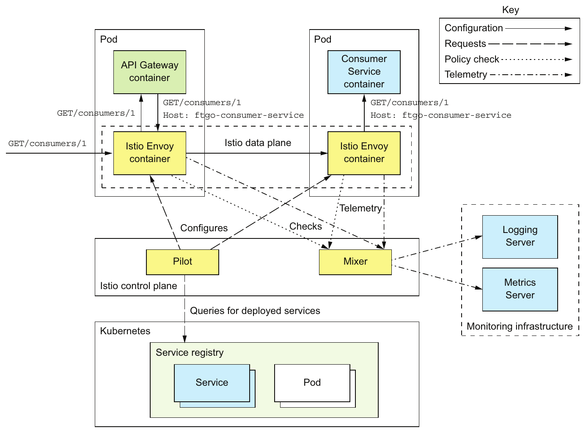

> **English:** Figure 12.11 Istio consists of a control plane, whose components include the Pilot and the Mixer, and a data plane, which consists of Envoy proxy servers. The Pilot extracts information about deployed services from the underlying infrastructure and configures the data plane. The Mixer enforces policies such as quotas and gathers telemetry, reporting it to the monitoring infrastructure servers. The Envoy proxy servers route traffic in and out of services. There’s one Envoy proxy server per service instance.
>
> **Türkçe:** Şekil 12.11 Istio, bileşenleri arasında Pilot ve Mixer bulunan bir control plane ile Envoy proxy sunucularından oluşan bir data plane içerir. Pilot, dağıtılmış servislerle ilgili bilgileri alttaki altyapıdan alır ve data plane’i yapılandırır. Mixer, kota gibi politikaları uygular ve telemetriyi toplayıp izleme altyapısı sunucularına raporlar. Envoy proxy sunucuları, servislere gelen ve servislerden çıkan trafiği yönlendirir. Her servis örneği için bir Envoy proxy sunucusu vardır.

<!-- source-pages: 410 -->

<!-- source-record: u12_0274 -->

> **English:** The Istio Envoy proxy is a modified version of Envoy (www.envoyproxy.io). It’s a high-performance proxy that supports a variety of protocols, including TCP, low-level protocols such as HTTP and HTTPS, and higher-level protocols. It also understands MongoDB, Redis, and DynamoDB protocols. Envoy also supports robust interservice communication with features such as circuit breakers, rate limiting, and automatic retries. It can secure communication within the application by using TLS for interEnvoy communication.
>
> **Türkçe:** Istio Envoy proxy, Envoy’un değiştirilmiş bir sürümüdür (www.envoyproxy.io). TCP, HTTP ve HTTPS gibi alt düzey protokoller ve daha üst düzey protokoller dâhil çeşitli protokolleri destekleyen yüksek performanslı bir proxy’dir. MongoDB, Redis ve DynamoDB protokollerini de anlar. Envoy ayrıca circuit breaker, rate limiting ve otomatik yeniden deneme gibi özelliklerle servisler arası dayanıklı iletişimi destekler. Envoy’lar arası iletişimde TLS kullanarak uygulama içindeki iletişimi güvenli hâle getirebilir.

<!-- source-record: u12_0275 -->

> **English:** Istio uses Envoy as a sidecar, a process or container that runs alongside the service instance and implements cross-cutting concerns. When running on Kubernetes, the Envoy proxy is a container within the service’s pod. In other environments that don’t have the pod concept, Envoy runs in the same container as the service. All traffic to and from a service flows through its Envoy proxy, which routes traffic according to the routing rules given to it by the control plane. For example, direct Service → Service communication becomes Service → Source Envoy → Destination Envoy → Service.
>
> **Türkçe:** Istio, Envoy’u bir sidecar olarak kullanır: servis örneğinin yanında çalışan ve ortak teknik gereksinimleri gerçekleştiren bir süreç veya container. Kubernetes üzerinde Envoy proxy, servisin pod’u içindeki bir container’dır. Pod kavramı bulunmayan diğer ortamlarda Envoy, servisle aynı container’da çalışır. Servise gelen ve servisten çıkan bütün trafik, control plane’in verdiği yönlendirme kurallarına göre trafiği yönlendiren Envoy proxy’den geçer. Örneğin doğrudan Service → Service iletişimi, Service → Source Envoy → Destination Envoy → Service biçimine dönüşür.

<!-- source-record: u12_0276 -->

### Pattern: Sidecar — Örüntü: Sidecar

<!-- source-record: u12_0277 -->

> **English:** Implement cross-cutting concerns in a sidecar process or container that runs alongside the service instance. See http://microservices.io/patterns/deployment/sidecar.html.
>
> **Türkçe:** Ortak teknik gereksinimleri, servis örneğinin yanında çalışan bir sidecar süreç veya container içinde gerçekleştirin. Bkz. http://microservices.io/patterns/deployment/sidecar.html.

<!-- source-record: u12_0278 -->

> **English:** Istio is configured using Kubernetes-style YAML configuration files. It has a command-line tool called istioctl that’s similar to kubectl. You use istioctl for creating, updating, and deleting rules and policies. When using Istio on Kubernetes, you can also use kubectl.
>
> **Türkçe:** Istio, Kubernetes biçimindeki YAML yapılandırma dosyalarıyla yapılandırılır. kubectl’e benzeyen, istioctl adlı bir komut satırı aracı vardır. Kural ve politikaları oluşturmak, güncellemek ve silmek için istioctl kullanılır. Istio Kubernetes üzerinde kullanıldığında kubectl de kullanılabilir.

<!-- source-record: u12_0279 -->

> **English:** Let’s look at how to deploy a service with Istio.
>
> **Türkçe:** Istio ile bir servisin nasıl dağıtılacağına bakalım.

<!-- source-record: u12_0280 -->

#### DEPLOYING A SERVICE WITH ISTIO — ISTIO İLE SERVİS DAĞITMA

<!-- source-record: u12_0281 -->

> **English:** Deploying a service on Istio is quite straightforward. You define a Kubernetes Service and a Deployment for each of your application’s services. Listing 12.7 shows the definition of Service and Deployment for Consumer Service. Although it’s almost identical to the definitions I showed earlier, there are a few differences. That’s because Istio has a few requirements for the Kubernetes services and pods:
>
> **Türkçe:** Istio üzerinde servis dağıtmak oldukça basittir. Uygulamanızdaki her servis için bir Kubernetes Service ve Deployment tanımlarsınız. Kod 12.7, Consumer Service için Service ve Deployment tanımını gösterir. Daha önce gösterdiğim tanımlarla neredeyse aynı olsa da birkaç fark vardır. Çünkü Istio’nun Kubernetes Service’leri ve pod’ları için bazı gereksinimleri bulunur:

<!-- source-record: u12_0282 -->

> **English:** • A Kubernetes service port must use the Istio naming convention of <protocol>[-<suffix>], where protocol is http, http2, grpc, mongo, or redis. If the port is unnamed, Istio will treat the port as a TCP port and won’t apply rule-based routing.
>
> **Türkçe:** • Kubernetes Service portu, Istio’nun <protocol>[-<suffix>] adlandırma biçimini kullanmalıdır; protocol değeri http, http2, grpc, mongo veya redis olur. Port adsızsa Istio onu TCP portu olarak ele alır ve kural tabanlı yönlendirme uygulamaz.

<!-- source-record: u12_0283 -->

> **English:** • A pod should have an app label such as app: ftgo-consumer-service, which identifies the service, in order to support Istio distributed tracing.
>
> **Türkçe:** • Istio’nun distributed tracing özelliğini desteklemek için pod, servisi tanımlayan app: ftgo-consumer-service gibi bir app label’ına sahip olmalıdır.

<!-- source-record: u12_0284 -->

> **English:** • In order to run multiple versions of a service simultaneously, the name of a Kubernetes deployment must include the version, such as ftgo-consumer-service-v1, ftgo-consumer-service-v2, and so on. A deployment’s pods should have a version label, such as version: v1, which specifies the version, so that Istio can route to a specific version.
>
> **Türkçe:** • Bir servisin birden fazla sürümünü aynı anda çalıştırabilmek için Kubernetes Deployment adında sürüm bulunmalıdır; örneğin ftgo-consumer-service-v1, ftgo-consumer-service-v2 vb. Deployment’ın pod’larında sürümü belirten version: v1 gibi bir version label’ı bulunmalıdır; böylece Istio belirli bir sürüme yönlendirebilir.

<!-- source-pages: 411 -->

<!-- source-record: u12_0285 -->

#### Listing 12.7 Deploying Consumer Service with Istio — Kod 12.7 Consumer Service’i Istio ile dağıtma

<!-- source-record: u12_0286 -->

```yaml
apiVersion: v1
kind: Service
metadata:
  name: ftgo-consumer-service
spec:
  ports:
  - name: http
    port: 8080
    targetPort: 8080
  selector:
    app: ftgo-consumer-service
---
apiVersion: extensions/v1beta1
kind: Deployment
metadata:
  name: ftgo-consumer-service-v2
spec:
  replicas: 1
  template:
    metadata:
      labels:
        app: ftgo-consumer-service
        version: v2
    spec:
      containers:
      - image: ftgo-consumer-service:v2
# ...
```

> **Editör notu — kaynak yazım hatası:** Kaynakta `image: image: ftgo-consumer-service:v2` yazılıdır. Yinelenen `image:` kaldırıldı ve YAML girintileri düzenlendi. `...` ile gösterilen eksik bölüm yorum biçiminde korundu; örnek hâlâ tam bir Deployment tanımı değildir.

<!-- source-record: u12_0287 -->

**Kod açıklaması:**

> **English:** Named port
>
> **Türkçe:** Adlandırılmış port

<!-- source-record: u12_0288 -->

**Kod açıklaması:**

> **English:** Versioned deployment
>
> **Türkçe:** Sürümlenmiş deployment

<!-- source-record: u12_0289 -->

**Kod açıklaması:**

> **English:** Recommended labels
>
> **Türkçe:** Önerilen label’lar

<!-- source-record: u12_0290 -->

**Kod açıklaması:**

> **English:** Image version
>
> **Türkçe:** İmaj sürümü

<!-- source-record: u12_0291 -->

> **English:** By now, you may be wondering how to run the Envoy proxy container in the service’s pod. Fortunately, Istio makes that remarkably easy by automating modifying the pod definition to include the Envoy proxy. There are two ways to do that. The first is to use manual sidecar injection and run the istioctl kube-inject command:
>
> **Türkçe:** Bu noktada Envoy proxy container’ını servisin pod’unda nasıl çalıştıracağınızı merak ediyor olabilirsiniz. Neyse ki Istio, pod tanımını Envoy proxy’yi içerecek biçimde değiştirmeyi otomatikleştirerek bunu çok kolaylaştırır. Bunu yapmanın iki yolu vardır. Birincisi, manual sidecar injection kullanıp istioctl kube-inject komutunu çalıştırmaktır:

<!-- source-record: u12_0292 -->

```bash
istioctl kube-inject -f ftgo-consumer-service/src/deployment/kubernetes/ftgo-consumer-service.yml | kubectl apply -f -
```

<!-- source-record: u12_0293 -->

> **English:** This command reads a Kubernetes YAML file and outputs the modified configuration containing the Envoy proxy. The modified configuration is then piped into kubectl apply.
>
> **Türkçe:** Bu komut Kubernetes YAML dosyasını okur ve Envoy proxy’yi içeren değiştirilmiş yapılandırmayı çıktılar. Değiştirilmiş yapılandırma daha sonra pipe aracılığıyla kubectl apply komutuna aktarılır.

<!-- source-record: u12_0294 -->

> **English:** The second way to add the Envoy sidecar to the pod is to use automatic sidecar injection. When this feature is enabled, you deploy a service using kubectl apply. Kubernetes automatically invokes Istio to modify the pod definition to include the Envoy proxy.
>
> **Türkçe:** Envoy sidecar’ı pod’a eklemenin ikinci yolu automatic sidecar injection kullanmaktır. Bu özellik etkinleştirildiğinde servisi kubectl apply ile dağıtırsınız. Kubernetes, pod tanımını Envoy proxy’yi içerecek biçimde değiştirmesi için Istio’yu otomatik olarak çağırır.

<!-- source-record: u12_0295 -->

> **English:** If you describe your service’s pod, you’ll see that it consists of more than your service’s container:
>
> **Türkçe:** Servisinizin pod’unu describe komutuyla incelediğinizde, yalnızca servis container’ından oluşmadığını görürsünüz:

<!-- source-record: u12_0296 -->

```bash
$ kubectl describe po ftgo-consumer-service-7db65b6f97-q9jpr
Name:           ftgo-consumer-service-7db65b6f97-q9jpr
Namespace:      default
  ...
Init Containers:
  istio-init:
     Image:         docker.io/istio/proxy_init:0.8.0
    ....
Containers:
  ftgo-consumer-service:
     Image:          msapatterns/ftgo-consumer-service:latest
    ...
  istio-proxy:
    Image:         docker.io/istio/proxyv2:0.8.0
 ...
```

<!-- source-pages: 412 -->

<!-- source-record: u12_0297 -->

**Kod açıklaması:**

> **English:** Initializes the pod
>
> **Türkçe:** Pod’u başlangıç için hazırlar

<!-- source-record: u12_0298 -->

**Kod açıklaması:**

> **English:** The service container
>
> **Türkçe:** Servis container’ı

<!-- source-record: u12_0299 -->

**Kod açıklaması:**

> **English:** The Envoy container
>
> **Türkçe:** Envoy container’ı

<!-- source-record: u12_0300 -->

> **English:** Now that we’ve deployed the service, let’s look at how to define routing rules.
>
> **Türkçe:** Servisi dağıttığımıza göre yönlendirme kurallarının nasıl tanımlandığına bakalım.

<!-- source-record: u12_0301 -->

#### CREATE ROUTING RULES TO ROUTE TO THE V1 VERSION — V1 SÜRÜMÜNE YÖNLENDİRMEK İÇİN KURALLAR OLUŞTURMA

<!-- source-record: u12_0302 -->

> **English:** Let’s imagine that you deployed the ftgo-consumer-service-v2 deployment. In the absence of routing rules, Istio load balances requests across all versions of a service. It would, therefore, load balance across versions 1 and 2 of ftgo-consumer-service, which defeats the purpose of using Istio. In order to safely roll out a new version, you must define a routing rule that routes all traffic to the current v1 version.
>
> **Türkçe:** ftgo-consumer-service-v2 deployment’ını dağıttığınızı düşünün. Yönlendirme kuralları olmadığında Istio, istekleri servisin bütün sürümleri arasında yük dengeler. Dolayısıyla ftgo-consumer-service’in 1 ve 2 sürümleri arasında yük dengelemesi yapar; bu da Istio kullanma amacını boşa çıkarır. Yeni sürümü güvenle kullanıma alabilmek için bütün trafiği mevcut v1 sürümüne yönlendiren bir kural tanımlamalısınız.

<!-- source-record: u12_0303 -->

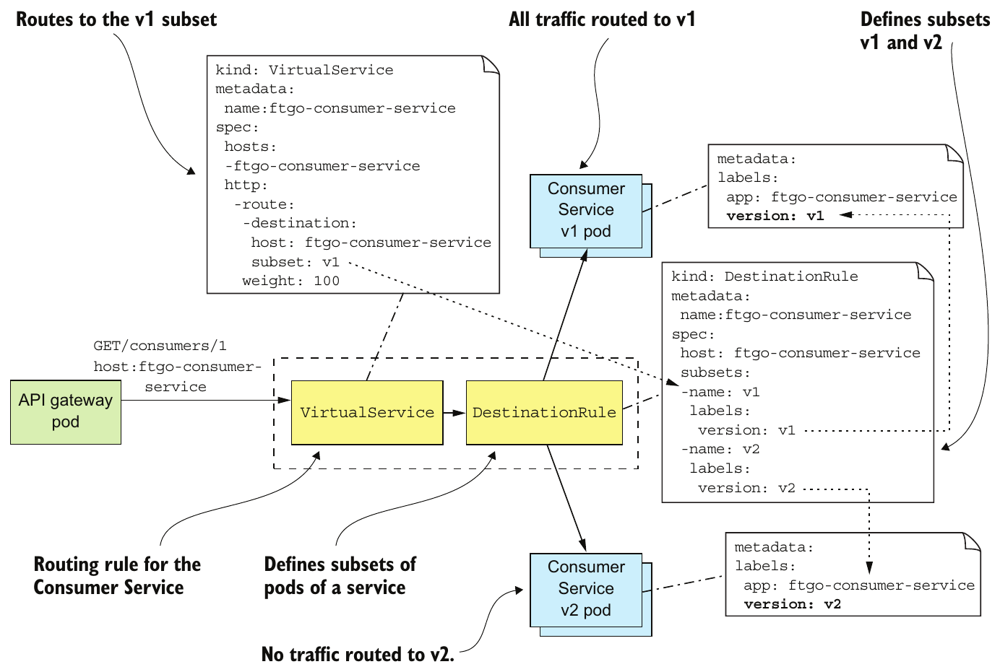

> **English:** Figure 12.12 The routing rule for Consumer Service, which routes all traffic to the v1 pods. It consists of a VirtualService, which routes its traffic to the v1 subset, and a DestinationRule, which defines the v1 subset as the pods labeled with version: v1. Once you’ve defined this rule, you can safely deploy a new version without routing any traffic to it initially.
>
> **Türkçe:** Şekil 12.12 Consumer Service için bütün trafiği v1 pod’larına yönlendiren kural. Kural, trafiğini v1 alt kümesine yönlendiren bir VirtualService ile v1 alt kümesini version: v1 label’ına sahip pod’lar olarak tanımlayan bir DestinationRule’dan oluşur. Bu kuralı tanımladıktan sonra yeni sürümü, başlangıçta ona hiç trafik yönlendirmeden güvenle dağıtabilirsiniz.

<!-- source-pages: 413 -->

<!-- source-record: u12_0304 -->

> **English:** Figure 12.12 shows the routing rule for Consumer Service that routes all traffic to v1. It consists of two Istio objects: a VirtualService and a DestinationRule.
>
> **Türkçe:** Şekil 12.12, Consumer Service için bütün trafiği v1’e yönlendiren kuralı gösterir. Bu kural iki Istio nesnesinden oluşur: VirtualService ve DestinationRule.

<!-- source-record: u12_0305 -->

> **English:** A VirtualService defines how to route requests for one or more hostnames. In this example, VirtualService defines the routes for a single hostname: ftgo-consumer-service. Here’s the definition of VirtualService for Consumer Service:
>
> **Türkçe:** VirtualService, bir veya daha fazla host adına yönelik isteklerin nasıl yönlendirileceğini tanımlar. Bu örnekte VirtualService tek bir host adının, ftgo-consumer-service’in rotalarını tanımlar. Consumer Service için VirtualService tanımı şöyledir:

<!-- source-record: u12_0306 -->

```yaml
apiVersion: networking.istio.io/v1alpha3
kind: VirtualService
metadata:
  name: ftgo-consumer-service
spec:
  hosts:
  - ftgo-consumer-service
  http:
    - route:
      - destination:
          host: ftgo-consumer-service
          subset: v1
```

<!-- source-record: u12_0307 -->

**Kod açıklaması:**

> **English:** Applies to the Consumer Service
>
> **Türkçe:** Consumer Service’e uygulanır

<!-- source-record: u12_0308 -->

**Kod açıklaması:**

> **English:** Routes to Consumer Service
>
> **Türkçe:** Consumer Service’e yönlendirir

<!-- source-record: u12_0309 -->

**Kod açıklaması:**

> **English:** The v1 subset
>
> **Türkçe:** v1 alt kümesi

<!-- source-record: u12_0310 -->

> **English:** It routes all requests for the v1 subset of the pods of Consumer Service. Later, I show more complex examples that route based on HTTP requests and load balance across multiple weighted destinations.
>
> **Türkçe:** Bütün istekleri Consumer Service pod’larının v1 alt kümesine yönlendirir. İleride HTTP isteklerine göre yönlendiren ve ağırlıklandırılmış birden fazla hedef arasında yük dengeleyen daha karmaşık örnekler gösteriyorum.

<!-- source-record: u12_0311 -->

> **English:** In addition to VirtualService, you must also define a DestinationRule, which defines one or more subsets of pods for a service. A subset of pods is typically a service version. A DestinationRule can also define traffic policies, such as the load-balancing algorithm. Here’s the DestinationRule for Consumer Service:
>
> **Türkçe:** VirtualService’e ek olarak, bir servis için bir veya daha fazla pod alt kümesi tanımlayan DestinationRule da oluşturmalısınız. Pod alt kümesi genellikle bir servis sürümüdür. DestinationRule, yük dengeleme algoritması gibi trafik politikalarını da tanımlayabilir. Consumer Service için DestinationRule şöyledir:

<!-- source-record: u12_0312 -->

```yaml
apiVersion: networking.istio.io/v1alpha3
kind: DestinationRule
metadata:
  name: ftgo-consumer-service
spec:
  host: ftgo-consumer-service
  subsets:
  - name: v1
    labels:
      version: v1
  - name: v2
    labels:
      version: v2
```

<!-- source-record: u12_0313 -->

**Kod açıklaması:**

> **English:** The name of the subset
>
> **Türkçe:** Alt kümenin adı

<!-- source-record: u12_0314 -->

**Kod açıklaması:**

> **English:** The pod selector for the subset
>
> **Türkçe:** Alt kümenin pod seçicisi

<!-- source-record: u12_0315 -->

> **English:** This DestinationRule defines two subsets of pods: v1 and v2. The v1 subset selects pods with the label version: v1. The v2 subset selects pods with the label version: v2.
>
> **Türkçe:** Bu DestinationRule iki pod alt kümesi tanımlar: v1 ve v2. v1 alt kümesi, version: v1 label’ına sahip pod’ları seçer. v2 alt kümesi ise version: v2 label’ına sahip pod’ları seçer.

<!-- source-record: u12_0316 -->

> **English:** Once you’ve defined these rules, Istio will only route traffic to pods labeled version: v1. It’s now safe to deploy v2.
>
> **Türkçe:** Bu kuralları tanımladığınızda Istio, trafiği yalnızca version: v1 label’ına sahip pod’lara yönlendirir. Artık v2’yi dağıtmak güvenlidir.

<!-- source-pages: 414 -->

<!-- source-record: u12_0317 -->

#### DEPLOYING VERSION 2 OF CONSUMER SERVICE — CONSUMER SERVICE’İN 2. SÜRÜMÜNÜ DAĞITMA

<!-- source-record: u12_0318 -->

> **English:** Here’s an excerpt of the version 2 Deployment for Consumer Service:
>
> **Türkçe:** Consumer Service’in 2. sürümüne ait Deployment’tan bir bölüm şöyledir:

<!-- source-record: u12_0319 -->

```yaml
apiVersion: extensions/v1beta1
kind: Deployment
metadata:
  name: ftgo-consumer-service-v2
spec:
  replicas: 1
  template:
    metadata:
      labels:
        app: ftgo-consumer-service
        version: v2
# ...
```

<!-- source-record: u12_0320 -->

**Kod açıklaması:**

> **English:** Version 2
>
> **Türkçe:** Sürüm 2

<!-- source-record: u12_0321 -->

**Kod açıklaması:**

> **English:** Pod is labeled with the version
>
> **Türkçe:** Pod, sürümü belirten label’a sahiptir

<!-- source-record: u12_0322 -->

> **English:** This deployment is called ftgo-consumer-service-v2. It labels its pods with version: v2. After creating this deployment, both versions of the ftgo-consumer-service will be running. But because of the routing rules, Istio won’t route any traffic to v2. You’re now ready to route some test traffic to v2.
>
> **Türkçe:** Bu deployment’ın adı ftgo-consumer-service-v2’dir. Pod’larına version: v2 label’ını verir. Bu deployment oluşturulduktan sonra ftgo-consumer-service’in iki sürümü de çalışır. Ancak yönlendirme kuralları nedeniyle Istio, v2’ye hiç trafik yönlendirmez. Artık bazı test trafiğini v2’ye yönlendirmeye hazırsınız.

<!-- source-record: u12_0323 -->

#### ROUTING TEST TRAFFIC TO VERSION 2 — TEST TRAFİĞİNİ SÜRÜM 2’YE YÖNLENDİRME

<!-- source-record: u12_0324 -->

> **English:** Once you’ve deployed a new version of a service, the next step is to test it. Let’s suppose that requests from test users have a testuser header. We can enhance the ftgo-consumer-service VirtualService to route requests with this header to v2 instances by making the following change:
>
> **Türkçe:** Servisin yeni sürümünü dağıttıktan sonraki adım onu test etmektir. Test kullanıcılarından gelen isteklerde testuser header’ı bulunduğunu varsayalım. ftgo-consumer-service VirtualService’ini, şu değişikliği yaparak bu header’a sahip istekleri v2 örneklerine yönlendirecek biçimde geliştirebiliriz:

<!-- source-record: u12_0325 -->

```yaml
apiVersion: networking.istio.io/v1alpha3
kind: VirtualService
metadata:
  name: ftgo-consumer-service
spec:
  hosts:
  - ftgo-consumer-service
  http:
    - match:
      - headers:
          testuser:
            regex: "^.+$"
      route:
      - destination:
          host: ftgo-consumer-service
          subset: v2
    - route:
      - destination:
          host: ftgo-consumer-service
          subset: v1
```

<!-- source-record: u12_0326 -->

**Kod açıklaması:**

> **English:** Matches a nonblank testuser header
>
> **Türkçe:** Boş olmayan testuser header’ını eşleştirir

<!-- source-record: u12_0327 -->

**Kod açıklaması:**

> **English:** Routes test users to v2
>
> **Türkçe:** Test kullanıcılarını v2’ye yönlendirir

<!-- source-record: u12_0328 -->

**Kod açıklaması:**

> **English:** Routes everyone else to v1
>
> **Türkçe:** Diğer herkesi v1’e yönlendirir

<!-- source-record: u12_0329 -->

> **English:** In addition to the original default route, VirtualService has a routing rule that routes requests with the testuser header to the v2 subset. After you’ve updated the rules, you can now test Consumer Service. Then, once you feel confident that the v2 is working, you can route some production traffic to it. Let’s look at how to do that.
>
> **Türkçe:** VirtualService, ilk varsayılan rotaya ek olarak testuser header’ına sahip istekleri v2 alt kümesine yönlendiren bir kural içerir. Kuralları güncelledikten sonra Consumer Service’i test edebilirsiniz. Ardından v2’nin çalıştığından emin olduğunuzda canlı ortam trafiğinin bir kısmını ona yönlendirebilirsiniz. Bunun nasıl yapılacağına bakalım.

<!-- source-pages: 415 -->

<!-- source-record: u12_0330 -->

#### ROUTING PRODUCTION TRAFFIC TO VERSION 2 — CANLI ORTAM TRAFİĞİNİ SÜRÜM 2’YE YÖNLENDİRME

<!-- source-record: u12_0331 -->

> **English:** After you’ve tested a newly deployed service, the next step is to start routing production traffic to it. A good strategy is to initially only route a small amount of traffic. Here, for example, is a rule that routes 95% of traffic to v1 and 5% to v2:
>
> **Türkçe:** Yeni dağıtılmış servisi test ettikten sonraki adım, canlı ortam trafiğini ona yönlendirmeye başlamaktır. İyi bir strateji, başlangıçta yalnızca küçük miktarda trafik yönlendirmektir. Örneğin trafiğin %95’ini v1’e, %5’ini v2’ye yönlendiren kural şöyledir:

<!-- source-record: u12_0332 -->

```yaml
apiVersion: networking.istio.io/v1alpha3
kind: VirtualService
metadata:
  name: ftgo-consumer-service
spec:
  hosts:
  - ftgo-consumer-service
  http:
    - route:
      - destination:
          host: ftgo-consumer-service
          subset: v1
        weight: 95
      - destination:
          host: ftgo-consumer-service
          subset: v2
        weight: 5
```

<!-- source-record: u12_0333 -->

> **English:** As you gain confidence that the service can handle production traffic, you can incrementally increase the amount of traffic going to the version 2 pods until it reaches 100%. At that point, Istio isn’t routing any traffic to the v1 pods. You could leave them running for a little while longer before deleting the version 1 Deployment.
>
> **Türkçe:** Servisin canlı ortam trafiğini işleyebildiğine güveniniz arttıkça sürüm 2 pod’larına giden trafik miktarını %100’e ulaşana kadar aşamalı biçimde artırabilirsiniz. Bu noktada Istio, v1 pod’larına hiç trafik yönlendirmez. Sürüm 1 Deployment’ını silmeden önce bu pod’ları bir süre daha çalışır durumda bırakabilirsiniz.

<!-- source-record: u12_0334 -->

> **English:** By letting you easily separate deployment from release, Istio makes rolling out a new version of a service much more reliable. Yet I’ve barely scratched the surface of Istio’s capabilities. As of the time of writing, the current version of Istio is 0.8. I’m excited to watch it and the other service meshes mature and become a standard part of a production environment.
>
> **Türkçe:** Deployment ile release süreçlerini kolayca ayırmanıza izin veren Istio, servisin yeni sürümünü kullanıma almayı çok daha güvenilir hâle getirir. Buna rağmen Istio’nun yeteneklerinin yalnızca küçük bir bölümüne değindim. Kitabın yazıldığı sırada Istio’nun güncel sürümü 0.8’dir. Onun ve diğer service mesh çözümlerinin olgunlaşıp canlı ortamın standart bir parçası olmasını izlemek beni heyecanlandırıyor.

> **Dönem notu:** Bu bölüm özellikle Istio 0.8’i, Pilot/Mixer mimarisini ve dönemin API’lerini anlatır. Buradaki sürüm ve ürün değerlendirmeleri güncel durum iddiası değildir.

<!-- source-record: u12_0335 -->

## 12.5 Deploying services using the Serverless deployment pattern — Serverless deployment örüntüsünü kullanarak servisleri dağıtma

<!-- source-record: u12_0336 -->

> **English:** The Language-specific packaging (section 12.1), Service as a VM (section 12.2), and Service as a container (section 12.3) patterns are all quite different, but they share some common characteristics. The first is that with all three patterns you must preprovision some computing resources—either physical machines, virtual machines, or containers. Some deployment platforms implement autoscaling, which dynamically adjusts the number of VMs or containers based on the load. But you’ll always need to pay for some VMs or containers, even if they’re idle.
>
> **Türkçe:** Language-specific packaging (12.1. bölüm), Service as a VM (12.2. bölüm) ve Service as a container (12.3. bölüm) örüntüleri birbirinden oldukça farklıdır; ancak bazı ortak özellikleri vardır. Birincisi, üçünde de fiziksel makine, sanal makine veya container biçimindeki bazı bilgi işlem kaynaklarını önceden sağlamanız gerekir. Bazı dağıtım platformları, yüke göre VM veya container sayısını dinamik ayarlayan autoscaling sağlar. Fakat boşta olsalar bile bazı VM veya container’lar için her zaman ödeme yapmanız gerekir.

<!-- source-record: u12_0337 -->

> **English:** Another common characteristic is that you’re responsible for system administration. If you’re running any kind of machine, you must patch the operating system. In the case of physical machines, this also includes racking and stacking. You’re also responsible for administering the language runtime. This is an example of what Amazon called “undifferentiated heavy lifting.” Since the early days of computing, system administration has been one of those things you need to do. As it turns out, though, there’s a solution: serverless.
>
> **Türkçe:** Diğer ortak özellik, sistem yönetiminden sizin sorumlu olmanızdır. Herhangi bir tür makine çalıştırıyorsanız işletim sistemine yama uygulamalısınız. Fiziksel makinelerde buna donanımı raflara yerleştirip kurmak da dâhildir. Dilin çalışma zamanını yönetmekten de sorumlusunuz. Bu, Amazon’un “uygulamayı farklılaştırmayan zahmetli işler” diye adlandırdığı duruma bir örnektir. Bilgi işlemin ilk günlerinden beri sistem yönetimi, yapmanız gereken işlerden biridir. Ancak bir çözüm vardır: serverless.

<!-- source-pages: 416 -->

<!-- source-record: u12_0338 -->

### 12.5.1 Overview of serverless deployment with AWS Lambda — AWS Lambda ile serverless dağıtıma genel bakış

<!-- source-record: u12_0339 -->

> **English:** At AWS Re:Invent 2014, Werner Vogels, the CTO of Amazon, introduced AWS Lambda with the amazing phrase “magic happens at the intersection of functions, events, and data.” As this phrase suggests, AWS Lambda was initially for deploying event-driven services. It’s “magic” because, as you’ll see, AWS Lambda is an example of serverless deployment technology.
>
> **Türkçe:** Amazon CTO’su Werner Vogels, AWS Re:Invent 2014’te AWS Lambda’yı “sihir; fonksiyonların, olayların ve verilerin kesişiminde gerçekleşir” şeklindeki dikkat çekici sözle tanıttı. Bu sözün ima ettiği gibi AWS Lambda, başlangıçta olay güdümlü servisleri dağıtmak içindi. “Sihirlidir”; çünkü göreceğiniz gibi AWS Lambda, serverless dağıtım teknolojisinin bir örneğidir.

<!-- source-record: u12_0340 -->

### Serverless deployment technologies — Serverless dağıtım teknolojileri

<!-- source-record: u12_0341 -->

> **English:** The main public clouds all provide a serverless deployment option, although AWS Lambda is the most advanced. Google Cloud has Google Cloud functions, which as of the time of writing is in beta (https://cloud.google.com/functions/). Microsoft Azure has Azure functions (https://azure.microsoft.com/en-us/services/functions).
>
> **Türkçe:** Başlıca genel bulutların tümü serverless dağıtım seçeneği sunar; ancak kaynak anlatımında AWS Lambda en gelişmişi olarak değerlendirilir. Google Cloud’un, kitabın yazıldığı sırada beta olan Google Cloud Functions hizmeti vardır (https://cloud.google.com/functions/). Microsoft Azure ise Azure Functions sunar (https://azure.microsoft.com/en-us/services/functions).

<!-- source-record: u12_0342 -->

> **English:** There are also open source serverless frameworks, such as Apache Openwhisk (https://openwhisk.apache.org) and Fission for Kubernetes (https://fission.io), that you can run on your own infrastructure. But I’m not entirely convinced of their value. You need to manage the infrastructure that runs the serverless framework—which doesn’t exactly sound like serverless. Moreover, as you’ll see later in this section, serverless provides a constrained programming model in exchange for minimal system administration. If you need to manage infrastructure, then you have the constraints without the benefit.
>
> **Türkçe:** Kendi altyapınızda çalıştırabileceğiniz Apache Openwhisk (https://openwhisk.apache.org) ve Kubernetes için Fission (https://fission.io) gibi açık kaynak serverless framework’leri de vardır. Ancak bunların sağladığı değerden tamamen emin değilim. Serverless framework’ünü çalıştıran altyapıyı yönetmeniz gerekir; bu da tam olarak serverless gibi görünmez. Üstelik bu bölümün ilerleyen kısmında göreceğiniz gibi serverless, en az düzeyde sistem yönetimi karşılığında kısıtlı bir programlama modeli sunar. Altyapıyı yönetmeniz gerekiyorsa yararı elde etmeden kısıtlamalara katlanırsınız.

<!-- source-record: u12_0343 -->

> **English:** AWS Lambda supports Java, NodeJS, C#, GoLang, and Python. A lambda function is a stateless service. It typically handles requests by invoking AWS services. For example, a lambda function that’s invoked when an image is uploaded to an S3 bucket could insert an item into a DynamoDB IMAGES table and publish a message to Kinesis to trigger image processing. A lambda function can also invoke third-party web services.
>
> **Türkçe:** AWS Lambda; Java, NodeJS, C#, GoLang ve Python’u destekler. Lambda function, stateless (durumsuz) bir servistir. Genellikle AWS servislerini çağırarak istekleri işler. Örneğin S3 bucket’a bir görsel yüklendiğinde çağrılan lambda function, DynamoDB IMAGES tablosuna bir öğe ekleyebilir ve görsel işlemeyi tetiklemek için Kinesis’e mesaj yayımlayabilir. Lambda function, üçüncü taraf web servislerini de çağırabilir.

<!-- source-record: u12_0344 -->

> **English:** To deploy a service, you package your application as a ZIP file or JAR file, upload it to AWS Lambda, and specify the name of the function to invoke to handle a request (also called an event). AWS Lambda automatically runs enough instances of your microservice to handle incoming requests. You’re billed for each request based on the time taken and the memory consumed. Of course, the devil is in the details, and later you’ll see that AWS Lambda has limitations. But the notion that neither you as a developer nor anyone in your organization need worry about any aspect of servers, virtual machines, or containers is incredibly powerful.
>
> **Türkçe:** Bir servisi dağıtmak için uygulamanızı ZIP veya JAR dosyası olarak paketler, AWS Lambda’ya yüklersiniz ve isteği — event olarak da adlandırılır — işlemek için çağrılacak fonksiyonun adını belirtirsiniz. AWS Lambda, gelen istekleri karşılamak için mikroservisinizin yeterli sayıda örneğini otomatik olarak çalıştırır. Her istek için harcanan süre ve tüketilen belleğe göre ücretlendirilirsiniz. Elbette ayrıntılar önemlidir; ileride AWS Lambda’nın kısıtlamaları olduğunu göreceksiniz. Ancak geliştirici olarak sizin de kuruluşunuzdaki diğer kişilerin de sunucuların, sanal makinelerin veya container’ların hiçbir yönüyle uğraşmak zorunda kalmaması fikri son derece güçlüdür.

<!-- source-record: u12_0345 -->

### Pattern: Serverless deployment — Örüntü: Serverless deployment — Sunucusuz dağıtım

<!-- source-record: u12_0346 -->

> **English:** Deploy services using a serverless deployment mechanism provided by a public cloud. See http://microservices.io/patterns/deployment/serverless-deployment.html.
>
> **Türkçe:** Servisleri, genel bulutun sağladığı serverless dağıtım mekanizmasıyla dağıtın. Bkz. http://microservices.io/patterns/deployment/serverless-deployment.html.

<!-- source-pages: 417 -->

<!-- source-record: u12_0347 -->

### 12.5.2 Developing a lambda function — Lambda function geliştirme

<!-- source-record: u12_0348 -->

> **English:** Unlike when using the other three patterns, you must use a different programming model for your lambda functions. A lambda function’s code and the packaging depend on the programming language. A Java lambda function is a class that implements the generic interface RequestHandler, which is defined by the AWS Lambda Java core library and shown in the following listing. This interface takes two type parameters: I, which is the input type, and O, which is the output type. The type of I and O depend on the specific kind of request that the lambda handles.
>
> **Türkçe:** Diğer üç örüntünün aksine lambda function’larınız için farklı bir programlama modeli kullanmalısınız. Lambda function’ın kodu ve paketlenmesi programlama diline bağlıdır. Java lambda function, AWS Lambda Java core kütüphanesinin tanımladığı ve sonraki kod bloğunda gösterilen generic RequestHandler arayüzünü uygulayan bir sınıftır. Bu arayüz iki type parameter alır: giriş türü olan I ve çıkış türü olan O. I ile O’nun türleri, lambda’nın işlediği isteğin belirli türüne bağlıdır.

<!-- source-record: u12_0349 -->

#### Listing 12.8 A Java lambda function is a class that implements the RequestHandler interface. — Kod 12.8 Java lambda function, RequestHandler arayüzünü uygulayan bir sınıftır.

<!-- source-record: u12_0350 -->

```java
public interface RequestHandler<I, O> {
    public O handleRequest(I input, Context context);
}
```

<!-- source-record: u12_0351 -->

> **English:** The RequestHandler interface defines a single handleRequest() method. This method has two parameters, an input object and a context, which provide access to the lambda execution environment, such as the request ID. The handleRequest() method returns an output object. For lambda functions that handle HTTP requests that are proxied by an AWS API Gateway, I and O are APIGatewayProxyRequestEvent and APIGatewayProxyResponseEvent, respectively. As you’ll soon see, the handler functions are quite similar to old-style Java EE servlets.
>
> **Türkçe:** RequestHandler arayüzü tek bir handleRequest() metodu tanımlar. Bu metodun iki parametresi vardır: bir giriş nesnesi ve request ID gibi lambda çalışma ortamı bilgilerine erişim sağlayan bir context. handleRequest() metodu bir çıktı nesnesi döndürür. AWS API Gateway’in proxy olarak ilettiği HTTP isteklerini işleyen lambda function’larda I ve O sırasıyla APIGatewayProxyRequestEvent ve APIGatewayProxyResponseEvent türleridir. Birazdan göreceğiniz gibi handler fonksiyonları eski biçimdeki Java EE servlet’lerine oldukça benzer.

<!-- source-record: u12_0352 -->

> **English:** A Java lambda is packaged as either a ZIP file or a JAR file. A JAR file is an uber JAR (or fat JAR) created by, for example, the Maven Shade plugin. A ZIP file has the classes in the root directory and JAR dependencies in the lib directory. Later, I show how a Gradle project can create a ZIP file. But first, let’s look at the different ways of invoking lambda function.
>
> **Türkçe:** Java lambda, ZIP veya JAR dosyası olarak paketlenir. JAR dosyası, örneğin Maven Shade plugin ile oluşturulmuş bir uber JAR — diğer adıyla fat JAR — olur. ZIP dosyasında sınıflar kök klasörde, JAR bağımlılıkları ise lib klasöründe bulunur. İleride bir Gradle projesinin nasıl ZIP dosyası oluşturabileceğini gösteriyorum. Fakat önce lambda function çağırmanın farklı yollarına bakalım.

<!-- source-record: u12_0353 -->

### 12.5.3 Invoking lambda functions — Lambda function çağırma

<!-- source-record: u12_0354 -->

> **English:** There are four ways to invoke a lambda function:
>
> **Türkçe:** Lambda function çağırmanın dört yolu vardır:

<!-- source-record: u12_0355 -->

> **English:** • HTTP requests
>
> **Türkçe:** • HTTP istekleri

<!-- source-record: u12_0356 -->

> **English:** • Events generated by AWS services
>
> **Türkçe:** • AWS servislerinin ürettiği olaylar

<!-- source-record: u12_0357 -->

> **English:** • Scheduled invocations
>
> **Türkçe:** • Zamanlanmış çağrılar

<!-- source-record: u12_0358 -->

> **English:** • Directly using an API call
>
> **Türkçe:** • Doğrudan API çağrısı kullanımı

<!-- source-record: u12_0359 -->

> **English:** Let’s look at each one.
>
> **Türkçe:** Her birini inceleyelim.

<!-- source-record: u12_0360 -->

#### HANDLING HTTP REQUESTS — HTTP İSTEKLERİNİ İŞLEME

<!-- source-record: u12_0361 -->

> **English:** One way to invoke a lambda function is to configure an AWS API Gateway to route HTTP requests to your lambda. The API gateway exposes your lambda function as an HTTPS endpoint. It functions as an HTTP proxy, invokes the lambda function with an HTTP request object, and expects the lambda function to return an HTTP response object. By using the API gateway with AWS Lambda you can, for example, deploy RESTful services as lambda functions.
>
> **Türkçe:** Lambda function çağırmanın bir yolu, HTTP isteklerini lambda’nıza yönlendirecek bir AWS API Gateway yapılandırmaktır. API gateway, lambda function’ınızı HTTPS endpoint’i olarak sunar. HTTP proxy görevi görür, lambda function’ı bir HTTP istek nesnesiyle çağırır ve fonksiyonun bir HTTP yanıt nesnesi döndürmesini bekler. API gateway’i AWS Lambda ile kullanarak örneğin RESTful servisleri lambda function olarak dağıtabilirsiniz.

<!-- source-pages: 418 -->

<!-- source-record: u12_0362 -->

#### HANDLING EVENTS GENERATED BY AWS SERVICES — AWS SERVİSLERİNİN ÜRETTİĞİ OLAYLARI İŞLEME

<!-- source-record: u12_0363 -->

> **English:** The second way to invoke a lambda function is to configure your lambda function to handle events generated by an AWS service. Examples of events that can trigger a lambda function include the following:
>
> **Türkçe:** Lambda function çağırmanın ikinci yolu, fonksiyonunuzu bir AWS servisinin ürettiği olayları işleyecek biçimde yapılandırmaktır. Lambda function’ı tetikleyebilen olaylara örnekler şunlardır:

<!-- source-record: u12_0364 -->

> **English:** • An object is created in an S3 bucket.
>
> **Türkçe:** • S3 bucket içinde bir nesne oluşturulması.

<!-- source-record: u12_0365 -->

> **English:** • An item is created, updated, or deleted in a DynamoDB table.
>
> **Türkçe:** • DynamoDB tablosunda bir öğenin oluşturulması, güncellenmesi veya silinmesi.

<!-- source-record: u12_0366 -->

> **English:** • A message is available to read from a Kinesis stream.
>
> **Türkçe:** • Kinesis stream’den okunabilecek bir mesajın bulunması.

<!-- source-record: u12_0367 -->

> **English:** • An email is received via the Simple email service.
>
> **Türkçe:** • Simple Email Service üzerinden e-posta alınması.

<!-- source-record: u12_0368 -->

> **English:** Because of this integration with other AWS services, AWS Lambda is useful for a wide range of tasks.
>
> **Türkçe:** Diğer AWS servisleriyle bu bütünleşme sayesinde AWS Lambda çok çeşitli işler için yararlıdır.

<!-- source-record: u12_0369 -->

#### DEFINING SCHEDULED LAMBDA FUNCTIONS — ZAMANLANMIŞ LAMBDA FUNCTION TANIMLAMA

<!-- source-record: u12_0370 -->

> **English:** Another way to invoke a lambda function is to use a Linux cron-like schedule. You can configure your lambda function to be invoked periodically—for example, every minute, 3 hours, or 7 days. Alternatively, you can use a cron expression to specify when AWS should invoke your lambda. cron expressions give you tremendous flexibility. For example, you can configure a lambda to be invoked at 2:15 p.m. Monday through Friday.
>
> **Türkçe:** Lambda function çağırmanın başka bir yolu, Linux cron benzeri bir zamanlama kullanmaktır. Fonksiyonunuzu örneğin her dakika, 3 saatte bir veya 7 günde bir çağrılacak biçimde yapılandırabilirsiniz. Alternatif olarak AWS’nin lambda’nızı ne zaman çağıracağını belirtmek için cron expression kullanabilirsiniz. cron ifadeleri büyük esneklik sağlar. Örneğin lambda’yı pazartesiden cumaya her gün 14.15’te çağrılacak biçimde yapılandırabilirsiniz.

<!-- source-record: u12_0371 -->

#### INVOKING A LAMBDA FUNCTION USING A WEB SERVICE REQUEST — WEB SERVİSİ İSTEĞİYLE LAMBDA FUNCTION ÇAĞIRMA

<!-- source-record: u12_0372 -->

> **English:** The fourth way to invoke a lambda function is for your application to invoke it using a web service request. The web service request specifies the name of the lambda function and the input event data. Your application can invoke a lambda function synchronously or asynchronously. If your application invokes the lambda function synchronously, the web service’s HTTP response contains the response of the lambda function. Otherwise, if it invokes the lambda function asynchronously, the web service response indicates whether the execution of the lambda was successfully initiated.
>
> **Türkçe:** Lambda function çağırmanın dördüncü yolu, uygulamanızın onu bir web servisi isteğiyle çağırmasıdır. Web servisi isteği lambda function’ın adını ve giriş event verilerini belirtir. Uygulamanız lambda function’ı senkron veya asenkron çağırabilir. Senkron çağırırsa web servisinin HTTP yanıtı lambda function’ın yanıtını içerir. Asenkron çağırırsa web servisinin yanıtı, lambda’nın çalıştırılmasının başarıyla başlatılıp başlatılmadığını belirtir.

<!-- source-record: u12_0373 -->

### 12.5.4 Benefits of using lambda functions — Lambda function kullanmanın yararları

<!-- source-record: u12_0374 -->

> **English:** Deploying services using lambda functions has several benefits:
>
> **Türkçe:** Servisleri lambda function kullanarak dağıtmanın çeşitli yararları vardır:

<!-- source-record: u12_0375 -->

> **English:** • Integrated with many AWS services—It’s remarkably straightforward to write lambdas that consume events generated by AWS services, such as DynamoDB and Kinesis, and handle HTTP requests via the AWS API Gateway.
>
> **Türkçe:** • Birçok AWS servisiyle bütünleşme — DynamoDB ve Kinesis gibi AWS servislerinin ürettiği olayları tüketen ve AWS API Gateway üzerinden HTTP isteklerini işleyen lambda’lar yazmak oldukça basittir.

<!-- source-record: u12_0376 -->

> **English:** • Eliminates many system administration tasks—You’re no longer responsible for low-level system administration. There are no operating systems or runtimes to patch. As a result, you can focus on developing your application.
>
> **Türkçe:** • Birçok sistem yönetimi işini ortadan kaldırma — Alt düzey sistem yönetiminden artık siz sorumlu olmazsınız. Yama uygulamanız gereken işletim sistemi veya çalışma zamanı bulunmaz. Böylece uygulamanızı geliştirmeye odaklanabilirsiniz.

<!-- source-record: u12_0377 -->

> **English:** • Elasticity—AWS Lambda runs as many instances of your application as are needed to handle the load. You don’t have the challenge of predicting needed capacity or run the risk of underprovisioning or overprovisioning VMs or containers.
>
> **Türkçe:** • Elasticity (esneklik) — AWS Lambda, yükü karşılamak için gereken sayıda uygulama örneği çalıştırır. Gerekli kapasiteyi tahmin etme güçlüğüyle uğraşmaz, gereğinden az veya fazla VM ya da container sağlama riskini taşımazsınız.

<!-- source-record: u12_0378 -->

> **English:** • Usage-based pricing—Unlike a typical IaaS cloud, which charges by the minute or hour for a VM or container even when it’s idle, AWS Lambda only charges you for the resources that are consumed while processing each request.
>
> **Türkçe:** • Kullanıma dayalı ücretlendirme — VM veya container boşta olsa bile dakika ya da saat üzerinden ücretlendiren tipik IaaS bulutunun aksine AWS Lambda, yalnızca her isteğin işlenmesi sırasında tüketilen kaynaklar için ücret alır.

<!-- source-pages: 419 -->

<!-- source-record: u12_0379 -->

### 12.5.5 Drawbacks of using lambda functions — Lambda function kullanmanın sakıncaları

<!-- source-record: u12_0380 -->

> **English:** As you can see, AWS Lambda is an extremely convenient way to deploy services, but there are some significant drawbacks and limitations:
>
> **Türkçe:** Gördüğünüz gibi AWS Lambda, servis dağıtmak için son derece kullanışlıdır; fakat bazı önemli sakıncaları ve kısıtlamaları vardır:

<!-- source-record: u12_0381 -->

> **English:** • Long-tail latency—Because AWS Lambda dynamically runs your code, some requests have high latency because of the time it takes for AWS to provision an instance of your application and for the application to start. This is particularly challenging when running Java-based services because they typically take at least several seconds to start. For instance, the example lambda function described in the next section takes a while to start up. Consequently, AWS Lambda may not be suited for latency-sensitive services.
>
> **Türkçe:** • Long-tail latency (gecikme dağılımının uzun kuyruğu) — AWS Lambda kodunuzu dinamik olarak çalıştırdığından, AWS’nin uygulama örneği sağlaması ve uygulamanın başlaması için geçen süre bazı isteklerde yüksek gecikmeye neden olur. Başlamaları genellikle en az birkaç saniye süren Java tabanlı servislerde bu özellikle zordur. Örneğin sonraki bölümde anlatılan lambda function’ın başlaması bir süre alır. Bu nedenle AWS Lambda, gecikmeye duyarlı servisler için uygun olmayabilir.

<!-- source-record: u12_0382 -->

> **English:** • Limited event/request-based programming model—AWS Lambda isn’t intended to be used to deploy long-running services, such as a service that consumes messages from a third-party message broker.
>
> **Türkçe:** • Sınırlı olay/istek tabanlı programlama modeli — AWS Lambda, üçüncü taraf mesaj aracısından mesaj tüketen bir servis gibi uzun süre çalışan servisleri dağıtmak amacıyla tasarlanmamıştır.

<!-- source-record: u12_0383 -->

> **English:** Because of these drawbacks and limitations, AWS Lambda isn’t a good fit for all services. But when choosing a deployment pattern, I recommend first evaluating whether serverless deployment supports your service’s requirements before considering alternatives.
>
> **Türkçe:** Bu sakıncalar ve kısıtlamalar nedeniyle AWS Lambda her servis için uygun değildir. Ancak dağıtım örüntüsü seçerken alternatifleri düşünmeden önce serverless dağıtımın servisinizin gereksinimlerini karşılayıp karşılamadığını değerlendirmenizi öneririm.

<!-- source-record: u12_0384 -->

## 12.6 Deploying a RESTful service using AWS Lambda and AWS Gateway — AWS Lambda ve AWS Gateway kullanarak RESTful servis dağıtma

<!-- source-record: u12_0385 -->

> **English:** Let’s take a look at how to deploy Restaurant Service using AWS Lambda. It’s a service that has a REST API for creating and managing restaurants. It doesn’t have long-lived connections to Apache Kafka, for example, so it’s a good fit for AWS lambda. Figure 12.13 shows the deployment architecture for this service. The service consists of several lambda functions, one for each REST endpoint. An AWS API Gateway is responsible for routing HTTP requests to the lambda functions.
>
> **Türkçe:** Restaurant Service’in AWS Lambda ile nasıl dağıtılacağına bakalım. Bu servis, restoran oluşturup yönetmek için REST API sağlar. Örneğin Apache Kafka’ya uzun ömürlü bağlantıları olmadığından AWS Lambda için uygundur. Şekil 12.13 bu servisin dağıtım mimarisini gösterir. Servis, her REST endpoint’i için bir tane olmak üzere çeşitli lambda function’lardan oluşur. HTTP isteklerini lambda function’lara yönlendirmekten AWS API Gateway sorumludur.

<!-- source-record: u12_0386 -->

> **English:** Each lambda function has a request handler class. The ftgo-create-restaurant lambda function invokes the CreateRestaurantRequestHandler class, and the ftgo-find-restaurant lambda function invokes FindRestaurantRequestHandler. Because these request handler classes implement closely related aspects of the same service, they’re packaged together in the same ZIP file, restaurant-service-aws-lambda.zip. Let’s look at the design of the service, including those handler classes.
>
> **Türkçe:** Her lambda function’ın bir request handler sınıfı vardır. ftgo-create-restaurant lambda function’ı CreateRestaurantRequestHandler sınıfını, ftgo-find-restaurant lambda function’ı ise FindRestaurantRequestHandler sınıfını çağırır. Bu request handler sınıfları aynı servisin yakından ilişkili yönlerini gerçekleştirdiklerinden restaurant-service-aws-lambda.zip adlı aynı ZIP dosyasında birlikte paketlenirler. Handler sınıfları dâhil servisin tasarımını inceleyelim.

<!-- source-record: u12_0387 -->

### 12.6.1 The design of the AWS Lambda version of Restaurant Service — Restaurant Service’in AWS Lambda sürümünün tasarımı

<!-- source-record: u12_0388 -->

> **English:** The architecture of the service, shown in figure 12.14, is quite similar to that of a traditional service. The main difference is that Spring MVC controllers have been replaced by AWS Lambda request handler classes. The rest of the business logic is unchanged.
>
> **Türkçe:** Şekil 12.14’teki servis mimarisi, geleneksel bir servisin mimarisine oldukça benzer. Temel fark, Spring MVC controller’larının yerini AWS Lambda request handler sınıflarının almasıdır. İş mantığının geri kalanı değişmez.

<!-- source-record: u12_0389 -->

> **English:** The service consists of a presentation tier consisting of the request handlers, which are invoked by AWS Lambda to handle the HTTP requests, and a traditional business tier. The business tier consists of RestaurantService, the Restaurant JPA entity, and RestaurantRepository, which encapsulates the database.
>
> **Türkçe:** Servis, HTTP isteklerini işlemek üzere AWS Lambda tarafından çağrılan request handler’lardan oluşan bir sunum katmanı ile geleneksel bir iş katmanından oluşur. İş katmanı; RestaurantService, Restaurant JPA entity’si ve veritabanını kapsülleyen RestaurantRepository’den oluşur.

<!-- source-pages: 420 -->

<!-- source-record: u12_0390 -->

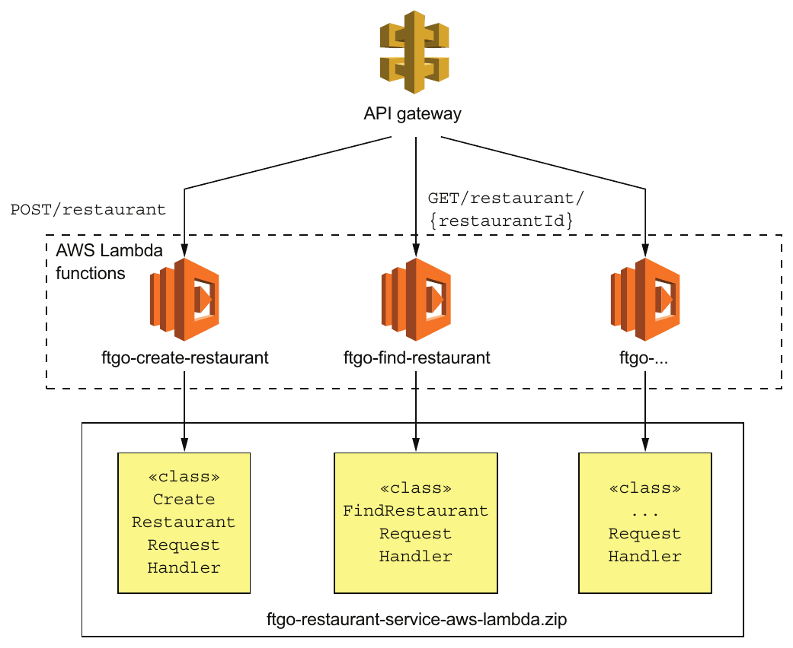

> **English:** Figure 12.13 Deploying Restaurant Service as AWS Lambda functions. The AWS API Gateway routes HTTP requests to the AWS Lambda functions, which are implemented by request handler classes defined by Restaurant Service.
>
> **Türkçe:** Şekil 12.13 Restaurant Service’in AWS Lambda function’ları olarak dağıtılması. AWS API Gateway, HTTP isteklerini Restaurant Service’in tanımladığı request handler sınıflarıyla gerçekleştirilen AWS Lambda function’larına yönlendirir.

<!-- source-record: u12_0391 -->

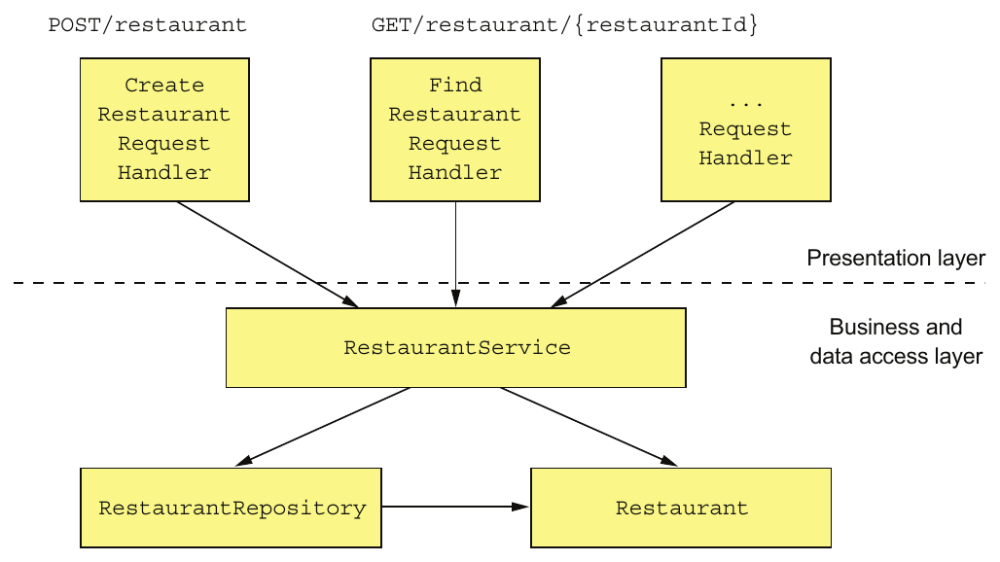

> **English:** Figure 12.14 The design of the AWS Lambda-based Restaurant Service. The presentation layer consists of request handler classes, which implement the lambda functions. They invoke the business tier, which is written in a traditional style consisting of a service class, an entity, and a repository.
>
> **Türkçe:** Şekil 12.14 AWS Lambda tabanlı Restaurant Service’in tasarımı. Sunum katmanı, lambda function’ları gerçekleştiren request handler sınıflarından oluşur. Bunlar; servis sınıfı, entity ve repository’den oluşan geleneksel biçimde yazılmış iş katmanını çağırır.

<!-- source-pages: 421 -->

<!-- source-record: u12_0392 -->

> **English:** Let’s take a look at the FindRestaurantRequestHandler class.
>
> **Türkçe:** FindRestaurantRequestHandler sınıfını inceleyelim.

<!-- source-record: u12_0393 -->

#### THE FINDRESTAURANTREQUESTHANDLER CLASS — FINDRESTAURANTREQUESTHANDLER SINIFI

<!-- source-record: u12_0394 -->

> **English:** The FindRestaurantRequestHandler class implements the GET /restaurant/{restaurantId} endpoint. This class along with the other request handler classes are the leaves of the class hierarchy shown in figure 12.15. The root of the hierarchy is RequestHandler, which is part of the AWS SDK. Its abstract subclasses handle errors and inject dependencies.
>
> **Türkçe:** FindRestaurantRequestHandler sınıfı GET /restaurant/{restaurantId} endpoint’ini gerçekleştirir. Bu sınıf ve diğer request handler sınıfları, Şekil 12.15’teki sınıf hiyerarşisinin yapraklarıdır. Hiyerarşinin kökünde AWS SDK’nin parçası olan RequestHandler bulunur. Altındaki abstract sınıflar hataları ele alır ve bağımlılıkları enjekte eder.

<!-- source-record: u12_0395 -->

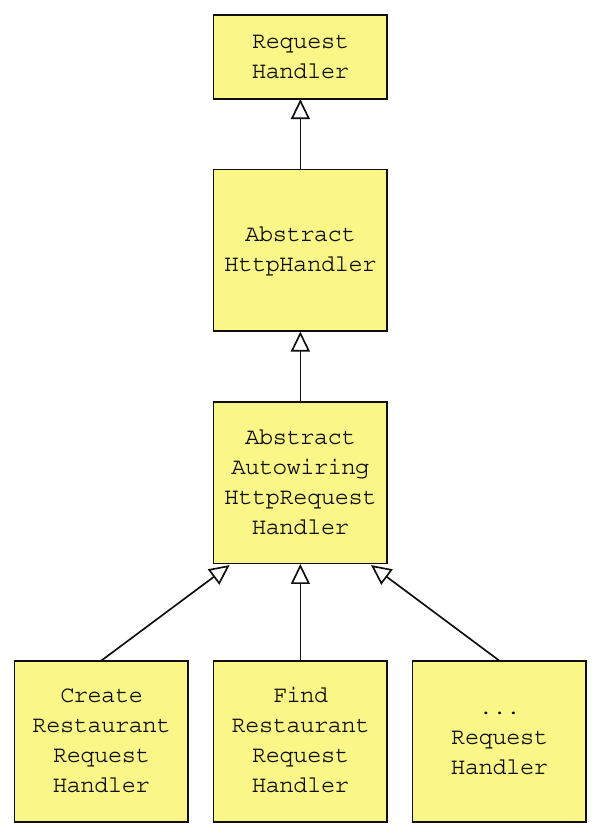

> **English:** Figure 12.15 The design of the request handler classes. The abstract superclasses implement dependency injection and error handling.
>
> **Türkçe:** Şekil 12.15 Request handler sınıflarının tasarımı. Abstract üst sınıflar dependency injection ve hata işlemeyi gerçekleştirir.

<!-- source-record: u12_0396 -->

> **English:** The AbstractHttpHandler class is the abstract base class for HTTP request handlers. It catches unhandled exceptions thrown during request handling and returns a 500 - internal server error response. The AbstractAutowiringHttpRequestHandler class implements dependency injection for request handlers. I’ll describe these abstract superclasses shortly, but first let’s look at the code for FindRestaurantRequestHandler.
>
> **Türkçe:** AbstractHttpHandler, HTTP request handler’larının abstract temel sınıfıdır. İstek işleme sırasında fırlatılan ve başka yerde yakalanmayan exception’ları yakalar ve 500 - Internal Server Error yanıtı döndürür. AbstractAutowiringHttpRequestHandler sınıfı, request handler’lar için dependency injection gerçekleştirir. Bu abstract üst sınıfları birazdan açıklayacağım; önce FindRestaurantRequestHandler koduna bakalım.

<!-- source-record: u12_0397 -->

> **English:** Listing 12.9 shows the code for the FindRestaurantRequestHandler class. The FindRestaurantRequestHandler class has a handleHttpRequest() method, which takes an APIGatewayProxyRequestEvent representing an HTTP request as a parameter. It invokes RestaurantService to find the restaurant and returns an APIGatewayProxyResponseEvent describing the HTTP response.
>
> **Türkçe:** Kod 12.9, FindRestaurantRequestHandler sınıfının kodunu gösterir. Sınıfın handleHttpRequest() metodu, HTTP isteğini temsil eden APIGatewayProxyRequestEvent nesnesini parametre olarak alır. Restoranı bulmak için RestaurantService’i çağırır ve HTTP yanıtını tanımlayan APIGatewayProxyResponseEvent döndürür.

<!-- source-pages: 422 -->

<!-- source-record: u12_0398 -->

#### Listing 12.9 The handler class for GET /restaurant/{restaurantId} — Kod 12.9 GET /restaurant/{restaurantId} için handler sınıfı

<!-- source-record: u12_0399 -->

```java
public class FindRestaurantRequestHandler
     extends AbstractAutowiringHttpRequestHandler {

  @Autowired
  private RestaurantService restaurantService;

  @Override
  protected Class<?> getApplicationContextClass() {
    return CreateRestaurantRequestHandler.class;
  }

  @Override
  protected APIGatewayProxyResponseEvent
       handleHttpRequest(APIGatewayProxyRequestEvent request, Context context) {
    long restaurantId;
    try {
      restaurantId = Long.parseLong(request.getPathParameters()
               .get("restaurantId"));
    } catch (NumberFormatException e) {
      return makeBadRequestResponse(context);
     }

    Optional<Restaurant> possibleRestaurant = restaurantService.findById(restaurantId);

    return possibleRestaurant
             .map(this::makeGetRestaurantResponse)
            .orElseGet(() -> makeRestaurantNotFoundResponse(context,
                                   restaurantId));

  }

  private APIGatewayProxyResponseEvent makeBadRequestResponse(Context context) {
    ...
  }

  private APIGatewayProxyResponseEvent
      makeRestaurantNotFoundResponse(Context context, long restaurantId) { ... }

  private  APIGatewayProxyResponseEvent
                        makeGetRestaurantResponse(Restaurant restaurant) { ... }
}
```

<!-- source-record: u12_0400 -->

**Kod açıklaması:**

> **English:** The Spring Java configuration class to use for the application context
>
> **Türkçe:** Application context için kullanılacak Spring Java yapılandırma sınıfı

<!-- source-record: u12_0401 -->

**Kod açıklaması:**

> **English:** Returns a 400 - bad request response if the restaurantId is missing or invalid
>
> **Türkçe:** restaurantId eksik veya geçersizse 400 - Bad Request yanıtı döndürür

> **Editör notu — eksik parametre sınırı:** `Long.parseLong(null)` bir `NumberFormatException` üretir; ancak `request.getPathParameters()` bizzat `null` ise `.get(...)` çağrısı `NullPointerException` üretir. Gösterilen yerel catch yalnız ilk türü yakalar. Kaynağın “missing or invalid” açıklaması bu farkı belirtmez. [Java 17 Long API](https://docs.oracle.com/en/java/javase/17/docs/api/java.base/java/lang/Long.html).

<!-- source-record: u12_0402 -->

**Kod açıklaması:**

> **English:** Returns either the restaurant or a 404 - not found response
>
> **Türkçe:** Restoranı veya 404 - Not Found yanıtını döndürür

<!-- source-record: u12_0403 -->

> **English:** As you can see, it’s quite similar to a servlet, except that instead of a service() method, which takes an HttpServletRequest and returns HttpServletResponse, it has a handleHttpRequest(), which takes an APIGatewayProxyRequestEvent and returns APIGatewayProxyResponseEvent.
>
> **Türkçe:** Gördüğünüz gibi bir servlet’e oldukça benzer. Ancak kaynak anlatımındaki HttpServletRequest alıp HttpServletResponse döndüren service() metodu yerine, APIGatewayProxyRequestEvent alıp APIGatewayProxyResponseEvent döndüren handleHttpRequest() metodu vardır.

> **Editör notu — servlet imzası:** Java servlet karşılaştırmasındaki kaynak ifade hatalıdır: HTTP servlet’in `service(...)` metodu yanıt nesnesini parametre olarak alır ve `void` döndürür. Buradaki Lambda handler ise yanıt nesnesini dönüş değeri olarak verir. [Servlet 4 HttpServlet API](https://jakarta.ee/specifications/servlet/4.0/apidocs/javax/servlet/http/httpservlet).

<!-- source-record: u12_0404 -->

> **English:** Let’s now take a look at its superclass, which implements dependency injection.
>
> **Türkçe:** Şimdi dependency injection gerçekleştiren üst sınıfına bakalım.

<!-- source-pages: 423 -->

<!-- source-record: u12_0405 -->

#### DEPENDENCY INJECTION USING THE ABSTRACTAUTOWIRINGHTTPREQUESTHANDLER CLASS — ABSTRACTAUTOWIRINGHTTPREQUESTHANDLER İLE DEPENDENCY INJECTION

<!-- source-record: u12_0406 -->

> **English:** An AWS Lambda function is neither a web application nor an application with a main() method. But it would be a shame to not be able to use the features of Spring Boot that we’ve been accustomed to. The AbstractAutowiringHttpRequestHandler class, shown in the following listing, implements dependency injection for request handlers. It creates an ApplicationContext using SpringApplication.run() and autowires dependencies prior to handling the first request. Subclasses such as FindRestaurantRequestHandler must implement the getApplicationContextClass() method.
>
> **Türkçe:** AWS Lambda function ne bir web uygulamasıdır ne de main() metodu bulunan bir uygulamadır. Fakat alıştığımız Spring Boot özelliklerinden yararlanamamak yazık olurdu. Sonraki kod bloğunda gösterilen AbstractAutowiringHttpRequestHandler sınıfı, request handler’lar için dependency injection gerçekleştirir. SpringApplication.run() kullanarak ApplicationContext oluşturur ve ilk isteği işlemeden önce bağımlılıkları autowiring ile bağlar. FindRestaurantRequestHandler gibi alt sınıflar getApplicationContextClass() metodunu gerçekleştirmelidir.

<!-- source-record: u12_0407 -->

#### Listing 12.10 An abstract RequestHandler that implements dependency injection — Kod 12.10 Dependency injection gerçekleştiren abstract RequestHandler

<!-- source-record: u12_0408 -->

```java
public abstract class AbstractAutowiringHttpRequestHandler
     extends AbstractHttpHandler {
  private static ConfigurableApplicationContext ctx;
  private ReentrantReadWriteLock ctxLock = new ReentrantReadWriteLock();
  private boolean autowired = false;
  protected synchronized ApplicationContext getAppCtx() {
     ctxLock.writeLock().lock();
    try {
      if (ctx == null) {
        ctx =  SpringApplication.run(getApplicationContextClass());
      }
      return ctx;
    } finally {
      ctxLock.writeLock().unlock();
    }
  }
  @Override
  protected void
        beforeHandling(APIGatewayProxyRequestEvent request, Context context) {
    super.beforeHandling(request, context);
    if (!autowired) {
      getAppCtx().getAutowireCapableBeanFactory().autowireBean(this);
       autowired = true;
    }
  }

  protected abstract Class<?> getApplicationContextClass();
 }
```

> **Editör notu — eşzamanlılık sınırı:** Örnekte `ctx` static, kilit ve synchronized metot ise nesne düzeyindedir. Birden fazla handler nesnesi aynı anda oluşturulursa bu kilitler ortak static alanı tek bir ortak kilitle korumaz. “Yalnızca bir kez” açıklaması genel bir thread-safety garantisi değildir.

<!-- source-record: u12_0409 -->

**Kod açıklaması:**

> **English:** Creates the Spring Boot application context just once
>
> **Türkçe:** Spring Boot application context’ini yalnızca bir kez oluşturur

<!-- source-record: u12_0410 -->

**Kod açıklaması:**

> **English:** Injects dependencies into the request handler using autowiring before handling the first request
>
> **Türkçe:** İlk isteği işlemeden önce autowiring ile request handler’a bağımlılıkları enjekte eder

<!-- source-record: u12_0411 -->

**Kod açıklaması:**

> **English:** Returns the @Configuration class used to create ApplicationContext
>
> **Türkçe:** ApplicationContext oluşturmak için kullanılan @Configuration sınıfını döndürür

<!-- source-record: u12_0412 -->

> **English:** This class overrides the beforeHandling() method defined by AbstractHttpHandler. Its beforeHandling() method injects dependencies using autowiring before handling the first request.
>
> **Türkçe:** Bu sınıf, AbstractHttpHandler tarafından tanımlanan beforeHandling() metodunu override eder. beforeHandling() metodu, ilk isteği işlemeden önce autowiring ile bağımlılıkları enjekte eder.

<!-- source-record: u12_0413 -->

#### THE ABSTRACTHTTPHANDLER CLASS — ABSTRACTHTTPHANDLER SINIFI

<!-- source-record: u12_0414 -->

> **English:** The request handlers for Restaurant Service ultimately extend AbstractHttpHandler, shown in listing 12.11. This class implements RequestHandler<APIGatewayProxyRequestEvent and APIGatewayProxyResponseEvent>. Its key responsibility is to catch exceptions thrown when handling a request and throw a 500 error code.
>
> **Türkçe:** Restaurant Service’in request handler’ları, kalıtım zincirinde sonunda Kod 12.11’deki AbstractHttpHandler sınıfını genişletir. Bu sınıf RequestHandler<APIGatewayProxyRequestEvent, APIGatewayProxyResponseEvent> arayüzünü uygular. Temel sorumluluğu, istek işlenirken fırlatılan exception’ları yakalamak ve 500 hata kodlu yanıt üretmektir.

<!-- source-pages: 424 -->

> **Editör notu — tür yazımı ve hata yanıtı:** Kaynak prose içinde generic argümanlar `and` ile bağlanmış ve “throw a 500 error code” denmiştir. Java kodunda argümanlar virgülle ayrılır; handler 500 durumunu taşıyan yanıt nesnesi döndürür. Türkçe açıklama alttaki kodun davranışını esas alır.

<!-- source-record: u12_0415 -->

#### Listing 12.11 An abstract RequestHandler that catches exceptions and returns a 500 HTTP response — Kod 12.11 Exception’ları yakalayıp HTTP 500 yanıtı döndüren abstract RequestHandler

<!-- source-record: u12_0416 -->

```java
public abstract class AbstractHttpHandler implements
  RequestHandler<APIGatewayProxyRequestEvent, APIGatewayProxyResponseEvent> {

  private Logger log = LoggerFactory.getLogger(this.getClass());

  @Override
  public APIGatewayProxyResponseEvent handleRequest(
     APIGatewayProxyRequestEvent input, Context context) {
    log.debug("Got request: {}", input);
    try {
      beforeHandling(input, context);
      return handleHttpRequest(input, context);
    } catch (Exception e) {
      log.error("Error handling request id: {}", context.getAwsRequestId(), e);
      return buildErrorResponse(new AwsLambdaError(
              "Internal Server Error",
              "500",
              context.getAwsRequestId(),
              "Error handling request: " + context.getAwsRequestId() + " "
     + input.toString()));
    }
  }

  protected void beforeHandling(APIGatewayProxyRequestEvent request,
     Context context) {
    // do nothing
  }

  protected abstract APIGatewayProxyResponseEvent handleHttpRequest(
     APIGatewayProxyRequestEvent request, Context context);
}
```

<!-- source-record: u12_0417 -->

### 12.6.2 Packaging the service as ZIP file — Servisi ZIP dosyası olarak paketleme

<!-- source-record: u12_0418 -->

> **English:** Before the service can be deployed, we must package it as a ZIP file. We can easily build the ZIP file using the following Gradle task:
>
> **Türkçe:** Servisin dağıtılabilmesi için önce onu ZIP dosyası olarak paketlemeliyiz. Şu Gradle task’ını kullanarak ZIP dosyasını kolayca oluşturabiliriz:

<!-- source-record: u12_0419 -->

```groovy
task buildZip(type: Zip) {
    from compileJava
    from processResources
    into('lib') {
        from configurations.runtime
    }
}
```

<!-- source-record: u12_0420 -->

> **English:** This task builds a ZIP with the classes and resources at the top level and the JAR dependencies in the lib directory.
>
> **Türkçe:** Bu task, sınıfları ve kaynakları üst düzeyde, JAR bağımlılıklarını ise lib klasöründe içeren bir ZIP dosyası oluşturur.

<!-- source-record: u12_0421 -->

> **English:** Now that we’ve built the ZIP file, let’s look at how to deploy the lambda function.
>
> **Türkçe:** ZIP dosyasını oluşturduğumuza göre lambda function’ın nasıl dağıtılacağına bakalım.

<!-- source-pages: 425 -->

<!-- source-record: u12_0422 -->

### 12.6.3 Deploying lambda functions using the Serverless framework — Serverless framework kullanarak lambda function dağıtma

<!-- source-record: u12_0423 -->

> **English:** Using the tools provided by AWS to deploy lambda functions and configure the API gateway is quite tedious. Fortunately, the Serverless open source project makes using lambda functions a lot easier. When using Serverless, you write a simple serverless.yml file that defines your lambda functions and their RESTful endpoints. Serverless then deploys the lambda functions and creates and configures an API gateway that routes requests to them.
>
> **Türkçe:** AWS’nin sağladığı araçlarla lambda function dağıtmak ve API gateway yapılandırmak oldukça zahmetlidir. Neyse ki açık kaynak Serverless projesi, lambda function kullanımını çok daha kolaylaştırır. Serverless kullanırken lambda function’larınızı ve RESTful endpoint’lerini tanımlayan basit bir serverless.yml dosyası yazarsınız. Ardından Serverless, lambda function’ları dağıtır ve istekleri onlara yönlendiren API gateway’i oluşturup yapılandırır.

<!-- source-record: u12_0424 -->

> **English:** The following listing is an excerpt of the serverless.yml that deploys Restaurant Service as a lambda.
>
> **Türkçe:** Sonraki kod bloğu, Restaurant Service’i lambda olarak dağıtan serverless.yml dosyasından bir bölümdür.

<!-- source-record: u12_0425 -->

#### Listing 12.12 The serverless.yml deploys Restaurant Service. — Kod 12.12 serverless.yml, Restaurant Service’i dağıtır.

<!-- source-record: u12_0426 -->

```yaml
service: ftgo-application-lambda

provider:
  name: aws
  runtime: java8
  timeout: 35
  region: ${env:AWS_REGION}
  stage: dev
  environment:
    SPRING_DATASOURCE_DRIVER_CLASS_NAME: com.mysql.jdbc.Driver
    SPRING_DATASOURCE_URL: ...
    SPRING_DATASOURCE_USERNAME: ...
    SPRING_DATASOURCE_PASSWORD: ...

package:
   artifact: ftgo-restaurant-service-aws-lambda/build/distributions/ftgo-restaurant-service-aws-lambda.zip

functions:
  create-restaurant:
    handler: net.chrisrichardson.ftgo.restaurantservice.lambda.CreateRestaurantRequestHandler
    events:
      - http:
          path: restaurants
          method: post
  find-restaurant:
    handler: net.chrisrichardson.ftgo.restaurantservice.lambda.FindRestaurantRequestHandler
    events:
      - http:
          path: restaurants/{restaurantId}
          method: get
```

> **Editör notu — dosya yolları ve Java sürümü:** Baskıda satır sonuna bölünen ZIP yolu ve handler sınıf adları birleştirildi; YAML girintileri düzenlendi. Kaynaktaki `runtime: java8` korunmuştur. Bu yapılandırma Java 17 örneği veya güncel AWS dağıtım yönergesi olarak sunulmaz.

<!-- source-record: u12_0427 -->

**Kod açıklaması:**

> **English:** Tells serverless to deploy on AWS
>
> **Türkçe:** Serverless’a AWS üzerinde dağıtım yapmasını söyler

<!-- source-record: u12_0428 -->

**Kod açıklaması:**

> **English:** Supplies the service’s externalized configuration via environment variables
>
> **Türkçe:** Servisin dışsallaştırılmış yapılandırmasını ortam değişkenleriyle sağlar

<!-- source-record: u12_0429 -->

**Kod açıklaması:**

> **English:** The ZIP file containing the lambda functions
>
> **Türkçe:** Lambda function’ları içeren ZIP dosyası

<!-- source-record: u12_0430 -->

**Kod açıklaması:**

> **English:** Lambda function definitions consisting of the handler function and HTTP endpoint
>
> **Türkçe:** Handler fonksiyonu ve HTTP endpoint’inden oluşan lambda function tanımları

<!-- source-record: u12_0431 -->

> **English:** You can then use the serverless deploy command, which reads the serverless.yml file, deploys the lambda functions, and configures the AWS API Gateway. After a short wait, your service will be accessible via the API gateway’s endpoint URL. AWS Lambda will provision as many instances of each Restaurant Service lambda function that are needed to support the load. If you change the code, you can easily update the lambda by rebuilding the ZIP file and rerunning serverless deploy. No servers involved!
>
> **Türkçe:** Ardından serverless.yml dosyasını okuyup lambda function’ları dağıtan ve AWS API Gateway’i yapılandıran serverless deploy komutunu kullanabilirsiniz. Kısa bir beklemeden sonra servisinize API gateway’in endpoint URL’si üzerinden erişilebilir. AWS Lambda, yükü karşılamak için Restaurant Service’in her lambda function’ından gereken sayıda örnek sağlar. Kodu değiştirirseniz ZIP dosyasını yeniden oluşturup serverless deploy komutunu yeniden çalıştırarak lambda’yı kolayca güncelleyebilirsiniz. Sizin yöneteceğiniz sunucu yoktur!

<!-- source-pages: 426 -->

<!-- source-record: u12_0432 -->

> **English:** The evolution of infrastructure is remarkable. Not that long ago, we manually deployed applications on physical machines. Today, highly automated public clouds provide a range of virtual deployment options. One option is to deploy services as virtual machines. Or better yet, we can package services as containers and deploy them using sophisticated Docker orchestration frameworks such as Kubernetes. Sometimes we even avoid thinking about infrastructure entirely and deploy services as lightweight, ephemeral lambda functions.
>
> **Türkçe:** Altyapının evrimi dikkat çekicidir. Çok uzun olmayan bir süre önce uygulamaları fiziksel makinelere elle dağıtıyorduk. Bugün büyük ölçüde otomatikleştirilmiş genel bulutlar, çeşitli sanal dağıtım seçenekleri sunuyor. Bir seçenek servisleri sanal makine olarak dağıtmaktır. Daha iyi bir seçenek ise servisleri container olarak paketleyip Kubernetes gibi gelişmiş Docker orkestrasyon framework’leriyle dağıtmaktır. Bazen altyapıyı hiç düşünmeden servisleri hafif ve kısa ömürlü lambda function’lar olarak dağıtabiliriz.

<!-- source-record: u12_0433 -->

## Summary — Bölüm özeti

<!-- source-record: u12_0434 -->

> **English:** • You should choose the most lightweight deployment pattern that supports your service’s requirements. Evaluate the options in the following order: serverless, containers, virtual machines, and language-specific packages.
>
> **Türkçe:** • Servisinizin gereksinimlerini karşılayan en hafif dağıtım örüntüsünü seçmelisiniz. Seçenekleri şu sırayla değerlendirin: serverless, container’lar, sanal makineler ve dile özgü paketler.

<!-- source-record: u12_0435 -->

> **English:** • A serverless deployment isn’t a good fit for every service, because of long-tail latencies and the requirement to use an event/request-based programming model. When it is a good fit, though, serverless deployment is an extremely compelling option because it eliminates the need to administer operating systems and runtimes and provides automated elastic provisioning and request-based pricing.
>
> **Türkçe:** • Gecikme dağılımının uzun kuyruğu ve olay/istek tabanlı programlama modeli kullanma zorunluluğu nedeniyle serverless dağıtım her servis için uygun değildir. Ancak uygun olduğu durumda son derece güçlü bir seçenektir: işletim sistemi ve çalışma zamanı yönetme ihtiyacını ortadan kaldırır, otomatik esnek kaynak sağlama ve istek tabanlı ücretlendirme sunar.

<!-- source-record: u12_0436 -->

> **English:** • Docker containers, which are a lightweight, OS-level virtualization technology, are more flexible than serverless deployment and have more predictable latency. It’s best to use a Docker orchestration framework such as Kubernetes, which manages containers on a cluster of machines. The drawback of using containers is that you must administer the operating systems and runtimes and most likely the Docker orchestration framework and the VMs that it runs on.
>
> **Türkçe:** • Hafif, işletim sistemi düzeyinde bir sanallaştırma teknolojisi olan Docker container’ları, serverless dağıtımdan daha esnektir ve gecikmeleri daha öngörülebilirdir. Bir makine kümesindeki container’ları yöneten Kubernetes gibi bir Docker orkestrasyon framework’ü kullanmak en iyisidir. Container kullanımının sakıncası, işletim sistemlerini ve çalışma zamanlarını, büyük olasılıkla Docker orkestrasyon framework’ünü ve onun çalıştığı VM’leri de sizin yönetmeniz gerekmesidir.

<!-- source-record: u12_0437 -->

> **English:** • The third deployment option is to deploy your service as a virtual machine. On one hand, virtual machines are a heavyweight deployment option, so deployment is slower and it will most likely use more resources than the second option. On the other hand, modern clouds such as Amazon EC2 are highly automated and provide a rich set of features. Consequently, it may sometimes be easier to deploy a small, simple application using virtual machines than to set up a Docker orchestration framework.
>
> **Türkçe:** • Üçüncü dağıtım seçeneği, servisi sanal makine olarak dağıtmaktır. Bir yandan sanal makineler ağır bir seçenektir; dolayısıyla dağıtım daha yavaştır ve büyük olasılıkla ikinci seçenekten daha fazla kaynak kullanır. Diğer yandan Amazon EC2 gibi modern bulutlar büyük ölçüde otomatikleştirilmiştir ve zengin özellikler sağlar. Bu nedenle küçük, basit bir uygulamayı sanal makinelerle dağıtmak bazen Docker orkestrasyon framework’ü kurmaktan daha kolay olabilir.

<!-- source-record: u12_0438 -->

> **English:** • Deploying your services as language-specific packages is generally best avoided unless you only have a small number of services. For example, as described in chapter 13, when starting on your journey to microservices you’ll probably deploy the services using the same mechanism you use for your monolithic application, which is most likely this option. You should only consider setting up a sophisticated deployment infrastructure such as Kubernetes once you’ve developed some services.
>
> **Türkçe:** • Yalnızca az sayıda servisiniz olmadığı sürece servislerinizi dile özgü paketler olarak dağıtmaktan genellikle kaçınmak en iyisidir. Örneğin 13. bölümde açıklandığı gibi mikroservislere geçişe başladığınızda servisleri büyük olasılıkla monolitik uygulamanız için kullandığınız mekanizmayla dağıtırsınız; bu da çoğunlukla bu seçenektir. Kubernetes gibi gelişmiş bir dağıtım altyapısı kurmayı, ancak bazı servisleri geliştirdikten sonra düşünmelisiniz.

<!-- source-pages: 427 -->

<!-- source-record: u12_0439 -->

> **English:** • One of the many benefits of using a service mesh—a networking layer that mediates all network traffic in and out of services—is that it enables you to deploy a service in production, test it, and only then route production traffic to it. Separating deployment from release improves the reliability of rolling out new versions of services.
>
> **Türkçe:** • Servislere gelen ve servislerden çıkan bütün ağ trafiğine aracılık eden service mesh’in birçok yararından biri, servisi canlı ortama dağıtmanıza, test etmenize ve ancak bundan sonra canlı ortam trafiğini ona yönlendirmenize olanak vermesidir. Deployment ile release süreçlerini ayırmak, servislerin yeni sürümlerini kullanıma almanın güvenilirliğini artırır.

## Kısa tekrar — Özgün çalışma soruları

Bu sorular kitaptan alıntı değildir.

1. Deployment ile release ayrıldığında yeni sürüm hangi sırayla denenir?
2. Readiness kontrolü başarısız olan pod ile liveness kontrolü başarısız olan pod için karar neden farklıdır?
3. Container registry ile service registry hangi farklı bilgileri saklar?
4. Serverless seçeneği değerlendirilirken hangi iki kaynak kısıtı öne çıkıyor?

<!-- page-break -->

## Cevaplar ve kısa açıklamalar

1. Yeni sürüm canlı ortamda kullanıcı trafiği almadan çalıştırılır, test edilir, küçük kullanıcı grubuna açılır ve trafik aşamalı artırılır. Sorunda eski sürüme dönülür.
2. Readiness trafik alabilmeyi, liveness yeniden başlatma ihtiyacını sınar. Kaynaktaki eşik sayıları ve zamanlar yapılandırmaya bağlıdır.
3. Container registry imaj katmanlarını ve etiketlerini saklar; service registry çalışan servis örneklerinin konumlarını tutar.
4. Kaynak özellikle başlangıç gecikmesinin dağılımın kuyruğunu büyütmesini ve olay/istek tabanlı çalışma modelini vurgular. Bu değerlendirme uygulamanın gereksinimleriyle birlikte yapılır.
