# Ünite 13 · Refactoring to microservices — Microservice mimarisine yeniden düzenleme

**Amaç:** Microservice mimarisine yeniden düzenleme konusunu İngilizce–Türkçe karşılaştırmalı çalışmak; teknik açıklamaları özgün şekiller, tablolar ve kod örnekleriyle birlikte okumak.

**Kaynak:** Kullanıcının sağladığı *Microservices Patterns*, bölüm 13; `Microservices_Patterns_1_Bolumden_Itibaren.pdf`, kaynak PDF sayfaları **428–471**. Başlık ve metin sırası korunmuş, sayfa sonlarında bölünen paragraflar birleştirilmiştir. Şekiller, üzerlerindeki yazılar korunarak kaynak PDF'den alınmıştır.

**Okuma notu:** Teknoloji ve şirket örnekleri kitabın yazıldığı dönemin anlatımıdır. Kodlar kaynakta verilen bağlama bağlı örneklerdir; bağımsız Java 17 programları olarak sunulmaz. İngilizce kaynak ve Türkçe çeviri ardışık bloklardadır. Türkçe çeviri bu çalışma sırasında hazırlanmış; teknik terimler, kaynak sırası ve paragraf eşleşmeleri kontrol edilmiştir.

**Dil çalışması:** [Ünite sözlüğü](vocabulary.md) · [Vocabulary PDF](vocabulary.pdf) · [Grammar notları](grammar_notes.md) · [Grammar PDF](grammar_notes.pdf). Kelime anlamları ve cümle yapılarının ayrıntıları bu iki eşlikçi kaynaktadır.

<!-- source-pages: 428 -->

<!-- source-record: u13_0000 -->

## This chapter covers — Bu bölümün kapsamı

<!-- source-record: u13_0001 -->

> **English:** • When to migrate a monolithic application to a microservice architecture
>
> **Türkçe:** • Monolithic application (monolitik uygulama) ne zaman microservice architecture (mikroservis mimarisi) yapısına taşınmalı?

<!-- source-record: u13_0002 -->

> **English:** • Why using an incremental approach is essential when refactoring a monolithic application to microservices
>
> **Türkçe:** • Monolitik bir uygulamayı mikroservislere dönüştürürken neden artımlı bir yaklaşım kullanılmalı?

<!-- source-record: u13_0003 -->

> **English:** • Implementing new features as services
>
> **Türkçe:** • Yeni özellikleri servis olarak geliştirmek

<!-- source-record: u13_0004 -->

> **English:** • Extracting services from the monolith
>
> **Türkçe:** • Monolitten servis çıkarmak

<!-- source-record: u13_0005 -->

> **English:** • Integrating a service and the monolith
>
> **Türkçe:** • Bir servisi monolitle bütünleştirmek

<!-- source-record: u13_0006 -->

> **English:** I hope that this book has given you a good understanding of the microservice architecture, its benefits and drawbacks, and when to use it. There is, however, a fairly good chance you’re working on a large, complex monolithic application. Your daily experience of developing and deploying your application is slow and painful. Microservices, which appear like a good fit for your application, seem like distant nirvana. Like Mary and the rest of the FTGO development team, you’re wondering how on earth you can adopt the microservice architecture?
>
> **Türkçe:** Umarım bu kitap, mikroservis mimarisini, yararlarını ve sakıncalarını, ayrıca ne zaman kullanılması gerektiğini iyi anlamanızı sağlamıştır. Ancak büyük ve karmaşık bir monolitik uygulama üzerinde çalışıyor olmanız oldukça olasıdır. Uygulamanızı geliştirme ve dağıtma konusundaki günlük deneyiminiz yavaş ve sancılıdır. Uygulamanıza uygun görünen mikroservisler, erişilmesi uzak bir ideal gibi durur. Mary ve FTGO geliştirme ekibinin geri kalanı gibi, mikroservis mimarisini nasıl benimseyebileceğinizi düşünüp duruyorsunuzdur.

<!-- source-record: u13_0007 -->

> **English:** Fortunately, there are strategies you can use to escape from monolithic hell without having to rewrite your application from scratch. You incrementally convert your monolith into microservices by developing what’s known as a strangler application. The idea of a strangler application comes from strangler vines, which grow in rain forests by enveloping and sometimes killing trees. A strangler application is a new application consisting of microservices that you develop by implementing new functionality as services and extracting services from the monolith. Over time, as the strangler application implements more and more functionality, it shrinks and ultimately kills the monolith. An important benefit of developing a strangler application is that, unlike a big bang rewrite, it delivers value to the business early and often.
>
> **Türkçe:** Neyse ki uygulamanızı sıfırdan yeniden yazmadan monolitik cehennemden kurtulmak için kullanabileceğiniz stratejiler vardır. Strangler application (eski uygulamanın yerini aşamalı olarak alan uygulama) adı verilen bir yapı geliştirerek monolitinizi artımlı biçimde mikroservislere dönüştürürsünüz. Strangler application fikri, yağmur ormanlarında ağaçları sararak ve bazen öldürerek büyüyen boğucu sarmaşıklardan gelir. Strangler application, yeni işlevleri servis olarak geliştirip monolitten servisler çıkararak oluşturduğunuz, mikroservislerden oluşan yeni bir uygulamadır. Zamanla daha fazla işlevi üstlendikçe monoliti küçültür ve sonunda ortadan kaldırır. Strangler application geliştirmenin önemli bir yararı, big bang rewrite (tek seferde tüm sistemi yeniden yazma) yaklaşımından farklı olarak işletmeye erken ve sık aralıklarla değer sağlamasıdır.

<!-- source-pages: 429 -->

<!-- source-record: u13_0008 -->

> **English:** I begin this chapter by describing the motivations for refactoring a monolith to a microservice architecture. I then describe how to develop the strangler application by implementing new functionality as services and extracting services from the monolith. Next, I cover various design topics, including how to integrate the monolith and services, how to maintain database consistency across the monolith and services, and how to handle security. I end the chapter by describing a couple of example services. One service is Delayed Order Service, which implements brand new functionality. The other service is Delivery Service, which is extracted from the monolith. Let’s start by taking a look at the concept of refactoring to a microservice architecture.
>
> **Türkçe:** Bu bölüme, bir monoliti mikroservis mimarisine dönüştürmenin gerekçelerini açıklayarak başlıyorum. Ardından yeni işlevleri servis olarak geliştirip monolitten servisler çıkararak strangler application'ın nasıl oluşturulacağını anlatıyorum. Sonra monolit ile servislerin nasıl bütünleştirileceği, aralarında veritabanı tutarlılığının nasıl korunacağı ve güvenliğin nasıl ele alınacağı dahil çeşitli tasarım konularını ele alıyorum. Bölümü iki örnek servisi anlatarak tamamlıyorum. Bunlardan biri tamamen yeni bir işlevi gerçekleştiren Delayed Order Service, diğeri monolitten çıkarılan Delivery Service'tir. Önce mikroservis mimarisine yeniden düzenleme kavramına bakalım.

<!-- source-record: u13_0009 -->

## 13.1 Overview of refactoring to microservices — Mikroservislere yeniden düzenlemeye genel bakış

<!-- source-record: u13_0010 -->

> **English:** Put yourself in Mary’s shoes. You’re responsible for the FTGO application, a large and old monolithic application. The business is extremely frustrated with engineering’s inability to deliver features rapidly and reliably. FTGO appears to be suffering from a classic case of monolithic hell. Microservices seem, at least on the surface, to be the answer. Should you propose diverting development resources away from feature development to migrating to a microservice architecture?
>
> **Türkçe:** Kendinizi Mary'nin yerine koyun. Büyük ve eski bir monolitik uygulama olan FTGO'dan siz sorumlusunuz. İş tarafı, mühendislik ekibinin özellikleri hızlı ve güvenilir biçimde sunamamasından son derece rahatsızdır. FTGO, klasik bir monolitik cehennem örneği yaşıyor gibi görünür. Mikroservisler, en azından ilk bakışta, çözüm gibi durur. Geliştirme kaynaklarının yeni özellikler yerine mikroservis mimarisine geçişe ayrılmasını önermeli misiniz?

<!-- source-record: u13_0011 -->

> **English:** I start this section by discussing why you should consider refactoring to microservices. I also discuss why it’s important to be sure that your software development problems are because you’re in monolithic hell rather than in, for example, a poor software development process. I then describe strategies for incrementally refactoring your monolith to a microservice architecture. Next, I discuss the importance of delivering improvements earlier and often in order to maintain the support of the business. I then describe why you should avoid investing in a sophisticated deployment infrastructure until you’ve developed a few services. Finally, I describe the various strategies you can use to introduce services into your architecture, including implementing new features as services and extracting services from the monolith.
>
> **Türkçe:** Bu kısma, mikroservislere yeniden düzenlemeyi neden düşünmeniz gerektiğini tartışarak başlıyorum. Yazılım geliştirme sorunlarınızın örneğin zayıf bir geliştirme sürecinden değil, monolitik cehennemde olmanızdan kaynaklandığından emin olmanın önemini de ele alıyorum. Ardından monolitinizi artımlı olarak mikroservis mimarisine dönüştürme stratejilerini anlatıyorum. Sonra iş tarafının desteğini korumak için iyileştirmeleri erken ve sık sunmanın önemini tartışıyorum. Birkaç servis geliştirene kadar gelişmiş bir dağıtım altyapısına yatırım yapmaktan neden kaçınmanız gerektiğini açıklıyorum. Son olarak yeni özellikleri servis olarak geliştirmek ve monolitten servis çıkarmak dahil, mimarinize servis eklemek için kullanabileceğiniz stratejileri anlatıyorum.

<!-- source-record: u13_0012 -->

### 13.1.1 Why refactor a monolith? — Monolit neden yeniden düzenlenmeli?

<!-- source-record: u13_0013 -->

> **English:** The microservice architecture has, as described in chapter 1, numerous benefits. It has much better maintainability, testability, and deployability, so it accelerates development. The microservice architecture is more scalable and improves fault isolation. It’s also much easier to evolve your technology stack. But refactoring a monolith to microservices is a significant undertaking. It will divert resources away from new feature development. As a result, it’s likely that the business will only support the adoption of microservices if it solves a significant business problem.
>
> **Türkçe:** Bölüm 1'de açıklandığı gibi mikroservis mimarisinin çok sayıda yararı vardır. Bakım yapılabilirliği, test edilebilirliği ve dağıtılabilirliği çok daha iyi olduğundan geliştirmeyi hızlandırır. Mikroservis mimarisi daha ölçeklenebilirdir ve fault isolation'ı (arıza yalıtımı) iyileştirir. Teknoloji yığınınızı geliştirmek de çok daha kolaydır. Ancak bir monoliti mikroservislere dönüştürmek büyük bir iştir. Kaynakları yeni özellik geliştirmeden başka yöne kaydırır. Bu nedenle iş tarafı, mikroservislere geçişi büyük olasılıkla ancak önemli bir iş sorununu çözecekse destekler.

<!-- source-pages: 430 -->

<!-- source-record: u13_0014 -->

> **English:** If you’re in monolithic hell, it’s likely that you already have at least one business problem. Here are some examples of business problems caused by monolithic hell:
>
> **Türkçe:** Monolitik cehennemdeyseniz muhtemelen zaten en az bir iş sorununuz vardır. Monolitik cehennemin yol açtığı iş sorunlarına bazı örnekler şunlardır:

<!-- source-record: u13_0015 -->

> **English:** • Slow delivery—The application is difficult to understand, maintain, and test, so developer productivity is low. As a result, the organization is unable to compete effectively and risks being overtaken by competitors.
>
> **Türkçe:** • Yavaş teslimat — Uygulamayı anlamak, bakımını yapmak ve test etmek zor olduğundan geliştirici üretkenliği düşüktür. Sonuç olarak kuruluş etkili biçimde rekabet edemez ve rakiplerinin gerisinde kalma riski yaşar.

<!-- source-record: u13_0016 -->

> **English:** • Buggy software releases—The lack of testability means that software releases are often buggy. This makes customers unhappy, which results in losing customers and reduced revenue.
>
> **Türkçe:** • Hatalı yazılım sürümleri — Test edilebilirliğin yetersizliği, sürümlerin sıklıkla hata içermesine yol açar. Bu durum müşterileri memnun etmez; müşteri kaybına ve gelir azalmasına neden olur.

<!-- source-record: u13_0017 -->

> **English:** • Poor scalability—Scaling a monolithic application is difficult because it combines modules with very different resource requirements into one executable component. The lack of scalability means that it’s either impossible or prohibitively expensive to scale the application beyond a certain point. As a result, the application can’t support the current or predicted needs of the business.
>
> **Türkçe:** • Yetersiz ölçeklenebilirlik — Kaynak gereksinimleri çok farklı modülleri tek bir çalıştırılabilir bileşende birleştirdiği için monolitik bir uygulamayı ölçeklemek zordur. Ölçeklenebilirliğin yetersizliği, uygulamayı belirli bir noktanın ötesine taşımanın ya olanaksız ya da karşılanamayacak kadar pahalı olması demektir. Sonuç olarak uygulama işletmenin mevcut veya öngörülen ihtiyaçlarını karşılayamaz.

<!-- source-record: u13_0018 -->

> **English:** It’s important to be sure that these problems are there because you’ve outgrown your architecture. A common reason for slow delivery and buggy releases is a poor software development process. For example, if you’re still relying on manual testing, then adopting automated testing alone can significantly increase development velocity. Similarly, you can sometimes solve scalability problems without changing your architecture. You should first try simpler solutions. If, and only if, you still have software delivery problems should you then migrate to the microservice architecture. Let’s look at how to do that.
>
> **Türkçe:** Bu sorunların, mevcut mimarinizin artık ihtiyaçlarınıza yetmemesinden kaynaklandığından emin olmak önemlidir. Yavaş teslimatın ve hatalı sürümlerin yaygın nedenlerinden biri zayıf bir yazılım geliştirme sürecidir. Örneğin hâlâ elle test yapmaya dayanıyorsanız yalnızca otomatik testleri benimsemek bile geliştirme hızını belirgin biçimde artırabilir. Benzer şekilde, ölçeklenebilirlik sorunlarını bazen mimariyi değiştirmeden çözebilirsiniz. Önce daha basit çözümleri denemelisiniz. Ancak ve ancak yazılım teslimat sorunları devam ediyorsa mikroservis mimarisine geçmelisiniz. Bunu nasıl yapacağınıza bakalım.

<!-- source-record: u13_0019 -->

### 13.1.2 Strangling the monolith — Monoliti aşamalı olarak ortadan kaldırmak

<!-- source-record: u13_0020 -->

> **English:** The process of transforming a monolithic application into microservices is a form of application modernization (https://en.wikipedia.org/wiki/Software_modernization). Application modernization is the process of converting a legacy application to one having a modern architecture and technology stack. Developers have been modernizing applications for decades. As a result, there is wisdom accumulated through experience we can use when refactoring an application into a microservice architecture. The most important lesson learned over the years is to not do a big bang rewrite.
>
> **Türkçe:** Monolitik bir uygulamayı mikroservislere dönüştürme süreci, application modernization'ın (uygulama modernizasyonu) bir biçimidir (https://en.wikipedia.org/wiki/Software_modernization). Uygulama modernizasyonu, eski bir uygulamayı modern bir mimariye ve teknoloji yığınına sahip bir uygulamaya dönüştürme sürecidir. Geliştiriciler onlarca yıldır uygulamaları modernleştiriyor. Bu nedenle bir uygulamayı mikroservis mimarisine dönüştürürken yararlanabileceğimiz, deneyimle birikmiş bir bilgi birikimi vardır. Yıllar içinde çıkarılan en önemli ders, tek seferde tüm sistemi yeniden yazmaya kalkışmamaktır.

<!-- source-record: u13_0021 -->

> **English:** A big bang rewrite is when you develop a new application—in this case, a microservices-based application—from scratch. Although starting from scratch and leaving the legacy code base behind sounds appealing, it’s extremely risky and will likely end in failure. You will spend months, possibly years, duplicating the existing functionality, and only then can you implement the features that the business needs today! Also, you’ll need to develop the legacy application anyway, which diverts effort away from the rewrite and means that you have a constantly moving target. What’s more, it’s possible that you’ll waste time reimplementing features that are no longer needed. As Martin Fowler reportedly said, “the only thing a Big Bang rewrite guarantees is a Big Bang!” (www.randyshoup.com/evolutionary-architecture).
>
> **Türkçe:** Big bang rewrite, yeni bir uygulamayı — burada mikroservis tabanlı bir uygulamayı — sıfırdan geliştirmektir. Sıfırdan başlamak ve eski kod tabanını geride bırakmak çekici görünse de son derece risklidir ve büyük olasılıkla başarısızlıkla sonuçlanır. Mevcut işlevleri yeniden üretmek için aylar, belki yıllar harcarsınız; işletmenin bugün ihtiyaç duyduğu özellikleri ancak ondan sonra geliştirebilirsiniz! Ayrıca eski uygulamayı da geliştirmeye devam etmeniz gerekir. Bu, yeniden yazmaya ayrılan emeği azaltır ve hedefin sürekli değişmesine yol açar. Üstelik artık gerekmeyen özellikleri yeniden geliştirerek zaman kaybedebilirsiniz. Martin Fowler'a atfedilen sözle, “Big Bang yeniden yazımının garanti ettiği tek şey büyük bir patlamadır!” (www.randyshoup.com/evolutionary-architecture).

<!-- source-pages: 431 -->

<!-- source-record: u13_0022 -->

> **English:** Instead of doing a big bang rewrite, you should, as figure 13.1 shows, incrementally refactor your monolithic application. You gradually build a new application, which is called a strangler application. It consists of microservices that run in conjunction with your monolithic application. Over time, the amount of functionality implemented by the monolithic application shrinks until either it disappears entirely or it becomes just another microservice. This strategy is akin to servicing your car while driving down the highway at 70 mph. It’s challenging, but is far less risky than attempting a big bang rewrite.
>
> **Türkçe:** Tek seferde yeniden yazmak yerine, Şekil 13.1'de gösterildiği gibi monolitik uygulamanızı artımlı biçimde yeniden düzenlemelisiniz. Strangler application denen yeni bir uygulamayı aşamalı olarak kurarsınız. Bu uygulama, monolitik uygulamanızla birlikte çalışan mikroservislerden oluşur. Zamanla monolitik uygulamanın sağladığı işlev miktarı azalır; sonunda ya tamamen ortadan kalkar ya da yalnızca başka bir mikroservise dönüşür. Bu strateji, otoyolda saatte 70 mil hızla giderken arabanıza bakım yapmaya benzer. Zordur, ancak tek seferde yeniden yazmaya girişmekten çok daha az risklidir.

<!-- source-record: u13_0023 -->

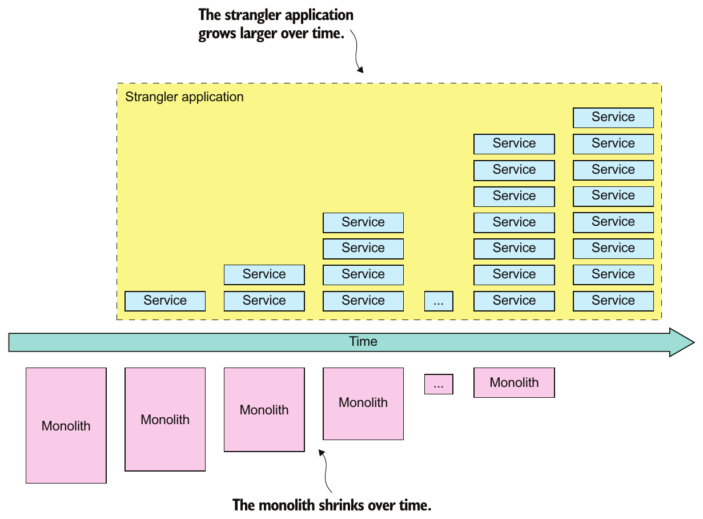

> **English:** Figure 13.1 The monolith is incrementally replaced by a strangler application comprised of services. Eventually, the monolith is replaced entirely by the strangler application or becomes another microservice.
>
> **Türkçe:** Şekil 13.1 Monolitin yerini artımlı biçimde servislerden oluşan bir strangler application alır. Sonunda monolit tamamen bu uygulamayla değiştirilir veya başka bir mikroservise dönüşür.

<!-- source-record: u13_0024 -->

> **English:** Martin Fowler refers to this application modernization strategy as the Strangler application pattern (www.martinfowler.com/bliki/StranglerApplication.html). The name comes from the strangler vine (or strangler fig—see https://en.wikipedia.org/wiki/Strangler_fig) that is found in rain forests. A strangler vine grows around a tree in order to reach the sunlight above the forest canopy. Often the tree dies, because either it’s killed by the vine or it dies of old age, leaving a tree-shaped vine.
>
> **Türkçe:** Martin Fowler bu uygulama modernizasyon stratejisini Strangler application pattern olarak adlandırır (www.martinfowler.com/bliki/StranglerApplication.html). Adı, yağmur ormanlarında bulunan boğucu sarmaşıktan veya boğucu incirden gelir (bkz. https://en.wikipedia.org/wiki/Strangler_fig). Boğucu sarmaşık, orman örtüsünün üzerindeki güneş ışığına ulaşmak için bir ağacın çevresinde büyür. Ağaç çoğu zaman ya sarmaşık tarafından öldürüldüğü ya da yaşlandığı için ölür ve geride ağaç biçimindeki sarmaşık kalır.

<!-- source-pages: 432 -->

<!-- source-record: u13_0025 -->

### Pattern: Strangler application — Kalıp: Strangler application

<!-- source-record: u13_0026 -->

> **English:** Modernize an application by incrementally developing a new (strangler) application around the legacy application. See http://microservices.io/patterns/refactoring/strangler-application.html.
>
> **Türkçe:** Eski uygulamanın çevresinde artımlı olarak yeni bir strangler application geliştirerek uygulamayı modernleştirin. Bkz. http://microservices.io/patterns/refactoring/strangler-application.html.

<!-- source-record: u13_0027 -->

> **English:** The refactoring process typically takes months, or years. For example, according to Steve Yegge (https://plus.google.com/+RipRowan/posts/eVeouesvaVX) it took Amazon.com a couple of years to refactor its monolith. In the case of a very large system, you may never complete the process. You could, for example, get to a point where you have tasks that are more important than breaking up the monolith, such as implementing revenue-generating features. If the monolith isn’t an obstacle to ongoing development, you may as well leave it alone.
>
> **Türkçe:** Yeniden düzenleme süreci genellikle aylar veya yıllar sürer. Örneğin Steve Yegge'e göre (https://plus.google.com/+RipRowan/posts/eVeouesvaVX), Amazon.com'un monolitini yeniden düzenlemesi birkaç yıl sürmüştür. Çok büyük bir sistemde süreci hiç tamamlamayabilirsiniz. Örneğin gelir getiren özellikleri geliştirmek gibi, monoliti parçalamaktan daha önemli işlerinizin olduğu bir noktaya gelebilirsiniz. Monolit, süregelen geliştirmeye engel olmuyorsa onu olduğu gibi bırakmanızda sakınca yoktur.

<!-- source-record: u13_0028 -->

#### DEMONSTRATE VALUE EARLY AND OFTEN — DEĞERİ ERKEN VE SIK GÖSTERİN

<!-- source-record: u13_0029 -->

> **English:** An important benefit of incrementally refactoring to a microservice architecture is that you get an immediate return on your investment. That’s very different than a big bang rewrite, which doesn’t deliver any benefit until it’s complete. When incrementally refactoring the monolith, you can develop each new service using a new technology stack and a modern, high-velocity, DevOps-style development and delivery process. As a result, your team’s delivery velocity steadily increases over time.
>
> **Türkçe:** Mikroservis mimarisine artımlı geçişin önemli bir yararı, yatırımınızın karşılığını hemen almaya başlamanızdır. Bu, tamamlanana kadar hiçbir yarar sağlamayan tek seferlik yeniden yazımdan çok farklıdır. Monoliti artımlı biçimde yeniden düzenlerken her yeni servisi yeni bir teknoloji yığınıyla ve modern, hızlı, DevOps tarzı bir geliştirme ve teslimat süreciyle oluşturabilirsiniz. Sonuç olarak ekibinizin teslimat hızı zaman içinde sürekli artar.

<!-- source-record: u13_0030 -->

> **English:** What’s more, you can migrate the high-value areas of your application to microservices first. For instance, imagine you’re working on the FTGO application. The business might, for example, decide that the delivery scheduling algorithm is a key competitive advantage. It’s likely that delivery management will be an area of constant, ongoing development. By extracting delivery management into a standalone service, the delivery management team will be able to work independently of the rest of the FTGO developers and significantly increase their development velocity. They’ll be able to frequently deploy new versions of the algorithm and evaluate their effectiveness.
>
> **Türkçe:** Üstelik uygulamanızın yüksek değer taşıyan alanlarını önce mikroservislere taşıyabilirsiniz. Örneğin FTGO uygulamasında çalıştığınızı düşünün. İş tarafı, teslimat planlama algoritmasının temel bir rekabet avantajı olduğuna karar verebilir. Teslimat yönetimi muhtemelen sürekli geliştirme yapılan bir alan olacaktır. Teslimat yönetimini bağımsız bir servise çıkararak ilgili ekibin diğer FTGO geliştiricilerinden bağımsız çalışmasını ve geliştirme hızını önemli ölçüde artırmasını sağlarsınız. Ekip algoritmanın yeni sürümlerini sık sık dağıtabilir ve etkilerini değerlendirebilir.

<!-- source-record: u13_0031 -->

> **English:** Another benefit of being able to deliver value earlier is that it helps maintain the business’s support for the migration effort. Their ongoing support is essential, because the refactoring effort will mean that less time is spent on developing features. Some organizations have difficulty eliminating technical debt because past attempts were too ambitious and didn’t provide much benefit. As a result, the business becomes reluctant to invest in further cleanup efforts. The incremental nature of refactoring to microservices means that the development team is able to demonstrate value early and often.
>
> **Türkçe:** Değeri daha erken sunabilmenin bir başka yararı, iş tarafının geçiş çalışmasına verdiği desteği korumaya yardımcı olmasıdır. Yeniden düzenleme çalışması özellik geliştirmeye daha az zaman ayrılması anlamına geldiğinden, bu sürekli destek zorunludur. Bazı kuruluşlar, geçmiş girişimleri fazla iddialı olduğu ve yeterince yarar sağlamadığı için teknik borcu ortadan kaldırmakta zorlanır. Bunun sonucunda iş tarafı yeni temizlik çalışmalarına yatırım yapmakta isteksizleşir. Mikroservislere geçişin artımlı yapısı, geliştirme ekibinin değeri erken ve sık gösterebilmesini sağlar.

<!-- source-record: u13_0032 -->

#### MINIMIZE CHANGES TO THE MONOLITH — MONOLİTTEKİ DEĞİŞİKLİKLERİ EN AZA İNDİRİN

<!-- source-record: u13_0033 -->

> **English:** A recurring theme in this chapter is that you should avoid making widespread changes to the monolith when migrating to a microservice architecture. It’s inevitable that you’ll need to make some changes in order to support migration to services. Section 13.3.2 talks about how the monolith often needs to be modified so that it can participate in sagas that maintain data consistency across the monolith and services. The problem with making widespread changes to the monolith is that it’s time consuming, costly, and risky. After all, that’s probably why you want to migrate to microservices in the first place.
>
> **Türkçe:** Bu bölümde tekrar eden bir tema, mikroservis mimarisine geçerken monolitte geniş çaplı değişiklikler yapmaktan kaçınmanız gerektiğidir. Servislere geçişi desteklemek için bazı değişiklikler yapmanız kaçınılmazdır. Kısım 13.3.2, monolit ile servisler arasında veri tutarlılığını koruyan saga'lara katılabilmesi için monolitin çoğu zaman nasıl değiştirilmesi gerektiğini ele alır. Monolitte yaygın değişiklik yapmanın sorunu, zaman alıcı, maliyetli ve riskli olmasıdır. Zaten mikroservislere geçmek istemenizin temel nedeni de muhtemelen budur.

<!-- source-pages: 433 -->

<!-- source-record: u13_0034 -->

> **English:** Fortunately, there are strategies you can use for reducing the scope of the changes you need to make. For example, in section 13.2.3, I describe the strategy of replicating data from an extracted service back to the monolith’s database. And in section 13.3.2, I show how you can carefully sequence the extraction of services to reduce the impact on the monolith. By applying these strategies, you can reduce the amount of work required to refactor the monolith.
>
> **Türkçe:** Neyse ki yapmanız gereken değişikliklerin kapsamını azaltmak için kullanabileceğiniz stratejiler vardır. Örneğin Kısım 13.2.3'te çıkarılan bir servisten monolitin veritabanına geri veri çoğaltma stratejisini anlatıyorum. Kısım 13.3.2'de ise monolit üzerindeki etkiyi azaltmak için servisleri çıkarma sırasını nasıl dikkatle belirleyebileceğinizi gösteriyorum. Bu stratejileri uygulayarak monoliti yeniden düzenlemek için gereken iş miktarını azaltabilirsiniz.

<!-- source-record: u13_0035 -->

#### TECHNICAL DEPLOYMENT INFRASTRUCTURE: YOU DON’T NEED ALL OF IT YET — TEKNİK DAĞITIM ALTYAPISI: HENÜZ TAMAMINA İHTİYACINIZ YOK

<!-- source-record: u13_0036 -->

> **English:** Throughout this book I’ve discussed a lot of shiny new technology, including deployment platforms such as Kubernetes and AWS Lambda and service discovery mechanisms. You might be tempted to begin your migration to microservices by selecting technologies and building out that infrastructure. You might even feel pressure from the business people and from your friendly PaaS vendor to start spending money on this kind of infrastructure.
>
> **Türkçe:** Kitap boyunca Kubernetes ve AWS Lambda gibi dağıtım platformları ve service discovery (servis keşfi) mekanizmaları dahil birçok ilgi çekici yeni teknolojiden söz ettim. Mikroservislere geçişe teknoloji seçerek ve bu altyapıyı kurarak başlamak isteyebilirsiniz. Hatta iş tarafındaki kişilerden ve yardımsever PaaS sağlayıcınızdan bu tür altyapıya para harcamaya başlamanız yönünde baskı hissedebilirsiniz.

<!-- source-record: u13_0037 -->

> **English:** As tempting as it seems to build out this infrastructure up front, I recommend only making a minimal up-front investment in developing it. The only thing you can’t live without is a deployment pipeline that performs automated testing. For example, if you only have a handful of services, you don’t need a sophisticated deployment and observability infrastructure. Initially, you can even get away with just using a hardcoded configuration file for service discovery. I suggest deferring any decisions about technical infrastructure that involve significant investment until you’ve gained real experience with the microservice architecture. It’s only once you have a few services running that you’ll have the experience to pick technologies.
>
> **Türkçe:** Bu altyapıyı en baştan kurmak ne kadar çekici görünse de başlangıçta geliştirmeye yalnızca asgari yatırım yapmanızı öneriyorum. Vazgeçemeyeceğiniz tek şey, otomatik test yapan bir deployment pipeline'dır (dağıtım hattı). Örneğin yalnızca birkaç servisiniz varsa gelişmiş bir dağıtım ve observability (gözlemlenebilirlik) altyapısına ihtiyacınız yoktur. Başlangıçta servis keşfi için sabit değerler içeren bir yapılandırma dosyası bile yeterli olabilir. Mikroservis mimarisiyle gerçek deneyim kazanana kadar önemli yatırım gerektiren teknik altyapı kararlarını ertelemenizi öneriyorum. Ancak birkaç servisiniz çalışır duruma geldikten sonra teknolojileri seçmeye yetecek deneyime sahip olursunuz.

<!-- source-record: u13_0038 -->

> **English:** Let’s now look at the strategies you can use for migrating to a microservice architecture.
>
> **Türkçe:** Şimdi mikroservis mimarisine geçerken kullanabileceğiniz stratejilere bakalım.

<!-- source-record: u13_0039 -->

## 13.2 Strategies for refactoring a monolith to microservices — Monoliti mikroservislere dönüştürme stratejileri

<!-- source-record: u13_0040 -->

> **English:** There are three main strategies for strangling the monolith and incrementally replacing it with microservices:
>
> **Türkçe:** Monoliti aşamalı olarak ortadan kaldırıp yerine mikroservisler koymanın üç temel stratejisi vardır:

<!-- source-record: u13_0041 -->

> **English:** 1 Implement new features as services.
>
> **Türkçe:** 1 Yeni özellikleri servis olarak geliştirin.

<!-- source-record: u13_0042 -->

> **English:** 2 Separate the presentation tier and backend.
>
> **Türkçe:** 2 Sunum katmanı ile backend'i ayırın.

<!-- source-record: u13_0043 -->

> **English:** 3 Break up the monolith by extracting functionality into services.
>
> **Türkçe:** 3 İşlevleri servislere çıkararak monoliti parçalayın.

<!-- source-record: u13_0044 -->

> **English:** The first strategy stops the monolith from growing. It’s typically a quick way to demonstrate the value of microservices, helping build support for the migration effort. The other two strategies break apart the monolith. When refactoring your monolith, you might sometimes use the second strategy, but you’ll definitely use the third strategy, because it’s how functionality is migrated from the monolith into the strangler application.
>
> **Türkçe:** İlk strateji monolitin büyümesini durdurur. Genellikle mikroservislerin değerini göstermenin hızlı bir yoludur ve geçiş çalışmasına destek oluşturur. Diğer iki strateji monoliti parçalara ayırır. Monolitinizi yeniden düzenlerken ikinci stratejiyi bazen kullanabilirsiniz; üçüncüyü ise kesinlikle kullanırsınız, çünkü işlevler monolitten strangler application'a bu yolla taşınır.

<!-- source-pages: 434 -->

<!-- source-record: u13_0045 -->

> **English:** Let’s take a look at each of these strategies, starting with implementing new features as services.
>
> **Türkçe:** Yeni özellikleri servis olarak geliştirmekten başlayarak bu stratejilerin her birine bakalım.

<!-- source-record: u13_0046 -->

### 13.2.1 Implement new features as services — Yeni özellikleri servis olarak geliştirin

<!-- source-record: u13_0047 -->

> **English:** The Law of Holes states that “if you find yourself in a hole, stop digging” (https://en.m.wikipedia.org/wiki/Law_of_holes). This is great advice to follow when your monolithic application has become unmanageable. In other words, if you have a large, complex monolithic application, don’t implement new features by adding code to the monolith. That will make your monolith even larger and more unmanageable. Instead, you should implement new features as services.
>
> **Türkçe:** Law of Holes (Çukur Yasası), “kendinizi bir çukurda bulursanız kazmayı bırakın” der (https://en.m.wikipedia.org/wiki/Law_of_holes). Monolitik uygulamanız yönetilemez hâle geldiğinde uyulacak çok iyi bir öğüttür. Başka bir deyişle, büyük ve karmaşık bir monolitik uygulamanız varsa yeni özellikleri monolite kod ekleyerek geliştirmeyin. Bu, monolitinizi daha da büyütür ve yönetilmesini zorlaştırır. Bunun yerine yeni özellikleri servis olarak geliştirmelisiniz.

<!-- source-record: u13_0048 -->

> **English:** This is a great way to begin migrating your monolithic application to a microservice architecture. It reduces the growth rate of the monolith. It accelerates the development of the new features, because you’re doing development in a brand new code base. It also quickly demonstrates the value of adopting the microservice architecture.
>
> **Türkçe:** Bu, monolitik uygulamanızı mikroservis mimarisine taşımaya başlamanın çok iyi bir yoludur. Monolitin büyüme hızını azaltır. Tamamen yeni bir kod tabanında çalıştığınız için yeni özelliklerin geliştirilmesini hızlandırır. Mikroservis mimarisini benimsemenin değerini de hızla gösterir.

<!-- source-record: u13_0049 -->

#### INTEGRATING THE NEW SERVICE WITH THE MONOLITH — YENİ SERVİSİ MONOLİTLE BÜTÜNLEŞTİRMEK

<!-- source-record: u13_0050 -->

> **English:** Figure 13.2 shows the application’s architecture after implementing a new feature as a service. Besides the new service and monolith, the architecture includes two other elements that integrate the service into the application:
>
> **Türkçe:** Şekil 13.2, yeni bir özellik servis olarak geliştirildikten sonraki uygulama mimarisini gösterir. Yeni servis ve monolitin yanı sıra mimari, servisi uygulamayla bütünleştiren iki unsur daha içerir:

<!-- source-record: u13_0051 -->

> **English:** • API gateway—Routes requests for new functionality to the new service and routes legacy requests to the monolith.
>
> **Türkçe:** • API gateway (API ağ geçidi) — Yeni işlevlere yönelik istekleri yeni servise, mevcut işlevlere yönelik istekleri monolite yönlendirir.

<!-- source-record: u13_0052 -->

> **English:** • Integration glue code—Integrates the service with the monolith. It enables the service to access data owned by the monolith and to invoke functionality implemented by the monolith.
>
> **Türkçe:** • Integration glue code (bütünleştirme bağlantı kodu) — Servisi monolitle bütünleştirir. Servisin monolite ait verilere erişmesini ve monolitin gerçekleştirdiği işlevleri çağırmasını sağlar.

<!-- source-record: u13_0053 -->

> **English:** The integration glue code isn’t a standalone component. Instead, it consists of adapters in the monolith and the service that use one or more interprocess communication mechanisms. For example, integration glue for Delayed Delivery Service, described in section 13.4.1, uses both REST and domain events. The service retrieves customer contract information from the monolith by invoking a REST API. The monolith publishes Order domain events so that Delayed Delivery Service can track the state of Orders and respond to orders that won’t be delivered on time. Section 13.3.1 describes the integration glue code in more detail.
>
> **Türkçe:** Bütünleştirme bağlantı kodu bağımsız bir bileşen değildir. Monolit ve serviste bulunan, bir veya daha fazla interprocess communication (süreçler arası iletişim) mekanizmasını kullanan adaptörlerden oluşur. Örneğin Kısım 13.4.1'de anlatılan Delayed Delivery Service'in bağlantı kodu hem REST hem domain event'leri (alan olayları) kullanır. Servis bir REST API çağırarak müşteri iletişim bilgilerini monolitten alır. Monolit, Delayed Delivery Service'in Order nesnelerinin durumunu izlemesi ve zamanında teslim edilmeyecek siparişlere tepki vermesi için Order domain event'leri yayımlar. Kısım 13.3.1 bütünleştirme bağlantı kodunu daha ayrıntılı açıklar.

> **Editör notu — kaynak yazımı:** Kaynaktaki “customer contract information” ifadesi, aynı servisin Kısım 13.3.1 ve 13.4 açıklamalarındaki “customer contact information” bağlamıyla uyuşmaz. Burada sözleşme bilgisi değil **müşteri iletişim bilgisi** anlamı kullanılmıştır. Kaynak bu servis için Delayed Delivery Service ve Delayed Order Service adlarını dönüşümlü kullanır; ikisi de geciken siparişleri izleyen örneği anlatır.

<!-- source-record: u13_0054 -->

#### WHEN TO IMPLEMENT A NEW FEATURE AS A SERVICE — YENİ BİR ÖZELLİK NE ZAMAN SERVİS OLARAK GELİŞTİRİLMELİ?

<!-- source-record: u13_0055 -->

> **English:** Ideally, you should implement every new feature in the strangler application rather than in the monolith. You’ll implement a new feature as either a new service or as part of an existing service. This way you’ll avoid ever having to touch the monolith code base. Unfortunately, though, not every new feature can be implemented as a service.
>
> **Türkçe:** İdeal olarak her yeni özelliği monolitte değil, strangler application içinde geliştirmelisiniz. Yeni bir özelliği ya yeni bir servis olarak ya da mevcut bir servisin parçası olarak geliştirirsiniz. Böylece monolitin kod tabanına dokunmanız gerekmez. Ne yazık ki her yeni özellik servis olarak geliştirilemez.

<!-- source-record: u13_0056 -->

> **English:** That’s because the essence of a microservice architecture is a set of loosely coupled services that are organized around business capabilities. A feature might, for instance, be too small to be a meaningful service. You might, for example, just need to add a few fields and methods to an existing class. Or the new feature might be too tightly coupled to the code in the monolith. If you attempted to implement this kind of feature as a service you would typically find that performance would suffer because of excessive interprocess communication. You might also have problems maintaining data consistency. If a new feature can’t be implemented as a service, the solution is often to initially implement the new feature in the monolith. Later on, you can then extract that feature along with other related features into their own service.
>
> **Türkçe:** Çünkü mikroservis mimarisinin özü, iş yetenekleri etrafında düzenlenmiş, gevşek bağlı bir servisler kümesidir. Örneğin bir özellik, anlamlı bir servis oluşturmak için fazla küçük olabilir. Yalnızca mevcut bir sınıfa birkaç alan ve metot eklemeniz gerekebilir. Ya da yeni özellik monolitteki koda fazla sıkı bağlı olabilir. Böyle bir özelliği servis olarak geliştirmeye kalkışırsanız aşırı süreçler arası iletişim nedeniyle performansın düştüğünü görürsünüz. Veri tutarlılığını korumakta da sorun yaşayabilirsiniz. Yeni bir özellik servis olarak geliştirilemiyorsa çözüm çoğu zaman onu başlangıçta monolitte geliştirmektir. Daha sonra bu özelliği ilişkili diğer özelliklerle birlikte ayrı bir servise çıkarabilirsiniz.

<!-- source-pages: 435 -->

<!-- source-record: u13_0057 -->

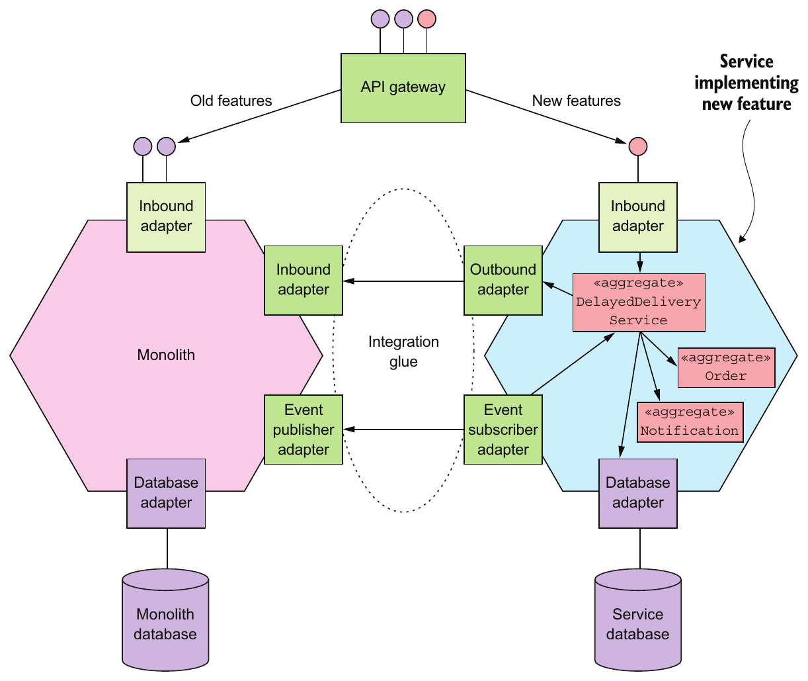

> **English:** Figure 13.2 A new feature is implemented as a service that’s part of the strangler application. The integration glue integrates the service with the monolith and consists of adapters that implement synchronous and asynchronous APIs. An API gateway routes requests that invoke new functionality to the service.
>
> **Türkçe:** Şekil 13.2 Yeni bir özellik, strangler application'ın parçası olan bir servis olarak geliştirilir. Bütünleştirme bağlantısı servisi monolitle bütünleştirir; senkron ve asenkron API'ler sağlayan adaptörlerden oluşur. API gateway, yeni işlevi çağıran istekleri servise yönlendirir.

<!-- source-record: u13_0058 -->

> **English:** Implementing new features as services accelerates the development of those features. It’s a good way to quickly demonstrate the value of the microservice architecture. It also reduces the monolith’s growth rate. But ultimately, you need to break apart the monolith using the two other strategies. You need to migrate functionality to the strangler application by extracting functionality from the monolith into services. You might also be able to improve development velocity by splitting the monolith horizontally. Let’s look at how to do that.
>
> **Türkçe:** Yeni özellikleri servis olarak geliştirmek, bu özelliklerin geliştirilmesini hızlandırır. Mikroservis mimarisinin değerini hızla göstermenin iyi bir yoludur. Monolitin büyüme hızını da azaltır. Ancak sonunda diğer iki stratejiyi kullanarak monoliti parçalamanız gerekir. Monolitten işlevleri servislere çıkararak strangler application'a taşımalısınız. Monoliti yatay olarak bölerek geliştirme hızını da artırabilirsiniz. Bunu nasıl yapacağınıza bakalım.

<!-- source-pages: 436 -->

<!-- source-record: u13_0059 -->

### 13.2.2 Separate presentation tier from the backend — Sunum katmanını backend'den ayırın

<!-- source-record: u13_0060 -->

> **English:** One strategy for shrinking a monolithic application is to split the presentation layer from the business logic and data access layers. A typical enterprise application consists of the following layers:
>
> **Türkçe:** Monolitik uygulamayı küçültmenin bir stratejisi, sunum katmanını iş mantığı ve veri erişim katmanlarından ayırmaktır. Tipik bir kurumsal uygulama şu katmanlardan oluşur:

<!-- source-record: u13_0061 -->

> **English:** • Presentation logic—This consists of modules that handle HTTP requests and generate HTML pages that implement a web UI. In an application that has a sophisticated user interface, the presentation tier is often a substantial body of code.
>
> **Türkçe:** • Sunum mantığı — HTTP isteklerini işleyen ve web kullanıcı arayüzünü oluşturan HTML sayfalarını üreten modüllerden oluşur. Gelişmiş bir kullanıcı arayüzüne sahip uygulamada sunum katmanı çoğu zaman önemli miktarda kod içerir.

<!-- source-record: u13_0062 -->

> **English:** • Business logic—This consists of modules that implement the business rules, which can be complex in an enterprise application.
>
> **Türkçe:** • İş mantığı — Kurumsal uygulamalarda karmaşık olabilen iş kurallarını gerçekleştiren modüllerden oluşur.

<!-- source-record: u13_0063 -->

> **English:** • Data access logic—This consists of modules that access infrastructure services such as databases and message brokers.
>
> **Türkçe:** • Veri erişim mantığı — Veritabanları ve message broker'lar (mesaj aracıları) gibi altyapı servislerine erişen modüllerden oluşur.

<!-- source-record: u13_0064 -->

> **English:** There is usually a clean separation between the presentation logic and the business and data access logic. The business tier has a coarse-grained API consisting of one or more facades that encapsulate the business logic. This API is a natural seam along which you can split the monolith into two smaller applications, as shown in figure 13.3.
>
> **Türkçe:** Genellikle sunum mantığı ile iş mantığı ve veri erişim mantığı arasında belirgin bir ayrım vardır. İş katmanı, iş mantığını kapsülleyen bir veya daha fazla facade'dan (dış arayüz) oluşan coarse-grained (iri taneli) bir API'ye sahiptir. Bu API, Şekil 13.3'te gösterildiği gibi monoliti iki küçük uygulamaya ayırabileceğiniz doğal bir ayrım hattıdır.

<!-- source-record: u13_0065 -->

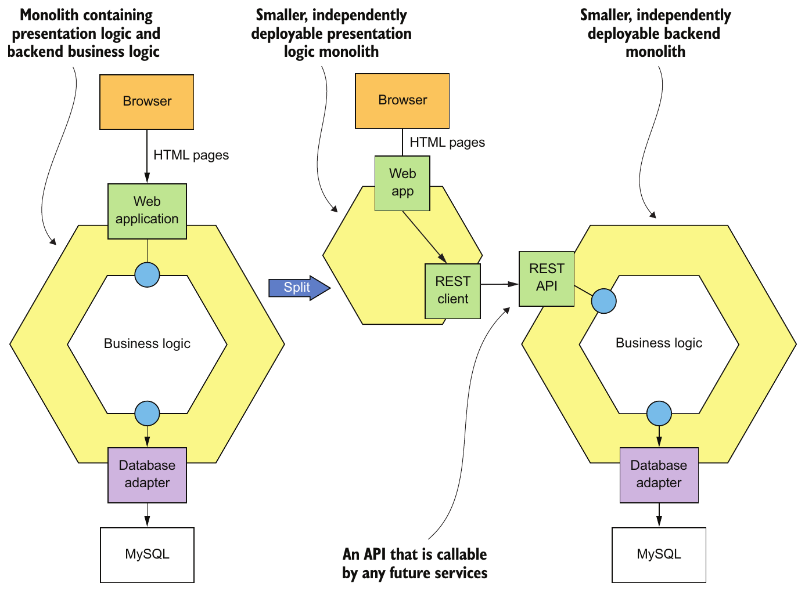

> **English:** Figure 13.3 Splitting the frontend from the backend enables each to be deployed independently. It also exposes an API for services to invoke.
>
> **Türkçe:** Şekil 13.3 Frontend'i backend'den ayırmak, her birinin bağımsız dağıtılmasını sağlar. Ayrıca servislerin çağırabileceği bir API sunar.

<!-- source-pages: 437 -->

<!-- source-record: u13_0066 -->

> **English:** One application contains the presentation layer, and the other contains the business and data access logic. After the split, the presentation logic application makes remote calls to the business logic application.
>
> **Türkçe:** Uygulamalardan biri sunum katmanını, diğeri iş mantığı ve veri erişim mantığını içerir. Ayrımdan sonra sunum mantığı uygulaması, iş mantığı uygulamasına uzak çağrılar yapar.

<!-- source-record: u13_0067 -->

> **English:** Splitting the monolith in this way has two main benefits. It enables you to develop, deploy, and scale the two applications independently of one another. In particular, it allows the presentation layer developers to rapidly iterate on the user interface and easily perform A/B testing, for example, without having to deploy the backend. Another benefit of this approach is that it exposes a remote API that can be called by the microservices you develop later.
>
> **Türkçe:** Monoliti bu şekilde bölmenin iki temel yararı vardır. İki uygulamayı birbirinden bağımsız geliştirmenizi, dağıtmanızı ve ölçeklemenizi sağlar. Özellikle sunum katmanı geliştiricilerinin kullanıcı arayüzünü hızla yineleyerek geliştirmesine ve örneğin backend'i dağıtmadan kolayca A/B testi yapmasına olanak tanır. Bu yaklaşımın başka bir yararı, daha sonra geliştireceğiniz mikroservislerin çağırabileceği bir uzak API sunmasıdır.

<!-- source-record: u13_0068 -->

> **English:** But this strategy is only a partial solution. It’s very likely that at least one or both of the resulting applications will still be an unmanageable monolith. You need to use the third strategy to replace the monolith with services.
>
> **Türkçe:** Ancak bu strateji yalnızca kısmi bir çözümdür. Ortaya çıkan uygulamalardan en az birinin veya her ikisinin hâlâ yönetilemez bir monolit olması çok olasıdır. Monoliti servislerle değiştirmek için üçüncü stratejiyi kullanmanız gerekir.

<!-- source-record: u13_0069 -->

### 13.2.3 Extract business capabilities into services — İş yeteneklerini servislere çıkarın

<!-- source-record: u13_0070 -->

> **English:** Implementing new features as services and splitting the frontend web application from the backend will only get you so far. You’ll still end up doing a lot of development in the monolithic code base. If you want to significantly improve your application’s architecture and increase your development velocity, you need to break apart the monolith by incrementally migrating business capabilities from the monolith to services. For example, section 13.5 describes how to extract delivery management from the FTGO monolith into a new Delivery Service. When you use this strategy, over time the number of business capabilities implemented by the services grows, and the monolith gradually shrinks.
>
> **Türkçe:** Yeni özellikleri servis olarak geliştirmek ve frontend web uygulamasını backend'den ayırmak sizi ancak belli bir noktaya kadar götürür. Geliştirmenin büyük bir kısmını yine monolitik kod tabanında yaparsınız. Uygulamanızın mimarisini belirgin biçimde iyileştirmek ve geliştirme hızınızı artırmak istiyorsanız iş yeteneklerini monolitten servislere artımlı olarak taşıyarak monoliti parçalamanız gerekir. Örneğin Kısım 13.5, teslimat yönetiminin FTGO monolitinden yeni bir Delivery Service'e nasıl çıkarılacağını anlatır. Bu stratejiyi kullandığınızda zamanla servislerin gerçekleştirdiği iş yeteneklerinin sayısı artar ve monolit aşamalı olarak küçülür.

<!-- source-record: u13_0071 -->

> **English:** The functionality you want to extract into a service is a vertical slice through the monolith. The slice consists of the following:
>
> **Türkçe:** Bir servise çıkarmak istediğiniz işlev, monolitin tüm katmanlarını kesen dikey bir dilimdir. Bu dilim şunlardan oluşur:

<!-- source-record: u13_0072 -->

> **English:** • Inbound adapters that implement API endpoints
>
> **Türkçe:** • API endpoint'lerini (uç noktalarını) gerçekleştiren inbound adapter'lar (gelen çağrı adaptörleri)

<!-- source-record: u13_0073 -->

> **English:** • Domain logic
>
> **Türkçe:** • Domain logic (alan mantığı)

<!-- source-record: u13_0074 -->

> **English:** • Outbound adapters such as database access logic
>
> **Türkçe:** • Veritabanı erişim mantığı gibi outbound adapter'lar (giden çağrı adaptörleri)

<!-- source-record: u13_0075 -->

> **English:** • The monolith’s database schema
>
> **Türkçe:** • Monolitin veritabanı şeması

<!-- source-record: u13_0076 -->

> **English:** As figure 13.4 shows, this code is extracted from the monolith and moved into a standalone service. An API gateway routes requests that invoke the extracted business capability to the service and routes the other requests to the monolith. The monolith and the service collaborate via the integration glue code. As described in section 13.3.1, the integration glue consists of adapters in the service and monolith that use one or more interprocess communication (IPC) mechanisms.
>
> **Türkçe:** Şekil 13.4'te gösterildiği gibi bu kod monolitten çıkarılır ve bağımsız bir servise taşınır. API gateway, çıkarılan iş yeteneğini çağıran istekleri servise, diğer istekleri monolite yönlendirir. Monolit ve servis, bütünleştirme bağlantı kodu üzerinden iş birliği yapar. Kısım 13.3.1'de anlatıldığı gibi bu bağlantı, servis ve monolitte bulunan ve bir veya daha fazla interprocess communication (IPC, süreçler arası iletişim) mekanizması kullanan adaptörlerden oluşur.

<!-- source-record: u13_0077 -->

> **English:** Extracting services is challenging. You need to determine how to split the monolith’s domain model into two separate domain models, one of which becomes the service’s domain model. You need to break dependencies such as object references. You might even need to split classes in order to move functionality into the service. You also need to refactor the database.
>
> **Türkçe:** Servis çıkarmak zordur. Monolitin domain model'ini (alan modeli), biri servisin domain model'i olacak şekilde iki ayrı modele nasıl böleceğinizi belirlemelisiniz. Nesne referansları gibi bağımlılıkları koparmalısınız. İşlevleri servise taşımak için sınıfları bile bölmeniz gerekebilir. Veritabanını da yeniden düzenlemeniz gerekir.

<!-- source-record: u13_0078 -->

> **English:** Extracting a service is often time consuming, especially because the monolith’s code base is likely to be messy. Consequently, you need to carefully think about which services to extract. It’s important to focus on refactoring those parts of the application that provide a lot of value. Before extracting a service, ask yourself what the benefit is of doing that.
>
> **Türkçe:** Özellikle monolitin kod tabanı büyük olasılıkla dağınık olduğundan, servis çıkarmak çoğu zaman zaman alır. Bu nedenle hangi servisleri çıkaracağınızı dikkatle düşünmelisiniz. Uygulamanın yüksek değer sağlayan kısımlarını yeniden düzenlemeye odaklanmak önemlidir. Bir servisi çıkarmadan önce bunun size ne yarar sağlayacağını kendinize sorun.

<!-- source-pages: 438 -->

<!-- source-record: u13_0079 -->

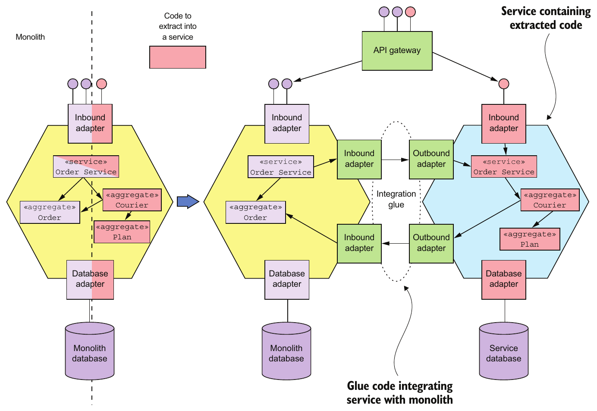

> **English:** Figure 13.4 Break apart the monolith by extracting services. You identify a slice of functionality, which consists of business logic and adapters, to extract into a service. You move that code into the service. The newly extracted service and the monolith collaborate via the APIs provided by the integration glue.
>
> **Türkçe:** Şekil 13.4 Servisler çıkararak monoliti parçalayın. Bir servise çıkarmak üzere iş mantığı ve adaptörlerden oluşan bir işlev dilimi belirlersiniz. Bu kodu servise taşırsınız. Yeni çıkarılan servis ile monolit, bütünleştirme bağlantısının sunduğu API'ler üzerinden iş birliği yapar.

<!-- source-record: u13_0080 -->

> **English:** For example, it’s worthwhile to extract a service that implements functionality that’s critical to the business and constantly evolving. It’s not valuable to invest effort in extracting services when there’s not much benefit from doing so. Later in this section I describe some strategies for determining what to extract and when. But first, let’s look in more detail at some of the challenges you’ll face when extracting a service and how to address them.
>
> **Türkçe:** Örneğin işletme için kritik olan ve sürekli gelişen işlevleri gerçekleştiren bir servisi çıkarmaya değer. Önemli bir yarar sağlamayacaksa servis çıkarmaya emek harcamak değerli değildir. Bu kısmın ilerleyen yerlerinde neyi ne zaman çıkaracağınızı belirlemeye yönelik bazı stratejileri anlatıyorum. Ancak önce servis çıkarırken karşılaşacağınız zorluklara ve bunların nasıl ele alınacağına daha ayrıntılı bakalım.

<!-- source-record: u13_0081 -->

> **English:** You’ll encounter a couple of challenges when extracting a service:
>
> **Türkçe:** Bir servisi çıkarırken iki temel zorlukla karşılaşırsınız:

<!-- source-record: u13_0082 -->

> **English:** • Splitting the domain model
>
> **Türkçe:** • Domain model'i bölmek

<!-- source-record: u13_0083 -->

> **English:** • Refactoring the database
>
> **Türkçe:** • Veritabanını yeniden düzenlemek

<!-- source-record: u13_0084 -->

> **English:** Let’s look at each one, starting with splitting the domain model.
>
> **Türkçe:** Domain model'i bölmekten başlayarak her birine bakalım.

<!-- source-pages: 439 -->

<!-- source-record: u13_0085 -->

#### SPLITTING THE DOMAIN MODEL — DOMAIN MODEL'İ BÖLMEK

<!-- source-record: u13_0086 -->

> **English:** In order to extract a service, you need to extract its domain model out of the monolith’s domain model. You’ll need to perform major surgery to split the domain models. One challenge you’ll encounter is eliminating object references that would otherwise span service boundaries. It’s possible that classes that remain in the monolith will reference classes that have been moved to the service or vice versa. For example, imagine that, as figure 13.5 shows, you extract Order Service, and as a result its Order class references the monolith’s Restaurant class. Because a service instance is typically a process, it doesn’t make sense to have object references that cross service boundaries. Somehow you need to eliminate these types of object reference.
>
> **Türkçe:** Bir servisi çıkarmak için onun domain model'ini monolitin domain model'inden ayırmanız gerekir. Modelleri bölmek büyük bir cerrahi müdahale gerektirir. Karşılaşacağınız zorluklardan biri, aksi hâlde servis sınırlarını aşacak nesne referanslarını ortadan kaldırmaktır. Monolitte kalan sınıflar, servise taşınan sınıflara referans verebilir veya bunun tersi olabilir. Örneğin Şekil 13.5'te gösterildiği gibi Order Service'i çıkardığınızı ve sonuçta bu servisin Order sınıfının monolitteki Restaurant sınıfına referans verdiğini düşünün. Bir servis örneği genellikle bir süreç olduğundan, servis sınırlarını aşan nesne referanslarına sahip olmak anlamlı değildir. Bu tür nesne referanslarını bir şekilde ortadan kaldırmalısınız.

<!-- source-record: u13_0087 -->

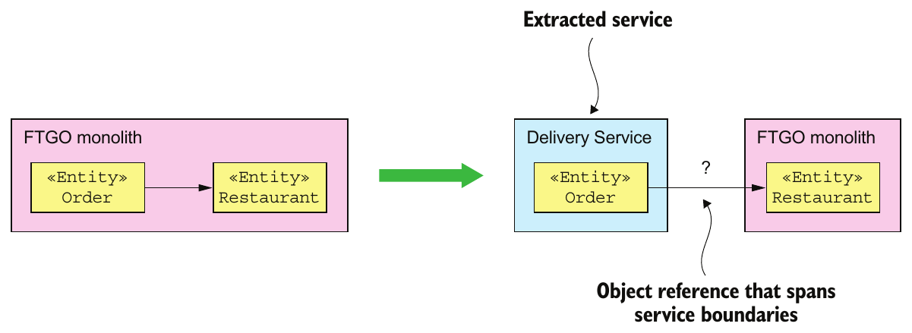

> **English:** Figure 13.5 The Order domain class has a reference to a Restaurant class. If we extract Order into a separate service, we need to do something about its reference to Restaurant, because object references between processes don’t make sense.
>
> **Türkçe:** Şekil 13.5 Order domain sınıfının Restaurant sınıfına bir referansı vardır. Order'ı ayrı bir servise çıkarırsak Restaurant referansını ele almamız gerekir; çünkü süreçler arasında nesne referansları anlamlı değildir.

<!-- source-record: u13_0088 -->

> **English:** One good way to solve this problem is to think in terms of DDD aggregates, described in chapter 5. Aggregates reference each other using primary keys rather than object references. You would, therefore, think of the Order and Restaurant classes as aggregates and, as figure 13.6 shows, replace the reference to Restaurant in the Order class with a restaurantId field that stores the primary key value.
>
> **Türkçe:** Bu sorunu çözmenin iyi bir yolu, Bölüm 5'te anlatılan DDD aggregate'ları (bütünleri) açısından düşünmektir. Aggregate'lar birbirlerine nesne referansları yerine primary key (birincil anahtar) kullanarak referans verir. Dolayısıyla Order ve Restaurant sınıflarını aggregate olarak ele alır; Şekil 13.6'da gösterildiği gibi Order sınıfındaki Restaurant referansını, birincil anahtar değerini saklayan restaurantId alanıyla değiştirirsiniz.

<!-- source-record: u13_0089 -->

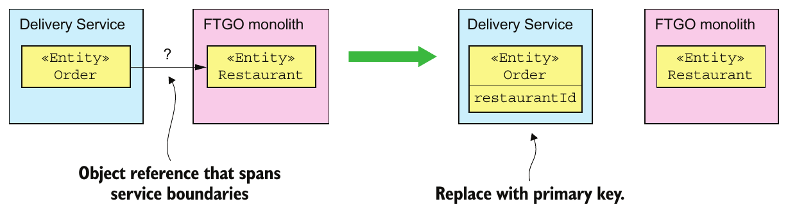

> **English:** Figure 13.6 The Order class’s reference to Restaurant is replaced with the Restaurant's primary key in order to eliminate an object that would span process boundaries.
>
> **Türkçe:** Şekil 13.6 Süreç sınırlarını aşacak nesne referansını ortadan kaldırmak için Order sınıfının Restaurant referansı, Restaurant'ın birincil anahtarıyla değiştirilir.

<!-- source-pages: 440 -->

<!-- source-record: u13_0090 -->

> **English:** One issue with replacing object references with primary keys is that although this is a minor change to the class, it can potentially have a large impact on the clients of the class, which expect an object reference. Later in this section, I describe how to reduce the scope of the change by replicating data between the service and monolith. Delivery Service, for example, could define a Restaurant class that’s a replica of the monolith’s Restaurant class.
>
> **Türkçe:** Nesne referanslarını birincil anahtarlarla değiştirmenin bir sorunu vardır: Sınıf açısından küçük bir değişiklik olsa da nesne referansı bekleyen sınıf istemcileri üzerinde büyük bir etki yaratabilir. Bu kısmın ilerleyen yerlerinde servis ile monolit arasında veri çoğaltarak değişikliğin kapsamını nasıl azaltacağınızı anlatıyorum. Örneğin Delivery Service, monolitin Restaurant sınıfının kopyası olan bir Restaurant sınıfı tanımlayabilir.

<!-- source-record: u13_0091 -->

> **English:** Extracting a service is often much more involved than moving entire classes into a service. An even greater challenge with splitting a domain model is extracting functionality that’s embedded in a class that has other responsibilities. This problem often occurs in god classes, described in chapter 2, that have an excessive number of responsibilities. For example, the Order class is one of the god classes in the FTGO application. It implements multiple business capabilities, including order management, delivery management, and so on. Later in section 13.5, I discuss how extracting the delivery management into a service involves extracting a Delivery class from the Order class. The Delivery entity implements the delivery management functionality that was previously bundled with other functionality in the Order class.
>
> **Türkçe:** Bir servis çıkarmak çoğu zaman sınıfları bütünüyle servise taşımaktan çok daha kapsamlıdır. Domain model'i bölerken daha büyük bir zorluk, başka sorumlulukları da olan bir sınıfa gömülü işlevleri çıkarmaktır. Bu sorun, Bölüm 2'de anlatılan ve aşırı sayıda sorumluluğa sahip god class'larda (her işi üstlenen sınıflar) sık görülür. Örneğin Order sınıfı, FTGO uygulamasındaki god class'lardan biridir. Sipariş yönetimi, teslimat yönetimi ve başka iş yeteneklerini gerçekleştirir. Kısım 13.5'te teslimat yönetimini servise çıkarmanın, Order sınıfından bir Delivery sınıfı çıkarmayı nasıl gerektirdiğini tartışıyorum. Delivery entity'si (varlığı), daha önce Order sınıfında diğer işlevlerle bir araya getirilmiş olan teslimat yönetimi işlevini gerçekleştirir.

<!-- source-record: u13_0092 -->

#### REFACTORING THE DATABASE — VERİTABANINI YENİDEN DÜZENLEMEK

<!-- source-record: u13_0093 -->

> **English:** Splitting a domain model involves more than just changing code. Many classes in a domain model are persistent. Their fields are mapped to a database schema. Consequently, when you extract a service from the monolith, you’re also moving data. You need to move tables from the monolith’s database to the service’s database.
>
> **Türkçe:** Domain model'i bölmek yalnızca kod değiştirmekten ibaret değildir. Domain model'deki birçok sınıf kalıcı olarak saklanır. Alanları bir veritabanı şemasına eşlenir. Dolayısıyla monolitten bir servis çıkardığınızda verileri de taşırsınız. Tabloları monolitin veritabanından servisin veritabanına taşımanız gerekir.

<!-- source-record: u13_0094 -->

> **English:** Also, when you split an entity you need to split the corresponding database table and move the new table to the service. For example, when extracting delivery management into a service, you split the Order entity and extract a Delivery entity. At the database level, you split the ORDERS table and define a new DELIVERY table. You then move the DELIVERY table to the service.
>
> **Türkçe:** Ayrıca bir entity'yi böldüğünüzde karşılık gelen veritabanı tablosunu da bölmeli ve yeni tabloyu servise taşımalısınız. Örneğin teslimat yönetimini servise çıkarırken Order entity'sini böler ve bir Delivery entity'si çıkarırsınız. Veritabanı düzeyinde ORDERS tablosunu böler ve yeni bir DELIVERY tablosu tanımlarsınız. Sonra DELIVERY tablosunu servise taşırsınız.

<!-- source-record: u13_0095 -->

> **English:** The book Refactoring Databases by Scott W. Ambler and Pramod J. Sadalage (Addison-Wesley, 2011) describes a set of refactorings for a database schema. For example, it describes the Split Table refactoring, which splits a table into two or more tables. Many of the techniques in that book are useful when extracting services from the monolith. One such technique is the idea of replicating data in order to allow you to incrementally update clients of the database to use the new schema. We can adapt that idea to reduce the scope of the changes you must make to the monolith when extracting a service.
>
> **Türkçe:** Scott W. Ambler ve Pramod J. Sadalage'ın Refactoring Databases kitabı (Addison-Wesley, 2011), veritabanı şemalarına yönelik bir dizi yeniden düzenleme yöntemini anlatır. Örneğin bir tabloyu iki veya daha fazla tabloya bölen Split Table yeniden düzenlemesini açıklar. Bu kitaptaki tekniklerin birçoğu monolitten servis çıkarırken yararlıdır. Bunlardan biri, veritabanı istemcilerinin yeni şemayı kullanacak biçimde artımlı güncellenebilmesi için verileri çoğaltma fikridir. Bu fikri, servis çıkarırken monolitte yapmanız gereken değişikliklerin kapsamını azaltacak biçimde uyarlayabiliriz.

<!-- source-record: u13_0096 -->

#### REPLICATE DATA TO AVOID WIDESPREAD CHANGES — GENİŞ ÇAPLI DEĞİŞİKLİKLERDEN KAÇINMAK İÇİN VERİLERİ ÇOĞALTIN

<!-- source-record: u13_0097 -->

> **English:** As mentioned, extracting a service requires you to change the monolith’s domain model. For example, you replace object references with primary keys and split classes. These types of changes can ripple through the code base and require you to make widespread changes to the monolith. For example, if you split the Order entity and extract a Delivery entity, you’ll have to change every place in the code that references the fields that have been moved. Making these kinds of changes can be extremely time consuming and can become a huge barrier to breaking up the monolith.
>
> **Türkçe:** Belirtildiği gibi, servis çıkarmak monolitin domain model'ini değiştirmenizi gerektirir. Örneğin nesne referanslarını birincil anahtarlarla değiştirir ve sınıfları bölersiniz. Bu tür değişiklikler kod tabanına dalga dalga yayılabilir ve monolitte geniş çaplı değişiklikler gerektirebilir. Örneğin Order entity'sini bölüp bir Delivery entity'si çıkarırsanız taşınan alanlara başvuran her kod konumunu değiştirmeniz gerekir. Böyle değişiklikler son derece zaman alıcı olabilir ve monoliti parçalamanın önünde büyük bir engele dönüşebilir.

<!-- source-pages: 441 -->

<!-- source-record: u13_0098 -->

> **English:** A great way to delay and possibly avoid making these kinds of expensive changes is to use an approach that’s similar to the one described in Refactoring Databases. A major obstacle to refactoring a database is changing all the clients of that database to use the new schema. The solution proposed in the book is to preserve the original schema for a transition period and use triggers to synchronize the original and new schemas. You then migrate clients from the old schema to the new schema over time.
>
> **Türkçe:** Bu tür pahalı değişiklikleri ertelemenin ve belki de bunlardan kaçınmanın iyi bir yolu, Refactoring Databases kitabında anlatılana benzer bir yaklaşımdır. Veritabanını yeniden düzenlemenin büyük bir engeli, o veritabanının tüm istemcilerini yeni şemayı kullanacak biçimde değiştirmektir. Kitapta önerilen çözüm, geçiş dönemi boyunca özgün şemayı korumak ve özgün şema ile yeni şemayı trigger'larla (tetikleyicilerle) eşzamanlı tutmaktır. Sonrasında istemcileri eski şemadan yeni şemaya zaman içinde taşırsınız.

<!-- source-record: u13_0099 -->

> **English:** We can use a similar approach when extracting services from the monolith. For example, when extracting the Delivery entity, we leave the Order entity mostly unchanged for a transition period. As figure 13.7 shows, we make the delivery-related fields read-only and keep them up-to-date by replicating data from Delivery Service back to the monolith. As a result, we only need to find the places in the monolith’s code that update those fields and change them to invoke the new Delivery Service.
>
> **Türkçe:** Monolitten servis çıkarırken benzer bir yaklaşım kullanabiliriz. Örneğin Delivery entity'sini çıkarırken geçiş dönemi boyunca Order entity'sini büyük ölçüde değiştirmeden bırakırız. Şekil 13.7'de gösterildiği gibi teslimatla ilgili alanları salt okunur yapar, Delivery Service'ten monolite geri veri çoğaltarak güncel tutarız. Böylece monolit kodunda yalnızca bu alanları güncelleyen yerleri bulup yeni Delivery Service'i çağıracak şekilde değiştirmemiz gerekir.

<!-- source-record: u13_0100 -->

> **English:** Preserving the structure of the Order entity by replicating data from Delivery Service significantly reduces the amount of work we need to do immediately. Over time, we can migrate code that uses the delivery-related Order entity fields or ORDERS table columns to Delivery Service. What’s more, it’s possible that we never need to make that change in the monolith. If that code is subsequently extracted into a service, then the service can access Delivery Service.
>
> **Türkçe:** Delivery Service'ten veri çoğaltarak Order entity'sinin yapısını korumak, hemen yapmamız gereken iş miktarını önemli ölçüde azaltır. Zamanla Order entity'sindeki teslimat alanlarını veya ORDERS tablosundaki ilgili sütunları kullanan kodu Delivery Service'e taşıyabiliriz. Üstelik bu değişikliği monolitte hiç yapmamız gerekmeyebilir. Söz konusu kod daha sonra bir servise çıkarılırsa bu servis Delivery Service'e erişebilir.

<!-- source-record: u13_0101 -->

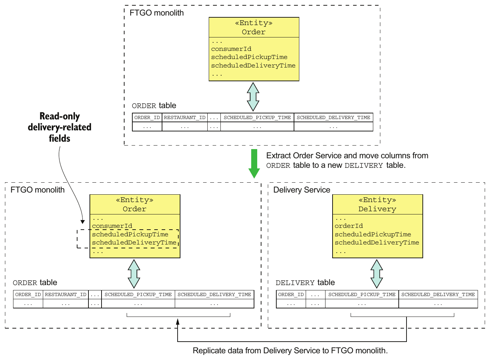

> **English:** Figure 13.7 Minimize the scope of the changes to the FTGO monolith by replicating delivery-related data from the newly extracted Delivery Service back to the monolith’s database.
>
> **Türkçe:** Şekil 13.7 Yeni çıkarılan Delivery Service'ten monolitin veritabanına teslimatla ilgili verileri geri çoğaltarak FTGO monolitindeki değişikliklerin kapsamını en aza indirin.

<!-- source-pages: 442 -->

<!-- source-record: u13_0102 -->

#### WHAT SERVICES TO EXTRACT AND WHEN — HANGİ SERVİSLER NE ZAMAN ÇIKARILMALI?

<!-- source-record: u13_0103 -->

> **English:** As I mentioned, breaking apart the monolith is time consuming. It diverts effort away from implementing features. As a result, you must carefully decide the sequence in which you extract services. You need to focus on extracting services that give the largest benefit. What’s more, you want to continually demonstrate to the business that there’s value in migrating to a microservice architecture.
>
> **Türkçe:** Belirttiğim gibi monoliti parçalamak zaman alır. Özellik geliştirmeye ayrılan emeği başka yöne kaydırır. Bu nedenle servisleri hangi sırayla çıkaracağınıza dikkatle karar vermelisiniz. En büyük yararı sağlayan servisleri çıkarmaya odaklanmalısınız. Ayrıca mikroservis mimarisine geçişin değerini iş tarafına sürekli göstermelisiniz.

<!-- source-record: u13_0104 -->

> **English:** On any journey, it’s essential to know where you’re going. A good way to start the migration to microservices is with a time-boxed architecture definition effort. You should spend a short amount of time, such as a couple of weeks, brainstorming your ideal architecture and defining a set of services. This gives you a destination to aim for. It’s important, though, to remember that this architecture isn’t set in stone. As you break apart the monolith and gain experience, you should revise the architecture to take into account what you’ve learned.
>
> **Türkçe:** Her yolculukta nereye gittiğinizi bilmeniz gerekir. Mikroservislere geçişe başlamanın iyi bir yolu, süresi önceden sınırlandırılmış bir mimari tanımlama çalışmasıdır. İdeal mimariniz üzerine beyin fırtınası yapmak ve bir servis kümesi tanımlamak için birkaç hafta gibi kısa bir zaman ayırmalısınız. Bu size hedefleyeceğiniz bir varış noktası verir. Ancak mimarinin değişmez olmadığını hatırlamak önemlidir. Monoliti parçalayıp deneyim kazandıkça öğrendiklerinizi dikkate alarak mimariyi güncellemelisiniz.

<!-- source-record: u13_0105 -->

> **English:** Once you’ve determined the approximate destination, the next step is to start breaking apart the monolith. There are a couple of different strategies you can use to determine the sequence in which you extract services.
>
> **Türkçe:** Yaklaşık varış noktasını belirledikten sonraki adım monoliti parçalamaya başlamaktır. Servisleri çıkarma sırasını belirlemek için kullanabileceğiniz birkaç farklı strateji vardır.

<!-- source-record: u13_0106 -->

> **English:** One strategy is to effectively freeze development of the monolith and extract services on demand. Instead of implementing features or fixing bugs in the monolith, you extract the necessary service or service(s) and change those. One benefit of this approach is that it forces you to break up the monolith. One drawback is that the extraction of services is driven by short-term requirements rather than long-term needs. For instance, it requires you to extract services even if you’re making a small change to a relatively stable part of the system. As a result, you risk doing a lot of work for minimal benefit.
>
> **Türkçe:** Bir strateji, monolit üzerinde geliştirmeyi fiilen dondurmak ve ihtiyaç oldukça servis çıkarmaktır. Monolitte özellik geliştirmek veya hata düzeltmek yerine gerekli servisi ya da servisleri çıkarır ve bunları değiştirirsiniz. Bu yaklaşımın bir yararı, sizi monoliti parçalamaya zorlamasıdır. Bir sakıncası ise servis çıkarmanın uzun vadeli ihtiyaçlar yerine kısa vadeli gereksinimler tarafından yönlendirilmesidir. Örneğin sistemin görece kararlı bir bölümünde küçük bir değişiklik yaparken bile servis çıkarmanızı gerektirir. Sonuç olarak çok az yarar için çok iş yapma riski doğar.

<!-- source-record: u13_0107 -->

> **English:** An alternative strategy is a more planned approach, where you rank the modules of an application by the benefit you anticipate getting from extracting them. There are a few reasons why extracting a service is beneficial:
>
> **Türkçe:** Alternatif, uygulama modüllerini çıkarılmalarından beklenen yarara göre sıraladığınız daha planlı bir yaklaşımdır. Servis çıkarmanın yararlı olmasının birkaç nedeni vardır:

<!-- source-record: u13_0108 -->

> **English:** • Accelerates development—If your application’s roadmap suggests that a particular part of your application will undergo a lot of development over the next year, then converting it to a service accelerates development.
>
> **Türkçe:** • Geliştirmeyi hızlandırır — Uygulamanızın yol haritası, belirli bir bölümde önümüzdeki yıl çok sayıda geliştirme yapılacağını gösteriyorsa o bölümü servise dönüştürmek geliştirmeyi hızlandırır.

<!-- source-record: u13_0109 -->

> **English:** • Solves a performance, scaling, or reliability problem—If a particular part of your application has a performance or scalability problem or is unreliable, then it’s valuable to convert it to a service.
>
> **Türkçe:** • Performans, ölçekleme veya güvenilirlik sorununu çözer — Uygulamanızın bir bölümünde performans ya da ölçeklenebilirlik sorunu varsa veya o bölüm güvenilir değilse onu servise dönüştürmek değerlidir.

<!-- source-record: u13_0110 -->

> **English:** • Enables the extraction of some other services—Sometimes extracting one service simplifies the extraction of another service, due to dependencies between modules.
>
> **Türkçe:** • Başka servislerin çıkarılmasını sağlar — Modüller arasındaki bağımlılıklar nedeniyle bir servisi çıkarmak bazen diğerinin çıkarılmasını kolaylaştırır.

<!-- source-record: u13_0111 -->

> **English:** You can use these criteria to add refactoring tasks to your application’s backlog, ranked by expected benefit. The benefit of this approach is that it’s more strategic and much more closely aligned with the needs of the business. During sprint planning, you decide whether it’s more valuable to implement features or extract services.
>
> **Türkçe:** Bu ölçütleri kullanarak uygulamanızın backlog'una (bekleyen işler listesine), beklenen yarara göre sıralanmış yeniden düzenleme işleri ekleyebilirsiniz. Bu yaklaşımın yararı, daha stratejik olması ve işletmenin ihtiyaçlarıyla çok daha yakından örtüşmesidir. Sprint planlamasında, özellik geliştirmekle servis çıkarmaktan hangisinin daha değerli olduğuna karar verirsiniz.

<!-- source-pages: 443 -->

<!-- source-record: u13_0112 -->

## 13.3 Designing how the service and the monolith collaborate — Servis ile monolitin iş birliğini tasarlamak

<!-- source-record: u13_0113 -->

> **English:** A service is rarely standalone. It usually needs to collaborate with the monolith. Sometimes a service needs to access data owned by the monolith or invoke its operations. For example, Delayed Delivery Service, described in detail in section 13.4.1, requires access to the monolith’s orders and customer contact info. The monolith might also need to access data owned by the service or invoke its operations. For example, later in section 13.5, when discussing how to extract delivery management into a service, I describe how the monolith needs to invoke Delivery Service.
>
> **Türkçe:** Bir servis nadiren tek başına çalışır. Genellikle monolitle iş birliği yapması gerekir. Bazen servis, monolitin sahip olduğu verilere erişmeli veya işlemlerini çağırmalıdır. Örneğin Kısım 13.4.1'de ayrıntılı anlatılan Delayed Delivery Service, monolitteki siparişlere ve müşteri iletişim bilgilerine erişmek zorundadır. Monolitin de servisin sahip olduğu verilere erişmesi veya işlemlerini çağırması gerekebilir. Örneğin Kısım 13.5'te teslimat yönetimini servise çıkarmayı tartışırken monolitin Delivery Service'i nasıl çağırması gerektiğini anlatıyorum.

<!-- source-record: u13_0114 -->

> **English:** One important concern is maintaining data consistency between the service and monolith. In particular, when you extract a service from the monolith, you invariably split what were originally ACID transactions. You must be careful to ensure that data consistency is still maintained. As described later in this section, sometimes you use sagas to maintain data consistency.
>
> **Türkçe:** Önemli bir konu, servis ile monolit arasında veri tutarlılığını korumaktır. Özellikle monolitten bir servis çıkardığınızda, başlangıçta ACID transaction olan işlemleri kaçınılmaz olarak bölersiniz. Veri tutarlılığının korunmaya devam etmesini dikkatle sağlamalısınız. Bu kısmın ilerleyen yerlerinde anlatıldığı gibi bazen tutarlılığı korumak için saga kullanırsınız.

<!-- source-record: u13_0115 -->

> **English:** The interaction between a service and the monolith is, as described earlier, facilitated by integration glue code. Figure 13.8 shows the structure of the integration glue. It consists of adapters in the service and monolith that communicate using some kind of IPC mechanism. Depending on the requirements, the service and monolith might interact over REST or they might use messaging. They might even communicate using multiple IPC mechanisms.
>
> **Türkçe:** Daha önce açıklandığı gibi servis ile monolit arasındaki etkileşimi bütünleştirme bağlantı kodu sağlar. Şekil 13.8 bu bağlantının yapısını gösterir. Servis ve monolitte bulunan, bir IPC mekanizmasıyla haberleşen adaptörlerden oluşur. Gereksinimlere bağlı olarak servis ile monolit REST üzerinden etkileşebilir veya mesajlaşma kullanabilir. Birden fazla IPC mekanizmasıyla da haberleşebilirler.

<!-- source-record: u13_0116 -->

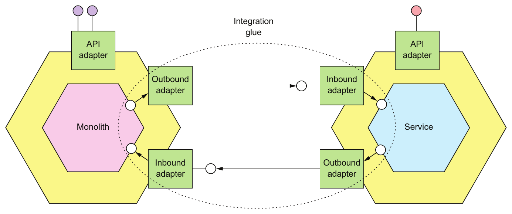

> **English:** Figure 13.8 When migrating a monolith to microservices, the services and monolith often need to access each other’s data. This interaction is facilitated by the integration glue, which consists of adapters that implement APIs. Some APIs are messaging based. Other APIs are RPI based.
>
> **Türkçe:** Şekil 13.8 Bir monolit mikroservislere taşınırken servisler ile monolitin çoğu zaman birbirlerinin verilerine erişmesi gerekir. Bu etkileşimi, API'ler gerçekleştiren adaptörlerden oluşan bütünleştirme bağlantısı sağlar. Bazı API'ler mesajlaşmaya dayanır. Diğerleri RPI (remote procedure invocation, uzak prosedür çağrısı) tabanlıdır.

<!-- source-record: u13_0117 -->

> **English:** For example, Delayed Delivery Service uses both REST and domain events. It retrieves customer contact info from the monolith using REST. It tracks the state of Orders by subscribing to domain events published by the monolith.
>
> **Türkçe:** Örneğin Delayed Delivery Service hem REST hem domain event kullanır. Müşteri iletişim bilgilerini monolitten REST ile alır. Monolitin yayımladığı domain event'lere abone olarak Order nesnelerinin durumunu izler.

<!-- source-pages: 444 -->

<!-- source-record: u13_0118 -->

> **English:** In this section, I first describe the design of the integration glue. I talk about the problems it solves and the different implementation options. After that I describe transaction management strategies, including the use of sagas. I discuss how sometimes the requirement to maintain data consistency changes the order in which you extract services.
>
> **Türkçe:** Bu kısımda önce bütünleştirme bağlantısının tasarımını anlatıyorum. Çözdüğü sorunlardan ve farklı gerçekleştirim seçeneklerinden söz ediyorum. Ardından saga kullanımını da içeren transaction yönetimi stratejilerini açıklıyorum. Veri tutarlılığını koruma gereksiniminin bazen servisleri çıkarma sırasını nasıl değiştirdiğini tartışıyorum.

<!-- source-record: u13_0119 -->

> **English:** Let’s first look at the design of the integration glue.
>
> **Türkçe:** Önce bütünleştirme bağlantısının tasarımına bakalım.

<!-- source-record: u13_0120 -->

### 13.3.1 Designing the integration glue — Bütünleştirme bağlantısını tasarlamak

<!-- source-record: u13_0121 -->

> **English:** When implementing a feature as a service or extracting a service from the monolith, you must develop the integration glue that enables a service to collaborate with the monolith. It consists of code in both the service and monolith that uses some kind of IPC mechanism. The structure of the integration glue depends on the type of IPC mechanism that is used. If, for example, the service invokes the monolith using REST, then the integration glue consists of a REST client in the service and web controllers in the monolith. Alternatively, if the monolith subscribes to domain events published by the service, then the integration glue consists of an event-publishing adapter in the service and event handlers in the monolith.
>
> **Türkçe:** Bir özelliği servis olarak geliştirirken veya monolitten bir servis çıkarırken servisin monolitle iş birliği yapmasını sağlayan bütünleştirme bağlantısını geliştirmelisiniz. Bu bağlantı, hem serviste hem monolitte bulunan ve bir IPC mekanizması kullanan koddan oluşur. Yapısı, kullanılan IPC mekanizmasına bağlıdır. Örneğin servis monoliti REST ile çağırıyorsa bağlantı, servisteki bir REST istemcisiyle monolitteki web controller'lardan oluşur. Alternatif olarak monolit servisin yayımladığı domain event'lere aboneyse bağlantı, servisteki olay yayımlama adaptörüyle monolitteki event handler'lardan (olay işleyicilerden) oluşur.

<!-- source-record: u13_0122 -->

#### DESIGNING THE INTEGRATION GLUE API — BÜTÜNLEŞTİRME BAĞLANTISININ API'SİNİ TASARLAMAK

<!-- source-record: u13_0123 -->

> **English:** The first step in designing the integration glue is to decide what APIs it provides to the domain logic. There are a couple of different styles of interface to choose from, depending on whether you’re querying data or updating data. Let’s say you’re working on Delayed Delivery Service, which needs to retrieve customer contact info from the monolith. The service’s business logic doesn’t need to know the IPC mechanism that the integration glue uses to retrieve the information. Therefore, that mechanism should be encapsulated by an interface. Because Delayed Delivery Service is querying data, it makes sense to define a CustomerContactInfoRepository:
>
> **Türkçe:** Bütünleştirme bağlantısını tasarlamanın ilk adımı, domain logic'e hangi API'leri sunacağına karar vermektir. Veri sorgulamanıza veya güncellemenize göre seçebileceğiniz birkaç farklı arayüz biçimi vardır. Monolitten müşteri iletişim bilgilerini alması gereken Delayed Delivery Service üzerinde çalıştığınızı düşünelim. Servisin iş mantığının, bağlantının bu bilgileri almak için kullandığı IPC mekanizmasını bilmesi gerekmez. Bu nedenle mekanizma bir arayüzle kapsüllenmelidir. Delayed Delivery Service veri sorguladığı için bir CustomerContactInfoRepository tanımlamak anlamlıdır:

<!-- source-record: u13_0124 -->

```java
interface CustomerContactInfoRepository {
  CustomerContactInfo findCustomerContactInfo(long customerId)
}
```

> **Kod notu — derleme durumu:** Bu kaynak parçasında metot bildiriminin sonundaki noktalı virgül eksiktir; bu hâliyle **derlenmez (Does not compile)**. CustomerContactInfo türünün tanımı da bu parçada verilmez. Amaç repository arayüzünü örneklemektir; kod özgün biçimiyle korunmuştur.

<!-- source-record: u13_0125 -->

> **English:** The service’s business logic can invoke this API without knowing how the integration glue retrieves the data.
>
> **Türkçe:** Servisin iş mantığı, bütünleştirme bağlantısının verileri nasıl aldığını bilmeden bu API'yi çağırabilir.

<!-- source-record: u13_0126 -->

> **English:** Let’s consider a different service. Imagine that you’re extracting delivery management from the FTGO monolith. The monolith needs to invoke Delivery Service to schedule, reschedule, and cancel deliveries. Once again, the details of the underlying IPC mechanism aren’t important to the business logic and should be encapsulated by an interface. In this scenario, the monolith must invoke a service operation, so using a repository doesn’t make sense. A better approach is to define a service interface, such as the following:
>
> **Türkçe:** Farklı bir servisi düşünelim. FTGO monolitinden teslimat yönetimini çıkardığınızı hayal edin. Monolitin, teslimatları planlamak, yeniden planlamak ve iptal etmek için Delivery Service'i çağırması gerekir. Yine alttaki IPC mekanizmasının ayrıntıları iş mantığı açısından önemli değildir ve bir arayüzle kapsüllenmelidir. Bu senaryoda monolitin bir servis işlemini çağırması gerekir; dolayısıyla repository kullanmak anlamlı değildir. Daha iyi bir yaklaşım, aşağıdaki gibi bir servis arayüzü tanımlamaktır:

<!-- source-record: u13_0127 -->

```java
interface DeliveryService {
  void scheduleDelivery(...);
  void rescheduleDelivery(...);
  void cancelDelivery(...);
}
```

> **Kod notu — derleme durumu:** Parametre yerlerindeki `...` ifadeleri açıklama amaçlı yer tutuculardır; geçerli Java parametre bildirimi değildir. Bu parça bu hâliyle **derlenmez (Does not compile)**; tamamlanmış Java 17 programı olarak sunulmaz.

<!-- source-pages: 445 -->

<!-- source-record: u13_0128 -->

> **English:** The monolith’s business logic invokes this API without knowing how it’s implemented by the integration glue.
>
> **Türkçe:** Monolitin iş mantığı, bütünleştirme bağlantısının nasıl gerçekleştirdiğini bilmeden bu API'yi çağırır.

<!-- source-record: u13_0129 -->

> **English:** Now that we’ve seen interface design, let’s look at interaction styles and IPC mechanisms.
>
> **Türkçe:** Arayüz tasarımını gördüğümüze göre etkileşim biçimlerine ve IPC mekanizmalarına bakalım.

<!-- source-record: u13_0130 -->

#### PICKING AN INTERACTION STYLE AND IPC MECHANISM — ETKİLEŞİM BİÇİMİ VE IPC MEKANİZMASI SEÇMEK

<!-- source-record: u13_0131 -->

> **English:** An important design decision you must make when designing the integration glue is selecting the interaction styles and IPC mechanisms that enable the service and the monolith to collaborate. As described in chapter 3, there are several interaction styles and IPC mechanisms to choose from. Which one you should use depends on what one party—the service or monolith—needs in order to query or update the other party.
>
> **Türkçe:** Bütünleştirme bağlantısını tasarlarken vermeniz gereken önemli bir karar, servis ile monolitin iş birliğini sağlayan etkileşim biçimleri ve IPC mekanizmalarının seçimidir. Bölüm 3'te anlatıldığı gibi seçilebilecek çeşitli etkileşim biçimleri ve IPC mekanizmaları vardır. Hangisini kullanacağınız, taraflardan birinin — servisin veya monolitin — diğer tarafı sorgulamak ya da güncellemek için neye ihtiyaç duyduğuna bağlıdır.

<!-- source-record: u13_0132 -->

> **English:** If one party needs to query data owned by the other party, there are several options. One option is, as figure 13.9 shows, for the adapter that implements the repository interface to invoke an API of the data provider. This API will typically use a request/response interaction style, such as REST or gRPC. For example, Delayed Delivery Service might retrieve the customer contact info by invoking a REST API implemented by the FTGO monolith.
>
> **Türkçe:** Bir tarafın diğer tarafa ait verileri sorgulaması gerekiyorsa birkaç seçenek vardır. Şekil 13.9'da gösterilen bir seçenek, repository arayüzünü gerçekleştiren adaptörün veri sağlayıcısının bir API'sini çağırmasıdır. Bu API genellikle REST veya gRPC gibi bir request/response (istek/yanıt) etkileşim biçimi kullanır. Örneğin Delayed Delivery Service, FTGO monolitinin gerçekleştirdiği bir REST API'yi çağırarak müşteri iletişim bilgilerini alabilir.

<!-- source-record: u13_0133 -->

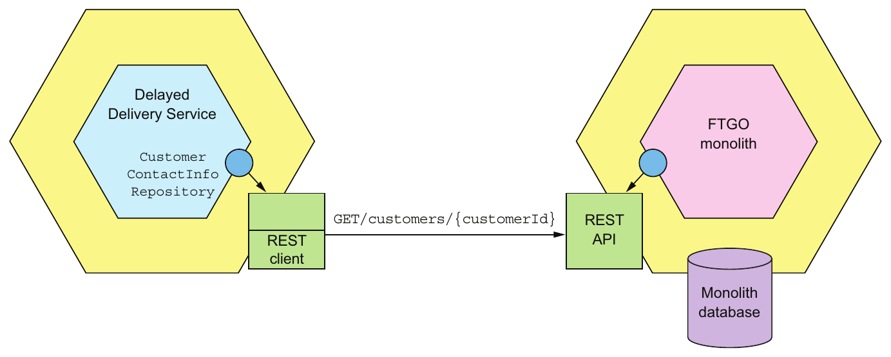

> **English:** Figure 13.9 The adapter that implements the CustomerContactInfoRepository interface invokes the monolith’s REST API to retrieve the customer information.
>
> **Türkçe:** Şekil 13.9 CustomerContactInfoRepository arayüzünü gerçekleştiren adaptör, müşteri bilgilerini almak için monolitin REST API'sini çağırır.

<!-- source-record: u13_0134 -->

> **English:** In this example, the Delayed Delivery Service’s domain logic retrieves the customer contact info by invoking the CustomerContactInfoRepository interface. The implementation of this interface invokes the monolith’s REST API.
>
> **Türkçe:** Bu örnekte Delayed Delivery Service'in domain logic'i, CustomerContactInfoRepository arayüzünü çağırarak müşteri iletişim bilgilerini alır. Bu arayüzün gerçekleştirimiyse monolitin REST API'sini çağırır.

<!-- source-record: u13_0135 -->

> **English:** An important benefit of querying data by invoking a query API is its simplicity. The main drawback is that it’s potentially inefficient. A consumer might need to make a large number of requests. A provider might return a large amount of data. Another drawback is that it reduces availability because it’s synchronous IPC. As a result, it might not be practical to use a query API.
>
> **Türkçe:** Bir sorgu API'sini çağırarak veri sorgulamanın önemli bir yararı basitliğidir. Temel sakıncası, verimsiz olabilmesidir. Bir tüketicinin çok sayıda istek yapması gerekebilir. Sağlayıcı büyük miktarda veri döndürebilir. Başka bir sakınca, senkron IPC kullandığı için kullanılabilirliği azaltmasıdır. Dolayısıyla bir sorgu API'si kullanmak uygulanabilir olmayabilir.

<!-- source-pages: 446 -->

<!-- source-record: u13_0136 -->

> **English:** An alternative approach is for the data consumer to maintain a replica of the data, as shown in figure 13.10. The replica is essentially a CQRS view. The data consumer keeps the replica up-to-date by subscribing to domain events published by the data provider.
>
> **Türkçe:** Alternatif bir yaklaşım, Şekil 13.10'da gösterildiği gibi veri tüketicisinin verinin bir replica'sını (kopyasını) tutmasıdır. Bu kopya esasen bir CQRS view'dır (görünümü). Veri tüketicisi, veri sağlayıcısının yayımladığı domain event'lere abone olarak kopyayı güncel tutar.

<!-- source-record: u13_0137 -->

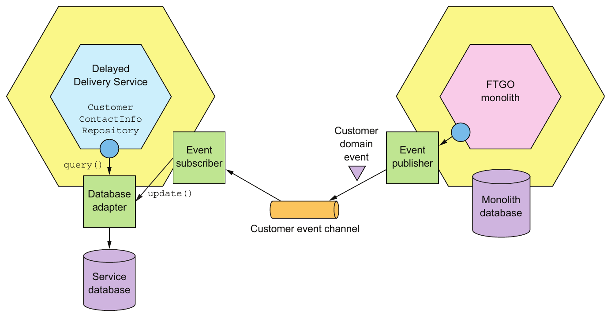

> **English:** Figure 13.10 The integration glue replicates data from the monolith to the service. The monolith publishes domain events, and an event handler implemented by the service updates the service’s database.
>
> **Türkçe:** Şekil 13.10 Bütünleştirme bağlantısı verileri monolitten servise çoğaltır. Monolit domain event'ler yayımlar; servisin gerçekleştirdiği bir olay işleyici de servisin veritabanını günceller.

<!-- source-record: u13_0138 -->

> **English:** Using a replica has several benefits. It avoids the overhead of repeatedly querying the data provider. Instead, as discussed when describing CQRS in chapter 7, you can design the replica to support efficient queries. One drawback of using a replica, though, is the complexity of maintaining it. A potential challenge, as described later in this section, is the need to modify the monolith to publish domain events.
>
> **Türkçe:** Kopya kullanmanın çeşitli yararları vardır. Veri sağlayıcısını tekrar tekrar sorgulamanın ek yükünü önler. Bunun yerine, Bölüm 7'de CQRS anlatılırken tartışıldığı gibi, kopyayı verimli sorguları destekleyecek biçimde tasarlayabilirsiniz. Ancak kopya kullanmanın bir sakıncası, onu güncel tutmanın karmaşıklığıdır. Bu kısmın ilerleyen yerlerinde anlatıldığı gibi, monoliti domain event yayımlayacak biçimde değiştirme gereği olası bir zorluktur.

<!-- source-record: u13_0139 -->

> **English:** Now that we’ve discussed how to do queries, let’s consider how to do updates. One challenge with performing updates is the need to maintain data consistency across the service and monolith. The party making the update request (the requestor) has updated or needs to update its database. So it’s essential that both updates happen. The solution is for the service and monolith to communicate using transactional messaging implemented by a framework, such as Eventuate Tram. In simple scenarios, the requestor can send a notification message or publish an event to trigger an update. In more complex scenarios, the requestor must use a saga to maintain data consistency. Section 13.3.2 discusses the implications of using sagas.
>
> **Türkçe:** Sorguları ele aldığımıza göre şimdi güncellemeleri düşünelim. Güncelleme yapmanın bir zorluğu, servis ile monolit arasında veri tutarlılığını koruma gereğidir. Güncelleme isteğini yapan taraf, yani requestor, kendi veritabanını güncellemiştir veya güncellemelidir. Dolayısıyla her iki güncellemenin de gerçekleşmesi zorunludur. Çözüm, servis ile monolitin Eventuate Tram gibi bir framework'ün gerçekleştirdiği transactional messaging (transaction güvenceli mesajlaşma) kullanarak haberleşmesidir. Basit senaryolarda istekte bulunan taraf, güncellemeyi tetiklemek için bir bildirim mesajı gönderebilir veya olay yayımlayabilir. Daha karmaşık senaryolarda veri tutarlılığını korumak için saga kullanmalıdır. Kısım 13.3.2, saga kullanımının sonuçlarını tartışır.

<!-- source-record: u13_0140 -->

#### IMPLEMENTING AN ANTI-CORRUPTION LAYER — ANTI-CORRUPTION LAYER GERÇEKLEŞTİRMEK

<!-- source-record: u13_0141 -->

> **English:** Imagine you’re implementing a new feature as a brand new service. You’re not constrained by the monolith’s code base, so you can use modern development techniques such as DDD and develop a pristine new domain model. Also, because the FTGO monolith’s domain is poorly defined and somewhat out-of-date, you’ll probably model concepts differently. As a result, your service’s domain model will have different class names, field names, and field values. For example, Delayed Delivery Service has a Delivery entity with narrowly focused responsibilities, whereas the FTGO monolith has an Order entity with an excessive number of responsibilities. Because the two domain models are different, you must implement what DDD calls an anti-corruption layer (ACL) in order for the service to communicate with the monolith.
>
> **Türkçe:** Yeni bir özelliği yepyeni bir servis olarak geliştirdiğinizi düşünün. Monolitin kod tabanıyla kısıtlanmadığınız için DDD gibi modern geliştirme tekniklerini kullanabilir ve temiz bir domain model oluşturabilirsiniz. Ayrıca FTGO monolitinin domain'i iyi tanımlanmamış ve biraz eskimiş olduğundan, kavramları muhtemelen farklı modellendirirsiniz. Sonuç olarak servisin domain model'indeki sınıf adları, alan adları ve alan değerleri farklı olur. Örneğin Delayed Delivery Service, sorumlulukları dar bir alana odaklanan bir Delivery entity'sine sahipken FTGO monolitinde aşırı sayıda sorumluluğu olan bir Order entity'si vardır. İki domain model farklı olduğundan, servisin monolitle haberleşebilmesi için DDD'nin anti-corruption layer (ACL, model bozulmasını önleyen katman) dediği yapıyı gerçekleştirmeniz gerekir.

<!-- source-pages: 447 -->

<!-- source-record: u13_0142 -->

### Pattern: Anti-corruption layer — Kalıp: Anti-corruption layer

<!-- source-record: u13_0143 -->

> **English:** A software layer that translates between two different domain models in order to prevent concepts from one model polluting another. See https://microservices.io/patterns/refactoring/anti-corruption-layer.html.
>
> **Türkçe:** Bir modeldeki kavramların diğer modeli bozmasını önlemek amacıyla iki farklı domain model arasında dönüşüm yapan yazılım katmanı. Bkz. https://microservices.io/patterns/refactoring/anti-corruption-layer.html.

<!-- source-record: u13_0144 -->

> **English:** The goal of an ACL is to prevent a legacy monolith’s domain model from polluting a service’s domain model. It’s a layer of code that translates between the different domain models. For example, as figure 13.11 shows, Delayed Delivery Service has a CustomerContactInfoRepository interface, which defines a findCustomerContactInfo() method that returns CustomerContactInfo. The class that implements the CustomerContactInfoRepository interface must translate between the ubiquitous language of Delayed Delivery Service and that of the FTGO monolith.
>
> **Türkçe:** ACL'nin amacı, eski monolitin domain model'inin servisin domain model'ini bozmasını önlemektir. Farklı domain model'ler arasında dönüşüm yapan bir kod katmanıdır. Örneğin Şekil 13.11'de gösterildiği gibi Delayed Delivery Service, CustomerContactInfo döndüren findCustomerContactInfo() metodunu tanımlayan bir CustomerContactInfoRepository arayüzüne sahiptir. Bu arayüzü gerçekleştiren sınıf, Delayed Delivery Service'in ubiquitous language'i (ortak alan dili) ile FTGO monolitinin ortak alan dili arasında dönüşüm yapmalıdır.

<!-- source-record: u13_0145 -->

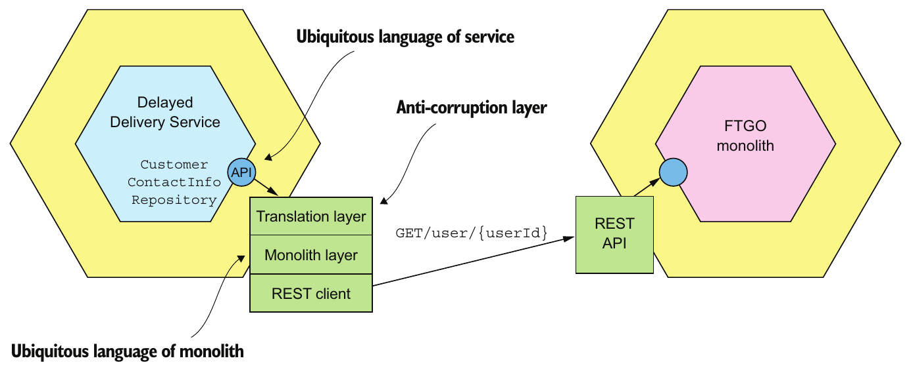

> **English:** Figure 13.11 A service adapter that invokes the monolith must translate between the service’s domain model and the monolith’s domain model.
>
> **Türkçe:** Şekil 13.11 Monoliti çağıran bir servis adaptörü, servisin domain model'i ile monolitin domain model'i arasında dönüşüm yapmalıdır.

<!-- source-record: u13_0146 -->

> **English:** The implementation of findCustomerContactInfo() invokes the FTGO monolith to retrieve the customer information and translates the response to CustomerContactInfo. In this example, the translation is quite simple, but in other scenarios it could be quite complex and involve, for example, mapping values such as status codes.
>
> **Türkçe:** findCustomerContactInfo() gerçekleştirimi, müşteri bilgilerini almak için FTGO monolitini çağırır ve yanıtı CustomerContactInfo'ya dönüştürür. Bu örnekte dönüşüm oldukça basittir; ancak başka senaryolarda oldukça karmaşık olabilir ve örneğin durum kodları gibi değerlerin eşlenmesini gerektirebilir.

<!-- source-pages: 448 -->

<!-- source-record: u13_0147 -->

> **English:** An event subscriber, which consumes domain events, also has an ACL. Domain events are part of the publisher’s domain model. An event handler must translate domain events to the subscriber’s domain model. For example, as figure 13.12 shows, the FTGO monolith publishes Order domain events. Delivery Service has an event handler that subscribes to those events.
>
> **Türkçe:** Domain event'leri tüketen bir event subscriber'da (olay abonesi) da ACL bulunur. Domain event'ler yayıncının domain model'inin parçasıdır. Olay işleyici, domain event'leri abonenin domain model'ine dönüştürmelidir. Örneğin Şekil 13.12'de gösterildiği gibi FTGO monoliti Order domain event'leri yayımlar. Delivery Service, bu olaylara abone olan bir olay işleyiciye sahiptir.

<!-- source-record: u13_0148 -->

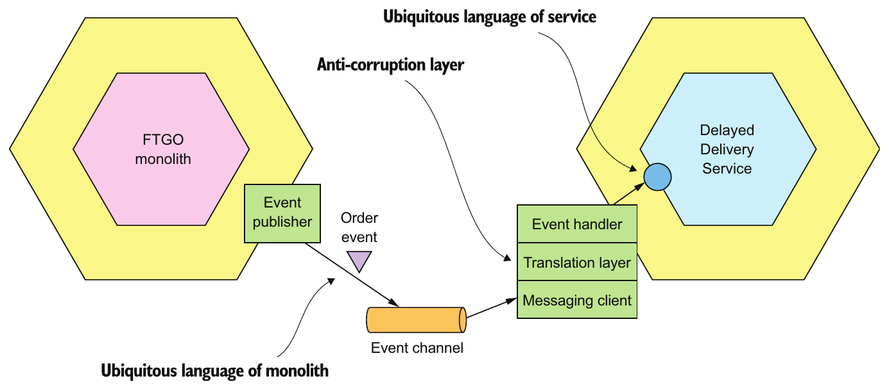

> **English:** Figure 13.12 An event handler must translate from the event publisher’s domain model to the subscriber’s domain model.
>
> **Türkçe:** Şekil 13.12 Olay işleyici, olay yayıncısının domain model'inden abonenin domain model'ine dönüşüm yapmalıdır.

<!-- source-record: u13_0149 -->

> **English:** The event handler must translate domain events from the monolith’s domain language to that of Delivery Service. It might need to map class and attribute names and potentially attribute values.
>
> **Türkçe:** Olay işleyici, domain event'leri monolitin domain dilinden Delivery Service'in domain diline dönüştürmelidir. Sınıf ve nitelik adlarını, hatta nitelik değerlerini eşlemesi gerekebilir.

<!-- source-record: u13_0150 -->

> **English:** It’s not just services that use an anti-corruption layer. A monolith also uses an ACL when invoking the service and when subscribing to domain events published by a service. For example, the FTGO monolith schedules a delivery by sending a notification message to Delivery Service. It sends the notification by invoking a method on the DeliveryService interface. The implementation class translates its parameters into a message that Delivery Service understands.
>
> **Türkçe:** Anti-corruption layer kullananlar yalnızca servisler değildir. Monolit de servisi çağırırken ve servisin yayımladığı domain event'lere abone olurken ACL kullanır. Örneğin FTGO monoliti, Delivery Service'e bir bildirim mesajı göndererek teslimat planlar. Bildirimi, DeliveryService arayüzündeki bir metodu çağırarak gönderir. Gerçekleştirim sınıfı, parametrelerini Delivery Service'in anlayacağı bir mesaja dönüştürür.

<!-- source-record: u13_0151 -->

#### HOW THE MONOLITH PUBLISHES AND SUBSCRIBES TO DOMAIN EVENTS — MONOLİT DOMAIN EVENT'LERİ NASIL YAYIMLAR VE BUNLARA NASIL ABONE OLUR?

<!-- source-record: u13_0152 -->

> **English:** Domain events are an important collaboration mechanism. It’s straightforward for a newly developed service to publish and consume events. It can use one of the mechanisms described in chapter 3, such as the Eventuate Tram framework. A service might even publish events using event sourcing, described in chapter 6. It’s potentially challenging, though, to change the monolith to publish and consume events. Let’s look at why.
>
> **Türkçe:** Domain event'ler önemli bir iş birliği mekanizmasıdır. Yeni geliştirilen bir servisin olay yayımlaması ve tüketmesi kolaydır. Bölüm 3'te anlatılan Eventuate Tram framework'ü gibi mekanizmalardan birini kullanabilir. Bir servis, Bölüm 6'da anlatılan event sourcing'i kullanarak da olay yayımlayabilir. Ancak monoliti olay yayımlayacak ve tüketecek biçimde değiştirmek zor olabilir. Nedenine bakalım.

<!-- source-record: u13_0153 -->

> **English:** There are a couple of different ways that a monolith can publish domain events. One approach is to use the same domain event publishing mechanism used by the services. You find all the places in the code that change a particular entity and insert a call to an event publishing API. The problem with this approach is that changing a monolith isn’t always easy. It might be time consuming and error prone to locate all the places and insert calls to publish events. To make matters worse, some of the monolith’s business logic might consist of stored procedures that can’t easily publish domain events.
>
> **Türkçe:** Monolitin domain event yayımlamasının birkaç farklı yolu vardır. Bir yaklaşım, servislerle aynı domain event yayımlama mekanizmasını kullanmaktır. Kodda belirli bir entity'yi değiştiren tüm yerleri bulur ve olay yayımlama API'sine çağrı eklersiniz. Bu yaklaşımın sorunu, monoliti değiştirmenin her zaman kolay olmamasıdır. Tüm yerleri bulup olay yayımlama çağrılarını eklemek zaman alıcı ve hataya açık olabilir. Daha da kötüsü, monolitin iş mantığının bir kısmı domain event'leri kolayca yayımlayamayan stored procedure'lardan (saklı yordamlardan) oluşabilir.

<!-- source-pages: 449 -->

<!-- source-record: u13_0154 -->

> **English:** Another approach is to publish domain events at the database level. You can, for example, use either transaction logic tailing or polling, described in chapter 3. A key benefit of using transaction tailing is that you don’t have to change the monolith. The main drawback of publishing events at the database level is that it’s often difficult to identify the reason for the update and publish the appropriate high-level business event. As a result, the service will typically publish events representing changes to tables rather than business entities.
>
> **Türkçe:** Başka bir yaklaşım, domain event'leri veritabanı düzeyinde yayımlamaktır. Örneğin Bölüm 3'te anlatılan transaction log tailing (işlem günlüğünü izleme) veya polling (yoklama) yöntemini kullanabilirsiniz. Transaction log tailing kullanmanın temel bir yararı, monoliti değiştirmeniz gerekmemesidir. Veritabanı düzeyinde olay yayımlamanın temel sakıncası, güncellemenin nedenini belirleyip buna uygun üst düzey iş olayını yayımlamanın çoğu zaman zor olmasıdır. Sonuç olarak servis, genellikle iş entity'lerindeki değişiklikler yerine tablolardaki değişiklikleri temsil eden olaylar yayımlar.

> **Editör notu — teknik terim:** Kaynaktaki “transaction logic tailing” ifadesi, Bölüm 3 ve bu kısmın devamındaki bağlama göre **transaction log tailing** anlamındadır; Türkçede doğru teknik terim kullanılmıştır.

<!-- source-record: u13_0155 -->

> **English:** Fortunately, it’s usually easier for the monolith to subscribe to domain events published by services. Quite often, you can write event handlers using a framework, such as Eventuate Tram. But sometimes it’s even challenging for the monolith to subscribe to events. For example, the monolith might be written in a language that doesn’t have a message broker client. In that situation, you need to write a small “helper” application that subscribes to events and updates the monolith’s database directly.
>
> **Türkçe:** Neyse ki monolitin servisler tarafından yayımlanan domain event'lere abone olması genellikle daha kolaydır. Çoğu zaman Eventuate Tram gibi bir framework kullanarak olay işleyiciler yazabilirsiniz. Ancak bazen monolitin olaylara abone olması bile zordur. Örneğin monolit, message broker istemcisi bulunmayan bir dilde yazılmış olabilir. Böyle bir durumda olaylara abone olan ve monolitin veritabanını doğrudan güncelleyen küçük bir “yardımcı” uygulama yazmanız gerekir.

<!-- source-record: u13_0156 -->

> **English:** Now that we’ve looked at how to design the integration glue that enables a service and the monolith to collaborate, let’s look at another challenge you might face when migrating to microservices: maintaining data consistency across a service and a monolith.
>
> **Türkçe:** Servis ile monolitin iş birliğini sağlayan bağlantının nasıl tasarlandığını gördük. Şimdi mikroservislere geçerken karşılaşabileceğiniz başka bir zorluğa bakalım: servis ile monolit arasında veri tutarlılığını korumak.

<!-- source-record: u13_0157 -->

### 13.3.2 Maintaining data consistency across a service and a monolith — Servis ile monolit arasında veri tutarlılığını korumak

<!-- source-record: u13_0158 -->

> **English:** When you develop a service, you might find it challenging to maintain data consistency across the service and the monolith. A service operation might need to update data in the monolith, or a monolith operation might need to update data in the service. For example, imagine you extracted Kitchen Service from the monolith. You would need to change the monolith’s order-management operations, such as createOrder() and cancelOrder(), to use sagas in order to keep the Ticket consistent with the Order.
>
> **Türkçe:** Bir servis geliştirirken servis ile monolit arasında veri tutarlılığını korumakta zorlanabilirsiniz. Bir servis işlemi monolitteki verileri, bir monolit işlemi de servisteki verileri güncellemek zorunda olabilir. Örneğin Kitchen Service'i monolitten çıkardığınızı düşünün. Ticket'ı Order ile tutarlı tutmak için monolitin createOrder() ve cancelOrder() gibi sipariş yönetimi işlemlerini saga kullanacak biçimde değiştirmeniz gerekir.

<!-- source-record: u13_0159 -->

> **English:** The problem with using sagas, however, is that the monolith might not be a willing participant. As described in chapter 4, sagas must use compensating transactions to undo changes. Create Order Saga, for example, includes a compensating transaction that marks an Order as rejected if it’s rejected by Kitchen Service. The problem with compensating transactions in the monolith is that you might need to make numerous and time-consuming changes to the monolith in order to support them. The monolith might also need to implement countermeasures to handle the lack of isolation between sagas. The cost of these code changes can be a huge obstacle to extracting a service.
>
> **Türkçe:** Ancak saga kullanmanın sorunu, monolitin buna kolayca uyum sağlamayabilmesidir. Bölüm 4'te anlatıldığı gibi saga'lar, değişiklikleri geri almak için compensating transaction'lar (telafi işlemleri) kullanmalıdır. Örneğin Create Order Saga, Kitchen Service tarafından reddedilen bir Order'ı reddedildi olarak işaretleyen bir telafi işlemi içerir. Monolitte telafi işlemlerinin sorunu, bunları desteklemek için monolitte çok sayıda ve zaman alıcı değişiklik yapmanız gerekebilmesidir. Ayrıca monolit, saga'lar arasındaki isolation (yalıtım) eksikliğini gidermek için countermeasure'lar (karşı önlemler) uygulamak zorunda olabilir. Bu kod değişikliklerinin maliyeti, servis çıkarmanın önünde büyük bir engel oluşturabilir.

<!-- source-pages: 450 -->

<!-- source-record: u13_0160 -->

### Key saga terminology — Temel saga terimleri

<!-- source-record: u13_0161 -->

> **English:** I cover sagas in chapter 4. Here are some key terms:
>
> **Türkçe:** Saga'ları Bölüm 4'te ele alıyorum. Bazı temel terimler şunlardır:

<!-- source-record: u13_0162 -->

> **English:** • Saga—A sequence of local transactions coordinated through asynchronous messaging.
>
> **Türkçe:** • Saga — Asenkron mesajlaşma üzerinden koordine edilen yerel transaction dizisi.

<!-- source-record: u13_0163 -->

> **English:** • Compensating transaction—A transaction that undoes the updates made by a local transaction.
>
> **Türkçe:** • Compensating transaction (telafi işlemi) — Yerel bir transaction'ın yaptığı güncellemeleri geri alan transaction.

<!-- source-record: u13_0164 -->

> **English:** • Countermeasure—A design technique used to handle the lack of isolation between sagas.
>
> **Türkçe:** • Countermeasure (karşı önlem) — Saga'lar arasındaki yalıtım eksikliğini ele almak için kullanılan tasarım tekniği.

<!-- source-record: u13_0165 -->

> **English:** • Semantic lock—A countermeasure that sets a flag in a record that is being updated by a saga.
>
> **Türkçe:** • Semantic lock (anlamsal kilit) — Saga tarafından güncellenmekte olan bir kayıtta bayrak ayarlayan karşı önlem.

<!-- source-record: u13_0166 -->

> **English:** • Compensatable transaction—A transaction that needs a compensating transaction because one of the transactions that follows it in the saga can fail.
>
> **Türkçe:** • Compensatable transaction (telafi edilebilir işlem) — Saga'da kendisinden sonra gelen transaction'lardan biri başarısız olabileceği için telafi işlemine ihtiyaç duyan transaction.

<!-- source-record: u13_0167 -->

> **English:** • Pivot transaction—A transaction that is the saga’s go/no-go point. If it succeeds, then the saga will run to completion.
>
> **Türkçe:** • Pivot transaction (dönüm noktası işlemi) — Saga'nın devam edip etmeyeceğinin belirlendiği transaction. Başarılı olursa saga tamamlanana kadar ilerler.

<!-- source-record: u13_0168 -->

> **English:** • Retriable transaction—A transaction that follows the pivot transaction and is guaranteed to succeed.
>
> **Türkçe:** • Retriable transaction (yeniden denenebilir işlem) — Pivot transaction'dan sonra gelen ve başarılı olması garanti edilen transaction.

> **Teknik not — başarı garantisinin kapsamı:** Saga bağlamında “retriable” işlemin iş kuralları nedeniyle kalıcı olarak reddedilmemesi beklenir. Ağ kesintisi gibi geçici hatalar yine oluşabilir; bunlar yeniden deneme ve uygun idempotency (yinelenebilirlik) düzenekleriyle ele alınır. Kaynaktaki “başarısız olamaz” anlatımı, geçici altyapı hatalarının hiç yaşanmayacağı anlamına gelmez.

<!-- source-record: u13_0169 -->

> **English:** Fortunately, many sagas are straightforward to implement. As covered in chapter 4, if the monolith’s transactions are either pivot transactions or retriable transactions, then implementing sagas should be straightforward. You may even be able to simplify implementation by carefully ordering the sequence of service extractions so that the monolith’s transactions never need to be compensatable. Or it may be relatively difficult to change the monolith to support compensating transactions. To understand why implementing compensating transactions in the monolith is sometimes challenging, let’s look at some examples, beginning with a particularly troublesome one.
>
> **Türkçe:** Neyse ki birçok saga'yı gerçekleştirmek kolaydır. Bölüm 4'te ele alındığı gibi monolitin transaction'ları pivot veya retriable transaction ise saga'ları gerçekleştirmek kolay olmalıdır. Hatta servisleri çıkarma sırasını, monolitin transaction'larının hiçbir zaman telafi edilebilir olması gerekmeyecek şekilde dikkatle belirleyerek gerçekleştirim işini basitleştirebilirsiniz. Öte yandan monoliti telafi işlemlerini destekleyecek biçimde değiştirmek görece zor olabilir. Monolitte telafi işlemlerini gerçekleştirmenin neden bazen zor olduğunu anlamak için, özellikle sorunlu bir örnekten başlayarak bazı örneklere bakalım.

<!-- source-record: u13_0170 -->

#### THE CHALLENGE OF CHANGING THE MONOLITH TO SUPPORT COMPENSATABLE TRANSACTIONS — MONOLİTİ TELAFİ EDİLEBİLİR İŞLEMLERİ DESTEKLEYECEK BİÇİMDE DEĞİŞTİRMENİN ZORLUĞU

<!-- source-record: u13_0171 -->

> **English:** Let’s dig into the problem of compensating transactions that you’ll need to solve when extracting Kitchen Service from the monolith. This refactoring involves splitting the Order entity and creating a Ticket entity in Kitchen Service. It impacts numerous commands implemented by the monolith, including createOrder().
>
> **Türkçe:** Kitchen Service'i monolitten çıkarırken çözmeniz gereken telafi işlemleri sorununu ayrıntılı ele alalım. Bu yeniden düzenleme, Order entity'sini bölmeyi ve Kitchen Service'te bir Ticket entity'si oluşturmayı içerir. Monolitin gerçekleştirdiği createOrder() dahil çok sayıda komutu etkiler.

<!-- source-record: u13_0172 -->

> **English:** The monolith implements the createOrder() command as a single ACID transaction consisting of the following steps:
>
> **Türkçe:** Monolit, createOrder() komutunu şu adımlardan oluşan tek bir ACID transaction olarak gerçekleştirir:

<!-- source-record: u13_0173 -->

> **English:** 1 Validate order details.
>
> **Türkçe:** 1 Sipariş ayrıntılarını doğrula.

<!-- source-record: u13_0174 -->

> **English:** 2 Verify that the consumer can place an order.
>
> **Türkçe:** 2 Tüketicinin sipariş verebildiğini doğrula.

<!-- source-record: u13_0175 -->

> **English:** 3 Authorize consumer’s credit card.
>
> **Türkçe:** 3 Tüketicinin kredi kartından provizyon al.

<!-- source-record: u13_0176 -->

> **English:** 4 Create an Order.
>
> **Türkçe:** 4 Bir Order oluştur.

<!-- source-record: u13_0177 -->

> **English:** You need to replace this ACID transaction with a saga consisting of the following steps:
>
> **Türkçe:** Bu ACID transaction'ı şu adımlardan oluşan bir saga ile değiştirmelisiniz:

<!-- source-record: u13_0178 -->

> **English:** 1 In the monolith – Create an Order in an APPROVAL_PENDING state. – Verify that the consumer can place an order.
>
> **Türkçe:** 1 Monolitte — APPROVAL_PENDING durumunda bir Order oluştur. — Tüketicinin sipariş verebildiğini doğrula.

<!-- source-pages: 451 -->

<!-- source-record: u13_0179 -->

> **English:** 2 In the Kitchen Service – Validate order details. – Create a Ticket in the CREATE_PENDING state.
>
> **Türkçe:** 2 Kitchen Service'te — Sipariş ayrıntılarını doğrula. — CREATE_PENDING durumunda bir Ticket oluştur.

<!-- source-record: u13_0180 -->

> **English:** 3 In the monolith – Authorize consumer’s credit card. – Change state of Order to APPROVED.
>
> **Türkçe:** 3 Monolitte — Tüketicinin kredi kartından provizyon al. — Order'ın durumunu APPROVED yap.

<!-- source-record: u13_0181 -->

> **English:** 4 In Kitchen Service – Change the state of the Ticket to AWAITING_ACCEPTANCE.
>
> **Türkçe:** 4 Kitchen Service'te — Ticket'ın durumunu AWAITING_ACCEPTANCE yap.

<!-- source-record: u13_0182 -->

> **English:** This saga is similar to CreateOrderSaga described in chapter 4. It consists of four local transactions, two in the monolith and two in Kitchen Service. The first transaction creates an Order in the APPROVAL_PENDING state. The second transaction creates a Ticket in the CREATE_PENDING state. The third transaction authorizes the Consumer credit card and changes the state of the order to APPROVED. The fourth and final transaction changes the state of the Ticket to AWAITING_ACCEPTANCE.
>
> **Türkçe:** Bu saga, Bölüm 4'te anlatılan CreateOrderSaga'ya benzer. İkisi monolitte, ikisi Kitchen Service'te olmak üzere dört yerel transaction'dan oluşur. İlk transaction, APPROVAL_PENDING durumunda bir Order oluşturur. İkincisi, CREATE_PENDING durumunda bir Ticket oluşturur. Üçüncüsü, Consumer'ın kredi kartından provizyon alır ve siparişin durumunu APPROVED yapar. Dördüncü ve son transaction, Ticket'ın durumunu AWAITING_ACCEPTANCE yapar.

<!-- source-record: u13_0183 -->

> **English:** The challenge with implementing this saga is that the first step, which creates the Order, must be compensatable. That’s because the second local transaction, which occurs in Kitchen Service, might fail and require the monolith to undo the updates performed by the first local transaction. As a result, the Order entity needs to have an APPROVAL_PENDING, a semantic lock countermeasure, described in chapter 4, that indicates an Order is in the process of being created.
>
> **Türkçe:** Bu saga'yı gerçekleştirmenin zorluğu, Order'ı oluşturan ilk adımın telafi edilebilir olması gerekmesidir. Çünkü Kitchen Service'te gerçekleşen ikinci yerel transaction başarısız olabilir ve monolitin ilk yerel transaction ile yaptığı güncellemeleri geri almasını gerektirebilir. Bu nedenle Order entity'sinin, siparişin oluşturulma sürecinde olduğunu gösteren bir APPROVAL_PENDING durumuna sahip olması gerekir. Bu, Bölüm 4'te anlatılan semantic lock karşı önlemidir.

<!-- source-record: u13_0184 -->

> **English:** The problem with introducing a new Order entity state is that it potentially requires widespread changes to the monolith. You might need to change every place in the code that touches an Order entity. Making these kinds of widespread changes to the monolith is time consuming and not the best investment of development resources. It’s also potentially risky, because the monolith is often difficult to test.
>
> **Türkçe:** Yeni bir Order entity durumu eklemenin sorunu, monolitte geniş çaplı değişiklikler gerektirebilmesidir. Kodda Order entity'sine dokunan her yeri değiştirmeniz gerekebilir. Monolitte böyle yaygın değişiklikler yapmak zaman alıcıdır ve geliştirme kaynaklarının en iyi kullanımı değildir. Ayrıca monolitin test edilmesi çoğu zaman zor olduğundan riskli de olabilir.

<!-- source-record: u13_0185 -->

#### SAGAS DON’T ALWAYS REQUIRE THE MONOLITH TO SUPPORT COMPENSATABLE TRANSACTIONS — SAGA'LAR HER ZAMAN MONOLİTİN TELAFİ EDİLEBİLİR İŞLEMLERİ DESTEKLEMESİNİ GEREKTİRMEZ

<!-- source-record: u13_0186 -->

> **English:** Sagas are highly domain-specific. Some, such as the one we just looked at, require the monolith to support compensating transactions. But it’s quite possible that when you extract a service, you may be able to design sagas that don’t require the monolith to implement compensating transactions. That’s because a monolith only needs to support compensating transactions if the transactions that follow the monolith’s transaction can fail. If each of the monolith’s transactions is either a pivot transaction or a retriable transaction, then the monolith never needs to execute a compensating transaction. As a result, you only need to make minimal changes to the monolith to support sagas.
>
> **Türkçe:** Saga'lar büyük ölçüde domain'e özgüdür. Az önce gördüğümüz gibi bazıları, monolitin telafi işlemlerini desteklemesini gerektirir. Ancak bir servis çıkarırken monolitin telafi işlemleri gerçekleştirmesini gerektirmeyen saga'lar tasarlamanız oldukça mümkündür. Çünkü monolitin telafi işlemlerini desteklemesi, ancak kendi transaction'ından sonra gelen transaction'lar başarısız olabiliyorsa gerekir. Monolitin her transaction'ı pivot veya retriable transaction ise monolitin telafi işlemi yürütmesi hiç gerekmez. Sonuç olarak saga desteği için monolitte yalnızca asgari değişiklik yapmanız yeterlidir.

<!-- source-record: u13_0187 -->

> **English:** For example, imagine that instead of extracting Kitchen Service, you extract Order Service. This refactoring involves splitting the Order entity and creating a slimmed-down Order entity in Order Service. It also impacts numerous commands, including createOrder(), which is moved from the monolith to Order Service. In order to extract Order Service, you need to change the createOrder() command to use a saga, using the following steps:
>
> **Türkçe:** Örneğin Kitchen Service yerine Order Service'i çıkardığınızı düşünün. Bu yeniden düzenleme, Order entity'sini bölmeyi ve Order Service içinde sadeleştirilmiş bir Order entity'si oluşturmayı içerir. Monolitten Order Service'e taşınan createOrder() dahil çok sayıda komutu da etkiler. Order Service'i çıkarmak için createOrder() komutunu şu adımlardan oluşan bir saga kullanacak biçimde değiştirmelisiniz:

<!-- source-pages: 452 -->

<!-- source-record: u13_0188 -->

> **English:** 1 Order Service – Create an Order in an APPROVAL_PENDING state.
>
> **Türkçe:** 1 Order Service — APPROVAL_PENDING durumunda bir Order oluştur.

<!-- source-record: u13_0189 -->

> **English:** 2 Monolith – Verify that the consumer can place an order. – Validate order details and create a Ticket. – Authorize consumer’s credit card.
>
> **Türkçe:** 2 Monolit — Tüketicinin sipariş verebildiğini doğrula. — Sipariş ayrıntılarını doğrula ve bir Ticket oluştur. — Tüketicinin kredi kartından provizyon al.

<!-- source-record: u13_0190 -->

> **English:** 3 Order Service – Change state of Order to APPROVED.
>
> **Türkçe:** 3 Order Service — Order'ın durumunu APPROVED yap.

<!-- source-record: u13_0191 -->

> **English:** This saga consists of three local transactions, one in the monolith and two in Order Service. The first transaction, which is in Order Service, creates an Order in the APPROVAL_PENDING state. The second transaction, which is in the monolith, verifies that the consumer can place orders, authorizes their credit card, and creates a Ticket. The third transaction, which is in Order Service, changes the state of the Order to APPROVED.
>
> **Türkçe:** Bu saga, biri monolitte ve ikisi Order Service'te olmak üzere üç yerel transaction'dan oluşur. Order Service'teki ilk transaction, APPROVAL_PENDING durumunda bir Order oluşturur. Monolitteki ikinci transaction, tüketicinin sipariş verebildiğini doğrular, kredi kartından provizyon alır ve bir Ticket oluşturur. Order Service'teki üçüncü transaction, Order'ın durumunu APPROVED yapar.

<!-- source-record: u13_0192 -->

> **English:** The monolith’s transaction is the saga’s pivot transaction—the point of no return for the saga. If the monolith’s transaction completes, then the saga will run until completion. Only the first and second steps of this saga can fail. The third transaction can’t fail, so the second transaction in the monolith never needs to be rolled back. As a result, all the complexity of supporting compensatable transactions is in Order Service, which is much more testable than the monolith.
>
> **Türkçe:** Monolitin transaction'ı, saga'nın pivot transaction'ı, yani geri dönüşü olmayan noktasıdır. Monolitin transaction'ı tamamlanırsa saga sonuna kadar ilerler. Bu saga'nın yalnızca ilk ve ikinci adımları başarısız olabilir. Üçüncü transaction başarısız olamayacağı için monolitteki ikinci transaction'ın geri alınması hiç gerekmez. Sonuç olarak telafi edilebilir işlemleri desteklemenin bütün karmaşıklığı, monolitten çok daha kolay test edilebilen Order Service içinde kalır.

<!-- source-record: u13_0193 -->

> **English:** If all the sagas that you need to write when extracting a service have this structure, you’ll need to make far fewer changes to the monolith. What’s more, it’s possible to carefully sequence the extraction of services to ensure that the monolith’s transactions are either pivot transactions or retriable transactions. Let’s look at how to do that.
>
> **Türkçe:** Bir servis çıkarırken yazmanız gereken tüm saga'lar bu yapıya sahipse monolitte çok daha az değişiklik yapmanız gerekir. Üstelik monolitin transaction'larının pivot veya retriable transaction olmasını sağlayacak biçimde servisleri çıkarma sırasını dikkatle belirlemek mümkündür. Bunun nasıl yapılacağına bakalım.

<!-- source-record: u13_0194 -->

#### SEQUENCING THE EXTRACTION OF SERVICES TO AVOID IMPLEMENTING COMPENSATING TRANSACTIONS IN THE MONOLITH — MONOLİTTE TELAFİ İŞLEMLERİ GERÇEKLEŞTİRMEKTEN KAÇINMAK İÇİN SERVİSLERİ ÇIKARMA SIRASINI BELİRLEMEK

<!-- source-record: u13_0195 -->

> **English:** As we just saw, extracting Kitchen Service requires the monolith to implement compensating transactions, whereas extracting Order Service doesn’t. This suggests that the order in which you extract services matters. By carefully ordering the extraction of services, you can potentially avoid having to make widespread modifications to the monolith to support compensatable transactions. We can ensure that the monolith’s transactions are either pivot transactions or retriable transactions. For example, if we first extract Order Service from the FTGO monolith and then extract Consumer Service, extracting Kitchen Service will be straightforward. Let’s take a closer look at how to do that.
>
> **Türkçe:** Az önce gördüğümüz gibi Kitchen Service'i çıkarmak monolitin telafi işlemleri gerçekleştirmesini gerektirirken Order Service'i çıkarmak gerektirmez. Bu, servisleri çıkarma sırasının önemli olduğunu gösterir. Çıkarma sırasını dikkatle belirleyerek monolitte telafi edilebilir işlem desteği için yaygın değişiklikler yapmaktan kaçınabilirsiniz. Monolitin transaction'larının pivot veya retriable transaction olmasını sağlayabiliriz. Örneğin FTGO monolitinden önce Order Service'i, sonra Consumer Service'i çıkarırsak Kitchen Service'i çıkarmak kolaylaşır. Bunun nasıl yapılacağına daha yakından bakalım.

<!-- source-record: u13_0196 -->

> **English:** Once we have extracted Consumer Service, the createOrder() command uses the following saga:
>
> **Türkçe:** Consumer Service'i çıkardıktan sonra createOrder() komutu şu saga'yı kullanır:

<!-- source-record: u13_0197 -->

> **English:** 1 Order Service: create an Order in an APPROVAL_PENDING state.
>
> **Türkçe:** 1 Order Service: APPROVAL_PENDING durumunda bir Order oluştur.

<!-- source-record: u13_0198 -->

> **English:** 2 Consumer Service: verify that the consumer can place an order.
>
> **Türkçe:** 2 Consumer Service: tüketicinin sipariş verebildiğini doğrula.

<!-- source-pages: 453 -->

<!-- source-record: u13_0199 -->

> **English:** 3 Monolith – Validate order details and create a Ticket. – Authorize consumer’s credit card.
>
> **Türkçe:** 3 Monolit — Sipariş ayrıntılarını doğrula ve bir Ticket oluştur. — Tüketicinin kredi kartından provizyon al.

<!-- source-record: u13_0200 -->

> **English:** 4 Order Service: change state of Order to APPROVED.
>
> **Türkçe:** 4 Order Service: Order'ın durumunu APPROVED yap.

<!-- source-record: u13_0201 -->

> **English:** In this saga, the monolith’s transaction is the pivot transaction. Order Service implements the compensatable transaction.
>
> **Türkçe:** Bu saga'da monolitin transaction'ı pivot transaction'dır. Telafi edilebilir transaction'ı Order Service gerçekleştirir.

<!-- source-record: u13_0202 -->

> **English:** Now that we’ve extracted Consumer Service, we can extract Kitchen Service. If we extract this service, the createOrder() command uses the following saga:
>
> **Türkçe:** Consumer Service'i çıkardığımıza göre Kitchen Service'i de çıkarabiliriz. Bu servisi çıkarırsak createOrder() komutu şu saga'yı kullanır:

<!-- source-record: u13_0203 -->

> **English:** 1 Order Service: create an Order in an APPROVAL_PENDING state.
>
> **Türkçe:** 1 Order Service: APPROVAL_PENDING durumunda bir Order oluştur.

<!-- source-record: u13_0204 -->

> **English:** 2 Consumer Service: verify that the consumer can place an order.
>
> **Türkçe:** 2 Consumer Service: tüketicinin sipariş verebildiğini doğrula.

<!-- source-record: u13_0205 -->

> **English:** 3 Kitchen Service: validate order details and create a PENDING Ticket.
>
> **Türkçe:** 3 Kitchen Service: sipariş ayrıntılarını doğrula ve PENDING durumunda bir Ticket oluştur.

<!-- source-record: u13_0206 -->

> **English:** 4 Monolith: authorize consumer’s credit card.
>
> **Türkçe:** 4 Monolit: tüketicinin kredi kartından provizyon al.

<!-- source-record: u13_0207 -->

> **English:** 5 Kitchen Service: change state of Ticket to APPROVED.
>
> **Türkçe:** 5 Kitchen Service: Ticket'ın durumunu APPROVED yap.

<!-- source-record: u13_0208 -->

> **English:** 6 Order Service: change state of Order to APPROVED.
>
> **Türkçe:** 6 Order Service: Order'ın durumunu APPROVED yap.

<!-- source-record: u13_0209 -->

> **English:** In this saga, the monolith’s transaction is still the pivot transaction. Order Service and Kitchen Service implement the compensatable transactions.
>
> **Türkçe:** Bu saga'da monolitin transaction'ı yine pivot transaction'dır. Telafi edilebilir transaction'ları Order Service ve Kitchen Service gerçekleştirir.

<!-- source-record: u13_0210 -->

> **English:** We can even continue to refactor the monolith by extracting Accounting Service. If we extract this service, the createOrder() command uses the following saga:
>
> **Türkçe:** Accounting Service'i çıkararak monoliti yeniden düzenlemeye devam da edebiliriz. Bu servisi çıkarırsak createOrder() komutu şu saga'yı kullanır:

<!-- source-record: u13_0211 -->

> **English:** 1 Order Service: create an Order in an APPROVAL_PENDING state.
>
> **Türkçe:** 1 Order Service: APPROVAL_PENDING durumunda bir Order oluştur.

<!-- source-record: u13_0212 -->

> **English:** 2 Consumer Service: verify that the consumer can place an order.
>
> **Türkçe:** 2 Consumer Service: tüketicinin sipariş verebildiğini doğrula.

<!-- source-record: u13_0213 -->

> **English:** 3 Kitchen Service: validate order details and create a PENDING Ticket.
>
> **Türkçe:** 3 Kitchen Service: sipariş ayrıntılarını doğrula ve PENDING durumunda bir Ticket oluştur.

<!-- source-record: u13_0214 -->

> **English:** 4 Accounting Service: authorize consumer’s credit card.
>
> **Türkçe:** 4 Accounting Service: tüketicinin kredi kartından provizyon al.

<!-- source-record: u13_0215 -->

> **English:** 5 Kitchen Service: change state of Ticket to APPROVED.
>
> **Türkçe:** 5 Kitchen Service: Ticket'ın durumunu APPROVED yap.

<!-- source-record: u13_0216 -->

> **English:** 6 Order Service: change state of Order to APPROVED.
>
> **Türkçe:** 6 Order Service: Order'ın durumunu APPROVED yap.

<!-- source-record: u13_0217 -->

> **English:** As you can see, by carefully sequencing the extractions, you can avoid using sagas that require making complex changes to the monolith. Let’s now look at how to handle security when migrating to a microservice architecture.
>
> **Türkçe:** Gördüğünüz gibi çıkarma sırasını dikkatle belirleyerek monolitte karmaşık değişiklikler gerektiren saga'ları kullanmaktan kaçınabilirsiniz. Şimdi mikroservis mimarisine geçerken güvenliği nasıl ele alacağınıza bakalım.

<!-- source-record: u13_0218 -->

### 13.3.3 Handling authentication and authorization — Authentication ve authorization'ı ele almak

<!-- source-record: u13_0219 -->

> **English:** Another design issue you need to tackle when refactoring a monolithic application to a microservice architecture is adapting the monolith’s security mechanism to support the services. Chapter 11 describes how to handle security in a microservice architecture. A microservices-based application uses tokens, such as JSON Web tokens (JWT), to pass around user identity. That’s quite different than a typical traditional, monolithic application that uses in-memory session state and passes around the user identity using a thread local. The challenge when transforming a monolithic application to a microservice architecture is that you need to support both the monolithic and JWT-based security mechanisms simultaneously.
>
> **Türkçe:** Monolitik uygulamayı mikroservis mimarisine dönüştürürken ele almanız gereken başka bir tasarım konusu, monolitin güvenlik mekanizmasını servisleri destekleyecek biçimde uyarlamaktır. Bölüm 11, mikroservis mimarisinde güvenliğin nasıl ele alınacağını anlatır. Mikroservis tabanlı bir uygulama, kullanıcı kimliğini bileşenler arasında aktarmak için JSON Web Token (JWT) gibi token'lar kullanır. Bu, bellekte tutulan oturum durumunu kullanan ve kullanıcı kimliğini thread local ile aktaran tipik geleneksel monolitik uygulamadan oldukça farklıdır. Monolitik uygulamayı mikroservis mimarisine dönüştürmenin zorluğu, hem monolitin hem JWT tabanlı yapının güvenlik mekanizmalarını aynı anda desteklemeniz gerekmesidir.

<!-- source-record: u13_0220 -->

> **English:** Fortunately, there’s a straightforward way to solve this problem that only requires you to make one small change to the monolith’s login request handler. Figure 13.13 shows how this works. The login handler returns an additional cookie, which in this example I call USERINFO, that contains user information, such as the user ID and roles. The browser includes that cookie in every request. The API gateway extracts the information from the cookie and includes it in the HTTP requests that it makes to a service. As a result, each service has access to the needed user information.
>
> **Türkçe:** Neyse ki bu sorunu çözmenin, monolitin oturum açma isteği işleyicisinde yalnızca küçük bir değişiklik gerektiren basit bir yolu vardır. Şekil 13.13 bunun nasıl çalıştığını gösterir. Oturum açma işleyicisi, kullanıcı ID'si ve rolleri gibi bilgileri içeren ek bir cookie (çerez) döndürür; bu örnekte ona USERINFO adını veriyorum. Tarayıcı bu çerezi her isteğe ekler. API gateway, çerezdeki bilgiyi alır ve bir servise yaptığı HTTP isteklerine ekler. Böylece her servis gereken kullanıcı bilgilerine erişebilir.

<!-- source-pages: 454 -->

<!-- source-record: u13_0221 -->

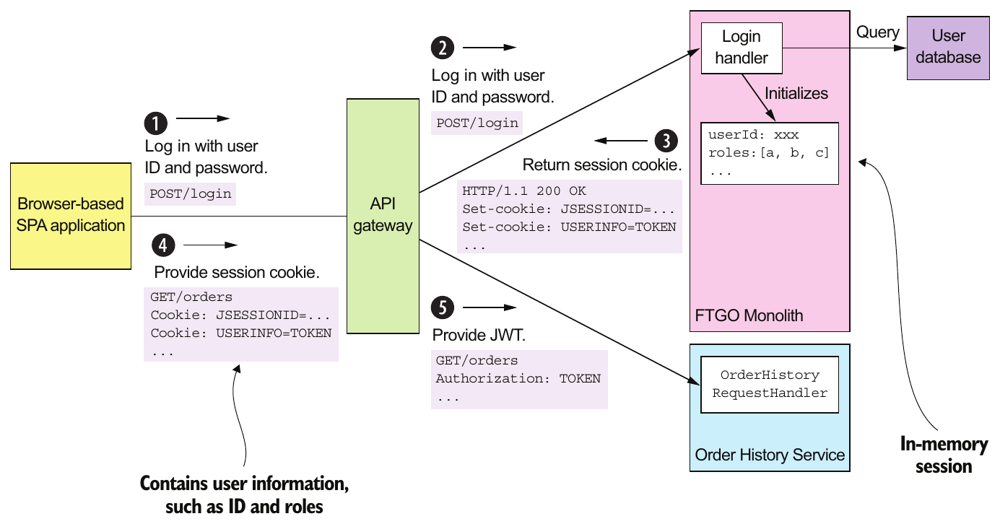

> **English:** Figure 13.13 The login handler is enhanced to set a USERINFO cookie, which is a JWT containing user information. API Gateway transfers the USERINFO cookie to an authorization header when it invokes a service.
>
> **Türkçe:** Şekil 13.13 Oturum açma işleyicisi, kullanıcı bilgilerini içeren bir JWT olan USERINFO çerezini ayarlayacak biçimde geliştirilir. API Gateway, bir servisi çağırırken USERINFO çerezini Authorization başlığına aktarır.

<!-- source-record: u13_0222 -->

> **English:** The sequence of events is as follows:
>
> **Türkçe:** Olayların sırası şöyledir:

<!-- source-record: u13_0223 -->

> **English:** 1 The client makes a login request containing the user’s credentials.
>
> **Türkçe:** 1 İstemci, kullanıcının kimlik bilgilerini içeren bir oturum açma isteği gönderir.

<!-- source-record: u13_0224 -->

> **English:** 2 API Gateway routes the login request to the FTGO monolith.
>
> **Türkçe:** 2 API Gateway, oturum açma isteğini FTGO monolitine yönlendirir.

<!-- source-record: u13_0225 -->

> **English:** 3 The monolith returns a response containing the JSESSIONID session cookie and the USERINFO cookie, which contains the user information, such as ID and roles.
>
> **Türkçe:** 3 Monolit, JSESSIONID oturum çerezini ve ID ile roller gibi kullanıcı bilgilerini içeren USERINFO çerezini taşıyan bir yanıt döndürür.

<!-- source-record: u13_0226 -->

> **English:** 4 The client makes a request, which includes the USERINFO cookie, in order to invoke an operation.
>
> **Türkçe:** 4 İstemci, bir işlemi çağırmak için USERINFO çerezini içeren bir istek gönderir.

<!-- source-record: u13_0227 -->

> **English:** 5 API Gateway validates the USERINFO cookie and includes it in the Authorization header of the request that it makes to the service. The service validates the USERINFO token and extracts the user information.
>
> **Türkçe:** 5 API Gateway, USERINFO çerezini doğrular ve servise yaptığı isteğin Authorization başlığına ekler. Servis, USERINFO token'ını doğrular ve kullanıcı bilgilerini çıkarır.

<!-- source-record: u13_0228 -->

> **English:** Let’s look at LoginHandler and API Gateway in more detail.
>
> **Türkçe:** LoginHandler ve API Gateway'e daha ayrıntılı bakalım.

<!-- source-record: u13_0229 -->

#### THE MONOLITH’S LOGINHANDLER SETS THE USERINFO COOKIE — MONOLİTİN LOGINHANDLER'I USERINFO ÇEREZİNİ AYARLAR

<!-- source-record: u13_0230 -->

> **English:** LoginHandler processes the POST of the user’s credentials. It authenticates the user and stores information about the user in the session. It’s often implemented by a security framework, such as Spring Security or Passport for NodeJS. If the application is configured to use the default in-memory session, the HTTP response sets a session cookie, such as JSESSIONID. In order to support the migration to microservices, LoginHandler must also set the USERINFO cookie containing the JWT that describes the user.
>
> **Türkçe:** LoginHandler, kullanıcının kimlik bilgilerinin gönderildiği POST isteğini işler. Kullanıcının kimliğini doğrular ve kullanıcıya ilişkin bilgileri oturumda saklar. Genellikle Spring Security veya NodeJS için Passport gibi bir güvenlik framework'üyle gerçekleştirilir. Uygulama varsayılan bellek içi oturumu kullanacak biçimde yapılandırılmışsa HTTP yanıtı, JSESSIONID gibi bir oturum çerezi ayarlar. Mikroservislere geçişi desteklemek için LoginHandler, kullanıcıyı tanımlayan JWT'yi içeren USERINFO çerezini de ayarlamalıdır.

<!-- source-pages: 455 -->

<!-- source-record: u13_0231 -->

#### THE API GATEWAY MAPS THE USERINFO COOKIE TO THE AUTHORIZATION HEADER — API GATEWAY, USERINFO ÇEREZİNİ AUTHORIZATION BAŞLIĞINA EŞLER

<!-- source-record: u13_0232 -->

> **English:** The API gateway, as described in chapter 8, is responsible for request routing and API composition. It handles each request by making one or more requests to the monolith and the services. When the API gateway invokes a service, it validates the USERINFO cookie and passes it to the service in the HTTP request’s Authorization header. By mapping the cookie to the Authorization header, the API gateway ensures that it passes the user identity to the service in a standard way that’s independent of the type of client.
>
> **Türkçe:** Bölüm 8'de anlatıldığı gibi API gateway, istek yönlendirme ve API composition'dan (API birleştirme) sorumludur. Her isteği monolite ve servislere bir veya daha fazla istek yaparak işler. API gateway bir servisi çağırırken USERINFO çerezini doğrular ve HTTP isteğinin Authorization başlığında servise iletir. Çerezi Authorization başlığına eşleyerek kullanıcı kimliğinin, istemci türünden bağımsız standart bir yolla servise aktarılmasını sağlar.

<!-- source-record: u13_0233 -->

> **English:** Eventually, we’ll most likely extract login and user management into services. But as you can see, by only making one small change to the monolith’s login handler, it’s now possible for services to access user information. This enables you to focus on developing services that provide the greatest value to the business and delay extracting less valuable services, such as user management.
>
> **Türkçe:** Sonunda oturum açma ve kullanıcı yönetimini büyük olasılıkla servislere çıkaracağız. Ancak gördüğünüz gibi monolitin oturum açma işleyicisinde tek bir küçük değişiklik yaparak servislerin kullanıcı bilgilerine erişmesi artık mümkündür. Böylece işletmeye en çok değer sağlayan servisleri geliştirmeye odaklanabilir, kullanıcı yönetimi gibi daha az değer sağlayan servislerin çıkarılmasını erteleyebilirsiniz.

<!-- source-record: u13_0234 -->

> **English:** Now that we’ve looked at how to handle security when refactoring to microservices, let’s see an example of implementing a new feature as a service.
>
> **Türkçe:** Mikroservislere yeniden düzenleme sırasında güvenliğin nasıl ele alınacağını gördük. Şimdi yeni bir özelliği servis olarak geliştirme örneğine bakalım.

<!-- source-record: u13_0235 -->

## 13.4 Implementing a new feature as a service: handling misdelivered orders — Yeni bir özelliği servis olarak geliştirmek: teslimat sorunu yaşanan siparişleri ele almak

<!-- source-record: u13_0236 -->

> **English:** Let’s say you’ve been tasked with improving how FTGO handles misdelivered orders. A growing number of customers have been complaining about how customer service handles orders not being delivered. The majority of orders are delivered on time, but from time to time orders are either delivered late or not at all. For example, the courier gets delayed by unexpectedly bad traffic, so the order is picked up and delivered late. Or perhaps by the time the courier arrives at the restaurant, it’s closed, and the delivery can’t be made. To make matters worse, the first time customer service hears about the misdelivery is when they receive an angry email from an unhappy customer.
>
> **Türkçe:** FTGO'nun teslimat sorunu yaşanan siparişleri ele alışını iyileştirmekle görevlendirildiğinizi düşünelim. Giderek daha fazla müşteri, müşteri hizmetlerinin teslim edilmeyen siparişleri ele alışından şikâyet ediyor. Siparişlerin büyük çoğunluğu zamanında teslim ediliyor, ancak ara sıra bazıları geç teslim ediliyor veya hiç teslim edilemiyor. Örneğin kurye beklenmedik yoğun trafik nedeniyle gecikiyor ve sipariş restorandan geç alınıp geç teslim ediliyor. Ya da kurye restorana vardığında restoran kapanmış oluyor ve teslimat yapılamıyor. Daha da kötüsü, müşteri hizmetleri teslimat sorununu ilk kez mutsuz bir müşteriden öfkeli bir e-posta aldığında öğreniyor.

<!-- source-record: u13_0237 -->

### A true story: My missing ice cream — Gerçek bir öykü: Kayıp dondurmam

<!-- source-record: u13_0238 -->

> **English:** One Saturday night I was feeling lazy and placed an order using a well-known food delivery app to have ice cream delivered from Smitten. It never showed up. The only communication from the company was an email the next morning saying my order had been canceled. I also got a voicemail from a very confused customer service agent who clearly didn’t know what she was calling about. Perhaps the call was prompted by one of my tweets describing what happened. Clearly, the delivery company had not established any mechanisms for properly handling inevitable mistakes.
>
> **Türkçe:** Bir cumartesi akşamı üşengeçliğim tuttu ve tanınmış bir yemek teslimat uygulamasını kullanarak Smitten'dan dondurma sipariş ettim. Hiç gelmedi. Şirketten gelen tek ileti, ertesi sabah siparişimin iptal edildiğini söyleyen bir e-postaydı. Ayrıca neden aradığını açıkça bilmeyen, kafası çok karışmış bir müşteri hizmetleri temsilcisinden sesli mesaj aldım. Belki de yaşananları anlattığım tweet'lerden biri aramayı tetiklemişti. Teslimat şirketi, kaçınılmaz hataları uygun biçimde ele alacak hiçbir mekanizma kurmamıştı.

> **English:** The root cause for many of these delivery problems is the primitive delivery scheduling algorithm used by the FTGO application. A more sophisticated scheduler is under development but won’t be finished for a few months. The interim solution is for FTGO to proactively handle delayed or canceled orders by apologizing to the customer, and in some cases offering compensation before the customer complains.
>
> **Türkçe:** Bu teslimat sorunlarının birçoğunun temel nedeni, FTGO uygulamasının kullandığı ilkel teslimat planlama algoritmasıdır. Daha gelişmiş bir planlayıcı geliştiriliyor, ancak birkaç ay daha tamamlanmayacak. Geçici çözüm, FTGO'nun geciken veya iptal edilen siparişleri, müşteri şikâyet etmeden önce özür dileyerek ve bazı durumlarda telafi sunarak proaktif biçimde ele almasıdır.

<!-- source-pages: 456 -->

<!-- source-record: u13_0239 -->

> **English:** Your job is to implement a new feature that will do the following:
>
> **Türkçe:** Göreviniz, şunları yapacak yeni bir özellik geliştirmektir:

<!-- source-record: u13_0240 -->

> **English:** 1 Notify the customer when their order won’t be delivered on time.
>
> **Türkçe:** 1 Sipariş zamanında teslim edilemeyecekse müşteriye bildirmek.

<!-- source-record: u13_0241 -->

> **English:** 2 Notify the customer when their order can’t be delivered because it can’t be picked up before the restaurant closes.
>
> **Türkçe:** 2 Sipariş, restoran kapanmadan alınamayacağı için teslim edilemeyecekse müşteriye bildirmek.

<!-- source-record: u13_0242 -->

> **English:** 3 Notify customer service when an order can’t be delivered on time so that they can proactively rectify the situation by compensating the customer.
>
> **Türkçe:** 3 Sipariş zamanında teslim edilemeyecekse müşteri hizmetlerine bildirmek; böylece müşteriye telafi sunarak durumu önceden düzeltebilmelerini sağlamak.

<!-- source-record: u13_0243 -->

> **English:** 4 Track delivery statistics.
>
> **Türkçe:** 4 Teslimat istatistiklerini izlemek.

<!-- source-record: u13_0244 -->

> **English:** This new feature is fairly simple. The new code must track the state of each Order, and if an Order can’t be delivered as promised, the code must notify the customer and customer support, by, for example, sending an email.
>
> **Türkçe:** Bu yeni özellik oldukça basittir. Yeni kod her Order'ın durumunu izlemeli; bir Order söz verildiği gibi teslim edilemeyecekse örneğin e-posta göndererek müşteriyi ve müşteri destek ekibini bilgilendirmelidir.

<!-- source-record: u13_0245 -->

> **English:** But how—or perhaps more precisely, where—should you implement this new feature? One approach is to implement a new module in the monolith. The problem there is that developing and testing this code will be difficult. What’s more, this approach increases the size of the monolith and thereby makes monolith hell even worse. Remember the Law of Holes from earlier: when you’re in a hole, it’s best to stop digging. Rather than make the monolith larger, a much better approach is to implement these new features as a service.
>
> **Türkçe:** Peki bu yeni özelliği nasıl — daha doğrusu nerede — geliştirmelisiniz? Bir yaklaşım, monolitte yeni bir modül oluşturmaktır. Bunun sorunu, kodu geliştirmenin ve test etmenin zor olmasıdır. Üstelik bu yaklaşım monoliti büyütür ve monolitik cehennemi daha da kötüleştirir. Önceki Çukur Yasası'nı hatırlayın: Bir çukurdaysanız kazmayı bırakmak en iyisidir. Monoliti büyütmek yerine bu yeni özellikleri servis olarak geliştirmek çok daha iyi bir yaklaşımdır.

<!-- source-record: u13_0246 -->

### 13.4.1 The design of Delayed Delivery Service — Delayed Delivery Service'in tasarımı

<!-- source-record: u13_0247 -->

> **English:** We’ll implement this feature as a service called Delayed Order Service. Figure 13.14 shows the FTGO application’s architecture after implementing this service. The application consists of the FTGO monolith, the new Delayed Delivery Service, and an API Gateway. Delayed Delivery Service has an API that defines a single query operation called getDelayedOrders(), which returns the currently delayed or undeliverable orders. API Gateway routes the getDelayedOrders() request to the service and all other requests to the monolith. The integration glue provides Delayed Order Service with access to the monolith’s data.
>
> **Türkçe:** Bu özelliği Delayed Order Service adlı bir servis olarak geliştireceğiz. Şekil 13.14, bu servis gerçekleştirildikten sonraki FTGO uygulamasının mimarisini gösterir. Uygulama FTGO monolitinden, yeni Delayed Delivery Service'ten ve bir API Gateway'den oluşur. Delayed Delivery Service'in API'si, o anda gecikmiş veya teslim edilemez durumda olan siparişleri döndüren getDelayedOrders() adlı tek bir sorgu işlemi tanımlar. API Gateway, getDelayedOrders() isteğini servise, diğer tüm istekleri monolite yönlendirir. Bütünleştirme bağlantısı, Delayed Order Service'in monolitin verilerine erişmesini sağlar.

> **Editör notu — servis adları:** Kaynak geciken siparişleri izleyen aynı örneği Delayed Order Service ve Delayed Delivery Service adlarıyla anmaktadır. İzleyen Kısım 13.4.2 paragraflarındaki kısaltılmış “Delivery Service” kullanımı da burada bu izleme servisini anlatır. Kısım 13.5’te çıkarılan asıl Delivery Service ise teslimat planlamasından sorumludur. İngilizce adlar kaynakta oldukları biçimde korunmuştur.

<!-- source-record: u13_0248 -->

> **English:** The Delayed Order Service’s domain model consists of various entities, including DelayedOrderNotification, Order, and Restaurant. The core logic is implemented by the DelayedOrderService class. It’s periodically invoked by a timer to find orders that won’t be delivered on time. It does that by querying Orders and Restaurants. If an Order can’t be delivered on time, DelayedOrderService notifies the consumer and customer service. Delayed Order Service doesn’t own the Order and Restaurant entities. Instead, this data is replicated from the FTGO monolith. What’s more, the service doesn’t store the customer contact information, but instead retrieves it from the monolith.
>
> **Türkçe:** Delayed Order Service'in domain model'i, DelayedOrderNotification, Order ve Restaurant dahil çeşitli entity'lerden oluşur. Temel mantık DelayedOrderService sınıfında gerçekleştirilir. Bu sınıf, zamanında teslim edilmeyecek siparişleri bulmak için bir timer tarafından düzenli aralıklarla çağrılır. Bunu Order ve Restaurant nesnelerini sorgulayarak yapar. Bir Order zamanında teslim edilemeyecekse DelayedOrderService tüketiciyi ve müşteri hizmetlerini bilgilendirir. Order ve Restaurant entity'lerinin sahibi Delayed Order Service değildir. Bu veriler FTGO monolitinden çoğaltılır. Ayrıca servis, müşteri iletişim bilgilerini saklamaz; bunları monolitten alır.

<!-- source-pages: 457 -->

<!-- source-record: u13_0249 -->

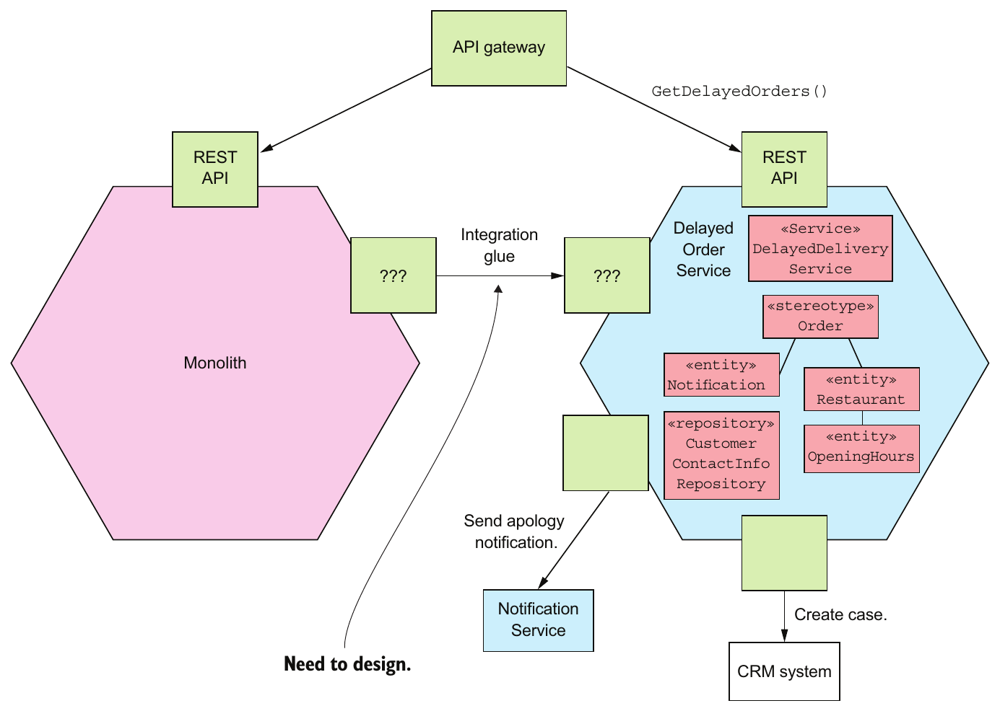

> **English:** Figure 13.14 The design of Delayed Delivery Service. The integration glue provides Delayed Delivery Service access to data owned by the monolith, such as the Order and Restaurant entities, and the customer contact information.
>
> **Türkçe:** Şekil 13.14 Delayed Delivery Service'in tasarımı. Bütünleştirme bağlantısı, servisin monolitin sahip olduğu Order ve Restaurant entity'leri ile müşteri iletişim bilgileri gibi verilere erişmesini sağlar.

<!-- source-record: u13_0250 -->

> **English:** Let’s look at the design of the integration glue that provides Delayed Order Service access to the monolith’s data.
>
> **Türkçe:** Delayed Order Service'in monolitin verilerine erişmesini sağlayan bütünleştirme bağlantısının tasarımına bakalım.

<!-- source-record: u13_0251 -->

### 13.4.2 Designing the integration glue for Delayed Delivery Service — Delayed Delivery Service için bütünleştirme bağlantısını tasarlamak

<!-- source-record: u13_0252 -->

> **English:** Even though a service that implements a new feature defines its own entity classes, it usually accesses data that’s owned by the monolith. Delayed Delivery Service is no exception. It has a DelayedOrderNotification entity, which represents a notification that it has sent to the consumer. But as I just mentioned, its Order and Restaurant entities replicate data from the FTGO monolith. It also needs to query user contact information in order to notify the user. Consequently, we need to implement integration glue that enables Delivery Service to access the monolith’s data.
>
> **Türkçe:** Yeni bir özellik gerçekleştiren servis kendi entity sınıflarını tanımlasa bile genellikle monolitin sahip olduğu verilere erişir. Delayed Delivery Service de istisna değildir. Tüketiciye gönderdiği bir bildirimi temsil eden DelayedOrderNotification entity'sine sahiptir. Ancak az önce belirttiğim gibi Order ve Restaurant entity'leri FTGO monolitindeki verilerin kopyalarıdır. Kullanıcıyı bilgilendirmek için kullanıcı iletişim bilgilerini de sorgulaması gerekir. Bu nedenle Delivery Service'in monolitin verilerine erişmesini sağlayan bütünleştirme bağlantısını gerçekleştirmeliyiz.

<!-- source-record: u13_0253 -->

> **English:** Figure 13.15 shows the design of the integration glue. The FTGO monolith publishes Order and Restaurant domain events. Delivery Service consumes these events and updates its replicas of those entities. The FTGO monolith implements a REST endpoint for querying the customer contact information. Delivery Service calls this endpoint when it needs to notify a user that their order cannot be delivered on time.
>
> **Türkçe:** Şekil 13.15 bütünleştirme bağlantısının tasarımını gösterir. FTGO monoliti Order ve Restaurant domain event'leri yayımlar. Delivery Service bu olayları tüketir ve ilgili entity kopyalarını günceller. FTGO monoliti, müşteri iletişim bilgilerini sorgulamak için bir REST endpoint'i gerçekleştirir. Delivery Service, kullanıcıya siparişinin zamanında teslim edilemeyeceğini bildirmesi gerektiğinde bu endpoint'i çağırır.

<!-- source-pages: 458 -->

<!-- source-record: u13_0254 -->

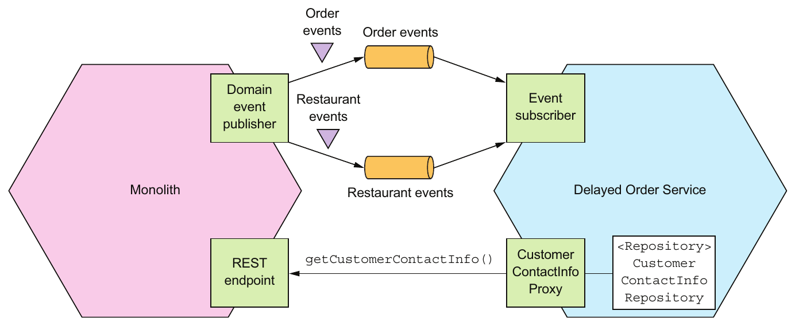

> **English:** Figure 13.15 The integration glue provides Delayed Delivery Service with access to the data owned by the monolith.
>
> **Türkçe:** Şekil 13.15 Bütünleştirme bağlantısı, Delayed Delivery Service'in monolitin sahip olduğu verilere erişmesini sağlar.

<!-- source-record: u13_0255 -->

> **English:** Let’s look at the design of each part of the integration, starting with the REST API for retrieving customer contact information.
>
> **Türkçe:** Müşteri iletişim bilgilerini almaya yarayan REST API'den başlayarak bütünleştirmenin her parçasının tasarımına bakalım.

<!-- source-record: u13_0256 -->

#### QUERYING CUSTOMER CONTACT INFORMATION USING CUSTOMERCONTACTINFOREPOSITORY — CUSTOMERCONTACTINFOREPOSITORY İLE MÜŞTERİ İLETİŞİM BİLGİLERİNİ SORGULAMAK

<!-- source-record: u13_0257 -->

> **English:** As described in section 13.3.1, there are a couple of different ways that a service such as Delayed Delivery Service could read the monolith’s data. The simplest option is for Delayed Order Service to retrieve data using the monolith’s query API. This approach makes sense when retrieving the User contact information. There aren’t any latency or performance issues because Delayed Delivery Service rarely needs to retrieve a user’s contact information, and the amount of data is quite small. CustomerContactInfoRepository is an interface that enables Delayed Delivery Service to retrieve a consumer’s contact info. It’s implemented by a CustomerContactInfoProxy, which retrieves the user information by invoking the monolith’s getCustomerContactInfo() REST endpoint.
>
> **Türkçe:** Kısım 13.3.1'de anlatıldığı gibi Delayed Delivery Service benzeri bir servisin monolitin verilerini okumasının birkaç farklı yolu vardır. En basit seçenek, Delayed Order Service'in monolitin sorgu API'sini kullanarak veri almasıdır. User iletişim bilgilerini alırken bu yaklaşım anlamlıdır. Delayed Delivery Service kullanıcının iletişim bilgilerini nadiren aldığı ve veri miktarı oldukça küçük olduğu için gecikme veya performans sorunu yoktur. CustomerContactInfoRepository, Delayed Delivery Service'in tüketicinin iletişim bilgilerini almasını sağlayan bir arayüzdür. Bu arayüzü, monolitin getCustomerContactInfo() REST endpoint'ini çağırarak kullanıcı bilgilerini alan CustomerContactInfoProxy gerçekleştirir.

<!-- source-record: u13_0258 -->

#### PUBLISHING AND CONSUMING ORDER AND RESTAURANT DOMAIN EVENTS — ORDER VE RESTAURANT DOMAIN EVENT'LERİNİ YAYIMLAMAK VE TÜKETMEK

<!-- source-record: u13_0259 -->

> **English:** Unfortunately, it isn’t practical for Delayed Delivery Service to query the monolith for the state of all open Orders and Restaurant hours. That’s because it’s inefficient to repeatedly transfer a large amount of data over the network. Consequently, Delayed Delivery Service must use the second, more complex option and maintain a replica of Orders and Restaurants by subscribing to events published by the monolith. It’s important to remember that the replica isn’t a complete copy of the data from the monolith—it just stores a small subset of the attributes of Order and Restaurant entities.
>
> **Türkçe:** Ne yazık ki Delayed Delivery Service'in tüm açık Order nesnelerinin durumunu ve Restaurant çalışma saatlerini monolite sorgulatması uygulanabilir değildir. Çünkü büyük miktarda veriyi ağ üzerinden tekrar tekrar aktarmak verimsizdir. Bu nedenle Delayed Delivery Service ikinci ve daha karmaşık seçeneği kullanmalı; monolitin yayımladığı olaylara abone olarak Order ve Restaurant kopyalarını tutmalıdır. Kopyanın monolitteki verilerin tamamını içermediğini hatırlamak önemlidir: Yalnızca Order ve Restaurant entity'lerinin niteliklerinin küçük bir alt kümesini saklar.

<!-- source-pages: 459 -->

<!-- source-record: u13_0260 -->

> **English:** As described earlier in section 13.3.1, there are a couple of different ways that we can change the FTGO monolith so that it publishes Order and Restaurant domain events. One option is to modify all the places in the monolith that update Orders and Restaurants to publish high-level domain events. The second option is to tail the transaction log to replicate the changes as events. In this particular scenario, we need to synchronize the two databases. We don’t require the FTGO monolith to publish high-level domain events, so either approach is fine. Delayed Order Service implements event handlers that subscribe to events from the monolith and update its Order and Restaurant entities. The details of the event handlers depend on whether the monolith publishes specific high-level events or low-level change events. In either case, you can think of an event handler as translating an event in the monolith’s bounded context to the update of an entity in the service’s bounded context.
>
> **Türkçe:** Kısım 13.3.1'de anlatıldığı gibi FTGO monolitini Order ve Restaurant domain event'leri yayımlayacak şekilde değiştirmenin birkaç yolu vardır. Bir seçenek, monolitte Order ve Restaurant nesnelerini güncelleyen tüm yerleri üst düzey domain event yayımlayacak biçimde değiştirmektir. İkinci seçenek, transaction log'u izleyerek değişiklikleri olaylar biçiminde çoğaltmaktır. Bu senaryoda iki veritabanını eşzamanlı tutmalıyız. FTGO monolitinin üst düzey domain event yayımlamasına ihtiyacımız olmadığından her iki yaklaşım da uygundur. Delayed Order Service, monolitten gelen olaylara abone olan ve kendi Order ile Restaurant entity'lerini güncelleyen olay işleyiciler gerçekleştirir. İşleyicilerin ayrıntıları, monolitin belirli üst düzey olaylar mı yoksa alt düzey değişiklik olayları mı yayımladığına bağlıdır. Her iki durumda da olay işleyiciyi, monolitin bounded context'indeki (sınırlı bağlamındaki) bir olayı, servisin bounded context'indeki bir entity güncellemesine dönüştüren yapı olarak düşünebilirsiniz.

<!-- source-record: u13_0261 -->

> **English:** An important benefit of using a replica is that it enables Delayed Order Service to efficiently query the orders and the restaurant opening hours. One drawback, however, is that it’s more complex. Another drawback is that it requires the monolith to publish the necessary Order and Restaurant events. Fortunately, because Delayed Delivery Service only needs what’s essentially a subset of the columns of the ORDERS and RESTAURANT tables, we shouldn’t encounter the problems described in section 13.3.1.
>
> **Türkçe:** Kopya kullanmanın önemli bir yararı, Delayed Order Service'in siparişleri ve restoranların açık olduğu saatleri verimli biçimde sorgulayabilmesidir. Ancak bir sakıncası daha karmaşık olmasıdır. Başka bir sakıncası, monolitin gerekli Order ve Restaurant olaylarını yayımlamasını gerektirmesidir. Neyse ki Delayed Delivery Service'in esasen yalnızca ORDERS ve RESTAURANT tablolarındaki sütunların bir alt kümesine ihtiyacı olduğu için Kısım 13.3.1'de anlatılan sorunlarla karşılaşmamamız gerekir.

<!-- source-record: u13_0262 -->

> **English:** Implementing a new feature such as delayed order management as a standalone service accelerates its development, testing, and deployment. What’s more, it enables you to implement the feature using a brand new technology stack instead of the monolith’s older one. It also stops the monolith from growing. Delayed order management is just one of many new features planned for the FTGO application. The FTGO team can implement many of these features as separate services.
>
> **Türkçe:** Geciken sipariş yönetimi gibi yeni bir özelliği bağımsız servis olarak geliştirmek, geliştirilmesini, test edilmesini ve dağıtılmasını hızlandırır. Üstelik özelliği monolitin eski teknoloji yığını yerine tamamen yeni bir teknoloji yığınıyla gerçekleştirmenizi sağlar. Monolitin büyümesini de durdurur. Geciken sipariş yönetimi, FTGO uygulaması için planlanan çok sayıda yeni özellikten yalnızca biridir. FTGO ekibi bunların çoğunu ayrı servisler olarak geliştirebilir.

<!-- source-record: u13_0263 -->

> **English:** Unfortunately, you can’t implement all changes as new services. Quite often you must make extensive changes to the monolith to implement new features or change existing features. Any development involving the monolith will most likely be slow and painful. If you want to accelerate the delivery of these features, you must break up the monolith by migrating functionality from the monolith into services. Let’s look at how to do that.
>
> **Türkçe:** Ne yazık ki tüm değişiklikleri yeni servisler olarak gerçekleştiremezsiniz. Yeni özellikler geliştirmek veya mevcut özellikleri değiştirmek için çoğu zaman monolitte kapsamlı değişiklikler yapmanız gerekir. Monoliti içeren geliştirme işleri büyük olasılıkla yavaş ve sancılı olur. Bu özelliklerin teslimatını hızlandırmak istiyorsanız işlevleri monolitten servislere taşıyarak monoliti parçalamalısınız. Bunu nasıl yapacağınıza bakalım.

<!-- source-record: u13_0264 -->

## 13.5 Breaking apart the monolith: extracting delivery management — Monoliti parçalamak: teslimat yönetimini çıkarmak

<!-- source-record: u13_0265 -->

> **English:** To accelerate the delivery of features that are implemented by a monolith, you need to break up the monolith into services. For example, let’s imagine that you want to enhance FTGO delivery management by implementing a new routing algorithm. A major obstacle to developing delivery management is that it’s entangled with order management and is part of the monolithic code base. Developing, testing, and deploying delivery management is likely to be slow. In order to accelerate its development, you need to extract delivery management into a Delivery Service.
>
> **Türkçe:** Monolitin gerçekleştirdiği özelliklerin teslimatını hızlandırmak için monoliti servislere bölmeniz gerekir. Örneğin yeni bir yönlendirme algoritması geliştirerek FTGO teslimat yönetimini iyileştirmek istediğinizi düşünelim. Teslimat yönetimini geliştirmenin büyük bir engeli, sipariş yönetimiyle iç içe geçmiş ve monolitik kod tabanının parçası olmasıdır. Teslimat yönetimini geliştirmek, test etmek ve dağıtmak muhtemelen yavaş olacaktır. Geliştirmeyi hızlandırmak için teslimat yönetimini bir Delivery Service'e çıkarmalısınız.

<!-- source-pages: 460 -->

<!-- source-record: u13_0266 -->

> **English:** I start this section by describing delivery management and how it’s currently embedded within the monolith. Next I discuss the design of the new, standalone Delivery Service and its API. I then describe how Delivery Service and the FTGO monolith collaborate. Finally I talk about some of the changes we need to make to the monolith to support Delivery Service.
>
> **Türkçe:** Bu kısma, teslimat yönetimini ve monolitin içine şu anda nasıl gömülü olduğunu anlatarak başlıyorum. Ardından yeni, bağımsız Delivery Service'in ve API'sinin tasarımını tartışıyorum. Sonra Delivery Service ile FTGO monolitinin nasıl iş birliği yaptığını açıklıyorum. Son olarak Delivery Service'i desteklemek için monolitte yapmamız gereken bazı değişiklikleri ele alıyorum.

<!-- source-record: u13_0267 -->

> **English:** Let’s begin by reviewing the existing design.
>
> **Türkçe:** Önce mevcut tasarımı gözden geçirelim.

<!-- source-record: u13_0268 -->

### 13.5.1 Overview of existing delivery management functionality — Mevcut teslimat yönetimi işlevine genel bakış

<!-- source-record: u13_0269 -->

> **English:** Delivery management is responsible for scheduling the couriers that pick up orders at restaurants and deliver them to consumers. Each courier has a plan that is a schedule of pickup and deliver actions. A pickup action tells the Courier to pick up an order from a restaurant at a particular time. A deliver action tells the Courier to deliver an order to a consumer. The plans are revised whenever orders are placed, canceled, or revised, and as the location and availability of couriers changes.
>
> **Türkçe:** Teslimat yönetimi, siparişleri restoranlardan alıp tüketicilere götüren kuryelerin planlanmasından sorumludur. Her kuryenin, pickup (restorandan alma) ve deliver (teslim etme) eylemlerinden oluşan bir zaman çizelgesi vardır. Pickup eylemi, Courier'a belirli bir zamanda restorandan sipariş almasını söyler. Deliver eylemi ise Courier'a siparişi tüketiciye teslim etmesini söyler. Sipariş verildiğinde, iptal edildiğinde veya değiştirildiğinde ve kuryelerin konumu ya da müsaitliği değiştiğinde planlar güncellenir.

<!-- source-record: u13_0270 -->

> **English:** Delivery management is one of the oldest parts of the FTGO application. As figure 13.16 shows, it’s embedded within order management. Much of the code for managing deliveries is in OrderService. What’s more, there’s no explicit representation of a Delivery. It’s embedded within the Order entity, which has various delivery-related fields, such as scheduledPickupTime and scheduledDeliveryTime.
>
> **Türkçe:** Teslimat yönetimi FTGO uygulamasının en eski kısımlarından biridir. Şekil 13.16'da gösterildiği gibi sipariş yönetiminin içine gömülüdür. Teslimatları yöneten kodun büyük bölümü OrderService içindedir. Üstelik açık bir Delivery temsili yoktur. Teslimat; scheduledPickupTime ve scheduledDeliveryTime gibi teslimatla ilgili çeşitli alanları olan Order entity'sinin içine gömülüdür.

<!-- source-record: u13_0271 -->

> **English:** Numerous commands implemented by the monolith invoke delivery management, including the following:
>
> **Türkçe:** Monolitin gerçekleştirdiği birçok komut teslimat yönetimini çağırır; bunlar arasında şunlar vardır:

<!-- source-record: u13_0272 -->

> **English:** • acceptOrder()—Invoked when a restaurant accepts an order and commits to preparing it by a certain time. This operation invokes delivery management to schedule a delivery.
>
> **Türkçe:** • acceptOrder() — Restoran siparişi kabul edip belirli bir zamana kadar hazırlamayı taahhüt ettiğinde çağrılır. Bu işlem, teslimat planlamak için teslimat yönetimini çağırır.

<!-- source-record: u13_0273 -->

> **English:** • cancelOrder()—Invoked when a consumer cancels an order. If necessary, it cancels the delivery.
>
> **Türkçe:** • cancelOrder() — Tüketici siparişi iptal ettiğinde çağrılır. Gerekirse teslimatı iptal eder.

<!-- source-record: u13_0274 -->

> **English:** • noteCourierLocationUpdated()—Invoked by the courier’s mobile application to update the courier’s location. It triggers the rescheduling of deliveries.
>
> **Türkçe:** • noteCourierLocationUpdated() — Kuryenin konumunu güncellemek için kuryenin mobil uygulaması tarafından çağrılır. Teslimatların yeniden planlanmasını tetikler.

<!-- source-record: u13_0275 -->

> **English:** • noteCourierAvailabilityChanged()—Invoked by the courier’s mobile application to update the courier’s availability. It triggers the rescheduling of deliveries.
>
> **Türkçe:** • noteCourierAvailabilityChanged() — Kuryenin müsaitliğini güncellemek için kuryenin mobil uygulaması tarafından çağrılır. Teslimatların yeniden planlanmasını tetikler.

<!-- source-record: u13_0276 -->

> **English:** Also, various queries retrieve data maintained by delivery management, including the following:
>
> **Türkçe:** Ayrıca çeşitli sorgular teslimat yönetiminin tuttuğu verileri alır; bunlar arasında şunlar vardır:

<!-- source-record: u13_0277 -->

> **English:** • getCourierPlan()—Invoked by the courier’s mobile application and returns the courier’s plan
>
> **Türkçe:** • getCourierPlan() — Kuryenin mobil uygulaması tarafından çağrılır ve kuryenin planını döndürür.

<!-- source-record: u13_0278 -->

> **English:** • getOrderStatus()—Returns the order’s status, which includes delivery-related information such as the assigned courier and the ETA
>
> **Türkçe:** • getOrderStatus() — Atanan kurye ve ETA (estimated time of arrival, tahmini varış zamanı) gibi teslimat bilgilerini de içeren sipariş durumunu döndürür.

<!-- source-record: u13_0279 -->

> **English:** • getOrderHistory()—Returns similar information as getOrderStatus() except about multiple orders
>
> **Türkçe:** • getOrderHistory() — Birden fazla sipariş için getOrderStatus() ile benzer bilgileri döndürür.

<!-- source-record: u13_0280 -->

> **English:** Quite often what’s extracted into a service is, as mentioned in section 13.2.3, an entire vertical slice, with controllers at the top and database tables at the bottom. We could consider the Courier-related commands and queries to be part of delivery management. After all, delivery management creates the courier plans and is the primary consumer of the Courier location and availability information. But in order to minimize the development effort, we’ll leave those operations in the monolith and just extract the core of the algorithm. Consequently, the first iteration of Delivery Service won’t expose a publicly accessible API. Instead, it will only be invoked by the monolith. Next, let’s explore the design of Delivery Service.
>
> **Türkçe:** Kısım 13.2.3'te belirtildiği gibi servise çıkarılan şey çoğu zaman üstte controller'lar, altta veritabanı tabloları bulunan bütün bir dikey dilimdir. Courier ile ilgili komut ve sorguları teslimat yönetiminin parçası olarak görebiliriz. Sonuçta teslimat yönetimi kurye planlarını oluşturur ve Courier konum ile müsaitlik bilgilerinin temel tüketicisidir. Ancak geliştirme emeğini en aza indirmek için bu işlemleri monolitte bırakıp yalnızca algoritmanın çekirdeğini çıkaracağız. Bu nedenle Delivery Service'in ilk sürümü dışarıdan erişilebilen bir API sunmayacaktır. Yalnızca monolit tarafından çağrılacaktır. Şimdi Delivery Service'in tasarımını inceleyelim.

<!-- source-pages: 461 -->

<!-- source-record: u13_0281 -->

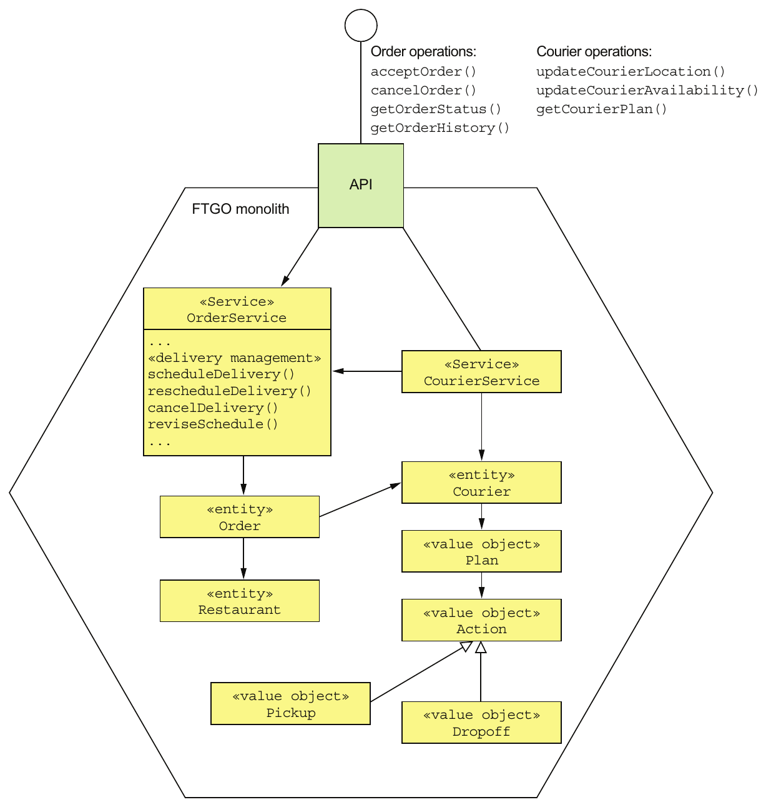

> **English:** Figure 13.16 Delivery management is entangled with order management within the FTGO monolith.
>
> **Türkçe:** Şekil 13.16 FTGO monolitinde teslimat yönetimi sipariş yönetimiyle iç içe geçmiştir.

<!-- source-pages: 462 -->

<!-- source-record: u13_0282 -->

### 13.5.2 Overview of Delivery Service — Delivery Service'e genel bakış

<!-- source-record: u13_0283 -->

> **English:** The proposed new Delivery Service is responsible for scheduling, rescheduling, and canceling deliveries. Figure 13.17 shows a high-level view of the architecture of the FTGO application after extracting Delivery Service. The architecture consists of the FTGO monolith and Delivery Service. They collaborate using the integration glue, which consists of APIs in both the service and monolith. Delivery Service has its own domain model and database.
>
> **Türkçe:** Önerilen yeni Delivery Service, teslimatları planlamak, yeniden planlamak ve iptal etmekten sorumludur. Şekil 13.17, Delivery Service çıkarıldıktan sonraki FTGO uygulamasının mimarisini üst düzeyde gösterir. Mimari FTGO monolitinden ve Delivery Service'ten oluşur. Her ikisinde de bulunan API'lerden oluşan bütünleştirme bağlantısıyla iş birliği yaparlar. Delivery Service'in kendi domain model'i ve veritabanı vardır.

<!-- source-record: u13_0284 -->

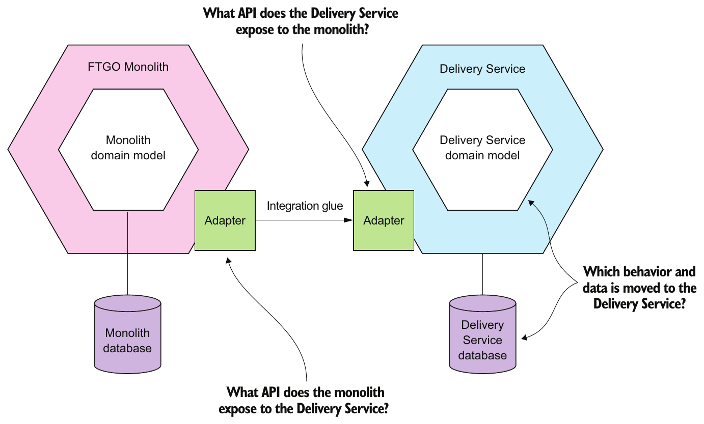

> **English:** Figure 13.17 The high-level view of the FTGO application after extracting Delivery Service. The FTGO monolith and Delivery Service collaborate using the integration glue, which consists of APIs in each of them. The two key decisions that need to be made are which functionality and data are moved to Delivery Service and how do the monolith and Delivery Service collaborate via APIs?
>
> **Türkçe:** Şekil 13.17 Delivery Service çıkarıldıktan sonraki FTGO uygulamasının üst düzey görünümü. FTGO monoliti ve Delivery Service, her ikisindeki API'lerden oluşan bütünleştirme bağlantısı üzerinden iş birliği yapar. Verilmesi gereken iki temel karar şudur: Hangi işlevler ve veriler Delivery Service'e taşınacak; monolit ve Delivery Service, API'ler üzerinden nasıl iş birliği yapacak?

<!-- source-record: u13_0285 -->

> **English:** In order to flesh out this architecture and determine the service’s domain model, we need to answer the following questions:
>
> **Türkçe:** Bu mimariyi ayrıntılandırmak ve servisin domain model'ini belirlemek için şu soruları yanıtlamamız gerekir:

<!-- source-record: u13_0286 -->

> **English:** • Which behavior and data are moved to Delivery Service?
>
> **Türkçe:** • Hangi davranışlar ve veriler Delivery Service'e taşınacak?

<!-- source-record: u13_0287 -->

> **English:** • What API does Delivery Service expose to the monolith?
>
> **Türkçe:** • Delivery Service monolite hangi API'yi sunacak?

<!-- source-record: u13_0288 -->

> **English:** • What API does the monolith expose to Delivery Service?
>
> **Türkçe:** • Monolit Delivery Service'e hangi API'yi sunacak?

<!-- source-record: u13_0289 -->

> **English:** These issues are interrelated because the distribution of responsibilities between the monolith and the service affects the APIs. For instance, Delivery Service will need to invoke an API provided by the monolith to access the data in the monolith’s database and vice versa. Later, I’ll describe the design of the integration glue that enables Delivery Service and the FTGO monolith to collaborate. But first, let’s look at the design of Delivery Service’s domain model.
>
> **Türkçe:** Bu konular birbiriyle ilişkilidir; çünkü sorumlulukların monolit ile servis arasında dağılımı API'leri etkiler. Örneğin Delivery Service, monolitin veritabanındaki verilere erişmek için monolitin sunduğu bir API'yi çağırmak zorunda olacaktır; tersi de geçerlidir. İleride Delivery Service ile FTGO monolitinin iş birliğini sağlayan bağlantının tasarımını anlatacağım. Ancak önce Delivery Service'in domain model tasarımına bakalım.

<!-- source-pages: 463 -->

<!-- source-record: u13_0290 -->

### 13.5.3 Designing the Delivery Service domain model — Delivery Service domain model'ini tasarlamak

<!-- source-record: u13_0291 -->

> **English:** To be able to extract delivery management, we first need to identify the classes that implement it. Once we’ve done that, we can decide which classes to move to Delivery Service to form its domain logic. In some cases, we’ll need to split classes. We’ll also need to decide which data to replicate between the service and the monolith.
>
> **Türkçe:** Teslimat yönetimini çıkarabilmek için önce onu gerçekleştiren sınıfları belirlemeliyiz. Ardından domain logic'i oluşturmak üzere hangi sınıfları Delivery Service'e taşıyacağımıza karar verebiliriz. Bazı durumlarda sınıfları bölmemiz gerekir. Servis ile monolit arasında hangi verilerin çoğaltılacağını da belirlemeliyiz.

<!-- source-record: u13_0292 -->

> **English:** Let’s start by identifying the classes that implement delivery management.
>
> **Türkçe:** Teslimat yönetimini gerçekleştiren sınıfları belirleyerek başlayalım.

<!-- source-record: u13_0293 -->

#### IDENTIFYING WHICH ENTITIES AND THEIR FIELDS ARE PART OF DELIVERY MANAGEMENT — TESLİMAT YÖNETİMİNİN PARÇASI OLAN ENTITY'LERİ VE ALANLARINI BELİRLEMEK

<!-- source-record: u13_0294 -->

> **English:** The first step in the process of designing Delivery Service is to carefully review the delivery management code and identify the participating entities and their fields. Figure 13.18 shows the entities and fields that are part of delivery management. Some fields are inputs to the delivery-scheduling algorithm, and others are the outputs. The figure shows which of those fields are also used by other functionality implemented by the monolith.
>
> **Türkçe:** Delivery Service'i tasarlama sürecinin ilk adımı, teslimat yönetimi kodunu dikkatle incelemek ve kullanılan entity'ler ile alanlarını belirlemektir. Şekil 13.18, teslimat yönetiminin parçası olan entity'leri ve alanları gösterir. Bazı alanlar teslimat planlama algoritmasının girdileri, diğerleri çıktılarıdır. Şekil, bu alanlardan hangilerinin monolitin gerçekleştirdiği diğer işlevler tarafından da kullanıldığını gösterir.

<!-- source-record: u13_0295 -->

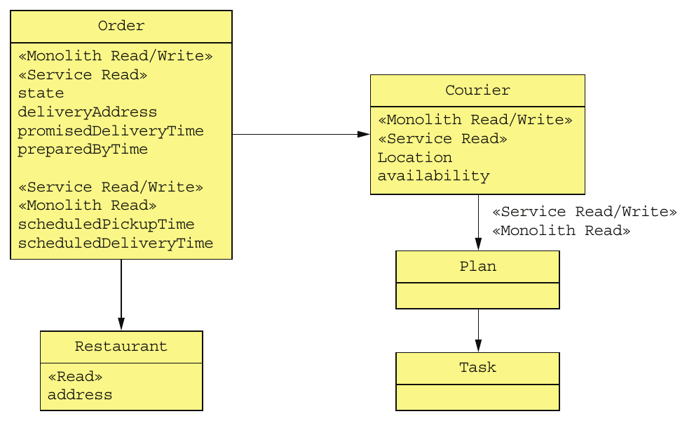

> **English:** Figure 13.18 The entities and fields that are accessed by delivery management and other functionality implemented by the monolith. A field can be read or written or both. It can be accessed by delivery management, the monolith, or both.
>
> **Türkçe:** Şekil 13.18 Teslimat yönetiminin ve monolitin diğer işlevlerinin eriştiği entity'ler ve alanlar. Bir alan okunabilir, yazılabilir veya her ikisi yapılabilir. Alana teslimat yönetimi, monolit veya her ikisi erişebilir.

<!-- source-record: u13_0296 -->

> **English:** The delivery scheduling algorithm reads various attributes including the Order’s restaurant, promisedDeliveryTime, and deliveryAddress, and the Courier’s location, availability, and current plans. It updates the Courier’s plans, the Order’s scheduledPickupTime, and scheduledDeliveryTime. As you can see, the fields used by delivery management are also used by the monolith.
>
> **Türkçe:** Teslimat planlama algoritması, Order'ın restaurant, promisedDeliveryTime ve deliveryAddress alanları ile Courier'ın konumu, müsaitliği ve mevcut planları dahil çeşitli nitelikleri okur. Courier'ın planlarını, Order'ın scheduledPickupTime ve scheduledDeliveryTime alanlarını günceller. Gördüğünüz gibi teslimat yönetiminin kullandığı alanlar monolit tarafından da kullanılır.

<!-- source-pages: 464 -->

<!-- source-record: u13_0297 -->

#### DECIDING WHICH DATA TO MIGRATE TO DELIVERY SERVICE — HANGİ VERİLERİN DELIVERY SERVICE'E TAŞINACAĞINA KARAR VERMEK

<!-- source-record: u13_0298 -->

> **English:** Now that we’ve identified which entities and fields participate in delivery management, the next step is to decide which of them we should move to the service. In an ideal scenario, the data accessed by the service is used exclusively by the service, so we could simply move that data to the service and be done. Sadly, it’s rarely that simple, and this situation is no exception. All the entities and fields used by the delivery management are also used by other functionality implemented by the monolith.
>
> **Türkçe:** Teslimat yönetiminde hangi entity'lerin ve alanların kullanıldığını belirlediğimize göre sonraki adım, bunlardan hangilerini servise taşıyacağımıza karar vermektir. İdeal senaryoda servisin eriştiği veriler yalnızca servis tarafından kullanılır; böylece verileri servise taşıyıp işi bitirebiliriz. Ne yazık ki durum nadiren bu kadar basittir ve bu örnek de istisna değildir. Teslimat yönetiminin kullandığı tüm entity'ler ve alanlar, monolitin diğer işlevleri tarafından da kullanılır.

<!-- source-record: u13_0299 -->

> **English:** As a result, when determining which data to move to the service, we need to keep in mind two issues. The first is: how does the service access the data that remains in the monolith? The second is: how does the monolith access data that’s moved to the service? Also, as described earlier in section 13.3, we need to carefully consider how to maintain data consistency between the service and the monolith.
>
> **Türkçe:** Bu nedenle servise taşınacak verileri belirlerken iki konuyu göz önünde tutmalıyız. Birincisi, servis monolitte kalan verilere nasıl erişecek? İkincisi, monolit servise taşınan verilere nasıl erişecek? Ayrıca Kısım 13.3'te anlatıldığı gibi servis ile monolit arasındaki veri tutarlılığının nasıl korunacağını dikkatle değerlendirmeliyiz.

<!-- source-record: u13_0300 -->

> **English:** The essential responsibility of Delivery Service is managing courier plans and updating the Order’s scheduledPickupTime and scheduledDeliveryTime fields. It makes sense, therefore, for it to own those fields. We could also move the Courier.location and Courier.availability fields to Delivery Service. But because we’re trying to make the smallest possible change, we’ll leave those fields in the monolith for now.
>
> **Türkçe:** Delivery Service'in temel sorumluluğu, kurye planlarını yönetmek ve Order'ın scheduledPickupTime ile scheduledDeliveryTime alanlarını güncellemektir. Bu nedenle bu alanların sahibi olması anlamlıdır. Courier.location ve Courier.availability alanlarını da Delivery Service'e taşıyabiliriz. Ancak mümkün olan en küçük değişikliği yapmaya çalıştığımız için bu alanları şimdilik monolitte bırakacağız.

<!-- source-record: u13_0301 -->

#### THE DESIGN OF THE DELIVERY SERVICE DOMAIN LOGIC — DELIVERY SERVICE DOMAIN LOGIC'İNİN TASARIMI

<!-- source-record: u13_0302 -->

> **English:** Figure 13.19 shows the design of the Delivery Service’s domain model. The core of the service consists of domain classes such as Delivery and Courier. The DeliveryServiceImpl class is the entry point into the delivery management business logic. It implements the DeliveryService and CourierService interfaces, which are invoked by DeliveryServiceEventsHandler and DeliveryServiceNotificationsHandlers, described later in this section.
>
> **Türkçe:** Şekil 13.19, Delivery Service'in domain model tasarımını gösterir. Servisin çekirdeği Delivery ve Courier gibi domain sınıflarından oluşur. DeliveryServiceImpl sınıfı, teslimat yönetimi iş mantığının giriş noktasıdır. Bu kısmın ilerleyen yerlerinde anlatılan DeliveryServiceEventsHandler ve DeliveryServiceNotificationsHandlers tarafından çağrılan DeliveryService ve CourierService arayüzlerini gerçekleştirir.

<!-- source-record: u13_0303 -->

> **English:** The delivery management business logic is mostly code copied from the monolith. For example, we’ll copy the Order entity from the monolith to Delivery Service, rename it to Delivery, and delete all fields except those used by delivery management. We’ll also copy the Courier entity and delete most of its fields. In order to develop the domain logic for Delivery Service, we will need to untangle the code from the monolith. We’ll need to break numerous dependencies, which is likely to be time consuming. Once again, it’s a lot easier to refactor code when using a statically typed language, because the compiler will be your friend. Delivery Service is not a standalone service. Let’s look at the design of the integration glue that enables Delivery Service and the FTGO monolith to collaborate.
>
> **Türkçe:** Teslimat yönetimi iş mantığı büyük ölçüde monolitten kopyalanan koddur. Örneğin Order entity'sini monolitten Delivery Service'e kopyalayacak, adını Delivery yapacak ve teslimat yönetiminin kullandıkları dışındaki tüm alanları sileceğiz. Courier entity'sini de kopyalayıp alanlarının çoğunu sileceğiz. Delivery Service'in domain logic'ini geliştirmek için monolitte iç içe geçmiş kodu ayırmamız gerekecek. Çok sayıda bağımlılığı koparmalıyız; bu muhtemelen zaman alacaktır. Yine, statically typed language (statik tür denetimli dil) kullanırken kodu yeniden düzenlemek çok daha kolaydır; çünkü derleyici size yardımcı olur. Delivery Service tek başına çalışan bir servis değildir. Delivery Service ile FTGO monolitinin iş birliğini sağlayan bağlantının tasarımına bakalım.

<!-- source-pages: 465 -->

<!-- source-record: u13_0304 -->

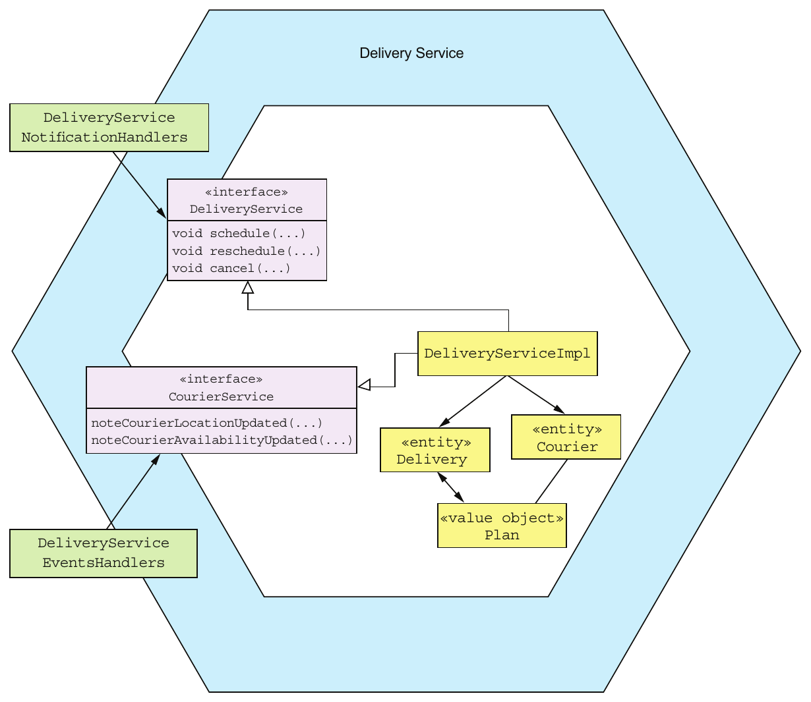

> **English:** Figure 13.19 The design of the Delivery Service's domain model
>
> **Türkçe:** Şekil 13.19 Delivery Service'in domain model tasarımı

<!-- source-record: u13_0305 -->

### 13.5.4 The design of the Delivery Service integration glue — Delivery Service bütünleştirme bağlantısının tasarımı

<!-- source-record: u13_0306 -->

> **English:** The FTGO monolith needs to invoke Delivery Service to manage deliveries. The monolith also needs to exchange data with Delivery Service. This collaboration is enabled by the integration glue. Figure 13.20 shows the design of the Delivery Service integration glue. Delivery Service has a delivery management API. It also publishes Delivery and Courier domain events. The FTGO monolith publishes Courier domain events.
>
> **Türkçe:** FTGO monoliti, teslimatları yönetmek için Delivery Service'i çağırmalıdır. Monolitin Delivery Service ile veri alışverişi yapması da gerekir. Bu iş birliğini bütünleştirme bağlantısı sağlar. Şekil 13.20, Delivery Service'in bütünleştirme bağlantısının tasarımını gösterir. Delivery Service'in bir teslimat yönetimi API'si vardır. Ayrıca Delivery ve Courier domain event'leri yayımlar. FTGO monoliti de Courier domain event'leri yayımlar.

<!-- source-record: u13_0307 -->

> **English:** Let’s look at the design of each part of the integration glue, starting with Delivery Service’s API for managing deliveries.
>
> **Türkçe:** Delivery Service'in teslimat yönetimi API'sinden başlayarak bağlantının her bir parçasının tasarımına bakalım.

<!-- source-record: u13_0308 -->

#### THE DESIGN OF THE DELIVERY SERVICE API — DELIVERY SERVICE API'SİNİN TASARIMI

<!-- source-record: u13_0309 -->

> **English:** Delivery Service must provide an API that enables the monolith to schedule, revise, and cancel deliveries. As you’ve seen throughout this book, the preferred approach is to use asynchronous messaging, because it promotes loose coupling and increases availability. One approach is for Delivery Service to subscribe to Order domain events published by the monolith. Depending on the type of the event, it creates, revises, and cancels a Delivery. A benefit of this approach is that the monolith doesn’t need to explicitly invoke Delivery Service. The drawback of relying on domain events is that it requires Delivery Service to know how each Order event impacts the corresponding Delivery.
>
> **Türkçe:** Delivery Service, monolitin teslimatları planlamasını, değiştirmesini ve iptal etmesini sağlayan bir API sunmalıdır. Kitap boyunca gördüğünüz gibi tercih edilen yaklaşım, gevşek bağlılığı desteklediği ve kullanılabilirliği artırdığı için asenkron mesajlaşmadır. Bir yaklaşım, Delivery Service'in monolitin yayımladığı Order domain event'lerine abone olmasıdır. Olayın türüne göre bir Delivery oluşturur, değiştirir veya iptal eder. Bu yaklaşımın bir yararı, monolitin Delivery Service'i açıkça çağırması gerekmemesidir. Domain event'lere dayanmanın sakıncası ise Delivery Service'in her Order olayının ilgili Delivery'yi nasıl etkilediğini bilmesini gerektirmesidir.

<!-- source-pages: 466 -->

<!-- source-record: u13_0310 -->

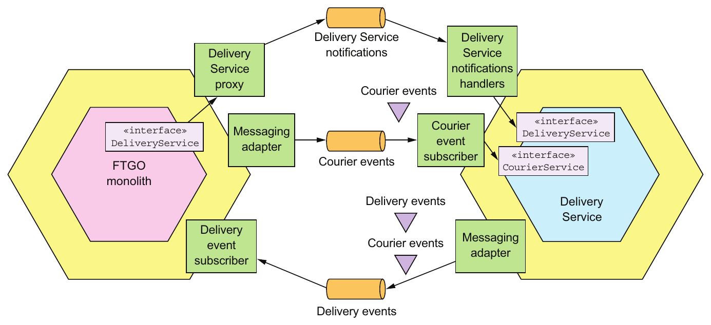

> **English:** Figure 13.20 The design of the Delivery Service integration glue. Delivery Service has a delivery management API. The service and the FTGO monolith synchronize data by exchanging domain events.
>
> **Türkçe:** Şekil 13.20 Delivery Service'in bütünleştirme bağlantısının tasarımı. Delivery Service'in bir teslimat yönetimi API'si vardır. Servis ile FTGO monoliti, domain event alışverişiyle verileri eşzamanlı tutar.

<!-- source-record: u13_0311 -->

> **English:** A better approach is for Delivery Service to implement a notification-based API that enables the monolith to explicitly tell Delivery Service to create, revise, and cancel deliveries. Delivery Service’s API consists of a message notification channel and three message types: ScheduleDelivery, ReviseDelivery, or CancelDelivery. A notification message contains Order information needed by Delivery Service. For example, a ScheduleDelivery notification contains the pickup time and location and the delivery time and location. An important benefit of this approach is that Delivery Service doesn’t have detailed knowledge of the Order lifecycle. It’s entirely focused on managing deliveries and has no knowledge of orders.
>
> **Türkçe:** Daha iyi bir yaklaşım, Delivery Service'in monolitin teslimat oluşturma, değiştirme ve iptal etme talimatlarını açıkça iletebildiği bildirim tabanlı bir API gerçekleştirmesidir. Delivery Service API'si, bir mesaj bildirim kanalı ve üç mesaj türünden oluşur: ScheduleDelivery, ReviseDelivery veya CancelDelivery. Bildirim mesajı, Delivery Service'in ihtiyaç duyduğu Order bilgilerini içerir. Örneğin ScheduleDelivery bildirimi, siparişin alınacağı zaman ve yer ile teslim edileceği zaman ve yeri içerir. Bu yaklaşımın önemli bir yararı, Delivery Service'in Order yaşam döngüsü hakkında ayrıntılı bilgi sahibi olmamasıdır. Tamamen teslimat yönetimine odaklanır ve sipariş kavramını bilmesi gerekmez.

<!-- source-record: u13_0312 -->

> **English:** This API isn’t the only way that Delivery Service and the FTGO monolith collaborate. They also need to exchange data.
>
> **Türkçe:** Delivery Service ile FTGO monolitinin iş birliği yapmasının tek yolu bu API değildir. Veri alışverişi yapmaları da gerekir.

<!-- source-record: u13_0313 -->

#### HOW THE DELIVERY SERVICE ACCESSES THE FTGO MONOLITH’S DATA — DELIVERY SERVICE, FTGO MONOLİTİNİN VERİLERİNE NASIL ERİŞİR?

<!-- source-record: u13_0314 -->

> **English:** Delivery Service needs to access the Courier location and availability data, which is owned by the monolith. Because that’s potentially a large amount of data, it’s not practical for the service to repeatedly query the monolith. Instead, a better approach is for the monolith to replicate the data to Delivery Service by publishing Courier domain events, CourierLocationUpdated and CourierAvailabilityUpdated. Delivery Service has a CourierEventSubscriber that subscribes to the domain events and updates its version of the Courier. It might also trigger the rescheduling of deliveries.
>
> **Türkçe:** Delivery Service, monolitin sahip olduğu Courier konum ve müsaitlik verilerine erişmelidir. Veri miktarı yüksek olabileceği için servisin monoliti tekrar tekrar sorgulaması uygulanabilir değildir. Daha iyi bir yaklaşım, monolitin CourierLocationUpdated ve CourierAvailabilityUpdated adlı Courier domain event'lerini yayımlayarak verileri Delivery Service'e çoğaltmasıdır. Delivery Service'teki CourierEventSubscriber, domain event'lere abone olur ve Courier'ın kendi sürümünü günceller. Teslimatların yeniden planlanmasını da tetikleyebilir.

<!-- source-pages: 467 -->

<!-- source-record: u13_0315 -->

#### HOW THE FTGO MONOLITH ACCESSES THE DELIVERY SERVICE DATA — FTGO MONOLİTİ DELIVERY SERVICE VERİLERİNE NASIL ERİŞİR?

<!-- source-record: u13_0316 -->

> **English:** The FTGO monolith needs to read the data that’s been moved to Delivery Service, such as the Courier plans. In theory, the monolith could query the service, but that requires extensive changes to the monolith. For the time being, it’s easier to leave the monolith’s domain model and database schema unchanged and replicate data from the service back to the monolith.
>
> **Türkçe:** FTGO monolitinin, Courier planları gibi Delivery Service'e taşınmış verileri okuması gerekir. Teoride monolit servisi sorgulayabilir, ancak bu monolitte kapsamlı değişiklikler gerektirir. Şimdilik monolitin domain model'ini ve veritabanı şemasını değiştirmeden bırakıp servisten monolite geri veri çoğaltmak daha kolaydır.

<!-- source-record: u13_0317 -->

> **English:** The easiest way to accomplish that is for Delivery Service to publish Courier and Delivery domain events. The service publishes a CourierPlanUpdated event when it updates a Courier’s plan, and a DeliveryScheduleUpdate event when it updates a Delivery. The monolith consumes these domain events and updates its database.
>
> **Türkçe:** Bunu başarmanın en kolay yolu, Delivery Service'in Courier ve Delivery domain event'leri yayımlamasıdır. Servis, Courier'ın planını güncellediğinde CourierPlanUpdated; bir Delivery'yi güncellediğinde DeliveryScheduleUpdate olayı yayımlar. Monolit bu domain event'leri tüketir ve kendi veritabanını günceller.

<!-- source-record: u13_0318 -->

> **English:** Now that we’ve looked at how the FTGO monolith and Delivery Service interact, let’s see how to change the monolith.
>
> **Türkçe:** FTGO monoliti ile Delivery Service'in nasıl etkileştiğini gördüğümüze göre monoliti nasıl değiştireceğimize bakalım.

<!-- source-record: u13_0319 -->

### 13.5.5 Changing the FTGO monolith to interact with Delivery Service — FTGO monolitini Delivery Service ile etkileşecek biçimde değiştirmek

<!-- source-record: u13_0320 -->

> **English:** In many ways, implementing Delivery Service is the easier part of the extraction process. Modifying the FTGO monolith is much more difficult. Fortunately, replicating data from the service back to the monolith reduces the size of the change. But we still need to change the monolith to manage deliveries by invoking Delivery Service. Let’s look at how to do that.
>
> **Türkçe:** Birçok açıdan Delivery Service'i gerçekleştirmek, servis çıkarma sürecinin daha kolay kısmıdır. FTGO monolitini değiştirmek çok daha zordur. Neyse ki servisten monolite geri veri çoğaltmak değişikliğin boyutunu azaltır. Ancak yine de monoliti, teslimatları Delivery Service'i çağırarak yönetecek biçimde değiştirmeliyiz. Bunu nasıl yapacağımıza bakalım.

<!-- source-record: u13_0321 -->

#### DEFINING A DELIVERYSERVICE INTERFACE — DELIVERYSERVICE ARAYÜZÜ TANIMLAMAK

<!-- source-record: u13_0322 -->

> **English:** The first step is to encapsulate the delivery management code with a Java interface corresponding to the messaging-based API defined earlier. This interface, shown in figure 13.21, defines methods for scheduling, rescheduling, and canceling deliveries.
>
> **Türkçe:** İlk adım, teslimat yönetimi kodunu daha önce tanımlanan mesajlaşma tabanlı API'ye karşılık gelen bir Java arayüzüyle kapsüllemektir. Şekil 13.21'de gösterilen bu arayüz, teslimatları planlamak, yeniden planlamak ve iptal etmek için metotlar tanımlar.

<!-- source-record: u13_0323 -->

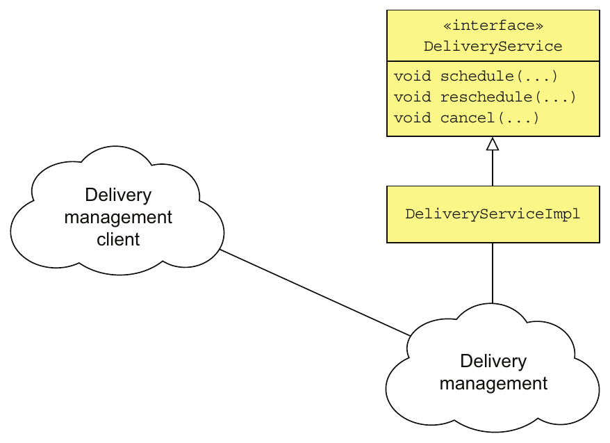

> **English:** Figure 13.21 The first step is to define DeliveryService, which is a coarse-grained, remotable API for invoking the delivery management logic.
>
> **Türkçe:** Şekil 13.21 İlk adım, teslimat yönetimi mantığını çağırmak için iri taneli ve uzaktan çağrılabilir bir API olan DeliveryService'i tanımlamaktır.

<!-- source-pages: 468 -->

<!-- source-record: u13_0324 -->

> **English:** Eventually, we’ll implement this interface with a proxy that sends messages to the delivery service. But initially, we’ll implement this API with a class that calls the delivery management code.
>
> **Türkçe:** Sonunda bu arayüzü, teslimat servisine mesaj gönderen bir proxy (vekil) ile gerçekleştireceğiz. Ancak başlangıçta API'yi, teslimat yönetimi kodunu çağıran bir sınıfla gerçekleştireceğiz.

<!-- source-record: u13_0325 -->

> **English:** The DeliveryService interface is a coarse-grained interface that’s well suited to being implemented by an IPC mechanism. It defines schedule(), reschedule(), and cancel() methods, which correspond to the notification message types defined earlier.
>
> **Türkçe:** DeliveryService, bir IPC mekanizmasıyla gerçekleştirilmeye uygun, iri taneli bir arayüzdür. Daha önce tanımlanan bildirim mesaj türlerine karşılık gelen schedule(), reschedule() ve cancel() metotlarını tanımlar.

<!-- source-record: u13_0326 -->

#### REFACTORING THE MONOLITH TO CALL THE DELIVERYSERVICE INTERFACE — MONOLİTİ DELIVERYSERVICE ARAYÜZÜNÜ ÇAĞIRACAK BİÇİMDE YENİDEN DÜZENLEMEK

<!-- source-record: u13_0327 -->

> **English:** Next, as figure 13.22 shows, we need to identify all the places in the FTGO monolith that invoke delivery management and change them to use the DeliveryService interface. This may take some time and is one of the most challenging aspects of extracting a service from the monolith.
>
> **Türkçe:** Sonra Şekil 13.22'de gösterildiği gibi FTGO monolitinde teslimat yönetimini çağıran tüm yerleri belirlemeli ve DeliveryService arayüzünü kullanacak şekilde değiştirmeliyiz. Bu zaman alabilir ve monolitten servis çıkarmanın en zor yönlerinden biridir.

<!-- source-record: u13_0328 -->

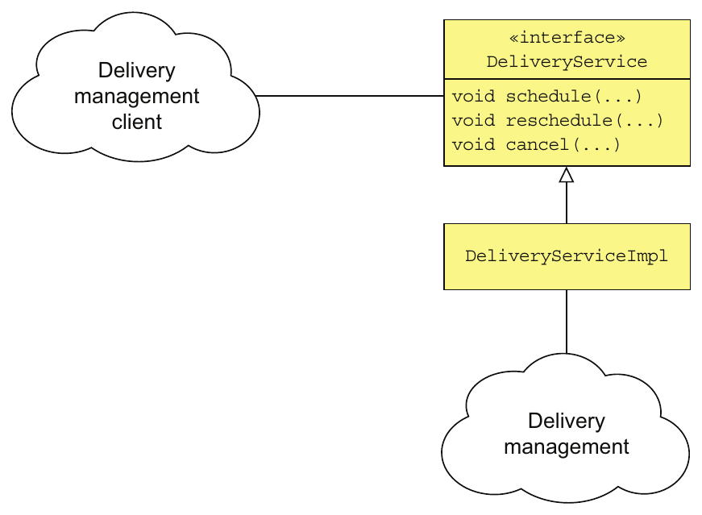

> **English:** Figure 13.22 The second step is to change the FTGO monolith to invoke delivery management via the DeliveryService interface.
>
> **Türkçe:** Şekil 13.22 İkinci adım, FTGO monolitini teslimat yönetimini DeliveryService arayüzü üzerinden çağıracak biçimde değiştirmektir.

<!-- source-record: u13_0329 -->

> **English:** It certainly helps if the monolith is written in a statically typed language, such as Java, because the tools do a better job of identifying dependencies. If not, then hopefully you have some automated tests with sufficient coverage of the parts of the code that need to be changed.
>
> **Türkçe:** Monolit Java gibi statik tür denetimli bir dilde yazılmışsa bu kesinlikle yardımcı olur; çünkü araçlar bağımlılıkları daha iyi belirler. Değilse umarız değişmesi gereken kod bölümlerini yeterince kapsayan otomatik testleriniz vardır.

<!-- source-record: u13_0330 -->

#### IMPLEMENTING THE DELIVERYSERVICE INTERFACE — DELIVERYSERVICE ARAYÜZÜNÜ GERÇEKLEŞTİRMEK

<!-- source-record: u13_0331 -->

> **English:** The final step is to replace the DeliveryServiceImpl class with a proxy that sends notification messages to the standalone Delivery Service. But rather than discard the existing implementation right away, we’ll use a design, shown in figure 13.23, that enables the monolith to dynamically switch between the existing implementation and Delivery Service. We’ll implement the DeliveryService interface with a class that uses a dynamic feature toggle to determine whether to invoke the existing implementation or Delivery Service.
>
> **Türkçe:** Son adım, DeliveryServiceImpl sınıfını bağımsız Delivery Service'e bildirim mesajları gönderen bir proxy ile değiştirmektir. Ancak mevcut gerçekleştirimi hemen kaldırmak yerine Şekil 13.23'te gösterilen, monolitin mevcut gerçekleştirim ile Delivery Service arasında dinamik olarak geçiş yapmasını sağlayan tasarımı kullanacağız. DeliveryService arayüzünü, mevcut gerçekleştirimin mi yoksa Delivery Service'in mi çağrılacağını belirlemek için dinamik bir feature toggle (özellik anahtarı) kullanan bir sınıfla gerçekleştireceğiz.

<!-- source-pages: 469 -->

<!-- source-record: u13_0332 -->

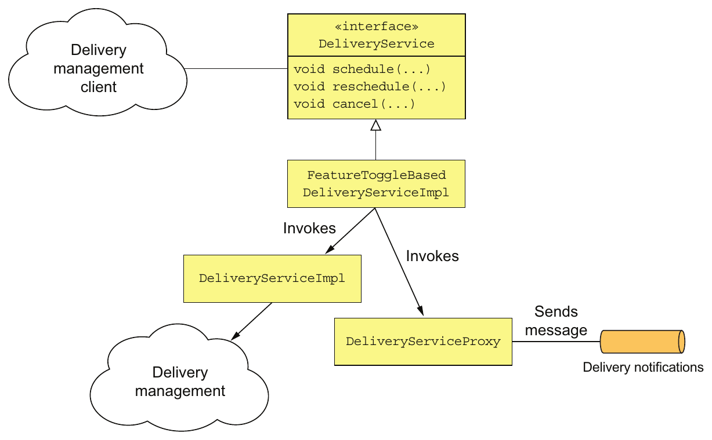

> **English:** Figure 13.23 The final step is to implement DeliveryService with a proxy class that sends messages to Delivery Service. A feature toggle controls whether the FTGO monolith uses the old implementation or the new Delivery Service.
>
> **Türkçe:** Şekil 13.23 Son adım, DeliveryService arayüzünü Delivery Service'e mesaj gönderen bir proxy sınıfıyla gerçekleştirmektir. Bir feature toggle, FTGO monolitinin eski gerçekleştirimi mi yoksa yeni Delivery Service'i mi kullanacağını denetler.

<!-- source-record: u13_0333 -->

> **English:** Using a feature toggle significantly reduces the risk of rolling out Delivery Service. We can deploy Delivery Service and test it. And then, once we’re sure it works, we can flip the toggle to route traffic to it. If we then discover that Delivery Service isn’t working as expected, we can switch back to the old implementation.
>
> **Türkçe:** Feature toggle kullanmak, Delivery Service'i kullanıma açmanın riskini önemli ölçüde azaltır. Delivery Service'i dağıtıp test edebiliriz. Ardından çalıştığından emin olduğumuzda anahtarı değiştirerek trafiği ona yönlendirebiliriz. Sonrasında Delivery Service'in beklendiği gibi çalışmadığını fark edersek eski gerçekleştirime geri dönebiliriz.

<!-- source-record: u13_0334 -->

### About feature toggles — Feature toggle'lar hakkında

<!-- source-record: u13_0335 -->

> **English:** Feature toggles, or feature flags, let you deploy code changes without necessarily releasing them to users. They also enable you to dynamically change the behavior of the application by deploying new code. This article by Martin Fowler provides an excellent overview of the topic: https://martinfowler.com/articles/feature-toggles.html.
>
> **Türkçe:** Feature toggle veya feature flag'ler, kod değişikliklerini kullanıcılara açmak zorunda kalmadan dağıtmanızı sağlar. Ayrıca yeni kod dağıtarak uygulamanın davranışını dinamik olarak değiştirmenize olanak tanır. Martin Fowler'ın şu makalesi konuya çok iyi bir genel bakış sunar: https://martinfowler.com/articles/feature-toggles.html.

> **Editör notu — feature toggle:** Kaynağın ikinci cümlesi “by deploying new code” der. Önceki paragrafta anlatılan dinamik anahtar, ilgili kod zaten dağıtıldıktan sonra **yeniden kod dağıtmadan** eski ve yeni davranış arasında geçiş yapmayı sağlar. Yeni davranışın kodunu ilk kez dağıtmak ile onu kullanıcıya açmak ayrı adımlardır; İngilizce cümle kaynak biçimiyle korunmuştur.

<!-- source-record: u13_0336 -->

> **English:** Once we’re sure that Delivery Service is working as expected, we can then remove the delivery management code from the monolith. Delivery Service and Delayed Order Service are examples of the services that the FTGO team will develop during their journey to the microservice architecture. Where they go next after implementing these services depends on the priorities of the business. One possible path is to extract Order History Service, described in chapter 7. Extracting this service partially eliminates the need for Delivery Service to replicate data back to the monolith.
>
> **Türkçe:** Delivery Service'in beklendiği gibi çalıştığından emin olduğumuzda teslimat yönetimi kodunu monolitten kaldırabiliriz. Delivery Service ve Delayed Order Service, FTGO ekibinin mikroservis mimarisine yolculuğunda geliştireceği servislere örnektir. Bu servislerden sonra hangi adımın atılacağı işletmenin önceliklerine bağlıdır. Olası bir yol, Bölüm 7'de anlatılan Order History Service'i çıkarmaktır. Bu servisin çıkarılması, Delivery Service'in monolite geri veri çoğaltma ihtiyacını kısmen ortadan kaldırır.

<!-- source-pages: 470 -->

<!-- source-record: u13_0337 -->

> **English:** After implementing Order History Service, the FTGO team can then extract the services in the order described in section 13.3.2: Order Service, Consumer Service, Kitchen Service, and so on. As the FTGO team extracts each service, the maintainability and testability of their application gradually improves, and their development velocity increases.
>
> **Türkçe:** Order History Service'i gerçekleştirdikten sonra FTGO ekibi, servisleri Kısım 13.3.2'de anlatılan sırayla çıkarabilir: Order Service, Consumer Service, Kitchen Service ve diğerleri. FTGO ekibi her servisi çıkardıkça uygulamanın bakım yapılabilirliği ve test edilebilirliği aşamalı olarak iyileşir, geliştirme hızı artar.

<!-- source-record: u13_0338 -->

## Summary — Bölüm özeti

<!-- source-record: u13_0339 -->

> **English:** • Before migrating to a microservice architecture, it’s important to be sure that your software delivery problems are a result of having outgrown your monolithic architecture. You might be able to accelerate delivery by improving your software development process.
>
> **Türkçe:** • Mikroservis mimarisine geçmeden önce yazılım teslimat sorunlarınızın, monolitik mimarinizin ihtiyaçlarınıza artık yetmemesinden kaynaklandığından emin olmanız önemlidir. Yazılım geliştirme sürecinizi iyileştirerek teslimatı hızlandırmanız mümkün olabilir.

<!-- source-record: u13_0340 -->

> **English:** • It’s important to migrate to microservices by incrementally developing a strangler application. A strangler application is a new application consisting of microservices that you build around the existing monolithic application. You should demonstrate value early and often in order to ensure that the business supports the migration effort.
>
> **Türkçe:** • Mikroservislere artımlı bir strangler application geliştirerek geçmek önemlidir. Strangler application, mevcut monolitik uygulamanın çevresinde oluşturduğunuz, mikroservislerden oluşan yeni bir uygulamadır. İş tarafının geçiş çalışmasını desteklemesini sağlamak için değeri erken ve sık göstermelisiniz.

<!-- source-record: u13_0341 -->

> **English:** • A great way to introduce microservices into your architecture is to implement new features as services. Doing so enables you to quickly and easily develop a feature using a modern technology and development process. It’s a good way to quickly demonstrate the value of migrating to microservices.
>
> **Türkçe:** • Mimarinizde mikroservis kullanmaya başlamanın çok iyi bir yolu, yeni özellikleri servis olarak geliştirmektir. Böylece modern teknoloji ve geliştirme süreciyle bir özelliği hızlı ve kolay biçimde oluşturabilirsiniz. Mikroservislere geçişin değerini hızla göstermenin iyi bir yoludur.

<!-- source-record: u13_0342 -->

> **English:** • One way to break up the monolith is to separate the presentation tier from the backend, which results in two smaller monoliths. Although it’s not a huge improvement, it does mean that you can deploy each monolith independently. This allows, for example, the UI team to iterate more easily on the UI design without impacting the backend.
>
> **Türkçe:** • Monoliti parçalamanın bir yolu, sunum katmanını backend'den ayırarak iki küçük monolit oluşturmaktır. Çok büyük bir iyileştirme olmasa da her monolitin bağımsız dağıtılabilmesini sağlar. Örneğin UI ekibi, backend'i etkilemeden kullanıcı arayüzü tasarımını daha kolay yineleyerek geliştirebilir.

<!-- source-record: u13_0343 -->

> **English:** • The main way to break up the monolith is by incrementally migrating functionality from the monolith into services. It’s important to focus on extracting the services that provide the most benefit. For example, you’ll accelerate development if you extract a service that implements functionality that’s being actively developed.
>
> **Türkçe:** • Monoliti parçalamanın temel yolu, işlevleri monolitten servislere artımlı olarak taşımaktır. En çok yarar sağlayan servisleri çıkarmaya odaklanmak önemlidir. Örneğin aktif olarak geliştirilen bir işlevi gerçekleştiren servisi çıkarırsanız geliştirmeyi hızlandırırsınız.

<!-- source-record: u13_0344 -->

> **English:** • Newly developed services almost always have to interact with the monolith. A service often needs to access a monolith’s data and invoke its functionality. The monolith sometimes needs to access a service’s data and invoke its functionality. To implement this collaboration, develop integration glue, which consists of inbound and outbound adapters in the monolith.
>
> **Türkçe:** • Yeni geliştirilen servislerin neredeyse her zaman monolitle etkileşmesi gerekir. Bir servis çoğu zaman monolitin verilerine erişmek ve işlevlerini çağırmak zorundadır. Monolitin de bazen servisin verilerine erişmesi ve işlevlerini çağırması gerekir. Bu iş birliğini gerçekleştirmek için monolitteki inbound ve outbound adaptörlerden oluşan bütünleştirme bağlantısını geliştirin.

<!-- source-record: u13_0345 -->

> **English:** • To prevent the monolith’s domain model from polluting the service’s domain model, the integration glue should use an anti-corruption layer, which is a layer of software that translates between domain models.
>
> **Türkçe:** • Monolitin domain model'inin servisin domain model'ini bozmasını önlemek için bütünleştirme bağlantısı, domain model'ler arasında dönüşüm yapan bir yazılım katmanı olan anti-corruption layer kullanmalıdır.

<!-- source-record: u13_0346 -->

> **English:** • One way to minimize the impact on the monolith of extracting a service is to replicate the data that was moved to the service back to the monolith’s database. Because the monolith’s schema is left unchanged, this eliminates the need to make potentially widespread changes to the monolith code base.
>
> **Türkçe:** • Servis çıkarmanın monolit üzerindeki etkisini en aza indirmenin bir yolu, servise taşınmış verileri monolitin veritabanına geri çoğaltmaktır. Monolitin şeması değişmeden kaldığı için monolitik kod tabanında olası geniş çaplı değişiklikler yapma ihtiyacı ortadan kalkar.

<!-- source-pages: 471 -->

<!-- source-record: u13_0347 -->

> **English:** • Developing a service often requires you to implement sagas that involve the monolith. But it can be challenging to implement a compensatable transaction that requires making widespread changes to the monolith. Consequently, you sometimes need to carefully sequence the extraction of services to avoid implementing compensatable transactions in the monolith.
>
> **Türkçe:** • Bir servis geliştirmek çoğu zaman monolitin katıldığı saga'lar gerçekleştirmenizi gerektirir. Ancak monolitte yaygın değişiklikler gerektiren telafi edilebilir bir transaction gerçekleştirmek zor olabilir. Bu nedenle bazen monolitte telafi edilebilir transaction'lar gerçekleştirmekten kaçınmak için servisleri çıkarma sırasını dikkatle belirlemelisiniz.

<!-- source-record: u13_0348 -->

> **English:** • When refactoring to a microservice architecture, you need to simultaneously support the monolithic application’s existing security mechanism, which is often based on an in-memory session, and the token-based security mechanism used by the services. Fortunately, a simple solution is to modify the monolith’s login handler to generate a cookie containing a security token, which is then forwarded to the services by the API gateway.
>
> **Türkçe:** • Mikroservis mimarisine yeniden düzenleme yaparken monolitik uygulamanın çoğunlukla bellek içi oturuma dayanan mevcut güvenlik mekanizmasını ve servislerin kullandığı token tabanlı güvenlik mekanizmasını aynı anda desteklemelisiniz. Neyse ki basit bir çözüm, monolitin oturum açma işleyicisini güvenlik token'ı içeren bir çerez üretecek şekilde değiştirmektir; API gateway bu çerezi daha sonra servislere iletir.
